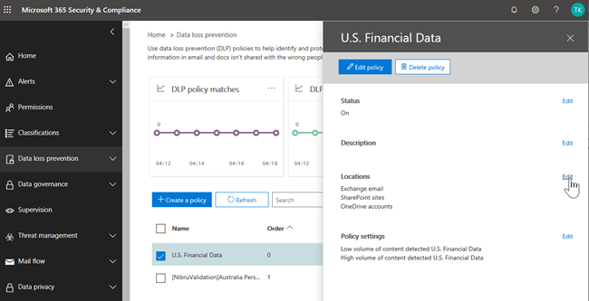
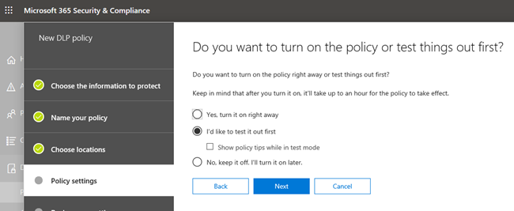
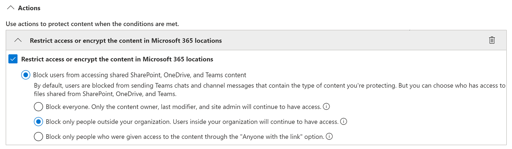

# Verhinderung von Datenverlust (DLP) und Microsoft Teams.Data loss prevention and Microsoft Teams

> [!NOTE]
> Vor kurzem wurden Microsoft Teams Chat- und Channel-Nachrichten für Benutzer, die für Office 365 E5/A5, Microsoft 365 E5/A5, Microsoft 365 Informationsschutz und -steuerung oder Office 365 Advanced Compliance lizenziert sind, hinzugefügt.Data loss prevention capabilities were recently added to Microsoft Teams chat and channel messages for users licensed for Office 365 E5/A5, Microsoft 365 E5/A5, Microsoft 365 Information Protection and Governance or Office 365 Advanced Compliance. Office 365 und Microsoft 365 E3 enthalten DLP-Schutz für SharePoint Online, OneDrive und Exchange Online.Office 365 and Microsoft 365 E3 include DLP protection for SharePoint Online, OneDrive, and Exchange Online. Dies schließt auch Dateien ein, die über Teams freigegeben werden, da Teams SharePoint Online und OneDrive verwendet, um Dateien freizugeben.This also includes files that are shared through Teams because Teams uses SharePoint Online and OneDrive to share files.
Die Unterstützung für den DLP-Schutz in Teams Chat erfordert E5.Support for DLP protection in Teams Chat requires E5.
Weitere Informationen zu den Lizenzierungsanforderungen finden Sie unter [Microsoft 365-Dienste auf Mandantenebene – Leitfaden zur Lizenzierung](/office365/servicedescriptions/microsoft-365-service-descriptions/microsoft-365-tenantlevel-services-licensing-guidance).To learn more about licensing requirements, see [Microsoft 365 Tenant-Level Services Licensing Guidance](/office365/servicedescriptions/microsoft-365-service-descriptions/microsoft-365-tenantlevel-services-licensing-guidance).

## Übersicht über DLP für Microsoft TeamsOverview of DLP for Microsoft Teams

Kürzlich wurden die Funktionen zur Verhinderung von [Datenverlust](dlp-learn-about-dlp.md) um Microsoft Teams Chat- und Kanalnachrichten, **einschließlich Nachrichten über den privaten Kanal**, erweitert.Recently, [data loss prevention](dlp-learn-about-dlp.md) capabilities were extended to include Microsoft Teams chat and channel messages, **including private channel messages**. 

> [!IMPORTANT]
> DLP gilt derzeit nur für die eigentlichen Nachrichten im Chat oder Kanalthread.DLP currently applies only to the actual messages in the chat or channel thread. Aktivitätsbenachrichtigungen - die eine kurze Nachrichtenvorschau enthalten und basierend auf den Benachrichtigungseinstellungen eines Benutzers angezeigt werden -- sind derzeit **nicht** in Teams DLP enthalten.Activity notifications -- which include a short message preview and appear based on a user's notification settings -- are **not** included in Teams DLP at this time. Alle vertraulichen Informationen in dem Teil der Nachricht, der in der Vorschau angezeigt wird, bleiben in der Benachrichtigung sichtbar, auch nachdem die DLP-Richtlinie angewendet und vertrauliche Informationen entfernt wurden, die die Nachricht selbst.Any sensitive information present in the part of the message that appears in the preview will remain visible in the notification even after the DLP policy has been applied and removed sensitive information the message itself.

Wenn Ihre Organisation über DLP verfügt, können Sie jetzt Richtlinien definieren, die verhindern, dass Personen vertrauliche Informationen in einem Microsoft Teams Kanal oder einer Chatsitzung freigeben.If your organization has DLP, you can now define policies that prevent people from sharing sensitive information in a Microsoft Teams channel or chat session. Hier sind einige Beispiele, wie dieser Schutz funktioniert:Here are some examples of how this protection works:

- **Beispiel 1: Schutz vertraulicher Informationen in Nachrichten**.**Example 1: Protecting sensitive information in messages**. Angenommen, jemand versucht, vertrauliche Informationen in einem Teams Chat oder Kanal mit Gästen (externen Benutzern) zu teilen.Suppose that someone attempts to share sensitive information in a Teams chat or channel with guests (external users). Wenn Sie eine DLP-Richtlinie definiert haben, um dies zu verhindern, werden Nachrichten mit vertraulichen Informationen, die an externe Benutzer gesendet werden, gelöscht.If you have a DLP policy defined to prevent this, messages with sensitive information that are sent to external users are deleted. Dies geschieht automatisch und innerhalb von Sekunden, je nachdem, wie Ihre DLP-Richtlinie konfiguriert ist.This happens automatically, and within seconds, according to how your DLP policy is configured.

    > [!NOTE]
    > DLP für Microsoft Teams blockiert vertrauliche Inhalte, wenn sie für Microsoft Teams Benutzer freigegeben werden, die über Folgendes verfügen:DLP for Microsoft Teams blocks sensitive content when shared with Microsoft Teams users who have: - [Gastzugang](/MicrosoftTeams/guest-access) in Teams und Kanälen; Oder- [guest access](/MicrosoftTeams/guest-access) in teams and channels; or - [externer Zugriff](/MicrosoftTeams/manage-external-access) in Meetings und Chat-Sitzungen.- [external access](/MicrosoftTeams/manage-external-access) in meetings and chat sessions. 
DLP für externe Chatsitzungen funktioniert nur, wenn sich sowohl der Absender als auch der Empfänger im Teams Nur-Modus befinden und [Microsoft Teams systemeigene Verbund](/microsoftteams/manage-external-access)verwendet.DLP for external chat sessions will only work if both the sender and the receiver are in Teams Only mode and using [Microsoft Teams native federation](/microsoftteams/manage-external-access). DLP für Teams blockiert keine Nachrichten im [Interop](/microsoftteams/teams-and-skypeforbusiness-coexistence-and-interoperability#interoperability-of-teams-and-skype-for-business) mit Skype for Business oder nicht nativen Verbundchatsitzungen.DLP for Teams does not block messages in [interop](/microsoftteams/teams-and-skypeforbusiness-coexistence-and-interoperability#interoperability-of-teams-and-skype-for-business) with Skype for Business or non-native federated chat sessions.

- **Beispiel 2: Schutz vertraulicher Informationen in Dokumenten**.**Example 2: Protecting sensitive information in documents**. Angenommen, jemand versucht, ein Dokument für Gäste in einem Microsoft Teams Kanal oder Chat freizugeben, und das Dokument enthält vertrauliche Informationen.Suppose that someone attempts to share a document with guests in a Microsoft Teams channel or chat, and the document contains sensitive information. Wenn Sie eine DLP-Richtlinie definiert haben, um dies zu verhindern, wird das Dokument für diese Benutzer nicht geöffnet.If you have a DLP policy defined to prevent this, the document won't open for those users. Beachten Sie, dass Ihre DLP-Richtlinie in diesem Fall SharePoint und OneDrive enthalten muss, damit der Schutz vorhanden ist.Note that in this case, your DLP policy must include SharePoint and OneDrive in order for protection to be in place. (Dies ist ein Beispiel für DLP für SharePoint, das in Microsoft Teams angezeigt wird und daher erfordert, dass Benutzer für Office 365 DLP lizenziert sind (in Office 365 E3 enthalten), benutzermüssen jedoch nicht für Office 365 Advanced Compliance lizenziert werden.)(This is an example of DLP for SharePoint that shows up in Microsoft Teams, and therefore requires that users are licensed for Office 365 DLP (included in Office 365 E3), but does not require users to be licensed for Office 365 Advanced Compliance.)

## Richtlinientipps helfen Benutzern bei der SchulungPolicy tips help educate users

Ähnlich wie DLP in [Exchange, Outlook, Outlook im Web,](data-loss-prevention-policies.md#policy-evaluation-in-exchange-online-outlook-and-outlook-on-the-web) [SharePoint Online, OneDrive for Business Websites](data-loss-prevention-policies.md#policy-evaluation-in-onedrive-for-business-and-sharepoint-online-sites)und Office [Desktopclients](data-loss-prevention-policies.md#policy-evaluation-in-the-office-desktop-programs)funktioniert, werden Richtlinientipps angezeigt, wenn eine Aktion mit einer DLP-Richtlinie in Konflikt steht.Similar to how DLP works in [Exchange, Outlook, Outlook on the web](data-loss-prevention-policies.md#policy-evaluation-in-exchange-online-outlook-and-outlook-on-the-web), [SharePoint Online, OneDrive for Business sites](data-loss-prevention-policies.md#policy-evaluation-in-onedrive-for-business-and-sharepoint-online-sites), and [Office desktop clients](data-loss-prevention-policies.md#policy-evaluation-in-the-office-desktop-programs), policy tips appear when an action conflicts with a DLP policy. Hier ist ein Beispiel für einen Richtlinientipp:Here's an example of a policy tip:

In diesem Fall hat der Absender versucht, eine Sozialversicherungsnummer in einem Microsoft Teams Kanal zu teilen.In this case, the sender attempted to share a social security number in a Microsoft Teams channel. Der Link **Was kann ich tun?** öffnet ein Dialogfeld, das Optionen für den Absender bereitstellt, um das Problem zu beheben.The **What can I do?** link opens a dialog box that provides options for the sender to resolve the issue. Beachten Sie, dass der Absender in diesem Fall die Richtlinie überschreiben oder einen Administrator benachrichtigen kann, sie zu überprüfen und zu beheben.Notice that in this case, the sender can opt to override the policy, or notify an admin to review and resolve it.

In Ihrer Organisation können Sie festlegen, dass Benutzer eine DLP-Richtlinie überschreiben können.In your organization, you can choose to allow users to override a DLP policy. Wenn Sie Ihre DLP-Richtlinien konfigurieren, können Sie die Standardrichtlinientipps verwenden oder Richtlinientipps für Ihre Organisation [anpassen.](#to-customize-policy-tips)And, when you configure your DLP policies, you can use the default policy tips, or [customize policy tips](#to-customize-policy-tips) for your organization.

Zurück zu unserem Beispiel, in dem ein Absender eine Sozialversicherungsnummer in einem Teams Kanal geteilt hat, sehen Sie hier Folgendes:Returning to our example, where a sender shared a social security number in a Teams channel, here's what the recipient saw:

> [!div class="mx-imgBorder"]
> 

### Anpassen von RichtlinientippsTo customize policy tips

Um diese Aufgabe ausführen zu können, muss Ihnen eine Rolle zugewiesen sein, die über Berechtigungen zum Bearbeiten von DLP-Richtlinien verfügt.To perform this task, you must be assigned a role that has permissions to edit DLP policies. Weitere Informationen hierzu finden Sie unter [Berechtigungen](data-loss-prevention-policies.md#permissions).To learn more, see [Permissions](data-loss-prevention-policies.md#permissions).

1. Wechseln Sie zum Security & Compliance Center ( [https://protection.office.com](https://protection.office.com) ) und melden Sie sich an.Go to the Security & Compliance Center ([https://protection.office.com](https://protection.office.com)) and sign in.

2. Wählen Sie **Data Loss Prevention**  >  **Policy**.Choose **Data loss prevention** > **Policy**.

3. Wählen Sie eine Richtlinie aus, und **wählen** Sie neben **Richtlinieneinstellungen** bearbeiten aus.Select a policy, and next to **Policy settings**, choose **Edit**.

4. Erstellen Sie entweder eine neue Regel, oder bearbeiten Sie eine vorhandene Regel für die Richtlinie.Either create a new rule, or edit an existing rule for the policy.

    > [!div class="mx-imgBorder"]
    > 

5. Wählen Sie auf der Registerkarte **Benutzerbenachrichtigungen** die Option **E-Mail-Text anpassen** und/oder **die Textoptionen für Richtlinientipps anpassen** aus.On the **User notifications** tab, select **Customize the email text** and/or **Customize the policy tip text** options.

    > [!div class="mx-imgBorder"]
    >    

6. Geben Sie den Text an, den Sie für E-Mail-Benachrichtigungen und/oder Richtlinientipps verwenden möchten, und wählen Sie dann **Speichern** aus.Specify the text you want to use for email notifications and/or policy tips, and then choose **Save**.

7. Wählen Sie auf der Registerkarte **Richtlinieneinstellungen** die Option **Speichern** aus.On the **Policy settings** tab, choose **Save**.

Erlauben Sie etwa einer Stunde, bis Ihre Änderungen ihren Weg durch Ihr Rechenzentrum finden und mit Benutzerkonten synchronisiert werden.Allow approximately one hour for your changes to work their way through your data center and sync to user accounts.
 <!-- why are these syncing to user accounts? -->

## Hinzufügen von Microsoft Teams als Speicherort zu bestehenden DLP-RichtlinienAdd Microsoft Teams as a location to existing DLP policies

Um diese Aufgabe ausführen zu können, muss Ihnen eine Rolle zugewiesen sein, die über Berechtigungen zum Bearbeiten von DLP-Richtlinien verfügt.To perform this task, you must be assigned a role that has permissions to edit DLP policies. Weitere Informationen hierzu finden Sie unter [Berechtigungen](data-loss-prevention-policies.md#permissions).To learn more, see [Permissions](data-loss-prevention-policies.md#permissions).

1. Wechseln Sie zum Security & Compliance Center ( [https://protection.office.com](https://protection.office.com) ) und melden Sie sich an.Go to the Security & Compliance Center ([https://protection.office.com](https://protection.office.com)) and sign in.

2. Wählen Sie **Data Loss Prevention**  >  **Policy**.Choose **Data loss prevention** > **Policy**.

3. Wählen Sie eine Richtlinie aus, und sehen Sie sich die Werte unter **Standorte** an.Select a policy, and look at the values under **Locations**. Wenn **Sie Teams Chat- und Kanalnachrichten** sehen, sind Sie alle gesetzt.If you see **Teams chat and channel messages**, you're all set. Wenn Sie dies nicht tun, klicken Sie auf **Bearbeiten**.If you don't, click **Edit**.

    > [!div class="mx-imgBorder"]
    > 

4. Aktivieren Sie in der Spalte **Status** die Richtlinie für **Teams Chat- und Kanalnachrichten**.In the **Status** column, turn the policy on for **Teams chat and channel messages**.

    > [!div class="mx-imgBorder"]
    > 

5. Behalten Sie auf der Registerkarte **Standorte auswählen** die Standardeinstellung aller Konten bei, oder wählen Sie Lassen Sie mich bestimmte **Standorte auswählen.**On the **Choose locations** tab, keep the default setting of all accounts, or select **Let me choose specific locations**. Sie können Folgendes angeben:You can specify:

    1. bis zu 1000 Einzelkonten zum Ein- oder Ausschließenup to 1000 individual accounts to include or exclude
    1. Verteilerlisten und Sicherheitsgruppen einzuschließen oder auszuschließen.distribution lists and security groups to include or exclude. 
    <!-- 1. the shared mailbox of a shared channel. **This is a public preview feature.**--> 
    
6. Wählen Sie dann **Weiter** aus.Then choose **Next**.

7. Klicken Sie auf **Speichern**.Click **Save**.

Erlauben Sie etwa einer Stunde, bis Ihre Änderungen ihren Weg durch Ihr Rechenzentrum finden und mit Benutzerkonten synchronisiert werden.Allow approximately one hour for your changes to work their way through your data center and sync to user accounts.
<!-- again, why user accounts? -->

## Definieren einer neuen DLP-Richtlinie für Microsoft TeamsDefine a new DLP policy for Microsoft Teams

Um diese Aufgabe ausführen zu können, muss Ihnen eine Rolle zugewiesen sein, die über Berechtigungen zum Bearbeiten von DLP-Richtlinien verfügt.To perform this task, you must be assigned a role that has permissions to edit DLP policies. Weitere Informationen hierzu finden Sie unter [Berechtigungen](data-loss-prevention-policies.md#permissions).To learn more, see [Permissions](data-loss-prevention-policies.md#permissions).

1. Wechseln Sie zum Security & Compliance Center ( [https://protection.office.com](https://protection.office.com) ) und melden Sie sich an.Go to the Security & Compliance Center ([https://protection.office.com](https://protection.office.com)) and sign in.

2. Wählen Sie Richtlinie zur Verhinderung von **Datenverlust**  >    >  **+ Erstellen einer Richtlinie**.Choose **Data loss prevention** > **Policy** > **+ Create a policy**.

3. Wählen Sie eine [Vorlage](data-loss-prevention-policies.md#dlp-policy-templates)aus, und wählen Sie dann **Weiter** aus.Choose a [template](data-loss-prevention-policies.md#dlp-policy-templates), and then choose **Next**.

    In unserem Beispiel haben wir die Vorlage für personenbezogene Daten daten in den USA ausgewählt.In our example, we chose the U.S. Personally Identifiable Information Data template.

    > [!div class="mx-imgBorder"]
    >  

4. Geben Sie auf der Registerkarte **"Name Ihrer Richtlinie"** einen Namen und eine Beschreibung für die Richtlinie an, und wählen Sie dann **Weiter** aus.On the **Name your policy** tab, specify a name and description for the policy, and then choose **Next**.

5. Behalten Sie auf der Registerkarte **Standorte auswählen** die Standardeinstellung aller Konten bei, oder wählen Sie Lassen Sie mich bestimmte **Standorte auswählen.**On the **Choose locations** tab, keep the default setting of all accounts, or select **Let me choose specific locations**. Sie können Folgendes angeben:You can specify:

    1. bis zu 1000 Einzelkonten zum Ein- oder Ausschließenup to 1000 individual accounts to include or exclude
    1. Verteilerlisten und Sicherheitsgruppen einzuschließen oder auszuschließen.distribution lists and security groups to include or exclude. **Dies ist eine öffentliche Vorschaufunktion.****This is a public preview feature.**
    <!-- 1. the shared mailbox of a shared channel. **This is a public preview feature.**-->  

    

    > [!NOTE]
    > Wenn Sie sicherstellen möchten, dass Dokumente, die vertrauliche Informationen enthalten, nicht in Teams unangemessen freigegeben werden, stellen Sie sicher, dass **SharePoint Websites** und **OneDrive Konten** aktiviert sind, zusammen mit **Teams Chat- und Kanalnachrichten**.If you want to make sure documents that contain sensitive information are not shared inappropriately in Teams, make sure **SharePoint sites** and **OneDrive accounts** are turned on, along with **Teams chat and channel messages**.

6. Auf der Registerkarte **Richtlinieneinstellungen** unter **Anpassen des Inhaltstyps,** den Sie schützen möchten, behalten Sie die einfachen Standardeinstellungen bei, oder wählen Sie Erweiterte Einstellungen **verwenden** aus, und wählen Sie dann **Weiter** aus.On the **Policy settings** tab, under **Customize the type of content you want to protect**, keep the default simple settings, or choose **Use advanced settings**, and then choose **Next**. Wenn Sie erweiterte Einstellungen auswählen, können Sie Regeln für Ihre Richtlinie erstellen oder bearbeiten.If you choose advanced settings, you can create or edit rules for your policy. (Um Hilfe hierzu zu erhalten, finden Sie unter [Einfache Einstellungen im Vergleich zu erweiterten Einstellungen](data-loss-prevention-policies.md#simple-settings-vs-advanced-settings).)(To get help with this, see [Simple settings vs. advanced settings](data-loss-prevention-policies.md#simple-settings-vs-advanced-settings).)

7.  Überprüfen Sie auf der Registerkarte **Richtlinieneinstellungen** unter **Was möchten Sie tun, wenn wir vertrauliche Informationen erkennen?,** die Einstellungen überprüfen.On the **Policy settings** tab, under **What do you want to do if we detect sensitive info?**, review the settings. (Hier können Sie [Standardrichtlinientipps und E-Mail-Benachrichtigungen](use-notifications-and-policy-tips.md)beibehalten oder anpassen.)(Here's where you can choose to keep default [policy tips and email notifications](use-notifications-and-policy-tips.md), or customize them.)

    > [!div class="mx-imgBorder"]
    > 

    Wenn Sie mit der Überprüfung oder Bearbeitung der Einstellungen fertig sind, wählen Sie **Weiter** aus.When you're finished reviewing or editing settings, choose **Next**.

8. Wählen Sie auf der Registerkarte **Richtlinieneinstellungen** unter Aktivieren **der Richtlinie oder zuerst testen?**, wählen Sie aus, ob die Richtlinie aktiviert werden soll, testen Sie sie [zuerst](dlp-overview-plan-for-dlp.md#policy-deployment), oder halten Sie sie für den Moment deaktiviert, und wählen Sie dann **Weiter** aus.On the **Policy settings** tab, under **Do you want to turn on the policy or test things out first?**, choose whether to turn the policy on, [test it first](dlp-overview-plan-for-dlp.md#policy-deployment), or keep it turned off for now, and then choose **Next**.

    > [!div class="mx-imgBorder"]
    > 

9. Überprüfen Sie auf der Registerkarte **Überprüfen Ihrer Einstellungen** die Einstellungen für Ihre neue Richtlinie.On the **Review your settings** tab, review the settings for your new policy. Wählen Sie **Bearbeiten** aus, um Änderungen vorzunehmen.Choose **Edit** to make changes. Wenn Sie fertig sind, wählen Sie **Erstellen** aus .When you're finished, choose **Create**.

Lassen Sie sich etwa eine Stunde Zeit, damit ihre neue Richtlinie ihren Weg durch Ihr Rechenzentrum durchläuft und mit Benutzerkonten synchronisiert wird.Allow approximately one hour for your new policy to work its way through your data center and sync to user accounts.

## Verhindern des externen Zugriffs auf vertrauliche DokumentePrevent external access to sensitive documents

Um sicherzustellen, dass SharePoint Dokumente, die vertrauliche Informationen enthalten, von externen Gästen aus SharePoint oder Teams standardmäßig nicht abgerufen werden können, wählen Sie Folgendes aus:To ensure that SharePoint documents that contain sensitive information cannot be accessed by external guests either from SharePoint or Teams by default, select the following:

- Sie können sicherstellen, dass Dokumente geschützt sind, bis DLP sie scannt und als sicher zu teilen markiert, indem [Sie neue Dateien standardmäßig als vertraulich markieren.](/sharepoint/sensitive-by-default)You can ensure that documents are protected until DLP scans and marks them as safe to share by [marking new files as sensitive by default](/sharepoint/sensitive-by-default).

- Empfohlene DLP-RichtlinienstrukturRecommended DLP policy structure

    - **Bedingungen:****Conditions**
        - Der Inhalt enthält einen dieser vertraulichen Informationstypen: [Wählen Sie alle, die angewendet wird]Content contains any of these sensitive information types: [Select all that applies]
        
        - Inhalte werden von Microsoft 365 mit Personen außerhalb meiner Organisation geteiltContent is shared from Microsoft 365 with people outside my organization
        
          > [!div class="mx-imgBorder"]
          > 

    - **Aktionen****Actions**
        - Zugriff auf den Inhalt für externe Benutzer einschränkenRestrict access to the content for external users
        
        - Benutzer per E-Mail und mit Richtlinientipps benachrichtigenNotify users with email and policy tips
        
        - Vorfallberichte an den Administrator sendenSend incident reports to the Administrator
        
        > [!div class="mx-imgBorder"]
        > 

DLP-Richtlinie in Aktion, wenn versucht wird, ein Dokument in SharePoint freizugeben, das vertrauliche Informationen für einen externen Gast enthält:DLP policy in action when attempting to share a document in SharePoint that contains sensitive information with an external guest:

> [!div class="mx-imgBorder"]
> 

DLP-Richtlinie in Aktion, wenn Gast versucht, ein Dokument in Teams mit block external zu öffnen:DLP policy in action when guest attempts to open a document in Teams with block external:

> [!div class="mx-imgBorder"]
> 

## Verwandte ArtikelRelated articles

[Erstellen, Testen und Optimieren einer DLP-RichtlinieCreate, test, and tune a DLP policy](create-test-tune-dlp-policy.md)

[Senden von E-Mail-Benachrichtigungen und Anzeigen von Richtlinientipps für DLP-RichtlinienSend email notifications and show policy tips for DLP policies](use-notifications-and-policy-tips.md)
