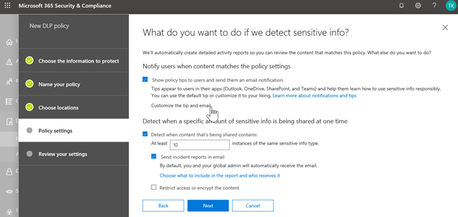

# Verhinderung von Datenverlust (DLP) und Microsoft Teams.

> [!NOTE]
> Vor kurzem wurden Microsoft Teams Chat- und Channel-Nachrichten für Benutzer, die für Office 365 E5/A5, Microsoft 365 E5/A5, Microsoft 365 Informationsschutz und -steuerung oder Office 365 Advanced Compliance lizenziert sind, hinzugefügt. Office 365 und Microsoft 365 E3 enthalten DLP-Schutz für SharePoint Online, OneDrive und Exchange Online. Dies schließt auch Dateien ein, die über Teams freigegeben werden, da Teams SharePoint Online und OneDrive verwendet, um Dateien freizugeben.
Die Unterstützung für den DLP-Schutz in Teams Chat erfordert E5.
Weitere Informationen zu den Lizenzierungsanforderungen finden Sie unter [Microsoft 365-Dienste auf Mandantenebene – Leitfaden zur Lizenzierung](/office365/servicedescriptions/microsoft-365-service-descriptions/microsoft-365-tenantlevel-services-licensing-guidance).

## Übersicht über DLP für Microsoft Teams

Kürzlich wurden die Funktionen zur Verhinderung von [Datenverlust](dlp-learn-about-dlp.md) um Microsoft Teams Chat- und Kanalnachrichten, **einschließlich Nachrichten über den privaten Kanal**, erweitert. 

> [!IMPORTANT]
> DLP gilt derzeit nur für die eigentlichen Nachrichten im Chat oder Kanalthread. Aktivitätsbenachrichtigungen - die eine kurze Nachrichtenvorschau enthalten und basierend auf den Benachrichtigungseinstellungen eines Benutzers angezeigt werden -- sind derzeit **nicht** in Teams DLP enthalten. Alle vertraulichen Informationen in dem Teil der Nachricht, der in der Vorschau angezeigt wird, bleiben in der Benachrichtigung sichtbar, auch nachdem die DLP-Richtlinie angewendet und vertrauliche Informationen entfernt wurden, die die Nachricht selbst.

Wenn Ihre Organisation über DLP verfügt, können Sie jetzt Richtlinien definieren, die verhindern, dass Personen vertrauliche Informationen in einem Microsoft Teams Kanal oder einer Chatsitzung freigeben. Hier sind einige Beispiele, wie dieser Schutz funktioniert:

- **Beispiel 1: Schutz vertraulicher Informationen in Nachrichten**. Angenommen, jemand versucht, vertrauliche Informationen in einem Teams Chat oder Kanal mit Gästen (externen Benutzern) zu teilen. Wenn Sie eine DLP-Richtlinie definiert haben, um dies zu verhindern, werden Nachrichten mit vertraulichen Informationen, die an externe Benutzer gesendet werden, gelöscht. Dies geschieht automatisch und innerhalb von Sekunden, je nachdem, wie Ihre DLP-Richtlinie konfiguriert ist.

    > [!NOTE]
    > DLP für Microsoft Teams blockiert vertrauliche Inhalte, wenn sie für Microsoft Teams Benutzer freigegeben werden, die über Folgendes verfügen: - [Gastzugang](/MicrosoftTeams/guest-access) in Teams und Kanälen; Oder - [externer Zugriff](/MicrosoftTeams/manage-external-access) in Meetings und Chat-Sitzungen. 
DLP für externe Chatsitzungen funktioniert nur, wenn sich sowohl der Absender als auch der Empfänger im Teams Nur-Modus befinden und [Microsoft Teams systemeigene Verbund](/microsoftteams/manage-external-access)verwendet. DLP für Teams blockiert keine Nachrichten im [Interop](/microsoftteams/teams-and-skypeforbusiness-coexistence-and-interoperability#interoperability-of-teams-and-skype-for-business) mit Skype for Business oder nicht nativen Verbundchatsitzungen.

- **Beispiel 2: Schutz vertraulicher Informationen in Dokumenten**. Angenommen, jemand versucht, ein Dokument für Gäste in einem Microsoft Teams Kanal oder Chat freizugeben, und das Dokument enthält vertrauliche Informationen. Wenn Sie eine DLP-Richtlinie definiert haben, um dies zu verhindern, wird das Dokument für diese Benutzer nicht geöffnet. Beachten Sie, dass Ihre DLP-Richtlinie in diesem Fall SharePoint und OneDrive enthalten muss, damit der Schutz vorhanden ist. (Dies ist ein Beispiel für DLP für SharePoint, das in Microsoft Teams angezeigt wird und daher erfordert, dass Benutzer für Office 365 DLP lizenziert sind (in Office 365 E3 enthalten), benutzermüssen jedoch nicht für Office 365 Advanced Compliance lizenziert werden.)

## Richtlinientipps helfen Benutzern bei der Schulung

Ähnlich wie DLP in [Exchange, Outlook, Outlook im Web,](data-loss-prevention-policies.md#policy-evaluation-in-exchange-online-outlook-and-outlook-on-the-web) [SharePoint Online, OneDrive for Business Websites](data-loss-prevention-policies.md#policy-evaluation-in-onedrive-for-business-and-sharepoint-online-sites)und Office [Desktopclients](data-loss-prevention-policies.md#policy-evaluation-in-the-office-desktop-programs)funktioniert, werden Richtlinientipps angezeigt, wenn eine Aktion mit einer DLP-Richtlinie in Konflikt steht. Hier ist ein Beispiel für einen Richtlinientipp:

In diesem Fall hat der Absender versucht, eine Sozialversicherungsnummer in einem Microsoft Teams Kanal zu teilen. Der Link **Was kann ich tun?** öffnet ein Dialogfeld, das Optionen für den Absender bereitstellt, um das Problem zu beheben. Beachten Sie, dass der Absender in diesem Fall die Richtlinie überschreiben oder einen Administrator benachrichtigen kann, sie zu überprüfen und zu beheben.

In Ihrer Organisation können Sie festlegen, dass Benutzer eine DLP-Richtlinie überschreiben können. Wenn Sie Ihre DLP-Richtlinien konfigurieren, können Sie die Standardrichtlinientipps verwenden oder Richtlinientipps für Ihre Organisation [anpassen.](#to-customize-policy-tips)

Zurück zu unserem Beispiel, in dem ein Absender eine Sozialversicherungsnummer in einem Teams Kanal geteilt hat, sehen Sie hier Folgendes:

> [!div class="mx-imgBorder"]
> 

### Anpassen von Richtlinientipps

Um diese Aufgabe ausführen zu können, muss Ihnen eine Rolle zugewiesen sein, die über Berechtigungen zum Bearbeiten von DLP-Richtlinien verfügt. Weitere Informationen hierzu finden Sie unter [Berechtigungen](data-loss-prevention-policies.md#permissions).

1. Wechseln Sie zum Security & Compliance Center ( [https://protection.office.com](https://protection.office.com) ) und melden Sie sich an.

2. Wählen Sie **Data Loss Prevention**  >  **Policy**.

3. Wählen Sie eine Richtlinie aus, und **wählen** Sie neben **Richtlinieneinstellungen** bearbeiten aus.

4. Erstellen Sie entweder eine neue Regel, oder bearbeiten Sie eine vorhandene Regel für die Richtlinie.

    > [!div class="mx-imgBorder"]
    > 

5. Wählen Sie auf der Registerkarte **Benutzerbenachrichtigungen** die Option **E-Mail-Text anpassen** und/oder **die Textoptionen für Richtlinientipps anpassen** aus.

    > [!div class="mx-imgBorder"]
    >    

6. Geben Sie den Text an, den Sie für E-Mail-Benachrichtigungen und/oder Richtlinientipps verwenden möchten, und wählen Sie dann **Speichern** aus.

7. Wählen Sie auf der Registerkarte **Richtlinieneinstellungen** die Option **Speichern** aus.

Erlauben Sie etwa einer Stunde, bis Ihre Änderungen ihren Weg durch Ihr Rechenzentrum finden und mit Benutzerkonten synchronisiert werden.
 <!-- why are these syncing to user accounts? -->

## Hinzufügen von Microsoft Teams als Speicherort zu bestehenden DLP-Richtlinien

Um diese Aufgabe ausführen zu können, muss Ihnen eine Rolle zugewiesen sein, die über Berechtigungen zum Bearbeiten von DLP-Richtlinien verfügt. Weitere Informationen hierzu finden Sie unter [Berechtigungen](data-loss-prevention-policies.md#permissions).

1. Wechseln Sie zum Security & Compliance Center ( [https://protection.office.com](https://protection.office.com) ) und melden Sie sich an.

2. Wählen Sie **Data Loss Prevention**  >  **Policy**.

3. Wählen Sie eine Richtlinie aus, und sehen Sie sich die Werte unter **Standorte** an. Wenn **Sie Teams Chat- und Kanalnachrichten** sehen, sind Sie alle gesetzt. Wenn Sie dies nicht tun, klicken Sie auf **Bearbeiten**.

    > [!div class="mx-imgBorder"]
    > 

4. Aktivieren Sie in der Spalte **Status** die Richtlinie für **Teams Chat- und Kanalnachrichten**.

    > [!div class="mx-imgBorder"]
    > 

5. Behalten Sie auf der Registerkarte **Standorte auswählen** die Standardeinstellung aller Konten bei, oder wählen Sie Lassen Sie mich bestimmte **Standorte auswählen.** Sie können Folgendes angeben:

    1. bis zu 1000 Einzelkonten zum Ein- oder Ausschließen
    1. Verteilerlisten und Sicherheitsgruppen einzuschließen oder auszuschließen. 
    <!-- 1. the shared mailbox of a shared channel. **This is a public preview feature.**--> 
    
6. Wählen Sie dann **Weiter** aus.

7. Klicken Sie auf **Speichern**.

Erlauben Sie etwa einer Stunde, bis Ihre Änderungen ihren Weg durch Ihr Rechenzentrum finden und mit Benutzerkonten synchronisiert werden.
<!-- again, why user accounts? -->

## Definieren einer neuen DLP-Richtlinie für Microsoft Teams

Um diese Aufgabe ausführen zu können, muss Ihnen eine Rolle zugewiesen sein, die über Berechtigungen zum Bearbeiten von DLP-Richtlinien verfügt. Weitere Informationen hierzu finden Sie unter [Berechtigungen](data-loss-prevention-policies.md#permissions).

1. Wechseln Sie zum Security & Compliance Center ( [https://protection.office.com](https://protection.office.com) ) und melden Sie sich an.

2. Wählen Sie Richtlinie zur Verhinderung von **Datenverlust**  >    >  **+ Erstellen einer Richtlinie**.

3. Wählen Sie eine [Vorlage](data-loss-prevention-policies.md#dlp-policy-templates)aus, und wählen Sie dann **Weiter** aus.

    In unserem Beispiel haben wir die Vorlage für personenbezogene Daten daten in den USA ausgewählt.

    > [!div class="mx-imgBorder"]
    >  

4. Geben Sie auf der Registerkarte **"Name Ihrer Richtlinie"** einen Namen und eine Beschreibung für die Richtlinie an, und wählen Sie dann **Weiter** aus.

5. Behalten Sie auf der Registerkarte **Standorte auswählen** die Standardeinstellung aller Konten bei, oder wählen Sie Lassen Sie mich bestimmte **Standorte auswählen.** Sie können Folgendes angeben:

    1. bis zu 1000 Einzelkonten zum Ein- oder Ausschließen
    1. Verteilerlisten und Sicherheitsgruppen einzuschließen oder auszuschließen. **Dies ist eine öffentliche Vorschaufunktion.**
    <!-- 1. the shared mailbox of a shared channel. **This is a public preview feature.**-->  

    

    > [!NOTE]
    > Wenn Sie sicherstellen möchten, dass Dokumente, die vertrauliche Informationen enthalten, nicht in Teams unangemessen freigegeben werden, stellen Sie sicher, dass **SharePoint Websites** und **OneDrive Konten** aktiviert sind, zusammen mit **Teams Chat- und Kanalnachrichten**.

6. Auf der Registerkarte **Richtlinieneinstellungen** unter **Anpassen des Inhaltstyps,** den Sie schützen möchten, behalten Sie die einfachen Standardeinstellungen bei, oder wählen Sie Erweiterte Einstellungen **verwenden** aus, und wählen Sie dann **Weiter** aus. Wenn Sie erweiterte Einstellungen auswählen, können Sie Regeln für Ihre Richtlinie erstellen oder bearbeiten. (Um Hilfe hierzu zu erhalten, finden Sie unter [Einfache Einstellungen im Vergleich zu erweiterten Einstellungen](data-loss-prevention-policies.md#simple-settings-vs-advanced-settings).)

7.  Überprüfen Sie auf der Registerkarte **Richtlinieneinstellungen** unter **Was möchten Sie tun, wenn wir vertrauliche Informationen erkennen?,** die Einstellungen überprüfen. (Hier können Sie [Standardrichtlinientipps und E-Mail-Benachrichtigungen](use-notifications-and-policy-tips.md)beibehalten oder anpassen.)

    > [!div class="mx-imgBorder"]
    > 

    Wenn Sie mit der Überprüfung oder Bearbeitung der Einstellungen fertig sind, wählen Sie **Weiter** aus.

8. Wählen Sie auf der Registerkarte **Richtlinieneinstellungen** unter Aktivieren **der Richtlinie oder zuerst testen?**, wählen Sie aus, ob die Richtlinie aktiviert werden soll, testen Sie sie [zuerst](dlp-overview-plan-for-dlp.md#policy-deployment), oder halten Sie sie für den Moment deaktiviert, und wählen Sie dann **Weiter** aus.

    > [!div class="mx-imgBorder"]
    > 

9. Überprüfen Sie auf der Registerkarte **Überprüfen Ihrer Einstellungen** die Einstellungen für Ihre neue Richtlinie. Wählen Sie **Bearbeiten** aus, um Änderungen vorzunehmen. Wenn Sie fertig sind, wählen Sie **Erstellen** aus .

Lassen Sie sich etwa eine Stunde Zeit, damit ihre neue Richtlinie ihren Weg durch Ihr Rechenzentrum durchläuft und mit Benutzerkonten synchronisiert wird.

## Verhindern des externen Zugriffs auf vertrauliche Dokumente

Um sicherzustellen, dass SharePoint Dokumente, die vertrauliche Informationen enthalten, von externen Gästen aus SharePoint oder Teams standardmäßig nicht abgerufen werden können, wählen Sie Folgendes aus:

- Sie können sicherstellen, dass Dokumente geschützt sind, bis DLP sie scannt und als sicher zu teilen markiert, indem [Sie neue Dateien standardmäßig als vertraulich markieren.](/sharepoint/sensitive-by-default)

- Empfohlene DLP-Richtlinienstruktur

    - **Bedingungen:**
        - Der Inhalt enthält einen dieser vertraulichen Informationstypen: [Wählen Sie alle, die angewendet wird]
        
        - Inhalte werden von Microsoft 365 mit Personen außerhalb meiner Organisation geteilt
        
          > [!div class="mx-imgBorder"]
          > 

    - **Aktionen**
        - Zugriff auf den Inhalt für externe Benutzer einschränken
        
        - Benutzer per E-Mail und mit Richtlinientipps benachrichtigen
        
        - Vorfallberichte an den Administrator senden
        
        > [!div class="mx-imgBorder"]
        > 

DLP-Richtlinie in Aktion, wenn versucht wird, ein Dokument in SharePoint freizugeben, das vertrauliche Informationen für einen externen Gast enthält:

> [!div class="mx-imgBorder"]
> 

DLP-Richtlinie in Aktion, wenn Gast versucht, ein Dokument in Teams mit block external zu öffnen:

> [!div class="mx-imgBorder"]
> 

## Verwandte Artikel

[Erstellen, Testen und Optimieren einer DLP-Richtlinie](create-test-tune-dlp-policy.md)

[Senden von E-Mail-Benachrichtigungen und Anzeigen von Richtlinientipps für DLP-Richtlinien](use-notifications-and-policy-tips.md)
