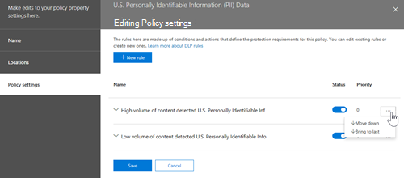

# Planen der Verhinderung von Datenverlust (Data Loss Prevention, DLP)Plan for data loss prevention (DLP)

Jede Organisation plant und implementiert die Verhinderung von Datenverlust (Data Loss Prevention, DLP) anders, da die Geschäftlichen Anforderungen, Ziele, Ressourcen und Situationen jeder Organisation für sie einzigartig sind.Every organization will plan for and implement data loss prevention (DLP) differently, because every organization's business needs, goals, resources, and situation are unique to them. Es gibt jedoch Elemente, die allen erfolgreichen DLP-Implementierungen gemeinsam sind.However, there are elements that are common to all successful DLP implementations. In diesem Artikel werden die bewährten Methoden beschrieben, die von Organisationen bei der Planung von DLP verwendet werden.This article presents the best practices that are used by organizations in their DLP planning.

## Mehrere AusgangspunkteMultiple starting points

Viele Organisationen entscheiden sich für die Implementierung von DLP, um verschiedene staatliche oder Branchenbestimmungen einzuhalten.Many organizations choose to implement DLP to comply with various governmental or industry regulations. Beispielsweise die Datenschutz-Grundverordnung (DSGVO) der Europäischen Union oder das Health Insurance Portability and Accountability Act (HIPAA) oder das California Consumer Privacy Act (CCPA).For example, the European Union's General Data Protection Regulation (GDPR), or the Health Insurance Portability and Accountability Act (HIPAA), or the California Consumer Privacy Act (CCPA). Sie implementieren auch die Verhinderung von Datenverlust, um ihr geistiges Eigentum zu schützen.They also implement data loss prevention to protect their intellectual property. Der Startort und das endgültige Ziel der DLP-Reise variieren jedoch.But the starting place and ultimate destination in the DLP journey vary. 

Organisationen können ihre DLP-Reise starten:Organizations can start their DLP journey:

- von einem Plattformfokus aus, wie informationen in Chat- und Kanalnachrichten oder auf Teams oder auf Windows 10 schützen möchtenfrom a platform focus, like wanting to protect information in Teams Chat and Channel messages or on Windows 10 devices
- Wissen, welche vertraulichen Informationen sie schützen möchten, wie Gesundheitsdatensätze, und direkt zur Definition von Richtlinien zum Schutzknowing what sensitive information they want to prioritize protecting, like health care records, and going straight to defining policies to protect it
- ohne zu wissen, was ihre vertraulichen Informationen sind, wo sie sich befindet und wer was damit macht, damit sie mit der Ermittlung und Kategorisierung beginnen und einen methodischen Ansatz wählenwithout knowing what their sensitive information is, where it is, and who is doing what with it so they start with discovery and categorization and take a more methodical approach
- ohne zu wissen, was ihre vertraulichen Informationen sind oder wo sie sich befindet, oder wer was damit macht, aber sie werden direkt zur Definition von Richtlinien wechseln und diese Ergebnisse als Ausgangspunkt verwenden und dann ihre Richtlinien von dort aus verfeinern.without knowing what their sensitive information is, or where it is, or who is doing what with it, but they will move straight to defining policies and use those outcomes as a starting place and then refine their policies from there
- Wissen, dass sie den vollständigen Informationsschutzstapel Microsoft 365 implementieren müssen und daher einen langfristigen, methodischen Ansatz verwenden möchtenknowing that they need to implement the full Microsoft 365 Information Protection stack and so intend to take a longer term, methodical approach

Dies sind nur einige Beispiele dafür, wie Kunden mit DLP beginnen können, und es spielt keine Rolle, wo Sie beginnen, Microsoft 365 DLP ist flexibel genug, um verschiedene Arten von Informationsschutz-Reisen vom Anfang bis zu einer vollständig realisierten Strategie zur Verhinderung von Datenverlust zu unterstützen.These are just some examples of how customers can approach DLP and it doesn't matter where you start from, Microsoft 365 DLP is flexible enough to accommodate various types of information protection journeys from start to a fully realized data loss prevention strategy. 

## Übersicht über den PlanungsprozessOverview of planning process

Im [Thema Informationen zur Verhinderung von Datenverlust](dlp-learn-about-dlp.md#learn-about-data-loss-prevention) werden die drei verschiedenen Aspekte des [DLP-Planungsprozesses präsentiert.](dlp-learn-about-dlp.md#plan-for-dlp)The [Learn about data loss prevention](dlp-learn-about-dlp.md#learn-about-data-loss-prevention) introduces the three different aspect of the [DLP planning process](dlp-learn-about-dlp.md#plan-for-dlp). Wir gehen hier ausführlicher auf die Elemente ein, die allen DLP-Plänen gemeinsam sind.We'll go into more detail here on the elements that are common to all DLP plans.

### Bestimmen der BeteiligtenIdentify stakeholders

Bei der Implementierung können DLP-Richtlinien auf große Teile Ihrer Organisation angewendet werden.When implemented, DLP policies can be applied across large portions of your organization. It can't develop a broad ranging plan on their own without negative consequences.IT can't develop a broad ranging plan on their own without negative consequences. Sie müssen die Beteiligten identifizieren, die:You need to identify the stakeholders who can:

- Beschreiben der Vorschriften, Gesetze und Branchenstandards, denen Ihre Organisation unterliegtdescribe the regulations, laws and industry standards your organization is subject to
- die Kategorien vertraulicher Elemente, die geschützt werden sollenthe categories of sensitive items to be protected
- die Geschäftsprozesse, in der sie verwendet werdenthe business processes they are used in
- das riskante Verhalten, das eingeschränkt werden solltethe risky behavior that should be limited
- Priorisieren, welche Daten zuerst geschützt werden sollten, basierend auf der Vertraulichkeit der Elemente und des risikobezogenen Risikosprioritize which data should be protected first based on the sensitivity of the items and risk involved
- Gliederung des Prozesses zur Überprüfung und Behebung von DLP-Richtlinienbereinigungsereignisoutline the DLP policy match event review and remediation process 
 
Im Allgemeinen sind diese Anforderungen in der Regel 85 % gesetzlicher Und Complianceschutz und 15 % Schutz geistigen Eigentums.In general these needs tend to be 85% regulatory and compliance protection, and 15% intellectual property protection. Im Folgenden finden Sie einige Vorschläge zu Rollen, die Sie in Ihren Planungsprozess mit einplanen können:Here are some suggestions on roles to include in your planning process:

- Aufsichts- und Compliance-BeauftragteRegulatory and compliance officers
- Chief Risk OfficerChief risk officer
- RechtsbeauftragteLegal officers
- Security and Compliance OfficersSecurity and compliance officers
- Geschäftsbesitzer für die DatenelementeBusiness owners for the data items
- GeschäftsbenutzerBusiness users
- ITIT

### Beschreiben der Zu schützende Kategorien vertraulicher InformationenDescribe the categories of sensitive information to protect

Die Beteiligten beschreiben dann die Kategorien vertraulicher Informationen, die geschützt werden sollen, und den Geschäftsprozess, in dem sie verwendet werden.The stakeholders then describe the categories of sensitive information to be protected and the business process that they're used in. Beispielsweise definiert Microsoft 365 DLP die folgenden Kategorien:For example, Microsoft 365 DLP defines these categories:

- FinanzwesenFinancial 
- Medizinische und GesundheitsinformationenMedical and health information
- DatenschutzPrivacy
- BenutzerdefiniertCustom

Die Beteiligten identifizieren die vertraulichen Informationen möglicherweise als "Wir sind datenverarbeiter, daher müssen wir Datenschutzbestimmungen für betroffene Informationen und Finanzinformationen implementieren".The stakeholders might identify the sensitive information as "We are a data processor, so we have to implement privacy protections on data subject information and financial information".

 
  <!-- The business process is important as it informs the ‘data at rest’, ‘data in transit’, ‘data in use’ aspect of DLP planning and who should be sharing the items and who should not.-->

### Festlegen von Zielen und StrategieSet goals and strategy

Sobald Sie Ihre Beteiligten identifiziert haben und wissen, welche vertraulichen Informationen geschützt werden müssen und wo sie verwendet werden, können die Beteiligten ihre Schutzziele festlegen, und die IT kann einen Implementierungsplan entwickeln.Once you have identified your stakeholders and you know which sensitive information needs protection and where it's used, the stakeholders can set their protection goals and IT can develop an implementation plan. 

 <!--
### Discovery
 for the locations (DLP workloads) of these types of items.  (mapping DLP locations and data at rest, data in transit, data in use)

### IT can start coding test policies
start small and always in test mode. Note that DLP policies can feed into insider risk.

### Business process owners help with tuning
 false positive/false negative results and fitting DLP into their business processes.

-->

### Festlegen des ImplementierungsplansSet implementation plan

Ihr Implementierungsplan sollte Folgendes umfassen:Your implementation plan should include:

- Zuordnen des Anfangszustands und des gewünschten Endzustands sowie der Schritte, um von einem zum anderen zu kommenMapping out your starting state and desired end state and the steps to get from one to the other
- Wie Sie die Ermittlung vertraulicher Elemente adressenhow you will address discovery of sensitive items
- Richtlinienplanung und die Reihenfolge, in der sie implementiert werdenpolicy planning and the order that they will be implemented
- Wie Sie alle Voraussetzungen erfüllenhow you will address any prerequisites
- Planen, wie Richtlinien zuerst getestet werden, bevor sie zur Erzwingung überplanning on how policies will first be tested before moving to enforcement
- Wie Sie Ihre Endbenutzer schulenhow you will train your end users
- Testen und Optimieren Ihrer Richtlinienhow you will test and tune your policies
- Wie Sie Ihre Strategie zur Verhinderung von Datenverlust basierend auf geänderten behördlichen, rechtlichen, Branchenstandards oder schutz vor geistigem Eigentum und geschäftsbezogenen Anforderungen überprüfen und aktualisierenhow you will review and update your data loss prevention strategy based on changing regulatory, legal, industry standard or intellectual property protection and business needs

#### Pfad vom Anfang zum gewünschten Endzustand zuordnungMap out path from start to desired end state

Dokumentieren, wie Ihre Organisation vom Startstatus in den gewünschten Endzustand kommt, ist für die Kommunikation mit Denkbeteiligten und das Festlegen des Projektumfangs unerlässlich.Documenting how your organization is going to get from its starting state to the desired end state is essential to communicating with your stakeholders and setting the project scope. Im Folgenden finden Sie eine Reihe von Schritten, die häufig zum Bereitstellen von DLP verwendet werden.Here are a set of steps that are commonly used to deploy DLP. Sie möchten mehr Details als dies, aber Sie können dies verwenden, um Ihren DLP-Einführungspfad zu framen.You'll want more detail than this, but you can use this to frame your DLP adoption path.

#### Ermittlung vertraulicher ElementeSensitive item discovery

Es gibt mehrere Möglichkeiten, um zu ermitteln, was einzelne vertrauliche Elemente sind und wo sie sich befinden.There are multiple ways to discover what individual sensitive items are and where they are located. Möglicherweise haben Sie vertraulichkeitsbezeichnungen bereits bereitgestellt, oder Sie haben sich entschieden, eine sehr umfassende DLP-Richtlinie für alle Speicherorte zu implementieren, die nur Elemente ermitteln und überwacht.You may have sensitivity labels already deployed or you may have decided to deploy a very broad DLP policy to all locations that only discovers and audits items. Weitere Informationen finden Sie unter [Know your data](information-protection.md#know-your-data).To learn more, see [Know your data](information-protection.md#know-your-data).

#### RichtlinienplanungPolicy planning

Wenn Sie mit der Einführung von DLP beginnen, können Sie diese Fragen verwenden, um Ihre Anstrengungen bei der Richtlinienentwurfs- und Implementierungsplanung zu konzentrieren.As you begin your DLP adoption you can use these questions to focus your policy design and implementation efforts.

##### Welche Gesetze, Vorschriften und Branchenstandards muss Ihre Organisation einhalten?What laws, regulations and industry standards must your organization comply with?

Da viele Organisationen mit dem Ziel der Einhaltung gesetzlicher Vorschriften zu DLP kommen, ist die Beantwortung dieser Frage ein natürlicher Ausgangspunkt für die Planung Ihrer DLP-Implementierung.Because many organizations come to DLP with the goal of regulatory compliance, answering this question is a natural starting place for planning your DLP implementation. Als IT-Implementier sind Sie jedoch wahrscheinlich nicht positioniert, um darauf zu antworten.But, as the IT implementer, you're probably not positioned to answer it. Sie muss von Ihrem Rechtsteam und ihren Führungskräften beantwortet werden.It needs to be answered by your legal team and business executives. 
 
**Beispiel** Ihre Organisation unterliegt Großbritannien.**Example** Your organization is subject to U.K. Finanzbestimmungen.financial regulations.

##### Über welche vertraulichen Elemente verfügt Ihre Organisation, die vor Lecks geschützt werden müssen?What sensitive items does your organization have that must be protected from leakage?

Sobald Ihre Organisation weiß, wo sie hinsichtlich der Gesetzlichen Complianceanforderungen steht, haben Sie eine Vorstellung davon, welche vertraulichen Elemente vor Lecks geschützt werden müssen und wie Sie die Richtlinienimplementierung priorisieren möchten, um sie zu schützen.Once your organization knows where it stands in terms of regulatory compliance needs, you'll have some idea of what sensitive items need to be protected from leakage and how you want to prioritize policy implementation to protect them. Dadurch können Sie die am besten geeigneten DLP-Richtlinienvorlagen auswählen.This will help you choose the most appropriate DLP policy templates. Microsoft 365 enthält vorkonfigurierte DLP-Vorlagen für Finanzen, Medizin und Gesundheit, Datenschutz, und Sie können ihre eigenen mit der benutzerdefinierten Vorlage erstellen.Microsoft 365 comes with pre-configured DLP templates for Financial, Medical and health, Privacy, and you can build your own using the Custom template. Wenn Sie Ihre tatsächlichen DLP-Richtlinien entwerfen und erstellen, hilft Ihnen das Wissen um die Antwort auf diese Frage auch bei der Auswahl des richtigen [vertraulichen Informationstyps.](sensitive-information-type-learn-about.md#learn-about-sensitive-information-types)As you design and create your actual DLP policies, knowing the answer to this question will also help you choose the right [sensitive information type](sensitive-information-type-learn-about.md#learn-about-sensitive-information-types).

**Beispiel** Um schnell zu beginnen, wählen Sie die `U.K. Financial Data` Richtlinienvorlage aus, die die `Credit Card Number` Typen , und vertrauliche Informationen `EU Debit Card Number` `SWIFT Code` enthält.**Example** To get started quickly, you pick the `U.K. Financial Data` policy template which includes the `Credit Card Number`, `EU Debit Card Number`, and `SWIFT Code` sensitive information types. 

##### Wo sind die vertraulichen Elemente und an welchen Geschäftsprozessen beteiligt?Where are the sensitive items and what business processes are they involved in?

Die Elemente, die vertrauliche Informationen ihrer Organisation enthalten, werden im Laufe der Geschäftstätigkeit täglich verwendet.The items that contain your organizations sensitive information are used every day in the course of doing business. Sie müssen wissen, wo Instanzen dieser vertraulichen Informationen auftreten können und in welchen Geschäftsprozessen sie verwendet werden.You need to know where instances of that sensitive information may occur and what business processes they are used in. Dies hilft Ihnen bei der Auswahl der richtigen Speicherorte, auf die Ihre DLP-Richtlinien angewendet werden sollen.This will help you choose the right locations to apply your DLP policies to. Microsoft 365 DLP-Richtlinien werden auf Speicherorte angewendet:Microsoft 365 DLP policies are applied to locations:

- Exchange-E-MailExchange email
- SharePoint-WebsitesSharePoint sites
- OneDrive-KontenOneDrive accounts
- Teams-Chat- und Teams-KanalnachrichtenTeams chat and channel messages
- Windows 10 GeräteWindows 10 Devices
- Microsoft Cloud App SecurityMicrosoft Cloud App Security
- Lokale RepositorysOn-premises repositories

**Beispiel** Interne Auditoren Ihrer Organisation verfolgen eine Reihe von Kreditkartennummern.**Example** Your organizations' internal auditors are tracking a set of credit card numbers. Sie bewahren eine Tabellenkalkulation von ihnen auf einer sicheren SharePoint auf.They keep a spreadsheet of them in a secure SharePoint site. Mehrere Mitarbeiter erstellen Kopien und speichern sie auf ihrer OneDrive for Business, die mit ihrem Windows 10 synchronisiert wird.Several of the employees make copies and save them to their work OneDrive for Business site which is synced to their Windows 10 device. Einer von ihnen fügt eine Liste von 14 von ihnen in eine E-Mail ein und versucht, sie zur Überprüfung an die externe Auditoren zu senden.One of them pastes a list of 14 of them in an email and tries to send it to the outside auditors for review. Sie möchten die Richtlinie auf den Sicheren SharePoint, alle internen Auditoren OneDrive for Business Konten, ihre Windows 10 Geräte und Exchange anwenden.You'd want to apply the policy to the secure SharePoint site, all the internal auditors OneDrive for Business accounts, their Windows 10 devices and Exchange email.

##### Wie ist die Toleranz Ihrer Organisation für Leckagen?What is your organizations tolerance for leakage?

Unterschiedliche Gruppen in Ihrer Organisation haben möglicherweise unterschiedliche Ansichten darüber, was ein akzeptables Maß an vertraulichen Elementlecks ist und was nicht.Different groups in your organization may have different views on what's an acceptable level of sensitive item leakage and what's not. Das Erreichen der Vollkommenheit von Leckagen ohne Lecks kann zu hohen Kosten für das Unternehmen führen.Achieving the perfection of zero leakage may come at too high a cost to the business.

**Beispiel** Die Sicherheitsgruppe Ihrer Organisation und das Rechtsteam sind der Meinung, dass es keine Freigabe von Kreditkartennummern für personen außerhalb der Organisation gibt, und bestehen auf null Lecks.**Example** Your organizations' security group, along with the legal team both feel that there should be no sharing of credit card numbers with anyone outside the org and insist on zero leakage. Im Rahmen der regelmäßigen Überprüfung der Aktivitäten mit Kreditkartennummern müssen die internen Prüfer jedoch einige Kreditkartennummern mit externen Prüfern teilen.But, as part of regular review of credit card number activity, the internal auditors must share some credit card numbers with third party auditors. Wenn Ihre DLP-Richtlinie die gesamte Freigabe von Kreditkartennummern außerhalb der Organisation verbietet, gibt es eine erhebliche Unterbrechung des Geschäftsprozesses und zusätzliche Kosten, um die Unterbrechung zu mindern, damit die internen Prüfer ihre Nachverfolgung abschließen können.If your DLP policy prohibits all sharing of credit card numbers outside the org, there will be a significant business process disruption and added cost to mitigate the disruption in order for the internal auditors to complete their tracking. Diese zusätzlichen Kosten sind für die Führungsspitze inakzeptabel.This extra cost is unacceptable to the executive leadership. Um dies zu beheben, muss eine interne Unterhaltung geführt werden, um ein akzeptables Maß an Lecks zu bestimmen.To resolve this, there needs to be an internal conversation to decide an acceptable level of leakage. Sobald dies entschieden ist, kann die Richtlinie Ausnahmen für bestimmte Personen bereitstellen, um die Informationen zu teilen, oder sie kann nur im Überwachungsmodus angewendet werden.Once that is decided the policy can provide exceptions for certain individuals to share the information or it can be applied in audit only mode.

#### Planen von VoraussetzungenPlanning for prerequisites

Bevor Sie einige DLP-Speicherorte überwachen können, müssen die Voraussetzungen erfüllt sein.Before you can monitor some DLP locations, there are prerequisites that must be met. Weitere Informationen **finden Sie unter Before you begin** sections of:See the **Before you begin** sections of:

- [Erste Schritte mit dem lokalen Scanner zur Verhinderung von Datenverlust (Vorschau)Get started with the data loss prevention on-premises scanner (preview)](dlp-on-premises-scanner-get-started.md#before-you-begin)
- [Endpunkt-DLP – Erste SchritteGet started with Endpoint data loss prevention](endpoint-dlp-getting-started.md#before-you-begin)
- [Erste Schritte mit der Microsoft Compliance-Erweiterung (Vorschau)Get started with the Microsoft compliance extension (preview)](dlp-chrome-get-started.md#before-you-begin)
- [Verwenden von Richtlinien zur Verhinderung von Datenverlust für Nicht-Microsoft-Cloud-Apps (Vorschau)Use data loss prevention policies for non-Microsoft cloud apps (preview)](dlp-use-policies-non-microsoft-cloud-apps.md#before-you-begin)

#### RichtlinienbereitstellungPolicy deployment

Beim Erstellen von DLP-Richtlinien sollten Sie eine schrittweise Einführung in Erwägung ziehen, um ihre Auswirkungen zu bewerten und ihre Wirksamkeit zu testen, bevor Sie sie in umfassendem Maße erzwingen.When you create your DLP policies, you should consider rolling them out gradually to assess their impact and test their effectiveness before fully enforcing them. Sie möchten beispielsweise nicht, dass eine neue DLP-Richtlinie versehentlich den Zugriff auf Tausende von Dokumenten blockiert oder einen vorhandenen Geschäftsprozess unterbricht.For example, you don't want a new DLP policy to unintentionally block access to thousands of documents or to break an existing business process.
  
Wenn Sie DLP-Richtlinien erstellen, die potenziell weitreichende Auswirkungen haben können, empfehlen wir, in der folgenden Reihenfolge vorzugehen:If you're creating DLP policies with a large potential impact, we recommend following this sequence:
  
1. **Beginnen Sie im Testmodus ohne Richtlinientipps**, und werten Sie die Auswirkungen dann anhand der DLP-Berichte aus.**Start in test mode without Policy Tips** and then use the DLP reports and any incident reports to assess the impact. Sie können DLP-Berichte verwenden, um Anzahl, Ort, Typ und Schwere von Richtlinienübereinstimmungen anzuzeigen.You can use DLP reports to view the number, location, type, and severity of policy matches. Basierend auf den Ergebnissen können Sie die Richtlinien nach Bedarf optimieren.Based on the results, you can fine tune the policies as needed. Im Testmodus haben DLP-Richtlinien keinen Einfluss auf die Produktivität der Mitarbeiter in Ihrer Organisation.In test mode, DLP policies will not impact the productivity of people working in your organization. Verwenden Sie diese Phase auch, um Ihren Workflow für die DLP-Ereignisüberprüfung zu testen und die Behebung zu problembehebungen aus.Also, use this stage to test out your workflow for DLP event review and issue remediation.
    
2. Wechseln Sie in den Testmodus mit Benachrichtigungen und **Richtlinienrichtlinien Tipps** damit Sie beginnen können, Benutzern Informationen zu Ihren Compliancerichtlinien zu vermitteln und sie auf die Richtlinien vorzubereiten, die angewendet werden sollen.**Move to Test mode with notifications and Policy Tips** so that you can begin to teach users about your compliance policies and prepare them for the policies that are going to be applied. Es ist hilfreich, über einen Link zu einer Organisationsrichtlinienseite zu verfügen, die zusätzliche Details zur Richtlinie im Richtlinientipp enthält.Its useful to have a link to an organization policy page that provides additional details about the policy in the policy tip. In dieser Phase können Sie benutzer auch bitten, falsch positive Ergebnisse zu melden, damit Sie die Richtlinien weiter verfeinern können.At this stage, you can also ask users to report false positives so that you can further refine the policies. Wechseln Sie zu dieser Phase, sobald Sie sicher sind, dass die Ergebnisse der Richtlinienanwendung mit dem übereinstimmen, was die Beteiligten im Sinn hatten.Move to this stage once you have confidence that the results of policy application match what they stakeholders had in mind. 
    
3. **Beginnen Sie mit der vollständigen Durchsetzung der Richtlinien**, sodass die Aktionen in den Regeln angewendet werden und der Inhalt geschützt ist.**Start full enforcement on the policies** so that the actions in the rules are applied and the content's protected. Überwachen Sie weiterhin die DLP-Berichte und alle Schadensberichte oder Benachrichtigungen, um sicherzustellen, dass die von Ihnen gewünschten Ergebnisse erzielt werden.Continue to monitor the DLP reports and any incident reports or notifications to make sure that the results are what you intend. 

    

    Sie können eine DLP-Richtlinie jederzeit deaktivieren. Dies wirkt sich auf alle Regeln in der Richtlinie aus.You can turn off a DLP policy at any time, which affects all rules in the policy. Jede Regel kann aber auch einzeln deaktiviert werden, indem ihr Status im Regel-Editor geändert wird.However, each rule can also be turned off individually by toggling its status in the rule editor.

    

    Sie können auch die Priorität mehrerer Regeln in einer Richtlinie ändern.You can also change the priority of multiple rules in a policy. Öffnen Sie dazu eine Richtlinie zur Bearbeitung.To do that, open a policy for editing. Klicken Sie in einer Zeile für eine Regel auf die drei Auslassungspunkte (**...**), und wählen Sie dann eine Option aus, z. B. **Nach unten** oder **Nach ganz unten**.In a row for a rule, choose the ellipses (**...**), and then choose an option, such as **Move down** or **Bring to last**.

    

#### EndbenutzerschulungenEnd user training

Wenn eine DLP-Richtlinie ausgelöst wird, können Sie Ihre Richtlinien so konfigurieren, dass E-Mail-Benachrichtigungen gesendet werden, und Administratoren und Endbenutzern Richtlinientipps für [DLP-Richtlinien](use-notifications-and-policy-tips.md#send-email-notifications-and-show-policy-tips-for-dlp-policies) anzeigen.When a DLP policy is triggered, you can configure your policies to [Send email notifications and show policy tips for DLP policies](use-notifications-and-policy-tips.md#send-email-notifications-and-show-policy-tips-for-dlp-policies) to admins and end users. Während sich Ihre Richtlinien noch im Testmodus befinden und bevor sie zum Erzwingen einer Sperraktion festgelegt sind, sind Richtlinientipps hilfreiche Möglichkeiten, um das Risikoverhalten für vertrauliche Elemente zu sensibilisieren und Benutzer zu schulen, um diese Verhaltensweisen in Zukunft zu vermeiden.While your policies are still in test mode and before they are set to enforce a blocking action, policy tips are useful ways to raise awareness of risky behaviors on sensitive items and train users to avoid those behaviors in the future.  

#### Überprüfen von DLP-Anforderungen und UpdatestrategieReview DLP requirements and update strategy

Die Vorschriften, Gesetze und Branchenstandards, die Ihrer Organisation unterliegen, werden sich im Laufe der Zeit ändern, und Ihre Geschäftsziele für DLP werden sich ebenfalls ändern.The regulations, laws and industry standards that your organization is subject to will change over time and your business goals for DLP will too. Achten Sie darauf, alle diese Bereiche regelmäßig zu lesen, damit Ihre Organisation die Compliance einhält und Ihre DLP-Implementierung weiterhin Ihren Geschäftsanforderungen entspricht.Be sure to include regular reviews of all these areas so that your organization stays in compliance and your DLP implementation continues to meet your business needs.

## BereitstellungsansätzeApproaches to deployment

|Beschreibung der Geschäftsanforderungen des KundenCustomer business needs description  | Ansatzapproach  |
|---------|---------|
|**Die Contoso Bank** befindet sich in einer stark regulierten Branche und verfügt über viele verschiedene Typen vertraulicher Elemente an vielen verschiedenen Standorten.**Contoso Bank** is in a highly regulated industry and has  many different types of sensitive items in many different locations.   - weiß, welche Arten vertraulicher Informationen oberste Priorität haben.- knows which types of sensitive information are top priority.   – muss Geschäftsunterbrechungen minimieren, wenn Richtlinien ausgeführt werden.- must minimize business disruption as policies are rolled out.   – verfügt über IT-Ressourcen und kann Experten für die Planung, das Entwerfen der Bereitstellung und die Bereitstellung beauftragen.-  has IT resources and can hire experts to help plan, design deploy   – hat einen erstklassigen Supportvertrag mit Microsoft- has a premier support contract with Microsoft| – Nehmen Sie sich die Zeit, um zu verstehen, welche Vorschriften sie einhalten müssen und wie sie diese einhalten werden.- Take the time to understand what regulations they must comply with and how they are going to comply.   -Nehmen Sie sich die Zeit, um den besseren gemeinsamen Wert des Microsoft 365 Information Protection-Stapels zu verstehen-Take the time to understand the better together value of the Microsoft 365 Information Protection stack   – Entwickeln eines Vertraulichkeitskennzeichnungsschemas für priorisierte Elemente und Anwenden- Develop sensitivity labelling scheme for prioritized items and apply   – Beteiligung von Geschäftsprozessbesitzern- Involve business process owners  – Entwurfs-/Coderichtlinien, Bereitstellen im Testmodus, Schulen von Benutzern- Design/code policies, deploy in test mode, train users  - wiederholen- repeat|
|**TailSpin Toys** weiß nicht, was sie haben oder wo sie sich befindet, und hat wenig bis keine Ressourcentiefe.**TailSpin Toys** doesn’t know what they have or where it is, and have little to no resource depth. Sie verwenden Teams, ODB und Exchange umfassend.They use Teams, ODB and Exchange extensively.     |– Beginnen Sie mit einfachen Richtlinien für die priorisierten Speicherorte.- Start with simple policies on the prioritized locations.  – Überwachen, was identifiziert wird- Monitor what gets identified  – Anwenden von Vertraulichkeitsbezeichnungen entsprechend- Apply sensitivity labels accordingly  - Richtlinien verfeinern, Benutzer schulen- Refine policies, train users       |
|**Fabrikam** ist ein kleines Start-up, das sein geistiges Eigentum schützen möchte und sich schnell bewegen muss.**Fabrikam** is a small startup and wants to protect its intellectual property, and must move quickly. Sie sind bereit, einige Ressourcen zu verwenden, können es sich aber nicht leisten, externe Experten zu einstellen.They are willing to dedicate some resources, but can't afford hiring outside experts.  – Vertrauliche Elemente befinden sich alle in Microsoft 365 OneDdrive for Business/SharePoint- Sensitive items are all in Microsoft 365 OneDdrive for Business/SharePoint  – Die Einführung von OneDrive for Business und SharePoint ist langsam, Mitarbeiter/Schatten-IT verwenden DropBox und Google Drive, um Elemente zu teilen/zu speichern- Adoption of OneDrive for Business and SharePoint is slow, employees/shadow IT use DropBox and Google drive to share/store items  - Mitarbeiter schätzen Arbeitsgeschwindigkeit gegenüber Datenschutz-Disziplin- Employees value speed of work over data protection discipline  – Kunden haben alle 18 Mitarbeiter mit neuen Geräten Windows 10 gekauft- Customer splurged and bought all 18 employees new Windows 10 devices     |– Nutzen Sie die standardmäßige DLP-Richtlinie in Teams- Take advantage of the default DLP policy in Teams  - Standardeinstellung für eingeschränkte Elemente SharePoint- Use restricted by default setting for SharePoint items  – Bereitstellen von Richtlinien, die die externe Freigabe verhindern- Deploy policies that prevent external sharing  – Bereitstellen von Richtlinien an priorisierten Speicherorten- Deploy policies to prioritized locations  – Bereitstellen von Richtlinien auf Windows 10 Geräten- Deploy policies to Windows 10 devices  – Blockieren von Uploads in nicht OneDrive for Business Cloudspeicher- Block uploads to non OneDrive for Business cloud storage      |

<!--

## Planning for workloads

### Exchange

### SharePoint

### OneDrive for Business

### Teams

### Windows 10 Devices

### Microsoft Cloud App Security (MCAS)

### On-premises Scanner
-->

## Siehe auchSee also
- [Informationen zur Verhinderung von DatenverlustLearn about data loss prevention](dlp-learn-about-dlp.md#learn-about-data-loss-prevention)
