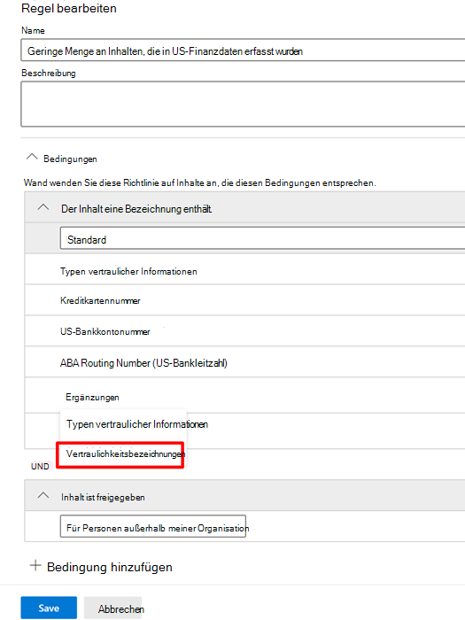

# Verwenden von Vertraulichkeitsbezeichnungen als Bedingungen in DLP-Richtlinien

Sie können [Vertraulichkeitsbezeichnungen](sensitivity-labels.md) als Bedingung in DLP-Richtlinien für folgende Speicherorte verwenden:

- Exchange Online-E-Mails
- Microsoft Office SharePoint Online
- OneDrive for Business-Websites
- Windows 10-Geräte

Vertraulichkeitsbezeichnungen werden als Option in der Liste **Inhalt enthält** angezeigt.

> [!div class="mx-imgBorder"]
> 

> [!IMPORTANT]
> **Vertraulichkeitsbezeichnungen** als Bedingung werden nicht verfügbar sein, wenn Sie **Teams-Chat und Kanalnachrichten** als Ort für die Anwendung der DLP-Richtlinie ausgewählt haben.

## Unterstützte Elemente, Szenarien und Richtlinientipps

Sie können Vertraulichkeitsbezeichnungen als Bedingungen für diese Elemente und in diesen Szenarien verwenden.

### unterstützte Elemente

|Dienst  |Elementtyp  |Verfügbar für Richtlinientipps  |Durchsetzbar  |
|---------|---------|---------|---------|
|Exchange    |E-Mail-Nachricht         |ja         |ja         |
|Exchange    |E-Mail-Anlage         |nein *         |ja *         |
|Microsoft Office SharePoint Online     |Elemente in Microsoft Office SharePoint Online         |ja         |ja         |
|OneDrive for Business     |Elemente         |ja         |ja         |
|Teams     |Microsoft Teams- und Kanalnachrichten         |nicht zutreffend         |nicht zutreffend         |
|Teams     |Anlagen         |ja **         |ja **         |
|Windows 10-Geräte     |Elemente         |ja         |ja         |
|MCAS (Vorschau) |Elemente         |ja         |ja         |

\* Die DLP-Erkennung und das Erzwingen von Vertraulichkeitsbezeichnungen auf E-Mails und Anlagen während der Übertragung werden unterstützt. DLP-Richtlinientipps für Vertraulichkeitsbezeichnungen in E-Mails werden nicht unterstützt.

\** Anlagen, die in Teams über einen 1:1-Chat oder über Kanäle gesendet werden, werden automatisch auf OneDrive for Business und Microsoft Office SharePoint Online hochgeladen. Wenn also Microsoft Office SharePoint Online oder OneDrive for Business als Speicherorte in ihrer DLP-Richtlinie enthalten sind, werden bezeichnete Anlagen, die in Teams gesendet wurden, automatisch in den Umfang dieser Bedingung einbezogen. Teams muss in der DLP-Richtlinie nicht als Speicherort ausgewählt werden.

### Unterstützte Szenarien

- Der DLP-Administrator kann eine Liste aller Vertraulichkeitsbezeichnugen im Mandanten anzeigen, wenn er eine oder mehrere Vertraulichkeitsbezeichnungen als Bedingung einschließt.

- Die Verwendung von Vertraulichkeitsbezeichnungen als Bedingung wird in allen Workloads unterstützt, wie in der obigen Supportmatrix angegeben.

- DLP-Richtlinientipps werden weiterhin für Workloads (mit Ausnahme von Outlook Win32) angezeigt, die eine Vertraulichkeitsbezeichnung als Bedingung enthalten.

- Vertraulichkeitsbezeichnungen werden auch als Bestandteil der Schadensbericht-E-Mail angezeigt, wenn eine DLP-Richtlinie mit einer Vertraulichkeitsbezeichnung als Bedingung übereinstimmt.

- Details zur Vertraulichkeitsbezeichnung werden auch im Überwachungsprotokoll „DLP-Regelabgleich“ für eine Übereinstimmung mit einer DLP-Richtlinie angezeigt, die die Vertraulichkeitsbezeichnung als Bedingung enthält.

### Support-Richtlinientipps

|Workload  |Richtlinientipps unterstützt / nicht unterstützt  |
|---------|---------|
|OWA |    unterstützt     |
|Outlook Win 32    |  nicht unterstützt       |
|Microsoft Office SharePoint Online   |   unterstützt      |
|OneDrive for Business    |    unterstützt     |
|Endpunktgeräte   |  nicht unterstützt       |
