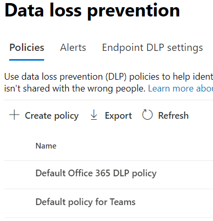

# Informationen zur standardmäßigen Richtlinie zur Verhinderung von Datenverlust in Microsoft Teams (Vorschau)Learn about the default data loss prevention policy in Microsoft Teams (preview)

Die Funktionen zur Verhinderung von Datenverlust [(Data Loss Prevention,](data-loss-prevention-policies.md) DLP) wurden um Microsoft Teams-Chat- und Kanalnachrichten erweitert, einschließlich Nachrichten im privaten Kanal.[Data loss prevention](data-loss-prevention-policies.md) (DLP) capabilities have been extended to include Microsoft Teams chat and channel messages, including private channel messages. Als Teil dieser Version haben wir eine Standard-DLP-Richtlinie für Erstkunden im Compliance Center erstellt.As a part of this release, we created a default DLP policy for first-time customers to Compliance center.

## BetrifftApplies to

Jeder Mandant, der mit einer oder mehreren der folgenden Lizenzen lizenziert ist und über aktive Teams-Benutzer verfügtAny tenant who is licensed with one or more of the below licenses and have active Teams users
 
- ME5,ME5, 
- MA5,MA5, 
- E5/A5 Compliance,E5/A5 Compliance, 
- IP+G,IP+G, 
- OE5,OE5, 
- O365 Advanced ComplianceO365 Advanced Compliance 
- EMS E5EMS E5

## Was macht die Standardrichtlinie?What does the default policy do?

Die Standardmäßige DLP-Richtlinie verfolgt alle Kreditkartennummern, die intern und extern für die Organisation freigegeben wurden.The default DLP policy tracks all the credit card numbers shared internally and externally to the organization. Diese Richtlinie ist standardmäßig für alle Benutzer des Mandanten aktiviert.This policy is on by default for all users of the tenant. Es generiert keine Richtlinientipps für Endbenutzer, generiert aber ein Warnungsereignis und löst auch eine E-Mail mit geringem Schweregrad an den Administrator aus (in der Richtlinie hinzugefügt).It does not generate any policy tips for end users but does generate an Alert event and also triggers a low severity email to the admin (added in the policy). Der Administrator kann die Aktivitäten anzeigen und die Richtliniendetails bearbeiten, indem er sich beim Compliance Center einmeldet.Administrator can view the activities and edit the policies details by logging into the Compliance center.

Administratoren können diese Richtlinie auf der Seite Compliance [Center >](https://compliance.microsoft.com/compliancesettings) Richtlinie zur Verhinderung von Datenverlust anzeigen.Admins can view this policy in the [Compliance center](https://compliance.microsoft.com/compliancesettings) > Data Loss prevention policies page.

> [!div class="mx-imgBorder"]
> 

## Bearbeiten oder Löschen der StandardrichtlinieEdit or delete the default policy

Um [die Standardrichtlinie zu](create-test-tune-dlp-policy.md#tune-a-dlp-policy)bearbeiten, um eine bessere Leistung zu erzielen oder sie zu löschen, verwenden Sie einfach ein Konto mit **DLP Compliance Management-Berechtigungen.**To [edit the default policy for better performance or to delete it](create-test-tune-dlp-policy.md#tune-a-dlp-policy), just use an account with **DLP Compliance Management** permissions. Weitere Informationen finden Sie unter [Permissions](create-test-tune-dlp-policy.md#permissions).For more information, see, [Permissions](create-test-tune-dlp-policy.md#permissions).

