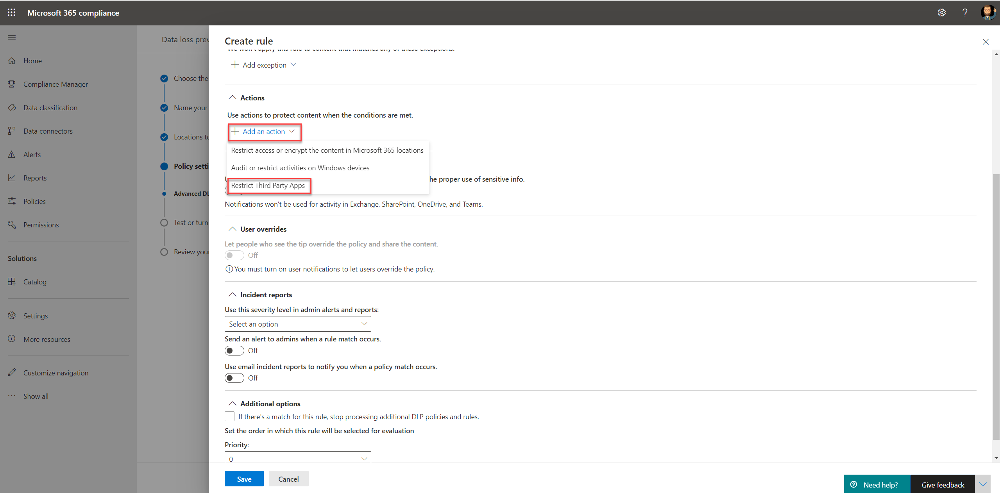

# Verwenden von Richtlinien zur Verhinderung von Datenverlust für nicht-Microsoft-Cloud-Apps (Vorschau)Use data loss prevention policies for non-Microsoft cloud apps (preview)

DLP-Richtlinien (Data Loss Prevention) für nicht-Microsoft-Cloud-apps sind Teil der Microsoft 365 DLP-Suite mit Features; Mithilfe dieser Funktionen können Sie vertrauliche Elemente in Microsoft 365-Diensten ermitteln und schützen.Data loss prevention (DLP) policies to non-Microsoft cloud apps are part of the Microsoft 365 DLP suite of features; using these features, you can discover and protect sensitive items across Microsoft 365 services. Weitere Informationen zu allen Microsoft DLP-Angeboten finden Sie unter [Übersicht über Verhinderung von Datenverlust](https://docs.microsoft.com/microsoft-365/compliance/data-loss-prevention-policies?view=o365-worldwide).For more information about all Microsoft DLP offerings, see [Overview of data loss prevention](https://docs.microsoft.com/microsoft-365/compliance/data-loss-prevention-policies?view=o365-worldwide).

Sie können DLP-Richtlinien für nicht-Microsoft-Cloud-Apps verwenden, um zu überwachen und zu erkennen, wann vertrauliche Elemente verwendet und über nicht-Microsoft-Cloud-apps freigegeben werden.You can use DLP policies to non-Microsoft cloud apps to monitor and detect when sensitive items are used and shared via non-Microsoft cloud apps. Durch die Verwendung dieser Richtlinien erhalten Sie die Sichtbarkeit und Kontrolle, die Sie benötigen, um sicherzustellen, dass Sie ordnungsgemäß verwendet und geschützt werden, und Sie können riskantes Verhalten verhindern, das Sie gefährden kann.Using these policies gives you the visibility and control that you need to ensure that they're correctly used and protected, and it helps prevent risky behavior that might compromise them.

## VorabinformationenBefore you begin

### SKU/Abonnement-LizenzierungSKU/subscriptions licensing

Bevor Sie mit der Verwendung von DLP-Richtlinien für nicht-Microsoft-Cloud-apps beginnen, müssen Sie Ihr [Microsoft 365-Abonnement](https://www.microsoft.com/microsoft-365/compare-microsoft-365-enterprise-plans?rtc=1) und alle Add-ons bestätigen.Before you start using DLP policies to non-Microsoft cloud apps, confirm your [Microsoft 365 subscription](https://www.microsoft.com/microsoft-365/compare-microsoft-365-enterprise-plans?rtc=1) and any add-ons. Für den Zugriff auf und die Verwendung dieser Funktion benötigen Sie eines der folgenden Abonnements oder Add-ons:To access and use this functionality, you must have one of these subscriptions or add-ons:

- Microsoft 365 E5Microsoft 365 E5
- Microsoft 365 E5 ComplianceMicrosoft 365 E5 Compliance
- Microsoft 365 E5 SecurityMicrosoft 365 E5 Security

### Vorbereiten der Cloud-App-SicherheitsumgebungPrepare your Cloud App Security environment

DLP-Richtlinien für nicht-Microsoft-Cloud-Apps verwenden Cloud App Security DLP-Funktionen.DLP policies to non-Microsoft cloud apps use Cloud App Security DLP capabilities. Um Sie zu verwenden, sollten Sie Ihre Cloud-App-Sicherheitsumgebung vorbereiten.To use it, you should prepare your Cloud App Security environment. Anweisungen finden Sie unter [Festlegen von sofort Sichtbarkeits-, Schutz-und Steuerungsaktionen für Ihre apps](https://docs.microsoft.com/cloud-app-security/getting-started-with-cloud-app-security#step-1-set-instant-visibility-protection-and-governance-actions-for-your-apps).For instructions, see [Set instant visibility, protection, and governance actions for your apps](https://docs.microsoft.com/cloud-app-security/getting-started-with-cloud-app-security#step-1-set-instant-visibility-protection-and-governance-actions-for-your-apps).

### Verbinden einer nicht-Microsoft-Cloud-AppConnect a non-Microsoft cloud app

Damit die DLP-Richtlinie für eine bestimmte nicht-Microsoft-Cloud-App verwendet werden kann, muss die APP mit der Cloud-App-Sicherheit verbunden sein.To use DLP policy to a specific non-Microsoft cloud app, the app must be connected to Cloud App Security. Diesbezügliche Informationen finden Sie unter:For information, see:

- [Feld "verbinden"Connect Box](https://docs.microsoft.com/cloud-app-security/connect-box-to-microsoft-cloud-app-security)
- [Dropbox verbindenConnect Dropbox](https://docs.microsoft.com/cloud-app-security/connect-dropbox-to-microsoft-cloud-app-security)
- [Connect G-SuiteConnect G-Suite](https://docs.microsoft.com/cloud-app-security/connect-google-apps-to-microsoft-cloud-app-security)
- [Verbinden von SalesforceConnect Salesforce](https://docs.microsoft.com/cloud-app-security/connect-salesforce-to-microsoft-cloud-app-security)
- [Verbinden von Cisco WebExConnect Cisco Webex](https://docs.microsoft.com/cloud-app-security/connect-webex-to-microsoft-cloud-app-security)

Nachdem Sie Ihre Cloud-apps mit der Cloud-App-Sicherheit verbunden haben, können Sie Microsoft 365 DLP-Richtlinien für diese erstellen.After you connect your cloud apps to Cloud App Security, you can create Microsoft 365 DLP policies for them.

>[!NOTE]
>Es ist auch möglich, mithilfe von Microsoft Cloud App Security DLP-Richtlinien für Microsoft Cloud-apps zu erstellen.It's also possible to use Microsoft Cloud App Security to create DLP policies to Microsoft cloud apps. Es wird jedoch empfohlen, Microsoft 365 zum Erstellen und Verwalten von DLP-Richtlinien in Microsoft Cloud-apps zu verwenden.However, it's recommended to use Microsoft 365 to create and manage DLP policies to Microsoft cloud apps.

## Erstellen einer DLP-Richtlinie für eine nicht von Microsoft erstellte Cloud-AppCreate a DLP policy to a non-Microsoft cloud app

Wenn Sie einen Speicherort für die DLP-Richtlinie auswählen, aktivieren Sie den **Microsoft Cloud-App-Sicherheits** Speicherort.When you select a location for the DLP policy, turn on the **Microsoft Cloud App Security** location.

- Zum Auswählen einer bestimmten app oder Instanz wählen Sie **Instanz auswählen**aus.To select a specific app or instance, select **Choose instance**.
- Wenn Sie keine Instanz auswählen, verwendet die Richtlinie alle verbundenen apps in Ihrem Microsoft Cloud-App-Sicherheits Mandanten.If you don't select an instance, the policy uses all connected apps in your Microsoft Cloud App Security tenant.

   

   

Sie können verschiedene Aktionen für jede unterstützte nicht-Microsoft-Cloud-App auswählen.You can choose various actions for every supported non-Microsoft cloud app. Für jede APP gibt es verschiedene mögliche Aktionen (abhängig von der Cloud-App-API).For every app, there are different possible actions (depends on the cloud app API).

Wenn Sie eine Regel in der DLP-Richtlinie erstellen, können Sie eine Aktion für nicht-Microsoft-Cloud-apps auswählen.When you create a rule in the DLP policy, you can select an action for non-Microsoft cloud apps. Um Drittanbieter-apps einzuschränken, wählen Sie **Apps für Drittanbieter einschränken**aus.To restrict third-party apps, select **Restrict Third Party Apps**.

Informationen zum Erstellen und Konfigurieren von DLP-Richtlinien finden Sie unter [Create Test and Tune a DLP Policy](https://docs.microsoft.com/microsoft-365/compliance/create-test-tune-dlp-policy?view=o365-worldwide).For information about creating and configuring DLP policies, see [Create test and tune a DLP policy](https://docs.microsoft.com/microsoft-365/compliance/create-test-tune-dlp-policy?view=o365-worldwide).

## Siehe auchSee Also

- [Erstellen von Tests und Optimieren einer DLP-RichtlinieCreate test and tune a DLP policy](https://docs.microsoft.com/microsoft-365/compliance/create-test-tune-dlp-policy?view=o365-worldwide)
- [Erste Schritte mit der standardmäßigen DLP-RichtlinieGet started with the default DLP policy](https://docs.microsoft.com/microsoft-365/compliance/get-started-with-the-default-dlp-policy?view=o365-worldwide)
- [Erstellen einer DLP-Richtlinie aus einer VorlageCreate a DLP policy from a template](https://docs.microsoft.com/microsoft-365/compliance/create-a-dlp-policy-from-a-template?view=o365-worldwide)
