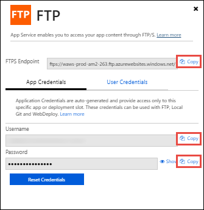

# <a name="double-key-encryption-for-microsoft-365"></a><span data-ttu-id="0fe72-103">Doppelschlüsselverschlüsselung für Microsoft 365</span><span class="sxs-lookup"><span data-stu-id="0fe72-103">Double Key Encryption for Microsoft 365</span></span>

> <span data-ttu-id="0fe72-104">*Gilt für: Double Key Encryption for Microsoft 365, [Microsoft 365 Compliance,](https://www.microsoft.com/microsoft-365/business/compliance-management) [Azure Information Protection](https://azure.microsoft.com/pricing/details/information-protection)*</span><span class="sxs-lookup"><span data-stu-id="0fe72-104">*Applies to: Double Key Encryption for Microsoft 365, [Microsoft 365 Compliance](https://www.microsoft.com/microsoft-365/business/compliance-management), [Azure Information Protection](https://azure.microsoft.com/pricing/details/information-protection)*</span></span>
>
> <span data-ttu-id="0fe72-105">*Anweisungen für: [Azure Information Protection-Client für einheitliche Bezeichnungen für Windows](/azure/information-protection/faqs#whats-the-difference-between-the-azure-information-protection-classic-and-unified-labeling-clients)*</span><span class="sxs-lookup"><span data-stu-id="0fe72-105">*Instructions for: [Azure Information Protection unified labeling client for Windows](/azure/information-protection/faqs#whats-the-difference-between-the-azure-information-protection-classic-and-unified-labeling-clients)*</span></span>
>
> <span data-ttu-id="0fe72-106">*Dienstbeschreibung für: [Microsoft 365 Compliance](/office365/servicedescriptions/microsoft-365-service-descriptions/microsoft-365-tenantlevel-services-licensing-guidance/microsoft-365-security-compliance-licensing-guidance)*</span><span class="sxs-lookup"><span data-stu-id="0fe72-106">*Service description for: [Microsoft 365 Compliance](/office365/servicedescriptions/microsoft-365-service-descriptions/microsoft-365-tenantlevel-services-licensing-guidance/microsoft-365-security-compliance-licensing-guidance)*</span></span>

<span data-ttu-id="0fe72-107">Die Doppelschlüsselverschlüsselung (Double Key Encryption, DKE) verwendet zwei Schlüssel zusammen, um auf geschützte Inhalte zuzugreifen.</span><span class="sxs-lookup"><span data-stu-id="0fe72-107">Double Key Encryption (DKE) uses two keys together to access protected content.</span></span> <span data-ttu-id="0fe72-108">Microsoft speichert einen Schlüssel in Microsoft Azure, und Sie halten den anderen Schlüssel.</span><span class="sxs-lookup"><span data-stu-id="0fe72-108">Microsoft stores one key in Microsoft Azure, and you hold the other key.</span></span> <span data-ttu-id="0fe72-109">Sie behalten die vollständige Kontrolle über einen Ihrer Schlüssel mithilfe des Double Key Encryption-Diensts.</span><span class="sxs-lookup"><span data-stu-id="0fe72-109">You maintain full control of one of your keys using the Double Key Encryption service.</span></span> <span data-ttu-id="0fe72-110">Sie wenden den Schutz mithilfe des Azure Information Protection-Clients für einheitliche Bezeichnungen auf Ihre streng vertraulichen Inhalte an.</span><span class="sxs-lookup"><span data-stu-id="0fe72-110">You apply protection using The Azure Information Protection unified labeling client to your highly sensitive content.</span></span>

<span data-ttu-id="0fe72-111">Double Key Encryption unterstützt sowohl Cloudbereitstellungen als auch lokale Bereitstellungen.</span><span class="sxs-lookup"><span data-stu-id="0fe72-111">Double Key Encryption supports both cloud and on-premises deployments.</span></span> <span data-ttu-id="0fe72-112">Diese Bereitstellungen tragen dazu bei, sicherzustellen, dass verschlüsselte Daten überall dort, wo Sie die geschützten Daten speichern, undurchsichtig bleiben.</span><span class="sxs-lookup"><span data-stu-id="0fe72-112">These deployments help to ensure that encrypted data remains opaque wherever you store the protected data.</span></span>

<span data-ttu-id="0fe72-113">Weitere Informationen zu den standardmäßigen, cloudbasierten Mandantenstammschlüsseln finden Sie unter [Planen und Implementieren Ihres Azure Information Protection-Mandantenschlüssels.](/azure/information-protection/plan-implement-tenant-key)</span><span class="sxs-lookup"><span data-stu-id="0fe72-113">For more information about the default, cloud-based tenant root keys, see [Planning and implementing your Azure Information Protection tenant key](/azure/information-protection/plan-implement-tenant-key).</span></span>

## <a name="when-your-organization-should-adopt-dke"></a><span data-ttu-id="0fe72-114">Wann Ihre Organisation DKE einführen soll</span><span class="sxs-lookup"><span data-stu-id="0fe72-114">When your organization should adopt DKE</span></span>

<span data-ttu-id="0fe72-115">Die Verschlüsselung mit Doppelschlüssel ist für Ihre vertraulichsten Daten vorgesehen, die den strengsten Schutzanforderungen unterliegen.</span><span class="sxs-lookup"><span data-stu-id="0fe72-115">Double Key Encryption is intended for your most sensitive data that is subject to the strictest protection requirements.</span></span> <span data-ttu-id="0fe72-116">DKE ist nicht für alle Daten vorgesehen.</span><span class="sxs-lookup"><span data-stu-id="0fe72-116">DKE is not intended for all data.</span></span> <span data-ttu-id="0fe72-117">Im Allgemeinen verwenden Sie die Doppelschlüsselverschlüsselung, um nur einen kleinen Teil Ihrer Gesamtdaten zu schützen.</span><span class="sxs-lookup"><span data-stu-id="0fe72-117">In general, you'll be using Double Key Encryption to protect only a small part of your overall data.</span></span> <span data-ttu-id="0fe72-118">Sie sollten die richtigen Daten, die mit dieser Lösung behandelt werden sollen, vor der Bereitstellung mit der gebotenen Sorgfalt ermitteln.</span><span class="sxs-lookup"><span data-stu-id="0fe72-118">You should do due diligence in identifying the right data to cover with this solution before you deploy.</span></span> <span data-ttu-id="0fe72-119">In einigen Fällen müssen Sie möglicherweise Ihren Umfang eingrenzen und andere Lösungen für die meisten Daten verwenden, z. B. Microsoft Information Protection mit von Microsoft verwalteten Schlüsseln oder BYOK.</span><span class="sxs-lookup"><span data-stu-id="0fe72-119">In some cases, you might need to narrow your scope and make use of other solutions for most your data such as Microsoft Information Protection with Microsoft-managed keys or BYOK.</span></span> <span data-ttu-id="0fe72-120">Diese Lösungen sind für Dokumente ausreichend, die keinen erweiterten Schutzmaßnahmen und behördlichen Anforderungen unterliegen.</span><span class="sxs-lookup"><span data-stu-id="0fe72-120">These solutions are sufficient for documents that aren't subject to enhanced protections and regulatory requirements.</span></span> <span data-ttu-id="0fe72-121">Darüber hinaus können Sie mit diesen Lösungen die leistungsstärksten Office 365 Dienste verwenden. Dienste, die Sie nicht mit verschlüsselten DKE-Inhalten verwenden können.</span><span class="sxs-lookup"><span data-stu-id="0fe72-121">Also, these solutions enable you to use the most powerful Office 365 services; services that you can't use with DKE encrypted content.</span></span> <span data-ttu-id="0fe72-122">Beispiel:</span><span class="sxs-lookup"><span data-stu-id="0fe72-122">For example:</span></span>

- <span data-ttu-id="0fe72-123">Transportregeln, einschließlich Antischadsoftware und Spam, die Sichtbarkeit in der Anlage erfordern</span><span class="sxs-lookup"><span data-stu-id="0fe72-123">Transport rules including anti-malware and spam that require visibility into the attachment</span></span>
- <span data-ttu-id="0fe72-124">Microsoft Delve</span><span class="sxs-lookup"><span data-stu-id="0fe72-124">Microsoft Delve</span></span>
- <span data-ttu-id="0fe72-125">eDiscovery</span><span class="sxs-lookup"><span data-stu-id="0fe72-125">eDiscovery</span></span>
- <span data-ttu-id="0fe72-126">Inhaltssuche und -indizierung</span><span class="sxs-lookup"><span data-stu-id="0fe72-126">Content search and indexing</span></span>
- <span data-ttu-id="0fe72-127">Office Web-Apps, einschließlich Funktionen für die gemeinsame Dokumenterstellung</span><span class="sxs-lookup"><span data-stu-id="0fe72-127">Office Web Apps including coauthoring functionality</span></span>

<span data-ttu-id="0fe72-128">Alle externen Anwendungen oder Dienste, die nicht über das MIP SDK in DKE integriert sind, können keine Aktionen für die verschlüsselten Daten ausführen.</span><span class="sxs-lookup"><span data-stu-id="0fe72-128">Any external applications or services that are not integrated with DKE through the MIP SDK will be unable to perform actions on the encrypted data.</span></span>

<span data-ttu-id="0fe72-129">Das Microsoft Information Protection SDK 1.7+ unterstützt die Doppelschlüsselverschlüsselung. Anwendungen, die in unser SDK integriert sind, können über diese Daten mit ausreichenden Berechtigungen und Integrationen verfügen.</span><span class="sxs-lookup"><span data-stu-id="0fe72-129">The Microsoft Information Protection SDK 1.7+ supports Double Key Encryption; applications that integrate with our SDK will be able to reason over this data with sufficient permissions and integrations in place.</span></span>

<span data-ttu-id="0fe72-130">Wir empfehlen Organisationen, die Microsoft Information Protection-Funktionen (Klassifizierung und Bezeichnung) zu verwenden, um die meisten ihrer vertraulichen Daten zu schützen, und dke nur für ihre unternehmenskritischen Daten zu verwenden.</span><span class="sxs-lookup"><span data-stu-id="0fe72-130">We recommend organizations use Microsoft Information protection capabilities (classification and labeling) to protect most of their sensitive data and only use DKE for their mission-critical data.</span></span> <span data-ttu-id="0fe72-131">Die Doppelschlüsselverschlüsselung ist für vertrauliche Daten in stark regulierten Branchen wie Finanzdienstleistungen und Gesundheitswesen relevant.</span><span class="sxs-lookup"><span data-stu-id="0fe72-131">Double Key Encryption is relevant for sensitive data in highly regulated industries such as Financial services and Healthcare.</span></span>

<span data-ttu-id="0fe72-132">Wenn Ihre Organisationen eine der folgenden Anforderungen haben, können Sie DKE verwenden, um Ihre Inhalte zu schützen:</span><span class="sxs-lookup"><span data-stu-id="0fe72-132">If your organizations have any of the following requirements, you can use DKE to help secure your content:</span></span>

- <span data-ttu-id="0fe72-133">Sie möchten sicherstellen, dass *nur Sie* geschützte Inhalte unter allen Umständen entschlüsseln können.</span><span class="sxs-lookup"><span data-stu-id="0fe72-133">You want to ensure that *only you* can ever decrypt protected content, under all circumstances.</span></span>
- <span data-ttu-id="0fe72-134">Sie möchten nicht, dass Microsoft allein Zugriff auf geschützte Daten hat.</span><span class="sxs-lookup"><span data-stu-id="0fe72-134">You don't want Microsoft to have access to protected data on its own.</span></span>
- <span data-ttu-id="0fe72-135">Sie haben gesetzliche Vorschriften, um Schlüssel innerhalb einer geografischen Grenze zu halten.</span><span class="sxs-lookup"><span data-stu-id="0fe72-135">You have regulatory requirements to hold keys within a geographical boundary.</span></span> <span data-ttu-id="0fe72-136">Alle Schlüssel, die Sie für die Datenverschlüsselung und -entschlüsselung aufbewahren, werden in Ihrem Rechenzentrum verwaltet.</span><span class="sxs-lookup"><span data-stu-id="0fe72-136">All of the keys that you hold for data encryption and decryption are maintained in your data center.</span></span>

## <a name="system-and-licensing-requirements-for-dke"></a><span data-ttu-id="0fe72-137">System- und Lizenzierungsanforderungen für DKE</span><span class="sxs-lookup"><span data-stu-id="0fe72-137">System and licensing requirements for DKE</span></span>

<span data-ttu-id="0fe72-138">**Die Doppelschlüsselverschlüsselung für Microsoft 365** ist mit Microsoft 365 E5 verbunden.</span><span class="sxs-lookup"><span data-stu-id="0fe72-138">**Double Key Encryption for Microsoft 365** comes with Microsoft 365 E5.</span></span> <span data-ttu-id="0fe72-139">Wenn Sie nicht über eine Microsoft 365 E5 Lizenz verfügen, können Sie sich für eine [Testversion](https://aka.ms/M365E5ComplianceTrial)registrieren.</span><span class="sxs-lookup"><span data-stu-id="0fe72-139">If you don’t have a Microsoft 365 E5 license, you can sign up for a [trial](https://aka.ms/M365E5ComplianceTrial).</span></span> <span data-ttu-id="0fe72-140">Weitere Informationen zu diesen Lizenzen finden Sie [unter Microsoft 365 Lizenzierungsleitfaden für sicherheitsbezogene & Compliance.](/office365/servicedescriptions/microsoft-365-service-descriptions/microsoft-365-tenantlevel-services-licensing-guidance/microsoft-365-security-compliance-licensing-guidance)</span><span class="sxs-lookup"><span data-stu-id="0fe72-140">For more information about these licenses, see [Microsoft 365 licensing guidance for security & compliance](/office365/servicedescriptions/microsoft-365-service-descriptions/microsoft-365-tenantlevel-services-licensing-guidance/microsoft-365-security-compliance-licensing-guidance).</span></span>

<span data-ttu-id="0fe72-141">**Azure Information Protection**.</span><span class="sxs-lookup"><span data-stu-id="0fe72-141">**Azure Information Protection**.</span></span> <span data-ttu-id="0fe72-142">DKE arbeitet mit Vertraulichkeitsbezeichnungen und erfordert Azure Information Protection.</span><span class="sxs-lookup"><span data-stu-id="0fe72-142">DKE works with sensitivity labels and requires Azure Information Protection.</span></span>

<span data-ttu-id="0fe72-143">DKE-Vertraulichkeitsbezeichnungen werden Endbenutzern über das Vertraulichkeitsmenüband in Office Desktop-Apps zur Verfügung gestellt.</span><span class="sxs-lookup"><span data-stu-id="0fe72-143">DKE sensitivity labels are made available to end users through the sensitivity ribbon in Office Desktop Apps.</span></span> <span data-ttu-id="0fe72-144">Installieren Sie diese erforderlichen Komponenten auf jedem Clientcomputer, auf dem Sie geschützte Dokumente schützen und nutzen möchten.</span><span class="sxs-lookup"><span data-stu-id="0fe72-144">Install these prerequisites on each client computer where you want to protect and consume protected documents.</span></span>

<span data-ttu-id="0fe72-145">**Microsoft Office Apps for Enterprise** Version 2009 oder höher (Desktopversionen von Word, PowerPoint und Excel) auf Windows.</span><span class="sxs-lookup"><span data-stu-id="0fe72-145">**Microsoft Office Apps for enterprise** version 2009 or later (Desktop versions of Word, PowerPoint, and Excel) on Windows.</span></span>

<span data-ttu-id="0fe72-146">**Azure Information Protection Unified Labeling Client** Version 2.7.93.0 oder höher.</span><span class="sxs-lookup"><span data-stu-id="0fe72-146">**Azure Information Protection Unified Labeling Client** versions 2.7.93.0 or later.</span></span> <span data-ttu-id="0fe72-147">Laden Sie den Unified Labeling-Client aus dem [Microsoft Download Center](https://www.microsoft.com/download/details.aspx?id=53018)herunter, und installieren Sie es.</span><span class="sxs-lookup"><span data-stu-id="0fe72-147">Download and install the Unified Labeling client from the [Microsoft download center](https://www.microsoft.com/download/details.aspx?id=53018).</span></span>

## <a name="supported-environments-for-storing-and-viewing-dke-protected-content"></a><span data-ttu-id="0fe72-148">Unterstützte Umgebungen zum Speichern und Anzeigen von DKE-geschützten Inhalten</span><span class="sxs-lookup"><span data-stu-id="0fe72-148">Supported environments for storing and viewing DKE-protected content</span></span>

<span data-ttu-id="0fe72-149">**Unterstützte Anwendungen.**</span><span class="sxs-lookup"><span data-stu-id="0fe72-149">**Supported applications**.</span></span> <span data-ttu-id="0fe72-150">[Microsoft 365 Apps for Enterprise](https://www.microsoft.com/microsoft-365/business/microsoft-365-apps-for-enterprise-product) Clients auf Windows, einschließlich Word, Excel und PowerPoint.</span><span class="sxs-lookup"><span data-stu-id="0fe72-150">[Microsoft 365 Apps for enterprise](https://www.microsoft.com/microsoft-365/business/microsoft-365-apps-for-enterprise-product) clients on Windows, including Word, Excel, and PowerPoint.</span></span>

<span data-ttu-id="0fe72-151">**Unterstützung von Onlineinhalten.**</span><span class="sxs-lookup"><span data-stu-id="0fe72-151">**Online content support**.</span></span> <span data-ttu-id="0fe72-152">Sie können Dokumente und Dateien, die mit der Doppelschlüsselverschlüsselung geschützt sind, online sowohl in Microsoft SharePoint als auch in OneDrive for Business speichern.</span><span class="sxs-lookup"><span data-stu-id="0fe72-152">You can store documents and files protected with Double Key Encryption online in both Microsoft SharePoint and OneDrive for Business.</span></span> <span data-ttu-id="0fe72-153">Sie müssen Dokumente und Dateien mit DKE von unterstützten Anwendungen bezeichnen und schützen, bevor Sie an diese Speicherorte hochladen.</span><span class="sxs-lookup"><span data-stu-id="0fe72-153">You must label and protect documents and files with DKE by supported applications before you upload to these locations.</span></span> <span data-ttu-id="0fe72-154">Sie können verschlüsselte Inhalte per E-Mail freigeben, aber keine verschlüsselten Dokumente und Dateien online anzeigen.</span><span class="sxs-lookup"><span data-stu-id="0fe72-154">You can share encrypted content by email, but you can't view encrypted documents and files online.</span></span> <span data-ttu-id="0fe72-155">Stattdessen müssen Sie geschützte Inhalte mithilfe der unterstützten Desktopanwendungen und Clients auf Ihrem lokalen Computer anzeigen.</span><span class="sxs-lookup"><span data-stu-id="0fe72-155">Instead, you must view protected content using the supported desktop applications and clients on your local computer.</span></span>

## <a name="overview-of-deploying-dke"></a><span data-ttu-id="0fe72-156">Übersicht über die Bereitstellung von DKE</span><span class="sxs-lookup"><span data-stu-id="0fe72-156">Overview of deploying DKE</span></span>

<span data-ttu-id="0fe72-157">Sie führen diese allgemeinen Schritte zum Einrichten von DKE aus.</span><span class="sxs-lookup"><span data-stu-id="0fe72-157">You'll follow these general steps to set up DKE.</span></span> <span data-ttu-id="0fe72-158">Nachdem Sie diese Schritte abgeschlossen haben, können Ihre Endbenutzer Ihre streng vertraulichen Daten mit der Double Key Encryption schützen.</span><span class="sxs-lookup"><span data-stu-id="0fe72-158">Once you've completed these steps, your end users will can protect your highly sensitive data with Double Key Encryption.</span></span>

1. <span data-ttu-id="0fe72-159">Stellen Sie den DKE-Dienst wie in diesem Artikel beschrieben bereit.</span><span class="sxs-lookup"><span data-stu-id="0fe72-159">Deploy the DKE service as described in this article.</span></span>

2. <span data-ttu-id="0fe72-160">Erstellen Sie eine Bezeichnung mit Doppelschlüsselverschlüsselung.</span><span class="sxs-lookup"><span data-stu-id="0fe72-160">Create a label with Double Key Encryption.</span></span> <span data-ttu-id="0fe72-161">Navigieren Sie unter dem [Microsoft 365 Compliance Center](https://compliance.microsoft.com) zum Informationsschutz, und erstellen Sie eine neue Bezeichnung mit Doppelschlüsselverschlüsselung.</span><span class="sxs-lookup"><span data-stu-id="0fe72-161">Navigate to Information protection under the [Microsoft 365 compliance center](https://compliance.microsoft.com) and create a new label with Double Key Encryption.</span></span> <span data-ttu-id="0fe72-162">Weitere Informationen finden Sie unter [Einschränken des Zugriffs auf Inhalte mithilfe von Vertraulichkeitsbezeichnungen, um Verschlüsselung anzuwenden.](./encryption-sensitivity-labels.md)</span><span class="sxs-lookup"><span data-stu-id="0fe72-162">See [Restrict access to content by using sensitivity labels to apply encryption](./encryption-sensitivity-labels.md).</span></span>

3. <span data-ttu-id="0fe72-163">Verwenden Sie Double Key Encryption-Bezeichnungen.</span><span class="sxs-lookup"><span data-stu-id="0fe72-163">Use Double Key Encryption labels.</span></span> <span data-ttu-id="0fe72-164">Schützen Sie Daten, indem Sie im Menüband Vertraulichkeit in Microsoft Office die Bezeichnung Verschlüsselter Doppelschlüssel auswählen.</span><span class="sxs-lookup"><span data-stu-id="0fe72-164">Protect data by selecting the Double Key Encrypted label from the Sensitivity ribbon in Microsoft Office.</span></span>

<span data-ttu-id="0fe72-165">Es gibt verschiedene Möglichkeiten, einige der Schritte zum Bereitstellen der Double Key Encryption auszuführen.</span><span class="sxs-lookup"><span data-stu-id="0fe72-165">There are several ways you can complete some of the steps to deploy Double Key Encryption.</span></span> <span data-ttu-id="0fe72-166">Dieser Artikel enthält ausführliche Anweisungen, damit weniger erfahrene Administratoren den Dienst erfolgreich bereitstellen können.</span><span class="sxs-lookup"><span data-stu-id="0fe72-166">This article provides detailed instructions so that less experienced admins successfully deploy the service.</span></span> <span data-ttu-id="0fe72-167">Wenn Sie damit vertraut sind, können Sie ihre eigenen Methoden verwenden.</span><span class="sxs-lookup"><span data-stu-id="0fe72-167">If you're comfortable doing so, you can choose to use your own methods.</span></span>

## <a name="deploy-dke"></a><span data-ttu-id="0fe72-168">Bereitstellen von DKE</span><span class="sxs-lookup"><span data-stu-id="0fe72-168">Deploy DKE</span></span>

<span data-ttu-id="0fe72-169">In diesem Artikel und dem Bereitstellungsvideo wird Azure als Bereitstellungsziel für den DKE-Dienst verwendet.</span><span class="sxs-lookup"><span data-stu-id="0fe72-169">This article and the deployment video use Azure as the deployment destination for the DKE service.</span></span> <span data-ttu-id="0fe72-170">Wenn Sie die Bereitstellung an einem anderen Speicherort durchführen, müssen Sie Ihre eigenen Werte angeben.</span><span class="sxs-lookup"><span data-stu-id="0fe72-170">If you're deploying to another location, you'll need to provide your own values.</span></span>

<span data-ttu-id="0fe72-171">Sehen Sie sich das Video zur Bereitstellung der [Doppelschlüsselverschlüsselung](https://youtu.be/vDWfHN_kygg) an, um eine schrittweise Übersicht über die Konzepte in diesem Artikel zu sehen.</span><span class="sxs-lookup"><span data-stu-id="0fe72-171">Watch the [Double Key Encryption deployment video](https://youtu.be/vDWfHN_kygg) to see a step-by-step overview of the concepts in this article.</span></span> <span data-ttu-id="0fe72-172">Der Abschluss des Videos dauert ca. 18 Minuten.</span><span class="sxs-lookup"><span data-stu-id="0fe72-172">The video takes about 18 minutes to complete.</span></span>

<span data-ttu-id="0fe72-173">Sie führen die folgenden allgemeinen Schritte aus, um die Doppelschlüsselverschlüsselung für Ihre Organisation einzurichten.</span><span class="sxs-lookup"><span data-stu-id="0fe72-173">You'll follow these general steps to set up Double Key Encryption for your organization.</span></span>

1. [<span data-ttu-id="0fe72-174">Installieren der erforderlichen Software für den DKE-Dienst</span><span class="sxs-lookup"><span data-stu-id="0fe72-174">Install software prerequisites for the DKE service</span></span>](#install-software-prerequisites-for-the-dke-service)
1. [<span data-ttu-id="0fe72-175">Klonen Des Double Key Encryption GitHub Repositorys</span><span class="sxs-lookup"><span data-stu-id="0fe72-175">Clone the Double Key Encryption GitHub repository</span></span>](#clone-the-dke-github-repository)
1. [<span data-ttu-id="0fe72-176">Ändern von Anwendungseinstellungen</span><span class="sxs-lookup"><span data-stu-id="0fe72-176">Modify application settings</span></span>](#modify-application-settings)
1. [<span data-ttu-id="0fe72-177">Generieren von Testschlüsseln</span><span class="sxs-lookup"><span data-stu-id="0fe72-177">Generate test keys</span></span>](#generate-test-keys)
1. [<span data-ttu-id="0fe72-178">Erstellen des Projekts</span><span class="sxs-lookup"><span data-stu-id="0fe72-178">Build the project</span></span>](#build-the-project)
1. [<span data-ttu-id="0fe72-179">Bereitstellen des DKE-Diensts und Veröffentlichen des Schlüsselspeichers</span><span class="sxs-lookup"><span data-stu-id="0fe72-179">Deploy the DKE service and publish the key store</span></span>](#deploy-the-dke-service-and-publish-the-key-store)
1. [<span data-ttu-id="0fe72-180">Überprüfen Ihrer Bereitstellung</span><span class="sxs-lookup"><span data-stu-id="0fe72-180">Validate your deployment</span></span>](#validate-your-deployment)
1. [<span data-ttu-id="0fe72-181">Registrieren Ihres Schlüsselspeichers</span><span class="sxs-lookup"><span data-stu-id="0fe72-181">Register your key store</span></span>](#register-your-key-store)
1. [<span data-ttu-id="0fe72-182">Erstellen von Vertraulichkeitsbezeichnungen mit dke</span><span class="sxs-lookup"><span data-stu-id="0fe72-182">Create sensitivity labels using DKE</span></span>](#create-sensitivity-labels-using-dke)
1. [<span data-ttu-id="0fe72-183">Aktivieren von DKE in Ihrem Client</span><span class="sxs-lookup"><span data-stu-id="0fe72-183">Enable DKE in your client</span></span>](#enable-dke-in-your-client)
1. [<span data-ttu-id="0fe72-184">Migrieren geschützter Dateien von HYOK-Bezeichnungen zu DKE-Bezeichnungen</span><span class="sxs-lookup"><span data-stu-id="0fe72-184">Migrate protected files from HYOK labels to DKE labels</span></span>](#migrate-protected-files-from-hyok-labels-to-dke-labels)

<span data-ttu-id="0fe72-185">Wenn Sie fertig sind, können Sie Dokumente und Dateien mithilfe von DKE verschlüsseln.</span><span class="sxs-lookup"><span data-stu-id="0fe72-185">When you're done, you can encrypt documents and files using DKE.</span></span> <span data-ttu-id="0fe72-186">Weitere Informationen finden Sie unter [Anwenden von Vertraulichkeitsbezeichnungen auf Ihre Dateien und E-Mails in Office.](https://support.microsoft.com/office/2f96e7cd-d5a4-403b-8bd7-4cc636bae0f9)</span><span class="sxs-lookup"><span data-stu-id="0fe72-186">For information, see [Apply sensitivity labels to your files and email in Office](https://support.microsoft.com/office/2f96e7cd-d5a4-403b-8bd7-4cc636bae0f9).</span></span>

### <a name="install-software-prerequisites-for-the-dke-service"></a><span data-ttu-id="0fe72-187">Installieren der erforderlichen Software für den DKE-Dienst</span><span class="sxs-lookup"><span data-stu-id="0fe72-187">Install software prerequisites for the DKE service</span></span>

<span data-ttu-id="0fe72-188">Installieren Sie diese erforderlichen Komponenten auf dem Computer, auf dem Sie den DKE-Dienst installieren möchten.</span><span class="sxs-lookup"><span data-stu-id="0fe72-188">Install these prerequisites on the computer where you want to install the DKE service.</span></span>

<span data-ttu-id="0fe72-189">**.NET Core 3.1 SDK**.</span><span class="sxs-lookup"><span data-stu-id="0fe72-189">**.NET Core 3.1 SDK**.</span></span> <span data-ttu-id="0fe72-190">Laden Sie das SDK von [.NET Core 3.1 herunter,](https://dotnet.microsoft.com/download/dotnet-core/3.1)und installieren Sie es.</span><span class="sxs-lookup"><span data-stu-id="0fe72-190">Download and install the SDK from [Download .NET Core 3.1](https://dotnet.microsoft.com/download/dotnet-core/3.1).</span></span>

<span data-ttu-id="0fe72-191">**Visual Studio Code**.</span><span class="sxs-lookup"><span data-stu-id="0fe72-191">**Visual Studio Code**.</span></span> <span data-ttu-id="0fe72-192">Laden Sie Visual Studio Code von [https://code.visualstudio.com/](https://code.visualstudio.com) herunter.</span><span class="sxs-lookup"><span data-stu-id="0fe72-192">Download Visual Studio Code from [https://code.visualstudio.com/](https://code.visualstudio.com).</span></span> <span data-ttu-id="0fe72-193">Führen Sie nach der Installation Visual Studio Code aus, und wählen Sie Erweiterungen **anzeigen** \> **aus.**</span><span class="sxs-lookup"><span data-stu-id="0fe72-193">Once installed, run Visual Studio Code and select **View** \> **Extensions**.</span></span> <span data-ttu-id="0fe72-194">Installieren Sie diese Erweiterungen.</span><span class="sxs-lookup"><span data-stu-id="0fe72-194">Install these extensions.</span></span>

- <span data-ttu-id="0fe72-195">C# für Visual Studio Code</span><span class="sxs-lookup"><span data-stu-id="0fe72-195">C# for Visual Studio Code</span></span>

- <span data-ttu-id="0fe72-196">NuGet Paket-Manager</span><span class="sxs-lookup"><span data-stu-id="0fe72-196">NuGet Package Manager</span></span>

<span data-ttu-id="0fe72-197">**Git-Ressourcen**.</span><span class="sxs-lookup"><span data-stu-id="0fe72-197">**Git resources**.</span></span> <span data-ttu-id="0fe72-198">Laden Sie eine der folgenden Komponenten herunter, und installieren Sie sie.</span><span class="sxs-lookup"><span data-stu-id="0fe72-198">Download and install one of the following.</span></span>

- [<span data-ttu-id="0fe72-199">Git</span><span class="sxs-lookup"><span data-stu-id="0fe72-199">Git</span></span>](https://git-scm.com/downloads)

- [<span data-ttu-id="0fe72-200">GitHub Desktop</span><span class="sxs-lookup"><span data-stu-id="0fe72-200">GitHub Desktop</span></span>](https://desktop.github.com/)

- [<span data-ttu-id="0fe72-201">GitHub Enterprise</span><span class="sxs-lookup"><span data-stu-id="0fe72-201">GitHub Enterprise</span></span>](https://github.com/enterprise)

<span data-ttu-id="0fe72-202">**OpenSSL** Sie müssen [OpenSSL](https://slproweb.com/products/Win32OpenSSL.html) installiert haben, um Nach der Bereitstellung von DKE Testschlüssel zu [generieren.](#generate-test-keys)</span><span class="sxs-lookup"><span data-stu-id="0fe72-202">**OpenSSL** You must have [OpenSSL](https://slproweb.com/products/Win32OpenSSL.html) installed to [generate test keys](#generate-test-keys) after you deploy DKE.</span></span> <span data-ttu-id="0fe72-203">Stellen Sie sicher, dass Sie sie korrekt aus dem Pfad der Umgebungsvariablen aufrufen.</span><span class="sxs-lookup"><span data-stu-id="0fe72-203">Make sure you're invoking it correctly from your environment variables path.</span></span> <span data-ttu-id="0fe72-204">Ausführliche Informationen finden Sie beispielsweise unter "Hinzufügen des Installationsverzeichnisses zu [https://www.osradar.com/install-openssl-windows/](https://www.osradar.com/install-openssl-windows/) PATH".</span><span class="sxs-lookup"><span data-stu-id="0fe72-204">For example, see "Add the installation directory to PATH" at [https://www.osradar.com/install-openssl-windows/](https://www.osradar.com/install-openssl-windows/) for details.</span></span>

### <a name="clone-the-dke-github-repository"></a><span data-ttu-id="0fe72-205">Klonen des DKE-GitHub-Repositorys</span><span class="sxs-lookup"><span data-stu-id="0fe72-205">Clone the DKE GitHub repository</span></span>

<span data-ttu-id="0fe72-206">Microsoft stellt die DKE-Quelldateien in einem GitHub Repository bereit.</span><span class="sxs-lookup"><span data-stu-id="0fe72-206">Microsoft supplies the DKE source files in a GitHub repository.</span></span> <span data-ttu-id="0fe72-207">Sie klonen das Repository, um das Projekt lokal für die Verwendung in Ihrer Organisation zu erstellen.</span><span class="sxs-lookup"><span data-stu-id="0fe72-207">You clone the repository to build the project locally for your organization's use.</span></span> <span data-ttu-id="0fe72-208">Das DKE-GitHub-Repository befindet sich unter [https://github.com/Azure-Samples/DoubleKeyEncryptionService](https://github.com/Azure-Samples/DoubleKeyEncryptionService) .</span><span class="sxs-lookup"><span data-stu-id="0fe72-208">The DKE GitHub repository is located at [https://github.com/Azure-Samples/DoubleKeyEncryptionService](https://github.com/Azure-Samples/DoubleKeyEncryptionService).</span></span>

<span data-ttu-id="0fe72-209">Die folgenden Anweisungen sind für unerfahrene Git- oder Visual Studio Code-Benutzer vorgesehen:</span><span class="sxs-lookup"><span data-stu-id="0fe72-209">The following instructions are intended for inexperienced git or Visual Studio Code users:</span></span>

1. <span data-ttu-id="0fe72-210">Wechseln Sie in Ihrem Browser zu: [https://github.com/Azure-Samples/DoubleKeyEncryptionService](https://github.com/Azure-Samples/DoubleKeyEncryptionService) .</span><span class="sxs-lookup"><span data-stu-id="0fe72-210">In your browser, go to: [https://github.com/Azure-Samples/DoubleKeyEncryptionService](https://github.com/Azure-Samples/DoubleKeyEncryptionService).</span></span>

2. <span data-ttu-id="0fe72-211">Wählen Sie rechts neben dem Bildschirm **Code** aus.</span><span class="sxs-lookup"><span data-stu-id="0fe72-211">Towards the right side of the screen, select **Code**.</span></span> <span data-ttu-id="0fe72-212">Ihre Version der Benutzeroberfläche zeigt möglicherweise eine **Schaltfläche zum Klonen oder Herunterladen** an.</span><span class="sxs-lookup"><span data-stu-id="0fe72-212">Your version of the UI might show a **Clone or download** button.</span></span> <span data-ttu-id="0fe72-213">Wählen Sie dann in der angezeigten Dropdownliste das Kopiersymbol aus, um die URL in Die Zwischenablage zu kopieren.</span><span class="sxs-lookup"><span data-stu-id="0fe72-213">Then, in the dropdown that appears, select the copy icon to copy the URL to your clipboard.</span></span>

    <span data-ttu-id="0fe72-214">Beispiel:</span><span class="sxs-lookup"><span data-stu-id="0fe72-214">For example:</span></span>

   > [!div class="mx-imgBorder"]
   > <span data-ttu-id="0fe72-215"></span><span class="sxs-lookup"><span data-stu-id="0fe72-215"></span></span>

3. <span data-ttu-id="0fe72-216">Wählen Sie in Visual Studio Code  \> **Befehlspalette** anzeigen und dann **Git: Klonen** aus.</span><span class="sxs-lookup"><span data-stu-id="0fe72-216">In Visual Studio Code, select **View** \> **Command Palette** and select **Git: Clone**.</span></span> <span data-ttu-id="0fe72-217">Um zur Option in der Liste zu springen, beginnen Sie mit `git: clone` der Eingabe, um die Einträge zu filtern, und wählen Sie sie dann aus der Dropdownliste aus.</span><span class="sxs-lookup"><span data-stu-id="0fe72-217">To jump to the option in the list, start typing `git: clone` to filter the entries and then select it from the drop-down.</span></span> <span data-ttu-id="0fe72-218">Beispiel:</span><span class="sxs-lookup"><span data-stu-id="0fe72-218">For example:</span></span>

   > [!div class="mx-imgBorder"]
   > <span data-ttu-id="0fe72-219"></span><span class="sxs-lookup"><span data-stu-id="0fe72-219"></span></span>

4. <span data-ttu-id="0fe72-220">Fügen Sie in das Textfeld die URL ein, die Sie von Git kopiert haben, und wählen Sie **"Klonen" aus GitHub aus.**</span><span class="sxs-lookup"><span data-stu-id="0fe72-220">In the text box, paste the URL that you copied from Git and select **Clone from GitHub**.</span></span>

5. <span data-ttu-id="0fe72-221">Navigieren Sie im daraufhin angezeigten Dialogfeld **"Ordner auswählen"** zu einem Speicherort, an dem das Repository gespeichert werden soll, und wählen Sie diesen aus.</span><span class="sxs-lookup"><span data-stu-id="0fe72-221">In the **Select Folder** dialog that appears, browse to and select a location to store the repository.</span></span> <span data-ttu-id="0fe72-222">Wählen Sie an der Eingabeaufforderung **"Öffnen"** aus.</span><span class="sxs-lookup"><span data-stu-id="0fe72-222">At the prompt, select **Open**.</span></span>

    <span data-ttu-id="0fe72-223">Das Repository wird in Visual Studio Code geöffnet und zeigt die aktuelle Git-Verzweigung unten links an.</span><span class="sxs-lookup"><span data-stu-id="0fe72-223">The repository opens in Visual Studio Code, and displays the current Git branch at the bottom left.</span></span> <span data-ttu-id="0fe72-224">Die Verzweigung sollte z. B. **die Hauptverzweigung** sein.</span><span class="sxs-lookup"><span data-stu-id="0fe72-224">For example,  The branch should be **main**.</span></span> <span data-ttu-id="0fe72-225">Beispiel:</span><span class="sxs-lookup"><span data-stu-id="0fe72-225">For example:</span></span>

   

6. <span data-ttu-id="0fe72-227">Wenn Sie nicht in der Hauptverzweigung sind, müssen Sie sie auswählen.</span><span class="sxs-lookup"><span data-stu-id="0fe72-227">If you're not on the main branch, you'll need to select it.</span></span> <span data-ttu-id="0fe72-228">Wählen Sie in Visual Studio Code die Verzweigung aus, und wählen Sie **"Haupt"** aus der Liste der angezeigten Verzweigungen aus.</span><span class="sxs-lookup"><span data-stu-id="0fe72-228">In Visual Studio Code, select the branch and choose **main** from the list of branches that displays.</span></span>

   > [!IMPORTANT]
   > <span data-ttu-id="0fe72-229">Durch Auswählen der Hauptverzweigung wird sichergestellt, dass Sie über die richtigen Dateien zum Erstellen des Projekts verfügen.</span><span class="sxs-lookup"><span data-stu-id="0fe72-229">Selecting the main branch ensures that you have the correct files to build the project.</span></span> <span data-ttu-id="0fe72-230">Wenn Sie nicht die richtige Verzweigung auswählen, schlägt ihre Bereitstellung fehl.</span><span class="sxs-lookup"><span data-stu-id="0fe72-230">If you don't choose the correct branch your deployment will fail.</span></span>

<span data-ttu-id="0fe72-231">Ihr DKE-Quell-Repository ist jetzt lokal eingerichtet.</span><span class="sxs-lookup"><span data-stu-id="0fe72-231">You now have your DKE source repository set up locally.</span></span> <span data-ttu-id="0fe72-232">Ändern Sie als Nächstes [die Anwendungseinstellungen](#modify-application-settings) für Ihre Organisation.</span><span class="sxs-lookup"><span data-stu-id="0fe72-232">Next, [modify application settings](#modify-application-settings) for your organization.</span></span>

### <a name="modify-application-settings"></a><span data-ttu-id="0fe72-233">Ändern von Anwendungseinstellungen</span><span class="sxs-lookup"><span data-stu-id="0fe72-233">Modify application settings</span></span>

<span data-ttu-id="0fe72-234">Um den DKE-Dienst bereitzustellen, müssen Sie die folgenden Arten von Anwendungseinstellungen ändern:</span><span class="sxs-lookup"><span data-stu-id="0fe72-234">To deploy the DKE service, you must modify the following types of application settings:</span></span>

- [<span data-ttu-id="0fe72-235">Schlüsselzugriffseinstellungen</span><span class="sxs-lookup"><span data-stu-id="0fe72-235">Key access settings</span></span>](#key-access-settings)
- [<span data-ttu-id="0fe72-236">Mandanten- und Schlüsseleinstellungen</span><span class="sxs-lookup"><span data-stu-id="0fe72-236">Tenant and key settings</span></span>](#tenant-and-key-settings)

<span data-ttu-id="0fe72-237">Sie ändern anwendungseinstellungen in der appsettings.json-Datei.</span><span class="sxs-lookup"><span data-stu-id="0fe72-237">You modify application settings in the appsettings.json file.</span></span> <span data-ttu-id="0fe72-238">Diese Datei befindet sich im DoubleKeyEncryptionService-Repository, das Sie lokal unter DoubleKeyEncryptionService\src\customer-key-store geklont haben.</span><span class="sxs-lookup"><span data-stu-id="0fe72-238">This file is located in the DoubleKeyEncryptionService repo you cloned locally under DoubleKeyEncryptionService\src\customer-key-store.</span></span> <span data-ttu-id="0fe72-239">In Visual Studio Code können Sie beispielsweise zu der Datei navigieren, wie in der folgenden Abbildung dargestellt.</span><span class="sxs-lookup"><span data-stu-id="0fe72-239">For example, in Visual Studio Code, you can browse to the file as shown in the following picture.</span></span>


#### <a name="key-access-settings"></a><span data-ttu-id="0fe72-241">Schlüsselzugriffseinstellungen</span><span class="sxs-lookup"><span data-stu-id="0fe72-241">Key access settings</span></span>

<span data-ttu-id="0fe72-242">Wählen Sie aus, ob E-Mail- oder Rollenautorisierung verwendet werden soll.</span><span class="sxs-lookup"><span data-stu-id="0fe72-242">Choose whether to use email or role authorization.</span></span> <span data-ttu-id="0fe72-243">DKE unterstützt jeweils nur eine dieser Authentifizierungsmethoden.</span><span class="sxs-lookup"><span data-stu-id="0fe72-243">DKE supports only one of these authentication methods at a time.</span></span>

- <span data-ttu-id="0fe72-244">**E-Mail-Autorisierung**.</span><span class="sxs-lookup"><span data-stu-id="0fe72-244">**Email authorization**.</span></span> <span data-ttu-id="0fe72-245">Ermöglicht Ihrer Organisation, den Zugriff auf Schlüssel nur basierend auf E-Mail-Adressen zu autorisieren.</span><span class="sxs-lookup"><span data-stu-id="0fe72-245">Allows your organization to authorize access to keys based on email addresses only.</span></span>

- <span data-ttu-id="0fe72-246">**Rollenautorisierung**.</span><span class="sxs-lookup"><span data-stu-id="0fe72-246">**Role authorization**.</span></span> <span data-ttu-id="0fe72-247">Ermöglicht Ihrer Organisation, den Zugriff auf Schlüssel basierend auf Active Directory-Gruppen zu autorisieren, und erfordert, dass der Webdienst LDAP abfragen kann.</span><span class="sxs-lookup"><span data-stu-id="0fe72-247">Allows your organization to authorize access to keys based on Active Directory groups, and requires that the web service can query LDAP.</span></span>

##### <a name="to-set-key-access-settings-for-dke-using-email-authorization"></a><span data-ttu-id="0fe72-248">So legen Sie schlüsselbasierte Zugriffseinstellungen für DKE mithilfe der E-Mail-Autorisierung fest</span><span class="sxs-lookup"><span data-stu-id="0fe72-248">To set key access settings for DKE using email authorization</span></span>

1. <span data-ttu-id="0fe72-249">Öffnen **Sie** dieappsettings.json-Datei, und suchen Sie die `AuthorizedEmailAddress` Einstellung.</span><span class="sxs-lookup"><span data-stu-id="0fe72-249">Open the **appsettings.json** file and locate the `AuthorizedEmailAddress` setting.</span></span>

2. <span data-ttu-id="0fe72-250">Fügen Sie die E-Mail-Adresse oder -Adressen hinzu, die Sie autorisieren möchten.</span><span class="sxs-lookup"><span data-stu-id="0fe72-250">Add the email address or addresses that you want to authorize.</span></span> <span data-ttu-id="0fe72-251">Trennen Sie mehrere E-Mail-Adressen durch doppelte Anführungszeichen und Kommas.</span><span class="sxs-lookup"><span data-stu-id="0fe72-251">Separate multiple email addresses with double quotes and commas.</span></span> <span data-ttu-id="0fe72-252">Beispiel:</span><span class="sxs-lookup"><span data-stu-id="0fe72-252">For example:</span></span>

   ```json
   "AuthorizedEmailAddress": ["email1@company.com", "email2@company.com ", "email3@company.com"]
   ```

3. <span data-ttu-id="0fe72-253">Suchen Sie die `LDAPPath` Einstellung, und entfernen Sie den Text `If you use role authorization (AuthorizedRoles) then this is the LDAP path.` zwischen den doppelten Anführungszeichen.</span><span class="sxs-lookup"><span data-stu-id="0fe72-253">Locate the `LDAPPath` setting and remove the text `If you use role authorization (AuthorizedRoles) then this is the LDAP path.` between the double quotes.</span></span> <span data-ttu-id="0fe72-254">Lassen Sie die doppelten Anführungszeichen erhalten.</span><span class="sxs-lookup"><span data-stu-id="0fe72-254">Leave the double quotes in place.</span></span> <span data-ttu-id="0fe72-255">Wenn Sie fertig sind, sollte die Einstellung wie folgt aussehen.</span><span class="sxs-lookup"><span data-stu-id="0fe72-255">When you're finished, the setting should look like this.</span></span>

   ```json
   "LDAPPath": ""
   ```

4. <span data-ttu-id="0fe72-256">Suchen Sie die `AuthorizedRoles` Einstellung, und löschen Sie die gesamte Zeile.</span><span class="sxs-lookup"><span data-stu-id="0fe72-256">Locate the `AuthorizedRoles` setting and delete the entire line.</span></span>

<span data-ttu-id="0fe72-257">Diese Abbildung zeigt die **appsettings.js-On-Datei,** die für die E-Mail-Autorisierung richtig formatiert ist.</span><span class="sxs-lookup"><span data-stu-id="0fe72-257">This image shows the **appsettings.json** file correctly formatted for email authorization.</span></span>

   

##### <a name="to-set-key-access-settings-for-dke-using-role-authorization"></a><span data-ttu-id="0fe72-259">So legen Sie schlüsselbasierte Zugriffseinstellungen für DKE mithilfe der Rollenautorisierung fest</span><span class="sxs-lookup"><span data-stu-id="0fe72-259">To set key access settings for DKE using role authorization</span></span>

1. <span data-ttu-id="0fe72-260">Öffnen **Sie** dieappsettings.json-Datei, und suchen Sie die `AuthorizedRoles` Einstellung.</span><span class="sxs-lookup"><span data-stu-id="0fe72-260">Open the **appsettings.json** file and locate the `AuthorizedRoles` setting.</span></span>

2. <span data-ttu-id="0fe72-261">Fügen Sie die Active Directory-Gruppennamen hinzu, die Sie autorisieren möchten.</span><span class="sxs-lookup"><span data-stu-id="0fe72-261">Add the Active Directory group names you want to authorize.</span></span> <span data-ttu-id="0fe72-262">Trennen Sie mehrere Gruppennamen durch doppelte Anführungszeichen und Kommas.</span><span class="sxs-lookup"><span data-stu-id="0fe72-262">Separate multiple group names with double quotes and commas.</span></span> <span data-ttu-id="0fe72-263">Beispiel:</span><span class="sxs-lookup"><span data-stu-id="0fe72-263">For example:</span></span>

   ```json
   "AuthorizedRoles": ["group1", "group2", "group3"]
   ```

3. <span data-ttu-id="0fe72-264">Suchen Sie die `LDAPPath` Einstellung, und fügen Sie die Active Directory-Domäne hinzu.</span><span class="sxs-lookup"><span data-stu-id="0fe72-264">Locate the `LDAPPath` setting and add the Active Directory domain.</span></span> <span data-ttu-id="0fe72-265">Beispiel:</span><span class="sxs-lookup"><span data-stu-id="0fe72-265">For example:</span></span>

   ```json
   "LDAPPath": "contoso.com"
   ```

4. <span data-ttu-id="0fe72-266">Suchen Sie die `AuthorizedEmailAddress` Einstellung, und löschen Sie die gesamte Zeile.</span><span class="sxs-lookup"><span data-stu-id="0fe72-266">Locate the `AuthorizedEmailAddress` setting and delete the entire line.</span></span>

<span data-ttu-id="0fe72-267">Diese Abbildung zeigt die **appsettings.js-On-Datei,** die für die Rollenautorisierung richtig formatiert ist.</span><span class="sxs-lookup"><span data-stu-id="0fe72-267">This image shows the **appsettings.json** file correctly formatted for role authorization.</span></span>

   

#### <a name="tenant-and-key-settings"></a><span data-ttu-id="0fe72-269">Mandanten- und Schlüsseleinstellungen</span><span class="sxs-lookup"><span data-stu-id="0fe72-269">Tenant and key settings</span></span>

<span data-ttu-id="0fe72-270">DkE-Mandanten- und Schlüsseleinstellungen befinden sich in der **appsettings.json-Datei.**</span><span class="sxs-lookup"><span data-stu-id="0fe72-270">DKE tenant and key settings are located in the **appsettings.json** file.</span></span>

##### <a name="to-configure-tenant-and-key-settings-for-dke"></a><span data-ttu-id="0fe72-271">So konfigurieren Sie Mandanten- und Schlüsseleinstellungen für DKE</span><span class="sxs-lookup"><span data-stu-id="0fe72-271">To configure tenant and key settings for DKE</span></span>

1. <span data-ttu-id="0fe72-272">Öffnen Sie die **appsettings.json-Datei.**</span><span class="sxs-lookup"><span data-stu-id="0fe72-272">Open the **appsettings.json** file.</span></span>

2. <span data-ttu-id="0fe72-273">Suchen Sie die `ValidIssuers` Einstellung, und ersetzen `<tenantid>` Sie sie durch Ihre Mandanten-ID.</span><span class="sxs-lookup"><span data-stu-id="0fe72-273">Locate the `ValidIssuers` setting and replace `<tenantid>` with your tenant ID.</span></span> <span data-ttu-id="0fe72-274">Sie können Ihre Mandanten-ID suchen, indem Sie zum Azure-Portal wechseln und die [Mandanteneigenschaften](https://aad.portal.azure.com/#blade/Microsoft_AAD_IAM/ActiveDirectoryMenuBlade/Properties)anzeigen.</span><span class="sxs-lookup"><span data-stu-id="0fe72-274">You can locate your tenant ID by going to the Azure portal and viewing the [tenant properties](https://aad.portal.azure.com/#blade/Microsoft_AAD_IAM/ActiveDirectoryMenuBlade/Properties).</span></span> <span data-ttu-id="0fe72-275">Beispiel:</span><span class="sxs-lookup"><span data-stu-id="0fe72-275">For example:</span></span>

   ```json
   "ValidIssuers": [
     "https://sts.windows.net/9c99431e-b513-44be-a7d9-e7b500002d4b/"
   ]
   ```

> [!NOTE]
> <span data-ttu-id="0fe72-276">Wenn Sie den externen B2B-Zugriff auf Ihren Schlüsselspeicher aktivieren möchten, müssen Sie diese externen Mandanten auch als Teil der Liste der gültigen Aussteller einschließen.</span><span class="sxs-lookup"><span data-stu-id="0fe72-276">If you want to enable external B2B access to your key store, you will also need to include these external tenants as part of the valid issuers' list.</span></span>

<span data-ttu-id="0fe72-277">Suchen Sie die `JwtAudience` .</span><span class="sxs-lookup"><span data-stu-id="0fe72-277">Locate the `JwtAudience`.</span></span> <span data-ttu-id="0fe72-278">Ersetzen Sie `<yourhostname>` ihn durch den Hostnamen des Computers, auf dem der DKE-Dienst ausgeführt wird.</span><span class="sxs-lookup"><span data-stu-id="0fe72-278">Replace `<yourhostname>` with the hostname of the machine where the DKE service will run.</span></span> <span data-ttu-id="0fe72-279">Beispiel:</span><span class="sxs-lookup"><span data-stu-id="0fe72-279">For example:</span></span>

  > [!IMPORTANT]
  > <span data-ttu-id="0fe72-280">Der Wert für `JwtAudience` muss *genau* mit dem Namen Ihres Hosts übereinstimmen.</span><span class="sxs-lookup"><span data-stu-id="0fe72-280">The value for `JwtAudience` must match the name of your host *exactly*.</span></span> <span data-ttu-id="0fe72-281">Sie können **localhost:5001** beim Debuggen verwenden.</span><span class="sxs-lookup"><span data-stu-id="0fe72-281">You may use **localhost:5001** while debugging.</span></span> <span data-ttu-id="0fe72-282">Wenn Sie das Debuggen abgeschlossen haben, stellen Sie jedoch sicher, dass Sie diesen Wert auf den Hostnamen des Servers aktualisieren.</span><span class="sxs-lookup"><span data-stu-id="0fe72-282">However, When you're done debugging, make sure to update this value to the server's hostname.</span></span>

- <span data-ttu-id="0fe72-283">`TestKeys:Name`.</span><span class="sxs-lookup"><span data-stu-id="0fe72-283">`TestKeys:Name`.</span></span> <span data-ttu-id="0fe72-284">Geben Sie einen Namen für Ihren Schlüssel ein.</span><span class="sxs-lookup"><span data-stu-id="0fe72-284">Enter a name for your key.</span></span> <span data-ttu-id="0fe72-285">Beispiel: `TestKey1`</span><span class="sxs-lookup"><span data-stu-id="0fe72-285">For example: `TestKey1`</span></span>
- <span data-ttu-id="0fe72-286">`TestKeys:Id`.</span><span class="sxs-lookup"><span data-stu-id="0fe72-286">`TestKeys:Id`.</span></span> <span data-ttu-id="0fe72-287">Erstellen Sie eine GUID, und geben Sie sie als `TestKeys:ID` Wert ein.</span><span class="sxs-lookup"><span data-stu-id="0fe72-287">Create a GUID and enter it as the `TestKeys:ID` value.</span></span> <span data-ttu-id="0fe72-288">Beispiel: `DCE1CC21-FF9B-4424-8FF4-9914BD19A1BE`.</span><span class="sxs-lookup"><span data-stu-id="0fe72-288">For example, `DCE1CC21-FF9B-4424-8FF4-9914BD19A1BE`.</span></span> <span data-ttu-id="0fe72-289">Sie können eine Website wie [den Online-GUID-Generator](https://guidgenerator.com/) verwenden, um nach dem Zufallsprinzip eine GUID zu generieren.</span><span class="sxs-lookup"><span data-stu-id="0fe72-289">You can use a site like [Online GUID Generator](https://guidgenerator.com/) to randomly generate a GUID.</span></span>

<span data-ttu-id="0fe72-290">Diese Abbildung zeigt das richtige Format für Mandanten- und Schlüsseleinstellungen in **appsettings.json**.</span><span class="sxs-lookup"><span data-stu-id="0fe72-290">This image shows the correct format for tenant and keys settings in **appsettings.json**.</span></span> <span data-ttu-id="0fe72-291">`LDAPPath` ist für die Rollenautorisierung konfiguriert.</span><span class="sxs-lookup"><span data-stu-id="0fe72-291">`LDAPPath` is configured for role authorization.</span></span>


### <a name="generate-test-keys"></a><span data-ttu-id="0fe72-293">Generieren von Testschlüsseln</span><span class="sxs-lookup"><span data-stu-id="0fe72-293">Generate test keys</span></span>

<span data-ttu-id="0fe72-294">Nachdem Sie die Anwendungseinstellungen definiert haben, können Sie öffentliche und private Testschlüssel generieren.</span><span class="sxs-lookup"><span data-stu-id="0fe72-294">Once you have your application settings defined, you're ready to generate public and private test keys.</span></span>

<span data-ttu-id="0fe72-295">So generieren Sie Schlüssel:</span><span class="sxs-lookup"><span data-stu-id="0fe72-295">To generate keys:</span></span>

1. <span data-ttu-id="0fe72-296">Führen Sie im Windows Startmenü die OpenSSL-Eingabeaufforderung aus.</span><span class="sxs-lookup"><span data-stu-id="0fe72-296">From the Windows Start menu, run the OpenSSL Command Prompt.</span></span>

2. <span data-ttu-id="0fe72-297">Wechseln Sie zu dem Ordner, in dem Sie die Testschlüssel speichern möchten.</span><span class="sxs-lookup"><span data-stu-id="0fe72-297">Change to the folder where you want to save the test keys.</span></span> <span data-ttu-id="0fe72-298">Die Dateien, die Sie durch Ausführen der Schritte in dieser Aufgabe erstellen, werden im selben Ordner gespeichert.</span><span class="sxs-lookup"><span data-stu-id="0fe72-298">The files you create by completing the steps in this task are stored in the same folder.</span></span>

3. <span data-ttu-id="0fe72-299">Generieren Sie den neuen Testschlüssel.</span><span class="sxs-lookup"><span data-stu-id="0fe72-299">Generate the new test key.</span></span>

   ```console
   openssl req -x509 -newkey rsa:2048 -keyout key.pem -out cert.pem -days 365
   ```

4. <span data-ttu-id="0fe72-300">Generieren Sie den privaten Schlüssel.</span><span class="sxs-lookup"><span data-stu-id="0fe72-300">Generate the private key.</span></span>

   ```console
   openssl rsa -in key.pem -out privkeynopass.pem
   ```

5. <span data-ttu-id="0fe72-301">Generieren Sie den öffentlichen Schlüssel.</span><span class="sxs-lookup"><span data-stu-id="0fe72-301">Generate the public key.</span></span>

   ```console
   openssl rsa -in key.pem -pubout > pubkeyonly.pem
   ```

6. <span data-ttu-id="0fe72-302">Öffnen Sie in einem Text-Editor **pubkeyonly.pem**.</span><span class="sxs-lookup"><span data-stu-id="0fe72-302">In a text editor, open **pubkeyonly.pem**.</span></span> <span data-ttu-id="0fe72-303">Kopieren Sie den gesamten Inhalt der Datei **"pubkeyonly.pem"** mit Ausnahme der ersten und letzten Zeilen in den `PublicPem` Abschnitt der **on-Dateiappsettings.js.**</span><span class="sxs-lookup"><span data-stu-id="0fe72-303">Copy all of the content in the **pubkeyonly.pem** file, except the first and last lines, into the `PublicPem` section of the **appsettings.json** file.</span></span>

7. <span data-ttu-id="0fe72-304">Öffnen Sie in einem Text-Editor **privkeynopass.pem**.</span><span class="sxs-lookup"><span data-stu-id="0fe72-304">In a text editor, open **privkeynopass.pem**.</span></span> <span data-ttu-id="0fe72-305">Kopieren Sie den gesamten Inhalt der Datei **"privkeynopass.pem"** mit Ausnahme der ersten und letzten Zeilen in den `PrivatePem` Abschnitt der **on-Dateiappsettings.js.**</span><span class="sxs-lookup"><span data-stu-id="0fe72-305">Copy all of the content in the **privkeynopass.pem** file, except the first and last lines, into the `PrivatePem` section of the **appsettings.json** file.</span></span>

8. <span data-ttu-id="0fe72-306">Entfernen Sie alle Leerzeichen und Newlines in den Abschnitten und den `PublicPem` `PrivatePem` Abschnitten.</span><span class="sxs-lookup"><span data-stu-id="0fe72-306">Remove all blank spaces and newlines in both the `PublicPem` and `PrivatePem` sections.</span></span>

    > [!IMPORTANT]
    > <span data-ttu-id="0fe72-307">Wenn Sie diesen Inhalt kopieren, löschen Sie keine der PEM-Daten.</span><span class="sxs-lookup"><span data-stu-id="0fe72-307">When you copy this content, do not delete any of the PEM data.</span></span>

9. <span data-ttu-id="0fe72-308">Navigieren Sie in Visual Studio Code zur Datei **"Startup.cs".**</span><span class="sxs-lookup"><span data-stu-id="0fe72-308">In Visual Studio Code, browse to the **Startup.cs** file.</span></span> <span data-ttu-id="0fe72-309">Diese Datei befindet sich im DoubleKeyEncryptionService-Repository, das Sie lokal unter DoubleKeyEncryptionService\src\customer-key-store\ geklont haben.</span><span class="sxs-lookup"><span data-stu-id="0fe72-309">This file is located in the DoubleKeyEncryptionService repo you cloned locally under DoubleKeyEncryptionService\src\customer-key-store\.</span></span>

10. <span data-ttu-id="0fe72-310">Suchen Sie die folgenden Zeilen:</span><span class="sxs-lookup"><span data-stu-id="0fe72-310">Locate the following lines:</span></span>

    ```csharp
        #if USE_TEST_KEYS
        #error !!!!!!!!!!!!!!!!!!!!!! Use of test keys is only supported for testing,
        DO NOT USE FOR PRODUCTION !!!!!!!!!!!!!!!!!!!!!!!!!!!!!
        services.AddSingleton<ippw.IKeyStore, ippw.TestKeyStore>();
        #endif
    ```

11. <span data-ttu-id="0fe72-311">Ersetzen Sie diese Zeilen durch den folgenden Text:</span><span class="sxs-lookup"><span data-stu-id="0fe72-311">Replace these lines with the following text:</span></span>

    ```csharp
    services.AddSingleton<ippw.IKeyStore, ippw.TestKeyStore>();
    ```

    <span data-ttu-id="0fe72-312">Die Endergebnisse sollten etwa wie folgt aussehen.</span><span class="sxs-lookup"><span data-stu-id="0fe72-312">The end results should look similar to the following.</span></span>

    

<span data-ttu-id="0fe72-314">Jetzt können Sie [Ihr DKE-Projekt erstellen.](#build-the-project)</span><span class="sxs-lookup"><span data-stu-id="0fe72-314">Now you're ready to [build your DKE project](#build-the-project).</span></span>

### <a name="build-the-project"></a><span data-ttu-id="0fe72-315">Erstellen des Projekts</span><span class="sxs-lookup"><span data-stu-id="0fe72-315">Build the project</span></span>

<span data-ttu-id="0fe72-316">Verwenden Sie die folgenden Anweisungen, um das DKE-Projekt lokal zu erstellen:</span><span class="sxs-lookup"><span data-stu-id="0fe72-316">Use the following instructions to build the DKE project locally:</span></span>

1. <span data-ttu-id="0fe72-317">Wählen Sie in Visual Studio Code im DKE-Dienst-Repository die  \> **Befehlspalette** anzeigen aus, und geben Sie dann an der Eingabeaufforderung build ein. </span><span class="sxs-lookup"><span data-stu-id="0fe72-317">In Visual Studio Code, in the DKE service repository, select **View** \> **Command Palette** and then type **build** at the prompt.</span></span>

2. <span data-ttu-id="0fe72-318">Wählen Sie in der Liste **Tasks: Ausführen** der Buildaufgabe aus.</span><span class="sxs-lookup"><span data-stu-id="0fe72-318">From the list, choose **Tasks: Run build task**.</span></span>

   <span data-ttu-id="0fe72-319">Wenn keine Buildaufgaben gefunden wurden, wählen Sie **"Buildtask konfigurieren"** aus, und erstellen Sie eine für .NET Core wie folgt.</span><span class="sxs-lookup"><span data-stu-id="0fe72-319">If there are no build tasks found, select **Configure Build Task** and create one for .NET core as follows.</span></span>

   

   1. <span data-ttu-id="0fe72-321">Wählen Sie **aus der Vorlage tasks.jserstellen aus.**</span><span class="sxs-lookup"><span data-stu-id="0fe72-321">Choose **Create tasks.json from template**.</span></span>

      

   2. <span data-ttu-id="0fe72-323">Wählen Sie in der Liste der Vorlagentypen **.NET Core** aus.</span><span class="sxs-lookup"><span data-stu-id="0fe72-323">From the list of template types, select **.NET Core**.</span></span>

      

   3. <span data-ttu-id="0fe72-325">Suchen Sie im Buildabschnitt den Pfad zur Datei **"customerkeystore.csproj".**</span><span class="sxs-lookup"><span data-stu-id="0fe72-325">In the build section, locate the path to the **customerkeystore.csproj** file.</span></span> <span data-ttu-id="0fe72-326">Wenn sie nicht vorhanden ist, fügen Sie die folgende Zeile hinzu:</span><span class="sxs-lookup"><span data-stu-id="0fe72-326">If it's not there, add the following line:</span></span>

      ```json
      "${workspaceFolder}/src/customer-key-store/customerkeystore.csproj",
      ```

   4. <span data-ttu-id="0fe72-327">Führen Sie den Build erneut aus.</span><span class="sxs-lookup"><span data-stu-id="0fe72-327">Run the build again.</span></span>

3. <span data-ttu-id="0fe72-328">Stellen Sie sicher, dass im Ausgabefenster keine roten Fehler vorhanden sind.</span><span class="sxs-lookup"><span data-stu-id="0fe72-328">Verify that there are no red errors in the output window.</span></span>

   <span data-ttu-id="0fe72-329">Wenn rote Fehler auftreten, überprüfen Sie die Konsolenausgabe.</span><span class="sxs-lookup"><span data-stu-id="0fe72-329">If there are red errors, check the console output.</span></span> <span data-ttu-id="0fe72-330">Stellen Sie sicher, dass Sie alle vorherigen Schritte ordnungsgemäß ausgeführt haben und die richtigen Buildversionen vorhanden sind.</span><span class="sxs-lookup"><span data-stu-id="0fe72-330">Ensure that you completed all the previous steps correctly and the correct build versions are present.</span></span>

4. <span data-ttu-id="0fe72-331">Wählen  Sie \> **"Debuggen starten ausführen"** aus, um den Prozess zu debuggen.</span><span class="sxs-lookup"><span data-stu-id="0fe72-331">Select **Run** \> **Start Debugging** to debug the process.</span></span> <span data-ttu-id="0fe72-332">Wenn Sie aufgefordert werden, eine Umgebung auszuwählen, wählen Sie **.NET Core** aus.</span><span class="sxs-lookup"><span data-stu-id="0fe72-332">If you're prompted to select an environment, select **.NET core**.</span></span>

   <span data-ttu-id="0fe72-333">Der .NET Core-Debugger wird in der Regel mit `https://localhost:5001` gestartet.</span><span class="sxs-lookup"><span data-stu-id="0fe72-333">The .NET core debugger typically launches to `https://localhost:5001`.</span></span> <span data-ttu-id="0fe72-334">Um den Testschlüssel anzuzeigen, wechseln Sie zu `https://localhost:5001` und fügen Sie einen Schrägstrich (/) und den Namen des Schlüssels an.</span><span class="sxs-lookup"><span data-stu-id="0fe72-334">To view your test key, go to `https://localhost:5001` and append a forward slash (/) and the name of your key.</span></span> <span data-ttu-id="0fe72-335">Beispiel:</span><span class="sxs-lookup"><span data-stu-id="0fe72-335">For example:</span></span>

   ```https
   https://localhost:5001/TestKey1
   ```

   <span data-ttu-id="0fe72-336">Der Schlüssel sollte im JSON-Format angezeigt werden.</span><span class="sxs-lookup"><span data-stu-id="0fe72-336">The key should display in JSON format.</span></span>

<span data-ttu-id="0fe72-337">Das Setup ist jetzt abgeschlossen.</span><span class="sxs-lookup"><span data-stu-id="0fe72-337">Your setup is now complete.</span></span> <span data-ttu-id="0fe72-338">Stellen Sie vor der Veröffentlichung des Keystores in appsettings.json für die JwtAudience-Einstellung sicher, dass der Wert für den Hostnamen exakt dem Hostnamen des App-Diensts entspricht.</span><span class="sxs-lookup"><span data-stu-id="0fe72-338">Before you publish the keystore, in appsettings.json, for the JwtAudience setting, ensure the value for hostname exactly matches your App Service host name.</span></span> <span data-ttu-id="0fe72-339">Möglicherweise haben Sie es in "localhost" geändert, um Probleme mit dem Build zu beheben.</span><span class="sxs-lookup"><span data-stu-id="0fe72-339">You may have changed it to localhost to troubleshoot the build.</span></span>

### <a name="deploy-the-dke-service-and-publish-the-key-store"></a><span data-ttu-id="0fe72-340">Bereitstellen des DKE-Diensts und Veröffentlichen des Schlüsselspeichers</span><span class="sxs-lookup"><span data-stu-id="0fe72-340">Deploy the DKE service and publish the key store</span></span>

<span data-ttu-id="0fe72-341">Stellen Sie den Dienst für Produktionsbereitstellungen entweder in einer Drittanbietercloud bereit oder [veröffentlichen Sie diesen auf einem lokalen System.](/aspnet/core/tutorials/publish-to-iis?preserve-view=true&tabs=netcore-cli&view=aspnetcore-3.1)</span><span class="sxs-lookup"><span data-stu-id="0fe72-341">For production deployments, deploy the service either in a third-party cloud or [publish to an on-premises system](/aspnet/core/tutorials/publish-to-iis?preserve-view=true&tabs=netcore-cli&view=aspnetcore-3.1).</span></span>

<span data-ttu-id="0fe72-342">Möglicherweise bevorzugen Sie andere Methoden zum Bereitstellen ihrer Schlüssel.</span><span class="sxs-lookup"><span data-stu-id="0fe72-342">You may prefer other methods to deploy your keys.</span></span> <span data-ttu-id="0fe72-343">Wählen Sie die Methode aus, die für Ihre Organisation am besten geeignet ist.</span><span class="sxs-lookup"><span data-stu-id="0fe72-343">Select the method that works best for your organization.</span></span>

<span data-ttu-id="0fe72-344">Für Pilotbereitstellungen können Sie die Bereitstellung in Azure durchführen und sofort loslegen.</span><span class="sxs-lookup"><span data-stu-id="0fe72-344">For pilot deployments, you can deploy in Azure and get started right away.</span></span>

#### <a name="to-create-an-azure-web-app-instance-to-host-your-dke-deployment"></a><span data-ttu-id="0fe72-345">So erstellen Sie eine Azure Web App-Instanz zum Hosten Ihrer DKE-Bereitstellung</span><span class="sxs-lookup"><span data-stu-id="0fe72-345">To create an Azure Web App instance to host your DKE deployment</span></span>

<span data-ttu-id="0fe72-346">Um den Schlüsselspeicher zu veröffentlichen, erstellen Sie eine Azure App Service-Instanz zum Hosten Ihrer DKE-Bereitstellung.</span><span class="sxs-lookup"><span data-stu-id="0fe72-346">To publish the key store, you'll create an Azure App Service instance to host your DKE deployment.</span></span> <span data-ttu-id="0fe72-347">Als Nächstes veröffentlichen Sie Ihre generierten Schlüssel in Azure.</span><span class="sxs-lookup"><span data-stu-id="0fe72-347">Next, you'll publish your generated keys to Azure.</span></span>

1. <span data-ttu-id="0fe72-348">Melden Sie sich in Ihrem Browser beim [Microsoft Azure-Portal](https://ms.portal.azure.com)an, und wechseln Sie zu **"App Services**  >  **Hinzufügen".**</span><span class="sxs-lookup"><span data-stu-id="0fe72-348">In your browser, sign in to the [Microsoft Azure portal](https://ms.portal.azure.com), and go to **App Services** > **Add**.</span></span>

2. <span data-ttu-id="0fe72-349">Wählen Sie Ihr Abonnement und Ihre Ressourcengruppe aus, und definieren Sie Ihre Instanzdetails.</span><span class="sxs-lookup"><span data-stu-id="0fe72-349">Select your subscription and resource group and define your instance details.</span></span>

   - <span data-ttu-id="0fe72-350">Geben Sie den Hostnamen des Computers ein, auf dem Sie den DKE-Dienst installieren möchten.</span><span class="sxs-lookup"><span data-stu-id="0fe72-350">Enter the hostname of the computer where you want to install the DKE service.</span></span> <span data-ttu-id="0fe72-351">Stellen Sie sicher, dass es sich um denselben Namen handelt, der für die JwtAudience-Einstellung in der [**on-Dateiappsettings.js**](#tenant-and-key-settings) definiert ist.</span><span class="sxs-lookup"><span data-stu-id="0fe72-351">Make sure it's the same name as the one defined for the JwtAudience setting in the [**appsettings.json**](#tenant-and-key-settings) file.</span></span> <span data-ttu-id="0fe72-352">Der Wert, den Sie für den Namen angeben, ist auch der WebAppInstanceName.</span><span class="sxs-lookup"><span data-stu-id="0fe72-352">The value you provide for the name is also the WebAppInstanceName.</span></span>

   - <span data-ttu-id="0fe72-353">Wählen Sie für **"Veröffentlichen",** **"Code"** und für den **Laufzeitstapel** **.NET Core 3.1** aus.</span><span class="sxs-lookup"><span data-stu-id="0fe72-353">For **Publish**, select **code**, and for **Runtime stack**, select **.NET Core 3.1**.</span></span>

   <span data-ttu-id="0fe72-354">Beispiel:</span><span class="sxs-lookup"><span data-stu-id="0fe72-354">For example:</span></span>

   > [!div class="mx-imgBorder"]
   > <span data-ttu-id="0fe72-355"></span><span class="sxs-lookup"><span data-stu-id="0fe72-355"></span></span>

3. <span data-ttu-id="0fe72-356">Wählen Sie unten auf der Seite **"Überprüfen + erstellen"** und dann **"Hinzufügen"** aus.</span><span class="sxs-lookup"><span data-stu-id="0fe72-356">At the bottom of the page, select **Review + create**, and then select **Add**.</span></span>

4. <span data-ttu-id="0fe72-357">Führen Sie einen der folgenden Schritte aus, um die generierten Schlüssel zu veröffentlichen:</span><span class="sxs-lookup"><span data-stu-id="0fe72-357">Do one of the following to publish your generated keys:</span></span>

   - [<span data-ttu-id="0fe72-358">Veröffentlichen über ZipDeployUI</span><span class="sxs-lookup"><span data-stu-id="0fe72-358">Publish via ZipDeployUI</span></span>](#publish-via-zipdeployui)
   - [<span data-ttu-id="0fe72-359">Veröffentlichen per FTP</span><span class="sxs-lookup"><span data-stu-id="0fe72-359">Publish via FTP</span></span>](#publish-via-ftp)
   - [<span data-ttu-id="0fe72-360">Veröffentlichen über Visual Studio 2019 oder höher</span><span class="sxs-lookup"><span data-stu-id="0fe72-360">Publish via Visual Studio 2019 or later</span></span>](/aspnet/core/tutorials/)

#### <a name="publish-via-zipdeployui"></a><span data-ttu-id="0fe72-361">Veröffentlichen über ZipDeployUI</span><span class="sxs-lookup"><span data-stu-id="0fe72-361">Publish via ZipDeployUI</span></span>

1. <span data-ttu-id="0fe72-362">Wechseln Sie zu `https://<WebAppInstanceName>.scm.azurewebsites.net/ZipDeployUI`.</span><span class="sxs-lookup"><span data-stu-id="0fe72-362">Go to `https://<WebAppInstanceName>.scm.azurewebsites.net/ZipDeployUI`.</span></span>

   <span data-ttu-id="0fe72-363">Beispiel: https://dkeservice.scm.azurewebsites.net/ZipDeployUI</span><span class="sxs-lookup"><span data-stu-id="0fe72-363">For example: https://dkeservice.scm.azurewebsites.net/ZipDeployUI</span></span>

2. <span data-ttu-id="0fe72-364">Wechseln Sie in der Codebasis für den Schlüsselspeicher zum Ordner **"customer-key-store\src\customer-key-store",** und stellen Sie sicher, dass dieser Ordner die Datei **"customerkeystore.csproj"** enthält.</span><span class="sxs-lookup"><span data-stu-id="0fe72-364">In the codebase for the key store, go to the **customer-key-store\src\customer-key-store** folder, and verify that this folder contains the **customerkeystore.csproj** file.</span></span>

3. <span data-ttu-id="0fe72-365">Run: **dotnet publish**</span><span class="sxs-lookup"><span data-stu-id="0fe72-365">Run: **dotnet publish**</span></span>

   <span data-ttu-id="0fe72-366">Im Ausgabefenster wird das Verzeichnis angezeigt, in dem die Veröffentlichung bereitgestellt wurde.</span><span class="sxs-lookup"><span data-stu-id="0fe72-366">The output window displays the directory where the publish was deployed.</span></span>

   <span data-ttu-id="0fe72-367">Beispiel: `customer-key-store\src\customer-key-store\bin\Debug\netcoreapp3.1\publish\`</span><span class="sxs-lookup"><span data-stu-id="0fe72-367">For example: `customer-key-store\src\customer-key-store\bin\Debug\netcoreapp3.1\publish\`</span></span>

4. <span data-ttu-id="0fe72-368">Senden Sie alle Dateien im Veröffentlichungsverzeichnis an eine .zip Datei.</span><span class="sxs-lookup"><span data-stu-id="0fe72-368">Send all files in the publish directory to a .zip file.</span></span> <span data-ttu-id="0fe72-369">Stellen Sie beim Erstellen der .zip-Datei sicher, dass sich alle Dateien im Verzeichnis auf der Stammebene der .zip-Datei befinden.</span><span class="sxs-lookup"><span data-stu-id="0fe72-369">When creating the .zip file, make sure that all files in the directory are at the root level of the .zip file.</span></span>

5. <span data-ttu-id="0fe72-370">Ziehen Sie die .zip Datei, die Sie erstellen, per Drag & Drop auf die ZipDeployUI-Website, die Sie oben geöffnet haben.</span><span class="sxs-lookup"><span data-stu-id="0fe72-370">Drag and drop the .zip file you create to the ZipDeployUI site you opened above.</span></span> <span data-ttu-id="0fe72-371">Beispiel: https://dkeservice.scm.azurewebsites.net/ZipDeployUI</span><span class="sxs-lookup"><span data-stu-id="0fe72-371">For example: https://dkeservice.scm.azurewebsites.net/ZipDeployUI</span></span>

<span data-ttu-id="0fe72-372">DKE wird bereitgestellt, und Sie können zu den testschlüsseln navigieren, die Sie erstellt haben.</span><span class="sxs-lookup"><span data-stu-id="0fe72-372">DKE is deployed and you can browse to the test keys you've created.</span></span> <span data-ttu-id="0fe72-373">Fahren Sie mit [der folgenden Überprüfung der Bereitstellung](#validate-your-deployment) fort.</span><span class="sxs-lookup"><span data-stu-id="0fe72-373">Continue to [Validate your deployment](#validate-your-deployment) below.</span></span>

#### <a name="publish-via-ftp"></a><span data-ttu-id="0fe72-374">Veröffentlichen per FTP</span><span class="sxs-lookup"><span data-stu-id="0fe72-374">Publish via FTP</span></span>

1. <span data-ttu-id="0fe72-375">Verbinden zum App-Dienst, den Sie [oben](#deploy-the-dke-service-and-publish-the-key-store)erstellt haben.</span><span class="sxs-lookup"><span data-stu-id="0fe72-375">Connect to the App Service you created [above](#deploy-the-dke-service-and-publish-the-key-store).</span></span>

   <span data-ttu-id="0fe72-376">Wechseln Sie in Ihrem Browser zu: **Azure Portal**  >  **App Service** Deployment  >  **Center**  >  **Manual Deployment**  >  **FTP**  >  **Dashboard**.</span><span class="sxs-lookup"><span data-stu-id="0fe72-376">In your browser, go to: **Azure portal** > **App Service** > **Deployment Center** > **Manual Deployment** > **FTP** > **Dashboard**.</span></span>

2. <span data-ttu-id="0fe72-377">Kopieren Sie die angezeigten Verbindungszeichenfolgen in eine lokale Datei.</span><span class="sxs-lookup"><span data-stu-id="0fe72-377">Copy the connection strings displayed to a local file.</span></span> <span data-ttu-id="0fe72-378">Sie verwenden diese Zeichenfolgen, um eine Verbindung mit dem Web App Service herzustellen und Dateien per FTP hochzuladen.</span><span class="sxs-lookup"><span data-stu-id="0fe72-378">You'll use these strings to connect to the Web App Service and upload files via FTP.</span></span>

   <span data-ttu-id="0fe72-379">Beispiel:</span><span class="sxs-lookup"><span data-stu-id="0fe72-379">For example:</span></span>

   

3. <span data-ttu-id="0fe72-381">Wechseln Sie in der Codebasis für den Schlüsselspeicher zum **Verzeichnis "customer-key-store\src\customer-key-store".**</span><span class="sxs-lookup"><span data-stu-id="0fe72-381">In the codebase for the key storage, go to the **customer-key-store\src\customer-key-store directory**.</span></span>

4. <span data-ttu-id="0fe72-382">Stellen Sie sicher, dass dieses Verzeichnis die Datei **"customerkeystore.csproj"** enthält.</span><span class="sxs-lookup"><span data-stu-id="0fe72-382">Verify that this directory contains the **customerkeystore.csproj** file.</span></span>

5. <span data-ttu-id="0fe72-383">Run: **dotnet publish**</span><span class="sxs-lookup"><span data-stu-id="0fe72-383">Run: **dotnet publish**</span></span>

   <span data-ttu-id="0fe72-384">Die Ausgabe enthält das Verzeichnis, in dem die Veröffentlichung bereitgestellt wurde.</span><span class="sxs-lookup"><span data-stu-id="0fe72-384">The output contains the directory where the publish was deployed.</span></span>

   <span data-ttu-id="0fe72-385">Beispiel: `customer-key-store\src\customer-key-store\bin\Debug\netcoreapp3.1\publish\`</span><span class="sxs-lookup"><span data-stu-id="0fe72-385">For example: `customer-key-store\src\customer-key-store\bin\Debug\netcoreapp3.1\publish\`</span></span>

6. <span data-ttu-id="0fe72-386">Senden Sie alle Dateien im Veröffentlichungsverzeichnis an eine ZIP-Datei.</span><span class="sxs-lookup"><span data-stu-id="0fe72-386">Send all files in the publish directory to a zip file.</span></span> <span data-ttu-id="0fe72-387">Stellen Sie beim Erstellen der .zip-Datei sicher, dass sich alle Dateien im Verzeichnis auf der Stammebene der .zip-Datei befinden.</span><span class="sxs-lookup"><span data-stu-id="0fe72-387">When creating the .zip file, make sure that all files in the directory are at the root level of the .zip file.</span></span>

7. <span data-ttu-id="0fe72-388">Verwenden Sie von Ihrem FTP-Client die Verbindungsinformationen, die Sie kopiert haben, um eine Verbindung mit Ihrem App-Dienst herzustellen.</span><span class="sxs-lookup"><span data-stu-id="0fe72-388">From your FTP client, use the connection information you copied to connect to your App Service.</span></span> <span data-ttu-id="0fe72-389">Hochladen sie die .zip Datei, die Sie im vorherigen Schritt erstellt haben, in das Stammverzeichnis Ihrer Web App ein.</span><span class="sxs-lookup"><span data-stu-id="0fe72-389">Upload the .zip file you created in the previous step to the root directory of your Web App.</span></span>

<span data-ttu-id="0fe72-390">DKE wird bereitgestellt, und Sie können zu den Testschlüsseln navigieren, die Sie erstellt haben.</span><span class="sxs-lookup"><span data-stu-id="0fe72-390">DKE is deployed and you can browse to the test keys you'd created.</span></span> <span data-ttu-id="0fe72-391">Als Nächstes [überprüfen Sie Ihre Bereitstellung.](#validate-your-deployment)</span><span class="sxs-lookup"><span data-stu-id="0fe72-391">Next, [Validate your deployment](#validate-your-deployment).</span></span>

### <a name="validate-your-deployment"></a><span data-ttu-id="0fe72-392">Überprüfen Ihrer Bereitstellung</span><span class="sxs-lookup"><span data-stu-id="0fe72-392">Validate your deployment</span></span>

<span data-ttu-id="0fe72-393">Überprüfen Sie nach der Bereitstellung von DKE mithilfe einer der oben beschriebenen Methoden die Bereitstellungs- und Schlüsselspeichereinstellungen.</span><span class="sxs-lookup"><span data-stu-id="0fe72-393">After deploying DKE using one of the methods described above, validate the deployment and the key store settings.</span></span>

<span data-ttu-id="0fe72-394">Ausführen:</span><span class="sxs-lookup"><span data-stu-id="0fe72-394">Run:</span></span>

```powershell
src\customer-key-store\scripts\key_store_tester.ps1 dkeserviceurl/mykey
```

<span data-ttu-id="0fe72-395">Beispiel:</span><span class="sxs-lookup"><span data-stu-id="0fe72-395">For example:</span></span>

```powershell
key_store_tester.ps1 https://mydkeservice.com/mykey
```

<span data-ttu-id="0fe72-396">Stellen Sie sicher, dass in der Ausgabe keine Fehler angezeigt werden.</span><span class="sxs-lookup"><span data-stu-id="0fe72-396">Ensure that no errors appear in the output.</span></span> <span data-ttu-id="0fe72-397">Wenn Sie bereit sind, [registrieren Sie Ihren Schlüsselspeicher.](#register-your-key-store)</span><span class="sxs-lookup"><span data-stu-id="0fe72-397">When you're ready, [register your key store](#register-your-key-store).</span></span>

<span data-ttu-id="0fe72-398">Beim Schlüsselnamen wird die Groß-/Kleinschreibung beachtet.</span><span class="sxs-lookup"><span data-stu-id="0fe72-398">The key name is case sensitive.</span></span> <span data-ttu-id="0fe72-399">Geben Sie den Schlüsselnamen so ein, wie er in der datei appsettings.jsangezeigt wird.</span><span class="sxs-lookup"><span data-stu-id="0fe72-399">Enter the key name as it appears in the appsettings.json file.</span></span>

## <a name="register-your-key-store"></a><span data-ttu-id="0fe72-400">Registrieren Ihres Schlüsselspeichers</span><span class="sxs-lookup"><span data-stu-id="0fe72-400">Register your key store</span></span>

<span data-ttu-id="0fe72-401">Mit den folgenden Schritten können Sie Ihren DKE-Dienst registrieren.</span><span class="sxs-lookup"><span data-stu-id="0fe72-401">The following steps enable you to register your DKE service.</span></span> <span data-ttu-id="0fe72-402">Die Registrierung Ihres DKE-Diensts ist der letzte Schritt bei der Bereitstellung von DKE, bevor Sie mit dem Erstellen von Bezeichnungen beginnen können.</span><span class="sxs-lookup"><span data-stu-id="0fe72-402">Registering your DKE service is the last step in deploying DKE before you can start creating labels.</span></span>

<span data-ttu-id="0fe72-403">So registrieren Sie den DKE-Dienst:</span><span class="sxs-lookup"><span data-stu-id="0fe72-403">To register the DKE service:</span></span>

1. <span data-ttu-id="0fe72-404">Öffnen Sie in Ihrem Browser das [Microsoft Azure-Portal,](https://ms.portal.azure.com/)und wechseln Sie zu **"Alle Dienste** \> **Identitäts-App-Registrierungen".** \> </span><span class="sxs-lookup"><span data-stu-id="0fe72-404">In your browser, open the [Microsoft Azure portal](https://ms.portal.azure.com/), and go to **All Services** \> **Identity** \> **App Registrations**.</span></span>

2. <span data-ttu-id="0fe72-405">Wählen Sie **"Neue Registrierung"** aus, und geben Sie einen aussagekräftigen Namen ein.</span><span class="sxs-lookup"><span data-stu-id="0fe72-405">Select **New registration**, and enter a meaningful name.</span></span>

3. <span data-ttu-id="0fe72-406">Wählen Sie aus den angezeigten Optionen einen Kontotyp aus.</span><span class="sxs-lookup"><span data-stu-id="0fe72-406">Select an account type from the options displayed.</span></span>

   <span data-ttu-id="0fe72-407">Wenn Sie Microsoft Azure mit einer nicht benutzerdefinierten Domäne verwenden, z. **B. onmicrosoft.com,** wählen Sie **nur Konten in diesem Organisationsverzeichnis aus (nur Microsoft – einzelner Mandant).**</span><span class="sxs-lookup"><span data-stu-id="0fe72-407">If you're using Microsoft Azure with a non-custom domain, such as **onmicrosoft.com**, select **Accounts in this organizational directory only (Microsoft only - Single tenant).**</span></span>

   <span data-ttu-id="0fe72-408">Beispiel:</span><span class="sxs-lookup"><span data-stu-id="0fe72-408">For example:</span></span>

   > [!div class="mx-imgBorder"]
   > <span data-ttu-id="0fe72-409"></span><span class="sxs-lookup"><span data-stu-id="0fe72-409"></span></span>

4. <span data-ttu-id="0fe72-410">Wählen Sie unten auf der Seite **"Registrieren"** aus, um die neue App-Registrierung zu erstellen.</span><span class="sxs-lookup"><span data-stu-id="0fe72-410">At the bottom of the page, select **Register** to create the new App Registration.</span></span>

5. <span data-ttu-id="0fe72-411">Wählen Sie in Ihrer neuen App-Registrierung im linken Bereich unter **Verwalten** die Option **"Authentifizierung"** aus.</span><span class="sxs-lookup"><span data-stu-id="0fe72-411">In your new App Registration, in the left pane, under **Manage**, select **Authentication**.</span></span>

6. <span data-ttu-id="0fe72-412">Wählen Sie **"Plattform hinzufügen"** aus.</span><span class="sxs-lookup"><span data-stu-id="0fe72-412">Select **Add a platform**.</span></span>

7. <span data-ttu-id="0fe72-413">Wählen Sie im Popup **"Plattformen konfigurieren"** die Option **"Web"** aus.</span><span class="sxs-lookup"><span data-stu-id="0fe72-413">On the **Configure platforms** popup, select **Web**.</span></span>

8. <span data-ttu-id="0fe72-414">Geben Sie unter **"Umleitungs-URIs"** den URI des Verschlüsselungsdiensts mit Doppelschlüssel ein.</span><span class="sxs-lookup"><span data-stu-id="0fe72-414">Under **Redirect URIs**, enter the URI of your double key encryption service.</span></span> <span data-ttu-id="0fe72-415">Geben Sie die APP-Dienst-URL ein, einschließlich Hostname und Domäne.</span><span class="sxs-lookup"><span data-stu-id="0fe72-415">Enter the App Service URL, including both the hostname and domain.</span></span>

   <span data-ttu-id="0fe72-416">Beispiel: https://mydkeservicetest.com</span><span class="sxs-lookup"><span data-stu-id="0fe72-416">For example: https://mydkeservicetest.com</span></span>

   - <span data-ttu-id="0fe72-417">Die eingegebene URL muss mit dem Hostnamen übereinstimmen, unter dem Ihr DKE-Dienst bereitgestellt wird.</span><span class="sxs-lookup"><span data-stu-id="0fe72-417">The URL you enter must match the hostname where your DKE service is deployed.</span></span>
   - <span data-ttu-id="0fe72-418">Wenn Sie lokal mit Visual Studio testen, verwenden Sie **https://localhost:5001** .</span><span class="sxs-lookup"><span data-stu-id="0fe72-418">If you're testing locally with Visual Studio, use **https://localhost:5001**.</span></span>
   - <span data-ttu-id="0fe72-419">In allen Fällen muss das Schema **https** sein.</span><span class="sxs-lookup"><span data-stu-id="0fe72-419">In all cases, the scheme must be **https**.</span></span>

   <span data-ttu-id="0fe72-420">Stellen Sie sicher, dass der Hostname exakt ihrem App Service-Hostnamen entspricht.</span><span class="sxs-lookup"><span data-stu-id="0fe72-420">Ensure the hostname exactly matches your App Service hostname.</span></span> <span data-ttu-id="0fe72-421">Möglicherweise haben Sie es zur `localhost` Problembehandlung für den Build geändert.</span><span class="sxs-lookup"><span data-stu-id="0fe72-421">You may have changed it to `localhost` to troubleshoot the build.</span></span> <span data-ttu-id="0fe72-422">In **appsettings.json** ist dieser Wert der Hostname, den Sie für `JwtAudience` .</span><span class="sxs-lookup"><span data-stu-id="0fe72-422">In **appsettings.json**, this value is the hostname you set for `JwtAudience`.</span></span>

9. <span data-ttu-id="0fe72-423">Aktivieren Sie unter **"Implizite Gewährung"** das **Kontrollkästchen "ID-Token".**</span><span class="sxs-lookup"><span data-stu-id="0fe72-423">Under **Implicit grant**, select the **ID tokens** checkbox.</span></span>

10. <span data-ttu-id="0fe72-424">Wählen Sie **Speichern** aus, um Ihre Änderungen zu speichern.</span><span class="sxs-lookup"><span data-stu-id="0fe72-424">Select **Save** to save your changes.</span></span>

11. <span data-ttu-id="0fe72-425">Wählen Sie im linken Bereich **"API verfügbar machen"** und dann neben dem Anwendungs-ID-URI die Option **"Festlegen"** aus.</span><span class="sxs-lookup"><span data-stu-id="0fe72-425">On the left pane, select **Expose an API**, then next to Application ID URI, select **Set**.</span></span>

12. <span data-ttu-id="0fe72-426">Wählen Sie auf der Seite **"API verfügbar machen"** in den **von diesem API-Bereich definierten Bereichen** einen Bereich **hinzufügen** aus.</span><span class="sxs-lookup"><span data-stu-id="0fe72-426">Still on the **Expose an API** page, in the **Scopes defined by this API** area, select **Add a scope**.</span></span> <span data-ttu-id="0fe72-427">Im neuen Bereich:</span><span class="sxs-lookup"><span data-stu-id="0fe72-427">In the new scope:</span></span>

    1. <span data-ttu-id="0fe72-428">Definieren Sie den Bereichsnamen als **user_impersonation.**</span><span class="sxs-lookup"><span data-stu-id="0fe72-428">Define the scope name as **user_impersonation**.</span></span>

    2. <span data-ttu-id="0fe72-429">Wählen Sie die Administratoren und Benutzer aus, die zustimmen können.</span><span class="sxs-lookup"><span data-stu-id="0fe72-429">Select the administrators and users who can consent.</span></span>

    3. <span data-ttu-id="0fe72-430">Definieren Sie alle verbleibenden erforderlichen Werte.</span><span class="sxs-lookup"><span data-stu-id="0fe72-430">Define any remaining values required.</span></span>

    4. <span data-ttu-id="0fe72-431">Klicken Sie auf **Bereich hinzufügen**.</span><span class="sxs-lookup"><span data-stu-id="0fe72-431">Select **Add scope**.</span></span>

    5. <span data-ttu-id="0fe72-432">Wählen Sie oben **"Speichern"** aus, um Ihre Änderungen zu speichern.</span><span class="sxs-lookup"><span data-stu-id="0fe72-432">Select **Save** at the top to save your changes.</span></span>

13. <span data-ttu-id="0fe72-433">Wählen Sie auf der Seite **"API verfügbar machen"** im Bereich **"Autorisierte Clientanwendungen"** die Option **"Clientanwendung hinzufügen"** aus.</span><span class="sxs-lookup"><span data-stu-id="0fe72-433">Still on the **Expose an API** page, in the **Authorized client applications** area, select **Add a client application**.</span></span>

    <span data-ttu-id="0fe72-434">In der neuen Clientanwendung:</span><span class="sxs-lookup"><span data-stu-id="0fe72-434">In the new client application:</span></span>

    1. <span data-ttu-id="0fe72-435">Definieren Sie die Client-ID als `d3590ed6-52b3-4102-aeff-aad2292ab01c` .</span><span class="sxs-lookup"><span data-stu-id="0fe72-435">Define the Client ID as `d3590ed6-52b3-4102-aeff-aad2292ab01c`.</span></span> <span data-ttu-id="0fe72-436">Dieser Wert ist die Microsoft Office Client-ID und ermöglicht es Office, ein Zugriffstoken für Ihren Schlüsselspeicher abzurufen.</span><span class="sxs-lookup"><span data-stu-id="0fe72-436">This value is the Microsoft Office client ID, and enables Office to obtain an access token for your key store.</span></span>

    2. <span data-ttu-id="0fe72-437">Wählen Sie unter **"Autorisierte Bereiche"** den **user_impersonation** Bereich aus.</span><span class="sxs-lookup"><span data-stu-id="0fe72-437">Under **Authorized scopes**, select the **user_impersonation** scope.</span></span>

    3. <span data-ttu-id="0fe72-438">Wählen Sie **Anwendung hinzufügen** aus.</span><span class="sxs-lookup"><span data-stu-id="0fe72-438">Select **Add application**.</span></span>

    4. <span data-ttu-id="0fe72-439">Wählen Sie oben **"Speichern"** aus, um Ihre Änderungen zu speichern.</span><span class="sxs-lookup"><span data-stu-id="0fe72-439">Select **Save** at the top to save your changes.</span></span>

    5. <span data-ttu-id="0fe72-440">Wiederholen Sie diese Schritte, aber definieren Sie dieses Mal die Client-ID als `c00e9d32-3c8d-4a7d-832b-029040e7db99` .</span><span class="sxs-lookup"><span data-stu-id="0fe72-440">Repeat these steps, but this time, define the client ID as `c00e9d32-3c8d-4a7d-832b-029040e7db99`.</span></span> <span data-ttu-id="0fe72-441">Dieser Wert ist die Azure Information Protection-Client-ID für einheitliche Bezeichnungen.</span><span class="sxs-lookup"><span data-stu-id="0fe72-441">This value is the Azure Information Protection unified labeling client ID.</span></span>

<span data-ttu-id="0fe72-442">Ihr DKE-Dienst ist jetzt registriert.</span><span class="sxs-lookup"><span data-stu-id="0fe72-442">Your DKE service is now registered.</span></span> <span data-ttu-id="0fe72-443">Fahren Sie fort, indem [Sie Bezeichnungen mit DKE erstellen.](#create-sensitivity-labels-using-dke)</span><span class="sxs-lookup"><span data-stu-id="0fe72-443">Continue by [creating labels using DKE](#create-sensitivity-labels-using-dke).</span></span>

## <a name="create-sensitivity-labels-using-dke"></a><span data-ttu-id="0fe72-444">Erstellen von Vertraulichkeitsbezeichnungen mit dke</span><span class="sxs-lookup"><span data-stu-id="0fe72-444">Create sensitivity labels using DKE</span></span>

<span data-ttu-id="0fe72-445">Erstellen Sie im Microsoft 365 Compliance Center eine neue Vertraulichkeitsbezeichnung, und wenden Sie die Verschlüsselung wie sonst an.</span><span class="sxs-lookup"><span data-stu-id="0fe72-445">In the Microsoft 365 compliance center, create a new sensitivity label and apply encryption as you would otherwise.</span></span> <span data-ttu-id="0fe72-446">Wählen Sie **"Doppelschlüsselverschlüsselung verwenden"** aus, und geben Sie die Endpunkt-URL für Ihren Schlüssel ein.</span><span class="sxs-lookup"><span data-stu-id="0fe72-446">Select **Use Double Key Encryption** and enter the endpoint URL for your key.</span></span>

<span data-ttu-id="0fe72-447">Beispiel:</span><span class="sxs-lookup"><span data-stu-id="0fe72-447">For example:</span></span>

> [!div class="mx-imgBorder"]
> <span data-ttu-id="0fe72-448"></span><span class="sxs-lookup"><span data-stu-id="0fe72-448"></span></span>

<span data-ttu-id="0fe72-449">Alle DKE-Bezeichnungen, die Sie hinzufügen, werden für Benutzer in den neuesten Versionen von Microsoft 365 Apps for Enterprise angezeigt.</span><span class="sxs-lookup"><span data-stu-id="0fe72-449">Any DKE labels you add will start appearing for users in the latest versions of Microsoft 365 Apps for enterprise.</span></span>

> [!NOTE]
> <span data-ttu-id="0fe72-450">Es kann bis zu 24 Stunden dauern, bis die Clients mit den neuen Bezeichnungen aktualisiert wurden.</span><span class="sxs-lookup"><span data-stu-id="0fe72-450">It may take up to 24 hours for the clients to refresh with the new labels.</span></span>

### <a name="enable-dke-in-your-client"></a><span data-ttu-id="0fe72-451">Aktivieren von DKE in Ihrem Client</span><span class="sxs-lookup"><span data-stu-id="0fe72-451">Enable DKE in your client</span></span>

<span data-ttu-id="0fe72-452">Wenn Sie ein Office Insider sind, ist DKE für Sie aktiviert.</span><span class="sxs-lookup"><span data-stu-id="0fe72-452">If you're an Office Insider, DKE is enabled for you.</span></span> <span data-ttu-id="0fe72-453">Aktivieren Sie andernfalls DKE für Ihren Client, indem Sie die folgenden Registrierungsschlüssel hinzufügen:</span><span class="sxs-lookup"><span data-stu-id="0fe72-453">Otherwise, enable DKE for your client by adding the following registry keys:</span></span>

```console
   [HKEY_LOCAL_MACHINE\SOFTWARE\WOW6432Node\Microsoft\MSIPC\flighting]
   "DoubleKeyProtection"=dword:00000001

   [HKEY_LOCAL_MACHINE\SOFTWARE\Microsoft\MSIPC\flighting]
   "DoubleKeyProtection"=dword:00000001
```

## <a name="migrate-protected-files-from-hyok-labels-to-dke-labels"></a><span data-ttu-id="0fe72-454">Migrieren geschützter Dateien von HYOK-Bezeichnungen zu DKE-Bezeichnungen</span><span class="sxs-lookup"><span data-stu-id="0fe72-454">Migrate protected files from HYOK labels to DKE labels</span></span>

<span data-ttu-id="0fe72-455">Wenn Sie möchten, können Sie nach Abschluss der Einrichtung von DKE inhalte, die Sie geschützt haben, mithilfe von HYOK-Bezeichnungen zu DKE-Bezeichnungen migrieren.</span><span class="sxs-lookup"><span data-stu-id="0fe72-455">If you want, once you're finished setting up DKE, you can migrate content that you've protected using HYOK labels to DKE labels.</span></span> <span data-ttu-id="0fe72-456">Zum Migrieren verwenden Sie den AIP-Scanner.</span><span class="sxs-lookup"><span data-stu-id="0fe72-456">To migrate, you'll use the AIP scanner.</span></span> <span data-ttu-id="0fe72-457">Informationen zu den ersten Schritten mit dem Scanner finden Sie unter ["Was ist der Azure Information Protection-Scanner für einheitliche Bezeichnungen?".](/azure/information-protection/deploy-aip-scanner)</span><span class="sxs-lookup"><span data-stu-id="0fe72-457">To get started using the scanner, see [What is the Azure Information Protection unified labeling scanner?](/azure/information-protection/deploy-aip-scanner).</span></span>

<span data-ttu-id="0fe72-458">Wenn Sie Keine Inhalte migrieren, bleiben Ihre HYOK-geschützten Inhalte davon unberührt.</span><span class="sxs-lookup"><span data-stu-id="0fe72-458">If you don't migrate content, your HYOK protected content will remain unaffected.</span></span>
