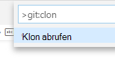
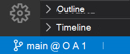
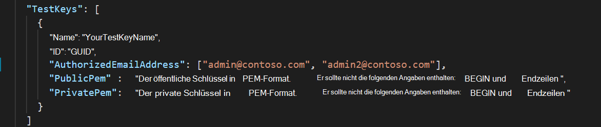
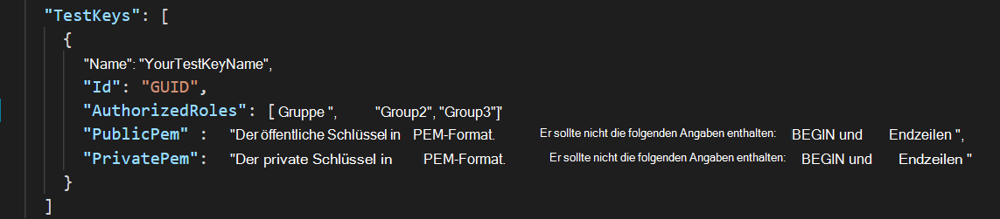
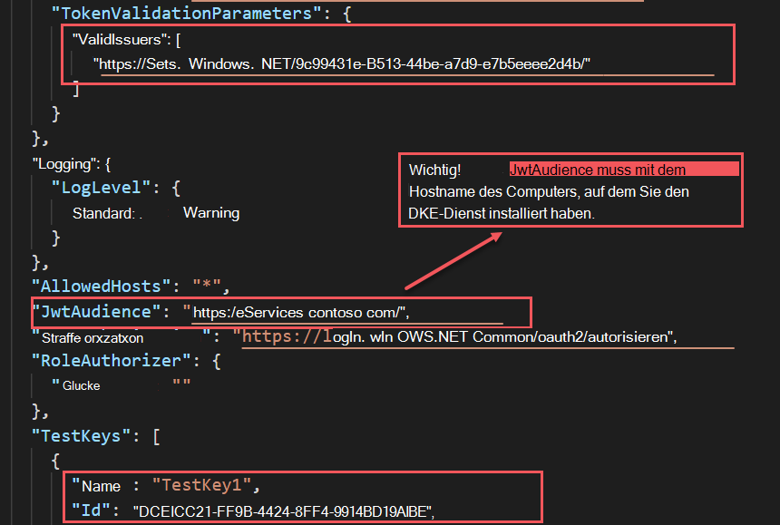
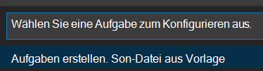
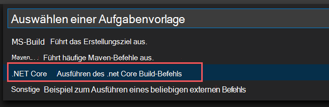

# <a name="double-key-encryption-for-microsoft-365"></a>Verschlüsselung mit Doppelschlüsseln für Microsoft 365

> *Gilt für: Verschlüsselung mit Doppelschlüsseln für Microsoft 365, [Microsoft 365 Compliance,](https://www.microsoft.com/microsoft-365/business/compliance-management) [Azure Information Protection](https://azure.microsoft.com/pricing/details/information-protection)*
>
> *Anweisungen für: [Azure Information Protection Unified Labeling Client für Windows](https://docs.microsoft.com/azure/information-protection/faqs#whats-the-difference-between-the-azure-information-protection-classic-and-unified-labeling-clients)*
>
> *Dienstbeschreibung für: [Microsoft 365 Compliance](https://docs.microsoft.com/office365/servicedescriptions/microsoft-365-service-descriptions/microsoft-365-tenantlevel-services-licensing-guidance/microsoft-365-security-compliance-licensing-guidance)*

Die Doppelschlüsselverschlüsselung (Double Key Encryption, DKE) verwendet zwei Schlüssel für den Zugriff auf geschützte Inhalte. Microsoft speichert einen Schlüssel in Microsoft Azure, und Sie halten den anderen Schlüssel. Sie behalten die vollständige Kontrolle über einen Ihrer Schlüssel mithilfe des Diensts für die Verschlüsselung von Doppelschlüsseln. Sie wenden Den Schutz mithilfe des Azure Information Protection einheitlichen Bezeichnungsclients auf Ihre hochgradig vertraulichen Inhalte an.

Die Verschlüsselung mit Doppelschlüssel unterstützt sowohl Cloud- als auch lokale Bereitstellungen. Diese Bereitstellungen tragen dazu bei, dass verschlüsselte Daten undurchsichtig bleiben, unabhängig davon, wo Sie die geschützten Daten speichern.

Weitere Informationen zu den standardmäßigen, cloudbasierten Mandantenstammschlüsseln finden Sie unter Planung und Implementierung Ihres [Azure Information Protection-Mandantenschlüssels.](https://docs.microsoft.com/azure/information-protection/plan-implement-tenant-key)

## <a name="when-your-organization-should-adopt-dke"></a>Wann Ihre Organisation DKE übernehmen soll

Die Verschlüsselung mit doppelschlüsseligem Schlüssel ist für Ihre vertraulichsten Daten vorgesehen, die den strengsten Schutzanforderungen unterliegen. DKE ist nicht für alle Daten vorgesehen. Im Allgemeinen verwenden Sie die Doppelschlüsselverschlüsselung, um nur einen kleinen Teil der Gesamtdaten zu schützen. Sie sollten sorgfältig daran gehen, die richtigen Daten zu identifizieren, die mit dieser Lösung vor der Bereitstellung zu abdecken sind. In einigen Fällen müssen Sie möglicherweise Ihren Umfang einengt und andere Lösungen für die meisten Daten verwenden, z. B. Microsoft Information Protection mit von Microsoft verwalteten Schlüsseln oder BYOK. Diese Lösungen sind ausreichend für Dokumente, die nicht erweiterten Schutz- und behördlichen Anforderungen unterliegen. Darüber hinaus können Sie mit diesen Lösungen die leistungsstärksten Office 365-Dienste verwenden. Dienste, die Sie nicht mit DKE-verschlüsselten Inhalten verwenden können. Zum Beispiel:

- Transportregeln, einschließlich Ansoftware und Spam, die einen Einblick in die Anlage erfordern
- Microsoft Delve
- eDiscovery
- Inhaltssuche und -indizierung
- Office Web Apps einschließlich der Funktion für die gemeinsamen Dokumentierung

Alle externen Anwendungen oder Dienste, die nicht über das MIP SDK in DKE integriert sind, können keine Aktionen für die verschlüsselten Daten ausführen.

Das Microsoft Information Protection SDK 1.7+ unterstützt die Verschlüsselung mit Doppelschlüsseln. Anwendungen, die in unser SDK integriert sind, können mit ausreichenden Berechtigungen und Integrationen über diese Daten verfügen.

Es wird empfohlen, dass Organisationen die Microsoft Information Protection-Funktionen (Klassifizierung und Bezeichnung) verwenden, um die meisten ihrer vertraulichen Daten zu schützen, und DKE nur für ihre unternehmenskritischen Daten verwenden. Die Verschlüsselung von Doppelschlüsseln ist für vertrauliche Daten in stark regulierten Branchen wie Finanzdienstleistungen und Gesundheitswesen relevant.

Wenn für Ihre Organisationen eine der folgenden Anforderungen erfüllt ist, können Sie DKE verwenden, um Ihre Inhalte zu schützen:

- Sie möchten sicherstellen, *dass unter* allen Umständen nur Sie geschützte Inhalte entschlüsseln können.
- Sie möchten nicht, dass Microsoft selbst Zugriff auf geschützte Daten hat.
- Sie haben gesetzliche Vorschriften, um Schlüssel innerhalb einer geografischen Grenze zu halten. Alle Schlüssel, die Sie für die Datenverschlüsselung und -entschlüsselung beibehalten, werden in Ihrem Rechenzentrum verwaltet.

## <a name="system-and-licensing-requirements-for-dke"></a>System- und Lizenzierungsanforderungen für DKE

**Die Verschlüsselung mit Doppelschlüsseln für Microsoft 365** ist in Microsoft 365 E5 verfügbar. Wenn Sie keine Microsoft 365 E5-Lizenz haben, können Sie sich für eine Testversion [registrieren.](https://aka.ms/M365E5ComplianceTrial) Weitere Informationen zu diesen Lizenzen finden Sie unter [Microsoft 365-Lizenzierungsanleitungen für](https://docs.microsoft.com/office365/servicedescriptions/microsoft-365-service-descriptions/microsoft-365-tenantlevel-services-licensing-guidance/microsoft-365-security-compliance-licensing-guidance)& Compliance.

**Azure Information Protection**. DKE arbeitet mit Vertraulichkeitsbezeichnungen und erfordert Azure Information Protection.

DkE-Vertraulichkeitsbezeichnungen werden Endbenutzern über das Menüband für Vertraulichkeit in Office Desktop Apps zur Verfügung stellen. Installieren Sie diese erforderlichen Komponenten auf jedem Clientcomputer, auf dem Sie geschützte Dokumente schützen und verwenden möchten.

**Microsoft Office Apps für Unternehmen** Version *.12711 oder höher (Desktopversionen von Word, PowerPoint und Excel) unter Windows.

**Azure Information Protection Unified Labeling Client,** Version 2.7.93.0 oder höher. Laden Sie den Unified Labeling-Client aus dem Microsoft Download Center herunter, und [installieren Sie den Client.](https://www.microsoft.com/download/details.aspx?id=53018)

## <a name="supported-environments-for-storing-and-viewing-dke-protected-content"></a>Unterstützte Umgebungen zum Speichern und Anzeigen von DKE-geschützten Inhalten

**Unterstützte Anwendungen**. [Microsoft 365 Apps for Enterprise Clients](https://www.microsoft.com/microsoft-365/business/microsoft-365-apps-for-enterprise-product) unter Windows, einschließlich Word, Excel und PowerPoint.

**Onlineinhaltsunterstützung**. Online gespeicherte Dokumente und Dateien in Microsoft SharePoint und OneDrive for Business werden unterstützt. Sie können verschlüsselte Inhalte per E-Mail freigeben, verschlüsselte Dokumente und Dateien können jedoch nicht online angezeigt werden. Stattdessen müssen Sie geschützte Inhalte mithilfe der Desktop-Apps auf Dem lokalen Computer anzeigen.

## <a name="overview-of-deploying-dke"></a>Übersicht über die Bereitstellung von DKE

Führen Sie die folgenden allgemeinen Schritte zum Einrichten von DKE aus. Nachdem Sie diese Schritte abgeschlossen haben, können Ihre Endbenutzer Ihre hochgradig vertraulichen Daten mit der Verschlüsselung mit doppelschlüsseligem Schlüssel schützen.

1. Bereitstellen des DKE-Diensts, wie in diesem Artikel beschrieben.

2. Erstellen Sie eine Bezeichnung mit doppelter Schlüsselverschlüsselung. Navigieren Sie zum Informationsschutz im [Microsoft 365 Compliance Center,](https://compliance.microsoft.com) und erstellen Sie eine neue Bezeichnung mit doppelter Schlüsselverschlüsselung. Weitere Informationen finden Sie unter Einschränken [des Zugriffs auf Inhalte mithilfe von Vertraulichkeitsbezeichnungen zum Anwenden von Verschlüsselung.](https://docs.microsoft.com/microsoft-365/compliance/encryption-sensitivity-labels)

3. Verwenden Sie Doppelschlüsselverschlüsselungsbezeichnungen. Schützen Sie Daten, indem Sie die Bezeichnung "Verschlüsselte Doppelschlüssel" im Menüband "Vertraulichkeit" in Microsoft Office.

Es gibt mehrere Möglichkeiten, einige der Schritte zum Bereitstellen der Doppelschlüsselverschlüsselung zu ausführen. Dieser Artikel enthält ausführliche Anweisungen, damit weniger erfahrene Administratoren den Dienst erfolgreich bereitstellen können. Wenn Sie damit gut zu tun haben, können Sie ihre eigenen Methoden verwenden.

## <a name="deploy-dke"></a>Bereitstellen von DKE

Dieser Artikel und das Bereitstellungsvideo verwenden Azure als Bereitstellungsziel für den DKE-Dienst. Wenn Sie an einem anderen Speicherort bereitstellen, müssen Sie Ihre eigenen Werte bereitstellen.

Sehen Sie [sich das Video zur Bereitstellung der](https://youtu.be/vDWfHN_kygg) Doppelschlüsselverschlüsselung an, um eine schrittweise Übersicht über die Konzepte in diesem Artikel zu erhalten. Das Video dauert etwa 18 Minuten.

Führen Sie die folgenden allgemeinen Schritte aus, um die Doppelschlüsselverschlüsselung für Ihre Organisation zu einrichten.

1. [Installieren der erforderlichen Software für den DKE-Dienst](#install-software-prerequisites-for-the-dke-service)
1. [Klonen des GitHub-Repositorys für die Doppelschlüsselverschlüsselung](#clone-the-dke-github-repository)
1. [Ändern von Anwendungseinstellungen](#modify-application-settings)
1. [Generieren von Testschlüsseln](#generate-test-keys)
1. [Erstellen des Projekts](#build-the-project)
1. [Bereitstellen des DKE-Diensts und Veröffentlichen des Schlüsselspeichers](#deploy-the-dke-service-and-publish-the-key-store)
1. [Überprüfen der Bereitstellung](#validate-your-deployment)
1. [Registrieren des Schlüsselspeichers](#register-your-key-store)
1. [Erstellen von Vertraulichkeitsbezeichnungen mithilfe von DKE](#create-sensitivity-labels-using-dke)
1. [Aktivieren von DKE in Ihrem Client](#enable-dke-in-your-client)
1. [Migrieren geschützter Dateien von den Bezeichnungen HYOK zu den DKE-Bezeichnungen](#migrate-protected-files-from-hyok-labels-to-dke-labels)

Wenn Sie fertig sind, können Sie Dokumente und Dateien mithilfe von DKE verschlüsseln. Weitere Informationen finden Sie unter [Anwenden von Vertraulichkeitsbezeichnungen auf Ihre Dateien und E-Mails in Office.](https://support.microsoft.com/office/2f96e7cd-d5a4-403b-8bd7-4cc636bae0f9)

### <a name="install-software-prerequisites-for-the-dke-service"></a>Installieren der erforderlichen Software für den DKE-Dienst

Installieren Sie diese erforderlichen Komponenten auf dem Computer, auf dem Sie den DKE-Dienst installieren möchten.

**.NET Core 3.1 SDK**. Laden Sie das SDK von [Download .NET Core 3.1 herunter, und installieren Sie es.](https://dotnet.microsoft.com/download/dotnet-core/3.1)

**Visual Studio Code**. Laden Visual Studio Code von [https://code.visualstudio.com/](https://code.visualstudio.com) herunter. Führen Sie nach der Installation Visual Studio Code aus, und wählen Sie **"Ansichtserweiterungen"** \> **aus.** Installieren Sie diese Erweiterungen.

- C# für Visual Studio Code

- NuGet Paket-Manager

**Git-Ressourcen**. Laden Sie eine der folgenden Komponenten herunter, und installieren Sie sie.

- [Git](https://git-scm.com/downloads)

- [GitHub Desktop](https://desktop.github.com/)

- [GitHub Enterprise](https://github.com/enterprise)

**OpenSSL** Sie müssen [OpenSSL installiert haben,](https://slproweb.com/products/Win32OpenSSL.html) um [Testschlüssel zu generieren,](#generate-test-keys) nachdem Sie DKE bereitgestellt haben. Stellen Sie sicher, dass Sie es korrekt über den Pfad der Umgebungsvariablen aufrufen. Weitere Informationen finden Sie unter "Hinzufügen des Installationsverzeichnisses zu [https://www.osradar.com/install-openssl-windows/](https://www.osradar.com/install-openssl-windows/) PATH".

### <a name="clone-the-dke-github-repository"></a>Klonen des DKE-GitHub-Repositorys

Microsoft stellt die DKE-Quelldateien in einem GitHub-Repository bereit. Sie klonen das Repository, um das Projekt zur Verwendung in Ihrer Organisation lokal zu erstellen. Das DKE-GitHub-Repository befindet sich unter [https://github.com/Azure-Samples/DoubleKeyEncryptionService](https://github.com/Azure-Samples/DoubleKeyEncryptionService) .

Die folgenden Anweisungen sind für unerfahrene Git- oder Visual Studio Codebenutzer vorgesehen:

1. Wechseln Sie in Ihrem Browser zu: [https://github.com/Azure-Samples/DoubleKeyEncryptionService](https://github.com/Azure-Samples/DoubleKeyEncryptionService) .

2. Wählen Sie auf der rechten Seite des Bildschirms **Code aus.** In Ihrer Version der Benutzeroberfläche wird möglicherweise eine **Klon- oder Downloadschaltfläche** angezeigt. Wählen Sie dann in der angezeigten Dropdownliste das Kopiersymbol aus, um die URL in die Zwischenablage zu kopieren.

    Zum Beispiel:

   > [!div class="mx-imgBorder"]
   > 

3. Wählen Visual Studio Code "Befehlspalette  \> **anzeigen" und** dann **"Git: Klonen" aus.** Um zu der Option in der Liste zu springen, beginnen Sie mit der Eingabe, um die Einträge zu filtern, und wählen Sie sie dann aus der `git: clone` Dropdownliste aus. Zum Beispiel:

   > [!div class="mx-imgBorder"]
   > 

4. Fügen Sie in das Textfeld die URL ein, die Sie aus Git kopiert haben, und wählen Sie **"Clone" aus GitHub aus.**

5. Navigieren Sie **im angezeigten** Dialogfeld "Ordner auswählen" zu einem Speicherort, und wählen Sie diesen aus. Wählen Sie an der Eingabeaufforderung **"Öffnen" aus.**

    The repository opens in Visual Studio Code, and displays the current Git branch at the bottom left. Die Verzweigung sollte z. B. haupt **sein.** Zum Beispiel:

   

6. Wenn Sie nicht in der Hauptverzweigung sind, müssen Sie sie auswählen. Wählen Visual Studio Code die Verzweigung und die Hauptauswahl **aus** der Liste der angezeigten Zweigstellen aus.

   > [!IMPORTANT]
   > Durch Auswählen der Hauptverzweigung wird sichergestellt, dass Sie über die richtigen Dateien zum Erstellen des Projekts verfügen. Wenn Sie nicht die richtige Verzweigung auswählen, kann ihre Bereitstellung nicht mehr verwendet werden.

Sie haben nun Ihr DKE-Quellrepository lokal eingerichtet. Ändern Sie [als Nächstes die Anwendungseinstellungen](#modify-application-settings) für Ihre Organisation.

### <a name="modify-application-settings"></a>Ändern von Anwendungseinstellungen

Zum Bereitstellen des DKE-Diensts müssen Sie die folgenden Arten von Anwendungseinstellungen ändern:

- [Zugriffseinstellungen für Schlüssel](#key-access-settings)
- [Mandanten- und Schlüsseleinstellungen](#tenant-and-key-settings)

Sie ändern anwendungseinstellungen in der appsettings.jsdatei. Diese Datei befindet sich im DoubleKeyEncryptionService-Repository, das Sie lokal unter "DoubleKeyEncryptionService\src\customer-key-store" geklont haben. Beispielsweise können Sie in Visual Studio Code zu der Datei navigieren, wie in der folgenden Abbildung dargestellt.


#### <a name="key-access-settings"></a>Zugriffseinstellungen für Schlüssel

Wählen Sie aus, ob die E-Mail- oder Rollenautorisierung verwendet werden soll. DKE unterstützt immer nur eine dieser Authentifizierungsmethoden.

- **E-Mail-Autorisierung**. Ermöglicht Ihrer Organisation, den Zugriff auf Schlüssel nur basierend auf E-Mail-Adressen zu autorisieren.

- **Rollenautorisierung**. Ermöglicht Ihrer Organisation, den Zugriff auf Schlüssel basierend auf Active Directory-Gruppen zu autorisieren, und erfordert, dass der Webdienst LDAP abfragen kann.

**So legen Sie Schlüsselzugriffseinstellungen für DKE mithilfe der E-Mail-Autorisierung**

1. Öffnen Sie **dieappsettings.jsdatei,** und suchen Sie die `AuthorizedEmailAddress` Einstellung.

2. Fügen Sie die E-Mail-Adressen hinzu, die Sie autorisieren möchten. Trennen Sie mehrere E-Mail-Adressen durch doppelte Anführungszeichen und Kommas. Zum Beispiel:

   ```json
   "AuthorizedEmailAddress": ["email1@company.com", "email2@company.com ", "email3@company.com"]
   ```

3. Suchen Sie die `LDAPPath` Einstellung, und entfernen Sie den Text `If you use role authorization (AuthorizedRoles) then this is the LDAP path.` zwischen den doppelten Anführungszeichen. Lassen Sie die doppelten Anführungszeichen stehen. Wenn Sie fertig sind, sollte die Einstellung wie hier aussehen.

   ```json
   "LDAPPath": ""
   ```

4. Suchen Sie die `AuthorizedRoles` Einstellung, und löschen Sie die gesamte Zeile.

Diese Abbildung zeigt die **appsettings.jsdatei,** die ordnungsgemäß für die E-Mail-Autorisierung formatiert ist.

   

**So legen Sie schlüsselzugriffseinstellungen für DKE mithilfe der Rollenautorisierung**

1. Öffnen Sie **appsettings.jsdatei,** und suchen Sie die `AuthorizedRoles` Einstellung.

2. Fügen Sie die Active Directory-Gruppennamen hinzu, die Sie autorisieren möchten. Trennen Sie mehrere Gruppennamen durch doppelte Anführungszeichen und Kommas. Zum Beispiel:

   ```json
   "AuthorizedRoles": ["group1", "group2", "group3"]
   ```

3. Suchen Sie die `LDAPPath` Einstellung, und fügen Sie die Active Directory-Domäne hinzu. Zum Beispiel:

   ```json
   "LDAPPath": "contoso.com"
   ```

4. Suchen Sie die `AuthorizedEmailAddress` Einstellung, und löschen Sie die gesamte Zeile.

Diese Abbildung zeigt die **appsettings.jsdatei,** die ordnungsgemäß für die Rollenautorisierung formatiert ist.

   

#### <a name="tenant-and-key-settings"></a>Mandanten- und Schlüsseleinstellungen

Die Einstellungen für den Mandanten und die Schlüssel von DKE befinden sich inappsettings.js **Datei.**

**So konfigurieren Sie Mandanten- und Schlüsseleinstellungen für DKE**

1. Öffnen Sie **dieappsettings.jsOn-Datei.**

2. Suchen Sie die `ValidIssuers` Einstellung, und ersetzen `<tenantid>` Sie sie durch Ihre Mandanten-ID. Sie können Ihre Mandanten-ID finden, indem Sie zum Azure-Portal gehen und die [Mandanteneigenschaften anzeigen.](https://aad.portal.azure.com/#blade/Microsoft_AAD_IAM/ActiveDirectoryMenuBlade/Properties) Zum Beispiel:

   ```json
   "ValidIssuers": [
     "https://sts.windows.net/9c99431e-b513-44be-a7d9-e7b500002d4b/"
   ]
   ```

Suchen Sie die `JwtAudience` . Ersetzen `<yourhostname>` Sie den Hostnamen des Computers, auf dem der DKE-Dienst ausgeführt wird. Zum Beispiel:

  > [!IMPORTANT]
  > Der Wert für `JwtAudience` muss exakt mit dem Namen Ihres Hosts *übereinstimmen.* Sie können **localhost:5001 beim Debuggen** verwenden. Wenn Sie jedoch mit dem Debuggen fertig sind, müssen Sie diesen Wert auf den Hostnamen des Servers aktualisieren.

- `TestKeys:Name`. Geben Sie einen Namen für Ihren Schlüssel ein. Beispiel: `TestKey1`
- `TestKeys:Id`. Erstellen Sie eine GUID, und geben Sie sie als Wert `TestKeys:ID` ein. Beispiel: `DCE1CC21-FF9B-4424-8FF4-9914BD19A1BE`. Sie können eine Website wie [den Online-GUID-Generator](https://guidgenerator.com/) verwenden, um eine GUID nach dem Zufallsprinzip zu generieren.

Diese Abbildung zeigt das richtige Format für Mandanten- und Schlüsseleinstellungen in **appsettings.json .** `LDAPPath` ist für die Rollenautorisierung konfiguriert.



### <a name="generate-test-keys"></a>Generieren von Testschlüsseln

Nachdem Sie Ihre Anwendungseinstellungen definiert haben, können Sie öffentliche und private Testschlüssel generieren.

So generieren Sie Schlüssel:

1. Führen Sie im Startmenü von Windows die OpenSSL-Eingabeaufforderung aus.

2. Wechseln Sie zu dem Ordner, in dem Sie die Testschlüssel speichern möchten. Die Dateien, die Sie durch Ausführen der Schritte in dieser Aufgabe erstellen, werden im gleichen Ordner gespeichert.

3. Generieren Sie den neuen Testschlüssel.

   ```console
   openssl req -x509 -newkey rsa:2048 -keyout key.pem -out cert.pem -days 365
   ```

4. Generieren Sie den privaten Schlüssel.

   ```console
   openssl rsa -in key.pem -out privkeynopass.pem
   ```

5. Generieren Sie den öffentlichen Schlüssel.

   ```console
   openssl rsa -in key.pem -pubout > pubkeyonly.pem
   ```

6. Öffnen Sie in einem Texteditor **pubkeyonly.pem**. Kopieren Sie den inhalt in der Datei **pubkeyonly.pem** mit Ausnahme der ersten und letzten Zeilen in den Abschnittappsettings.js`PublicPem` **On-Datei.**

7. Öffnen Sie in einem Texteditor **"privkeynopass.pem".** Kopieren Sie den inhalt in der **Datei "privkeynopass.pem"** mit Ausnahme der ersten und letzten Zeilen in den Abschnittappsettings.js`PrivatePem` **Datei.**

8. Entfernen Sie alle Leerzeichen und Zeilenlinien in der `PublicPem` und in den `PrivatePem` Abschnitten.

    > [!IMPORTANT]
    > Wenn Sie diesen Inhalt kopieren, löschen Sie keine der PEM-Daten.

9. Navigieren Visual Studio Code zur **Startup.cs** Datei. Diese Datei befindet sich im DoubleKeyEncryptionService-Repository, das Sie lokal unter "DoubleKeyEncryptionService\src\customer-key-store\" geklont haben.

10. Suchen Sie die folgenden Zeilen:

    ```csharp
        #if USE_TEST_KEYS
        #error !!!!!!!!!!!!!!!!!!!!!! Use of test keys is only supported for testing,
        DO NOT USE FOR PRODUCTION !!!!!!!!!!!!!!!!!!!!!!!!!!!!!
        services.AddSingleton<ippw.IKeyStore, ippw.TestKeyStore>();
        #endif
    ```

11. Ersetzen Sie diese Zeilen durch den folgenden Text:

    ```csharp
    services.AddSingleton<ippw.IKeyStore, ippw.TestKeyStore>();
    ```

    Die Endergebnisse sollten in etwa wie folgt aussehen.

    

Jetzt können Sie Ihr [DKE-Projekt erstellen.](#build-the-project)

### <a name="build-the-project"></a>Erstellen des Projekts

Verwenden Sie die folgenden Anweisungen zum lokalen Erstellen des DKE-Projekts:

1. Wählen Visual Studio Code im REPOSITORY des DKE-Diensts die Option "Befehlspalette  anzeigen" aus, und geben Sie dann \>  **build** an der Eingabeaufforderung ein.

2. Wählen Sie in der Liste **"Tasks: Run build task" aus.**

   Wenn keine Buildaufgaben gefunden wurden, wählen Sie **"Buildaufgabe** konfigurieren" aus, und erstellen Sie eine für .NET Core wie folgt.

   

   1. Choose **Create tasks.json from template**.

      

   2. Wählen Sie in der Liste der Vorlagentypen **.NET Core aus.**

      

   3. Suchen Sie im Buildabschnitt den Pfad zur **Datei "customerkeystore.csproj".** Wenn sie nicht da ist, fügen Sie die folgende Zeile hinzu:

      ```json
      "${workspaceFolder}/src/customer-key-store/customerkeystore.csproj",
      ```

   4. Führen Sie den Build erneut aus.

3. Stellen Sie sicher, dass im Ausgabefenster keine roten Fehler angezeigt werden.

   Wenn rote Fehler auftreten, überprüfen Sie die Konsolenausgabe. Stellen Sie sicher, dass Sie alle vorherigen Schritte ordnungsgemäß ausgeführt haben und die richtigen Buildversionen vorhanden sind.

4. Wählen **Sie** \> **"Debuggen ausführen"** aus, um den Prozess zu debuggen. Wenn Sie aufgefordert werden, eine Umgebung auszuwählen, wählen Sie **.NET Core aus.**

   Der .NET Core-Debugger wird in der Regel mit `https://localhost:5001` gestartet. Zum Anzeigen des Testschlüssels wechseln Sie zu und fügen einen Schrägstrich (/) und den Namen `https://localhost:5001` Ihres Schlüssels an. Zum Beispiel:

   ```https
   https://localhost:5001/TestKey1
   ```

   Der Schlüssel sollte im JSON-Format angezeigt werden.

Das Setup ist nun abgeschlossen. Bevor Sie den Keystore in appsettings.json für die Einstellung JwtAudience veröffentlichen, stellen Sie sicher, dass der Wert für hostname genau mit Ihrem App-Dienst-Hostnamen entspricht. Möglicherweise haben Sie es in "localhost" geändert, um probleme mit dem Build zu beheben.

### <a name="deploy-the-dke-service-and-publish-the-key-store"></a>Bereitstellen des DKE-Diensts und Veröffentlichen des Schlüsselspeichers

Stellen Sie den Dienst für Produktionsbereitstellungen entweder in einer Drittanbieter-Cloud oder in einem lokalen [System zur Veröffentlichung zur Verfügung.](https://docs.microsoft.com/aspnet/core/tutorials/publish-to-iis?view=aspnetcore-3.1&preserve-view=true&tabs=netcore-cli)

Möglicherweise bevorzugen Sie andere Methoden zum Bereitstellen ihrer Schlüssel. Wählen Sie die Methode aus, die für Ihre Organisation am besten funktioniert.

Für Pilotbereitstellungen können Sie in Azure bereitstellen und sofort los damit beginnen.

**So erstellen Sie eine Azure Web App-Instanz zum Hosten Ihrer DKE-Bereitstellung**

Um den Schlüsselspeicher zu veröffentlichen, erstellen Sie eine Azure App Service-Instanz als Host für Ihre DKE-Bereitstellung. Als Nächstes veröffentlichen Sie Ihre generierten Schlüssel in Azure.

1. Melden Sie sich in Ihrem Browser beim [Microsoft Azure-Portal](https://ms.portal.azure.com)an, und wechseln Sie zu **"App Services**  >  **Hinzufügen".**

2. Wählen Sie Ihr Abonnement und Ihre Ressourcengruppe aus, und definieren Sie Ihre Instanzdetails.

   - Geben Sie den Hostnamen des Computers ein, auf dem Sie den DkE-Dienst installieren möchten. Stellen Sie sicher, dass der Name mit dem Namen identisch ist, der für die Einstellung "JwtAudience" in der Datei [**appsettings.jsist.**](#tenant-and-key-settings) Der Wert, den Sie für den Namen bereitstellen, ist auch der WebAppInstanceName.

   - Wählen **Sie für "Veröffentlichen",** **"Code"** und für den **Laufzeitstapel** **.NET Core 3.1 aus.**

   Zum Beispiel:

   > [!div class="mx-imgBorder"]
   > 

3. At the bottom of the page, select **Review + create**, and then select **Add**.

4. Gehen Sie wie folgt vor, um die generierten Schlüssel zu veröffentlichen:

   - [Veröffentlichen über ZipDeployUI](#publish-via-zipdeployui)
   - [Veröffentlichen per FTP](#publish-via-ftp)
   - [Veröffentlichen über Visual Studio 2019 oder höher](https://docs.microsoft.com/aspnet/core/tutorials/)

#### <a name="publish-via-zipdeployui"></a>Veröffentlichen über ZipDeployUI

1. Wechseln Sie zu `https://<WebAppInstanceName>.scm.azurewebsites.net/ZipDeployUI`.

   Beispiel: https://dkeservice.scm.azurewebsites.net/ZipDeployUI

2. Wechseln Sie in der Codebasis für den Schlüsselspeicher zum Ordner **"customer-key-store\src\customer-key-store",** und stellen Sie sicher, dass dieser Ordner die Datei **"customerkeystore.csproj"** enthält.

3. Ausführen: **dotnet publish**

   Im Ausgabefenster wird das Verzeichnis angezeigt, in dem die Veröffentlichung bereitgestellt wurde.

   Beispiel: `customer-key-store\src\customer-key-store\bin\Debug\netcoreapp3.1\publish\`

4. Senden Sie alle Dateien im Veröffentlichungsverzeichnis an eine ZIP-Datei. Stellen Sie beim Erstellen der ZIP-Datei sicher, dass sich alle Dateien im Verzeichnis auf der Stammebene der ZIP-Datei befinden.

5. Ziehen Und ablegen Sie die ZIP-Datei, die Sie erstellen, auf die ZipDeployUI-Website, die Sie oben geöffnet haben. Beispiel: https://dkeservice.scm.azurewebsites.net/ZipDeployUI

DKE wird bereitgestellt, und Sie können zu den von Ihnen erstellten Testschlüsseln navigieren. Fahren Sie mit [der Überprüfung Ihrer Bereitstellung weiter](#validate-your-deployment) unten fort.

#### <a name="publish-via-ftp"></a>Veröffentlichen per FTP

1. Stellen Sie eine Verbindung mit dem app-Dienst, den Sie oben [erstellt.](#deploy-the-dke-service-and-publish-the-key-store)

   Wechseln Sie in Ihrem Browser zu: **Azure portal**  >  **App Service** Deployment  >  **Center**  >  **Manual Deployment**  >  **FTP**  >  **Dashboard**.

2. Kopieren Sie die angezeigten Verbindungszeichenfolgen in eine lokale Datei. Sie verwenden diese Zeichenfolgen, um eine Verbindung mit dem Web -App-Dienst herzustellen und Dateien per FTP hochzuladen.

   Zum Beispiel:

   

3. Wechseln Sie in der Codebasis für den Schlüsselspeicher zum Verzeichnis **"customer-key-store\src\customer-key-store".**

4. Stellen Sie sicher, dass dieses Verzeichnis die **Datei "customerkeystore.csproj"** enthält.

5. Ausführen: **dotnet publish**

   Die Ausgabe enthält das Verzeichnis, in dem die Veröffentlichung bereitgestellt wurde.

   Beispiel: `customer-key-store\src\customer-key-store\bin\Debug\netcoreapp3.1\publish\`

6. Senden Sie alle Dateien im Veröffentlichungsverzeichnis an eine ZIP-Datei. Stellen Sie beim Erstellen der ZIP-Datei sicher, dass sich alle Dateien im Verzeichnis auf der Stammebene der ZIP-Datei befinden.

7. Verwenden Sie von Ihrem FTP-Client die Verbindungsinformationen, die Sie kopiert haben, um eine Verbindung mit Ihrem App-Dienst herzustellen. Laden Sie die ZIP-Datei, die Sie im vorherigen Schritt erstellt haben, in das Stammverzeichnis Ihrer Web App hoch.

DKE wird bereitgestellt, und Sie können zu den von Ihnen erstellten Testschlüsseln navigieren. Überprüfen Sie [als Nächstes Ihre Bereitstellung.](#validate-your-deployment)

### <a name="validate-your-deployment"></a>Überprüfen der Bereitstellung

Überprüfen Sie nach der Bereitstellung von DKE mithilfe einer der oben beschriebenen Methoden die Bereitstellung und die wichtigsten Speichereinstellungen.

Führen Sie dies aus:

```powershell
src\customer-key-store\scripts\key_store_tester.ps1 dkeserviceurl/mykey
```

Beispiel:

```powershell
key_store_tester.ps1 https://mydkeservice.com/mykey
```

Stellen Sie sicher, dass in der Ausgabe keine Fehler angezeigt werden. Wenn Sie bereit sind, registrieren [Sie Ihren Schlüsselspeicher.](#register-your-key-store)

Bei dem Schlüsselnamen wird die Kleinschreibung beachtet. Geben Sie den Schlüsselnamen so ein, wie er in der Datei appsettings.jswird.

## <a name="register-your-key-store"></a>Registrieren des Schlüsselspeichers

Mit den folgenden Schritten können Sie Ihren DKE-Dienst registrieren. Die Registrierung Ihres DKE-Diensts ist der letzte Schritt bei der Bereitstellung von DKE, bevor Sie mit dem Erstellen von Bezeichnungen beginnen können.

So registrieren Sie den DKE-Dienst:

1. Öffnen Sie in Ihrem Browser das [Microsoft Azure-Portal,](https://ms.portal.azure.com/)und wechseln Sie zu **"All Services** \> **Identity** \> **App Registrations".**

2. Wählen **Sie "Neue Registrierung"** aus, und geben Sie einen aussagekräftigen Namen ein.

3. Wählen Sie einen Kontotyp aus den angezeigten Optionen aus.

   Wenn Sie Microsoft Azure mit einer nicht benutzerdefinierten Domäne wie **onmicrosoft.com** verwenden, wählen Sie nur Konten in diesem Organisationsverzeichnis **aus (nur Microsoft – einzelner Mandant).**

   Zum Beispiel:

   > [!div class="mx-imgBorder"]
   > 

4. Wählen Sie unten auf der Seite **"Registrieren"** aus, um die neue App-Registrierung zu erstellen.

5. Wählen Sie in Der neuen App-Registrierung im linken Bereich unter **"Verwalten"** die Option **"Authentifizierung" aus.**

6. Wählen Sie **"Plattform hinzufügen" aus.**

7. Wählen Sie **im Popup "Plattformen** konfigurieren" die **Option "Web" aus.**

8. Geben **Sie unter "Umleitungs-URIs"** den URI Des Verschlüsselungsdiensts mit Doppelschlüssel ein. Geben Sie die App-Dienst-URL ein, einschließlich hostname und domäne.

   Beispiel: https://mydkeservicetest.com

   - Die von Ihnen eingegebene URL muss mit dem Hostnamen übereinstimmen, unter dem Ihr DKE-Dienst bereitgestellt wird.
   - Wenn Sie lokal mit einem Visual Studio testen, verwenden Sie **https://localhost:5001** .
   - In allen Fällen muss das Schema **https sein.**

   Stellen Sie sicher, dass der Hostname exakt dem Hostnamen des App-Diensts entspricht. Möglicherweise haben Sie es geändert, `localhost` um eine Problembehandlung für den Build zu erstellen. In **appsettings.json** ist dieser Wert der Hostname, den Sie für festgelegt `JwtAudience` haben.

9. Aktivieren **Sie unter Implizite** Gewährung das Kontrollkästchen **"ID-Token".**

10. Wählen Sie **Speichern** aus, um Ihre Änderungen zu speichern.

11. Wählen Sie im linken Bereich **"API verfügbar** machen" und dann neben "Anwendungs-ID-URI" die Option **"Festlegen" aus.**

12. Wählen Sie auf der Seite  **"API verfügbar** machen" in den von diesem API-Bereich definierten Bereich die Option **"Bereich hinzufügen" aus.** Im neuen Bereich:

    1. Definieren Sie den Bereichsnamen **als user_impersonation.**

    2. Wählen Sie die Administratoren und Benutzer aus, die zustimmen können.

    3. Definieren Sie alle verbleibenden erforderlichen Werte.

    4. Klicken Sie auf **Bereich hinzufügen**.

    5. Wählen **Sie oben** "Speichern" aus, um Ihre Änderungen zu speichern.

13. Wählen Sie auf der **Seite "API verfügbar** machen" im Bereich **"Autorisierte Clientanwendungen"** die Option **"Clientanwendung hinzufügen" aus.**

    In der neuen Clientanwendung:

    1. Definieren Sie die Client-ID als **d3590ed6-52b3-4102-aeff-aad2292ab01c**. Dieser Wert ist die Microsoft Office Client-ID und ermöglicht Es Office, ein Zugriffstoken für Ihren Schlüsselspeicher abzurufen.

    2. Wählen **Sie unter "Autorisierte Bereiche"** den **user_impersonation** aus.

    3. Wählen Sie **Anwendung hinzufügen** aus.

    4. Wählen **Sie oben** "Speichern" aus, um Ihre Änderungen zu speichern.

Ihr DKE-Dienst ist jetzt registriert. Fahren Sie fort, [indem Sie Bezeichnungen mithilfe von DKE erstellen.](#create-sensitivity-labels-using-dke)

## <a name="create-sensitivity-labels-using-dke"></a>Erstellen von Vertraulichkeitsbezeichnungen mithilfe von DKE

Erstellen Sie im Microsoft 365 Compliance Center eine neue Vertraulichkeitsbezeichnung, und wenden Sie die Verschlüsselung wie andernfalls an. Wählen **Sie "Doppelschlüsselverschlüsselung verwenden"** aus, und geben Sie die Endpunkt-URL für Ihren Schlüssel ein.

Zum Beispiel:

> [!div class="mx-imgBorder"]
> 

Alle hinzugefügten DKE-Bezeichnungen werden benutzern in den neuesten Versionen von Microsoft 365 Apps for Enterprise angezeigt.

> [!NOTE]
> Es kann bis zu 24 Stunden dauern, bis die Clients mit den neuen Bezeichnungen aktualisiert werden.

### <a name="enable-dke-in-your-client"></a>Aktivieren von DKE in Ihrem Client

Wenn Sie ein Office-Insider sind, ist DKE für Sie aktiviert. Aktivieren Sie andernfalls DKE für Ihren Client, indem Sie die folgenden Registrierungsschlüssel hinzufügen:

```console
   [HKEY_LOCAL_MACHINE\SOFTWARE\WOW6432Node\Microsoft\MSIPC\flighting]
   "DoubleKeyProtection"=dword:00000001

   [HKEY_LOCAL_MACHINE\SOFTWARE\Microsoft\MSIPC\flighting]
   "DoubleKeyProtection"=dword:00000001
```

## <a name="migrate-protected-files-from-hyok-labels-to-dke-labels"></a>Migrieren geschützter Dateien von den Bezeichnungen HYOK zu den DKE-Bezeichnungen

Wenn Sie möchten, können Sie nach Abschluss der Einrichtung von DKE Inhalte, die Sie mithilfe von "HYOK"-Bezeichnungen geschützt haben, zu den DKE-Bezeichnungen migrieren. Zum Migrieren verwenden Sie den AIP-Scanner. Informationen zu den ersten Schritte mit dem Scanner finden Sie unter [Was ist der Azure Information Protection-Scanner für einheitliche Bezeichnungen?](https://docs.microsoft.com/azure/information-protection/deploy-aip-scanner)

Wenn Sie keine Inhalte migrieren, bleiben Ihre durch HYOK geschützten Inhalte davon unberührt.
