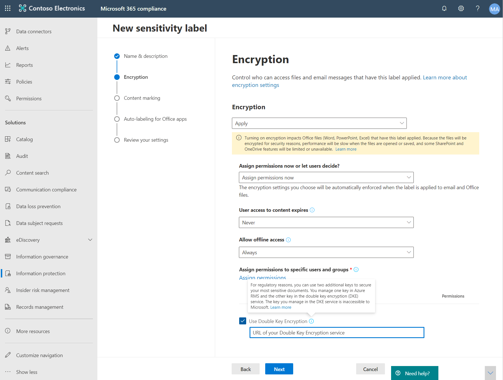

# <a name="double-key-encryption-for-microsoft-365"></a>Doppelschlüssel Verschlüsselung für Microsoft 365

> *Gilt für: Doppelschlüssel Verschlüsselung für Microsoft 365, [Microsoft 365-Konformität](https://www.microsoft.com/microsoft-365/business/compliance-management), [Azure Information Protection](https://azure.microsoft.com/pricing/details/information-protection)*
>
> *Anweisungen für: [Azure Information Protection Unified Labeling-Client für Windows](https://docs.microsoft.com/azure/information-protection/faqs#whats-the-difference-between-the-azure-information-protection-classic-and-unified-labeling-clients)*
>
> *Dienstbeschreibung für: [Microsoft 365 Compliance](https://docs.microsoft.com/office365/servicedescriptions/microsoft-365-service-descriptions/microsoft-365-tenantlevel-services-licensing-guidance/microsoft-365-security-compliance-licensing-guidance)*

Bei der Doppelschlüssel Verschlüsselung (Double Key Encryption, DKE) werden zwei Schlüssel zusammen verwendet, um auf geschützte Inhalte zuzugreifen. Microsoft speichert einen Schlüssel in Microsoft Azure, und Sie halten den anderen Schlüssel. Sie behalten die volle Kontrolle über einen Ihrer Schlüssel mithilfe des doppelten Schlüssels Verschlüsselungs Diensts. Sie wenden Schutz mit dem Unified Labeling-Client für Azure Information Protection auf Ihre hochgradig vertraulichen Inhalte an.

Die Doppelschlüssel Verschlüsselung unterstützt sowohl Cloud-als auch lokale Bereitstellungen. Mithilfe dieser Bereitstellungen kann sichergestellt werden, dass verschlüsselte Daten immer deckend bleiben, wenn Sie die geschützten Daten speichern.

Weitere Informationen zu den standardmäßigen cloudbasierten Mandantenstamm Schlüsseln finden Sie unter [Planning and Implementing your Azure Information Protection Mandant Key](https://docs.microsoft.com/azure/information-protection/plan-implement-tenant-key).

## <a name="when-your-organization-should-adopt-dke"></a>Wenn Ihre Organisation DKE annehmen sollte

Die Verschlüsselung mit doppeltem Schlüssel richtet sich an Ihre vertraulichsten Daten, die den strengsten Schutzanforderungen unterliegen. DKE ist nicht für alle Daten vorgesehen. Im Allgemeinen verwenden Sie die Doppelschlüssel Verschlüsselung, um nur einen sehr kleinen Teil ihrer Gesamtdaten zu schützen. Bei der Ermittlung der richtigen Daten, die mit dieser Lösung abgedeckt werden sollen, sollten Sie vor der Bereitstellung sorgfältig vorgehen. In einigen Fällen müssen Sie möglicherweise Ihren Bereich einschränken und andere Lösungen für den Großteil ihrer Daten verwenden, beispielsweise Microsoft Information Protection mit von Microsoft verwalteten Schlüsseln oder BYOK. Diese Lösungen reichen für Dokumente aus, die nicht erweiterten Schutzbestimmungen und behördlichen Anforderungen unterliegen. Außerdem können Sie mit diesen Lösungen die leistungsstärksten Office 365 Dienste verwenden. Dienste, die Sie nicht mit verschlüsselten DKE-Inhalten verwenden können. Beispiel:

- Transport Regeln einschließlich Schadsoftware und Spam, die eine Sichtbarkeit der Anlage erfordern
- Microsoft eintauchen
- eDiscovery
- Inhaltssuche und Indizierung
- Office-Webanwendungen einschließlich Funktionen für die gemeinsame Dokumenterstellung

Externe Anwendungen oder Dienste, die nicht über das MIP-SDK in DKE integriert sind, können keine Aktionen für die verschlüsselten Daten durchführen.

Das Microsoft Information Protection-SDK 1.7 + unterstützt die Doppelschlüssel Verschlüsselung; Anwendungen, die in unser SDK integriert sind, können diese Daten mit ausreichender Berechtigung und integrierter Integration überdenken.

Wir empfehlen, dass Organisationen Microsoft Information Protection-Funktionen (Klassifizierung und Kennzeichnung) verwenden, um die meisten Ihrer vertraulichen Daten zu schützen und nur DKE für Ihre unternehmenswichtigen Daten zu verwenden. Die Doppelschlüssel Verschlüsselung ist besonders für extrem vertrauliche Daten in stark regulierten Branchen wie Finanzdienstleistungen und Healthcare relevant.

Wenn Ihre Organisationen eine der folgenden Anforderungen haben, können Sie DKE verwenden, um Ihre Inhalte zu schützen:

- Sie möchten sicherstellen, dass *nur Sie* geschützte Inhalte immer entschlüsseln können, unter allen Umständen.
- Sie möchten nicht, dass Microsoft selbst Zugriff auf geschützte Daten hat.
- Sie haben regulatorische Anforderungen, um Schlüssel innerhalb einer geografischen Grenze zu halten. Alle Schlüssel, die Sie für die Datenverschlüsselung und-Entschlüsselung speichern, werden in Ihrem Rechenzentrum verwaltet.

## <a name="system-and-licensing-requirements-for-dke"></a>System-und Lizenzierungsanforderungen für DKE

Die **Doppelschlüssel Verschlüsselung für Microsoft 365** wird mit Microsoft 365 E5 und Office 365 E5 ausgeliefert. Wenn Sie nicht über eine Microsoft 365 E5-Lizenz verfügen, können Sie sich für eine [Testversion](https://aka.ms/M365E5ComplianceTrial)registrieren. Weitere Informationen zu diesen Lizenzen finden Sie unter [Microsoft 365 Licensing Guidance for Security & Compliance](https://docs.microsoft.com/office365/servicedescriptions/microsoft-365-service-descriptions/microsoft-365-tenantlevel-services-licensing-guidance/microsoft-365-security-compliance-licensing-guidance).

**Azure Information Protection**. DKE arbeitet mit Sensitivitäts Bezeichnungen und benötigt Azure Information Protection.

DKE-Sensitivitäts Bezeichnungen werden Endbenutzern über das Menüband "Empfindlichkeit" in Office-Desktop Apps zur Verfügung gestellt. Installieren Sie diese Voraussetzungen auf jedem Clientcomputer, auf dem geschützte Dokumente geschützt und verwendet werden sollen.

**Microsoft Office Apps für Enterprise** -Version *. 12711 oder höher (Desktop Versionen von Word, PowerPoint und Excel) unter Windows.

**Azure Information Protection Unified Labelling-Client** Versionen 2.7.93.0 oder höher. Laden Sie den Unified Labeling-Client aus dem [Microsoft Download Center](https://www.microsoft.com/download/details.aspx?id=53018)herunter, und installieren Sie ihn.

## <a name="supported-environments-for-storing-and-viewing-dke-protected-content"></a>Unterstützte Umgebungen zum Speichern und anzeigen DKE geschützter Inhalte

**Unterstützte Anwendungen**. [Microsoft 365-Apps für Enterprise](https://www.microsoft.com/microsoft-365/business/microsoft-365-apps-for-enterprise-product) -Clients unter Windows, einschließlich Word, Excel und PowerPoint.

**Online-Inhalts Unterstützung**. Dokumente und Dateien, die Online in Microsoft SharePoint und OneDrive für Unternehmen gespeichert werden, werden unterstützt. Sie können verschlüsselte Inhalte per e-Mail freigeben, aber keine verschlüsselten Dokumente und Dateien online anzeigen. Stattdessen müssen Sie geschützte Inhalte mithilfe der Desktop-Apps auf dem lokalen Computer anzeigen.

## <a name="overview-of-deploying-dke"></a>Übersicht über die Bereitstellung von DKE

Sie führen die folgenden allgemeinen Schritte zum Einrichten von DKE aus. Nachdem Sie diese Schritte ausgeführt haben, können Ihre Endbenutzer ihre hochsensiblen Daten mit Doppelschlüssel Verschlüsselung schützen.

1. Stellen Sie den DKE-Dienst wie in diesem Artikel beschrieben bereit.

2. Erstellen Sie eine Beschriftung mit doppelter Schlüssel Verschlüsselung. Navigieren Sie zum Informationsschutz unter dem [Microsoft 365 Compliance Center](https://compliance.microsoft.com) , und erstellen Sie eine neue Bezeichnung mit doppelter Schlüssel Verschlüsselung. Weitere Informationen finden Sie unter [Einschränken des Zugriffs auf Inhalte mithilfe von Sensitivitäts Bezeichnungen zum Anwenden der Verschlüsselung](https://docs.microsoft.com/microsoft-365/compliance/encryption-sensitivity-labels).

3. Verwenden Sie Doppelschlüssel-Verschlüsselungs Bezeichnungen. Schützen Sie Daten, indem Sie die Doppelschlüssel-verschlüsselte Bezeichnung auf dem Menüband für die Vertraulichkeit in Microsoft Office auswählen.

Sie können einige der Schritte zum Bereitstellen der doppelten Schlüssel Verschlüsselung auf verschiedene Weise ausführen. In diesem Artikel werden ausführliche Anweisungen bereitgestellt, damit erfahrene Administratoren den Dienst erfolgreich bereitstellen. Wenn Sie sich dafür entscheiden, können Sie Ihre eigenen Methoden verwenden.

## <a name="deploy-dke"></a>Bereitstellen von DKE

In diesem Artikel und dem Bereitstellungs Video wird Azure als Bereitstellungsziel für den DKE-Dienst verwendet. Wenn Sie an einem anderen Speicherort bereitstellen, müssen Sie Ihre eigenen Werte angeben.

Sehen Sie sich das [Video zur Bereitstellung der doppelten Schlüssel Verschlüsselung](https://youtu.be/vDWfHN_kygg) an, um eine Schritt-für-Schritt-Übersicht über die Konzepte in diesem Artikel zu erhalten. Das Video dauert etwa 18 Minuten.

Sie führen die folgenden allgemeinen Schritte aus, um die doppelte Schlüssel Verschlüsselung für Ihre Organisation einzurichten.

1. [Installieren der erforderlichen Softwarekomponenten für den DKE-Dienst](#install-software-prerequisites-for-the-dke-service)
1. [Klonen des GitHub-Repositorys mit doppelten Schlüssel Verschlüsselung](#clone-the-dke-github-repository)
1. [Ändern von Anwendungseinstellungen](#modify-application-settings)
1. [Generieren von Test Schlüsseln](#generate-test-keys)
1. [Erstellen des Projekts](#build-the-project)
1. [Bereitstellen des DKE-Diensts und Veröffentlichen des Schlüsselspeichers](#deploy-the-dke-service-and-publish-the-key-store)
1. [Überprüfen der Bereitstellung](#validate-your-deployment)
1. [Registrieren des Schlüsselspeichers](#register-your-key-store)
1. [Erstellen von Sensitivitäts Bezeichnungen mit DKE](#create-sensitivity-labels-using-dke)
1. [Aktivieren von DKE in Ihrem Client](#enable-dke-in-your-client)
1. [Migrieren geschützter Dateien von Hyok-Bezeichnungen zu DKE-Bezeichnungen](#migrate-protected-files-from-hyok-labels-to-dke-labels)

Wenn Sie fertig sind, können Sie Dokumente und Dateien mit DKE verschlüsseln. Weitere Informationen finden Sie unter [Anwenden von Sensitivitäts Bezeichnungen auf Ihre Dateien und e-Mails in Office](https://support.microsoft.com/office/2f96e7cd-d5a4-403b-8bd7-4cc636bae0f9).

### <a name="install-software-prerequisites-for-the-dke-service"></a>Installieren der erforderlichen Softwarekomponenten für den DKE-Dienst

Installieren Sie diese Voraussetzungen auf dem Computer, auf dem Sie den DKE-Dienst installieren möchten.

**.Net Core 3,1 SDK**. Laden Sie das SDK herunter, und installieren Sie es aus dem [Download .net Core 3,1](https://dotnet.microsoft.com/download/dotnet-core/3.1).

**Visual Studio Code**. Laden Sie Visual Studio Code aus herunter [https://code.visualstudio.com/](https://code.visualstudio.com) . Nachdem Sie installiert haben, führen Sie Visual Studio Code aus, und wählen Sie **View** \> **Extensions**aus. Installieren Sie diese Erweiterungen.

- C# für Visual Studio Code

- NuGet-Paket-Manager

**Git-Ressourcen**. Laden Sie eine der folgenden Optionen herunter, und installieren Sie Sie.

- [Git](https://git-scm.com/downloads)

- [GitHub-Desktop](https://desktop.github.com/)

- [GitHub Enterprise](https://github.com/enterprise)

**OpenSSL** Sie müssen [OpenSSL](https://slproweb.com/products/Win32OpenSSL.html) installiert haben, um [Testschlüssel zu generieren](#generate-test-keys) , nachdem Sie DKE bereitgestellt haben. Stellen Sie sicher, dass Sie sie ordnungsgemäß aus dem Pfad der Umgebungsvariablen aufrufen. Weitere Informationen finden Sie beispielsweise unter "Add the Installation Directory to Path" unter [https://www.osradar.com/install-openssl-windows/](https://www.osradar.com/install-openssl-windows/) .

### <a name="clone-the-dke-github-repository"></a>Klonen des DKE GitHub-Repositorys

Microsoft stellt die DKE-Quelldateien in einem GitHub-Repository bereit. Sie klonen das Repository, um das Projekt für die Verwendung in Ihrer Organisation lokal zu erstellen. Das DKE GitHub-Repository befindet sich unter [https://github.com/Azure-Samples/DoubleKeyEncryptionService](https://github.com/Azure-Samples/DoubleKeyEncryptionService) .

Die folgenden Anweisungen sind für Benutzer mit unerfahrenem git oder Visual Studio Code gedacht:

1. Wechseln Sie in Ihrem Browser zu: [https://github.com/Azure-Samples/DoubleKeyEncryptionService](https://github.com/Azure-Samples/DoubleKeyEncryptionService) .

2. Klicken Sie auf der rechten Seite des Bildschirms auf **Code**. Ihre Version der Benutzeroberfläche zeigt möglicherweise eine Schaltfläche " **Klonen" oder "herunterladen** ". Wählen Sie dann in der Dropdownliste, die angezeigt wird, das Symbol Kopieren aus, um die URL in Ihre Zwischenablage zu kopieren.

    Beispiel:

   

3. Wählen Sie in Visual Studio Code **View** die Option \> **Befehls Palette** anzeigen aus, und wählen Sie **git: Clone**aus. Um zur Option in der Liste zu wechseln, beginnen Sie mit der Eingabe, `git: clone` um die Einträge zu filtern, und wählen Sie Sie dann im Dropdown aus. Beispiel:

   

4. Fügen Sie in das Textfeld die URL ein, die Sie aus git kopiert haben, und wählen Sie **aus GitHub Klonen aus**.

5. Navigieren Sie im angezeigten Dialogfeld **Ordner auswählen** zu einem Speicherort, und wählen Sie ihn aus, um das Repository zu speichern. Wählen Sie an der Eingabeaufforderung **Öffnen**aus.

    Das Repository wird in Visual Studio Code geöffnet und zeigt den aktuellen git-Zweig unten links an. Die Verzweigung sollte " **Master**" sein.

    Beispiel:

   

6. Wählen Sie in der Liste der Verzweigungen das Wort **Master** aus.

   > [!IMPORTANT]
   > Durch Auswählen der Hauptverzweigung wird sichergestellt, dass Sie über die richtigen Dateien zum Erstellen des Projekts verfügen. Wenn Sie nicht die richtige Verzweigung auswählen, wird die Bereitstellung nicht erfolgreich ausgeführt.

Sie haben Ihr DKE-Quell-Repository jetzt lokal eingerichtet. Ändern Sie als nächstes die [Anwendungseinstellungen](#modify-application-settings) für Ihre Organisation.

### <a name="modify-application-settings"></a>Ändern von Anwendungseinstellungen

Um den DKE-Dienst bereitzustellen, müssen Sie die folgenden Arten von Anwendungseinstellungen ändern:

- [Wichtige Zugriffseinstellungen](#key-access-settings)
- [Mandanten-und Schlüsseleinstellungen](#tenant-and-key-settings)

Sie ändern Anwendungseinstellungen in der Datei appsettings.js. Diese Datei befindet sich im DoubleKeyEncryptionService Repo, das Sie lokal unter DoubleKeyEncryptionService\src\customer-Key-Store. geklont haben. Beispielsweise können Sie in Visual Studio Code die Datei wie in der folgenden Abbildung gezeigt durchsuchen.


#### <a name="key-access-settings"></a>Wichtige Zugriffseinstellungen

Wählen Sie aus, ob e-Mail-oder Rollenautorisierung verwendet werden soll. DKE unterstützt immer nur eine dieser Authentifizierungsmethoden.

- **E-Mail-Autorisierung**. Ermöglicht Ihrer Organisation die Autorisierung des Zugriffs auf Schlüssel nur basierend auf e-Mail-Adressen.

- **Rollenautorisierung**. Ermöglicht Ihrer Organisation das Autorisieren des Zugriffs auf Schlüssel basierend auf Active Directory Gruppen und erfordert, dass der Webdienst LDAP Abfragen kann.

**So legen Sie die wichtigsten Zugriffseinstellungen für DKE mithilfe der e-Mail-Autorisierung fest**

1. Öffnen Sie die Datei **appsettings.jsauf** , und suchen Sie die `AuthorizedEmailAddress` Einstellung.

2. Fügen Sie die e-Mail-Adressen hinzu, die Sie autorisieren möchten. Trennen Sie mehrere e-Mail-Adressen mit doppelten Anführungszeichen und Kommas. Beispiel:

   ```json
   "AuthorizedEmailAddress": ["email1@company.com", "email2@company.com ", "email3@company.com"]
   ```

3. Suchen `LDAPPath` Sie die Einstellung, und entfernen Sie den Text `If you use role authorization (AuthorizedRoles) then this is the LDAP path.` zwischen den doppelten Anführungszeichen. Lassen Sie die doppelten Anführungszeichen an der richtigen Stelle. Wenn Sie fertig sind, sollte die Einstellung wie folgt aussehen.

   ```json
   "LDAPPath": ""
   ```

4. Suchen Sie die `AuthorizedRoles` Einstellung, und löschen Sie die gesamte-Reihe.

Dieses Bild zeigt die **appsettings.jsauf** Datei, die für die e-Mail-Autorisierung ordnungsgemäß formatiert ist.

   

**So legen Sie wichtige Zugriffseinstellungen für DKE mithilfe der Rollenautorisierung fest**

1. Öffnen Sie die Datei **appsettings.jsauf** , und suchen Sie die `AuthorizedRoles` Einstellung.

2. Fügen Sie die Active Directory Gruppennamen hinzu, die Sie autorisieren möchten. Trennen Sie mehrere Gruppennamen mit doppelten Anführungszeichen und Kommas. Beispiel:

   ```json
   "AuthorizedRoles": ["group1", "group2", "group3"]
   ```

3. Suchen `LDAPPath` Sie die Einstellung, und fügen Sie die Active Directory Domäne hinzu. Beispiel:

   ```json
   "LDAPPath": "contoso.com"
   ```

4. Suchen Sie die `AuthorizedEmailAddress` Einstellung, und löschen Sie die gesamte-Reihe.

Dieses Bild zeigt die **appsettings.jsauf** Datei, die für die Rollenautorisierung ordnungsgemäß formatiert ist.

   

#### <a name="tenant-and-key-settings"></a>Mandanten-und Schlüsseleinstellungen

DKE-Mandanten-und Key-Einstellungen befinden sich in der Datei **appsettings.js** .

**So konfigurieren Sie die Mandanten-und Schlüsseleinstellungen für DKE**

1. Öffnen Sie die Datei **appsettings.js** .

2. Suchen `ValidIssuers` Sie die Einstellung, und ersetzen `<tenantid>` Sie Sie durch ihre Mandanten-ID. Sie können die Mandanten-ID ermitteln, indem Sie zum Azure-Portal wechseln und die [Mandanten Eigenschaften](https://aad.portal.azure.com/#blade/Microsoft_AAD_IAM/ActiveDirectoryMenuBlade/Properties)anzeigen. Beispiel:

   ```json
   "ValidIssuers": [
     "https://sts.windows.net/9c99431e-b513-44be-a7d9-e7b500002d4b/"
   ]
   ```

Suchen Sie nach der `JwtAudience` . Ersetzen Sie `<yourhostname>` durch den Hostnamen des Computers, auf dem der DKE-Dienst ausgeführt wird. Beispiel:

  > [!IMPORTANT]
  > Der Wert für `JwtAudience` muss mit dem Namen des Hosts *genau*übereinstimmen. Sie können **localhost: 5001** beim Debuggen verwenden. Wenn Sie das Debuggen abgeschlossen haben, sollten Sie diesen Wert jedoch auf den Hostnamen des Servers aktualisieren.

- `TestKeys:Name`. Geben Sie einen Namen für den Schlüssel ein. Beispiel: `TestKey1`
- `TestKeys:Id`. Erstellen Sie eine GUID, und geben Sie Sie als `TestKeys:ID` Wert ein. Beispiel: `DCE1CC21-FF9B-4424-8FF4-9914BD19A1BE`. Sie können eine Website wie den [Online-GUID-Generator](https://guidgenerator.com/) verwenden, um eine GUID nach dem Zufallsprinzip zu generieren.

Dieses Bild zeigt das richtige Format für Mandanten-und Tasteneinstellungen in **appsettings.jsauf**. `LDAPPath` ist für die Rollenautorisierung konfiguriert.


### <a name="generate-test-keys"></a>Generieren von Test Schlüsseln

Sobald Ihre Anwendungseinstellungen definiert sind, können Sie öffentliche und private Testschlüssel generieren.

So generieren Sie Schlüssel:

1. Führen Sie im Windows-Startmenü die OpenSSL-Eingabeaufforderung aus.

2. Wechseln Sie zu dem Ordner, in dem Sie die Testschlüssel speichern möchten. Die Dateien, die Sie erstellen, indem Sie die Schritte in dieser Aufgabe ausführen, werden im gleichen Ordner gespeichert.

3. Generieren Sie den neuen Testschlüssel.

   ```dos
   openssl req -x509 -newkey rsa:2048 -keyout key.pem -out cert.pem -days 365
   ```

4. Generiert den privaten Schlüssel.

   ```dos
   openssl rsa -in key.pem -out privkeynopass.pem
   ```

5. Generieren Sie den öffentlichen Schlüssel.

   ```dos
   openssl rsa -in key.pem -pubout > pubkeyonly.pem
   ```

6. Öffnen Sie in einem Text-Editor **pubkeyonly. PEM**. Kopieren Sie den gesamten Inhalt der Datei **pubkeyonly. PEM** , mit Ausnahme der ersten und der letzten Zeile, in den `PublicPem` Abschnitt der Datei **appsettings.js** .

7. Öffnen Sie in einem Text-Editor **privkeynopass. PEM**. Kopieren Sie den gesamten Inhalt der Datei **privkeynopass. PEM** , mit Ausnahme der ersten und der letzten Zeile, in den `PrivatePem` Abschnitt der Datei **appsettings.js** .

8. Entfernen Sie alle Leerzeichen und Zeilen Umrisse in `PublicPem` den `PrivatePem` Abschnitten und.

    > [!IMPORTANT]
    > Wenn Sie diesen Inhalt kopieren, löschen Sie keine PEM-Daten.

9. Navigieren Sie in Visual Studio Code zur **Startup.cs** -Datei. Diese Datei befindet sich im DoubleKeyEncryptionService Repo, das Sie lokal unter DoubleKeyEncryptionService\src\customer-Key-store\. geklont haben.

10. Suchen Sie die folgenden Zeilen:

   ```c#
        #if USE_TEST_KEYS
        #error !!!!!!!!!!!!!!!!!!!!!! Use of test keys is only supported for testing,
        DO NOT USE FOR PRODUCTION !!!!!!!!!!!!!!!!!!!!!!!!!!!!!
        services.AddSingleton<ippw.IKeyStore, ippw.TestKeyStore>();
        #endif
   ```

11. Ersetzen Sie diese Zeilen durch den folgenden Text:

   ```csharp
   services.AddSingleton<ippw.IKeyStore, ippw.TestKeyStore>();
   ```

   Die Endergebnisse sollten etwa wie folgt aussehen.

   

Jetzt sind Sie fertig, um [Ihr DKE-Projekt zu erstellen](#build-the-project).

### <a name="build-the-project"></a>Erstellen des Projekts

Verwenden Sie die folgenden Anweisungen, um das DKE-Projekt lokal zu erstellen:

1. Wählen Sie in Visual Studio Code im DKE-Dienst-Repository **View** die Option \> **Befehls Palette** anzeigen aus, und geben Sie dann an der Eingabeaufforderung **Erstellen** ein.

2. Wählen Sie in der Liste **Aufgaben: Build-Task ausführen**aus.

   Wenn keine Build-Tasks gefunden werden, wählen Sie Create **Task konfigurieren** aus, und erstellen Sie wie folgt einen für .net Core.

   

   1. Wählen Sie **tasks.jsaus Vorlage erstellen aus**.

      

   2. Wählen Sie in der Liste der Vorlagentypen **.net Core**aus.

      

   3. Suchen Sie im Abschnitt erstellen nach dem Pfad zur Datei **customerkeystore. csproj** . Wenn er nicht vorhanden ist, fügen Sie die folgende Reihe hinzu:

      ```json
      "${workspaceFolder}/src/customer-key-store/customerkeystore.csproj",
      ```

   4. Führen Sie den Build erneut aus.

3. Stellen Sie sicher, dass im Ausgabefenster keine roten Fehler vorhanden sind.

   Wenn rote Fehler vorliegen, überprüfen Sie die Konsolenausgabe. Stellen Sie sicher, dass Sie alle vorherigen Schritte ordnungsgemäß abgeschlossen haben und die richtigen Build-Versionen vorhanden sind.

4. Wählen **Run** Sie \> **Start Debuggen** ausführen aus, um den Prozess zu debuggen. Wenn Sie zur Auswahl einer Umgebung aufgefordert werden, wählen Sie **.net Core**aus.

Der .net Core-Debugger wird in der Regel in gestartet `https://localhost:5001` . Um den Testschlüssel anzuzeigen, wechseln Sie zu `https://localhost:5001` und fügen Sie einen Schrägstrich (/) und den Namen Ihres Schlüssels an. Beispiel:

```https
https://localhost:5001/TestKey1
```

Der Schlüssel sollte im JSON-Format angezeigt werden.

Ihr Setup ist nun abgeschlossen. Stellen Sie vor dem Veröffentlichen des Keystores in appsettings.jsauf für die JwtAudience-Einstellung sicher, dass der Wert für Hostname genau mit dem Namen des App-Diensthosts übereinstimmt. Möglicherweise haben Sie es zu localhost geändert, um die Problembehandlung für den Build auszuführen.

### <a name="deploy-the-dke-service-and-publish-the-key-store"></a>Bereitstellen des DKE-Diensts und Veröffentlichen des Schlüsselspeichers

Stellen Sie den Dienst für Produktionsbereitstellungen entweder in einer Drittanbieter-Cloud bereit, oder [veröffentlichen Sie ihn in einem lokalen System](https://docs.microsoft.com/aspnet/core/tutorials/publish-to-iis?view=aspnetcore-3.1&preserve-view=true&tabs=netcore-cli).

Möglicherweise bevorzugen Sie andere Methoden zum Bereitstellen der Schlüssel. Wählen Sie die Methode aus, die für Ihre Organisation am besten geeignet ist.

Für Pilotbereitstellungen können Sie in Azure bereitstellen und sofort loslegen.

**So erstellen Sie eine Azure-Webanwendung-Instanz zum Hosten Ihrer DKE-Bereitstellung**

Zum Veröffentlichen des Schlüsselspeichers erstellen Sie eine Azure-App-Dienstinstanz, die ihre DKE-Bereitstellung hostet. Als Nächstes veröffentlichen Sie die generierten Schlüssel in Azure.

1. Melden Sie sich in Ihrem Browser beim [Microsoft Azure-Portal](https://ms.portal.azure.com)an, und wechseln Sie zu **App-Dienste**  >  **Hinzufügen**.

2. Wählen Sie Ihre Abonnement-und Ressourcengruppe aus, und definieren Sie die Details der Instanz.

    - Geben Sie den Hostnamen des Computers ein, auf dem Sie den DKE-Dienst installieren möchten. Stellen Sie sicher, dass der Name dem Namen entspricht, der für die JwtAudience-Einstellung in der Datei [**appsettings.js**](#tenant-and-key-settings) für festgelegt wurde. Der Wert, den Sie für den Namen angeben, ist auch der WebAppInstanceName.

    - Wählen Sie für **veröffentlichen**den **Code**aus, und wählen Sie für **Laufzeitstapel** **.net Core 3,1**aus.

    Beispiel:

   

3. Wählen Sie unten auf der Seite **überprüfen + erstellen**aus, und wählen Sie dann **Hinzufügen**aus.

4. Führen Sie einen der folgenden Schritte aus, um die generierten Schlüssel zu veröffentlichen:

    - [Veröffentlichen über ZipDeployUI](#publish-via-zipdeployui)
    - [Veröffentlichen über FTP](#publish-via-ftp)
    - [Veröffentlichen über Visual Studio 2019 oder höher](https://docs.microsoft.com/aspnet/core/tutorials/)

#### <a name="publish-via-zipdeployui"></a>Veröffentlichen über ZipDeployUI

1. Wechseln Sie zu `https://<WebAppInstanceName>.scm.azurewebsites.net/ZipDeployUI`.

    Beispiel: https://dkeservice.scm.azurewebsites.net/ZipDeployUI

2. Wechseln Sie in der CodeBase für den Schlüsselspeicher zum Ordner **Customer-Key-store\src\customer-Key-Store** , und vergewissern Sie sich, dass dieser Ordner die Datei **customerkeystore. csproj** enthält.

3. Ausführen: **dotnet veröffentlichen**

     Das Ausgabefenster zeigt das Verzeichnis an, in dem die Veröffentlichung bereitgestellt wurde.

    Beispiel: `customer-key-store\src\customer-key-store\bin\Debug\netcoreapp3.1\publish\`

4. Senden Sie alle Dateien im Veröffentlichungsverzeichnis an eine ZIP-Datei. Stellen Sie beim Erstellen der ZIP-Datei sicher, dass sich alle Dateien im Verzeichnis auf der Stammebene der ZIP-Datei befinden.

5. Ziehen Sie die ZIP-Datei, die Sie erstellen, auf die ZipDeployUI-Website, die Sie oben geöffnet haben. Beispiel: https://dkeservice.scm.azurewebsites.net/ZipDeployUI

DKE wird bereitgestellt, und Sie können zu den Test Schlüsseln navigieren, die Sie erstellt haben. Über [prüfen Sie Ihre Bereitstellung](#validate-your-deployment) weiter unten.

#### <a name="publish-via-ftp"></a>Veröffentlichen über FTP

1. Stellen Sie eine Verbindung mit dem [oben](#deploy-the-dke-service-and-publish-the-key-store)erstellten App-Dienst her.

    Wechseln Sie in Ihrem Browser zu: **Azure Portal**  >  **App Service**  >  **Deployment Center**  >  **Manual Deployment**  >  **FTP**  >  **Dashboard**.

2. Kopieren Sie die angezeigten Verbindungszeichenfolgen in eine lokale Datei. Sie verwenden diese Zeichenfolgen, um eine Verbindung zum Webdienst des Webanwendungs herzustellen und Dateien über FTP hochzuladen.

    Beispiel:

   

3. Wechseln Sie in der CodeBase für den Schlüsselspeicher zum **Verzeichnis Customer-Key-store\src\customer-Key-Store**.

4. Stellen Sie sicher, dass dieses Verzeichnis die Datei **customerkeystore. csproj** enthält.

5. Ausführen: **dotnet veröffentlichen**

    Die Ausgabe enthält das Verzeichnis, in dem die Veröffentlichung bereitgestellt wurde.

    Beispiel: `customer-key-store\src\customer-key-store\bin\Debug\netcoreapp3.1\publish\`

6. Senden Sie alle Dateien im Veröffentlichungsverzeichnis in eine ZIP-Datei. Stellen Sie beim Erstellen der ZIP-Datei sicher, dass sich alle Dateien im Verzeichnis auf der Stammebene der ZIP-Datei befinden.

7. Verwenden Sie von Ihrem FTP-Client die Verbindungsinformationen, die Sie zum Herstellen einer Verbindung mit Ihrem App-Dienst kopiert haben. Laden Sie die ZIP-Datei, die Sie im vorherigen Schritt erstellt haben, in das Stammverzeichnis Ihrer Webanwendung hoch.

DKE wird bereitgestellt, und Sie können zu den Test Schlüsseln navigieren, die Sie erstellt haben. Als nächstes [validieren Sie Ihre Bereitstellung](#validate-your-deployment).

### <a name="validate-your-deployment"></a>Überprüfen der Bereitstellung

Nachdem Sie DKE mit einer der oben beschriebenen Methoden bereitgestellt haben, überprüfen Sie die Bereitstellung und die Schlüsselspeicher Einstellungen.

Ausführen

src\customer-key-store\scripts\key_store_tester.ps1 dkeserviceurl/MyKey

Beispiel:

key_store_tester.ps1 https://mydkeservice.com/mykey

Stellen Sie sicher, dass in der Ausgabe keine Fehler angezeigt werden. Wenn Sie fertig sind, [registrieren Sie Ihren Schlüsselspeicher](#register-your-key-store).

## <a name="register-your-key-store"></a>Registrieren des Schlüsselspeichers

Mit den folgenden Schritten können Sie den DKE-Dienst registrieren. Das Registrieren des DKE-Diensts ist der letzte Schritt bei der Bereitstellung von DKE, bevor Sie mit dem Erstellen von Beschriftungen beginnen können.

So registrieren Sie den DKE-Dienst:

1. Öffnen Sie in Ihrem Browser das [Microsoft Azure-Portal](https://ms.portal.azure.com/), und wechseln Sie zu **alle Services** - \> **Identitäts** - \> **App-Registrierungen**.

2. Wählen Sie **neue Registrierung**aus, und geben Sie einen aussagekräftigen Namen ein.

3. Wählen Sie in den angezeigten Optionen einen Kontotyp aus.

    Wenn Sie Microsoft Azure mit einer nicht benutzerdefinierten Domäne wie **onmicrosoft.com**verwenden, wählen Sie **Konten nur in diesem Organisations Verzeichnis aus (nur Microsoft – einzelner Mandant).**

    Beispiel:

   

4. Wählen Sie unten auf der Seite **registrieren** aus, um die neue APP-Registrierung zu erstellen.

5. Wählen Sie in der neuen App-Registrierung im linken Bereich unter **Verwalten**die Option **Authentifizierung**aus.

6. Wählen Sie **Plattform hinzufügen**aus.

7. Wählen Sie im Popup **Konfigurieren von Plattformen** die Option **Internet**aus.

8. Geben Sie unter **Umleitungs-URIs**den URI des doppelten Schlüssel Verschlüsselungs Diensts ein. Geben Sie die APP-Dienst-URL ein, einschließlich des Hostnamens und der Domäne.

    Beispiel: https://mydkeservicetest.com

    - Die eingegebene URL muss mit dem Hostnamen übereinstimmen, in dem der DKE-Dienst bereitgestellt wird.
    - Wenn Sie lokal mit Visual Studio testen, verwenden Sie **https://localhost:5001** .
    - In allen Fällen muss das Schema **https**sein.

    Stellen Sie sicher, dass der Hostname genau mit Ihrem App-Dienst Hostnamen übereinstimmt. Möglicherweise haben Sie es geändert, um `localhost` die Problembehandlung beim Build zu beheben. In **appsettings.json**ist dieser Wert der Hostname, für den Sie festgelegt haben `JwtAudience` .

9. Aktivieren Sie unter **implizite Gewährung**das Kontrollkästchen **ID-Token** .

10. Wählen Sie **Speichern** aus, um Ihre Änderungen zu speichern.

11. Wählen Sie im linken Bereich **eine API verfügbar machen**aus, und wählen Sie dann neben Anwendungs-ID-URI die Option **festlegen**aus.

12. Wählen Sie auf der Seite **eine API verfügbar machen** im Bereich **durch diese API definierte Bereiche** die Option **Bereich hinzufügen**aus. Im neuen Bereich:

    1. Definieren Sie den Bereichsnamen als **user_impersonation**.

    2. Wählen Sie die Administratoren und Benutzer, die zustimmen können.

    3. Definieren Sie alle verbleibenden erforderlichen Werte.

    4. Klicken Sie auf **Bereich hinzufügen**.

    5. Wählen Sie oben **Speichern** aus, um die Änderungen zu speichern.

13. Wählen Sie weiterhin auf der Seite **eine API verfügbar machen** im Bereich **autorisierte Clientanwendungen** die Option **Clientanwendung hinzufügen**aus.

    In der neuen Clientanwendung:

    1. Definieren Sie die Client-ID als **d3590ed6-52b3-4102-Aeff-aad2292ab01c**. Dieser Wert ist die Microsoft Office-Client-ID und ermöglicht Office das Abrufen eines Zugriffstokens für den Schlüsselspeicher.

    2. Wählen Sie unter **autorisierte Bereiche**den **user_impersonation** Bereich aus.

    3. Wählen Sie **Anwendung hinzufügen** aus.

    4. Wählen Sie oben **Speichern** aus, um die Änderungen zu speichern.

Ihr DKE-Dienst ist jetzt registriert. Fahren Sie mit dem [Erstellen von Beschriftungen mithilfe von DKE](#create-sensitivity-labels-using-dke)fort.

## <a name="create-sensitivity-labels-using-dke"></a>Erstellen von Sensitivitäts Bezeichnungen mit DKE

Erstellen Sie im Microsoft 365 Compliance Center eine neue Sensitivitäts Bezeichnung, und wenden Sie die Verschlüsselung wie sonst an. Wählen Sie **Doppelschlüssel Verschlüsselung verwenden** aus, und geben Sie die Endpunkt-URL für Ihren Schlüssel ein.

Beispiel:



Alle DKE-Bezeichnungen, die Sie hinzufügen, werden für Benutzer in den neuesten Versionen von Microsoft 365 apps for Enterprise angezeigt.

> [!NOTE]
> Es kann bis zu 24 Stunden dauern, bis die Clients mit den neuen Bezeichnungen aktualisiert werden.

### <a name="enable-dke-in-your-client"></a>Aktivieren von DKE in Ihrem Client

Wenn Sie ein Office-Insider sind, ist DKE für Sie aktiviert. Aktivieren Sie andernfalls DKE für Ihren Client, indem Sie die folgenden Registrierungsschlüssel hinzufügen:

```properties
    [HKEY_LOCAL_MACHINE\SOFTWARE\WOW6432Node\Microsoft\MSIPC\flighting]
    "DoubleKeyProtection"=dword:00000001

    [HKEY_LOCAL_MACHINE\SOFTWARE\Microsoft\MSIPC\flighting]
    "DoubleKeyProtection"=dword:00000001
```

## <a name="migrate-protected-files-from-hyok-labels-to-dke-labels"></a>Migrieren geschützter Dateien von Hyok-Bezeichnungen zu DKE-Bezeichnungen

Wenn Sie die Einrichtung von DKE abgeschlossen haben, können Sie Inhalte, die Sie geschützt haben, mithilfe von Hyok-Bezeichnungen in DKE-Bezeichnungen migrieren. Für die Migration verwenden Sie den AIP-Scanner. Informationen zu den ersten Schritten mit dem Scanner finden Sie unter [Was ist der Azure Information Protection Unified Labelling Scanner?](https://docs.microsoft.com/azure/information-protection/deploy-aip-scanner).

Wenn Sie keine Inhalte migrieren, bleiben Ihre Hyok-geschützten Inhalte unberührt.
