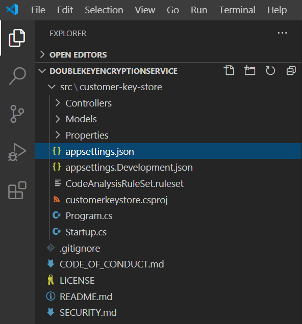

# <a name="double-key-encryption-for-microsoft-365"></a><span data-ttu-id="7427b-103">Doppelschlüssel Verschlüsselung für Microsoft 365</span><span class="sxs-lookup"><span data-stu-id="7427b-103">Double Key Encryption for Microsoft 365</span></span>

> <span data-ttu-id="7427b-104">*Gilt für: Doppelschlüssel Verschlüsselung für Microsoft 365, [Microsoft 365-Konformität](https://www.microsoft.com/microsoft-365/business/compliance-management), [Azure Information Protection](https://azure.microsoft.com/pricing/details/information-protection)*</span><span class="sxs-lookup"><span data-stu-id="7427b-104">*Applies to: Double Key Encryption for Microsoft 365, [Microsoft 365 Compliance](https://www.microsoft.com/microsoft-365/business/compliance-management), [Azure Information Protection](https://azure.microsoft.com/pricing/details/information-protection)*</span></span>
>
> <span data-ttu-id="7427b-105">*Anweisungen für: [Azure Information Protection Unified Labeling-Client für Windows](https://docs.microsoft.com/azure/information-protection/faqs#whats-the-difference-between-the-azure-information-protection-classic-and-unified-labeling-clients)*</span><span class="sxs-lookup"><span data-stu-id="7427b-105">*Instructions for: [Azure Information Protection unified labeling client for Windows](https://docs.microsoft.com/azure/information-protection/faqs#whats-the-difference-between-the-azure-information-protection-classic-and-unified-labeling-clients)*</span></span>
>
> <span data-ttu-id="7427b-106">*Dienstbeschreibung für: [Microsoft 365 Compliance](https://docs.microsoft.com/office365/servicedescriptions/microsoft-365-service-descriptions/microsoft-365-tenantlevel-services-licensing-guidance/microsoft-365-security-compliance-licensing-guidance)*</span><span class="sxs-lookup"><span data-stu-id="7427b-106">*Service description for: [Microsoft 365 Compliance](https://docs.microsoft.com/office365/servicedescriptions/microsoft-365-service-descriptions/microsoft-365-tenantlevel-services-licensing-guidance/microsoft-365-security-compliance-licensing-guidance)*</span></span>

<span data-ttu-id="7427b-107">Bei der Doppelschlüssel Verschlüsselung (Double Key Encryption, DKE) werden zwei Schlüssel zusammen verwendet, um auf geschützte Inhalte zuzugreifen.</span><span class="sxs-lookup"><span data-stu-id="7427b-107">Double Key Encryption (DKE) uses two keys together to access protected content.</span></span> <span data-ttu-id="7427b-108">Microsoft speichert einen Schlüssel in Microsoft Azure, und Sie halten den anderen Schlüssel.</span><span class="sxs-lookup"><span data-stu-id="7427b-108">Microsoft stores one key in Microsoft Azure, and you hold the other key.</span></span> <span data-ttu-id="7427b-109">Sie behalten die volle Kontrolle über einen Ihrer Schlüssel mithilfe des doppelten Schlüssels Verschlüsselungs Diensts.</span><span class="sxs-lookup"><span data-stu-id="7427b-109">You maintain full control of one of your keys using the Double Key Encryption service.</span></span> <span data-ttu-id="7427b-110">Sie wenden Schutz mit dem Unified Labeling-Client für Azure Information Protection auf Ihre hochgradig vertraulichen Inhalte an.</span><span class="sxs-lookup"><span data-stu-id="7427b-110">You apply protection using The Azure Information Protection unified labeling client to your highly sensitive content.</span></span>

<span data-ttu-id="7427b-111">Die Doppelschlüssel Verschlüsselung unterstützt sowohl Cloud-als auch lokale Bereitstellungen.</span><span class="sxs-lookup"><span data-stu-id="7427b-111">Double Key Encryption supports both cloud and on-premises deployments.</span></span> <span data-ttu-id="7427b-112">Mithilfe dieser Bereitstellungen kann sichergestellt werden, dass verschlüsselte Daten immer deckend bleiben, wenn Sie die geschützten Daten speichern.</span><span class="sxs-lookup"><span data-stu-id="7427b-112">These deployments help to ensure that encrypted data remains opaque wherever you store the protected data.</span></span>

<span data-ttu-id="7427b-113">Weitere Informationen zu den standardmäßigen cloudbasierten Mandantenstamm Schlüsseln finden Sie unter [Planning and Implementing your Azure Information Protection Mandant Key](https://docs.microsoft.com/azure/information-protection/plan-implement-tenant-key).</span><span class="sxs-lookup"><span data-stu-id="7427b-113">For more information about the default, cloud-based tenant root keys, see [Planning and implementing your Azure Information Protection tenant key](https://docs.microsoft.com/azure/information-protection/plan-implement-tenant-key).</span></span>

## <a name="when-your-organization-should-adopt-dke"></a><span data-ttu-id="7427b-114">Wenn Ihre Organisation DKE annehmen sollte</span><span class="sxs-lookup"><span data-stu-id="7427b-114">When your organization should adopt DKE</span></span>

<span data-ttu-id="7427b-115">Die Verschlüsselung mit doppeltem Schlüssel richtet sich an Ihre vertraulichsten Daten, die den strengsten Schutzanforderungen unterliegen.</span><span class="sxs-lookup"><span data-stu-id="7427b-115">Double Key Encryption is intended for your most sensitive data that is subject to the strictest protection requirements.</span></span> <span data-ttu-id="7427b-116">DKE ist nicht für alle Daten vorgesehen.</span><span class="sxs-lookup"><span data-stu-id="7427b-116">DKE is not intended for all data.</span></span> <span data-ttu-id="7427b-117">Im Allgemeinen verwenden Sie die Doppelschlüssel Verschlüsselung, um nur einen sehr kleinen Teil ihrer Gesamtdaten zu schützen.</span><span class="sxs-lookup"><span data-stu-id="7427b-117">In general, you'll be using Double Key Encryption to protect only a very small part of your overall data.</span></span> <span data-ttu-id="7427b-118">Bei der Ermittlung der richtigen Daten, die mit dieser Lösung abgedeckt werden sollen, sollten Sie vor der Bereitstellung sorgfältig vorgehen.</span><span class="sxs-lookup"><span data-stu-id="7427b-118">You should do due diligence in identifying the right data to cover with this solution before you deploy.</span></span> <span data-ttu-id="7427b-119">In einigen Fällen müssen Sie möglicherweise Ihren Bereich einschränken und andere Lösungen für den Großteil ihrer Daten verwenden, beispielsweise Microsoft Information Protection mit von Microsoft verwalteten Schlüsseln oder BYOK.</span><span class="sxs-lookup"><span data-stu-id="7427b-119">In some cases, you might need to narrow your scope and make use of other solutions for the majority of your data such as Microsoft Information Protection with Microsoft-managed keys or BYOK.</span></span> <span data-ttu-id="7427b-120">Diese Lösungen reichen für Dokumente aus, die nicht erweiterten Schutzbestimmungen und behördlichen Anforderungen unterliegen.</span><span class="sxs-lookup"><span data-stu-id="7427b-120">These solutions are sufficient for documents that aren't subject to enhanced protections and regulatory requirements.</span></span> <span data-ttu-id="7427b-121">Außerdem können Sie mit diesen Lösungen die leistungsstärksten Office 365 Dienste verwenden. Dienste, die Sie nicht mit verschlüsselten DKE-Inhalten verwenden können.</span><span class="sxs-lookup"><span data-stu-id="7427b-121">Also, these solutions enable you to use the most powerful Office 365 services; services that you can't use with DKE encrypted content.</span></span> <span data-ttu-id="7427b-122">Zum Beispiel:</span><span class="sxs-lookup"><span data-stu-id="7427b-122">For example:</span></span>

- <span data-ttu-id="7427b-123">Transport Regeln einschließlich Schadsoftware und Spam, die eine Sichtbarkeit der Anlage erfordern</span><span class="sxs-lookup"><span data-stu-id="7427b-123">Transport rules including anti-malware and spam that require visibility into the attachment</span></span>
- <span data-ttu-id="7427b-124">Microsoft eintauchen</span><span class="sxs-lookup"><span data-stu-id="7427b-124">Microsoft Delve</span></span>
- <span data-ttu-id="7427b-125">eDiscovery</span><span class="sxs-lookup"><span data-stu-id="7427b-125">eDiscovery</span></span>
- <span data-ttu-id="7427b-126">Inhaltssuche und Indizierung</span><span class="sxs-lookup"><span data-stu-id="7427b-126">Content search and indexing</span></span>
- <span data-ttu-id="7427b-127">Office-Webanwendungen einschließlich Funktionen für die gemeinsame Dokumenterstellung</span><span class="sxs-lookup"><span data-stu-id="7427b-127">Office Web Apps including co-authoring functionality</span></span>

<span data-ttu-id="7427b-128">Externe Anwendungen oder Dienste, die nicht über das MIP-SDK in DKE integriert sind, können keine Aktionen für die verschlüsselten Daten durchführen.</span><span class="sxs-lookup"><span data-stu-id="7427b-128">Any external applications or services that are not integrated with DKE through the MIP SDK will be unable to perform actions on the encrypted data.</span></span>

<span data-ttu-id="7427b-129">Das Microsoft Information Protection-SDK 1.7 + unterstützt die Doppelschlüssel Verschlüsselung; Anwendungen, die in unser SDK integriert sind, können diese Daten mit ausreichender Berechtigung und integrierter Integration überdenken.</span><span class="sxs-lookup"><span data-stu-id="7427b-129">The Microsoft Information Protection SDK 1.7+ supports Double Key Encryption; applications that integrate with our SDK will be able to reason over this data with sufficient permissions and integrations in place.</span></span>

<span data-ttu-id="7427b-130">Wir empfehlen, dass Organisationen Microsoft Information Protection-Funktionen (Klassifizierung und Kennzeichnung) verwenden, um die meisten Ihrer vertraulichen Daten zu schützen und nur DKE für Ihre unternehmenswichtigen Daten zu verwenden.</span><span class="sxs-lookup"><span data-stu-id="7427b-130">We recommend organizations use Microsoft Information protection capabilities (classification and labeling) to protect most of their sensitive data and only use DKE for their mission-critical data.</span></span> <span data-ttu-id="7427b-131">Die Doppelschlüssel Verschlüsselung ist besonders für extrem vertrauliche Daten in stark regulierten Branchen wie Finanzdienstleistungen und Healthcare relevant.</span><span class="sxs-lookup"><span data-stu-id="7427b-131">Double Key Encryption is particularly relevant for extremely sensitive data in highly regulated industries such as Financial services and Healthcare.</span></span>

<span data-ttu-id="7427b-132">Wenn Ihre Organisationen eine der folgenden Anforderungen haben, können Sie DKE verwenden, um Ihre Inhalte zu schützen:</span><span class="sxs-lookup"><span data-stu-id="7427b-132">If your organizations have any of the following requirements, you can use DKE to help secure your content:</span></span>

- <span data-ttu-id="7427b-133">Sie möchten sicherstellen, dass *nur Sie* geschützte Inhalte immer entschlüsseln können, unter allen Umständen.</span><span class="sxs-lookup"><span data-stu-id="7427b-133">You want to ensure that *only you* can ever decrypt protected content, under all circumstances.</span></span>
- <span data-ttu-id="7427b-134">Sie möchten nicht, dass Microsoft selbst Zugriff auf geschützte Daten hat.</span><span class="sxs-lookup"><span data-stu-id="7427b-134">You don't want Microsoft to have access to protected data on its own.</span></span>
- <span data-ttu-id="7427b-135">Sie haben regulatorische Anforderungen, um Schlüssel innerhalb einer geografischen Grenze zu halten.</span><span class="sxs-lookup"><span data-stu-id="7427b-135">You have regulatory requirements to hold keys within a geographical boundary.</span></span> <span data-ttu-id="7427b-136">Alle Schlüssel, die Sie für die Datenverschlüsselung und-Entschlüsselung speichern, werden in Ihrem Rechenzentrum verwaltet.</span><span class="sxs-lookup"><span data-stu-id="7427b-136">All of the keys that you hold for data encryption and decryption are maintained in your data center.</span></span>

## <a name="system-and-licensing-requirements-for-dke"></a><span data-ttu-id="7427b-137">System-und Lizenzierungsanforderungen für DKE</span><span class="sxs-lookup"><span data-stu-id="7427b-137">System and licensing requirements for DKE</span></span>

<span data-ttu-id="7427b-138">Die **Doppelschlüssel Verschlüsselung für Microsoft 365** wird mit Microsoft 365 E5 ausgeliefert.</span><span class="sxs-lookup"><span data-stu-id="7427b-138">**Double Key Encryption for Microsoft 365** comes with Microsoft 365 E5.</span></span> <span data-ttu-id="7427b-139">Wenn Sie nicht über eine Microsoft 365 E5-Lizenz verfügen, können Sie sich für eine [Testversion](https://aka.ms/M365E5ComplianceTrial)registrieren.</span><span class="sxs-lookup"><span data-stu-id="7427b-139">If you don’t have a Microsoft 365 E5 license, you can sign up for a [trial](https://aka.ms/M365E5ComplianceTrial).</span></span> <span data-ttu-id="7427b-140">Weitere Informationen zu diesen Lizenzen finden Sie unter [Microsoft 365 Licensing Guidance for Security & Compliance](https://docs.microsoft.com/office365/servicedescriptions/microsoft-365-service-descriptions/microsoft-365-tenantlevel-services-licensing-guidance/microsoft-365-security-compliance-licensing-guidance).</span><span class="sxs-lookup"><span data-stu-id="7427b-140">For more information about these licenses, see [Microsoft 365 licensing guidance for security & compliance](https://docs.microsoft.com/office365/servicedescriptions/microsoft-365-service-descriptions/microsoft-365-tenantlevel-services-licensing-guidance/microsoft-365-security-compliance-licensing-guidance).</span></span>

<span data-ttu-id="7427b-141">**Azure Information Protection**.</span><span class="sxs-lookup"><span data-stu-id="7427b-141">**Azure Information Protection**.</span></span> <span data-ttu-id="7427b-142">DKE arbeitet mit Sensitivitäts Bezeichnungen und benötigt Azure Information Protection.</span><span class="sxs-lookup"><span data-stu-id="7427b-142">DKE works with sensitivity labels and requires Azure Information Protection.</span></span>

<span data-ttu-id="7427b-143">DKE-Sensitivitäts Bezeichnungen werden Endbenutzern über das Menüband "Empfindlichkeit" in Office-Desktop Apps zur Verfügung gestellt.</span><span class="sxs-lookup"><span data-stu-id="7427b-143">DKE sensitivity labels are made available to end-users through the sensitivity ribbon in Office Desktop Apps.</span></span> <span data-ttu-id="7427b-144">Installieren Sie diese Voraussetzungen auf jedem Clientcomputer, auf dem geschützte Dokumente geschützt und verwendet werden sollen.</span><span class="sxs-lookup"><span data-stu-id="7427b-144">Install these prerequisites on each client computer where you want to protect and consume protected documents.</span></span>

<span data-ttu-id="7427b-145">**Microsoft Office Apps für Enterprise** -Version \*. 12711 oder höher (Desktop Versionen von Word, PowerPoint und Excel) unter Windows.</span><span class="sxs-lookup"><span data-stu-id="7427b-145">**Microsoft Office Apps for enterprise** version \*.12711 or later (Desktop versions of Word, PowerPoint, and Excel) on Windows.</span></span>

<span data-ttu-id="7427b-146">**Azure Information Protection Unified Labelling-Client** Versionen 2.7.93.0 oder höher.</span><span class="sxs-lookup"><span data-stu-id="7427b-146">**Azure Information Protection Unified Labeling Client** versions 2.7.93.0 or later.</span></span> <span data-ttu-id="7427b-147">Laden Sie den Unified Labeling-Client aus dem [Microsoft Download Center](https://www.microsoft.com/download/details.aspx?id=53018)herunter, und installieren Sie ihn.</span><span class="sxs-lookup"><span data-stu-id="7427b-147">Download and install the Unified Labeling client from the [Microsoft download center](https://www.microsoft.com/download/details.aspx?id=53018).</span></span>

## <a name="supported-environments-for-storing-and-viewing-dke-protected-content"></a><span data-ttu-id="7427b-148">Unterstützte Umgebungen zum Speichern und anzeigen DKE geschützter Inhalte</span><span class="sxs-lookup"><span data-stu-id="7427b-148">Supported environments for storing and viewing DKE-protected content</span></span>

<span data-ttu-id="7427b-149">**Unterstützte Anwendungen**.</span><span class="sxs-lookup"><span data-stu-id="7427b-149">**Supported applications**.</span></span> <span data-ttu-id="7427b-150">[Microsoft 365-Apps für Enterprise](https://www.microsoft.com/microsoft-365/business/microsoft-365-apps-for-enterprise-product) -Clients unter Windows, einschließlich Word, Excel und PowerPoint.</span><span class="sxs-lookup"><span data-stu-id="7427b-150">[Microsoft 365 Apps for enterprise](https://www.microsoft.com/microsoft-365/business/microsoft-365-apps-for-enterprise-product) clients on Windows, including Word, Excel, and PowerPoint.</span></span>

<span data-ttu-id="7427b-151">**Online-Inhalts Unterstützung**.</span><span class="sxs-lookup"><span data-stu-id="7427b-151">**Online content support**.</span></span> <span data-ttu-id="7427b-152">Dokumente und Dateien, die Online in Microsoft SharePoint und OneDrive für Unternehmen gespeichert werden, werden unterstützt.</span><span class="sxs-lookup"><span data-stu-id="7427b-152">Documents and files stored online in both Microsoft SharePoint and OneDrive for Business are supported.</span></span> <span data-ttu-id="7427b-153">Sie können verschlüsselte Inhalte per e-Mail freigeben, aber keine verschlüsselten Dokumente und Dateien online anzeigen.</span><span class="sxs-lookup"><span data-stu-id="7427b-153">You can share encrypted content by email, but you can't view encrypted documents and files online.</span></span> <span data-ttu-id="7427b-154">Stattdessen müssen Sie geschützte Inhalte mithilfe der Desktop-Apps auf dem lokalen Computer anzeigen.</span><span class="sxs-lookup"><span data-stu-id="7427b-154">Instead, you must view protected content using the desktop apps on your local computer.</span></span>

## <a name="overview-of-deploying-dke"></a><span data-ttu-id="7427b-155">Übersicht über die Bereitstellung von DKE</span><span class="sxs-lookup"><span data-stu-id="7427b-155">Overview of deploying DKE</span></span>

<span data-ttu-id="7427b-156">Sie führen die folgenden allgemeinen Schritte zum Einrichten von DKE aus.</span><span class="sxs-lookup"><span data-stu-id="7427b-156">You'll follow these general steps to set up DKE.</span></span> <span data-ttu-id="7427b-157">Nachdem Sie diese Schritte ausgeführt haben, können Ihre Endbenutzer ihre hochsensiblen Daten mit Doppelschlüssel Verschlüsselung schützen.</span><span class="sxs-lookup"><span data-stu-id="7427b-157">Once you've completed these steps, your end users will be able to protect your highly sensitive data with Double Key Encryption.</span></span>

1. <span data-ttu-id="7427b-158">Stellen Sie den DKE-Dienst wie in diesem Artikel beschrieben bereit.</span><span class="sxs-lookup"><span data-stu-id="7427b-158">Deploy the DKE service as described in this article.</span></span>

2. <span data-ttu-id="7427b-159">Erstellen Sie eine Beschriftung mit doppelter Schlüssel Verschlüsselung.</span><span class="sxs-lookup"><span data-stu-id="7427b-159">Create a label with Double Key Encryption.</span></span> <span data-ttu-id="7427b-160">Navigieren Sie zum Informationsschutz unter dem [Microsoft 365 Compliance Center](https://compliance.microsoft.com) , und erstellen Sie eine neue Bezeichnung mit doppelter Schlüssel Verschlüsselung.</span><span class="sxs-lookup"><span data-stu-id="7427b-160">Navigate to Information protection under the [Microsoft 365 compliance center](https://compliance.microsoft.com) and create a new label with Double Key Encryption.</span></span> <span data-ttu-id="7427b-161">Weitere Informationen finden Sie unter [Einschränken des Zugriffs auf Inhalte mithilfe von Sensitivitäts Bezeichnungen zum Anwenden der Verschlüsselung](https://docs.microsoft.com/microsoft-365/compliance/encryption-sensitivity-labels).</span><span class="sxs-lookup"><span data-stu-id="7427b-161">See [Restrict access to content by using sensitivity labels to apply encryption](https://docs.microsoft.com/microsoft-365/compliance/encryption-sensitivity-labels).</span></span>

3. <span data-ttu-id="7427b-162">Verwenden Sie Doppelschlüssel-Verschlüsselungs Bezeichnungen.</span><span class="sxs-lookup"><span data-stu-id="7427b-162">Use Double Key Encryption labels.</span></span> <span data-ttu-id="7427b-163">Schützen Sie Daten, indem Sie die Doppelschlüssel-verschlüsselte Bezeichnung auf dem Menüband für die Vertraulichkeit in Microsoft Office auswählen.</span><span class="sxs-lookup"><span data-stu-id="7427b-163">Protect data by selecting the Double Key Encrypted label from the Sensitivity ribbon in Microsoft Office.</span></span>

<span data-ttu-id="7427b-164">Sie können einige der Schritte zum Bereitstellen der doppelten Schlüssel Verschlüsselung auf verschiedene Weise ausführen.</span><span class="sxs-lookup"><span data-stu-id="7427b-164">There are several ways you can complete some of the steps to deploy Double Key Encryption.</span></span> <span data-ttu-id="7427b-165">In diesem Artikel werden ausführliche Anweisungen bereitgestellt, damit erfahrene Administratoren den Dienst erfolgreich bereitstellen.</span><span class="sxs-lookup"><span data-stu-id="7427b-165">This article provides detailed instructions so that less experienced admins successfully deploy the service.</span></span> <span data-ttu-id="7427b-166">Wenn Sie sich dafür entscheiden, können Sie Ihre eigenen Methoden verwenden.</span><span class="sxs-lookup"><span data-stu-id="7427b-166">If you're comfortable doing so, you can choose to use your own methods.</span></span>

## <a name="deploy-dke"></a><span data-ttu-id="7427b-167">Bereitstellen von DKE</span><span class="sxs-lookup"><span data-stu-id="7427b-167">Deploy DKE</span></span>

<span data-ttu-id="7427b-168">In diesem Artikel und dem Bereitstellungs Video wird Azure als Bereitstellungsziel für den DKE-Dienst verwendet.</span><span class="sxs-lookup"><span data-stu-id="7427b-168">This article and the deployment video use Azure as the deployment destination for the DKE service.</span></span> <span data-ttu-id="7427b-169">Wenn Sie an einem anderen Speicherort bereitstellen, müssen Sie Ihre eigenen Werte angeben.</span><span class="sxs-lookup"><span data-stu-id="7427b-169">If you're deploying to another location, you'll need to provide your own values.</span></span>

<span data-ttu-id="7427b-170">Sehen Sie sich das [Video zur Bereitstellung der doppelten Schlüssel Verschlüsselung](https://youtu.be/vDWfHN_kygg) an, um eine Schritt-für-Schritt-Übersicht über die Konzepte in diesem Artikel zu erhalten.</span><span class="sxs-lookup"><span data-stu-id="7427b-170">Watch the [Double Key Encryption deployment video](https://youtu.be/vDWfHN_kygg) to see a step-by-step overview of the concepts in this article.</span></span> <span data-ttu-id="7427b-171">Das Video dauert etwa 18 Minuten.</span><span class="sxs-lookup"><span data-stu-id="7427b-171">The video takes about 18 minutes to complete.</span></span>

<span data-ttu-id="7427b-172">Sie führen die folgenden allgemeinen Schritte aus, um die doppelte Schlüssel Verschlüsselung für Ihre Organisation einzurichten.</span><span class="sxs-lookup"><span data-stu-id="7427b-172">You'll follow these general steps to set up Double Key Encryption for your organization.</span></span>

1. [<span data-ttu-id="7427b-173">Installieren der erforderlichen Softwarekomponenten für den DKE-Dienst</span><span class="sxs-lookup"><span data-stu-id="7427b-173">Install software prerequisites for the DKE service</span></span>](#install-software-prerequisites-for-the-dke-service)
1. [<span data-ttu-id="7427b-174">Klonen des GitHub-Repositorys mit doppelten Schlüssel Verschlüsselung</span><span class="sxs-lookup"><span data-stu-id="7427b-174">Clone the Double Key Encryption GitHub repository</span></span>](#clone-the-dke-github-repository)
1. [<span data-ttu-id="7427b-175">Ändern von Anwendungseinstellungen</span><span class="sxs-lookup"><span data-stu-id="7427b-175">Modify application settings</span></span>](#modify-application-settings)
1. [<span data-ttu-id="7427b-176">Generieren von Test Schlüsseln</span><span class="sxs-lookup"><span data-stu-id="7427b-176">Generate test keys</span></span>](#generate-test-keys)
1. [<span data-ttu-id="7427b-177">Erstellen des Projekts</span><span class="sxs-lookup"><span data-stu-id="7427b-177">Build the project</span></span>](#build-the-project)
1. [<span data-ttu-id="7427b-178">Bereitstellen des DKE-Diensts und Veröffentlichen des Schlüsselspeichers</span><span class="sxs-lookup"><span data-stu-id="7427b-178">Deploy the DKE service and publish the key store</span></span>](#deploy-the-dke-service-and-publish-the-key-store)
1. [<span data-ttu-id="7427b-179">Überprüfen der Bereitstellung</span><span class="sxs-lookup"><span data-stu-id="7427b-179">Validate your deployment</span></span>](#validate-your-deployment)
1. [<span data-ttu-id="7427b-180">Registrieren des Schlüsselspeichers</span><span class="sxs-lookup"><span data-stu-id="7427b-180">Register your key store</span></span>](#register-your-key-store)
1. [<span data-ttu-id="7427b-181">Erstellen von Sensitivitäts Bezeichnungen mit DKE</span><span class="sxs-lookup"><span data-stu-id="7427b-181">Create sensitivity labels using DKE</span></span>](#create-sensitivity-labels-using-dke)
1. [<span data-ttu-id="7427b-182">Aktivieren von DKE in Ihrem Client</span><span class="sxs-lookup"><span data-stu-id="7427b-182">Enable DKE in your client</span></span>](#enable-dke-in-your-client)
1. [<span data-ttu-id="7427b-183">Migrieren geschützter Dateien von Hyok-Bezeichnungen zu DKE-Bezeichnungen</span><span class="sxs-lookup"><span data-stu-id="7427b-183">Migrate protected files from HYOK labels to DKE labels</span></span>](#migrate-protected-files-from-hyok-labels-to-dke-labels)

<span data-ttu-id="7427b-184">Wenn Sie fertig sind, können Sie Dokumente und Dateien mit DKE verschlüsseln.</span><span class="sxs-lookup"><span data-stu-id="7427b-184">When you're done, you can encrypt documents and files using DKE.</span></span> <span data-ttu-id="7427b-185">Weitere Informationen finden Sie unter [Anwenden von Sensitivitäts Bezeichnungen auf Ihre Dateien und e-Mails in Office](https://support.microsoft.com/office/2f96e7cd-d5a4-403b-8bd7-4cc636bae0f9).</span><span class="sxs-lookup"><span data-stu-id="7427b-185">For information, see [Apply sensitivity labels to your files and email in Office](https://support.microsoft.com/office/2f96e7cd-d5a4-403b-8bd7-4cc636bae0f9).</span></span>

### <a name="install-software-prerequisites-for-the-dke-service"></a><span data-ttu-id="7427b-186">Installieren der erforderlichen Softwarekomponenten für den DKE-Dienst</span><span class="sxs-lookup"><span data-stu-id="7427b-186">Install software prerequisites for the DKE service</span></span>

<span data-ttu-id="7427b-187">Installieren Sie diese Voraussetzungen auf dem Computer, auf dem Sie den DKE-Dienst installieren möchten.</span><span class="sxs-lookup"><span data-stu-id="7427b-187">Install these prerequisites on the computer where you want to install the DKE service.</span></span>

<span data-ttu-id="7427b-188">**.Net Core 3,1 SDK**.</span><span class="sxs-lookup"><span data-stu-id="7427b-188">**.NET Core 3.1 SDK**.</span></span> <span data-ttu-id="7427b-189">Laden Sie das SDK herunter, und installieren Sie es aus dem [Download .net Core 3,1](https://dotnet.microsoft.com/download/dotnet-core/3.1).</span><span class="sxs-lookup"><span data-stu-id="7427b-189">Download and install the SDK from [Download .NET Core 3.1](https://dotnet.microsoft.com/download/dotnet-core/3.1).</span></span>

<span data-ttu-id="7427b-190">**Visual Studio Code**.</span><span class="sxs-lookup"><span data-stu-id="7427b-190">**Visual Studio Code**.</span></span> <span data-ttu-id="7427b-191">Laden Sie Visual Studio Code aus herunter [https://code.visualstudio.com/](https://code.visualstudio.com) .</span><span class="sxs-lookup"><span data-stu-id="7427b-191">Download Visual Studio Code from [https://code.visualstudio.com/](https://code.visualstudio.com).</span></span> <span data-ttu-id="7427b-192">Nachdem Sie installiert haben, führen Sie Visual Studio Code aus, und wählen Sie **View** \> **Extensions** aus.</span><span class="sxs-lookup"><span data-stu-id="7427b-192">Once installed, run Visual Studio Code and select **View** \> **Extensions**.</span></span> <span data-ttu-id="7427b-193">Installieren Sie diese Erweiterungen.</span><span class="sxs-lookup"><span data-stu-id="7427b-193">Install these extensions.</span></span>

- <span data-ttu-id="7427b-194">C# für Visual Studio Code</span><span class="sxs-lookup"><span data-stu-id="7427b-194">C# for Visual Studio Code</span></span>

- <span data-ttu-id="7427b-195">NuGet-Paket-Manager</span><span class="sxs-lookup"><span data-stu-id="7427b-195">NuGet Package Manager</span></span>

<span data-ttu-id="7427b-196">**Git-Ressourcen**.</span><span class="sxs-lookup"><span data-stu-id="7427b-196">**Git resources**.</span></span> <span data-ttu-id="7427b-197">Laden Sie eine der folgenden Optionen herunter, und installieren Sie Sie.</span><span class="sxs-lookup"><span data-stu-id="7427b-197">Download and install one of the following.</span></span>

- [<span data-ttu-id="7427b-198">Git</span><span class="sxs-lookup"><span data-stu-id="7427b-198">Git</span></span>](https://git-scm.com/downloads)

- [<span data-ttu-id="7427b-199">GitHub-Desktop</span><span class="sxs-lookup"><span data-stu-id="7427b-199">GitHub Desktop</span></span>](https://desktop.github.com/)

- [<span data-ttu-id="7427b-200">GitHub Enterprise</span><span class="sxs-lookup"><span data-stu-id="7427b-200">GitHub Enterprise</span></span>](https://github.com/enterprise)

<span data-ttu-id="7427b-201">**OpenSSL** Sie müssen [OpenSSL](https://slproweb.com/products/Win32OpenSSL.html) installiert haben, um [Testschlüssel zu generieren](#generate-test-keys) , nachdem Sie DKE bereitgestellt haben.</span><span class="sxs-lookup"><span data-stu-id="7427b-201">**OpenSSL** You must have [OpenSSL](https://slproweb.com/products/Win32OpenSSL.html) installed to [generate test keys](#generate-test-keys) after you deploy DKE.</span></span> <span data-ttu-id="7427b-202">Stellen Sie sicher, dass Sie sie ordnungsgemäß aus dem Pfad der Umgebungsvariablen aufrufen.</span><span class="sxs-lookup"><span data-stu-id="7427b-202">Make sure you're invoking it correctly from your environment variables path.</span></span> <span data-ttu-id="7427b-203">Weitere Informationen finden Sie beispielsweise unter "Add the Installation Directory to Path" unter [https://www.osradar.com/install-openssl-windows/](https://www.osradar.com/install-openssl-windows/) .</span><span class="sxs-lookup"><span data-stu-id="7427b-203">For example, see "Add the installation directory to PATH" at [https://www.osradar.com/install-openssl-windows/](https://www.osradar.com/install-openssl-windows/) for details.</span></span>

### <a name="clone-the-dke-github-repository"></a><span data-ttu-id="7427b-204">Klonen des DKE GitHub-Repositorys</span><span class="sxs-lookup"><span data-stu-id="7427b-204">Clone the DKE GitHub repository</span></span>

<span data-ttu-id="7427b-205">Microsoft stellt die DKE-Quelldateien in einem GitHub-Repository bereit.</span><span class="sxs-lookup"><span data-stu-id="7427b-205">Microsoft supplies the DKE source files in a GitHub repository.</span></span> <span data-ttu-id="7427b-206">Sie klonen das Repository, um das Projekt für die Verwendung in Ihrer Organisation lokal zu erstellen.</span><span class="sxs-lookup"><span data-stu-id="7427b-206">You clone the repository to build the project locally for your organization's use.</span></span> <span data-ttu-id="7427b-207">Das DKE GitHub-Repository befindet sich unter [https://github.com/Azure-Samples/DoubleKeyEncryptionService](https://github.com/Azure-Samples/DoubleKeyEncryptionService) .</span><span class="sxs-lookup"><span data-stu-id="7427b-207">The DKE GitHub repository is located at [https://github.com/Azure-Samples/DoubleKeyEncryptionService](https://github.com/Azure-Samples/DoubleKeyEncryptionService).</span></span>

<span data-ttu-id="7427b-208">Die folgenden Anweisungen sind für Benutzer mit unerfahrenem git oder Visual Studio Code gedacht:</span><span class="sxs-lookup"><span data-stu-id="7427b-208">The following instructions are intended for inexperienced git or Visual Studio Code users:</span></span>

1. <span data-ttu-id="7427b-209">Wechseln Sie in Ihrem Browser zu: [https://github.com/Azure-Samples/DoubleKeyEncryptionService](https://github.com/Azure-Samples/DoubleKeyEncryptionService) .</span><span class="sxs-lookup"><span data-stu-id="7427b-209">In your browser, go to: [https://github.com/Azure-Samples/DoubleKeyEncryptionService](https://github.com/Azure-Samples/DoubleKeyEncryptionService).</span></span>

2. <span data-ttu-id="7427b-210">Klicken Sie auf der rechten Seite des Bildschirms auf **Code**.</span><span class="sxs-lookup"><span data-stu-id="7427b-210">Towards the right side of the screen, select **Code**.</span></span> <span data-ttu-id="7427b-211">Ihre Version der Benutzeroberfläche zeigt möglicherweise eine Schaltfläche " **Klonen" oder "herunterladen** ".</span><span class="sxs-lookup"><span data-stu-id="7427b-211">Your version of the UI might show a **Clone or download** button.</span></span> <span data-ttu-id="7427b-212">Wählen Sie dann in der Dropdownliste, die angezeigt wird, das Symbol Kopieren aus, um die URL in Ihre Zwischenablage zu kopieren.</span><span class="sxs-lookup"><span data-stu-id="7427b-212">Then, in the dropdown that appears, select the copy icon to copy the URL to your clipboard.</span></span>

    <span data-ttu-id="7427b-213">Zum Beispiel:</span><span class="sxs-lookup"><span data-stu-id="7427b-213">For example:</span></span>

   

3. <span data-ttu-id="7427b-215">Wählen Sie in Visual Studio Code  die Option \> **Befehls Palette** anzeigen aus, und wählen Sie **git: Clone** aus.</span><span class="sxs-lookup"><span data-stu-id="7427b-215">In Visual Studio Code, select **View** \> **Command Palette** and select **Git: Clone**.</span></span> <span data-ttu-id="7427b-216">Um zur Option in der Liste zu wechseln, beginnen Sie mit der Eingabe, `git: clone` um die Einträge zu filtern, und wählen Sie Sie dann im Dropdown aus.</span><span class="sxs-lookup"><span data-stu-id="7427b-216">To jump to the option in the list, start typing `git: clone` to filter the entries and then select it from the drop-down.</span></span> <span data-ttu-id="7427b-217">Zum Beispiel:</span><span class="sxs-lookup"><span data-stu-id="7427b-217">For example:</span></span>

   

4. <span data-ttu-id="7427b-219">Fügen Sie in das Textfeld die URL ein, die Sie aus git kopiert haben, und wählen Sie **aus GitHub Klonen aus**.</span><span class="sxs-lookup"><span data-stu-id="7427b-219">In the text box, paste the URL that you copied from Git and select **Clone from GitHub**.</span></span>

5. <span data-ttu-id="7427b-220">Navigieren Sie im angezeigten Dialogfeld **Ordner auswählen** zu einem Speicherort, und wählen Sie ihn aus, um das Repository zu speichern.</span><span class="sxs-lookup"><span data-stu-id="7427b-220">In the **Select Folder** dialog that appears, browse to and select a location to store the repository.</span></span> <span data-ttu-id="7427b-221">Wählen Sie an der Eingabeaufforderung **Öffnen** aus.</span><span class="sxs-lookup"><span data-stu-id="7427b-221">At the prompt, select **Open**.</span></span>

    <span data-ttu-id="7427b-222">Das Repository wird in Visual Studio Code geöffnet und zeigt den aktuellen git-Zweig unten links an.</span><span class="sxs-lookup"><span data-stu-id="7427b-222">The repository opens in Visual Studio Code, and displays the current Git branch at the bottom left.</span></span> <span data-ttu-id="7427b-223">Die Verzweigung sollte " **Master**" sein.</span><span class="sxs-lookup"><span data-stu-id="7427b-223">The branch should be **master**.</span></span>

    <span data-ttu-id="7427b-224">Zum Beispiel:</span><span class="sxs-lookup"><span data-stu-id="7427b-224">For example:</span></span>

   

6. <span data-ttu-id="7427b-226">Wählen Sie in der Liste der Verzweigungen das Wort **Master** aus.</span><span class="sxs-lookup"><span data-stu-id="7427b-226">Select the word **master** from the list of branches.</span></span>

   > [!IMPORTANT]
   > <span data-ttu-id="7427b-227">Durch Auswählen der Hauptverzweigung wird sichergestellt, dass Sie über die richtigen Dateien zum Erstellen des Projekts verfügen.</span><span class="sxs-lookup"><span data-stu-id="7427b-227">Selecting the master branch ensures that you have the correct files to build the project.</span></span> <span data-ttu-id="7427b-228">Wenn Sie nicht die richtige Verzweigung auswählen, wird die Bereitstellung nicht erfolgreich ausgeführt.</span><span class="sxs-lookup"><span data-stu-id="7427b-228">If you do not choose the correct branch your deployment will fail.</span></span>

<span data-ttu-id="7427b-229">Sie haben Ihr DKE-Quell-Repository jetzt lokal eingerichtet.</span><span class="sxs-lookup"><span data-stu-id="7427b-229">You now have your DKE source repository set up locally.</span></span> <span data-ttu-id="7427b-230">Ändern Sie als nächstes die [Anwendungseinstellungen](#modify-application-settings) für Ihre Organisation.</span><span class="sxs-lookup"><span data-stu-id="7427b-230">Next, [modify application settings](#modify-application-settings) for your organization.</span></span>

### <a name="modify-application-settings"></a><span data-ttu-id="7427b-231">Ändern von Anwendungseinstellungen</span><span class="sxs-lookup"><span data-stu-id="7427b-231">Modify application settings</span></span>

<span data-ttu-id="7427b-232">Um den DKE-Dienst bereitzustellen, müssen Sie die folgenden Arten von Anwendungseinstellungen ändern:</span><span class="sxs-lookup"><span data-stu-id="7427b-232">To deploy the DKE service, you must modify the following types of application settings:</span></span>

- [<span data-ttu-id="7427b-233">Wichtige Zugriffseinstellungen</span><span class="sxs-lookup"><span data-stu-id="7427b-233">Key access settings</span></span>](#key-access-settings)
- [<span data-ttu-id="7427b-234">Mandanten-und Schlüsseleinstellungen</span><span class="sxs-lookup"><span data-stu-id="7427b-234">Tenant and key settings</span></span>](#tenant-and-key-settings)

<span data-ttu-id="7427b-235">Sie ändern Anwendungseinstellungen in der Datei appsettings.js.</span><span class="sxs-lookup"><span data-stu-id="7427b-235">You modify application settings in the appsettings.json file.</span></span> <span data-ttu-id="7427b-236">Diese Datei befindet sich im DoubleKeyEncryptionService Repo, das Sie lokal unter DoubleKeyEncryptionService\src\customer-Key-Store. geklont haben.</span><span class="sxs-lookup"><span data-stu-id="7427b-236">This file is located in the DoubleKeyEncryptionService repo you cloned locally under DoubleKeyEncryptionService\src\customer-key-store.</span></span> <span data-ttu-id="7427b-237">Beispielsweise können Sie in Visual Studio Code die Datei wie in der folgenden Abbildung gezeigt durchsuchen.</span><span class="sxs-lookup"><span data-stu-id="7427b-237">For example, in Visual Studio Code, you can browse to the file as shown in the following picture.</span></span>



#### <a name="key-access-settings"></a><span data-ttu-id="7427b-239">Wichtige Zugriffseinstellungen</span><span class="sxs-lookup"><span data-stu-id="7427b-239">Key access settings</span></span>

<span data-ttu-id="7427b-240">Wählen Sie aus, ob e-Mail-oder Rollenautorisierung verwendet werden soll.</span><span class="sxs-lookup"><span data-stu-id="7427b-240">Choose whether to use email or role authorization.</span></span> <span data-ttu-id="7427b-241">DKE unterstützt immer nur eine dieser Authentifizierungsmethoden.</span><span class="sxs-lookup"><span data-stu-id="7427b-241">DKE supports only one of these authentication methods at a time.</span></span>

- <span data-ttu-id="7427b-242">**E-Mail-Autorisierung**.</span><span class="sxs-lookup"><span data-stu-id="7427b-242">**Email authorization**.</span></span> <span data-ttu-id="7427b-243">Ermöglicht Ihrer Organisation die Autorisierung des Zugriffs auf Schlüssel nur basierend auf e-Mail-Adressen.</span><span class="sxs-lookup"><span data-stu-id="7427b-243">Allows your organization to authorize access to keys based on email addresses only.</span></span>

- <span data-ttu-id="7427b-244">**Rollenautorisierung**.</span><span class="sxs-lookup"><span data-stu-id="7427b-244">**Role authorization**.</span></span> <span data-ttu-id="7427b-245">Ermöglicht Ihrer Organisation das Autorisieren des Zugriffs auf Schlüssel basierend auf Active Directory Gruppen und erfordert, dass der Webdienst LDAP Abfragen kann.</span><span class="sxs-lookup"><span data-stu-id="7427b-245">Allows your organization to authorize access to keys based on Active Directory groups, and requires that the web service can query LDAP.</span></span>

<span data-ttu-id="7427b-246">**So legen Sie die wichtigsten Zugriffseinstellungen für DKE mithilfe der e-Mail-Autorisierung fest**</span><span class="sxs-lookup"><span data-stu-id="7427b-246">**To set key access settings for DKE using email authorization**</span></span>

1. <span data-ttu-id="7427b-247">Öffnen Sie die Datei **appsettings.jsauf** , und suchen Sie die `AuthorizedEmailAddress` Einstellung.</span><span class="sxs-lookup"><span data-stu-id="7427b-247">Open the **appsettings.json** file and locate the `AuthorizedEmailAddress` setting.</span></span>

2. <span data-ttu-id="7427b-248">Fügen Sie die e-Mail-Adressen hinzu, die Sie autorisieren möchten.</span><span class="sxs-lookup"><span data-stu-id="7427b-248">Add the email address or addresses that you want to authorize.</span></span> <span data-ttu-id="7427b-249">Trennen Sie mehrere e-Mail-Adressen mit doppelten Anführungszeichen und Kommas.</span><span class="sxs-lookup"><span data-stu-id="7427b-249">Separate multiple email addresses with double quotes and commas.</span></span> <span data-ttu-id="7427b-250">Zum Beispiel:</span><span class="sxs-lookup"><span data-stu-id="7427b-250">For example:</span></span>

   ```json
   "AuthorizedEmailAddress": ["email1@company.com", "email2@company.com ", "email3@company.com"]
   ```

3. <span data-ttu-id="7427b-251">Suchen `LDAPPath` Sie die Einstellung, und entfernen Sie den Text `If you use role authorization (AuthorizedRoles) then this is the LDAP path.` zwischen den doppelten Anführungszeichen.</span><span class="sxs-lookup"><span data-stu-id="7427b-251">Locate the `LDAPPath` setting and remove the text `If you use role authorization (AuthorizedRoles) then this is the LDAP path.` between the double quotes.</span></span> <span data-ttu-id="7427b-252">Lassen Sie die doppelten Anführungszeichen an der richtigen Stelle.</span><span class="sxs-lookup"><span data-stu-id="7427b-252">Leave the double quotes in place.</span></span> <span data-ttu-id="7427b-253">Wenn Sie fertig sind, sollte die Einstellung wie folgt aussehen.</span><span class="sxs-lookup"><span data-stu-id="7427b-253">When you're finished, the setting should look like this.</span></span>

   ```json
   "LDAPPath": ""
   ```

4. <span data-ttu-id="7427b-254">Suchen Sie die `AuthorizedRoles` Einstellung, und löschen Sie die gesamte-Reihe.</span><span class="sxs-lookup"><span data-stu-id="7427b-254">Locate the `AuthorizedRoles` setting and delete the entire line.</span></span>

<span data-ttu-id="7427b-255">Dieses Bild zeigt die **appsettings.jsauf** Datei, die für die e-Mail-Autorisierung ordnungsgemäß formatiert ist.</span><span class="sxs-lookup"><span data-stu-id="7427b-255">This image shows the **appsettings.json** file correctly formatted for email authorization.</span></span>

   

<span data-ttu-id="7427b-257">**So legen Sie wichtige Zugriffseinstellungen für DKE mithilfe der Rollenautorisierung fest**</span><span class="sxs-lookup"><span data-stu-id="7427b-257">**To set key access settings for DKE using role authorization**</span></span>

1. <span data-ttu-id="7427b-258">Öffnen Sie die Datei **appsettings.jsauf** , und suchen Sie die `AuthorizedRoles` Einstellung.</span><span class="sxs-lookup"><span data-stu-id="7427b-258">Open the **appsettings.json** file and locate the `AuthorizedRoles` setting.</span></span>

2. <span data-ttu-id="7427b-259">Fügen Sie die Active Directory Gruppennamen hinzu, die Sie autorisieren möchten.</span><span class="sxs-lookup"><span data-stu-id="7427b-259">Add the Active Directory group names you want to authorize.</span></span> <span data-ttu-id="7427b-260">Trennen Sie mehrere Gruppennamen mit doppelten Anführungszeichen und Kommas.</span><span class="sxs-lookup"><span data-stu-id="7427b-260">Separate multiple group names with double quotes and commas.</span></span> <span data-ttu-id="7427b-261">Zum Beispiel:</span><span class="sxs-lookup"><span data-stu-id="7427b-261">For example:</span></span>

   ```json
   "AuthorizedRoles": ["group1", "group2", "group3"]
   ```

3. <span data-ttu-id="7427b-262">Suchen `LDAPPath` Sie die Einstellung, und fügen Sie die Active Directory Domäne hinzu.</span><span class="sxs-lookup"><span data-stu-id="7427b-262">Locate the `LDAPPath` setting and add the Active Directory domain.</span></span> <span data-ttu-id="7427b-263">Zum Beispiel:</span><span class="sxs-lookup"><span data-stu-id="7427b-263">For example:</span></span>

   ```json
   "LDAPPath": "contoso.com"
   ```

4. <span data-ttu-id="7427b-264">Suchen Sie die `AuthorizedEmailAddress` Einstellung, und löschen Sie die gesamte-Reihe.</span><span class="sxs-lookup"><span data-stu-id="7427b-264">Locate the `AuthorizedEmailAddress` setting and delete the entire line.</span></span>

<span data-ttu-id="7427b-265">Dieses Bild zeigt die **appsettings.jsauf** Datei, die für die Rollenautorisierung ordnungsgemäß formatiert ist.</span><span class="sxs-lookup"><span data-stu-id="7427b-265">This image shows the **appsettings.json** file correctly formatted for role authorization.</span></span>

   

#### <a name="tenant-and-key-settings"></a><span data-ttu-id="7427b-267">Mandanten-und Schlüsseleinstellungen</span><span class="sxs-lookup"><span data-stu-id="7427b-267">Tenant and key settings</span></span>

<span data-ttu-id="7427b-268">DKE-Mandanten-und Key-Einstellungen befinden sich in der Datei **appsettings.js** .</span><span class="sxs-lookup"><span data-stu-id="7427b-268">DKE tenant and key settings are located in the **appsettings.json** file.</span></span>

<span data-ttu-id="7427b-269">**So konfigurieren Sie die Mandanten-und Schlüsseleinstellungen für DKE**</span><span class="sxs-lookup"><span data-stu-id="7427b-269">**To configure tenant and key settings for DKE**</span></span>

1. <span data-ttu-id="7427b-270">Öffnen Sie die Datei **appsettings.js** .</span><span class="sxs-lookup"><span data-stu-id="7427b-270">Open the **appsettings.json** file.</span></span>

2. <span data-ttu-id="7427b-271">Suchen `ValidIssuers` Sie die Einstellung, und ersetzen `<tenantid>` Sie Sie durch ihre Mandanten-ID.</span><span class="sxs-lookup"><span data-stu-id="7427b-271">Locate the `ValidIssuers` setting and replace `<tenantid>` with your tenant ID.</span></span> <span data-ttu-id="7427b-272">Sie können die Mandanten-ID ermitteln, indem Sie zum Azure-Portal wechseln und die [Mandanten Eigenschaften](https://aad.portal.azure.com/#blade/Microsoft_AAD_IAM/ActiveDirectoryMenuBlade/Properties)anzeigen.</span><span class="sxs-lookup"><span data-stu-id="7427b-272">You can locate your tenant ID by going to the Azure portal and viewing the [tenant properties](https://aad.portal.azure.com/#blade/Microsoft_AAD_IAM/ActiveDirectoryMenuBlade/Properties).</span></span> <span data-ttu-id="7427b-273">Zum Beispiel:</span><span class="sxs-lookup"><span data-stu-id="7427b-273">For example:</span></span>

   ```json
   "ValidIssuers": [
     "https://sts.windows.net/9c99431e-b513-44be-a7d9-e7b500002d4b/"
   ]
   ```

<span data-ttu-id="7427b-274">Suchen Sie nach der `JwtAudience` .</span><span class="sxs-lookup"><span data-stu-id="7427b-274">Locate the `JwtAudience`.</span></span> <span data-ttu-id="7427b-275">Ersetzen Sie `<yourhostname>` durch den Hostnamen des Computers, auf dem der DKE-Dienst ausgeführt wird.</span><span class="sxs-lookup"><span data-stu-id="7427b-275">Replace `<yourhostname>` with the hostname of the machine where the DKE service will run.</span></span> <span data-ttu-id="7427b-276">Zum Beispiel:</span><span class="sxs-lookup"><span data-stu-id="7427b-276">For example:</span></span>

  > [!IMPORTANT]
  > <span data-ttu-id="7427b-277">Der Wert für `JwtAudience` muss mit dem Namen des Hosts *genau* übereinstimmen.</span><span class="sxs-lookup"><span data-stu-id="7427b-277">The value for `JwtAudience` must match the name of your host *exactly*.</span></span> <span data-ttu-id="7427b-278">Sie können **localhost: 5001** beim Debuggen verwenden.</span><span class="sxs-lookup"><span data-stu-id="7427b-278">You may use **localhost:5001** while debugging.</span></span> <span data-ttu-id="7427b-279">Wenn Sie das Debuggen abgeschlossen haben, sollten Sie diesen Wert jedoch auf den Hostnamen des Servers aktualisieren.</span><span class="sxs-lookup"><span data-stu-id="7427b-279">However, When you're done debugging, make sure to update this value to the server's hostname.</span></span>

- <span data-ttu-id="7427b-280">`TestKeys:Name`.</span><span class="sxs-lookup"><span data-stu-id="7427b-280">`TestKeys:Name`.</span></span> <span data-ttu-id="7427b-281">Geben Sie einen Namen für den Schlüssel ein.</span><span class="sxs-lookup"><span data-stu-id="7427b-281">Enter a name for your key.</span></span> <span data-ttu-id="7427b-282">Beispiel: `TestKey1`</span><span class="sxs-lookup"><span data-stu-id="7427b-282">For example: `TestKey1`</span></span>
- <span data-ttu-id="7427b-283">`TestKeys:Id`.</span><span class="sxs-lookup"><span data-stu-id="7427b-283">`TestKeys:Id`.</span></span> <span data-ttu-id="7427b-284">Erstellen Sie eine GUID, und geben Sie Sie als `TestKeys:ID` Wert ein.</span><span class="sxs-lookup"><span data-stu-id="7427b-284">Create a GUID and enter it as the `TestKeys:ID` value.</span></span> <span data-ttu-id="7427b-285">Beispiel: `DCE1CC21-FF9B-4424-8FF4-9914BD19A1BE`.</span><span class="sxs-lookup"><span data-stu-id="7427b-285">For example, `DCE1CC21-FF9B-4424-8FF4-9914BD19A1BE`.</span></span> <span data-ttu-id="7427b-286">Sie können eine Website wie den [Online-GUID-Generator](https://guidgenerator.com/) verwenden, um eine GUID nach dem Zufallsprinzip zu generieren.</span><span class="sxs-lookup"><span data-stu-id="7427b-286">You can use a site like [Online GUID Generator](https://guidgenerator.com/) to randomly generate a GUID.</span></span>

<span data-ttu-id="7427b-287">Dieses Bild zeigt das richtige Format für Mandanten-und Tasteneinstellungen in **appsettings.jsauf**.</span><span class="sxs-lookup"><span data-stu-id="7427b-287">This image shows the correct format for tenant and keys settings in **appsettings.json**.</span></span> <span data-ttu-id="7427b-288">`LDAPPath` ist für die Rollenautorisierung konfiguriert.</span><span class="sxs-lookup"><span data-stu-id="7427b-288">`LDAPPath` is configured for role authorization.</span></span>


### <a name="generate-test-keys"></a><span data-ttu-id="7427b-290">Generieren von Test Schlüsseln</span><span class="sxs-lookup"><span data-stu-id="7427b-290">Generate test keys</span></span>

<span data-ttu-id="7427b-291">Sobald Ihre Anwendungseinstellungen definiert sind, können Sie öffentliche und private Testschlüssel generieren.</span><span class="sxs-lookup"><span data-stu-id="7427b-291">Once you have your application settings defined, you're ready to generate public and private test keys.</span></span>

<span data-ttu-id="7427b-292">So generieren Sie Schlüssel:</span><span class="sxs-lookup"><span data-stu-id="7427b-292">To generate keys:</span></span>

1. <span data-ttu-id="7427b-293">Führen Sie im Windows-Startmenü die OpenSSL-Eingabeaufforderung aus.</span><span class="sxs-lookup"><span data-stu-id="7427b-293">From the Windows Start menu, run the OpenSSL Command Prompt.</span></span>

2. <span data-ttu-id="7427b-294">Wechseln Sie zu dem Ordner, in dem Sie die Testschlüssel speichern möchten.</span><span class="sxs-lookup"><span data-stu-id="7427b-294">Change to the folder where you want to save the test keys.</span></span> <span data-ttu-id="7427b-295">Die Dateien, die Sie erstellen, indem Sie die Schritte in dieser Aufgabe ausführen, werden im gleichen Ordner gespeichert.</span><span class="sxs-lookup"><span data-stu-id="7427b-295">The files you create by completing the steps in this task are stored in the same folder.</span></span>

3. <span data-ttu-id="7427b-296">Generieren Sie den neuen Testschlüssel.</span><span class="sxs-lookup"><span data-stu-id="7427b-296">Generate the new test key.</span></span>

   ```dos
   openssl req -x509 -newkey rsa:2048 -keyout key.pem -out cert.pem -days 365
   ```

4. <span data-ttu-id="7427b-297">Generiert den privaten Schlüssel.</span><span class="sxs-lookup"><span data-stu-id="7427b-297">Generate the private key.</span></span>

   ```dos
   openssl rsa -in key.pem -out privkeynopass.pem
   ```

5. <span data-ttu-id="7427b-298">Generieren Sie den öffentlichen Schlüssel.</span><span class="sxs-lookup"><span data-stu-id="7427b-298">Generate the public key.</span></span>

   ```dos
   openssl rsa -in key.pem -pubout > pubkeyonly.pem
   ```

6. <span data-ttu-id="7427b-299">Öffnen Sie in einem Text-Editor **pubkeyonly. PEM**.</span><span class="sxs-lookup"><span data-stu-id="7427b-299">In a text editor, open **pubkeyonly.pem**.</span></span> <span data-ttu-id="7427b-300">Kopieren Sie den gesamten Inhalt der Datei **pubkeyonly. PEM** , mit Ausnahme der ersten und der letzten Zeile, in den `PublicPem` Abschnitt der Datei **appsettings.js** .</span><span class="sxs-lookup"><span data-stu-id="7427b-300">Copy all of the content in the **pubkeyonly.pem** file, except the first and last lines, into the `PublicPem` section of the **appsettings.json** file.</span></span>

7. <span data-ttu-id="7427b-301">Öffnen Sie in einem Text-Editor **privkeynopass. PEM**.</span><span class="sxs-lookup"><span data-stu-id="7427b-301">In a text editor, open **privkeynopass.pem**.</span></span> <span data-ttu-id="7427b-302">Kopieren Sie den gesamten Inhalt der Datei **privkeynopass. PEM** , mit Ausnahme der ersten und der letzten Zeile, in den `PrivatePem` Abschnitt der Datei **appsettings.js** .</span><span class="sxs-lookup"><span data-stu-id="7427b-302">Copy all of the content in the **privkeynopass.pem** file, except the first and last lines, into the `PrivatePem` section of the **appsettings.json** file.</span></span>

8. <span data-ttu-id="7427b-303">Entfernen Sie alle Leerzeichen und Zeilen Umrisse in `PublicPem` den `PrivatePem` Abschnitten und.</span><span class="sxs-lookup"><span data-stu-id="7427b-303">Remove all blank spaces and newlines in both the `PublicPem` and `PrivatePem` sections.</span></span>

    > [!IMPORTANT]
    > <span data-ttu-id="7427b-304">Wenn Sie diesen Inhalt kopieren, löschen Sie keine PEM-Daten.</span><span class="sxs-lookup"><span data-stu-id="7427b-304">When you copy this content, do not delete any of the PEM data.</span></span>

9. <span data-ttu-id="7427b-305">Navigieren Sie in Visual Studio Code zur **Startup.cs** -Datei.</span><span class="sxs-lookup"><span data-stu-id="7427b-305">In Visual Studio Code, browse to the **Startup.cs** file.</span></span> <span data-ttu-id="7427b-306">Diese Datei befindet sich im DoubleKeyEncryptionService Repo, das Sie lokal unter DoubleKeyEncryptionService\src\customer-Key-store\. geklont haben.</span><span class="sxs-lookup"><span data-stu-id="7427b-306">This file is located in the DoubleKeyEncryptionService repo you cloned locally under DoubleKeyEncryptionService\src\customer-key-store\.</span></span>

10. <span data-ttu-id="7427b-307">Suchen Sie die folgenden Zeilen:</span><span class="sxs-lookup"><span data-stu-id="7427b-307">Locate the following lines:</span></span>

   ```c#
        #if USE_TEST_KEYS
        #error !!!!!!!!!!!!!!!!!!!!!! Use of test keys is only supported for testing,
        DO NOT USE FOR PRODUCTION !!!!!!!!!!!!!!!!!!!!!!!!!!!!!
        services.AddSingleton<ippw.IKeyStore, ippw.TestKeyStore>();
        #endif
   ```

11. <span data-ttu-id="7427b-308">Ersetzen Sie diese Zeilen durch den folgenden Text:</span><span class="sxs-lookup"><span data-stu-id="7427b-308">Replace these lines with the following text:</span></span>

   ```csharp
   services.AddSingleton<ippw.IKeyStore, ippw.TestKeyStore>();
   ```

   <span data-ttu-id="7427b-309">Die Endergebnisse sollten etwa wie folgt aussehen.</span><span class="sxs-lookup"><span data-stu-id="7427b-309">The end results should look similar to the following.</span></span>

   

<span data-ttu-id="7427b-311">Jetzt sind Sie fertig, um [Ihr DKE-Projekt zu erstellen](#build-the-project).</span><span class="sxs-lookup"><span data-stu-id="7427b-311">Now you're ready to [build your DKE project](#build-the-project).</span></span>

### <a name="build-the-project"></a><span data-ttu-id="7427b-312">Erstellen des Projekts</span><span class="sxs-lookup"><span data-stu-id="7427b-312">Build the project</span></span>

<span data-ttu-id="7427b-313">Verwenden Sie die folgenden Anweisungen, um das DKE-Projekt lokal zu erstellen:</span><span class="sxs-lookup"><span data-stu-id="7427b-313">Use the following instructions to build the DKE project locally:</span></span>

1. <span data-ttu-id="7427b-314">Wählen Sie in Visual Studio Code im DKE-Dienst-Repository  die Option \> **Befehls Palette** anzeigen aus, und geben Sie dann an der Eingabeaufforderung **Erstellen** ein.</span><span class="sxs-lookup"><span data-stu-id="7427b-314">In Visual Studio Code, in the DKE service repository, select **View** \> **Command Palette** and then type **build** at the prompt.</span></span>

2. <span data-ttu-id="7427b-315">Wählen Sie in der Liste **Aufgaben: Build-Task ausführen** aus.</span><span class="sxs-lookup"><span data-stu-id="7427b-315">From the list, choose **Tasks: Run build task**.</span></span>

   <span data-ttu-id="7427b-316">Wenn keine Build-Tasks gefunden werden, wählen Sie Create **Task konfigurieren** aus, und erstellen Sie wie folgt einen für .net Core.</span><span class="sxs-lookup"><span data-stu-id="7427b-316">If there are no build tasks found, select **Configure Build Task** and create one for .NET core as follows.</span></span>

   

   1. <span data-ttu-id="7427b-318">Wählen Sie **tasks.jsaus Vorlage erstellen aus**.</span><span class="sxs-lookup"><span data-stu-id="7427b-318">Choose **Create tasks.json from template**.</span></span>

      

   2. <span data-ttu-id="7427b-320">Wählen Sie in der Liste der Vorlagentypen **.net Core** aus.</span><span class="sxs-lookup"><span data-stu-id="7427b-320">From the list of template types, select **.NET Core**.</span></span>

      

   3. <span data-ttu-id="7427b-322">Suchen Sie im Abschnitt erstellen nach dem Pfad zur Datei **customerkeystore. csproj** .</span><span class="sxs-lookup"><span data-stu-id="7427b-322">In the build section, locate the path to the **customerkeystore.csproj** file.</span></span> <span data-ttu-id="7427b-323">Wenn er nicht vorhanden ist, fügen Sie die folgende Reihe hinzu:</span><span class="sxs-lookup"><span data-stu-id="7427b-323">If it's not there, add the following line:</span></span>

      ```json
      "${workspaceFolder}/src/customer-key-store/customerkeystore.csproj",
      ```

   4. <span data-ttu-id="7427b-324">Führen Sie den Build erneut aus.</span><span class="sxs-lookup"><span data-stu-id="7427b-324">Run the build again.</span></span>

3. <span data-ttu-id="7427b-325">Stellen Sie sicher, dass im Ausgabefenster keine roten Fehler vorhanden sind.</span><span class="sxs-lookup"><span data-stu-id="7427b-325">Verify that there are no red errors in the output window.</span></span>

   <span data-ttu-id="7427b-326">Wenn rote Fehler vorliegen, überprüfen Sie die Konsolenausgabe.</span><span class="sxs-lookup"><span data-stu-id="7427b-326">If there are red errors, check the console output.</span></span> <span data-ttu-id="7427b-327">Stellen Sie sicher, dass Sie alle vorherigen Schritte ordnungsgemäß abgeschlossen haben und die richtigen Build-Versionen vorhanden sind.</span><span class="sxs-lookup"><span data-stu-id="7427b-327">Ensure that you completed all the previous steps correctly and the correct build versions are present.</span></span>

4. <span data-ttu-id="7427b-328">Wählen  Sie \> **Start Debuggen** ausführen aus, um den Prozess zu debuggen.</span><span class="sxs-lookup"><span data-stu-id="7427b-328">Select **Run** \> **Start Debugging** to debug the process.</span></span> <span data-ttu-id="7427b-329">Wenn Sie zur Auswahl einer Umgebung aufgefordert werden, wählen Sie **.net Core** aus.</span><span class="sxs-lookup"><span data-stu-id="7427b-329">If you're prompted to select an environment, select **.NET core**.</span></span>

<span data-ttu-id="7427b-330">Der .net Core-Debugger wird in der Regel in gestartet `https://localhost:5001` .</span><span class="sxs-lookup"><span data-stu-id="7427b-330">The .NET core debugger typically launches to `https://localhost:5001`.</span></span> <span data-ttu-id="7427b-331">Um den Testschlüssel anzuzeigen, wechseln Sie zu `https://localhost:5001` und fügen Sie einen Schrägstrich (/) und den Namen Ihres Schlüssels an.</span><span class="sxs-lookup"><span data-stu-id="7427b-331">To view your test key, go to `https://localhost:5001` and append a forward slash (/) and the name of your key.</span></span> <span data-ttu-id="7427b-332">Zum Beispiel:</span><span class="sxs-lookup"><span data-stu-id="7427b-332">For example:</span></span>

```https
https://localhost:5001/TestKey1
```

<span data-ttu-id="7427b-333">Der Schlüssel sollte im JSON-Format angezeigt werden.</span><span class="sxs-lookup"><span data-stu-id="7427b-333">The key should display in JSON format.</span></span>

<span data-ttu-id="7427b-334">Ihr Setup ist nun abgeschlossen.</span><span class="sxs-lookup"><span data-stu-id="7427b-334">Your setup is now complete.</span></span> <span data-ttu-id="7427b-335">Stellen Sie vor dem Veröffentlichen des Keystores in appsettings.jsauf für die JwtAudience-Einstellung sicher, dass der Wert für Hostname genau mit dem Namen des App-Diensthosts übereinstimmt.</span><span class="sxs-lookup"><span data-stu-id="7427b-335">Before you publish the keystore, in appsettings.json, for the JwtAudience setting, ensure the value for hostname exactly matches your App Service host name.</span></span> <span data-ttu-id="7427b-336">Möglicherweise haben Sie es zu localhost geändert, um die Problembehandlung für den Build auszuführen.</span><span class="sxs-lookup"><span data-stu-id="7427b-336">You may have changed it to localhost to troubleshoot the build.</span></span>

### <a name="deploy-the-dke-service-and-publish-the-key-store"></a><span data-ttu-id="7427b-337">Bereitstellen des DKE-Diensts und Veröffentlichen des Schlüsselspeichers</span><span class="sxs-lookup"><span data-stu-id="7427b-337">Deploy the DKE service and publish the key store</span></span>

<span data-ttu-id="7427b-338">Stellen Sie den Dienst für Produktionsbereitstellungen entweder in einer Drittanbieter-Cloud bereit, oder [veröffentlichen Sie ihn in einem lokalen System](https://docs.microsoft.com/aspnet/core/tutorials/publish-to-iis?view=aspnetcore-3.1&preserve-view=true&tabs=netcore-cli).</span><span class="sxs-lookup"><span data-stu-id="7427b-338">For production deployments, deploy the service either in a third-party cloud or [publish to an on-premises system](https://docs.microsoft.com/aspnet/core/tutorials/publish-to-iis?view=aspnetcore-3.1&preserve-view=true&tabs=netcore-cli).</span></span>

<span data-ttu-id="7427b-339">Möglicherweise bevorzugen Sie andere Methoden zum Bereitstellen der Schlüssel.</span><span class="sxs-lookup"><span data-stu-id="7427b-339">You may prefer other methods to deploy your keys.</span></span> <span data-ttu-id="7427b-340">Wählen Sie die Methode aus, die für Ihre Organisation am besten geeignet ist.</span><span class="sxs-lookup"><span data-stu-id="7427b-340">Select the method that works best for your organization.</span></span>

<span data-ttu-id="7427b-341">Für Pilotbereitstellungen können Sie in Azure bereitstellen und sofort loslegen.</span><span class="sxs-lookup"><span data-stu-id="7427b-341">For pilot deployments, you can deploy in Azure and get started right away.</span></span>

<span data-ttu-id="7427b-342">**So erstellen Sie eine Azure-Webanwendung-Instanz zum Hosten Ihrer DKE-Bereitstellung**</span><span class="sxs-lookup"><span data-stu-id="7427b-342">**To create an Azure Web App instance to host your DKE deployment**</span></span>

<span data-ttu-id="7427b-343">Zum Veröffentlichen des Schlüsselspeichers erstellen Sie eine Azure-App-Dienstinstanz, die ihre DKE-Bereitstellung hostet.</span><span class="sxs-lookup"><span data-stu-id="7427b-343">To publish the key store, you'll create an Azure App Service instance to host your DKE deployment.</span></span> <span data-ttu-id="7427b-344">Als Nächstes veröffentlichen Sie die generierten Schlüssel in Azure.</span><span class="sxs-lookup"><span data-stu-id="7427b-344">Next, you'll publish your generated keys to Azure.</span></span>

1. <span data-ttu-id="7427b-345">Melden Sie sich in Ihrem Browser beim [Microsoft Azure-Portal](https://ms.portal.azure.com)an, und wechseln Sie zu **App-Dienste**  >  **Hinzufügen**.</span><span class="sxs-lookup"><span data-stu-id="7427b-345">In your browser, sign in to the [Microsoft Azure portal](https://ms.portal.azure.com), and go to **App Services** > **Add**.</span></span>

2. <span data-ttu-id="7427b-346">Wählen Sie Ihre Abonnement-und Ressourcengruppe aus, und definieren Sie die Details der Instanz.</span><span class="sxs-lookup"><span data-stu-id="7427b-346">Select your subscription and resource group and define your instance details.</span></span>

    - <span data-ttu-id="7427b-347">Geben Sie den Hostnamen des Computers ein, auf dem Sie den DKE-Dienst installieren möchten.</span><span class="sxs-lookup"><span data-stu-id="7427b-347">Enter the hostname of the computer where you want to install the DKE service.</span></span> <span data-ttu-id="7427b-348">Stellen Sie sicher, dass der Name dem Namen entspricht, der für die JwtAudience-Einstellung in der Datei [**appsettings.js**](#tenant-and-key-settings) für festgelegt wurde.</span><span class="sxs-lookup"><span data-stu-id="7427b-348">Make sure it's the same name as the one defined for the JwtAudience setting in the [**appsettings.json**](#tenant-and-key-settings) file.</span></span> <span data-ttu-id="7427b-349">Der Wert, den Sie für den Namen angeben, ist auch der WebAppInstanceName.</span><span class="sxs-lookup"><span data-stu-id="7427b-349">The value you provide for the name is also the WebAppInstanceName.</span></span>

    - <span data-ttu-id="7427b-350">Wählen Sie für **veröffentlichen** den **Code** aus, und wählen Sie für **Laufzeitstapel** **.net Core 3,1** aus.</span><span class="sxs-lookup"><span data-stu-id="7427b-350">For **Publish**, select **code**, and for **Runtime stack**, select **.NET Core 3.1**.</span></span>

    <span data-ttu-id="7427b-351">Zum Beispiel:</span><span class="sxs-lookup"><span data-stu-id="7427b-351">For example:</span></span>

   

3. <span data-ttu-id="7427b-353">Wählen Sie unten auf der Seite **überprüfen + erstellen** aus, und wählen Sie dann **Hinzufügen** aus.</span><span class="sxs-lookup"><span data-stu-id="7427b-353">At the bottom of the page, select **Review + create**, and then select **Add**.</span></span>

4. <span data-ttu-id="7427b-354">Führen Sie einen der folgenden Schritte aus, um die generierten Schlüssel zu veröffentlichen:</span><span class="sxs-lookup"><span data-stu-id="7427b-354">Do one of the following to publish your generated keys:</span></span>

    - [<span data-ttu-id="7427b-355">Veröffentlichen über ZipDeployUI</span><span class="sxs-lookup"><span data-stu-id="7427b-355">Publish via ZipDeployUI</span></span>](#publish-via-zipdeployui)
    - [<span data-ttu-id="7427b-356">Veröffentlichen über FTP</span><span class="sxs-lookup"><span data-stu-id="7427b-356">Publish via FTP</span></span>](#publish-via-ftp)
    - [<span data-ttu-id="7427b-357">Veröffentlichen über Visual Studio 2019 oder höher</span><span class="sxs-lookup"><span data-stu-id="7427b-357">Publish via Visual Studio 2019 or later</span></span>](https://docs.microsoft.com/aspnet/core/tutorials/)

#### <a name="publish-via-zipdeployui"></a><span data-ttu-id="7427b-358">Veröffentlichen über ZipDeployUI</span><span class="sxs-lookup"><span data-stu-id="7427b-358">Publish via ZipDeployUI</span></span>

1. <span data-ttu-id="7427b-359">Wechseln Sie zu `https://<WebAppInstanceName>.scm.azurewebsites.net/ZipDeployUI`.</span><span class="sxs-lookup"><span data-stu-id="7427b-359">Go to `https://<WebAppInstanceName>.scm.azurewebsites.net/ZipDeployUI`.</span></span>

    <span data-ttu-id="7427b-360">Beispiel: https://dkeservice.scm.azurewebsites.net/ZipDeployUI</span><span class="sxs-lookup"><span data-stu-id="7427b-360">For example: https://dkeservice.scm.azurewebsites.net/ZipDeployUI</span></span>

2. <span data-ttu-id="7427b-361">Wechseln Sie in der CodeBase für den Schlüsselspeicher zum Ordner **Customer-Key-store\src\customer-Key-Store** , und vergewissern Sie sich, dass dieser Ordner die Datei **customerkeystore. csproj** enthält.</span><span class="sxs-lookup"><span data-stu-id="7427b-361">In the codebase for the key store, go to the **customer-key-store\src\customer-key-store** folder, and verify that this folder contains the **customerkeystore.csproj** file.</span></span>

3. <span data-ttu-id="7427b-362">Ausführen: **dotnet veröffentlichen**</span><span class="sxs-lookup"><span data-stu-id="7427b-362">Run: **dotnet publish**</span></span>

     <span data-ttu-id="7427b-363">Das Ausgabefenster zeigt das Verzeichnis an, in dem die Veröffentlichung bereitgestellt wurde.</span><span class="sxs-lookup"><span data-stu-id="7427b-363">The output window displays the directory where the publish was deployed.</span></span>

    <span data-ttu-id="7427b-364">Beispiel: `customer-key-store\src\customer-key-store\bin\Debug\netcoreapp3.1\publish\`</span><span class="sxs-lookup"><span data-stu-id="7427b-364">For example: `customer-key-store\src\customer-key-store\bin\Debug\netcoreapp3.1\publish\`</span></span>

4. <span data-ttu-id="7427b-365">Senden Sie alle Dateien im Veröffentlichungsverzeichnis an eine ZIP-Datei.</span><span class="sxs-lookup"><span data-stu-id="7427b-365">Send all files in the publish directory to a .zip file.</span></span> <span data-ttu-id="7427b-366">Stellen Sie beim Erstellen der ZIP-Datei sicher, dass sich alle Dateien im Verzeichnis auf der Stammebene der ZIP-Datei befinden.</span><span class="sxs-lookup"><span data-stu-id="7427b-366">When creating the .zip file, make sure that all files in the directory are at the root level of the .zip file.</span></span>

5. <span data-ttu-id="7427b-367">Ziehen Sie die ZIP-Datei, die Sie erstellen, auf die ZipDeployUI-Website, die Sie oben geöffnet haben.</span><span class="sxs-lookup"><span data-stu-id="7427b-367">Drag and drop the .zip file you create to the ZipDeployUI site you opened above.</span></span> <span data-ttu-id="7427b-368">Beispiel: https://dkeservice.scm.azurewebsites.net/ZipDeployUI</span><span class="sxs-lookup"><span data-stu-id="7427b-368">For example: https://dkeservice.scm.azurewebsites.net/ZipDeployUI</span></span>

<span data-ttu-id="7427b-369">DKE wird bereitgestellt, und Sie können zu den Test Schlüsseln navigieren, die Sie erstellt haben.</span><span class="sxs-lookup"><span data-stu-id="7427b-369">DKE is deployed and you can browse to the test keys you've created.</span></span> <span data-ttu-id="7427b-370">Über [prüfen Sie Ihre Bereitstellung](#validate-your-deployment) weiter unten.</span><span class="sxs-lookup"><span data-stu-id="7427b-370">Continue to [Validate your deployment](#validate-your-deployment) below.</span></span>

#### <a name="publish-via-ftp"></a><span data-ttu-id="7427b-371">Veröffentlichen über FTP</span><span class="sxs-lookup"><span data-stu-id="7427b-371">Publish via FTP</span></span>

1. <span data-ttu-id="7427b-372">Stellen Sie eine Verbindung mit dem [oben](#deploy-the-dke-service-and-publish-the-key-store)erstellten App-Dienst her.</span><span class="sxs-lookup"><span data-stu-id="7427b-372">Connect to the App Service you created [above](#deploy-the-dke-service-and-publish-the-key-store).</span></span>

    <span data-ttu-id="7427b-373">Wechseln Sie in Ihrem Browser zu: **Azure Portal**  >  **App Service**  >  **Deployment Center**  >  **Manual Deployment**  >  **FTP**  >  **Dashboard**.</span><span class="sxs-lookup"><span data-stu-id="7427b-373">In your browser, go to: **Azure portal** > **App Service** > **Deployment Center** > **Manual Deployment** > **FTP** > **Dashboard**.</span></span>

2. <span data-ttu-id="7427b-374">Kopieren Sie die angezeigten Verbindungszeichenfolgen in eine lokale Datei.</span><span class="sxs-lookup"><span data-stu-id="7427b-374">Copy the connection strings displayed to a local file.</span></span> <span data-ttu-id="7427b-375">Sie verwenden diese Zeichenfolgen, um eine Verbindung zum Webdienst des Webanwendungs herzustellen und Dateien über FTP hochzuladen.</span><span class="sxs-lookup"><span data-stu-id="7427b-375">You'll use these strings to connect to the Web App Service and upload files via FTP.</span></span>

    <span data-ttu-id="7427b-376">Zum Beispiel:</span><span class="sxs-lookup"><span data-stu-id="7427b-376">For example:</span></span>

   

3. <span data-ttu-id="7427b-378">Wechseln Sie in der CodeBase für den Schlüsselspeicher zum **Verzeichnis Customer-Key-store\src\customer-Key-Store**.</span><span class="sxs-lookup"><span data-stu-id="7427b-378">In the codebase for the key storage, go to the **customer-key-store\src\customer-key-store directory**.</span></span>

4. <span data-ttu-id="7427b-379">Stellen Sie sicher, dass dieses Verzeichnis die Datei **customerkeystore. csproj** enthält.</span><span class="sxs-lookup"><span data-stu-id="7427b-379">Verify that this directory contains the **customerkeystore.csproj** file.</span></span>

5. <span data-ttu-id="7427b-380">Ausführen: **dotnet veröffentlichen**</span><span class="sxs-lookup"><span data-stu-id="7427b-380">Run: **dotnet publish**</span></span>

    <span data-ttu-id="7427b-381">Die Ausgabe enthält das Verzeichnis, in dem die Veröffentlichung bereitgestellt wurde.</span><span class="sxs-lookup"><span data-stu-id="7427b-381">The output contains the directory where the publish was deployed.</span></span>

    <span data-ttu-id="7427b-382">Beispiel: `customer-key-store\src\customer-key-store\bin\Debug\netcoreapp3.1\publish\`</span><span class="sxs-lookup"><span data-stu-id="7427b-382">For example: `customer-key-store\src\customer-key-store\bin\Debug\netcoreapp3.1\publish\`</span></span>

6. <span data-ttu-id="7427b-383">Senden Sie alle Dateien im Veröffentlichungsverzeichnis in eine ZIP-Datei.</span><span class="sxs-lookup"><span data-stu-id="7427b-383">Send all files in the publish directory to a zip file.</span></span> <span data-ttu-id="7427b-384">Stellen Sie beim Erstellen der ZIP-Datei sicher, dass sich alle Dateien im Verzeichnis auf der Stammebene der ZIP-Datei befinden.</span><span class="sxs-lookup"><span data-stu-id="7427b-384">When creating the .zip file, make sure that all files in the directory are at the root level of the .zip file.</span></span>

7. <span data-ttu-id="7427b-385">Verwenden Sie von Ihrem FTP-Client die Verbindungsinformationen, die Sie zum Herstellen einer Verbindung mit Ihrem App-Dienst kopiert haben.</span><span class="sxs-lookup"><span data-stu-id="7427b-385">From your FTP client, use the connection information you copied to connect to your App Service.</span></span> <span data-ttu-id="7427b-386">Laden Sie die ZIP-Datei, die Sie im vorherigen Schritt erstellt haben, in das Stammverzeichnis Ihrer Webanwendung hoch.</span><span class="sxs-lookup"><span data-stu-id="7427b-386">Upload the .zip file you created in the previous step to the root directory of your Web App.</span></span>

<span data-ttu-id="7427b-387">DKE wird bereitgestellt, und Sie können zu den Test Schlüsseln navigieren, die Sie erstellt haben.</span><span class="sxs-lookup"><span data-stu-id="7427b-387">DKE is deployed and you can browse to the test keys you'd created.</span></span> <span data-ttu-id="7427b-388">Als nächstes [validieren Sie Ihre Bereitstellung](#validate-your-deployment).</span><span class="sxs-lookup"><span data-stu-id="7427b-388">Next, [Validate your deployment](#validate-your-deployment).</span></span>

### <a name="validate-your-deployment"></a><span data-ttu-id="7427b-389">Überprüfen der Bereitstellung</span><span class="sxs-lookup"><span data-stu-id="7427b-389">Validate your deployment</span></span>

<span data-ttu-id="7427b-390">Nachdem Sie DKE mit einer der oben beschriebenen Methoden bereitgestellt haben, überprüfen Sie die Bereitstellung und die Schlüsselspeicher Einstellungen.</span><span class="sxs-lookup"><span data-stu-id="7427b-390">After deploying DKE using one of the methods described above, validate the deployment and the key store settings.</span></span>

<span data-ttu-id="7427b-391">Ausführen</span><span class="sxs-lookup"><span data-stu-id="7427b-391">Run:</span></span>

<span data-ttu-id="7427b-392">src\customer-key-store\scripts\key_store_tester.ps1 dkeserviceurl/MyKey</span><span class="sxs-lookup"><span data-stu-id="7427b-392">src\customer-key-store\scripts\key_store_tester.ps1 dkeserviceurl/mykey</span></span>

<span data-ttu-id="7427b-393">Zum Beispiel:</span><span class="sxs-lookup"><span data-stu-id="7427b-393">For example:</span></span>

<span data-ttu-id="7427b-394">key_store_tester.ps1 https://mydkeservice.com/mykey</span><span class="sxs-lookup"><span data-stu-id="7427b-394">key_store_tester.ps1 https://mydkeservice.com/mykey</span></span>

<span data-ttu-id="7427b-395">Stellen Sie sicher, dass in der Ausgabe keine Fehler angezeigt werden.</span><span class="sxs-lookup"><span data-stu-id="7427b-395">Ensure that no errors appear in the output.</span></span> <span data-ttu-id="7427b-396">Wenn Sie fertig sind, [registrieren Sie Ihren Schlüsselspeicher](#register-your-key-store).</span><span class="sxs-lookup"><span data-stu-id="7427b-396">When you're ready, [register your key store](#register-your-key-store).</span></span>

## <a name="register-your-key-store"></a><span data-ttu-id="7427b-397">Registrieren des Schlüsselspeichers</span><span class="sxs-lookup"><span data-stu-id="7427b-397">Register your key store</span></span>

<span data-ttu-id="7427b-398">Mit den folgenden Schritten können Sie den DKE-Dienst registrieren.</span><span class="sxs-lookup"><span data-stu-id="7427b-398">The following steps enable you to register your DKE service.</span></span> <span data-ttu-id="7427b-399">Das Registrieren des DKE-Diensts ist der letzte Schritt bei der Bereitstellung von DKE, bevor Sie mit dem Erstellen von Beschriftungen beginnen können.</span><span class="sxs-lookup"><span data-stu-id="7427b-399">Registering your DKE service is the last step in deploying DKE before you can start creating labels.</span></span>

<span data-ttu-id="7427b-400">So registrieren Sie den DKE-Dienst:</span><span class="sxs-lookup"><span data-stu-id="7427b-400">To register the DKE service:</span></span>

1. <span data-ttu-id="7427b-401">Öffnen Sie in Ihrem Browser das [Microsoft Azure-Portal](https://ms.portal.azure.com/), und wechseln Sie zu **alle Services** - \> **Identitäts** - \> **App-Registrierungen**.</span><span class="sxs-lookup"><span data-stu-id="7427b-401">In your browser, open the [Microsoft Azure portal](https://ms.portal.azure.com/), and go to **All Services** \> **Identity** \> **App Registrations**.</span></span>

2. <span data-ttu-id="7427b-402">Wählen Sie **neue Registrierung** aus, und geben Sie einen aussagekräftigen Namen ein.</span><span class="sxs-lookup"><span data-stu-id="7427b-402">Select **New registration**, and enter a meaningful name.</span></span>

3. <span data-ttu-id="7427b-403">Wählen Sie in den angezeigten Optionen einen Kontotyp aus.</span><span class="sxs-lookup"><span data-stu-id="7427b-403">Select an account type from the options displayed.</span></span>

    <span data-ttu-id="7427b-404">Wenn Sie Microsoft Azure mit einer nicht benutzerdefinierten Domäne wie **onmicrosoft.com** verwenden, wählen Sie **Konten nur in diesem Organisations Verzeichnis aus (nur Microsoft – einzelner Mandant).**</span><span class="sxs-lookup"><span data-stu-id="7427b-404">If you're using Microsoft Azure with a non-custom domain, such as **onmicrosoft.com**, select **Accounts in this organizational directory only (Microsoft only - Single tenant).**</span></span>

    <span data-ttu-id="7427b-405">Zum Beispiel:</span><span class="sxs-lookup"><span data-stu-id="7427b-405">For example:</span></span>

   

4. <span data-ttu-id="7427b-407">Wählen Sie unten auf der Seite **registrieren** aus, um die neue APP-Registrierung zu erstellen.</span><span class="sxs-lookup"><span data-stu-id="7427b-407">At the bottom of the page, select **Register** to create the new App Registration.</span></span>

5. <span data-ttu-id="7427b-408">Wählen Sie in der neuen App-Registrierung im linken Bereich unter **Verwalten** die Option **Authentifizierung** aus.</span><span class="sxs-lookup"><span data-stu-id="7427b-408">In your new App Registration, in the left pane, under **Manage**, select **Authentication**.</span></span>

6. <span data-ttu-id="7427b-409">Wählen Sie **Plattform hinzufügen** aus.</span><span class="sxs-lookup"><span data-stu-id="7427b-409">Select **Add a platform**.</span></span>

7. <span data-ttu-id="7427b-410">Wählen Sie im Popup **Konfigurieren von Plattformen** die Option **Internet** aus.</span><span class="sxs-lookup"><span data-stu-id="7427b-410">On the **Configure platforms** popup, select **Web**.</span></span>

8. <span data-ttu-id="7427b-411">Geben Sie unter **Umleitungs-URIs** den URI des doppelten Schlüssel Verschlüsselungs Diensts ein.</span><span class="sxs-lookup"><span data-stu-id="7427b-411">Under **Redirect URIs**, enter the URI of your double key encryption service.</span></span> <span data-ttu-id="7427b-412">Geben Sie die APP-Dienst-URL ein, einschließlich des Hostnamens und der Domäne.</span><span class="sxs-lookup"><span data-stu-id="7427b-412">Enter the App Service URL, including both the hostname and domain.</span></span>

    <span data-ttu-id="7427b-413">Beispiel: https://mydkeservicetest.com</span><span class="sxs-lookup"><span data-stu-id="7427b-413">For example: https://mydkeservicetest.com</span></span>

    - <span data-ttu-id="7427b-414">Die eingegebene URL muss mit dem Hostnamen übereinstimmen, in dem der DKE-Dienst bereitgestellt wird.</span><span class="sxs-lookup"><span data-stu-id="7427b-414">The URL you enter must match the hostname where your DKE service is deployed.</span></span>
    - <span data-ttu-id="7427b-415">Wenn Sie lokal mit Visual Studio testen, verwenden Sie **https://localhost:5001** .</span><span class="sxs-lookup"><span data-stu-id="7427b-415">If you're testing locally with Visual Studio, use **https://localhost:5001**.</span></span>
    - <span data-ttu-id="7427b-416">In allen Fällen muss das Schema **https** sein.</span><span class="sxs-lookup"><span data-stu-id="7427b-416">In all cases, the scheme must be **https**.</span></span>

    <span data-ttu-id="7427b-417">Stellen Sie sicher, dass der Hostname genau mit Ihrem App-Dienst Hostnamen übereinstimmt.</span><span class="sxs-lookup"><span data-stu-id="7427b-417">Ensure the hostname exactly matches your App Service hostname.</span></span> <span data-ttu-id="7427b-418">Möglicherweise haben Sie es geändert, um `localhost` die Problembehandlung beim Build zu beheben.</span><span class="sxs-lookup"><span data-stu-id="7427b-418">You may have changed it to `localhost` to troubleshoot the build.</span></span> <span data-ttu-id="7427b-419">In **appsettings.json** ist dieser Wert der Hostname, für den Sie festgelegt haben `JwtAudience` .</span><span class="sxs-lookup"><span data-stu-id="7427b-419">In **appsettings.json**, this value is the hostname you set for `JwtAudience`.</span></span>

9. <span data-ttu-id="7427b-420">Aktivieren Sie unter **implizite Gewährung** das Kontrollkästchen **ID-Token** .</span><span class="sxs-lookup"><span data-stu-id="7427b-420">Under **Implicit grant**, select the **ID tokens** checkbox.</span></span>

10. <span data-ttu-id="7427b-421">Wählen Sie **Speichern** aus, um Ihre Änderungen zu speichern.</span><span class="sxs-lookup"><span data-stu-id="7427b-421">Select **Save** to save your changes.</span></span>

11. <span data-ttu-id="7427b-422">Wählen Sie im linken Bereich **eine API verfügbar machen** aus, und wählen Sie dann neben Anwendungs-ID-URI die Option **festlegen** aus.</span><span class="sxs-lookup"><span data-stu-id="7427b-422">On the left pane, select **Expose an API**, then next to Application ID URI, select **Set**.</span></span>

12. <span data-ttu-id="7427b-423">Wählen Sie auf der Seite **eine API verfügbar machen** im Bereich **durch diese API definierte Bereiche** die Option **Bereich hinzufügen** aus.</span><span class="sxs-lookup"><span data-stu-id="7427b-423">Still on the **Expose an API** page, in the **Scopes defined by this API** area, select **Add a scope**.</span></span> <span data-ttu-id="7427b-424">Im neuen Bereich:</span><span class="sxs-lookup"><span data-stu-id="7427b-424">In the new scope:</span></span>

    1. <span data-ttu-id="7427b-425">Definieren Sie den Bereichsnamen als **user_impersonation**.</span><span class="sxs-lookup"><span data-stu-id="7427b-425">Define the scope name as **user_impersonation**.</span></span>

    2. <span data-ttu-id="7427b-426">Wählen Sie die Administratoren und Benutzer, die zustimmen können.</span><span class="sxs-lookup"><span data-stu-id="7427b-426">Select the administrators and users who can consent.</span></span>

    3. <span data-ttu-id="7427b-427">Definieren Sie alle verbleibenden erforderlichen Werte.</span><span class="sxs-lookup"><span data-stu-id="7427b-427">Define any remaining values required.</span></span>

    4. <span data-ttu-id="7427b-428">Klicken Sie auf **Bereich hinzufügen**.</span><span class="sxs-lookup"><span data-stu-id="7427b-428">Select **Add scope**.</span></span>

    5. <span data-ttu-id="7427b-429">Wählen Sie oben **Speichern** aus, um die Änderungen zu speichern.</span><span class="sxs-lookup"><span data-stu-id="7427b-429">Select **Save** at the top to save your changes.</span></span>

13. <span data-ttu-id="7427b-430">Wählen Sie weiterhin auf der Seite **eine API verfügbar machen** im Bereich **autorisierte Clientanwendungen** die Option **Clientanwendung hinzufügen** aus.</span><span class="sxs-lookup"><span data-stu-id="7427b-430">Still on the **Expose an API** page, in the **Authorized client applications** area, select **Add a client application**.</span></span>

    <span data-ttu-id="7427b-431">In der neuen Clientanwendung:</span><span class="sxs-lookup"><span data-stu-id="7427b-431">In the new client application:</span></span>

    1. <span data-ttu-id="7427b-432">Definieren Sie die Client-ID als **d3590ed6-52b3-4102-Aeff-aad2292ab01c**.</span><span class="sxs-lookup"><span data-stu-id="7427b-432">Define the Client ID as **d3590ed6-52b3-4102-aeff-aad2292ab01c**.</span></span> <span data-ttu-id="7427b-433">Dieser Wert ist die Microsoft Office-Client-ID und ermöglicht Office das Abrufen eines Zugriffstokens für den Schlüsselspeicher.</span><span class="sxs-lookup"><span data-stu-id="7427b-433">This value is the Microsoft Office client ID, and enables Office to obtain an access token for your key store.</span></span>

    2. <span data-ttu-id="7427b-434">Wählen Sie unter **autorisierte Bereiche** den **user_impersonation** Bereich aus.</span><span class="sxs-lookup"><span data-stu-id="7427b-434">Under **Authorized scopes**, select the **user_impersonation** scope.</span></span>

    3. <span data-ttu-id="7427b-435">Wählen Sie **Anwendung hinzufügen** aus.</span><span class="sxs-lookup"><span data-stu-id="7427b-435">Select **Add application**.</span></span>

    4. <span data-ttu-id="7427b-436">Wählen Sie oben **Speichern** aus, um die Änderungen zu speichern.</span><span class="sxs-lookup"><span data-stu-id="7427b-436">Select **Save** at the top to save your changes.</span></span>

<span data-ttu-id="7427b-437">Ihr DKE-Dienst ist jetzt registriert.</span><span class="sxs-lookup"><span data-stu-id="7427b-437">Your DKE service is now registered.</span></span> <span data-ttu-id="7427b-438">Fahren Sie mit dem [Erstellen von Beschriftungen mithilfe von DKE](#create-sensitivity-labels-using-dke)fort.</span><span class="sxs-lookup"><span data-stu-id="7427b-438">Continue by [creating labels using DKE](#create-sensitivity-labels-using-dke).</span></span>

## <a name="create-sensitivity-labels-using-dke"></a><span data-ttu-id="7427b-439">Erstellen von Sensitivitäts Bezeichnungen mit DKE</span><span class="sxs-lookup"><span data-stu-id="7427b-439">Create sensitivity labels using DKE</span></span>

<span data-ttu-id="7427b-440">Erstellen Sie im Microsoft 365 Compliance Center eine neue Sensitivitäts Bezeichnung, und wenden Sie die Verschlüsselung wie sonst an.</span><span class="sxs-lookup"><span data-stu-id="7427b-440">In the Microsoft 365 compliance center, create a new sensitivity label and apply encryption as you would otherwise.</span></span> <span data-ttu-id="7427b-441">Wählen Sie **Doppelschlüssel Verschlüsselung verwenden** aus, und geben Sie die Endpunkt-URL für Ihren Schlüssel ein.</span><span class="sxs-lookup"><span data-stu-id="7427b-441">Select **Use Double Key Encryption** and enter the endpoint URL for your key.</span></span>

<span data-ttu-id="7427b-442">Zum Beispiel:</span><span class="sxs-lookup"><span data-stu-id="7427b-442">For example:</span></span>


<span data-ttu-id="7427b-444">Alle DKE-Bezeichnungen, die Sie hinzufügen, werden für Benutzer in den neuesten Versionen von Microsoft 365 apps for Enterprise angezeigt.</span><span class="sxs-lookup"><span data-stu-id="7427b-444">Any DKE labels you add will start appearing for users in the latest versions of Microsoft 365 Apps for enterprise.</span></span>

> [!NOTE]
> <span data-ttu-id="7427b-445">Es kann bis zu 24 Stunden dauern, bis die Clients mit den neuen Bezeichnungen aktualisiert werden.</span><span class="sxs-lookup"><span data-stu-id="7427b-445">It may take up to 24 hours for the clients to refresh with the new labels.</span></span>

### <a name="enable-dke-in-your-client"></a><span data-ttu-id="7427b-446">Aktivieren von DKE in Ihrem Client</span><span class="sxs-lookup"><span data-stu-id="7427b-446">Enable DKE in your client</span></span>

<span data-ttu-id="7427b-447">Wenn Sie ein Office-Insider sind, ist DKE für Sie aktiviert.</span><span class="sxs-lookup"><span data-stu-id="7427b-447">If you're an Office Insider, DKE is enabled for you.</span></span> <span data-ttu-id="7427b-448">Aktivieren Sie andernfalls DKE für Ihren Client, indem Sie die folgenden Registrierungsschlüssel hinzufügen:</span><span class="sxs-lookup"><span data-stu-id="7427b-448">Otherwise, enable DKE for your client by adding the following registry keys:</span></span>

```properties
    [HKEY_LOCAL_MACHINE\SOFTWARE\WOW6432Node\Microsoft\MSIPC\flighting]
    "DoubleKeyProtection"=dword:00000001

    [HKEY_LOCAL_MACHINE\SOFTWARE\Microsoft\MSIPC\flighting]
    "DoubleKeyProtection"=dword:00000001
```

## <a name="migrate-protected-files-from-hyok-labels-to-dke-labels"></a><span data-ttu-id="7427b-449">Migrieren geschützter Dateien von Hyok-Bezeichnungen zu DKE-Bezeichnungen</span><span class="sxs-lookup"><span data-stu-id="7427b-449">Migrate protected files from HYOK labels to DKE labels</span></span>

<span data-ttu-id="7427b-450">Wenn Sie die Einrichtung von DKE abgeschlossen haben, können Sie Inhalte, die Sie geschützt haben, mithilfe von Hyok-Bezeichnungen in DKE-Bezeichnungen migrieren.</span><span class="sxs-lookup"><span data-stu-id="7427b-450">If you want, once you're finished setting up DKE, you can migrate content that you've protected using HYOK labels to DKE labels.</span></span> <span data-ttu-id="7427b-451">Für die Migration verwenden Sie den AIP-Scanner.</span><span class="sxs-lookup"><span data-stu-id="7427b-451">To migrate, you'll use the AIP scanner.</span></span> <span data-ttu-id="7427b-452">Informationen zu den ersten Schritten mit dem Scanner finden Sie unter [Was ist der Azure Information Protection Unified Labelling Scanner?](https://docs.microsoft.com/azure/information-protection/deploy-aip-scanner).</span><span class="sxs-lookup"><span data-stu-id="7427b-452">To get started using the scanner, see [What is the Azure Information Protection unified labeling scanner?](https://docs.microsoft.com/azure/information-protection/deploy-aip-scanner).</span></span>

<span data-ttu-id="7427b-453">Wenn Sie keine Inhalte migrieren, bleiben Ihre Hyok-geschützten Inhalte unberührt.</span><span class="sxs-lookup"><span data-stu-id="7427b-453">If you don't migrate content, your HYOK protected content will remain unaffected.</span></span>
