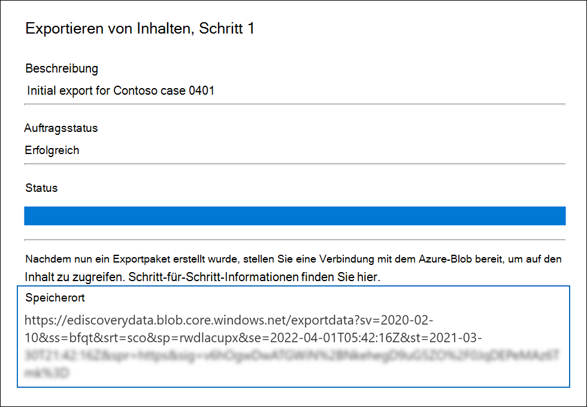
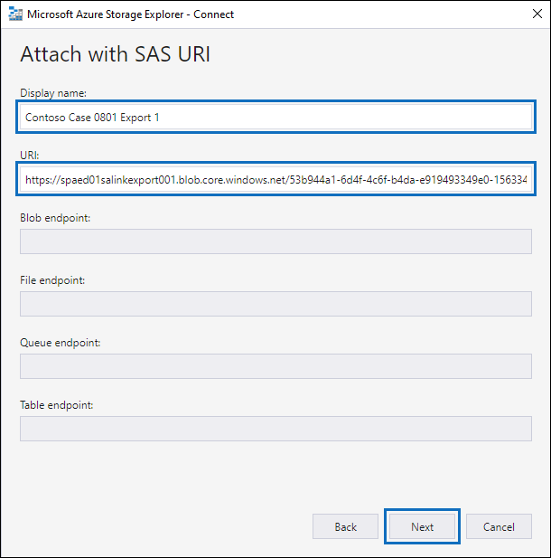
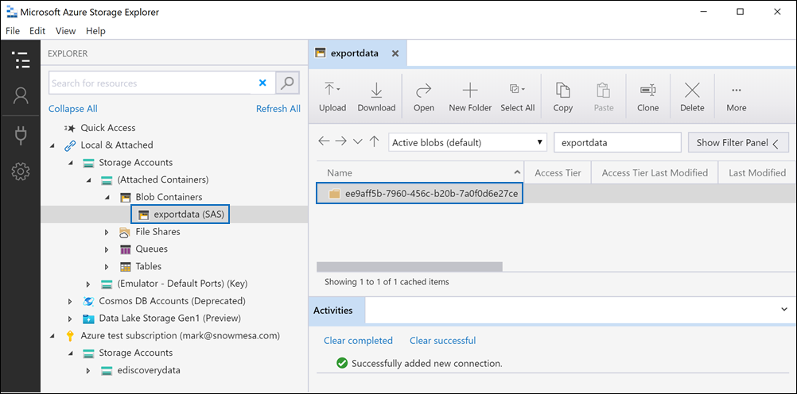

# Herunterladen von Exportaufträgen in einem Advanced eDiscovery-FallDownload export jobs in an Advanced eDiscovery case

Wenn Sie Dokumente aus einem Überprüfungssatz in einem Advanced eDiscovery-Fall exportieren, werden die Dokumente an einen von Microsoft bereitgestellten Azure Storage-Speicherort oder an einen azure-Speicherspeicherort hochgeladen, der von Ihrer Organisation verwaltet wird.When you export documents from a review set in an Advanced eDiscovery case, the documents are uploaded to a Microsoft-provided Azure Storage location or to an Azure Storage location managed by your organization. Der typ des verwendeten Azure Storage-Speicherorts hängt davon ab, welche Option beim Exportieren der Dokumente ausgewählt wurde.The type of Azure Storage location used depends on which option was selected when the documents were exported.

Dieser Artikel enthält Anweisungen zum Verwenden des Microsoft Azure Storage Explorers, um eine Verbindung mit einem Azure Storage-Speicherort herzustellen, um die exportierten Dokumente zu durchsuchen und herunterzuladen.This article provides instructions for how to use the Microsoft Azure Storage Explorer to connect to an Azure Storage location to browse and download the exported documents. Weitere Informationen zum Azure Storage Explorer finden Sie unter [Schnellstart: Verwenden von Azure Storage Explorer](/azure/storage/blobs/storage-quickstart-blobs-storage-explorer).For more information about Azure Storage Explorer, see [Quickstart: Use Azure Storage Explorer](/azure/storage/blobs/storage-quickstart-blobs-storage-explorer).

## Schritt 1: Installieren des Azure Storage ExplorerStep 1: Install the Azure Storage Explorer

Der erste Schritt besteht im Herunterladen und Installieren des Azure Storage Explorers.The first step is to download and install the Azure Storage Explorer. Anweisungen finden Sie unter [Azure Storage Explorer Tool](https://go.microsoft.com/fwlink/p/?LinkId=544842).For instructions, see [Azure Storage Explorer tool](https://go.microsoft.com/fwlink/p/?LinkId=544842). Mit diesem Tool können Sie in Schritt 3 eine Verbindung mit den exportierten Dokumenten herstellen und diese herunterladen.You use this tool to connect to and download the exported documents in Step 3.

## Schritt 2: Abrufen der SAS-URL aus dem ExportauftragStep 2: Obtain the SAS URL from the export job

Im nächsten Schritt rufen Sie die SAS-URL (Shared Access Signature) ab, die beim Erstellen des Exportauftrags zum Exportieren von Dokumenten aus einem [Überprüfungssatz generiert wird.](export-documents-from-review-set.md)The next step is to obtain the shared access signature (SAS) URL that's generated when you created the export job to [export documents from a review set](export-documents-from-review-set.md). Sie können die SAS-URL für Dokumente kopieren, die an einen von Microsoft bereitgestellten Azure Storage-Speicherort oder einen von Ihrer Organisation verwalteten Azure Storage-Speicherort hochgeladen werden.You can copy the SAS URL for documents that are uploaded to a Microsoft-provided Azure Storage location or an Azure Storage location managed by your organization. In beiden Fällen verwenden Sie die SAS-URL, um eine Verbindung mit dem Azure Storage-Speicherort in Schritt 3 herzustellen.In either case, you use the SAS URL to connect to the Azure Storage location in Step 3.

1. Wechseln Sie auf der Seite **Advanced eDiscovery** zum Fall, und klicken Sie dann **auf** die Registerkarte Exporte.On the **Advanced eDiscovery** page, go to the case, and then click the **Exports** tab.

2. Klicken Sie auf der Registerkarte **Exporte** auf den Exportvorgang, den Sie herunterladen möchten.On the **Exports** tab, click the export job that you want to download.

3. Kopieren Sie auf der Flyoutseite unter **Speicherorte** die angezeigte SAS-URL.On the flyout page, under **Locations**, copy the SAS URL that's displayed. Bei Bedarf können Sie sie in einer Datei speichern, damit Sie in Schritt 3 darauf zugreifen können.If necessary, you can save it to a file so you can access it in Step 3.
 
   

## Schritt 3: Herstellen einer Verbindung mit dem Azure Storage-SpeicherortStep 3: Connect to the Azure Storage location

Der letzte Schritt besteht in der Verwendung des Azure Storage Explorers und der SAS-URL, um eine Verbindung mit dem Azure Storage-Speicherort herzustellen und die Dokumente herunterzuladen, die Sie auf einen lokalen Computer exportiert haben.The final step is to use the Azure Storage Explorer and the SAS URL to connect to the Azure Storage location and download the documents that you exported to a local computer.

1. Öffnen Sie den Azure Storage Explorer, den Sie in Schritt 1 installiert haben.Open the Azure Storage Explorer that you installed in Step 1.

2. Klicken Sie auf **das Symbol Konto** hinzufügen.Click the **Add account** icon. Alternativ können Sie mit der rechten Maustaste auf **Speicherkonten klicken.**Alternatively, you can right-click **Storage Accounts**.

   

3. Klicken Sie **auf der Seite** Verbindung mit Azure Storage herstellen auf **SAS-URI (Shared Access Signature)** verwenden, und klicken Sie dann auf **Weiter**.On the **Connect to Azure Storage** page, click **Use a shared access signature (SAS) URI** and then click **Next**.

    

4. Klicken Sie auf der Seite Mit **SAS-URI** anfügen in das URI-Feld, und fügen Sie dann die SAS-URL ein, die Sie in Schritt 2 erhalten haben.On the **Attach with SAS URI** page, click in the URI box, and then paste the SAS URL that you obtained in Step 2. 

    

    Beachten Sie, dass ein Teil der SAS-URL im Feld **Anzeigename angezeigt** wird.Notice that a portion of the SAS URL is displayed in the **Display name** box. Dies wird als Anzeigename des Containers verwendet, der unter den **Speicherkonten** erstellt wird, nachdem Sie eine Verbindung mit dem Speicherort hergestellt haben.This will be used as the display name of the container that's created under the **Storage accounts** after you connect to the storage location. Dieser Name besteht aus der ID des Advanced eDiscovery-Falls und aus einem eindeutigen Bezeichner.This name consists of the ID of the Advanced eDiscovery case is from and a unique identifier. Sie können den standardmäßigen Anzeigenamen beibehalten oder ändern.You can keep the default display name or change it. Wenn Sie ihn ändern, muss der Anzeigename eindeutig sein.If you change it, the display name must be unique.

5. Klicken Sie auf **Weiter**.Click **Next**.

    Die **Seite Verbindungszusammenfassung** wird angezeigt.The **Connection summary** page is displayed.

    

6. Überprüfen Sie **auf der Seite Verbindungszusammenfassung** die Verbindungsinformationen, und klicken Sie dann auf **Verbinden**.On the **Connection summary** page, review the connection information, and then click **Connect**.

    Der **Knoten Blobcontainer** (unter **Speicherkonten**  >  **(angefügte Container)** \> wird geöffnet.The **Blob containers** node (under **Storage Accounts** > **(Attached Containers)** \> is opened.

    

    Es enthält einen Container mit dem Anzeigenamen aus Schritt 4.It contains a container named with the display name from step 4. Dieser Container enthält einen Ordner für jeden von Ihnen erstellten Exportauftrag.This container contains a folder for each export job that you've created. Diese Ordner werden mit einer ID benannt, die der ID des Exportauftrags entspricht.These folders are named with an ID that corresponds to the ID of the export job. Sie finden diese Export-IDs (und den Namen des Exports) unter **Supportinformationen** auf der Flyoutseite für jeden **Exportauftrag** vorbereiten, der auf der Registerkarte Aufträge aufgeführt **ist.**You can find these export IDs (and the name of the export) under **Support information** on the flyout page for each **Preparing data for export** job listed on the **Jobs** tab.

7. Doppelklicken Sie auf den Exportauftragsordner, um ihn zu öffnen.Double-click the export job folder to open it.

   Eine Liste der Ordner und Exportberichte wird angezeigt.A list of folders and export reports is displayed.
   
    

   Der Exportauftragsordner enthält die folgenden Elemente.The export job folder contains the following items. Die tatsächlichen Elemente im Exportordner werden durch die Exportoptionen bestimmt, die beim Erstellen des Exportauftrags konfiguriert wurden.The actual items in the export folder are determined by the export options configured when the export job was created. Weitere Informationen finden Sie unter [Exportieren von Dokumenten aus einem Überprüfungssatz](export-documents-from-review-set.md).For more information, see [Export documents from a review set](export-documents-from-review-set.md).

    - Export_load_file.csv: Diese CSV-Datei ist ein Detailexportbericht, der Informationen zu jedem exportierten Dokument enthält.Export_load_file.csv: This CSV file is a detail export report that contains information about each exported document. Die Datei besteht aus einer Spalte für jede Metadateneigenschaft für ein Dokument.The file consists of a column for each metadata property for a document. Eine Liste und Beschreibung der Metadaten, die in diesem  Bericht enthalten sind, finden Sie in der Tabelle in Dokumentmetadatenfelder [in Advanced eDiscovery](document-metadata-fields-in-advanced-ediscovery.md)in der Spalte Exportierter Feldname.For a list and description of the metadata that's included in this report, see the **Exported field name** column in the table in [Document metadata fields in Advanced eDiscovery](document-metadata-fields-in-advanced-ediscovery.md).
    
    - Summary.txt: Eine Textdatei, die eine Zusammenfassung des Exports einschließlich Exportstatistiken enthält.Summary.txt: A text file that contains a summary of the export including export statistics.
    
    - Extracted_text_files: Dieser Ordner enthält eine Textdateiversion jedes exportierten Dokuments.Extracted_text_files: This folder contains a text file version of each exported document.
     
    - NativeFiles: Dieser Ordner enthält eine systemeigene Dateiversion jedes exportierten Dokuments.NativeFiles: This folder contains a native file version of each exported document.
    
    - Error_files: Dieser Ordner enthält die folgenden Elemente, wenn der Exportauftrag Fehlerdateien enthält:Error_files: This folder includes the following items when the export job contains any error files: 
        
      - ExtractionError.csv: Diese CSV-Datei enthält die verfügbaren Metadaten für Dateien, die nicht ordnungsgemäß aus ihrem übergeordneten Element extrahiert wurden.ExtractionError.csv: This CSV file contains the available metadata for files that weren't properly extracted from their parent item.
        
      - ProcessingError: Dieser Ordner enthält Dokumente mit Verarbeitungsfehlern.ProcessingError: This folder contains documents with processing errors. Dieser Inhalt befindet sich auf Elementebene, d. h., wenn in einer Anlage ein Verarbeitungsfehler aufgetreten ist, wird auch das Dokument, das die Anlage enthält, in diesem Ordner enthalten sein.This content is at an item level, which means if an attachment had a processing error, the document that contains the attachment will also be included in this folder.
 
8. Wenn Sie alle Inhalte im Export exportieren möchten, wählen Sie den Exportordner aus, und klicken Sie dann auf **Herunterladen**.To export all contents in the export, select the export folder, and then click **Download**.

9. Geben Sie den Speicherort an, an den Sie die exportierten Dateien herunterladen möchten, und klicken Sie dann auf Ordner auswählen.Specify the location where you want to download the exported files, and then click Select folder.

    Der Azure Storage Explorer startet den Exportvorgang.The Azure Storage Explorer starts the export process. Der Status des Downloads der exportierten Elemente wird im Bereich **Aktivitäten** angezeigt.The status of the downloading the exported items is displayed in the **Activities** pane. Nach Abschluss des Downloads wird eine Meldung angezeigt.A message is displayed when the download is finished.

    

> [!NOTE]
> Statt den gesamten Exportauftrag herunterzuladen, können Sie bestimmte Elemente zum Herunterladen auswählen.Instead of downloading the entire export job, you can select specific items to download. Anstatt Elemente herunterzuladen, können Sie auch auf ein Element doppelklicken, um es anzuzeigen.And instead of downloading items, you can double-click an item to view it.