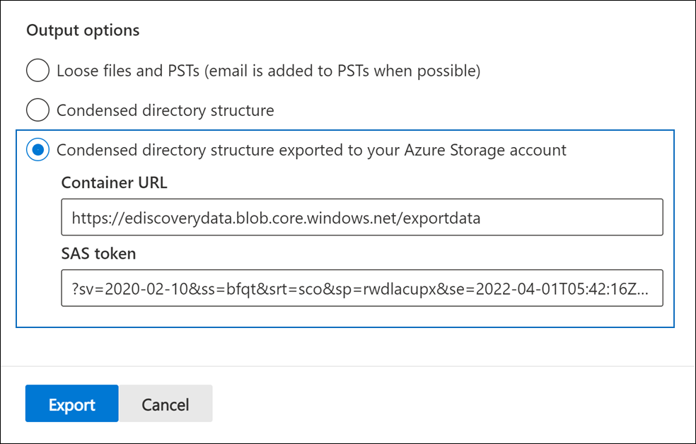

# Exportieren von Dokumenten in einem Prüfdateisatz auf ein Azure Storage KontoExport documents in a review set to an Azure Storage account

Wenn Sie Dokumente aus einem Prüfdateisatz in einem Advanced eDiscovery Fall exportieren, haben Sie die Möglichkeit, sie in ein Azure Storage Konto zu exportieren, das von Ihrer Organisation verwaltet wird.When you export documents from a review set in an Advanced eDiscovery case, you have the option to export them to an Azure Storage account managed by your organization. Wenn Sie diese Option verwenden, werden die Dokumente an Ihren Azure Storage Speicherort hochgeladen.If you use this option, the documents are uploaded to your Azure Storage location. Nachdem sie exportiert wurden, können Sie mithilfe der Azure Storage-Explorer auf die Dokumente zugreifen (und sie auf einen lokalen Computer oder einen anderen Speicherort herunterladen).After they are exported, you can access the documents (and download them to a local computer or other location) by using the Azure Storage Explorer. Dieser Artikel enthält Anweisungen zum Exportieren von Dokumenten in Ihr Azure Storage Konto und zum Verwenden des Azure Storage-Explorer zum Herstellen einer Verbindung mit einem Azure Storage Speicherort zum Herunterladen der exportierten Dokumente.This article provides instructions for how to export documents to your Azure Storage account and the use the Azure Storage Explorer to connect to an Azure Storage location to download the exported documents. Weitere Informationen zu Azure Storage-Explorer finden Sie unter [Verwenden von Azure Storage-Explorer](/azure/storage/blobs/storage-quickstart-blobs-storage-explorer).For more information about Azure Storage Explorer, see [Use Azure Storage Explorer](/azure/storage/blobs/storage-quickstart-blobs-storage-explorer).

## Vor dem Exportieren von Dokumenten aus einem PrüfdateisatzBefore you export documents from a review set

- Sie müssen ein SAS-Token (Shared Access Signature) für Ihr Azure Storage konto und die URL für einen bestimmten Container im Speicherkonto bereitstellen, um Dokumente aus einem Prüfdateisatz zu exportieren.You need to provide a shared access signature (SAS) token for your Azure Storage account and the URL for a specific container in the storage account to export documents from a review set. Achten Sie darauf, dass diese beim Ausführen von Schritt 2 zur Hand sind (z. B. in eine Textdatei kopiert).Be sure to have these at hand (for example, copied to a text file) when you perform Step 2

  - **SAS-Token:** Stellen Sie sicher, dass sie das SAS-Token für Ihr Azure Storage Konto (und nicht für den Container) abrufen.**SAS token**: Be sure to get the SAS token is for your Azure Storage account (and not for the container). Sie können ein SAS-Token für Ihr Konto in Azure Storage generieren.You can generate an SAS token for your account in Azure Storage. Wechseln Sie dazu zum Azure Storage Konto, und wählen Sie **die Zugriffssignatur** freigeben unter den **einstellungen Einstellungen** im Blatt "Speicherkonto" aus.To do this, go to the Azure Storage account, and select **Share access signature** under the **Settings** settings in the storage account blade. Verwenden Sie die Standardeinstellungen, und lassen Sie alle Ressourcentypen zu, wenn Sie das SAS-Token generieren.Use the default settings and allow all resource types when you generate the SAS token.

  - **Container-URL:** Sie müssen einen Container erstellen, um die Prüfdateisatzdokumente hochzuladen, und dann eine Kopie der URL für den Container abrufen. Beispiel: `https://ediscoverydata.blob.core.windows.net/exportdata` .**Container URL**: You need to create a container to upload the review set documents to, and then get a copy of the URL for the container; for example, `https://ediscoverydata.blob.core.windows.net/exportdata`. Um die URL abzurufen, wechseln Sie zu dem Container in Azure Storage, und wählen Sie **Eigenschaften** unter dem Abschnitt **Einstellungen** im Containerblatt aus.To get the URL, go to the container in Azure Storage, and select **Properties** under the **Settings** section in the container blade.

- Laden Sie die Azure Storage-Explorer herunter, und installieren Sie sie.Download and install the Azure Storage Explorer. Anweisungen finden Sie unter [Azure Storage-Explorer Tool.](https://go.microsoft.com/fwlink/p/?LinkId=544842)For instructions, see [Azure Storage Explorer tool](https://go.microsoft.com/fwlink/p/?LinkId=544842). Mit diesem Tool stellen Sie eine Verbindung mit dem Container in Ihrem Azure Storage konto her und laden die Dokumente herunter, die Sie in Schritt 1 exportiert haben.You use this tool to connect to the container in your Azure Storage account and download the documents that you exported in Step 1.

## Schritt 1: Exportieren der Dokumente aus einem PrüfdateisatzStep 1: Export the documents from a review set

Der erste Schritt besteht darin, einen Exportauftrag zum Exportieren von Dokumenten aus einem Prüfdateisatz zu erstellen.The first step is to create an export job to export documents out of a review set. Ausführlichere Anweisungen zu allen Exportoptionen finden Sie unter [Exportieren von Dokumenten aus einem Prüfdateisatz.](export-documents-from-review-set.md)For more detailed instructions about all the export options, see [Export documents from a review set](export-documents-from-review-set.md). Im folgenden Verfahren werden die Einstellungen zum Exportieren von Dokumenten in das Azure Storage Konto Ihrer Organisation hervorgehoben.The following procedure highlights the settings to export documents to your organization's Azure Storage account.

1. Öffnen Sie im Microsoft 365 Compliance Center die Advanced eDiscovery Fall, wählen Sie die Registerkarte **"Prüfdateisätze"** aus, und wählen Sie dann den Prüfdateisatz aus, den Sie exportieren möchten.In the Microsoft 365 compliance center, open the Advanced eDiscovery case, select the **Review sets** tab, and then select the review set that you want to export.

2. Klicken Sie im Prüfdateisatz auf **"Aktion exportieren".**  >  In the review set, click **Action** > **Export**.

3. Geben Sie auf der Flyoutseite **"Exportoptionen"** einen Namen (erforderlich) und eine Beschreibung (optional) für den Export ein.On the **Export options** flyout page, type a name (required) and description (optional) for the export.

4. Konfigurieren Sie die Einstellungen in den Abschnitten "Dokumente", "Metadaten", "Inhalte" und "Optionen".Configure the settings in the documents, metadata, content, and options sections. Weitere Informationen zu diesen Einstellungen finden Sie unter [Exportieren von Dokumenten aus einem Prüfdateisatz.](export-documents-from-review-set.md)For more information about these settings, see [Export documents from a review set](export-documents-from-review-set.md).

5. Wählen Sie im Abschnitt **"Ausgabeoptionen"** die Struktur des **komprimierten Verzeichnisses** aus, die in Ihre Azure Storage Kontooption exportiert wurde.In the **Output options** section, select the **Condensed directory structure exported to your Azure Storage account** option.

6. Fügen Sie die Container-URL und das SAS-Token für Ihr Speicherkonto in die entsprechenden Felder ein.Paste the container URL and the SAS token for your storage account in the corresponding fields.

   

7. Klicken Sie auf **"Exportieren",** um den Exportauftrag zu erstellen.Click **Export** to create the export job.

## Schritt 2: Abrufen der SAS-URL aus dem ExportauftragStep 2: Obtain the SAS URL from the export job

Der nächste Schritt besteht darin, die SAS-URL abzurufen, die generiert wird, nachdem Sie den Exportauftrag in Schritt 1 erstellt haben.The next step is to obtain the SAS URL that's generated after you create the export job in Step 1. Verwenden Sie die SAS-URL, um eine Verbindung mit dem Container in Ihrem Azure Storage Konto herzustellen, in das Sie die Dokumente des Prüfdateisatzes exportiert haben.You use the SAS URL to connect to the container in your Azure Storage account that you exported the review set documents to.

1. Wechseln **Sie auf** der Advanced eDiscovery Seite zu der Groß-/Kleinschreibung, und klicken Sie dann auf die Registerkarte **"Exporte".**On the **Advanced eDiscovery** page, go to the case, and then click the **Exports** tab.

2. Klicken Sie auf der Registerkarte **Exporte** auf den Exportvorgang, den Sie herunterladen möchten.On the **Exports** tab, click the export job that you want to download. Dies ist der Exportauftrag, den Sie in Schritt 1 erstellt haben.This is the export job that you created in Step 1.

3. Kopieren Sie auf der Flyoutseite unter **"Speicherorte"** die angezeigte SAS-URL.On the flyout page, under **Locations**, copy the SAS URL that's displayed. Falls erforderlich, können Sie sie in einer Textdatei speichern, damit Sie in Schritt 3 darauf zugreifen können.If necessary, you can save it to a text file so you can access it in Step 3.

   

   > [!TIP]
   > Die SAS-URL, die im Exportauftrag angezeigt wird, ist eine Verkettung der Container-URL und des SAS-Tokens für Ihr Azure Storage Konto.The SAS URL that's displayed in the export job is a concatenation of the container URL and the SAS token for your Azure Storage account. Sie können ihn aus dem Exportauftrag kopieren oder selbst erstellen, indem Sie die URL und das SAS-Token kombinieren.You can copy it from the export job or create it yourself by combining the URL and the SAS token.

## Schritt 3: Verbinden zum Azure Storage-ContainerStep 3: Connect to the Azure Storage container

Der letzte Schritt besteht darin, die Azure Storage-Explorer und die SAS-URL zu verwenden, um eine Verbindung mit dem Container in Ihrem Azure Storage konto herzustellen und die exportierten Dokumente auf einen lokalen Computer herunterzuladen.The final step is to use the Azure Storage Explorer and the SAS URL to connect to the container in your Azure Storage account and download the exported documents to a local computer.

1. Starten Sie die Azure Storage-Explorer, die Sie heruntergeladen und installiert haben.Start the Azure Storage Explorer that you downloaded and installed.

2. Klicken Sie auf das Dialogfeld **Öffnen Verbinden .**Click the **Open Connect Dialog** icon.

   

3. Klicken Sie auf der **Verbinden auf Azure Storage** Seite auf **Blobcontainer.**On the **Connect to Azure Storage** page, click **Blob container**.

4. Wählen Sie auf der Seite **"Authentifizierungsmethode auswählen"** die Option **"Shared Access Signature (SAS)"** aus, und klicken Sie dann auf **"Weiter".**On the **Select Authentication Method** page, select the **Shared access signature (SAS)** option and then click **Next**.

5. Fügen Sie auf der Seite **"Verbindungsinformationen eingeben"** die SAS-URL (die Sie im Exportauftrag in Schritt 2 erhalten haben) in das **FELD "SAS-URL** des Blobcontainers" ein.On the **Enter Connection Info** page, paste the SAS URL (that you obtained in the export job in Step 2) in the **Blob Container SAS URL** box.

    

    Beachten Sie, dass der Containername im **Anzeigenamenfeld** angezeigt wird.Notice that the container name is displayed in the **Display name** box. Sie können diesen Namen bearbeiten.You can edit this name.

6. Klicken Sie auf **"Weiter",** um die **Zusammenfassungsseite** anzuzeigen, und klicken Sie dann auf **Verbinden**.Click **Next** to display the **summary** page and then click **Connect**.

    Der **Blobcontainerknoten** (unter **Storage Konten**  >  **(angefügte Container)** wird \> geöffnet.The **Blob containers** node (under **Storage Accounts** > **(Attached Containers)** \> is opened.

    

    Es enthält einen Container mit dem Anzeigenamen aus Schritt 5.It contains a container named with the display name from step 5. Dieser Container enthält einen Ordner für jeden Exportauftrag, den Sie in den Container in Ihrem Azure Storage-Konto heruntergeladen haben.This container contains a folder for each export job that you've downloaded to the container in your Azure Storage account. Diese Ordner werden mit einer ID benannt, die der ID des Exportauftrags entspricht.These folders are named with an ID that corresponds to the ID of the export job. Sie finden diese Export-IDs (und den Namen des Exports) unter **"Supportinformationen"** auf der Flyoutseite für die einzelnen **Vorbereitungsdaten für den Exportauftrag,** die auf der Registerkarte **"Aufträge"** im Advanced eDiscovery Fall aufgeführt sind.You can find these export IDs (and the name of the export) under **Support information** on the flyout page for each **Preparing data for export** job listed on the **Jobs** tab in the Advanced eDiscovery case.

7. Doppelklicken Sie auf den Exportauftragsordner, um ihn zu öffnen.Double-click the export job folder to open it.

   Eine Liste der Ordner und Exportberichte wird angezeigt.A list of folders and export reports is displayed.

    

8. Um alle Inhalte aus dem Exportauftrag zu exportieren, klicken Sie auf den Pfeil nach **oben,** um zum Exportauftragsordner zurückzukehren, und klicken Sie dann auf **"Herunterladen".**To export all contents from the export job, click the **Up** arrow to go back to the export job folder, and then click **Download**.

9. Geben Sie den Speicherort an, an den Sie die exportierten Dateien herunterladen möchten, und klicken Sie dann auf Ordner auswählen.Specify the location where you want to download the exported files, and then click Select folder.

    Die Azure Storage-Explorer startet den Downloadvorgang.The Azure Storage Explorer starts the download process. Der Status des Herunterladens der exportierten Elemente wird im **Bereich "Aktivitäten"** angezeigt.The status of the downloading the exported items is displayed in the **Activities** pane. Wenn der Download abgeschlossen ist, wird eine Meldung angezeigt.A message is displayed when the download is complete.

> [!NOTE]
> Anstatt den gesamten Exportauftrag in Azure Storage-Explorer herunterzuladen, können Sie bestimmte Elemente auswählen, die heruntergeladen und angezeigt werden sollen.Instead of downloading the entire export job in Azure Storage Explorer, you can select specific items to download and view.

## Weitere InformationenMore information

- Der Exportauftragsordner enthält die folgenden Elemente.The export job folder contains the following items. Die tatsächlichen Elemente im Exportordner werden durch die Exportoptionen bestimmt, die beim Erstellen des Exportauftrags konfiguriert wurden.The actual items in the export folder are determined by the export options configured when the export job was created. Weitere Informationen zu diesen Optionen finden Sie unter [Exportieren von Dokumenten aus einem Prüfdateisatz.](export-documents-from-review-set.md)For more information about these options, see [Export documents from a review set](export-documents-from-review-set.md).

  - Export_load_file.csv: Diese CSV-Datei ist ein Detailexportbericht, der Informationen zu jedem exportierten Dokument enthält.Export_load_file.csv: This CSV file is a detail export report that contains information about each exported document. Die Datei besteht aus einer Spalte für jede Metadateneigenschaft für ein Dokument.The file consists of a column for each metadata property for a document. Eine Liste und Beschreibung der Metadaten, die in diesem Bericht enthalten sind, finden Sie in der Spalte **"Exportierter Feldname"** in der Tabelle in den [Dokumentmetadatenfeldern in Advanced eDiscovery.](document-metadata-fields-in-advanced-ediscovery.md)For a list and description of the metadata that's included in this report, see the **Exported field name** column in the table in [Document metadata fields in Advanced eDiscovery](document-metadata-fields-in-advanced-ediscovery.md).

  - Summary.txt: Eine Textdatei, die eine Zusammenfassung des Exports einschließlich Exportstatistiken enthält.Summary.txt: A text file that contains a summary of the export including export statistics.

  - Extracted_text_files: Dieser Ordner enthält eine Textdateiversion jedes exportierten Dokuments.Extracted_text_files: This folder contains a text file version of each exported document.

  - NativeFiles: Dieser Ordner enthält eine systemeigene Dateiversion jedes exportierten Dokuments.NativeFiles: This folder contains a native file version of each exported document.

  - Error_files: Dieser Ordner enthält die folgenden Elemente, wenn der Exportauftrag Fehlerdateien enthält:Error_files: This folder includes the following items when the export job contains any error files:

    - ExtractionError.csv: Diese CSV-Datei enthält die verfügbaren Metadaten für Dateien, die nicht ordnungsgemäß aus dem übergeordneten Element extrahiert wurden.ExtractionError.csv: This CSV file contains the available metadata for files that weren't properly extracted from their parent item.

    - ProcessingError: Dieser Ordner enthält Dokumente mit Verarbeitungsfehlern.ProcessingError: This folder contains documents with processing errors. Dieser Inhalt befindet sich auf Elementebene, d. h., wenn eine Anlage einen Verarbeitungsfehler aufweist, wird das Dokument, das die Anlage enthält, ebenfalls in diesem Ordner enthalten sein.This content is at an item level, which means if an attachment had a processing error, the document that contains the attachment will also be included in this folder.
