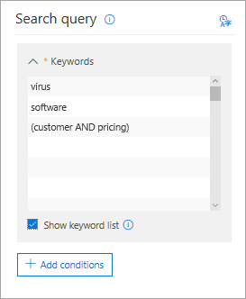

# <a name="ediscovery-cases-in-the-security--compliance-center"></a><span data-ttu-id="22633-105">eDiscovery-Fälle im Security #a0 Compliance Center</span><span class="sxs-lookup"><span data-stu-id="22633-105">eDiscovery cases in the Security & Compliance Center</span></span>

<span data-ttu-id="22633-106">Sie können eDiscovery-Fälle im Compliance Center in Office 365 und Microsoft 365 verwenden, um zu steuern, wer eDiscovery-Fälle in Ihrer Organisation erstellen, auf Sie zugreifen und diese verwalten kann.</span><span class="sxs-lookup"><span data-stu-id="22633-106">You can use eDiscovery cases in the compliance center in Office 365 and Microsoft 365 to control who can create, access, and manage eDiscovery cases in your organization.</span></span> <span data-ttu-id="22633-107">Wenn Ihre Organisation über ein Office 365 E5-Abonnement verfügt, können Sie auch mithilfe von eDiscovery-Fällen Suchergebnisse mithilfe Office 365 Advanced eDiscovery analysieren.</span><span class="sxs-lookup"><span data-stu-id="22633-107">If your organization has an Office 365 E5 subscription, you can also use eDiscovery cases to analyze search results by using Office 365 Advanced eDiscovery.</span></span>
  
<span data-ttu-id="22633-108">Mit einem eDiscovery-Fall können Sie einem Fall Mitglieder hinzufügen, Steuern, welche Arten von Aktionen von bestimmten Fall Mitgliedern ausgeführt werden können, Aufbewahrungsmöglichkeiten für für einen Rechtsfall relevanter Inhaltsspeicher platzieren und mehrere Inhalts suchen mit einem einzigen Fall verknüpfen.</span><span class="sxs-lookup"><span data-stu-id="22633-108">An eDiscovery case allows you to add members to a case, control what types of actions that specific case members can perform, place a hold on content locations relevant to a legal case, and associate multiple Content Searches with a single case.</span></span> <span data-ttu-id="22633-109">Sie können auch die Ergebnisse einer beliebigen Inhaltssuche exportieren, die einem Fall zugeordnet ist, oder Suchergebnisse für die Analyse in Advanced eDiscovery vorbereiten.</span><span class="sxs-lookup"><span data-stu-id="22633-109">You can also export the results of any Content Search that is associated with a case or prepare search results for analysis in Advanced eDiscovery.</span></span> <span data-ttu-id="22633-110">eDiscovery-Fälle sind eine gute Möglichkeit, um zu beschränken, wer Zugriff auf Inhaltssuchen und Suchergebnisse für einen bestimmten Rechtsfall in Ihrer Organisation hat.</span><span class="sxs-lookup"><span data-stu-id="22633-110">eDiscovery cases are a good way to limit who has access to Content Searches and search results for a specific legal case in your organization.</span></span>
  
<span data-ttu-id="22633-111">Verwenden Sie den folgenden Workflow zum Einrichten und Verwenden von eDiscovery-Fällen im Security #a0 Compliance Center und in Advanced eDiscovery.</span><span class="sxs-lookup"><span data-stu-id="22633-111">Use the following workflow to set up and use eDiscovery cases in the Security & Compliance Center and Advanced eDiscovery.</span></span>

[<span data-ttu-id="22633-112">Step 1: Assign eDiscovery permissions to potential case members</span><span class="sxs-lookup"><span data-stu-id="22633-112">Step 1: Assign eDiscovery permissions to potential case members</span></span>](#step-1-assign-ediscovery-permissions-to-potential-case-members)

[<span data-ttu-id="22633-113">Schritt 2: Erstellen einer neuen Anfrage</span><span class="sxs-lookup"><span data-stu-id="22633-113">Step 2: Create a new case</span></span>](#step-2-create-a-new-case)

[<span data-ttu-id="22633-114">Schritt 3: Hinzufügen von Mitgliedern zu einer Anfrage</span><span class="sxs-lookup"><span data-stu-id="22633-114">Step 3: Add members to a case</span></span>](#step-3-add-members-to-a-case)

[<span data-ttu-id="22633-115">Schritt 4: Platzieren von Inhaltsspeicherorten in der Warteschleife</span><span class="sxs-lookup"><span data-stu-id="22633-115">Step 4: Place content locations on hold</span></span>](#step-4-place-content-locations-on-hold)

[<span data-ttu-id="22633-116">Schritt 5: Erstellen und Ausführen einer einem Fall zugeordneten Inhaltssuche</span><span class="sxs-lookup"><span data-stu-id="22633-116">Step 5: Create and run a Content Search associated with a case</span></span>](#step-5-create-and-run-a-content-search-associated-with-a-case)

[<span data-ttu-id="22633-117">Schritt 6: Exportieren der Ergebnisse einer Inhaltssuche, die einer Anfrage zugeordnet ist</span><span class="sxs-lookup"><span data-stu-id="22633-117">Step 6: Export the results of a Content Search associated with a case</span></span>](#step-6-export-the-results-of-a-content-search-associated-with-a-case)

[<span data-ttu-id="22633-118">Schritt 7: Vorbereiten der Suchergebnisse für Advanced eDiscovery</span><span class="sxs-lookup"><span data-stu-id="22633-118">Step 7: Prepare search results for Advanced eDiscovery</span></span>](#step-7-prepare-search-results-for-advanced-ediscovery)

[<span data-ttu-id="22633-119">Schritt 8: Wechseln zu der Groß-/Kleinschreibung in Advanced eDiscovery</span><span class="sxs-lookup"><span data-stu-id="22633-119">Step 8: Go to the case in Advanced eDiscovery</span></span>](#step-8-go-to-the-case-in-advanced-ediscovery)

[<span data-ttu-id="22633-120">Optional Schritt 9: Schließen eines Falls</span><span class="sxs-lookup"><span data-stu-id="22633-120">(Optional) Step 9: Close a case</span></span>](#optional-step-9-close-a-case)

[<span data-ttu-id="22633-121">Optional Schritt 10: Erneutes Öffnen eines geschlossenen Falls</span><span class="sxs-lookup"><span data-stu-id="22633-121">(Optional) Step 10: Re-open a closed case</span></span>](#optional-step-10-re-open-a-closed-case)

[<span data-ttu-id="22633-122">Weitere Informationen</span><span class="sxs-lookup"><span data-stu-id="22633-122">More information</span></span>](#more-information)
  
## <a name="step-1-assign-ediscovery-permissions-to-potential-case-members"></a><span data-ttu-id="22633-123">Schritt 1: Zuweisen von eDiscovery-Berechtigungen zu potenziellen Fallmitgliedern</span><span class="sxs-lookup"><span data-stu-id="22633-123">Step 1: Assign eDiscovery permissions to potential case members</span></span>

<span data-ttu-id="22633-124">Der erste Schritt besteht darin, Personen die entsprechenden eDiscovery-bezogenen Berechtigungen zuzuweisen, damit Sie Sie in Schritt 2 zu einem eDiscovery-Fall hinzufügen können.</span><span class="sxs-lookup"><span data-stu-id="22633-124">The first step is to assign the appropriate eDiscovery-related permissions to people so you can add them to an eDiscovery case in Step 2.</span></span> <span data-ttu-id="22633-125">Sie müssen Mitglied der Rollengruppe "Organisationsverwaltung" (oder der Rolle "Rollenverwaltung" zugewiesen) im Sicherheits #a0 Compliance Center sein, um eDiscovery-Berechtigungen zuzuweisen.</span><span class="sxs-lookup"><span data-stu-id="22633-125">You have to be a member of the Organization Management role group (or be assigned the Role Management role) in the Security & Compliance Center to assign eDiscovery permissions.</span></span> <span data-ttu-id="22633-126">In der folgenden Liste werden die eDiscovery-bezogenen Rollengruppen im Security #a0 Compliance Center beschrieben.</span><span class="sxs-lookup"><span data-stu-id="22633-126">The following list describes the eDiscovery-related role groups in the Security & Compliance Center.</span></span> 
  
- <span data-ttu-id="22633-127">**Prüfer.**</span><span class="sxs-lookup"><span data-stu-id="22633-127">**Reviewer.**</span></span> <span data-ttu-id="22633-128">Diese Rollengruppe verfügt über die restriktivsten Berechtigungen in Bezug auf eDiscovery.</span><span class="sxs-lookup"><span data-stu-id="22633-128">This role group has the most restrictive eDiscovery-related permissions.</span></span> <span data-ttu-id="22633-129">Der primäre Zweck dieser Rollengruppe besteht darin, Mitgliedern das Anzeigen und Zugreifen auf Falldaten in Office 365 Advanced eDiscovery zu gestatten.</span><span class="sxs-lookup"><span data-stu-id="22633-129">The primary purpose of this role group is to allow members to view and access case data in Office 365 Advanced eDiscovery.</span></span> <span data-ttu-id="22633-130">Mitglieder dieser Gruppe können die Liste der Fälle auf der Seite " **eDiscovery** " im Security #a0 Compliance Center nur anzeigen und öffnen, von der Sie Mitglieder sind.</span><span class="sxs-lookup"><span data-stu-id="22633-130">Members of this group can only see and open the list of the cases on the **eDiscovery** page in the Security & Compliance Center that they are members of.</span></span> <span data-ttu-id="22633-131">Nachdem der Benutzer im Security and Compliance Center auf einen Fall zugegriffen hat, kann er auf " **Advanced eDiscovery" wechseln** , um auf die Falldaten in Advanced eDiscovery zuzugreifen und diese zu analysieren.</span><span class="sxs-lookup"><span data-stu-id="22633-131">After the user accesses a case in the security and compliance center, they can click **Switch to Advanced eDiscovery** to access and analyze the case data in Advanced eDiscovery.</span></span> <span data-ttu-id="22633-132">Sie können keine Fälle erstellen, einem Fall Mitglieder hinzufügen, Aufbewahrungen erstellen, Suchergebnisse in der Vorschau anzeigen, Suchergebnisse exportieren oder Ergebnisse für Advanced eDiscovery vorbereiten.</span><span class="sxs-lookup"><span data-stu-id="22633-132">They can't create cases, add members to a case, create holds, create searches, preview search results, export search results, or prepare results for Advanced eDiscovery.</span></span> 
    
- <span data-ttu-id="22633-133">**eDiscovery-Manager.**</span><span class="sxs-lookup"><span data-stu-id="22633-133">**eDiscovery Manager.**</span></span> <span data-ttu-id="22633-134">Mitglieder dieser Rollengruppe können eDiscovery-Fälle erstellen und verwalten.</span><span class="sxs-lookup"><span data-stu-id="22633-134">Members of this role group can create and manage eDiscovery cases.</span></span> <span data-ttu-id="22633-135">Sie können Mitglieder hinzufügen und entfernen, inhaltsspeicherorte in der Warteschleife platzieren, Inhalts suchen, die einem Fall zugeordnet sind, erstellen und bearbeiten, die Ergebnisse einer Inhaltssuche exportieren und Suchergebnisse für die Analyse in Advanced eDiscovery vorbereiten.</span><span class="sxs-lookup"><span data-stu-id="22633-135">They can add and remove members, place content locations on hold, create and edit Content Searches associated with a case, export the results of a Content Search, and prepare search results for analysis in Advanced eDiscovery.</span></span> <span data-ttu-id="22633-136">In dieser Rollengruppe gibt es zwei Untergruppen.</span><span class="sxs-lookup"><span data-stu-id="22633-136">There are two subgroups in this role group.</span></span> <span data-ttu-id="22633-137">Der Unterschied zwischen diesen Untergruppen basiert auf dem Bereich.</span><span class="sxs-lookup"><span data-stu-id="22633-137">The difference between these subgroups is based on scope.</span></span>
    
  - <span data-ttu-id="22633-138">**eDiscovery-Manager.**</span><span class="sxs-lookup"><span data-stu-id="22633-138">**eDiscovery Manager.**</span></span> <span data-ttu-id="22633-139">Kann die eDiscovery-Fälle anzeigen und verwalten, in denen Sie erstellt werden oder deren Mitglied Sie sind.</span><span class="sxs-lookup"><span data-stu-id="22633-139">Can view and manage the eDiscovery cases they create or are a member of.</span></span> <span data-ttu-id="22633-140">Wenn ein anderer eDiscovery-Manager einen Fall erstellt, aber keinen zweiten eDiscovery-Manager als Mitglied dieses Falles hinzufügt, kann der zweite eDiscovery-Manager den Fall nicht auf der **eDiscovery** -Seite im Security #a0 Compliance Center anzeigen oder öffnen.</span><span class="sxs-lookup"><span data-stu-id="22633-140">If another eDiscovery Manager creates a case but doesn't add a second eDiscovery Manager as a member of that case, the second eDiscovery Manager won't be able to view or open the case on the **eDiscovery** page in the Security & Compliance Center.</span></span> <span data-ttu-id="22633-141">eDiscovery-Manager können auch auf ihre Fälle in Advanced eDiscovery zugreifen, um Analyseaufgaben durchzuführen.</span><span class="sxs-lookup"><span data-stu-id="22633-141">eDiscovery Managers can also access their cases in Advanced eDiscovery to perform analysis tasks.</span></span> 
    
  - <span data-ttu-id="22633-142">\**eDiscovery-Administrator *.**</span><span class="sxs-lookup"><span data-stu-id="22633-142">**eDiscovery Administrator\*.**</span></span> <span data-ttu-id="22633-143">Kann alle Fall Verwaltungsaufgaben ausführen, die ein eDiscovery-Manager ausführen kann.</span><span class="sxs-lookup"><span data-stu-id="22633-143">Can perform all case management tasks that an eDiscovery Manager can do.</span></span> <span data-ttu-id="22633-144">Darüber hinaus können eDiscovery-Administratoren folgende Aktionen durchführen:</span><span class="sxs-lookup"><span data-stu-id="22633-144">Additionally, an eDiscovery Administrator can:</span></span>
    
    - <span data-ttu-id="22633-145">Anzeigen aller Fälle, die auf der Seite **eDiscovery-Fälle** aufgeführt sind.</span><span class="sxs-lookup"><span data-stu-id="22633-145">View all cases that are listed on the **eDiscovery** page.</span></span> 
    
    - <span data-ttu-id="22633-146">Verwalten Sie alle Fälle in der Organisation, nachdem Sie sich selbst als Mitglied der Anfrage hinzugefügt haben.</span><span class="sxs-lookup"><span data-stu-id="22633-146">Manage any case in the organization after they add themself as a member of the case.</span></span>
    
    - <span data-ttu-id="22633-147">Zugriffs Fall Daten in Advanced eDiscovery für jeden Fall in der Organisation.</span><span class="sxs-lookup"><span data-stu-id="22633-147">Access case data in Advanced eDiscovery for any case in the organization.</span></span>
    
    <span data-ttu-id="22633-148">Überlegungen dazu, warum Sie ggf. einen eDiscovery-Administrator in Ihrer Organisation benötigen, finden Sie im Abschnitt [More information](#more-information).</span><span class="sxs-lookup"><span data-stu-id="22633-148">See the [More information](#more-information) section for reasons why you may want an eDiscovery Administrator in your organization.</span></span> 
    
> [!IMPORTANT]
> <span data-ttu-id="22633-149">Wenn eine Person nicht Mitglied einer dieser eDiscovery-bezogenen Rollengruppen ist oder kein Mitglied einer Rollengruppe ist, der die Rolle "Prüfer" zugewiesen ist, können Sie Sie nicht als Mitglied eines eDiscovery-Falls hinzufügen.</span><span class="sxs-lookup"><span data-stu-id="22633-149">If a person isn't a member of one of these eDiscovery-related role groups, or isn't a member of a role group that's assigned the Reviewer role, you can't add them as a member of an eDiscovery case.</span></span> 

<span data-ttu-id="22633-150">Weitere Informationen zu eDiscovery-Berechtigungen finden Sie unter [Zuweisen von eDiscovery-Berechtigungen](assign-ediscovery-permissions.md).</span><span class="sxs-lookup"><span data-stu-id="22633-150">For more information about eDiscovery permissions, see [Assign eDiscovery permissions](assign-ediscovery-permissions.md).</span></span>
  
 <span data-ttu-id="22633-151">**So weisen Sie eDiscovery-Berechtigungen zu**</span><span class="sxs-lookup"><span data-stu-id="22633-151">**To assign eDiscovery permissions:**</span></span>
  
1. <span data-ttu-id="22633-152">Wechseln Sie zu [https://protection.office.com](https://protection.office.com).</span><span class="sxs-lookup"><span data-stu-id="22633-152">Go to [https://protection.office.com](https://protection.office.com).</span></span>
    
2. <span data-ttu-id="22633-153">Melden Sie sich bei Office 365 mit Ihrem Geschäfts-, Schul- oder Unikonto an.</span><span class="sxs-lookup"><span data-stu-id="22633-153">Sign in to Office 365 using your work or school account.</span></span>
    
3. <span data-ttu-id="22633-154">Klicken Sie im Security #a0 Compliance Center auf **Berechtigungen**, und führen Sie eine der folgenden Aktionen basierend auf den eDiscovery-Berechtigungen aus, die Sie zuweisen möchten.</span><span class="sxs-lookup"><span data-stu-id="22633-154">In the Security & Compliance Center, click **Permissions**, and then do one of the following based on the eDiscovery permissions that you want to assign.</span></span>
    
    - <span data-ttu-id="22633-155">Um Prüferberechtigungen zuzuweisen, wählen Sie die Rollengruppe **Prüfer** aus, und klicken Sie dann neben **Mitglieder**auf **Bearbeiten**.</span><span class="sxs-lookup"><span data-stu-id="22633-155">To assign Reviewer permissions, select the **Reviewer** role group, and then next to **Members**, click **Edit**.</span></span> <span data-ttu-id="22633-156">Klicken Sie auf **Mitglieder auswählen**, klicken Sie auf **Bearbeiten**, klicken Sie auf  **hinzu**fügen, wählen Sie den Benutzer aus, den Sie der Rollengruppe Prüfer hinzufügen möchten, und klicken Sie dann auf **hinzu**fügen.</span><span class="sxs-lookup"><span data-stu-id="22633-156">Click **Choose members**, click **Edit**, click  **Add**, select the user that you want to add to the Reviewer role group, and then click **Add**.</span></span>
    
    - <span data-ttu-id="22633-157">Um eDiscovery Manager-Berechtigungen zuzuweisen, wählen Sie die Rollengruppe **eDiscovery-** Manager aus, und klicken Sie dann neben **eDiscovery-Manager**auf **Bearbeiten**.</span><span class="sxs-lookup"><span data-stu-id="22633-157">To assign eDiscovery Manager permissions, select the **eDiscovery Manager** role group, and then next to **eDiscovery Manager**, click **Edit**.</span></span> <span data-ttu-id="22633-158">Klicken Sie auf **eDiscovery-Manager auswählen**, klicken  **Bearbeiten**, klicken Sie auf Symbol hinzufügen \* \* Add \* \*, wählen Sie den Benutzer aus, den Sie als eDiscovery-Manager hinzufügen möchten, und klicken Sie dann auf **Hinzufügen**.</span><span class="sxs-lookup"><span data-stu-id="22633-158">Click **Choose eDiscovery Manager**, click **Edit**, click  \*\* Add \*\*, select the user that you want to add as an eDiscovery Manager, and then click **Add**.</span></span>
    
    - <span data-ttu-id="22633-159">Um eDiscovery-Administratorberechtigungen zuzuweisen, wählen Sie die Rollengruppe **eDiscovery-Manager** aus, und klicken Sie dann neben **eDiscovery-Administrator**auf **Bearbeiten**.</span><span class="sxs-lookup"><span data-stu-id="22633-159">To assign eDiscovery Administrator permissions, select the **eDiscovery Manager** role group, and then next to **eDiscovery Administrator**, click **Edit**.</span></span> <span data-ttu-id="22633-160">Klicken Sie auf **eDiscovery-Administrator auswählen**, klicken  **Bearbeiten**, klicken Sie **auf Symbol hinzufügen,** wählen Sie den Benutzer aus, den Sie als eDiscovery-Administrator hinzufügen möchten, und klicken Sie dann auf **hinzu**fügen.</span><span class="sxs-lookup"><span data-stu-id="22633-160">Click **Choose eDiscovery Administrator**, click **Edit**, click  **Add**, select the user that you want to add as an eDiscovery Administrator, and then click **Add**.</span></span>
    
4. <span data-ttu-id="22633-161">Nachdem Sie alle Benutzer hinzugefügt haben, klicken Sie auf **Fertig**, klicken Sie auf **Speichern** , um die Änderungen an der Rollengruppe zu speichern, und klicken Sie dann auf **Schließen**.</span><span class="sxs-lookup"><span data-stu-id="22633-161">After you've added all the users, click **Done**, click **Save** to save the changes to the role group, and then click **Close**.</span></span>

## <a name="step-2-create-a-new-case"></a><span data-ttu-id="22633-162">Schritt 2: Erstellen einer neuen Anfrage</span><span class="sxs-lookup"><span data-stu-id="22633-162">Step 2: Create a new case</span></span>

<span data-ttu-id="22633-163">Der nächste Schritt besteht darin, einen eDiscovery-Fall zu erstellen.</span><span class="sxs-lookup"><span data-stu-id="22633-163">The next step is to create a eDiscovery case.</span></span> <span data-ttu-id="22633-164">Sie müssen Mitglied der Rollengruppe „eDiscovery-Manager“ sein, um eDiscovery-Fälle zu erstellen.</span><span class="sxs-lookup"><span data-stu-id="22633-164">You must be a member of the eDiscovery Managers role group to create eDiscovery cases.</span></span> <span data-ttu-id="22633-165">Wie bereits erläutert, können Sie (und andere Fall Mitglieder) nach dem Erstellen eines Falls im Security #a0 Compliance Center auf denselben Fall in Advanced eDiscovery zugreifen, wenn Ihre Organisation über ein Office 365 E5-Abonnement verfügt.</span><span class="sxs-lookup"><span data-stu-id="22633-165">As previously explained, after you create a case in the Security & Compliance Center, you (and other case members) will be able to access that same case in Advanced eDiscovery if your organization has an Office 365 E5 subscription.</span></span>
  
1. <span data-ttu-id="22633-166">Wechseln Sie zu [https://protection.office.com](https://protection.office.com).</span><span class="sxs-lookup"><span data-stu-id="22633-166">Go to [https://protection.office.com](https://protection.office.com).</span></span>
    
2. <span data-ttu-id="22633-167">Melden Sie sich bei Office 365 mit Ihrem Geschäfts-, Schul- oder Unikonto an.</span><span class="sxs-lookup"><span data-stu-id="22633-167">Sign in to Office 365 using your work or school account.</span></span>
    
3. <span data-ttu-id="22633-168">Klicken Sie im Security #a0 Compliance Center auf **eDiscovery** \> **eDiscovery**, und klicken Sie  Symbol hinzufügen, **um eine Anfrage zu erstellen**.</span><span class="sxs-lookup"><span data-stu-id="22633-168">In the Security & Compliance Center, click **eDiscovery** \> **eDiscovery**, and then click  **Create a case**.</span></span>
    
4. <span data-ttu-id="22633-169">Geben Sie auf der Seite **neuer Fall** einen Namen ein, geben Sie eine optionale Beschreibung ein, und klicken Sie dann auf **Speichern**.</span><span class="sxs-lookup"><span data-stu-id="22633-169">On the **New Case** page, give the case a name, type an optional description, and then click **Save**.</span></span> <span data-ttu-id="22633-170">Der Case-Name muss in Ihrer Organisation eindeutig sein.</span><span class="sxs-lookup"><span data-stu-id="22633-170">The case name must be unique in your organization.</span></span>
    
    
  
    <span data-ttu-id="22633-172">Der neue Fall wird in der Liste der Fälle auf der **eDiscovery** -Seite angezeigt.</span><span class="sxs-lookup"><span data-stu-id="22633-172">The new case is displayed in the list of cases on the **eDiscovery** page.</span></span> <span data-ttu-id="22633-173">Sie können den Mauszeiger über einen Fallnamen bewegen, um Informationen über den Fall anzuzeigen, einschließlich des Status der Anfrage (**aktiv** oder **geschlossen**), der Beschreibung des Falls (die im vorherigen Schritt erstellt wurde), und wenn der Fall zuletzt geändert wurde und wer ihn geändert hat.</span><span class="sxs-lookup"><span data-stu-id="22633-173">You can hover the cursor over a case name to display information about the case, including the status of the case (**Active** or **Closed**), the description of the case (that was created in the previous step), and when the case was changed last and who changed it.</span></span>
    
    > [!TIP]
    > <span data-ttu-id="22633-174">Nachdem Sie einen neuen Fall erstellt haben, können Sie ihn jederzeit umbenennen.</span><span class="sxs-lookup"><span data-stu-id="22633-174">After you create a new case, you can rename it anytime.</span></span> <span data-ttu-id="22633-175">Klicken Sie auf der **eDiscovery** -Seite einfach auf den Namen des Falls.</span><span class="sxs-lookup"><span data-stu-id="22633-175">Just click the name of the case on the **eDiscovery** page.</span></span> <span data-ttu-id="22633-176">Ändern Sie auf der Seite **diesen Fall Flyout verwalten** den Namen, der in dem Feld unter **Name**angezeigt wird, und speichern Sie die Änderung.</span><span class="sxs-lookup"><span data-stu-id="22633-176">On the **Manage this case** flyout page, change the name displayed in the box under **Name**, and then save the change.</span></span> 
  
## <a name="step-3-add-members-to-a-case"></a><span data-ttu-id="22633-177">Schritt 3: Hinzufügen von Mitgliedern zu einer Anfrage</span><span class="sxs-lookup"><span data-stu-id="22633-177">Step 3: Add members to a case</span></span>

<span data-ttu-id="22633-178">Nachdem Sie einen Fall erstellt haben, besteht der nächste Schritt darin, der Anfrage Mitglieder hinzuzufügen.</span><span class="sxs-lookup"><span data-stu-id="22633-178">After you create a case, the next step is to add members to the case.</span></span> <span data-ttu-id="22633-179">Wie zuvor erläutert, können nur Benutzer, die Mitglieder der Rollengruppen Prüfer oder eDiscovery-Manager sind, als Mitglieder der Anfrage hinzugefügt werden.</span><span class="sxs-lookup"><span data-stu-id="22633-179">As previous explained, only users who are members of the Reviewer or eDiscovery Manager role groups can be added as members of the case.</span></span> <span data-ttu-id="22633-180">Der eDiscovery-Manager, der den Fall erstellt hat, wird automatisch als Mitglied hinzugefügt.</span><span class="sxs-lookup"><span data-stu-id="22633-180">The eDiscovery Manager who created the case is automatically added as a member.</span></span>
  
1. <span data-ttu-id="22633-181">Klicken Sie im Security #a0 Compliance Center auf **eDiscovery** \> **eDiscovery** , um die Liste der Fälle in Ihrer Organisation anzuzeigen.</span><span class="sxs-lookup"><span data-stu-id="22633-181">In the Security & Compliance Center, click **eDiscovery** \> **eDiscovery** to display the list of cases in your organization.</span></span> 
    
2. <span data-ttu-id="22633-182">Klicken Sie auf den Namen des Falls, dem Sie Mitglieder hinzufügen möchten.</span><span class="sxs-lookup"><span data-stu-id="22633-182">Click the name of the case that you want to add members to.</span></span>
    
    <span data-ttu-id="22633-183">Die Dropdown Seite **diesen Fall verwalten** wird angezeigt.</span><span class="sxs-lookup"><span data-stu-id="22633-183">The **Manage this case** flyout page is displayed.</span></span> 
    
    
  
3. <span data-ttu-id="22633-185">Klicken Sie  **hinzu** fügen, um der Anfrage Mitglieder hinzuzufügen.</span><span class="sxs-lookup"><span data-stu-id="22633-185">Under **Manage members**, click  **Add** to add members to the case.</span></span> 
    
    <span data-ttu-id="22633-186">Sie können auch eine Rollengruppe zur Anfrage hinzufügen.</span><span class="sxs-lookup"><span data-stu-id="22633-186">You can also choose to add a role group to the case.</span></span> <span data-ttu-id="22633-187">Klicken Sie unter **Rollengruppen verwalten**auf  **hinzu**fügen.</span><span class="sxs-lookup"><span data-stu-id="22633-187">Under **Manage role groups**, click  **Add**.</span></span>
    
    > [!NOTE]
    > <span data-ttu-id="22633-188">Rollengruppen steuern, wer einem eDiscovery-Fall Mitglieder zuweisen kann.</span><span class="sxs-lookup"><span data-stu-id="22633-188">Role groups control who can assign members to an eDiscovery case.</span></span> <span data-ttu-id="22633-189">Das bedeutet, dass Sie den Rollengruppen, denen Sie angehören, nur eine Anfrage zuweisen können.</span><span class="sxs-lookup"><span data-stu-id="22633-189">That means you can only assign the role groups that you are a member of to a case.</span></span>
    
4. <span data-ttu-id="22633-190">Klicken Sie in der Liste der Personen oder Rollengruppen, die als Mitglieder der Anfrage hinzugefügt werden können, auf das Kontrollkästchen neben den Namen der Personen oder Rollengruppen, die Sie hinzufügen möchten.</span><span class="sxs-lookup"><span data-stu-id="22633-190">In the list of people or role groups that can be added as members of the case, click the check box next to the names of the people or role groups that you want to add.</span></span>
    
    > [!TIP]
    > <span data-ttu-id="22633-191">Wenn Sie eine große Liste von Personen haben, die als Mitglieder hinzugefügt werden können, verwenden Sie das **Suchfeld** , um nach einer bestimmten Person in der Liste zu suchen.</span><span class="sxs-lookup"><span data-stu-id="22633-191">If you have a large list of people who can added as members, use the **Search** box to search for a specific person in the list.</span></span> 
  
5. <span data-ttu-id="22633-192">Nachdem Sie die Personen oder Rollengruppen ausgewählt haben, die als Mitglieder der Gruppe hinzugefügt werden sollen, klicken Sie auf **Hinzufügen**.</span><span class="sxs-lookup"><span data-stu-id="22633-192">After you've selected the people or role groups to add as members of the group, click **Add**.</span></span>
    
    <span data-ttu-id="22633-193">Klicken Sie in **diesem Fall verwalten**auf **Speichern** , um die neue Liste der Fall Mitglieder zu speichern.</span><span class="sxs-lookup"><span data-stu-id="22633-193">In **Manage this case**, click **Save** to save the new list of case members.</span></span> 
    
6. <span data-ttu-id="22633-194">Klicken Sie auf **Speichern** , um die neue Liste der Fall Mitglieder zu speichern.</span><span class="sxs-lookup"><span data-stu-id="22633-194">Click **Save** to save the new list of case members.</span></span> 
  
## <a name="step-4-place-content-locations-on-hold"></a><span data-ttu-id="22633-195">Schritt 4: Platzieren von Inhaltsspeicherorten in der Warteschleife</span><span class="sxs-lookup"><span data-stu-id="22633-195">Step 4: Place content locations on hold</span></span>

<span data-ttu-id="22633-196">Sie können einen eDiscovery-Fall zum Erstellen von Haltebereichen verwenden, um Inhalte beizubehalten, die möglicherweise für den Fall relevant sind.</span><span class="sxs-lookup"><span data-stu-id="22633-196">You can use an eDiscovery case to create holds to preserve content that might be relevant to the case.</span></span> <span data-ttu-id="22633-197">Sie können die Postfächer und OneDrive für Unternehmen Websites von Personen, die für den Fall Verwalter sind, aufbewahren.</span><span class="sxs-lookup"><span data-stu-id="22633-197">You can place a hold on the mailboxes and OneDrive for Business sites of people who are custodians in the case.</span></span> <span data-ttu-id="22633-198">Sie können auch das Gruppenpostfach, die SharePoint-Website und die OneDrive für Unternehmen Website für eine Office 365 Gruppe aufbewahren.</span><span class="sxs-lookup"><span data-stu-id="22633-198">You can also place a hold on the group mailbox, SharePoint site, and OneDrive for Business site for an Office 365 Group.</span></span> <span data-ttu-id="22633-199">Ebenso können Sie das Postfach und die Website, die Microsoft Teams zugeordnet sind, aufbewahren.</span><span class="sxs-lookup"><span data-stu-id="22633-199">Similarly, you can place a hold on the mailbox and site that are associated with Microsoft Teams.</span></span> <span data-ttu-id="22633-200">Wenn Sie inhaltsspeicherorte in der Warteschleife platzieren, wird der Inhalt so lange aufbewahrt, bis Sie den Haltebereich vom Inhaltsspeicherort entfernen oder bis Sie den Haltebereich löschen.</span><span class="sxs-lookup"><span data-stu-id="22633-200">When you place content locations on hold, content is held until you remove the hold from the content location or until you delete the hold.</span></span>

> [!NOTE]
> <span data-ttu-id="22633-201">Nachdem Sie die Aufbewahrungsdauer eines Inhalts gespeichert haben, dauert es bis zu 24 Stunden, bis der Haltestatus wirksam wird.</span><span class="sxs-lookup"><span data-stu-id="22633-201">After you place a content location on hold, it takes up to 24 hours for the hold to take effect.</span></span> 
>   
<span data-ttu-id="22633-202">Wenn Sie einen Haltebereich erstellen, haben Sie die folgenden Optionen, um den Inhalt zu belegen, der an den angegebenen Inhaltsspeicherorten gehalten wird:</span><span class="sxs-lookup"><span data-stu-id="22633-202">When you create a hold, you have the following options to scope the content that is held in the specified content locations:</span></span>
  
- <span data-ttu-id="22633-203">Sie erstellen einen unbegrenzten Haltebereich, in dem der gesamte Inhalt aufbewahrt wird.</span><span class="sxs-lookup"><span data-stu-id="22633-203">You create an infinite hold where all content is placed on hold.</span></span> <span data-ttu-id="22633-204">Alternativ können Sie einen abfragebasierten Speicher erstellen, in dem nur Inhalte, die einer Suchabfrage entsprechen, in die Warteschleife gestellt werden.</span><span class="sxs-lookup"><span data-stu-id="22633-204">Alternatively, you can create a query-based hold where only content that matches a search query is placed on hold.</span></span>
    
- <span data-ttu-id="22633-205">Sie können einen Datumsbereich angeben, in dem nur der Inhalt gespeichert werden soll, der innerhalb dieses Datumsbereichs gesendet, empfangen oder erstellt wurde.</span><span class="sxs-lookup"><span data-stu-id="22633-205">You can specify a date range to hold only the content that was sent, received, or created within that date range.</span></span> <span data-ttu-id="22633-206">Alternativ können Sie alle Inhalte speichern, unabhängig davon, wann Sie gesendet, empfangen oder erstellt wurden.</span><span class="sxs-lookup"><span data-stu-id="22633-206">Alternatively, you can hold all content regardless of when it was sent, received, or created.</span></span>
    
> [!NOTE]
> <span data-ttu-id="22633-207">Sie können maximal 10.000-Speicherrichtlinien für alle eDiscovery-Fälle in Ihrer Organisation festlegen.</span><span class="sxs-lookup"><span data-stu-id="22633-207">You can have a maximum of 10,000 hold policies across all eDiscovery cases in your organization.</span></span> 
  
<span data-ttu-id="22633-208">So erstellen Sie einen Aufbewahrungsplatz für einen eDiscovery-Fall:</span><span class="sxs-lookup"><span data-stu-id="22633-208">To create a hold for an eDiscovery case:</span></span>
  
1. <span data-ttu-id="22633-209">Klicken Sie im Security #a0 Compliance Center auf **eDiscovery** \> **eDiscovery** , um die Liste der Fälle in Ihrer Organisation anzuzeigen.</span><span class="sxs-lookup"><span data-stu-id="22633-209">In the Security & Compliance Center, click **eDiscovery** \> **eDiscovery** to display the list of cases in your organization.</span></span> 
    
2. <span data-ttu-id="22633-210">Klicken Sie neben dem Fall, in dem Sie die Aufbewahrungspflicht erstellen möchten, auf **Öffnen** .</span><span class="sxs-lookup"><span data-stu-id="22633-210">Click **Open** next to the case that you want to create the holds in.</span></span> 
    
3. <span data-ttu-id="22633-211">Klicken Sie auf der **Start** Seite für den Fall auf die Registerkarte **halten** .</span><span class="sxs-lookup"><span data-stu-id="22633-211">On the **Home** page for the case, click the **Hold** tab.</span></span> 
    
    
  
4. <span data-ttu-id="22633-213">Klicken Sie  Symbol **Erstellen**hinzufügen.</span><span class="sxs-lookup"><span data-stu-id="22633-213">On the **Hold** page, click  **Create**.</span></span>
    
5. <span data-ttu-id="22633-214">Geben Sie auf der Seite **Name Ihres Haltestatus** dem Haltestatus einen Namen.</span><span class="sxs-lookup"><span data-stu-id="22633-214">On the **Name your hold** page, give the hold a name.</span></span> <span data-ttu-id="22633-215">Der Name des haltebereichs muss in Ihrer Organisation eindeutig sein.</span><span class="sxs-lookup"><span data-stu-id="22633-215">The name of the hold must be unique in your organization.</span></span> 
    
    
  
6. <span data-ttu-id="22633-217">Optional Fügen Sie im Feld **Beschreibung** eine Beschreibung des Haltestatus hinzu.</span><span class="sxs-lookup"><span data-stu-id="22633-217">(Optional) In the **Description** box, add a description of the hold.</span></span> 
    
7. <span data-ttu-id="22633-218">Klicken Sie auf **Weiter**.</span><span class="sxs-lookup"><span data-stu-id="22633-218">Click **Next**.</span></span>
    
8. <span data-ttu-id="22633-219">Wählen Sie die inhaltsspeicherorte aus, die Sie in die Warteschleife stellen möchten.</span><span class="sxs-lookup"><span data-stu-id="22633-219">Choose the content locations that you want to place on hold.</span></span> <span data-ttu-id="22633-220">Sie können Postfächer, Websites und öffentliche Ordner in der Warteschleife platzieren.</span><span class="sxs-lookup"><span data-stu-id="22633-220">You can place mailboxes, sites, and public folders on hold.</span></span>
    
    
  
   <span data-ttu-id="22633-222">a.</span><span class="sxs-lookup"><span data-stu-id="22633-222">a.</span></span> <span data-ttu-id="22633-223">**Exchange-e-Mail.**</span><span class="sxs-lookup"><span data-stu-id="22633-223">**Exchange email.**</span></span> <span data-ttu-id="22633-224">Klicken Sie auf **Benutzer, Gruppen oder Teams auswählen** , und klicken Sie dann erneut auf **Benutzer, Gruppen oder Teams auswählen** .</span><span class="sxs-lookup"><span data-stu-id="22633-224">Click **Choose users, groups, or teams** and then click **Choose users, groups, or teams** again.</span></span> <span data-ttu-id="22633-225">zur Angabe von Postfächern, die in den Haltebereich verschoben werden.</span><span class="sxs-lookup"><span data-stu-id="22633-225">to specify mailboxes to place on hold.</span></span> <span data-ttu-id="22633-226">Verwenden Sie das Suchfeld, um nach Benutzerpostfächern und Verteilergruppen zu suchen (um die Postfächer der Gruppenmitglieder festhalten zu können), damit Sie in der Warteschleife platziert werden.</span><span class="sxs-lookup"><span data-stu-id="22633-226">Use the search box to find user mailboxes and distribution groups (to place a hold on the mailboxes of group members) to place on hold.</span></span> <span data-ttu-id="22633-227">Sie können das zugeordnete Postfach auch für eine Office 365 Gruppe oder ein Microsoft-Team aufbewahren.</span><span class="sxs-lookup"><span data-stu-id="22633-227">You can also place a hold on the associated mailbox for an Office 365 Group or a Microsoft Team.</span></span> <span data-ttu-id="22633-228">Aktivieren Sie das Kontrollkästchen Benutzer, Gruppe, Team, klicken Sie auf **auswählen**, und klicken Sie dann auf **Fertig**.</span><span class="sxs-lookup"><span data-stu-id="22633-228">Select the user, group, team check box, click **Choose**, and then click **Done**.</span></span>
    
    > [!NOTE]
    > <span data-ttu-id="22633-229">Wenn Sie auf **Benutzer, Gruppen oder Teams auswählen** klicken, um festzulegende Postfächer anzugeben, ist die angezeigte Post Fachauswahl leer.</span><span class="sxs-lookup"><span data-stu-id="22633-229">When you click **Choose users, groups, or teams** to specify mailboxes to place on hold, the mailbox picker that's displayed is empty.</span></span> <span data-ttu-id="22633-230">Dies ist beabsichtigt, um die Leistung zu verbessern.</span><span class="sxs-lookup"><span data-stu-id="22633-230">This is by design to enhance performance.</span></span> <span data-ttu-id="22633-231">Geben Sie einen Namen (mindestens 3 Zeichen) in das Suchfeld ein, um Personen zu dieser Liste hinzuzufügen.</span><span class="sxs-lookup"><span data-stu-id="22633-231">To add people to this list, type a name (a minimum of 3 characters) in the search box.</span></span> 
  
   <span data-ttu-id="22633-232">b.</span><span class="sxs-lookup"><span data-stu-id="22633-232">b.</span></span> <span data-ttu-id="22633-233">**SharePoint-Websites.**</span><span class="sxs-lookup"><span data-stu-id="22633-233">**SharePoint Sites.**</span></span> <span data-ttu-id="22633-234">Klicken Sie auf **Websites auswählen** , und klicken Sie dann erneut auf **Websites auswählen** , um SharePoint und OneDrive für Unternehmen Websites anzugeben, die in der Warteschleife platziert werden sollen.</span><span class="sxs-lookup"><span data-stu-id="22633-234">Click **Choose sites** and then click **Choose sites** again to specify SharePoint and OneDrive for Business sites to place on hold.</span></span> <span data-ttu-id="22633-235">Geben Sie die URL für jede Website ein, die Sie in die Warteschleife stellen möchten.</span><span class="sxs-lookup"><span data-stu-id="22633-235">Type the URL for each site that you want to place on hold.</span></span> <span data-ttu-id="22633-236">Sie können auch die URL für die SharePoint-Website für eine Office 365 Gruppe oder ein Microsoft-Team hinzufügen.</span><span class="sxs-lookup"><span data-stu-id="22633-236">You can also add the URL for the SharePoint site for an Office 365 Group or a Microsoft Team.</span></span> <span data-ttu-id="22633-237">Klicken Sie auf **auswählen**, und klicken Sie dann auf **Fertig**.</span><span class="sxs-lookup"><span data-stu-id="22633-237">Click **Choose**, and then click **Done**.</span></span>
    
    <span data-ttu-id="22633-238">Im Abschnitt [Weitere Informationen](#more-information) finden Sie Tipps zum Platzieren von Office 365 Gruppen und Microsoft Teams in der Warteschleife.</span><span class="sxs-lookup"><span data-stu-id="22633-238">See the [More information](#more-information) section for tips on putting Office 365 Groups and Microsoft Teams on hold.</span></span> 
    
    > [!NOTE]
    > <span data-ttu-id="22633-239">Im seltenen Fall, dass der Benutzerprinzipalname (UPN) einer Person geändert wird, wird die URL für Ihr OneDrive-Konto ebenfalls geändert, um den neuen UPN zu integrieren.</span><span class="sxs-lookup"><span data-stu-id="22633-239">In the rare case that a person's user principal name (UPN) is changed, the URL for their OneDrive account will also be changed to incorporate the new UPN.</span></span> <span data-ttu-id="22633-240">In diesem Fall müssen Sie den Haltebereich ändern, indem Sie die neue OneDrive-URL des Benutzers hinzufügen und die alte entfernen.</span><span class="sxs-lookup"><span data-stu-id="22633-240">If this happens, you'll have to modify the hold by adding the user's new OneDrive URL and removing the old one.</span></span> 
  
   <span data-ttu-id="22633-241">c.</span><span class="sxs-lookup"><span data-stu-id="22633-241">c.</span></span> <span data-ttu-id="22633-242">**Öffentliche Exchange-Ordner.**</span><span class="sxs-lookup"><span data-stu-id="22633-242">**Exchange public folders.**</span></span> <span data-ttu-id="22633-243">Verschieben Sie das Toggle  Element der Umschaltfläche in die **all** -Position, um alle öffentlichen Ordner in Ihrer Exchange Online Organisation zu speichern.</span><span class="sxs-lookup"><span data-stu-id="22633-243">Move the toggle switch  to the **All** position to put all public folders in your Exchange Online organization on hold.</span></span> <span data-ttu-id="22633-244">Sie können keine bestimmten öffentlichen Ordner auswählen, die in die Warteschleife gestellt werden sollen.</span><span class="sxs-lookup"><span data-stu-id="22633-244">You can't choose specific public folders to put on hold.</span></span> <span data-ttu-id="22633-245">Lassen Sie den Toggle-Schalter auf " **None** " festgelegt, wenn Sie öffentliche Ordner nicht in den Speicher setzen möchten.</span><span class="sxs-lookup"><span data-stu-id="22633-245">Leave the toggle switch set to **None** if you don't want to put a hold on public folders.</span></span>
    
9. <span data-ttu-id="22633-246">Wenn Sie das Hinzufügen von Inhaltsspeicherorten in der Warteschleife abgeschlossen haben, klicken Sie auf **weiter**.</span><span class="sxs-lookup"><span data-stu-id="22633-246">When you're done adding content locations to the hold, click **Next**.</span></span>
    
10. <span data-ttu-id="22633-247">Um eine abfragebasierte Aufbewahrung mit Bedingungen zu erstellen, führen Sie die folgenden Schritte aus.</span><span class="sxs-lookup"><span data-stu-id="22633-247">To create a query-based hold with conditions, complete the following.</span></span> <span data-ttu-id="22633-248">Klicken Sie andernfalls auf **weiter** .</span><span class="sxs-lookup"><span data-stu-id="22633-248">Otherwise, click **Next**</span></span>
    
    
  
    
       <span data-ttu-id="22633-250">a.</span><span class="sxs-lookup"><span data-stu-id="22633-250">a.</span></span> <span data-ttu-id="22633-251">Geben Sie im Feld unter **Schlüsselwörter**eine Suchabfrage in das Feld ein, sodass nur der Inhalt, der die Suchkriterien erfüllt, in der Warteschleife gespeichert wird.</span><span class="sxs-lookup"><span data-stu-id="22633-251">In the box under **Keywords**, type a search query in the box so that only the content that meets the search criteria is placed on hold.</span></span> <span data-ttu-id="22633-252">Sie können Schlüsselwörter, Nachrichteneigenschaften oder Dokumenteigenschaften wie Dateinamen angeben.</span><span class="sxs-lookup"><span data-stu-id="22633-252">You can specify keywords, message properties, or document properties, such as file names.</span></span> <span data-ttu-id="22633-253">Sie können auch komplexere Abfragen verwenden, die einen booleschen Operator wie **and**, **or**oder **Not**verwenden.</span><span class="sxs-lookup"><span data-stu-id="22633-253">You can also use more complex queries that use a Boolean operator, such as **AND**, **OR**, or **NOT**.</span></span> <span data-ttu-id="22633-254">Wenn Sie das Feld Schlüsselwort leer lassen, werden alle Inhalte, die sich an den angegebenen Inhaltsspeicherorten befinden, aufbewahrt.</span><span class="sxs-lookup"><span data-stu-id="22633-254">If you leave the keyword box empty, then all content located in the specified content locations will be placed on hold.</span></span>
    
    <span data-ttu-id="22633-255">b.</span><span class="sxs-lookup"><span data-stu-id="22633-255">b.</span></span> <span data-ttu-id="22633-256">Klicken  Symbol hinzufügen **Bedingungen** hinzufügen, um eine oder mehrere Bedingungen hinzuzufügen, um die Suchabfrage für den Haltebereich einzuschränken.</span><span class="sxs-lookup"><span data-stu-id="22633-256">Click  **Add conditions** to add one or more conditions to narrow the search query for the hold.</span></span> <span data-ttu-id="22633-257">Jede Bedingung fügt der KQL-Suchabfrage, die erstellt und ausgeführt wird, eine Klausel hinzu, wenn Sie den Haltebereich erstellen.</span><span class="sxs-lookup"><span data-stu-id="22633-257">Each condition adds a clause to the KQL search query that is created and run when you create the hold.</span></span> <span data-ttu-id="22633-258">Sie können beispielsweise einen Datumsbereich angeben, damit e-Mail-oder Website Dokumente, die innerhalb des Datumsbereichs erstellt wurden, in der Warteschleife gespeichert werden.</span><span class="sxs-lookup"><span data-stu-id="22633-258">For example, you can specify a date range so that email or site documents that were created within the date ranged are placed on hold.</span></span> <span data-ttu-id="22633-259">Eine Bedingung ist durch **AND**-Operator logisch mit der (im Schlüsselwortfeld angegebenen) Schlüsselwortabfrage verbunden.</span><span class="sxs-lookup"><span data-stu-id="22633-259">A condition is logically connected to the keyword query (specified in the keyword box) by the **AND** operator.</span></span> <span data-ttu-id="22633-260">Das bedeutet, dass Elemente sowohl die Stichwortabfrage als auch die Bedingung erfüllen müssen, die in der Warteschleife gespeichert werden soll.</span><span class="sxs-lookup"><span data-stu-id="22633-260">That means that items have to satisfy both the keyword query and the condition to be placed on hold.</span></span>

    <span data-ttu-id="22633-261">Weitere Informationen zum Erstellen einer Suchabfrage und zum Verwenden von Bedingungen finden Sie unter [Keyword-Abfragen und Suchbedingungen für die Inhaltssuche](keyword-queries-and-search-conditions.md).</span><span class="sxs-lookup"><span data-stu-id="22633-261">For more information about creating a search query and using conditions, see [Keyword queries and search conditions for Content Search](keyword-queries-and-search-conditions.md).</span></span>
    
11. <span data-ttu-id="22633-262">Klicken Sie nach dem Konfigurieren eines abfragebasierten Haltestatus auf **weiter**.</span><span class="sxs-lookup"><span data-stu-id="22633-262">After configuring a query-based hold, click **Next**.</span></span>
    
12. <span data-ttu-id="22633-263">Überprüfen Sie Ihre Einstellungen, und klicken Sie dann auf **diesen Haltebereich erstellen**.</span><span class="sxs-lookup"><span data-stu-id="22633-263">Review your settings, and then click **Create this hold**.</span></span>
    
### <a name="hold-statistics"></a><span data-ttu-id="22633-264">Aufbewahrungs Statistik</span><span class="sxs-lookup"><span data-stu-id="22633-264">Hold statistics</span></span>

<span data-ttu-id="22633-265">Nach einer Weile werden Informationen zum neuen Haltestatus im Detailbereich auf der Seite halte **Status** des ausgewählten haltebereichs angezeigt.</span><span class="sxs-lookup"><span data-stu-id="22633-265">After a while, information about the new hold is displayed in the details pane on the **Holds** page for the selected hold.</span></span> <span data-ttu-id="22633-266">Diese Informationen umfassen die Anzahl der zu speichernden Postfächer und Websites sowie Statistiken zu den Inhalten, die in der Warteschleife gespeichert wurden, beispielsweise die Gesamtanzahl und Größe der zu speichernden Elemente sowie die Uhrzeit, zu der die Aufbewahrungs Statistik zuletzt berechnet wurde.</span><span class="sxs-lookup"><span data-stu-id="22633-266">This information includes the number of mailboxes and sites on hold and statistics about the content that was placed on hold, such as the total number and size of items placed on hold and the last time the hold statistics were calculated.</span></span> <span data-ttu-id="22633-267">Diese Aufbewahrungs Statistiken helfen Ihnen zu ermitteln, wie viele Inhalte im Zusammenhang mit dem eDiscovery-Fall gehalten werden.</span><span class="sxs-lookup"><span data-stu-id="22633-267">These hold statistics help you identify how much content that's related to the eDiscovery case is being held.</span></span> 
  

  
<span data-ttu-id="22633-269">Beachten Sie die folgenden Aspekte bei Aufbewahrungs Statistiken:</span><span class="sxs-lookup"><span data-stu-id="22633-269">Keep the following things in mind about hold statistics:</span></span>
  
- <span data-ttu-id="22633-270">Die Gesamtanzahl der Elemente in der Warteschleife gibt die Anzahl der Elemente aus allen Inhaltsquellen an, die in der Warteschleife gespeichert werden.</span><span class="sxs-lookup"><span data-stu-id="22633-270">The total number of items on hold indicates the number of items from all content sources that are placed on hold.</span></span> <span data-ttu-id="22633-271">Wenn Sie einen abfragebasierten Haltebereich erstellt haben, gibt diese Statistik die Anzahl der Elemente an, die mit der Abfrage übereinstimmen.</span><span class="sxs-lookup"><span data-stu-id="22633-271">If you've created a query-based hold, this statistic indicates the number of items that match the query.</span></span>
    
- <span data-ttu-id="22633-272">Die Anzahl der zu speichernden Elemente umfasst auch nicht indizierte Elemente, die an den Inhaltsspeicherorten gefunden wurden.</span><span class="sxs-lookup"><span data-stu-id="22633-272">The number of items on hold also includes unindexed items found in the content locations.</span></span> <span data-ttu-id="22633-273">Wenn Sie einen abfragebasierten Haltebereich erstellen, werden alle nicht indizierten Elemente in den Inhaltsspeicherorten in die Warteschleife gesetzt.</span><span class="sxs-lookup"><span data-stu-id="22633-273">If you create a query-based hold, all unindexed items in the content locations are placed on hold.</span></span> <span data-ttu-id="22633-274">Dies umfasst nicht indizierte Elemente, die nicht mit den Suchkriterien eines abfragebasierten haltebereichs und nicht indizierten Elementen übereinstimmen, die möglicherweise außerhalb einer Datumsbereichs Bedingung liegen.</span><span class="sxs-lookup"><span data-stu-id="22633-274">This includes unindexed items that don't match the search criteria of a query-based hold and unindexed items that might fall outside of a date range condition.</span></span> <span data-ttu-id="22633-275">Dies unterscheidet sich von dem, was passiert, wenn Sie eine Inhaltssuche ausführen, in der nicht indizierte Elemente, die nicht mit der Suchabfrage übereinstimmen oder von einer Datumsbereichs Bedingung ausgeschlossen werden, nicht in den Suchergebnissen enthalten sind.</span><span class="sxs-lookup"><span data-stu-id="22633-275">This is different than what happens when you run a Content Search, in which unindexed items that don't match the search query or are excluded by a date range condition aren't included in the search results.</span></span> <span data-ttu-id="22633-276">Weitere Informationen zu nicht indizierten Elementen finden Sie unter [teilweise indizierte Elemente in der Inhaltssuche in Office 365](partially-indexed-items-in-content-search.md).</span><span class="sxs-lookup"><span data-stu-id="22633-276">For more information about unindexed items, see [Partially indexed items in Content Search in Office 365](partially-indexed-items-in-content-search.md).</span></span>
    
- <span data-ttu-id="22633-277">Sie können die neuesten Aufbewahrungs Statistiken abrufen, indem Sie auf **Statistik aktualisieren** klicken, um eine Such Schätzung erneut auszuführen, mit der die aktuelle Anzahl der zu speichernden Elemente berechnet wird.</span><span class="sxs-lookup"><span data-stu-id="22633-277">You can get the latest hold statistics by clicking **Update statistics** to re-run a search estimate that calculates the current number of items on hold.</span></span> <span data-ttu-id="22633-278">Klicken Sie gegebenenfalls in \*\*\*\* auf Aktualisierungssymbol aktualisieren, um die Aufbewahrungs Statistiken im Detailbereich zu aktualisieren.</span><span class="sxs-lookup"><span data-stu-id="22633-278">If necessary, click **Refresh** in the toolbar to update the hold statistics in the details pane.</span></span> 
    
- <span data-ttu-id="22633-279">Es ist normal, dass die Anzahl der zu speichernden Elemente im Laufe der Zeit steigt, da Benutzer, deren Postfach oder Standort in der Warteschleife ist, normalerweise neue e-Mail-Nachrichten senden oder empfangen und neue SharePoint-und OneDrive für Unternehmen-Dokumente erstellen.</span><span class="sxs-lookup"><span data-stu-id="22633-279">It's normal for the number of items on hold to increase over time because users whose mailbox or site is on hold are typically sending or receiving new email message and creating new SharePoint and OneDrive for Business documents.</span></span>
    
> [!NOTE]
> <span data-ttu-id="22633-280">Wenn ein SharePoint-Website-oder OneDrive-Konto in eine andere Region in einer Multi-Geo-Umgebung verschoben wird, werden die Statistiken für diese Website nicht in die halte Statistik aufgenommen.</span><span class="sxs-lookup"><span data-stu-id="22633-280">If a SharePoint site or OneDrive account is moved to a different region in a multi-geo environment, the statistics for that site won't be included in the hold statistics.</span></span> <span data-ttu-id="22633-281">Der Inhalt der Website bleibt jedoch weiterhin gespeichert.</span><span class="sxs-lookup"><span data-stu-id="22633-281">However, the content in the site will still be on hold.</span></span> <span data-ttu-id="22633-282">Wenn eine Website in einen anderen Bereich verschoben wird, wird auch die im Haltestatus angezeigte URL nicht aktualisiert.</span><span class="sxs-lookup"><span data-stu-id="22633-282">Also, if a site is moved to a different region the URL that's displayed in the hold will not be updated.</span></span> <span data-ttu-id="22633-283">Sie müssen den Haltebereich bearbeiten und die URL aktualisieren.</span><span class="sxs-lookup"><span data-stu-id="22633-283">You'll have to edit the hold and update the URL.</span></span> 
  
## <a name="step-5-create-and-run-a-content-search-associated-with-a-case"></a><span data-ttu-id="22633-284">Schritt 5: Erstellen und Ausführen einer einem Fall zugeordneten Inhaltssuche</span><span class="sxs-lookup"><span data-stu-id="22633-284">Step 5: Create and run a Content Search associated with a case</span></span>

<span data-ttu-id="22633-285">Nachdem ein eDiscovery-Fall erstellt wurde und alle depotverwalter im Zusammenhang mit dem Fall gespeichert wurden, können Sie eine oder mehrere Inhalts Suchvorgänge erstellen und ausführen, die mit der Anfrage verknüpft sind.</span><span class="sxs-lookup"><span data-stu-id="22633-285">After an eDiscovery case is created and any custodians related to the case are placed on hold, you can create and run one or more Content Searches that are associated with the case.</span></span> <span data-ttu-id="22633-286">Inhalts Suchvorgänge, die einem Fall zugeordnet sind, werden nicht auf der Seite **Suchen** im Security #a0 Compliance Center aufgeführt.</span><span class="sxs-lookup"><span data-stu-id="22633-286">Content Searches associated with a case aren't listed on the **Search** page in the Security & Compliance Center.</span></span> <span data-ttu-id="22633-287">Dies bedeutet, dass der Zugriff auf Inhalts suchen, die einem Fall zugeordnet sind, nur von Fall Mitgliedern erreicht werden kann, die auch Mitglieder der eDiscovery-Manager-Rollengruppe sind.</span><span class="sxs-lookup"><span data-stu-id="22633-287">This means that Content Searches associated with a case can only be accessed by case members who are also members of the eDiscovery Manager role group.</span></span> 
  
1. <span data-ttu-id="22633-288">Klicken Sie im Security #a0 Compliance Center auf **eDiscovery** \> **eDiscovery** , um die Liste der Fälle in Ihrer Organisation anzuzeigen.</span><span class="sxs-lookup"><span data-stu-id="22633-288">In the Security & Compliance Center, click **eDiscovery** \> **eDiscovery** to display the list of cases in your organization.</span></span> 
    
2. <span data-ttu-id="22633-289">Klicken Sie neben dem Fall, in dem Sie eine Inhaltssuche erstellen möchten, auf **Öffnen** .</span><span class="sxs-lookup"><span data-stu-id="22633-289">Click **Open** next to the case that you want to create a Content Search in.</span></span> 
    
3. <span data-ttu-id="22633-290">Klicken Sie auf der **Start** Seite für den Fall auf die Registerkarte **Suche** .</span><span class="sxs-lookup"><span data-stu-id="22633-290">On the **Home** page for the case, click the **Search** tab.</span></span> 
    
    
  
4. <span data-ttu-id="22633-292">Klicken Sie \*\*\*\*  **neue Suche**hinzufügen.</span><span class="sxs-lookup"><span data-stu-id="22633-292">On the **Search** page, click  **New search**.</span></span> 
    
5. <span data-ttu-id="22633-293">Auf der Seite **Neue Suche** können Sie Schlüsselwörter und Bedingungen zum Erstellen der Suchabfrage hinzufügen.</span><span class="sxs-lookup"><span data-stu-id="22633-293">On the **New search** page, you can add keywords and conditions to create the search query.</span></span> 
    
    
  
6. <span data-ttu-id="22633-295">Sie können Schlüsselwörter, Nachrichteneigenschaften wie gesendete und empfangene Datumsangaben oder Dokumenteigenschaften angeben, beispielsweise Dateinamen oder das Datum, an dem ein Dokument zuletzt geändert wurde.</span><span class="sxs-lookup"><span data-stu-id="22633-295">You can specify keywords, message properties, such as sent and received dates, or document properties, such as file names or the date that a document was last changed.</span></span> <span data-ttu-id="22633-296">Sie können komplexere Abfragen verwenden, die einen booleschen Operator verwenden, beispielsweise **and**, **or**, **Not**, **near**oder **ONEAR**.</span><span class="sxs-lookup"><span data-stu-id="22633-296">You can use more complex queries that use a Boolean operator, such as **AND**, **OR**, **NOT**, **NEAR**, or **ONEAR**.</span></span> <span data-ttu-id="22633-297">Sie können auch nach vertraulichen Informationen (z. B. Sozialversicherungsnummern) in Dokumenten oder nach Dokumenten suchen, die extern freigegeben wurden.</span><span class="sxs-lookup"><span data-stu-id="22633-297">You can also search for sensitive information (such as social security numbers) in documents, or search for documents that have been shared externally.</span></span> <span data-ttu-id="22633-298">Wenn Sie das Feld Schlüsselwort leer lassen, werden alle Inhalte, die sich an den angegebenen Inhaltsspeicherorten befinden, in die Suchergebnisse eingeschlossen.</span><span class="sxs-lookup"><span data-stu-id="22633-298">If you leave the keyword box empty, all content located in the specified content locations will be included in the search results.</span></span> 
    
7. <span data-ttu-id="22633-299">Sie können auf das Kontrollkästchen **Schlüsselwortliste anzeigen** und in jede Zeile ein Stichwort eingeben.</span><span class="sxs-lookup"><span data-stu-id="22633-299">You can click the **Show keyword list** check box and the type a keyword in each row.</span></span> <span data-ttu-id="22633-300">Wenn Sie dies tun, werden die Schlüsselwörter für jede Zeile durch den **or** -Operator in der erstellten Suchabfrage miteinander verbunden.</span><span class="sxs-lookup"><span data-stu-id="22633-300">If you do this, the keywords on each row are connected by the **OR** operator in the search query that's created.</span></span> 
    
    
  
    <span data-ttu-id="22633-302">Gründe für die Verwendung der Schlüsselwortliste</span><span class="sxs-lookup"><span data-stu-id="22633-302">Why use the keyword list?</span></span> <span data-ttu-id="22633-303">Sie können Statistiken abrufen, die zeigen, wie viele Elemente den einzelnen Schlüsselwörtern entsprechen.</span><span class="sxs-lookup"><span data-stu-id="22633-303">You can get statistics that show how many items match each keyword.</span></span> <span data-ttu-id="22633-304">Dadurch können Sie schnell erkennen, welche Schlüsselwörter am effektivsten (und am wenigsten effektiv) sind.</span><span class="sxs-lookup"><span data-stu-id="22633-304">This can help you quickly identify which keywords are the most (and least) effective.</span></span> <span data-ttu-id="22633-305">Sie können auch einen (in Klammern eingeschlossenen) Schlüsselwortausdruck in einer Zeile verwenden.</span><span class="sxs-lookup"><span data-stu-id="22633-305">You can also use a keyword phrase (surrounded by parentheses) in a row.</span></span> <span data-ttu-id="22633-306">Weitere Informationen zu Suchstatistiken finden Sie unter [Anzeigen der Schlüsselwortstatistik für Inhaltssuchergebnisse](view-keyword-statistics-for-content-search.md).</span><span class="sxs-lookup"><span data-stu-id="22633-306">For more information about search statistics, see [View keyword statistics for Content Search results](view-keyword-statistics-for-content-search.md).</span></span>
    
    <span data-ttu-id="22633-307">Weitere Informationen zur Verwendung der Liste Stichwörter finden Sie unter [Erstellen einer Suchabfrage](content-search.md#building-a-search-query).</span><span class="sxs-lookup"><span data-stu-id="22633-307">For more information about using the keywords list, see [Building a search query](content-search.md#building-a-search-query).</span></span>
    
8. <span data-ttu-id="22633-308">Fügen Sie unter **Bedingungen**einer Suchabfrage Bedingungen hinzu, um eine Suche einzuschränken und eine verfeinerte Ergebnismenge zurückzugeben.</span><span class="sxs-lookup"><span data-stu-id="22633-308">Under **Conditions**, add conditions to a search query to narrow a search and return a more refined set of results.</span></span> <span data-ttu-id="22633-309">Jede Bedingung fügt eine Klausel zu der KQL-Suchabfrage hinzu, die beim Starten der Suche erstellt und ausgeführt wird.</span><span class="sxs-lookup"><span data-stu-id="22633-309">Each condition adds a clause to the KQL search query that is created and run when you start the search.</span></span> <span data-ttu-id="22633-310">Eine Bedingung ist durch **AND**-Operator logisch mit der (im Schlüsselwortfeld angegebenen) Schlüsselwortabfrage verbunden.</span><span class="sxs-lookup"><span data-stu-id="22633-310">A condition is logically connected to the keyword query (specified in the keyword box) by the **AND** operator.</span></span> <span data-ttu-id="22633-311">Dies bedeutet, dass Elemente sowohl die Schlüsselwortabfrage als auch die Bedingung erfüllen muss, damit sie in die Suchergebnisse aufgenommen werden.</span><span class="sxs-lookup"><span data-stu-id="22633-311">That means that items have to satisfy both the keyword query and the condition to be included in the results.</span></span> <span data-ttu-id="22633-312">Auf diese Weise können Sie Ihre Ergebnisse mit Bedingungen eingrenzen.</span><span class="sxs-lookup"><span data-stu-id="22633-312">This is how conditions help to narrow your results.</span></span> 
    
    <span data-ttu-id="22633-313">Weitere Informationen zum Erstellen einer Suchabfrage sowie zur Verwendung von Bedingungen finden Sie unter [Keyword queries for Content Search](keyword-queries-and-search-conditions.md).</span><span class="sxs-lookup"><span data-stu-id="22633-313">For more information about creating a search query and using conditions, see [Keyword queries for Content Search](keyword-queries-and-search-conditions.md).</span></span>
    
9. <span data-ttu-id="22633-314">Wählen Sie unter **Standorte: Aufbewahrungsorte**die inhaltsspeicherorte aus, die Sie durchsuchen möchten.</span><span class="sxs-lookup"><span data-stu-id="22633-314">Under **Locations: locations on hold**, choose the content locations that you want to search.</span></span> <span data-ttu-id="22633-315">Sie können Postfächer, Websites und öffentliche Ordner in derselben Suche durchsuchen.</span><span class="sxs-lookup"><span data-stu-id="22633-315">You can search mailboxes, sites, and public folders in the same search.</span></span>
    
    
  
    - <span data-ttu-id="22633-317">**Alle Standorte.**</span><span class="sxs-lookup"><span data-stu-id="22633-317">**All locations.**</span></span> <span data-ttu-id="22633-318">Wählen Sie diese Option aus, um alle inhaltsspeicherorte in Ihrer Organisation zu durchsuchen.</span><span class="sxs-lookup"><span data-stu-id="22633-318">Select this option to search all content locations in your organization.</span></span> <span data-ttu-id="22633-319">Wenn Sie diese Option auswählen, können Sie auswählen, dass alle Exchange-Postfächer durchsucht werden sollen (einschließlich der Postfächer für alle Office 365 Gruppen und Microsoft Teams), alle SharePoint-und OneDrive für Unternehmen-Websites (einschließlich der Websites für alle Office 365 Gruppen und Microsoft Teams) und alle öffentlichen Ordner.</span><span class="sxs-lookup"><span data-stu-id="22633-319">When you select this option, you can choose to search all Exchange mailboxes (which includes the mailboxes for all Office 365 Groups and Microsoft Teams), all SharePoint and OneDrive for Business sites (which includes the sites for all Office 365 Groups and Microsoft Teams), and all public folders.</span></span>
    
    - <span data-ttu-id="22633-320">**Alle Aufbewahrungsorte.**</span><span class="sxs-lookup"><span data-stu-id="22633-320">**All locations on hold.**</span></span> <span data-ttu-id="22633-321">Wählen Sie diese Option aus, um alle inhaltsspeicherorte zu durchsuchen, die in der Anfrage gespeichert wurden.</span><span class="sxs-lookup"><span data-stu-id="22633-321">Select this option to search all the content locations that have been placed on hold in the case.</span></span> <span data-ttu-id="22633-322">Wenn die Groß-/Kleinschreibung mehrere Haltestatus enthält, werden die inhaltsspeicherorte aus allen Haltebereichen durchsucht, wenn Sie diese Option auswählen.</span><span class="sxs-lookup"><span data-stu-id="22633-322">If the case contains multiple holds, the content locations from all holds will be searched when you select this option.</span></span> <span data-ttu-id="22633-323">Wenn ein Inhaltsspeicherort in einem abfragebasierten Speicherplatz gefunden wurde, werden beim Ausführen der Inhaltssuche, die Sie in diesem Schritt erstellen, nur die Elemente durchsucht, die in der Warteschleife gespeichert sind.</span><span class="sxs-lookup"><span data-stu-id="22633-323">Additionally, if a content location was placed on a query-based hold, only the items that are on hold will be searched when you run the content search that you're creating in this step.</span></span> <span data-ttu-id="22633-324">Wenn beispielsweise ein Benutzer auf Abfrage basiertem Case Hold gesetzt wurde, der Elemente aufrecht erhält, die vor einem bestimmten Datum gesendet oder erstellt wurden, werden nur diese Elemente mithilfe der Suchkriterien der Inhaltssuche durchsucht.</span><span class="sxs-lookup"><span data-stu-id="22633-324">For example, if a user was placed on query-based case hold that preserves items that were sent or created before a specific date, only those items would be searched by using the search criteria of the content search.</span></span> <span data-ttu-id="22633-325">Dies wird erreicht, indem die Case Hold-Abfrage und die Inhalts Suchabfrage durch einen **and-** Operator verbunden werden.</span><span class="sxs-lookup"><span data-stu-id="22633-325">This is accomplished by connecting the case hold query and the content search query by an **AND** operator.</span></span> <span data-ttu-id="22633-326">Weitere Informationen zum Suchen von Fall Inhalten finden Sie im Abschnitt [Weitere Informationen](#more-information) am Ende dieses Artikels.</span><span class="sxs-lookup"><span data-stu-id="22633-326">See the [More information](#more-information) section at the end of this article for more details about searching case content.</span></span> 
    
    - <span data-ttu-id="22633-327">**Bestimmte Standorte.**</span><span class="sxs-lookup"><span data-stu-id="22633-327">**Specific locations.**</span></span> <span data-ttu-id="22633-328">Wählen Sie diese Option aus, um die Postfächer und Websites auszuwählen, die Sie durchsuchen möchten.</span><span class="sxs-lookup"><span data-stu-id="22633-328">Select this option to select the mailboxes and sites that you want to search.</span></span> <span data-ttu-id="22633-329">Wenn Sie diese Option auswählen und auf **ändern**klicken, wird eine Liste der Speicherorte angezeigt.</span><span class="sxs-lookup"><span data-stu-id="22633-329">When you select this option and click **Modify**, a list of locations appears.</span></span> <span data-ttu-id="22633-330">Sie können auswählen, ob Sie einen oder alle Benutzer, Gruppen, Teams oder Website Standorte durchsuchen möchten.</span><span class="sxs-lookup"><span data-stu-id="22633-330">You can choose to search any or all users, groups, teams, or site locations.</span></span>
    
      
  
      <span data-ttu-id="22633-332">Sie können auch alle öffentlichen Ordner in Ihrer Organisation durchsuchen, aber wenn Sie diese Option auswählen und einen beliebigen Inhaltsspeicherort in der Warteschleife durchsuchen, werden alle Abfragen von einem abfragebasierten Aufbewahrungs Fall nicht auf die Suchabfrage angewendet.</span><span class="sxs-lookup"><span data-stu-id="22633-332">You can also choose to search all public folders in your organization, but if you select this option and search any content location that's on hold, any query from a query-based case hold won't be applied to the search query.</span></span> <span data-ttu-id="22633-333">In anderen Worten wird der gesamte Inhalt eines Standorts durchsucht, und nicht nur der Inhalt, der von einem abfragebasierten Aufbewahrungsplatz beibehalten wird.</span><span class="sxs-lookup"><span data-stu-id="22633-333">In other words, all content in a location is searched, not just the content that is preserved by a query-based case hold.</span></span>
    
      <span data-ttu-id="22633-334">Sie können die zuvor aufgefüllten Speicherorte für Inhalte entfernen oder neue hinzufügen.</span><span class="sxs-lookup"><span data-stu-id="22633-334">You can remove the pre-populated case content locations or add new ones.</span></span> <span data-ttu-id="22633-335">Wenn Sie diese Option auswählen, haben Sie auch die Flexibilität, alle inhaltsspeicherorte für einen bestimmten Dienst zu durchsuchen (beispielsweisedurch Suchen aller Exchange-Postfächer), oder Sie können bestimmte inhaltsspeicherorte für einen Dienst durchsuchen.</span><span class="sxs-lookup"><span data-stu-id="22633-335">If you choose this option, you also have flexibility to search all content locations for a specific service (such as searching all Exchange mailboxes) or you can search specific content locations for a service.</span></span> <span data-ttu-id="22633-336">Sie können auch auswählen, ob die öffentlichen Ordner in Ihrer Organisation durchsucht werden sollen.</span><span class="sxs-lookup"><span data-stu-id="22633-336">You can also choose whether to search the public folders in your organization.</span></span>
    
      <span data-ttu-id="22633-337">Beachten Sie beim Hinzufügen von Inhaltsspeicherorten zur Suche Folgendes:</span><span class="sxs-lookup"><span data-stu-id="22633-337">Keep these things in mind when adding content locations to search:</span></span>
    
      - <span data-ttu-id="22633-338">Wenn Sie auf **Benutzer, Gruppen oder Teams auswählen** klicken, um die zu durchsuchenden Postfächer anzugeben, ist die angezeigte Post Fachauswahl leer.</span><span class="sxs-lookup"><span data-stu-id="22633-338">When you click **Choose users, groups, or teams** to specify mailboxes to search, the mailbox picker that's displayed is empty.</span></span> <span data-ttu-id="22633-339">Dies ist beabsichtigt, um die Leistung zu verbessern.</span><span class="sxs-lookup"><span data-stu-id="22633-339">This is by design to enhance performance.</span></span> <span data-ttu-id="22633-340">Klicken Sie zum Hinzufügen von Empfängern zu dieser Liste auf **Benutzer, Gruppen oder Teams auswählen**, geben Sie einen Namen (mindestens 3 Zeichen) in das Suchfeld ein, aktivieren Sie das Kontrollkästchen neben dem Namen, und klicken Sie dann auf **auswählen**.</span><span class="sxs-lookup"><span data-stu-id="22633-340">To add recipients to this list, click **Choose users, groups, or teams**, type a name (a minimum of 3 characters) in the search box, select the check box next to the name, and then click **Choose**.</span></span> 
    
      - <span data-ttu-id="22633-341">Sie können inaktive Postfächer, Office 365 Gruppen, Microsoft Teams und Verteilergruppen zur Liste der zu durchsuchenden Postfächer hinzufügen.</span><span class="sxs-lookup"><span data-stu-id="22633-341">You can add inactive mailboxes, Office 365 Groups, Microsoft Teams, and distribution groups to the list of mailboxes to search.</span></span> <span data-ttu-id="22633-342">Dynamische Verteilergruppen werden nicht unterstützt.</span><span class="sxs-lookup"><span data-stu-id="22633-342">Dynamic distribution groups aren't supported.</span></span> <span data-ttu-id="22633-343">Wenn Sie Office 365 Gruppen oder Microsoft Teams hinzufügen, wird das Gruppen-oder Team Postfach durchsucht.</span><span class="sxs-lookup"><span data-stu-id="22633-343">If you add Office 365 Groups or Microsoft Teams, the group or team mailbox is searched.</span></span> <span data-ttu-id="22633-344">Die Postfächer der Gruppenmitglieder werden nicht durchsucht.</span><span class="sxs-lookup"><span data-stu-id="22633-344">The mailboxes of the group members aren't searched.</span></span>
    
      - <span data-ttu-id="22633-345">Klicken Sie zum Hinzufügen von Websites auf **Websites auswählen**, dann auf **Websites erneut auswählen** , und geben Sie dann die URL für jede Website ein, die Sie durchsuchen möchten.</span><span class="sxs-lookup"><span data-stu-id="22633-345">To add sites click **Choose sites**, click **Choose sites** again, and then type the URL for each site that you want to search.</span></span> <span data-ttu-id="22633-346">Sie können auch die URL für die SharePoint-Website für Office 365 Gruppen und Microsoft Teams hinzufügen.</span><span class="sxs-lookup"><span data-stu-id="22633-346">You can also add the URL for the SharePoint site for Office 365 Groups and Microsoft Teams.</span></span> 
    
10. <span data-ttu-id="22633-347">Nachdem Sie die zu durchsuchenden inhaltsspeicherorte ausgewählt haben, klicken Sie auf **Fertig** und dann auf **Speichern**.</span><span class="sxs-lookup"><span data-stu-id="22633-347">After you select the content locations to search, click **Done** and then click **Save**.</span></span>
    
11. <span data-ttu-id="22633-348">Klicken Sie auf der Seite **neue Suche** auf **Speichern** , und geben Sie dann einen Namen für die Suche ein.</span><span class="sxs-lookup"><span data-stu-id="22633-348">On the **New search** page, click **Save** and then type a name for the search.</span></span> <span data-ttu-id="22633-349">Inhalts suchen, die einem Fall zugeordnet sind, müssen Namen enthalten, die innerhalb Ihrer Office 365 Organisation eindeutig sind.</span><span class="sxs-lookup"><span data-stu-id="22633-349">Content Searches associated with a case must have names that are unique within your Office 365 organization.</span></span> 
    
12. <span data-ttu-id="22633-350">Klicken Sie auf \*\*Run speichern &amp; \*\* , um die Sucheinstellungen zu speichern.</span><span class="sxs-lookup"><span data-stu-id="22633-350">Click **Save &amp; run** to save the search settings.</span></span> 
    
13. <span data-ttu-id="22633-351">Geben Sie einen eindeutigen Namen für die Suche ein, und klicken Sie auf **Speichern** , um die Suche zu starten.</span><span class="sxs-lookup"><span data-stu-id="22633-351">Enter a unique name for the search, and click **Save** to start the search.</span></span> 
    
    <span data-ttu-id="22633-352">Die Suche beginnt.</span><span class="sxs-lookup"><span data-stu-id="22633-352">The search begins.</span></span> <span data-ttu-id="22633-353">Nach einer Weile wird im Detailbereich eine Schätzung der Suchergebnisse angezeigt.</span><span class="sxs-lookup"><span data-stu-id="22633-353">After a while, an estimate of the search results is displayed in the details pane.</span></span> <span data-ttu-id="22633-354">Die Schätzung enthält die Gesamtgröße und die Anzahl der Elemente, die den Suchkriterien entsprechen.</span><span class="sxs-lookup"><span data-stu-id="22633-354">The estimate includes the total size and number of items that matched the search criteria.</span></span> <span data-ttu-id="22633-355">Die Such Schätzung enthält auch die Anzahl der nicht indizierten Elemente an den durchsuchten Inhaltsspeicherorten.</span><span class="sxs-lookup"><span data-stu-id="22633-355">The search estimate also includes the number of unindexed items in the content locations that were searched.</span></span> <span data-ttu-id="22633-356">Die Anzahl nicht indizierter Elemente, die den Suchkriterien nicht entsprechen, werden in die Suchstatistiken einbezogen, die im Detailbereich angezeigt werden.</span><span class="sxs-lookup"><span data-stu-id="22633-356">The number of unindexed items that don't meet the search criteria will be included in the search statistics displayed in the details pane.</span></span> <span data-ttu-id="22633-357">Wenn ein nicht indiziertes Element mit der Suchabfrage übereinstimmt (da andere Nachrichten-oder Dokumenteigenschaften die Suchkriterien erfüllen), wird es nicht in die geschätzte Anzahl nicht indexierter Elemente aufgenommen.</span><span class="sxs-lookup"><span data-stu-id="22633-357">If an unindexed item matches the search query (because other message or document properties meet the search criteria), it won't be included in the estimated number of unindexed items.</span></span> <span data-ttu-id="22633-358">Wenn ein nicht indiziertes Element durch die Suchkriterien ausgeschlossen wird, wird es auch nicht in die Schätzung nicht indexierter Elemente einbezogen.</span><span class="sxs-lookup"><span data-stu-id="22633-358">If an unindexed item is excluded by the search criteria, it also won't be included in the estimate of unindexed items.</span></span>
    
  <span data-ttu-id="22633-359">Wenn die Suche abgeschlossen ist, können Sie eine Vorschau der Suchergebnisse anzeigen.</span><span class="sxs-lookup"><span data-stu-id="22633-359">After the search is completed, you can preview the search results.</span></span> <span data-ttu-id="22633-360">Klicken Sie bei Bedarf \*\*\*\* aktualisieren, um die Informationen im Detailbereich zu aktualisieren.</span><span class="sxs-lookup"><span data-stu-id="22633-360">If necessary, click **Refresh** to update the information in the details pane.</span></span> 
    
## <a name="step-6-export-the-results-of-a-content-search-associated-with-a-case"></a><span data-ttu-id="22633-361">Schritt 6: Exportieren der Ergebnisse einer Inhaltssuche, die einer Anfrage zugeordnet ist</span><span class="sxs-lookup"><span data-stu-id="22633-361">Step 6: Export the results of a Content Search associated with a case</span></span>

<span data-ttu-id="22633-362">Nachdem eine Suche erfolgreich ausgeführt wurde, können Sie die Suchergebnisse exportieren.</span><span class="sxs-lookup"><span data-stu-id="22633-362">After a search is successfully run, you can export the search results.</span></span> <span data-ttu-id="22633-363">Wenn Sie Suchergebnisse exportieren, werden Postfachelemente in PST-Dateien oder als einzelne Nachrichten heruntergeladen.</span><span class="sxs-lookup"><span data-stu-id="22633-363">When you export search results, mailbox items are downloaded in PST files or as individual messages.</span></span> <span data-ttu-id="22633-364">Wenn Sie Inhalte aus SharePoint und OneDrive für Unternehmen Websites exportieren, werden Kopien von systemeigenen Office-Dokumenten und anderen Dokumenten exportiert.</span><span class="sxs-lookup"><span data-stu-id="22633-364">When you export content from SharePoint and OneDrive for Business sites, copies of native Office documents and other documents are exported.</span></span> <span data-ttu-id="22633-365">Eine Manifestdatei (im XML-Format), die Informationen zu jedem Suchergebnis enthält, wird ebenfalls exportiert.</span><span class="sxs-lookup"><span data-stu-id="22633-365">A manifest file (in XML format) that contains information about every search result is also exported.</span></span>
  
<span data-ttu-id="22633-366">Sie können die Ergebnisse einer einzelnen Suche exportieren, die [einem Fall zugeordnet](#export-the-results-of-a-single-search-associated-with-a-case) ist, oder Sie können die Ergebnisse [mehrerer Suchvorgänge exportieren, die einem Fall zugeordnet sind](#export-the-results-of-multiple-searches-associated-with-a-case).</span><span class="sxs-lookup"><span data-stu-id="22633-366">You can export the results of a [single search associated with a case](#export-the-results-of-a-single-search-associated-with-a-case) or you can export the results of [multiple searches associated with a case](#export-the-results-of-multiple-searches-associated-with-a-case).</span></span>
  
### <a name="export-the-results-of-a-single-search-associated-with-a-case"></a><span data-ttu-id="22633-367">Exportieren der Ergebnisse einer einzelnen Suche, die einem Fall zugeordnet ist</span><span class="sxs-lookup"><span data-stu-id="22633-367">Export the results of a single search associated with a case</span></span>

1. <span data-ttu-id="22633-368">Klicken Sie im Security #a0 Compliance Center auf **eDiscovery** \> **eDiscovery** , um die Liste der Fälle in Ihrer Organisation anzuzeigen.</span><span class="sxs-lookup"><span data-stu-id="22633-368">In the Security & Compliance Center, click **eDiscovery** \> **eDiscovery** to display the list of cases in your organization.</span></span> 
    
2. <span data-ttu-id="22633-369">Klicken Sie neben dem Fall, aus dem Sie die Suche exportieren möchten, auf **Öffnen** .</span><span class="sxs-lookup"><span data-stu-id="22633-369">Click **Open** next to the case that you want to export search from.</span></span> 
    
3. <span data-ttu-id="22633-370">Klicken Sie auf der **Start** Seite für den Fall auf **Suchen**.</span><span class="sxs-lookup"><span data-stu-id="22633-370">On the **Home** page for the case, click **Search**.</span></span>
    
4. <span data-ttu-id="22633-371">Klicken Sie in der Liste der Suchvorgänge auf die Suche, aus der Sie Suchergebnisse exportieren möchten, klicken Sie  **exportieren, und**wählen Sie dann **Ergebnisse exportieren** aus der Dropdownliste aus.</span><span class="sxs-lookup"><span data-stu-id="22633-371">In the list of searches for the case, click the search that you want to export search results from, click  **More**, and then select **Export results** from the drop-down list.</span></span> 
    
    <span data-ttu-id="22633-372">Die Seite **Ergebnisse exportieren** wird angezeigt.</span><span class="sxs-lookup"><span data-stu-id="22633-372">The **Export results** page is displayed.</span></span> 
    
    
  
    <span data-ttu-id="22633-374">Der Workflow zum Exportieren der Ergebnisse aus einer Inhaltssuche, die einem Fall zugeordnet ist, entspricht dem Exportieren der Suchergebnisse für eine Suche auf der Seite **Inhaltssuche** .</span><span class="sxs-lookup"><span data-stu-id="22633-374">The workflow to export the results from a Content Search associated with a case is that same as exporting the search results for a search on the **Content search** page.</span></span> <span data-ttu-id="22633-375">Eine Schritt-für-Schritt-Anleitung finden Sie unter [Exportieren von Inhalts Suchergebnissen](export-search-results.md).</span><span class="sxs-lookup"><span data-stu-id="22633-375">For step-by-step instructions, see [Export Content Search results](export-search-results.md).</span></span>
    
    > [!NOTE]
    > <span data-ttu-id="22633-376">Wenn Sie Suchergebnisse exportieren, haben Sie die Möglichkeit, die Deduplizierung zu aktivieren, sodass nur eine Kopie einer e-Mail-Nachricht exportiert wird, obwohl in den durchsuchten Postfächern möglicherweise mehrere Instanzen derselben Nachricht gefunden wurden.</span><span class="sxs-lookup"><span data-stu-id="22633-376">When you export search results, you have the option to enable de-duplication so that only one copy of an email message is exported even though multiple instances of the same message might have been found in the mailboxes that were searched.</span></span> <span data-ttu-id="22633-377">Weitere Informationen zur Deduplizierung und zur Identifizierung von doppelten Elementen finden Sie unter [Deduplizierung in eDiscovery-Suchergebnissen](de-duplication-in-ediscovery-search-results.md).</span><span class="sxs-lookup"><span data-stu-id="22633-377">For more information about de-duplication and how duplicate items are identified, see [De-duplication in eDiscovery search results](de-duplication-in-ediscovery-search-results.md).</span></span> 
  
5. <span data-ttu-id="22633-378">Klicken Sie auf die Registerkarte **exportieren** , um die Liste der Exportaufträge anzuzeigen, die für diesen Fall vorhanden sind.</span><span class="sxs-lookup"><span data-stu-id="22633-378">Click the **Export** tab to display the list of export jobs that exist for that case.</span></span> 
    
    
  
    <span data-ttu-id="22633-380">Möglicherweise müssen Sie **auf Aktualisierungs** aktualisieren klicken, um die Liste der Exportaufträge so zu aktualisieren, dass der von Ihnen erstellte Exportauftrag angezeigt wird.</span><span class="sxs-lookup"><span data-stu-id="22633-380">You might have to click **Refresh** to update the list of export jobs so that it shows the export job that you created.</span></span> <span data-ttu-id="22633-381">Export Aufträge haben den gleichen Namen wie die entsprechende Inhaltssuche, wobei **_Export** an das Ende des Such namens angehängt wird.</span><span class="sxs-lookup"><span data-stu-id="22633-381">Export jobs have the same name as the corresponding Content Search with **_Export** appended to the end of search name.</span></span> 
    
6. <span data-ttu-id="22633-382">Klicken Sie auf den soeben erstellten Exportauftrag, um Statusinformationen im Detailbereich anzuzeigen.</span><span class="sxs-lookup"><span data-stu-id="22633-382">Click the export job that you just created to display status information in the details pane.</span></span> <span data-ttu-id="22633-383">Diese Informationen umfassen den Prozentsatz der Elemente, die in einen Azure-Speicherbereich in der Microsoft-Cloud übertragen wurden.</span><span class="sxs-lookup"><span data-stu-id="22633-383">This information includes the percentage of items that have been transferred to an Azure Storage area in the Microsoft cloud.</span></span>
    
    <span data-ttu-id="22633-384">Nachdem alle Elemente übertragen wurden, klicken Sie auf **Ergebnisse herunterladen** , um die Suchergebnisse auf den lokalen Computer herunterzuladen.</span><span class="sxs-lookup"><span data-stu-id="22633-384">After all items have been transferred, click **Download results** to download the search results to your local computer.</span></span> <span data-ttu-id="22633-385">Weitere Informationen finden Sie unter Schritt 2 in [Exportieren von Inhalts Suchergebnissen](export-search-results.md)</span><span class="sxs-lookup"><span data-stu-id="22633-385">For more information, see Step 2 in [Export Content Search results](export-search-results.md)</span></span>
    
### <a name="export-the-results-of-multiple-searches-associated-with-a-case"></a><span data-ttu-id="22633-386">Exportieren der Ergebnisse mehrerer Suchvorgänge, die einem Fall zugeordnet sind</span><span class="sxs-lookup"><span data-stu-id="22633-386">Export the results of multiple searches associated with a case</span></span>

<span data-ttu-id="22633-387">Als Alternative zum Exportieren der Ergebnisse einer einzelnen Inhaltssuche, die einem Fall zugeordnet ist, können Sie die Ergebnisse mehrerer Suchvorgänge aus demselben Fall in einem einzelnen Export exportieren.</span><span class="sxs-lookup"><span data-stu-id="22633-387">As an alternative to exporting the results of a single Content Search associated with a case, you can export the results of multiple searches from the same case in a single export.</span></span> <span data-ttu-id="22633-388">Das Exportieren der Ergebnisse von mehreren Suchvorgängen ist schneller und einfacher als das Exportieren der Ergebnisse um die Suche nach dem anderen.</span><span class="sxs-lookup"><span data-stu-id="22633-388">Exporting the results of multiple searches is faster and easier than exporting the results one search at a time.</span></span>
  
> [!NOTE]
> <span data-ttu-id="22633-389">Sie können die Ergebnisse mehrerer suchen nicht exportieren, wenn eine dieser Suchvorgänge so konfiguriert wurde, dass alle Fall Inhalte durchsucht werden.</span><span class="sxs-lookup"><span data-stu-id="22633-389">You can't export the results of multiple searches if one of those searches was configured to search all case content.</span></span> <span data-ttu-id="22633-390">Exportieren Sie nur die Ergebnisse mehrerer Suchvorgänge nach Suchvorgängen, die einem eDiscovery-Fall zugeordnet sind.</span><span class="sxs-lookup"><span data-stu-id="22633-390">only export the results of multiple searches for searches that are associated with an eDiscovery case.</span></span> <span data-ttu-id="22633-391">Sie können die Ergebnisse mehrerer Suchvorgänge, die auf der Seite **Inhaltssuche** im Security #a0 Compliance Center aufgeführt sind, nicht exportieren.</span><span class="sxs-lookup"><span data-stu-id="22633-391">You can't export the results of multiple searches listed on the **Content search** page in the Security & Compliance Center.</span></span> 
  
1. <span data-ttu-id="22633-392">Klicken Sie im Security #a0 Compliance Center auf **eDiscovery** \> **eDiscovery** , um die Liste der Fälle in Ihrer Organisation anzuzeigen.</span><span class="sxs-lookup"><span data-stu-id="22633-392">In the Security & Compliance Center, click **eDiscovery** \> **eDiscovery** to display the list of cases in your organization.</span></span> 
    
2. <span data-ttu-id="22633-393">Klicken Sie neben dem Fall, aus dem Sie Suchergebnisse exportieren möchten, auf **Öffnen** .</span><span class="sxs-lookup"><span data-stu-id="22633-393">Click **Open** next to the case that you want to export search results from.</span></span> 
    
3. <span data-ttu-id="22633-394">Klicken Sie auf der **Start** Seite für den Fall auf **Suchen**.</span><span class="sxs-lookup"><span data-stu-id="22633-394">On the **Home** page for the case, click **Search**.</span></span>
    
4. <span data-ttu-id="22633-395">Wählen Sie in der Liste der Suchvorgänge mindestens zwei Suchvorgänge aus, aus denen Sie Suchergebnisse exportieren möchten.</span><span class="sxs-lookup"><span data-stu-id="22633-395">In the list of searches for the case, select two or more searches that you want to export search results from.</span></span>
    
    > [!NOTE]
    > <span data-ttu-id="22633-396">Wenn Sie mehrere Suchvorgänge auswählen möchten, drücken Sie STRG, während Sie auf jede Suche klicken.</span><span class="sxs-lookup"><span data-stu-id="22633-396">To select multiple searches, press Ctrl as you click each search.</span></span> <span data-ttu-id="22633-397">Sie können auch mehrere benachbarte Suchvorgänge auswählen, indem Sie auf die erste Suche klicken, die UMSCHALTTASTE gedrückt halten und dann auf die letzte Suche klicken.</span><span class="sxs-lookup"><span data-stu-id="22633-397">Or you can select multiple adjacent searches by clicking the first search, holding down the Shift key, and then clicking the last search.</span></span> 
  
5. <span data-ttu-id="22633-398">Nachdem Sie die Suchvorgänge ausgewählt haben, wird die Seite **Massenaktionen** angezeigt.</span><span class="sxs-lookup"><span data-stu-id="22633-398">After you select the searches, the **Bulk actions** page appears.</span></span> 
    
    
  
    
6. <span data-ttu-id="22633-400">Klicken  Symbol Export **Ergebnisse**exportieren.</span><span class="sxs-lookup"><span data-stu-id="22633-400">Click  **Export results**.</span></span>

7. <span data-ttu-id="22633-401">Geben Sie auf der Seite **Ergebnisse exportieren** den eindeutigen Namen exportieren ein, wählen Sie Ausgabeoptionen aus, und wählen Sie aus, wie Ihre Inhalte exportiert werden sollen.</span><span class="sxs-lookup"><span data-stu-id="22633-401">On the **Export results** page, give the export a unique name, select output options, and choose how your content will be exported.</span></span> <span data-ttu-id="22633-402">Klicken Sie auf **Exportieren**.</span><span class="sxs-lookup"><span data-stu-id="22633-402">Click **Export**.</span></span>
    
    <span data-ttu-id="22633-403">Der Workflow zum Exportieren der Ergebnisse aus mehreren Inhalts suchen, die einem Fall zugeordnet sind, ist identisch mit dem Exportieren der Suchergebnisse für eine einzelne Suche.</span><span class="sxs-lookup"><span data-stu-id="22633-403">The workflow to export the results from multiple content searches associated with a case is the same as exporting the search results for a single search.</span></span> <span data-ttu-id="22633-404">Eine Schritt-für-Schritt-Anleitung finden Sie unter [Exportieren von Inhalts Suchergebnissen](export-search-results.md).</span><span class="sxs-lookup"><span data-stu-id="22633-404">For step-by-step instructions, see [Export Content Search results](export-search-results.md).</span></span>
    
    > [!NOTE]
    > <span data-ttu-id="22633-405">Wenn Sie Suchergebnisse aus mehreren Suchvorgängen exportieren, die einem Fall zugeordnet sind, können Sie auch die Deduplizierung aktivieren, sodass nur eine Kopie einer e-Mail-Nachricht exportiert wird, obwohl möglicherweise mehrere Instanzen derselben Nachricht im Postfächer, die in einer oder mehreren Suchvorgängen durchsucht wurden.</span><span class="sxs-lookup"><span data-stu-id="22633-405">When you export search results from multiple searches associated with a case, you also have the option to enable de-duplication so that only one copy of an email message is exported even though multiple instances of the same message might have been found in the mailboxes that were searched in one or more of the searches.</span></span> <span data-ttu-id="22633-406">Weitere Informationen zur Deduplizierung und zur Identifizierung von doppelten Elementen finden Sie unter [Deduplizierung in eDiscovery-Suchergebnissen](de-duplication-in-ediscovery-search-results.md).</span><span class="sxs-lookup"><span data-stu-id="22633-406">For more information about de-duplication and how duplicate items are identified, see [De-duplication in eDiscovery search results](de-duplication-in-ediscovery-search-results.md).</span></span> 
  
8. <span data-ttu-id="22633-407">Nachdem Sie den Export gestartet haben, klicken Sie auf die Registerkarte **exportieren** , um die Liste der Exportaufträge für diesen Fall anzuzeigen.</span><span class="sxs-lookup"><span data-stu-id="22633-407">After you start the export, click the **Export** tab to display the list of export jobs for that case.</span></span> 
    
    
  
    <span data-ttu-id="22633-409">Möglicherweise müssen Sie **auf Aktualisierungs**  aktualisieren klicken, um die Liste der Exportaufträge zu aktualisieren, um den von Ihnen erstellten Exportauftrag anzuzeigen.</span><span class="sxs-lookup"><span data-stu-id="22633-409">You might have to click **Refresh**  to update the list of export jobs to display the export job that you created.</span></span> <span data-ttu-id="22633-410">Die Suchvorgänge, die in den Exportauftrag aufgenommen wurden, werden in der Spalte **Suchen** aufgeführt.</span><span class="sxs-lookup"><span data-stu-id="22633-410">The searches that were included in the export job are listed in the **Searches** column.</span></span> 
    
8. <span data-ttu-id="22633-411">Klicken Sie auf den soeben erstellten Exportauftrag, um Statusinformationen im Detailbereich anzuzeigen.</span><span class="sxs-lookup"><span data-stu-id="22633-411">Click the export job that you just created to display status information in the details pane.</span></span> <span data-ttu-id="22633-412">Diese Informationen umfassen den Prozentsatz der Elemente, die in einen Azure-Speicherbereich in der Microsoft-Cloud übertragen wurden.</span><span class="sxs-lookup"><span data-stu-id="22633-412">This information includes the percentage of items that have been transferred to an Azure Storage area in the Microsoft cloud.</span></span>
    
9. <span data-ttu-id="22633-413">Nachdem alle Elemente übertragen wurden, klicken Sie auf **Ergebnisse herunterladen** , um die Suchergebnisse auf den lokalen Computer herunterzuladen.</span><span class="sxs-lookup"><span data-stu-id="22633-413">After all items have been transferred, click **Download results** to download the search results to your local computer.</span></span> <span data-ttu-id="22633-414">Weitere Informationen finden Sie unter Schritt 2 unter [Exportieren von Inhalts Suchergebnissen](export-search-results.md).</span><span class="sxs-lookup"><span data-stu-id="22633-414">For more information, see Step 2 in [Export Content Search results](export-search-results.md).</span></span>
    
#### <a name="more-information-about-exporting-the-results-of-multiple-searches"></a><span data-ttu-id="22633-415">Weitere Informationen zum Exportieren der Ergebnisse mehrerer Suchvorgänge</span><span class="sxs-lookup"><span data-stu-id="22633-415">More information about exporting the results of multiple searches</span></span>

- <span data-ttu-id="22633-416">Wenn Sie die Ergebnisse mehrerer Suchvorgänge exportieren, werden die Suchabfragen von allen suchen mit **oder** -Operatoren kombiniert, und dann wird die kombinierte Suche gestartet.</span><span class="sxs-lookup"><span data-stu-id="22633-416">When you export the results of multiple searches, the search queries from all the searches are combined by using **OR** operators, and then the combined search is started.</span></span> <span data-ttu-id="22633-417">Die geschätzten Ergebnisse der kombinierten Suche werden im Detailbereich des ausgewählten Exportauftrags angezeigt.</span><span class="sxs-lookup"><span data-stu-id="22633-417">The estimated results of the combined search are displayed in the details pane of the selected export job.</span></span> <span data-ttu-id="22633-418">Die Suchergebnisse werden dann in den Azure-Speicherbereich in der Microsoft-Cloud übertragen.</span><span class="sxs-lookup"><span data-stu-id="22633-418">The search results are then transferred to the Azure Storage area in the Microsoft cloud.</span></span> <span data-ttu-id="22633-419">Der Status der Übertragung wird auch im Detailbereich angezeigt.</span><span class="sxs-lookup"><span data-stu-id="22633-419">The status of the transfer is also displayed in the details pane.</span></span> <span data-ttu-id="22633-420">Wie bereits erwähnt, können Sie Sie nach dem Übertragen aller Suchergebnisse auf Ihren lokalen Computer herunterladen.</span><span class="sxs-lookup"><span data-stu-id="22633-420">As previously stated, after all the search results have been transferred, you can download them to your local computer.</span></span> 
    
- <span data-ttu-id="22633-421">Die maximale Anzahl von Stichwörtern aus den Suchabfragen für alle Suchvorgänge, die Sie exportieren möchten, lautet 500.</span><span class="sxs-lookup"><span data-stu-id="22633-421">The maximum number of keywords from the search queries for all searches that you want to export is 500.</span></span> <span data-ttu-id="22633-422">(Dies ist der gleiche Grenzwert für eine einzelne Inhaltssuche).</span><span class="sxs-lookup"><span data-stu-id="22633-422">(this is the same limit for a single Content Search).</span></span> <span data-ttu-id="22633-423">Das liegt daran, dass der Exportauftrag alle Suchabfragen mit dem **or** -Operator kombiniert.</span><span class="sxs-lookup"><span data-stu-id="22633-423">That's because the export job combines all the search queries by using the **OR** operator.</span></span> <span data-ttu-id="22633-424">Wenn Sie diesen Grenzwert überschreiten, wird ein Fehler zurückgegeben.</span><span class="sxs-lookup"><span data-stu-id="22633-424">If you exceed this limit, an error will be returned.</span></span> <span data-ttu-id="22633-425">In diesem Fall müssen Sie die Ergebnisse aus weniger Suchvorgängen exportieren oder die Suchabfragen der zu exportierenden suchen vereinfachen.</span><span class="sxs-lookup"><span data-stu-id="22633-425">In this case, you have to export the results from fewer searches or simplify the search queries of the searches that you want to export.</span></span> 
    
- <span data-ttu-id="22633-426">Die exportierten Suchergebnisse werden nach der Inhaltsquelle organisiert, in der das Element gefunden wurde.</span><span class="sxs-lookup"><span data-stu-id="22633-426">The search results that are exported are organized by the content source the item was found in.</span></span> <span data-ttu-id="22633-427">Das bedeutet, dass für eine Inhaltsquelle in den Export Ergebnissen möglicherweise Elemente von unterschiedlichen Suchvorgängen zurückgegeben werden.</span><span class="sxs-lookup"><span data-stu-id="22633-427">That means a content source in the export results might have items returned by different searches.</span></span> <span data-ttu-id="22633-428">Wenn Sie beispielsweise e-Mail-Nachrichten in einer PST-Datei für jedes Postfach exportieren möchten, hat die PST-Datei möglicherweise Ergebnisse aus mehreren Suchvorgängen.</span><span class="sxs-lookup"><span data-stu-id="22633-428">For example, if you chose to export email messages in one PST file for each mailbox, the PST file might have results from multiple searches.</span></span>
    
- <span data-ttu-id="22633-429">Wenn dasselbe e-Mail-Element oder Dokument vom gleichen Inhaltsspeicherort von mehr als einer der Suchvorgänge zurückgegeben wird, die Sie exportieren, wird nur eine Kopie des Elements exportiert.</span><span class="sxs-lookup"><span data-stu-id="22633-429">If the same email item or document from the same content location is returned by more than one of the searches that you export, only one copy of the item will be exported.</span></span>
    
- <span data-ttu-id="22633-430">Sie können einen Export für mehrere Suchvorgänge nach dem Erstellen nicht bearbeiten.</span><span class="sxs-lookup"><span data-stu-id="22633-430">You can't edit an export for multiple searches after you create it.</span></span> <span data-ttu-id="22633-431">Beispielsweise können Sie dem Export keine Suchvorgänge hinzufügen oder daraus entfernen.</span><span class="sxs-lookup"><span data-stu-id="22633-431">For example, you can't add or remove searches from the export.</span></span> <span data-ttu-id="22633-432">Sie müssen einen Exportauftrag erstellen, um die exportierten Suchergebnisse zu ändern.</span><span class="sxs-lookup"><span data-stu-id="22633-432">You have to create an export job to change which search results are exported.</span></span> <span data-ttu-id="22633-433">Nachdem ein Exportauftrag erstellt wurde, können Sie die Ergebnisse nur auf einen Computer herunterladen, den Export neu starten oder den Exportauftrag löschen.</span><span class="sxs-lookup"><span data-stu-id="22633-433">After an export job is created, you only can download the results to a computer, restart the export, or delete the export job.</span></span>
    
- <span data-ttu-id="22633-434">Wenn Sie den Export neu starten, wirken sich Änderungen an den Abfragen der Suchvorgänge, aus denen der Exportauftrag besteht, nicht auf die Suchergebnisse aus, die abgerufen werden.</span><span class="sxs-lookup"><span data-stu-id="22633-434">If you restart the export, any changes to the queries of the searches that make up the export job won't affect the search results that will be retrieved.</span></span> <span data-ttu-id="22633-435">Wenn Sie einen Export neu starten, wird derselbe kombinierte Suchabfrage Auftrag, der beim Erstellen des Exportauftrags ausgeführt wurde, erneut ausgeführt.</span><span class="sxs-lookup"><span data-stu-id="22633-435">When you restart an export, the same combined search query job that was run when the export job was created will be run again.</span></span>
    
- <span data-ttu-id="22633-436">Wenn Sie einen Export von der Seite **Exports** in einem eDiscovery-Fall neu starten, überschreiben die Suchergebnisse, die an den Azure-Speicherbereich übertragen werden, die vorherigen Ergebnisse.</span><span class="sxs-lookup"><span data-stu-id="22633-436">If you restart an export from the **Exports** page in an eDiscovery case, the search results that are transferred to the Azure Storage area overwrites the previous results.</span></span> <span data-ttu-id="22633-437">Die vorherigen Ergebnisse, die dort übertragen wurden, stehen nicht zum Herunterladen zur Verfügung.</span><span class="sxs-lookup"><span data-stu-id="22633-437">The previous results there were transferred won't be available to be downloaded.</span></span> 
    
- <span data-ttu-id="22633-438">Das Vorbereiten der Ergebnisse mehrerer Suchvorgänge für die Analyse in Advanced eDiscovery ist nicht verfügbar.</span><span class="sxs-lookup"><span data-stu-id="22633-438">Preparing the results of multiple searches for analysis in Advanced eDiscovery isn't available.</span></span> <span data-ttu-id="22633-439">Sie können nur die Ergebnisse einer einzelnen Suche für die Analyse in Advanced eDiscovery vorbereiten.</span><span class="sxs-lookup"><span data-stu-id="22633-439">You can only prepare the results of a single search for analysis in Advanced eDiscovery.</span></span>

## <a name="step-7-prepare-search-results-for-advanced-ediscovery"></a><span data-ttu-id="22633-440">Schritt 7: Vorbereiten der Suchergebnisse für Advanced eDiscovery</span><span class="sxs-lookup"><span data-stu-id="22633-440">Step 7: Prepare search results for Advanced eDiscovery</span></span>

<span data-ttu-id="22633-441">Wenn Ihre Organisation über ein Office 365 E5-Abonnement verfügt, können Sie die Ergebnisse von Inhalts suchen vorbereiten, die einem Fall für die Analyse in Advanced eDiscovery zugeordnet sind.</span><span class="sxs-lookup"><span data-stu-id="22633-441">If your organization has an Office 365 E5 subscription, you can prepare the results of Content Searches associated with a case for analysis in Advanced eDiscovery.</span></span> <span data-ttu-id="22633-442">Nachdem Sie Suchergebnisse vorbereitet haben, können Sie zu Advanced eDiscovery wechseln (siehe [Schritt 8: Wechseln Sie zu der Anfrage in Advanced eDiscovery](#step-8-go-to-the-case-in-advanced-ediscovery)) und verarbeiten die Suchergebnis Daten zur weiteren Analyse in Advanced eDiscovery.</span><span class="sxs-lookup"><span data-stu-id="22633-442">After you prepare search results, you can go to Advanced eDiscovery (see [Step 8: Go to the case in Advanced eDiscovery](#step-8-go-to-the-case-in-advanced-ediscovery)) and process the search result data for further analysis in Advanced eDiscovery.</span></span>
  
<span data-ttu-id="22633-443">Wenn Sie Suchergebnisse für Advanced eDiscovery vorbereiten, extrahiert die OCR-Funktion (Optical Character Recognition) automatisch Text aus Bildern.</span><span class="sxs-lookup"><span data-stu-id="22633-443">When you prepare search results for Advanced eDiscovery, optical character recognition (OCR) functionality automatically extracts text from images.</span></span> <span data-ttu-id="22633-444">OCR wird für lose Dateien, e-Mail-Anlagen und eingebettete Bilder unterstützt.</span><span class="sxs-lookup"><span data-stu-id="22633-444">OCR is supported for loose files, email attachments, and embedded images.</span></span> <span data-ttu-id="22633-445">Auf diese Weise können Sie die Textanalyse Funktionen von Advanced eDiscovery (Near-Duplicates, e-Mail-Threading, Themes und Predictive Coding) auf Text in Bilddateien anwenden.</span><span class="sxs-lookup"><span data-stu-id="22633-445">This allows you to apply the text analytic capabilities of Advanced eDiscovery (near-duplicates, email threading, themes, and predictive coding) to any text in image files.</span></span>
  
> [!NOTE]
> <span data-ttu-id="22633-446">Um die Daten eines Benutzers mithilfe von Advanced eDiscovery zu analysieren, muss dem Benutzer (dem Verwalter der Daten) eine Office 365 E5-Lizenz zugewiesen werden.</span><span class="sxs-lookup"><span data-stu-id="22633-446">To analyze a user's data using Advanced eDiscovery, the user (the custodian of the data) must be assigned an Office 365 E5 license.</span></span> <span data-ttu-id="22633-447">Alternativ können Benutzern mit einer Office 365 E1-oder E3-Lizenz eine erweiterte eDiscovery-eigenständige Lizenz zugewiesen werden.</span><span class="sxs-lookup"><span data-stu-id="22633-447">Alternatively, users with an Office 365 E1 or E3 license can be assigned an Advanced eDiscovery standalone license.</span></span> <span data-ttu-id="22633-448">Administratoren und Compliance Officer, die Fällen zugeordnet sind, und Verwenden von Advanced eDiscovery zum Analysieren von Daten benötigen keine E5-Lizenz.</span><span class="sxs-lookup"><span data-stu-id="22633-448">Administrators and compliance officers who are assigned to cases and use Advanced eDiscovery to analyze data don't need an E5 license.</span></span> 
  
1. <span data-ttu-id="22633-449">Klicken Sie im Security #a0 Compliance Center auf **eDiscovery** \> **eDiscovery** , um die Liste der Fälle in Ihrer Organisation anzuzeigen.</span><span class="sxs-lookup"><span data-stu-id="22633-449">In the Security & Compliance Center, click **eDiscovery** \> **eDiscovery** to display the list of cases in your organization.</span></span> 
    
2. <span data-ttu-id="22633-450">Klicken Sie neben dem Fall, für den Sie Suchergebnisse für die Analyse in Advanced eDiscovery vorbereiten möchten, auf **Öffnen** .</span><span class="sxs-lookup"><span data-stu-id="22633-450">Click **Open** next to the case that you want to prepare search results for analysis in Advanced eDiscovery.</span></span> 
    
3. <span data-ttu-id="22633-451">Klicken Sie auf der **Start** Seite für den Fall auf **Suche**, und wählen Sie dann die Suche aus.</span><span class="sxs-lookup"><span data-stu-id="22633-451">On the **Home** page for the case, click **Search**, and then select the search.</span></span>
    
4. <span data-ttu-id="22633-452">Klicken Sie im Detailbereich auf  **Ergebnis Symbol exportieren**, und klicken Sie dann auf **für erweiterte eDiscovery vorbereiten**.</span><span class="sxs-lookup"><span data-stu-id="22633-452">In the details pane, click  **More**, and then click **Prepare for Advanced eDiscovery**.</span></span>
    
    
  
5. <span data-ttu-id="22633-454">Wählen Sie auf der Seite **Advanced eDiscovery vorbereiten** eine der folgenden Optionen aus:</span><span class="sxs-lookup"><span data-stu-id="22633-454">On the **Prepare for Advanced eDiscovery** page, choose to prepare one of the following:</span></span> 
    
    - <span data-ttu-id="22633-455">Alle Elemente, ausgenommen solche mit nicht erkanntem Format, sind verschlüsselt oder wurden aus anderen Gründen nicht indiziert.</span><span class="sxs-lookup"><span data-stu-id="22633-455">All items, excluding those with unrecognized format, are encrypted, or weren't indexed for other reasons.</span></span>
    
    - <span data-ttu-id="22633-456">Alle Elemente, einschließlich derer, die nicht erkanntes Format aufweisen, werden verschlüsselt oder aus anderen Gründen nicht indiziert.</span><span class="sxs-lookup"><span data-stu-id="22633-456">All items, including those that have unrecognized format, are encrypted, or weren't indexed for other reasons.</span></span>
    
    - <span data-ttu-id="22633-457">Nur Elemente, die ein nicht wieder erkennbares Format aufweisen, werden aus anderen Gründen verschlüsselt oder nicht indiziert.</span><span class="sxs-lookup"><span data-stu-id="22633-457">Only items that have an unrecognizable format, are encrypted, or weren't indexed for other reasons.</span></span>
    
6. <span data-ttu-id="22633-458">Optional Aktivieren Sie das Kontrollkästchen **Versionen für SharePoint-Dateien einschließen** .</span><span class="sxs-lookup"><span data-stu-id="22633-458">(Optional) Click the **Include versions for SharePoint files** check box.</span></span> 
    
7. <span data-ttu-id="22633-459">Klicken Sie auf **Vorbereiten**.</span><span class="sxs-lookup"><span data-stu-id="22633-459">Click **Prepare**.</span></span>
    
    <span data-ttu-id="22633-460">Die Suchergebnisse werden mit Advanced eDiscovery für die Analyse vorbereitet.</span><span class="sxs-lookup"><span data-stu-id="22633-460">The search results are prepared for analysis with Advanced eDiscovery.</span></span>
    
8. <span data-ttu-id="22633-461">Klicken Sie auf **Schließen** , um den Detailbereich zu schließen.</span><span class="sxs-lookup"><span data-stu-id="22633-461">Click **Close** to close the details pane.</span></span> 
    
## <a name="step-8-go-to-the-case-in-advanced-ediscovery"></a><span data-ttu-id="22633-462">Schritt 8: Wechseln zu der Groß-/Kleinschreibung in Advanced eDiscovery</span><span class="sxs-lookup"><span data-stu-id="22633-462">Step 8: Go to the case in Advanced eDiscovery</span></span>

<span data-ttu-id="22633-463">Nachdem Sie einen Fall im Security #a0 Compliance Center erstellt haben, können Sie in der erweiterten eDiscovery auf denselben Fall wechseln.</span><span class="sxs-lookup"><span data-stu-id="22633-463">After you create a case in the Security & Compliance Center, you can go to the same case in Advanced eDiscovery.</span></span>
  
<span data-ttu-id="22633-464">So navigieren Sie zu einem Fall in Advanced eDiscovery:</span><span class="sxs-lookup"><span data-stu-id="22633-464">To go to a case in Advanced eDiscovery:</span></span>
  
1. <span data-ttu-id="22633-465">Klicken Sie im Security #a0 Compliance Center auf **eDiscovery** \> **eDiscovery** , um die Liste der Fälle in Ihrer Organisation anzuzeigen.</span><span class="sxs-lookup"><span data-stu-id="22633-465">In the Security & Compliance Center, click **eDiscovery** \> **eDiscovery** to display the list of cases in your organization.</span></span> 
    
2. <span data-ttu-id="22633-466">Klicken Sie neben dem Fall, zu dem Sie in Advanced eDiscovery wechseln möchten, auf **Öffnen** .</span><span class="sxs-lookup"><span data-stu-id="22633-466">Click **Open** next to the case that you want to go to in Advanced eDiscovery.</span></span> 
    
3. <span data-ttu-id="22633-467">Klicken Sie auf der **Start** Seite für den Fall auf **zu Advanced eDiscovery wechseln**.</span><span class="sxs-lookup"><span data-stu-id="22633-467">On the **Home** page for the case, click **Switch to Advanced eDiscovery**.</span></span>
    
    
  
    <span data-ttu-id="22633-469">Die **Verbindung mit der erweiterten eDiscovery** -Statusleiste wird angezeigt.</span><span class="sxs-lookup"><span data-stu-id="22633-469">The **Connecting to Advanced eDiscovery** progress bar is displayed.</span></span> <span data-ttu-id="22633-470">Wenn Sie mit Advanced eDiscovery verbunden sind, wird auf der Seite eine Liste mit Containern angezeigt.</span><span class="sxs-lookup"><span data-stu-id="22633-470">When you're connected to Advanced eDiscovery, a list of containers is displayed on the page.</span></span> 
    
    
  
    <span data-ttu-id="22633-472">Diese Container stellen die Suchergebnisse dar, die Sie in Schritt 7 zur Analyse in Advanced eDiscovery vorbereitet haben.</span><span class="sxs-lookup"><span data-stu-id="22633-472">These containers represent the search results that you prepared for analysis in Advanced eDiscovery in Step 7.</span></span> <span data-ttu-id="22633-473">Der Name des Containers hat den gleichen Namen wie die Inhaltssuche in dem Fall im Security #a0 Compliance Center.</span><span class="sxs-lookup"><span data-stu-id="22633-473">The name of the container has the same name as Content Search in the case in the Security & Compliance Center.</span></span> <span data-ttu-id="22633-474">Die Container in der Liste sind diejenigen, die Sie vorbereitet haben.</span><span class="sxs-lookup"><span data-stu-id="22633-474">The containers in the list are the ones that you prepared.</span></span> <span data-ttu-id="22633-475">Wenn ein anderer Benutzer Suchergebnisse für Advanced eDiscovery vorbereitet hat, werden die entsprechenden Container nicht in die Liste aufgenommen.</span><span class="sxs-lookup"><span data-stu-id="22633-475">If a different user prepared search results for Advanced eDiscovery, the corresponding containers won't be included in the list.</span></span>
    
4. <span data-ttu-id="22633-476">Wenn Sie die Suchergebnis Daten aus einem Container in den Fall in Advanced eDiscovery laden möchten, wählen Sie einen Container aus, und klicken Sie auf **verarbeiten**.</span><span class="sxs-lookup"><span data-stu-id="22633-476">To load the search result data from a container to the case in Advanced eDiscovery, select a container and click **Process**.</span></span>
    
    <span data-ttu-id="22633-477">Informationen zum Verarbeiten von Containern finden Sie unter [Ausführen des Prozess Moduls und Laden von Daten in Office 365 Advanced eDiscovery](run-the-process-module-and-load-data-in-advanced-ediscovery.md).</span><span class="sxs-lookup"><span data-stu-id="22633-477">For information about how to process containers, see [Run the Process module and load data in Office 365 Advanced eDiscovery](run-the-process-module-and-load-data-in-advanced-ediscovery.md).</span></span>
    
> [!TIP]
> <span data-ttu-id="22633-478">Klicken Sie auf **zu eDiscovery wechseln** , um zum gleichen Fall im Security #a0 Compliance Center zurückzukehren.</span><span class="sxs-lookup"><span data-stu-id="22633-478">Click **Switch to eDiscovery** to go back to the same case in the Security & Compliance Center.</span></span> 
  
## <a name="optional-step-9-close-a-case"></a><span data-ttu-id="22633-479">Optional Schritt 9: Schließen eines Falls</span><span class="sxs-lookup"><span data-stu-id="22633-479">(Optional) Step 9: Close a case</span></span>

<span data-ttu-id="22633-480">Wenn der von einem eDiscovery-Fall unterstützte rechtliche Fall oder die Untersuchung abgeschlossen ist, können Sie den Fall schließen.</span><span class="sxs-lookup"><span data-stu-id="22633-480">When the legal case or investigation supported by an eDiscovery case is completed, you can close the case.</span></span> <span data-ttu-id="22633-481">Hier erfahren Sie, was passiert, wenn Sie einen Fall schließen:</span><span class="sxs-lookup"><span data-stu-id="22633-481">Here's what happens when you close a case:</span></span>
  
- <span data-ttu-id="22633-482">Wenn der Fall alle inhaltsspeicherorte enthält, sind diese Haltestatus deaktiviert.</span><span class="sxs-lookup"><span data-stu-id="22633-482">If the case contains any content locations on hold, those holds will be turned off.</span></span> <span data-ttu-id="22633-483">Dies kann dazu führen, dass Inhalte dauerhaft gelöscht oder gelöscht werden, entweder durch den Benutzer oder durch einen automatisierten Prozess, beispielsweise eine Löschrichtlinie.</span><span class="sxs-lookup"><span data-stu-id="22633-483">This might result in content being permanently deleted or purged, either by the user or by an automated process, such as a deletion policy.</span></span>
    
- <span data-ttu-id="22633-484">Durch das Schließen eines Case werden nur die haltebereiche deaktiviert, die diesem Fall zugeordnet sind.</span><span class="sxs-lookup"><span data-stu-id="22633-484">Closing a case only turns off the holds that are associated with that case.</span></span> <span data-ttu-id="22633-485">Wenn andere haltebereiche an einem Inhaltsspeicherort platziert werden (beispielsweise ein Beweissicherungsverfahren.</span><span class="sxs-lookup"><span data-stu-id="22633-485">If other holds are place on a content location (such as a Litigation Hold.</span></span> <span data-ttu-id="22633-486">eine Erhaltungs Richtlinie oder ein Haltestatus aus einem anderen eDiscovery-Fall) diese Aufbewahrungen werden weiterhin beibehalten.</span><span class="sxs-lookup"><span data-stu-id="22633-486">a Preservation Policy, or a hold from a different eDiscovery case) those holds will still be maintained.</span></span>
    
- <span data-ttu-id="22633-487">Der Fall wird weiterhin auf der Seite "eDiscovery" im Security #a0 Compliance Center aufgeführt.</span><span class="sxs-lookup"><span data-stu-id="22633-487">The case is still listed on the eDiscovery page in the Security & Compliance Center.</span></span> <span data-ttu-id="22633-488">Die Details, Aufbewahrungen, Suchvorgänge und Elemente eines geschlossenen Falls werden beibehalten.</span><span class="sxs-lookup"><span data-stu-id="22633-488">The details, holds, searches, and members of a closed case are retained.</span></span>
    
- <span data-ttu-id="22633-489">Sie können einen Fall bearbeiten, nachdem er geschlossen wurde.</span><span class="sxs-lookup"><span data-stu-id="22633-489">You can edit a case after it's closed.</span></span> <span data-ttu-id="22633-490">Beispielsweise können Sie Mitglieder hinzufügen oder entfernen, suchen erstellen, Suchergebnisse exportieren und das Suchergebnis für die Analyse in Advanced eDiscovery vorbereiten.</span><span class="sxs-lookup"><span data-stu-id="22633-490">For example, you can add or removing members, create searches, export search results, and prepare search result for analysis in Advanced eDiscovery.</span></span> <span data-ttu-id="22633-491">Der Hauptunterschied zwischen aktiven und geschlossenen Fällen besteht darin, dass die haltebereiche deaktiviert sind, wenn ein Fall geschlossen wird.</span><span class="sxs-lookup"><span data-stu-id="22633-491">The primary difference between active and closed cases is that holds are turned off when a case is closed.</span></span>
    
<span data-ttu-id="22633-492">So schließen Sie einen Fall:</span><span class="sxs-lookup"><span data-stu-id="22633-492">To close a case:</span></span>
  
1. <span data-ttu-id="22633-493">Klicken Sie im Security #a0 Compliance Center auf **eDiscovery** \> **eDiscovery** , um die Liste der Fälle in Ihrer Organisation anzuzeigen.</span><span class="sxs-lookup"><span data-stu-id="22633-493">In the Security & Compliance Center, click **eDiscovery** \> **eDiscovery** to display the list of cases in your organization.</span></span> 
    
2. <span data-ttu-id="22633-494">Klicken Sie auf den Namen der Groß-/Kleinschreibung, die Sie schließen möchten.</span><span class="sxs-lookup"><span data-stu-id="22633-494">Click the name of the case that you want to close.</span></span>
    
    <span data-ttu-id="22633-495">Die Dropdown Seite **diesen Fall verwalten** wird angezeigt.</span><span class="sxs-lookup"><span data-stu-id="22633-495">The **Manage this case** flyout page is displayed.</span></span> 
    
3. <span data-ttu-id="22633-496">Klicken Sie unter **Status der Groß-/Kleinschreibung verwalten**auf  **Schließen**.</span><span class="sxs-lookup"><span data-stu-id="22633-496">Under **Manage case status**, click  **Close case**.</span></span>
    
    <span data-ttu-id="22633-497">Es wird eine Warnung angezeigt, die besagt, dass die dem Fall zugeordneten Haltestatus deaktiviert werden.</span><span class="sxs-lookup"><span data-stu-id="22633-497">A warning is displayed saying that the holds associated with the case will be turned off.</span></span>
    
4. <span data-ttu-id="22633-498">Klicken Sie auf **Ja** , um den Fall zu schließen.</span><span class="sxs-lookup"><span data-stu-id="22633-498">Click **Yes** to close the case.</span></span> 
    
    <span data-ttu-id="22633-499">Der Status auf der Flyout-Seite " **diesen Fall verwalten** " wird von " **aktiv** " in " **Schließen**" geändert.</span><span class="sxs-lookup"><span data-stu-id="22633-499">The status on the **Manage this case** flyout page is changed from **Active** to **Closing**.</span></span>
    
5. <span data-ttu-id="22633-500">Schließen Sie die Seite **diesen Fall verwalten** .</span><span class="sxs-lookup"><span data-stu-id="22633-500">Close the **Manage this case** page.</span></span> 
    
6. <span data-ttu-id="22633-501">Klicken Sie \*\*\*\*  **Aktualisierung** aktualisieren, um den Status des geschlossenen Falls zu aktualisieren.</span><span class="sxs-lookup"><span data-stu-id="22633-501">On the **eDiscovery** page, click  **Refresh** to update the status of the closed case.</span></span> <span data-ttu-id="22633-502">Es kann bis zu 60 Minuten dauern, bis der Abschlussprozess abgeschlossen ist.</span><span class="sxs-lookup"><span data-stu-id="22633-502">It might take up to 60 minutes for the closing process to complete.</span></span> 
    
    <span data-ttu-id="22633-503">Wenn der Prozess abgeschlossen ist, wird der Status der Groß-/Kleinschreibung auf der **eDiscovery** -Seite in **geschlossen** geändert.</span><span class="sxs-lookup"><span data-stu-id="22633-503">When the process is complete, the status of the case is changed to **Closed** on the **eDiscovery** page.</span></span> <span data-ttu-id="22633-504">Klicken Sie erneut auf den Namen der Anfrage, um die Flyout-Seite " **diesen Fall verwalten** " anzuzeigen, die Informationen dazu enthält, wann der Fall geschlossen wurde und wer ihn geschlossen hat.</span><span class="sxs-lookup"><span data-stu-id="22633-504">Click the name of the case again to display the **Manage this case** flyout page, which contains information about when the case was closed and who closed it.</span></span> 
     
## <a name="optional-step-10-re-open-a-closed-case"></a><span data-ttu-id="22633-505">Optional Schritt 10: Erneutes Öffnen eines geschlossenen Falls</span><span class="sxs-lookup"><span data-stu-id="22633-505">(Optional) Step 10: Re-open a closed case</span></span>

<span data-ttu-id="22633-506">Wenn Sie einen Fall erneut öffnen, werden alle Haltestatus, die beim Schließen des Cases vorhanden waren, nicht automatisch wiederhergestellt.</span><span class="sxs-lookup"><span data-stu-id="22633-506">When you reopen a case, any holds that were in place when the case was closed won't be automatically reinstated.</span></span> <span data-ttu-id="22633-507">Nachdem der Fall erneut geöffnet wurde, müssen Sie zur **halte** Seite wechseln und die vorherigen Holds-Objekte aktivieren.</span><span class="sxs-lookup"><span data-stu-id="22633-507">After the case is reopened, you'll have to go to the **Hold** page and turn on the previous holds.</span></span> <span data-ttu-id="22633-508">Zum Aktivieren eines haltebereichs wählen Sie ihn aus, und klicken Sie im Detailbereich auf **Einschalten** .</span><span class="sxs-lookup"><span data-stu-id="22633-508">To turn on a hold, select it and click **Turn it on** in the details pane.</span></span> 
  
1. <span data-ttu-id="22633-509">Klicken Sie im Security #a0 Compliance Center auf **eDiscovery** \> **eDiscovery** , um die Liste der Fälle in Ihrer Organisation anzuzeigen.</span><span class="sxs-lookup"><span data-stu-id="22633-509">In the Security & Compliance Center, click **eDiscovery** \> **eDiscovery** to display the list of cases in your organization.</span></span> 
    
2. <span data-ttu-id="22633-510">Klicken Sie auf den Namen der Groß-/Kleinschreibung, die Sie erneut öffnen möchten.</span><span class="sxs-lookup"><span data-stu-id="22633-510">Click the name of the case that you want to reopen.</span></span>
    
    <span data-ttu-id="22633-511">Die Dropdown Seite **diesen Fall verwalten** wird angezeigt.</span><span class="sxs-lookup"><span data-stu-id="22633-511">The **Manage this case** flyout page is displayed.</span></span> 
    
3. <span data-ttu-id="22633-512">Klicken Sie unter **Fall Status verwalten**auf **erneuter Fall öffnen**.</span><span class="sxs-lookup"><span data-stu-id="22633-512">Under **Manage case status**, click **Reopen case**.</span></span>
    
    <span data-ttu-id="22633-513">Es wird eine Warnung angezeigt, die besagt, dass die haltebereiche, die dem Fall beim Schließen zugeordnet waren, nicht automatisch aktiviert werden.</span><span class="sxs-lookup"><span data-stu-id="22633-513">A warning is displayed saying that the holds that were associated with the case when it was closed won't be turned on automatically.</span></span>
    
4. <span data-ttu-id="22633-514">Klicken Sie auf **Ja** , um die Anfrage erneut zu öffnen.</span><span class="sxs-lookup"><span data-stu-id="22633-514">Click **Yes** to reopen the case.</span></span> 
    
    <span data-ttu-id="22633-515">Der Status auf der Flyout-Seite " **diesen Fall verwalten** " wird von " **geschlossen** " in " **aktiv**" geändert.</span><span class="sxs-lookup"><span data-stu-id="22633-515">The status on the **Manage this case** flyout page is changed from **Closed** to **Active**.</span></span>
    
5. <span data-ttu-id="22633-516">Schließen Sie die Seite **diesen Fall verwalten** .</span><span class="sxs-lookup"><span data-stu-id="22633-516">Close the **Manage this case** page.</span></span> 
    
6. <span data-ttu-id="22633-517">Klicken Sie \*\*\*\*  **Aktualisierung** aktualisieren, um den Status des erneut geöffneten Falls zu aktualisieren.</span><span class="sxs-lookup"><span data-stu-id="22633-517">On the **eDiscovery** page, click  **Refresh** to update the status of the reopened case.</span></span> <span data-ttu-id="22633-518">Es kann bis zu 60 Minuten dauern, bis der Vorgang zum erneuten Öffnen abgeschlossen ist.</span><span class="sxs-lookup"><span data-stu-id="22633-518">It might take up to 60 minutes for the reopening process to complete.</span></span> 
    
    <span data-ttu-id="22633-519">Wenn der Prozess abgeschlossen ist, wird der Status des Falles in **Active** auf der **eDiscovery** -Seite geändert.</span><span class="sxs-lookup"><span data-stu-id="22633-519">When the process is complete, the status of the case is changed to **Active** on the **eDiscovery** page.</span></span> 
  
## <a name="more-information"></a><span data-ttu-id="22633-520">Weitere Informationen</span><span class="sxs-lookup"><span data-stu-id="22633-520">More information</span></span>

- <span data-ttu-id="22633-521">**Gibt es Einschränkungen für eDiscovery-Fälle oder haltebereiche, die einem eDiscovery-Fall zugeordnet sind?**</span><span class="sxs-lookup"><span data-stu-id="22633-521">**Are there any limits for eDiscovery cases or holds associated with an eDiscovery case?**</span></span> <span data-ttu-id="22633-522">In der folgenden Tabelle sind die Grenzwerte für eDiscovery-Fälle und Case-Holds aufgeführt.</span><span class="sxs-lookup"><span data-stu-id="22633-522">The following table lists the limits for eDiscovery cases and case holds.</span></span>
    
  |<span data-ttu-id="22633-523">**Beschreibung der Beschränkung**</span><span class="sxs-lookup"><span data-stu-id="22633-523">**Description of limit**</span></span>|<span data-ttu-id="22633-524">**Grenzwert**</span><span class="sxs-lookup"><span data-stu-id="22633-524">**Limit**</span></span>|
  |:-----|:-----|
  |<span data-ttu-id="22633-525">Maximale Anzahl von Fällen für eine Organisation</span><span class="sxs-lookup"><span data-stu-id="22633-525">Maximum number of cases for an organization</span></span>  <br/> |<span data-ttu-id="22633-526">Keine Begrenzung</span><span class="sxs-lookup"><span data-stu-id="22633-526">No limit</span></span>  <br/> |
  |<span data-ttu-id="22633-527">Maximale Anzahl von Fall Behältern für eine Organisation</span><span class="sxs-lookup"><span data-stu-id="22633-527">Maximum number of case holds for an organization</span></span>  <br/> |<span data-ttu-id="22633-528">10.000</span><span class="sxs-lookup"><span data-stu-id="22633-528">10,000</span></span>  <br/> |
  |<span data-ttu-id="22633-529">Maximale Anzahl von Postfächern in einem einzigen Aufbewahrungs Fall</span><span class="sxs-lookup"><span data-stu-id="22633-529">Maximum number of mailboxes in a single case hold</span></span>  <br/> |<span data-ttu-id="22633-530">1,000</span><span class="sxs-lookup"><span data-stu-id="22633-530">1,000</span></span>  <br/> |
  |<span data-ttu-id="22633-531">Maximale Anzahl von SharePoint-und OneDrive für Unternehmen-Websites in einem einzigen Aufbewahrungs Fall</span><span class="sxs-lookup"><span data-stu-id="22633-531">Maximum number of SharePoint and OneDrive for Business sites in a single case hold</span></span>  <br/> |<span data-ttu-id="22633-532">100</span><span class="sxs-lookup"><span data-stu-id="22633-532">100</span></span>  <br/> |
   
- <span data-ttu-id="22633-533">**Was geschieht mit Fällen, die auf der Seite Fallverwaltung in Advanced eDiscovery erstellt wurden?**</span><span class="sxs-lookup"><span data-stu-id="22633-533">**What about cases that were created on the case management page in Advanced eDiscovery?**</span></span> <span data-ttu-id="22633-534">Sie können auf eine Liste älterer erweiterter eDiscovery-Fälle zugreifen, indem Sie auf der Seite **eDiscovery** im Security #a0 Compliance Center auf den Link unten klicken.</span><span class="sxs-lookup"><span data-stu-id="22633-534">You can access a list of older Advanced eDiscovery cases by clicking the link at the bottom on the **eDiscovery** page in the Security & Compliance Center.</span></span> <span data-ttu-id="22633-535">Um jedoch in einem älteren Fall arbeiten zu können, müssen Sie sich an Office 365 Support wenden und die Anfrage dazu stellen, dass der Fall in einen neuen eDiscovery-Fall im Security #a0 Compliance Center verschoben wird.</span><span class="sxs-lookup"><span data-stu-id="22633-535">However, to do any work in an older case, you have to contact Office 365 Support and request that the case be moved to a new eDiscovery case in the Security & Compliance Center.</span></span> 
    
- <span data-ttu-id="22633-536">**Gründe für das Festlegen eines eDiscovery-Administrators**</span><span class="sxs-lookup"><span data-stu-id="22633-536">**Why create an eDiscovery Administrator?**</span></span> <span data-ttu-id="22633-537">Wie bereits erwähnt, ist ein eDiscovery-Administrator Mitglied der Rollengruppe „eDiscovery-Manager“, die alle eDiscovery-Fälle in Ihrer Organisation anzeigen und auf diese zugreifen kann.</span><span class="sxs-lookup"><span data-stu-id="22633-537">As previously explained, an eDiscovery Administrator is member of the eDiscovery Manager role group who can view and access all eDiscovery cases in your organization.</span></span> <span data-ttu-id="22633-538">Dieser Zugriff auf alle eDiscovery-Fälle dient zwei wichtigen Zwecken:</span><span class="sxs-lookup"><span data-stu-id="22633-538">This ability to access all the eDiscovery cases has two important purposes:</span></span>
    
  - <span data-ttu-id="22633-539">Wenn eine Person, die das einzige Mitglied eines eDiscovery-Falls ist, die Organisation verlässt, kann niemand (einschließlich Mitglieder der Rollengruppe „Organisationsverwaltung“ oder andere Mitglieder der Rollengruppe „eDiscovery-Manager“) auf diesen eDiscovery-Fall zugreifen, da diese Personen keine Fallmitglieder sind.</span><span class="sxs-lookup"><span data-stu-id="22633-539">If a person who is the only member of an eDiscovery case leaves your organization, no one (including members of the Organization Management role group or another member of the eDiscovery Manager role group) can access that eDiscovery case because they aren't a member of a case.</span></span> <span data-ttu-id="22633-540">In diesem Fall gäbe es keine Möglichkeit, auf die Daten in dem Fall zuzugreifen.</span><span class="sxs-lookup"><span data-stu-id="22633-540">In this situation, there would be no way to access the data in the case.</span></span> <span data-ttu-id="22633-541">Da ein eDiscovery-Administrator jedoch auf alle eDiscovery-Fälle in der Organisation zugreifen kann, kann er den Fall im Security #a0 Compliance Center anzeigen und sich selbst oder einen anderen eDiscovery-Manager als Mitglied des Falles hinzufügen.</span><span class="sxs-lookup"><span data-stu-id="22633-541">But because an eDiscovery Administrator can access all eDiscovery cases in the organization, they can view the case in the Security & Compliance Center and add themselves or another eDiscovery manager as a member of the case.</span></span>
    
  - <span data-ttu-id="22633-542">Da ein eDiscovery-Administrator alle eDiscovery-Fälle anzeigen und darauf zugreifen kann, kann er alle Fälle und zugehörige Inhalts suchen überwachen und überwachen.</span><span class="sxs-lookup"><span data-stu-id="22633-542">Because an eDiscovery Administrator can view and access all eDiscovery cases, they can audit and oversee all cases and associated Content Searches.</span></span> <span data-ttu-id="22633-543">So kann der Missbrauch von Inhaltssuchen oder anderen eDiscovery-Fällen verhindert werden.</span><span class="sxs-lookup"><span data-stu-id="22633-543">This can help to prevent any misuse of Content Searches or eDiscovery cases.</span></span> <span data-ttu-id="22633-544">Und da eDiscovery-Administratoren in den Ergebnissen einer Inhaltssuche potenziell vertrauliche Informationen abrufen können, sollten Sie die Anzahl von Benutzern, die eDiscovery-Administratoren sind, einschränken.</span><span class="sxs-lookup"><span data-stu-id="22633-544">And because eDiscovery Administrators can access potentially sensitive information in the results of a Content Search, you should limit the number of people who are eDiscovery Administrators.</span></span>
    
    <span data-ttu-id="22633-545">Schließlich werden eDiscovery-Administratoren im Security #a0 Compliance Center automatisch als Administratoren in Advanced eDiscovery hinzugefügt, wie zuvor erläutert.</span><span class="sxs-lookup"><span data-stu-id="22633-545">Finally, as previous explained, eDiscovery Administrators in the Security & Compliance Center are automatically added as administrators in Advanced eDiscovery.</span></span> <span data-ttu-id="22633-546">Das bedeutet, dass eine Person, die ein eDiscovery-Administrator ist, administrative Aufgaben in Advanced eDiscovery ausführen kann, beispielsweise das Einrichten von Benutzern, das Erstellen von Fällen und das Hinzufügen von Daten zu Fällen.</span><span class="sxs-lookup"><span data-stu-id="22633-546">That means a person who is an eDiscovery Administrator can perform administrative tasks in Advanced eDiscovery, such as setting up users, creating cases, and adding data to cases.</span></span>
    
- <span data-ttu-id="22633-547">**Was sind die Lizenzierungsanforderungen zum Speichern von Inhaltsspeicherorten?**</span><span class="sxs-lookup"><span data-stu-id="22633-547">**What are the licensing requirements to place content locations on hold?**</span></span> <span data-ttu-id="22633-548">Im Allgemeinen benötigen Organisationen ein Office 365 E3-Abonnement oder höher, um inhaltsspeicherorte in der Warteschleife zu platzieren.</span><span class="sxs-lookup"><span data-stu-id="22633-548">In general, organizations require an Office 365 E3 subscription or higher to place content locations on hold.</span></span> <span data-ttu-id="22633-549">Damit Postfächer aufbewahrt werden können, ist eine Exchange Online Plan 2-Lizenz für das Postfach erforderlich, das Sie in die Warteschleife setzen möchten.</span><span class="sxs-lookup"><span data-stu-id="22633-549">To place mailboxes on hold, an Exchange Online Plan 2 license is required for the mailbox you want to place on hold.</span></span>
    
- <span data-ttu-id="22633-550">**Was sollten Sie sonst wissen, wenn Sie alle Fall Inhalte in Schritt 5 durchsuchen?**</span><span class="sxs-lookup"><span data-stu-id="22633-550">**What else should you know about searching all case content in Step 5?**</span></span> <span data-ttu-id="22633-551">Wie bereits erläutert, können Sie die inhaltsspeicherorte durchsuchen, die in der Anfrage gespeichert wurden.</span><span class="sxs-lookup"><span data-stu-id="22633-551">As previously explained, you can search the content locations that have been placed on hold in the case.</span></span> <span data-ttu-id="22633-552">Wenn Sie dies tun, wird nur der Inhalt gesucht, der mit den Aufbewahrungs Kriterien übereinstimmt.</span><span class="sxs-lookup"><span data-stu-id="22633-552">When you do this, only the content that matches the hold criteria is search.</span></span> <span data-ttu-id="22633-553">Wenn keine Aufbewahrungs Kriterien vorhanden sind, werden alle Inhalte durchsucht.</span><span class="sxs-lookup"><span data-stu-id="22633-553">If there is no hold criteria, all content is searched.</span></span> <span data-ttu-id="22633-554">Wenn sich der Inhalt auf einem abfragebasierten Haltebereich befindet, werden nur die Inhalte, die sowohl die Aufbewahrungs Kriterien (aus dem in Schritt 4 festgelegten Speicherplatz) als auch die Suchkriterien (aus der Suche in Schritt 5) entsprechen, mit den Suchergebnissen zurückgegeben.</span><span class="sxs-lookup"><span data-stu-id="22633-554">If contents are on a query-based hold, only the content that matches both hold criteria (from the hold placed in Step 4) and the search criteria (from the search in Step 5) is returned with the search results.</span></span>
    
    <span data-ttu-id="22633-555">Im folgenden finden Sie einige andere Punkte, die Sie beim Durchsuchen aller Case-Inhalte beachten sollten:</span><span class="sxs-lookup"><span data-stu-id="22633-555">Here are some other things to keep in mind when searching all case content:</span></span>
    
  - <span data-ttu-id="22633-556">Wenn ein Inhaltsspeicherort Teil mehrerer haltebereiche im gleichen Fall ist, werden die Aufbewahrungs Abfragen durch einen **oder** -Operator kombiniert, wenn Sie diesen Inhaltsspeicherort mithilfe der Option "alle Groß-/Kleinschreibung" Durchsuchen.</span><span class="sxs-lookup"><span data-stu-id="22633-556">If a content location is part of multiple holds within the same case, the hold queries are combined by an **OR** operator when you search that content location using the all case content option.</span></span> <span data-ttu-id="22633-557">Wenn ein Inhaltsspeicherort Teil von zwei unterschiedlichen Haltebereichen ist, wobei einer auf Abfrage basiert und der andere ein unbegrenzter Speicher ist (wobei der gesamte Inhalt in den Haltebereich gesetzt wird), wird der gesamte Inhalt aufgrund des unbegrenzten Haltestatus durchsucht.</span><span class="sxs-lookup"><span data-stu-id="22633-557">Similarly, if a content location is part of two different holds, where one is query-based and the other is an infinite hold (where all content is placed on hold), then all content is search because of the infinite hold.</span></span> 
    
  - <span data-ttu-id="22633-558">Wenn eine Inhaltssuche für einen Fall gilt und Sie Sie so konfiguriert haben, dass alle Fall Inhalte durchsucht werden und Sie dann einen Haltestatus ändern (durch Hinzufügen oder Entfernen eines Inhaltsspeicherorts oder Ändern der halte Abfrage), wird die Suchkonfiguration mit diesen Änderungen aktualisiert.</span><span class="sxs-lookup"><span data-stu-id="22633-558">If a content search is for a case and you've configured it to search all case content and then you change a hold (by adding or removing a content location or changing the hold query), the search configuration is updated with those changes.</span></span> <span data-ttu-id="22633-559">Sie müssen die Suche jedoch erneut ausführen, nachdem der Haltebereich geändert wurde, um die Suchergebnisse zu aktualisieren.</span><span class="sxs-lookup"><span data-stu-id="22633-559">However, you have to re-run the search after the hold is changed to update the search results.</span></span>
    
  - <span data-ttu-id="22633-560">Wenn mehrere Case-Aufbewahrungsorte an einer Inhaltsposition in einem eDiscovery-Fall gespeichert werden und Sie alle Fall Inhalte durchsuchen möchten, beträgt die maximale Anzahl von Stichwörtern für diese Suchabfrage 500.</span><span class="sxs-lookup"><span data-stu-id="22633-560">If multiple case holds are placed on a content location in an eDiscovery case and you select to search all case content, the maximum number of keywords for that search query is 500.</span></span> <span data-ttu-id="22633-561">Das liegt daran, dass die Inhaltssuche alle abfragebasierten Haltestatus mit dem Operator **or** kombiniert.</span><span class="sxs-lookup"><span data-stu-id="22633-561">That's because the content search combines all the query-based holds by using the **OR** operator.</span></span> <span data-ttu-id="22633-562">Wenn in den kombinierten Aufbewahrungs Abfragen und der Inhalts Suchabfrage mehr als 500 Schlüsselwörter vorhanden sind, wird der gesamte Inhalt im Postfach durchsucht, und nicht nur der Inhalt, der mit abfragebasierten Fällen übereinstimmt.</span><span class="sxs-lookup"><span data-stu-id="22633-562">If there are more than 500 keywords in the combined hold queries and the content search query, then all content in the mailbox is searched, not just that content that matches any query-based case holds.</span></span> 
    
  - <span data-ttu-id="22633-563">Wenn ein Case Hold den Status " **Einschalten**" aufweist, können Sie die Speicherorte der Fall Inhalte weiterhin durchsuchen, während der Haltebereich aktiviert ist.</span><span class="sxs-lookup"><span data-stu-id="22633-563">If a case hold has a status of **Turning on**, you can still search the case content locations while the hold is being turned on.</span></span>
    
  - <span data-ttu-id="22633-564">Wenn eine Suche so konfiguriert ist, dass alle Fall Inhalte durchsucht werden, können Sie, wie bereits erwähnt, diese Suche nicht einschließen, wenn Sie die Ergebnisse mehrerer Suchvorgänge exportieren möchten.</span><span class="sxs-lookup"><span data-stu-id="22633-564">As previously stated, if a search is configured to search all case content, then you can't include that search if you want to export the results of multiple searches.</span></span> <span data-ttu-id="22633-565">Wenn eine Suche so konfiguriert ist, dass alle Fall Inhalte durchsucht werden, müssen Sie die Ergebnisse dieser einzelnen Suche exportieren.</span><span class="sxs-lookup"><span data-stu-id="22633-565">If a search is configured to search all case content, then you have to export the results of that single search.</span></span>
    
- <span data-ttu-id="22633-566">**Wenn ein Postfach, eine SharePoint-Website oder ein OneDrive-Konto, das in der Warteschleife ist, in eine andere Region in einer Multi-Geo-Umgebung verschoben wird, wird der Haltebereich dennoch angewendet?**</span><span class="sxs-lookup"><span data-stu-id="22633-566">**If a mailbox, SharePoint site, or OneDrive account that is on hold is moved to a different region in a multi-geo environment, will the hold still apply?**</span></span> <span data-ttu-id="22633-567">In allen Fällen werden die Inhalte in einem Postfach-, Standort-oder OneDrive-Konto weiterhin beibehalten.</span><span class="sxs-lookup"><span data-stu-id="22633-567">In all cases, the content in a mailbox, site, or OneDrive account will still be retained.</span></span> <span data-ttu-id="22633-568">Die Aufbewahrungs Statistik enthält jedoch keine Elemente mehr von einem Inhaltsspeicherort, der in eine andere Region verschoben wurde.</span><span class="sxs-lookup"><span data-stu-id="22633-568">However, the hold statistics will no longer include items from a content location that's been moved to a different region.</span></span> <span data-ttu-id="22633-569">Wenn Sie Aufbewahrungs Statistiken für einen verschobenen Inhaltsspeicherort einschließen möchten, müssen Sie den Aufbewahrungsplatz bearbeiten und die URL (oder SMTP-Adresse eines Postfachs) aktualisieren, damit der Inhaltsspeicherort wieder in die halte Statistik aufgenommen wird.</span><span class="sxs-lookup"><span data-stu-id="22633-569">To include hold statistics for a content location that's been moved, you have to edit the hold and update the URL (or SMTP address of a mailbox) so that the content location is once again included in the hold statistics.</span></span> 
    
- <span data-ttu-id="22633-570">**Was ist mit dem Platzieren eines Haltestatus für Office 365 Gruppen und Microsoft Teams?**</span><span class="sxs-lookup"><span data-stu-id="22633-570">**What about placing a hold on Office 365 Groups and Microsoft Teams?**</span></span> <span data-ttu-id="22633-571">Microsoft Teams sind auf Office 365 Gruppen aufgebaut.</span><span class="sxs-lookup"><span data-stu-id="22633-571">Microsoft Teams are built on Office 365 Groups.</span></span> <span data-ttu-id="22633-572">Daher ist es ähnlich, dass Sie in einem eDiscovery-Fall in den Haltebereich versetzt werden.</span><span class="sxs-lookup"><span data-stu-id="22633-572">Therefore, placing them on hold in an eDiscovery case is similar.</span></span> <span data-ttu-id="22633-573">Beachten Sie beim Platzieren von Office 365 Gruppen und Microsoft Teams die folgenden Aspekte.</span><span class="sxs-lookup"><span data-stu-id="22633-573">Keep the following things in mind when placing Office 365 Groups and Microsoft Teams on hold.</span></span> 
    
  - <span data-ttu-id="22633-574">Zum Platzieren von Inhalten in Office 365 Gruppen und in Microsoft Teams müssen Sie das Postfach und die SharePoint-Website angeben, die einer Gruppe oder einem Team zugeordnet sind.</span><span class="sxs-lookup"><span data-stu-id="22633-574">To place content located in Office 365 Groups and Microsoft Teams on hold, you have to specify the mailbox and SharePoint site that associated with a group or team.</span></span>
    
  - <span data-ttu-id="22633-575">Führen Sie das Cmdlet **Get-Unifiedgroup** in Exchange Online aus, um Eigenschaften für eine Office 365 Gruppe oder ein Microsoft-Team anzuzeigen.</span><span class="sxs-lookup"><span data-stu-id="22633-575">Run the **Get-UnifiedGroup** cmdlet in Exchange Online to view properties for an Office 365 Group or Microsoft Team.</span></span> <span data-ttu-id="22633-576">Dies ist eine gute Möglichkeit, die URL für die Website abzurufen, die einer Office 365 Gruppe oder einem Microsoft-Team zugeordnet ist.</span><span class="sxs-lookup"><span data-stu-id="22633-576">This is a good way to get the URL for the site that's associated with an Office 365 Group or a Microsoft Team.</span></span> <span data-ttu-id="22633-577">Mit dem folgenden Befehl werden z. B. ausgewählte Eigenschaften für die Office 365-Gruppe „Geschäftsleitung“ angezeigt:</span><span class="sxs-lookup"><span data-stu-id="22633-577">For example, the following command displays selected properties for an Office 365 Group named Senior Leadership Team:</span></span> 
    
       ```text
       Get-UnifiedGroup "Senior Leadership Team" | FL DisplayName,Alias,PrimarySmtpAddress,SharePointSiteUrl

       DisplayName            : Senior Leadership Team
       Alias                  : seniorleadershipteam
       PrimarySmtpAddress     : seniorleadershipteam@contoso.onmicrosoft.com
       SharePointSiteUrl      : https://contoso.sharepoint.com/sites/seniorleadershipteam
       ```

    > [!NOTE]
    > <span data-ttu-id="22633-578">Zum Ausführen des **Get-UnifiedGroup**-Cmdlets müssen Sie über die Rolle "Empfänger (nur Anzeige)" in Exchange Online verfügen oder ein Mitglied einer Rollengruppe sein, der die Rolle "Empfänger (nur Anzeige)" zugewiesen wurde.</span><span class="sxs-lookup"><span data-stu-id="22633-578">To run the **Get-UnifiedGroup** cmdlet, you have to be assigned the View-Only Recipients role in Exchange Online or be a member of a role group that's assigned the View-Only Recipients role.</span></span> 
  
  - <span data-ttu-id="22633-579">Wenn das Postfach eines Benutzers durchsucht wird, werden alle Office 365 Gruppen oder Microsoft Teams, bei denen der Benutzer Mitglied ist, nicht durchsucht.</span><span class="sxs-lookup"><span data-stu-id="22633-579">When a user's mailbox is searched, any Office 365 Group or Microsoft Team that the user is a member of won't be searched.</span></span> <span data-ttu-id="22633-580">Wenn Sie eine Office 365 Gruppe oder ein Microsoft-Team halten, wird auf ähnliche Weise nur das Gruppenpostfach und die Gruppen Website in den Haltebereich verschoben.</span><span class="sxs-lookup"><span data-stu-id="22633-580">Similarly, when you place an Office 365 Group or Microsoft Team hold, only the group mailbox and group site are placed on hold.</span></span> <span data-ttu-id="22633-581">Die Postfächer und OneDrive für Unternehmen Websites von Gruppenmitgliedern werden nicht in den Haltestatus versetzt, es sei denn, Sie fügen Sie explizit in den Haltebereich ein.</span><span class="sxs-lookup"><span data-stu-id="22633-581">The mailboxes and OneDrive for Business sites of group members aren't placed on hold unless you explicitly add them to the hold.</span></span> <span data-ttu-id="22633-582">Wenn Sie daher eine Office 365 Gruppe oder ein Microsoft-Team aus einem rechtlichen Grund in die Warteschleife stellen müssen, sollten Sie die Postfächer und OneDrive für Unternehmen Websites für Gruppen-und Teammitglieder in demselben Archiv hinzufügen.</span><span class="sxs-lookup"><span data-stu-id="22633-582">Therefore, if you the need to place an Office 365 Group or Microsoft Team on hold for a legal reason, consider adding the mailboxes and OneDrive for Business sites for group and team members on the same hold.</span></span>
    
  - <span data-ttu-id="22633-583">Wenn Sie eine Liste der Mitglieder einer Office 365 Gruppe oder eines Microsoft-Teams erhalten möchten, können Sie die Eigenschaften auf der Seite " **Start \> Gruppen** " im Microsoft 365 Admin Center anzeigen.</span><span class="sxs-lookup"><span data-stu-id="22633-583">To get a list of the members of an Office 365 Group or Microsoft Team, you can view the properties on the **Home \> Groups** page in the Microsoft 365 admin center.</span></span> <span data-ttu-id="22633-584">Alternativ können Sie den folgenden Befehl in Exchange Online-PowerShell ausführen:</span><span class="sxs-lookup"><span data-stu-id="22633-584">Alternatively, you can run the following command in Exchange Online PowerShell:</span></span> 
    
    ```powershell
    Get-UnifiedGroupLinks <group or team name> -LinkType Members | FL DisplayName,PrimarySmtpAddress 
    ```

    > [!NOTE]
    > <span data-ttu-id="22633-585">Zum Ausführen des **Get-UnifiedGroupLinks**-Cmdlets müssen Sie über die Rolle "Empfänger (nur Anzeige)" in Exchange Online verfügen oder ein Mitglied einer Rollengruppe sein, der die Rolle "Empfänger (nur Anzeige)" zugewiesen wurde.</span><span class="sxs-lookup"><span data-stu-id="22633-585">To run the **Get-UnifiedGroupLinks** cmdlet, you have to be assigned the View-Only Recipients role in Exchange Online or be a member of a role group that's assigned the View-Only Recipients role.</span></span> 
  
  - <span data-ttu-id="22633-586">Unterhaltungen, die Teil eines Microsoft Teams-Kanals sind, werden in dem Postfach gespeichert, das dem Microsoft-Team zugeordnet ist.</span><span class="sxs-lookup"><span data-stu-id="22633-586">Conversations that are part of a Microsoft Teams channel are stored in the mailbox that's associated with the Microsoft Team.</span></span> <span data-ttu-id="22633-587">Gleichermaßen werden Dateien, die Teammitglieder in einem Kanal freigeben, auf der SharePoint-Website des Teams gespeichert.</span><span class="sxs-lookup"><span data-stu-id="22633-587">Similarly, files that team members share in a channel are stored on the team's SharePoint site.</span></span> <span data-ttu-id="22633-588">Daher müssen Sie das Microsoft Team-Postfach und die SharePoint-Website speichern, um Unterhaltungen und Dateien in einem Kanal beizubehalten.</span><span class="sxs-lookup"><span data-stu-id="22633-588">Therefore, you have to place the Microsoft Team mailbox and SharePoint site on hold to retain conversations and files in a channel.</span></span>
    
    <span data-ttu-id="22633-589">Alternativ werden Unterhaltungen, die Teil der Chatliste in Microsoft Teams sind, im Postfach des Benutzers gespeichert, der am Chat teilnimmt.</span><span class="sxs-lookup"><span data-stu-id="22633-589">Alternatively, conversations that are part of the Chat list in Microsoft Teams are stored in the mailbox of the user's who participate in the chat.</span></span> <span data-ttu-id="22633-590">Und Dateien, die ein Benutzer in Chat Unterhaltungen freigibt, werden auf der OneDrive für Unternehmen Website des Benutzers gespeichert, der die Datei freigibt.</span><span class="sxs-lookup"><span data-stu-id="22633-590">And files that a user shares in Chat conversations are stored in the OneDrive for Business site of the user who shares the file.</span></span> <span data-ttu-id="22633-591">Daher müssen Sie die einzelnen Benutzerpostfächer und OneDrive für Unternehmen Websites in der Warteschleife platzieren, um Unterhaltungen und Dateien in der Chat Liste beizubehalten.</span><span class="sxs-lookup"><span data-stu-id="22633-591">Therefore, you have to place the individual user mailboxes and OneDrive for Business sites on hold to retain conversations and files in the Chat list.</span></span> <span data-ttu-id="22633-592">Daher empfiehlt es sich, die Postfächer von Mitgliedern eines Microsoft-Teams zusätzlich zur Aufbewahrung des Team Postfachs (und der Website) in einem Archiv zu platzieren.</span><span class="sxs-lookup"><span data-stu-id="22633-592">That's why it's a good idea to place a hold on the mailboxes of members of a Microsoft Team in addition to placing the team mailbox (and site) on hold.</span></span>
    
    > [!IMPORTANT]
    > <span data-ttu-id="22633-593">Benutzer, die an Unterhaltungen teilnehmen, die Teil der Chat Liste in Microsoft Teams sind, müssen über ein Exchange Online (Cloud-basiertes) Postfach verfügen, um Chat Unterhaltungen beizubehalten, wenn das Postfach in einen eDiscovery-Speicher gesetzt wird.</span><span class="sxs-lookup"><span data-stu-id="22633-593">Users who participate in conversations that are part of the Chat list in Microsoft Teams must have an Exchange Online (cloud-based) mailbox in order to retain chat conversations when the mailbox is placed on an eDiscovery hold.</span></span> <span data-ttu-id="22633-594">Das liegt daran, dass Unterhaltungen, die Teil der Chat Liste sind, in den cloudbasierten Postfächern der Chat Teilnehmer gespeichert werden.</span><span class="sxs-lookup"><span data-stu-id="22633-594">That's because conversations that are part of the Chat list are stored in the cloud-based mailboxes of the chat participants.</span></span> <span data-ttu-id="22633-595">Wenn ein Chat Teilnehmer kein Exchange Online Postfach hat, können Sie keine Chat Unterhaltungen beibehalten.</span><span class="sxs-lookup"><span data-stu-id="22633-595">If a chat participant doesn't have an Exchange Online mailbox, you won't be able to retain chat conversations.</span></span> <span data-ttu-id="22633-596">Beispielsweise können Benutzer mit einem lokalen Postfach in einer Exchange-hybridbereitstellung an Unterhaltungen teilnehmen, die Teil der Chat Liste in Microsoft Teams sind.</span><span class="sxs-lookup"><span data-stu-id="22633-596">For example, in an Exchange hybrid deployment, users with an on-premises mailbox might be able to participate in conversations that are part of the Chat list in Microsoft Teams.</span></span> <span data-ttu-id="22633-597">In diesem Fall können Inhalte aus diesen Unterhaltungen jedoch nicht beibehalten werden, da die Benutzer keine cloudbasierten Postfächer haben.</span><span class="sxs-lookup"><span data-stu-id="22633-597">However in this case, content from these conversation can't be retained because the users don't have cloud-based mailboxes.</span></span> 
  
  - <span data-ttu-id="22633-598">Jeder Microsoft-Team-oder Team Kanal enthält ein wiki für die Notizen und die Zusammenarbeit.</span><span class="sxs-lookup"><span data-stu-id="22633-598">Every Microsoft Team or team channel contains a Wiki for note-taking and collaboration.</span></span> <span data-ttu-id="22633-599">Die Wiki-Inhalte werden automatisch in einer Datei im MHT-Format gespeichert.</span><span class="sxs-lookup"><span data-stu-id="22633-599">The Wiki content is automatically saved to a file with a .mht format.</span></span> <span data-ttu-id="22633-600">Diese Datei wird in der Dokumentbibliothek für Wiki-Daten auf der SharePoint-Website des Teams gespeichert.</span><span class="sxs-lookup"><span data-stu-id="22633-600">This file is stored in the Teams Wiki Data document library on the team's SharePoint site.</span></span> <span data-ttu-id="22633-601">Sie können die Inhalte im wiki in der Warteschleife platzieren, indem Sie die SharePoint-Website des Teams in der Warteschleife platzieren.</span><span class="sxs-lookup"><span data-stu-id="22633-601">You can place the content in the Wiki on hold by placing the team's SharePoint site on hold.</span></span>
    
    > [!NOTE]
    > <span data-ttu-id="22633-602">Die Funktion zum Beibehalten von wiki-Inhalten für einen Microsoft-Team-oder Team Kanal (wenn Sie die SharePoint-Website des Teams in der Warteschleife platzieren) wurde am 22. Juni 2017 veröffentlicht.</span><span class="sxs-lookup"><span data-stu-id="22633-602">The capability to retain Wiki content for a Microsoft Team or team channel (when you place the team's SharePoint site on hold) was released on June 22, 2017.</span></span> <span data-ttu-id="22633-603">Wenn eine Teamwebsite gespeichert ist, wird der Inhalt des Wikis ab diesem Datum beibehalten.</span><span class="sxs-lookup"><span data-stu-id="22633-603">If a team site is on hold, the Wiki content will be retained starting on that date.</span></span> <span data-ttu-id="22633-604">Wenn jedoch eine Teamwebsite gespeichert ist und der Inhalt des Wikis vor dem 22. Juni 2017 gelöscht wurde, wurde der Inhalt des Wikis nicht beibehalten.</span><span class="sxs-lookup"><span data-stu-id="22633-604">However, if a team site is on hold and the Wiki content was deleted before June 22, 2017, the Wiki content was not retained.</span></span> 
  
  - <span data-ttu-id="22633-605">Wenn Sie ein Microsoft-Team aufbewahren, gilt der Haltebereich nicht für private Kanal Nachrichten.</span><span class="sxs-lookup"><span data-stu-id="22633-605">When you place a hold on a Microsoft Team, the hold doesn't apply to private channel messages.</span></span> <span data-ttu-id="22633-606">Nur Nachrichten in Standardkanälen bleiben erhalten.</span><span class="sxs-lookup"><span data-stu-id="22633-606">Only messages in standard channels are preserved.</span></span> <span data-ttu-id="22633-607">Die Unterstützung für die Aufbewahrung privater Kanal Nachrichten wird in Kürze verfügbar sein.</span><span class="sxs-lookup"><span data-stu-id="22633-607">Support for preserving private channel messages is coming soon.</span></span>

- <span data-ttu-id="22633-608">**Wie finde ich die URL für OneDrive für Unternehmen Websites?**</span><span class="sxs-lookup"><span data-stu-id="22633-608">**How do I find the URL for OneDrive for Business sites?**</span></span> <span data-ttu-id="22633-609">Informationen zum Sammeln einer Liste der URLs für die OneDrive für Unternehmen Websites in Ihrer Organisation, damit Sie Sie zu einem Haltestatus oder einer Suche hinzufügen können, die einem eDiscovery-Fall zugeordnet ist, finden Sie unter [Erstellen einer Liste aller OneDrive-Standorte in Ihrer Organisation](https://support.office.com/article/8e200cb2-c768-49cb-88ec-53493e8ad80a).</span><span class="sxs-lookup"><span data-stu-id="22633-609">To collect a list of the URLs for the OneDrive for Business sites in your organization so you can add them to a hold or search associated with an eDiscovery case, see [Create a list of all OneDrive locations in your organization](https://support.office.com/article/8e200cb2-c768-49cb-88ec-53493e8ad80a).</span></span> <span data-ttu-id="22633-610">Mit dem Skript in diesem Artikel wird eine Textdatei erstellt, die eine Liste aller OneDrive-Websites enthält.</span><span class="sxs-lookup"><span data-stu-id="22633-610">This script in this article creates a text file that contains a list of all OneDrive sites.</span></span> <span data-ttu-id="22633-611">Um dieses Skript ausführen zu können, müssen Sie die SharePoint Online-Verwaltungsshell installieren und verwenden.</span><span class="sxs-lookup"><span data-stu-id="22633-611">To run this script, you have to install and use the SharePoint Online Management Shell.</span></span> <span data-ttu-id="22633-612">Achten Sie darauf, die URL für die "MeineWebsite"-Domäne Ihrer Organisation an jede OneDrive-Website anzuhängen, die Sie durchsuchen möchten.</span><span class="sxs-lookup"><span data-stu-id="22633-612">Be sure to append the URL for your organization's MySite domain to each OneDrive site that you want to search.</span></span> <span data-ttu-id="22633-613">Dies ist die Domäne, die Ihr gesamtes OneDrive enthält, z. B. `https://contoso-my.sharepoint.com`.</span><span class="sxs-lookup"><span data-stu-id="22633-613">This is the domain that contains all your OneDrive; for example,  `https://contoso-my.sharepoint.com`.</span></span> <span data-ttu-id="22633-614">Hier ein Beispiel für die URL der OneDrive-Website eines Benutzers: `https://contoso-my.sharepoint.com/personal/sarad_contoso_onmicrosoft.com`.</span><span class="sxs-lookup"><span data-stu-id="22633-614">Here's an example of a URL for a user's OneDrive site:  `https://contoso-my.sharepoint.com/personal/sarad_contoso_onmicrosoft.com`.</span></span>
