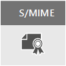

# E-Mail-Verschlüsselung

In diesem Artikel werden die Verschlüsselungsoptionen in Microsoft 365, einschließlich Office-Nachrichtenverschlüsselung (Office Message Encryption, OME), S/MIME und Information Rights Management (IRM) verglichen und Transport Layer Security (TLS) eingeführt.
  
Microsoft 365 delivers multiple encryption options to help you meet your business needs for email security. This article presents three ways to encrypt email in Office 365. If you want to learn more about all security features in Office 365, visit the [Office 365 Trust Center](https://go.microsoft.com/fwlink/p/?LinkID=282470). This article introduces the three types of encryption available for Microsoft 365 administrators to help secure email in Office 365:
  
- Office-Nachrichtenverschlüsselung (Office Message Encryption, OME)

- Secure/Multipurpose Internet Mail Extensions (S/MIME)

- Information Rights Management (IRM).

## E-Mail-Verschlüsselung und deren Verwendung durch Microsoft 365

Encryption is the process by which information is encoded so that only an authorized recipient can decode and consume the information. Microsoft 365 uses encryption in two ways: in the service, and as a customer control. In the service, encryption is used in Microsoft 365 by default; you don't have to configure anything. For example, Microsoft 365 uses Transport Layer Security (TLS) to encrypt the connection, or session, between two servers. 
  
So funktioniert die E-Mail-Verschlüsselung in der Regel:
  
- Eine Nachricht wird entweder lokal auf dem Computer des Absenders oder durch einen zentralen Server während der Nachrichtenübertragung verschlüsselt, d. h. aus Nur-Text in nicht lesbaren Chiffretext umgewandelt.

- Die Nachricht verbleibt während der gesamten Übertragung im Chiffretextformat, um zu verhindern, dass sie gelesen werden kann, falls sie abgefangen werden sollte.

- Nachdem die Nachricht vom Empfänger empfangen wurde, wird sie mit einer der folgenden zwei Methoden wieder in lesbaren Nur-Text umgewandelt:

  - Der Computer des Empfängers entschlüsselt die Nachricht mithilfe eines Schlüssels.

  - Ein zentraler Server entschlüsselt die Nachricht im Auftrag des Empfängers, nachdem er die Identität des Empfängers überprüft hat.

Weitere Informationen zur Sicherung der Kommunikation zwischen Servern in Microsoft 365, z. B. zwischen Organisationen innerhalb von Microsoft 365 oder zwischen Microsoft 365 und einem vertrauenswürdigen Geschäftspartner außerhalb von Microsoft 365, finden Sie unter [Verwenden von TLS durch Exchange Online zum Absichern von E-Mail-Verbindungen in Microsoft 365](exchange-online-uses-tls-to-secure-email-connections.md).
  
In diesem Video sehen Sie eine Einführung in die [Verschlüsselung in Office 365](https://www.youtube.com/watch?v=KmfxCd5ublI).
  
## Vergleichen der in Office 365 verfügbaren E-Mail-Verschlüsselungsoptionen

|||||
|:-----|:-----|:-----|:-----|
|Was ist das?|Office 365-Nachrichtenverschlüsselung (Office Message Encryption, OME) ist ein Dienst, der auf Azure Rights Management (Azure RMS) aufbaut und mit dem Sie verschlüsselte E-Mails an Personen innerhalb oder außerhalb Ihrer Organisation senden können, unabhängig von der E-Mail-Zieladresse (Gmail, Yahoo! Mail, Outlook.com usw.).   Als Administrator können Sie Transportregeln einrichten, die die Bedingungen für die Verschlüsselung definieren. Wenn ein Benutzer eine Nachricht sendet, die mit einer Regel übereinstimmt, wird die Verschlüsselung automatisch angewendet.   To view encrypted messages, recipients can either get a one-time passcode, sign in with a Microsoft account, or sign in with a work or school account associated with Office 365. Recipients can also send encrypted replies. They don't need a Microsoft 365 subscription to view encrypted messages or send encrypted replies.|IRM ist eine Verschlüsselungslösung, die auch Nutzungseinschränkungen auf E-Mail-Nachrichten anwendet. Mit dieser Lösung können Sie verhindern, dass vertrauliche Informationen von nicht autorisierten Personen gedruckt, weitergeleitet oder kopiert werden.   IRM-Funktionen in Microsoft 365 verwenden Azure Rights Management (Azure RMS).|S/MIME is a certificate-based encryption solution that allows you to both encrypt and digitally sign a message. The message encryption helps ensure that only the intended recipient can open and read the message. A digital signature helps the recipient validate the identity of the sender.   Sowohl digitale Signaturen als auch Nachrichtenverschlüsselung werden durch die Verwendung eindeutiger digitale Zertifikate ermöglicht, die die Schlüssel für die Überprüfung digitaler Signaturen und die Verschlüsselung bzw. Entschlüsselung von Nachrichten enthalten.   To use S/MIME, you must have public keys on file for each recipient. Recipients have to maintain their own private keys, which must remain secure. If a recipient's private keys are compromised, the recipient needs to get a new private key and redistribute public keys to all potential senders.|
|Vorhandene Funktionen|OME:   Verschlüsselt Nachrichten, die an interne oder externe Empfänger gesendet werden.    Ermöglicht Benutzern das Senden verschlüsselter Nachrichten an beliebige E-Mail-Adressen, einschließlich Outlook.com, Yahoo! Mail und Gmail.    Ermöglicht es Ihnen als Administrator, das E-Mail-Anzeigeportal entsprechend der Marke Ihrer Organisation anzupassen.   Die Schlüssel werden von Microsoft sicher verwaltet und gespeichert, Sie müssen sich nicht darum kümmern.   Es ist keine spezielle clientseitige Software erforderlich, sofern die verschlüsselte Nachricht (als HTML-Anlage gesendet) in einem Browser geöffnet werden kann.|IRM:   Verwendet Verschlüsselung und Verwendungseinschränkungen, um Online- und Offlineschutz für E-Mails und Anlagen bereitzustellen.   Gibt Ihnen als Administrator die Möglichkeit, Transportregeln oder Outlook-Schutzregeln einzurichten, um IRM automatisch auf ausgewählte Nachrichten anzuwenden.   Ermöglicht Benutzern das manuelle Anwenden von Vorlagen in Outlook im Web (früher Outlook Web App).|In S/MIME erfolgt die Absenderauthentifizierung durch digitale Signaturen, und die Vertraulichkeit von Nachrichten wird durch Verschlüsselung sichergestellt.|
|Nicht vorhandene Funktionen|OME doesn't let you apply usage restrictions to messages. For example, you can't use it to stop a recipient from forwarding or printing an encrypted message.|Some applications may not support IRM emails on all devices. For more information about these and other products that support IRM email, see [Client device capabilities](https://technet.microsoft.com/library/dn655136.aspx#BKMK_ClientCapabilities).|Mit S/MIME können verschlüsselte Nachrichten nicht auf Schadsoftware, Spam oder Richtlinien überprüft werden.|
|Empfehlungen und Beispielszenarien|We recommend using OME when you want to send sensitive business information to people outside your organization, whether they're consumers or other businesses. For example:     Ein Bankangestellter sendet Kreditkartenabrechnungen an Kunden     Eine Arztpraxis sendet eine Krankenakte an einen Patienten.     Ein Anwalt sendet vertrauliche Rechtsinformationen an einen anderen Anwalt.|Die Verwendung von IRM wird empfohlen, wenn Sie Nutzungseinschränkungen und Verschlüsselung anwenden möchten. Beispiel:     Ein Vorgesetzter, der vertrauliche Details über ein neues Produkt an sein Team sendet, wendet die Option "Nicht weiterleiten" an.     Eine Führungskraft muss ein Angebot für ein anderes Unternehmen freigeben, das eine Anlage von einem Partner enthält, der Office 365 verwendet, und sowohl die E-Mail als auch die Anlage müssen geschützt werden.|Die Verwendung von S/MIME wird empfohlen, wenn Ihre Organisation oder die Organisation des Empfängers in eine echte Peer-zu-Peer-Verschlüsselung benötigt.     S/MIME wird am häufigsten in den folgenden Szenarien verwendet:     Kommunikation zwischen Behörden     Kommunikation zwischen einem Unternehmen und einer Behörde|
||

Wenn Sie zum Schutz Ihrer Daten sowohl [Azure Information Protection](https://docs.microsoft.com/microsoft-365/compliance/protect-information) als auch E-Mail-Verschlüsselung verwenden, beachten Sie Folgendes:
- Sie können bei OM- und IRM-Verschlüsselung Vertraulichkeitsbezeichnungen verwenden. Weitere Details finden Sie unter [Einschränken des Zugriffs auf Inhalte mithilfe von Vertraulichkeitsbezeichnungen zur Verschlüsselung](https://docs.microsoft.com/microsoft-365/compliance/encryption-sensitivity-labels?view=o365-worldwide#what-happens-to-existing-encryption-when-a-labels-applied).
- Sie können Vertraulichkeitsbezeichnungen auf E-Mails anwenden, die mit S/MIME signiert wurden.
- Sie können Vertraulichkeitsbezeichnungen nicht auf E-Mails anwenden, die mit S/MIME verschlüsselt wurden, weil durch End-to-End-Verschlüsselung geschützte Nachrichten von Richtlinien nicht verarbeitet werden.

## Verfügbare Verschlüsselungsoptionen für mein Microsoft 365-Abonnement

Informationen zu den E-Mail-Verschlüsselungsoptionen für Ihr Microsoft 365-Abonnement finden Sie unter [Exchange Online-Dienstbeschreibung](https://technet.microsoft.com/library/exchange-online-service-description.aspx). Hier finden Sie Informationen zu den folgenden Verschlüsselungsfeatures:

- Azure RMS, einschließlich IRM-Funktionen und der neuen OM-Funktionen

- S/MIME

- TLS

- Verschlüsselung von Daten im Ruhezustand (über BitLocker)

Sie können auch Verschlüsselungstools von Drittanbietern mit Microsoft 365 verwenden, z. B. PGP (Pretty Good Privacy). Microsoft 365 unterstützt kein PGP/MIME, und Sie können PGP-verschlüsselte E-Mails nur mit PGP/Inline senden und empfangen.

## Wissenswertes zur Verschlüsselung von Daten im Ruhezustand

"Daten im Ruhezustand" bezieht sich auf Daten, für die derzeit keine Übertragung aktiv ist. In Microsoft 365 werden E-Mail-Daten im Ruhezustand mit der BitLocker-Laufwerkverschlüsselung verschlüsselt. BitLocker verschlüsselt die Festplatten in Microsoft-Datencentern, um verbesserten Schutz vor nicht autorisiertem Zugriff bereitzustellen. Weitere Informationen finden Sie unter [BitLocker-Übersicht](https://go.microsoft.com/fwlink/p/?LinkId=394737).
  
## Weitere Informationen zu E-Mail-Verschlüsselungsoptionen

Weitere Informationen zu den E-Mail-Verschlüsselungsoptionen in diesem Artikel sowie zu TLS finden Sie in diesen Artikeln:
  
**OME**
  
[Office 365-Nachrichtenverschlüsselung (OME)](ome.md)
  
**IRM**
  
[Verwaltung von Informationsrechten in Exchange Online](https://technet.microsoft.com/library/jj983436%28v=exchg.150%29.aspx)
  
[Was ist Azure Rights Management?](https://technet.microsoft.com/library/jj585026)
  
**S/MIME**
  
[S/MIME für die Nachrichtensignierung und -verschlüsselung](https://technet.microsoft.com/library/dn626158)
  
[Grundlegendes zu S/MIME](https://technet.microsoft.com/library/aa995740%28v=exchg.65%29.aspx)
  
[Grundlegendes zur Verschlüsselung mit öffentlichen Schlüsseln](https://technet.microsoft.com/library/aa998077%28v=exchg.65%29.aspx)
  
**TLS**
  
[Konfigurieren des benutzerdefinierten E-Mail-Flusses mithilfe von Connectors](https://technet.microsoft.com/library/jj723138%28v=exchg.150%29.aspx)
