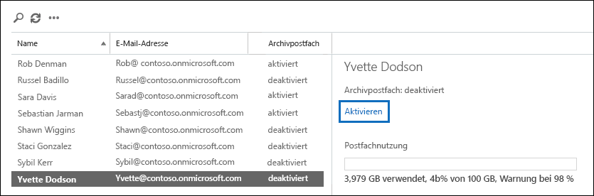

# <a name="enable-archive-mailboxes-in-the-compliance-center"></a><span data-ttu-id="f640f-103">Aktivieren von Archivpostfächern im Security & Compliance Center</span><span class="sxs-lookup"><span data-stu-id="f640f-103">Enable archive mailboxes in the compliance center</span></span>

<span data-ttu-id="f640f-104">Durch die Archivierung in Microsoft 365 (auch *In-Situ Archivierung* genannt) erhalten Benutzer zusätzlichen Speicherplatz im Postfach.</span><span class="sxs-lookup"><span data-stu-id="f640f-104">Archiving in Microsoft 365 (also called *In-Place Archiving*) provides users with additional mailbox storage space.</span></span> <span data-ttu-id="f640f-105">Nach Aktivierung der Archivpostfächer können Benutzer über Microsoft Outlook und Outlook im Web (früher als Outlook Web App bezeichnet) auf Nachrichten in ihren Archivpostfächern zugreifen und sie dort speichern.</span><span class="sxs-lookup"><span data-stu-id="f640f-105">After you turn on archive mailboxes, users can access and store messages in their archive mailboxes by using Microsoft Outlook and Outlook on the web (formerly known as Outlook Web App).</span></span> <span data-ttu-id="f640f-106">Benutzer können auch Nachrichten zwischen dem primären Postfach und dem Archivpostfach kopieren oder verschieben.</span><span class="sxs-lookup"><span data-stu-id="f640f-106">Users can also move or copy messages between their primary mailbox and their archive mailbox.</span></span> <span data-ttu-id="f640f-107">Mit der Wiederherstellung gelöschter Elemente können die Benutzer darüber hinaus gelöschte Elemente aus dem Ordner „Gelöschte Elemente“ in ihrem Archivpostfach wiederherstellen.</span><span class="sxs-lookup"><span data-stu-id="f640f-107">They can also recover deleted items from the Recoverable Items folder in their archive mailbox by using the Recover Deleted Items tool.</span></span>

> [!NOTE]
> <span data-ttu-id="f640f-108">Das Feature für die automatisch erweiterte Archivierung in Microsoft 365 sorgt für zusätzlichen Speicherplatz in Archivpostfächern.</span><span class="sxs-lookup"><span data-stu-id="f640f-108">The auto-expanding archiving feature in Microsoft 365 provides additional storage in archive mailboxes.</span></span> <span data-ttu-id="f640f-109">Wenn die automatisch erweiternde Archivierung aktiviert ist und das anfängliche Speicherkontingent im Archivpostfach eines Benutzers erreicht wird, fügt Microsoft 365 automatisch weiteren Speicherplatz hinzu.</span><span class="sxs-lookup"><span data-stu-id="f640f-109">When auto-expanding  archiving is turned on, and then the initial storage quota in a user's archive mailbox is reached, Microsoft 365 automatically adds additional storage space.</span></span> <span data-ttu-id="f640f-110">Dies bedeutet, dass den Benutzern niemals der Postfachspeicherplatz ausgeht und Sie im Grunde nichts weiter tun müssen, nachdem Sie das Archivpostfach eingerichtet und die automatische Erweiterung für Ihre Organisation aktiviert haben.</span><span class="sxs-lookup"><span data-stu-id="f640f-110">This means that users won't run out of mailbox storage space and you won't have to manage anything after you initially enable the archive mailbox and turn on auto-expanding archiving for your organization.</span></span> <span data-ttu-id="f640f-111">Weitere Informationen finden Sie unter [Übersicht zur unbeschränkten Archivierung](unlimited-archiving.md).</span><span class="sxs-lookup"><span data-stu-id="f640f-111">For more information, see [Overview of unlimited archiving](unlimited-archiving.md).</span></span>

## <a name="get-the-necessary-permissions"></a><span data-ttu-id="f640f-112">Holen Sie sich die erforderlichen Berechtigungen</span><span class="sxs-lookup"><span data-stu-id="f640f-112">Get the necessary permissions</span></span>

<span data-ttu-id="f640f-113">Ihnen muss die Rolle "E-Mail-Empfänger" in Exchange Online zugewiesen sein, damit Sie Archivpostfächer aktivieren oder deaktivieren können.</span><span class="sxs-lookup"><span data-stu-id="f640f-113">You have to be assigned the Mail Recipients role in Exchange Online to enable or disable archive mailboxes.</span></span> <span data-ttu-id="f640f-114">Standardmäßig ist diese Rolle den Rollengruppen "Empfängerverwaltung" und "Organisationsverwaltung" auf der Seite **Berechtigungen** im Exchange Admin Center zugewiesen.</span><span class="sxs-lookup"><span data-stu-id="f640f-114">By default, this role is assigned to the Recipient Management and Organization Management role groups on the **Permissions** page in the Exchange admin center.</span></span> <span data-ttu-id="f640f-115">Wenn die Seite **Archiv** im Security & Compliance Center nicht angezeigt wird, bitten Sie Ihren Administrator, Ihnen die notwendigen Berechtigungen zuzuweisen.</span><span class="sxs-lookup"><span data-stu-id="f640f-115">If you don't see the **Archive** page in the Security & Compliance Center, ask your administrator to assign you the necessary permissions.</span></span>

## <a name="enable-an-archive-mailbox"></a><span data-ttu-id="f640f-116">Aktivieren eines Archivpostfachs</span><span class="sxs-lookup"><span data-stu-id="f640f-116">Enable an archive mailbox</span></span>

1. <span data-ttu-id="f640f-117">Wechseln Sie zu <https://protection.office.com>.</span><span class="sxs-lookup"><span data-stu-id="f640f-117">Go to <https://protection.office.com>.</span></span>

2. <span data-ttu-id="f640f-118">Melden Sie sich mit Ihrem Geschäfts-, Schul- oder Unikonto an.</span><span class="sxs-lookup"><span data-stu-id="f640f-118">Sign in using your work or school account.</span></span>

3. <span data-ttu-id="f640f-119">Klicken Sie im Security & Compliance Center im linken Bereich auf **Information Governance** \> **Archiv**.</span><span class="sxs-lookup"><span data-stu-id="f640f-119">In the left pane of the Security & Compliance Center, click **Information governance** \> **Archive**.</span></span>

   <span data-ttu-id="f640f-p104">Die Seite **Archiv** wird angezeigt. Die Spalte **Archivpostfach** gibt für jeden Benutzer an, ob das Archivpostfach aktiviert oder deaktiviert ist.</span><span class="sxs-lookup"><span data-stu-id="f640f-p104">The **Archive** page is displayed. The **Archive mailbox** column indicates whether an archive mailbox is enabled or disabled for each user.</span></span>

   > [!NOTE]
   > <span data-ttu-id="f640f-122">Auf der Seite **Archiv** werden maximal 500 Benutzer angezeigt.</span><span class="sxs-lookup"><span data-stu-id="f640f-122">The **Archive** page shows a maximum of 500 users.</span></span>

4. <span data-ttu-id="f640f-123">Wählen Sie in der Liste der Postfächer den Benutzer aus, dessen Archivpostfach Sie aktivieren möchten.</span><span class="sxs-lookup"><span data-stu-id="f640f-123">In the list of mailboxes, select the user that you want to enable the archive mailbox for.</span></span>

   

5. <span data-ttu-id="f640f-125">Klicken Sie im Detailbereich des ausgewählten Benutzers auf **Aktivieren**.</span><span class="sxs-lookup"><span data-stu-id="f640f-125">In the details pane for the selected user, click **Enable**.</span></span>

   <span data-ttu-id="f640f-126">Es wird eine Warnung angezeigt, dass bei einer Aktivierung des Archivpostfachs Elemente im Postfach des Benutzers, die älter sind, als es in der dem Postfach zugewiesenen Archivierungsrichtlinie festgelegt ist, in das neue Archivpostfach verschoben werden.</span><span class="sxs-lookup"><span data-stu-id="f640f-126">A warning is displayed saying that if you enable the archive mailbox, items in the user's mailbox that are older than the archiving policy assigned to the mailbox will be moved to the new archive mailbox.</span></span> <span data-ttu-id="f640f-127">Durch die Standardarchivierungsrichtlinie, die Teil der den Exchange Online-Postfächern zugewiesenen Aufbewahrungsrichtlinie ist, werden Elemente zwei Jahre nach dem Datum, an dem sie an das Postfach übermittelt oder vom Benutzer erstellt wurden, in das Archivpostfach verschoben werden.</span><span class="sxs-lookup"><span data-stu-id="f640f-127">The default archive policy that is part of the retention policy assigned to Exchange Online mailboxes moves items to the archive mailbox two years after the date the item was delivered to the mailbox or created by the user.</span></span> <span data-ttu-id="f640f-128">Weitere Informationen finden Sie im Abschnitt **Weitere Informationen** dieses Artikels.</span><span class="sxs-lookup"><span data-stu-id="f640f-128">For more information, see the **More info** section in this article.</span></span>

6. <span data-ttu-id="f640f-129">Klicken Sie auf **Ja**, um das Archivpostfach zu aktivieren.</span><span class="sxs-lookup"><span data-stu-id="f640f-129">Click **Yes** to enable the archive mailbox.</span></span>

   <span data-ttu-id="f640f-130">Das Erstellen des Archivpostfachs kann eine kurze Zeit dauern.</span><span class="sxs-lookup"><span data-stu-id="f640f-130">It might take a few moments to create the archive mailbox.</span></span> <span data-ttu-id="f640f-131">Nachdem das Archivpostfach erstellt wurde, wird im Detailbereich für den ausgewählten Benutzer **Archivpostfach: Aktiviert** angezeigt.</span><span class="sxs-lookup"><span data-stu-id="f640f-131">When it's created, **Archive mailbox: enabled** is displayed in the details pane for the selected user.</span></span> <span data-ttu-id="f640f-132">Sie müssen möglicherweise auf **Aktualisieren**  klicken, um die Informationen im Detailbereich zu aktualisieren.</span><span class="sxs-lookup"><span data-stu-id="f640f-132">You might have to click **Refresh**  to update the information in the details pane.</span></span>

> [!TIP]
> <span data-ttu-id="f640f-p107">Sie können auch mehrere Archivpostfächer gleichzeitig aktivieren, indem Sie mehrere Benutzer mit deaktivierten Postfächern auswählen. (Verwenden Sie dazu die UMSCHALT- oder die STRG-Taste.) Klicken Sie nach der Auswahl mehrerer Postfächer im Detailbereich auf **Aktivieren**.</span><span class="sxs-lookup"><span data-stu-id="f640f-p107">You can also bulk-enable archive mailboxes by selecting multiple users with disabled archive mailboxes (use the Shift or Ctrl keys). After selecting multiple mailboxes, click **Enable** in the details pane.</span></span>

## <a name="disable-an-archive-mailbox"></a><span data-ttu-id="f640f-135">Deaktivieren eines Archivpostfachs</span><span class="sxs-lookup"><span data-stu-id="f640f-135">Disable an archive mailbox</span></span>

<span data-ttu-id="f640f-136">Sie können auch die Seite **Archiv** im Security & Compliance Center verwenden, um das Archivpostfach eines Benutzers zu deaktivieren.</span><span class="sxs-lookup"><span data-stu-id="f640f-136">You can also use the **Archive** page in the Security & Compliance Center to disable a user's archive mailbox.</span></span> <span data-ttu-id="f640f-137">Nachdem Sie ein Archivpostfach deaktiviert haben, können Sie es innerhalb von 30 Tagen nach der Deaktivierung wieder mit dem primären Postfach des Benutzers verbinden.</span><span class="sxs-lookup"><span data-stu-id="f640f-137">After you disable an archive mailbox, you can reconnect it to the user's primary mailbox within 30 days of disabling it.</span></span> <span data-ttu-id="f640f-138">In diesem Fall wird der ursprüngliche Inhalt des Archivpostfachs wiederhergestellt.</span><span class="sxs-lookup"><span data-stu-id="f640f-138">In this case, the original contents of the archive mailbox are restored.</span></span> <span data-ttu-id="f640f-139">Nach Ablauf von 30 Tagen wird der Inhalt des ursprünglichen Archivpostfachs endgültig gelöscht und kann nicht wiederhergestellt werden.</span><span class="sxs-lookup"><span data-stu-id="f640f-139">After 30 days, the contents of the original archive mailbox are permanently deleted and can't be recovered.</span></span> <span data-ttu-id="f640f-140">Wenn Sie das Archiv also erst nach über 30 Tagen erneut aktivieren, nachdem Sie es deaktiviert haben, wird ein neues Archivpostfach erstellt.</span><span class="sxs-lookup"><span data-stu-id="f640f-140">So if you re-enable the archive more than 30 days after disabling it, a new archive mailbox is created.</span></span>

<span data-ttu-id="f640f-141">Die Standardarchivierungsrichtlinie für Benutzerpostfächer gibt vor, dass Elemente zwei Jahre nach dem Datum ihrer Zustellung in das Archivpostfach verschoben werden.</span><span class="sxs-lookup"><span data-stu-id="f640f-141">The default archive policy assigned to users' mailboxes moves items to the archive mailbox two years after the date the item is delivered.</span></span> <span data-ttu-id="f640f-142">Wenn Sie das Archivpostfach eines Benutzers deaktivieren, wird keine Aktion mit den Postfachelementen durchgeführt, und diese verbleiben im primären Postfach des Benutzers.</span><span class="sxs-lookup"><span data-stu-id="f640f-142">If you disable a user's archive mailbox, no action will be taken on mailbox items and they will remain in the user's primary mailbox.</span></span>

<span data-ttu-id="f640f-143">So deaktivieren Sie ein Archivpostfach:</span><span class="sxs-lookup"><span data-stu-id="f640f-143">To disable an archive mailbox:</span></span>

1. <span data-ttu-id="f640f-144">Wechseln Sie zu <https://protection.office.com>.</span><span class="sxs-lookup"><span data-stu-id="f640f-144">Go to <https://protection.office.com>.</span></span>

2. <span data-ttu-id="f640f-145">Melden Sie sich mit Ihrem Geschäfts-, Schul- oder Unikonto an.</span><span class="sxs-lookup"><span data-stu-id="f640f-145">Sign in using your work or school account.</span></span>

3. <span data-ttu-id="f640f-146">Klicken Sie im Security & Compliance Center im linken Bereich auf **Information Governance** \> **Archiv**.</span><span class="sxs-lookup"><span data-stu-id="f640f-146">In the left pane of the Security & Compliance Center, click **Information governance** \> **Archive**.</span></span>

   <span data-ttu-id="f640f-p110">Die Seite **Archiv** wird angezeigt. Die Spalte **Archivpostfach** gibt für jeden Benutzer an, ob das Archivpostfach aktiviert oder deaktiviert ist.</span><span class="sxs-lookup"><span data-stu-id="f640f-p110">The **Archive** page is displayed. The **Archive mailbox** column indicates whether an archive mailbox is enabled or disabled for each user.</span></span>

   > [!NOTE]
   > <span data-ttu-id="f640f-149">Auf der Seite **Archiv** werden maximal 500 Benutzer angezeigt.</span><span class="sxs-lookup"><span data-stu-id="f640f-149">The **Archive** page shows a maximum of 500 users.</span></span>

4. <span data-ttu-id="f640f-150">Wählen Sie in der Liste der Postfächer den Benutzer aus, dessen Archivpostfach Sie deaktivieren möchten.</span><span class="sxs-lookup"><span data-stu-id="f640f-150">In the list of mailboxes, select the user that you want to disable the archive mailbox for.</span></span>

5. <span data-ttu-id="f640f-151">Klicken Sie im Detailbereich auf **Deaktivieren**.</span><span class="sxs-lookup"><span data-stu-id="f640f-151">In the details pane, click **Disable**.</span></span>

   <span data-ttu-id="f640f-152">Es wird eine Warnung angezeigt, die darauf hinweist, dass Sie 30 Tage Zeit haben, das Archivpostfach wieder zu aktivieren und dass nach 30 Tagen sämtliche Informationen im Archiv dauerhaft gelöscht werden.</span><span class="sxs-lookup"><span data-stu-id="f640f-152">A warning message is displayed saying that you'll have 30 days to re-enable the archive mailbox, and that after 30 days, all information in the archive will be permanently deleted.</span></span>

6. <span data-ttu-id="f640f-153">Klicken Sie auf **Ja**, um das Archivpostfach zu deaktivieren.</span><span class="sxs-lookup"><span data-stu-id="f640f-153">Click **Yes** to disable the archive mailbox.</span></span>

   <span data-ttu-id="f640f-154">Das Deaktivieren des Archivpostfachs kann eine kurze Zeit dauern.</span><span class="sxs-lookup"><span data-stu-id="f640f-154">It might take a few moments to disable the archive mailbox.</span></span> <span data-ttu-id="f640f-155">Nachdem das Archivpostfach deaktiviert wurde, wird im Detailbereich für den ausgewählten Benutzer **Archivpostfach: Deaktiviert** angezeigt.</span><span class="sxs-lookup"><span data-stu-id="f640f-155">When it's disabled, **Archive mailbox: disabled** is displayed in the details pane for the selected user.</span></span> <span data-ttu-id="f640f-156">Sie müssen möglicherweise auf **Aktualisieren**  klicken, um die Informationen im Detailbereich zu aktualisieren.</span><span class="sxs-lookup"><span data-stu-id="f640f-156">You might have to click **Refresh**  to update the information in the details pane.</span></span>

> [!TIP]
> <span data-ttu-id="f640f-p112">Sie können auch mehrere Archivpostfächer gleichzeitig deaktivieren, indem Sie mehrere Benutzer mit aktivierten Postfächern auswählen. (Verwenden Sie dazu die UMSCHALT- oder die STRG-Taste.) Klicken Sie nach der Auswahl mehrerer Postfächer im Detailbereich auf **Deaktivieren**.</span><span class="sxs-lookup"><span data-stu-id="f640f-p112">You can also bulk-disable archive mailboxes by selecting multiple users with enabled archive mailboxes (use the Shift or Ctrl keys). After selecting multiple mailboxes, click **Disable** in the details pane.</span></span>

## <a name="use-exchange-online-powershell-to-enable-or-disable-archive-mailboxes"></a><span data-ttu-id="f640f-159">Verwenden von Exchange Online PowerShell zum Aktivieren oder Deaktivieren von Archivpostfächern</span><span class="sxs-lookup"><span data-stu-id="f640f-159">Use Exchange Online PowerShell to enable or disable archive mailboxes</span></span>

<span data-ttu-id="f640f-160">Alternativ können Sie Archivpostfächer auch mithilfe von Exchange Online PowerShell aktivieren.</span><span class="sxs-lookup"><span data-stu-id="f640f-160">You can also use Exchange Online PowerShell to enable archive mailboxes.</span></span> <span data-ttu-id="f640f-161">Der Hauptgrund für die Verwendung von PowerShell besteht darin, dass Sie schnell das Archivpostfach für alle Benutzer in Ihrer Organisation aktivieren können.</span><span class="sxs-lookup"><span data-stu-id="f640f-161">The primary reason to use PowerShell is that you can quickly enable the archive mailbox for all users in your organization.</span></span>

<span data-ttu-id="f640f-162">Im ersten Schritt müssen Sie eine Verbindung mit Exchange Online PowerShell herstellen.</span><span class="sxs-lookup"><span data-stu-id="f640f-162">The first step is to connect to Exchange Online PowerShell.</span></span> <span data-ttu-id="f640f-163">Anleitungen finden Sie unter [Herstellen einer Verbindung mit Exchange Online PowerShell](/powershell/exchange/connect-to-exchange-online-powershell).</span><span class="sxs-lookup"><span data-stu-id="f640f-163">For instructions, see [Connect to Exchange Online PowerShell](/powershell/exchange/connect-to-exchange-online-powershell).</span></span>

<span data-ttu-id="f640f-164">Nachdem Sie eine Verbindung mit Exchange Online hergestellt haben, können Sie die Befehle in den folgenden Abschnitten ausführen, um Archivpostfächer zu aktivieren bzw. zu deaktivieren.</span><span class="sxs-lookup"><span data-stu-id="f640f-164">After you're connected to Exchange Online, you can run the commands in the following sections to enable or disable archive mailboxes.</span></span>

### <a name="enable-archive-mailboxes"></a><span data-ttu-id="f640f-165">Aktivieren von Archivpostfächern</span><span class="sxs-lookup"><span data-stu-id="f640f-165">Enable archive mailboxes</span></span>

<span data-ttu-id="f640f-166">Führen Sie den folgenden Befehl aus, um das Archivpostfach für einen einzelnen Benutzer zu aktivieren.</span><span class="sxs-lookup"><span data-stu-id="f640f-166">Run the following command to enable the archive mailbox for a single user.</span></span>

```powershell
Enable-Mailbox -Identity <username> -Archive
```

<span data-ttu-id="f640f-167">Führen Sie den folgenden Befehl aus, um das Archivpostfach für alle Benutzer in Ihrer Organisation zu aktivieren, deren Archivpostfach aktuell nicht aktiviert ist.</span><span class="sxs-lookup"><span data-stu-id="f640f-167">Run the following command to enable the archive mailbox for all users in your organization (whose archive mailbox is currently not enabled).</span></span>

```powershell
Get-Mailbox -Filter {ArchiveGuid -Eq "00000000-0000-0000-0000-000000000000" -AND RecipientTypeDetails -Eq "UserMailbox"} | Enable-Mailbox -Archive
```

### <a name="disable-archive-mailboxes"></a><span data-ttu-id="f640f-168">Deaktivieren von Archivpostfächern</span><span class="sxs-lookup"><span data-stu-id="f640f-168">Disable archive mailboxes</span></span>

<span data-ttu-id="f640f-169">Führen Sie den folgenden Befehl aus, um das Archivpostfach für einen einzelnen Benutzer zu deaktivieren.</span><span class="sxs-lookup"><span data-stu-id="f640f-169">Run the following command to disable the archive mailbox for a single user.</span></span>

```powershell
Disable-Mailbox -Identity <username> -Archive
```

<span data-ttu-id="f640f-170">Führen Sie den folgenden Befehl aus, um die Archivpostfächer aller Benutzer in Ihrer Organisation zu deaktivieren (deren Archivpostfach aktuell aktiviert ist).</span><span class="sxs-lookup"><span data-stu-id="f640f-170">Run the following command to disable the archive mailbox for all users in your organization (whose archive mailbox is currently enabled).</span></span>

```powershell
Get-Mailbox -Filter {ArchiveGuid -Ne "00000000-0000-0000-0000-000000000000" -AND RecipientTypeDetails -Eq "UserMailbox"} | Disable-Mailbox -Archive
```

## <a name="more-information"></a><span data-ttu-id="f640f-171">Weitere Informationen</span><span class="sxs-lookup"><span data-stu-id="f640f-171">More information</span></span>

- <span data-ttu-id="f640f-172">Mit aktiviertem Archivpostfach können Benutzer Nachrichten in ihrem Archivpostfach speichern.</span><span class="sxs-lookup"><span data-stu-id="f640f-172">When an archive mailbox is enabled, users can store messages in their archive mailbox.</span></span> <span data-ttu-id="f640f-173">Die Benutzer können mit Microsoft Outlook und Outlook im Web auf ihre Archivpostfächer zugreifen.</span><span class="sxs-lookup"><span data-stu-id="f640f-173">Users can access their archive mailboxes by using Microsoft Outlook and Outlook on the web.</span></span> <span data-ttu-id="f640f-174">Durch Verwendung einer dieser Clientanwendungen können die Benutzer Nachrichten in ihrem Archivpostfach anzeigen und zwischen ihrem primären Postfach und dem Archivpostfach kopieren oder verschieben.</span><span class="sxs-lookup"><span data-stu-id="f640f-174">Using either of these client applications, users can view messages in their archive mailbox and move or copy messages between their primary mailbox and their archive mailbox.</span></span> <span data-ttu-id="f640f-175">Mit der Wiederherstellung gelöschter Elemente können die Benutzer darüber hinaus gelöschte Elemente aus dem Ordner „Gelöschte Elemente“ in ihrem Archivpostfach wiederherstellen.</span><span class="sxs-lookup"><span data-stu-id="f640f-175">Users can also recover deleted items from the Recoverable Items folder in their archive mailbox by using the Recover Deleted Items tool.</span></span>

  <span data-ttu-id="f640f-176">Eine Liste der Outlook-Lizenzen, die In-Situ-Archivierung unterstützen, finden Sie unter [Outlook-Lizenzanforderungen für Exchange-Features](https://support.microsoft.com/office/46b6b7c5-c3ca-43e5-8424-1e2807917c99).</span><span class="sxs-lookup"><span data-stu-id="f640f-176">For a list of Outlook licenses that support In-Place Archiving, see [Outlook license requirements for Exchange features](https://support.microsoft.com/office/46b6b7c5-c3ca-43e5-8424-1e2807917c99).</span></span>

- <span data-ttu-id="f640f-177">Archivpostfächer unterstützen Sie und Ihre Benutzer auch bei der Erfüllung der Anforderungen Ihrer Organisation hinsichtlich Aufbewahrung, eDiscovery und Archivierung.</span><span class="sxs-lookup"><span data-stu-id="f640f-177">Archive mailboxes help you and your users to meet your organization's retention, eDiscovery, and hold requirements.</span></span> <span data-ttu-id="f640f-178">Sie können beispielsweise die Exchange-Aufbewahrungsrichtlinie Ihrer Organisation dazu verwenden, Postfachinhalte in das Archivpostfach eines Benutzers zu verschieben.</span><span class="sxs-lookup"><span data-stu-id="f640f-178">For example, you can use your organization's Exchange retention policy to move mailbox content to users' archive mailbox.</span></span> <span data-ttu-id="f640f-179">Wenn Sie das Tool für die Inhaltssuche im Security & Compliance Center verwenden, um das Postfach eines Benutzers nach bestimmten Inhalten zu durchsuchen, wird auch das Archivpostfach des Benutzers durchsucht.</span><span class="sxs-lookup"><span data-stu-id="f640f-179">When you use the Content Search tool in the Security & Compliance Center to search a user's mailbox for specific content, the user's archive mailbox will also be searched.</span></span> <span data-ttu-id="f640f-180">Wenn Sie die Aufbewahrung für eventuelle Rechtsstreitigkeiten aktivieren oder eine Aufbewahrungsrichtlinie auf das Postfach eines Benutzers anwenden, werden die Elemente im Archivpostfach ebenfalls aufbewahrt.</span><span class="sxs-lookup"><span data-stu-id="f640f-180">And, when you place a Litigation Hold or apply a retention policy to a user's mailbox, items in the archive mailbox are also retained.</span></span>

- <span data-ttu-id="f640f-181">Sind die Archivpostfächer aktiviert, kann Ihre Organisation die standardmäßige Exchange-Aufbewahrungsrichtlinie (auch als Richtlinie zur Verwaltung von Nachrichtendatensätzen bezeichnet) nutzen, die jedem Postfach automatisch zugewiesen wird.</span><span class="sxs-lookup"><span data-stu-id="f640f-181">After archive mailboxes are enabled, your organization can take advantage of the default Exchange retention policy (also called Messaging Records Management or MRM policy) that is automatically assigned to every mailbox.</span></span> <span data-ttu-id="f640f-182">Wenn ein Archivpostfach aktiviert ist, führt die standardmäßige Exchange-Aufbewahrungsrichtlinie automatisch Folgendes aus:</span><span class="sxs-lookup"><span data-stu-id="f640f-182">When an archive mailbox is enabled, the default Exchange retention policy automatically does the following:</span></span>

  - <span data-ttu-id="f640f-183">Verschieben von Elementen, die 2 Jahre alt oder älter sind, aus dem primären Postfach eines Benutzers in dessen Archivpostfach</span><span class="sxs-lookup"><span data-stu-id="f640f-183">Moves items that are two years or older from a user's primary mailbox to their archive mailbox.</span></span>

  - <span data-ttu-id="f640f-184">Verschieben von Elementen, die 14 Tage alt oder älter sind, aus dem Ordner „Wiederherstellbare Elemente“ im primären Postfach des Benutzers zum Ordner „Wiederherstellbare Elemente“ im Archivpostfach .</span><span class="sxs-lookup"><span data-stu-id="f640f-184">Moves items that are 14 days or older from the Recoverable Items folder in the user's primary mailbox to the Recoverable Items folder in their archive mailbox.</span></span>

- <span data-ttu-id="f640f-185">Weitere Informationen zu Archivpostfächern und Exchange-Aufbewahrungsrichtlinien finden Sie hier:</span><span class="sxs-lookup"><span data-stu-id="f640f-185">For more information about archive mailboxes and Exchange retention policies, see:</span></span>

  - [<span data-ttu-id="f640f-186">Aufbewahrungstags und Aufbewahrungsrichtlinien in Exchange Online</span><span class="sxs-lookup"><span data-stu-id="f640f-186">Retention tags and retention policies in Exchange Online</span></span>](/exchange/security-and-compliance/messaging-records-management/retention-tags-and-policies)

  - [<span data-ttu-id="f640f-187">Standardaufbewahrungsrichtlinie in Exchange Online </span><span class="sxs-lookup"><span data-stu-id="f640f-187">Default Retention Policy in Exchange Online</span></span>](/exchange/security-and-compliance/messaging-records-management/default-retention-policy)

  - [<span data-ttu-id="f640f-188">Einrichten einer Archivierungs- und Löschrichtlinie für Postfächer in Ihrer Organisation</span><span class="sxs-lookup"><span data-stu-id="f640f-188">Set up an archive and deletion policy for mailboxes in your organization</span></span>](set-up-an-archive-and-deletion-policy-for-mailboxes.md)