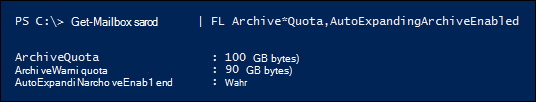

# <a name="enable-unlimited-archiving---admin-help"></a>Unbegrenzte Archivierung aktivieren – Administratorhilfe

Sie können die archivierungsfunktion Exchange Online automatisch erweitern, um unbegrenzten Speicherplatz für Archivpostfächer zu ermöglichen. Wenn die Archivierung automatisch erweitert wird, wird dem Archivpostfach eines Benutzers automatisch zusätzlicher Speicherplatz hinzugefügt, wenn der Speichergrenzwert erreicht wird. Das Ergebnis ist unbegrenzte Postfachspeicherkapazität. Sie können die Archivierung automatisch erweitern für alle Benutzer in Ihrer Organisation oder nur für bestimmte Benutzer aktivieren. Weitere Informationen zum automatischen Erweitern der Archivierung finden Sie [unter Overview of unlimited archiving in Office 365](unlimited-archiving.md).

## <a name="before-you-enable-auto-expanding-archiving"></a>Vor der Aktivierung der automatischen Erweiterung der Archivierung

- Sie müssen ein globaler Administrator in Ihrer Organisation oder Mitglied der Rollengruppe Organisationsverwaltung in Ihrer Exchange Online-Organisation sein, um die automatische Erweiterung der Archivierung für Ihre gesamte Organisation oder für bestimmte Benutzer zu ermöglichen. Alternativ müssen Sie Mitglied einer Rollengruppe sein, der die Rolle E-Mail-Empfänger zugewiesen ist, um die automatische Erweiterung der Archivierung für bestimmte Benutzer zu ermöglichen.

- Das Archivpostfach eines Benutzers muss aktiviert sein, bevor Sie die automatisch erweiternde Archivierung aktivieren können. Einem Benutzer muss eine Exchange Online Plan 2-Lizenz zugewiesen werden, um das Archivpostfach zu aktivieren. Wenn einem Benutzer eine Exchange Online Plan 1-Lizenz zugewiesen ist, müssen Sie ihm eine separate Exchange Online-Archivierung zuweisen, um sein Archivpostfach zu aktivieren. Weitere Informationen finden Sie unter Aktivieren [von Archivpostfächern im Security & Compliance Center](enable-archive-mailboxes.md).

- Sie können PowerShell auch verwenden, um Archivpostfächer zu aktivieren. Im Abschnitt [Weitere Informationen](#more-information) finden Sie ein Beispiel für den PowerShell-Befehl, mit dem Sie Archivpostfächer für alle Benutzer in Ihrer Organisation aktivieren können.

- Die Archivierung mit automatischer Erweiterung unterstützt auch freigegebene Postfächer. Zum Aktivieren des Archivs für ein freigegebenes Postfach ist eine Exchange Online Plan 2-Lizenz oder eine Exchange Online Plan 1-Lizenz mit Exchange Online-Archivierung erforderlich.

- Die automatische Erweiterung der Archivierung verhindert, dass Sie ein inaktives Postfach wiederherstellen oder [wiederherstellen.](inactive-mailboxes-in-office-365.md#what-are-inactive-mailboxes) Wenn Sie also die automatisch erweiternde Archivierung für ein Postfach aktivieren und das Postfach zu einem späteren Zeitpunkt inaktiv gemacht wird, können Sie das inaktive Postfach [nicht](recover-an-inactive-mailbox.md) wiederherstellen (indem Sie es in ein aktives Postfach konvertieren) oder es [wiederherstellen](restore-an-inactive-mailbox.md) (indem Sie den Inhalt in ein vorhandenes Postfach zusammenführen). Wenn die automatische Erweiterung der Archivierung für ein inaktives Postfach aktiviert ist, können Daten nur mithilfe des Inhaltssuchtools im Microsoft 365 Compliance Center wiederhergestellt werden, um die Daten aus dem Postfach zu exportieren und in ein anderes Postfach zu importieren. Weitere Informationen finden Sie im Abschnitt "Inaktive Postfächer und automatisch erweiternde Archive" unter [Übersicht über inaktive Postfächer](inactive-mailboxes-in-office-365.md#inactive-mailboxes-and-auto-expanding-archives).

- Sie können das Exchange Admin Center oder das Security & Compliance Center nicht verwenden, um die Archivierung automatisch zu erweitern. Sie müssen powerShell Exchange Online verwenden. Informationen zum Herstellen einer Verbindung Exchange Online Ihrer Organisation mithilfe von Remote PowerShell finden Sie [unter Verbinden to Exchange Online PowerShell](/powershell/exchange/connect-to-exchange-online-powershell).

## <a name="enable-auto-expanding-archiving-for-your-entire-organization"></a>Aktivieren der automatischen Erweiterung der Archivierung für Ihre gesamte Organisation

Sie können die automatische Erweiterung der Archivierung für Ihre gesamte Organisation aktivieren. Nach dem Aktivieren wird die automatische Erweiterung der Archivierung für vorhandene Benutzerpostfächer und für neue Benutzerpostfächer aktiviert, die erstellt werden. Achten Sie beim Erstellen von Benutzerpostfächern darauf, das Hauptarchivpostfach des Benutzers zu aktivieren, damit das Automatisch erweiternde Archivierungsfeature für das neue Benutzerpostfach funktioniert.
  
1. [Herstellen einer Verbindung mit Exchange Online PowerShell](/powershell/exchange/connect-to-exchange-online-powershell)

2. Führen Sie den folgenden Befehl in Exchange Online PowerShell aus, um die automatisch erweiternde Archivierung für Ihre gesamte Organisation zu aktivieren.

    ```powershell
    Set-OrganizationConfig -AutoExpandingArchive
    ```

## <a name="enable-auto-expanding-archiving-for-specific-users"></a>Aktivieren der automatischen Erweiterung der Archivierung für bestimmte Benutzer

Anstatt die automatische Erweiterung der Archivierung für jeden Benutzer in Ihrer Organisation zu aktivieren, können Sie sie nur für bestimmte Benutzer aktivieren. Dies ist möglicherweise der Grund, dass nur einige Benutzer eine große Archivspeicherkapazität benötigen.
  
Wenn Sie die automatische Erweiterung der Archivierung für einen bestimmten Benutzer und das Postfach des Benutzers aktivieren, das im Archiv ist oder einer Aufbewahrungsrichtlinie zugewiesen ist, werden die folgenden beiden Konfigurationen geändert:
  
- Das Speicherkontingent für das primäre Archivpostfach des Benutzers wird um 10 GB erhöht (von 100 GB auf 110 GB). Das Archivwarnkontingent wird ebenfalls um 10 GB erhöht (von 90 GB auf 100 GB).

- Das Speicherkontingent für den Ordner "Wiederherstellbare Elemente" im primären Postfach des Benutzers wird um 10 GB erhöht (auch von 100 GB auf 110 GB). Das Warnungskontingent für wiederherstellbare Elemente wird ebenfalls um 10 GB erhöht (von 90 GB auf 100 GB). Diese Änderungen gelten nur, wenn das Postfach im Halteraum ist oder einer Aufbewahrungsrichtlinie zugewiesen ist.

Dieser zusätzliche Speicherplatz wird hinzugefügt, um Speicherprobleme zu verhindern, die auftreten können, bevor das automatisch erweiternde Archiv bereitgestellt wird. Zusätzlichen Speicherplatz  *wird nicht hinzugefügt,*  wenn Sie die automatisch erweiternde Archivierung für Ihre gesamte Organisation aktivieren, wie im vorherigen Abschnitt beschrieben.
  
1. [Herstellen einer Verbindung mit Exchange Online PowerShell](/powershell/exchange/connect-to-exchange-online-powershell)

2. Führen Sie den folgenden Befehl in Exchange Online PowerShell aus, um die automatisch erweiternde Archivierung für einen bestimmten Benutzer zu aktivieren. Wie bereits erläutert, muss das Archivpostfach (Hauptarchiv) des Benutzers aktiviert sein, bevor Sie die automatisch erweiterte Archivierung für den Benutzer aktivieren können.

    ```powershell
    Enable-Mailbox <user mailbox> -AutoExpandingArchive
    ```

> [!IMPORTANT]
> In einer Exchange-Hybridbereitstellung können Sie den Befehl **Enable-Mailbox -AutoExpandingArchive** nicht verwenden, um die automatische Erweiterung der Archivierung für einen bestimmten Benutzer zu aktivieren, dessen primäres Postfach lokal ist und dessen Archivpostfach cloudbasierter Ist. Zum Aktivieren der automatischen Erweiterung der Archivierung für cloudbasierte Archivpostfächer in einer Exchange-Hybridbereitstellung müssen Sie den Befehl **Set-OrganizationConfig -AutoExpandingArchive** in Exchange Online PowerShell ausführen, um die automatische Erweiterung der Archivierung für die gesamte Organisation zu ermöglichen. Wenn die primären und Archivpostfächer eines Benutzers cloudbasierte Postfächer sind, können Sie den **Befehl Enable-Mailbox -AutoExpandingArchive** verwenden, um die automatische Erweiterung der Archivierung für diesen bestimmten Benutzer zu aktivieren.
  
## <a name="verify-that-auto-expanding-archiving-is-enabled"></a>Überprüfen, ob die Archivierung automatisch erweitert ist

Führen Sie den folgenden Befehl in powerShell aus, um zu überprüfen, ob die archivierung automatischer Erweiterung für Ihre Organisation aktiviert ist, Exchange Online PowerShell.

```powershell
Get-OrganizationConfig | FL AutoExpandingArchiveEnabled
```

Ein Wert von gibt an, dass die  `True` Archivierung automatischer Erweiterung für die Organisation aktiviert ist. 
  
Führen Sie den folgenden Befehl in powerShell aus, um zu überprüfen, ob die archivierung automatischer Erweiterung für einen bestimmten Benutzer aktiviert ist, Exchange Online PowerShell.
  
```powershell
Get-Mailbox <user mailbox> | FL AutoExpandingArchiveEnabled
```

Ein Wert von gibt an, dass die  `True` Archivierung automatischer Erweiterung für den Benutzer aktiviert ist.
  
Führen Sie den folgenden Befehl in powerShell aus, um zu ermitteln, ob die Archivierung automatischer Erweiterung für inaktive Postfächer aktiviert ist, Exchange Online PowerShell.
  
```powershell
Get-Mailbox -InactiveMailboxOnly | FL UserPrincipalName,AutoExpandingArchiveEnabled
```

Ein Wert von  `True` gibt an, dass die Archivierung automatisch erweitert für das inaktive Postfach aktiviert ist. Ein Wert von `False` gibt an, dass die automatisch erweiternde Archivierung nicht aktiviert ist.

Beachten Sie die folgenden Punkte, nachdem Sie die automatische Erweiterung der Archivierung aktiviert haben:
  
- Wenn Sie den Befehl **Set-OrganizationConfig -AutoExpandingArchive** ausführen, um die automatische Erweiterung der Archivierung für Ihre Organisation zu aktivieren, müssen Sie das **Enable-Mailbox -AutoExpandingArchive** nicht für einzelne Postfächer ausführen. Durch das Ausführen des **Cmdlets Set-OrganizationConfig** zum Aktivieren der automatisch erweiternden Archivierung für Ihre Organisation wird die  *AutoExpandingArchiveEnabled-Eigenschaft*  für Benutzerpostfächer nicht in `True` geändert.

- Ebenso werden die Werte für die  *Postfacheigenschaften ArchiveQuota*  und  *ArchiveWarningQuota*  nicht geändert, wenn Sie die archivierung automatisch erweiternde Archivierung aktivieren. Wenn Sie die automatisch erweiternde Archivierung für ein Benutzerpostfach aktivieren und die  *AutoExpandingArchiveEnabled-Eigenschaft*  auf festgelegt ist, werden die  `True`  *Eigenschaften ArchiveQuota*  und  *ArchiveWarningQuota*  ignoriert. Im Folgenden finden Sie ein Beispiel für diese Postfacheigenschaften, nachdem die automatische Erweiterung der Archivierung für das Postfach eines Benutzers aktiviert wurde. 

    

## <a name="more-information&quot;></a>Weitere Informationen

- Sie können PowerShell auch verwenden, um Archivpostfächer zu aktivieren. Sie können beispielsweise den folgenden Befehl in Exchange Online PowerShell ausführen, um Archivpostfächer für alle Benutzer zu aktivieren, deren Archivpostfach noch nicht aktiviert ist.

    ```powershell
    Get-Mailbox -Filter {ArchiveStatus -Eq &quot;None&quot; -AND RecipientTypeDetails -eq &quot;UserMailbox&quot;} | Enable-Mailbox -Archive
    ```

- Nach dem Aktivieren der automatischen Erweiterung der Archivierung für Ihre Organisation oder einen bestimmten Benutzer wird ein Archivpostfach in ein automatisch erweiternde Archiv konvertiert, wenn das Archivpostfach (einschließlich des Ordners &quot;Wiederherstellbare Elemente") 90 GB erreicht. Es kann bis zu 30 Tage dauern, bis der zusätzliche Speicherplatz bereitgestellt wird.

- Nachdem Sie die Archivierung automatisch erweitern aktiviert haben, kann sie nicht mehr deaktiviert werden. Darüber hinaus können Administratoren das Speicherkontingent für die automatische Erweiterung der Archivierung nicht anpassen.

- Die automatisch erweiternde Archivierung wird für cloudbasierte Archivpostfächer in einer Exchange hybriden Bereitstellung für Benutzer unterstützt, die über ein lokales primäres Postfach verfügen. Nachdem die automatische Erweiterung der Archivierung für ein cloudbasiertes Archivpostfach aktiviert wurde, können Sie dieses Archivpostfach jedoch nicht wieder in die lokale Exchange verschieben. Die automatische Erweiterung der Archivierung wird für lokale Postfächer in einer Version von Exchange Server.

- Eine Liste der Outlook Clients, die Benutzer für den Zugriff auf Elemente im zusätzlichen Speicherbereich in ihrem Archivpostfach verwenden können, finden Sie im Abschnitt "Outlook-Anforderungen für den Zugriff auf Elemente in einem automatisch erweiterten Archiv" unter [Übersicht über](unlimited-archiving.md#outlook-requirements-for-accessing-items-in-an-auto-expanded-archive)die unbegrenzte Archivierung.

- Wie bereits erläutert, werden dem Speicherkontingent des primären Archivpostfachs des Benutzers (und dem Ordner "Wiederherstellbare Elemente", wenn sich das Postfach befindet) 10 GB hinzugefügt, wenn Sie den Befehl **Enable-Mailbox -AutoExpandingArchive** ausführen. Dadurch wird zusätzlicher Speicher bereitgestellt, bis der automatisch erweiterte Speicherplatz bereitgestellt wird (was bis zu 30 Tage dauern kann). Dieser zusätzliche Speicherplatz wird nicht hinzugefügt, wenn Sie **set-OrganizationConfig -AutoExpandingArchive** ausführen, um die automatische Erweiterung der Archivierung für alle Postfächer in Ihrer Organisation zu ermöglichen. Wenn Sie die automatische Erweiterung der Archivierung für die gesamte Organisation aktiviert haben, aber die zusätzlichen 10 GB Speicherplatz für einen bestimmten Benutzer hinzufügen müssen, können Sie den **Befehl Enable-Mailbox -AutoExpandingArchive** für dieses Postfach ausführen. Es wird eine Fehlermeldung angezeigt, dass die automatische Erweiterung der Archivierung bereits aktiviert wurde, aber der zusätzliche Speicherplatz wird dem Postfach hinzugefügt.

> [!IMPORTANT]
> Die automatische Erweiterung der Archivierung wird nur für Postfächer unterstützt, die für einzelne Benutzer oder freigegebene Postfächer mit einer Zuwachsrate von nicht mehr als 1 GB pro Tag verwendet werden. Das Verwenden von Journalen, Transportregeln oder regeln für die automatische Weiterleitung zum Kopieren von Nachrichten in ein Archivpostfach zum Zwecke der Archivierung ist nicht zulässig. Das Archivpostfach eines Benutzers ist nur für diesen Benutzer vorgesehen. Microsoft behält sich das Recht vor, die uneingeschränkte Archivierung dann zu verweigern, wenn das Archivpostfach eines Benutzers zum Speichern von Archivdaten für andere Benutzer oder auf eine andere unangemessene Weise verwendet wird.