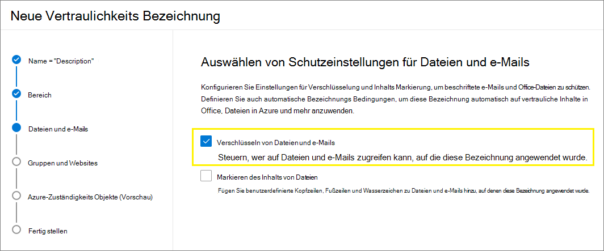
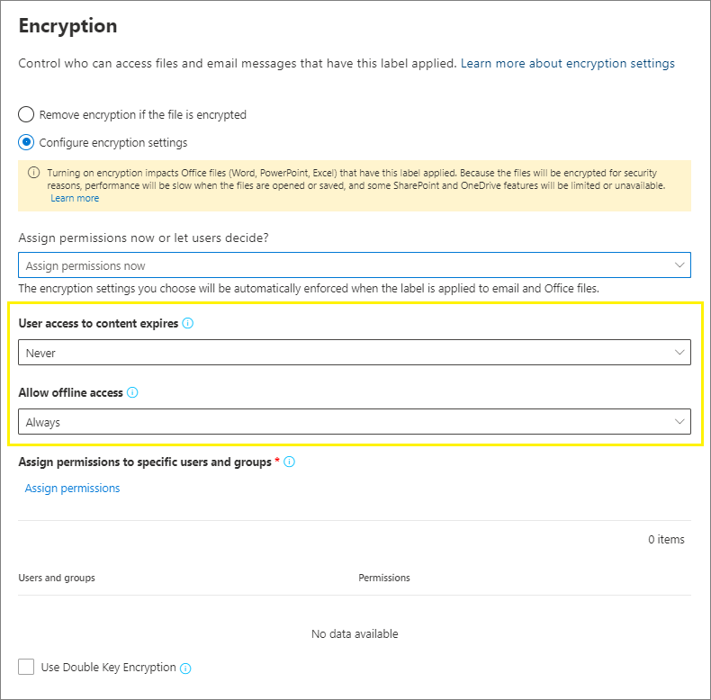

# Einschränken des Zugriffs auf Inhalte mithilfe von Vertraulichkeitsbezeichnungen zur Verschlüsselung

>*[Microsoft 365-Lizenzierungsleitfaden für Sicherheit und Compliance](https://aka.ms/ComplianceSD).*

Wenn Sie eine Vertraulichkeitsbezeichnung erstellen, können Sie den Zugriff auf Inhalte beschränken, auf die die Bezeichnung angewendet wird. Mit den Verschlüsselungseinstellungen für eine Vertraulichkeitsbezeichnung können Sie beispielsweise Inhalte so schützen, dass:

- Nur Benutzer in Ihrer Organisation ein vertrauliches Dokument oder vertrauliche E-Mails öffnen können.
- Nur Benutzer in der Marketingabteilung das Ankündigungsdokument oder die Ankündigungs-E-Mail für die Werbeaktion bearbeiten und drucken können, während alle anderen Benutzer in der Organisation dieses Dokument oder diese E-Mail nur lesen können.
- Benutzer eine E-Mail nicht weiterleiten oder Informationen daraus kopieren können, die Neuigkeiten zur internen Neuorganisation enthalten.
- Die aktuelle Preisliste, die an Geschäftspartner gesendet wird, kann nach einem angegebenen Datum nicht geöffnet werden.

Wenn ein Dokument oder eine E-Mail verschlüsselt ist, wird Zugriff auf den Inhalt so eingeschränkt, dass:

- Kann nur von Benutzern entschlüsselt werden, die durch die Verschlüsselungseinstellungen der Bezeichnung dazu autorisiert sind.
- Bleibt verschlüsselt, ganz gleich, wo sich diese befindet, ob innerhalb oder außerhalb Ihrer Organisation, auch wenn sie umbenannt wurde.
- Er sowohl im Ruhezustand (z. B. in einem OneDrive-Konto) als auch während der Übertragung (z. B. eine E-Mail während der Übertragung über das Internet) verschlüsselt ist.

Als Administrator können Sie bei der Konfigurierung einer Vertraulichkeitsbezeichnung für die Zwecke der Verschlüsselung eine der folgenden Optionen auswählen:

- **Berechtigungen sofort zuweisen**, um genau zu bestimmen, welche Benutzer welche Berechtigungen für Inhalte mit dieser Bezeichnung erhalten.
- **Benutzern die Zuweisung von Berechtigungen überlassen**, wenn sie die Bezeichnung auf Inhalte anwenden. Auf diese Weise ermöglichen Sie Personen in Ihrer Organisation eine gewisse Flexibilität, die sie möglicherweise benötigen, um untereinander zusammenarbeiten und ihre Aufgaben erfüllen zu können.

Die Verschlüsselungseinstellungen stehen zur Verfügung, wenn Sie im Microsoft 365 Compliance Center, Microsoft 365 Security Center oder Security & Compliance Center [eine Vertraulichkeitsbezeichnung erstellen](create-sensitivity-labels.md).

## Grundlegendes zur Funktionsweise der Verschlüsselung

Die Verschlüsselung verwendet den Azure Rights Management-Dienst (Azure RMS) aus Azure Information Protection. Diese Schutzlösung verwendet Verschlüsselungs-, Identitäts- und Autorisierungsrichtlinien. Weitere Informationen hierzu finden Sie unter [Was ist Azure Rights Management?](https://docs.microsoft.com/azure/information-protection/what-is-azure-rms) in der Dokumentation zum Azure Information Protection. 

Wenn Sie diese Verschlüsselungslösung verwenden, wird mit der Funktion **Administrator** sichergestellt, dass autorisierte Personen und Dienste die Daten, die für Ihre Organisation verschlüsselt wurden, immer lesen und überprüfen können. Bei Bedarf kann die Verschlüsselung darauf entfernt oder geändert werden. Weitere Informationen hierzu finden Sie unter [Konfigurieren von Administratoren für Azure Dienste zur Informationssicherung und -Recherche oder Datenwiederherstellung](https://docs.microsoft.com/azure/information-protection/configure-super-users).

## Konfigurieren einer Bezeichnung für die Verschlüsselung

1. Befolgen Sie die allgemeinen Anweisungen für die [Erstellung oder Bearbeitung einer Vertraulichkeitsbezeichnung](create-sensitivity-labels.md#create-and-configure-sensitivity-labels) und stellen Sie sicher, dass als Bereich für die Bezeichnung **Dateien und E-Mails** ausgewählt ist: 
    
    

2. Stellen Sie dann auf der Seite **Schutzeinstellungen für Dateien und E-Mails auswählen** sicher, dass Sie **Dateien und E-Mails verschlüsseln** auswählen.
    
    

4.  Wählen Sie auf der Seite **Verschlüsselung** des Assistenten eine der folgenden Optionen aus:
    
    - **Verschlüsselung entfernen, wenn die Datei verschlüsselt ist**: Weitere Informationen zu diesem Szenario finden Sie in dem Abschnitt [Was geschieht mit einer bestehenden Verschlüsselung, wenn eine Bezeichnung angewendet wird?](#what-happens-to-existing-encryption-when-a-labels-applied). Es ist wichtig zu wissen, dass diese Einstellung zu einer Vertraulichkeitsbezeichnung führen kann, die Benutzer ohne ausreichende Berechtigungen unter Umständen nicht anwenden können.
    
    - **Konfigurieren der Verschlüsselungseinstellungen**: Die Verschlüsselung wird aktiviert, und die Verschlüsselungseinstellungen werden angezeigt:
        
        
        
        Anweisungen für die Einstellungen finden Sie in dem folgenden Abschnitt [Konfigurieren von Verschlüsselungseinstellungen](#configure-encryption-settings).

### Was mit einer vorhandenen Verschlüsselung geschieht, wenn eine Bezeichnung angewendet wird

Wenn eine Vertraulichkeitsbezeichnung auf unverschlüsselte Inhalte angewendet wird, ist das Ergebnis der Verschlüsselungsoptionen, die Sie auswählen können, selbsterklärend. Wenn Sie beispielsweise **Dateien und E-Mails verschlüsseln** nicht ausgewählt haben, bleiben die Inhalte unverschlüsselt.

Allerdings ist der Inhalt möglicherweise bereits verschlüsselt. Ein anderer Benutzer kann beispielsweise Folgendes angewendet haben:

- Ihre eigenen Berechtigungen, die benutzerdefinierte Berechtigungen umfassen, wenn Sie von einer Bezeichnung, benutzerdefinierte Berechtigungen durch den Azure Information Protection-Client und den Dokumentschutz **„Eingeschränkter Zugriff“** in einer Office-App angezeigt werden.
- Eine Azure Rights Management-Vorlage, mit der die Inhalte unabhängig von einer Bezeichnung verschlüsselt werden. Diese Kategorie umfasst die Regeln für den E-Mail-Verkehr, die die Verschlüsselung mithilfe des Rechteschutzes anwenden.
- Eine Bezeichnung, die Verschlüsselung mit Berechtigungen zulässt, die vom Administrator zugewiesen wurden.

In der folgenden Tabelle wird dargestellt, was mit einer vorhandenen Verschlüsselung geschieht, wenn eine Vertraulichkeitsbezeichnung auf diese Inhalte angewendet wird:

| | Verschlüsselung: nicht ausgewählt | Verschlüsselung: konfiguriert | Verschlüsselung: Entfernen |
|:-----|:-----|:-----|:-----|
|**Von einem Benutzer festgelegte Berechtigungen**|Die ursprüngliche Verschlüsselung bleibt erhalten|Es wird keine neue Verschlüsselung mit Bezeichnung angewendet|Die ursprüngliche Verschlüsselung wird entfernt|
|**Schutzvorlage**|Die ursprüngliche Verschlüsselung bleibt erhalten|Es wird keine neue Verschlüsselung mit Bezeichnung angewendet|Die ursprüngliche Verschlüsselung wird entfernt|
|**Bezeichnung mit von dem Administrator definierten Berechtigungen**|Die ursprüngliche Verschlüsselung wird entfernt|Es wird keine neue Verschlüsselung mit Bezeichnung angewendet|Die ursprüngliche Verschlüsselung wird entfernt|

Beachten Sie, dass in den Fällen, in denen die neue Verschlüsselung mit Bezeichnungen angewendet oder die ursprüngliche Verschlüsselung entfernt wird, dies geschieht nur, wenn der Benutzer, der die Bezeichnung angewendet hat, über ein Nutzungsrecht oder eine Rolle verfügt, die diese Aktion unterstützt:

- Die [Verwendungsberechtigung](https://docs.microsoft.com/azure/information-protection/configure-usage-rights#usage-rights-and-descriptions) Export oder Vollzugriff.
- Die Rolle von [Rechteverwaltung-Aussteller oder -Besitzer](https://docs.microsoft.com/azure/information-protection/configure-usage-rights#rights-management-issuer-and-rights-management-owner)oder [Administrator](https://docs.microsoft.com/azure/information-protection/configure-super-users).

Wenn der Benutzer nicht über eines dieser Rechte oder Rollen verfügt, kann die Bezeichnung nicht angewendet werden und die ursprüngliche Verschlüsselung bleibt erhalten. Dem Benutzer wird die folgende Meldung angezeigt: **Sie verfügen nicht über die erforderlichen Berechtigungen zum Ändern der Vertraulichkeitsbezeichnung. Wenden Sie sich an den Inhaltsbesitzer.**

So kann beispielsweise die Person, die „Keine Weiterleitung“ an eine E-Mail-Nachricht anwendet, die Diskussion so kennzeichnen, dass die Verschlüsselung ersetzt oder entfernt wird, weil die Person der Besitzer der Rechteverwaltung für die E-Mail ist. Abgesehen von den Administratoren können Empfänger dieser E-Mail diese nicht erneut beschriften, weil Sie nicht über die erforderlichen Nutzungsrechte verfügen.

#### E-Mail-Anlagen für unverschlüsselte E-Mail-Nachrichten

Wenn eine E-Mail-Nachricht mit einer beliebigen Methode verschlüsselt wird, erben unverschlüsselte Office-Dokumente, die mit der E-Mail verbunden sind, automatisch die gleichen Verschlüsselungseinstellungen.

Dokumente, die bereits verschlüsselt und dann als Anlagen hinzugefügt wurden, erhalten immer die ursprüngliche Verschlüsselung.

## Konfigurieren von Verschlüsselungseinstellungen

Wenn Sie auf der Seite **Verschlüsselung** im Assistenten **Verschlüsselungseinstellungen konfigurieren** auswählen, um eine Vertraulichkeitsbezeichnung zu erstellen oder zu bearbeiten, wählen Sie eine der folgenden Optionen aus: 

- **Berechtigungen sofort zuweisen**, damit Sie genau bestimmen können, welche Benutzer welche Berechtigungen für Inhalte mit dieser Bezeichnung erhalten. Weitere Informationen hierzu finden Sie im nächsten Abschnitt [Berechtigungen sofort zuweisen](#assign-permissions-now).
- **Benutzern die Zuweisung von Berechtigungen überlassen**, wenn Ihre Benutzer die Bezeichnung auf Inhalte anwenden. Mit deiser Option ermöglichen Sie Personen in Ihrer Organisation eine gewisse Flexibilität, die sie möglicherweise benötigen, um untereinander zusammenarbeiten und ihre Aufgaben erfüllen zu können. Weitere Informationen hierzu finden Sie auf dieser Seite im Abschnitt [Benutzern die Zuweisung von Berechtigungen überlassen](#let-users-assign-permissions).

Liegt beispielsweise eine Vertraulichkeitsbezeichnung namens **Streng vertraulich** vor, die auf Ihre vertraulichsten Inhalte angewendet wird, können Sie jetzt festlegen, wer welche Art von Berechtigungen für diese Inhalte erhält.

Wenn Sie hingegen über eine Vertraulichkeitsbezeichnung namens **Geschäftsverträge** verfügen und der Workflow in Ihrer Organisation erfordert, dass Ihre Mitarbeiter mit anderen Personen auf Ad-hoc-Basis an diesen Inhalten zusammenarbeiten, können Sie zulassen, dass Ihre Benutzer jeweils entscheiden, wer eine Berechtigung erhält, wenn sie diese Bezeichnung zuweisen. Diese Flexibilität fördert die Produktivität Ihrer Benutzer und verringert die Anfragen an Ihre Administratoren, Vertraulichkeitsbezeichnungen für spezifische Szenarios zu erstellen oder zu aktualisieren.

Auswählen, ob Berechtigungen jetzt zugewiesen werden sollen oder ob Benutzer Berechtigungen zuweisen dürfen:

## Berechtigungen sofort zuweisen

Steuern Sie über die folgenden Optionen, wer auf E-Mails oder Dokumente zugreifen kann, auf die eine bestimmte Bezeichnung angewendet wurde. Sie können:

- **Zulassen, dass der Zugriff auf gekennzeichnete Inhalte abläuft** – entweder zu einem bestimmten Datum oder nach einer bestimmten Anzahl von Tagen, nachdem die Bezeichnung angewendet wurde. Danach können Benutzer das gekennzeichnete Element nicht mehr öffnen. Wenn Sie ein Datum angeben, gilt es ab Mitternacht an diesem Tag in Ihrer aktuellen Zeitzone. (Beachten Sie, dass einige E-Mail-Clients aufgrund ihrer Caching-Mechanismen möglicherweise das Ablaufen nicht erzwingen können und deshalb E-Mails anzeigen, deren Ablaufdatum überschritten ist.)

- **Offlinezugriff zulassen** entweder „niemals“, „immer“ oder für eine bestimmte Anzahl von Tagen, nachdem die Bezeichnung angewendet wurde. Wenn Sie den Offlinezugriff jedoch auf „nie“ oder eine Anzahl von Tagen einschränken, müssen Benutzer erneut authentifiziert werden, und ihr Zugriff wird protokolliert. Weitere Informationen finden Sie im nächsten Abschnitt zur Verwendungslizenz von Rights Management.

Einstellungen für die Zugriffssteuerung für verschlüsselte Inhalte:

### Rights Management-Verwendungslizenz für den Offlinezugriff

Wenn ein Benutzer ein Dokument oder eine E-Mail-Nachricht öffnet, das bzw. die durch Verschlüsselung über den Azure Rights Management-Dienst geschützt wurde, erhält der Benutzer eine Azure Rights Management-Verwendungslizenz für den jeweiligen Inhalt. Hierbei handelt es sich um ein Zertifikat, das die Nutzungsberechtigungen des Benutzers für das Dokument oder die E-Mail sowie den Verschlüsselungsschlüssel enthält, der zum Verschlüsseln des Inhalts verwendet wurde. Die Verwendungslizenz enthält außerdem ein Ablaufdatum, sofern eins festgelegt wurde, und eine Gültigkeitsdauer.

Wenn kein Ablaufdatum festgelegt wurde, beträgt die Standardeinstellung für die Gültigkeitsdauer der Verwendungslizenz für einen Mandanten 30 Tage. Für die Dauer der Verwendungslizenz muss der Benutzer nicht erneut authentifiziert oder für den Inhalt erneut autorisiert werden. Auf diese Weise kann der Benutzer das geschützte Dokument oder die geschützte E-Mail weiterhin ohne Internetverbindung öffnen. Wenn der Gültigkeitszeitraum für die Verwendungslizenz abläuft, muss der Benutzer beim nächsten Zugriff auf das geschützte Dokument oder die geschützte E-Mail erneut authentifiziert und erneut autorisiert werden.

Zusätzlich zur erneuten Authentifizierung werden die Verschlüsselungseinstellungen und die Benutzergruppenmitgliedschaft neu ausgewertet. Dies bedeutet, dass bei Benutzern unterschiedliche Zugriffsergebnisse für dasselbe Dokument oder dieselbe E-Mail auftreten könnten, wenn es seit dem letzten Zugriff auf den Inhalt Änderungen in den Verschlüsselungseinstellungen oder der Gruppenmitgliedschaft gab.

Informationen zum Ändern der Standardeinstellung von 30 Tagen finden Sie unter [Rights Management-Verwendungslizenz](https://docs.microsoft.com/azure/information-protection/configure-usage-rights#rights-management-use-license).

### Zuweisen von Berechtigungen für bestimmte Benutzer oder Gruppen

Sie können bestimmten Personen Berechtigungen erteilen, sodass nur sie mit dem gekennzeichneten Inhalt interagieren können:

1. Zuerst fügen Sie Benutzer oder Gruppen hinzu, denen Berechtigungen für gekennzeichnete Inhalte erteilt werden.

2. Dann wählen Sie die Berechtigungen aus, die diese Benutzer für die gekennzeichneten Inhalte haben sollten.

Zuweisen von Berechtigungen:

#### Hinzufügen von Benutzern und Gruppen

Wenn Sie Berechtigungen zuweisen, können Sie folgende Optionen auswählen:

- Jeder in Ihrem Unternehmen (alle Mandantenmitglieder). Diese Einstellung schließt Gastkonten aus.

- Alle authentifizierten Benutzer. Stellen Sie sicher, dass Sie die [Voraussetzungen und Einschränkungen](#requirements-and-limitations-for-add-any-authenticated-users) dieser Einstellung verstehen, bevor Sie sie auswählen.

- Jede spezifische Benutzer- oder E-Mail-fähige Sicherheits-, Verteiler- oder Microsoft 365-Gruppe ([ehemals Office 365-Gruppe](https://techcommunity.microsoft.com/t5/microsoft-365-blog/office-365-groups-will-become-microsoft-365-groups/ba-p/1303601)) in Azure AD. Die Microsoft 365-Gruppe kann die statische oder [dynamische Mitgliedschaft](https://docs.microsoft.com/azure/active-directory/users-groups-roles/groups-create-rule) haben. Sie können keine [dynamische Verteilergruppe aus Exchange](https://docs.microsoft.com/Exchange/recipients/dynamic-distribution-groups/dynamic-distribution-groups) verwenden, da dieser Gruppentyp nicht mit Azure AD synchronisiert wird und Sie keine Sicherheitsgruppe verwenden können, die nicht E-Mail-aktiviert ist.

- Beliebige E-Mail-Adresse oder Domäne. Verwenden Sie diese Option, um alle Benutzer in einer anderen Organisation, die Azure AD verwendet, anzugeben, indem Sie einen beliebigen Domänennamen aus dieser Organisation eingeben. Sie können diese Option auch für Anbieter sozialer Dienste verwenden, indem Sie deren Domänennamen eingeben, z. B. **gmail.com****hotmail.com** oder **Outlook.com**.

    > [!NOTE]
    > Wenn Sie eine Domäne aus einer Organisation angeben, die Azure AD verwendet, können Sie den Zugriff auf diese bestimmte Domäne nicht einschränken. Stattdessen werden alle überprüften Domänen in Azure AD für den Mandanten mit dem von Ihnen angegebenen Domänennamen automatisch einbezogen.

Wenn Sie alle Benutzer und Gruppen in Ihrer Organisation auswählen oder das Verzeichnis durchsuchen, müssen die Benutzer oder Gruppen eine E-Mail-Adresse aufweisen.

Als bewährte Methode sollten Sie besser Gruppen anstelle von Benutzern verwenden. Dadurch wird die Konfiguration einfacher.

##### Voraussetzungen und Einschränkungen für „Hinzufügen von allen authentifizierten Benutzern“

Diese Einstellung schränkt den Zugriff der Benutzer auf den Inhalt nicht ein, der von der Bezeichnung verschlüsselt wird, während sie den Inhalt weiterhin verschlüsselt und Ihnen Optionen zum Einschränken des Inhalts (Berechtigungen) und zum Zugriff auf (Ablauf und Offlinezugriff) bietet. Die Anwendung, die die verschlüsselten Inhalte öffnet, muss die verwendete Authentifizierung unterstützen können. Aus diesem Grund funktionieren Partner-Sozialnetwerkanbieter wie Google und die Authentifizierung mit einer Einmalkennung nur für E-Mail und nur dann, wenn Sie Exchange Online verwenden. Microsoft-Konten können mit Office 365-Apps und dem [Azure Information Protection-Viewer](https://portal.azurerms.com/#/download)verwendet werden.

> [!NOTE]
> Erwägen Sie die Verwendung dieser Einstellung mit [SharePoint- und OneDrive-Integration in Azure AD B2B](https://docs.microsoft.com/sharepoint/sharepoint-azureb2b-integration-preview) wenn Vertraulichkeitsbezeichnungen [für Office-Dateien in SharePoint und OneDrive aktiviert](sensitivity-labels-sharepoint-onedrive-files.md) sind.

Einige typische Szenarien für die Einstellung "Alle authentifizierten Benutzer":

- Es ist Ihnen egal, wer auf den Inhalt zugreift, aber Sie möchten die Verwendung einschränken. So möchten Sie beispielsweise nicht, dass der Inhalt bearbeitet, kopiert oder gedruckt wird.
- Sie müssen nicht einschränken, wer auf die Inhalte zugreift, aber Sie möchten bestätigen können, wer die Inhalte öffnet.
- Sie fordern, dass der Inhalt im Standby und bei der Übermittlung verschlüsselt werden muss, aber es sind keine Zugriffskontrollen erforderlich.

#### Berechtigungen auswählen

Wenn Sie die Berechtigungen für diese Benutzer oder Gruppen auswählen, können Sie folgende Optionen auswählen:

- Eine [vordefinierte Berechtigungsstufe](https://docs.microsoft.com/azure/information-protection/configure-usage-rights#rights-included-in-permissions-levels) mit einer bereits festgelegten Gruppen von Rechten, z. B. Mitverfasser oder Überprüfer.
- Benutzerdefinierte Berechtigungen, wobei Sie ein oder mehrere Nutzungsrechte auswählen.

Weitere Informationen, die Ihnen bei der Auswahl der entsprechenden Berechtigungen helfen, finden Sie unter [Nutzungsrechte und Beschreibungen](https://docs.microsoft.com/azure/information-protection/configure-usage-rights#usage-rights-and-descriptions).  

Beachten Sie, dass dieselbe Bezeichnung unterschiedlichen Benutzern unterschiedliche Berechtigungen erteilen kann. Eine einzelne Bezeichnung kann beispielsweise einige Benutzer als "Überprüfer" und einen anderen Benutzer als "Mitverfasser" zuweisen, wie im folgenden Screenshot dargestellt.

Weisen Sie hierfür Benutzern und Gruppen Berechtigungen zu, und speichern Sie die Einstellungen. Wiederholen Sie dann diese Schritte, und fügen Sie jedes Mal Benutzer hinzu, weisen diesen Berechtigungen zu, und speichern die Einstellungen. Sie können diese Konfiguration so oft wie erforderlich wiederholen, um unterschiedliche Berechtigungen für unterschiedliche Benutzer zu definieren.

#### Rights Management-Aussteller (Benutzer, der die Vertraulichkeitsbezeichnung anwendet) hat immer Vollzugriff

Die Verschlüsselung für eine Vertraulichkeitsbezeichnung verwendet den Azure Rights Management-Dienst (Azure RMS) aus Azure Information Protection. Wenn ein Benutzer eine Vertraulichkeitsbezeichnung anwendet, um ein Dokument oder eine E-Mail mithilfe von Verschlüsselung zu schützen, wird dieser Benutzer der Rights Management-Aussteller für diesen Inhalt.

Der Rights Management-Aussteller erhält immer Vollzugriff für das Dokument oder die E-Mail. Außerdem gilt:

- Wenn die Verschlüsselungseinstellungen ein Ablaufdatum umfassen, kann der Rights Management-Aussteller das Dokument oder die E-Mail nach diesem Datum immer noch öffnen und bearbeiten.
- Der Rights Management-Aussteller kann immer offline auf das Dokument oder die E-Mail zugreifen.
- Der Rights Management-Aussteller kann ein Dokument weiterhin öffnen, nachdem es gesperrt wurde.

Weitere Informationen finden Sie unter [Rights Management-Aussteller und Rights Management-Besitzer](https://docs.microsoft.com/azure/information-protection/configure-usage-rights#rights-management-issuer-and-rights-management-owner).

### Verschlüsselung mit Doppelschlüssel

> [!NOTE]
> Diese Funktion wird derzeit nur von Azure Information Protection-Clients mit einheitlichen Bezeichnungen unterstützt.

Wählen Sie diese Option erst, nachdem Sie den Dienst Doppelschlüssel-Verschlüsselung konfiguriert haben und Sie diese Doppelschlüssel-Verschlüsselung für Dateien verwenden müssen, die mit diesem Label versehen werden sollen.

Weitere Informationen, Voraussetzungen und Konfigurationsanweisungen finden Sie unter [Double Key Encryption (DKE)](double-key-encryption.md).

## Benutzern die Zuweisung von Berechtigungen überlassen

Sie können mithilfe dieser Optionen Benutzern erlauben, Berechtigungen zuzuweisen, wenn sie eine Vertraulichkeitsbezeichnung manuell auf Inhalte anwenden:

- In Outlook kann ein Benutzer Einschränkungen wählen, die der Option [Nicht weiterleiten](https://docs.microsoft.com/azure/information-protection/configure-usage-rights#do-not-forward-option-for-emails) für Ihre gewählten Empfänger entsprechen.

- In Word, PowerPoint und Excel wird ein Benutzer aufgefordert, ihre eigenen Berechtigungen für bestimmte Benutzer, Gruppen oder Organisationen auszuwählen.

    > [!NOTE]
    > Diese Option für Word, PowerPoint und Excel wird vom Azure Information Protection-Clients mit einheitlichen Bezeichnungen unterstützt. Für Apps, die die integrierte Bezeichnung verwenden. [Überprüfen Sie, welche Apps diese Funktion unterstützen](sensitivity-labels-office-apps.md#sensitivity-label-capabilities-in-word-excel-and-powerpoint).
    >
    > Ist diese Option ausgewählt, jedoch für die App eines Benutzers nicht unterstützt, wird die Bezeichnung dem Benutzer entweder nicht angezeigt oder die Bezeichnung wird zu Konsistenzzwecken angezeigt, kann jedoch nicht mit einer entsprechenden Erläuterung für die Benutzer angewendet werden.

Wenn die Optionen unterstützt werden, verwenden Sie die folgende Tabelle, um zu ermitteln, wann Benutzer die Vertraulichkeitsbezeichnung sehen:

|Einstellung |Die Bezeichnung ist in Outlook sichtbar|Die Bezeichnung ist in Word, Excel, PowerPoint sichtbar|
|:-----|:-----|:-----|:-----|
|**In Outlook Einschränkungen durchsetzen, die der Option „Nicht weiterleiten“ entsprechen**|Ja |Nein |
|**In Word, PowerPoint und Excel die Benutzer auffordern, Berechtigungen anzugeben**|Nein |Ja|

Wenn beide Einstellungen ausgewählt sind, ist die Bezeichnung sowohl in Outlook als auch in Word, Excel und PowerPoint sichtbar.

Eine Vertraulichkeitsbezeichnung, bei der Benutzer Berechtigungen zuweisen können, kann nur manuell von Benutzern angewendet werden. Sie kann nicht automatisch angewendet oder als empfohlene Bezeichnung genutzt werden.

Konfigurieren der dem Benutzer zugewiesenen Berechtigungen:

### Einschränkungen in Outlook

Wenn ein Benutzer in Outlook eine Vertraulichkeitsbezeichnung anwendet, die ihm das Zuweisen von Berechtigungen für eine Nachricht gestattet, entsprechen die Einschränkungen der Option "Nicht weiterleiten". Der Benutzer sieht oben in der Nachricht den Namen und die Beschreibung der Bezeichnung, die den Inhalt als geschützt ausweist. Anders als in Word, PowerPoint und Excel (mehr dazu im [nächsten Abschnitt](#word-powerpoint-and-excel-permissions)) werden die Benutzer hier nicht aufgefordert, bestimmte Berechtigungen auszuwählen.

Wenn die Option "Nicht weiterleiten" auf eine E-Mail angewendet wird, wird diese E-Mail verschlüsselt und die Empfänger müssen authentifiziert werden. Die Empfänger können dann die Nachricht nicht weiterleiten, drucken oder kopieren. Wenn beispielsweise im Outlook-Client die Schaltfläche "Weiterleiten" nicht verfügbar ist, sind die Menüoptionen "Speichern unter" und "Drucken" ebenfalls nicht verfügbar, und Sie können in den Feldern "An", CC oder Bcc keine Empfänger hinzufügen oder ändern.

Für unverschlüsselte Office-Dokumente, die sich im Anhang der E-Mail befinden, werden automatisch die gleichen Beschränkungen übernommen. Die für diese Dokumente geltenden Nutzungsrechte sind "Inhalt bearbeiten", "Bearbeiten", "Speichern", "Anzeigen", "Öffnen", "Lesen" und "Makros zulassen". Wenn der Benutzer andere Nutzungsrechte für eine Anlage wünscht, oder wenn es sich bei der Anlage nicht um ein Office-Dokument handelt, das die Vererbung des Schutzes unterstützt, muss der Benutzer die Datei schützen, bevor er sie an die E-Mail anfügt.

### Berechtigungen in Word, PowerPoint und Excel

Wenn ein Benutzer in Word, PowerPoint oder Excel eine Vertraulichkeitsbezeichnung anwendet, die ihm das Zuweisen von Berechtigungen für ein Dokument gestattet, wird er aufgefordert, Benutzer und Berechtigungen für die Verschlüsselung auszuwählen.

So können Die Benutzer mithilfe des Azure Information Protection-Clients mit einheitlichen Bezeichnungen beispielsweise Folgendes tun:

- Er kann eine Berechtigungsstufe auswählen, z. B. "Betrachter" (dadurch wird nur die Berechtigung "Nur anzeigen" zugewiesen) oder "Mitautor" (mit Berechtigungen zum "Anzeigen", "Bearbeiten", "Kopieren" und "Drucken").
- Er kann Benutzer, Gruppen oder Organisationen auswählen. Dies kann Personen innerhalb und außerhalb Ihrer Organisation umfassen.
- Er kann ein Ablaufdatum festlegen, nach dem die ausgewählten Benutzer nicht mehr auf die betreffenden Inhalte zugreifen können. Weitere Informationen finden Sie im vorstehenden Abschnitt [Rights Management-Verwendungslizenz für den Offlinezugriff](#rights-management-use-license-for-offline-access).

Bei der integrierten Bezeichnung sehen die Benutzer dasselbe Dialogfeld, wenn Sie Folgendes auswählen:

- Windows: Registerkarte **"Datei"** > **Info** > **Dokument schützen** > **Zugriff einschränken** > **Eingeschränkter Zugriff**

- macOS: Registerkarte **Überprüfen** > **Schutz** > **Berechtigungen** > **Eingeschränkter Zugriff**

## Beispielkonfigurationen für die Verschlüsselungseinstellungen

Führen Sie für jedes der folgenden Beispiele die Konfiguration über die Seite **Verschlüsselung** des Assistenten aus, wenn **Verschlüsselungseinstellungen konfigurieren** ausgewählt ist:

### Beispiel 1: Bezeichnung, die "Nicht weiterleiten" beim Senden einer verschlüsselten E-Mail-Nachricht an ein Gmail-Konto anwendet

Diese Bezeichnung wird nur in Outlook und Outlook im Web angezeigt und Sie müssen Exchange Online verwenden. Weisen Sie Benutzer an, diese Bezeichnung auszuwählen, wenn sie eine verschlüsselte E-Mail an Personen senden müssen, die ein Gmail-Konto (oder ein anderes E-Mail-Konto außerhalb Ihrer Organisation) verwenden.

Ihre Benutzer geben die Gmail-Adresse in das Feld **An** ein.  Dann wählen sie die Bezeichnung aus, und die Option "Nicht weiterleiten" wird der E-Mail automatisch hinzugefügt. Das hat zur Folge, dass Empfänger die E-Mail nicht weiterleiten oder drucken, deren Inhalt nicht kopieren und die E-Mail nicht über die Option **Speichern unter** außerhalb Ihres Postfachs speichern können.

1. Auf der Seite **Verschlüsselung**: Wählen Sie für **Jetzt Berechtigungen zuweisen oder die Benutzer entscheiden lassen?** die Option **Benutzern die Zuweisung von Berechtigungen überlassen, wenn sie die Bezeichnung anwenden** aus.

2. Aktivieren Sie das Kontrollkästchen **In Outlook Einschränkungen durchsetzen, die der Option "Nicht weiterleiten" entsprechen**.

3. Wenn das Kontrollkästchen **In Word, PowerPoint und Excel die Benutzer auffordern, Berechtigungen anzugeben** aktiviert ist, deaktivieren Sie es.

4. Wählen Sie **Weiter** aus, und schließen Sie den Assistenten ab.

### Beispiel 2: Bezeichnung, die die Nur-Lese-Berechtigung auf alle Benutzer in einer anderen Organisation beschränkt

Diese Bezeichnung eignet sich für die schreibgeschützte Freigabe streng vertraulicher Dokumente, wobei zum Anzeigen der Dokumente immer eine Internetverbindung benötigt wird.

Diese Bezeichnung eignet sich nicht für E-Mails.

1. Auf der Seite **Verschlüsselung**: Wählen Sie für **Jetzt Berechtigungen zuweisen oder die Benutzer entscheiden lassen?** die Option **Berechtigungen sofort zuweisen** aus.

2. Wählen Sie für **Offlinezugriff zulassen** die Option **Nie** aus.

3. Wählen Sie **Berechtigungen zuweisen** aus.

4. Wählen Sie im Bereich **Berechtigungen zuweisen** die Option **Spezifische E-Mail-Adressen oder Domänen hinzufügen** aus.

5. Geben Sie in das Textfeld den Namen einer Domäne der anderen Organisation ein, z. B. **fabrikam.com**. Wählen Sie dann **Hinzufügen** aus.

6. Klicken Sie auf **Berechtigungen auswählen**.

7. Wählen Sie im Bereich **Berechtigungen auswählen** im Dropdownfeld **Viewer** aus und klicken Sie anschließend auf **Speichern**.

8. Zurück im Bereich **Berechtigungen zuweisen** wählen Sie **Speichern** aus.

9. Wählen Sie auf der Seite **Verschlüsselung** die Option **Weiter** aus, und schließen Sie den Assistenten ab.

### Beispiel 3: Hinzufügen externer Benutzer zu einer vorhandenen Bezeichnung, die Inhalt verschlüsselt

Die neuen Benutzer, die Sie hinzufügen, können Dokumente und E-Mails öffnen, die bereits mit dieser Bezeichnung geschützt sind. Die Berechtigungen, die Sie diesen Benutzern gewähren, können sich von den Berechtigungen der vorhandenen Benutzer unterscheiden.

1. Auf der Seite **Verschlüsselung**: Stellen Sie sicher, dass für **Jetzt Berechtigungen zuweisen oder die Benutzer entscheiden lassen?** die Option **Berechtigungen sofort zuweisen** ausgewählt ist.

2. Wählen Sie **Berechtigungen zuweisen** aus.

3. Wählen Sie im Bereich **Berechtigungen zuweisen** die Option **Spezifische E-Mail-Adressen oder Domänen hinzufügen** aus.

4. Geben Sie in das Textfeld die E-Mail-Adresse des ersten hinzuzufügenden Benutzers (oder der ersten Gruppe) ein, und wählen Sie dann **Hinzufügen** aus.

5. Klicken Sie auf **Berechtigungen auswählen**.

6. Wählen Sie im Bereich **Berechtigungen auswählen** die Berechtigungen für diesen Benutzer (oder die Gruppe) aus und klicken Sie anschließend auf **Speichern**.

7. Wiederholen Sie im Bereich **Berechtigungen zuweisen** die Schritte 3 bis 6 für jeden Benutzer (oder jede Gruppe), zu dem bzw. der Sie diese Bezeichnung hinzufügen möchten. Klicken Sie dann auf **Speichern**.

8. Wählen Sie auf der Seite **Verschlüsselung** die Option **Weiter** aus, und schließen Sie den Assistenten ab.

### Beispiel 4: Bezeichnung, die Inhalte verschlüsselt, aber nicht einschränkt, wer darauf zugreifen kann

Diese Konfiguration hat den Vorteil, dass Sie zur Verschlüsselung einer E-Mail oder eines Dokuments keine Benutzer, Gruppen oder Domänen angeben müssen. Der Inhalt wird trotzdem verschlüsselt, und Sie können Nutzungsrechte, ein Ablaufdatum und Offlinezugriff festlegen.

Verwenden Sie diese Konfiguration nur, wenn Sie nicht einschränken müssen, wer das geschützte Dokument oder die E-Mail öffnen kann. [Weitere Informationen zu dieser Einstellung](#requirements-and-limitations-for-add-any-authenticated-users)

1. Auf der Seite **Verschlüsselung**: Stellen Sie sicher, dass für **Jetzt Berechtigungen zuweisen oder die Benutzer entscheiden lassen?** die Option **Berechtigungen sofort zuweisen** ausgewählt ist.

2. Konfigurieren Sie die Einstellungen für **Benutzerzugriff auf Inhalte läuft ab** und **Offlinezugriff zulassen** wie erforderlich.

3. Wählen Sie **Berechtigungen zuweisen** aus.

4. Wählen Sie im Bereich **Berechtigungen zuweisen** die Option **Alle authentifizierten Benutzer hinzufügen** aus.

    **Benutzer und Gruppen** werden **Authentifizierte Benutzer** automatisch hinzugefügt. Sie können diesen Wert nicht ändern, sondern nur löschen, wodurch die Auswahl **Alle authentifizierten Benutzer hinzufügen** aufgehoben wird.

5. Klicken Sie auf **Berechtigungen auswählen**.

6. Wählen Sie im Bereich **Berechtigungen auswählen** im Dropdownfeld die gewünschten Berechtigungen und klicken Sie anschließend auf **Speichern**.

7. Zurück im Bereich **Berechtigungen zuweisen** wählen Sie **Speichern** aus.

8. Wählen Sie auf der Seite **Verschlüsselung** die Option **Weiter** aus, und schließen Sie den Assistenten ab.

## Überlegungen zu verschlüsselten Inhalten

Durch die Verschlüsselung Ihrer sensibelsten Dokumente und E-Mails können Sie sicherstellen, dass nur autorisierte Personen auf diese Daten zugreifen können. Es müssen jedoch einige Überlegungen berücksichtigt werden:

- Wenn Ihre Organisation[Aktivieren von Vertraulichkeitsbezeichnungen für Office-Dateien in SharePoint und OneDrive](sensitivity-labels-sharepoint-onedrive-files.md) nicht gewählt hat:

  - werden Suche, eDiscovery und Delve bei verschlüsselten Dateien nicht funktionieren.
  - funktionieren DLP-Richtlinien für die Metadaten dieser verschlüsselten Dateien (einschließlich Aufbewahrungsbezeichnungen), aber nicht für die Inhalte dieser Dateien (z. B. Kreditkartennummern innerhalb von Dateien).
  - können Benutzer verschlüsselte Dateien mit Office im Web nicht öffnen. Wenn Vertraulichkeitsbezeichnungen für Office-Dateien in SharePoint und OneDrive aktiviert sind, können Benutzer Office im Web verwenden, um verschlüsselte Dateien zu öffnen, mit einigen [Einschränkungen](sensitivity-labels-sharepoint-onedrive-files.md#limitations), darunter die Verschlüsselung, die mit einem firmeneigenen Schlüssel (bekannt als „Hold your own key“ oder HYOK) angewendet wurde, [Verschlüsselung mit Doppelschlüssel](#double-key-encryption) und die Verschlüsselung, die unabhängig von einer Vertraulichkeitsbezeichnung angewendet wurde.

- Wenn Sie verschlüsselte Dokumente für Personen außerhalb Ihrer Organisation freigeben, müssen Sie möglicherweise Gastkonten erstellen und Richtlinien für den bedingten Zugriff ändern. Weitere Informationen finden Sie unter [Freigabe verschlüsselter Dokumente für externe Benutzer](sensitivity-labels-office-apps.md#support-for-external-users-and-labeled-content).

- Damit mehrere Benutzer gleichzeitig eine verschlüsselte Datei bearbeiten können, müssen alle Office für Web verwenden. Wenn dies nicht der Fall ist und die Datei bereits geöffnet ist:

  - In Office-Apps (Windows, Mac, Android und IOS) wird Benutzern eine **„Datei wird verwendet“**-Nachricht mit dem Namen der Person angezeigt, die die Datei ausgecheckt hat. Sie können dann eine schreibgeschützte Kopie anzeigen oder eine Kopie der Datei speichern und bearbeiten sowie benachrichtigt werden, wenn die Datei verfügbar ist.
  - In Office für Web wird Benutzern eine Fehlermeldung angezeigt, dass Sie das Dokument nicht zusammen mit anderen Personen bearbeiten können. Sie können dann **In der Leseansicht öffnen** auswählen.

- Die Funktion [Automatisches Speichern](https://support.office.com/article/what-is-autosave-6d6bd723-ebfd-4e40-b5f6-ae6e8088f7a5) in Office-Apps (Windows-, Mac-, Android-und IOS) ist für verschlüsselte Dateien deaktiviert. Benutzern wird eine Meldung angezeigt, dass die Datei eingeschränkte Berechtigungen hat, die entfernt werden müssen, bevor das automatische Speichern aktiviert werden kann.

- Das Öffnen verschlüsselter Dateien in Office-Anwendungen (Windows, Mac, Android und iOS) kann länger dauern.

- Wenn beim [Auschecken des Dokuments in SharePoint](https://support.microsoft.com/office/check-out-check-in-or-discard-changes-to-files-in-a-library-7e2c12a9-a874-4393-9511-1378a700f6de) mithilfe einer Office-App eine Bezeichnung hinzugefügt wird, die Verschlüsselung anwendet, und der Benutzer dann das Auschecken verwirft, bleibt das Dokument mit der Bezeichnung versehen und wird verschlüsselt.

- Die folgenden Aktionen für verschlüsselte Dateien werden von Office-Apps (Windows, Mac, Android und IOS) nicht unterstützt und Benutzern wird eine Fehlermeldung angezeigt, dass etwas schief gelaufen ist. Allerdings kann die SharePoint-Funktionalität als Alternative verwendet werden:

  - Anzeigen, wiederherstellen und speichern von Kopien früherer Versionen. Alternativ können Benutzer diese Aktionen mit Office im Web durchführen, wenn sie Folgendes verwenden: [Aktivieren und Konfigurieren der Versionsverwaltung für eine Liste oder Bibliothek](https://support.office.com/article/enable-and-configure-versioning-for-a-list-or-library-1555d642-23ee-446a-990a-bcab618c7a37).
  - Ändern des Namens oder des Speicherorts der Dateien. Alternativ können Benutzer in SharePoint [eine Datei, einen Ordner oder einen Link in einer Dokumentbibliothek umbenennen](https://support.microsoft.com/office/rename-a-file-folder-or-link-in-a-document-library-bc493c1a-921f-4bc1-a7f6-985ce11bb185).

Für eine optimale Zusammenarbeit bei Dateien, die mit einer Vertraulichkeitsbezeichnung verschlüsselt sind, empfehlen wir die Verwendung von [Vertraulichkeitsbezeichnungen für Office-Dateien in SharePoint und OneDrive](sensitivity-labels-sharepoint-onedrive-files.md) sowie Office im Web.

## Wichtige Voraussetzungen

Bevor Sie Verschlüsselung verwenden können, müssen Sie möglicherweise einige Konfigurationsaufgaben ausführen.

- Schutz vor Azure Information Protection aktivieren
    
    Damit Vertraulichkeitsbezeichnungen angewendet werden können, muss der Protection Service (Azure Rights Management) aus Azure Information Protection für Ihren Mandanten aktiviert werden. In neueren Mandanten ist dies die Standardeinstellung, möglicherweise müssen Sie den Dienst jedoch manuell aktivieren. Weitere Informationen finden Sie unter [Aktivieren des Schutzdienstes von Azure Information Protection](https://docs.microsoft.com/azure/information-protection/activate-service).

- Konfigurieren von Exchange für Azure Information Protection
    
    Exchange muss nicht für Azure Information Protection konfiguriert werden, bevor Benutzer in Outlook zum Verschlüsseln ihrer E-Mails Bezeichnungen anwenden können. Solange Exchange jedoch nicht für Azure Information Protection konfiguriert ist, erhalten Sie nicht die volle Funktionalität des Azure Rights Management-Schutzes mit Exchange.
    
    Benutzer können beispielsweise verschlüsselte E-Mails nicht auf Mobiltelefonen oder mit Outlook im Web anzeigen, verschlüsselte E-Mails können nicht für die Suche indexiert werden, und Sie können Exchange Online DLP nicht für den Rights Management-Schutz konfigurieren. 
    
    Um sicherzustellen, dass Exchange diese zusätzlichen Szenarien unterstützt, lesen Sie die folgenden Informationen:
    
    - Für Exchange Online lesen Sie die Anweisungen für [Exchange Online: Konfigurieren von IRM](https://docs.microsoft.com/azure/information-protection/configure-office365#exchangeonline-irm-configuration).
    - For das lokale Exchange müssen Sie den [RMS-Connector bereitstellen und Ihre Exchange-Server konfigurieren](https://docs.microsoft.com/azure/information-protection/deploy-rms-connector). 

## Nächste Schritte

Müssen Sie Ihre gekennzeichneten und verschlüsselten Dokumente mit Personen außerhalb Ihrer Organisation teilen?  Informationen hierzu finden Sie unter [Teilen verschlüsselter Dokumente mit externen Benutzern](sensitivity-labels-office-apps.md#sharing-encrypted-documents-with-external-users).