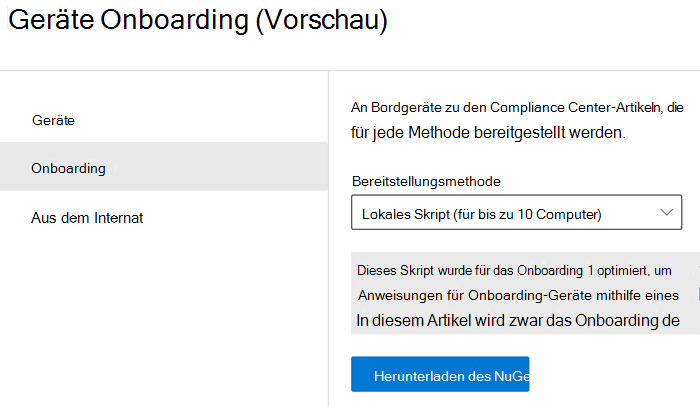
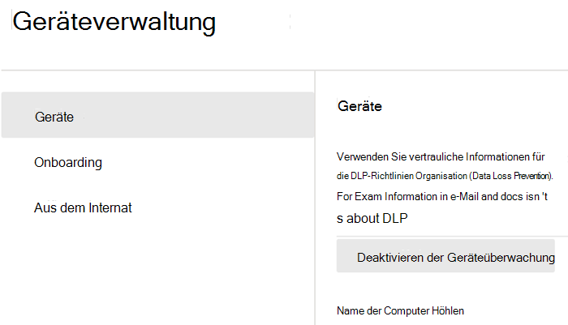

# Endpunkt-DLP (Vorschau) – Erste SchritteGet started with Endpoint data loss prevention (preview)

Microsoft Endpunkt-DLP (Data Loss Prevention, Verhinderung von Datenverlust) ist Bestandteil der Microsoft 365 DLP-Feature-Suite, mit der Sie vertrauliche Elemente in Microsoft 365-Diensten ermitteln und schützen können.Microsoft Endpoint data loss prevention (Endpoint DLP) is part of the Microsoft 365 data loss prevention (DLP) suite of features you can use to discover and protect sensitive items across Microsoft 365 services. Weitere Informationen zu den Microsoft-DLP-Angeboten finden Sie unter [Verhinderung von Datenverlust – Übersicht](data-loss-prevention-policies.md).For more information about all of Microsoft’s DLP offerings, see [Overview of data loss prevention](data-loss-prevention-policies.md). Weitere Informationen zu Endpunkt-DLP finden Sie unter [Informationen zu Endpunkt-DLP (Vorschau)](endpoint-dlp-learn-about.md)To learn more about Endpoint DLP, see [Learn about Endpoint data loss prevention (preview)](endpoint-dlp-learn-about.md)

Microsoft Endpunkt-DLP ermöglicht es Ihnen, Windows 10-Geräte zu überwachen und zu erkennen, wenn vertrauliche Elemente verwendet und freigegeben werden.Microsoft Endpoint DLP allows you to monitor Windows 10 devices and detect when sensitive items are used and shared. Auf diese Weise erhalten Sie die nötige Übersicht und Kontrolle, um sicherzustellen, dass sie ordnungsgemäß verwendet und geschützt werden, und um ihre Gefährdung durch riskantes Verhalten zu verhindern.This gives you the visibility and control you need to ensure that they are used and protected properly, and to help prevent risky behavior that might compromise them.

## VorabinformationenBefore you begin

### SKU/Abonnement-LizenzierungSKU/subscriptions licensing

Bevor Sie mit Endpunkt-DLP beginnen, sollten Sie Ihr [Microsoft 365-Abonnement](https://www.microsoft.com/microsoft-365/compare-microsoft-365-enterprise-plans?rtc=1) und etwaige Add-Ons überprüfen.Before you get started with Endpoint DLP, you should confirm your [Microsoft 365 subscription](https://www.microsoft.com/microsoft-365/compare-microsoft-365-enterprise-plans?rtc=1) and any add-ons. Für den Zugriff auf und die Verwendung von Endpunkt-DLP-Funktionen müssen Sie über eines der folgenden Abonnements oder Add-Ons verfügen.To access and use Endpoint DLP functionality, you must have one of these subscriptions or add-ons.

- Microsoft 365 E5Microsoft 365 E5
- Microsoft 365 A5 (EDU)Microsoft 365 A5 (EDU)
- Microsoft 365 E5 ComplianceMicrosoft 365 E5 compliance
- Microsoft 365 A5 ComplianceMicrosoft 365 A5 compliance
- Microsoft 365 E5 Information Protection und GovernanceMicrosoft 365 E5 information protection and governance
- Microsoft 365 A5 Information Protection und GovernanceMicrosoft 365 A5 information protection and governance

### BerechtigungenPermissions

Zum Aktivieren der Geräteverwaltung muss das von Ihnen verwendete Konto eine der folgenden Rollen aufweisen:To enable device management, the account you use must be a member of any one of these roles:

- Globaler AdministratorGlobal admin
- SicherheitsadministratorSecurity admin
- Compliance-AdministratorCompliance admin

Wenn Sie ein benutzerdefiniertes Konto verwenden möchten, um die Einstellungen für die Geräteverwaltung anzuzeigen, muss es eine der folgenden Rollen aufweisen:If you want to use a custom account to view the device management settings, it must be in one of these roles:

- Globaler AdministratorGlobal admin
- Compliance-AdministratorCompliance admin
- Compliancedaten-AdministratorCompliance data admin
- Globale LeseberechtigungGlobal reader

Wenn Sie ein benutzerdefiniertes Konto für den Zugriff auf die Seite für das Onboarding/Offboarding verwenden möchten, muss es eine der folgenden Rollen aufweisen:If you want to use a custom account to access the onboarding/offboarding page, it must be in one of these roles:

- Globaler AdministratorGlobal admin
- Compliance-AdministratorCompliance admin

Wenn Sie ein benutzerdefiniertes Konto zum Aktivieren/Deaktivieren der Geräteüberwachung verwenden möchten, muss es eine der folgenden Rollen aufweisen:If you want to use a custom account to turn on/off device monitoring, it must be in one of these roles:

- Globaler AdministratorGlobal admin
- Compliance-AdministratorCompliance admin

Endpunkt-DLP-Daten können im [Aktivitäten-Explorer](data-classification-activity-explorer.md) angezeigt werden.Data from Endpoint DLP can be viewed in [Activity explorer](data-classification-activity-explorer.md). Es gibt vier Rollen, die Berechtigungen für den Aktivitäten-Explorer gewähren; das Konto, das Sie für den Zugriff auf die Daten verwenden, muss eine der folgenden Rollen aufweisen:There are four roles that grant permission to activity explorer, the account you use for accessing the data must be a member of any one of them.

- Globaler AdministratorGlobal admin
- Compliance-AdministratorCompliance admin
- SicherheitsadministratorSecurity admin
- Compliancedaten-AdministratorCompliance data admin

### Vorbereiten der EndpunktePrepare your endpoints

Vergewissern Sie sich, dass die Windows 10-Geräte, auf die Sie Endpunkt-DLP anwenden möchten, die nachstehenden Anforderungen erfüllen.Make sure that the Windows 10 devices that you plan on deploying Endpoint DLP to meet these requirements.

1. Auf den Geräten muss Windows 10 Build 1809 oder höher ausgeführt werden.Must be running Windows 10 build 1809 or up.
2. Alle Geräte müssen in [Azure Active Directory (AAD)](https://docs.microsoft.com/azure/active-directory/devices/concept-azure-ad-join), oder in Azure AD Hybrid eingebunden sein.All devices must be [Azure Active Directory (AAD) joined](https://docs.microsoft.com/azure/active-directory/devices/concept-azure-ad-join), or Hybrid Azure AD joined.
3. Installieren Sie den Microsoft Edge-Browser auf dem Endpunktgerät, um Richtlinienaktionen für die Aktivität „Hochladen in die Cloud“ durchzusetzen.Install Microsoft Chromium Edge browser on the endpoint device to enforce policy actions for the upload to cloud activity. Weitere Informationen finden Sie unter [Herunterladen des auf Chromium basierenden neuen Microsoft Edge](https://support.microsoft.com/help/4501095/download-the-new-microsoft-edge-based-on-chromium).See, [Download the new Microsoft Edge based on Chromium](https://support.microsoft.com/help/4501095/download-the-new-microsoft-edge-based-on-chromium).

## Onboarding von Geräten für die GeräteverwaltungOnboarding devices into device management

 Sie müssen die Geräteüberwachung aktivieren und die Endpunkte einbinden, bevor vertrauliche Elemente auf einem Gerät überwacht und geschützt werden können.You must enable device monitoring and onboard your endpoints before you can monitor and protect sensitive items on a device. Beide Aktionen werden im Microsoft 365 Compliance-Portal durchgeführt.Both of these actions are done in the Microsoft 365 Compliance portal.

Wenn Sie das Onboarding von noch nicht eingebundenen Geräten vornehmen möchten, laden Sie das entsprechende Skript herunter, und installieren Sie es auf diesen Geräten.When you want to onboard devices that haven't been onboarded yet, you'll download the appropriate script and deploy it to those devices. Wenden Sie das [Verfahren zum Onboarding von Geräten](endpoint-dlp-getting-started.md#onboarding-devices) an.Follow the [Onboarding devices procedure](endpoint-dlp-getting-started.md#onboarding-devices).

Wenn bereits Geräte in [Microsoft Defender für Endpunkt](https://docs.microsoft.com/windows/security/threat-protection/) eingebunden sind, werden sie in der Liste der verwalteten Geräte angezeigt.If you already have devices onboarded into [Microsoft Defender for Endpoint](https://docs.microsoft.com/windows/security/threat-protection/), they will already appear in the managed devices list. Folgen Sie der Vorgehensweise unter [Bei Geräten, die in Microsoft Defender für Endpunkt eingebunden sind](endpoint-dlp-getting-started.md#with-devices-onboarded-into-microsoft-defender-for- endpoint).Follow the [With devices onboarded into Microsoft Defender for Endpoint procedure](endpoint-dlp-getting-started.md#with-devices-onboarded-into-microsoft-defender-for- endpoint).

### Onboarding von GerätenOnboarding devices

In diesem Bereitstellungsszenario werden Sie das Onboarding von noch nicht eingebundenen Geräten vornehmen, und Sie werden dafür sorgen, dass vertrauliche Elemente auf Windows 10-Geräten im Hinblick auf versehentliche Freigabe überwacht und geschützt sind.In this deployment scenario, you'll onboard devices that have not been onboarded yet, and you just want to monitor and protect sensitive items from unintentional sharing on Windows 10 devices.

1. Öffnen Sie das [Microsoft Compliance Center](https://compliance.microsoft.com).Open the [Microsoft compliance center](https://compliance.microsoft.com).
2. Öffnen Sie die Seite "Einstellungen", und wählen Sie **Geräte-Onboarding** aus.Open the Compliance Center settings page and choose **Onboard devices**. 

   

   > [!NOTE]
   > In der Regel dauert es zwar nur ungefähr eine Minute, bis das Geräte-Onboarding aktiviert ist, warten Sie aber mindestens 30 Minuten, bevor Sie sich an den Microsoft-Support wenden.While it usually takes about 60 seconds for device onboarding to be enabled, please allow up to 30 minutes before engaging with Microsoft support.

3. Wählen Sie **Geräteverwaltung** aus, um die Liste der **Geräte** zu öffnen.Choose **Device management** to open the **Devices** list. Die Liste ist leer, solange keine Geräte eingebunden sind.The list will be empty until you onboard devices.
4. Wählen Sie **Onboarding** aus, um mit dem Onboarding-Prozess zu beginnen.Choose **Onboarding** to begin the onboarding process.
5. Wählen Sie die Art der Bereitstellung auf diesen zusätzlichen Geräten aus der Liste der **Bereitstellungsmethoden** und anschließend **Paket herunterladen** aus.Choose the way you want to deploy to these additional devices from the **Deployment method** list and then **download package**.

   
6. Führen Sie die unter [Onboarding-Tools und -Methoden für Windows 10-Computer](https://docs.microsoft.com/windows/security/threat-protection/microsoft-defender-atp/configure-endpoints) beschriebenen entsprechenden Verfahren aus.Follow the appropriate procedures in [Onboarding tools and methods for Windows 10 machines](https://docs.microsoft.com/windows/security/threat-protection/microsoft-defender-atp/configure-endpoints). Über diesen Link gelangen Sie zu einer Zielseite, auf der Microsoft Defender für Endpunkt-Prozeduren beschrieben werden, die dem in Schritt 5 ausgewählten Bereitstellungspaket entsprechen:This link take you to a landing page where you can access Microsoft Defender for Endpoint procedures that match the deployment package you selected in step 5:
    - Onboarding von Windows 10-Computern mithilfe von GruppenrichtlinienOnboard Windows 10 machines using Group Policy
    - Onboarding von Windows-Computern mithilfe von Microsoft Endpoint Configuration ManagerOnboard Windows machines using Microsoft Endpoint Configuration Manager
    - Onboarding von Windows 10-Computern mit Tools für die Verwaltung von MobilgerätenOnboard Windows 10 machines using Mobile Device Management tools
    - Onboarding von Windows 10-Computern mithilfe eines lokalen SkriptsOnboard Windows 10 machines using a local script
    - Onboarding von nicht-persistenten Computern einer VD-Infrastruktur (Virtual Desktop)Onboard non-persistent virtual desktop infrastructure (VDI) machines.

Nach Abschluss des Endpunkt-Onboardings sollten diese in der Liste der Geräte aufgeführt sein, und das Übertragen von Aktivitätsüberwachungsprotokollen an den Aktivitäten-Explorer sollte beginnen.Once done and endpoint is onboarded, it should be visible in the devices list and also start reporting audit activity logs to Activity explorer.

> [!NOTE]
> Diese Funktion erfordert eine Lizenz.This experience is under license enforcement. Ohne die erforderliche Lizenz werden keine Daten angezeigt und es ist kein Zugriff auf sie möglich.Without the required license, data will not be visible or accessible.

### Bei Geräten, die in Microsoft Defender für Endpunkt eingebunden sindWith devices onboarded into Microsoft Defender for Endpoint

In diesem Szenario ist Microsoft Defender für Endpunkt bereits installiert, und Endpunkte senden Protokolle.In this scenario, Microsoft Defender for Endpoint is already deployed and there are endpoints reporting in. Alle diese Endpunkte werden in der Liste der verwalteten Geräte angezeigt.All these endpoints will appear in the managed devices list. Über das [Geräte-Onboarding](endpoint-dlp-getting-started.md#onboarding-devices) können Sie weiterhin neue Geräte in Endpunkt-DLP einbinden, um die Abdeckung zu erweitern.You can continue to onboard new devices into Endpoint DLP to expand coverage by using the [Onboarding devices procedure](endpoint-dlp-getting-started.md#onboarding-devices).

1. Öffnen Sie das [Microsoft Compliance Center](https://compliance.microsoft.com).Open the [Microsoft compliance center](https://compliance.microsoft.com).
2. Öffnen Sie die Seite "Einstellungen", und wählen Sie **Geräteüberwachung aktivieren** aus.Open the Compliance Center settings page and choose **Enable device monitoring**.
3. Wählen Sie **Geräteverwaltung** aus, um die Liste der **Geräte** zu öffnen.Choose **Device management** to open the **Devices** list. Es sollte die Liste der Geräte angezeigt werden, die bereits Berichte für Microsoft Defender für Endpunkt erstellen.You should see the list of devices that are already reporting in to Microsoft Defender for Endpoint. 
4. Wenn Sie zusätzliche Geräte einbinden möchten, wählen Sie **Onboarding** aus.Choose **Onboarding** if you need to onboard additional devices.
5. Wählen Sie die Art der Bereitstellung auf diesen zusätzlichen Geräten aus der Liste der **Bereitstellungsmethoden** und anschließend **Paket herunterladen** aus.Choose the way you want to deploy to these additional devices from the **Deployment method** list and then **Download package**.
6. Führen Sie die unter [Onboarding-Tools und -Methoden für Windows 10-Computer](https://docs.microsoft.com/windows/security/threat-protection/microsoft-defender-atp/configure-endpoints) beschriebenen entsprechenden Verfahren aus.Follow the appropriate procedures in [Onboarding tools and methods for Windows 10 machines](https://docs.microsoft.com/windows/security/threat-protection/microsoft-defender-atp/configure-endpoints). Über diesen Link gelangen Sie zu einer Zielseite, auf der Microsoft Defender für Endpunkt-Prozeduren beschrieben werden, die dem in Schritt 5 ausgewählten Bereitstellungspaket entsprechen:This link take you to a landing page where you can access Microsoft Defender for Endpoint procedures that match the deployment package you selected in step 5:
    - Onboarding von Windows 10-Computern mithilfe von GruppenrichtlinienOnboard Windows 10 machines using Group Policy
    - Onboarding von Windows-Computern mithilfe von Microsoft Endpoint Configuration ManagerOnboard Windows machines using Microsoft Endpoint Configuration Manager
    - Onboarding von Windows 10-Computern mit Tools für die Verwaltung von MobilgerätenOnboard Windows 10 machines using Mobile Device Management tools
    - Onboarding von Windows 10-Computern mithilfe eines lokalen SkriptsOnboard Windows 10 machines using a local script
    - Onboarding von nicht-persistenten Computern einer VD-Infrastruktur (Virtual Desktop)Onboard non-persistent virtual desktop infrastructure (VDI) machines.

Nach Abschluss des Endpunkt-Onboardings sollten diese in der Tabelle der **Geräte** aufgeführt sein, und das Übertragen von Überwachungsprotokollen an den **Aktivitäten-Explorer** sollte beginnen.Once done and endpoint is onboarded, it should be visible under the **Devices** table and also start reporting audit logs to the **Activity Explorer**.

> [!NOTE]
>Diese Funktion erfordert eine Lizenz.This experience is under license enforcement. Ohne die erforderliche Lizenz werden keine Daten angezeigt und es ist kein Zugriff auf sie möglich.Without the required license, data will not be visible or accessible.

### Anzeigen von Endpunkt-DLP-Daten im Aktivitäten-ExplorerViewing Endpoint DLP data in activity explorer

1. Öffnen Sie im Microsoft 365 Compliance Center die Seite [Datenklassifizierung](https://compliance.microsoft.com/dataclassification?viewid=overview) für Ihre Domäne, und wählen Sie den Aktivitäten-Explorer aus.Open the [Data classification page](https://compliance.microsoft.com/dataclassification?viewid=overview) for your domain in the Microsoft 365 Compliance center and choose Activity explorer.
2. Unter [Erste Schritte mit dem Aktivitäten-Explorer](data-classification-activity-explorer.md) erfahren Sie Näheres dazu, wie Sie auf alle Daten zu Ihren Endpunktgeräten zugreifen und diese filtern können.Refer to the procedures in [Get started with Activity explorer](data-classification-activity-explorer.md) to access and filter all the data for your Endpoint devices.

## Nächste SchritteNext steps
Jetzt, da Geräte eingebunden sind und entsprechende Aktivitätsdaten im Aktivitäten-Explorer angezeigt werden, können Sie mit dem nächsten Schritt fortfahren, bei dem Sie DLP-Richtlinien zum Schutz Ihrer vertraulichen Elemente erstellen werden.Now that you have onboarded devices and can view the activity data in Activity explorer, you are ready to move on to your next step where you create DLP policies that protect your sensitive items.

- [Nutzung von Endpunkt-DLP (Vorschau)Using Endpoint data loss prevention (preview)](endpoint-dlp-using.md)

## Siehe auchSee also

- [Informationen zu Endpunkt-DLP (Vorschau)Learn about Endpoint data loss prevention (preview)](endpoint-dlp-learn-about.md)
- [Nutzung von Endpunkt-DLP (Vorschau)Using Endpoint data loss prevention (preview)](endpoint-dlp-using.md)
- [Verhinderung von Datenverlust – ÜbersichtOverview of data loss prevention](data-loss-prevention-policies.md)
- [Erstellen, Testen und Optimieren einer DLP-RichtlinieCreate, test, and tune a DLP policy](create-test-tune-dlp-policy.md)
- [Erste Schritte mit dem Aktivitäten-ExplorerGet started with Activity explorer](data-classification-activity-explorer.md)
- [Microsoft Defender Advanced Threat Protection (Microsoft Defender ATP)Microsoft Defender Advanced Threat Protection (Microsoft Defender ATP)](https://docs.microsoft.com/windows/security/threat-protection/)
- [Onboarding-Tools und -Methoden für Windows 10-ComputerOnboarding tools and methods for Windows 10 machines](https://docs.microsoft.com/windows/security/threat-protection/microsoft-defender-atp/configure-endpoints)
- [Microsoft 365-AbonnementMicrosoft 365 subscription](https://www.microsoft.com/microsoft-365/compare-microsoft-365-enterprise-plans?rtc=1)
- [Azure Active Directory (AAD) EinbindungAzure Active Directory (AAD) joined](https://docs.microsoft.com/azure/active-directory/devices/concept-azure-ad-join)
- [Herunterladen des auf Chromium basierenden neuen Microsoft EdgeDownload the new Microsoft Edge based on Chromium](https://support.microsoft.com/help/4501095/download-the-new-microsoft-edge-based-on-chromium)
