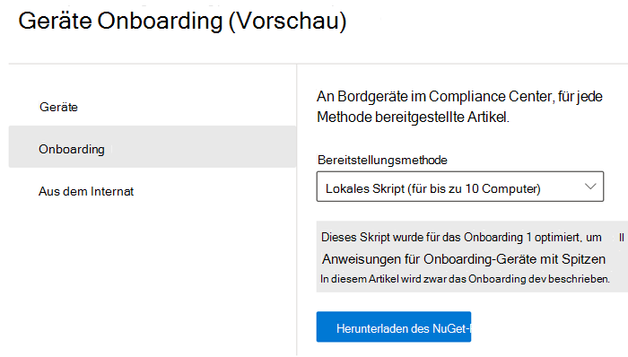
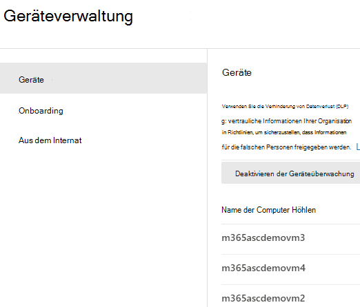
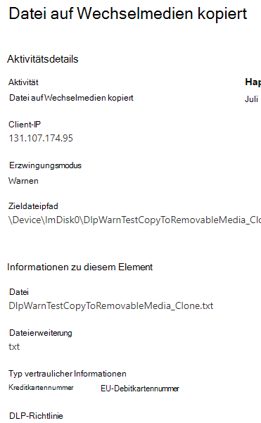

# Informationen zu Microsoft 365 Endpunkt-DLP (Data Loss Prevention, Verhinderung von Datenverlust)Learn about Microsoft 365 Endpoint data loss prevention

Sie können Microsoft 365 Data Loss Prevention (DLP) verwenden, um Ihre Maßnahmen für vertrauliche Objekte zu überwachen und um die unbeabsichtigte gemeinsame Nutzung dieser Objekte zu verhindern. Mehr Informationen zu DLP finden Sie unter [Überblick über DLP](data-loss-prevention-policies.md).You can use Microsoft 365 data loss prevention (DLP) to monitor the actions that are being taken on items you've determined to be sensitive and to help prevent the unintentional sharing of those items. For more information on DLP, see [Overview of data loss prevention](data-loss-prevention-policies.md).

**Verhinderung von Datenverlust** (Endpunkt-DLP) erweitert die Aktivitätsüberwachungs- und Schutzfunktionen von DLP auf vertrauliche Objekte, die sich auf Windows 10-Geräten befinden. Sobald die Geräte in die Microsoft 365 Compliance-Lösungen integriert sind, werden die Informationen darüber, was Benutzer mit vertraulichen Objekten tun, im [Aktivitäts-Explorer](data-classification-activity-explorer.md) sichtbar. Sie können Schutzmaßnahmen für diese Objekte über [DLP-Richtlinien](create-test-tune-dlp-policy.md) durchsetzen.**Endpoint data loss prevention** (Endpoint DLP) extends the activity monitoring and protection capabilities of DLP to sensitive items that are on Windows 10 devices. Once devices are onboarded into the Microsoft 365 compliance solutions, the information about what users are doing with sensitive items is made visible in [activity explorer](data-classification-activity-explorer.md) and you can enforce protective actions on those items via [DLP policies](create-test-tune-dlp-policy.md).

## Endpunktaktivitäten, die Sie überwachen und für die Sie Maßnahmen festlegen könnenEndpoint activities you can monitor and take action on

Mit Microsoft Endpunkt-DLP können Sie folgende Arten von Aktivitäten prüfen und verwalten, die Benutzer auf Windows 10-Geräten ausführen. Dazu gehören:Microsoft Endpoint DLP enables you to audit and manage the following types of activities users take on sensitive items on devices running Windows 10. This includes:

|Aktivität am Elementactivity on item |überwachbar/einschränkbarauditable/restrictable  |
|---------|---------|
|erstelltcreated    | überwachbarauditable      |
|umbenanntrenamed    |  überwachbarauditable       |
|auf Wechselmedium kopiert oder erstelltcopied to or created on removable media     |     überwachbar und einschränkbarauditable and restrictable|
|in Netzwerkfreigabe kopiert, z. B. \\my-server\filesharecopied to network share, e.g. \\my-server\fileshare   |     überwachbar und einschränkbarauditable and restrictable    |
|gedrucktprinted |    überwachbar und einschränkbarauditable and restrictable       |
|über Chromium Edge in die Cloud kopiertcopied to cloud via Chromium Edge    |   überwachbar und einschränkbarauditable and restrictable        |
|Zugriff über nicht zulässige Apps und Browseraccessed by unallowed apps and browsers    |  überwachbar und einschränkbarauditable and restrictable       |

## Was ist bei Endpunkt-DLP anders?What's different in Endpoint DLP

Es gibt ein paar zusätzliche Konzepte, die Sie kennen sollten, bevor Sie sich mit Endpunkt-DLP befassen.There are a few extra concepts that you need to be aware of before you dig into Endpoint DLP.

### Geräteverwaltung aktivierenEnabling Device management

Bei der Geräteverwaltung handelt es sich um die Funktionalität, die das Erfassen von Telemetriedaten von Geräten ermöglicht und sie in Microsoft 365 Compliance-Lösungen wie Endpunkt-DLP und [Insider-Risikomanagement](insider-risk-management.md) überträgt. Sie müssen alle Geräte, die Sie als Speicherorte in DLP-Richtlinien verwenden möchten, einbinden.Device management is the functionality that enables the collection of telemetry from devices and brings it into Microsoft 365 compliance solutions like Endpoint DLP and [Insider Risk management](insider-risk-management.md). You'll need to onboard all devices you want to use as locations in DLP policies.

> [!div class="mx-imgBorder"]
> 

Onboarding und Offboarding werden über Skripte abgewickelt, die Sie vom Geräteverwaltungszentrum herunterladen. Das Zentrum verfügt über benutzerdefinierte Skripte für jede dieser Bereitstellungsmethoden:Onboarding and offboarding are handled via scripts you download from the Device management center. The center has custom scripts for each of these deployment methods:

- lokales Skript (bis zu 10 Computer)local script (up to 10 machines)
- GruppenrichtlinieGroup policy
- System Center Konfigurationsmanager (Version 1610 oder höher)System Center Configuration Manager (version 1610 or later)
- Verwaltung mobiler Geräte/Microsoft IntuneMobile Device Management/Microsoft Intune
- VDI-Onboarding-Skripts für nicht persistente ComputerVDI onboarding scripts for non-persistent machines

> [!div class="mx-imgBorder"]
> 

 Wenden Sie für das Onboarding eines Geräts die unter [Erste Schritte mit Microsoft 365 Endpunkt-DLP](endpoint-dlp-getting-started.md) beschriebene Vorgehensweise an.Use the procedures in [Getting started with Microsoft 365 Endpoint DLP](endpoint-dlp-getting-started.md) to onboard devices.

Wenn das Onboarding eines Geräts über [Microsoft Defender für Endpunkt](https://docs.microsoft.com/windows/security/threat-protection/) erfolgt ist, werden diese Geräte automatisch in der Liste der Geräte angezeigt.If you have onboarded devices through [Microsoft Defender for Endpoint](https://docs.microsoft.com/windows/security/threat-protection/), those devices will automatically show up in the list of devices.

> [!div class="mx-imgBorder"]
> 

### Endpunkt-DLP-Daten anzeigenViewing Endpoint DLP data

 Endpunkt-DLP Endpunkt-DLP überwacht Aktivitäten auf der Grundlage des MIME-Typs, so dass Aktivitäten auch dann erfasst werden, wenn die Dateierweiterung geändert wird. In der öffentlichen Vorschau folgende Dateien überwacht:Endpoint DLP monitors activity-based on MIME type, so activities will be captured even if the file extension is changed. At public preview it watches all:

- Word-DateienWord files
- PowerPoint-DateienPowerPoint files
- Excel-DateienExcel files
- PDF-DateienPDF files
- CSV-Dateien.csv files
- TSV-Dateien.tsv files
- TXT-Dateien.txt files
- RTF-Dateien.rtf files
- C-Dateien.c files
- CLASS-Dateien.class files
- CPP-Dateien.cpp files
- CS-Dateien.cs files
- H-Dateien.h files
- JAVA-Dateien.java files

> [!NOTE]
> Endpunkt-DLP bewertet Dateien der oben genannten Dateitypen anhand der DLP-Richtlinie und wendet die entsprechenden Schutzmaßnahmen an. Alle Dateien, die mit einer DLP-Richtlinie übereinstimmen, werden auf alle unterstützten Aktionen geprüft, auch wenn sie nicht gesperrt sind. Zusätzlich werden alle auf Word-, PowerPoint-, Excel-, PDF- und CSV-Dateien ausgeführte Dateiaktivitäten standardmäßig geprüft, unabhängig davon, ob eine DLP-Richtlinie vorhanden ist oder mit diesen Dateien übereinstimmt.Endpoint DLP evaluates files of all the above types against the DLP policy and applies protection actions accordingly. All files that match a DLP policy are audited for all supported actions, even if they aren't blocked. In addition, file activity performed on any Word, PowerPoint, Excel, PDF, and .csv file is audited by default, independent of whether a DLP policy exists or matches these files.

Sie können Benachrichtigungen anzeigen, die mit auf Endpunktgeräten durchgesetzten DLP-Richtlinien verbunden sind, indem Sie zu [DLP-Benachrichtigungs-Verwaltungsdasboard](dlp-configure-view-alerts-policies.md) wechseln.You can view alerts related to DLP policies enforced on endpoint devices by going to the [DLP Alerts Management Dashboard](dlp-configure-view-alerts-policies.md).

Sie können ebenfalls Details des zugehörigen Ereignisses mit umfangreichen Metadaten im gleichen Dashboard anzeigen.You can also view details of the associated event with rich metadata in the same dashboard

Nach dem Onboarding eines Geräts werden Informationen zu überwachten Aktivitäten an den Aktivitäten-Explorer gesendet, noch bevor Sie DLP-Richtlinien konfigurieren und bereitstellen, die Geräte als Speicherort verwenden.Once a device is onboarded, information about audited activities flows into Activity explorer even before you configure and deploy any DLP policies that have devices as a location.

> [!div class="mx-imgBorder"]
> 

Endpunkt-DLP erfasst umfassende Informationen zu überwachten Aktivitäten.Endpoint DLP collects extensive information on audited activity.

Wenn eine Datei beispielsweise auf einen USB-Wechseldatenträger kopiert wird, werden die folgenden Attribute in den Aktivitätsdetails angezeigt:For example, if a file is copied to removable USB media, you'd see these attributes in the activity details:

- Aktivitätstypactivity type
- Client-IPclient IP
- Zieldateipfadtarget file path
- Ereignis-Zeitstempelhappened timestamp
- Dateinamefile name
- Benutzeruser
- Dateierweiterungfile extension
- Dateigrößefile size
- Typ vertraulicher Information (sofern zutreffend)sensitive information type (if applicable)
- SHA1-Wertsha1 value
- SHA256-Wertsha256 value
- Vorheriger Dateinameprevious file name
- Speicherortlocation
- übergeordnetes Elementparent
- Dateipfadfilepath
- Art des Quellspeicherortssource location type
- Plattformplatform
- Gerätenamedevice name
- Art des Zielspeicherortsdestination location type
- Anwendung, über die die Kopie erstellt wurdeapplication that performed the copy
- Microsoft Defender für Endpunkt-Geräte-ID (sofern zutreffend)Microsoft Defender for Endpoint device ID (if applicable)
- Hersteller des Wechselmediumsremovable media device manufacturer
- Modell des Wechselmediumsremovable media device model
- Seriennummer des Wechselmediumsremovable media device serial number

> [!div class="mx-imgBorder"]
> 

## Nächste SchritteNext steps

Jetzt, da Sie die Basics zu Endpunkt-DLP kennen, sind die nächsten Schritte folgende:Now that you've learned about Endpoint DLP, your next steps are:

1) [Erste Schritte mit Microsoft Endpunkt-DLP (Vorschau)Getting started with Microsoft Endpoint data loss prevention (preview)](endpoint-dlp-getting-started.md)
2) [Nutzung von Microsoft Endpunkt-DLP (Vorschau)Using Microsoft Endpoint data loss prevention (preview)](endpoint-dlp-using.md)

## Siehe auchSee also

- [Erste Schritte mit Microsoft Endpunkt-DLP (Vorschau)Getting started with Microsoft Endpoint data loss prevention (preview)](endpoint-dlp-getting-started.md)
- [Nutzung von Microsoft Endpunkt-DLP (Vorschau)Using Microsoft Endpoint data loss prevention (preview)](endpoint-dlp-using.md)
- [Verhinderung von Datenverlust – ÜbersichtOverview of data loss prevention](data-loss-prevention-policies.md)
- [Erstellen, Testen und Optimieren einer DLP-RichtlinieCreate, test, and tune a DLP policy](create-test-tune-dlp-policy.md)
- [Erste Schritte mit dem Aktivitäten-ExplorerGet started with Activity explorer](data-classification-activity-explorer.md)
- [Microsoft Defender für EndpunktMicrosoft Defender for Endpoint](https://docs.microsoft.com/windows/security/threat-protection/)
- [Insider-RisikomanagementInsider Risk management](insider-risk-management.md)
