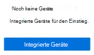

# Informationen zu Microsoft 365 Endpunkt-DLP (Data Loss Prevention, Verhinderung von Datenverlust)Learn about Microsoft 365 Endpoint data loss prevention

Sie können Microsoft 365-DLP (Data Loss Prevention, Verhinderung von Datenverlust) verwenden, um die Aktionen zu überwachen, die an Elementen ausgeführt werden, die Sie als vertraulich eingestuft haben, und um die unbeabsichtigte Freigabe dieser Elemente zu verhindern.You can use Microsoft 365 data loss prevention (DLP) to monitor the actions that are being taken on items you've determined to be sensitive and to help prevent the unintentional sharing of those items. Weitere Informationen zu DLP finden Sie unter [Informationen zur Verhinderung von Datenverlust](dlp-learn-about-dlp.md).For more information on DLP, see [Learn about data loss prevention](dlp-learn-about-dlp.md).

**Verhinderung von Datenverlust am Endpunkt** (Endpunkt-DLP) erweitert die Aktivitätsüberwachung und die Schutzfunktionen von DLP auf sensible Elemente auf Windows 10-Geräten.**Endpoint data loss prevention** (Endpoint DLP) extends the activity monitoring and protection capabilities of DLP to sensitive items that are on Windows 10 devices. Sobald Geräte in den Microsoft 365 Compliance-Lösungen eingebunden wurden, werden die Informationen zu den Aktionen, die Benutzer mit und an vertraulichen Elementen ausführen, im [Aktivitäten-Explorer](data-classification-activity-explorer.md) angezeigt, und Sie können Schutzmaßnahmen für diese Elemente über [DLP-Richtlinien](create-test-tune-dlp-policy.md) erzwingen.Once devices are onboarded into the Microsoft 365 compliance solutions, the information about what users are doing with sensitive items is made visible in [activity explorer](data-classification-activity-explorer.md) and you can enforce protective actions on those items via [DLP policies](create-test-tune-dlp-policy.md).

## Endpunktaktivitäten, die Sie überwachen und für die Sie Maßnahmen festlegen könnenEndpoint activities you can monitor and take action on

Mit Microsoft Endpunkt-DLP können Sie die folgenden Aktivitätstypen überwachen und verwalten, die von Benutzern mit und an vertraulichen Elementen auf Windows 10-Geräten ausgeführt werden.Microsoft Endpoint DLP enables you to audit and manage the following types of activities users take on sensitive items on devices running Windows 10. 

|AktivitätActivity |BeschreibungDescription  | Überwachbar/einschränkbarAuditable/restictable|
|---------|---------|---------|
|In einen Clouddienst hochladen oder über nicht zugelassene Browser zugreifenupload to cloud service, or access by unallowed browsers    | Erkennt, wenn ein Benutzer versucht, ein Element in eine eingeschränkte Dienstdomäne hochzuladen oder über einen Browser auf ein Element zuzugreifen.Detects when a user attempts to upload an item to a restricted service domain or access an item through a browser.  Wird ein Browser verwendet, der im DLP als nicht zugelassener Browser aufgeführt ist, wird die Uploadaktivität blockiert, und der Benutzer wird umgeleitet, um Edge Chromium zu verwenden.If they are using a browser that is listed in DLP as an being an unallowed browser, the upload activity will be blocked and the user is redirected to use Edge Chromium. Edge Chromium kann dann, basierend auf der DLP-Richtlinienkonfiguration, entweder den Upload erlauben oder blockieren oder auf das Element zugreifen.Edge Chromium will then either allow or block the upload or access based on the DLP policy configuration         |überwachbar und einschränkbarauditable and restrictable|
|In andere App kopierencopy to other app    |Erkennt, wenn ein Benutzer versucht, Informationen aus einem geschützten Element zu kopieren und in eine andere App, einen Prozess oder ein Element einzufügen.Detects when a user attempts to copy information from a protected item and then paste it into another app, process or item. Das Kopieren und Einfügen von Informationen innerhalb derselben App, desselben Prozesses oder desselben Elements wird von dieser Aktivität nicht erkannt.Copying and pasting information within the same app, process, or item is not detected by this activity.         | überwachbar und einschränkbarauditable and restrictable|
|Auf USB-Wechseldatenträger kopierencopy to USB removable media |Erkennt, wenn ein Benutzer versucht, ein Element oder Informationen auf einen Wechseldatenträger oder ein USB-Gerät zu kopieren.Detects when a user attempts to copy an item or information to removable media or USB device.         | überwachbar und einschränkbarauditable and restrictable|
|Auf eine Netzwerkfreigabe kopierencopy to a network share    |Erkennt, wenn ein Benutzer versucht, ein Element auf eine Netzwerkfreigabe oder ein zugeordnetes Netzlaufwerk zu kopieren.Detects when a user attempts to copy an item to a network share or mapped network drive         |überwachbar und einschränkbarauditable and restrictable|
|Dokument druckenprint a document    |Erkennt, wenn ein Benutzer versucht, ein geschütztes Element auf einem lokalen oder Netzwerkdrucker zu drucken.Detects when a user attempts to print a protected item to a local or network printer.| überwachbar und einschränkbarauditable and restrictable         |
|In eine Remotesitzung kopierencopy to a remote session|Erkennt, wenn ein Benutzer versucht, ein Element in eine Remote-Desktop-Sitzung zu kopierenDetects when a user attempts to copy an item to a remote desktop session |  überwachbar und einschränkbarauditable and restrictable|
|Auf ein Bluetooth-Gerät kopierencopy to a Bluetooth device|Erkennt, wenn ein Benutzer versucht, ein Element in eine nicht zugelassene Bluetooth-App zu kopieren (wie in der Liste der nicht zugelassenen Bluetooth-Apps in den Endpunkt DLP-Einstellungen definiert).Detects when a user attempts to copy an item to an unallowed Bluetooth app (as defined in the list of unallowed Bluetooth aps in Endpoint DLP settings).| überwachbar und einschränkbarauditable and restrictable|
|Element erstellencreate an item|Erkennt, wenn ein Benutzer ein Element erstellt.Detects when a user creates an item| überwachbarauditable|
|Element umbenennenrename an item|Erkennt, wenn ein Benutzer ein Element umbenennt.Detects when a user renames an item| überwachbarauditable|

 ## Überwachte DateienMonitored files

Endpunkt-DLP unterstützt die Überwachung dieser Dateitypen:Endpoint DLP supports monitoring of these file types:

- Word-DateienWord files
- PowerPoint-DateienPowerPoint files
- Excel-DateienExcel files
- PDF-DateienPDF files
- CSV-Dateien.csv files
- TSV-Dateien.tsv files
- TXT-Dateien.txt files
- RTF-Dateien.rtf files
- C-Dateien.c files
- CLASS-Dateien.class files
- CPP-Dateien.cpp files
- CS-Dateien.cs files
- H-Dateien.h files
- JAVA-Dateien.java files
 
Standardmäßig überwacht Endpunkt-DLP die Aktivitäten für diese Dateitypen, auch wenn keine Richtlinienübereinstimmung vorliegt.By default, endpoint DLP audits the activities for these file types, even if there isn't a policy match. Wenn Sie nur Daten aus Richtlinienübereinstimmungen überwachen möchten, können Sie **Dateiaktivität für Geräte immer überwachen** in den globalen Endpunkt-DLP-Einstellungen deaktivieren.If you only want monitoring data from policy matches, you can turn off the **Always audit file activity for devices** in the endpoint DLP global settings. Wenn diese Einstellung aktiviert ist, werden alle Aktivitäten für Word-, PowerPoint-, Excel-, PDF- und CSV-Dateien immer überwacht, auch wenn das Gerät von keiner Richtlinie betroffen ist.If this setting is on, activities on any Word, PowerPoint, Excel, PDF, and .csv file are always audited even if the device is not targeted by any policy.

Verhinderung von Datenverlust am Endpunkt (Endpunkt-DLP) überwacht Aktivitäten basierend auf dem MIME-Typ, sodass sie auch dann erfasst werden, wenn die Dateierweiterung geändert wurde.Endpoint DLP monitors activity-based on MIME type, so activities will be captured even if the file extension is changed. 

## Was ist bei Endpunkt-DLP anders?What's different in Endpoint DLP

Es gibt ein paar zusätzliche Konzepte, die Sie kennen sollten, bevor Sie sich mit Endpunkt-DLP befassen.There are a few extra concepts that you need to be aware of before you dig into Endpoint DLP.

### Aktivieren der GeräteverwaltungEnabling Device management

Bei der Geräteverwaltung handelt es sich um die Funktionalität, die das Erfassen von Telemetriedaten von Geräten ermöglicht und sie in Microsoft 365-Compliance-Lösungen wie Endpunkt-DLP und [Insider-Risikomanagement](insider-risk-management.md) überträgt.Device management is the functionality that enables the collection of telemetry from devices and brings it into Microsoft 365 compliance solutions like Endpoint DLP and [Insider Risk management](insider-risk-management.md). Sie müssen alle Geräte, die Sie als Speicherorte in DLP-Richtlinien verwenden möchten, einbinden.You'll need to onboard all devices you want to use as locations in DLP policies.

> [!div class="mx-imgBorder"]
> 

Onboarding und Offboarding werden über Skripts verarbeitet, die Sie über das Center zur Geräteverwaltung herunterladen können.Onboarding and offboarding are handled via scripts you download from the Device management center. Im Center sind benutzerdefinierte Skripts für jede der folgenden Bereitstellungsmethoden verfügbar:The center has custom scripts for each of these deployment methods:

- lokales Skript (bis zu 10 Computer)local script (up to 10 machines)
- GruppenrichtlinieGroup policy
- System Center Konfigurationsmanager (Version 1610 oder höher)System Center Configuration Manager (version 1610 or later)
- Verwaltung mobiler Geräte/Microsoft IntuneMobile Device Management/Microsoft Intune
- VDI-Onboarding-Skripts für nicht persistente ComputerVDI onboarding scripts for non-persistent machines

> [!div class="mx-imgBorder"]
> 

 Wenden Sie für das Geräte-Onboarding die unter [Erste Schritte mit Microsoft 365 Endpunkt-DLP-](endpoint-dlp-getting-started.md) beschriebene Vorgehensweise an.Use the procedures in [Getting started with Microsoft 365 Endpoint DLP](endpoint-dlp-getting-started.md) to onboard devices.

Wenn das Onboarding eines Geräts über [Microsoft Defender für Endpunkt](/windows/security/threat-protection/) erfolgt ist, werden diese Geräte automatisch in der Liste der Geräte angezeigt.If you have onboarded devices through [Microsoft Defender for Endpoint](/windows/security/threat-protection/), those devices will automatically show up in the list of devices.

> [!div class="mx-imgBorder"]
> 

### Anzeigen von Endpunkt-DLP-DatenViewing Endpoint DLP data

Sie können Benachrichtigungen anzeigen, die mit auf Endpunktgeräten durchgesetzten DLP-Richtlinien verbunden sind, indem Sie zum [Verwaltungsdasboard „DLP-Benachrichtigungen“](dlp-configure-view-alerts-policies.md) wechseln.You can view alerts related to DLP policies enforced on endpoint devices by going to the [DLP Alerts Management Dashboard](dlp-configure-view-alerts-policies.md).

> [!div class="mx-imgBorder"]
> 

Sie können ebenfalls Details des zugehörigen Ereignisses mit umfangreichen Metadaten im gleichen Dashboard anzeigen.You can also view details of the associated event with rich metadata in the same dashboard

> [!div class="mx-imgBorder"]
> 

Nach dem Onboarding eines Geräts werden Informationen zu überwachten Aktivitäten an den Aktivitäten-Explorer gesendet, noch bevor Sie DLP-Richtlinien konfigurieren und bereitstellen, die Geräte als Speicherort verwenden.Once a device is onboarded, information about audited activities flows into Activity explorer even before you configure and deploy any DLP policies that have devices as a location.

> [!div class="mx-imgBorder"]
> 

Endpunkt-DLP erfasst umfassende Informationen zu überwachten Aktivitäten.Endpoint DLP collects extensive information on audited activity.

Wenn eine Datei beispielsweise auf einen USB-Wechseldatenträger kopiert wird, werden die folgenden Attribute in den Aktivitätsdetails angezeigt:For example, if a file is copied to removable USB media, you'd see these attributes in the activity details:

- Aktivitätstypactivity type
- Client-IPclient IP
- Zieldateipfadtarget file path
- Ereignis-Zeitstempelhappened timestamp
- Dateinamefile name
- Benutzeruser
- Dateierweiterungfile extension
- Dateigrößefile size
- Typ vertraulicher Information (sofern zutreffend)sensitive information type (if applicable)
- SHA1-Wertsha1 value
- SHA256-Wertsha256 value
- Vorheriger Dateinameprevious file name
- Speicherortlocation
- übergeordnetes Elementparent
- Dateipfadfilepath
- Art des Quellspeicherortssource location type
- Plattformplatform
- Gerätenamedevice name
- Art des Zielspeicherortsdestination location type
- Anwendung, über die die Kopie erstellt wurdeapplication that performed the copy
- Microsoft Defender für Endpunkt-Geräte-ID (sofern zutreffend)Microsoft Defender for Endpoint device ID (if applicable)
- Hersteller des Wechselmediumsremovable media device manufacturer
- Modell des Wechselmediumsremovable media device model
- Seriennummer des Wechselmediumsremovable media device serial number

> [!div class="mx-imgBorder"]
> 

## Nächste SchritteNext steps

Jetzt, da Sie die Basics zu Endpunkt-DLP kennen, sind die nächsten Schritte folgende:Now that you've learned about Endpoint DLP, your next steps are:

1) [Erste Schritte mit Microsoft Endpunkt-DLP Getting started with Microsoft Endpoint data loss prevention ](endpoint-dlp-getting-started.md)
2) [Nutzung von Microsoft Endpunkt-DLP Using Microsoft Endpoint data loss prevention](endpoint-dlp-using.md)

## Siehe auchSee also

- [Erste Schritte mit Microsoft Endpunkt-DLPGetting started with Microsoft Endpoint data loss prevention](endpoint-dlp-getting-started.md)
- [Nutzung von Microsoft Endpunkt-DLP Using Microsoft Endpoint data loss prevention](endpoint-dlp-using.md)
- [Informationen zur Verhinderung von DatenverlustLearn about data loss prevention](dlp-learn-about-dlp.md)
- [Erstellen, Testen und Optimieren einer DLP-RichtlinieCreate, test, and tune a DLP policy](create-test-tune-dlp-policy.md)
- [Erste Schritte mit dem Aktivitäten-ExplorerGet started with Activity explorer](data-classification-activity-explorer.md)
- [Microsoft Defender für EndpunktMicrosoft Defender for Endpoint](/windows/security/threat-protection/)
- [Insider-RisikomanagementInsider Risk management](insider-risk-management.md)