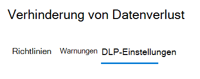
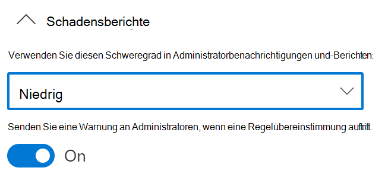
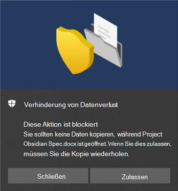

# Nutzung von Endpunkt-DLP (Vorschau)

In diesem Artikel werden drei Szenarien beschrieben, in denen Sie eine DLP-Richtlinie erstellen und ändern, die Geräte als Speicherort verwendet.

## DLP-Einstellungen

Bevor Sie beginnen, sollten Sie die DLP-Einstellungen festlegen, die auf alle DLP-Richtlinien für Geräte angewendet werden. Diese müssen konfiguriert werden, wenn Sie beabsichtigen, Richtlinien zu erstellen, die Folgendes erzwingen:

- Einschränkungen des Cloud-Ausgangs
- Beschränkungen für nicht zulässige Apps

Oder

- Wenn Sie „verrauschte“ Dateipfade von der Überwachung ausschließen möchten

  > [!div class="mx-imgBorder"]
  > 

### Ausschluss von Dateipfaden

Es empfiehlt sich, bestimmte Pfade von der DLP-Überwachung, -Benachrichtigung und -Richtlinienerzwingung auf Ihren Geräten auszuschließen, wenn sie zu verrauscht sind oder keine Dateien enthalten, die Sie interessieren. Dateien an diesen Speicherorten werden nicht überwacht, und solche, die an diesen Speicherorten erstellt oder geändert werden, unterliegen nicht der DLP-Richtlinienerzwingung. In den DLP-Einstellungen können Sie Pfadausschlüsse konfigurieren.

Sie können diese Logik verwenden, um Ihre Pfadausschlüsse zu erstellen:

- Gültiger Dateipfad, der mit "\" endet, was für Dateien nur unmittelbar in dem Ordner steht.  Beispiel: C:\Temp\

- Gültiger Dateipfad, der mit "\*" endet, was für Dateien nur in Unterordnern zusätzlich zu den Dateien unmittelbar in dem Ordner steht.  Beispiel: C:\Temp\*

- Gültiger Dateipfad, der ohne "\" oder "\*" endet, was alle Dateien unmittelbar in dem Ordner und allen Unterordnern bedeutet.  Beispiel: C:\Temp

- Ein Pfad mit Platzhalter zwischen "\" von jeder Seite.  Beispiel: C:\Users\*\Desktop\

- Ein Pfad mit Platzhalter zwischen "\" von jeder Seite und mit "(number)", um die genaue Anzahl von Unterordnern anzugeben.  Beispiel: C:\Users\*(1) \Downloads\

- Ein Pfad mit SYSTEM-Umgebungsvariablen.  Beispiel: %SystemDrive%\Test\*

- Eine Kombination aus allen vorstehenden Optionen.  Beispiel: %SystemDrive%\Users\*\Documents\*(2)\Sub\

### Dienstdomänen

Sie können dieser Liste Domänen hinzufügen, auf die Edge Chromium beim Durchsetzen der von einer Endpunkt-DLP-Richtlinie festgelegten Einschränkung des Cloud-Uploadzugriffs zurückgreifen wird. 

Wenn der Listenmodus auf **Blockieren** festgelegt ist, können Benutzer keine vertraulichen Elemente in diese Domänen hochladen. Wenn eine Upload-Aktion blockiert wird, weil ein Element von einer DLP-Richtlinie betroffen ist, generiert DLP entweder eine Warnung oder sperrt den Upload des vertraulichen Elements.

Wenn der Listenmodus auf **Zulassen** festgelegt ist, können Benutzer vertrauliche Elemente * *_nur_* _ in diese Domänen hochladen, während der Upload-Zugriff auf alle anderen Domänen nicht zulässig ist.

### Nicht zulässige Apps

Wenn die Einstellung _ *Zugriff durch nicht zulässige Apps und Browser* * einer Richtlinie aktiviert ist und Benutzer versuchen, solche Apps für den Zugriff auf eine geschützte Datei zu verwenden, wird die Aktivität zugelassen, blockiert oder blockiert, aber die Benutzer können die Einschränkung außer Kraft setzen. Alle Aktivitäten werden überwacht und können im Aktivitäten-Explorer überprüft werden.

### Nicht zulässige Browser

Sie können Browser hinzufügen, die anhand ihrer ausführbaren Namen identifiziert werden und am Zugriff auf Dateien gehindert werden, die den Bedingungen einer erzwungenen DLP-Richtlinie entsprechen, bei denen die Einschränkung von Clouddienst-Uploads auf „Blockieren“ oder „Blockieren/außer Kraft setzen“ festgelegt ist. Wenn diese Browser am Zugriff auf eine Datei gehindert werden, wird den Endbenutzern eine Popupbenachrichtigung angezeigt, in der sie aufgefordert werden, die Datei über Edge Chromium zu öffnen.

[!IMPORTANT]
Sie enthalten nicht den Pfad zu der ausführbaren Datei, sondern nur den ausführbaren Namen (d. h. browser.exe).

## DLP-Einstellungen kombinieren

Mithilfe von Endpunkt-DLP und des Edge Chromium-Webbrowsers können Sie die unbeabsichtigte Freigabe von vertraulichen Elementen für nicht zulässige Cloud-Apps und -Dienste einschränken. Edge Chromium erkennt, wenn für ein Element eine Einschränkung aufgrund einer Endpunkt-DLP-Richtlinie gilt, und erzwingt entsprechende Zugriffsbeschränkungen.

Bei Verwendung von Endpunkt-DLP als Speicherort in einer entsprechend konfigurierten DLP-Richtlinie und des Edge Chromium-Browsers, werden die nicht zugelassenen Browser, die Sie in diesen Einstellungen definiert haben, am Zugriff auf vertrauliche Elemente gehindert, die Ihren DLP-Richtlinienvorgaben entsprechen. Stattdessen werden Benutzer zur Verwendung von Edge Chromium umgeleitet, und dieser kann aufgrund von DLP-Restriktionen Aktivitäten blockieren oder einschränken, wenn die Bedingungen in der DLP-Richtlinie erfüllt sind.

Um diese Einschränkung nutzen zu können, müssen Sie drei wichtige Elemente konfigurieren:

1. Angabe der Speicherorte – Dienste, Domänen und IP-Adressen –, aus denen keine vertraulichen Elemente freigegeben werden sollen.

2. Hinzufügen der Browser, die nicht berechtigt sind, auf bestimmte vertrauliche Elemente zuzugreifen, wenn eine DLP-Richtlinienübereinstimmung gegeben ist.

3. Konfigurieren von DLP-Richtlinien, um die Arten von vertraulichen Elementen zu definieren, für die Uploads auf diese Orte beschränkt werden sollen, indem Sie **Zu Clouddiensten hochladen** und **Zugriff durch nicht zulässige Browser** aktivieren.

Sie können weitere neue Dienste, Apps und Richtlinien hinzufügen, um Ihre Beschränkungen zur Erfüllung Ihrer geschäftlichen Anforderungen und zum Schutz vertraulicher Daten auszudehnen und restriktiver zu machen. 

Diese Konfiguration trägt dazu bei, sicherzustellen, dass Ihre Daten geschützt bleiben, zugleich werden unnötige Beschränkungen vermieden, die Benutzer am Zugriff auf und Freigeben von nicht vertraulichen Elementen hindern oder dies einschränken.

## Szenarien für Endpunkt-DLP-Richtlinien

Damit Sie sich mit Endpunkt-DLP-Features und deren Wirkungsweise in DLP-Richtlinien vertraut machen können, haben wir einige Szenarien für Sie zur Übung zusammengestellt. Sämtliche Endpunkt-DLP-Inhalte werden in den Haupt-DLP-Inhalt einbezogen, sobald Endpunkt-DLP allgemein verfügbar sein wird.

> [!IMPORTANT]
> Diese Endpunkt-DLP-Szenarien stellen nicht die offiziellen Verfahren zum Erstellen und Optimieren von DLP-Richtlinien dar. In den folgenden Beiträgen finden Sie Informationen zum Arbeiten mit DLP-Richtlinien in Situationen allgemeiner Art:
>- [Verhinderung von Datenverlust – Übersicht](data-loss-prevention-policies.md)
>- [Erste Schritte mit der standardmäßigen DLP-Richtlinie](get-started-with-the-default-dlp-policy.md)
>- [Erstellen einer DLP-Richtlinie aus einer Vorlage](create-a-dlp-policy-from-a-template.md)
>- [Erstellen, Testen und Optimieren einer DLP-Richtlinie](create-test-tune-dlp-policy.md)

### Szenario 1: Erstellen einer Richtlinie aus einer Vorlage, nur überwachen

Bei diesen Szenarien ist es erforderlich, dass Sie bereits über Geräte verfügen, die in den Aktivitäten-Explorer eingebunden sind und für die Berichte erstellt werden. Wenn Sie noch keine Geräte eingebunden haben, lesen Sie [Endpunkt-DLP (Vorschau) – Erste Schritte](endpoint-dlp-getting-started.md).

1. Öffnen Sie die Seite [Verhinderung von Datenverlust](https://compliance.microsoft.com/datalossprevention?viewid=policies).

2. Wählen Sie **Richtlinie erstellen (Vorschau)** aus.

3. Wählen Sie für dieses Szenario **Datenschutz** , dann **USA – Daten mit personenbezogenen Informationen (PII)** und schließlich **Weiter** aus.

4. Setzen Sie das Feld **Status** für alle Orte außer **Geräte** auf "Aus". Wählen Sie **Weiter** aus.

5. Übernehmen Sie die Standardauswahl **Einstellungen in der Vorlage überprüfen und anpassen** Auswahl, und wählen Sie **Weiter** aus.

6. Übernehmen Sie die standardmäßigen Werte für **Schutzmaßnahmen** , und wählen Sie **Weiter** aus.

7. Wählen Sie **Aktivitäten auf Windows-Geräten überwachen oder einschränken** aus, und lassen Sie die Aktionen auf **Nur Überwachung** festgelegt. Wählen Sie **Weiter** aus.

8. Übernehmen Sie den standardmäßigen Wert **Ich möchte sie zuerst testen** und wählen Sie **Richtlinientipps im Testmodus anzeigen** aus. Wählen Sie **Weiter** aus.

9. Überprüfen Sie Ihre Einstellungen, und wählen Sie dann **Senden** aus.

10. Die neue DLP-Richtlinie wird nun in der Richtlinienliste angezeigt.

11. Überprüfen Sie den Aktivitäten-Explorer auf Daten aus den überwachten Endpunkten. Legen Sie den Speicherortfilter für Geräte fest, fügen Sie die Richtlinie hinzu, und filtern Sie anschließend nach dem Richtliniennamen, um festzustellen, welche Auswirkungen diese Richtlinie hat. Lesen Sie bei Bedarf [Erste Schritte mit dem Aktivitäten-Explorer](data-classification-activity-explorer.md).

12. Versuchen Sie, für jemanden außerhalb Ihrer Organisation einen Test mit Inhalten freizugeben, durch die Bedingung "USA – Daten mit persönlich identifizierbaren Informationen (PII)" ausgelöst wird. Hierdurch müsste die Richtlinie ausgelöst werden.

13. Überprüfen Sie den Aktivitäten-Explorer auf das Ereignis hin.

### Szenario 2: Ändern der bestehenden Richtlinie, Festlegen einer Warnung

1. Öffnen Sie die Seite [Verhinderung von Datenverlust](https://compliance.microsoft.com/datalossprevention?viewid=policies).

2. Wählen Sie die in Szenario 1 erstellte Richtlinie **USA – Daten mit persönlich identifizierbaren Informationen (PII)** aus.

3. Wählen Sie **Richtlinie bearbeiten (Vorschau)** aus.

4. Wechseln Sie zur Seite **Erweiterte DLP-Regeln** , und bearbeiten Sie **Geringe Menge an Inhalten erkannt. USA – persönlich identifizierbare Informationen** .

5. Scrollen Sie nach unten zum Abschnitt **Vorfallberichte** , und legen Sie **Benachrichtigung an Administratoren senden, wenn es eine Regelübereinstimmung gibt** auf **Ein** fest. Es werden automatisch E-Mail-Benachrichtigungen an den Administrator und alle anderen Personen gesendet, die Sie der Empfängerliste hinzufügen. 

   > [!div class="mx-imgBorder"]
   > 
   
6. Wählen Sie im Rahmen dieses Szenarios **Benachrichtigung jedes Mal senden, wenn eine Aktivität der Regel entspricht** aus.

7. Wählen Sie **Speichern** aus.

8. Speichern Sie alle vorgenommenen Einstellungen, indem Sie **Weiter** und dann **Senden** der Richtlinienänderungen auswählen.

9. Versuchen Sie, für jemanden außerhalb Ihrer Organisation einen Test mit Inhalten freizugeben, durch die Bedingung "USA – Daten mit persönlich identifizierbaren Informationen (PII)" ausgelöst wird. Hierdurch müsste die Richtlinie ausgelöst werden.

10. Überprüfen Sie den Aktivitäten-Explorer auf das Ereignis hin.

### Szenario 3: Ändern der bestehenden Richtlinie, Blockieren der Aktion mit erlaubter Außerkraftsetzung

1. Öffnen Sie die Seite [Verhinderung von Datenverlust](https://compliance.microsoft.com/datalossprevention?viewid=policies).

2. Wählen Sie die in Szenario 1 erstellte Richtlinie **USA – Daten mit persönlich identifizierbaren Informationen (PII)** aus.

3. Wählen Sie **Richtlinie bearbeiten (Vorschau)** aus.

4. Wechseln Sie zur Seite **Erweiterte DLP-Regeln** , und bearbeiten Sie **Geringe Menge an Inhalten erkannt. USA – persönlich identifizierbare Informationen** .

5. Scrollen Sie nach unten zum Abschnitt **Aktivitäten auf Windows-Geräten überwachen oder einschränken** , und legen Sie für jede Aktivität die entsprechende Aktion auf **Blockieren mit Außerkraftsetzung** fest.

   > [!div class="mx-imgBorder"]
   > 
   
6. Wählen Sie **Speichern** aus.

7. Wiederholen Sie die Schritte 4-7 für **Große Menge an Inhalten erkannt. USA – persönlich identifizierbare Informationen** .

8. Speichern Sie alle vorgenommenen Einstellungen, indem Sie **Weiter** und dann **Senden** der Richtlinienänderungen auswählen.

9. Versuchen Sie, für jemanden außerhalb Ihrer Organisation einen Test mit Inhalten freizugeben, durch die Bedingung "USA – Daten mit persönlich identifizierbaren Informationen (PII)" ausgelöst wird. Hierdurch müsste die Richtlinie ausgelöst werden.

   Auf dem Clientgerät wird ein Popup wie das folgende angezeigt:

   > [!div class="mx-imgBorder"]
   > 

10. Überprüfen Sie den Aktivitäten-Explorer auf das Ereignis hin.

## Siehe auch

- [Informationen zu Endpunkt-DLP (Vorschau)](endpoint-dlp-learn-about.md)
- [Endpunkt-DLP (Vorschau) – Erste Schritte](endpoint-dlp-getting-started.md)
- [Verhinderung von Datenverlust – Übersicht](data-loss-prevention-policies.md)
- [Erstellen, Testen und Optimieren einer DLP-Richtlinie](create-test-tune-dlp-policy.md)
- [Erste Schritte mit dem Aktivitäten-Explorer](data-classification-activity-explorer.md)
- [Microsoft Defender Advanced Threat Protection (Microsoft Defender ATP)](https://docs.microsoft.com/windows/security/threat-protection/)
- [Onboarding-Tools und -Methoden für Windows 10-Computer](https://docs.microsoft.com/windows/security/threat-protection/microsoft-defender-atp/configure-endpoints)
- [Microsoft 365-Abonnement](https://www.microsoft.com/microsoft-365/compare-microsoft-365-enterprise-plans?rtc=1)
- [Azure Active Directory (AAD) Einbindung](https://docs.microsoft.com/azure/active-directory/devices/concept-azure-ad-join)
- [Herunterladen des auf Chromium basierenden neuen Microsoft Edge](https://support.microsoft.com/help/4501095/download-the-new-microsoft-edge-based-on-chromium)
- [Erste Schritte mit der standardmäßigen DLP-Richtlinie](get-started-with-the-default-dlp-policy.md)
- [Erstellen einer DLP-Richtlinie aus einer Vorlage](create-a-dlp-policy-from-a-template.md)
