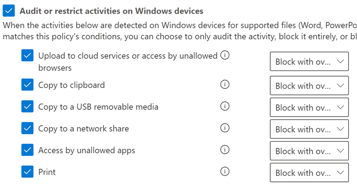

# Nutzen der Verhinderung von Datenverlust am EndpunktUsing Endpoint data loss prevention

In diesem Artikel werden drei Szenarien beschrieben, in denen Sie eine DLP-Richtlinie erstellen und ändern, die Geräte als Speicherort verwendet.This article walks you through three scenarios where you create and modify a DLP policy that uses devices as a location.

## DLP-EinstellungenDLP settings

Bevor Sie beginnen, sollten Sie die DLP-Einstellungen festlegen, die auf alle DLP-Richtlinien für Geräte angewendet werden.Before you get started you should set up your DLP settings which are applied to all DLP policies for devices. Diese müssen konfiguriert werden, wenn Sie beabsichtigen, Richtlinien zu erstellen, die Folgendes erzwingen:You must configure these if you intend to create policies that enforce:

- Einschränkungen des Cloud-Ausgangscloud egress restrictions
- Beschränkungen für nicht zulässige Appsunallowed apps restrictions

OderOr

- Wenn Sie „verrauschte“ Dateipfade von der Überwachung ausschließen möchtenIf you want to exclude noisy file paths from monitoring

  > [!div class="mx-imgBorder"]
  > 

### Ausschluss von DateipfadenFile path exclusions

Es empfiehlt sich, bestimmte Pfade von der DLP-Überwachung, -Benachrichtigung und -Richtlinienerzwingung auf Ihren Geräten auszuschließen, wenn sie zu verrauscht sind oder keine Dateien enthalten, die Sie interessieren.You may want to exclude certain paths from DLP monitoring, DLP alerting, and DLP policy enforcement on your devices because they are too noisy or don’t contain files you are interested in. Dateien an diesen Speicherorten werden nicht überwacht, und solche, die an diesen Speicherorten erstellt oder geändert werden, unterliegen nicht der DLP-Richtlinienerzwingung.Files in those locations will not be audited and any files that are created or modified in those locations will not be subject to DLP policy enforcement. In den DLP-Einstellungen können Sie Pfadausschlüsse konfigurieren.You can configure path exclusions in DLP settings.

Sie können diese Logik verwenden, um Ihre Pfadausschlüsse zu erstellen:You can use this logic to construct your exclusion paths:

- Gültiger Dateipfad, der mit "\" endet, was für Dateien nur unmittelbar in dem Ordner steht.Valid file path that ends with ‘\’, which means only files directly under folder.  Beispiel: C:\TempFor example: C:\Temp\

- Gültiger Dateipfad, der mit "\*" endet, was für Dateien nur in Unterordnern zusätzlich zu den Dateien unmittelbar in dem Ordner steht.Valid file path that ends with ‘\*’, which means only files under sub-folders, besides the files directly under the folder.  Beispiel: C:\Temp\*For example: C:\Temp\*

- Gültiger Dateipfad, der ohne "\" oder "\*" endet, was alle Dateien unmittelbar in dem Ordner und allen Unterordnern bedeutet.Valid file path that ends without ‘\’ or ‘\*’, which means all files directly under folder and all sub-folders.  Beispiel: C:\TempFor example: C:\Temp

- Ein Pfad mit Platzhalter zwischen "\" von jeder Seite.A path with wildcard between ‘\’ from each side.  Beispiel: C:\Users\*\DesktopFor example: C:\Users\*\Desktop\

- Ein Pfad mit Platzhalter zwischen "\" von jeder Seite und mit "(number)", um die genaue Anzahl von Unterordnern anzugeben.A path with wildcard between ‘\’ from each side and with ‘(number)’ to give exact number of subfolders.  Beispiel: C:\Users\*(1) \DownloadsFor example: C:\Users\*(1)\Downloads\

- Ein Pfad mit SYSTEM-Umgebungsvariablen.A path with SYSTEM environment variables.  Beispiel: %SystemDrive%\Test\*For example: %SystemDrive%\Test\*

- Eine Kombination aus allen vorstehenden Optionen.A mix of all the above.  Beispiel: %SystemDrive%\Users\*\Documents\*(2)\SubFor example: %SystemDrive%\Users\*\Documents\*(2)\Sub\

### Nicht zulässige AppsUnallowed apps

Wenn die Einstellung **Zugriff durch nicht zulässige Apps und Browser** einer Richtlinie aktiviert ist und Benutzer versuchen, solche Apps für den Zugriff auf eine geschützte Datei zu verwenden, wird die Aktivität zugelassen, blockiert oder blockiert, aber die Benutzer können die Einschränkung außer Kraft setzen.When a policy's **Access by unallowed apps and browsers** setting is turned on and users attempt to use these apps to access a protected file, the activity will be allowed, blocked, or blocked but users can override the restriction. Alle Aktivitäten werden überwacht und können im Aktivitäten-Explorer überprüft werden.All activity is audited and available to review in activity explorer.

> [!IMPORTANT]
> Es wird nicht der Pfad zu der ausführbaren Datei angegeben, sondern nur der ausführbare Name (z. B. „browser.exe“).Do not include the path to the executable, but only the executable name (such as browser.exe).

### Browser- und Domäneneinschränkungen:Browser and domain restrictions
Schränken Sie die Freigabe sensibler Dateien, die Ihren Richtlinien entsprechen, für uneingeschränkte Clouddienstdomänen ein.Restrict sensitive files that match your policies from being shared with unrestricted cloud service domains.

#### DienstdomänenService domains

Sie können steuern, ob sensible Dateien, die durch Ihre Richtlinien geschützt sind, von Microsoft Edge aus in bestimmte Dienstdomänen hochgeladen werden können.You can control whether sensitive files protected by your policies can be uploaded to specific service domains from Microsoft Edge.

Wenn der Listenmodus auf **Blockieren** festgelegt ist, können Benutzer keine vertraulichen Elemente in diese Domänen hochladen.If the list mode is set to **Block**, then user will not be able to upload sensitive items to those domains. Wenn eine Upload-Aktion blockiert wird, weil ein Element von einer DLP-Richtlinie betroffen ist, generiert DLP entweder eine Warnung oder sperrt den Upload des vertraulichen Elements.When an upload action is blocked because an item matches a DLP policy, DLP will either generate a warning or block the upload of the sensitive item.

Wenn der Listenmodus auf **Zulassen** festgelegt ist, können Benutzer vertrauliche Elemente **_nur_** in diese Domänen hochladen, während der Uploadzugriff auf alle anderen Domänen nicht zulässig ist.If the list mode is set to **Allow**, then users will be able to upload sensitive items **_only_** to those domains, and upload access to all other domains is not allowed.

> [!IMPORTANT]
> Wenn der Diensteinschränkungsmodus auf „Zulassen“ festgelegt ist, müssen Sie über mindestens eine Dienstdomäne verfügen, die konfiguriert wurde, bevor die Einschränkungen erzwungen werden.When the service restriction mode is set to "Allow", you must have at least one service domain configured before restrictions are enforced.

#### Nicht zulässige BrowserUnallowed browsers

Sie können Browser hinzufügen, die anhand ihrer ausführbaren Namen identifiziert werden und am Zugriff auf Dateien gehindert werden, die den Bedingungen einer erzwungenen DLP-Richtlinie entsprechen, bei denen die Einschränkung von Clouddienst-Uploads auf „Blockieren“ oder „Blockieren/außer Kraft setzen“ festgelegt ist.You add browsers, identified by their executable names, that will be blocked from accessing files that match the conditions of an enforced a DLP policy where the upload to cloud services restriction is set to block or block override. Wenn diese Browser am Zugriff auf eine Datei gehindert werden, wird den Endbenutzern eine Popupbenachrichtigung angezeigt, in der sie aufgefordert werden, die Datei über Edge Chromium zu öffnen.When these browsers are blocked from accessing a file, the end users will see a toast notification asking them to open the file through Edge Chromium.

### Geschäftliche Begründung in RichtlinientippsBusiness justification in policy tips

Sie können mit den Optionen für die geschäftliche Begründung in den DLP-Richtlinientipp-Benachrichtigung steuern, wie Benutzer interagieren.You can control how users interact with the business justification option in DLP policy tip notifications. Diese Option erscheint, wenn ein Benutzer eine Aktivität durchführt, die durch die Einstellung **Sperren mit Überschreiben** in einer DLP-Richtlinie geschützt ist.This option appears when users perform an activity that's protected by the **Block with override** setting in a DLP policy. Sie können eine der folgenden Optionen auswählen:You can choose from one the following options:

- Standardmäßig kann der Benutzer entweder eine integrierte Begründung auswählen oder seinen eigenen Text eingeben.By default, users can select either a built-in justification, or enter their own text.
- Benutzer können nur eine integrierte Begründung auswählen.Users can only select a built-in justification.
- Benutzer können nur ihre eigene Begründung eingeben.Users can only enter their own justification.

## DLP-Einstellungen kombinierenTying DLP settings together

Mithilfe von Endpunkt-DLP und des Edge Chromium-Webbrowsers können Sie die unbeabsichtigte Freigabe von vertraulichen Elementen für nicht zulässige Cloud-Apps und -Dienste einschränken.With Endpoint DLP and Edge Chromium Web browser, you can restrict unintentional sharing of sensitive items to unallowed cloud apps and services. Edge Chromium erkennt, wenn für ein Element eine Einschränkung aufgrund einer Endpunkt-DLP-Richtlinie gilt, und erzwingt entsprechende Zugriffsbeschränkungen.Edge Chromium understands when an item is restricted by an Endpoint DLP policy and enforces access restrictions.

Bei Verwendung von Endpunkt-DLP als Speicherort in einer entsprechend konfigurierten DLP-Richtlinie und des Edge Chromium-Browsers, werden die nicht zugelassenen Browser, die Sie in diesen Einstellungen definiert haben, am Zugriff auf vertrauliche Elemente gehindert, die Ihren DLP-Richtlinienvorgaben entsprechen.When you use Endpoint DLP as a location in a properly configured DLP policy and the Edge Chromium browser, the unallowed browsers that you've defined in these settings will be prevented from accessing the sensitive items that match your DLP policy controls. Stattdessen werden Benutzer zur Verwendung von Edge Chromium umgeleitet, und dieser kann aufgrund von DLP-Restriktionen Aktivitäten blockieren oder einschränken, wenn die Bedingungen in der DLP-Richtlinie erfüllt sind.Instead, users will be redirected to use Edge Chromium and Edge Chromium, with its understanding of DLP imposed restrictions, can block or restrict activities when the conditions in the DLP policy are met.

Um diese Einschränkung nutzen zu können, müssen Sie drei wichtige Elemente konfigurieren:To use this restriction you’ll need to configure three important pieces:

1. Angabe der Speicherorte – Dienste, Domänen und IP-Adressen –, aus denen keine vertraulichen Elemente freigegeben werden sollen.Specify the places – services, domains, IP addresses – that you want to prevent sensitive items from being shared to.

2. Hinzufügen der Browser, die nicht berechtigt sind, auf bestimmte vertrauliche Elemente zuzugreifen, wenn eine DLP-Richtlinienübereinstimmung gegeben ist.Add the browsers that aren’t allowed to access certain sensitive items when a DLP policy match occurs.

3. Konfigurieren von DLP-Richtlinien, um die Arten von vertraulichen Elementen zu definieren, für die Uploads auf diese Orte beschränkt werden sollen, indem Sie **Zu Clouddiensten hochladen** und **Zugriff durch nicht zulässige Browser** aktivieren.Configure DLP policies to define the kinds of sensitive items for which upload should be restricted to these places by turning on **Upload to cloud services** and **Access from unallowed browser**.

Sie können weitere neue Dienste, Apps und Richtlinien hinzufügen, um Ihre Beschränkungen zur Erfüllung Ihrer geschäftlichen Anforderungen und zum Schutz vertraulicher Daten auszudehnen und restriktiver zu machen.You can continue to add new services, apps, and policies to extend and augment your restrictions to meet your business needs and protect sensitive data. 

Diese Konfiguration trägt dazu bei, sicherzustellen, dass Ihre Daten geschützt bleiben, zugleich werden unnötige Beschränkungen vermieden, die Benutzer am Zugriff auf und Freigeben von nicht vertraulichen Elementen hindern oder dies einschränken.This configuration will help ensure your data remains safe while also avoiding unnecessary restrictions that prevent or restrict users from accessing and sharing non-sensitive items.

## Szenarien für Endpunkt-DLP-RichtlinienEndpoint DLP policy scenarios

Damit Sie sich mit Endpunkt-DLP-Features und deren Wirkungsweise in DLP-Richtlinien vertraut machen können, haben wir einige Szenarien für Sie zur Übung zusammengestellt.To help familiarize you with Endpoint DLP features and how they surface in DLP policies, we've put together some scenarios for you to follow.

> [!IMPORTANT]
> Diese Endpunkt-DLP-Szenarien stellen nicht die offiziellen Verfahren zum Erstellen und Optimieren von DLP-Richtlinien dar.These Endpoint DLP scenarios are not the official procedures for creating and tuning DLP policies. In den folgenden Beiträgen finden Sie Informationen zum Arbeiten mit DLP-Richtlinien in Situationen allgemeiner Art:Refer to the below topics when you need to work with DLP policies in general situations:

>- [Informationen zur Verhinderung von DatenverlustLearn about data loss prevention](dlp-learn-about-dlp.md)
>- [Erste Schritte mit der standardmäßigen DLP-RichtlinieGet started with the default DLP policy](get-started-with-the-default-dlp-policy.md)
>- [Erstellen einer DLP-Richtlinie aus einer VorlageCreate a DLP policy from a template](create-a-dlp-policy-from-a-template.md)
>- [Erstellen, Testen und Optimieren einer DLP-RichtlinieCreate, test, and tune a DLP policy](create-test-tune-dlp-policy.md)

### Szenario 1: Erstellen einer Richtlinie aus einer Vorlage, nur überwachenScenario 1: Create a policy from a template, audit only

Bei diesen Szenarien ist es erforderlich, dass Sie bereits über Geräte verfügen, die in den Aktivitäten-Explorer eingebunden sind und für die Berichte erstellt werden.These scenarios require that you already have devices onboarded and reporting into Activity explorer. Wenn Sie noch keine Geräte eingebunden haben, lesen Sie [Endpunkt-DLP – Erste Schritte](endpoint-dlp-getting-started.md).If you haven't onboarded devices yet, see [Get started with Endpoint data loss prevention](endpoint-dlp-getting-started.md).

1. Öffnen Sie die Seite [Verhinderung von Datenverlust](https://compliance.microsoft.com/datalossprevention?viewid=policies).Open the [Data loss prevention page](https://compliance.microsoft.com/datalossprevention?viewid=policies).

2. Wählen Sie **Richtlinie erstellen** aus.Choose **Create policy**.

3. Wählen Sie für dieses Szenario **Datenschutz**, dann **USA – Daten mit personenbezogenen Informationen (PII)** und schließlich **Weiter** aus.For this scenario, choose **Privacy**, then **U.S. Personally Identifiable Information (PII) Data** and choose **Next**.

4. Setzen Sie das Feld **Status** für alle Orte außer **Geräte** auf "Aus".Toggle the **Status** field to off for all locations except **Devices**. Wählen Sie **Weiter** aus.Choose **Next**.

5. Übernehmen Sie die Standardauswahl **Einstellungen in der Vorlage überprüfen und anpassen** Auswahl, und wählen Sie **Weiter** aus.Accept the default **Review and customize settings from the template** selection and choose **Next**.

6. Übernehmen Sie die standardmäßigen Werte für **Schutzmaßnahmen**, und wählen Sie **Weiter** aus.Accept the default **Protection actions** values and choose **Next**.

7. Wählen Sie **Aktivitäten auf Windows-Geräten überwachen oder einschränken** aus, und lassen Sie die Aktionen auf **Nur Überwachung** festgelegt.Select **Audit or restrict activities on Windows devices** and leave the actions set to **Audit only**. Wählen Sie **Weiter** aus.Choose **Next**.

8. Übernehmen Sie den standardmäßigen Wert **Ich möchte sie zuerst testen** und wählen Sie **Richtlinientipps im Testmodus anzeigen** aus.Accept the default **I'd like to test it out first** value and choose **Show policy tips while in test mode**. Wählen Sie **Weiter** aus.Choose **Next**.

9. Überprüfen Sie Ihre Einstellungen, und wählen Sie dann **Senden** aus.Review your settings and choose **Submit**.

10. Die neue DLP-Richtlinie wird nun in der Richtlinienliste angezeigt.The new DLP policy will appear in the policy list.

11. Überprüfen Sie den Aktivitäten-Explorer auf Daten aus den überwachten Endpunkten.Check Activity explorer for data from the monitored endpoints. Legen Sie den Speicherortfilter für Geräte fest, fügen Sie die Richtlinie hinzu, und filtern Sie anschließend nach dem Richtliniennamen, um festzustellen, welche Auswirkungen diese Richtlinie hat.Set the location filter for devices and add the policy, then filter by policy name to see the impact of this policy. Lesen Sie bei Bedarf [Erste Schritte mit dem Aktivitäten-Explorer](data-classification-activity-explorer.md).See, [Get started with activity explorer](data-classification-activity-explorer.md) if needed.

12. Versuchen Sie, für jemanden außerhalb Ihrer Organisation einen Test mit Inhalten freizugeben, durch die Bedingung "USA – Daten mit persönlich identifizierbaren Informationen (PII)" ausgelöst wird.Attempt to share a test that contains content that will trigger the U.S. Personally Identifiable Information (PII) Data condition with someone outside your organization. Hierdurch müsste die Richtlinie ausgelöst werden.This should trigger the policy.

13. Überprüfen Sie den Aktivitäten-Explorer auf das Ereignis hin.Check Activity explorer for the event.

### Szenario 2: Ändern der bestehenden Richtlinie, Festlegen einer WarnungScenario 2: Modify the existing policy, set an alert

1. Öffnen Sie die Seite [Verhinderung von Datenverlust](https://compliance.microsoft.com/datalossprevention?viewid=policies).Open the [Data loss prevention page](https://compliance.microsoft.com/datalossprevention?viewid=policies).

2. Wählen Sie die in Szenario 1 erstellte Richtlinie **USA – Daten mit persönlich identifizierbaren Informationen (PII)** aus.Choose the **U.S. Personally Identifiable Information (PII) Data** policy that you created in scenario 1.

3. Wählen Sie **Richtlinie bearbeiten** aus.Choose **edit policy**.

4. Wechseln Sie zur Seite **Erweiterte DLP-Regeln**, und bearbeiten Sie **Geringe Menge an Inhalten erkannt. USA: Personenbezogene Informationen**.Go to the **Advanced DLP rules** page and edit the **Low volume of content detected U.S. Personally Identifiable Inf**.

5. Scrollen Sie nach unten zum Abschnitt **Vorfallberichte**, und legen Sie **Benachrichtigung an Administratoren senden, wenn es eine Regelübereinstimmung gibt** auf **Ein** fest.Scroll down to the **Incident reports** section and set **Send an alert to admins when a rule match occurs** to **On**. Es werden automatisch E-Mail-Benachrichtigungen an den Administrator und alle anderen Personen gesendet, die Sie der Empfängerliste hinzufügen.Email alerts will be automatically sent to the administrator and anyone else you add to the list of recipients. 

   > [!div class="mx-imgBorder"]
   > 
   
6. Wählen Sie im Rahmen dieses Szenarios **Benachrichtigung jedes Mal senden, wenn eine Aktivität der Regel entspricht** aus.For the purposes of this scenario, choose **Send alert every time an activity matches the rule**.

7. Wählen Sie **Speichern** aus.Choose **Save**.

8. Speichern Sie alle vorgenommenen Einstellungen, indem Sie **Weiter** und dann **Senden** der Richtlinienänderungen auswählen.Retain all your previous settings by choosing **Next** and then **Submit** the policy changes.

9. Versuchen Sie, für jemanden außerhalb Ihrer Organisation einen Test mit Inhalten freizugeben, durch die Bedingung "USA – Daten mit persönlich identifizierbaren Informationen (PII)" ausgelöst wird.Attempt to share a test that contains content that will trigger the U.S. Personally Identifiable Information (PII) Data condition with someone outside your organization. Hierdurch müsste die Richtlinie ausgelöst werden.This should trigger the policy.

10. Überprüfen Sie den Aktivitäten-Explorer auf das Ereignis hin.Check Activity explorer for the event.

### Szenario 3: Ändern der bestehenden Richtlinie, Blockieren der Aktion mit erlaubter AußerkraftsetzungScenario 3: Modify the existing policy, block the action with allow override

1. Öffnen Sie die Seite [Verhinderung von Datenverlust](https://compliance.microsoft.com/datalossprevention?viewid=policies).Open the [Data loss prevention page](https://compliance.microsoft.com/datalossprevention?viewid=policies).

2. Wählen Sie die in Szenario 1 erstellte Richtlinie **USA – Daten mit persönlich identifizierbaren Informationen (PII)** aus.Choose the **U.S. Personally Identifiable Information (PII) Data** policy that you created in scenario 1.

3. Wählen Sie **Richtlinie bearbeiten** aus.Choose **edit policy**.

4. Wechseln Sie zur Seite **Erweiterte DLP-Regeln**, und bearbeiten Sie **Geringe Menge an Inhalten erkannt. USA: Personenbezogene Informationen**.Go to the **Advanced DLP rules** page and edit the **Low volume of content detected U.S. Personally Identifiable Inf**.

5. Scrollen Sie nach unten zum Abschnitt **Aktivitäten auf Windows-Geräten überwachen oder einschränken**, und legen Sie für jede Aktivität die entsprechende Aktion auf **Blockieren mit Außerkraftsetzung** fest.Scroll down to the **Audit or restrict activities on Windows device** section and for each activity set the corresponding action to  **Block with override**.

   > [!div class="mx-imgBorder"]
   > 
   
6. Wählen Sie **Speichern** aus.Choose **Save**.

7. Wiederholen Sie die Schritte 4-7 für **Große Menge an Inhalten erkannt. USA – persönlich identifizierbare Informationen**.Repeat steps 4-7 for the **High volume of content detected U.S. Personally Identifiable Inf**.

8. Speichern Sie alle vorgenommenen Einstellungen, indem Sie **Weiter** und dann **Senden** der Richtlinienänderungen auswählen.Retain all your previous settings by choosing **Next** and then **Submit** the policy changes.

9. Versuchen Sie, für jemanden außerhalb Ihrer Organisation einen Test mit Inhalten freizugeben, durch die Bedingung "USA – Daten mit persönlich identifizierbaren Informationen (PII)" ausgelöst wird.Attempt to share a test that contains content that will trigger the U.S. Personally Identifiable Information (PII) Data condition with someone outside your organization. Hierdurch müsste die Richtlinie ausgelöst werden.This should trigger the policy.

   Auf dem Clientgerät wird ein Popup wie das folgende angezeigt:You'll see a popup like this on the client device:

   > [!div class="mx-imgBorder"]
   > 

10. Überprüfen Sie den Aktivitäten-Explorer auf das Ereignis hin.Check Activity explorer for the event.

## Siehe auchSee also

- [Informationen zu Endpunkt-DLPLearn about Endpoint data loss prevention](endpoint-dlp-learn-about.md)
- [Endpunkt-DLP – Erste SchritteGet started with Endpoint data loss prevention](endpoint-dlp-getting-started.md)
- [Informationen zur Verhinderung von DatenverlustLearn about data loss prevention](dlp-learn-about-dlp.md)
- [Erstellen, Testen und Optimieren einer DLP-RichtlinieCreate, test, and tune a DLP policy](create-test-tune-dlp-policy.md)
- [Erste Schritte mit dem Aktivitäten-ExplorerGet started with Activity explorer](data-classification-activity-explorer.md)
- [Microsoft Defender für EndpunktMicrosoft Defender for Endpoint](/windows/security/threat-protection/)
- [Onboarding-Tools und -Methoden für Windows 10-ComputerOnboarding tools and methods for Windows 10 machines](/windows/security/threat-protection/microsoft-defender-atp/configure-endpoints)
- [Microsoft 365-AbonnementMicrosoft 365 subscription](https://www.microsoft.com/microsoft-365/compare-microsoft-365-enterprise-plans?rtc=1)
- [Azure Active Directory (AAD) EinbindungAzure Active Directory (AAD) joined](/azure/active-directory/devices/concept-azure-ad-join)
- [Herunterladen des auf Chromium basierenden neuen Microsoft EdgeDownload the new Microsoft Edge based on Chromium](https://support.microsoft.com/help/4501095/download-the-new-microsoft-edge-based-on-chromium)
- [Erste Schritte mit der standardmäßigen DLP-RichtlinieGet started with the default DLP policy](get-started-with-the-default-dlp-policy.md)
- [Erstellen einer DLP-Richtlinie aus einer VorlageCreate a DLP policy from a template](create-a-dlp-policy-from-a-template.md)