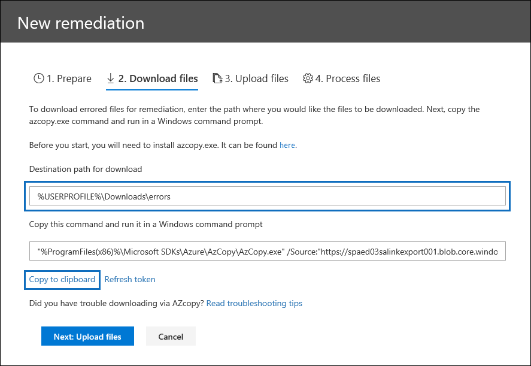

# Beheben von Fehlern beim Verarbeiten von Daten

Durch die Fehlerkorrektur können eDiscovery-Administratoren Daten Probleme beheben, die verhindern, dass Advanced eDiscovery die Inhalte ordnungsgemäß verarbeitet. Beispielsweise können Dateien, die kennwortgeschützt sind, nicht verarbeitet werden, da die Dateien gesperrt oder verschlüsselt sind. Mithilfe der Fehlerbehebung können eDiscovery-Administratoren Dateien mit solchen Fehlern herunterladen, den Kennwortschutz entfernen und dann die korrigierten Dateien hochladen.

Verwenden Sie den folgenden Workflow, um Dateien mit Fehlern in erweiterten eDiscovery-Fällen zu beheben.

## Erstellen einer Fehlerkorrektur Sitzung zum Beheben von Dateien mit Verarbeitungsfehlern

>[!NOTE]
>Wenn der Fehlerkorrektur-Assistent während des folgenden Verfahrens zu einem beliebigen Zeitpunkt geschlossen wird, können Sie auf der Registerkarte **Verarbeitung** zur Fehlerbehebungssitzung zurückkehren, indem Sie im Dropdownmenü **Ansicht** die Option **Korrekturen** auswählen.

1. Wählen Sie auf der Registerkarte **Verarbeitung** im erweiterten eDiscovery-Fall im Dropdown **Menü Ansicht** die Option **Fehler** aus, und wählen Sie dann im Dropdownmenü **Bereich** einen Überprüfungs Satz oder den gesamten Fall aus. In diesem Abschnitt werden alle Fehler aus dem Fall oder Fehler aus einem bestimmten Überprüfungs Satz angezeigt.

   

2. Wählen Sie die Fehler aus, die Sie korrigieren möchten, indem Sie auf das Optionsfeld neben dem Fehlertyp oder-Dateityp klicken.  Im folgenden Beispiel werden wir eine kennwortgeschützte Datei remediationieren.

3. Klicken Sie auf **neue Fehlerkorrektur**.

    Der Fehlerkorrektur-Workflow beginnt mit einer Vorbereitungsphase, in der die Dateien mit Fehlern in einen von Microsoft bereitgestellten Azure-Speicherort kopiert werden, damit Sie Sie auf den lokalen Computer herunterladen können, um Sie zu beheben.

    

4. Nachdem die Vorbereitung abgeschlossen ist, klicken Sie auf **Weiter: Dateien herunterladen** , um den Download fortzusetzen.

    

5. Geben Sie zum Herunterladen von Dateien den **Ziel Pfad für den Download**an. Dies ist ein Pfad zum übergeordneten Ordner auf dem lokalen Computer, auf dem die Datei heruntergeladen wird.  Der Standardpfad,%USERPROFILE%\Downloads\errors, verweist auf den Ordner "Downloads" des angemeldeten Benutzers. Sie können diesen Pfad bei Bedarf ändern. Wenn Sie es ändern, wird empfohlen, einen lokalen Dateipfad für die beste Leistung zu verwenden. Verwenden Sie keinen Remotenetzwerk Pfad. Sie können beispielsweise den Pfad **C:\Remediation**verwenden. 

   Der Pfad zum übergeordneten Ordner wird automatisch dem AzCopy-Befehl (als Wert des **/dest** -Parameters) hinzugefügt.

6. Kopieren Sie den vordefinierten Befehl **, indem Sie auf in Zwischenablage kopieren**klicken. Öffnen Sie eine Windows-Eingabeaufforderung, fügen Sie den AzCopy-Befehl ein, und drücken Sie dann die **Eingabe**Taste.  

        

    > [!NOTE]
    > Sie müssen AzCopy v 8.1 verwenden, um den Befehl erfolgreich zu verwenden, der auf der Seite zum **Herunterladen von Dateien** bereitgestellt wird. Sie müssen auch AzCopy v 8.1 verwenden, um die Dateien in Schritt 10 hochzuladen. Informationen zum Installieren dieser Version von AzCopy finden Sie unter [übertragen von Daten mit der AzCopy v 8.1 unter Windows](https://docs.microsoft.com/previous-versions/azure/storage/storage-use-azcopy). Wenn der angegebene AzCopy-Befehl fehlschlägt, finden Sie weitere Informationen unter [Troubleshoot AzCopy in Advanced eDiscovery](troubleshooting-azcopy.md).

    Die Dateien, die Sie ausgewählt haben, werden an den Speicherort heruntergeladen, den Sie in Schritt 5 angegeben haben. Im übergeordneten Ordner (beispielsweise **C:\Remediation**) wird die folgende Unterordnerstruktur automatisch erstellt:

    `<Parent folder>\Subfolder 1\Subfolder 2\<file>`

    - Unter *Ordner 1* wird mit der ID für den Fall oder der Überprüfungsgruppe benannt, je nach dem Bereich, den Sie in Schritt 1 ausgewählt haben.

    - Unter *Ordner 2* wird mit der Datei-ID der heruntergeladenen Datei benannt.

    - Die heruntergeladene Datei befindet sich im unter *Ordner 2* und ist ebenfalls mit der Datei-ID benannt.

    Im folgenden finden Sie ein Beispiel für den Ordnerpfad und den Namen der Fehler Datei, der erstellt wird, wenn Elemente in den übergeordneten Ordner **C:\Remediation** heruntergeladen werden:

    `C:\Remediation\232f8b7e-089c-4781-88c6-210da0615d32\d1459499146268a096ea20202cd029857d64087706e6d6ca2a224970ae3b8938\d1459499146268a096ea20202cd029857d64087706e6d6ca2a224970ae3b8938.docx`

    Wenn mehrere Dateien heruntergeladen werden, wird jeder in einen Unterordner heruntergeladen, der mit der Datei-ID benannt ist.

    > [!IMPORTANT]
    > Wenn Sie Dateien in Schritt 9 und Schritt 10 hochladen, müssen die korrigierten Dateien denselben Dateinamen aufweisen und sich in derselben Unterordnerstruktur befinden. Der Unterordner und die Dateinamen werden verwendet, um die korrigierte Datei mit der ursprünglichen Fehler Datei zu verknüpfen. Wenn die Ordnerstruktur oder die Dateinamen geändert werden, erhalten Sie den folgenden Fehler: `Cannot apply Error Remediation to the current Workingset`. Um Probleme zu vermeiden, sollten Sie die korrigierten Dateien im gleichen übergeordneten Ordner und Unterordnerstruktur beibehalten.

7. Nachdem Sie die Dateien heruntergeladen haben, können Sie Sie mit einem geeigneten Tool korrigieren. Für kennwortgeschützte Dateien gibt es mehrere Kenn Wort Knack Tools, die Sie verwenden können. Wenn Sie die Kennwörter für die Dateien kennen, können Sie Sie öffnen und den Kennwortschutz entfernen.

8. Kehren Sie zu Advanced eDiscovery und dem Fehlerkorrektur-Assistenten zurück, und klicken Sie dann auf **Weiter: Dateien hochladen**.  Diese wechselt zur nächsten Seite, auf der Sie nun die Dateien hochladen können.

    

9. Geben Sie den übergeordneten Ordner an, in dem sich die korrigierten Dateien im Textfeld **Pfad zum Speicherort der Dateien** befinden. Der übergeordnete Ordner muss wieder dieselbe Unterordnerstruktur aufweisen, die beim Herunterladen der Dateien erstellt wurde.

    Der Pfad zum übergeordneten Ordner wird automatisch dem AzCopy-Befehl (als Wert des **/Source** -Parameters) hinzugefügt.

10. Kopieren Sie den vordefinierten Befehl **, indem Sie auf in Zwischenablage kopieren**klicken. Öffnen Sie eine Windows-Eingabeaufforderung, fügen Sie den AzCopy-Befehl ein, und drücken Sie dann die **Eingabe**Taste. Laden Sie die Dateien hoch.

    

11. Nachdem Sie den AzCopy-Befehl ausgeführt haben, klicken Sie auf **Weiter: Process files**.

    Wenn die Verarbeitung abgeschlossen ist, können Sie zu Überprüfungs Sätzen wechseln und die korrigierten Dateien anzeigen. 

## Remediation von Fehlern in Containerdateien

In Situationen, in denen der Inhalt einer Containerdatei (beispielsweise eine ZIP-Datei) nicht von Advanced eDiscovery extrahiert werden kann, können die Container heruntergeladen und der Inhalt in denselben Ordner erweitert werden, in dem sich der ursprüngliche Container befindet. Die erweiterten Dateien werden dem übergeordneten Container zugeordnet, als wäre sie ursprünglich mit Advanced eDiscovery erweitert worden. Der Vorgang funktioniert wie oben beschrieben, außer beim Hochladen einer einzelnen Datei als Ersatzdatei.  Wenn Sie korrigierte Dateien hochladen, schließen Sie die ursprüngliche Containerdatei nicht ein.

## Beheben von Fehlern durch Hochladen des extrahierten Texts

Manchmal ist es nicht möglich, eine Datei in das systemeigene Format zu korrigieren, das von Advanced eDiscovery interpretiert werden kann. Sie können die Originaldatei jedoch durch eine Textdatei ersetzen, die den ursprünglichen Text der systemeigenen Datei enthält (in einem Prozess namens " *Textüberlagerung*"). Führen Sie dazu die in diesem Artikel beschriebenen Schritte aus, anstatt die ursprüngliche Datei im systemeigenen Format zu korrigieren, würden Sie eine Textdatei erstellen, die den extrahierten Text aus der ursprünglichen Datei enthält, und dann die Textdatei mit dem ursprünglichen Dateinamen hochladen. angefügt mit dem Suffix. txt. Beispielsweise laden Sie eine Datei während der Fehlerbehebung mit dem Dateinamen 335850cc-6602-4af0-ACFA-1d14d9128ca2. ABC herunter. Öffnen Sie die Datei in der systemeigenen Anwendung, kopieren Sie den Text, und fügen Sie ihn in eine neue Datei mit dem Namen 335850cc-6602-4af0-ACFA-1d14d9128ca2. ABC. txt ein. Wenn Sie dies tun, müssen Sie die Originaldatei im systemeigenen Format aus dem Speicherort der bereinigten Datei auf Ihrem lokalen Computer entfernen, bevor Sie die korrigierte Textdatei in "Advanced eDiscovery" hochladen.

## Was geschieht, wenn Dateien behoben werden

Bei hochzuladenden Dateien werden die ursprünglichen Metadaten mit Ausnahme der folgenden Felder beibehalten: 

- ExtractedTextSize
- HasText
- IsErrorRemediate
- Lade-Nr
- ProcessingErrorMessage
- ProcessingStatus
- Text
- WordCount
- WorkingsetId

Eine Definition aller Metadatenfelder in Advanced eDiscovery finden Sie unter [Document Metadata fields](document-metadata-fields.md).
