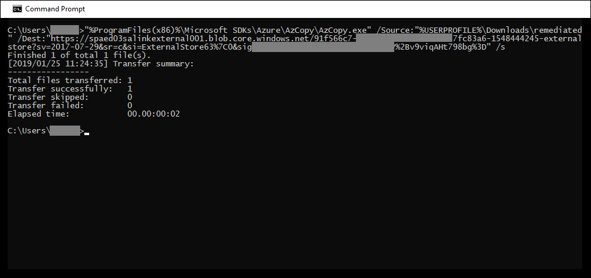

# Beheben von Fehlern beim Verarbeiten von Daten

Fehlerbehebung ermöglicht eDiscovery-Administratoren die Möglichkeit, Datenprobleme zu beheben, die verhindern, dass Advanced eDiscovery den Inhalt ordnungsgemäß verarbeitet. Beispielsweise können kennwortgeschützte Dateien nicht verarbeitet werden, da die Dateien gesperrt oder verschlüsselt sind. Mithilfe der Fehlerbehebung können eDiscovery-Administratoren Dateien mit solchen Fehlern herunterladen, den Kennwortschutz entfernen und dann die behobenen Dateien hochladen.

Verwenden Sie den folgenden Workflow, um Dateien mit Fehlern in Advanced eDiscovery-Fällen zu beheben.

## Erstellen einer Fehlerbehebungssitzung zum Beheben von Dateien mit Verarbeitungsfehlern

>[!NOTE]
>Wenn der Fehlerbehebungs-Assistent während des folgenden Verfahrens jederzeit geschlossen wird, können Sie auf der  Registerkarte Verarbeitung zur  Fehlerbehebungssitzung zurückkehren, indem Sie im Dropdownmenü Ansicht die Option Korrekturen auswählen. 

1. Wählen Sie **auf** der Registerkarte Verarbeitung im Fall Advanced  eDiscovery im Dropdownmenü Ansicht Fehler aus,  und wählen Sie dann im Dropdownmenü Bereich einen Überprüfungssatz oder den gesamten Fall aus.  In diesem Abschnitt werden alle Fehler aus dem Fall oder einem bestimmten Prüfdateisatz angezeigt.

   

2. Wählen Sie die Fehler aus, die Sie beheben möchten, indem Sie auf das Optionsfeld neben dem Fehlertyp oder dateityp klicken.  Im folgenden Beispiel wird eine kennwortgeschützte Datei behoben.

3. Klicken **Sie auf Neue Fehlerbehebung**.

    Der Fehlerbehebungsworkflow beginnt mit einer Vorbereitungsphase, in der die Dateien mit Fehlern an einen von Microsoft bereitgestellten Azure Storage-Speicherort kopiert werden, sodass Sie sie auf Ihren lokalen Computer herunterladen können, um sie zu beheben.

    

4. Klicken Sie nach Abschluss der Vorbereitung auf **Weiter: Dateien herunterladen,** um mit dem Download fortzufahren.

    

5. Geben Sie für den Download von Dateien den **Zielpfad für den Download** an. Dies ist ein Pfad zum übergeordneten Ordner auf Ihrem lokalen Computer, in den die Datei heruntergeladen wird.  Der Standardpfad %USERPROFILE%\Downloads\errors verweist auf den Downloadordner des angemeldeten Benutzers. Sie können diesen Pfad bei Bedarf ändern. Wenn Sie dies ändern, wird empfohlen, einen lokalen Dateipfad für eine optimale Leistung zu verwenden. Verwenden Sie keinen Remotenetzwerkpfad. Sie können z. B. den Pfad **C:\Remediation verwenden.** 

   Der Pfad zum übergeordneten Ordner wird automatisch dem Befehl AzCopy hinzugefügt (als Wert des **Parameters /Dest).**

6. Kopieren Sie den vordefinierten Befehl, indem Sie auf **In Zwischenablage kopieren** klicken. Öffnen Sie eine Windows-Eingabeaufforderung, fügen Sie den Befehl AzCopy ein, und drücken Sie dann die **EINGABETASTE.**  

        

    > [!NOTE]
    > Sie müssen AzCopy v8.1 verwenden, um den Befehl auf der Seite Dateien **herunterladen erfolgreich verwenden zu** können. Sie müssen auch AzCopy v8.1 verwenden, um die Dateien in Schritt 10 hochzuladen. Informationen zur Installation dieser Version von AzCopy finden Sie unter Übertragen von Daten [mit azCopy v8.1 unter Windows](/previous-versions/azure/storage/storage-use-azcopy). Wenn beim angegebenen Befehl AzCopy ein Fehler auftritt, lesen Sie [Troubleshoot AzCopy in Advanced eDiscovery](troubleshooting-azcopy.md).

    Die von Ihnen ausgewählten Dateien werden an den Speicherort heruntergeladen, den Sie in Schritt 5 angegeben haben. Im übergeordneten Ordner (beispielsweise **C:\Remediation**) wird die folgende Unterordnerstruktur automatisch erstellt:

    `<Parent folder>\Subfolder 1\Subfolder 2\<file>`

    - *Subfolder 1* wird abhängig vom Bereich, den Sie in Schritt 1 ausgewählt haben, mit der ID des Falls oder des Prüfdateisatzes benannt.

    - *Subfolder 2* wird mit der Datei-ID der heruntergeladenen Datei benannt.

    - Die heruntergeladene Datei befindet sich in *Subfolder 2* und ist ebenfalls mit der Datei-ID benannt.

    Im Folgenden finden Sie ein Beispiel für den Ordnerpfad und den Fehlerdateinamen, der beim Herunterladen von Elementen in den übergeordneten **Ordner C:\Remediation** erstellt wird:

    `C:\Remediation\232f8b7e-089c-4781-88c6-210da0615d32\d1459499146268a096ea20202cd029857d64087706e6d6ca2a224970ae3b8938\d1459499146268a096ea20202cd029857d64087706e6d6ca2a224970ae3b8938.docx`

    Wenn mehrere Dateien heruntergeladen werden, wird jede datei in einen Unterordner heruntergeladen, der mit der Datei-ID benannt ist.

    > [!IMPORTANT]
    > Wenn Sie Dateien in Schritt 9 und Schritt 10 hochladen, müssen die gelöschten Dateien denselben Dateinamen haben und sich in derselben Unterordnerstruktur befinden. Der Unterordner und die Dateinamen werden verwendet, um die behobene Datei mit der ursprünglichen Fehlerdatei zu verknüpft. Wenn die Ordnerstruktur oder Dateinamen geändert werden, wird der folgende Fehler angezeigt: `Cannot apply Error Remediation to the current Workingset` . Um Probleme zu vermeiden, wird empfohlen, die behobenen Dateien im gleichen übergeordneten Ordner und in derselben Unterordnerstruktur zu speichern.

7. Nachdem Sie die Dateien heruntergeladen haben, können Sie sie mit einem geeigneten Tool wiederherstellen. Für kennwortgeschützte Dateien gibt es mehrere Tools zum Knacken von Kennwörtern, die Sie verwenden können. Wenn Sie die Kennwörter für die Dateien kennen, können Sie sie öffnen und den Kennwortschutz entfernen.

8. Kehren Sie zu Advanced eDiscovery und dem Fehlerbehebungs-Assistenten zurück, und klicken Sie dann auf **Weiter: Dateien hochladen.**  Dadurch gelangen Sie zur nächsten Seite, auf der Sie die Dateien jetzt hochladen können.

    

9. Geben Sie im Textfeld **Pfad zum Speicherort der Dateien** den übergeordneten Ordner an, in dem sich die korrigierten Dateien befinden. Auch hier muss der übergeordnete Ordner die gleiche Unterordnerstruktur haben, die beim Herunterladen der Dateien erstellt wurde.

    Der Pfad zum übergeordneten Ordner wird automatisch dem Befehl AzCopy hinzugefügt (als Wert des **Parameters /Source).**

10. Kopieren Sie den vordefinierten Befehl, indem Sie auf **In Zwischenablage kopieren** klicken. Öffnen Sie eine Windows-Eingabeaufforderung, fügen Sie den Befehl AzCopy ein, und drücken Sie dann die **EINGABETASTE.** Laden Sie die Dateien hoch.

    

11. Klicken Sie nach dem Ausführen des Befehls AzCopy auf **Weiter: Dateien verarbeiten.**

    Nach Abschluss der Verarbeitung können Sie den Satz überprüfen und die behobenen Dateien anzeigen. 

## Beheben von Fehlern in Containerdateien

In Situationen, in denen der Inhalt einer Containerdatei (z. B. eine ZIP-Datei) nicht von Advanced eDiscovery extrahiert werden kann, können die Container heruntergeladen und der Inhalt in denselben Ordner erweitert werden, in dem sich der ursprüngliche Container befindet. Die erweiterten Dateien werden dem übergeordneten Container zugeordnet, als ob er ursprünglich von Advanced eDiscovery erweitert wurde. Der Vorgang funktioniert wie oben beschrieben, mit Ausnahme des Hochladens einer einzelnen Datei als Ersetzungsdatei.  Wenn Sie behobene Dateien hochladen, schließen Sie die ursprüngliche Containerdatei nicht ein.

## Beheben von Fehlern durch Hochladen des extrahierten Texts

Manchmal ist es nicht möglich, eine Datei in ein systemeigenes Format zu konvertieren, das Advanced eDiscovery interpretieren kann. Sie können die ursprüngliche Datei jedoch durch eine Textdatei ersetzen, die den ursprünglichen Text der systemeigenen Datei enthält (in einem Prozess, der als *Textüberlagerung bezeichnet wird).* Führen Sie dazu die in diesem Artikel beschriebenen Schritte aus, aber anstatt die Originaldatei im systemeigenen Format zu sanieren, erstellen Sie eine Textdatei, die den extrahierten Text aus der Originaldatei enthält, und laden sie dann mit dem ursprünglichen Dateinamen hoch, der mit einem TXT-Suffix angefügt ist. Beispielsweise laden Sie eine Datei während der Fehlerbehebung mit dem Dateinamen 335850cc-6602-4af0-acfa-1d14d9128ca2.abc herunter. Öffnen Sie die Datei in der systemeigenen Anwendung, kopieren Sie den Text, und fügen Sie sie dann in eine neue Datei namens 335850cc-6602-4af0-acfa-1d14d9128ca2.abc.txt. Wenn Sie dies tun, müssen Sie die Originaldatei im systemeigenen Format aus dem speicherort der wiederhergestellten Datei auf dem lokalen Computer entfernen, bevor Sie die wiederhergestellte Textdatei in Advanced eDiscovery hochladen.

## Was passiert, wenn Dateien behoben werden?

Wenn benutzerdefinierte Dateien hochgeladen werden, werden die ursprünglichen Metadaten mit Ausnahme der folgenden Felder beibehalten: 

- ExtractedTextSize
- HasText
- IsErrorRemediate
- LoadId
- ProcessingErrorMessage
- ProcessingStatus
- Text
- WordCount
- WorkingsetId

Eine Definition aller Metadatenfelder in Advanced eDiscovery finden Sie unter [Dokumentmetadatenfelder](document-metadata-fields-in-advanced-ediscovery.md).