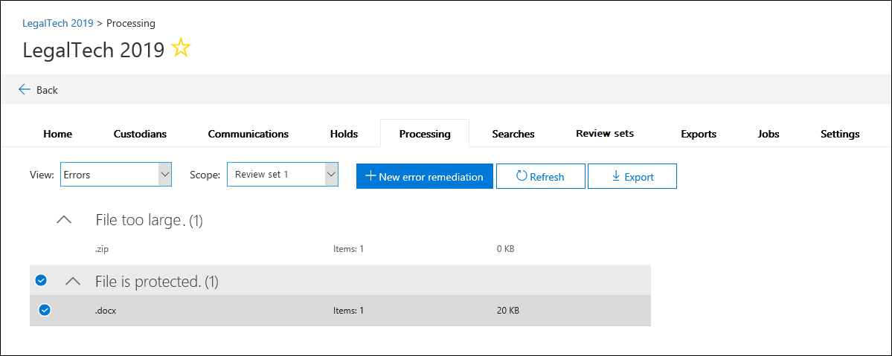

# Beheben von Fehlern beim Verarbeiten von DatenError remediation when processing data

Fehlerbehebung ermöglicht eDiscovery-Administratoren die Möglichkeit, Datenprobleme zu beheben, die verhindern, dass Advanced eDiscovery den Inhalt ordnungsgemäß verarbeitet.Error remediation allows eDiscovery administrators the ability to rectify data issues that prevent Advanced eDiscovery from properly processing the content. Beispielsweise können kennwortgeschützte Dateien nicht verarbeitet werden, da die Dateien gesperrt oder verschlüsselt sind.For example, files that are password protected can't be processed since the files are locked or encrypted. Mithilfe der Fehlerbehebung können eDiscovery-Administratoren Dateien mit solchen Fehlern herunterladen, den Kennwortschutz entfernen und dann die behobenen Dateien hochladen.Using error remediation, eDiscovery administrators can download files with such errors, remove the password protection, and then upload the remediated files.

Verwenden Sie den folgenden Workflow, um Dateien mit Fehlern in Advanced eDiscovery-Fällen zu beheben.Use the following workflow to remediate files with errors in Advanced eDiscovery cases.

## Erstellen einer Fehlerbehebungssitzung zum Beheben von Dateien mit VerarbeitungsfehlernCreate an error remediation session to remediate files with processing errors

>[!NOTE]
>Wenn der Fehlerbehebungs-Assistent während des folgenden Verfahrens jederzeit geschlossen wird, können Sie auf der  Registerkarte Verarbeitung zur  Fehlerbehebungssitzung zurückkehren, indem Sie im Dropdownmenü Ansicht die Option Korrekturen auswählen. If the the error remediation wizard is closed at any time during the following procedure, you can return to the error remediation session from the **Processing** tab by selecting **Remediations** in the **View** drop-down menu.

1. Wählen Sie **auf** der Registerkarte Verarbeitung im Fall Advanced  eDiscovery im Dropdownmenü Ansicht Fehler aus,  und wählen Sie dann im Dropdownmenü Bereich einen Überprüfungssatz oder den gesamten Fall aus. On the **Processing** tab in the Advanced eDiscovery case, select **Errors** in the **View** drop-down menu and then select a review set or the entire case in the **Scope** drop-down menu. In diesem Abschnitt werden alle Fehler aus dem Fall oder einem bestimmten Prüfdateisatz angezeigt.This section displays all errors from the case or error from a specific review set.

   

2. Wählen Sie die Fehler aus, die Sie beheben möchten, indem Sie auf das Optionsfeld neben dem Fehlertyp oder dateityp klicken.Select the errors you want to remediate by clicking the radio button next to either the error type or file type.  Im folgenden Beispiel wird eine kennwortgeschützte Datei behoben.In the following example, we're remediating a password protected file.

3. Klicken **Sie auf Neue Fehlerbehebung**.Click **New error remediation**.

    Der Fehlerbehebungsworkflow beginnt mit einer Vorbereitungsphase, in der die Dateien mit Fehlern an einen von Microsoft bereitgestellten Azure Storage-Speicherort kopiert werden, sodass Sie sie auf Ihren lokalen Computer herunterladen können, um sie zu beheben.The error remediation workflow starts with a preparation stage where the files with errors are copied to a Microsoft-provided Azure Storage location so that you can download them to your local computer to remediate.

    

4. Klicken Sie nach Abschluss der Vorbereitung auf **Weiter: Dateien herunterladen,** um mit dem Download fortzufahren.After the preparation is complete, click **Next: Download files** to proceed with download.

    

5. Geben Sie für den Download von Dateien den **Zielpfad für den Download** an.To download files, specify the **Destination path for download**. Dies ist ein Pfad zum übergeordneten Ordner auf Ihrem lokalen Computer, in den die Datei heruntergeladen wird.This is a path to the parent folder on your local computer where the file will be downloaded.  Der Standardpfad %USERPROFILE%\Downloads\errors verweist auf den Downloadordner des angemeldeten Benutzers.The default path, %USERPROFILE%\Downloads\errors, points to the logged-in user's downloads folder. Sie können diesen Pfad bei Bedarf ändern.You can change this path if desired. Wenn Sie dies ändern, wird empfohlen, einen lokalen Dateipfad für eine optimale Leistung zu verwenden.If you do change it, we recommend that you use a local file path for the best performance. Verwenden Sie keinen Remotenetzwerkpfad.Don't use a remote network path. Sie können z. B. den Pfad **C:\Remediation verwenden.**For example, you could use the path **C:\Remediation**. 

   Der Pfad zum übergeordneten Ordner wird automatisch dem Befehl AzCopy hinzugefügt (als Wert des **Parameters /Dest).**The path to the parent folder is automatically added to AzCopy command (as the value of the **/Dest** parameter).

6. Kopieren Sie den vordefinierten Befehl, indem Sie auf **In Zwischenablage kopieren** klicken.Copy the predefined command by clicking **Copy to clipboard**. Öffnen Sie eine Windows-Eingabeaufforderung, fügen Sie den Befehl AzCopy ein, und drücken Sie dann die **EINGABETASTE.**Open a Windows Command Prompt, paste the AzCopy command, and then press **Enter**.  

        

    > [!NOTE]
    > Sie müssen AzCopy v8.1 verwenden, um den Befehl auf der Seite Dateien **herunterladen erfolgreich verwenden zu** können.You must use AzCopy v8.1 to successfully use the command that's provided on the **Download files** page. Sie müssen auch AzCopy v8.1 verwenden, um die Dateien in Schritt 10 hochzuladen.You also must use AzCopy v8.1 to upload the files in step 10. Informationen zur Installation dieser Version von AzCopy finden Sie unter Übertragen von Daten [mit azCopy v8.1 unter Windows](/previous-versions/azure/storage/storage-use-azcopy).To install this version of AzCopy, see [Transfer data with the AzCopy v8.1 on Windows](/previous-versions/azure/storage/storage-use-azcopy). Wenn beim angegebenen Befehl AzCopy ein Fehler auftritt, lesen Sie [Troubleshoot AzCopy in Advanced eDiscovery](troubleshooting-azcopy.md).If the supplied AzCopy command fails, please see [Troubleshoot AzCopy in Advanced eDiscovery](troubleshooting-azcopy.md).

    Die von Ihnen ausgewählten Dateien werden an den Speicherort heruntergeladen, den Sie in Schritt 5 angegeben haben.The files that you selected are downloaded to the location that you specified in step 5. Im übergeordneten Ordner (beispielsweise **C:\Remediation**) wird die folgende Unterordnerstruktur automatisch erstellt:In the parent folder (for example, **C:\Remediation**), the following subfolder structure is automatically created:

    `<Parent folder>\Subfolder 1\Subfolder 2\<file>`

    - *Subfolder 1* wird abhängig vom Bereich, den Sie in Schritt 1 ausgewählt haben, mit der ID des Falls oder des Prüfdateisatzes benannt.*Subfolder 1* is named with the ID for the case or the review set, depending on the scope that you selected in step 1.

    - *Subfolder 2* wird mit der Datei-ID der heruntergeladenen Datei benannt.*Subfolder 2* is named with the file ID of the downloaded file

    - Die heruntergeladene Datei befindet sich in *Subfolder 2* und ist ebenfalls mit der Datei-ID benannt.The downloaded file is located in *Subfolder 2* and is also named with the file ID.

    Im Folgenden finden Sie ein Beispiel für den Ordnerpfad und den Fehlerdateinamen, der beim Herunterladen von Elementen in den übergeordneten **Ordner C:\Remediation** erstellt wird:Here's an example of the folder path and error file name that's created when items are downloaded to the **C:\Remediation** parent folder:

    `C:\Remediation\232f8b7e-089c-4781-88c6-210da0615d32\d1459499146268a096ea20202cd029857d64087706e6d6ca2a224970ae3b8938\d1459499146268a096ea20202cd029857d64087706e6d6ca2a224970ae3b8938.docx`

    Wenn mehrere Dateien heruntergeladen werden, wird jede datei in einen Unterordner heruntergeladen, der mit der Datei-ID benannt ist.If multiple files are downloaded, each one is downloaded to a subfolder that's named with the file ID.

    > [!IMPORTANT]
    > Wenn Sie Dateien in Schritt 9 und Schritt 10 hochladen, müssen die gelöschten Dateien denselben Dateinamen haben und sich in derselben Unterordnerstruktur befinden.When you upload files in step 9 and step 10, the remediated files must have that same filename and be located in the same subfolder structure. Der Unterordner und die Dateinamen werden verwendet, um die behobene Datei mit der ursprünglichen Fehlerdatei zu verknüpft.The subfolder and file names are used to associated the remediated file with the original error file. Wenn die Ordnerstruktur oder Dateinamen geändert werden, wird der folgende Fehler angezeigt: `Cannot apply Error Remediation to the current Workingset` .If the folder structure or file names are changed, you'll receive the following error: `Cannot apply Error Remediation to the current Workingset`. Um Probleme zu vermeiden, wird empfohlen, die behobenen Dateien im gleichen übergeordneten Ordner und in derselben Unterordnerstruktur zu speichern.To prevent any issues, we recommend that keep the remediated files in the same parent folder and subfolder structure.

7. Nachdem Sie die Dateien heruntergeladen haben, können Sie sie mit einem geeigneten Tool wiederherstellen.After downloading the files, you can remediate them with an appropriate tool. Für kennwortgeschützte Dateien gibt es mehrere Tools zum Knacken von Kennwörtern, die Sie verwenden können.For password-protected files, there are several password cracking tools you can use. Wenn Sie die Kennwörter für die Dateien kennen, können Sie sie öffnen und den Kennwortschutz entfernen.If you know the passwords for the files, you can open them and remove the password protection.

8. Kehren Sie zu Advanced eDiscovery und dem Fehlerbehebungs-Assistenten zurück, und klicken Sie dann auf **Weiter: Dateien hochladen.**Return to Advanced eDiscovery and the error remediation wizard and then click **Next: Upload files**.  Dadurch gelangen Sie zur nächsten Seite, auf der Sie die Dateien jetzt hochladen können.This moves to the next page where you can now upload the files.

    

9. Geben Sie im Textfeld **Pfad zum Speicherort der Dateien** den übergeordneten Ordner an, in dem sich die korrigierten Dateien befinden.Specify the parent folder where the remediated files are located in the **Path to location of files** text box. Auch hier muss der übergeordnete Ordner die gleiche Unterordnerstruktur haben, die beim Herunterladen der Dateien erstellt wurde.Again, the parent folder must have the same subfolder structure that was created when you downloaded the files.

    Der Pfad zum übergeordneten Ordner wird automatisch dem Befehl AzCopy hinzugefügt (als Wert des **Parameters /Source).**The path to the parent folder is automatically added to AzCopy command (as the value of the **/Source** parameter).

10. Kopieren Sie den vordefinierten Befehl, indem Sie auf **In Zwischenablage kopieren** klicken.Copy the predefined command by clicking **Copy to clipboard**. Öffnen Sie eine Windows-Eingabeaufforderung, fügen Sie den Befehl AzCopy ein, und drücken Sie dann die **EINGABETASTE.**Open a Windows Command Prompt, paste the AzCopy command, and then press **Enter**. Laden Sie die Dateien hoch.upload the files.

    

11. Klicken Sie nach dem Ausführen des Befehls AzCopy auf **Weiter: Dateien verarbeiten.**After you run the AzCopy command, click **Next: Process files**.

    Nach Abschluss der Verarbeitung können Sie den Satz überprüfen und die behobenen Dateien anzeigen.When processing is complete, you can go to review set and view the remediated files. 

## Beheben von Fehlern in ContainerdateienRemediating errors in container files

In Situationen, in denen der Inhalt einer Containerdatei (z. B. eine .zip-Datei) nicht von Advanced eDiscovery extrahiert werden kann, können die Container heruntergeladen und der Inhalt in denselben Ordner erweitert werden, in dem sich der ursprüngliche Container befindet.In situations when the contents of a container file (such as a .zip file) can't be extracted by Advanced eDiscovery, the containers can be downloaded and the contents expanded into the same folder in which the original container resides. Die erweiterten Dateien werden dem übergeordneten Container zugeordnet, als ob er ursprünglich von Advanced eDiscovery erweitert wurde.The expanded files will be attributed to the parent container as if it was originally expanded by Advanced eDiscovery. Der Vorgang funktioniert wie oben beschrieben, mit Ausnahme des Hochladens einer einzelnen Datei als Ersetzungsdatei.The process works as described as above except for uploading a single file as the replacement file.  Wenn Sie behobene Dateien hochladen, schließen Sie die ursprüngliche Containerdatei nicht ein.When you upload remediated files, don't include the original container file.

## Beheben von Fehlern durch Hochladen des extrahierten TextsRemediating errors by uploading the extracted text

Manchmal ist es nicht möglich, eine Datei in ein systemeigenes Format zu konvertieren, das Advanced eDiscovery interpretieren kann.Sometimes it's not possible to remediate a file to native format that Advanced eDiscovery can interpret. Sie können die ursprüngliche Datei jedoch durch eine Textdatei ersetzen, die den ursprünglichen Text der systemeigenen Datei enthält (in einem Prozess, der als *Textüberlagerung bezeichnet wird).*But you can replace the original file with a text file that contains the original text of the native file (in a process called *text overlay*). Führen Sie dazu die in diesem Artikel beschriebenen Schritte aus, doch anstatt die Originaldatei im systemeigenen Format zu sanieren, erstellen Sie eine Textdatei, die den extrahierten Text aus der Originaldatei enthält, und laden sie dann mit dem ursprünglichen Dateinamen hoch, der mit einem .txt-Suffix angefügt ist.To do this, follow the steps described in this article but instead of remediating the original file in the native format, you would create a text file that contains the extracted text from the original file, and then upload the text file using the original filename appended with a .txt suffix. Beispielsweise laden Sie eine Datei während der Fehlerbehebung mit dem Dateinamen 335850cc-6602-4af0-acfa-1d14d9128ca2.abc herunter.For example, you download a file during error remediation with the filename 335850cc-6602-4af0-acfa-1d14d9128ca2.abc. Öffnen Sie die Datei in der systemeigenen Anwendung, kopieren Sie den Text, und fügen Sie sie dann in eine neue Datei namens 335850cc-6602-4af0-acfa-1d14d9128ca2.abc.txt.You open the file in the native application, copy the text, and then paste it into a new file named 335850cc-6602-4af0-acfa-1d14d9128ca2.abc.txt. Wenn Sie dies tun, müssen Sie die Originaldatei im systemeigenen Format aus dem speicherort der wiederhergestellten Datei auf dem lokalen Computer entfernen, bevor Sie die wiederhergestellte Textdatei in Advanced eDiscovery hochladen.When you do this, be sure to remove the original file in the native format from the remediated file location on your local computer before uploading the remediated text file to Advanced eDiscovery.

## Was passiert, wenn Dateien behoben werden?What happens when files are remediated

Wenn benutzerdefinierte Dateien hochgeladen werden, werden die ursprünglichen Metadaten mit Ausnahme der folgenden Felder beibehalten:When remediated files are uploaded, the original metadata is preserved except for the following fields: 

- ExtractedTextSizeExtractedTextSize
- HasTextHasText
- IsErrorRemediateIsErrorRemediate
- LoadIdLoadId
- ProcessingErrorMessageProcessingErrorMessage
- ProcessingStatusProcessingStatus
- TextText
- WordCountWordCount
- WorkingsetIdWorkingsetId

Eine Definition aller Metadatenfelder in Advanced eDiscovery finden Sie unter [Dokumentmetadatenfelder](document-metadata-fields-in-advanced-ediscovery.md).For a definition of all metadata fields in Advanced eDiscovery, see [Document metadata fields](document-metadata-fields-in-advanced-ediscovery.md).