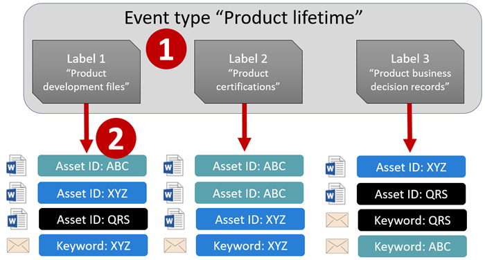
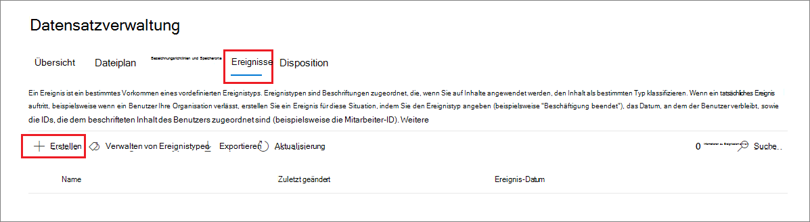
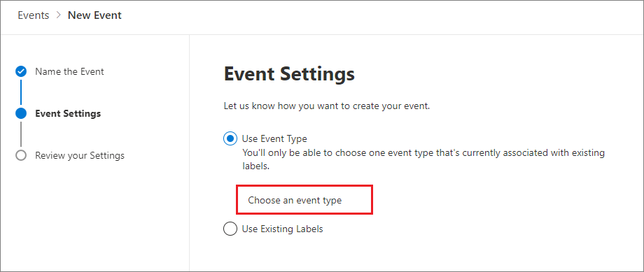
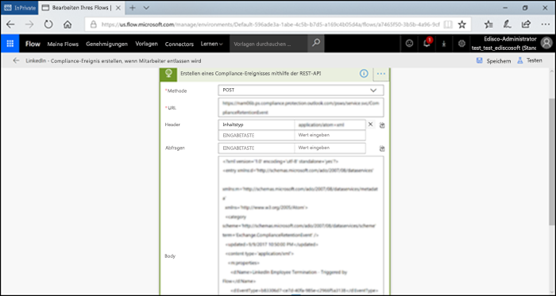

# <a name="start-retention-when-an-event-occurs"></a><span data-ttu-id="f627d-103">Beginn der Aufbewahrung bei Auftreten eines Ereignisses</span><span class="sxs-lookup"><span data-stu-id="f627d-103">Start retention when an event occurs</span></span>

><span data-ttu-id="f627d-104">*[Microsoft 365-Lizenzierungsleitfaden für Sicherheit und Compliance](/office365/servicedescriptions/microsoft-365-service-descriptions/microsoft-365-tenantlevel-services-licensing-guidance/microsoft-365-security-compliance-licensing-guidance).*</span><span class="sxs-lookup"><span data-stu-id="f627d-104">*[Microsoft 365 licensing guidance for security & compliance](/office365/servicedescriptions/microsoft-365-service-descriptions/microsoft-365-tenantlevel-services-licensing-guidance/microsoft-365-security-compliance-licensing-guidance).*</span></span>

<span data-ttu-id="f627d-p101">Wenn Sie Inhalte aufbewahren, basiert der Aufbewahrungszeitraum häufig auf dem Alter des Inhalts. Sie könnten beispielsweise Dokumente für sieben Jahre nach der Erstellung aufbewahren, und anschließend werden sie gelöscht. Wenn Sie jedoch [Aufbewahrungsbezeichnungen](retention.md#retention-labels) konfigurieren, können Sie auch einen Aufbewahrungszeitraum festlegen, der auf dem Auftreten eines bestimmten Ereignistyps basiert. Das Ereignis löst den Beginn des Aufbewahrungszeitraums aus, und auf alle Inhalte, denen eine Aufbewahrungsbezeichnung für diesen Ereignistyp zugewiesen wurde, werden die Aufbewahrungsaktionen angewendet.</span><span class="sxs-lookup"><span data-stu-id="f627d-p101">When you retain content, the retention period is often based on the age of the content. For example, you might retain documents for seven years after they're created and then delete them. But when you configure [retention labels](retention.md#retention-labels), you can also base a retention period on when a specific type of event occurs. The event triggers the start of the retention period, and all content with a retention label applied for that type of event get the label's retention actions enforced on them.</span></span>
  
<span data-ttu-id="f627d-109">Beispiele für die Verwendung der ereignisbasierten Aufbewahrung:</span><span class="sxs-lookup"><span data-stu-id="f627d-109">Examples for using event-based retention:</span></span>
  
- <span data-ttu-id="f627d-110">**Mitarbeiter verlassen die Organisation** Angenommen, Mitarbeiterdatensätze müssen ab dem Zeitpunkt, an dem ein Angestellter das Unternehmen verlässt, 10 Jahre lang aufbewahrt werden.</span><span class="sxs-lookup"><span data-stu-id="f627d-110">**Employees leaving the organization** Suppose that employee records must be retained for 10 years from the time an employee leaves the organization.</span></span> <span data-ttu-id="f627d-111">Nach 10 Jahren müssen alle Dokumente im Zusammenhang mit der Einstellung, Leistung und Kündigung dieses Angestellten gelöscht werden.</span><span class="sxs-lookup"><span data-stu-id="f627d-111">After 10 years elapse, all documents related to the hiring, performance, and termination of that employee must be disposed.</span></span> <span data-ttu-id="f627d-112">Das Ereignis, das den Aufbewahrungszeitraum von 10 Jahren auslöst, ist die Beendigung des Beschäftigungsverhältnisses des Mitarbeiters bei der Organisation.</span><span class="sxs-lookup"><span data-stu-id="f627d-112">The event that triggers the 10-year retention period is the employee leaving the organization.</span></span> 
    
- <span data-ttu-id="f627d-113">**Vertragsablauf** Angenommen, alle Datensätze im Zusammenhang mit Verträgen müssen fünf Jahre lang ab dem Zeitpunkt aufbewahrt werden, ab dem der Vertrag abläuft.</span><span class="sxs-lookup"><span data-stu-id="f627d-113">**Contract expiration** Suppose that all records related to contracts must be retained for five years from the time the contract expires.</span></span> <span data-ttu-id="f627d-114">Das Ereignis, das den Aufbewahrungszeitraum von fünf Jahren ausgelöst, ist der Ablauf des Vertrags.</span><span class="sxs-lookup"><span data-stu-id="f627d-114">The event that triggers the five-year retention period is the expiration of the contract.</span></span> 
    
- <span data-ttu-id="f627d-p104">**Produktlebensdauer** – Ihre Organisation hat möglicherweise Aufbewahrungspflichten, die sich auf das letzte Fertigungsdatum von Produkten für Inhalte wie technische Daten beziehen. In diesem Fall ist das Datum der letzte Fertigung das Ereignis, das den Aufbewahrungszeitraum auslöst.</span><span class="sxs-lookup"><span data-stu-id="f627d-p104">**Product lifetime** Your organization might have retention requirements related to the last manufacturing date of products for content such as technical specifications. In this case, the last manufacturing date is the event that triggers the retention period.</span></span> 
    
<span data-ttu-id="f627d-p105">Die ereignisbasierte Aufbewahrung wird in der Regel im Rahmen eines Prozesses für die Datensatzverwaltung verwendet. Dies bedeutet:</span><span class="sxs-lookup"><span data-stu-id="f627d-p105">Event-based retention is typically used as part of a records-management process. This means that:</span></span>
  
- <span data-ttu-id="f627d-119">Aufbewahrungsbezeichnungen auf Basis von Ereignissen kennzeichnen in der Regel auch Inhalte als Datensatz (als Teil einer Lösung für die Datensatzverwaltung).</span><span class="sxs-lookup"><span data-stu-id="f627d-119">Retention labels based on events also usually mark items as a record, as a part of a records management solution.</span></span> <span data-ttu-id="f627d-120">Weitere Informationen finden Sie unter [Informationen zur Datensatzverwaltung](records-management.md).</span><span class="sxs-lookup"><span data-stu-id="f627d-120">For more information, see [Learn about records management](records-management.md).</span></span>

- <span data-ttu-id="f627d-121">Ein Dokument, das als Datensatz deklariert wurde, dessen Ereignisauslöser jedoch noch nicht ausgelöst wurde, wird auf unbegrenzte Zeit beibehalten (Datensätze können nicht dauerhaft gelöscht werden), bis ein Ereignis den Aufbewahrungszeitraum des Dokuments auslöst.</span><span class="sxs-lookup"><span data-stu-id="f627d-121">A document that's been declared a record but whose event trigger has not yet happened is retained indefinitely (records can't be permanently deleted), until an event triggers that document's retention period.</span></span>
    
- <span data-ttu-id="f627d-122">Aufbewahrungsbezeichnungen auf Basis von Ereignissen lösen in der Regel eine Löschungsprüfung am Ende des Aufbewahrungszeitraums aus, damit ein Datensatzverwalter den Inhalt manuell überprüfen und löschen kann.</span><span class="sxs-lookup"><span data-stu-id="f627d-122">Retention labels based on events usually trigger a disposition review at the end of the retention period, so that a records manager can manually review and dispose of the content.</span></span> <span data-ttu-id="f627d-123">Weitere Informationen finden Sie unter [Entfernung von Inhalten](disposition.md).</span><span class="sxs-lookup"><span data-stu-id="f627d-123">For more information, see [Disposition of content](disposition.md).</span></span>
    

<span data-ttu-id="f627d-124">Eine auf einem Ereignis basierende Aufbewahrungsbezeichnung weist die gleichen Funktionen wie jede Aufbewahrungsbezeichnung in Microsoft 365 auf.</span><span class="sxs-lookup"><span data-stu-id="f627d-124">A retention label based on an event has the same capabilities as any retention label in Microsoft 365.</span></span> <span data-ttu-id="f627d-125">Weitere Informationen finden Sie unter [Informationen zu Aufbewahrungsrichtlinien und Aufbewahrungsbezeichnungen](retention.md).</span><span class="sxs-lookup"><span data-stu-id="f627d-125">For more information, see [Learn about retention policies and retention labels](retention.md).</span></span>

## <a name="understanding-the-relationship-between-event-types-labels-events-and-asset-ids"></a><span data-ttu-id="f627d-126">Grundlegendes zur Beziehung zwischen Ereignistypen, Bezeichnungen, Ereignissen und Asset-IDs</span><span class="sxs-lookup"><span data-stu-id="f627d-126">Understanding the relationship between event types, labels, events, and asset IDs</span></span>

<span data-ttu-id="f627d-127">Um die ereignisbasierte Aufbewahrung erfolgreich zu verwenden, müssen Sie die Beziehung zwischen Ereignistypen, Aufbewahrungsbezeichnungen, Ereignissen und Objekt-IDs verstehen, wie in den Diagrammen und der nachfolgenden Erklärung dargestellt:</span><span class="sxs-lookup"><span data-stu-id="f627d-127">To successfully use event-based retention, it's important to understand the relationship between event types, retention labels, events, and asset IDs as illustrated in the diagrams and the explanation that follows:</span></span> 
  

  

  
1. <span data-ttu-id="f627d-130">Sie erstellen Aufbewahrungsbezeichnungen für unterschiedliche Arten von Inhalten und ordnen diesen dann einen Ereignistyp zu.</span><span class="sxs-lookup"><span data-stu-id="f627d-130">You create retention labels for different types of content and then associate them with a type of event.</span></span> <span data-ttu-id="f627d-131">Aufbewahrungsbezeichnungen für verschiedene Arten von Produktdateien und Datensätzen werden beispielsweise einem Ereignistyp mit der Bezeichnung „Product Lifetime“ zugeordnet, da diese Datensätze ab dem Ende des Produktlebenszyklus für 10 Jahre aufbewahrt werden müssen.</span><span class="sxs-lookup"><span data-stu-id="f627d-131">For example, retention labels for different types of product files and records are associated with an event type named Product Lifetime because those records must be retained for 10 years from the time the product reaches its end of life.</span></span>
    
2. <span data-ttu-id="f627d-132">Benutzer (in der Regel Datensatzverwalter) wenden diese Aufbewahrungsbezeichnungen auf Inhalte an, und geben (bei Dokumenten in SharePoint und OneDrive) eine Objekt-ID für jedes Element ein.</span><span class="sxs-lookup"><span data-stu-id="f627d-132">Users (typically records managers) apply those retention labels to content and (for documents in SharePoint and OneDrive) enter an asset ID for each item.</span></span> <span data-ttu-id="f627d-133">In diesem Beispiel ist die Objekt-ID ein von der Organisation verwendeter Produktname oder -code.</span><span class="sxs-lookup"><span data-stu-id="f627d-133">In this example, the asset ID is a product name or code used by the organization.</span></span> <span data-ttu-id="f627d-134">Dann wird den Datensätzen jedes Produkts eine Aufbewahrungsbezeichnung zugewiesen, und jeder Datensatz verfügt über eine Eigenschaft, die eine Objekt-ID enthält.</span><span class="sxs-lookup"><span data-stu-id="f627d-134">Then, each product's records are assigned a retention label, and each record has a property that contains an asset ID.</span></span> <span data-ttu-id="f627d-135">Das Diagramm stellt **alle Inhalte** für alle Produktdatensätze in einer Organisation dar, wobei jedes Element die Objekt-ID des Produkts trägt, um dessen Datensatz es sich handelt.</span><span class="sxs-lookup"><span data-stu-id="f627d-135">The diagram represents **all the content** for all product records in an organization, and each item bears the asset ID of the product whose record it is.</span></span> 
    
3. <span data-ttu-id="f627d-p111">„Product Lifetime“ ist der Ereignistyp. Ein bestimmtes Produkt, das das Ende seines Lebenszyklus erreicht, ist ein Ereignis. Wenn ein Ereignis dieses Typs auftritt (in diesem Fall, wenn ein Produkt das Ende seiner Lebensdauer erreicht), erstellen Sie ein Ereignis, das Folgendes angibt:</span><span class="sxs-lookup"><span data-stu-id="f627d-p111">Product Lifetime is the event type; a specific product reaching end of life is an event. When an event of that event type occurs—in this case, when a product reaches its end of life—you create an event that specifies:</span></span>
    
   - <span data-ttu-id="f627d-138">Eine Asset-ID (für SharePoint- und OneDrive-Dokumente)</span><span class="sxs-lookup"><span data-stu-id="f627d-138">An asset ID (for SharePoint and OneDrive documents)</span></span>
    
   - <span data-ttu-id="f627d-p112">Schlüsselwörter (für Exchange-Elemente). In diesem Beispiel verwendet das Unternehmen einen Produktcode in Nachrichten, die Produktdatensätze enthalten, sodass das Schlüsselwort für Exchange-Elemente funktional der Objekt-ID für SharePoint- und OneDrive-Dokumente entspricht.</span><span class="sxs-lookup"><span data-stu-id="f627d-p112">Keywords (for Exchange items). In this example, the organization uses a product code in messages containing product records, so the keyword for Exchange items is functionally the same as the asset ID for SharePoint and OneDrive documents.</span></span>
    
   - <span data-ttu-id="f627d-p113">Das Datum, an dem das Ereignis aufgetreten ist. Dieses Datum wird als Beginn des Aufbewahrungszeitraums verwendet. Dieses Datum kann das aktuelle, ein vergangenes oder ein zukünftiges Datum sein.</span><span class="sxs-lookup"><span data-stu-id="f627d-p113">The date when the event occurred. This date is used as the start of the retention period. This date can be the current, a past, or a future date.</span></span>

4. <span data-ttu-id="f627d-144">Nach der Erstellung eines Ereignisses wird dieses Ereignisdatum mit allen Inhalten synchronisiert, die eine Aufbewahrungsbezeichnung dieses Ereignistyps aufweisen und die angegebene Objekt-ID bzw. das angegebene Schlüsselwort enthalten.</span><span class="sxs-lookup"><span data-stu-id="f627d-144">After you create an event, that event date is synchronized to all the content that has a retention label of that event type and that contains the specified asset ID or keyword.</span></span> <span data-ttu-id="f627d-145">Wie bei jeder Aufbewahrungsbezeichnung kann die Synchronisierung bis zu 7 Tage dauern.</span><span class="sxs-lookup"><span data-stu-id="f627d-145">Like any retention label, this synchronization can take up to seven days.</span></span> <span data-ttu-id="f627d-146">Bei allen rot eingekreisten Elementen im vorigen Diagramm wird der Aufbewahrungszeitraum durch dieses Ereignis ausgelöst.</span><span class="sxs-lookup"><span data-stu-id="f627d-146">In the previous diagram, all the items circled in red have their retention period triggered by this event.</span></span> <span data-ttu-id="f627d-147">Mit anderen Worten, wenn dieses Produkt das Ende seiner Lebensdauer erreicht, löst dieses Ereignis den Aufbewahrungszeitraum für die Produktdatensätze aus.</span><span class="sxs-lookup"><span data-stu-id="f627d-147">In other words, when this product reaches its end of life, that event triggers the retention period for that product's records.</span></span>

<span data-ttu-id="f627d-148">Es ist wichtig zu verstehen, dass der Aufbewahrungszeitraum für **alle Inhalte** mit einer Bezeichnung dieses Ereignistyps durch das Ereignis ausgelöst wird, wenn Sie keine Objekt-ID oder Schlüsselwörter für ein Ereignis angeben.</span><span class="sxs-lookup"><span data-stu-id="f627d-148">It's important to understand that if you don't specify an asset ID or keywords for an event, **all content** with a retention label of that event type will have its retention period triggered by the event.</span></span> <span data-ttu-id="f627d-149">Dies bedeutet, dass im vorherigen Diagramm der Aufbewahrungszeitraum für alle Inhalte beginnen würde.</span><span class="sxs-lookup"><span data-stu-id="f627d-149">This means that in the previous diagram, all content would start being retained.</span></span> <span data-ttu-id="f627d-150">Dies ist möglicherweise nicht, was Sie beabsichtigen.</span><span class="sxs-lookup"><span data-stu-id="f627d-150">This might not be what you intend.</span></span>

<span data-ttu-id="f627d-151">Denken Sie schließlich daran, dass es zu jeder Aufbewahrungsbezeichnung eigene Aufbewahrungseinstellungen gibt.</span><span class="sxs-lookup"><span data-stu-id="f627d-151">Finally, remember that each retention label has its own retention settings.</span></span> <span data-ttu-id="f627d-152">In diesem Beispiel ist für alle ein Zeitraum von 10 Jahren angegeben, aber es ist möglich, dass ein Ereignis Aufbewahrungsbezeichnungen mit unterschiedlichen Aufbewahrungszeiträumen auslöst.</span><span class="sxs-lookup"><span data-stu-id="f627d-152">In this example, they all specify 10 years, but it's possible for an event to trigger retention labels where each label has a different retention period.</span></span>
  
## <a name="how-to-set-up-event-driven-retention"></a><span data-ttu-id="f627d-153">So richten Sie die ereignisgesteuerte Aufbewahrung ein</span><span class="sxs-lookup"><span data-stu-id="f627d-153">How to set up event-driven retention</span></span>

<span data-ttu-id="f627d-154">Allgemeiner Workflow für die ereignisgesteuerte Aufbewahrung:</span><span class="sxs-lookup"><span data-stu-id="f627d-154">High-level workflow for event-driven retention:</span></span>
  

  
> [!TIP]
> <span data-ttu-id="f627d-156">Unter [Verwenden von Aufbewahrungsbezeichnungen zur Verwaltung des Lebenszyklus von in SharePoint gespeicherten Dokumenten](auto-apply-retention-labels-scenario.md) finden Sie ein detailliertes Szenario zur Verwendung von verwalteten Eigenschaften in SharePoint, um Aufbewahrungsbezeichnungen automatisch anzuwenden und die ereignisgesteuerte Aufbewahrung zu implementieren.</span><span class="sxs-lookup"><span data-stu-id="f627d-156">See [Use retention labels to manage the lifecycle of documents stored in SharePoint](auto-apply-retention-labels-scenario.md) for a detailed scenario about using managed properties in SharePoint to auto-apply retention labels and implement event-driven retention.</span></span>

### <a name="step-1-create-a-label-whose-retention-period-is-based-on-an-event"></a><span data-ttu-id="f627d-157">Schritt 1: Eine Bezeichnung erstellen, deren Aufbewahrungszeitraum auf einem Ereignis basiert</span><span class="sxs-lookup"><span data-stu-id="f627d-157">Step 1: Create a label whose retention period is based on an event</span></span>

<span data-ttu-id="f627d-158">Informationen zum Erstellen und Konfigurieren Ihres Aufbewahrungsbezeichnungen finden Sie in den Anweisungen zum [Erstellen und Konfigurieren von Aufbewahrungsbezeichnungen](./create-apply-retention-labels.md#step-1-create-retention-labels).</span><span class="sxs-lookup"><span data-stu-id="f627d-158">To create and configure your retention label, see the instructions for [Create retention labels](./create-apply-retention-labels.md#step-1-create-retention-labels).</span></span> <span data-ttu-id="f627d-159">Wählen Sie aber spezifisch für die ereignisbasierte Aufbewahrung auf der Seite **Aufbewahrungseinstellungen definieren** des Assistenten zum Erstellen von Aufbewahrungsbezeichnungen zuerst **Aufbewahrungszeitraum starten basierend auf**, und dann einen der Standardereignistypen aus der Dropdownliste aus. Sie können aber auch **Neuen Ereignistyp erstellen** auswählen, um einen eigenen zu erstellen:</span><span class="sxs-lookup"><span data-stu-id="f627d-159">But specific to event-based retention, on the **Define retention settings** page of the Create retention label wizard, after **Start the retention period based on**, select one of the default event types from the dropdown list, or create your own by selecting **Create new event type**:</span></span>


<span data-ttu-id="f627d-161">Ein Ereignistyp ist einfach eine allgemeine Beschreibung eines Ereignisses, das Sie einer Aufbewahrungsbezeichnung zuordnen möchten.</span><span class="sxs-lookup"><span data-stu-id="f627d-161">An event type is simply a general description of an event that you want to associate with a retention label.</span></span>

<span data-ttu-id="f627d-162">Die Standardereignistypen weisen **(Ereignistyp**) nach ihrem Namen in der Dropdownliste auf, um die Identifizierung zu vereinfachen. Sie können einen Ereignistyp auch über die Registerkarte **Datensatzverwaltung** > **Ereignisse** > **Ereignistypen verwalten** anzeigen und erstellen.</span><span class="sxs-lookup"><span data-stu-id="f627d-162">The default event types have **(event type)** after their name in the dropdown list for easier identification, and you can also see and create event type from the **Records management** > **Events** tab > **Manage event types**.</span></span>

<span data-ttu-id="f627d-163">Für die ereignisbasierte Aufbewahrung sind Aufbewahrungseinstellungen erforderlich, die:</span><span class="sxs-lookup"><span data-stu-id="f627d-163">Event-based retention requires retention settings that:</span></span>
  
- <span data-ttu-id="f627d-164">Inhalte aufbewahren.</span><span class="sxs-lookup"><span data-stu-id="f627d-164">Retain the content.</span></span>
    
- <span data-ttu-id="f627d-165">den Inhalt automatisch löschen oder eine Dispositionsprüfung am Ende des Aufbewahrungszeitraums auslösen.</span><span class="sxs-lookup"><span data-stu-id="f627d-165">Delete the content automatically or trigger a disposition review at the end of the retention period.</span></span>
  
<span data-ttu-id="f627d-166">Die ereignisbasierte Aufbewahrung wird in der Regel für Inhalte verwendet, die als Datensatz deklariert sind. Dies ist daher ein guter Zeitpunkt, um zu überprüfen, ob Sie auch die Option zum Kennzeichnen von Inhalten als [Datensatz](records-management.md#records) auswählen müssen.</span><span class="sxs-lookup"><span data-stu-id="f627d-166">Event-based retention is typically used for content that's declared a record, so this is a good time to check whether you also need to select the option that marks content as a [record](records-management.md#records).</span></span>

<span data-ttu-id="f627d-167">Wenn Sie einen vorhandenen Ereignistyp verwenden und nicht einen neuen erstellen, fahren Sie mit Schritt 3 fort.</span><span class="sxs-lookup"><span data-stu-id="f627d-167">If you're using an existing event type rather than creating a new event type, skip to step 3.</span></span>

> [!NOTE]
> <span data-ttu-id="f627d-168">Der Ereignistyp kann nicht mehr geändert werden, sobald Sie ihn ausgewählt und die Aufbewahrungsbezeichnung gespeichert haben.</span><span class="sxs-lookup"><span data-stu-id="f627d-168">After you choose an event type and save the retention label, the event type cannot be changed.</span></span>

### <a name="step-2-create-a-new-event-type-for-your-label"></a><span data-ttu-id="f627d-169">Schritt 2: Erstellen eines neuen Ereignistyps für ihre Bezeichnung</span><span class="sxs-lookup"><span data-stu-id="f627d-169">Step 2: Create a new event type for your label</span></span>

<span data-ttu-id="f627d-170">Wenn Sie für die Aufbewahrungseinstellungen **Neuen Ereignistyp erstellen** ausgewählt haben, geben Sie einen Namen und eine Beschreibung für den Ereignistyp ein.</span><span class="sxs-lookup"><span data-stu-id="f627d-170">For the retention settings, if you selected **Create new event type**, enter a name and description for your event type.</span></span> <span data-ttu-id="f627d-171">Wählen Sie dann **Weiter**, **Senden** und **Fertig** aus.</span><span class="sxs-lookup"><span data-stu-id="f627d-171">Then select **Next**, **Submit**, and **Done**.</span></span>

<span data-ttu-id="f627d-172">Zurück auf der Seite **Aufbewahrungseinstellungen definieren** wählen Sie aus der Dropdownliste für **Aufbewahrungszeitraum starten basierend auf** den erstellten Ereignistyp aus.</span><span class="sxs-lookup"><span data-stu-id="f627d-172">Back on the **Define retention settings** page, for **Start the retention period based on**, use the dropdown list to select the event type that you created.</span></span>

  
### <a name="step-3-publish-or-auto-apply-the-event-based-retention-labels"></a><span data-ttu-id="f627d-173">Schritt 3: Veröffentlichen oder automatisches Zuweisen der ereignisbasierten Aufbewahrungsbezeichnungen</span><span class="sxs-lookup"><span data-stu-id="f627d-173">Step 3: Publish or auto-apply the event-based retention labels</span></span>

<span data-ttu-id="f627d-174">Wie jede Aufbewahrungsbezeichnung müssen Sie auch ereignisbasierte Bezeichnungen veröffentlichen oder automatisch anwenden, damit sie auf Inhalte manuell oder automatisch angewendet werden können:</span><span class="sxs-lookup"><span data-stu-id="f627d-174">Just like any retention label, you need to publish or auto-apply an event-based label, for it to be manually or automatically applied to content:</span></span>
- [<span data-ttu-id="f627d-175">Erstellen von Aufbewahrungsbezeichnungen und Anwenden in Apps</span><span class="sxs-lookup"><span data-stu-id="f627d-175">Create retention labels and apply them in apps</span></span>](create-apply-retention-labels.md)
- [<span data-ttu-id="f627d-176">Automatisches Anwenden einer Aufbewahrungsbezeichnung auf Inhalte</span><span class="sxs-lookup"><span data-stu-id="f627d-176">Apply a retention label to content automatically</span></span>](apply-retention-labels-automatically.md)

### <a name="step-4-enter-an-asset-id"></a><span data-ttu-id="f627d-177">Schritt 4: Eine Asset-ID eingeben</span><span class="sxs-lookup"><span data-stu-id="f627d-177">Step 4: Enter an asset ID</span></span>

<span data-ttu-id="f627d-178">Nachdem eine ereignisbasierte Bezeichnung auf Inhalte angewendet wurde, können Sie für jedes Element eine Objekt-ID eingeben.</span><span class="sxs-lookup"><span data-stu-id="f627d-178">After an event-based label is applied to content, you can enter an asset ID for each item.</span></span> <span data-ttu-id="f627d-179">Ihre Organisation kann beispielsweise folgende Elemente verwenden:</span><span class="sxs-lookup"><span data-stu-id="f627d-179">For example, your organization might use:</span></span>
  
- <span data-ttu-id="f627d-180">Produktcodes, um Inhalt nur für ein bestimmtes Produkt aufzubewahren.</span><span class="sxs-lookup"><span data-stu-id="f627d-180">Product codes that you can use to retain content for only a specific product.</span></span>
    
- <span data-ttu-id="f627d-181">Projektcodes, um Inhalt nur für ein bestimmtes Projekt aufzubewahren.</span><span class="sxs-lookup"><span data-stu-id="f627d-181">Project codes that you can use to retain content for only a specific project.</span></span>
    
- <span data-ttu-id="f627d-182">Mitarbeiter-IDs, die Sie zum Aufbewahren von Inhalten für eine bestimmte Person verwenden können.</span><span class="sxs-lookup"><span data-stu-id="f627d-182">Employee IDs that you can use to retain content for only a specific person.</span></span>
    
<span data-ttu-id="f627d-183">Die Objekt-ID ist einfach eine weitere in SharePoint und OneDrive verfügbare Dokumenteigenschaft.</span><span class="sxs-lookup"><span data-stu-id="f627d-183">Asset ID is simply another document property that's available in SharePoint and OneDrive.</span></span> <span data-ttu-id="f627d-184">Ihre Organisation verwendet möglicherweise bereits andere Dokumenteigenschaften und IDs zum Klassifizieren von Inhalten.</span><span class="sxs-lookup"><span data-stu-id="f627d-184">Your organization might already use other document properties and IDs to classify content.</span></span> <span data-ttu-id="f627d-185">In diesem Falle können Sie beim Erstellen eines Ereignisses auch diese Eigenschaften und Werte verwenden – siehe nachfolgenden Schritt 6.</span><span class="sxs-lookup"><span data-stu-id="f627d-185">If so, you can also use those properties and values when you create an event—see step 6 that follows.</span></span> <span data-ttu-id="f627d-186">Wichtig ist hierbei, dass Sie in den Dokumenteigenschaften eine *Kombination aus Eigenschaft und Wert* verwenden müssen, um dieses Element mit einem Ereignistyp zu verknüpfen.</span><span class="sxs-lookup"><span data-stu-id="f627d-186">The important point is that you must use some *property:value* combination in the document properties to associate that item with an event type.</span></span>
  

  
### <a name="step-5-create-an-event"></a><span data-ttu-id="f627d-188">Schritt 5: Erstellen eines Ereignisses</span><span class="sxs-lookup"><span data-stu-id="f627d-188">Step 5: Create an event</span></span>

<span data-ttu-id="f627d-189">Wenn eine bestimmte Instanz dieses Ereignistyps auftritt – z. B. wenn ein Produkt das Ende seiner Lebensdauer erreicht –, rufen Sie die Seite **Datensatzverwaltung** > **Ereignisse** im Microsoft 365 Compliance Center auf, und klicken Sie auf **+ Erstellen**, um ein Ereignis zu erstellen.</span><span class="sxs-lookup"><span data-stu-id="f627d-189">When a particular instance of that event type occurs, such as a product reaches its end of life, go to the **Records management** > **Events** page in the Microsoft 365 compliance center, and select **+ Create** to create an event.</span></span> <span data-ttu-id="f627d-190">Sie lösen das Ereignis aus, indem Sie es hier erstellen.</span><span class="sxs-lookup"><span data-stu-id="f627d-190">You trigger the event by creating it, here.</span></span>



<span data-ttu-id="f627d-192">Pro Mandant werden bis zu 1 Million Ereignisse unterstützt.</span><span class="sxs-lookup"><span data-stu-id="f627d-192">Up to one million events are supported per tenant.</span></span>

### <a name="step-6-choose-the-same-event-type-used-by-the-label-in-step-2"></a><span data-ttu-id="f627d-193">Schritt 6: Auswählen des gleichen Ereignistyps, der von der Bezeichnung in Schritt 2 verwendet wird</span><span class="sxs-lookup"><span data-stu-id="f627d-193">Step 6: Choose the same event type used by the label in step 2</span></span>

<span data-ttu-id="f627d-194">Wenn Sie das Ereignis erstellen, wählen Sie den gleichen Ereignistyp aus, der in den Einstellungen für die Aufbewahrungsbezeichnung in Schritt 2 festgelegt wurde.</span><span class="sxs-lookup"><span data-stu-id="f627d-194">When you create the event, choose the same event type specified in the retention label settings in step 2.</span></span> <span data-ttu-id="f627d-195">Wenn Sie beispielsweise **Produktlebensdauer** als Ereignistyp für die Bezeichnungseinstellungen ausgewählt haben, wählen Sie beim Erstellen des Ereignisses ebenfalls **Produktlebensdauer** aus.</span><span class="sxs-lookup"><span data-stu-id="f627d-195">For example, if you selected **Product Lifetime** as your event type for the label settings, select **Product Lifetime** when you create the event.</span></span> <span data-ttu-id="f627d-196">Nur für Inhalte, denen Aufbewahrungsbezeichnungen des betreffenden Ereignistyps zugeordnet wurden, wird der Aufbewahrungszeitraum ausgelöst.</span><span class="sxs-lookup"><span data-stu-id="f627d-196">Only content with retention labels applied to it of that event type will have its retention period triggered.</span></span>



<span data-ttu-id="f627d-198">Wenn Sie ein Ereignis für mehrere Aufbewahrungsbezeichnungen erstellen müssen, die unterschiedliche Ereignistypen aufweisen, können Sie auch die Option **Vorhandene Bezeichnungen auswählen** auswählen.</span><span class="sxs-lookup"><span data-stu-id="f627d-198">Alternatively, if you need to create an event for multiple retention labels that have different event types, select the **Choose Existing Labels** option.</span></span> <span data-ttu-id="f627d-199">Wählen Sie dann die Bezeichnungen aus, die für die Ereignistypen konfiguriert sind, die Sie diesem Ereignis zuordnen möchten.</span><span class="sxs-lookup"><span data-stu-id="f627d-199">Then, select the labels that are configured for the event types you want to associate with this event.</span></span>

### <a name="step-7-enter-keywords-or-an-asset-id"></a><span data-ttu-id="f627d-200">Schritt 7: Stichwörter oder Asset-ID eingeben</span><span class="sxs-lookup"><span data-stu-id="f627d-200">Step 7: Enter keywords or an asset ID</span></span>

<span data-ttu-id="f627d-201">Schränken Sie nun den Umfang des Inhalts ein, indem Sie Objekt-IDs für SharePoint- und OneDrive-Inhalte bzw. Schlüsselwörter für Exchange-Inhalte angeben.</span><span class="sxs-lookup"><span data-stu-id="f627d-201">Now you narrow the scope of the content by specifying asset IDs for SharePoint and OneDrive content, or keywords for Exchange content.</span></span> <span data-ttu-id="f627d-202">Bei Objekt-IDs wird die Aufbewahrung nur für Inhalte mit der angegebenen Kombination aus *Eigenschaft und Wert* erzwungen.</span><span class="sxs-lookup"><span data-stu-id="f627d-202">For asset IDs, retention will be enforced only on content with the specified *property:value* pair.</span></span> <span data-ttu-id="f627d-203">Wird keine Objekt-ID eingegeben, wird auf alle Inhalte mit Bezeichnungen dieses Ereignistyps dasselbe Aufbewahrungslimit angewendet.</span><span class="sxs-lookup"><span data-stu-id="f627d-203">If an asset ID is not entered, all content with labels of that event type get the same retention date applied to them.</span></span>

<span data-ttu-id="f627d-204">Ein Beispiel: Wenn Sie die Eigenschaft "Objekt-ID" verwenden, geben Sie `ComplianceAssetID:<value>` in das untenstehende Feld für Objekt-IDs ein.</span><span class="sxs-lookup"><span data-stu-id="f627d-204">For example: If you're using the Asset ID property, enter `ComplianceAssetID:<value>` in the box for asset IDs shown below.</span></span>
  
<span data-ttu-id="f627d-205">Möglicherweise hat Ihre Organisation andere Eigenschaften und IDs auf die mit diesem Ereignistyp verknüpften Dokumente angewendet.</span><span class="sxs-lookup"><span data-stu-id="f627d-205">Your organization might have applied other properties and IDs to the documents related to this event type.</span></span> <span data-ttu-id="f627d-206">Wenn Sie beispielsweise die Datensätze zu einem bestimmten Produkt ermitteln müssen, könnte die ID eine Kombination aus Ihrer benutzerdefinierten Eigenschaft "ProductID" und dem Wert "XYZ" sein.</span><span class="sxs-lookup"><span data-stu-id="f627d-206">For example, if you need to detect a specific product's records, the ID might be a combination of your custom property ProductID and the value "XYZ".</span></span> <span data-ttu-id="f627d-207">In diesem Fall würden Sie in das Feld für Objekt-IDs, das in der folgenden Abbildung dargestellt ist, `ProductID:XYZ` eingeben.</span><span class="sxs-lookup"><span data-stu-id="f627d-207">In this case, you'd enter `ProductID:XYZ` in the box for asset IDs shown in the following picture.</span></span>
  
<span data-ttu-id="f627d-208">Verwenden Sie für Exchange-Elemente Stichworte.</span><span class="sxs-lookup"><span data-stu-id="f627d-208">For Exchange items, use keywords.</span></span> <span data-ttu-id="f627d-209">Für eine Abfrage können Sie Suchoperatoren wie AND, OR und NOT verwenden.</span><span class="sxs-lookup"><span data-stu-id="f627d-209">You can use a query by using search operators such as AND, OR, and NOT.</span></span> <span data-ttu-id="f627d-210">Weitere Informationen finden Sie unter [Stichwortabfragen und Suchbedingungen für die Inhaltssuche](keyword-queries-and-search-conditions.md).</span><span class="sxs-lookup"><span data-stu-id="f627d-210">For more information, see [Keyword queries and search conditions for Content Search](keyword-queries-and-search-conditions.md).</span></span>
  
<span data-ttu-id="f627d-211">Wählen Sie schließlich das Datum aus, an dem das Ereignis eingetreten ist. Dieses Datum wird als Anfang des Aufbewahrungszeitraums verwendet.</span><span class="sxs-lookup"><span data-stu-id="f627d-211">Finally, choose the date when the event occurred; this date is used as the start of the retention period.</span></span> <span data-ttu-id="f627d-212">Nach der Erstellung eines Ereignisses wird dieses Ereignisdatum mit allen Inhalten synchronisiert, die eine Aufbewahrungsbezeichnung dieses Ereignistyps, die Objekt-ID und die Schlüsselwörter aufweisen. </span><span class="sxs-lookup"><span data-stu-id="f627d-212">After you create an event, that event date is synchronized to all the content with a retention label of that event type, asset ID, and keywords.</span></span> <span data-ttu-id="f627d-213">Wie bei jeder Aufbewahrungsbezeichnung kann die Synchronisierung bis zu 7 Tage dauern.</span><span class="sxs-lookup"><span data-stu-id="f627d-213">As with any retention label, this synchronization can take up to seven days.</span></span>
  


<span data-ttu-id="f627d-215">Nach dem Erstellen eines Ereignisses gelten die Aufbewahrungseinstellungen für bereits bezeichnete und indizierte Inhalte.</span><span class="sxs-lookup"><span data-stu-id="f627d-215">After creating an event, the retention settings take effect for the content that's already labeled and indexed.</span></span> <span data-ttu-id="f627d-216">Wenn die Aufbewahrungsbezeichnung zu neuen Inhalten hinzugefügt wird, nachdem das Ereignis erstellt wurde, müssen Sie ein neues Ereignis mit den gleichen Details erstellen.</span><span class="sxs-lookup"><span data-stu-id="f627d-216">If the retention label is added to new content after the event is created, you must create a new event with the same details.</span></span>

<span data-ttu-id="f627d-217">Wenn Sie ein Ereignis löschen, werden dadurch die Aufbewahrungseinstellungen, die jetzt für bereits bezeichnete Inhalte in Kraft sind, nicht aufgehoben.</span><span class="sxs-lookup"><span data-stu-id="f627d-217">Deleting an event doesn't cancel the retention settings that are now in effect for the content that's already labeled.</span></span> <span data-ttu-id="f627d-218">Erstellen Sie dazu ein neues Ereignis mit den gleichen Details, lassen Sie das Datum aber leer.</span><span class="sxs-lookup"><span data-stu-id="f627d-218">To do that, create a new event with the same details, but leave the date blank.</span></span> 

## <a name="use-content-search-to-find-all-content-with-a-specific-label-or-asset-id"></a><span data-ttu-id="f627d-219">Verwenden der Inhaltssuche zum Auffinden aller Inhalte mit einer bestimmten Bezeichnung oder Objekt-ID</span><span class="sxs-lookup"><span data-stu-id="f627d-219">Use Content Search to find all content with a specific label or asset ID</span></span>

<span data-ttu-id="f627d-220">Nachdem Aufbewahrungsbezeichnungen Inhalten zugewiesen wurden, können Sie die Inhaltssuche verwenden, um alle Inhalte aufzufinden, die durch eine bestimmte Aufbewahrungsbezeichnung klassifiziert wurden oder eine bestimmte Objekt-ID enthalten.</span><span class="sxs-lookup"><span data-stu-id="f627d-220">After retention labels are assigned to content, you can use content search to find all content that's classified with a specific retention label or that contains a specific asset ID:</span></span>
  
- <span data-ttu-id="f627d-221">Um alle Inhalte mit einer bestimmten Aufbewahrungsbezeichnung zu finden, wählen Sie die Bedingung **Aufbewahrungsbezeichnung**, und geben Sie dann den vollständigen oder Bezeichnungsnamen oder einen Teil des Bezeichnungsnamens ein, und verwenden Sie einen Platzhalter.</span><span class="sxs-lookup"><span data-stu-id="f627d-221">To find all content with a specific retention label, choose the **Retention label** condition, and then enter the complete label name or part of the label name and use a wildcard.</span></span> 
    
- <span data-ttu-id="f627d-222">Um alle Inhalte mit einer bestimmten Objekt-ID zu finden, geben Sie die **ComplianceAssetID**-Eigenschaft und einen Wert ein, und zwar im Format: `ComplianceAssetID:<value>`.</span><span class="sxs-lookup"><span data-stu-id="f627d-222">To find all content with a specific asset ID, enter the **ComplianceAssetID** property and a value, using the format `ComplianceAssetID:<value>`.</span></span> 
    
<span data-ttu-id="f627d-223">Weitere Informationen finden Sie unter [Stichwortabfragen und Suchbedingungen für die Inhaltssuche](keyword-queries-and-search-conditions.md).</span><span class="sxs-lookup"><span data-stu-id="f627d-223">For more information, see [Keyword queries and search conditions for Content Search](keyword-queries-and-search-conditions.md).</span></span>

## <a name="automate-events-by-using-powershell"></a><span data-ttu-id="f627d-224">Automatisieren von Ereignissen mit PowerShell</span><span class="sxs-lookup"><span data-stu-id="f627d-224">Automate events by using PowerShell</span></span>

<span data-ttu-id="f627d-225">Sie können ereignisbasierte Aufbewahrung aus Ihren Geschäftsanwendungen heraus mithilfe eines PowerShell-Skripts automatisieren.</span><span class="sxs-lookup"><span data-stu-id="f627d-225">You can use a PowerShell script to automate event-based retention from your business applications.</span></span> <span data-ttu-id="f627d-226">PowerShell-Cmdlets für die ereignisbasierte Aufbewahrung:</span><span class="sxs-lookup"><span data-stu-id="f627d-226">The PowerShell cmdlets available for event-based retention:</span></span>
  
- [<span data-ttu-id="f627d-227">Get-ComplianceRetentionEventType</span><span class="sxs-lookup"><span data-stu-id="f627d-227">Get-ComplianceRetentionEventType</span></span>](/powershell/module/exchange/get-complianceretentioneventtype)
    
- [<span data-ttu-id="f627d-228">New-ComplianceRetentionEventType</span><span class="sxs-lookup"><span data-stu-id="f627d-228">New-ComplianceRetentionEventType</span></span>](/powershell/module/exchange/new-complianceretentioneventtype)
    
- [<span data-ttu-id="f627d-229">Remove-ComplianceRetentionEventType</span><span class="sxs-lookup"><span data-stu-id="f627d-229">Remove-ComplianceRetentionEventType</span></span>](/powershell/module/exchange/remove-complianceretentioneventtype)
    
- [<span data-ttu-id="f627d-230">Set-ComplianceRetentionEventType</span><span class="sxs-lookup"><span data-stu-id="f627d-230">Set-ComplianceRetentionEventType</span></span>](/powershell/module/exchange/set-complianceretentioneventtype)
    
- [<span data-ttu-id="f627d-231">Get-ComplianceRetentionEvent</span><span class="sxs-lookup"><span data-stu-id="f627d-231">Get-ComplianceRetentionEvent</span></span>](/powershell/module/exchange/get-complianceretentionevent)
    
- [<span data-ttu-id="f627d-232">New-ComplianceRetentionEvent</span><span class="sxs-lookup"><span data-stu-id="f627d-232">New-ComplianceRetentionEvent</span></span>](/powershell/module/exchange/new-complianceretentionevent)
    

## <a name="automate-events-by-using-a-rest-api"></a><span data-ttu-id="f627d-233">Automatisieren von Ereignissen mithilfe einer REST-API</span><span class="sxs-lookup"><span data-stu-id="f627d-233">Automate events by using a REST API</span></span>

<span data-ttu-id="f627d-234">Sie können eine REST-API verwenden, um automatisch die Ereignisse zu erstellen, die den Beginn der Aufbewahrungszeit auslösen.</span><span class="sxs-lookup"><span data-stu-id="f627d-234">You can use a REST API to automatically create the events that trigger the start of the retention time.</span></span>

<span data-ttu-id="f627d-235">Bei einer REST-API handelt es sich um einen Dienstendpunkt, der Gruppen von HTTP-Vorgängen (Methoden) unterstützt, die Zugriff zum Erstellen/Abrufen/Aktualisieren/Löschen der Dienstressourcen bieten.</span><span class="sxs-lookup"><span data-stu-id="f627d-235">A REST API is a service endpoint that supports sets of HTTP operations (methods), which provide create/retrieve/update/delete access to the service's resources.</span></span> <span data-ttu-id="f627d-236">Weitere Informationen finden Sie unter [Komponenten einer REST-API-Anfrage/-Anfrage](/rest/api/gettingstarted/#components-of-a-rest-api-requestresponse).</span><span class="sxs-lookup"><span data-stu-id="f627d-236">For more information, see [Components of a REST API request/response](/rest/api/gettingstarted/#components-of-a-rest-api-requestresponse).</span></span> <span data-ttu-id="f627d-237">Mithilfe der Microsoft 365 REST-API können Ereignisse mit POST- und GET-Operationen erstellt und abgerufen werden.</span><span class="sxs-lookup"><span data-stu-id="f627d-237">By using the Microsoft 365 REST API, events can be created and retrieved using the POST and GET methods.</span></span>

<span data-ttu-id="f627d-238">Es gibt zwei Optionen für die Verwendung der REST-API:</span><span class="sxs-lookup"><span data-stu-id="f627d-238">There are two options for using the REST API:</span></span>

- <span data-ttu-id="f627d-239">**Microsoft Power Automate oder eine ähnliche Anwendung** zum automatischen Auslösen des Ereignisses.</span><span class="sxs-lookup"><span data-stu-id="f627d-239">**Microsoft Power Automate or a similar application** to trigger the occurrence of an event automatically.</span></span> <span data-ttu-id="f627d-240">Microsoft Power Automate ist ein Orchestrator zum Herstellen der Verbindung zu anderen Systemen, sodass Sie keine benutzerdefinierte Lösung erstellen müssen.</span><span class="sxs-lookup"><span data-stu-id="f627d-240">Microsoft Power Automate is an orchestrator for connecting to other systems, so you don't need to write a custom solution.</span></span> <span data-ttu-id="f627d-241">Weitere Informationen finden Sie auf der [Power Automate-Website](https://flow.microsoft.com/de-DE/).</span><span class="sxs-lookup"><span data-stu-id="f627d-241">For more information, see the [Power Automate website](https://flow.microsoft.com/de-DE/).</span></span>

- <span data-ttu-id="f627d-242">**PowerShell oder ein HTTP-Client zum Aufrufen der REST-API**, um Ereignisse mithilfe von PowerShell (Version 6 oder höher) zu erstellen, was Teil einer benutzerdefinierten Lösung ist.</span><span class="sxs-lookup"><span data-stu-id="f627d-242">**PowerShell or an HTTP client to call the REST API** to create events by using PowerShell (version 6 or later), which is part of a custom solution.</span></span>

<span data-ttu-id="f627d-243">Bevor Sie die REST-API verwenden, überprüfen Sie als globaler Administrator die URL, die für den Aufruf des Aufbewahrungsereignisses verwendet werden soll.</span><span class="sxs-lookup"><span data-stu-id="f627d-243">Before you use the REST API, as a global administrator, confirm the URL to use for the retention event call.</span></span> <span data-ttu-id="f627d-244">Führen Sie dazu ein GET-Aufbewahrungsereignisaufruf mithilfe der REST-API-URL aus:</span><span class="sxs-lookup"><span data-stu-id="f627d-244">To do this, run a GET retention event call by using the REST API URL:</span></span>

```http
https://ps.compliance.protection.outlook.com/psws/service.svc/ComplianceRetentionEvent
```

<span data-ttu-id="f627d-245">Überprüfen Sie den Antwortcode.</span><span class="sxs-lookup"><span data-stu-id="f627d-245">Check the response code.</span></span> <span data-ttu-id="f627d-246">Wenn es sich um 302 handelt, rufen Sie die umgeleitete URL aus der „Location“-Eigenschaft des Antwortheaders ab, und verwenden Sie diese URL statt `https://ps.compliance.protection.outlook.com/psws/service.svc/ComplianceRetentionEvent` in den nachfolgenden Anweisungen.</span><span class="sxs-lookup"><span data-stu-id="f627d-246">If it's 302, get the redirected URL from the Location property of the response header and use that URL instead of `https://ps.compliance.protection.outlook.com/psws/service.svc/ComplianceRetentionEvent` in the instructions that follow.</span></span>

<span data-ttu-id="f627d-247">Die automatisch erstellten Ereignisse können bestätigt werden, indem Sie sie im Microsoft 365 Compliance Center anzeigen > **Datensatzverwaltung** >  **Ereignisse**.</span><span class="sxs-lookup"><span data-stu-id="f627d-247">The events that get automatically created can be confirmed by viewing them in the Microsoft 365 compliance center > **Records management** >  **Events**.</span></span>

### <a name="use-microsoft-power-automate-to-create-the-event"></a><span data-ttu-id="f627d-248">Verwenden von Microsoft Power Automate zum Erstellen des Ereignisses</span><span class="sxs-lookup"><span data-stu-id="f627d-248">Use Microsoft Power Automate to create the event</span></span>

<span data-ttu-id="f627d-249">Erstellen eines Ablaufs zum Erstellen eines Ereignisses mithilfe der Microsoft 365-REST-API:</span><span class="sxs-lookup"><span data-stu-id="f627d-249">Create a flow that creates an event using the Microsoft 365 REST API:</span></span>




#### <a name="create-an-event"></a><span data-ttu-id="f627d-252">Erstellen eines Ereignisses</span><span class="sxs-lookup"><span data-stu-id="f627d-252">Create an event</span></span>

<span data-ttu-id="f627d-253">Beispielcode zum Aufrufen der REST-API:</span><span class="sxs-lookup"><span data-stu-id="f627d-253">Sample code to call the REST API:</span></span>

- <span data-ttu-id="f627d-254">**Method**: POST</span><span class="sxs-lookup"><span data-stu-id="f627d-254">**Method**: POST</span></span>
- <span data-ttu-id="f627d-255">**URL**: `https://ps.compliance.protection.outlook.com/psws/service.svc/ComplianceRetentionEvent`</span><span class="sxs-lookup"><span data-stu-id="f627d-255">**URL**: `https://ps.compliance.protection.outlook.com/psws/service.svc/ComplianceRetentionEvent`</span></span>
- <span data-ttu-id="f627d-256">**Headers**: Key = Content-Type, Value = application/atom+xml</span><span class="sxs-lookup"><span data-stu-id="f627d-256">**Headers**: Key = Content-Type, Value = application/atom+xml</span></span>
- <span data-ttu-id="f627d-257">**Body**:</span><span class="sxs-lookup"><span data-stu-id="f627d-257">**Body**:</span></span>
    
    ```xml
    <?xml version='1.0' encoding='utf-8' standalone='yes'?>
    
    <entry xmlns:d='http://schemas.microsoft.com/ado/2007/08/dataservices'
    
    xmlns:m='http://schemas.microsoft.com/ado/2007/08/dataservices/metadata'
    
    xmlns='http://www.w3.org/2005/Atom'>
    
    <category scheme='http://schemas.microsoft.com/ado/2007/08/dataservices/scheme' term='Exchange.ComplianceRetentionEvent' />
    
    <updated>9/9/2017 10:50:00 PM</updated>
    
    <content type='application/xml'>
    
    <m:properties>
    
    <d:Name>Employee Termination </d:Name>
    
    <d:EventType>99e0ae64-a4b8-40bb-82ed-645895610f56</d:EventType>
    
    <d:SharePointAssetIdQuery>1234</d:SharePointAssetIdQuery>
    
    <d:EventDateTime>2018-12-01T00:00:00Z </d:EventDateTime>
    
    </m:properties>
    
    </content>
    
    </entry>
    ```
    
- <span data-ttu-id="f627d-258">**Authentication**: Basic</span><span class="sxs-lookup"><span data-stu-id="f627d-258">**Authentication**: Basic</span></span>
- <span data-ttu-id="f627d-259">**Username**: "Complianceuser"</span><span class="sxs-lookup"><span data-stu-id="f627d-259">**Username**: "Complianceuser"</span></span>
- <span data-ttu-id="f627d-260">**Password**: "Compliancepassword"</span><span class="sxs-lookup"><span data-stu-id="f627d-260">**Password**: "Compliancepassword"</span></span>


##### <a name="available-parameters"></a><span data-ttu-id="f627d-261">Verfügbare Parameter</span><span class="sxs-lookup"><span data-stu-id="f627d-261">Available parameters</span></span>


|<span data-ttu-id="f627d-262">Parameter</span><span class="sxs-lookup"><span data-stu-id="f627d-262">Parameters</span></span>|<span data-ttu-id="f627d-263">Beschreibung</span><span class="sxs-lookup"><span data-stu-id="f627d-263">Description</span></span>|<span data-ttu-id="f627d-264">Anmerkungen</span><span class="sxs-lookup"><span data-stu-id="f627d-264">Notes</span></span>|
|--- |--- |--- |
|<span data-ttu-id="f627d-265"><d:Name></d:Name></span><span class="sxs-lookup"><span data-stu-id="f627d-265"><d:Name></d:Name></span></span>|<span data-ttu-id="f627d-266">Geben Sie einen eindeutigen Namen für das Ereignis an.</span><span class="sxs-lookup"><span data-stu-id="f627d-266">Provide a unique name for the event,</span></span>|<span data-ttu-id="f627d-267">Der Name darf nachfolgende Leerzeichen oder die folgenden Zeichen nicht enthalten: % \* \ & < \> \| # ?</span><span class="sxs-lookup"><span data-stu-id="f627d-267">Cannot contain trailing spaces or the following characters: % \* \ & < \> \| # ?</span></span> <span data-ttu-id="f627d-268">, : ;</span><span class="sxs-lookup"><span data-stu-id="f627d-268">, : ;</span></span>|
|<span data-ttu-id="f627d-269"><d:EventType></d:EventType></span><span class="sxs-lookup"><span data-stu-id="f627d-269"><d:EventType></d:EventType></span></span>|<span data-ttu-id="f627d-270">Geben Sie den Namen des Ereignistyps (oder GUID) ein.</span><span class="sxs-lookup"><span data-stu-id="f627d-270">Enter event type name (or Guid),</span></span>|<span data-ttu-id="f627d-271">Beispiel: "Mitarbeiterkündigung".</span><span class="sxs-lookup"><span data-stu-id="f627d-271">Example: "Employee termination".</span></span> <span data-ttu-id="f627d-272">Der Ereignistyp muss einer Aufbewahrungsbezeichnung zugeordnet sein.</span><span class="sxs-lookup"><span data-stu-id="f627d-272">Event type has to be associated with a retention label.</span></span>|
|<span data-ttu-id="f627d-273"><d:SharePointAssetIdQuery></d:SharePointAssetIdQuery></span><span class="sxs-lookup"><span data-stu-id="f627d-273"><d:SharePointAssetIdQuery></d:SharePointAssetIdQuery></span></span>|<span data-ttu-id="f627d-274">Geben Sie "ComplianceAssetId:" + Mitarbeiter-ID ein</span><span class="sxs-lookup"><span data-stu-id="f627d-274">Enter "ComplianceAssetId:" + employee ID</span></span>|<span data-ttu-id="f627d-275">Beispiel: "ComplianceAssetId:12345"</span><span class="sxs-lookup"><span data-stu-id="f627d-275">Example: "ComplianceAssetId:12345"</span></span>|
|<span data-ttu-id="f627d-276"><d:EventDateTime></d:EventDateTime></span><span class="sxs-lookup"><span data-stu-id="f627d-276"><d:EventDateTime></d:EventDateTime></span></span>|<span data-ttu-id="f627d-277">Datum und Uhrzeit des Ereignisses</span><span class="sxs-lookup"><span data-stu-id="f627d-277">Event Date and Time</span></span>|<span data-ttu-id="f627d-278">Format: jjjj-MM-ttTHH:mm:ssZ, Beispiel: 2018-12-01T00:00:00Z</span><span class="sxs-lookup"><span data-stu-id="f627d-278">Format: yyyy-MM-ddTHH:mm:ssZ, Example: 2018-12-01T00:00:00Z</span></span>
|

###### <a name="response-codes"></a><span data-ttu-id="f627d-279">Antwortcodes</span><span class="sxs-lookup"><span data-stu-id="f627d-279">Response codes</span></span>

| <span data-ttu-id="f627d-280">Antwortcode</span><span class="sxs-lookup"><span data-stu-id="f627d-280">Response Code</span></span> | <span data-ttu-id="f627d-281">Beschreibung</span><span class="sxs-lookup"><span data-stu-id="f627d-281">Description</span></span>       |
| ----------------- | --------------------- |
| <span data-ttu-id="f627d-282">302</span><span class="sxs-lookup"><span data-stu-id="f627d-282">302</span></span>               | <span data-ttu-id="f627d-283">Umleiten</span><span class="sxs-lookup"><span data-stu-id="f627d-283">Redirect</span></span>              |
| <span data-ttu-id="f627d-284">201</span><span class="sxs-lookup"><span data-stu-id="f627d-284">201</span></span>               | <span data-ttu-id="f627d-285">Erstellt</span><span class="sxs-lookup"><span data-stu-id="f627d-285">Created</span></span>               |
| <span data-ttu-id="f627d-286">403</span><span class="sxs-lookup"><span data-stu-id="f627d-286">403</span></span>               | <span data-ttu-id="f627d-287">Autorisierung fehlgeschlagen</span><span class="sxs-lookup"><span data-stu-id="f627d-287">Authorization Failed</span></span>  |
| <span data-ttu-id="f627d-288">401</span><span class="sxs-lookup"><span data-stu-id="f627d-288">401</span></span>               | <span data-ttu-id="f627d-289">Authentifizierung fehlgeschlagen</span><span class="sxs-lookup"><span data-stu-id="f627d-289">Authentication Failed</span></span> |

##### <a name="get-events-based-on-a-time-range"></a><span data-ttu-id="f627d-290">Abrufen von Ereignissen basierend auf einem Zeitraum</span><span class="sxs-lookup"><span data-stu-id="f627d-290">Get events based on a time range</span></span>

- <span data-ttu-id="f627d-291">**Method**: GET</span><span class="sxs-lookup"><span data-stu-id="f627d-291">**Method**: GET</span></span>

- <span data-ttu-id="f627d-292">**URL**: `https://ps.compliance.protection.outlook.com/psws/service.svc/ComplianceRetentionEvent?BeginDateTime=2019-01-11&EndDateTime=2019-01-16`</span><span class="sxs-lookup"><span data-stu-id="f627d-292">**URL**: `https://ps.compliance.protection.outlook.com/psws/service.svc/ComplianceRetentionEvent?BeginDateTime=2019-01-11&EndDateTime=2019-01-16`</span></span>

- <span data-ttu-id="f627d-293">**Headers**: Key = Content-Type, Value = application/atom+xml</span><span class="sxs-lookup"><span data-stu-id="f627d-293">**Headers**: Key = Content-Type, Value = application/atom+xml</span></span>

- <span data-ttu-id="f627d-294">**Authentication**: Basic</span><span class="sxs-lookup"><span data-stu-id="f627d-294">**Authentication**: Basic</span></span>

- <span data-ttu-id="f627d-295">**Username**: "Complianceuser"</span><span class="sxs-lookup"><span data-stu-id="f627d-295">**Username**: "Complianceuser"</span></span>

- <span data-ttu-id="f627d-296">**Password**: "Compliancepassword"</span><span class="sxs-lookup"><span data-stu-id="f627d-296">**Password**: "Compliancepassword"</span></span>


###### <a name="response-codes"></a><span data-ttu-id="f627d-297">Antwortcodes</span><span class="sxs-lookup"><span data-stu-id="f627d-297">Response codes</span></span>

| <span data-ttu-id="f627d-298">Antwortcode</span><span class="sxs-lookup"><span data-stu-id="f627d-298">Response Code</span></span> | <span data-ttu-id="f627d-299">Beschreibung</span><span class="sxs-lookup"><span data-stu-id="f627d-299">Description</span></span>                   |
| ----------------- | --------------------------------- |
| <span data-ttu-id="f627d-300">200</span><span class="sxs-lookup"><span data-stu-id="f627d-300">200</span></span>               | <span data-ttu-id="f627d-301">OK, eine Liste der Ereignisse in Atom + XML</span><span class="sxs-lookup"><span data-stu-id="f627d-301">OK, A list of events in atom+ xml</span></span> |
| <span data-ttu-id="f627d-302">404</span><span class="sxs-lookup"><span data-stu-id="f627d-302">404</span></span>               | <span data-ttu-id="f627d-303">Nicht gefunden</span><span class="sxs-lookup"><span data-stu-id="f627d-303">Not found</span></span>                         |
| <span data-ttu-id="f627d-304">302</span><span class="sxs-lookup"><span data-stu-id="f627d-304">302</span></span>               | <span data-ttu-id="f627d-305">Umleiten</span><span class="sxs-lookup"><span data-stu-id="f627d-305">Redirect</span></span>                          |
| <span data-ttu-id="f627d-306">401</span><span class="sxs-lookup"><span data-stu-id="f627d-306">401</span></span>               | <span data-ttu-id="f627d-307">Autorisierung fehlgeschlagen</span><span class="sxs-lookup"><span data-stu-id="f627d-307">Authorization Failed</span></span>              |
| <span data-ttu-id="f627d-308">403</span><span class="sxs-lookup"><span data-stu-id="f627d-308">403</span></span>               | <span data-ttu-id="f627d-309">Authentifizierung fehlgeschlagen</span><span class="sxs-lookup"><span data-stu-id="f627d-309">Authentication Failed</span></span>             |

##### <a name="get-an-event-by-id"></a><span data-ttu-id="f627d-310">Abrufen eines Ereignisses nach ID</span><span class="sxs-lookup"><span data-stu-id="f627d-310">Get an event by ID</span></span>

- <span data-ttu-id="f627d-311">**Method**: GET</span><span class="sxs-lookup"><span data-stu-id="f627d-311">**Method**: GET</span></span>

- <span data-ttu-id="f627d-312">**URL**: `https://ps.compliance.protection.outlook.com/psws/service.svc/ComplianceRetentionEvent('174e9a86-74ff-4450-8666-7c11f7730f66')`</span><span class="sxs-lookup"><span data-stu-id="f627d-312">**URL**: `https://ps.compliance.protection.outlook.com/psws/service.svc/ComplianceRetentionEvent('174e9a86-74ff-4450-8666-7c11f7730f66')`</span></span>

- <span data-ttu-id="f627d-313">**Headers**: Key = Content-Type, Value = application/atom+xml</span><span class="sxs-lookup"><span data-stu-id="f627d-313">**Headers**: Key = Content-Type, Value = application/atom+xml</span></span>

- <span data-ttu-id="f627d-314">**Authentication**: Basic</span><span class="sxs-lookup"><span data-stu-id="f627d-314">**Authentication**: Basic</span></span>

- <span data-ttu-id="f627d-315">**Username**: "Complianceuser"</span><span class="sxs-lookup"><span data-stu-id="f627d-315">**Username**: "Complianceuser"</span></span>

- <span data-ttu-id="f627d-316">**Password**: "Compliancepassword"</span><span class="sxs-lookup"><span data-stu-id="f627d-316">**Password**: "Compliancepassword"</span></span>

###### <a name="response-codes"></a><span data-ttu-id="f627d-317">Antwortcodes</span><span class="sxs-lookup"><span data-stu-id="f627d-317">Response codes</span></span>

| <span data-ttu-id="f627d-318">Antwortcode</span><span class="sxs-lookup"><span data-stu-id="f627d-318">Response Code</span></span> | <span data-ttu-id="f627d-319">Beschreibung</span><span class="sxs-lookup"><span data-stu-id="f627d-319">Description</span></span>                                      |
| ----------------- | ---------------------------------------------------- |
| <span data-ttu-id="f627d-320">200</span><span class="sxs-lookup"><span data-stu-id="f627d-320">200</span></span>               | <span data-ttu-id="f627d-321">OK, der Antworttext enthält das Ereignis in Atom + XML</span><span class="sxs-lookup"><span data-stu-id="f627d-321">OK, The response body contains the event in atom+xml</span></span> |
| <span data-ttu-id="f627d-322">404</span><span class="sxs-lookup"><span data-stu-id="f627d-322">404</span></span>               | <span data-ttu-id="f627d-323">Nicht gefunden</span><span class="sxs-lookup"><span data-stu-id="f627d-323">Not found</span></span>                                            |
| <span data-ttu-id="f627d-324">302</span><span class="sxs-lookup"><span data-stu-id="f627d-324">302</span></span>               | <span data-ttu-id="f627d-325">Umleiten</span><span class="sxs-lookup"><span data-stu-id="f627d-325">Redirect</span></span>                                             |
| <span data-ttu-id="f627d-326">401</span><span class="sxs-lookup"><span data-stu-id="f627d-326">401</span></span>               | <span data-ttu-id="f627d-327">Autorisierung fehlgeschlagen</span><span class="sxs-lookup"><span data-stu-id="f627d-327">Authorization Failed</span></span>                                 |
| <span data-ttu-id="f627d-328">403</span><span class="sxs-lookup"><span data-stu-id="f627d-328">403</span></span>               | <span data-ttu-id="f627d-329">Authentifizierung fehlgeschlagen</span><span class="sxs-lookup"><span data-stu-id="f627d-329">Authentication Failed</span></span>                                |

##### <a name="get-an-event-by-name"></a><span data-ttu-id="f627d-330">Abrufen eines Ereignisses anhand des Namens</span><span class="sxs-lookup"><span data-stu-id="f627d-330">Get an event by name</span></span>

- <span data-ttu-id="f627d-331">**Method**: GET</span><span class="sxs-lookup"><span data-stu-id="f627d-331">**Method**: GET</span></span>

- <span data-ttu-id="f627d-332">**URL**: `https://ps.compliance.protection.outlook.com/psws/service.svc/ComplianceRetentionEvent`</span><span class="sxs-lookup"><span data-stu-id="f627d-332">**URL**: `https://ps.compliance.protection.outlook.com/psws/service.svc/ComplianceRetentionEvent`</span></span>

- <span data-ttu-id="f627d-333">**Headers**: Key = Content-Type, Value = application/atom+xml</span><span class="sxs-lookup"><span data-stu-id="f627d-333">**Headers**: Key = Content-Type, Value = application/atom+xml</span></span>

- <span data-ttu-id="f627d-334">**Authentication**: Basic</span><span class="sxs-lookup"><span data-stu-id="f627d-334">**Authentication**: Basic</span></span>

- <span data-ttu-id="f627d-335">**Username**: "Complianceuser"</span><span class="sxs-lookup"><span data-stu-id="f627d-335">**Username**: "Complianceuser"</span></span>

- <span data-ttu-id="f627d-336">**Password**: "Compliancepassword"</span><span class="sxs-lookup"><span data-stu-id="f627d-336">**Password**: "Compliancepassword"</span></span>


###### <a name="response-codes"></a><span data-ttu-id="f627d-337">Antwortcodes</span><span class="sxs-lookup"><span data-stu-id="f627d-337">Response codes</span></span>

| <span data-ttu-id="f627d-338">Antwortcode</span><span class="sxs-lookup"><span data-stu-id="f627d-338">Response Code</span></span> | <span data-ttu-id="f627d-339">Beschreibung</span><span class="sxs-lookup"><span data-stu-id="f627d-339">Description</span></span>                                      |
| ----------------- | ---------------------------------------------------- |
| <span data-ttu-id="f627d-340">200</span><span class="sxs-lookup"><span data-stu-id="f627d-340">200</span></span>               | <span data-ttu-id="f627d-341">OK, der Antworttext enthält das Ereignis in Atom + XML</span><span class="sxs-lookup"><span data-stu-id="f627d-341">OK, The response body contains the event in atom+xml</span></span> |
| <span data-ttu-id="f627d-342">404</span><span class="sxs-lookup"><span data-stu-id="f627d-342">404</span></span>               | <span data-ttu-id="f627d-343">Nicht gefunden</span><span class="sxs-lookup"><span data-stu-id="f627d-343">Not found</span></span>                                            |
| <span data-ttu-id="f627d-344">302</span><span class="sxs-lookup"><span data-stu-id="f627d-344">302</span></span>               | <span data-ttu-id="f627d-345">Umleiten</span><span class="sxs-lookup"><span data-stu-id="f627d-345">Redirect</span></span>                                             |
| <span data-ttu-id="f627d-346">401</span><span class="sxs-lookup"><span data-stu-id="f627d-346">401</span></span>               | <span data-ttu-id="f627d-347">Autorisierung fehlgeschlagen</span><span class="sxs-lookup"><span data-stu-id="f627d-347">Authorization Failed</span></span>                                 |
| <span data-ttu-id="f627d-348">403</span><span class="sxs-lookup"><span data-stu-id="f627d-348">403</span></span>               | <span data-ttu-id="f627d-349">Authentifizierung fehlgeschlagen</span><span class="sxs-lookup"><span data-stu-id="f627d-349">Authentication Failed</span></span>                                |

### <a name="use-powershell-or-any-http-client-to-create-the-event"></a><span data-ttu-id="f627d-350">Verwenden von PowerShell oder einem beliebigen HTTP-Client, um das Ereignis zu erstellen</span><span class="sxs-lookup"><span data-stu-id="f627d-350">Use PowerShell or any HTTP client to create the event</span></span>

<span data-ttu-id="f627d-351">Bei PowerShell muss es sich um Version 6 oder höher handeln.</span><span class="sxs-lookup"><span data-stu-id="f627d-351">PowerShell must be version 6 or later.</span></span>

<span data-ttu-id="f627d-352">Führen Sie in einer PowerShell-Sitzung das folgende Skript aus:</span><span class="sxs-lookup"><span data-stu-id="f627d-352">In a PowerShell session, run the following script:</span></span>

```powershell
param([string]$baseUri)

$userName = "UserName"

$password = "Password"

$securePassword = ConvertTo-SecureString $password -AsPlainText -Force

$credentials = New-Object System.Management.Automation.PSCredential($userName, $securePassword)

$EventName="EventByRESTPost-$(([Guid]::NewGuid()).ToString('N'))"

Write-Host "Start to create an event with name: $EventName"

$body = "<?xml version='1.0' encoding='utf-8' standalone='yes'?>

<entry xmlns:d='http://schemas.microsoft.com/ado/2007/08/dataservices'

xmlns:m='http://schemas.microsoft.com/ado/2007/08/dataservices/metadata'

xmlns='http://www.w3.org/2005/Atom'>

<category scheme='http://schemas.microsoft.com/ado/2007/08/dataservices/scheme' term='Exchange.ComplianceRetentionEvent' />

<updated>7/14/2017 2:03:36 PM</updated>

<content type='application/xml'>

<m:properties>

<d:Name>$EventName</d:Name>

<d:EventType>e823b782-9a07-4e30-8091-034fc01f9347</d:EventType>

<d:SharePointAssetIdQuery>'ComplianceAssetId:123'</d:SharePointAssetIdQuery>

</m:properties>

</content>

</entry>"

$event = $null

try

{

$event = Invoke-RestMethod -Body $body -Method 'POST' -Uri "$baseUri/ComplianceRetentionEvent" -ContentType "application/atom+xml" -Authentication Basic -Credential $credentials -MaximumRedirection 0

}

catch

{

$response = $_.Exception.Response

if($response.StatusCode -eq "Redirect")

{

$url = $response.Headers.Location

Write-Host "redirected to $url"

$event = Invoke-RestMethod -Body $body -Method 'POST' -Uri $url -ContentType "application/atom+xml" -Authentication Basic -Credential $credentials -MaximumRedirection 0

}

}

$event | fl *

```
