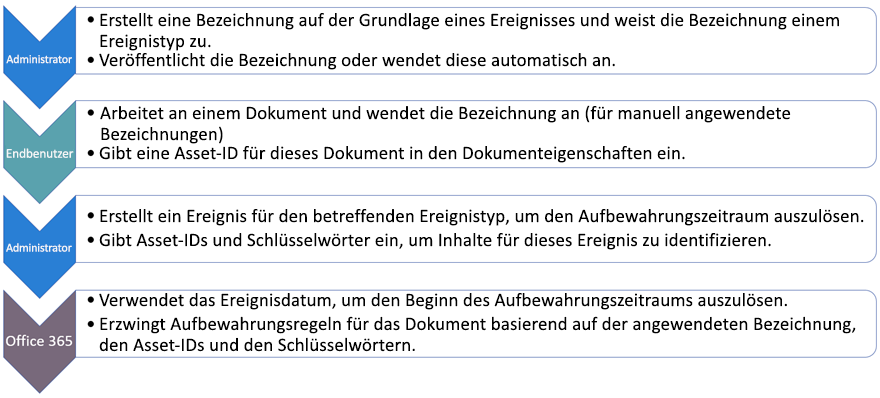
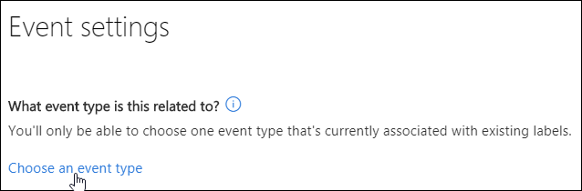

# Übersicht über die ereignisgesteuerte AufbewahrungOverview of event-driven retention

>*[Microsoft 365-Lizenzierungsleitfaden für Sicherheit und Compliance](https://aka.ms/ComplianceSD).**[Microsoft 365 licensing guidance for security & compliance](https://aka.ms/ComplianceSD).*

When you retain content, the retention period is often based on the age of the content - for example, you might retain documents for seven years after they're created and then delete them.When you retain content, the retention period is often based on the age of the content - for example, you might retain documents for seven years after they're created and then delete them. But with retention labels in Microsoft 365, you can also base a retention period on when a specific type of event occurs.But with retention labels in Microsoft 365, you can also base a retention period on when a specific type of event occurs. The event triggers the start of the retention period, and all content with a retention label applied for that type of event get the label's retention actions enforced on them.The event triggers the start of the retention period, and all content with a retention label applied for that type of event get the label's retention actions enforced on them.
  
Sie können Bezeichnungen mit ereignisgesteuerter Aufbewahrung zum Beispiel in den folgenden Szenarien verwenden:For example, you can use labels with event-driven retention for:
  
- **Employees leaving the organization** Suppose that employee records must be retained for 10 years from the time an employee leaves the organization.**Employees leaving the organization** Suppose that employee records must be retained for 10 years from the time an employee leaves the organization. After 10 years elapse, all documents related to the hiring, performance, and termination of that employee need to be disposed.After 10 years elapse, all documents related to the hiring, performance, and termination of that employee need to be disposed. The event that triggers the 10-year retention period is the employee leaving the organization.The event that triggers the 10-year retention period is the employee leaving the organization. 
    
- **Contract expiration** Suppose that all records related to contracts need to be retained for five years from the time the contract expires.**Contract expiration** Suppose that all records related to contracts need to be retained for five years from the time the contract expires. The event that triggers the five-year retention period is the expiration of the contract.The event that triggers the five-year retention period is the expiration of the contract. 
    
- **Product lifetime** Your organization might have retention requirements related to the last manufacturing date of products for content such as technical specifications.**Product lifetime** Your organization might have retention requirements related to the last manufacturing date of products for content such as technical specifications. In this case, the last manufacturing date is the event that triggers the retention period.In this case, the last manufacturing date is the event that triggers the retention period. 
    
Event-driven retention is typically used as part of a records-management process.Event-driven retention is typically used as part of a records-management process. This means that:This means that:
  
- Labels based on events also usually classify content as a record.Labels based on events also usually classify content as a record. For more information, see [Using Content Search to find all content with a specific retention label applied to it](labels.md#using-content-search-to-find-all-content-with-a-specific-retention-label-applied-to-it).For more information, see [Using Content Search to find all content with a specific retention label applied to it](labels.md#using-content-search-to-find-all-content-with-a-specific-retention-label-applied-to-it).
    
- Ein Dokument, das als Datensatz deklariert wurde, dessen Ereignisauslöser jedoch noch nicht ausgelöst wurde, wird auf unbegrenzte Zeit beibehalten (Datensätze können nicht dauerhaft gelöscht werden), bis ein Ereignis den Aufbewahrungszeitraum des Dokuments auslöst.A document that's been declared as a record but whose event trigger has not yet happened is retained indefinitely (records can't be permanently deleted), until an event triggers that document's retention period.
    
- Retention labels based on events usually trigger a disposition review at the end of the retention period, so that a records manager can manually review and dispose the content.Retention labels based on events usually trigger a disposition review at the end of the retention period, so that a records manager can manually review and dispose the content. For more information, see [Disposition of content](disposition.md).For more information, see [Disposition of content](disposition.md).
    
Eine auf einem Ereignis basierende Bezeichnung weist die gleichen Funktionen wie jede Aufbewahrungs Bezeichnung in Microsoft 365 auf.A label based on an event has the same capabilities as any retention label in Microsoft  365. Weitere Informationen finden Sie unter [Informationen zu Aufbewahrungskennzeichen](labels.md).For more information, see [Learn about retention labels](labels.md).

## Grundlegendes zur Beziehung zwischen Ereignistypen, Bezeichnungen, Ereignissen und Asset-IDsUnderstanding the relationship between event types, labels, events, and asset IDs

Um die ereignisgesteuerte Aufbewahrung erfolgreich zu verwenden, müssen Sie die Beziehung zwischen Ereignistypen, Aufbewahrungsbezeichnungen, Ereignissen und Asset-IDs verstehen, wie in den Diagrammen und der nachfolgenden Erklärung gezeigt:To successfully use event-driven retention, it's important to understand the relationship between event types, retention labels, events, and asset IDs as illustrated in the diagrams and the explanation that follows: 
  

  

  
1. Sie erstellen Aufbewahrungsbezeichnungen für unterschiedliche Arten von Inhalten und ordnen diesen dann einen Ereignistyp zu.You create retention labels for different types of content and then associate them with a type of event. Aufbewahrungsbezeichnungen für verschiedene Arten von Produktdateien und Datensätzen werden beispielsweise einem Ereignistyp mit der Bezeichnung „Product Lifetime“ zugeordnet, da diese Datensätze ab dem Ende des Produktlebenszyklus für 10 Jahre aufbewahrt werden müssen.For example, retention labels for different types of product files and records are associated with an event type named Product Lifetime because those records must be retained for 10 years from the time the product reaches its end of life.
    
2. Benutzer (in der Regel Datensatzverwalter) wenden diese Aufbewahrungsbezeichnungen auf Inhalte an, und geben (bei SharePoint- und OneDrive-Dokumenten) eine Objekt-ID für jedes Element ein.Users (typically records managers) apply those retention labels to content and (for SharePoint and OneDrive documents) enter an asset ID for each item. In diesem Beispiel ist die Objekt-ID ein von der Organisation verwendeter Produktname oder -code.In this example, the asset ID is a product name or code used by the organization. Daher wird den Datensätzen jedes Produkts eine Aufbewahrungsbezeichnung zugewiesen, und jeder Datensatz verfügt über eine Eigenschaft, die eine Objekt-ID enthält.Thus, each product's records are assigned a retention label, and each record has a property that contains an asset ID. Das Diagramm stellt **alle Inhalte** für alle Produktdatensätze in einer Organisation dar, wobei jedes Element die Objekt-ID des Produkts trägt, um dessen Datensatz es sich handelt.The diagram represents **all of the content** for all product records in an organization, and each item bears the asset ID of the product whose record it is. 
    
3. Product Lifetime is the event type; a specific product reaching end of life is an event.Product Lifetime is the event type; a specific product reaching end of life is an event. When an event of that event type occurs - in this case, when a product reaches its end of life - you create an event that specifies:When an event of that event type occurs - in this case, when a product reaches its end of life - you create an event that specifies:
    
  - Eine Asset-ID (für SharePoint- und OneDrive-Dokumente)An asset ID (for SharePoint and OneDrive documents)
    
  - Keywords (for Exchange items).Keywords (for Exchange items). In this example, the organization uses a product code in messages containing product records, so the keyword for Exchange items is the same as the asset ID for SharePoint and OneDrive documents.In this example, the organization uses a product code in messages containing product records, so the keyword for Exchange items is the same as the asset ID for SharePoint and OneDrive documents.
    
  - The date when the event occurred.The date when the event occurred. This date is used as the start of the retention period.This date is used as the start of the retention period. This date can be the current, a past, or a future date.This date can be the current, a past, or a future date.
    
4. Nach der Erstellung eines Ereignisses wird dieses Ereignisdatum mit allen Inhalten synchronisiert, die eine Aufbewahrungsbezeichnung dieses Ereignistyps aufweisen und die angegebene Objekt-ID bzw. das angegebene Schlüsselwort enthalten.After you create an event, that event date is synchronized to all the content that has a retention label of that event type and that contains the specified asset ID or keyword. Wie bei jeder Aufbewahrungsbezeichnung kann die Synchronisierung bis zu 7 Tage dauern.Like any retention label, this synchronization can take up to 7 days. Im vorherigen Diagramm haben alle rot eingekreisten Elemente den Aufbewahrungszeitraum durch dieses Ereignis ausgelöst.In the previous diagram, all the items circled in red have their retention period triggered by this event . Mit anderen Worten, wenn dieses Produkt das Ende seiner Lebensdauer erreicht, löst dieses Ereignis den Aufbewahrungszeitraum für die Produktdatensätze aus.In other words, when this product reaches its end of life, that event triggers the retention period for that product's records.
    
Folgendes sollten Sie verstehen: Wenn Sie für ein Ereignis keine Objekt-ID und keine Schlüsselwörter angeben, wird der Aufbewahrungszeitraum für **alle Inhalte** mit einer Bezeichnung dieses Ereignistyps durch das Ereignis ausgelöst.It's important to understand that if you don't specify an asset ID or keywords for an event, **all content** with a label of that event type will have its retention period triggered by the event. Dies bedeutet, dass im vorherigen Diagramm der Aufbewahrungszeitraum für alle Inhalte beginnen würde.This means that in the previous diagram, all content would start being retained. Dies ist möglicherweise nicht, was Sie beabsichtigen.This might not be what you intend. 
  
Denken Sie schließlich daran, dass es zu jeder Aufbewahrungsbezeichnung eigene Aufbewahrungseinstellungen gibt.Finally, remember that each retention label has its own retention settings. In diesem Beispiel ist für alle ein Zeitraum von 10 Jahren angegeben, aber es ist möglich, dass ein Ereignis Aufbewahrungsbezeichnungen mit unterschiedlichen Aufbewahrungszeiträumen auslöst.In this example, they all specify 10 years, but it's possible for an event to trigger retention labels where each label has a different retention period.
  
## So richten Sie die ereignisgesteuerte Aufbewahrung einHow to set up event-driven retention

Allgemeiner Workflow für die ereignisgesteuerte Aufbewahrung:High-level workflow for event-driven retention:
  

  
> [!TIP]
> Unter [Verwalten des Lebenszyklus von SharePoint-Dokumenten mithilfe von Aufbewahrungsbezeichnungen](auto-apply-retention-labels-scenario.md)finden Sie ein detailliertes Szenario zur Verwendung von verwalteten Eigenschaften in SharePoint, um Aufbewahrungsbezeichnungen automatisch anzuwenden und die ereignisgesteuerte Aufbewahrung zu implementieren.See [Manage the lifecycle of SharePoint documents with retention labels](auto-apply-retention-labels-scenario.md) for a detailed scenario about using managed properties in SharePoint to auto-apply retention labels and implement event-driven retention.

### Schritt 1: Eine Bezeichnung erstellen, deren Aufbewahrungszeitraum auf einem Ereignis basiertStep 1: Create a label whose retention period is based on an event

Wählen Sie im Microsoft 365 Compliance Center im linken Navigationsbereich **Information Governance** > **Kennzeichnungen** > **eine Kennzeichnung erstellen**.In the Microsoft 365 compliance center, in the left navigation, select **Information governance** > **Labels** > **Create a label**. Wenn **Information Governance** im Navigationsbereich nicht angezeigt wird, scrollen Sie nach unten und wählen Sie **alle anzeigen** aus.If **Information governance** does not display in the navigation pane, scroll down and select **Show all**.
  
When you create the label, turn on retention, and then choose the option shown below to retain or delete the content based on an event.When you create the label, turn on retention, and then choose the option shown below to retain or delete the content based on an event. This means that the retention settings won't go into effect until Step 5, when you create an event on the **Events** page.This means that the retention settings won't go into effect until Step 5, when you create an event on the **Events** page. 
  
Beachten Sie, dass die ereignisgesteuerte Aufbewahrung in der Regel für Inhalt verwendet wird, der als Datensatz klassifiziert ist.Note that event-driven retention is typically used for content that's classified as a record. Aus diesem Grund sollten Sie, wenn Sie Aufbewahrungsbezeichnungen basierend auf einem Ereignis erstellen, in der Regel die Option **Bezeichnung verwenden, um Inhalte als "Datensatz" zu klassifizieren** auswählen.For this reason, when you create retention labels based on an event, you typically choose the option to **Use label to classify content as a "Record"**.
  
Beachten Sie außerdem, dass für die ereignisgesteuerte Aufbewahrung Aufbewahrungseinstellungen erforderlich sind, die:Also note that event-driven retention requires retention settings that:
  
- Inhalte aufbewahren.Retain the content.
    
- den Inhalt automatisch löschen oder eine Dispositionsprüfung am Ende des Aufbewahrungszeitraums auslösen.Delete the content automatically or trigger a disposition review at the end of the retention period.
    

  
### Schritt 2: Einen Ereignistyps für die Bezeichnung auswählenStep 2: Choose an event type for that label

Nachdem Sie in den Bezeichnungseinstellungen die Option ausgewählt haben, die Bezeichnung auf **einem Ereignis** zu basieren, wird die Option zum **Auswählen eines Ereignistyps** angezeigt.In the label settings, after you choose the option to base the label on an **event**, you'll see the option to **Choose an event type**. Ein Ereignistyp ist einfach eine allgemeine Beschreibung eines Ereignisses, das Sie einer Bezeichnung zuordnen möchten.An event type is simply a general description of an event that you want to associate a label with.
  
Wenn Sie zum Beispiel einen Ereignistyp mit dem Namen „Product Lifetime“ haben, erstellen Sie ereignisbasierte Aufbewahrungsbezeichnungen mit Namen, die beschreiben, auf welchen Inhaltstyp die Bezeichnungen angewendet werden sollen, z. B. „Produktentwicklungsdateien“ oder „Produktgeschäft-Entscheidungsdatensätze“.For example, if you create an event type named Product Lifetime, you'll create event-based retention labels with names that describe what types of content you want the labels to be applied to, such as "Product development files" or "Product business decision records".
  
Beachten Sie, dass der Ereignistyp nicht mehr geändert werden kann, sobald Sie einen Ereignistyp ausgewählt und die Aufbewahrungsbezeichnung erstellt haben.Note that once you choose an event type and create the retention label, the event type cannot be changed.
  

  
### Schritt 3: Veröffentlichen oder automatisches Zuweisen der ereignisbasierten AufbewahrungsbezeichnungenStep 3: Publish or auto-apply the event-based retention labels

Wie jede Aufbewahrungsbezeichnung müssen Sie auch ereignisbasierte Bezeichnungen [veröffentlichen oder automatisch zuweisen](create-retention-labels.md), damit es Inhalten manuell oder automatisch zugewiesen werden kann.Just like any retention label, you need to [publish or auto-apply](create-retention-labels.md) an event-based label, so that it's manually or automatically applied to content.

> [!NOTE]
> Wenn Sie eine ereignisgesteuerte Aufbewahrungsbezeichnung aus der Registerkarte **Datensatzverwaltung** > **Dateiplan** oder der Registerkarte **Datensteuerung** > **Bezeichnungen** wühlen, ist die Schaltfläche **Bezeichnung automatisch anwenden** nicht verfügbar.If you select an event-driven retention label from **Records Management** > **File plan** tab or **Data governance** > **Labels** tab, the **Auto-apply a label** button is not available.
> 
> Statt dieser Schaltfläche verwenden Sie die Option **Bezeichnung automatisch anwenden** über der Liste der Bezeichnungen oder Richtlinien aus einer der folgenden Speicherorte:Instead of this button, use the **Auto-apply a label** option above the list of labels or policies from one of the following locations:
> - Registerkarte **Datensatzverwaltung** > **Bezeichnungsrichtlinien****Records management** > **Label policies** tab
> - Registerkarte **Datensteuerung** > **Bezeichnungen**  oder Registerkarte **Bezeichnungsrichtlinien****Data governance** > **Labels** tab or **Label policies** tab

### Schritt 4: Eine Asset-ID eingebenStep 4: Enter an asset ID

After an event-driven label is applied to content, you can enter an asset ID for each item.After an event-driven label is applied to content, you can enter an asset ID for each item. For example, your organization might use:For example, your organization might use:
  
- Produktcodes, um Inhalt nur für ein bestimmtes Produkt aufzubewahren.Product codes that you can use to retain content for only a specific product.
    
- Projektcodes, um Inhalt nur für ein bestimmtes Projekt aufzubewahren.Project codes that you can use to retain content for only a specific project.
    
- Mitarbeiter-IDs, die Sie zum Aufbewahren von Inhalten für eine bestimmte Person verwenden können.Employee IDs that you can use to retain content for only a specific person.
    
Beachten Sie, dass die Objekt-ID nur eine weitere Dokumenteigenschaft in SharePoint und OneDrive for Business ist.Understand that Asset ID is simply another document property in SharePoint and OneDrive for Business. Ihre Organisation verwendet möglicherweise bereits andere Dokumenteigenschaften und IDs zum Klassifizieren von Inhalten.Your organization might already use other document properties and IDs to classify content. In diesem Falle können Sie beim Erstellen eines Ereignisses auch diese Eigenschaften und Werte verwenden – siehe nachfolgenden Schritt 6.If so, you can also use those properties and values when you create an event - see step 6 that follows. Wichtig ist hierbei, dass Ihre Organisation in den Dokumenteigenschaften eine Kombination aus Eigenschaft und Wert verwenden muss, um dieses Element mit einem Ereignistyp zu verknüpfen.The important point is that your organization must use some property:value combination in the document properties to associate that item with an event type.
  

  
### Schritt 5: Erstellen eines EreignissesStep 5: Create an event

When a particular instance of that event type occurs - for example, a product reaches its end of life - go to the **Records management** > **Events** page in the Microsoft 365 compliance center and create an event.When a particular instance of that event type occurs - for example, a product reaches its end of life - go to the **Records management** > **Events** page in the Microsoft 365 compliance center and create an event. You need to manually trigger an event by creating it.You need to manually trigger an event by creating it.
  
### Schritt 6: Auswählen des gleichen Ereignistyps, der von der Bezeichnung in Schritt 2 verwendet wirdStep 6: Choose the same event type used by the label in step 2

Wenn Sie ein Ereignis erstellen, wählen Sie den gleichen Ereignistyp aus, der von der Aufbewahrungsbezeichnung in Schritt 2 verwendet wird, z. B. „Product Lifetime“.When you create the event, choose the same event type used by the retention label in step 2 - for example, Product Lifetime. Nur für Inhalte, denen Aufbewahrungsbezeichnungen des betreffenden Ereignistyps zugeordnet wurden, wird der Aufbewahrungszeitraum ausgelöst.Only content with retention labels applied to it of that event type will have its retention period triggered.
  

  
### Schritt 7: Stichwörter oder Asset-ID eingebenStep 7: Enter keywords or an asset ID

Now you narrow the scope of the content by specifying asset IDs for SharePoint and OneDrive content or keywords for Exchange content.Now you narrow the scope of the content by specifying asset IDs for SharePoint and OneDrive content or keywords for Exchange content. For asset IDs, retention will be enforced only on content with the specified property:value pair.For asset IDs, retention will be enforced only on content with the specified property:value pair. If an asset ID is not entered, **all content** with labels of that event type get the same retention date applied to them.If an asset ID is not entered, **all content** with labels of that event type get the same retention date applied to them. 
  
Beachten Sie, dass die Objekt-ID nur eine weitere Dokumenteigenschaft in SharePoint und OneDrive for Business ist.Understand that Asset ID is simply another document property in SharePoint and OneDrive for Business. Wenn Sie die Eigenschaft "Objekt-ID" verwenden, geben Sie "ComplianceAssetID:\<value\>" in das untenstehende Feld für Objekt-IDs ein.If you're using the Asset ID property, you would enter ComplianceAssetID:\<value\> in the box for asset IDs shown below.
  
Your organization might have applied other properties and IDs to the documents related to this event type.Your organization might have applied other properties and IDs to the documents related to this event type. For example, if you need to detect a specific product's records, the ID might be a combination of your custom property ProductID and the value "XYZ".For example, if you need to detect a specific product's records, the ID might be a combination of your custom property ProductID and the value "XYZ". In this case, you'd enter ProductID:XYZ in the box for asset IDs shown below.In this case, you'd enter ProductID:XYZ in the box for asset IDs shown below.
  
For Exchange items, you can include keywords.For Exchange items, you can include keywords. You can refine your query by using search operators like AND, OR, and NOT.You can refine your query by using search operators like AND, OR, and NOT. For more information on operators, see [Keyword queries and search conditions for Content Search](keyword-queries-and-search-conditions.md).For more information on operators, see [Keyword queries and search conditions for Content Search](keyword-queries-and-search-conditions.md).
  
Wählen Sie schließlich das Datum aus, an dem das Ereignis eingetreten ist. Dieses Datum wird als Anfang des Aufbewahrungszeitraums verwendet.Finally, choose the date when the event occurred; this date is used as the start of the retention period. Nach der Erstellung eines Ereignisses wird dieses Ereignisdatum mit allen Inhalten synchronisiert, die eine Aufbewahrungsbezeichnung dieses Ereignistyps, die Objekt-ID und die Schlüsselwörter aufweisen. After you create an event, that event date is synchronized to all the content with a retention label of that event type, asset ID, and keywords. Wie bei jeder Aufbewahrungsbezeichnung kann die Synchronisierung bis zu 7 Tage dauern.Like any retention label, this synchronization can take up to 7 days.
  

  
## Verwenden der Inhaltssuche zum Suchen des gesamten Inhalts, dem eine bestimmte Bezeichnung oder Asset-ID zugewiesen istUse Content Search to find all content with a specific label or asset ID

Nachdem Aufbewahrungsbezeichnungen Inhalten zugewiesen wurden, können Sie die Inhaltssuche verwenden, um alle Inhalte zu suchen, die durch eine bestimmte Aufbewahrungsbezeichnung klassifiziert wurden oder eine bestimmte Asset-ID enthalten.After retention labels are assigned to content, you can use content search to find all content that's classified with a specific retention label or that contains a specific asset ID.
  
Beachten Sie beim Erstellen einer Inhaltssuche Folgendes:When you create a content search:
  
- Um alle Inhalte mit einer bestimmten Aufbewahrungsbezeichnung zu finden, wählen Sie die Bedingung **Compliancetag**, und geben Sie dann den vollständigen oder teilweisen Bezeichnungsnamen ein, oder verwenden Sie ein Platzhalterzeichen.To find all content with a specific retention label, choose the **Compliance Tag** condition, and then enter the complete label name or part of the label name and use a wildcard. 
    
- Um alle Inhalte mit einer bestimmten Asset-ID zu finden, geben Sie die **ComplianceAssetID**-Eigenschaft und einen Wert ein, und zwar im Format „ComplianceAssetID:\<value\>“.To find all content with a specific asset ID, enter the **ComplianceAssetID** property and a value, like ComplianceAssetID:\<value\>. 
    
Weitere Informationen finden Sie unter [Stichwortabfragen und Suchbedingungen für die Inhaltssuche](keyword-queries-and-search-conditions.md).For more information, see [Keyword queries and search conditions for Content Search](keyword-queries-and-search-conditions.md).
  
## BerechtigungenPermissions

To get access to the **Events** page, reviewers must be members of a role group with the **Disposition Management** role and the **View-Only Audit Logs** role.To get access to the **Events** page, reviewers must be members of a role group with the **Disposition Management** role and the **View-Only Audit Logs** role. We recommend creating a new role group called Disposition Reviewers, adding these two roles to that role group, and then adding members to the role group.We recommend creating a new role group called Disposition Reviewers, adding these two roles to that role group, and then adding members to the role group. 
  
Weitere Informationen finden Sie unter [Freigeben des Benutzerzugriffs auf das Office 365 Security &amp; Compliance Center](../security/office-365-security/grant-access-to-the-security-and-compliance-center.md).For more information, see [Give users access to the Office 365 Security &amp; Compliance Center](../security/office-365-security/grant-access-to-the-security-and-compliance-center.md).
  
## Automatisieren von Ereignissen mit PowerShellAutomate events by using PowerShell

In the admin center, you can only create events manually; it's not possible to automatically trigger an event when it occurs.In the admin center, you can only create events manually; it's not possible to automatically trigger an event when it occurs. However, you can use a Rest API to trigger events automatically; for more information, see [Automate event-based retention](automate-event-driven-retention.md).However, you can use a Rest API to trigger events automatically; for more information, see [Automate event-based retention](automate-event-driven-retention.md).

Sie können auch ereignisbasierte Aufbewahrung aus Ihren Geschäftsanwendungen heraus mithilfe eines PowerShell-Skripts automatisieren.You can also use a PowerShell script to automate event-based retention from your business applications. PowerShell-Cmdlets für die ereignisgesteuerte Aufbewahrung:The PowerShell cmdlets available for event-driven retention:
  
- [Get-ComplianceRetentionEventTypeGet-ComplianceRetentionEventType](https://go.microsoft.com/fwlink/?linkid=873002)
    
- [New-ComplianceRetentionEventTypeNew-ComplianceRetentionEventType](https://go.microsoft.com/fwlink/?linkid=873004)
    
- [Remove-ComplianceRetentionEventTypeRemove-ComplianceRetentionEventType](https://go.microsoft.com/fwlink/?linkid=873005)
    
- [Set-ComplianceRetentionEventTypeSet-ComplianceRetentionEventType](https://go.microsoft.com/fwlink/?linkid=873006)
    
- [Get-ComplianceRetentionEventGet-ComplianceRetentionEvent](https://go.microsoft.com/fwlink/?linkid=873001)
    
- [New-ComplianceRetentionEventNew-ComplianceRetentionEvent](https://go.microsoft.com/fwlink/?linkid=873003)
    

