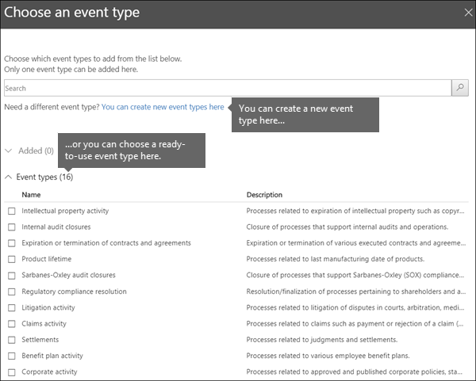

# Übersicht über die ereignisgesteuerte AufbewahrungOverview of event-driven retention

>*[Microsoft 365-Lizenzierungsleitfaden für Sicherheit und Compliance](https://aka.ms/ComplianceSD).**[Microsoft 365 licensing guidance for security & compliance](https://aka.ms/ComplianceSD).*

Wenn Sie Inhalte aufbewahren, basiert der Aufbewahrungszeitraum häufig auf dem Alter des Inhalts. Sie könnten beispielsweise Dokumente für sieben Jahre nach der Erstellung aufbewahren, und anschließend werden sie gelöscht. Wenn Sie jedoch [Aufbewahrungsbezeichnungen](labels.md) konfigurieren, können Sie auch einen Aufbewahrungszeitraum festlegen, der auf dem Auftreten eines bestimmten Ereignistyps basiert. Das Ereignis löst den Beginn des Aufbewahrungszeitraums aus, und auf alle Inhalte, denen eine Aufbewahrungsbezeichnung für diesen Ereignistyp zugewiesen wurde, werden die Aufbewahrungsaktionen angewendet.When you retain content, the retention period is often based on the age of the content. For example, you might retain documents for seven years after they're created and then delete them. But when you configure [retention labels](labels.md), you can also base a retention period on when a specific type of event occurs. The event triggers the start of the retention period, and all content with a retention label applied for that type of event get the label's retention actions enforced on them.
  
Beispiele für die Verwendung der ereignisgesteuerten Aufbewahrung:Examples for using event-driven retention:
  
- **Mitarbeiter verlassen die Organisation** Angenommen, Mitarbeiterdatensätze müssen ab dem Zeitpunkt, an dem ein Angestellter das Unternehmen verlässt, 10 Jahre lang aufbewahrt werden.**Employees leaving the organization** Suppose that employee records must be retained for 10 years from the time an employee leaves the organization. Nach 10 Jahren müssen alle Dokumente im Zusammenhang mit der Einstellung, Leistung und Kündigung dieses Angestellten gelöscht werden.After 10 years elapse, all documents related to the hiring, performance, and termination of that employee must be disposed. Das Ereignis, das den Aufbewahrungszeitraum von 10 Jahren auslöst, ist die Beendigung des Beschäftigungsverhältnisses des Mitarbeiters bei der Organisation.The event that triggers the 10-year retention period is the employee leaving the organization. 
    
- **Vertragsablauf** Angenommen, alle Datensätze im Zusammenhang mit Verträgen müssen fünf Jahre lang ab dem Zeitpunkt aufbewahrt werden, ab dem der Vertrag abläuft.**Contract expiration** Suppose that all records related to contracts must be retained for five years from the time the contract expires. Das Ereignis, das den Aufbewahrungszeitraum von fünf Jahren ausgelöst, ist der Ablauf des Vertrags.The event that triggers the five-year retention period is the expiration of the contract. 
    
- **Produktlebensdauer** – Ihre Organisation hat möglicherweise Aufbewahrungspflichten, die sich auf das letzte Fertigungsdatum von Produkten für Inhalte wie technische Daten beziehen. In diesem Fall ist das Datum der letzte Fertigung das Ereignis, das den Aufbewahrungszeitraum auslöst.**Product lifetime** Your organization might have retention requirements related to the last manufacturing date of products for content such as technical specifications. In this case, the last manufacturing date is the event that triggers the retention period. 
    
Die ereignisgesteuerte Aufbewahrung wird in der Regel als Teil eines Prozesses für die Datensatzverwaltung verwendet. Dies bedeutet:Event-driven retention is typically used as part of a records-management process. This means that:
  
- Bezeichnungen auf Basis von Ereignissen klassifizieren in der Regel auch Inhalte als Datensatz.Labels based on events also usually classify content as a record. Weitere Informationen finden Sie unter [Informationen zu Datensätzen](records.md).For more information, see [Learn about records](records.md).
    
- Ein Dokument, das als Datensatz klassifiziert wurde, dessen Ereignisauslöser jedoch noch nicht eingetreten ist, wird unbegrenzt aufbewahrt (Datensätze können nicht dauerhaft gelöscht werden), bis der Aufbewahrungszeitraum für das Dokument durch ein Ereignis ausgelöst wird.A document that's been classified as a record but whose event trigger has not yet happened is retained indefinitely (records can't be permanently deleted), until an event triggers that document's retention period.
    
- Aufbewahrungsbezeichnungen auf Basis von Ereignissen lösen in der Regel eine Löschungsprüfung am Ende des Aufbewahrungszeitraums aus, damit ein Datensatzverwalter den Inhalt manuell überprüfen und löschen kann.Retention labels based on events usually trigger a disposition review at the end of the retention period, so that a records manager can manually review and dispose of the content. Weitere Informationen finden Sie unter [Entfernung von Inhalten](disposition.md).For more information, see [Disposition of content](disposition.md).
    
Eine auf einem Ereignis basierende Aufbewahrungsbezeichnung weist die gleichen Funktionen wie jede Aufbewahrungsbezeichnung in Microsoft 365 auf.A retention label based on an event has the same capabilities as any retention label in Microsoft 365. Weitere Informationen finden Sie unter [Informationen zu Aufbewahrungskennzeichen](labels.md).For more information, see [Learn about retention labels](labels.md).

## Grundlegendes zur Beziehung zwischen Ereignistypen, Bezeichnungen, Ereignissen und Asset-IDsUnderstanding the relationship between event types, labels, events, and asset IDs

Um die ereignisgesteuerte Aufbewahrung erfolgreich zu verwenden, müssen Sie die Beziehung zwischen Ereignistypen, Aufbewahrungsbezeichnungen, Ereignissen und Asset-IDs verstehen, wie in den Diagrammen und der nachfolgenden Erklärung gezeigt:To successfully use event-driven retention, it's important to understand the relationship between event types, retention labels, events, and asset IDs as illustrated in the diagrams and the explanation that follows: 
  

  

  
1. Sie erstellen Aufbewahrungsbezeichnungen für unterschiedliche Arten von Inhalten und ordnen diesen dann einen Ereignistyp zu.You create retention labels for different types of content and then associate them with a type of event. Aufbewahrungsbezeichnungen für verschiedene Arten von Produktdateien und Datensätzen werden beispielsweise einem Ereignistyp mit der Bezeichnung „Product Lifetime“ zugeordnet, da diese Datensätze ab dem Ende des Produktlebenszyklus für 10 Jahre aufbewahrt werden müssen.For example, retention labels for different types of product files and records are associated with an event type named Product Lifetime because those records must be retained for 10 years from the time the product reaches its end of life.
    
2. Benutzer (in der Regel Datensatzverwalter) wenden diese Aufbewahrungsbezeichnungen auf Inhalte an, und geben (bei SharePoint- und OneDrive-Dokumenten) eine Objekt-ID für jedes Element ein.Users (typically records managers) apply those retention labels to content and (for SharePoint and OneDrive documents) enter an asset ID for each item. In diesem Beispiel ist die Objekt-ID ein von der Organisation verwendeter Produktname oder -code.In this example, the asset ID is a product name or code used by the organization. Daher wird den Datensätzen jedes Produkts eine Aufbewahrungsbezeichnung zugewiesen, und jeder Datensatz verfügt über eine Eigenschaft, die eine Objekt-ID enthält.Thus, each product's records are assigned a retention label, and each record has a property that contains an asset ID. Das Diagramm stellt **alle Inhalte** für alle Produktdatensätze in einer Organisation dar, wobei jedes Element die Objekt-ID des Produkts trägt, um dessen Datensatz es sich handelt.The diagram represents **all of the content** for all product records in an organization, and each item bears the asset ID of the product whose record it is. 
    
3. „Product Lifetime“ ist der Ereignistyp. Ein bestimmtes Produkt, das das Ende seines Lebenszyklus erreicht, ist ein Ereignis. Wenn ein Ereignis dieses Typs auftritt (in diesem Fall, wenn ein Produkt das Ende seiner Lebensdauer erreicht), erstellen Sie ein Ereignis, das Folgendes angibt:Product Lifetime is the event type; a specific product reaching end of life is an event. When an event of that event type occurs - in this case, when a product reaches its end of life - you create an event that specifies:
    
  - Eine Asset-ID (für SharePoint- und OneDrive-Dokumente)An asset ID (for SharePoint and OneDrive documents)
    
  - Schlüsselwörter (für Exchange-Elemente). In diesem Beispiel verwendet das Unternehmen einen Produktcode in Nachrichten, die Produktdatensätze enthalten, sodass das Schlüsselwort für Exchange-Elemente der Objekt-ID für SharePoint- und OneDrive-Dokumente entspricht.Keywords (for Exchange items). In this example, the organization uses a product code in messages containing product records, so the keyword for Exchange items is the same as the asset ID for SharePoint and OneDrive documents.
    
  - Das Datum, an dem das Ereignis aufgetreten ist. Dieses Datum wird als Beginn des Aufbewahrungszeitraums verwendet. Dieses Datum kann das aktuelle, ein vergangenes oder ein zukünftiges Datum sein.The date when the event occurred. This date is used as the start of the retention period. This date can be the current, a past, or a future date.
    
4. Nach der Erstellung eines Ereignisses wird dieses Ereignisdatum mit allen Inhalten synchronisiert, die eine Aufbewahrungsbezeichnung dieses Ereignistyps aufweisen und die angegebene Objekt-ID bzw. das angegebene Schlüsselwort enthalten.After you create an event, that event date is synchronized to all the content that has a retention label of that event type and that contains the specified asset ID or keyword. Wie bei jeder Aufbewahrungsbezeichnung kann die Synchronisierung bis zu 7 Tage dauern.Like any retention label, this synchronization can take up to 7 days. Bei allen rot eingekreisten Elementen im vorigen Diagramm wird der Aufbewahrungszeitraum durch dieses Ereignis ausgelöst.In the previous diagram, all the items circled in red have their retention period triggered by this event. Mit anderen Worten, wenn dieses Produkt das Ende seiner Lebensdauer erreicht, löst dieses Ereignis den Aufbewahrungszeitraum für die Produktdatensätze aus.In other words, when this product reaches its end of life, that event triggers the retention period for that product's records.
    
Folgendes sollten Sie verstehen: Wenn Sie für ein Ereignis keine Objekt-ID und keine Schlüsselwörter angeben, wird der Aufbewahrungszeitraum für **alle Inhalte** mit einer Bezeichnung dieses Ereignistyps durch das Ereignis ausgelöst.It's important to understand that if you don't specify an asset ID or keywords for an event, **all content** with a label of that event type will have its retention period triggered by the event. Dies bedeutet, dass im vorherigen Diagramm der Aufbewahrungszeitraum für alle Inhalte beginnen würde.This means that in the previous diagram, all content would start being retained. Dies ist möglicherweise nicht, was Sie beabsichtigen.This might not be what you intend. 
  
Denken Sie schließlich daran, dass es zu jeder Aufbewahrungsbezeichnung eigene Aufbewahrungseinstellungen gibt.Finally, remember that each retention label has its own retention settings. In diesem Beispiel ist für alle ein Zeitraum von 10 Jahren angegeben, aber es ist möglich, dass ein Ereignis Aufbewahrungsbezeichnungen mit unterschiedlichen Aufbewahrungszeiträumen auslöst.In this example, they all specify 10 years, but it's possible for an event to trigger retention labels where each label has a different retention period.
  
## So richten Sie die ereignisgesteuerte Aufbewahrung einHow to set up event-driven retention

Allgemeiner Workflow für die ereignisgesteuerte Aufbewahrung:High-level workflow for event-driven retention:
  

  
> [!TIP]
> Unter [Verwalten des Lebenszyklus von SharePoint-Dokumenten mithilfe von Aufbewahrungsbezeichnungen](auto-apply-retention-labels-scenario.md)finden Sie ein detailliertes Szenario zur Verwendung von verwalteten Eigenschaften in SharePoint, um Aufbewahrungsbezeichnungen automatisch anzuwenden und die ereignisgesteuerte Aufbewahrung zu implementieren.See [Manage the lifecycle of SharePoint documents with retention labels](auto-apply-retention-labels-scenario.md) for a detailed scenario about using managed properties in SharePoint to auto-apply retention labels and implement event-driven retention.

### Schritt 1: Eine Bezeichnung erstellen, deren Aufbewahrungszeitraum auf einem Ereignis basiertStep 1: Create a label whose retention period is based on an event

Folgen Sie zum Erstellen und Konfigurieren Ihrer Aufbewahrungsbezeichnung den Anweisungen unter [Erstellen und Konfigurieren von Aufbewahrungsbezeichnungen](create-retention-labels.md#create-and-configure-retention-labels), und wählen Sie beim Aktivieren der Aufbewahrung die Option aus, den Inhalt auf der Grundlage eines Ereignisses aufzubewahren oder zu löschen.To create and configure your retention label, use the instructions from [Create and configure retention labels](create-retention-labels.md#create-and-configure-retention-labels) and when you turn on retention, choose the option to retain or delete the content based on an event. Durch diese Einstellung werden die Aufbewahrungseinstellungen nur wirksam, wenn Sie in Schritt 5 auf der Seite **Ereignisse** ein Ereignis erstellen.This setting means that the retention settings won't go into effect until Step 5, when you create an event on the **Events** page. 
  
Die ereignisgesteuerte Aufbewahrung wird in der Regel für Inhalte verwendet, die als Datensatz klassifiziert sind. Dies ist daher ein guter Zeitpunkt, um zu überprüfen, ob Sie auch die Option zum Markieren von Inhalten als Datensatz auswählen müssen.Event-driven retention is typically used for content that's classified as a record, so this is a good time to check whether you also need to select the option that marks content as a record.
  
Für die ereignisgesteuerte Aufbewahrung sind Aufbewahrungseinstellungen erforderlich, die:Event-driven retention requires retention settings that:
  
- Inhalte aufbewahren.Retain the content.
    
- den Inhalt automatisch löschen oder eine Dispositionsprüfung am Ende des Aufbewahrungszeitraums auslösen.Delete the content automatically or trigger a disposition review at the end of the retention period.
    

### Schritt 2: Einen Ereignistyps für die Bezeichnung auswählenStep 2: Choose an event type for that label

Nachdem Sie in den Bezeichnungseinstellungen die Option ausgewählt haben, die Bezeichnung auf **einem Ereignis** zu basieren, wird die Option zum **Auswählen eines Ereignistyps** angezeigt.In the label settings, after you choose the option to base the label on an **event**, you'll see the option to **Choose an event type**. Ein Ereignistyp ist einfach eine allgemeine Beschreibung eines Ereignisses, das Sie einer Bezeichnung zuordnen möchten.An event type is simply a general description of an event that you want to associate a label with.
  
Wenn Sie zum Beispiel einen Ereignistyp mit dem Namen „Product Lifetime“ haben, erstellen Sie ereignisbasierte Aufbewahrungsbezeichnungen mit Namen, die beschreiben, auf welchen Inhaltstyp die Bezeichnungen angewendet werden sollen, z. B. „Produktentwicklungsdateien“ oder „Produktgeschäft-Entscheidungsdatensätze“.For example, if you create an event type named Product Lifetime, you'll create event-based retention labels with names that describe what types of content you want the labels to be applied to, such as "Product development files" or "Product business decision records".

Wählen Sie einen der integrierten Ereignistypen aus, oder erstellen Sie einen eigenen und wählen Sie diesen dann aus.Select one of the built-in event types, or create your own and then select it.

Der Ereignistyp kann nicht mehr geändert werden, sobald Sie ihn ausgewählt und die Aufbewahrungsbezeichnung gespeichert haben.After you choose an event type and save the retention label, the event type cannot be changed.
  

  
### Schritt 3: Veröffentlichen oder automatisches Zuweisen der ereignisbasierten AufbewahrungsbezeichnungenStep 3: Publish or auto-apply the event-based retention labels

Wie jede Aufbewahrungsbezeichnung müssen Sie auch ereignisbasierte Bezeichnungen [veröffentlichen oder automatisch anwenden](create-retention-labels.md), damit sie auf Dokumente und E-Mails angewendet werden können.Just like any retention label, you need to [publish or auto-apply](create-retention-labels.md) an event-based label, so it can be applied to documents or emails.

> [!NOTE]
> Wenn Sie eine ereignisbasierte Aufbewahrungsbezeichnung auf der Registerkarte **Datensatzverwaltung** > **Dateiplan** oder der Registerkarte **Datengovernance** > **Bezeichnungen** wählen, ist die Schaltfläche **Bezeichnung automatisch anwenden** nicht verfügbar.If you select an event-based retention label from **Records Management** > **File plan** tab or **Data governance** > **Labels** tab, the **Auto-apply a label** button is not available.
> 
> Statt dieser Schaltfläche verwenden Sie die Option **Bezeichnung automatisch anwenden** über der Liste der Bezeichnungen oder Richtlinien aus einer der folgenden Speicherorte:Instead of this button, use the **Auto-apply a label** option above the list of labels or policies from one of the following locations:
> - Registerkarte **Datensatzverwaltung** > **Bezeichnungsrichtlinien****Records management** > **Label policies** tab
> - Registerkarte **Datensteuerung** > **Bezeichnungen**  oder Registerkarte **Bezeichnungsrichtlinien****Data governance** > **Labels** tab or **Label policies** tab

### Schritt 4: Eine Asset-ID eingebenStep 4: Enter an asset ID

Nachdem eine ereignisbasierte Bezeichnung auf Inhalte angewendet wurde, können Sie für jedes Element eine Objekt-ID eingeben.After an event-based label is applied to content, you can enter an asset ID for each item. Ihre Organisation kann beispielsweise folgende Elemente verwenden:For example, your organization might use:
  
- Produktcodes, um Inhalt nur für ein bestimmtes Produkt aufzubewahren.Product codes that you can use to retain content for only a specific product.
    
- Projektcodes, um Inhalt nur für ein bestimmtes Projekt aufzubewahren.Project codes that you can use to retain content for only a specific project.
    
- Mitarbeiter-IDs, die Sie zum Aufbewahren von Inhalten für eine bestimmte Person verwenden können.Employee IDs that you can use to retain content for only a specific person.
    
Die Objekt-ID ist einfach eine weitere in SharePoint und OneDrive verfügbare Dokumenteigenschaft.Asset ID is simply another document property that's available in SharePoint and OneDrive. Ihre Organisation verwendet möglicherweise bereits andere Dokumenteigenschaften und IDs zum Klassifizieren von Inhalten.Your organization might already use other document properties and IDs to classify content. In diesem Falle können Sie beim Erstellen eines Ereignisses auch diese Eigenschaften und Werte verwenden – siehe nachfolgenden Schritt 6.If so, you can also use those properties and values when you create an event - see step 6 that follows. Wichtig ist hierbei, dass Sie in den Dokumenteigenschaften eine *Kombination aus Eigenschaft und Wert* verwenden müssen, um dieses Element mit einem Ereignistyp zu verknüpfen.The important point is that you must use some *property:value* combination in the document properties to associate that item with an event type.
  

  
### Schritt 5: Erstellen eines EreignissesStep 5: Create an event

Wenn eine bestimmte Instanz dieses Ereignistyps auftritt – z. B. wenn ein Produkt das Ende seiner Lebensdauer erreicht –, rufen Sie die Seite **Datensatzverwaltung** > **Ereignisse** im Microsoft 365 Compliance Center auf, und erstellen Sie ein Ereignis.When a particular instance of that event type occurs, such as a product reaches its end of life, go to the **Records management** > **Events** page in the Microsoft 365 compliance center and create an event. Ein Ereignis wird durch seine Erstellung ausgelöst.You trigger an event by creating it.
  
### Schritt 6: Auswählen des gleichen Ereignistyps, der von der Bezeichnung in Schritt 2 verwendet wirdStep 6: Choose the same event type used by the label in step 2

Wenn Sie ein Ereignis erstellen, wählen Sie den gleichen Ereignistyp aus, der von der Aufbewahrungsbezeichnung in Schritt 2 verwendet wird, z. B. „Product Lifetime“.When you create the event, choose the same event type used by the retention label in step 2 - for example, Product Lifetime. Nur für Inhalte, denen Aufbewahrungsbezeichnungen des betreffenden Ereignistyps zugeordnet wurden, wird der Aufbewahrungszeitraum ausgelöst.Only content with retention labels applied to it of that event type will have its retention period triggered.
  

  
### Schritt 7: Stichwörter oder Asset-ID eingebenStep 7: Enter keywords or an asset ID

Schränken Sie nun den Umfang des Inhalts ein, indem Sie Objekt-IDs für SharePoint- und OneDrive-Inhalte bzw. Schlüsselwörter für Exchange-Inhalte angeben.Now you narrow the scope of the content by specifying asset IDs for SharePoint and OneDrive content, or keywords for Exchange content. Bei Objekt-IDs wird die Aufbewahrung nur für Inhalte mit der angegebenen Kombination aus *Eigenschaft und Wert* erzwungen.For asset IDs, retention will be enforced only on content with the specified *property:value* pair. Wird keine Objekt-ID eingegeben, wird auf alle Inhalte mit Bezeichnungen dieses Ereignistyps dasselbe Aufbewahrungslimit angewendet.If an asset ID is not entered, all content with labels of that event type get the same retention date applied to them.

Ein Beispiel: Wenn Sie die Eigenschaft "Objekt-ID" verwenden, geben Sie `ComplianceAssetID:<value>` in das untenstehende Feld für Objekt-IDs ein.For example: If you're using the Asset ID property, enter `ComplianceAssetID:<value>` in the box for asset IDs shown below.
  
Möglicherweise hat Ihre Organisation andere Eigenschaften und IDs auf die mit diesem Ereignistyp verknüpften Dokumente angewendet.Your organization might have applied other properties and IDs to the documents related to this event type. Wenn Sie beispielsweise die Datensätze zu einem bestimmten Produkt ermitteln müssen, könnte die ID eine Kombination aus Ihrer benutzerdefinierten Eigenschaft "ProductID" und dem Wert "XYZ" sein.For example, if you need to detect a specific product's records, the ID might be a combination of your custom property ProductID and the value "XYZ". In diesem Fall würden Sie in das Feld für Objekt-IDs, das in der folgenden Abbildung dargestellt ist, `ProductID:XYZ` eingeben.In this case, you'd enter `ProductID:XYZ` in the box for asset IDs shown in the following picture.
  
Verwenden Sie für Exchange-Elemente Stichworte.For Exchange items, use keywords. Für eine Abfrage können Sie Suchoperatoren wie AND, OR und NOT verwenden.You can use a query by using search operators such as AND, OR, and NOT. Weitere Informationen finden Sie unter [Stichwortabfragen und Suchbedingungen für die Inhaltssuche](keyword-queries-and-search-conditions.md).For more information, see [Keyword queries and search conditions for Content Search](keyword-queries-and-search-conditions.md).
  
Wählen Sie schließlich das Datum aus, an dem das Ereignis eingetreten ist. Dieses Datum wird als Anfang des Aufbewahrungszeitraums verwendet.Finally, choose the date when the event occurred; this date is used as the start of the retention period. Nach der Erstellung eines Ereignisses wird dieses Ereignisdatum mit allen Inhalten synchronisiert, die eine Aufbewahrungsbezeichnung dieses Ereignistyps, die Objekt-ID und die Schlüsselwörter aufweisen. After you create an event, that event date is synchronized to all the content with a retention label of that event type, asset ID, and keywords. Wie bei jeder Aufbewahrungsbezeichnung kann die Synchronisierung bis zu 7 Tage dauern.As with any retention label, this synchronization can take up to seven days.
  

Nach dem Erstellen eines Ereignisses gelten die Aufbewahrungseinstellungen für bereits bezeichnete und indizierte Inhalte.After creating an event, the retention settings take effect for the content that's already labeled and indexed. Wenn die Aufbewahrungsbezeichnung zu neuen Inhalten hinzugefügt wird, nachdem das Ereignis erstellt wurde, müssen Sie ein neues Ereignis mit den gleichen Details erstellen.If the retention label is added to new content after the event is created, you must create a new event with the same details.

Wenn Sie ein Ereignis löschen, werden dadurch die Aufbewahrungseinstellungen, die jetzt für bereits bezeichnete Inhalte in Kraft sind, nicht aufgehoben.Deleting an event doesn't cancel the retention settings that are now in effect for the content that's already labeled. Erstellen Sie dazu ein neues Ereignis mit den gleichen Details, lassen Sie das Datum aber leer.To do that, create a new event with the same details, but leave the date blank. 

## Verwenden der Inhaltssuche zum Auffinden aller Inhalte mit einer bestimmten Bezeichnung oder Objekt-IDUse Content Search to find all content with a specific label or asset ID

Nachdem Aufbewahrungsbezeichnungen Inhalten zugewiesen wurden, können Sie die Inhaltssuche verwenden, um alle Inhalte aufzufinden, die durch eine bestimmte Aufbewahrungsbezeichnung klassifiziert wurden oder eine bestimmte Objekt-ID enthalten.After retention labels are assigned to content, you can use content search to find all content that's classified with a specific retention label or that contains a specific asset ID:
  
- Um alle Inhalte mit einer bestimmten Aufbewahrungsbezeichnung zu finden, wählen Sie die Bedingung **Compliancebezeichnung**, und geben Sie dann den vollständigen oder teilweisen Bezeichnungsnamen ein, oder verwenden Sie einen Platzhalter.To find all content with a specific retention label, choose the **Compliance label** condition, and then enter the complete label name or part of the label name and use a wildcard. 
    
- Um alle Inhalte mit einer bestimmten Objekt-ID zu finden, geben Sie die **ComplianceAssetID**-Eigenschaft und einen Wert ein, und zwar im Format: `ComplianceAssetID:<value>`.To find all content with a specific asset ID, enter the **ComplianceAssetID** property and a value, using the format `ComplianceAssetID:<value>`. 
    
Weitere Informationen finden Sie unter [Stichwortabfragen und Suchbedingungen für die Inhaltssuche](keyword-queries-and-search-conditions.md).For more information, see [Keyword queries and search conditions for Content Search](keyword-queries-and-search-conditions.md).
  
## BerechtigungenPermissions

Um Zugriff auf die Seite **Ereignisse** zu erhalten, müssen Prüfer Mitglied einer Rollengruppe sein, die die Rolle **Disposition Management** und die Rolle **View-Only Audit Logs** hat. Es wird empfohlen, eine neue Rollengruppe namens „Disposition Reviewers“ zu erstellen, diese beiden Rollen zu dieser Rollengruppe hinzuzufügen und anschließend Mitglieder zur Rollengruppe hinzuzufügen.To get access to the **Events** page, reviewers must be members of a role group with the **Disposition Management** role and the **View-Only Audit Logs** role. We recommend creating a new role group called Disposition Reviewers, adding these two roles to that role group, and then adding members to the role group. 
  
Weitere Informationen finden Sie unter [Freigeben des Benutzerzugriffs auf das Office 365 Security &amp; Compliance Center](../security/office-365-security/grant-access-to-the-security-and-compliance-center.md).For more information, see [Give users access to the Office 365 Security &amp; Compliance Center](../security/office-365-security/grant-access-to-the-security-and-compliance-center.md).
  
## Automatisieren von Ereignissen mit PowerShellAutomate events by using PowerShell

Das Microsoft 365 Compliance Center ermöglicht es Ihnen, Ereignisse manuell zu erstellen, und unterstützt nicht das automatische Auslösen eines Ereignisses, wenn es eintritt.The Microsoft 365 compliance center lets you create events manually and doesn't support automatically triggering an event when it occurs. Sie können jedoch eine Rest-API verwenden, damit Ereignisse automatisch ausgelöst werden.However, you can use a Rest API to trigger events automatically. Weitere Informationen finden Sie unter [Automatisieren der ereignisbasierten Aufbewahrung](automate-event-driven-retention.md).For more information, see [Automate event-based retention](automate-event-driven-retention.md).

Sie können die ereignisbasierte Aufbewahrung auch aus Ihren Geschäftsanwendungen heraus mithilfe eines PowerShell-Skripts automatisieren.You can also use a PowerShell script to automate event-based retention from your business applications. PowerShell-Cmdlets für die ereignisbasierte Aufbewahrung:The PowerShell cmdlets available for event-based retention:
  
- [Get-ComplianceRetentionEventTypeGet-ComplianceRetentionEventType](https://go.microsoft.com/fwlink/?linkid=873002)
    
- [New-ComplianceRetentionEventTypeNew-ComplianceRetentionEventType](https://go.microsoft.com/fwlink/?linkid=873004)
    
- [Remove-ComplianceRetentionEventTypeRemove-ComplianceRetentionEventType](https://go.microsoft.com/fwlink/?linkid=873005)
    
- [Set-ComplianceRetentionEventTypeSet-ComplianceRetentionEventType](https://go.microsoft.com/fwlink/?linkid=873006)
    
- [Get-ComplianceRetentionEventGet-ComplianceRetentionEvent](https://go.microsoft.com/fwlink/?linkid=873001)
    
- [New-ComplianceRetentionEventNew-ComplianceRetentionEvent](https://go.microsoft.com/fwlink/?linkid=873003)
    

