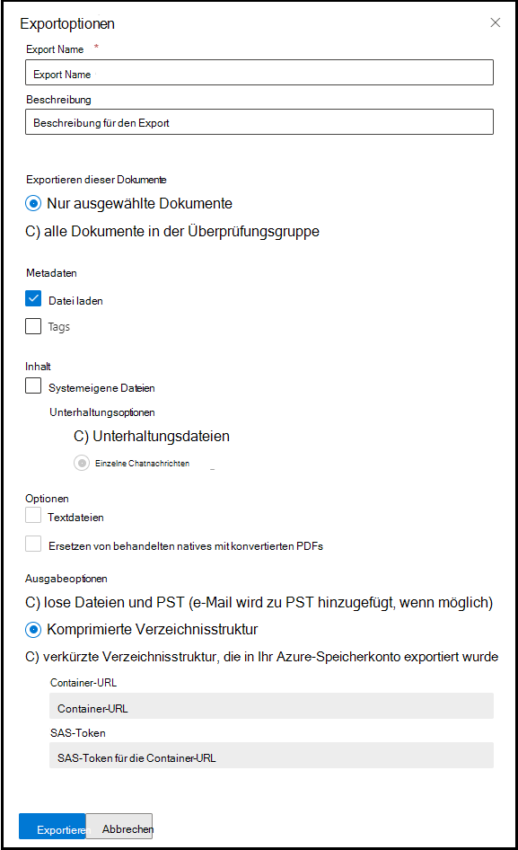

# Exportieren von Dokumenten aus einem Prüfdateisatz in Advanced eDiscovery

Mit dem Export können Benutzer den Inhalt anpassen, der im Downloadpaket enthalten ist, wenn Sie ein Dokument aus einem Prüfdateisatz in Advanced eDiscovery exportieren.

So exportieren Sie Dokumente aus einem Prüfdateisatz:

1. Öffnen Sie im Microsoft 365 Compliance Center die Advanced eDiscovery Fall, wählen Sie die Registerkarte **"Prüfdateisätze"** aus, und wählen Sie dann den Prüfdateisatz aus, den Sie exportieren möchten.

2. Klicken Sie im Prüfdateisatz auf **"Aktion exportieren".**  >  

   Das Exporttool zeigt die Flyoutseite mit den Einstellungen zum Konfigurieren des Exports an. Einige Optionen sind standardmäßig ausgewählt, sie können jedoch geändert werden. Im folgenden Abschnitt finden Sie Beschreibungen der Exportoptionen, die Sie konfigurieren können.

   

3. Nachdem Sie den Export konfiguriert haben, klicken Sie auf **"Exportieren",** um den Exportvorgang zu starten. Abhängig von der Option, die Sie im Abschnitt **"Ausgabeoptionen"** ausgewählt haben, können Sie auf die Exportdateien durch direkten Download oder im Azure Storage Konto Ihrer Organisation zugreifen.

> [!NOTE]
> Exportaufträge werden für die Dauer des Falls beibehalten. Sie müssen den Inhalt jedoch innerhalb von 30 Tagen nach Abschluss des Exportauftrags aus einem Exportauftrag herunterladen.

## Exportoptionen

Verwenden Sie die folgenden Optionen, um den Export zu konfigurieren. Nicht alle Optionen sind für einige Ausgabeoptionen zulässig, vor allem der Export von Textdateien und redigierten PDFs ist beim Exportieren in das PST-Format nicht zulässig.

- **Exportname:** Name des Exportauftrags. Dies wird verwendet, um die ZIP-Dateien zu benennen, die heruntergeladen werden.

- **Beschreibung:** Freitextfeld, in dem Sie eine Beschreibung hinzufügen können.

- **Exportieren dieser Dokumente**

  - Nur ausgewählte Dokumente: Diese Option exportiert nur die Dokumente, die derzeit ausgewählt sind. Diese Option ist nur verfügbar, wenn Elemente in einem Prüfdateisatz ausgewählt werden.
  
  - Alle gefilterten Dokumente: Mit dieser Option werden die Dokumente in einem aktiven Filter exportiert. Diese Option ist nur verfügbar, wenn ein Filter auf den Prüfdateisatz angewendet wird.
  
  - Alle Dokumente im Prüfdateisatz: Diese Option exportiert alle Dokumente im Prüfdateisatz.

- **Ausgabeoptionen:** Exportierte Inhalte stehen entweder direkt über einen Webbrowser zum Download zur Verfügung oder können an ein Azure Storage Konto gesendet werden. Die ersten beiden Optionen ermöglichen den direkten Download.
  
  - Nur Berichte: Es werden nur die Zusammenfassungs- und Ladedatei erstellt.
  
  - Lose Dateien und PSTs (E-Mails werden psTs nach Möglichkeit hinzugefügt): Dateien werden in einem Format exportiert, das der ursprünglichen Verzeichnisstruktur ähnelt, die von Benutzern in ihren systemeigenen Anwendungen angezeigt wird.  Weitere Informationen finden Sie im Abschnitt ["Lose Dateien und PST-Exportstruktur".](#loose-files-and-pst-export-structure)
  
  - Komprimierte Verzeichnisstruktur: Dateien werden exportiert und im Download enthalten.
  
  - Komprimierte Verzeichnisstruktur, die in Ihr Azure Storage-Konto exportiert wird: Dateien werden in das Azure Storage Konto Ihrer Organisation exportiert. Für diese Option müssen Sie die URL für den Container in Ihrem Azure Storage konto angeben, in den die Dateien exportiert werden sollen. Sie müssen auch das SAS-Token (Shared Access Signature) für Ihr Azure Storage Konto bereitstellen. Weitere Informationen finden Sie unter [Exportieren von Dokumenten in einem Prüfdateisatz auf ein Azure Storage Konto.](download-export-jobs.md)

- **Include**
  
  - Tags: Wenn diese Option ausgewählt ist, sind die Tagginginformationen in der Ladedatei enthalten.
  
  - Textdateien: Diese Option enthält die extrahierten Textversionen systemeigener Dateien im Export.
  
  - Ersetzen Sie redigierte Systemeigene durch konvertierte PDF-Dateien: Wenn bearbeitete PDF-Dateien während der Überprüfung generiert werden, stehen diese Dateien für den Export zur Verfügung. Sie können auswählen, dass nur die systemeigenen Dateien exportiert werden sollen, die bearbeitet wurden (indem Sie diese Option nicht auswählen), oder Sie können diese Option auswählen, um die PDF-Dateien zu exportieren, die die tatsächlichen Aktionen enthalten.

In den folgenden Abschnitten wird die Ordnerstruktur für lose Dateien und komprimierte Verzeichnisstrukturoptionen beschrieben. Exporte werden in ZIP-Dateien mit einer maximalen Größe von nicht komprimierten Inhalten von 75 GB partitioniert. Wenn die Exportgröße kleiner als 75 GB ist, besteht der Export aus einer Zusammenfassungsdatei und einer einzelnen ZIP-Datei. Bei Exporten mit mehr als 75 GB nicht komprimierten Daten werden mehrere ZIP-Dateien erstellt. Nach dem Herunterladen können die ZIP-Dateien an einem einzigen Speicherort unkomprimiert werden, um den vollständigen Export neu zu erstellen.

### Lose Dateien und PST-Exportstruktur

Wenn Sie diese Exportoption auswählen, ist der exportierte Inhalt in der folgenden Struktur organisiert:

- Summary.csv: Enthält eine Zusammenfassung der Inhalte, die aus dem Prüfdateisatz exportiert wurden.

- Stammordner: Dieser Ordner mit dem Namen [Export Name] x von z.zip und wird für jede ZIP-Dateipartition wiederholt.
  
  - Export_load_file_x von z.csv: Die Metadatendatei.
  
  - Warnungen und Fehler x von z.csv: Diese Datei enthält Informationen zu Fehlern, die beim Exportieren aus dem Prüfdateisatz aufgetreten sind.
  
  - Exchange: Dieser Ordner enthält alle Inhalte aus Exchange, die in PST-Dateien gespeichert sind. Bearbeitete PDF-Dateien können nicht in diese Option eingeschlossen werden. Wenn eine Anlage im Prüfdateisatz ausgewählt ist, wird die übergeordnete E-Mail mit der angefügten Anlage exportiert.
  
  - SharePoint: Dieser Ordner enthält alle systemeigenen Inhalte aus SharePoint in einem systemeigenen Dateiformat. Bearbeitete PDF-Dateien können nicht in diese Option eingeschlossen werden.

### Struktur des komprimierten Verzeichnisses

- Summary.csv: Enthält eine Zusammenfassung der Inhalte, die aus dem Prüfdateisatz exportiert wurden.

- Stammordner: Dieser Ordner mit dem Namen [Export Name] x von z.zip und wird für jede ZIP-Dateipartition wiederholt.
  
  - Export_load_file_x von z.csv: Die Metadatendatei und enthält auch den Speicherort jeder Datei, die in der ZIP-Datei gespeichert ist.
  
  - Warnungen und Fehler x von z.csv: Diese Datei enthält Informationen zu Fehlern, die beim Exportieren aus dem Prüfdateisatz aufgetreten sind.

  - NativeFiles: Dieser Ordner enthält alle systemeigenen Dateien, die exportiert wurden. Natives-Dateien werden durch redigierte PDFs ersetzt, wenn Sie die Option *"Redacted Natives durch konvertierte PDFs ersetzen"* ausgewählt haben.
  
  - Error_files: Dieser Ordner enthält Dateien, deren Extraktion oder ein anderer Verarbeitungsfehler aufgetreten ist. Die Dateien werden in separaten Ordnern gespeichert, entweder ExtractionError oder ProcessingError. Diese Dateien werden in der Ladedatei aufgeführt.

  - Extracted_text_files: Dieser Ordner enthält alle extrahierten Textdateien, die bei der Verarbeitung generiert wurden.

### Komprimierte Verzeichnisstruktur, die in Ihr Azure Storage Konto exportiert wird

Diese Option verwendet die gleiche allgemeine Struktur wie die Struktur des *komprimierten Verzeichnisses.* Der Inhalt wird jedoch nicht gezippt, und die Daten werden in Ihrem Azure Storage-Konto gespeichert. Diese Option wird in der Regel bei der Arbeit mit einem eDiscovery-Drittanbieter verwendet. Ausführliche Informationen zur Verwendung dieser Option finden Sie unter [Exportieren von Dokumenten in einem Prüfdateisatz, der auf ein Azure Storage Konto festgelegt ist.](download-export-jobs.md)
