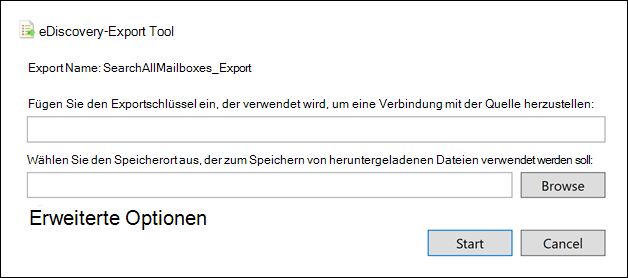

# <a name="export-content-search-results"></a><span data-ttu-id="ed558-105">Exportieren von Inhaltssuchergebnissen</span><span class="sxs-lookup"><span data-stu-id="ed558-105">Export Content search results</span></span>

<span data-ttu-id="ed558-106">Nachdem eine Inhaltssuche erfolgreich ausgeführt wurde, können Sie die Suchergebnisse auf einen lokalen Computer exportieren.</span><span class="sxs-lookup"><span data-stu-id="ed558-106">After a Content search is successfully run, you can export the search results to a local computer.</span></span> <span data-ttu-id="ed558-107">Wenn Sie E-Mail-Ergebnisse exportieren, werden diese als PST-Dateien auf Ihren Computer heruntergeladen.</span><span class="sxs-lookup"><span data-stu-id="ed558-107">When you export email results, they're downloaded to your computer as PST files.</span></span> <span data-ttu-id="ed558-108">Wenn Sie Inhalte aus SharePoint und OneDrive for Business exportieren, werden Kopien systemeigener Office exportiert.</span><span class="sxs-lookup"><span data-stu-id="ed558-108">When you export content from SharePoint and OneDrive for Business sites, copies of native Office documents are exported.</span></span> <span data-ttu-id="ed558-109">In den exportierten Suchergebnissen sind weitere Dokumente und Berichte enthalten.</span><span class="sxs-lookup"><span data-stu-id="ed558-109">There are other documents and reports included with the exported search results.</span></span>
  
<span data-ttu-id="ed558-110">Beim Exportieren der Ergebnisse einer Inhaltssuche werden die Ergebnisse vorbereitet und dann auf einen lokalen Computer heruntergeladen.</span><span class="sxs-lookup"><span data-stu-id="ed558-110">Exporting the results of a Content search involves preparing the results, and then downloading them to a local computer.</span></span>
  
## <a name="before-you-export-search-results"></a><span data-ttu-id="ed558-111">Vor dem Exportieren von Suchergebnissen</span><span class="sxs-lookup"><span data-stu-id="ed558-111">Before you export search results</span></span>

- <span data-ttu-id="ed558-112">Zum Exportieren von Suchergebnissen muss Ihnen die Rolle "Exportverwaltung" im Security & Compliance Center zugewiesen werden.</span><span class="sxs-lookup"><span data-stu-id="ed558-112">To export search results, you have to be assigned the Export management role in Security & Compliance Center.</span></span> <span data-ttu-id="ed558-113">Diese Rolle wird der integrierten Rollengruppe eDiscovery Manager zugewiesen.</span><span class="sxs-lookup"><span data-stu-id="ed558-113">This role is assigned to the built-in eDiscovery Manager role group.</span></span> <span data-ttu-id="ed558-114">Sie ist nicht standardmäßig der Rollengruppe Organisationsverwaltung zugewiesen.</span><span class="sxs-lookup"><span data-stu-id="ed558-114">It isn't assigned by default to the Organization Management role group.</span></span> <span data-ttu-id="ed558-115">Weitere Informationen finden Sie unter [Zuweisen von eDiscovery-Berechtigungen](assign-ediscovery-permissions.md).</span><span class="sxs-lookup"><span data-stu-id="ed558-115">For more information, see [Assign eDiscovery permissions](assign-ediscovery-permissions.md).</span></span>

- <span data-ttu-id="ed558-116">Der Computer, den Sie zum Exportieren der Suchergebnisse verwenden, muss die folgenden Voraussetzungen erfüllen:</span><span class="sxs-lookup"><span data-stu-id="ed558-116">The computer you use to export the search results has to meet the following system requirements:</span></span>
  
  - <span data-ttu-id="ed558-117">Neueste Version von Windows (32-Bit- oder 64-Bit-Version)</span><span class="sxs-lookup"><span data-stu-id="ed558-117">Latest version of Windows (32-bit or 64-bit)</span></span>
  
  - <span data-ttu-id="ed558-118">Microsoft .NET Framework 4.7</span><span class="sxs-lookup"><span data-stu-id="ed558-118">Microsoft .NET Framework 4.7</span></span>
  
- <span data-ttu-id="ed558-119">Sie müssen einen der folgenden unterstützten Browser verwenden, um das eDiscovery Export Tool<sup>1 ausführen zu können:</sup></span><span class="sxs-lookup"><span data-stu-id="ed558-119">You have to use one of the following supported browsers to run the eDiscovery Export Tool<sup>1</sup>:</span></span>

  - <span data-ttu-id="ed558-120">Microsoft Edge <sup>2</sup></span><span class="sxs-lookup"><span data-stu-id="ed558-120">Microsoft Edge <sup>2</sup></span></span>
  
    <span data-ttu-id="ed558-121">ODER</span><span class="sxs-lookup"><span data-stu-id="ed558-121">OR</span></span>

  - <span data-ttu-id="ed558-122">Microsoft Internet Explorer 10 und höher</span><span class="sxs-lookup"><span data-stu-id="ed558-122">Microsoft Internet Explorer 10 and later versions</span></span>
  
  > [!NOTE]
  > <span data-ttu-id="ed558-123"><sup>1</sup> Microsoft stellt keine Erweiterungen oder Add-Ons von Drittanbietern für ClickOnce her.</span><span class="sxs-lookup"><span data-stu-id="ed558-123"><sup>1</sup> Microsoft doesn't manufacture third-party extensions or add-ons for ClickOnce applications.</span></span> <span data-ttu-id="ed558-124">Das Exportieren von Suchergebnissen mithilfe eines nicht unterstützten Browsers mit Drittanbietererweiterungen oder -add-ons wird nicht unterstützt.</span><span class="sxs-lookup"><span data-stu-id="ed558-124">Exporting search results using an unsupported browser with third-party extensions or add-ons isn't supported.</span></span><br/>
  > <span data-ttu-id="ed558-125"><sup>2</sup> Als Ergebnis der letzten Änderungen an Microsoft Edge ist ClickOnce unterstützung standardmäßig nicht mehr aktiviert.</span><span class="sxs-lookup"><span data-stu-id="ed558-125"><sup>2</sup> As a result of recent changes to Microsoft Edge, ClickOnce support is no longer enabled by default.</span></span> <span data-ttu-id="ed558-126">Anweisungen zum Aktivieren ClickOnce in Edge finden Sie unter [Use the eDiscovery Export Tool in Microsoft Edge](configure-edge-to-export-search-results.md).</span><span class="sxs-lookup"><span data-stu-id="ed558-126">For instructions on enabling ClickOnce support in Edge, see [Use the eDiscovery Export Tool in Microsoft Edge](configure-edge-to-export-search-results.md).</span></span>
  
- <span data-ttu-id="ed558-127">Es wird empfohlen, Suchergebnisse auf einen lokalen Computer herunterzuladen.</span><span class="sxs-lookup"><span data-stu-id="ed558-127">We recommend downloading search results to a local computer.</span></span> <span data-ttu-id="ed558-128">Um zu vermeiden, dass die Firewall oder Proxyinfrastruktur Ihres Unternehmens beim Herunterladen von Suchergebnissen Probleme verursacht, können Sie das Herunterladen von Suchergebnissen auf einen virtuellen Desktop außerhalb Ihres Netzwerks in Betracht ziehen.</span><span class="sxs-lookup"><span data-stu-id="ed558-128">To eliminate your company's firewall or proxy infrastructure from causing issues when downloading search results, you might consider downloading search results to a virtual desktop outside of your network.</span></span> <span data-ttu-id="ed558-129">Dadurch können Timeouts verringert werden, die in Azure-Datenverbindungen beim Exportieren einer großen Anzahl von Dateien auftreten.</span><span class="sxs-lookup"><span data-stu-id="ed558-129">This may decrease timeouts that occur in Azure data connections when exporting a large number of files.</span></span> <span data-ttu-id="ed558-130">Weitere Informationen zu virtuellen Desktops finden Sie [unter Windows Virtual Desktop](https://azure.microsoft.com/services/virtual-desktop).</span><span class="sxs-lookup"><span data-stu-id="ed558-130">For more information about virtual desktops, see [Windows Virtual Desktop](https://azure.microsoft.com/services/virtual-desktop).</span></span>

- <span data-ttu-id="ed558-131">Um die Leistung beim Herunterladen von Suchergebnissen zu verbessern, sollten Sie Suchen, die einen großen Satz von Ergebnissen zurückgeben, in kleinere Suchen unterteilen.</span><span class="sxs-lookup"><span data-stu-id="ed558-131">To improve performance when downloading search results, consider dividing searches that return a large set of results into smaller searches.</span></span> <span data-ttu-id="ed558-132">Beispielsweise können Sie Datumsbereiche in Suchabfragen verwenden, um einen kleineren Satz von Ergebnissen zurückzukehren, die schneller heruntergeladen werden können.</span><span class="sxs-lookup"><span data-stu-id="ed558-132">For example, you can use date ranges in search queries to return a smaller set of results that can be downloaded faster.</span></span>
  
- <span data-ttu-id="ed558-133">Wenn Sie Suchergebnisse exportieren, werden die Daten vorübergehend an einem von Microsoft bereitgestellten Azure Storage in der Microsoft Cloud gespeichert, bevor sie auf Ihren lokalen Computer heruntergeladen werden.</span><span class="sxs-lookup"><span data-stu-id="ed558-133">When you export search results, the data is temporarily stored in a Microsoft-provided Azure Storage location in the Microsoft cloud before it's downloaded to your local computer.</span></span> <span data-ttu-id="ed558-134">Stellen Sie sicher, dass Ihre Organisation eine Verbindung mit dem Endpunkt in Azure herstellen kann, der **\* .blob.core.windows.net** ist (der Platzhalter stellt einen eindeutigen Bezeichner für Ihren Export dar).</span><span class="sxs-lookup"><span data-stu-id="ed558-134">Be sure that your organization can connect to the endpoint in Azure, which is **\*.blob.core.windows.net** (the wildcard represents a unique identifier for your export).</span></span> <span data-ttu-id="ed558-135">Die Suchergebnisse werden zwei Wochen nach der Azure Storage aus dem Speicherort gelöscht.</span><span class="sxs-lookup"><span data-stu-id="ed558-135">The search results data is deleted from the Azure Storage location two weeks after it's created.</span></span> 
  
- <span data-ttu-id="ed558-136">Wenn Ihre Organisation einen Proxyserver verwendet, um mit dem Internet zu kommunizieren, müssen Sie die Proxyservereinstellungen auf dem Computer definieren, den Sie zum Exportieren der Suchergebnisse verwenden (damit das Exporttool von Ihrem Proxyserver authentifiziert werden kann).</span><span class="sxs-lookup"><span data-stu-id="ed558-136">If your organization uses a proxy server to communicate with the Internet, you need to define the proxy server settings on the computer that you use to export the search results (so the export tool can be authenticated by your proxy server).</span></span> <span data-ttu-id="ed558-137">Öffnen Sie dazu  diemachine.config-Datei an dem Speicherort, der Ihrer Version von Windows.</span><span class="sxs-lookup"><span data-stu-id="ed558-137">To do this, open the  *machine.config*  file in the location that matches your version of Windows.</span></span> 
  
  - <span data-ttu-id="ed558-138">**32-Bit:**`%windir%\Microsoft.NET\Framework\[version]\Config\machine.config`</span><span class="sxs-lookup"><span data-stu-id="ed558-138">**32-bit:** `%windir%\Microsoft.NET\Framework\[version]\Config\machine.config`</span></span>
  
  - <span data-ttu-id="ed558-139">**64-Bit:**`%windir%\Microsoft.NET\Framework64\[version]\Config\machine.config`</span><span class="sxs-lookup"><span data-stu-id="ed558-139">**64-bit:** `%windir%\Microsoft.NET\Framework64\[version]\Config\machine.config`</span></span>
  
    <span data-ttu-id="ed558-140">Fügen Sie der Datei die  *folgenden Zeilenmachine.config*  zwischen den Tags und  `<configuration>`  `</configuration>` hinzu.</span><span class="sxs-lookup"><span data-stu-id="ed558-140">Add the following lines to the  *machine.config*  file somewhere between the  `<configuration>` and  `</configuration>` tags.</span></span> <span data-ttu-id="ed558-141">Achten Sie darauf, die richtigen Werte für Ihre Organisation zu ersetzen, z.  `ProxyServer`  `Port` B. `proxy01.contoso.com:80` .</span><span class="sxs-lookup"><span data-stu-id="ed558-141">Be sure to replace  `ProxyServer` and  `Port` with the correct values for your organization; for example, `proxy01.contoso.com:80`.</span></span> 
  
    ```xml
    <system.net>
       <defaultProxy enabled="true" useDefaultCredentials="true">
         <proxy proxyaddress="https://ProxyServer :Port " 
                usesystemdefault="False" 
                bypassonlocal="True" 
                autoDetect="False" />
       </defaultProxy>
    </system.net>
    ```

- <span data-ttu-id="ed558-142">Wenn die Ergebnisse einer Inhaltssuche älter als 7 Tage sind und Sie einen Exportauftrag übermitteln, wird eine Fehlermeldung angezeigt, in der Sie aufgefordert werden, die Suche erneut zu führen, um die Suchergebnisse zu aktualisieren.</span><span class="sxs-lookup"><span data-stu-id="ed558-142">If the results of a Content search are older than 7 days and you submit an export job, an error message is displayed prompting you to rerun the search to update the search results.</span></span> <span data-ttu-id="ed558-143">Brechen Sie in diesem Fall den Export ab, führen Sie die Suche erneut aus, und starten Sie den Export erneut.</span><span class="sxs-lookup"><span data-stu-id="ed558-143">If this happens, cancel the export, rerun the search, and then start the export again.</span></span>

## <a name="step-1-prepare-search-results-for-export"></a><span data-ttu-id="ed558-144">Schritt 1: Vorbereiten der Suchergebnisse für Export</span><span class="sxs-lookup"><span data-stu-id="ed558-144">Step 1: Prepare search results for export</span></span>

<span data-ttu-id="ed558-145">Der erste Schritt besteht in der Vorbereitung der Suchergebnisse für den Export.</span><span class="sxs-lookup"><span data-stu-id="ed558-145">The first step is to prepare the search results for exporting.</span></span> <span data-ttu-id="ed558-146">Wenn Sie Ergebnisse vorbereiten, werden sie in einen von Microsoft bereitgestellten Azure Storage in der Microsoft Cloud hochgeladen.</span><span class="sxs-lookup"><span data-stu-id="ed558-146">When you prepare results, they are uploaded to a Microsoft-provided Azure Storage location in the Microsoft cloud.</span></span> <span data-ttu-id="ed558-147">Inhalte von Postfächern und Websites werden mit einer maximalen Rate von 2 GB pro Stunde hochgeladen.</span><span class="sxs-lookup"><span data-stu-id="ed558-147">Content from mailboxes and sites is uploaded at a maximum rate of 2 GB per hour.</span></span>
  
1. <span data-ttu-id="ed558-148">Wählen Sie Microsoft 365 Compliance Center die Inhaltssuche aus, aus der Sie Ergebnisse exportieren möchten.</span><span class="sxs-lookup"><span data-stu-id="ed558-148">In the Microsoft 365 compliance center, select the content search that you want to export results from.</span></span>
  
2. <span data-ttu-id="ed558-149">Klicken Sie **im** Menü Aktionen unten auf der Flyoutseite auf **Ergebnisse exportieren.**</span><span class="sxs-lookup"><span data-stu-id="ed558-149">On the **Actions** menu at the bottom of the flyout page, click **Export results**.</span></span>

   

   <span data-ttu-id="ed558-151">Die **Flyoutseite** Ergebnisse exportieren wird angezeigt.</span><span class="sxs-lookup"><span data-stu-id="ed558-151">The **Export results** flyout page is displayed.</span></span> <span data-ttu-id="ed558-152">Die zum Exportieren von Inhalten verfügbaren Exportoptionen hängen davon ab, ob sich Suchergebnisse in Postfächern oder Websites befinden oder ob beides kombiniert wird.</span><span class="sxs-lookup"><span data-stu-id="ed558-152">The export options available to export content depend on whether search results are located in mailboxes or sites or a combination of both.</span></span>

3. <span data-ttu-id="ed558-153">Wählen **Sie unter** Ausgabeoptionen eine der folgenden Optionen aus:</span><span class="sxs-lookup"><span data-stu-id="ed558-153">Under **Output options**, choose one of the following options:</span></span>
  
   

    - <span data-ttu-id="ed558-155">**Alle Elemente, mit Ausnahme von** Elementen, die nicht ein unbekanntes Format haben, sind verschlüsselt oder wurden aus anderen Gründen nicht indiziert.</span><span class="sxs-lookup"><span data-stu-id="ed558-155">**All items, excluding ones that have unrecognized format, are encrypted, or weren't indexed for other reasons**.</span></span> <span data-ttu-id="ed558-156">Mit dieser Option werden nur indizierte Elemente exportiert.</span><span class="sxs-lookup"><span data-stu-id="ed558-156">This option exports only indexed items.</span></span>
  
    - <span data-ttu-id="ed558-157">**Alle Elemente, einschließlich** der Elemente, die ein nicht unbekanntes Format haben, sind verschlüsselt oder wurden aus anderen Gründen nicht indiziert.</span><span class="sxs-lookup"><span data-stu-id="ed558-157">**All items, including ones that have unrecognized format, are encrypted, or weren't indexed for other reasons**.</span></span> <span data-ttu-id="ed558-158">Mit dieser Option werden indizierte und nicht indizierte Elemente exportiert.</span><span class="sxs-lookup"><span data-stu-id="ed558-158">This option exports indexed and unindexed items.</span></span>
  
    - <span data-ttu-id="ed558-159">**Nur Elemente, die ein nicht unbekanntes** Format haben, verschlüsselt sind oder aus anderen Gründen nicht indiziert wurden.</span><span class="sxs-lookup"><span data-stu-id="ed558-159">**Only items that have an unrecognized format, are encrypted, or weren't indexed for other reasons**.</span></span> <span data-ttu-id="ed558-160">Mit dieser Option werden nur nicht indizierte Elemente exportiert.</span><span class="sxs-lookup"><span data-stu-id="ed558-160">This option exports only unindexed items.</span></span>

      <span data-ttu-id="ed558-161">Im Abschnitt [Weitere Informationen finden](#more-information) Sie eine Beschreibung, wie teilweise indizierte Elemente exportiert werden.</span><span class="sxs-lookup"><span data-stu-id="ed558-161">See the [More information](#more-information) section for a description about how partially indexed items are exported.</span></span> <span data-ttu-id="ed558-162">Weitere Informationen zu teilweise indizierten Elementen finden Sie unter [Teilweise indizierte Elemente in der Inhaltssuche](partially-indexed-items-in-content-search.md).</span><span class="sxs-lookup"><span data-stu-id="ed558-162">For more information about partially indexed items, see [Partially indexed items in Content search](partially-indexed-items-in-content-search.md).</span></span>

4. <span data-ttu-id="ed558-163">Wählen **Sie unter Exchange Inhalt exportieren als** eine der folgenden Optionen aus:</span><span class="sxs-lookup"><span data-stu-id="ed558-163">Under **Export Exchange content as**, choose one of the following options:</span></span>
  
   

    - <span data-ttu-id="ed558-165">**Eine PST-Datei für jedes Postfach:** Exportiert eine PST-Datei für jedes Benutzerpostfach, das Suchergebnisse enthält.</span><span class="sxs-lookup"><span data-stu-id="ed558-165">**One PST file for each mailbox**: Exports one PST file for each user mailbox that contains search results.</span></span> <span data-ttu-id="ed558-166">Alle Ergebnisse aus dem Archivpostfach des Benutzers sind in derselben PST-Datei enthalten.</span><span class="sxs-lookup"><span data-stu-id="ed558-166">Any results from the user's archive mailbox are included in the same PST file.</span></span> <span data-ttu-id="ed558-167">Mit dieser Option wird die Postfachordnerstruktur aus dem Quellpostfach reproduziert.</span><span class="sxs-lookup"><span data-stu-id="ed558-167">This option reproduces the mailbox folder structure from the source mailbox.</span></span>
  
    - <span data-ttu-id="ed558-168">**Eine PST-Datei,** die alle Nachrichten enthält: Exportiert eine einzelne PST-Datei *(Exchange.pst),* die die Suchergebnisse aus allen Quellpostfächern enthält, die in der Suche enthalten sind.</span><span class="sxs-lookup"><span data-stu-id="ed558-168">**One PST file containing all messages**: Exports a single PST file (named *Exchange.pst*) that contains the search results from all source mailboxes included in the search.</span></span> <span data-ttu-id="ed558-169">Mit dieser Option wird die Postfachordnerstruktur für jede Nachricht reproduziert.</span><span class="sxs-lookup"><span data-stu-id="ed558-169">This option reproduces the mailbox folder structure for each message.</span></span>
  
    - <span data-ttu-id="ed558-170">**Eine PST-Datei,** die alle Nachrichten in einem einzigen Ordner enthält: Exportiert Suchergebnisse in eine einzelne PST-Datei, in der sich alle Nachrichten in einem einzigen Ordner auf oberster Ebene befinden.</span><span class="sxs-lookup"><span data-stu-id="ed558-170">**One PST file containing all messages in a single folder**: Exports search results to a single PST file where all messages are located in a single, top-level folder.</span></span> <span data-ttu-id="ed558-171">Mit dieser Option können Prüfer Elemente in chronologischer Reihenfolge überprüfen (Elemente werden nach gesendeten Datums sortiert), ohne in der ursprünglichen Postfachordnerstruktur für jedes Element navigieren zu müssen.</span><span class="sxs-lookup"><span data-stu-id="ed558-171">This option lets reviewers review items in chronological order (items are sorted by sent date) without having to navigate the original mailbox folder structure for each item.</span></span>
  
    - <span data-ttu-id="ed558-172">**Einzelne Nachrichten:** Exportiert Suchergebnisse als einzelne E-Mail-Nachrichten im MSG-Format.</span><span class="sxs-lookup"><span data-stu-id="ed558-172">**Individual messages**: Exports search results as individual email messages, using the .msg format.</span></span> <span data-ttu-id="ed558-173">Wenn Sie diese Option auswählen, werden die E-Mail-Suchergebnisse in einen Ordner im Dateisystem exportiert.</span><span class="sxs-lookup"><span data-stu-id="ed558-173">If you select this option, email search results are exported to a folder in the file system.</span></span> <span data-ttu-id="ed558-174">Der Ordnerpfad für einzelne Nachrichten ist identisch mit dem, der verwendet wird, wenn Sie die Ergebnisse in eine PST-Datei exportiert haben.</span><span class="sxs-lookup"><span data-stu-id="ed558-174">The folder path for individual messages is the same as the one used if you exported the results to a PST file.</span></span>
  
5. <span data-ttu-id="ed558-175">Konfigurieren Sie die folgenden zusätzlichen Optionen:</span><span class="sxs-lookup"><span data-stu-id="ed558-175">Configure the following additional options:</span></span>

   

   1. <span data-ttu-id="ed558-177">Aktivieren Sie **das Kontrollkästchen Deduplizierung für Exchange aktivieren,** um doppelte Nachrichten auszuschließen.</span><span class="sxs-lookup"><span data-stu-id="ed558-177">Select the **Enable de-duplication for Exchange content** checkbox to exclude duplicate messages.</span></span>
  
      <span data-ttu-id="ed558-178">Wenn Sie diese Option auswählen, wird nur eine Kopie einer Nachricht exportiert, auch wenn in den durchsuchten Postfächern mehrere Kopien derselben Nachricht gefunden werden.</span><span class="sxs-lookup"><span data-stu-id="ed558-178">If you select this option, only one copy of a message will be exported even if multiple copies of the same message are found in the mailboxes that were searched.</span></span> <span data-ttu-id="ed558-179">Der Exportergebnisbericht (eine Datei mit dem Namen Results.csv) enthält eine Zeile für jede Kopie einer doppelten Nachricht, sodass Sie die Postfächer (oder öffentlichen Ordner) identifizieren können, die eine Kopie der doppelten Nachricht enthalten.</span><span class="sxs-lookup"><span data-stu-id="ed558-179">The export results report (which is a file named Results.csv) will contain a row for every copy of a duplicate message so that you can identify the mailboxes (or public folders) that contain a copy of the duplicate message.</span></span> <span data-ttu-id="ed558-180">Weitere Informationen zur Deduplizierung und zur Ermittlung doppelter Elemente finden Sie unter [Deduplizierung in eDiscovery-Suchergebnissen.](de-duplication-in-ediscovery-search-results.md)</span><span class="sxs-lookup"><span data-stu-id="ed558-180">For more information about de-duplication and how duplicate items are identified, see [De-duplication in eDiscovery search results](de-duplication-in-ediscovery-search-results.md).</span></span>
  
   2. <span data-ttu-id="ed558-181">Aktivieren Sie das Kontrollkästchen Versionen **für SharePoint dateien enthalten,** um alle Versionen von Dokumenten SharePoint exportieren.</span><span class="sxs-lookup"><span data-stu-id="ed558-181">Select the **Include versions for SharePoint files** checkbox to export all versions of SharePoint documents.</span></span> <span data-ttu-id="ed558-182">Diese Option wird nur angezeigt, wenn die Inhaltsquellen der Suche SharePoint oder OneDrive for Business enthalten.</span><span class="sxs-lookup"><span data-stu-id="ed558-182">This option appears only if the content sources of the search include SharePoint or OneDrive for Business sites.</span></span>
  
   3. <span data-ttu-id="ed558-183">Wählen Sie **die Datei exportieren in einem komprimierten (gezippten) Ordner aus. Enthält nur einzelne Nachrichten und SharePoint, um** Suchergebnisse in komprimierte Ordner zu exportieren.</span><span class="sxs-lookup"><span data-stu-id="ed558-183">Select the **Export files in a compressed (zipped) folder. Includes only individual messages and SharePoint documents** checkbox to export search results to compressed folders.</span></span> <span data-ttu-id="ed558-184">Diese Option wird nur angezeigt, wenn Sie auswählen, Exchange Elemente als einzelne Nachrichten zu exportieren und wenn die Suchergebnisse SharePoint oder OneDrive enthalten.</span><span class="sxs-lookup"><span data-stu-id="ed558-184">This option appears only when you choose to export Exchange items as individual messages and when the search results include SharePoint or OneDrive documents.</span></span> <span data-ttu-id="ed558-185">Diese Option wird in erster Linie verwendet, um den Grenzwert von 260 Zeichen in Windows dateinamen beim Exportieren von Elementen zu verwenden.</span><span class="sxs-lookup"><span data-stu-id="ed558-185">This option is primarily used to work around the 260 character limit in Windows file path names when items are exported.</span></span> <span data-ttu-id="ed558-186">Weitere Informationen finden Sie unter "Dateinamen [](#more-information) exportierter Elemente".</span><span class="sxs-lookup"><span data-stu-id="ed558-186">See the "Filenames of exported items" in the [More information](#more-information) section.</span></span>
  
6. <span data-ttu-id="ed558-187">Klicken **Sie auf Exportieren,** um den Exportvorgang zu starten.</span><span class="sxs-lookup"><span data-stu-id="ed558-187">Click **Export** to start the export process.</span></span> <span data-ttu-id="ed558-188">Die Suchergebnisse werden zum Herunterladen vorbereitet, d. h. sie werden von den ursprünglichen Inhaltsspeicherorten gesammelt und dann an einen Azure Storage in der Microsoft Cloud hochgeladen.</span><span class="sxs-lookup"><span data-stu-id="ed558-188">The search results are prepared for downloading, which means they're collected from the original content locations and then uploaded to an Azure Storage location in the Microsoft cloud.</span></span> <span data-ttu-id="ed558-189">Dieser Vorgang kann einige Minuten in Anspruch nehmen.</span><span class="sxs-lookup"><span data-stu-id="ed558-189">This may take several minutes.</span></span>

<span data-ttu-id="ed558-190">Anweisungen zum Herunterladen der exportierten Suchergebnisse finden Sie im nächsten Abschnitt.</span><span class="sxs-lookup"><span data-stu-id="ed558-190">See the next section for instructions to download the exported search results.</span></span>
  
## <a name="step-2-download-the-search-results"></a><span data-ttu-id="ed558-191">Schritt 2: Herunterladen der Suchergebnisse</span><span class="sxs-lookup"><span data-stu-id="ed558-191">Step 2: Download the search results</span></span>

<span data-ttu-id="ed558-192">Im nächsten Schritt laden Sie die Suchergebnisse aus dem Azure Storage auf Ihren lokalen Computer herunter.</span><span class="sxs-lookup"><span data-stu-id="ed558-192">The next step is to download the search results from the Azure Storage location to your local computer.</span></span>
  
1. <span data-ttu-id="ed558-193">Wählen Sie **auf der** Seite Inhaltssuche im Microsoft 365 Compliance Center die Registerkarte **Exporte** aus.</span><span class="sxs-lookup"><span data-stu-id="ed558-193">On the **Content search** page in the Microsoft 365 compliance center, select the **Exports** tab</span></span>
  
   <span data-ttu-id="ed558-194">Möglicherweise müssen Sie auf **Aktualisieren klicken,** um die Liste der Exportaufträge so zu aktualisieren, dass der erstellte Exportauftrag angezeigt wird.</span><span class="sxs-lookup"><span data-stu-id="ed558-194">You may have to click **Refresh** to update the list of export jobs so that it shows the export job you created.</span></span> <span data-ttu-id="ed558-195">Exportaufträge haben denselben Namen wie die entsprechende Suche mit **_Export** an den Suchnamen angefügt.</span><span class="sxs-lookup"><span data-stu-id="ed558-195">Export jobs have the same name as the corresponding search with **_Export** appended to the search name.</span></span>
  
2. <span data-ttu-id="ed558-196">Wählen Sie den Exportauftrag aus, den Sie in Schritt 1 erstellt haben.</span><span class="sxs-lookup"><span data-stu-id="ed558-196">Select the export job that you created in Step 1.</span></span>

3. <span data-ttu-id="ed558-197">Klicken Sie auf der Flyoutseite unter **Export key** auf Kopieren in **die Zwischenablage**.</span><span class="sxs-lookup"><span data-stu-id="ed558-197">On the flyout page under **Export key**, click **Copy to clipboard**.</span></span> <span data-ttu-id="ed558-198">Sie verwenden diesen Schlüssel in Schritt 6, um die Suchergebnisse herunterzuladen.</span><span class="sxs-lookup"><span data-stu-id="ed558-198">You use this key in step 6 to download the search results.</span></span>
  
   > [!IMPORTANT]
   > <span data-ttu-id="ed558-199">Da jeder benutzer das eDiscovery-Exporttool installieren und starten kann und diesen Schlüssel zum Herunterladen der Suchergebnisse verwenden kann, sollten Sie Vorkehrungen treffen, um diesen Schlüssel zu schützen, so wie Sie Kennwörter oder andere sicherheitsrelevante Informationen schützen würden.</span><span class="sxs-lookup"><span data-stu-id="ed558-199">Because anyone can install and start the eDiscovery Export tool, and then use this key to download the search results, be sure to take precautions to protect this key just like you would protect passwords or other security-related information.</span></span>

4. <span data-ttu-id="ed558-200">Klicken Sie oben auf der Flyoutseite auf **Ergebnisse herunterladen.**</span><span class="sxs-lookup"><span data-stu-id="ed558-200">At the top of the flyout page, click **Download results**.</span></span>

5. <span data-ttu-id="ed558-201">Wenn Sie aufgefordert werden, das **eDiscovery-Exporttool zu** installieren, klicken Sie auf **Installieren**.</span><span class="sxs-lookup"><span data-stu-id="ed558-201">If you're prompted to install the **eDiscovery Export Tool**, click **Install**.</span></span>

6. <span data-ttu-id="ed558-202">Gehen Sie **im eDiscovery-Exporttool** wie folgt vor:</span><span class="sxs-lookup"><span data-stu-id="ed558-202">In the **eDiscovery Export Tool**, do the following:</span></span>

   

   1. <span data-ttu-id="ed558-204">Fügen Sie den Exportschlüssel, den Sie in Schritt 3 kopiert haben, in das entsprechende Feld ein.</span><span class="sxs-lookup"><span data-stu-id="ed558-204">Paste the export key that you copied in step 3 in the appropriate box.</span></span>
  
   2. <span data-ttu-id="ed558-205">Klicken Sie auf **Durchsuchen**, um das Verzeichnis anzugeben, in das die Dateien mit den Suchergebnissen heruntergeladen werden sollen.</span><span class="sxs-lookup"><span data-stu-id="ed558-205">Click **Browse** to specify the location where you want to download the search result files.</span></span>
  
      > [!IMPORTANT]
      >  <span data-ttu-id="ed558-206">Aufgrund der hohen Netzwerkaktivität während des Downloads sollten Sie Suchergebnisse nur an einen Speicherort auf einem internen Laufwerk auf Ihrem lokalen Computer herunterladen.</span><span class="sxs-lookup"><span data-stu-id="ed558-206">Due to high network activity during download, you should download search results only to a location on an internal drive on your local computer.</span></span> <span data-ttu-id="ed558-207">Befolgen Sie die folgenden Richtlinien, um die beste Downloaderfahrung zu bieten:</span><span class="sxs-lookup"><span data-stu-id="ed558-207">For the best download experience, follow these guidelines:</span></span> <br/>
      >- <span data-ttu-id="ed558-208">Laden Sie keine Suchergebnisse in einen UNC-Pfad, ein zugeordnetes Netzwerklaufwerk, ein externes USB-Laufwerk oder ein synchronisiertes OneDrive for Business herunter.</span><span class="sxs-lookup"><span data-stu-id="ed558-208">Don't download search results to a UNC path, a mapped network drive, an external USB drive, or a synched OneDrive for Business account.</span></span><br/>
      >- <span data-ttu-id="ed558-209">Deaktivieren Sie die Virenschutzprüfung für den Ordner, in den Sie das Suchergebnis herunterladen.</span><span class="sxs-lookup"><span data-stu-id="ed558-209">Disable anti-virus scanning for the folder that you download the search result to.</span></span><br/>
      >- <span data-ttu-id="ed558-210">Laden Sie Suchergebnisse für gleichzeitige Downloadaufträge in verschiedene Ordner herunter.</span><span class="sxs-lookup"><span data-stu-id="ed558-210">Download search results to different folders for concurrent download jobs.</span></span>

6. <span data-ttu-id="ed558-211">Klicken Sie zum Herunterladen der Suchergebnisse auf Ihren Computer auf **Starten**.</span><span class="sxs-lookup"><span data-stu-id="ed558-211">Click **Start** to download the search results to your computer.</span></span>
  
    <span data-ttu-id="ed558-212">Das **eDiscovery-Exporttool** zeigt Statusinformationen zum Exportvorgang an, einschließlich einer Schätzung der Anzahl (und Größe) der verbleibenden Elemente, die heruntergeladen werden sollen.</span><span class="sxs-lookup"><span data-stu-id="ed558-212">The **eDiscovery Export Tool** displays status information about the export process, including an estimate of the number (and size) of the remaining items to be downloaded.</span></span> <span data-ttu-id="ed558-213">Wenn der Exportvorgang abgeschlossen ist, können Sie auf die Dateien am Speicherort zugreifen, an dem sie heruntergeladen wurden.</span><span class="sxs-lookup"><span data-stu-id="ed558-213">When the export process is complete, you can access the files in the location where they were downloaded.</span></span>

## <a name="more-information"></a><span data-ttu-id="ed558-214">Weitere Informationen</span><span class="sxs-lookup"><span data-stu-id="ed558-214">More information</span></span>

<span data-ttu-id="ed558-215">Hier finden Sie weitere Informationen zum Exportieren von Suchergebnissen.</span><span class="sxs-lookup"><span data-stu-id="ed558-215">Here's more information about exporting search results.</span></span>
  
[<span data-ttu-id="ed558-216">Exportgrenzwerte</span><span class="sxs-lookup"><span data-stu-id="ed558-216">Export limits</span></span>](#export-limits)
  
[<span data-ttu-id="ed558-217">Exportieren von Berichten</span><span class="sxs-lookup"><span data-stu-id="ed558-217">Export reports</span></span>](#export-reports)
  
[<span data-ttu-id="ed558-218">Exportieren teilweise indizierter Elemente</span><span class="sxs-lookup"><span data-stu-id="ed558-218">Exporting partially indexed items</span></span>](#exporting-partially-indexed-items)

[<span data-ttu-id="ed558-219">Exportieren einzelner Nachrichten oder PST-Dateien</span><span class="sxs-lookup"><span data-stu-id="ed558-219">Exporting individual messages or PST files</span></span>](#exporting-individual-messages-or-pst-files)

[<span data-ttu-id="ed558-220">Entschlüsseln von RMS-geschützten E-Mail-Nachrichten und verschlüsselten Dateianlagen</span><span class="sxs-lookup"><span data-stu-id="ed558-220">Decrypting RMS-protected email messages and encrypted file attachments</span></span>](#decrypting-rms-protected-email-messages-and-encrypted-file-attachments)

[<span data-ttu-id="ed558-221">Dateinamen exportierter Elemente</span><span class="sxs-lookup"><span data-stu-id="ed558-221">Filenames of exported items</span></span>](#filenames-of-exported-items)  
  
[<span data-ttu-id="ed558-222">Sonstiges</span><span class="sxs-lookup"><span data-stu-id="ed558-222">Miscellaneous</span></span>](#miscellaneous)
  
### <a name="export-limits"></a><span data-ttu-id="ed558-223">Exportgrenzwerte</span><span class="sxs-lookup"><span data-stu-id="ed558-223">Export limits</span></span>

<span data-ttu-id="ed558-224">Informationen zu Beschränkungen beim Exportieren von Inhaltssuchergebnissen finden Sie im Abschnitt "Exportlimits" unter [Limits for content search](limits-for-content-search.md#export-limits).</span><span class="sxs-lookup"><span data-stu-id="ed558-224">For information about limits when exporting content search results, see the "Export limits" section in [Limits for content search](limits-for-content-search.md#export-limits).</span></span>

### <a name="export-reports"></a><span data-ttu-id="ed558-225">Exportieren von Berichten</span><span class="sxs-lookup"><span data-stu-id="ed558-225">Export reports</span></span>
  
- <span data-ttu-id="ed558-226">Wenn Sie Suchergebnisse exportieren, werden zusätzlich zu den Suchergebnissen die folgenden Berichte einbezogen.</span><span class="sxs-lookup"><span data-stu-id="ed558-226">When you export search results, the following reports are included in addition to the search results.</span></span>
  
  - <span data-ttu-id="ed558-227">**Exportzusammenfassung** Ein Excel, das eine Zusammenfassung des Exports enthält.</span><span class="sxs-lookup"><span data-stu-id="ed558-227">**Export Summary** An Excel document that contains a summary of the export.</span></span> <span data-ttu-id="ed558-228">Dazu gehören Informationen wie die Anzahl der durchsuchten Inhaltsquellen, die geschätzten und heruntergeladenen Größen der Suchergebnisse sowie die geschätzte und heruntergeladene Anzahl der exportierten Elemente.</span><span class="sxs-lookup"><span data-stu-id="ed558-228">This includes information such as the number of content sources that were searched, the estimated and downloaded sizes of the search results, and the estimated and downloaded number of items that were exported.</span></span>
  
  - <span data-ttu-id="ed558-229">**Manifest** Eine Manifestdatei (im XML-Format), die Informationen zu jedem Element enthält, das in den Suchergebnissen enthalten ist.</span><span class="sxs-lookup"><span data-stu-id="ed558-229">**Manifest** A manifest file (in XML format) that contains information about each item included in the search results.</span></span>
  
  - <span data-ttu-id="ed558-230">**Ergebnisse** Ein Excel, das Informationen zu jedem Element enthält, das als Suchergebnis heruntergeladen wird.</span><span class="sxs-lookup"><span data-stu-id="ed558-230">**Results** An Excel document that contains information about each item that is download as a search result.</span></span> <span data-ttu-id="ed558-231">Für E-Mails enthält das Ergebnisprotokoll Informationen zu jeder Nachricht, einschließlich:</span><span class="sxs-lookup"><span data-stu-id="ed558-231">For email, the result log contains information about each message, including:</span></span>
  
    - <span data-ttu-id="ed558-232">Der Speicherort der Nachricht im Quellpostfach (einschließlich der Angabe, ob die Nachricht sich im primären oder im Archivpostfach befindet).</span><span class="sxs-lookup"><span data-stu-id="ed558-232">The location of the message in the source mailbox (including whether the message is in the primary or archive mailbox).</span></span>
  
    - <span data-ttu-id="ed558-233">Das Datum, an dem die Nachricht gesendet oder empfangen wurde.</span><span class="sxs-lookup"><span data-stu-id="ed558-233">The date the message was sent or received.</span></span>

    - <span data-ttu-id="ed558-234">Die Betreffzeile der Nachricht.</span><span class="sxs-lookup"><span data-stu-id="ed558-234">The Subject line from the message.</span></span>

    - <span data-ttu-id="ed558-235">Absender und Empfänger der Nachricht.</span><span class="sxs-lookup"><span data-stu-id="ed558-235">The sender and recipients of the message.</span></span>

    - <span data-ttu-id="ed558-236">Gibt an, ob es sich bei der Nachricht um eine doppelte Nachricht handelt, wenn Sie die Deduplizierungsoption beim Exportieren der Suchergebnisse aktiviert haben.</span><span class="sxs-lookup"><span data-stu-id="ed558-236">Whether the message is a duplicate message if you enabled the de-duplication option when exporting the search results.</span></span> <span data-ttu-id="ed558-237">Doppelte Nachrichten haben einen Wert in der Spalte **Duplizieren** in Element, der die Nachricht als Duplikat identifiziert.</span><span class="sxs-lookup"><span data-stu-id="ed558-237">Duplicate messages have a value in the **Duplicate to Item** column that identifies the message as a duplicate.</span></span> <span data-ttu-id="ed558-238">Der Wert in der **Spalte Duplizieren** in Element enthält die Elementidentität der nachricht, die exportiert wurde.</span><span class="sxs-lookup"><span data-stu-id="ed558-238">The value in the **Duplicate to Item** column contains the item identity of the message that was exported.</span></span> <span data-ttu-id="ed558-239">Weitere Informationen finden Sie unter [Deduplizierung in eDiscovery-Suchergebnissen](de-duplication-in-ediscovery-search-results.md).</span><span class="sxs-lookup"><span data-stu-id="ed558-239">For more information, see [De-duplication in eDiscovery search results](de-duplication-in-ediscovery-search-results.md).</span></span>

      <span data-ttu-id="ed558-240">Für Dokumente von SharePoint und OneDrive for Business enthält das Ergebnisprotokoll Informationen zu jedem Dokument, einschließlich:</span><span class="sxs-lookup"><span data-stu-id="ed558-240">For documents from SharePoint and OneDrive for Business sites, the result log contains information about each document, including:</span></span>

      - <span data-ttu-id="ed558-241">Die URL für das Dokument.</span><span class="sxs-lookup"><span data-stu-id="ed558-241">The URL for the document.</span></span>

      - <span data-ttu-id="ed558-242">Die URL für die Websitesammlung, in der sich das Dokument befindet.</span><span class="sxs-lookup"><span data-stu-id="ed558-242">The URL for the site collection where the document is located.</span></span>

      - <span data-ttu-id="ed558-243">Das Datum, an dem das Dokument zuletzt geändert wurde.</span><span class="sxs-lookup"><span data-stu-id="ed558-243">The date that the document was last modified.</span></span>

      - <span data-ttu-id="ed558-244">Der Name des Dokuments (das sich in der Spalte Betreff im Ergebnisprotokoll befindet).</span><span class="sxs-lookup"><span data-stu-id="ed558-244">The name of the document (which is located in the Subject column in the result log).</span></span>

  - <span data-ttu-id="ed558-245">**Nicht indizierte Elemente** Ein Excel, das Informationen zu teilweise indizierten Elementen enthält, die in den Suchergebnissen enthalten wären.</span><span class="sxs-lookup"><span data-stu-id="ed558-245">**Unindexed Items** An Excel document that contains information about any partially indexed items that would be included in the search results.</span></span> <span data-ttu-id="ed558-246">Wenn Sie beim Generieren des Suchergebnissesberichts nicht teilweise indizierte Elemente enthalten, wird dieser Bericht weiterhin heruntergeladen, ist jedoch leer.</span><span class="sxs-lookup"><span data-stu-id="ed558-246">If you don't include partially indexed items when you generate the search results report, this report will still be downloaded, but will be empty.</span></span>

  - <span data-ttu-id="ed558-247">**Fehler und Warnungen** Enthält Fehler und Warnungen für Dateien, die beim Export aufgetreten sind.</span><span class="sxs-lookup"><span data-stu-id="ed558-247">**Errors and Warnings** Contains errors and warnings for files encountered during export.</span></span> <span data-ttu-id="ed558-248">Informationen zu den einzelnen Fehlern oder Warnungen finden Sie in der Spalte Fehlerdetails.</span><span class="sxs-lookup"><span data-stu-id="ed558-248">See the Error Details column for information specific to each individual error or warning.</span></span>

  - <span data-ttu-id="ed558-249">**Übersprungene Elemente** Wenn Sie Suchergebnisse aus websites SharePoint und OneDrive for Business exportieren, enthält der Export in der Regel einen Bericht über übersprungene Elemente (SkippedItems.csv).</span><span class="sxs-lookup"><span data-stu-id="ed558-249">**Skipped Items** When you export search results from SharePoint and OneDrive for Business sites, the export will usually include a skipped items report (SkippedItems.csv).</span></span> <span data-ttu-id="ed558-250">Bei den in diesem Bericht genannten Elementen handelt es sich in der Regel um Elemente, die nicht heruntergeladen werden, z. B. ein Ordner oder eine Dokumentenmappe.</span><span class="sxs-lookup"><span data-stu-id="ed558-250">The items cited in this report are typically items that won't be downloaded, such as a folder or a document set.</span></span> <span data-ttu-id="ed558-251">Das Nichtexportieren dieser Arten von Elementen ist entwurfsweise.</span><span class="sxs-lookup"><span data-stu-id="ed558-251">Not exporting these types of items is by design.</span></span> <span data-ttu-id="ed558-252">Für andere Elemente, die übersprungen wurden, zeigen das Feld "Fehlertyp" und "Fehlerdetails" im Bericht übersprungene Elemente den Grund an, warum das Element übersprungen wurde und nicht mit den anderen Suchergebnissen heruntergeladen wurde.</span><span class="sxs-lookup"><span data-stu-id="ed558-252">For other items that were skipped, the 'Error Type' and 'Error Details' field in the skipped items report show the reason the item was skipped and wasn't downloaded with the other search results.</span></span>

  - <span data-ttu-id="ed558-253">**Trace.log** Enthält detaillierte Protokollierungsinformationen zum Exportprozess und kann beim Aufdecken von Problemen während des Exports helfen.</span><span class="sxs-lookup"><span data-stu-id="ed558-253">**Trace.log** Contains detailed logging information about the export process and can help uncover issues during export.</span></span> <span data-ttu-id="ed558-254">Wenn Sie ein Ticket mit dem Microsoft Support zu einem Problem im Zusammenhang mit dem Exportieren von Suchergebnissen öffnen, werden Sie möglicherweise aufgefordert, dieses Ablaufverfolgungsprotokoll zur Verfügung zu stellen.</span><span class="sxs-lookup"><span data-stu-id="ed558-254">If you open a ticket with Microsoft Support about an issue related to exporting search results, you may be asked to provide this trace log.</span></span>
  
    > [!NOTE]
    > <span data-ttu-id="ed558-255">Sie können diese Dokumente einfach exportieren, ohne die tatsächlichen Suchergebnisse exportieren zu müssen.</span><span class="sxs-lookup"><span data-stu-id="ed558-255">You can just export these documents without having to export the actual search results.</span></span> <span data-ttu-id="ed558-256">Weitere [Informationen finden Sie unter Exportieren eines Inhaltssuchberichts.](export-a-content-search-report.md)</span><span class="sxs-lookup"><span data-stu-id="ed558-256">See [Export a Content search report](export-a-content-search-report.md).</span></span>
  
### <a name="exporting-partially-indexed-items"></a><span data-ttu-id="ed558-257">Exportieren teilweise indizierter Elemente</span><span class="sxs-lookup"><span data-stu-id="ed558-257">Exporting partially indexed items</span></span>
  
- <span data-ttu-id="ed558-258">Wenn Sie Postfachelemente aus einer Inhaltssuche exportieren, die alle Postfachelemente in den Suchergebnissen zurückgibt (da in der Suchabfrage keine Schlüsselwörter enthalten sind), werden teilweise indizierte Elemente nicht in die PST-Datei kopiert, die die nicht indizierten Elemente enthält.</span><span class="sxs-lookup"><span data-stu-id="ed558-258">If you're exporting mailbox items from a content search that returns all mailbox items in the search results (because no keywords where included in the search query), partially indexed items won't be copied to the PST file that contains the unindexed items.</span></span> <span data-ttu-id="ed558-259">Dies liegt daran, dass alle Elemente, einschließlich teilweise indizierter Elemente, automatisch in die regulären Suchergebnisse einbezogen werden.</span><span class="sxs-lookup"><span data-stu-id="ed558-259">This is because all items, including any partially indexed items, are automatically included in the regular search results.</span></span> <span data-ttu-id="ed558-260">Dies bedeutet, dass teilweise indizierte Elemente in einer PST-Datei (oder als einzelne Nachrichten) enthalten sind, die die anderen indizierten Elemente enthält.</span><span class="sxs-lookup"><span data-stu-id="ed558-260">This means that partially indexed items will be included in a PST file (or as individual messages) that contains the other, indexed items.</span></span>

    <span data-ttu-id="ed558-261">Wenn Sie die indizierten und teilweise indizierten Elemente exportieren oder nur die indizierten Elemente aus einer Inhaltssuche exportieren, die alle Elemente zurückgibt, wird dieselbe Anzahl von Elementen heruntergeladen.</span><span class="sxs-lookup"><span data-stu-id="ed558-261">If you export both the indexed and partially indexed items or if you export only the indexed items from a content search that returns all items, the same number of items will be downloaded.</span></span> <span data-ttu-id="ed558-262">Dies geschieht, obwohl die geschätzten Suchergebnisse für die Inhaltssuche (die in den Suchstatistiken im Security & Compliance Center angezeigt werden) weiterhin eine separate Schätzung für die Anzahl der teilweise indizierten Elemente enthalten.</span><span class="sxs-lookup"><span data-stu-id="ed558-262">This happens even though the estimated search results for the content search (displayed in the search statistics in the Security & Compliance Center) will still include a separate estimate for the number of partially indexed items.</span></span> <span data-ttu-id="ed558-263">Angenommen, die Schätzung für eine Suche, die alle Elemente enthält (keine Schlüsselwörter in der Suchabfrage), zeigt, dass 1.000 Elemente gefunden wurden und dass auch 200 teilweise indizierte Elemente gefunden wurden.</span><span class="sxs-lookup"><span data-stu-id="ed558-263">For example, let's say that the estimate for a search that includes all items (no keywords in the search query) shows that 1,000 items were found and that 200 partially indexed items were also found.</span></span> <span data-ttu-id="ed558-264">In diesem Fall enthalten die 1.000 Elemente die teilweise indizierten Elemente, da die Suche alle Elemente zurückgibt.</span><span class="sxs-lookup"><span data-stu-id="ed558-264">In this case, the 1,000 items include the partially indexed items because the search returns all items.</span></span> <span data-ttu-id="ed558-265">Anders ausgedrückt: Es werden 1.000 Elemente insgesamt von der Suche zurückgegeben, und nicht 1.200 Elemente (wie erwartet).</span><span class="sxs-lookup"><span data-stu-id="ed558-265">In other words, there are 1,000 total items returned by the search, and not 1,200 items (as you might expect).</span></span> <span data-ttu-id="ed558-266">Wenn Sie die Ergebnisse dieser Suche exportieren und indizierte und teilweise indizierte Elemente exportieren (oder nur teilweise indizierte Elemente exportieren), werden 1.000 Elemente heruntergeladen.</span><span class="sxs-lookup"><span data-stu-id="ed558-266">If you export the results of this search and choose to export indexed and partially indexed items (or export only partially indexed items), then 1,000 items will be downloaded.</span></span> <span data-ttu-id="ed558-267">Dies liegt daran, dass teilweise indizierte Elemente in die regulären (indizierten) Ergebnisse eingeschlossen werden, wenn Sie eine leere Suchabfrage verwenden, um alle Elemente zurückzukehren.</span><span class="sxs-lookup"><span data-stu-id="ed558-267">Again, that's because partially indexed items are included with the regular (indexed) results when you use a blank search query to return all items.</span></span> <span data-ttu-id="ed558-268">Wenn Sie in diesem Beispiel nur teilweise indizierte Elemente exportieren möchten, werden nur die 200 nicht indizierten Elemente heruntergeladen.</span><span class="sxs-lookup"><span data-stu-id="ed558-268">In this same example, if you choose to export only partially indexed items, then only the 200 unindexed items would be downloaded.</span></span>

    <span data-ttu-id="ed558-269">Beachten Sie außerdem, dass im vorherigen Beispiel (wenn Sie indizierte und teilweise indizierte Elemente exportieren oder nur indizierte Elemente exportieren) im Export **summary** report, der in den exportierten Suchergebnissen enthalten ist, 1.000 geschätzte Elemente und 1.000 heruntergeladene Elemente aus denselben Gründen wie zuvor beschrieben auflistet.</span><span class="sxs-lookup"><span data-stu-id="ed558-269">Also note that in the previous example (when you export indexed and partially indexed items or you export only indexed items), the **Export Summary** report included with the exported search results would list 1,000 items estimated items and 1,000 downloaded items for the same reasons as previously described.</span></span> 

- <span data-ttu-id="ed558-270">Wenn die Suche, aus der Sie Ergebnisse exportieren, eine Suche nach bestimmten Inhaltsstandorten oder allen Inhaltsstandorten in Ihrer Organisation war, werden nur die Teilelemente von Inhaltsstandorten exportiert, die Elemente enthalten, die den Suchkriterien entsprechen.</span><span class="sxs-lookup"><span data-stu-id="ed558-270">If the search that you're exporting results from was a search of specific content locations or all content locations in your organization, only the partial items from content locations that contain items that match the search criteria will be exported.</span></span> <span data-ttu-id="ed558-271">Anders ausgedrückt: Wenn keine Suchergebnisse in einem Postfach oder einer Website gefunden werden, werden teilweise indizierte Elemente in diesem Postfach oder standort nicht exportiert.</span><span class="sxs-lookup"><span data-stu-id="ed558-271">In other words, if no search results are found in a mailbox or site, then any partially indexed items in that mailbox or site won't be exported.</span></span> <span data-ttu-id="ed558-272">Der Grund dafür ist, dass das Exportieren teilweise indizierter Elemente von vielen Speicherorten in der Organisation die Wahrscheinlichkeit von Exportfehlern erhöhen und die Zeit erhöhen kann, die zum Exportieren und Herunterladen der Suchergebnisse benötigt wird.</span><span class="sxs-lookup"><span data-stu-id="ed558-272">The reason for this is that exporting partially indexed items from lots of locations in the organization might increase the likelihood of export errors and increase the time it takes to export and download the search results.</span></span>

    <span data-ttu-id="ed558-273">Um teilweise indizierte Elemente aus allen Inhaltsverzeichnissen für eine Suche zu exportieren, konfigurieren Sie die Suche so, dass alle Elemente zurückgegeben werden (durch Entfernen von Schlüsselwörtern aus der Suchabfrage), und exportieren Sie dann nur teilweise indizierte Elemente, wenn Sie die Suchergebnisse exportieren.</span><span class="sxs-lookup"><span data-stu-id="ed558-273">To export partially indexed items from all content locations for a search, configure the search to return all items (by removing any keywords from the search query) and then export only partially indexed items when you export the search results.</span></span>

    
  
- <span data-ttu-id="ed558-275">Beim Exportieren von Suchergebnissen von SharePoint- oder OneDrive for Business-Websites hängt die Möglichkeit zum Exportieren nicht indizierter Elemente auch von der ausgewählten Exportoption und davon ab, ob eine durchsuchte Website ein indiziertes Element enthält, das den Suchkriterien entspricht.</span><span class="sxs-lookup"><span data-stu-id="ed558-275">When exporting search results from SharePoint or OneDrive for Business sites, the ability to export unindexed items also depends on the export option that you select and whether a site that was searched contains an indexed item that matches the search criteria.</span></span> <span data-ttu-id="ed558-276">Wenn Sie beispielsweise bestimmte SharePoint- oder OneDrive for Business-Websites durchsuchen und keine Suchergebnisse gefunden werden, werden keine nicht indizierten Elemente von diesen Websites exportiert, wenn Sie die zweite Exportoption zum Exportieren indizierter und nicht indizierter Elemente auswählen.</span><span class="sxs-lookup"><span data-stu-id="ed558-276">For example, if you search specific SharePoint or OneDrive for Business sites and no search results are found, then no unindexed items from those sites will be exported if you choose the second export option to export both indexed and unindexed items.</span></span> <span data-ttu-id="ed558-277">Wenn ein indiziertes Element von einer Website den Suchkriterien entspricht, werden alle nicht indizierten Elemente von dieser Website exportiert, wenn indizierte und nicht indizierte Elemente exportiert werden.</span><span class="sxs-lookup"><span data-stu-id="ed558-277">If an indexed item from a site does match the search criteria, then all unindexed items from that site will be exported when exporting both indexed and unindexed items.</span></span> <span data-ttu-id="ed558-278">In der folgenden Abbildung werden die Exportoptionen beschrieben, die darauf basieren, ob eine Website ein indiziertes Element enthält, das den Suchkriterien entspricht.</span><span class="sxs-lookup"><span data-stu-id="ed558-278">The following illustration describes the export options based on whether a site contains an indexed item that matches the search criteria.</span></span>

    

    <span data-ttu-id="ed558-280">a.</span><span class="sxs-lookup"><span data-stu-id="ed558-280">a.</span></span> <span data-ttu-id="ed558-281">Nur indizierte Elemente, die den Suchkriterien entsprechen, werden exportiert.</span><span class="sxs-lookup"><span data-stu-id="ed558-281">Only indexed items that match the search criteria are exported.</span></span> <span data-ttu-id="ed558-282">Es werden keine teilweise indizierten Elemente exportiert.</span><span class="sxs-lookup"><span data-stu-id="ed558-282">No partially indexed items are exported.</span></span>

    <span data-ttu-id="ed558-283">b.</span><span class="sxs-lookup"><span data-stu-id="ed558-283">b.</span></span> <span data-ttu-id="ed558-284">Wenn keine indizierten Elemente von einer Website den Suchkriterien entsprechen, werden teilweise indizierte Elemente von derselben Website nicht exportiert.</span><span class="sxs-lookup"><span data-stu-id="ed558-284">If no indexed items from a site match the search criteria, then partially indexed items from that same site aren't exported.</span></span> <span data-ttu-id="ed558-285">Wenn indizierte Elemente von einer Website in den Suchergebnissen zurückgegeben werden, werden die teilweise indizierten Elemente von dieser Website exportiert.</span><span class="sxs-lookup"><span data-stu-id="ed558-285">If indexed items from a site are returned in the search results, then the partially indexed items from that site are exported.</span></span> <span data-ttu-id="ed558-286">Anders ausgedrückt: Nur die teilweise indizierten Elemente von Websites, die Elemente enthalten, die den Suchkriterien entsprechen, werden exportiert.</span><span class="sxs-lookup"><span data-stu-id="ed558-286">In other words, only the partially indexed items from sites that contain items that match the search criteria are exported.</span></span>

    <span data-ttu-id="ed558-287">c.</span><span class="sxs-lookup"><span data-stu-id="ed558-287">c.</span></span> <span data-ttu-id="ed558-288">Alle teilweise indizierten Elemente von allen Websites in der Suche werden exportiert, unabhängig davon, ob eine Website Elemente enthält, die den Suchkriterien entsprechen.</span><span class="sxs-lookup"><span data-stu-id="ed558-288">All partially indexed items from all sites in the search are exported, regardless of whether a site contains items that match the search criteria.</span></span>

    <span data-ttu-id="ed558-289">Wenn Sie teilweise indizierte Elemente exportieren möchten, werden teilweise indizierte Postfachelemente in eine separate PST-Datei exportiert, unabhängig von der Option, die Sie unter **Export Exchange content as auswählen.**</span><span class="sxs-lookup"><span data-stu-id="ed558-289">If you choose to export partially indexed items, partially indexed mailbox items are exported in a separate PST file regardless of the option that you choose under **Export Exchange content as**.</span></span>

- <span data-ttu-id="ed558-290">Wenn teilweise indizierte Elemente in den Suchergebnissen zurückgegeben werden (da andere Eigenschaften teilweise indizierter Elemente den Suchkriterien entsprechen), werden diese teilweise indizierten Elemente mit den regulären Suchergebnissen exportiert.</span><span class="sxs-lookup"><span data-stu-id="ed558-290">If partially indexed items are returned in the search results (because other properties of partially indexed items matched the search criteria), then those partially indexed are exported with the regular search results.</span></span> <span data-ttu-id="ed558-291">Wenn Sie also sowohl indizierte als auch teilweise indizierte Elemente exportieren möchten (indem Sie die Option Alle Elemente auswählen, einschließlich der Elemente, die ein nicht unbekanntes Format **haben,** verschlüsselt sind oder aus anderen Gründen nicht indiziert wurden), werden die teilweise indizierten Elemente, die mit den regulären Ergebnissen exportiert wurden, im Results.csv-Bericht aufgeführt.</span><span class="sxs-lookup"><span data-stu-id="ed558-291">So, if you choose to export both indexed items and partially indexed items (by selecting the **All items, including ones that have unrecognized format, are encrypted, or weren't indexed for other reasons** export option), the partially indexed items exported with the regular results will be listed in the Results.csv report.</span></span> <span data-ttu-id="ed558-292">Sie werden nicht im Bericht Nicht indizierte items.csv aufgeführt.</span><span class="sxs-lookup"><span data-stu-id="ed558-292">They will not be listed in the Unindexed items.csv report.</span></span>
  
### <a name="exporting-individual-messages-or-pst-files"></a><span data-ttu-id="ed558-293">Exportieren einzelner Nachrichten oder PST-Dateien</span><span class="sxs-lookup"><span data-stu-id="ed558-293">Exporting individual messages or PST files</span></span>
  
- <span data-ttu-id="ed558-294">Wenn der Dateipfadname einer Nachricht den maximalen Zeichengrenzwert für Windows, wird der Dateipfadname abgeschnitten.</span><span class="sxs-lookup"><span data-stu-id="ed558-294">If the file path name of a message exceeds the maximum character limit for Windows, the file path name is truncated.</span></span> <span data-ttu-id="ed558-295">Der ursprüngliche Dateipfadname wird jedoch im Manifest und im ResultsLog aufgeführt.</span><span class="sxs-lookup"><span data-stu-id="ed558-295">But the original file path name will be listed in the Manifest and ResultsLog.</span></span>
  
- <span data-ttu-id="ed558-296">Wie bereits erläutert, werden E-Mail-Suchergebnisse in einen Ordner im Dateisystem exportiert.</span><span class="sxs-lookup"><span data-stu-id="ed558-296">As previously explained, email search results are exported to a folder in the file system.</span></span> <span data-ttu-id="ed558-297">Der Ordnerpfad für einzelne Nachrichten würde den Ordnerpfad im Postfach des Benutzers replizieren.</span><span class="sxs-lookup"><span data-stu-id="ed558-297">The folder path for individual messages would replicate the folder path in the user's mailbox.</span></span> <span data-ttu-id="ed558-298">Bei einer Suche mit dem Namen "ContosoCase101" befinden sich beispielsweise Nachrichten im Posteingang eines Benutzers im Ordnerpfad  `~ContosoCase101\\<date of export\Exchange\user@contoso.com (Primary)\Top of Information Store\Inbox` .</span><span class="sxs-lookup"><span data-stu-id="ed558-298">For example, for a search named "ContosoCase101" messages in a user's inbox would be located in the folder path  `~ContosoCase101\\<date of export\Exchange\user@contoso.com (Primary)\Top of Information Store\Inbox`.</span></span>

- <span data-ttu-id="ed558-299">Wenn Sie E-Mail-Nachrichten in einer PST-Datei exportieren  möchten, die alle Nachrichten in einem einzigen Ordner enthält, sind ein Ordner "Gelöschte Elemente" und ein Ordner "Suchordner" in der obersten Ebene des PST-Ordners enthalten. </span><span class="sxs-lookup"><span data-stu-id="ed558-299">If you choose to export email messages in one PST file containing all messages in a single folder, a **Deleted Items** folder and a **Search Folders** folder are included in the top level of the PST folder.</span></span> <span data-ttu-id="ed558-300">Diese Ordner sind leer.</span><span class="sxs-lookup"><span data-stu-id="ed558-300">These folders are empty.</span></span>

- <span data-ttu-id="ed558-301">Wie bereits erwähnt, müssen Sie E-Mail-Suchergebnisse als einzelne Nachrichten exportieren, um RMS-geschützte Nachrichten zu entschlüsseln, wenn sie exportiert werden.</span><span class="sxs-lookup"><span data-stu-id="ed558-301">As previously stated, you must export email search results as individual messages to decrypt RMS-protected messages when they're exported.</span></span> <span data-ttu-id="ed558-302">Verschlüsselte Nachrichten bleiben verschlüsselt, wenn Sie E-Mail-Suchergebnisse als PST-Datei exportieren.</span><span class="sxs-lookup"><span data-stu-id="ed558-302">Encrypted messages will remain encrypted if you export email search results as a PST file.</span></span>
  
### <a name="decrypting-rms-protected-email-messages-and-encrypted-file-attachments"></a><span data-ttu-id="ed558-303">Entschlüsseln von RMS-geschützten E-Mail-Nachrichten und verschlüsselten Dateianlagen</span><span class="sxs-lookup"><span data-stu-id="ed558-303">Decrypting RMS-protected email messages and encrypted file attachments</span></span>

<span data-ttu-id="ed558-304">Alle rechtegeschützten (RMS-geschützten) E-Mail-Nachrichten, die in den Ergebnissen einer Inhaltssuche enthalten sind, werden beim Exportieren entschlüsselt.</span><span class="sxs-lookup"><span data-stu-id="ed558-304">Any rights-protected (RMS-protected) email messages included in the results of a Content search will be decrypted when you export them.</span></span> <span data-ttu-id="ed558-305">Darüber hinaus wird jede Datei, [](encryption.md) die mit einer Microsoft-Verschlüsselungstechnologie verschlüsselt ist und an eine E-Mail-Nachricht angefügt ist, die in den Suchergebnissen enthalten ist, auch entschlüsselt, wenn sie exportiert wird.</span><span class="sxs-lookup"><span data-stu-id="ed558-305">Additionally, any file that's encrypted with a [Microsoft encryption technology](encryption.md) and is attached to an email message that's included in the search results will also be decrypted when it's exported.</span></span> <span data-ttu-id="ed558-306">Diese Entschlüsselungsfunktion ist standardmäßig für Mitglieder der Rollengruppe eDiscovery-Manager aktiviert.</span><span class="sxs-lookup"><span data-stu-id="ed558-306">This decryption capability is enabled by default for members of the eDiscovery Manager role group.</span></span> <span data-ttu-id="ed558-307">Dies liegt daran, dass dieser Rollengruppe standardmäßig die Verwaltungsrolle RMS Decrypt zugewiesen ist.</span><span class="sxs-lookup"><span data-stu-id="ed558-307">This is because the RMS Decrypt management role is assigned to this role group by default.</span></span> <span data-ttu-id="ed558-308">Beachten Sie beim Exportieren verschlüsselter E-Mail-Nachrichten und Anlagen folgendes:</span><span class="sxs-lookup"><span data-stu-id="ed558-308">Keep the following things in mind when exporting encrypted email messages and attachments:</span></span>
  
- <span data-ttu-id="ed558-309">Wie bereits erläutert, müssen Sie zum Entschlüsseln von RMS-geschützten Nachrichten beim Exportieren die Suchergebnisse als einzelne Nachrichten exportieren.</span><span class="sxs-lookup"><span data-stu-id="ed558-309">As previously explained, to decrypt RMS-protected messages when you export them, you have to export the search results as individual messages.</span></span> <span data-ttu-id="ed558-310">Wenn Sie Suchergebnisse in eine PST-Datei exportieren, bleiben RMS-geschützte Nachrichten verschlüsselt.</span><span class="sxs-lookup"><span data-stu-id="ed558-310">If you export search results to a PST file, RMS-protected messages remain encrypted.</span></span>

- <span data-ttu-id="ed558-311">Entschlüsselte Nachrichten werden im **ResultsLog-Bericht** identifiziert.</span><span class="sxs-lookup"><span data-stu-id="ed558-311">Messages that are decrypted are identified in the **ResultsLog** report.</span></span> <span data-ttu-id="ed558-312">Dieser Bericht enthält eine Spalte mit dem Namen **Decode Status**, und der Wert **Decoded** in dieser Spalte identifiziert die entschlüsselten Nachrichten.</span><span class="sxs-lookup"><span data-stu-id="ed558-312">This report contains a column named **Decode Status**, and a value of **Decoded** in this column identifies the messages that were decrypted.</span></span>

- <span data-ttu-id="ed558-313">Neben dem Entschlüsseln von Dateianlagen beim Exportieren von Suchergebnissen können Sie auch eine Vorschau der entschlüsselten Datei anzeigen, wenn Sie eine Vorschau der Suchergebnisse anzeigen.</span><span class="sxs-lookup"><span data-stu-id="ed558-313">In addition to decrypting file attachments when exporting search results, you can also preview the decrypted file when previewing search results.</span></span> <span data-ttu-id="ed558-314">Sie können die durch Rechte geschützte E-Mail-Nachricht nur anzeigen, nachdem Sie sie exportiert haben.</span><span class="sxs-lookup"><span data-stu-id="ed558-314">You can only view the rights-protected email message after you export it.</span></span>

- <span data-ttu-id="ed558-315">Zu diesem Zeitpunkt umfasst die Entschlüsselungsfunktion beim Exportieren von Suchergebnissen keine verschlüsselten Inhalte von SharePoint und OneDrive for Business Websites.</span><span class="sxs-lookup"><span data-stu-id="ed558-315">At this time, the decryption capability when exporting search results doesn't include encrypted content from SharePoint and OneDrive for Business sites.</span></span> <span data-ttu-id="ed558-316">In Kürze wird jedoch Unterstützung für Dokumente verfügbar sein, die mit Microsoft-Verschlüsselungstechnologien verschlüsselt und in SharePoint Online und OneDrive for Business.</span><span class="sxs-lookup"><span data-stu-id="ed558-316">However, support is coming soon for documents encrypted with Microsoft encryption technologies and stored in SharePoint Online and OneDrive for Business.</span></span>

- <span data-ttu-id="ed558-317">Wenn Sie verhindern müssen, dass eine Person RMS-schutznachrichten und verschlüsselte Dateianlagen entschlüsselt, müssen Sie eine benutzerdefinierte Rollengruppe erstellen (indem Sie die integrierte eDiscovery-Manager-Rollengruppe kopieren) und dann die Verwaltungsrolle RMS Decrypt aus der benutzerdefinierten Rollengruppe entfernen.</span><span class="sxs-lookup"><span data-stu-id="ed558-317">If you need to prevent someone from decrypting RMS-protect messages and encrypted file attachments, you have to create a custom role group (by copying the built-in eDiscovery Manager role group) and then remove the RMS Decrypt management role from the custom role group.</span></span> <span data-ttu-id="ed558-318">Fügen Sie dann die Person hinzu, die Sie nachrichten nicht entschlüsseln möchten, als Mitglied der benutzerdefinierten Rollengruppe.</span><span class="sxs-lookup"><span data-stu-id="ed558-318">Then add the person who you don't want to decrypt messages as a member of the custom role group.</span></span>
  
### <a name="filenames-of-exported-items"></a><span data-ttu-id="ed558-319">Dateinamen exportierter Elemente</span><span class="sxs-lookup"><span data-stu-id="ed558-319">Filenames of exported items</span></span>
  
- <span data-ttu-id="ed558-320">Für den vollständigen Pfadnamen für E-Mail-Nachrichten und Websitedokumente, die auf Ihren lokalen Computer exportiert werden, gibt es eine Beschränkung von 260 Zeichen (vom Betriebssystem auferlegt).</span><span class="sxs-lookup"><span data-stu-id="ed558-320">There is a 260-character limit (imposed by the operating system) for the full path name for email messages and site documents exported to your local computer.</span></span> <span data-ttu-id="ed558-321">Der vollständige Pfadname für exportierte Elemente enthält den ursprünglichen Speicherort des Elements und den Ordnerspeicherort auf dem lokalen Computer, auf den die Suchergebnisse heruntergeladen werden.</span><span class="sxs-lookup"><span data-stu-id="ed558-321">The full path name for exported items includes the item's original location and the folder location on the local computer where the search results are downloaded to.</span></span> <span data-ttu-id="ed558-322">Wenn Sie beispielsweise angeben, dass die Suchergebnisse in das  `C:\Users\Admin\Desktop\SearchResults` eDiscovery-Export-Tool heruntergeladen werden sollen, ist der vollständige Pfadname für ein heruntergeladenes E-Mail-Element  `C:\Users\Admin\Desktop\SearchResults\ContentSearch1\03.15.2017-1242PM\Exchange\sarad@contoso.com (Primary)\Top of Information Store\Inbox\Insider trading investigation.msg` .</span><span class="sxs-lookup"><span data-stu-id="ed558-322">For example, if you specify to download the search results to  `C:\Users\Admin\Desktop\SearchResults` in the eDiscovery Export tool, then the full pathname for a downloaded email item would be  `C:\Users\Admin\Desktop\SearchResults\ContentSearch1\03.15.2017-1242PM\Exchange\sarad@contoso.com (Primary)\Top of Information Store\Inbox\Insider trading investigation.msg`.</span></span>

- <span data-ttu-id="ed558-323">Wenn der Grenzwert von 260 Zeichen überschritten wird, wird der vollständige Pfadname für ein Element gekürzt, basierend auf den folgenden Bedingungen:</span><span class="sxs-lookup"><span data-stu-id="ed558-323">If the 260-character limit is exceeded, the full path name for an item will be truncated, based on the following:</span></span>

  - <span data-ttu-id="ed558-324">Wenn der vollständige Pfadname länger als 260 Zeichen ist, wird der Dateiname verkürzt, um den Grenzwert zu überschreiten. Beachten Sie, dass der abgeschnittene Dateiname (mit Ausnahme der Dateierweiterung) nicht weniger als acht Zeichen lang ist.</span><span class="sxs-lookup"><span data-stu-id="ed558-324">If the full path name is longer than 260 characters, the file name will be shortened to get under the limit; note that the truncated filename (excluding the file extension) won't be fewer than eight characters.</span></span>

  - <span data-ttu-id="ed558-325">Wenn der vollständige Pfadname nach dem Kürzen des Dateinamens noch zu lang ist, wird das Element vom aktuellen Speicherort in den übergeordneten Ordner verschoben.</span><span class="sxs-lookup"><span data-stu-id="ed558-325">If the full path name is still too long after shortening the file name, the item is moved from its current location to the parent folder.</span></span> <span data-ttu-id="ed558-326">Wenn der Pfadname noch zu lang ist, wird der Vorgang wiederholt: Kürzen Sie den Dateinamen, und verschieben Sie gegebenenfalls erneut in den übergeordneten Ordner.</span><span class="sxs-lookup"><span data-stu-id="ed558-326">If the pathname is still too long, then the process is repeated: shorten the filename, and if necessary move again to the parent folder.</span></span> <span data-ttu-id="ed558-327">Dieser Vorgang wird wiederholt, bis der vollständige Pfadname unter dem Grenzwert von 260 Zeichen liegt.</span><span class="sxs-lookup"><span data-stu-id="ed558-327">This process is repeated until the full pathname is under the 260-character limit.</span></span>

  - <span data-ttu-id="ed558-328">Wenn bereits ein abgeschnittener vollständiger Pfadname vorhanden ist, wird am Ende des Dateinamens eine Versionsnummer hinzugefügt. Beispiel: `statusmessage(2).msg` .</span><span class="sxs-lookup"><span data-stu-id="ed558-328">If a truncated full path name already exists, a version number is added to the end of the filename; for example, `statusmessage(2).msg`.</span></span>

    <span data-ttu-id="ed558-329">Um dieses Problem zu beheben, sollten Sie das Herunterladen von Suchergebnissen an einen Speicherort mit einem kurzen Pfadnamen in Betracht ziehen. Beispielsweise würde das Herunterladen von Suchergebnissen in einen Ordner namens weniger Zeichen zu den Pfadnamen exportierter Elemente hinzufügen als das Herunterladen in einen  `C:\Results` Ordner namens  `C:\Users\Admin\Desktop\Results` .</span><span class="sxs-lookup"><span data-stu-id="ed558-329">To help mitigate this issue, consider downloading search results to a location with a short path name; for example, downloading search results to a folder named  `C:\Results` would add fewer characters to the path names of exported items than downloading them to a folder named  `C:\Users\Admin\Desktop\Results`.</span></span>

- <span data-ttu-id="ed558-330">Wenn Sie Websitedokumente exportieren, ist es auch möglich, dass der ursprüngliche Dateiname eines Dokuments geändert wird.</span><span class="sxs-lookup"><span data-stu-id="ed558-330">When you export site documents, it's also possible that the original file name of a document will be modified.</span></span> <span data-ttu-id="ed558-331">Dies geschieht insbesondere für Dokumente, die aus einer SharePoint oder OneDrive for Business gelöscht wurden, die in einem Halteraum platziert wurden.</span><span class="sxs-lookup"><span data-stu-id="ed558-331">This happens specifically for documents that have been deleted from a SharePoint or OneDrive for Business site that's been placed on hold.</span></span> <span data-ttu-id="ed558-332">Nachdem ein Dokument, das sich auf einer Website befindet, die sich im Haltezustand befindet, gelöscht wurde, wird das gelöschte Dokument automatisch in die Erhaltungsarchivbibliothek für die Website verschoben (die erstellt wurde, als die Website in den Haltezustand verschoben wurde).</span><span class="sxs-lookup"><span data-stu-id="ed558-332">After a document that's on a site that's on hold is deleted, the deleted document is automatically moved to the Preservation Hold library for the site (which was created when the site was placed on hold).</span></span> <span data-ttu-id="ed558-333">Wenn das gelöschte Dokument in die Erhaltungsarchivbibliothek verschoben wird, wird eine zufällig generierte und eindeutige ID an den ursprünglichen Dateinamen des Dokuments angefügt.</span><span class="sxs-lookup"><span data-stu-id="ed558-333">When the deleted document is moved to the Preservation Hold library, a randomly generated and unique ID is appended to the original filename of the document.</span></span> <span data-ttu-id="ed558-334">Wenn beispielsweise der Dateiname für ein Dokument ist und dieses Dokument später gelöscht und in die Erhaltungsarchivbibliothek verschoben wird, wird der Dateiname des Dokuments, das in die Erhaltungsarchivbibliothek verschoben wird, in etwa  `FY2017Budget.xlsx`  `FY2017Budget_DEAF727D-0478-4A7F-87DE-5487F033C81A2000-07-05T10-37-55.xlsx` geändert.</span><span class="sxs-lookup"><span data-stu-id="ed558-334">For example, if the filename for a document is  `FY2017Budget.xlsx` and that document is later deleted and moved to the Preservation Hold library, the filename of the document that is moved to the Preservation Hold library is modified to something like  `FY2017Budget_DEAF727D-0478-4A7F-87DE-5487F033C81A2000-07-05T10-37-55.xlsx`.</span></span> <span data-ttu-id="ed558-335">Wenn ein Dokument in der Erhaltungsarchivbibliothek der Abfrage einer Inhaltssuche entspricht und Sie die Ergebnisse dieser Suche exportieren, hat die exportierte Datei den geänderten Dateinamen. In diesem Beispiel ist der Dateiname des exportierten Dokuments  `FY2017Budget_DEAF727D-0478-4A7F-87DE-5487F033C81A2000-07-05T10-37-55.xlsx` .</span><span class="sxs-lookup"><span data-stu-id="ed558-335">If a document in the Preservation Hold library matches the query of a Content search and you export the results of that search, the exported file has the modified filename; in this example, the filename of the exported document would be  `FY2017Budget_DEAF727D-0478-4A7F-87DE-5487F033C81A2000-07-05T10-37-55.xlsx`.</span></span>

    <span data-ttu-id="ed558-336">Wenn ein Dokument auf einer Website geändert wird, die sich im Haltezustand befindet (und die Versionsierung für die Dokumentbibliothek auf der Website aktiviert wurde), wird automatisch eine Kopie der Datei in der Erhaltungsarchivbibliothek erstellt.</span><span class="sxs-lookup"><span data-stu-id="ed558-336">When a document on a site that's on hold is modified (and versioning for the document library in the site has been enabled), a copy of the file is automatically created in the Preservation Hold library.</span></span> <span data-ttu-id="ed558-337">In diesem Fall wird auch eine zufällig generierte und eindeutige ID an den Dateinamen des Dokuments angefügt, das in die Erhaltungsarchivbibliothek kopiert wird.</span><span class="sxs-lookup"><span data-stu-id="ed558-337">In this case, a randomly generated and unique ID is also appended to the filename of the document that's copied to the Preservation Hold library.</span></span>

    <span data-ttu-id="ed558-338">Der Grund, warum Dateinamen von Dokumenten, die verschoben oder in die Erhaltungsarchivbibliothek kopiert werden, sind, um in Konflikt konfliktende Dateinamen zu verhindern.</span><span class="sxs-lookup"><span data-stu-id="ed558-338">The reason why filenames of documents that are moved or copied to the Preservation Hold library is to prevent conflicting filenames.</span></span> <span data-ttu-id="ed558-339">Weitere Informationen zum Platzieren eines Haltezustands auf Websites und zur Bibliothek für das Aufbewahrungsarchiv finden Sie unter [Overview of in-place hold in SharePoint Server 2016](https://support.office.com/article/5e400d68-cd51-444a-8fe6-e4df1d20aa95).</span><span class="sxs-lookup"><span data-stu-id="ed558-339">For more information about placing a hold on sites and the Preservation Hold library, see [Overview of in-place hold in SharePoint Server 2016](https://support.office.com/article/5e400d68-cd51-444a-8fe6-e4df1d20aa95).</span></span>

### <a name="miscellaneous"></a><span data-ttu-id="ed558-340">Sonstiges</span><span class="sxs-lookup"><span data-stu-id="ed558-340">Miscellaneous</span></span>
  
- <span data-ttu-id="ed558-341">Beim Herunterladen von Suchergebnissen mithilfe des eDiscovery-Exporttools wird möglicherweise der folgende Fehler angezeigt: Dies ist ein vorübergehender Fehler, der in der Regel am Speicherort Azure Storage `System.Net.WebException: The remote server returned an error: (412) The condition specified using HTTP conditional header(s) is not met.` wird.</span><span class="sxs-lookup"><span data-stu-id="ed558-341">When downloading search results using the eDiscovery Export Tool, it's possible you might receive the following error: `System.Net.WebException: The remote server returned an error: (412) The condition specified using HTTP conditional header(s) is not met.` This is transient error, which typically occurs in the Azure Storage location.</span></span> <span data-ttu-id="ed558-342">Um dieses Problem zu beheben, versuchen Sie es erneut, [die Suchergebnisse herunterzuladen,](#step-2-download-the-search-results)wodurch das eDiscovery-Exporttool neu gestartet wird.</span><span class="sxs-lookup"><span data-stu-id="ed558-342">To resolve this issue, retry [downloading the search results](#step-2-download-the-search-results), which will restart the eDiscovery Export Tool.</span></span>

- <span data-ttu-id="ed558-343">Alle Suchergebnisse und Exportberichte sind in einem Ordner enthalten, der denselben Namen wie die Inhaltssuche hat.</span><span class="sxs-lookup"><span data-stu-id="ed558-343">All search results and the export reports are included in a folder that has the same name as the Content search.</span></span> <span data-ttu-id="ed558-344">Die E-Mail-Nachrichten, die exportiert wurden, befinden sich in einem Ordner mit dem Namen **Exchange**.</span><span class="sxs-lookup"><span data-stu-id="ed558-344">The email messages that were exported are located in a folder named **Exchange**.</span></span> <span data-ttu-id="ed558-345">Dokumente befinden sich in einem Ordner namens **SharePoint**.</span><span class="sxs-lookup"><span data-stu-id="ed558-345">Documents are located in a folder named **SharePoint**.</span></span>

- <span data-ttu-id="ed558-346">Die Dateisystemmetadaten für Dokumente auf SharePoint und OneDrive for Business werden beibehalten, wenn Dokumente auf Ihren lokalen Computer exportiert werden.</span><span class="sxs-lookup"><span data-stu-id="ed558-346">The file system metadata for documents on SharePoint and OneDrive for Business sites is maintained when documents are exported to your local computer.</span></span> <span data-ttu-id="ed558-347">Das bedeutet, dass Dokumenteigenschaften, z. B. erstellte und zuletzt geänderte Datumsangaben, beim Exportieren von Dokumenten nicht geändert werden.</span><span class="sxs-lookup"><span data-stu-id="ed558-347">That means document properties, such as created and last modified dates, aren't changed when documents are exported.</span></span>

- <span data-ttu-id="ed558-348">Wenn ihre Suchergebnisse ein Listenelement aus SharePoint enthalten, das der Suchabfrage entspricht, werden alle Zeilen in der Liste zusätzlich zu dem Element exportiert, das der Suchabfrage und allen Anlagen in der Liste entspricht.</span><span class="sxs-lookup"><span data-stu-id="ed558-348">If your search results include a list item from SharePoint that matches the search query, all rows in the list will be exported in addition to the item that matches the search query and any attachments in the list.</span></span> <span data-ttu-id="ed558-349">Der Grund für dieses Verhalten besteht in der Bereitstellung eines Kontexts für Listenelemente, die in den Suchergebnissen zurückgegeben werden.</span><span class="sxs-lookup"><span data-stu-id="ed558-349">The reason for this behavior is to provide a context for list items that are returned in the search results.</span></span> <span data-ttu-id="ed558-350">Die zusätzlichen Listenelemente und Anlagen können dazu führen, dass die Anzahl der exportierten Elemente von der ursprünglichen Schätzung der Suchergebnisse abhing.</span><span class="sxs-lookup"><span data-stu-id="ed558-350">The additional list items and attachments may cause the count of exported items to be different than the original estimate of search results.</span></span>
