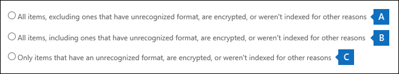

# <a name="export-content-search-results"></a>Exportieren von Inhaltssuchergebnissen

Nachdem eine Inhaltssuche erfolgreich ausgeführt wurde, können Sie die Suchergebnisse auf einen lokalen Computer exportieren. Wenn Sie E-Mail-Ergebnisse exportieren, werden diese als PST-Dateien auf Ihren Computer heruntergeladen. Wenn Sie Inhalte aus SharePoint- und OneDrive for #A0 exportieren, werden Kopien systemeigener #A1 exportiert. Es gibt weitere Dokumente und Berichte, die in den exportierten Suchergebnissen enthalten sind.
  
Beim Exportieren der Ergebnisse einer Inhaltssuche werden die Ergebnisse vorbereitet und dann auf einen lokalen Computer heruntergeladen.
  
## <a name="before-you-export-content-search-results"></a>Vor dem Exportieren von Inhaltssuchergebnissen

- Zum Exportieren von Suchergebnissen muss Ihnen die Verwaltungsrolle "Export" im Security & Compliance Center zugewiesen sein. Diese Rolle wird der integrierten Rollengruppe "eDiscovery-Manager" zugewiesen. Sie ist nicht standardmäßig der Rollengruppe "Organisationsverwaltung" zugewiesen. Weitere Informationen finden Sie unter [Zuweisen von eDiscovery-Berechtigungen](assign-ediscovery-permissions.md).

- Der Computer, den Sie zum Exportieren der Suchergebnisse verwenden, muss die folgenden Voraussetzungen erfüllen:
  
  - 32-Bit- oder 64-Bit-Versionen von Windows 7 und höher
  
  - Microsoft .NET Framework 4.7
  
- Sie müssen einen der folgenden unterstützten Browser verwenden, um das eDiscovery-Exporttool<sup>1 ausführen zu können:</sup>

  - Microsoft Edge <sup>2</sup>
  
    ODER

  - Microsoft Internet Explorer 10 und neuere Versionen
  
  > [!NOTE]
  > <sup>1</sup> Microsoft stellt keine Drittanbietererweiterungen oder -add-ons für ClickOnce her. Das Exportieren von Suchergebnissen mit einem nicht unterstützten Browser mit Drittanbietererweiterungen oder -add-ons wird nicht unterstützt.<br/>
  > <sup>2</sup> Als Ergebnis der letzten Änderungen an Microsoft Edge ist ClickOnce Unterstützung standardmäßig nicht mehr aktiviert. Anweisungen zum Aktivieren der ClickOnce in Edge finden Sie unter Verwenden des [eDiscovery-Exporttools in Microsoft Edge.](configure-edge-to-export-search-results.md)
  
- Es wird empfohlen, suchergebnisse auf einen lokalen Computer herunterzuladen. Um jedoch zu vermeiden, dass die Firewall- oder Proxyinfrastruktur Ihres Unternehmens beim Herunterladen von Suchergebnissen Probleme verursacht, sollten Sie das Herunterladen von Suchergebnissen auf einen virtuellen Desktop außerhalb Ihres Netzwerks in Betracht ziehen. Dadurch können Timeouts verringert werden, die in Azure-Datenverbindungen auftreten, wenn eine große Anzahl von Dateien exportiert wird. Weitere Informationen zu virtuellen Desktops finden Sie unter [Windows Virtual Desktop](https://azure.microsoft.com/services/virtual-desktop). 

- Um die Leistung beim Herunterladen von Suchergebnissen zu verbessern, sollten Sie suchen, die eine große Gruppe von Ergebnissen zurückgeben, in kleinere Suchen unterteilen. Beispielsweise können Sie Datumsbereiche in Suchabfragen verwenden, um eine kleinere Gruppe von Ergebnissen zurückzukehren, die schneller heruntergeladen werden können.
  
- Wenn Sie Suchergebnisse exportieren, werden die Daten vorübergehend an einem von Microsoft bereitgestellten Azure Storage-Speicherort in der Microsoft Cloud gespeichert, bevor sie auf Ihren lokalen Computer heruntergeladen werden. Stellen Sie sicher, dass Ihre Organisation eine Verbindung mit dem Endpunkt in Azure herstellen kann, der **\* .blob.core.windows.net** ist (der Platzhalter stellt einen eindeutigen Bezeichner für Ihren Export dar). Die Suchergebnisse werden zwei Wochen nach ihrer Erstelle aus dem Azure Storage-Speicherort gelöscht. 
  
- Wenn Ihre Organisation einen Proxyserver für die Kommunikation mit dem Internet verwendet, müssen Sie die Proxyservereinstellungen auf dem Computer definieren, den Sie zum Exportieren der Suchergebnisse verwenden (damit das Exporttool von Ihrem Proxyserver authentifiziert werden kann). Öffnen Sie dazu die  *machine.config*  an dem Speicherort, der Ihrer Version von Windows entspricht. 
  
  - **32-Bit:**`%windir%\Microsoft.NET\Framework\[version]\Config\machine.config`
  
  - **64-Bit:**`%windir%\Microsoft.NET\Framework64\[version]\Config\machine.config`
  
    Fügen Sie der Datei die  *folgenden Zeilenmachine.config*  zwischen den Tags und Tags  `<configuration>`  `</configuration>` hinzu. Achten Sie darauf, die richtigen Werte für Ihre Organisation  `ProxyServer` zu ersetzen, z. B.  `Port`  `proxy01.contoso.com:80` . 
  
    ```xml
    <system.net>
       <defaultProxy enabled="true" useDefaultCredentials="true">
         <proxy proxyaddress="https://ProxyServer :Port " 
                usesystemdefault="False" 
                bypassonlocal="True" 
                autoDetect="False" />
       </defaultProxy>
    </system.net>
    ```

## <a name="step-1-prepare-search-results-for-export"></a>Schritt 1: Vorbereiten der Suchergebnisse für Export

Der erste Schritt besteht im Vorbereiten der Suchergebnisse für den Export. Wenn Sie Ergebnisse vorbereiten, werden sie an einen von Microsoft bereitgestellten Azure Storage-Speicherort in der Microsoft Cloud hochgeladen. Inhalte von Postfächern und Websites werden mit einer Maximalen Rate von 2 GB pro Stunde hochgeladen.
  
1. Wechseln Sie zu [https://protection.office.com](https://protection.office.com).
  
2. Melden Sie sich mit Ihrem Geschäfts-, Schul- oder Unikonto an.
  
3. Klicken Sie im Security & Compliance Center im  linken Bereich auf \> **"Inhaltssuche durchsuchen".**
  
4. Wählen Sie **auf der Seite "Inhaltssuche"** eine Suche aus. 
  
5. Klicken Sie im Detailbereich unter **Ergebnisse auf einem Computer exportieren** auf **Export starten**. 
  
    > [!NOTE]
    > Wenn die Suchergebnisse älter als 7 Tage sind, werden Sie aufgefordert, die Suchergebnisse zu aktualisieren. Brechen Sie in diesem Fall den Export ab, klicken Sie im Detailbereich für die ausgewählte Suche auf **Suchergebnisse aktualisieren** und starten Sie dann den Export erneut, nachdem die Ergebnisse aktualisiert wurden.  
  
6. Wählen Sie auf der Seite Suchergebnisse **exportieren** unter Ausgabeoptionen eine der folgenden Optionen aus:
  
    - Alle Elemente, mit Ausnahme von Elementen, die ein unbekanntes Format haben, sind verschlüsselt oder wurden aus anderen Gründen nicht indiziert.
  
    - Alle Elemente, auch diejenigen, die ein unbekanntes Format haben, sind verschlüsselt oder wurden aus anderen Gründen nicht indiziert.
  
    - Nur Elemente, die ein unbekanntes Format haben, verschlüsselt oder aus anderen Gründen nicht indiziert wurden
  
    Im Abschnitt ["Weitere Informationen"](#more-information) finden Sie eine Beschreibung, wie teilweise indizierte Elemente exportiert werden. Weitere Informationen zu teilweise indizierten Elementen finden Sie unter [Teilweise indizierte Elemente in der Inhaltssuche.](partially-indexed-items-in-content-search.md)
  
7. Wählen **Sie unter "Exchange-Inhalte exportieren als"** eine der folgenden Optionen aus:
  
    - **Eine PST-Datei für jedes Postfach:** Exportiert eine PST-Datei für jedes Benutzerpostfach, das Suchergebnisse enthält. Alle Ergebnisse aus dem Archivpostfach des Benutzers sind in derselben PST-Datei enthalten. Diese Option reproduziert die Struktur des Postfachordners aus dem Quellpostfach.
  
    - **Eine PST-Datei, die alle Nachrichten enthält:** Exportiert eine einzelne PST-Datei *(exchange.pst),* die die Suchergebnisse aus allen Quellpostfächern enthält, die in der Suche enthalten sind. Diese Option reproduziert die Postfachordnerstruktur für jede Nachricht.
  
    - **Eine PST-Datei, die alle Nachrichten in einem einzelnen Ordner enthält:** Exportiert Suchergebnisse in eine einzelne PST-Datei, in der sich alle Nachrichten in einem einzigen Ordner auf oberster Ebene befinden. Mit dieser Option können Prüfer Elemente in chronologischer Reihenfolge überprüfen (Elemente werden nach dem Gesendeten Datum sortiert), ohne in der ursprünglichen Postfachordnerstruktur für jedes Element navigieren zu müssen.
  
    - **Einzelne Nachrichten:** Exportiert Suchergebnisse als einzelne E-Mail-Nachrichten im MSG-Format. Wenn Sie diese Option auswählen, werden die E-Mail-Suchergebnisse in einen Ordner im Dateisystem exportiert. Der Ordnerpfad für einzelne Nachrichten ist identisch mit dem, der verwendet wird, wenn Sie die Ergebnisse in die PST-Dateien exportiert haben.
  
      > [!IMPORTANT]
      > Um RMS-geschützte Nachrichten beim Exportieren zu entschlüsseln, müssen Sie die E-Mail-Suchergebnisse als einzelne Nachrichten exportieren. Verschlüsselte Nachrichten bleiben verschlüsselt, wenn Sie die Suchergebnisse als EINE PST-Datei exportieren. Weitere Informationen finden Sie in diesem Artikel unter Entschlüsseln von [RMS-geschützten E-Mail-Nachrichten](#decrypting-rms-protected-email-messages-and-encrypted-file-attachments) und verschlüsselten Dateianlagen.
  
8. Klicken Sie **auf das Kontrollkästchen "Deduplizierung** aktivieren", um doppelte Nachrichten auszuschließen. Diese Option wird nur angezeigt, wenn die Inhaltsquellen der Suche exchange-Postfächer oder öffentliche Ordner enthalten. 
  
    Wenn Sie diese Option auswählen, wird nur eine Kopie einer Nachricht exportiert, auch wenn mehrere Kopien derselben Nachricht in den durchsuchten Postfächern gefunden werden. Der Exportergebnisbericht (Results.csv) enthält eine Zeile für jede Kopie einer doppelten Nachricht, sodass Sie die Postfächer (oder öffentlichen Ordner) identifizieren können, die eine Kopie der doppelten Nachricht enthalten. Weitere Informationen zur Deduplizierung und zur Ermittlung doppelter Elemente finden Sie [unter Deduplizierung in eDiscovery-Suchergebnissen.](de-duplication-in-ediscovery-search-results.md)
  
9. Klicken Sie **auf das Kontrollkästchen Versionen für SharePoint-Dokumente** enthalten, um alle Versionen von SharePoint-Dokumenten zu exportieren. Diese Option wird nur angezeigt, wenn die Inhaltsquellen der Suche SharePoint- oder OneDrive for #A0 enthalten. 
  
10. Klicken Sie **auf das Kontrollkästchen "Dateien in einem komprimierten (gezippten)** Ordner exportieren", um suchergebnisse in komprimierte Ordner zu exportieren. Diese Option ist nur verfügbar, wenn Sie #A0 als einzelne Nachrichten exportieren möchten und wenn die Suchergebnisse SharePoint- oder #A1 enthalten. Diese Option wird in erster Linie verwendet, um die Beschränkung von 260 Zeichen in Namen von Windows-Dateinamen beim Exportieren von Elementen zu begrenzen. Siehe "Dateinamen der exportierten Elemente" im Abschnitt ["Weitere Informationen".](#more-information) 
  
11. Klicken Sie auf **Export starten**. Die Suchergebnisse werden zum Herunterladen vorbereitet, d. h., sie werden an einen Azure Storage-Speicherort in der Microsoft Cloud hochgeladen. Dieser Vorgang kann einige Minuten in Anspruch nehmen.

Anweisungen zum Herunterladen der exportierten Suchergebnisse finden Sie im nächsten Abschnitt.
  
## <a name="step-2-download-the-search-results"></a>Schritt 2: Herunterladen der Suchergebnisse

Im nächsten Schritt laden Sie die Suchergebnisse aus dem Azure Storage-Speicherort auf Ihren lokalen Computer herunter.
  
1. Klicken Sie **auf der Seite "Inhaltssuche"** auf die Registerkarte **"Exporte".** 
  
   Möglicherweise müssen Sie auf **"Aktualisieren"** klicken, um die Liste der Exportaufträge so zu aktualisieren, dass der erstellte Exportauftrag angezeigt wird. Exportaufträge haben denselben Namen wie  die entsprechende Suche, _Export an den Suchnamen angefügt ist.
  
2. Wählen Sie den Exportauftrag aus, den Sie in Schritt 1 erstellt haben.

3. Klicken Sie auf der Flyoutseite unter **Exporttaste** auf **"In Zwischenablage kopieren".** Verwenden Sie diesen Schlüssel in Schritt 6, um die Suchergebnisse herunterzuladen.
  
4. Klicken Sie auf **Ergebnisse herunterladen**.

5. Wenn Sie aufgefordert werden, das **eDiscovery-Exporttool** zu installieren, klicken Sie auf **"Installieren".**

6. Gehen Sie **im eDiscovery-Exporttool** wie folgt vor:

   

   1. Fügen Sie den Exportschlüssel, den Sie in Schritt 3 kopiert haben, in das entsprechende Feld ein.
  
   2. Klicken Sie auf **Durchsuchen**, um das Verzeichnis anzugeben, in das die Dateien mit den Suchergebnissen heruntergeladen werden sollen.
  
      > [!NOTE]
      > Aufgrund der hohen Datenträgeraktivität (Lese- und Schreibvorgänge) sollten Sie die Suchergebnisse auf ein lokales Laufwerk herunterladen. laden Sie sie nicht auf ein zugeordnetes Netzlaufwerk oder einen anderen Netzwerkspeicherort herunter. 
  
6. Klicken Sie zum Herunterladen der Suchergebnisse auf Ihren Computer auf **Starten**.
  
    Das **eDiscovery-Exporttool** zeigt Statusinformationen zum Exportvorgang an, einschließlich einer Schätzung der Anzahl (und Größe) der verbleibenden Elemente, die heruntergeladen werden sollen. Wenn der Exportvorgang abgeschlossen ist, können Sie auf die Dateien am Speicherort zugreifen, an dem sie heruntergeladen wurden.

## <a name="more-information"></a>Weitere Informationen

Hier finden Sie weitere Informationen zum Exportieren von Suchergebnissen.
  
[Exportgrenzwerte](#export-limits)
  
[Exportieren von Berichten](#export-reports)
  
[Exportieren teilweise indizierter Elemente](#exporting-partially-indexed-items)

[Exportieren einzelner Nachrichten oder PST-Dateien](#exporting-individual-messages-or-pst-files)
  
[Exportieren von Ergebnissen aus mehr als 100.000 Postfächern](#exporting-results-from-more-than-100000-mailboxes)

[Entschlüsseln von RMS-geschützten E-Mail-Nachrichten und verschlüsselten Dateianlagen](#decrypting-rms-protected-email-messages-and-encrypted-file-attachments)

[Dateinamen exportierter Elemente](#filenames-of-exported-items)  
  
[Sonstiges](#miscellaneous)
  
### <a name="export-limits"></a>Exportgrenzwerte

Informationen zu Beschränkungen beim Exportieren von Inhaltssuchergebnissen finden Sie im Abschnitt "Exportgrenzwerte" unter ["Grenzwerte für die Inhaltssuche".](limits-for-content-search.md#export-limits)

### <a name="export-reports"></a>Exportieren von Berichten
  
- Wenn Sie Suchergebnisse exportieren, werden die folgenden Berichte zusätzlich zu den Suchergebnissen einbezogen.
  
  - **Exportzusammenfassung** Ein Excel-Dokument, das eine Zusammenfassung des Exports enthält. Dazu gehören Informationen wie die Anzahl der durchsuchten Inhaltsquellen, die geschätzte und heruntergeladene Größe der Suchergebnisse sowie die geschätzte und heruntergeladene Anzahl der exportierten Elemente.
  
  - **Manifest** Eine Manifestdatei (im XML-Format), die Informationen zu jedem in den Suchergebnissen enthaltenen Element enthält.
  
  - **Ergebnisse** Ein Excel-Dokument, das Informationen zu jedem Element enthält, das als Suchergebnis heruntergeladen wird. Für E-Mails enthält das Ergebnisprotokoll Informationen zu jeder Nachricht, einschließlich:
  
    - Der Speicherort der Nachricht im Quellpostfach (einschließlich der Angabe, ob die Nachricht sich im primären oder im Archivpostfach befindet).
  
    - Das Datum, an dem die Nachricht gesendet oder empfangen wurde.

    - Die Betreffzeile der Nachricht.

    - Absender und Empfänger der Nachricht.

    - Gibt an, ob es sich bei der Nachricht um eine doppelte Nachricht handelt, wenn Sie die Deduplizierungsoption beim Exportieren der Suchergebnisse aktiviert haben. Doppelte Nachrichten haben einen Wert in der Spalte "In **Element** duplizieren", der die Nachricht als Duplikat identifiziert. Der Wert in der Spalte "Duplizieren in **Element"** enthält die Elementidentität der Nachricht, die exportiert wurde. Weitere Informationen finden Sie unter [Deduplizierung in eDiscovery-Suchergebnissen.](de-duplication-in-ediscovery-search-results.md)

      Für Dokumente von SharePoint- und OneDrive for #A0 enthält das Ergebnisprotokoll Informationen zu jedem Dokument, einschließlich:

      - Die URL für das Dokument.

      - Die URL für die Websitesammlung, in der sich das Dokument befindet.

      - Das Datum, an dem das Dokument zuletzt geändert wurde.

      - Der Name des Dokuments (der sich in der Spalte "Betreff" im Ergebnisprotokoll befindet).

  - **Nicht indizierte Elemente** Ein Excel-Dokument, das Informationen zu allen teilweise indizierten Elementen enthält, die in den Suchergebnissen enthalten wären. Wenn Sie beim Generieren des Suchergebnisseberichts nicht teilweise indizierte Elemente verwenden, wird dieser Bericht zwar heruntergeladen, ist aber leer.

  - **Fehler und Warnungen** Enthält Fehler und Warnungen für Dateien, die während des Exports aufgetreten sind. Informationen zu den einzelnen Fehlern oder Warnungen finden Sie in der Spalte "Fehlerdetails".

  - **Übersprungene Elemente** Wenn Sie Suchergebnisse aus SharePoint- und OneDrive for SkippedItems.csv exportieren, enthält der Export in der Regel einen Bericht über übersprungene Elemente (SkippedItems.csv). Bei den in diesem Bericht genannten Elementen handelt es sich in der Regel um Elemente, die nicht heruntergeladen werden, z. B. ein Ordner oder eine Dokumentenmappe. Das Nichtexportieren dieser Arten von Elementen ist entwurfsweise. Für andere Elemente, die übersprungen wurden, zeigen das Feld "Fehlertyp" und "Fehlerdetails" im Bericht über übersprungene Elemente den Grund an, warum das Element übersprungen und nicht mit den anderen Suchergebnissen heruntergeladen wurde.

  - **Ablaufverfolgungsprotokoll** Enthält detaillierte Protokollierungsinformationen zum Exportvorgang und kann beim Aufdecken von Problemen während des Exports helfen.
  
    > [!NOTE]
    > Sie können diese Dokumente einfach exportieren, ohne die eigentlichen Suchergebnisse exportieren zu müssen. Siehe ["Exportieren eines Inhaltssuchberichts".](export-a-content-search-report.md) 
  
### <a name="exporting-partially-indexed-items"></a>Exportieren teilweise indizierter Elemente
  
- Wenn Sie Postfachelemente aus einer Inhaltssuche exportieren, die alle Postfachelemente in den Suchergebnissen zurückgibt (da in der Suchabfrage keine Schlüsselwörter enthalten sind), werden teilweise indizierte Elemente nicht in die PST-Datei kopiert, die die nicht indizierten Elemente enthält. Dies liegt daran, dass alle Elemente, einschließlich teilweise indizierter Elemente, automatisch in die regulären Suchergebnisse einbezogen werden. Dies bedeutet, dass teilweise indizierte Elemente in eine PST-Datei (oder als einzelne Nachrichten) eingeschlossen werden, die die anderen indizierten Elemente enthält.

    Wenn Sie die indizierten und teilweise indizierten Elemente exportieren oder nur die indizierten Elemente aus einer Inhaltssuche exportieren, die alle Elemente zurückgibt, wird dieselbe Anzahl von Elementen heruntergeladen. Dies geschieht, obwohl die geschätzten Suchergebnisse für die Inhaltssuche (die in den Suchstatistiken im Security & Compliance Center angezeigt werden) weiterhin eine separate Schätzung für die Anzahl der teilweise indizierten Elemente enthalten. Nehmen wir beispielsweise an, dass die Schätzung für eine Suche, die alle Elemente enthält (keine Schlüsselwörter in der Suchabfrage), zeigt, dass 1.000 Elemente gefunden wurden und dass auch 200 teilweise indizierte Elemente gefunden wurden. In diesem Fall enthalten die 1.000 Elemente die teilweise indizierten Elemente, da die Suche alle Elemente zurückgibt. Anders ausgedrückt, gibt es insgesamt 1.000 Elemente, die von der Suche zurückgegeben werden, und nicht 1.200 Elemente (wie Sie vielleicht erwarten). Wenn Sie die Ergebnisse dieser Suche exportieren und indizierte und teilweise indizierte Elemente exportieren (oder nur teilweise indizierte Elemente exportieren), werden 1.000 Elemente heruntergeladen. Dies liegt daran, dass teilweise indizierte Elemente in den regulären (indizierten) Ergebnissen enthalten sind, wenn Sie eine leere Suchabfrage verwenden, um alle Elemente zurückzukehren. Wenn Sie in diesem Beispiel nur teilweise indizierte Elemente exportieren möchten, werden nur die 200 nicht indizierten Elemente heruntergeladen.

    Beachten Sie außerdem, dass im vorherigen Beispiel (wenn Sie indizierte und teilweise  indizierte Elemente exportieren oder nur indizierte Elemente exportieren) im Exportzusammenfassungsbericht, der in den exportierten Suchergebnissen enthalten war, 1.000 geschätzte Elemente und 1.000 heruntergeladene Elemente aus denselben Gründen wie zuvor beschrieben auflistet. 

- Wenn es sich bei der Suche, aus der Sie Ergebnisse exportieren, um eine Suche nach bestimmten Oder allen Inhaltsstandorten in Ihrer Organisation war, werden nur die Teilelemente aus Inhaltsstandorten exportiert, die Elemente enthalten, die den Suchkriterien entsprechen. Mit anderen Worten: Wenn in einem Postfach oder einer Website keine Suchergebnisse gefunden werden, werden alle teilweise indizierten Elemente in diesem Postfach oder dieser Website nicht exportiert. Der Grund dafür ist, dass das Exportieren teilweise indizierter Elemente von vielen Speicherorten in der Organisation die Wahrscheinlichkeit von Exportfehlern erhöhen und die Zeit erhöhen kann, die zum Exportieren und Herunterladen der Suchergebnisse benötigt wird.

    Um teilweise indizierte Elemente aus allen Inhaltsverzeichnissen für eine Suche zu exportieren, konfigurieren Sie die Suche so, dass alle Elemente zurückgegeben werden (durch Entfernen von Schlüsselwörtern aus der Suchabfrage), und exportieren Sie dann nur teilweise indizierte Elemente, wenn Sie die Suchergebnisse exportieren.

    
  
- Beim Exportieren von Suchergebnissen aus SharePoint- oder OneDrive for #A0 hängt die Möglichkeit zum Exportieren nicht indizierter Elemente auch von der ausgewählten Exportoption und davon ab, ob eine durchsuchte Website ein indiziertes Element enthält, das den Suchkriterien entspricht. Wenn Sie beispielsweise bestimmte SharePoint- oder OneDrive for #A0 durchsuchen und keine Suchergebnisse gefunden werden, werden keine nicht indizierten Elemente von diesen Websites exportiert, wenn Sie die zweite Exportoption auswählen, um indizierte und nicht indizierte Elemente zu exportieren. Wenn ein indiziertes Element von einer Website den Suchkriterien entspricht, werden alle nicht indizierten Elemente aus dieser Website exportiert, wenn indizierte und nicht indizierte Elemente exportiert werden. In der folgenden Abbildung werden die Exportoptionen beschrieben, die darauf basieren, ob eine Website ein indiziertes Element enthält, das den Suchkriterien entspricht.

    

    1. Es werden nur indizierte Elemente exportiert, die den Suchkriterien entsprechen. Es werden keine teilweise indizierten Elemente exportiert.

    2. Wenn keine indizierten Elemente von einer Website den Suchkriterien entsprechen, werden teilweise indizierte Elemente aus derselben Website nicht exportiert. Wenn indizierte Elemente von einer Website in den Suchergebnissen zurückgegeben werden, werden die teilweise indizierten Elemente von dieser Website exportiert. Anders ausgedrückt, werden nur die teilweise indizierten Elemente von Websites exportiert, die Elemente enthalten, die den Suchkriterien entsprechen.

    3. Alle teilweise indizierten Elemente von allen Websites in der Suche werden exportiert, unabhängig davon, ob eine Website Elemente enthält, die den Suchkriterien entsprechen.

    Wenn Sie teilweise indizierte Elemente exportieren möchten, werden teilweise indizierte Postfachelemente in einer separaten PST-Datei exportiert, unabhängig von der Option, die Sie unter "Exchange-Inhalte exportieren" **auswählen.**

- Wenn teilweise indizierte Elemente in den Suchergebnissen zurückgegeben werden (da andere Eigenschaften teilweise indizierter Elemente den Suchkriterien entsprechen), werden diese teilweise indizierten Elemente mit den regulären Suchergebnissen exportiert. Wenn Sie also sowohl indizierte als auch teilweise indizierte Elemente exportieren möchten (indem Sie alle Elemente auswählen, einschließlich der Elemente, die ein unbekanntes Format **haben,** verschlüsselt sind oder aus anderen Gründen nicht indiziert wurden), werden die teilweise indizierten Elemente, die mit den regulären Ergebnissen exportiert wurden, im Results.csv-Bericht aufgeführt. Sie werden nicht im Bericht "Nicht indiziert" items.csv aufgeführt.
  
### <a name="exporting-individual-messages-or-pst-files"></a>Exportieren einzelner Nachrichten oder PST-Dateien
  
- Wenn der Dateipfadname einer Nachricht den maximalen Zeichengrenzwert für Windows überschreitet, wird der Dateipfadname abgeschnitten. Der ursprüngliche Dateipfadname wird jedoch im Manifest und im ResultsLog aufgeführt.
  
- Wie zuvor erläutert, werden E-Mail-Suchergebnisse in einen Ordner im Dateisystem exportiert. Der Ordnerpfad für einzelne Nachrichten würde den Ordnerpfad im Postfach des Benutzers replizieren. For a search named "ContosoCase101" messages in a user's inbox would be located in the folder path  `~ContosoCase101\\<date of export\Exchange\user@contoso.com (Primary)\Top of Information Store\Inbox` .

- Wenn Sie E-Mail-Nachrichten in einer PST-Datei exportieren  möchten, die alle Nachrichten in einem einzelnen Ordner enthält, sind ein Ordner "Gelöschte Elemente" und ein Ordner "Suchordner" in der obersten Ebene des **Ordners** PST enthalten. Diese Ordner sind leer.

- Wie bereits erwähnt, müssen Sie E-Mail-Suchergebnisse als einzelne Nachrichten exportieren, um RMS-geschützte Nachrichten zu entschlüsseln, wenn sie exportiert werden. Verschlüsselte Nachrichten bleiben verschlüsselt, wenn Sie E-Mail-Suchergebnisse als PST-Datei exportieren.
  
### <a name="exporting-results-from-more-than-100000-mailboxes"></a>Exportieren von Ergebnissen aus mehr als 100.000 Postfächern

- Wie bereits erläutert, müssen Sie Security & Compliance Center PowerShell verwenden, um die Suchergebnisse aus mehr als 100.000 Postfächern herunterzuladen. Sie können das folgende Skript in diesem Abschnitt ausführen, um diese Suchergebnisse herunterzuladen. Bei Verwendung dieses Skripts wird davon ausgegangen, dass Sie die Suchergebnisse  bereits exportiert haben (der Exportauftrag wird auf der Registerkarte Exporte im Tool für die Inhaltssuche angezeigt) und nun herunterladen möchten.

   ```powershell
   $export=Get-ComplianceSearchAction SEARCHNAME_Export -IncludeCredential;
   $exportUrl=   [System.Uri]::EscapeDataString(($export.Results.Split(";") | ?{$_ -like '*Container url*'} | %{$_.Split(":",2)} | select -last 1).Trim());
   $exportToken=($export.Results.Split(";") | ?{$_ -like '*SAS Token*'} | %{$_.Split(":",2)} | select -last 1).Trim();
   ."$env:ProgramFiles\Internet Explorer\IEXPLORE.EXE" "https://complianceclientsdf.blob.core.windows.net/v16/Microsoft.Office.Client.Discovery.UnifiedExportTool.application?name=$($export.Name)&source=$exportUrl&zip=allow&trace=1";
   $exportToken | clip;
   ```

  Im Skript müssen Sie den Namen der Suche angeben, für die Sie Ergebnisse exportieren möchten. Ersetzen Sie z. B. für eine Suche namens `SearchAllMailboxes` SEARCHNAME_Export `SearchAllMailboxes_Export` durch .

  Nachdem Sie dem Skript den Namen der Suche hinzugefügt haben, können Sie den Skripttext kopieren und dann in ein Windows PowerShell-Fenster einfügen, das mit [Security & Compliance Center PowerShell](https://docs.microsoft.com/powershell/exchange/connect-to-scc-powershell)verbunden ist. Nachdem Sie das Skript eingefügt haben, wird das eDiscovery-Exporttool angezeigt (wie beim Herunterladen von Suchergebnissen über die Benutzeroberfläche):

  

  Klicken Sie in das Feld mit der Exporttaste, und drücken Sie dann, um die Exporttaste einzufügen (das Skript kopiert den Exportschlüssel `CTRL + V` in die Zwischenablage). Klicken **Sie auf** "Durchsuchen", um den Speicherort anzugeben, an dem Sie die Dateien herunterladen möchten, und starten Sie dann den Download.

  Wie bereits erwähnt, wird empfohlen, die Suchergebnisse aufgrund der hohen Datenträgeraktivität (Lese- und Schreibvorgänge) auf ein lokales Festplattenlaufwerk herunterzuladen. Laden Sie keine Suchergebnisse auf ein zugeordnetes Netzlaufwerk oder einen anderen Netzwerkspeicherort herunter.

### <a name="decrypting-rms-protected-email-messages-and-encrypted-file-attachments"></a>Entschlüsseln von RMS-geschützten E-Mail-Nachrichten und verschlüsselten Dateianlagen

Alle rechtegeschützten (RMS-geschützten) E-Mail-Nachrichten, die in den Ergebnissen einer Inhaltssuche enthalten sind, werden beim Exportieren entschlüsselt. Darüber hinaus werden alle Dateien, [](encryption.md) die mit einer Microsoft-Verschlüsselungstechnologie verschlüsselt sind und an eine E-Mail-Nachricht angefügt sind, die in den Suchergebnissen enthalten ist, ebenfalls entschlüsselt, wenn sie exportiert wird. Diese Entschlüsselungsfunktion ist standardmäßig für Mitglieder der Rollengruppe "eDiscovery-Manager" aktiviert. Dies liegt daran, dass dieser Rollengruppe standardmäßig die Verwaltungsrolle "RMS-Entschlüsselung" zugewiesen ist. Beachten Sie beim Exportieren verschlüsselter E-Mail-Nachrichten und Anlagen Folgendes:
  
- Wie bereits erläutert, müssen Sie zum Entschlüsseln von RMS-geschützten Nachrichten beim Exportieren die Suchergebnisse als einzelne Nachrichten exportieren. Wenn Sie Suchergebnisse in eine PST-Datei exportieren, bleiben RMS-geschützte Nachrichten verschlüsselt.

- Entschlüsselte Nachrichten werden im **Ergebnislogbericht** identifiziert. Dieser Bericht enthält eine Spalte mit dem Namen **"Decode Status",** und der Wert **"Decoded"** in dieser Spalte identifiziert die entschlüsselten Nachrichten.

- Neben der Entschlüsselung von Dateianlagen beim Exportieren von Suchergebnissen können Sie auch eine Vorschau der entschlüsselten Datei anzeigen, wenn Sie eine Vorschau der Suchergebnisse anzeigen. Sie können die durch Rechte geschützte E-Mail-Nachricht erst nach dem Export anzeigen.

- Zu diesem Zeitpunkt umfasst die Entschlüsselungsfunktion beim Exportieren von Suchergebnissen keine verschlüsselten Inhalte von SharePoint- und OneDrive for Business-Websites. Unterstützung für Dokumente, die mit #A0 verschlüsselt und in SharePoint Online und OneDrive for Business gespeichert sind, wird jedoch in Kürze verfügbar sein.

- Wenn Sie verhindern möchten, dass jemand RMS-schützende Nachrichten und verschlüsselte Dateianlagen entschlüsselt, müssen Sie eine benutzerdefinierte Rollengruppe erstellen (indem Sie die integrierte eDiscovery-Manager-Rollengruppe kopieren) und dann die Verwaltungsrolle "RMS-Entschlüsselung" aus der benutzerdefinierten Rollengruppe entfernen. Fügen Sie dann die Person, die Nachrichten nicht entschlüsseln soll, als Mitglied der benutzerdefinierten Rollengruppe hinzu.
  
### <a name="filenames-of-exported-items"></a>Dateinamen exportierter Elemente
  
- Es gibt eine Beschränkung von 260 Zeichen (vom Betriebssystem) für den vollständigen Pfadnamen für E-Mail-Nachrichten und Websitedokumente, die auf Ihren lokalen Computer exportiert werden. Der vollständige Pfadname für exportierte Elemente enthält den ursprünglichen Speicherort des Elements und den Ordnerspeicherort auf dem lokalen Computer, auf den die Suchergebnisse heruntergeladen werden. Wenn Sie beispielsweise angeben, dass die Suchergebnisse  `C:\Users\Admin\Desktop\SearchResults` im eDiscovery-Exporttool heruntergeladen werden sollen, würde der vollständige Pfadname für ein heruntergeladenes E-Mail-Element  `C:\Users\Admin\Desktop\SearchResults\ContentSearch1\03.15.2017-1242PM\Exchange\sarad@contoso.com (Primary)\Top of Information Store\Inbox\Insider trading investigation.msg` sein.

    Wenn der Grenzwert von 260 Zeichen überschritten wird, wird der vollständige Pfadname für ein Element abgeschnitten.

  - Wenn der vollständige Pfadname länger als 260 Zeichen ist, wird der Dateiname verkürzt, um den Grenzwert zu überschreiten. Beachten Sie, dass der abgeschnittene Dateiname (mit Ausnahme der Dateierweiterung) nicht weniger als acht Zeichen lang sein wird.

  - Wenn der vollständige Pfadname nach dem Kürzen des Dateinamens noch zu lang ist, wird das Element vom aktuellen Speicherort in den übergeordneten Ordner verschoben. Wenn der Pfadname noch zu lang ist, wird der Vorgang wiederholt: Kürzen Sie den Dateinamen, und verschieben Sie gegebenenfalls erneut in den übergeordneten Ordner. Dieser Vorgang wird wiederholt, bis der vollständige Pfadname unter dem Grenzwert von 260 Zeichen liegt.

  - Wenn bereits ein abgeschnittener vollständiger Pfadname vorhanden ist, wird am Ende des Dateinamens eine Versionsnummer hinzugefügt. Beispiel:  `statusmessage(2).msg` .

    Um dieses Problem zu beheben, sollten Sie das Herunterladen von Suchergebnissen an einen Speicherort mit einem kurzen Pfadnamen in Betracht ziehen. Beispielsweise würde das Herunterladen von Suchergebnissen in einen benannten Ordner weniger Zeichen zu den Pfadnamen exportierter Elemente hinzufügen als das Herunterladen in einen  `C:\Results` Ordner mit dem Namen  `C:\Users\Admin\Desktop\Results` .

- Wenn Sie Websitedokumente exportieren, ist es auch möglich, dass der ursprüngliche Dateiname eines Dokuments geändert wird. Dies geschieht speziell für Dokumente, die von einer SharePoint- oder OneDrive for #A0 gelöscht wurden, die in die Warteschleife gestellt wurde. Nachdem ein Dokument, das sich auf einer Website befindet, die sich im Haltezustand befindet, gelöscht wurde, wird das gelöschte Dokument automatisch in das Erhaltungsarchiv für die Website verschoben (das erstellt wurde, als die Website in den Haltezustand gestellt wurde). Wenn das gelöschte Dokument in das Dokumentarchiv verschoben wird, wird eine nach dem Zufallsprinzip generierte und eindeutige ID an den ursprünglichen Dateinamen des Dokuments angefügt. Wenn z. B. der Dateiname für ein Dokument und dieses Dokument später gelöscht und in das Dokumentarchiv verschoben wird, wird der Dateiname des Dokuments, das in das Dokumentarchiv verschoben wird, in etwa wie  `FY2017Budget.xlsx`  `FY2017Budget_DEAF727D-0478-4A7F-87DE-5487F033C81A2000-07-05T10-37-55.xlsx` geändert. Wenn ein Dokument im Dokumentarchiv der Abfrage einer Inhaltssuche entspricht und Sie die Ergebnisse dieser Suche exportieren, hat die exportierte Datei den geänderten Dateinamen; in diesem Beispiel wäre der Dateiname des exportierten Dokuments  `FY2017Budget_DEAF727D-0478-4A7F-87DE-5487F033C81A2000-07-05T10-37-55.xlsx` .

    Wenn ein Dokument auf einer Website geändert wird, die sich im Haltezustand befindet (und die Versionsfreigabe für die Dokumentbibliothek auf der Website aktiviert wurde), wird automatisch eine Kopie der Datei im Dokumentarchiv erstellt. In diesem Fall wird auch eine zufällig generierte und eindeutige ID an den Dateinamen des Dokuments angefügt, das in das erhaltungsgebewahbe Dokumentarchiv kopiert wird.

    Der Grund, warum Dateinamen von Dokumenten, die in das erhaltungserhaltende Dokumentarchiv verschoben oder kopiert werden, sind, um konfliktesende Dateinamen zu verhindern. Weitere Informationen zum Platzieren eines Halteschutzes für Websites und zum Aufbewahrungsarchiv finden Sie unter Übersicht über das [in-Place Hold in SharePoint Server 2016](https://support.office.com/article/5e400d68-cd51-444a-8fe6-e4df1d20aa95).

### <a name="miscellaneous"></a>Sonstiges
  
- Beim Herunterladen von Suchergebnissen mit dem eDiscovery-Exporttool wird möglicherweise der folgende Fehler angezeigt: Dies ist ein vorübergehender Fehler, der in der Regel am `System.Net.WebException: The remote server returned an error: (412) The condition specified using HTTP conditional header(s) is not met.` Azure Storage-Speicherort auftritt. Um dieses Problem zu beheben, versuchen Sie erneut, die [Suchergebnisse herunterzuladen,](#step-2-download-the-search-results)wodurch das eDiscovery-Exporttool neu gestartet wird.

- Alle Suchergebnisse und Exportberichte sind in einem Ordner enthalten, der denselben Namen wie die Inhaltssuche hat. Die E-Mail-Nachrichten, die exportiert wurden, befinden sich in einem Ordner mit dem Namen **Exchange**. Dokumente befinden sich in einem Ordner mit dem Namen **SharePoint**.

- Die Dateisystemmetadaten für Dokumente auf SharePoint- und OneDrive for #A0 werden beibehalten, wenn Dokumente auf Ihren lokalen Computer exportiert werden. Das bedeutet, dass Dokumenteigenschaften, z. B. erstellte und zuletzt geänderte Datumsangaben, beim Exportieren von Dokumenten nicht geändert werden.

- Wenn Ihre Suchergebnisse ein Listenelement aus SharePoint enthalten, das der Suchabfrage entspricht, werden alle Zeilen in der Liste zusätzlich zu dem Element exportiert, das der Suchabfrage und allen Anlagen in der Liste entspricht. Der Grund für dieses Verhalten ist die Bereitstellung eines Kontexts für Listenelemente, die in den Suchergebnissen zurückgegeben werden. Beachten Sie außerdem, dass die zusätzlichen Listenelemente und Anlagen dazu führen können, dass die Anzahl der exportierten Elemente von der ursprünglichen Schätzung der Suchergebnisse abhing.
