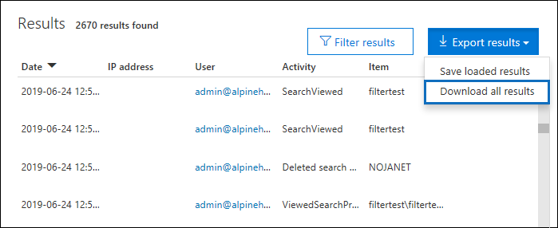
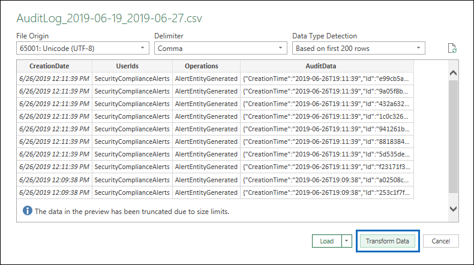

# <a name="export-configure-and-view-audit-log-records"></a><span data-ttu-id="d99ba-103">Exportieren, Konfigurieren und Anzeigen von Überwachungsprotokoll-Datensätzen</span><span class="sxs-lookup"><span data-stu-id="d99ba-103">Export, configure, and view audit log records</span></span>

<span data-ttu-id="d99ba-104">Nachdem Sie das Überwachungsprotokoll durchsucht und die Suchergebnisse in eine CSV-Datei heruntergeladen haben, enthält die Datei eine Spalte namens **AuditData**, die zusätzliche Informationen zu jedem Ereignis enthält.</span><span class="sxs-lookup"><span data-stu-id="d99ba-104">After you search the audit log and download the search results to a CSV file, the file contains a column named **AuditData**, which contains additional information about each event.</span></span> <span data-ttu-id="d99ba-105">Die Daten in dieser Spalte sind als JSON-Objekt formatiert, das mehrere Eigenschaften enthält, die als *Property:Value-Paare* durch Kommas getrennt konfiguriert sind.</span><span class="sxs-lookup"><span data-stu-id="d99ba-105">The data in this column is formatted as a JSON object, which contains multiple properties that are configured as *property:value* pairs separated by commas.</span></span> <span data-ttu-id="d99ba-106">Sie können das JSON-Transformationsfeature im Power Query Editor in Excel verwenden, um jede Eigenschaft im JSON-Objekt in der **Spalte AuditData** in mehrere Spalten zu teilen, sodass jede Eigenschaft eine eigene Spalte hat.</span><span class="sxs-lookup"><span data-stu-id="d99ba-106">You can use the JSON transform feature in the Power Query Editor in Excel to split each property in the JSON object in the **AuditData** column into multiple columns so that each property has its own column.</span></span> <span data-ttu-id="d99ba-107">Auf diese Weise können Sie eine oder mehrere dieser Eigenschaften sortieren und filtern, wodurch Sie die gesuchten Überwachungsdaten schnell finden können.</span><span class="sxs-lookup"><span data-stu-id="d99ba-107">This lets you sort and filter on one or more of these properties, which can help you quickly locate the specific auditing data you're looking for.</span></span>

## <a name="step-1-export-audit-log-search-results"></a><span data-ttu-id="d99ba-108">Schritt 1: Exportieren von Überwachungsprotokollsuchergebnissen</span><span class="sxs-lookup"><span data-stu-id="d99ba-108">Step 1: Export audit log search results</span></span>

<span data-ttu-id="d99ba-109">Der erste Schritt ist das Durchsuchen des Überwachungsprotokolls und anschließendes Exportieren der Ergebnisse in einer CSV-Datei (Comma-Separated Value) auf den lokalen Computer.</span><span class="sxs-lookup"><span data-stu-id="d99ba-109">The first step is to search the audit log and then export the results in a comma-separated value (CSV) file to your local computer.</span></span>
  
1. <span data-ttu-id="d99ba-110">Führen Sie [eine Überwachungsprotokollsuche aus,](search-the-audit-log-in-security-and-compliance.md#search-the-audit-log) und überarbeiten Sie die Suchkriterien bei Bedarf, bis Sie die gewünschten Ergebnisse haben.</span><span class="sxs-lookup"><span data-stu-id="d99ba-110">Run an [audit log search](search-the-audit-log-in-security-and-compliance.md#search-the-audit-log) and revise the search criteria if necessary until you have the desired results.</span></span>

2. <span data-ttu-id="d99ba-111">Klicken **Sie auf Ergebnisse exportieren,** und wählen Sie Alle Ergebnisse herunterladen **aus.**</span><span class="sxs-lookup"><span data-stu-id="d99ba-111">Click **Export results** and select **Download all results**.</span></span> 

   

   <span data-ttu-id="d99ba-113">Mit dieser Option können Sie alle Überwachungsdatensätze aus der Überwachungsprotokollsuche exportieren, die Sie in Schritt 1 erstellt haben, und die Rohdaten aus dem Überwachungsprotokoll in eine CSV-Datei herunterladen.</span><span class="sxs-lookup"><span data-stu-id="d99ba-113">This option to exports all the audit records from the audit log search you ran in step 1, and downloads the raw data from the audit log to a CSV file.</span></span> 

   <span data-ttu-id="d99ba-114">Am unteren Rand des Fensters wird eine Meldung angezeigt, in der Sie aufgefordert werden, die CSV-Datei zu öffnen oder zu speichern.</span><span class="sxs-lookup"><span data-stu-id="d99ba-114">A message is displayed at the bottom of the window that prompts you to open or save the CSV file.</span></span> 

3. <span data-ttu-id="d99ba-115">Klicken **Sie > Speichern unter,** und speichern Sie die CSV-Datei auf Ihrem lokalen Computer.</span><span class="sxs-lookup"><span data-stu-id="d99ba-115">Click **Save > Save as** and save the CSV file to your local computer.</span></span> <span data-ttu-id="d99ba-116">Es dauert eine Weile, bis viele Suchergebnisse heruntergeladen werden.</span><span class="sxs-lookup"><span data-stu-id="d99ba-116">It takes a while to download many search results.</span></span> <span data-ttu-id="d99ba-117">Dies ist in der Regel bei der Suche nach allen Aktivitäten oder einem breiten Datumsbereich der Fall.</span><span class="sxs-lookup"><span data-stu-id="d99ba-117">This is typically the case when searching for all activities or a broad date range.</span></span> <span data-ttu-id="d99ba-118">Eine Meldung am unteren Rand des Fensters wird angezeigt, wenn die CSV-Datei heruntergeladen wurde.</span><span class="sxs-lookup"><span data-stu-id="d99ba-118">A message at the bottom of the windows is displayed when the CSV file is finished downloading.</span></span>

   

> [!NOTE]
  > <span data-ttu-id="d99ba-120">Aus seiner einzigen Suche in einer Protokolldatei können Sie maximal 50.000 Einträge in eine CSV-Datei herunterladen.</span><span class="sxs-lookup"><span data-stu-id="d99ba-120">You can download a maximum of 50,000 entries to a CSV file from a single audit log search.</span></span> <span data-ttu-id="d99ba-121">Wenn 50.000 Einträge in die CSV-Datei heruntergeladen werden, können Sie wahrscheinlich davon ausgehen, dass mehr als 50.000 Ereignisse die Suchkriterien erfüllen.</span><span class="sxs-lookup"><span data-stu-id="d99ba-121">If 50,000 entries are downloaded to the CSV file, you can probably assume there are more than 50,000 events that met the search criteria.</span></span> <span data-ttu-id="d99ba-122">Um mehr als diesen Grenzwert zu exportieren, versuchen Sie, einen Datumsbereich zu verwenden, um die Anzahl der Überwachungsprotokolldatensätze zu reduzieren.</span><span class="sxs-lookup"><span data-stu-id="d99ba-122">To export more than this limit, try using a date range to reduce the number of audit log records.</span></span> <span data-ttu-id="d99ba-123">Möglicherweise müssen Sie mehrere Suchläufe mit kleineren Datumsbereichen durchführen, um mehr als 50.000 Einträge zu exportieren.</span><span class="sxs-lookup"><span data-stu-id="d99ba-123">You might have to run multiple searches with smaller date ranges to export more than 50,000 entries.</span></span>

## <a name="step-2-format-the-exported-audit-log-using-the-power-query-editor"></a><span data-ttu-id="d99ba-124">Schritt 2: Formatieren des exportierten Überwachungsprotokolls mit dem Power Query Editor</span><span class="sxs-lookup"><span data-stu-id="d99ba-124">Step 2: Format the exported audit log using the Power Query Editor</span></span>

<span data-ttu-id="d99ba-125">Im nächsten Schritt wird das JSON-Transformationsfeature im Power Query Editor in Excel verwendet, um jede Eigenschaft im JSON-Objekt in der **Spalte AuditData** in eine eigene Spalte zu teilen.</span><span class="sxs-lookup"><span data-stu-id="d99ba-125">The next step is to use the JSON transform feature in the Power Query Editor in Excel to split each property in the JSON object in the **AuditData** column into its own column.</span></span> <span data-ttu-id="d99ba-126">Anschließend filtern Sie Spalten, um Datensätze basierend auf den Werten bestimmter Eigenschaften anzuzeigen.</span><span class="sxs-lookup"><span data-stu-id="d99ba-126">Then you filter columns to view records based on the values of specific properties.</span></span> <span data-ttu-id="d99ba-127">Dies kann Ihnen dabei helfen, die bestimmten Überwachungsdaten, die Sie suchen, schnell zu finden.</span><span class="sxs-lookup"><span data-stu-id="d99ba-127">This can help you quickly locate the specific auditing data you're looking for.</span></span>

1. <span data-ttu-id="d99ba-128">Öffnen Sie eine leere Arbeitsmappe in Excel für Office 365, Excel 2019 oder Excel 2016.</span><span class="sxs-lookup"><span data-stu-id="d99ba-128">Open a blank workbook in Excel for Office 365, Excel 2019, or Excel 2016.</span></span>

2. <span data-ttu-id="d99ba-129">Klicken Sie **auf** der Registerkarte Daten in der **Gruppe & Daten transformieren** auf Von **Text/CSV**.</span><span class="sxs-lookup"><span data-stu-id="d99ba-129">On the **Data** tab, in the **Get & Transform Data** ribbon group, click **From Text/CSV**.</span></span>

    

3. <span data-ttu-id="d99ba-131">Öffnen Sie die CSV-Datei, die Sie in Schritt 1 heruntergeladen haben.</span><span class="sxs-lookup"><span data-stu-id="d99ba-131">Open the CSV file that you downloaded in Step 1.</span></span>

4. <span data-ttu-id="d99ba-132">Klicken Sie im angezeigten Fenster auf **Daten transformieren.**</span><span class="sxs-lookup"><span data-stu-id="d99ba-132">In the window that's displayed, click **Transform Data**.</span></span>

   

   <span data-ttu-id="d99ba-134">Die CSV-Datei wird im **Abfrage-Editor geöffnet.**</span><span class="sxs-lookup"><span data-stu-id="d99ba-134">The CSV file is opened in the **Query Editor**.</span></span> <span data-ttu-id="d99ba-135">Es gibt vier Spalten: **CreationDate**, **UserIds**, **Operations** und **AuditData**.</span><span class="sxs-lookup"><span data-stu-id="d99ba-135">There are four columns: **CreationDate**, **UserIds**, **Operations**, and **AuditData**.</span></span> <span data-ttu-id="d99ba-136">Die **Spalte AuditData** ist ein JSON-Objekt, das mehrere Eigenschaften enthält.</span><span class="sxs-lookup"><span data-stu-id="d99ba-136">The **AuditData** column is a JSON object that contains multiple properties.</span></span> <span data-ttu-id="d99ba-137">Im nächsten Schritt erstellen Sie eine Spalte für jede Eigenschaft im JSON-Objekt.</span><span class="sxs-lookup"><span data-stu-id="d99ba-137">The next step is to create a column for each property in the JSON object.</span></span>

5. <span data-ttu-id="d99ba-138">Klicken Sie in der Spalte **AuditData** mit der rechten Maustaste auf den Titel, klicken Sie auf **Transformieren,** und klicken Sie dann **auf JSON**.</span><span class="sxs-lookup"><span data-stu-id="d99ba-138">Right-click the title in the **AuditData** column, click **Transform**, and then click **JSON**.</span></span> 

   

6. <span data-ttu-id="d99ba-140">Klicken Sie in der oberen rechten Ecke der **Spalte AuditData** auf das Erweiterungssymbol.</span><span class="sxs-lookup"><span data-stu-id="d99ba-140">In the upper-right corner of the **AuditData** column, click the expand icon.</span></span>

   

   <span data-ttu-id="d99ba-142">Eine Teilliste der Eigenschaften in den JSON-Objekten in der **Spalte AuditData** wird angezeigt.</span><span class="sxs-lookup"><span data-stu-id="d99ba-142">A partial list of the properties in the JSON objects in the **AuditData** column is displayed.</span></span>

7. <span data-ttu-id="d99ba-143">Klicken **Sie auf Weitere Laden,** um alle Eigenschaften in den JSON-Objekten in der Spalte **AuditData** anzeigen.</span><span class="sxs-lookup"><span data-stu-id="d99ba-143">Click **Load more** to display all properties in the JSON objects in the **AuditData** column.</span></span>

   

   <span data-ttu-id="d99ba-145">Sie können das Kontrollkästchen neben einer beliebigen Eigenschaft deaktivieren, die Sie nicht enthalten möchten.</span><span class="sxs-lookup"><span data-stu-id="d99ba-145">You can unselect the checkbox next to any property that you don't want to include.</span></span> <span data-ttu-id="d99ba-146">Das Entfernen von Spalten, die für Ihre Untersuchung nicht hilfreich sind, ist eine gute Möglichkeit, die Im Überwachungsprotokoll angezeigte Datenmenge zu reduzieren.</span><span class="sxs-lookup"><span data-stu-id="d99ba-146">Eliminating columns that aren't useful for your investigation is a good way to reduce the amount of data displayed in the audit log.</span></span> 

   > [!NOTE]
   > <span data-ttu-id="d99ba-147">Die im vorherigen Screenshot angezeigten JSON-Eigenschaften (nachdem Sie auf Weitere Laden **geklickt** haben) basieren auf den Eigenschaften in der Spalte **AuditData** aus den ersten 1.000 Zeilen in der CSV-Datei.</span><span class="sxs-lookup"><span data-stu-id="d99ba-147">The JSON properties displayed in the previous screenshot (after you click **Load more**) are based on the properties found in the **AuditData** column from the first 1,000 rows in the CSV file.</span></span> <span data-ttu-id="d99ba-148">Wenn nach den ersten 1.000 Zeilen unterschiedliche JSON-Eigenschaften in Datensätzen vorhanden sind, werden diese Eigenschaften (und eine entsprechende Spalte) nicht einbezogen, wenn die **Spalte AuditData** in mehrere Spalten aufgeteilt wird.</span><span class="sxs-lookup"><span data-stu-id="d99ba-148">If there are different JSON properties in records after the first 1,000 rows, these properties (and a corresponding column) won't be included when the **AuditData** column is split into multiple columns.</span></span> <span data-ttu-id="d99ba-149">Um dies zu verhindern, sollten Sie die Überwachungsprotokollsuche erneut ausführen und die Suchkriterien einengen, sodass weniger Datensätze zurückgegeben werden.</span><span class="sxs-lookup"><span data-stu-id="d99ba-149">To help prevent this, consider re-running the audit log search and narrow the search criteria so that fewer records are returned.</span></span> <span data-ttu-id="d99ba-150">Eine weitere Problemumgehung  besteht im Filtern von Elementen in der Spalte Vorgänge, um die Anzahl der Zeilen zu reduzieren (bevor Sie Schritt 5 oben ausführen), bevor Sie das JSON-Objekt in der **Spalte AuditData** transformieren.</span><span class="sxs-lookup"><span data-stu-id="d99ba-150">Another workaround is to filter items in the **Operations** column to reduce the number of rows (before you perform step 5 above) before transforming the JSON object in the **AuditData** column.</span></span>

   > [!TIP]
   > <span data-ttu-id="d99ba-151">Klicken Sie zum Anzeigen eines Attributs in einer Liste  wie AuditData.AffectedItems in der oberen rechten Ecke der Spalte, aus der Sie ein Attribut ziehen möchten, auf das Symbol Erweitern, und wählen Sie Dann Erweitern zu **Neue Zeile aus.**</span><span class="sxs-lookup"><span data-stu-id="d99ba-151">To view an attribute within a list such as AuditData.AffectedItems, click the **Expand** icon in the upper right corner of the column you want to pull an attribute from, and then select **Expand to New Row**.</span></span>  <span data-ttu-id="d99ba-152">Von dort wird es ein Datensatz  sein, und Sie können in der oberen rechten Ecke der Spalte auf das Symbol Erweitern klicken, die Attribute anzeigen und das Symbol auswählen, das Sie anzeigen oder extrahieren möchten.</span><span class="sxs-lookup"><span data-stu-id="d99ba-152">From there it will be a record and you can click the **Expand** icon in the upper right corner of the column, view the attributes, and select the one you want to view or extract.</span></span>

8. <span data-ttu-id="d99ba-153">Gehen Sie wie folgt vor, um den Titel der Spalten zu formatieren, die für jede ausgewählte JSON-Eigenschaft hinzugefügt werden.</span><span class="sxs-lookup"><span data-stu-id="d99ba-153">Do one of the following things to format the title of the columns that are added for each JSON property that's selected.</span></span>

    - <span data-ttu-id="d99ba-154">Deaktivieren Sie das **Kontrollkästchen Ursprünglicher Spaltenname als Präfix** verwenden, um den Namen der JSON-Eigenschaft als Spaltennamen zu verwenden. beispiel: **RecordType** oder **SourceFileName**.</span><span class="sxs-lookup"><span data-stu-id="d99ba-154">Unselect the **Use original column name as prefix** checkbox to use the name of the JSON property as the column names; for example, **RecordType** or **SourceFileName**.</span></span>

    - <span data-ttu-id="d99ba-155">Lassen Sie **das Kontrollkästchen Ursprünglicher Spaltenname als Präfix** verwenden aktiviert, um den Spaltennamen das Präfix AuditData hinzuzufügen. Beispiel: **AuditData.RecordType** oder **AuditData.SourceFileName**.</span><span class="sxs-lookup"><span data-stu-id="d99ba-155">Leave the **Use original column name as prefix** checkbox selected to add the AuditData prefix to the column names; for example, **AuditData.RecordType** or **AuditData.SourceFileName**.</span></span>

9. <span data-ttu-id="d99ba-156">Klicken Sie auf **OK**.</span><span class="sxs-lookup"><span data-stu-id="d99ba-156">Click **OK**.</span></span>

    <span data-ttu-id="d99ba-157">Die **Spalte AuditData** ist in mehrere Spalten aufgeteilt.</span><span class="sxs-lookup"><span data-stu-id="d99ba-157">The **AuditData** column is split into multiple columns.</span></span> <span data-ttu-id="d99ba-158">Jede neue Spalte entspricht einer Eigenschaft im AuditData-JSON-Objekt.</span><span class="sxs-lookup"><span data-stu-id="d99ba-158">Each new column corresponds to a property in the AuditData JSON object.</span></span> <span data-ttu-id="d99ba-159">Jede Zeile in der Spalte enthält den Wert für die Eigenschaft.</span><span class="sxs-lookup"><span data-stu-id="d99ba-159">Each row in the column contains the value for the property.</span></span> <span data-ttu-id="d99ba-160">Wenn die Eigenschaft keinen Wert enthält, wird der *Nullwert* angezeigt.</span><span class="sxs-lookup"><span data-stu-id="d99ba-160">If the property doesn't contain a value, the *null* value is displayed.</span></span> <span data-ttu-id="d99ba-161">In Excel sind Zellen mit Nullwerten leer.</span><span class="sxs-lookup"><span data-stu-id="d99ba-161">In Excel, cells with null values are empty.</span></span>
  
10. <span data-ttu-id="d99ba-162">Klicken Sie **auf der Registerkarte** Start auf Schließen & **Laden,** um den Power Query Editor zu schließen und die transformierte CSV-Datei in einer Excel-Arbeitsmappe zu öffnen.</span><span class="sxs-lookup"><span data-stu-id="d99ba-162">On the **Home** tab, click **Close & Load** to close the Power Query Editor and open the transformed CSV file in an Excel workbook.</span></span>

## <a name="use-powershell-to-search-and-export-audit-log-records"></a><span data-ttu-id="d99ba-163">Verwenden von PowerShell zum Durchsuchen und Exportieren von Überwachungsprotokolleinträgen</span><span class="sxs-lookup"><span data-stu-id="d99ba-163">Use PowerShell to search and export audit log records</span></span>

<span data-ttu-id="d99ba-164">Anstatt das Überwachungsprotokollsuchtool im Security & Compliance Center zu verwenden, können Sie das [Cmdlet Search-UnifiedAuditLog](https://docs.microsoft.com/powershell/module/exchange/search-unifiedauditlog) in Exchange Online PowerShell verwenden, um die Ergebnisse einer Überwachungsprotokollsuche in eine CSV-Datei zu exportieren.</span><span class="sxs-lookup"><span data-stu-id="d99ba-164">Instead of using the audit log search tool in the Security & Compliance Center, you can use the [Search-UnifiedAuditLog](https://docs.microsoft.com/powershell/module/exchange/search-unifiedauditlog) cmdlet in Exchange Online PowerShell to export the results of an audit log search to a CSV file.</span></span> <span data-ttu-id="d99ba-165">Anschließend können Sie das in Schritt 2 beschriebene Verfahren ausführen, um das Überwachungsprotokoll mithilfe des Power Query-Editors zu formatieren.</span><span class="sxs-lookup"><span data-stu-id="d99ba-165">Then you can follow the same procedure described in Step 2 to format the audit log using the Power Query editor.</span></span> <span data-ttu-id="d99ba-166">Ein Vorteil der Verwendung des PowerShell-Cmdlets besteht in der Suche nach Ereignissen eines bestimmten Diensts mithilfe des *RecordType-Parameters.*</span><span class="sxs-lookup"><span data-stu-id="d99ba-166">One advantage of using the PowerShell cmdlet is that you can search for events from a specific service by using the *RecordType* parameter.</span></span> <span data-ttu-id="d99ba-167">Nachfolgend finden Sie einige Beispiele für die Verwendung von PowerShell zum Exportieren von Überwachungsdatensätzen in eine CSV-Datei, damit Sie das JSON-Objekt mithilfe des Power Query-Editors in der **Spalte AuditData** transformieren können, wie in Schritt 2 beschrieben.</span><span class="sxs-lookup"><span data-stu-id="d99ba-167">Here are few examples of using PowerShell to export audit records to a CSV file so you can use the Power Query editor to transform the JSON object in the **AuditData** column as described in Step 2.</span></span>

<span data-ttu-id="d99ba-168">Führen Sie in diesem Beispiel die folgenden Befehle aus, um alle Datensätze im Zusammenhang mit SharePoint-Freigabevorgängen zurückzukehren.</span><span class="sxs-lookup"><span data-stu-id="d99ba-168">In this example, run the following commands to return all records related to SharePoint sharing operations.</span></span>

```powershell
$auditlog = Search-UnifiedAuditLog -StartDate 06/01/2019 -EndDate 06/30/2019 -RecordType SharePointSharingOperation
```

```powershell
$auditlog | Select-Object -Property CreationDate,UserIds,RecordType,AuditData | Export-Csv -Path c:\AuditLogs\PowerShellAuditlog.csv -NoTypeInformation
```

<span data-ttu-id="d99ba-169">Die Suchergebnisse werden in eine CSV-Datei mit dem Namen *PowerShellAuditlog* exportiert, die vier Spalten enthält: CreationDate, UserIds, RecordType, AuditData).</span><span class="sxs-lookup"><span data-stu-id="d99ba-169">The search results are exported to a CSV file named *PowerShellAuditlog* that contains four columns: CreationDate, UserIds, RecordType, AuditData).</span></span>

<span data-ttu-id="d99ba-170">Sie können auch den Namen oder Enumerationswert für den Datensatztyp als Wert für den *RecordType-Parameter* verwenden.</span><span class="sxs-lookup"><span data-stu-id="d99ba-170">You can also use the name or enum value for the record type as the value for the *RecordType* parameter.</span></span> <span data-ttu-id="d99ba-171">Eine Liste der Datensatztypnamen und der zugehörigen Enumerationswerte finden Sie in der *Tabelle AuditLogRecordType* im [Office 365 Management Activity API-Schema](https://docs.microsoft.com/office/office-365-management-api/office-365-management-activity-api-schema#enum-auditlogrecordtype---type-edmint32).</span><span class="sxs-lookup"><span data-stu-id="d99ba-171">For a list of record type names and their corresponding enum values, see the *AuditLogRecordType* table in [Office 365 Management Activity API schema](https://docs.microsoft.com/office/office-365-management-api/office-365-management-activity-api-schema#enum-auditlogrecordtype---type-edmint32).</span></span>

<span data-ttu-id="d99ba-172">Sie können nur einen einzelnen Wert für den *RecordType-Parameter* angeben.</span><span class="sxs-lookup"><span data-stu-id="d99ba-172">You can only include a single value for the *RecordType* parameter.</span></span> <span data-ttu-id="d99ba-173">Zum Suchen nach Überwachungsdatensätzen für andere Datensatztypen müssen Sie die beiden vorherigen Befehle erneut ausführen, um einen anderen Datensatztyp anzugeben und diese Ergebnisse an die ursprüngliche CSV-Datei anfügen.</span><span class="sxs-lookup"><span data-stu-id="d99ba-173">To search for audit records for other record types, you have to run the two previous commands again to specify a different record type and append those results to the original CSV file.</span></span> <span data-ttu-id="d99ba-174">Führen Sie beispielsweise die folgenden beiden Befehle aus, um der Datei "PowerShellAuditlog.csv" SharePoint-Dateiaktivitäten aus demselben Datumsbereich hinzuzufügen.</span><span class="sxs-lookup"><span data-stu-id="d99ba-174">For example, you would run the following two commands to add SharePoint file activities from the same date range to the PowerShellAuditlog.csv file.</span></span>

```powershell
$auditlog = Search-UnifiedAuditLog -StartDate 06/01/2019 -EndDate 06/30/2019 -RecordType SharePointFileOperation
```

```powershell
$auditlog | Select-Object -Property CreationDate,UserIds,RecordType,AuditData | Export-Csv -Append -Path c:\AuditLogs\PowerShellAuditlog.csv -NoTypeInformation
```

## <a name="tips-for-exporting-and-viewing-the-audit-log"></a><span data-ttu-id="d99ba-175">Tipps zum Exportieren und Anzeigen des Überwachungsprotokolls</span><span class="sxs-lookup"><span data-stu-id="d99ba-175">Tips for exporting and viewing the audit log</span></span>

<span data-ttu-id="d99ba-176">Hier sind einige Tipps und Beispiele für das Exportieren und Anzeigen des Überwachungsprotokolls vor und nach der Verwendung des JSON-Transformationsfeatures zum Aufteilen der **Spalte AuditData** in mehrere Spalten.</span><span class="sxs-lookup"><span data-stu-id="d99ba-176">Here are some tips and examples of exporting and viewing the audit log before and after you use the JSON transform feature to split the **AuditData** column into multiple columns.</span></span>

- <span data-ttu-id="d99ba-177">Filtern Sie **die Spalte RecordType** so, dass nur die Datensätze aus einem bestimmten Dienst- oder Funktionsbereich angezeigt werden.</span><span class="sxs-lookup"><span data-stu-id="d99ba-177">Filter the **RecordType** column to display only the records from a specific service or functional area.</span></span> <span data-ttu-id="d99ba-178">Wenn Sie beispielsweise Ereignisse im Zusammenhang mit der SharePoint-Freigabe anzeigen möchten, wählen Sie **14** aus (der Enumerationswert für Datensätze, die durch SharePoint-Freigabeaktivitäten ausgelöst werden).</span><span class="sxs-lookup"><span data-stu-id="d99ba-178">For example, to show events related to SharePoint sharing, you would select **14** (the enum value for records triggered by SharePoint sharing activities).</span></span> <span data-ttu-id="d99ba-179">Eine Liste der Dienste, die den in der Spalte **RecordType** angezeigten Enumerationswerten entsprechen, finden Sie unter [Detaillierte Eigenschaften im Überwachungsprotokoll](detailed-properties-in-the-office-365-audit-log.md).</span><span class="sxs-lookup"><span data-stu-id="d99ba-179">For a list of the services that correspond to the enum values displayed in the **RecordType** column, see [Detailed properties in the audit log](detailed-properties-in-the-office-365-audit-log.md).</span></span>

- <span data-ttu-id="d99ba-180">Filtern Sie die **Spalte Vorgänge,** um die Datensätze für bestimmte Aktivitäten anzeigen zu können.</span><span class="sxs-lookup"><span data-stu-id="d99ba-180">Filter the **Operations** column to display the records for specific activities.</span></span> <span data-ttu-id="d99ba-181">Eine Liste der meisten Vorgänge, die einer durchsuchbaren Aktivität im Überwachungsprotokollsuchtool im Security & Compliance Center entsprechen, finden Sie im Abschnitt "Überwachte Aktivitäten" unter Durchsuchen des Überwachungsprotokolls im [Security & Compliance Center](search-the-audit-log-in-security-and-compliance.md#audited-activities).</span><span class="sxs-lookup"><span data-stu-id="d99ba-181">For a list of most operations that correspond to a searchable activity in the audit log search tool in the Security & Compliance Center, see the "Audited activities" section in [Search the audit log in the Security & Compliance Center](search-the-audit-log-in-security-and-compliance.md#audited-activities).</span></span>
