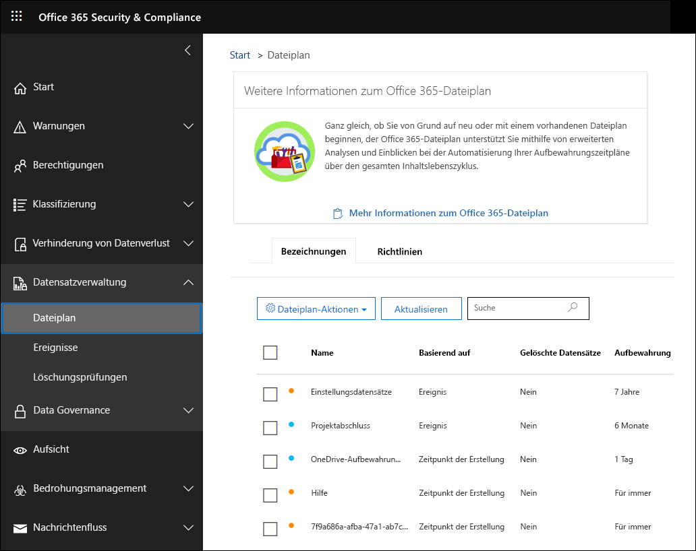
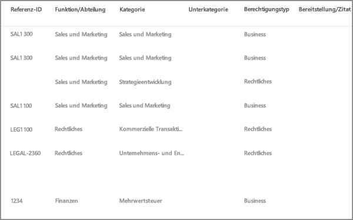
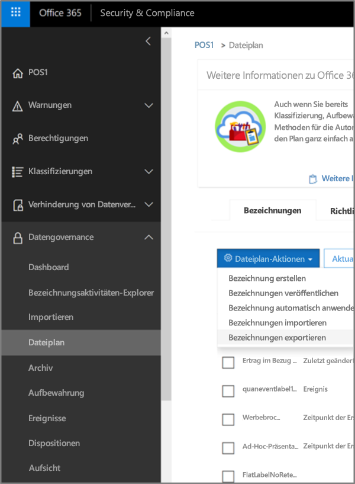
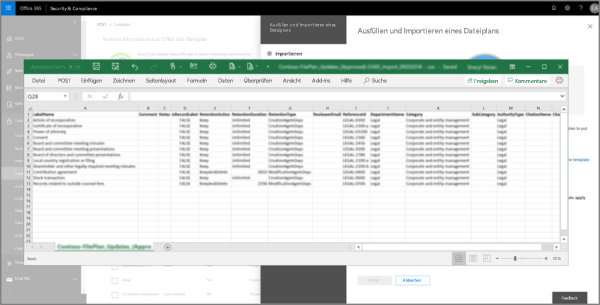
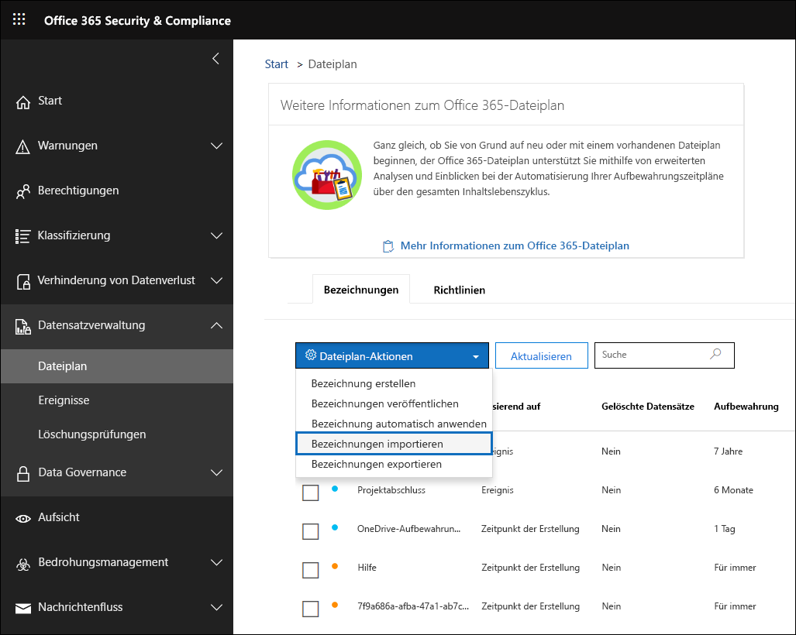
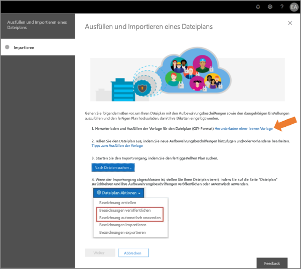
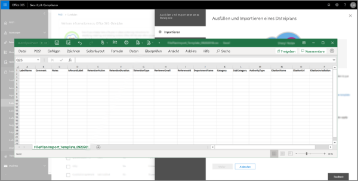
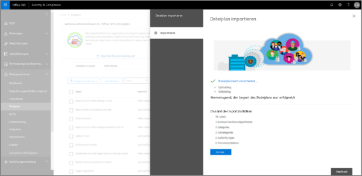
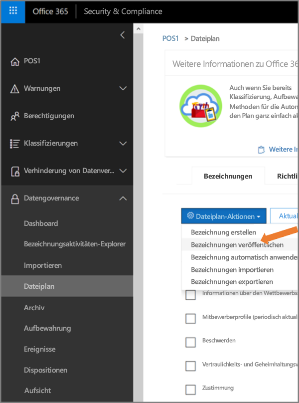

# Übersicht über den Dateiplan-ManagerOverview of file plan manager

Der Dateiplan-Manager bietet erweiterte Verwaltungsfunktionen für Aufbewahrungsbezeichnungen, Aufbewahrungsbezeichnungsrichtlinien und bietet eine integrierte Möglichkeit, Bezeichnungen und Bezeichnung-zu-Inhalt-Aktivitäten in Ihrem gesamten Inhaltslebenszyklus zu durchlaufen – von der Erstellung über die Zusammenarbeit, die Datensatzdeklaration, die Aufbewahrung hin zur Disposition.File plan manager provides advanced management capabilities for retention labels and policies, and provides an integrated way to traverse label and label-to-content activity for your entire content lifecycle – from creation, through collaboration, record declaration, retention, and finally disposition. 

Wenn Sie im Security & Compliance Center auf den Dateiplan-Manager zugreifen möchten, gehen Sie zu **Datensatzverwaltung** > **Dateiplan**.To access file plan manager in the security and compliance center, go to **Records management** > **File plan**.

## Zugriff auf den Dateiplan-ManagerAccessing file plan manager

Es gibt die folgenden beiden Anforderungen für den Zugriff auf den Dateiplan-Manager:There are two requirements to access file plan manager, they are:

- Ein Office 365 Enterprise E5-Abonnement.An Office 365 Enterprise E5 subscription.

- Der Benutzer wurde einer der folgenden Rollen des Security & Compliance Centers zugewiesen:The user has been in assigned one of the following roles in the security and compliance center:
    
    - Aufbewahrungs-ManagerRetention Manager
    
    - Aufbewahrungs-Manager (schreibgeschützt)View-only Retention Manager

## Standardmäßige Aufbewahrungsbezeichnung und BezeichnungsrichtlinieDefault retention labels and label policy

Wenn keine Aufbewahrungsbezeichnungen im Security & Compliance Center vorhanden sind, wird, wenn Sie im linken Navigationsbereich **Dateiplan** auswählen, eine Bezeichnungsrichtlinie mit dem Namen **Standardmäßige Veröffentlichungsrichtlinie für Datengovernance** erstellt.If there are no retention labels in the Security & Compliance Center, the first time you choose **File plan** in the left nav, this creates a label policy called **Default Data Governance Publishing Policy**. 

Diese Bezeichnungsrichtlinie enthält drei Aufbewahrungsbezeichnungen:This label policy contains three retention labels:

- **Operative Prozesse****Operational procedure**
- **Allgemeines Geschäft****Business general**
- **Vertragliche Vereinbarung****Contract agreement**

Diese Aufbewahrungsbezeichnungen sind so konfiguriert, dass Inhalte nur aufbewahrt, aber nicht gelöscht werden.These retention labels are configured only to retain content, not delete content. Diese Bezeichnungsrichtlinie wird in der gesamten Organisation veröffentlicht und kann deaktiviert oder entfernt werden.This label policy will be published to the entire organization and can be disabled or removed. 

Sie können feststellen, wer den Dateiplan-Manager geöffnet und den Eindruck beim ersten Ausführen gestartet hat, indem Sie das Überwachungsprotokoll für die Aktivitäten **Erstellte Aufbewahrungsrichtlinie** und **Erstellte Konfiguration für eine Aufbewahrungsrichtlinie** überprüfen.You can determine who opened file plan manager and kicked off the first-run experience by reviewing the audit log for the activities **Created retention policy** and **Created retention configuration for a retention policy**.

> [!NOTE]
> Aufgrund von Kundenfeedback haben wir dieses Feature entfernt, durch das die standardmäßigen Aufbewahrungsbezeichnungen und die oben genannte Aufbewahrungsbezeichnungsrichtlinie erstellt wurden.Due to customer feedback, we have removed this feature that creates the default retention labels and label policy mentioned above. Diese Aufbewahrungsbezeichnungen und Aufbewahrungsbezeichnungsrichtlinien werden Ihnen nur dann angezeigt, wenn Sie den Datei-Plan-Manager vor dem 11. April 2019 geöffnet haben.You will only see this policy and labels if you used file plan manager before April 11, 2019.

## Navigieren in Ihrem DateiplanNavigating your file plan

Mit dem Dateiplan-Manager können Sie leichter die Einstellungen aller Aufbewahrungsbezeichnungen und Richtlinien aus einer Ansicht anzeigen.File plan manager makes it easier see into and across the settings of all your retention labels and policies from one view.

Beachten Sie, dass Aufbewahrungsbezeichnungen, die außerhalb des Dateiplans erstellt wurden, im Dateiplan verfügbar sind und umgekehrt.Note that retention labels created outside of the file plan will be available in the file plan and vice versa.

Auf den Registerkarten für die **Dateiplanbezeichnungen** sind die folgenden zusätzlichen Informationen und Funktionen verfügbar:On the **file plan labels** tab, the following additional information and capabilities are available:

### Spalten mit BezeichnungseinstellungenLabel settings columns

- **Basierend auf** gibt den Typ des Auslösers an, der den Aufbewahrungszeitraum starten kann. Gültige Werte sind:**Based on** identifies the type of trigger that will start the retention period. Valid values are:
    - EreignisEvent
    - Zeitpunkt der ErstellungWhen created
    - Zeitpunkt der letzten ÄnderungWhen last modified
    - Zeitpunkt der BezeichnungWhen labeled
- **Datensatz** gibt an, ob das Element ein deklarierter Datensatz werden kann, wenn die Bezeichnung angewendet wurde. Gültige Werte sind:**Record** identifies if the item will become a declared record when the label is applied. Valid values are:
    - NeinNo
    - JaYes
    - Yes (Vorgeschrieben)Yes(Regulatory)
- **Aufbewahrung** gibt den Aufbewahrungstyp an. Gültige Werte sind:**Retention** identifies the retention type. Valid values are:
    - BeibehaltenKeep
    - Beibehalten und löschenKeep and delete
    - LöschenDelete
- **Disposition** gibt an, was mit dem Inhalt am Ende des Aufbewahrungszeitraums geschieht. Gültige Werte sind:**Disposition** identifies what will happen to the content at the end of the retention period. Valid values are:
    - Nullnull
    - Keine AktionNo action
    - Automatisch löschenAuto-delete
    - Überprüfung erforderlich (auch bezeichnet als Dispositionsprüfung)Review required (aka Disposition review)

### Spalten mit Dateiplanbeschreibungen für AufbewahrungsbezeichnungenRetention label file plan descriptors columns

Jetzt können Sie weitere Informationen in der Konfiguration Ihrer Aufbewahrungsbezeichnungen hinzuzufügen.You can now include more information in the configuration of your retention labels. Inserting file plan descriptors into labels will improve the manageability and organization of your file plan. Durch das Einfügen von Dateiplanbeschreibungen in Aufbewahrungsbezeichnungen können Sie die Verwaltbarkeit und Organisation Ihres Dateiplans verbessern.You can now include more information in the configuration of your retention labels. Inserting file plan descriptors into labels will improve the manageability and organization of your file plan.

Für den Einstieg stellt Dateiplan-Manager einige einsatzbereite Werte für Folgendes bereit: Funktion/Abteilung, Kategorie, Autoritätstyp und Bereitstellung.To get you started, file plan manager provides some out-of-box values for: Function/department, Category, Authority type and Provision/citation. You can add new file plan descriptor values when creating or editing a retention label. Sie können neue Werte für die Dateiplanbeschreibung hinzufügen, wenn Sie eine Aufbewahrungsbezeichnung erstellen oder bearbeiten.To get you started, file plan manager provides some out-of-box values for: Function/department, Category, Authority type and Provision/citation. You can add new file plan descriptor values when creating or editing a retention label. Sie können auch Dateiplanbeschreibungen angeben, wenn Aufbewahrungsbezeichnungen in Ihren Dateiplan importiert werden.You can also specify file plan descriptors when importing retention labels into your file plan. 

Nachfolgend finden Sie eine Übersicht der Dateiplanbeschreibungen beim Erstellen oder Bearbeiten einer Aufbewahrungsbezeichnung.Here's a view of the file plan descriptors step when creating or editing a retention label.

Nachfolgend finden Sie eine Übersicht über die Spalten mit Dateiplanbeschreibungen auf der Registerkarte **Bezeichnungen** des Dateiplan-Managers.Here's a view of the file plan descriptors columns on the labels tab of file plan manager.

## Exportieren aller vorhandenen Aufbewahrungsbezeichnungen zum Analysieren und/oder Durchführen von Offline ÜberprüfungenExport all existing retention labels to analyze and/or perform offline reviews

Aus dem Dateiplan-Manager können Sie die Details aller Aufbewahrungsbezeichnungen in eine CSV-Datei exportieren, mit deren Hilfe Sie regelmäßige Complianceüberprüfungen mit den Beteiligten an der Datengovernance in Ihrer Organisation durchführen können.From file plan manager, you can export the details of all retention labels into a .csv file to assist you in facilitating periodic compliance reviews with data governance stakeholders in your organization.

Um alle Aufbewahrungsbezeichnungen zu exportieren, gehen Sie zur Seite **Dateiplan** **Dateiplanaktionen** \> **Bezeichnungen exportieren**.To export all retention labels: On the **File plan** page, **File plan actions** \> **Export labels**.

Es wird eine CSV-Datei mit allen vorhandenen Aufbewahrungsbeschriftungen geöffnet.A \*.csv file containing all existing retention labels will open.

## Importieren von Aufbewahrungsbezeichnungen in Ihren DateiplanImport labels into your file plan

Im Dateiplan-Manager können Sie neue Aufbewahrungsbezeichnungen massenimportieren und vorhandene Aufbewahrungsbezeichnungen ändern.In the File plan manager, you can bulk import new retention labels and modify existing retention labels.

So importieren Sie neue Aufbewahrungsbezeichnungen und ändern vorhandene Aufbewahrungsbezeichnungen:To import new retention labels and modify existing retention labels: 

1. Wechseln Sie auf der Seite **Dateiplan** zu **Dateiplanaktionen** > **Bezeichnungen importieren**.On the **File plan** page, go to **File plan actions** > **Import labels**.

   

   

2. Laden Sie eine leere Vorlage herunter, um neue Aufbewahrungsbezeichnungen zu importieren.Download a blank template to import new retention labels. Alternativ können Sie mit der CSV-Datei beginnen, die exportiert wird, wenn Sie die vorhandenen Aufbewahrungsbezeichnungen in Ihrer Organisation exportieren.Alternatively, you can start with the .csv file that is exported when you export the existing retention labels in your organization.

   

3. Füllen Sie die Vorlage aus.Fill-out the template. In der folgenden Tabelle werden die Eigenschaften und die gültigen Werte für jede Eigenschaft in der Dateiplanvorlage beschrieben.The following describes the properties and valid values for each property in the file plan template. 

   |**Eigenschaft****Property**|**Typ****Type**|**Gültige Werte****Valid values**|
   |:-----|:-----|:-----|
   |LabelNameLabelName|ZeichenfolgeString|Diese Eigenschaft gibt den Namen des Aufbewahrungsrichtlinientags an.This property specifies the name of the retention label.|
   |KommentarComment|ZeichenfolgeString|Verwenden Sie diese Eigenschaft, um eine Beschreibung der Aufbewahrungsbezeichnung für Administratoren hinzuzufügen.Use this property to add a description about the retention label for admins. Diese Beschreibung wird nur Administratoren angezeigt, die die Bezeichnung im Security & Compliance Center verwalten.This description appears only to admins who manage the label in the security and compliance center.|
   |HinweiseNotes|ZeichenfolgeString|Verwenden Sie diese Eigenschaft, um eine Beschreibung der Aufbewahrungsbezeichnung für Benutzer hinzuzufügen.Use this property to add a description about the retention label for users. Diese Beschreibung wird angezeigt, wenn Benutzer den Mauszeiger über die Bezeichnung in Apps wie Outlook, SharePoint und OneDrive bewegen.This description appears when users hover over the label in apps like Outlook, SharePoint, and OneDrive. Wenn Sie diese Eigenschaft leer lassen, wird eine Standardbeschreibung angezeigt, in der die Aufbewahrungseinstellungen der Bezeichnung erläutert werden.If you leave this property blank, a default description is displayed, which explains the label's retention settings. |
   |IsRecordLabelIsRecordLabel|ZeichenfolgeString|Diese Eigenschaft gibt an, ob das es sich bei der Bezeichnung um eine Datensatzbezeichnung handelt.The 
                IsRecordLabel
              parameter specifies whether the label is a record label. Elemente, die mit einer Datensatzbezeichnung markiert sind, werden als Datensätze deklariert.Items tagged with a record label are declared as records. Gültige Werte sind:Valid values are: **TRUE**: Die Bezeichnung ist eine Datensatzbezeichnung.The label is a record label. Hinweis: Die als Datensatz deklarierten Elemente können nicht gelöscht werden.Note that items that are declared as a record can't be deleted.  **FALSE**: Die Bezeichnung ist keine Datensatzbezeichnung.The label isn't a record label. Dies ist der Standardwert.This is the default value.|
   |RetentionActionRetentionAction|ZeichenfolgeString|Diese Eigenschaft gibt an, welche Aktion auszuführen ist, nachdem der durch die RetentionDuration-Eigenschaft angegebene Wert abläuft.This property specifies what action to take after the value specified by the RetentionDuration property expires. Gültige Werte sind:Valid values are: **Delete**: Elemente, die älter als der von der RetentionDuration-Eigenschaft angegebene Wert sind, werden gelöscht.**Delete**: Items older than the value specified by the RetentionDuration property are deleted. **Keep**: Elemente werden für die durch die RetentionDuration-Eigenschaft festgelegte Dauer beibehalten. Nach Ablauf dieses Zeitraums wird nichts ausgeführt.**Keep**: Retain items for the duration specified by the RetentionDuration property and then doing nothing when the duration period expires.  **KeepAndDelete**: Elemente werden für die durch die RetentionDuration-Eigenschaft festgelegte Dauer beibehalten. Nach Ablauf dieses Zeitraums werden sie gelöscht.**KeepAndDelete**: Retain items for the duration specified by the RetentionDuration property and then delete them when the duration period expires.   |
   |RetentionDurationRetentionDuration|ZeichenfolgeString|Die Eigenschaft gibt die Anzahl der Tage an, die der Inhalt aufbewahrt werden soll.The RetentionDuration parameter specifies the number of days to retain the content. Gültige Werte sind:Valid values are: **Unlimited**: Elemente werden auf unbestimmte Zeit aufbewahrt.**Unlimited**: Items will be retained indefinitely.  ***n***: Rine positive ganze Zahl; zum Beispiel: **365**.***n***: A positive integer; for example, **365**. 
   |RetentionTypeRetentionType|ZeichenfolgeString|Diese Eigenschaft gibt an, ob die Aufbewahrungsdauer aus dem Erstellungsdatum des Inhalts, aus dem Datum des Ereignisses, aus dem Datum der Bezeichnung (Markierung) oder aus dem Datum der letzten Änderung berechnet wird.This property specifies whether the retention duration is calculated from the content creation date, event date, labeled (tagged) date, or last modified date. Gültige Werte sind:Valid values are: **CreationAgeInDays****CreationAgeInDays** **EventAgeInDays****EventAgeInDays** **TaggedAgeInDays****TaggedAgeInDays** **ModificationAgeInDays****ModificationAgeInDays** |
   |ReviewerEmailReviewerEmail|SmtpAddressSmtpAddress|Wenn diese Eigenschaft ausgefüllt wird, wird eine Dispositionsüberprüfung ausgelöst, wenn die Aufbewahrungsdauer abgelaufen ist.When this property is populated, a disposition review will be triggered when the retention duration expires. Diese Eigenschaft gibt die E-Mail-Adresse des Bearbeiters für Aufbewahrungsaktionen vom Typ **Delete** und **KeepAndDelete** an.The ReviewerEmail parameter specifies the email address of a reviewer for Delete and KeepAndDelete retention actions. Sie können die E-Mail-Adressen einzelner Benutzer, Verteiler- oder Sicherheitsgruppen oder Office 365-Gruppen einschließen.You can include the email address of individual users, distribution or security groups, or Office 365 groups. Mehrere E-Mail-Adressen können durch Kommas getrennt angegeben werden.You can specify multiple email addresses separated by commas.|
   |ReferenceIdReferenceId|ZeichenfolgeString|Diese Eigenschaft gibt den Wert an, der in der Dateiplanbeschreibung **Referenz-ID** angezeigt wird.This property specifies the value that's displayed in the **Reference Id** file plan descriptor.| 
   |DepartmentNameDepartmentname|ZeichenfolgeString|Diese Eigenschaft gibt den Wert an, der in der Dateiplanbeschreibung **Funktion/Abteilung** angezeigt wird.This property specifies the value that's displayed in the **Function/department** file plan descriptor.|
   |KategorieCategory|ZeichenfolgeString|Diese Eigenschaft gibt den Wert an, der in der Dateiplanbeschreibung **Kategorie** angezeigt wird.This property specifies the value that's displayed in the **Category** file plan descriptor.|
   |SubCategorySubCategory|ZeichenfolgeString|Diese Eigenschaft gibt den Wert an, der in der Dateiplanbeschreibung **Unterkategorie** angezeigt wird.This property specifies the value that's displayed in the **Sub category** file plan descriptor.|
   |AuthorityTypeAuthorityType|ZeichenfolgeString|Diese Eigenschaft gibt den Wert an, der in der Dateiplanbeschreibung **Autoritätstyp** angezeigt wird.This property specifies the value that's displayed in the **Authority type** file plan descriptor.|
   |CitationNameCitationName|ZeichenfolgeString|Diese Eigenschaft gibt den Namen des Zitats an, das in der Dateiplanbeschreibung **Bereitstellung/Zitat** angezeigt wird. Beispiel "Sarbanes-Oxley Act oder 2002".This property specifies the name of the citation displayed in the **Provision/citation** file plan descriptor; for example "Sarbanes-Oxley Act or 2002". |
   |CitationUrlCitationUrl|ZeichenfolgeString|Diese Eigenschaft gibt die URL an, die in der Dateiplanbeschreibung **Bereitstellung/Zitat** angezeigt wird.This property specifies the URL that's displayed in the **Provision/citation** file plan descriptor.|
   |CitationJurisdictionCitationJurisdiction|ZeichenfolgeString|Diese Eigenschaft gibt die Zuständigkeit oder Behörde an, die in der Dateiplanbeschreibung **Bereitstellung/Zitat** angezeigt wird, z. B. „U.S Securities and Exchange Commission (SEC)“.This property specifies the jurisdiction or agency that's displayed in the **Provision/citation** file plan descriptor; for example, "U.S. Securities and Exchange Commission (SEC)".|
   |RegulatoryRegulatory|ZeichenfolgeString|Leer lassen.(leave blank) Diese Eigenschaft wird derzeit nicht verwendet.This property isn't used at this time.|
   |EventTypeEventType|ZeichenfolgeString|Diese Eigenschaft gibt die Aufbewahrungsregel an, die der Bezeichnung zugeordnet ist.The 
                EventType
              specifies the retention rule that's associated with the label. Sie können einen beliebigen Wert verwenden, der die Regel eindeutig identifiziert.You can use any value that uniquely identifies the rule. Zum Beispiel:For example: **Name****Name** **Distinguished name (DN)****Distinguished name (DN)** **GUID****GUID**  Mit dem Cmdlet [Get-RetentionComplianceRule](https://docs.microsoft.com/powershell/module/exchange/policy-and-compliance-retention/get-retentioncompliancerule?view=exchange-ps) können Sie die verfügbaren Aufbewahrungsregeln anzeigen.You can use the [Get-RetentionComplianceRule](https://docs.microsoft.com/powershell/module/exchange/policy-and-compliance-retention/get-retentioncompliancerule?view=exchange-ps) cmdlet to view the available retention rules. Beachten Sie: Wenn Sie Bezeichnungen aus einer Office 365-Organisation exportieren, können Sie die Werte für die EventType-Eigenschaft von dieser Organisation nicht verwenden, wenn Sie Bezeichnungen in eine andere Office 365-Organisation importieren.Note that if you export labels from one Office 365 organization, you can't use the values for the EventType  property from that organization when importing labels to a different Office 365 organization. Dies liegt daran, dass die EventType-Werte für eine Organisation eindeutig sind.That because the EventType values are unique to an organization. |
   |||

   Nachfolgend finden Sie ein Beispiel für die Vorlage mit den Informationen zu Aufbewahrungsbezeichnungen.Here's an example the template containing the information about retention labels.

   

4. Klicken Sie auf der Assistentenseite zum Importieren des Dateiplans unter Schritt 3 auf **Nach Dateien suchen**, um die ausgefüllte Vorlage hochzuladen.Under step 3 on the import file plan wizard page, click **Browse for files** to upload the filled-out template. 

   Die Einträge werden dann vom Dateiplan-Manager überprüft, und es werden Importstatistiken angezeigt.Upload the filled-out template, and file plan manager will validate the entries and display import statistics.

   

   Für den Fall, dass ein Überprüfungsfehler vorliegt, überprüft der Dateiplanimport weiterhin jeden Eintrag in der Importdatei und zeigt alle Fehler an, wobei er die Zeilen-/Reihennummern in der Importdatei referenziert und die angezeigten Fehlerergebnisse kopiert, damit Sie einfach zur Importdatei zurückkehren und die Fehler korrigieren können.In the event there is a validation error, file plan import will continue to validate every entry in the import file and display all errors referencing line/row numbers in the import file, copy the displayed error results so that you can easily return to the import file and correct the errors.

5. Wenn der Importvorgang abgeschlossen ist, kehren Sie zum Dateiplan-Manager zurück, um neuen oder vorhandenen Aufbewahrungsbezeichnungsrichtlinien neue Aufbewahrungsbezeichnungen zuzuweisen.When the import is complete, return to file plan manager to assign new labels to new or existing policies.

   
