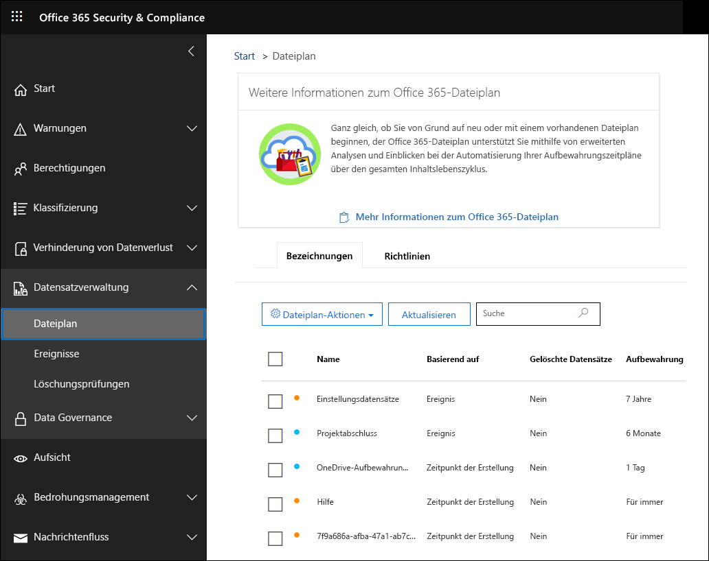
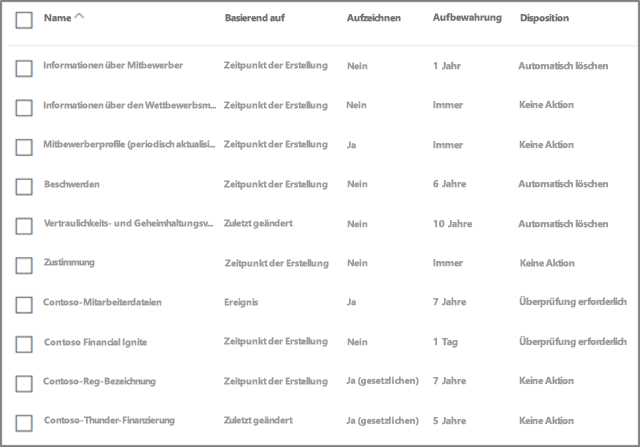
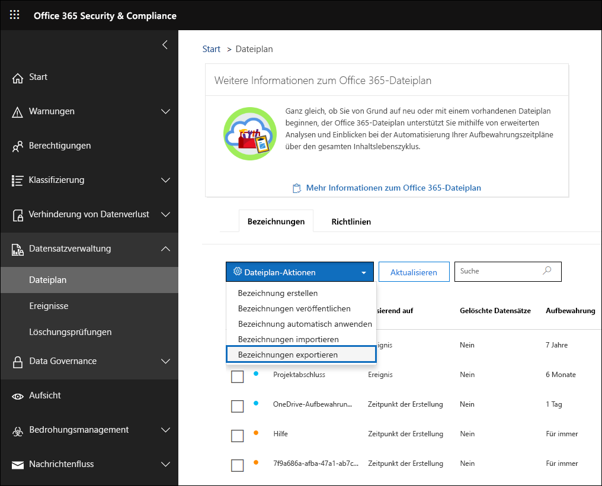
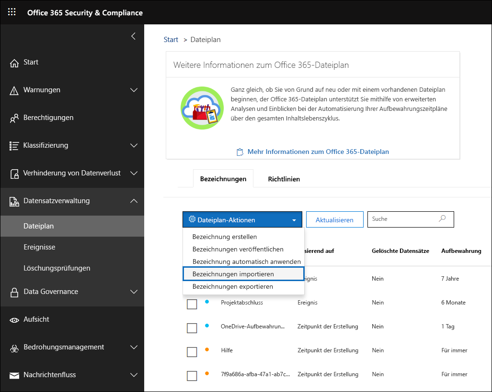
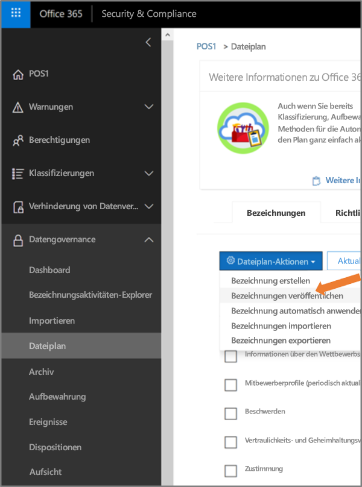

# Übersicht über den Dateiplan-Manager

>*[Microsoft 365-Lizenzierungsleitfaden für Sicherheit und Compliance](https://aka.ms/ComplianceSD).*

Der Dateiplan-Manager bietet erweiterte Verwaltungsfunktionen für Aufbewahrungsbezeichnungen, Aufbewahrungsbezeichnungsrichtlinien und bietet eine integrierte Möglichkeit, Bezeichnungen und Bezeichnung-zu-Inhalt-Aktivitäten in Ihrem gesamten Inhaltslebenszyklus zu durchlaufen – von der Erstellung über die Zusammenarbeit, die Datensatzdeklaration, die Aufbewahrung hin zur Disposition. 

Wenn Sie im Security & Compliance Center auf den Dateiplan-Manager zugreifen möchten, gehen Sie zu **Datensatzverwaltung** > **Dateiplan**.

## Zugriff auf den Dateiplan-Manager

Um auf den Dateiplan-Manager zuzugreifen, müssen Sie über eine der folgenden Administratorrollen verfügen:
    
- Aufbewahrungs-Manager

- Aufbewahrungs-Manager (schreibgeschützt)

## Standardmäßige Aufbewahrungsbezeichnung und Bezeichnungsrichtlinie

Wenn keine Aufbewahrungsbezeichnungen im Security & Compliance Center vorhanden sind, wird, wenn Sie im linken Navigationsbereich **Dateiplan** auswählen, eine Bezeichnungsrichtlinie mit dem Namen **Standardmäßige Veröffentlichungsrichtlinie für Datengovernance** erstellt. 

Diese Bezeichnungsrichtlinie enthält drei Aufbewahrungsbezeichnungen:

- **Operative Prozesse**
- **Allgemeines Geschäft**
- **Vertragliche Vereinbarung**

Diese Aufbewahrungsbezeichnungen sind so konfiguriert, dass Inhalte nur aufbewahrt, aber nicht gelöscht werden. Diese Bezeichnungsrichtlinie wird in der gesamten Organisation veröffentlicht und kann deaktiviert oder entfernt werden. 

Sie können feststellen, wer den Dateiplan-Manager geöffnet und den Eindruck beim ersten Ausführen gestartet hat, indem Sie das Überwachungsprotokoll für die Aktivitäten **Erstellte Aufbewahrungsrichtlinie** und **Erstellte Konfiguration für eine Aufbewahrungsrichtlinie** überprüfen.

> [!NOTE]
> Aufgrund von Kundenfeedback haben wir dieses Feature entfernt, durch das die standardmäßigen Aufbewahrungsbezeichnungen und die oben genannte Aufbewahrungsbezeichnungsrichtlinie erstellt wurden. Diese Aufbewahrungsbezeichnungen und Aufbewahrungsbezeichnungsrichtlinien werden Ihnen nur dann angezeigt, wenn Sie den Datei-Plan-Manager vor dem 11. April 2019 geöffnet haben.

## Navigieren in Ihrem Dateiplan

Mit dem Dateiplan-Manager können Sie leichter die Einstellungen aller Aufbewahrungsbezeichnungen und Richtlinien aus einer Ansicht anzeigen.

Beachten Sie, dass Aufbewahrungsbezeichnungen, die außerhalb des Dateiplans erstellt wurden, im Dateiplan verfügbar sind und umgekehrt.

Auf den Registerkarten für die **Dateiplanbezeichnungen** sind die folgenden zusätzlichen Informationen und Funktionen verfügbar:

### Spalten mit Bezeichnungseinstellungen

- **Basierend auf** gibt den Typ des Auslösers an, der den Aufbewahrungszeitraum starten kann. Gültige Werte sind:
    - Ereignis
    - Zeitpunkt der Erstellung
    - Zeitpunkt der letzten Änderung
    - Zeitpunkt der Bezeichnung
- **Datensatz** gibt an, ob das Element ein deklarierter Datensatz werden kann, wenn die Bezeichnung angewendet wurde. Gültige Werte sind:
    - Nein
    - Ja
    - Yes (Vorgeschrieben)
- **Aufbewahrung** gibt den Aufbewahrungstyp an. Gültige Werte sind:
    - Beibehalten
    - Beibehalten und löschen
    - Löschen
- **Disposition** gibt an, was mit dem Inhalt am Ende des Aufbewahrungszeitraums geschieht. Gültige Werte sind:
    - Null
    - Keine Aktion
    - Automatisch löschen
    - Überprüfung erforderlich (auch bezeichnet als Dispositionsprüfung)

### Spalten mit Dateiplanbeschreibungen für Aufbewahrungsbezeichnungen

Jetzt können Sie weitere Informationen in der Konfiguration Ihrer Aufbewahrungsbezeichnungen hinzuzufügen. Durch das Einfügen von Dateiplanbeschreibungen in Aufbewahrungsbezeichnungen können Sie die Verwaltbarkeit und Organisation Ihres Dateiplans verbessern.

Für den Einstieg stellt Dateiplan-Manager einige einsatzbereite Werte für Folgendes bereit: Funktion/Abteilung, Kategorie, Autoritätstyp und Bereitstellung. Sie können neue Werte für die Dateiplanbeschreibung hinzufügen, wenn Sie eine Aufbewahrungsbezeichnung erstellen oder bearbeiten. Sie können auch Dateiplanbeschreibungen angeben, wenn Aufbewahrungsbezeichnungen in Ihren Dateiplan importiert werden. 

Nachfolgend finden Sie eine Übersicht der Dateiplanbeschreibungen beim Erstellen oder Bearbeiten einer Aufbewahrungsbezeichnung.

Nachfolgend finden Sie eine Übersicht über die Spalten mit Dateiplanbeschreibungen auf der Registerkarte **Bezeichnungen** des Dateiplan-Managers.

## Exportieren aller vorhandenen Aufbewahrungsbezeichnungen zum Analysieren und/oder Durchführen von Offline Überprüfungen

Aus dem Dateiplan-Manager können Sie die Details aller Aufbewahrungsbezeichnungen in eine CSV-Datei exportieren, mit deren Hilfe Sie regelmäßige Complianceüberprüfungen mit den Beteiligten an der Datengovernance in Ihrer Organisation durchführen können.

Um alle Aufbewahrungsbezeichnungen zu exportieren, gehen Sie zur Seite **Dateiplan** **Dateiplanaktionen** \> **Bezeichnungen exportieren**.

Es wird eine CSV-Datei mit allen vorhandenen Aufbewahrungsbeschriftungen geöffnet.

## Importieren von Aufbewahrungsbezeichnungen in Ihren Dateiplan

Im Dateiplan-Manager können Sie neue Aufbewahrungsbezeichnungen massenimportieren und vorhandene Aufbewahrungsbezeichnungen ändern.

So importieren Sie neue Aufbewahrungsbezeichnungen und ändern vorhandene Aufbewahrungsbezeichnungen: 

1. Wechseln Sie auf der Seite **Dateiplan** zu **Dateiplanaktionen** > **Bezeichnungen importieren**.

   

   

2. Laden Sie eine leere Vorlage herunter, um neue Aufbewahrungsbezeichnungen zu importieren. Alternativ können Sie mit der CSV-Datei beginnen, die exportiert wird, wenn Sie die vorhandenen Aufbewahrungsbezeichnungen in Ihrer Organisation exportieren.

   

3. Füllen Sie die Vorlage aus. In der folgenden Tabelle werden die Eigenschaften und die gültigen Werte für jede Eigenschaft in der Dateiplanvorlage beschrieben. 

   |**Eigenschaft**|**Typ**|**Gültige Werte**|
   |:-----|:-----|:-----|
   |LabelName|Zeichenfolge|Diese Eigenschaft gibt den Namen des Aufbewahrungsrichtlinientags an.|
   |Kommentar|Zeichenfolge|Verwenden Sie diese Eigenschaft, um eine Beschreibung der Aufbewahrungsbezeichnung für Administratoren hinzuzufügen. Diese Beschreibung wird nur Administratoren angezeigt, die die Bezeichnung im Security & Compliance Center verwalten.|
   |Hinweise|Zeichenfolge|Verwenden Sie diese Eigenschaft, um eine Beschreibung der Aufbewahrungsbezeichnung für Benutzer hinzuzufügen. Diese Beschreibung wird angezeigt, wenn Benutzer den Mauszeiger über die Bezeichnung in Apps wie Outlook, SharePoint und OneDrive bewegen. Wenn Sie diese Eigenschaft leer lassen, wird eine Standardbeschreibung angezeigt, in der die Aufbewahrungseinstellungen der Bezeichnung erläutert werden. |
   |IsRecordLabel|Zeichenfolge|Diese Eigenschaft gibt an, ob das es sich bei der Bezeichnung um eine Datensatzbezeichnung handelt. Elemente, die mit einer Datensatzbezeichnung markiert sind, werden als Datensätze deklariert. Gültige Werte sind: **TRUE**: Die Bezeichnung ist eine Datensatzbezeichnung. Hinweis: Die als Datensatz deklarierten Elemente können nicht gelöscht werden.  **FALSE**: Die Bezeichnung ist keine Datensatzbezeichnung. Dies ist der Standardwert.|
   |RetentionAction|Zeichenfolge|Diese Eigenschaft gibt an, welche Aktion auszuführen ist, nachdem der durch die RetentionDuration-Eigenschaft angegebene Wert abläuft. Gültige Werte sind: **Delete**: Elemente, die älter als der von der RetentionDuration-Eigenschaft angegebene Wert sind, werden gelöscht. **Keep**: Elemente werden für die durch die RetentionDuration-Eigenschaft festgelegte Dauer beibehalten. Nach Ablauf dieses Zeitraums wird nichts ausgeführt.  **KeepAndDelete**: Elemente werden für die durch die RetentionDuration-Eigenschaft festgelegte Dauer beibehalten. Nach Ablauf dieses Zeitraums werden sie gelöscht.   |
   |RetentionDuration|Zeichenfolge|Die Eigenschaft gibt die Anzahl der Tage an, die der Inhalt aufbewahrt werden soll. Gültige Werte sind: **Unlimited**: Elemente werden auf unbestimmte Zeit aufbewahrt.  ***n***: Rine positive ganze Zahl; zum Beispiel: **365**. 
   |RetentionType|Zeichenfolge|Diese Eigenschaft gibt an, ob die Aufbewahrungsdauer aus dem Erstellungsdatum des Inhalts, aus dem Datum des Ereignisses, aus dem Datum der Bezeichnung (Markierung) oder aus dem Datum der letzten Änderung berechnet wird. Gültige Werte sind: **CreationAgeInDays** **EventAgeInDays** **TaggedAgeInDays** **ModificationAgeInDays** |
   |ReviewerEmail|SmtpAddress|Wenn diese Eigenschaft ausgefüllt wird, wird eine Dispositionsüberprüfung ausgelöst, wenn die Aufbewahrungsdauer abgelaufen ist. Diese Eigenschaft gibt die E-Mail-Adresse des Bearbeiters für Aufbewahrungsaktionen vom Typ **Delete** und **KeepAndDelete** an. Sie können die E-Mail-Adressen einzelner Benutzer, Verteiler- oder Sicherheitsgruppen einschließen. Mehrere E-Mail-Adressen können durch Kommas getrennt angegeben werden.|
   |ReferenceId|Zeichenfolge|Diese Eigenschaft gibt den Wert an, der in der Dateiplanbeschreibung **Referenz-ID** angezeigt wird.| 
   |DepartmentName|Zeichenfolge|Diese Eigenschaft gibt den Wert an, der in der Dateiplanbeschreibung **Funktion/Abteilung** angezeigt wird.|
   |Kategorie|Zeichenfolge|Diese Eigenschaft gibt den Wert an, der in der Dateiplanbeschreibung **Kategorie** angezeigt wird.|
   |SubCategory|Zeichenfolge|Diese Eigenschaft gibt den Wert an, der in der Dateiplanbeschreibung **Unterkategorie** angezeigt wird.|
   |AuthorityType|Zeichenfolge|Diese Eigenschaft gibt den Wert an, der in der Dateiplanbeschreibung **Autoritätstyp** angezeigt wird.|
   |CitationName|Zeichenfolge|Diese Eigenschaft gibt den Namen des Zitats an, das in der Dateiplanbeschreibung **Bereitstellung/Zitat** angezeigt wird. Beispiel "Sarbanes-Oxley Act oder 2002". |
   |CitationUrl|Zeichenfolge|Diese Eigenschaft gibt die URL an, die in der Dateiplanbeschreibung **Bereitstellung/Zitat** angezeigt wird.|
   |CitationJurisdiction|Zeichenfolge|Diese Eigenschaft gibt die Zuständigkeit oder Behörde an, die in der Dateiplanbeschreibung **Bereitstellung/Zitat** angezeigt wird, z. B. „U.S Securities and Exchange Commission (SEC)“.|
   |Regulatory|Zeichenfolge|Leer lassen. Diese Eigenschaft wird derzeit nicht verwendet.|
   |EventType|Zeichenfolge|Diese Eigenschaft gibt die Aufbewahrungsregel an, die der Bezeichnung zugeordnet ist. Sie können einen beliebigen Wert verwenden, der die Regel eindeutig identifiziert. Zum Beispiel: **Name** **Distinguished name (DN)** **GUID**  Mit dem Cmdlet [Get-RetentionComplianceRule](https://docs.microsoft.com/powershell/module/exchange/policy-and-compliance-retention/get-retentioncompliancerule?view=exchange-ps) können Sie die verfügbaren Aufbewahrungsregeln anzeigen. Beachten Sie: Wenn Sie Bezeichnungen aus einer Office 365-Organisation exportieren, können Sie die Werte für die EventType-Eigenschaft von dieser Organisation nicht verwenden, wenn Sie Bezeichnungen in eine andere Office 365-Organisation importieren. Dies liegt daran, dass die EventType-Werte für eine Organisation eindeutig sind. |
   |||

   Nachfolgend finden Sie ein Beispiel für die Vorlage mit den Informationen zu Aufbewahrungsbezeichnungen.

   

4. Klicken Sie auf der Assistentenseite zum Importieren des Dateiplans unter Schritt 3 auf **Nach Dateien suchen**, um die ausgefüllte Vorlage hochzuladen. 

   Die Einträge werden dann vom Dateiplan-Manager überprüft, und es werden Importstatistiken angezeigt.

   

   Für den Fall, dass ein Überprüfungsfehler vorliegt, überprüft der Dateiplanimport weiterhin jeden Eintrag in der Importdatei und zeigt alle Fehler an, wobei er die Zeilen-/Reihennummern in der Importdatei referenziert und die angezeigten Fehlerergebnisse kopiert, damit Sie einfach zur Importdatei zurückkehren und die Fehler korrigieren können.

5. Wenn der Importvorgang abgeschlossen ist, kehren Sie zum Dateiplan-Manager zurück, um neuen oder vorhandenen Aufbewahrungsbezeichnungsrichtlinien neue Aufbewahrungsbezeichnungen zuzuweisen.

   
