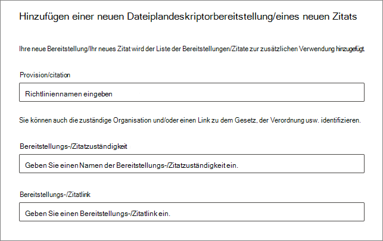
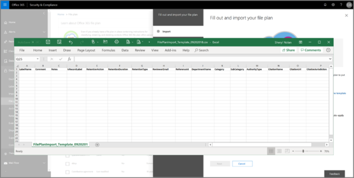
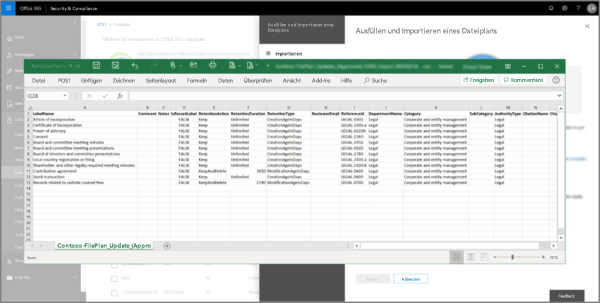

# Dateiplan zum Verwalten von Aufbewahrungsbezeichnungen verwendenUse file plan to manage retention labels

>*[Microsoft 365-Lizenzierungsleitfaden für Sicherheit und Compliance](/office365/servicedescriptions/microsoft-365-service-descriptions/microsoft-365-tenantlevel-services-licensing-guidance/microsoft-365-security-compliance-licensing-guidance).**[Microsoft 365 licensing guidance for security & compliance](/office365/servicedescriptions/microsoft-365-service-descriptions/microsoft-365-tenantlevel-services-licensing-guidance/microsoft-365-security-compliance-licensing-guidance).*

Sie können zwar Aufbewahrungsbezeichnungen von **Informationsgovernance** im Microsoft 365 Compliance Center erstellen und verwalten, aber der Dateiplan aus **Datensatzverwaltung** verfügt über zusätzliche Verwaltungsfunktionen:Although you can create and manage retention labels from **Information governance** in the Microsoft 365 compliance center, file plan from **Records management** has additional management capabilities:

- Sie können die Aufbewahrungsbezeichnungen in einem Stapel erstellen, indem Sie die relevanten Informationen aus einer Kalkulationstabelle importieren.You can bulk-create retention labels by importing the relevant information from a spreadsheet.

- Sie können die Informationen aus vorhandenen Aufbewahrungsbezeichnungen für die Analyse und Offline-Zusammenarbeit exportieren.You can export the information from existing retention labels for analysis and offline collaboration.

- Weitere Informationen zu den Aufbewahrungsbezeichnungen werden angezeigt, um die Einstellungen aller Aufbewahrungsbezeichnungen in einer Ansicht anzuzeigen.More information about the retention labels is displayed to make it easier to see into and across the settings of all your retention labels from one view.

- Dateiplandeskriptoren unterstützen zusätzliche und optionale Informationen für jede Bezeichnung.File plan descriptors support additional and optional information for each label.

Der Dateiplan kann für alle Aufbewahrungsbezeichnungen verwendet werden, auch wenn sie Inhalt nicht als Datensatz markieren.File plan can be used for all retention labels, even if they don't mark content as a record.

Informationen zu den Aufbewahrungsbezeichnungen und deren Verwendung finden Sie unter [Informationen zu Aufbewahrungsrichtlinien und Aufbewahrungsbezeichnungen](retention.md).For information about what retention labels are and how to use them, see [Learn about retention policies and retention labels](retention.md).

## Zugriff auf den DateiplanAccessing file plan

Um auf den Dateiplan zuzugreifen, müssen Sie über eine der folgenden Administratorrollen verfügen:To access file plan, you must have one of the following admin roles:
    
- Aufbewahrungs-ManagerRetention Manager

- Aufbewahrungs-Manager (schreibgeschützt)View-only Retention Manager

Wechseln Sie im Microsoft 365 Compliance Center zu **Lösungen** > **Datensatzverwaltung** > **Dateiplan**.In the Microsoft 365 compliance center, go to **Solutions** > **Records management** > **File plan**. 

Wenn **Datensatzverwaltung** im Navigationsbereich nicht angezeigt wird, scrollen Sie nach unten und wählen Sie **Alle anzeigen** aus.If **Records management** doesn't display in the navigation pane, first scroll down, and select **Show all**.

## Navigieren in Ihrem DateiplanNavigating your file plan

Wenn Sie bereits Aufbewahrungsbezeichnungen aus **Informationsgovernance** im Microsoft 365 Compliance Center erstellt haben, werden diese Bezeichnungen automatisch in Ihrem Dateiplan angezeigt.If you've already created retention labels from **Information governance** in the Microsoft 365 compliance center, these labels automatically display in your file plan. 

Wenn Sie nun im Dateiplan Aufbewahrungsbezeichnungen erstellen, stehen diese auch über **Informationsgovernance** zur Verfügung, wenn die Bezeichnungen nicht so konfiguriert sind, dass Inhalte als Datensatz gekennzeichnet werden.Similarly, if you now create retention labels in file plan, they are also available from **Information governance** if the labels aren't configured to mark content as a record.

Auf der Seite **Dateiplan** werden alle Ihre Bezeichnungen mit Ihrem Status und Ihren Einstellungen, optionalen Dateiplandeskriptoren, einer Exportoption zum Analysieren oder Aktivieren von Offline-Überprüfungen Ihrer Bezeichnungen und einer Importoption zum Erstellen von Aufbewahrungsbezeichnungen angezeigt.On the **File plan** page, you see all your labels with their status and settings, optional file plan descriptors, an export option to analyze or enable offline reviews of your labels, and an import option to create retention labels. 

### Spalten mit BezeichnungseinstellungenLabel settings columns

Alle Spalten, mit Ausnahme der Bezeichnung **Namen**, können angezeigt oder ausgeblendet werden, indem Sie die Option **Spalten anpassen** auswählen.All columns except the label **Name** can be displayed or hidden by selecting the **Customize columns** option. Standardmäßig werden in den ersten Spalten Informationen zum Bezeichnungsstatus und den zugehörigen Einstellungen angezeigt:But by default, the first few columns display information about the label status and its settings: 

- **Status** gibt an, ob die Bezeichnung in einer Bezeichnungsrichtlinie enthalten ist oder dass die Richtlinie automatisch angewendet wird (**aktive**) oder nicht (**inaktive**).**Status** identifies whether the label is included in a label policy or auto-apply policy (**Active**) or not (**Inactive**).

- **Basierend auf** wird angegeben, wie oder wann der Aufbewahrungszeitraum beginnt.**Based on** identifies how or when the retention period begins. Gültige Werte:Valid values:
    - EreignisEvent
    - Zeitpunkt der ErstellungWhen created
    - Zuletzt geändertLast modified
    - Zeitpunkt der BezeichnungWhen labeled

- **Ist-Datensatz** identifiziert, ob das Element als Datensatz gekennzeichnet ist, wenn die Bezeichnung angewendet wird.**Is record** identifies if the item is marked as a record when the label is applied. Gültige Werte:Valid values:
    - NeinNo
    - JaYes
    - Yes (Vorgeschrieben)Yes(Regulatory)

- **Aufbewahrungsdauer** bezeichnet den Aufbewahrungszeitraum.**Retention duration** identifies the retention period. Gültige Werte:Valid values:
    - TageDays
    - MonateMonths
    - JahreYears
    - Für immerForever
    - KeineNone

- **Löschungstyp** gibt an, was mit dem Inhalt am Ende des Aufbewahrungszeitraums geschieht.**Disposition type** identifies what happens to the content at the end of the retention period. Gültige Werte:Valid values:
    - Keine AktionNo action
    - Automatisch löschenAuto-delete
    - Überprüfung erforderlichReview required

### Spalten mit DateiplandeskriptorenFile plan descriptors columns

Mit dem Dateiplan können Sie weitere Informationen als Teil der Aufbewahrungsbezeichnungen hinzuzufügen.File plan lets you include more information as part of your retention labels. Diese Dateiplandeskriptoren bieten weitere Optionen zur Verbesserung von Verwaltung und Organisation der zu beschriftenden Inhalte.These file plan descriptors provide more options to improve the manageability and organization of the content you need to label.

Standardmäßig werden in den nächsten Spalten, beginnend mit **Referenz-ID**, diese optionalen Dateiplandeskriptoren angezeigt, die Sie beim Erstellen einer Aufbewahrungsbezeichnung oder beim Bearbeiten einer vorhandene Bezeichnung angeben können.By default, starting with **Reference ID**, the next few columns display these optional file plan descriptors that you can specify when you create a retention label, or edit an existing label. 

Zum Einstieg gibt es einige besondere Werte für die folgenden Dateiplandeskriptoren:To get you started, there are some out-of-box values for the following file plan descriptors: 
- Geschäftsfunktion/-abteilungBusiness function/department
- KategorieCategory
- AutoritätstypAuthority type
- Bestimmung/ZitatProvision/citation 

Beispiel für Dateiplandeskriptoren beim Erstellen oder Bearbeiten einer Aufbewahrungsbezeichnung:Example of file plan descriptors when you create or edit a retention label:

Wenn Sie für jeden dieser optionalen Deskriptoren **Auswählen** auswählen, können Sie einen der vordefinierten Werte auswählen, oder Ihre eigenen erstellen und dann auswählen.When you select **Choose** for each of these optional descriptors, you can select one of the out-of-box values, or create your own and then select it. Zum Beispiel:For example: 

## Exportieren aller Aufbewahrungsbezeichnungen zum Analysieren oder Aktivieren von Offline-ÜberprüfungenExport all retention labels to analyze or enable offline reviews

Aus dem Dateiplan können Sie die Details aller Aufbewahrungsbezeichnungen in eine CSV-Datei exportieren, mit deren Hilfe Sie regelmäßige Complianceüberprüfungen, mit den Beteiligten der Datengovernance Ihrer Organisation, durchführen können.From your file plan, you can export the details of all retention labels into a .csv file to help you facilitate periodic compliance reviews with data governance stakeholders in your organization.

Um alle Aufbewahrungsbezeichnungen zu exportieren, gehen Sie zur Seite **Dateiplan** und klicken auf **Exportieren**:To export all retention labels: On the **File plan** page, click **Export**:

Eine CSV-Datei mit allen vorhandenen Aufbewahrungsbeschriftungen wird geöffnet. Zum Beispiel:A \*.csv file that contains all existing retention labels opens. For example:

## Importieren von Aufbewahrungsbezeichnungen in Ihren DateiplanImport retention labels into your file plan

Im Dateiplan können Sie neue Aufbewahrungsbezeichnungen per Massenimport importieren, indem Sie eine CSV-Datei mit einem bestimmten Format verwenden:In file plan, you can bulk-import new retention labels by using a .csv file with a specific format: 

1. Klicken Sie auf der Seite **Dateiplan** auf **Importieren**, um die Seite **Ihren Dateiplan ausfüllen und importieren** zu verwenden:On the **File plan** page, click **Import** to use the **Fill out and import your file plan** page:

   

   

2. Laden Sie, wie angewiesen, eine leere Vorlage herunter:Download a blank template as instructed:

   

3. Füllen Sie die Vorlage aus. Verwenden Sie die folgenden Informationen, die jeweils die Eigenschaften und ihre gültigen Werte beschreiben. Für den Import haben einige Werte eine maximale Länge:Fill out the template, using the following information that describes the properties and valid values for each property. For import, some values have a maximum length:
    
    - **LabelName**: Maximale Länge von 64 Zeichen**LabelName**: Maximum length of 64 characters
    - **Kommentar** und **Notizen**: Maximale Länge von 1024 Zeichen**Comment** and **Notes**: Maximum length of 1024 characters
    - Alle anderen Werte: Unbegrenzte LängeAll other values: Unlimited length
     
    
   |EigenschaftProperty|TypType|ErforderlichRequired|Gültige WerteValid values|
   |:-----|:-----|:-----|:-----|
   |LabelNameLabelName|ZeichenfolgeString|JaYes|Diese Eigenschaft gibt den Namen der Aufbewahrungsbezeichnung an und muss auf Ihrem Mandanten eindeutig sein.This property specifies the name of the retention label and must be unique in your tenant.|
   |KommentarComment|ZeichenfolgeString|NeinNo|Verwenden Sie diese Eigenschaft, um eine Beschreibung der Aufbewahrungsbezeichnung für Administratoren hinzuzufügen.Use this property to add a description about the retention label for admins. Diese Beschreibung wird nur Administratoren angezeigt, die die Aufbewahrungsbeschreibung im Compliance Center verwalten.This description appears only to admins who manage the retention label in the compliance center.|
   |NotesNotes|ZeichenfolgeString|NeinNo|Verwenden Sie diese Eigenschaft, um eine Beschreibung der Aufbewahrungsbezeichnung für Benutzer hinzuzufügen.Use this property to add a description about the retention label for users. Diese Beschreibung wird angezeigt, wenn Benutzer den Mauszeiger über die Bezeichnung in Apps wie Outlook, SharePoint und OneDrive bewegen.This description appears when users hover over the label in apps like Outlook, SharePoint, and OneDrive. Wenn Sie diese Eigenschaft leer lassen, wird eine Standardbeschreibung angezeigt, in der die Aufbewahrungseinstellungen der Bezeichnung erläutert werden.If you leave this property blank, a default description is displayed, which explains the label's retention settings. |
   |IsRecordLabelIsRecordLabel|ZeichenfolgeString|Nein, es sei denn, **Regulatory** ist **TRUE**No, unless **Regulatory** is **TRUE**|Diese Eigenschaft gibt an, ob die Bezeichnung eine Datensatzbezeichnung ist. Gültige Werte sind:This property specifies whether the label marks the content as a record. Valid values are:  **TRUE**: die Bezeichnung kennzeichnet das Element als Datensatz. Das Element kann daher nicht gelöscht werden.**TRUE**: The label marks the item as a record and as a result, the item can't be deleted.  **FALSE**: die Bezeichnung kennzeichnet den Inhalt nicht als Datensatz.**FALSE**: The label doesn't mark the content as a record. Dies ist der Standardwert.This is the default value.     Gruppenabhängigkeiten: Wenn diese Eigenschaft angegeben wird, müssen auch „RetentionAction“, „RetentionDuration“ und „RetentionType“ angegeben werden.Group dependencies: When this property is specified, RetentionAction, RetentionDuration, and RetentionType must also be specified.|
   |RetentionActionRetentionAction|ZeichenfolgeString|Nein, es sei denn, **RetentionDuration**, **RetentionType** oder **ReviewerEmail** sind angegebenNo, unless **RetentionDuration**, **RetentionType**, or **ReviewerEmail** are specified|Diese Eigenschaft gibt an, welche Aktion auszuführen ist, nachdem der durch die RetentionDuration-Eigenschaft angegebene Wert (falls angegeben) abläuft. Gültige Werte sind:This property specifies what action to take after the value specified by the RetentionDuration property (if specified) expires. Valid values are:  **Delete**: Elemente, die älter als der von der RetentionDuration-Eigenschaft angegebene Wert sind, werden gelöscht.**Delete**: Items older than the value specified by the RetentionDuration property are deleted. **Keep**: Elemente werden für die durch die RetentionDuration-Eigenschaft festgelegte Dauer beibehalten. Nach Ablauf dieses Zeitraums wird nichts ausgeführt.**Keep**: Retain items for the duration specified by the RetentionDuration property and then do nothing when the duration period expires.  **KeepAndDelete**: Elemente werden für die durch die RetentionDuration-Eigenschaft festgelegte Dauer beibehalten. Nach Ablauf dieses Zeitraums werden sie gelöscht.**KeepAndDelete**: Retain items for the duration specified by the RetentionDuration property and then delete them when the duration period expires.     Gruppenabhängigkeiten: Wenn diese Eigenschaft angegeben wird, müssen auch „RetentionDuration“ und „RetentionType“ angegeben werden.Group dependencies: When this property is specified, RetentionDuration and RetentionType must also be specified. |
   |RetentionDurationRetentionDuration|ZeichenfolgeString|Nein, es sei denn, **RetentionAction** oder **RetentionType** sind angegebenNo, unless **RetentionAction** or **RetentionType** are specified|Diese Eigenschaft gibt die Anzahl der Tage an, die der Inhalt aufbewahrt werden soll. Gültige Werte sind:This property specifies the number of days to retain the content. Valid values are:  **Unlimited**: Elemente werden auf unbestimmte Zeit aufbewahrt.**Unlimited**: Items will be retained indefinitely.  \**_n_*: Eine positive ganze Zahl in Tagen, z. B. **365**.\**_n_*: A positive integer in days; for example, **365**. Die maximal unterstützte Anzahl beträgt 24.855, also 68 Jahre.The maximum number supported is 24,855, which is 68 years. Wenn Sie mehr als diesen Höchstwert benötigen, verwenden Sie stattdessen „Unlimited“.If you need longer than this maximum, use Unlimited instead.    Gruppenabhängigkeiten: Wenn diese Eigenschaft angegeben wird, müssen auch „RetentionAction“ und „RetentionType“ angegeben werden.Group dependencies: When this property is specified, RetentionAction and RetentionType must also be specified.
   |RetentionTypeRetentionType|ZeichenfolgeString|Nein, es sei denn, **RetentionAction** oder **RetentionDuration** sind angegebenNo, unless **RetentionAction** or **RetentionDuration** are specified|Diese Eigenschaft gibt an, ob die Aufbewahrungsdauer (falls angegeben) aus dem Datum der Inhaltserstellung, des Ereignisses, Bezeichnung oder der letzten Änderung berechnet wird. Gültige Werte sind:This property specifies whether the retention duration (if specified) is calculated from the content creation date, event date, when labeled date, or last modified date. Valid values are:  **CreationAgeInDays****CreationAgeInDays** **EventAgeInDays****EventAgeInDays** **TaggedAgeInDays****TaggedAgeInDays** **ModificationAgeInDays****ModificationAgeInDays**     Gruppenabhängigkeiten: Wenn diese Eigenschaft angegeben wird, müssen auch „RetentionAction“ und „RetentionDuraction“ angegeben werden.Group dependencies: When this property is specified, RetentionAction and RetentionDuraction must also be specified.|
   |ReviewerEmailReviewerEmail|SmtpAddressSmtpAddress|NeinNo|Wird diese Eigenschaft angegeben, wird eine Dispositionsüberprüfung ausgelöst, sobald die Aufbewahrungsdauer abgelaufen ist.When this property is specified, a disposition review will be triggered when the retention duration expires. Diese Eigenschaft gibt die E-Mail-Adresse einer Prüferin oder eines Prüfers für die Aufbewahrungsaktionen **KeepAndDelete** an.This property specifies the email address of a reviewer for the **KeepAndDelete** retention action.     Sie können die E-Mail-Adressen einzelner Benutzer, Verteiler- oder Sicherheitsgruppen auf Ihrem Mandanten einschließen.You can include the email address of individual users, distribution groups, or security groups in your tenant. Mehrere E-Mail-Adressen können durch Semikolons (;) getrennt angegeben werden.Specify multiple email addresses by separating them with semicolons.     Gruppenabhängigkeiten: Wenn diese Eigenschaft angegeben wird, müssen auch **RetentionAction** (mit dem Wert **KeepAndDelete**), **RetentionDuration** und **RetentionType** angegeben werden.Group dependencies: When this property is specified, **RetentionAction** (must be **KeepAndDelete**), **RetentionDuration**, and **RetentionType** must also be specified.|
   |ReferenceIdReferenceId|ZeichenfolgeString|NeinNo|Diese Eigenschaft gibt den Wert an, der im Dateiplandeskriptor **Referenz-ID** angezeigt wird und den Sie als eindeutigen Wert für Ihre Organisation verwenden können.This property specifies the value that's displayed in the **Reference Id** file plan descriptor, which you can use as a unique value to your organization.| 
   |DepartmentNameDepartmentName|ZeichenfolgeString|NeinNo|Diese Eigenschaft gibt den Wert an, der in der Dateiplanbeschreibung **Funktion/Abteilung** angezeigt wird.This property specifies the value that's displayed in the **Function/department** file plan descriptor.|
   |KategorieCategory|ZeichenfolgeString|NeinNo|Diese Eigenschaft gibt den Wert an, der in der Dateiplanbeschreibung **Kategorie** angezeigt wird.This property specifies the value that's displayed in the **Category** file plan descriptor.|
   |SubCategorySubCategory|ZeichenfolgeString|NeinNo|Diese Eigenschaft gibt den Wert an, der in der Dateiplanbeschreibung **Unterkategorie** angezeigt wird.This property specifies the value that's displayed in the **Sub category** file plan descriptor.|
   |AuthorityTypeAuthorityType|ZeichenfolgeString|NeinNo|Diese Eigenschaft gibt den Wert an, der in der Dateiplanbeschreibung **Autoritätstyp** angezeigt wird.This property specifies the value that's displayed in the **Authority type** file plan descriptor.|
   |CitationNameCitationName|ZeichenfolgeString|NeinNo|Diese Eigenschaft gibt das Zitat an, das im Dateiplandeskriptor **Bereitstellung/Zitat** angezeigt wird.This property specifies the name of the citation displayed in the **Provision/citation** file plan descriptor. Beispielsweise „Sarbanes-Oxley Act von 2002“.For example, "Sarbanes-Oxley Act of 2002". |
   |CitationUrlCitationUrl|ZeichenfolgeString|NeinNo|Diese Eigenschaft gibt die URL an, die in der Dateiplanbeschreibung **Bereitstellung/Zitat** angezeigt wird.This property specifies the URL that's displayed in the **Provision/citation** file plan descriptor.|
   |CitationJurisdictionCitationJurisdiction|ZeichenfolgeString|NeinNo|Diese Eigenschaft gibt die Zuständigkeit oder Behörde an, die in der Dateiplanbeschreibung **Bereitstellung/Zitat** angezeigt wird, z. B. „U.S Securities and Exchange Commission (SEC)“.This property specifies the jurisdiction or agency that's displayed in the **Provision/citation** file plan descriptor. For example, "U.S. Securities and Exchange Commission (SEC)".|
   |BehördlichRegulatory|ZeichenfolgeString|NeinNo|Diese Eigenschaft gibt an, ob die Bezeichnung den Inhalt als regulatorischen Datensatz markiert, der [restriktiver](records-management.md#compare-restrictions-for-what-actions-are-allowed-or-blocked) als ein einfacher Datensatz ist.This property specifies whether the label marks the content as a regulatory record, which is [more restrictive](records-management.md#compare-restrictions-for-what-actions-are-allowed-or-blocked) than a record. Um diese Bezeichnungskonfiguration verwenden zu können, muss Ihr Mandant so konfiguriert sein, dass [die Option zum Markieren von Inhalt als regulatorischer Datensatz](declare-records.md#how-to-display-the-option-to-mark-content-as-a-regulatory-record) angezeigt wird. Andernfalls schlägt die Importüberprüfung fehl.To use this label configuration, your tenant must be configured to [display the option to mark content as a regulatory record](declare-records.md#how-to-display-the-option-to-mark-content-as-a-regulatory-record), or the import validation will fail. Gültige Werte sind:Valid values are:  **TRUE**: Die Bezeichnung kennzeichnet das Element als regulatorischen Datensatz.**TRUE**: The label marks the item as a regulatory record. Sie müssen auch die Eigenschaft **IsRecordLabel** auf TRUE festlegen.You must also set the **IsRecordLabel** property to TRUE. **FALSE**: die Bezeichnung kennzeichnet den Inhalt nicht als regulatorischen Datensatz.**FALSE**: The label doesn't mark the content as a regulatory record. Dies ist der Standardwert.This is the default value.|
   |EventTypeEventType|ZeichenfolgeString|Nein, es sei denn, **RetentionType** ist auf **EventAgeInDays** festgelegtNo, unless **RetentionType** is **EventAgeInDays**|Diese Eigenschaft gibt einen Ereignistyp an, der für [ereignisbasierte Aufbewahrung](event-driven-retention.md) verwendet wird.This property specifies an event type used for [event-based retention](event-driven-retention.md). Geben Sie einen vorhandenen Ereignistyp an, der unter **Datensatzverwaltung** > **Ereignisse** > **Ereignistypen verwalten** angezeigt wird.Specify an existing event type that's displayed in **Records management** > **Events** > **Manage event types**. Verwenden Sie alternativ das Cmdlet [Get-ComplianceRetentionEventType](/powershell/module/exchange/get-complianceretentioneventtype), um die verfügbaren Ereignistypen anzuzeigen.Alternatively, use the [Get-ComplianceRetentionEventType](/powershell/module/exchange/get-complianceretentioneventtype) cmdlet to view the available event types. Es gibt zwar einige integrierte Ereignistypen, z. B. **Employee-Aktivität** und **Produktlebensdauer**, Sie können aber auch eigene Ereignistypen erstellen.Although there are some built-in event types, such as **Employee activity** and **Product lifetime**, you can also create your own event types.     Wenn Sie Ihren eigenen Ereignistyp festlegen, muss er vor dem Import vorhanden sein, da der Name im Rahmen des Importvorgangs überprüft wird.If you specify your own event type, it must exist before the import because the name is validated as part of the import process.|
   |||

   Nachfolgend finden Sie ein Beispiel für die Vorlage mit den Informationen zu Aufbewahrungsbezeichnungen.Here's an example of the template containing the information about retention labels.

   

4. Klicken Sie unter Schritt 3 auf der Seite **Ausfüllen und Importieren eines Dateiplans** auf **Nach Dateien suchen**, um die ausgefüllte Vorlage hochzuladen, und wählen Sie dann **Weiter** aus.Under step 3 on the **Fill out and import your file plan** page, click **Browse for files** to upload the filled-out template, and then select **Next**.

   Der Dateiplan lädt die Datei hoch, überprüft die Einträge und zeigt die Importstatistiken an.File plan uploads the file and validates the entries, displaying the import statistics.

   

5. Abhängig von den Überprüfungsergebnissen:Depending on the validation results:
    
    - Wenn die Überprüfung fehlschlägt: Notieren Sie sich die Zeilennummer und den Spaltennamen, um sie in der Importdatei zu korrigieren.If validation fails: Note the row number and column name to correct in the import file. Wählen Sie **Schließen** und dann zum Bestätigen **Ja** aus.Select **Close**, and then **Yes** to confirm. Korrigieren Sie die Fehler in der Datei, und speichern Sie sie. Wählen Sie die Option **Importieren** erneut aus, und kehren Sie zu Schritt 4 zurück.Correct the errors in the file and save it, select the **Import** option again, and return to step 4.
    
    - Wenn die Überprüfung erfolgreich ist, können Sie **Go Live** auswählen, um die Aufbewahrungsbezeichnungen in Ihrem Mandanten verfügbar zu machen.If validation passes: You can select **Go Live** to make the retention labels available in your tenant. Oder schließen Sie die Seite mithilfe des Schließen-Symbols, und wählen Sie **Ja** aus, um zu bestätigen, dass Sie den Assistenten schließen möchten, ohne die Aufbewahrungsbezeichnungen zurzeit in Ihrem Mandanten verfügbar zu machen.Or, select the Close icon for the page, and **Yes** to confirm you want to close the wizard without making the retention labels available in your tenant at this time.

Nachdem die importierten Bezeichnungen zu Ihrem Mandanten hinzugefügt wurden, können Sie sie nun Benutzern zur Verfügung stellen, indem Sie sie veröffentlichen, oder Sie können sie automatisch anwenden.When the imported labels are added to your tenant, you can now make them available to users by publishing them, or auto-apply them. Sie können beides von der Registerkarte **Bezeichnungsrichtlinien** aus machen, und dann **Bezeichnungen veröffentlichen** oder **Eine Bezeichnung automatisch anwenden**.You can do both from the **Label policies** tab, and then select **Publish labels**, or **Auto-apply a label**.

## Nächste SchritteNext steps

Weitere Informationen zum Erstellen und Bearbeiten von Aufbewahrungsbezeichnungen und deren Richtlinien finden Sie im folgenden Leitfaden:For more information about creating and editing retention labels and their policies, see the following guidance:
- [Erstellen von Aufbewahrungsbezeichnungen und Anwenden in AppsCreate retention labels and apply them in apps](create-apply-retention-labels.md)
- [Automatisches Anwenden einer Aufbewahrungsbezeichnung auf InhalteApply a retention label to content automatically](apply-retention-labels-automatically.md)