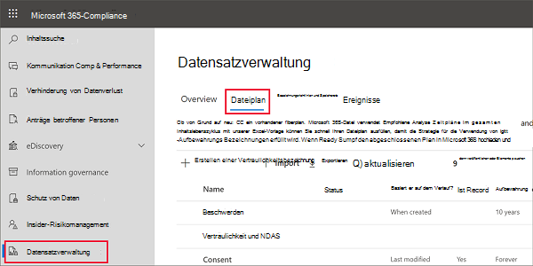
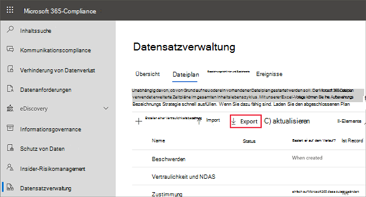
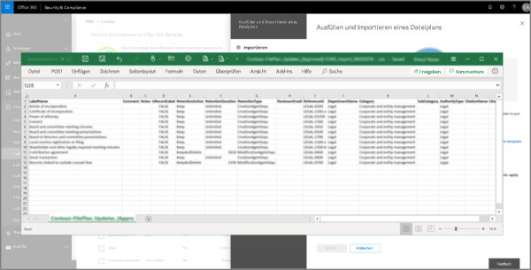

# Dateiplan zum Verwalten von Aufbewahrungsbezeichnungen verwenden

>*[Microsoft 365-Lizenzierungsleitfaden für Sicherheit und Compliance](https://aka.ms/ComplianceSD).*

Sie können zwar Aufbewahrungsbezeichnungen von **Informationsgovernance** im Microsoft 365 Compliance Center erstellen und verwalten, aber der Dateiplan aus **Datensatzverwaltung** verfügt über zusätzliche Verwaltungsfunktionen:

- Sie können die Aufbewahrungsbezeichnungen in einem Stapel erstellen, indem Sie die relevanten Informationen aus einer Kalkulationstabelle importieren.

- Sie können die Informationen aus vorhandenen Aufbewahrungsbezeichnungen für die Analyse und Offline-Zusammenarbeit oder für die Stapelbearbeitung exportieren.

- Weitere Informationen zu den Aufbewahrungsbezeichnungen werden angezeigt, um die Einstellungen aller Aufbewahrungsbezeichnungen in einer Ansicht anzuzeigen.

- Dateiplandeskriptoren unterstützen zusätzliche und optionale Informationen für jede Bezeichnung.

Der Dateiplan kann für alle Aufbewahrungsbezeichnungen verwendet werden, auch wenn sie Inhalt nicht als Datensatz markieren.

Informationen zu den Aufbewahrungsbezeichnungen und deren Verwendung finden Sie unter [Informationen zu Aufbewahrungsbezeichnungen](labels.md).

## Zugriff auf den Dateiplan

Um auf den Dateiplan zuzugreifen, müssen Sie über eine der folgenden Administratorrollen verfügen:
    
- Aufbewahrungs-Manager

- Aufbewahrungs-Manager (schreibgeschützt)

Wechseln Sie im Microsoft 365 Compliance Center zu **Lösungen** > **Datensatzverwaltung** > **Dateiplan**. 

Wenn **Datensatzverwaltung** im Navigationsbereich nicht angezeigt wird, scrollen Sie nach unten und wählen Sie **Alle anzeigen** aus.

## Navigieren in Ihrem Dateiplan

Wenn Sie bereits Aufbewahrungsbezeichnungen aus **Informationsgovernance** im Microsoft 365 Compliance Center erstellt haben, werden diese Bezeichnungen automatisch in Ihrem Dateiplan angezeigt. 

Wenn Sie nun im Dateiplan Aufbewahrungsbezeichnungen erstellen, stehen diese auch über **Informationsgovernance** zur Verfügung, wenn die Bezeichnungen nicht so konfiguriert sind, dass Inhalte als Datensatz gekennzeichnet werden.

Auf der Seite **Dateiplan** werden alle Ihre Bezeichnungen mit Ihrem Status und Ihren Einstellungen, optionalen Dateiplandeskriptoren, einer Exportoption zum Analysieren oder Aktivieren von Offline-Überprüfungen Ihrer Bezeichnungen und einer Importoption zum Erstellen von Aufbewahrungsbezeichnungen angezeigt. 

### Spalten mit Bezeichnungseinstellungen

Alle Spalten, mit Ausnahme der Bezeichnung **Namen**, können angezeigt oder ausgeblendet werden, indem Sie die Option **Spalten anpassen** auswählen. Standardmäßig werden in den ersten Spalten Informationen zum Bezeichnungsstatus und den zugehörigen Einstellungen angezeigt: 

- **Status** gibt an, ob die Bezeichnung in einer Bezeichnungsrichtlinie enthalten ist oder dass die Richtlinie automatisch angewendet wird (**aktive**) oder nicht (**inaktive**).

- **Basierend auf** wird angegeben, wie oder wann der Aufbewahrungszeitraum beginnt. Gültige Werte:
    - Ereignis
    - Zeitpunkt der Erstellung
    - Zuletzt geändert
    - Zeitpunkt der Bezeichnung

- **Ist-Datensatz** identifiziert, ob das Element als Datensatz gekennzeichnet ist, wenn die Bezeichnung angewendet wird. Gültige Werte:
    - Nein
    - Ja

- **Aufbewahrungsdauer** bezeichnet den Aufbewahrungszeitraum. Gültige Werte:
    - Tage
    - Monate
    - Jahre
    - Für immer
    - Keine

- **Löschungstyp** gibt an, was mit dem Inhalt am Ende des Aufbewahrungszeitraums geschieht. Gültige Werte:
    - Keine Aktion
    - Automatisch löschen
    - Überprüfung erforderlich

### Spalten mit Dateiplandeskriptoren

Mit dem Dateiplan können Sie weitere Informationen als Teil der Aufbewahrungsbezeichnungen hinzuzufügen. Diese Dateiplandeskriptoren bieten weitere Optionen zur Verbesserung von Verwaltung und Organisation der zu beschriftenden Inhalte.

Standardmäßig werden in den nächsten Spalten, beginnend mit **Referenz-ID**, die Dateiplandeskriptoren angezeigt, die Sie beim Erstellen einer Aufbewahrungsbezeichnung oder beim Bearbeiten einer vorhandene Bezeichnung angeben können. 

Zum Einstieg gibt es einige besondere Werte für die folgenden Dateiplandeskriptoren: 
- Geschäftsfunktion/-abteilung
- Kategorie
- Autoritätstyp
- Bestimmung/Zitat 

Beispiel für Dateiplandeskriptoren beim Erstellen oder Bearbeiten einer Aufbewahrungsbezeichnung:

Beispielansicht der Spalten mit Dateiplandeskriptoren:

## Exportieren aller Aufbewahrungsbezeichnungen zum Analysieren oder Aktivieren von Offline-Überprüfungen

Aus dem Dateiplan können Sie die Details aller Aufbewahrungsbezeichnungen in eine CSV-Datei exportieren, mit deren Hilfe Sie regelmäßige Complianceüberprüfungen, mit den Beteiligten der Datengovernance Ihrer Organisation, durchführen können.

Um alle Aufbewahrungsbezeichnungen zu exportieren, gehen Sie zur Seite **Dateiplan**und klicken auf **Exportieren**:

Eine CSV-Datei mit allen vorhandenen Aufbewahrungsbeschriftungen wird geöffnet. Zum Beispiel:

## Importieren von Aufbewahrungsbezeichnungen in Ihren Dateiplan

Im Dateiplan können Sie neue Aufbewahrungsbezeichnungen im Stapel importieren und vorhandene Aufbewahrungsbezeichnungen im Stapel ändern.

So importieren Sie neue Aufbewahrungsbezeichnungen und ändern vorhandene Aufbewahrungsbezeichnungen: 

1. Klicken Sie auf der Seite **Dateiplan** auf **Importieren**, um die Seite **Ihren Dateiplan ausfüllen und importieren** zu verwenden:

   

   

2. Laden Sie eine leere Vorlage herunter, um neue Aufbewahrungsbezeichnungen zu importieren. Alternativ können Sie mit der CSV-Datei beginnen, die exportiert wird, wenn Sie die vorhandenen Aufbewahrungsbezeichnungen in Ihrer Organisation exportieren.

   

3. Füllen Sie die Vorlage aus. Verwenden Sie die folgenden Informationen, die jeweils die Eigenschaften und ihre gültigen Werte beschreiben. Bei einem Importvorgang hat jeder Wert die maximale Länge von 64 Zeichen.  

   |Eigenschaft|Typ|Gültige Werte|
   |:-----|:-----|:-----|
   |LabelName|Zeichenfolge|Diese Eigenschaft gibt den Namen des Aufbewahrungsrichtlinientags an.|
   |Kommentar|Zeichenfolge|Verwenden Sie diese Eigenschaft, um eine Beschreibung der Aufbewahrungsbezeichnung für Administratoren hinzuzufügen. Diese Beschreibung wird nur Administratoren angezeigt, die die Aufbewahrungsbeschreibung im Compliance Center verwalten.|
   |Notes|Zeichenfolge|Verwenden Sie diese Eigenschaft, um eine Beschreibung der Aufbewahrungsbezeichnung für Benutzer hinzuzufügen. Diese Beschreibung wird angezeigt, wenn Benutzer den Mauszeiger über die Bezeichnung in Apps wie Outlook, SharePoint und OneDrive bewegen. Wenn Sie diese Eigenschaft leer lassen, wird eine Standardbeschreibung angezeigt, in der die Aufbewahrungseinstellungen der Bezeichnung erläutert werden. |
   |IsRecordLabel|Zeichenfolge|Diese Eigenschaft gibt an, ob die Bezeichnung eine Datensatzbezeichnung ist. Gültige Werte sind:  **TRUE**: die Bezeichnung kennzeichnet das Element als Datensatz. Das Element kann daher nicht gelöscht werden.  **FALSE**: die Bezeichnung kennzeichnet den Inhalt nicht als Datensatz. Dies ist der Standardwert.|
   |RetentionAction|Zeichenfolge|Diese Eigenschaft gibt an, welche Aktion auszuführen ist, nachdem der durch die RetentionDuration-Eigenschaft angegebene Wert abläuft. Gültige Werte sind:  **Delete**: Elemente, die älter als der von der RetentionDuration-Eigenschaft angegebene Wert sind, werden gelöscht. **Keep**: Elemente werden für die durch die RetentionDuration-Eigenschaft festgelegte Dauer beibehalten. Nach Ablauf dieses Zeitraums wird nichts ausgeführt.  **KeepAndDelete**: Elemente werden für die durch die RetentionDuration-Eigenschaft festgelegte Dauer beibehalten. Nach Ablauf dieses Zeitraums werden sie gelöscht.   |
   |RetentionDuration|Zeichenfolge|Die Eigenschaft gibt die Anzahl der Tage an, die der Inhalt aufbewahrt werden soll. Gültige Werte sind:  **Unlimited**: Elemente werden auf unbestimmte Zeit aufbewahrt.  ***n***: Rine positive ganze Zahl; zum Beispiel: **365**. 
   |RetentionType|String|Diese Eigenschaft gibt an, ob die Aufbewahrungsdauer aus dem Datum der Inhaltserstellung, des Ereignisses, Bezeichnung oder der letzten Änderung berechnet wird. Gültige Werte sind:  **CreationAgeInDays** **EventAgeInDays** **TaggedAgeInDays** **ModificationAgeInDays** |
   |ReviewerEmail|SmtpAddress|Wenn diese Eigenschaft ausgefüllt wird, wird eine Dispositionsüberprüfung ausgelöst, wenn die Aufbewahrungsdauer abgelaufen ist. Diese Eigenschaft gibt die E-Mail-Adresse einer Prüferin oder eines Prüfers für die Aufbewahrungsaktionen **KeepAndDelete** an. Sie können die E-Mail-Adressen einzelner Benutzer, Verteiler- oder Sicherheitsgruppen einschließen. Mehrere E-Mail-Adressen können durch Kommas getrennt angegeben werden.|
   |ReferenceId|String|Diese Eigenschaft gibt den Wert an, der im Dateiplandeskriptor **Referenz-ID** angezeigt wird und den Sie als eindeutigen Wert für Ihre Organisation verwenden können.| 
   |DepartmentName|Zeichenfolge|Diese Eigenschaft gibt den Wert an, der in der Dateiplanbeschreibung **Funktion/Abteilung** angezeigt wird.|
   |Kategorie|Zeichenfolge|Diese Eigenschaft gibt den Wert an, der in der Dateiplanbeschreibung **Kategorie** angezeigt wird.|
   |SubCategory|Zeichenfolge|Diese Eigenschaft gibt den Wert an, der in der Dateiplanbeschreibung **Unterkategorie** angezeigt wird.|
   |AuthorityType|Zeichenfolge|Diese Eigenschaft gibt den Wert an, der in der Dateiplanbeschreibung **Autoritätstyp** angezeigt wird.|
   |CitationName|String|Diese Eigenschaft gibt das Zitat an, das im Dateiplandeskriptor **Bereitstellung/Zitat** angezeigt wird. Beispielsweise „Sarbanes-Oxley Act von 2002“. |
   |CitationUrl|Zeichenfolge|Diese Eigenschaft gibt die URL an, die in der Dateiplanbeschreibung **Bereitstellung/Zitat** angezeigt wird.|
   |CitationJurisdiction|String|Diese Eigenschaft gibt die Zuständigkeiten oder die Agentur an, die im Dateiplandeskriptor **Bereitstellungs/Zitat** angezeigt wird. Beispielsweise „Securities and Exchange Commission, SEC (Börsenaufsichtsbehörde)“|
   |Behördlich|Zeichenfolge|Leer lassen. Diese Eigenschaft wird derzeit nicht verwendet.|
   |EventType|Zeichenfolge|Diese Eigenschaft gibt die Aufbewahrungsregel an, die der Bezeichnung zugeordnet ist. Sie können einen beliebigen Wert verwenden, der die Regel eindeutig identifiziert. Zum Beispiel: **Name** **Distinguished name (DN)** **GUID**  Mit dem Cmdlet [Get-RetentionComplianceRule](https://docs.microsoft.com/powershell/module/exchange/get-retentioncompliancerule?view=exchange-ps) können Sie die verfügbaren Aufbewahrungsregeln anzeigen. Da die EventType-Werte individuell für eine Organisation sind, können Sie beim Export der Bezeichnungen aus einer Organisation nicht die Werte für die EventType-Eigenschaft aus dieser Organisation verwenden, um Bezeichnungen in eine andere Organisation zu importieren.|
   |||

   Nachfolgend finden Sie ein Beispiel für die Vorlage mit den Informationen zu Aufbewahrungsbezeichnungen.

   

4. Klicken Sie unter Schritt 3 auf der Seite **Ausfüllen und Importieren eines Dateiplans** auf **Nach Dateien suchen**, um die ausgefüllte Vorlage hochzuladen. 

   Der Dateiplan überprüft die Einträge und zeigt die Import Statistiken an.

   

   Wenn ein Überprüfungsfehler vorliegt, überprüft der Dateiplan-Import weiterhin jeden Eintrag in der Importdatei und zeigt alle Fehler mit Verweis auf die Zeilen- und Zeilennummern in der Importdatei. Kopieren Sie die angezeigten Fehlerergebnisse, damit Sie diese beheben können, wenn Sie zu der Importdatei zurückkehren.

Nach Abschluss des Importvorgangs können Sie die Aufbewahrungsbezeichnungen einer neuen Richtlinie für die Aufbewahrungsbezeichnungen hinzufügen oder automatisch anwenden. Sie können diesen Schritt direkt über die Seite **Dateiplan** vornehmen, indem Sie die Dropdownliste von **+ Bezeichnung erstellen** und dann **Richtlinie zum Veröffentlichen von Bezeichnungen** oder **Richtlinie für Bezeichnung automatisch anwenden** auswählen.

## Nächste Schritte

Weitere Informationen zum Erstellen und Bearbeiten von Aufbewahrungsbezeichnungen und deren Richtlinien finden Sie unter [Erstellen, Veröffentlichen und automatisches Anwenden von Aufbewahrungsbezeichnungen](create-retention-labels.md).
