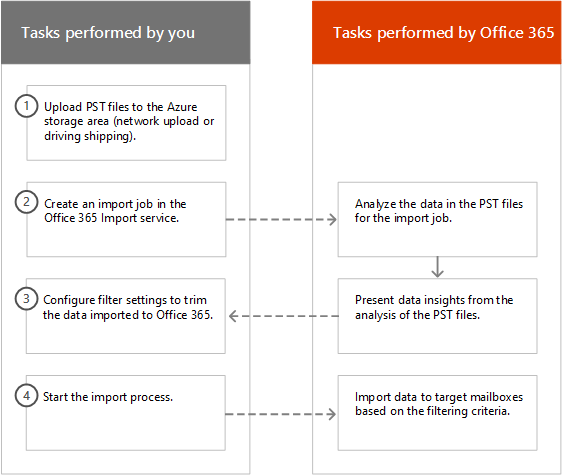

# Filtern von Daten beim Importieren von PST-DateienFilter data when importing PST files

Verwenden Sie das neue Feature Intelligent Import im Office 365 Import service, um die Elemente in PST-Dateien zu filtern, die tatsächlich in die Zielpostfächer importiert werden.Use the new Intelligent Import feature in the Office 365 Import service to filter the items in PST files that actually get imported to the target mailboxes. Funktionsweise:Here's how it works:
  
- Nachdem Sie einen PST-Importauftrag erstellt und übermittelt haben, werden PST-Dateien in einen Azure-Speicherbereich in der Microsoft Cloud hochgeladen.After you create and submit a PST import job, PST files are uploaded to an Azure storage area in the Microsoft cloud.
    
- Microsoft 365 analysiert die Daten in den PST-Dateien auf sichere Weise, indem das Alter der Postfachelemente und die verschiedenen Nachrichtentypen identifiziert werden, die in den PST-Dateien enthalten sind.Microsoft 365 analyzes the data in the PST files, in a safe and secure manner, by identifying the age of the mailbox items and the different message types included in the PST files.
    
- Wenn die Analyse abgeschlossen ist und die Daten importiert werden können, haben Sie die Möglichkeit, alle Daten in den PST-Dateien so zu importieren, wie sie sind, oder die importierten Daten zu kürzen, indem Sie Filter festlegen, die steuern, welche Daten importiert werden.When the analysis is complete and the data is ready to import, you have the option to import all data in the PST files as is or trim the data that's imported by setting filters that control what data gets imported. Sie können z. B. folgende Option auswählen:For example, you can choose to:
    
  - Importieren Sie nur Elemente eines bestimmten Alters.Import only items of a certain age.
    
  - Importiert ausgewählte Nachrichtentypen.Import selected message types.
    
  - Ausschließen von Nachrichten, die von bestimmten Personen gesendet oder empfangen wurden.Exclude messages sent or received by specific people.
    
- Nachdem Sie die Filtereinstellungen konfiguriert haben, importiert Microsoft 365 nur die Daten, die die Filterkriterien erfüllen, in die im Importauftrag angegebenen Zielpostfächer.After you configure the filter settings, Microsoft 365 imports only the data that meets the filtering criteria to the target mailboxes specified in the import job.
    
In der folgenden Grafik wird der Intelligente Importprozess gezeigt, und es werden die von Ihnen ausgeführten Aufgaben und die von der Office 365.The following graphic shows the Intelligent Import process, and highlights the tasks you perform and the tasks performed by Office 365.
  

  
## Erstellen eines PST-ImportauftragsCreate a PST import job

- Bei den Schritten in diesem Thema wird davon ausgegangen, dass Sie einen PST-Importauftrag im Office 365 Import service mithilfe von Netzwerkupload oder Laufwerkversand erstellt haben.The steps in this topic assume that you've created a PST import job in the Office 365 Import service by using network upload or drive shipping. Schrittweise Anweisungen finden Sie in einem der folgenden Themen:For step-by-step instructions, see one of the following topics:
    
  - [Verwenden des Netzwerkuploads zum Importieren von PST-Dateien in Office 365Use network upload to import PST files to Office 365](use-network-upload-to-import-pst-files.md)
    
  - [Verwenden des Laufwerkversands zum Importieren von PST-Dateien in Office 365Use drive shipping to import PST files to Office 365](use-drive-shipping-to-import-pst-files-to-office-365.md)
    
- Nachdem Sie einen Importauftrag mithilfe des Netzwerkuploads erstellt haben, ist der Status für den Importauftrag auf der Seite Import im Security & Compliance Center auf **Analysis in progress** festgelegt, was bedeutet, dass Microsoft 365 die Daten in den hochgeladenen PST-Dateien analysiert.After you create an import job by using network upload, the status for the import job on the Import page in the Security & Compliance Center is set to **Analysis in progress**, which means that Microsoft 365 is analyzing the data in the PST files that you uploaded. Klicken **Sie auf**  Aktualisieren, um den Status des Importauftrags zu aktualisieren.Click **Refresh** to update the status for the import job. 
    
- Bei Importaufträgen für den Laufwerkversand werden die Daten von Microsoft 365 analysiert, nachdem Mitarbeiter des Microsoft-Rechenzentrums Ihre Festplatte empfangen und die PST-Dateien in den Azure-Speicherbereich für Ihre Organisation hochgeladen haben.For drive shipping import jobs, the data will be analyzed by Microsoft 365 after Microsoft datacenter personnel receive your hard drive and upload the PST files to the Azure storage area for your organization.
  
## Filtern von Daten, die in Postfächer importiert werdenFilter data that gets imported to mailboxes

Nachdem Sie einen PST-Importauftrag erstellt haben, führen Sie die folgenden Schritte aus, um die Daten zu filtern, bevor Sie ihn in Office 365.After you've created a PST import job, follow these steps to filter the data before you import it to Office 365.
  
1. Navigieren Sie zu [https://protection.office.com/](https://protection.office.com/), und melden Sie sich mit den Anmeldeinformationen für ein Administratorkonto in Ihrer Organisation an.Go to [https://protection.office.com/](https://protection.office.com/) and sign in using the credentials for an administrator account in your organization. 
    
2. Klicken **Sie auf Information Governance** \> **Importieren** von \> **PST-Dateien importieren.**Click **Information governance** \> **Import** \> **Import PST files**.
    
    Die Importaufträge für Ihre Organisation werden auf der Seite **PST-Dateien importieren** aufgeführt.The import jobs for your organization are listed on the **Import PST files** page. Beachten Sie, dass der **Wert Analysis completed** in der Spalte **Status** die Importaufträge angibt, die von Microsoft 365 analysiert wurden und zum Importieren bereit sind.Note that the **Analysis completed** value in the **Status** column indicates the import jobs that have been analyzed by Microsoft 365 and are ready for you to import. 
    
    
  
3. Klicken **Sie auf Bereit, um Office 365** für den Importauftrag zu importieren, den Sie abschließen möchten.Click **Ready to import to Office 365** for the import job that you want to complete. 
    
    Nun wird eine Flyout-Seite mit Informationen zu den PST-Dateien und anderen Informationen zur Importaufgabe angezeigt.A fly out page is displayed with information about the PST files and other information about the import job.
    
4. Klicken **Sie auf Importieren in Office 365**.Click **Import to Office 365**.
    
    Die Seite **Ihre Daten filtern** wird angezeigt.The **Filter your data** page is displayed. Sie enthält Dateneinblicke zu den Daten in den PST-Dateien für den Importauftrag, einschließlich Informationen zum Alter der Daten.It contains data insights about the data in the PST files for the import job, including information about the age of the data. 
    
    
  
5. Gehen Sie basierend darauf, ob Sie die in Microsoft 365 importierten Daten kürzen möchten, unter Möchten Sie Ihre Daten **filtern?** eine der folgenden Schritte aus:Based on whether or not you want to trim the data that's imported to Microsoft 365, under **Do you want to filter your data?**, do one of the following:
    
    a.a. Klicken **Sie auf Ja, ich möchte sie filtern,** bevor Sie importieren, um die importierten Daten zu kürzen, und klicken Sie dann auf **Weiter**.Click **Yes, I want to filter it before importing** to trim the data that you import, and then click **Next**.
    
    Die **Seite Daten in Office 365 importieren** wird mit detaillierten Dateneinblicken aus der Analyse angezeigt, die Microsoft 365 durchgeführt wurde.The **Import data to Office 365 page** page is displayed with detailed data insights from the analysis that Microsoft 365 performed. 
    
    
  
    Das Diagramm auf dieser Seite zeigt die Datenmenge, die importiert wird.The graph on this page shows the amount of data that will be imported. Informationen zu jedem Nachrichtentyp in den PST-Dateien werden im Diagramm angezeigt.Information about each message type found in the PST files is displayed in the graph. Sie können mit dem Cursor auf jede Leiste zeigen, um bestimmte Informationen zu diesem Nachrichtentyp anzeigen zu können.You can hover the cursor over each bar to display specific information about that message type. Es gibt auch eine Dropdownliste mit unterschiedlichen Alterswerten, die auf der Analyse der PST-Dateien basieren.There is also a drop-down list with different age values based on the analysis of the PST files. Wenn Sie ein Alter in der Dropdownliste auswählen, wird das Diagramm aktualisiert, um anzuzeigen, wie viele Daten für das ausgewählte Alter importiert werden.When you select an age in the drop-down list, the graph is updated to show how much data will be imported for the selected age. 
    
    b.b. Klicken Sie auf Weitere Filteroptionen, um Ergänzungsfilter zu konfigurieren, um die importierte **Datenmenge zu reduzieren.**To configure addition filters to reduce the amount of data that's imported, click **More filtering options**.
    
    
  
    Sie können die folgenden Filter konfigurieren:You can configure these filters:
    
      - **Alter** – Wählen Sie ein Alter aus, damit nur Elemente importiert werden, die höher als das angegebene Alter sind.**Age** - Select an age so only items that are newer than the specified age will be imported. Im Abschnitt [Weitere Informationen finden](#more-information) Sie eine Beschreibung, wie Microsoft 365 die Alterskübel für den **Altersfilter** bestimmt.See the [More information](#more-information) section for a description about how Microsoft 365 determines the age buckets for the **Age** filter. 
    
      - **Typ** – Dieser Abschnitt zeigt alle Nachrichtentypen, die in den PST-Dateien für den Importauftrag gefunden wurden.**Type** - This section shows all the message types that were found in the PST files for the import job. Sie können ein Kontrollkästchen neben einem Nachrichtentyp deaktivieren, den Sie ausschließen möchten.You can uncheck a box next to a message type that you want to exclude. Beachten Sie, dass Sie den Anderen Nachrichtentyp nicht ausschließen können.Note that you can't exclude the Other message type. Im Abschnitt [Weitere Informationen finden](#more-information) Sie eine Liste der Postfachelemente, die in der Kategorie Andere enthalten sind.See the [More information](#more-information) section for a list of mailbox items that are included in the Other category. 
    
      - **Benutzer** : Sie können Nachrichten ausschließen, die von bestimmten Personen gesendet oder empfangen werden.**Users** - You can exclude messages that are sent or received by specific people. Klicken Sie auf Benutzer neben diesem Empfängertyp ausschließen, um Personen auszuschließen,  die im Feld Von:, An: oder im Feld Cc: von Nachrichten angezeigt werden.To exclude people who appear in the From: field, To: field, or the Cc: field of messages, click **Exclude users** next to that recipient type. Geben Sie die E-Mail-Adresse (SMTP-Adresse) der Person ein, klicken Sie auf Neues Symbol hinzufügen, um sie der Liste der ausgeschlossenen Benutzer für diesen Empfängertyp hinzuzufügen, und klicken Sie dann auf Speichern, um die Liste der ausgeschlossenen Benutzer zu   speichern. Type the email address (SMTP address) of the person, click **Add** to add them to the list of excluded users for that recipient type, and then click **Save** to save the list of excluded users. 
    
        > [!NOTE]
        > Microsoft 365 zeigt keine Dateneinblicke an, die sich aus dem Festlegen des **Personenfilters** resulten.Microsoft 365 doesn't show data insights that result from setting the **People** filter. Wenn Sie diesen Filter jedoch so festlegen, dass Nachrichten ausgeschlossen werden, die von bestimmten Personen gesendet oder empfangen werden, werden diese Nachrichten während des tatsächlichen Importvorgangs ausgeschlossen.However, if you set this filter to exclude messages sent or received by specific people, those messages will be excluded during the actual import process. 
  
    c.c. Klicken **Sie auf** der **Fly-Out-Seite** Weitere Filteroptionen auf Übernehmen, um Die Filtereinstellungen zu speichern.Click **Apply** in the **More filtering options** fly out page to save your filter settings. 
    
    Die Dateneinblicke auf der Seite Daten in **Office 365** importieren werden basierend auf Ihren Filtereinstellungen aktualisiert, einschließlich der Gesamtmenge der Daten, die basierend auf den Filtereinstellungen importiert werden.The data insights on the **Import data to Office 365** page are updated based on your filter settings, including the total amount of data that will be imported based on the filter settings. Beachten Sie, dass auch eine Zusammenfassung der Filtereinstellungen angezeigt wird.Note that a summary of the filter settings is also shown. Sie können neben einem **Filter** auf Bearbeiten klicken, um die Einstellung bei Bedarf zu ändern.You can click **Edit** next to a filter to change the setting if necessary. 
    
    
  
    d.d. Klicken Sie auf **Weiter**.Click **Next**.
    
    Es wird eine Statusseite mit den Filtereinstellungen angezeigt.A status page is displayed showing your filter settings. Auch hier können Sie alle Filtereinstellungen bearbeiten.Again, you can edit any of the filter settings.
    
    e.e. Klicken **Sie auf Daten importieren,** um den Import zu starten.Click **Import data** to start the import . Beachten Sie, dass die Gesamtzahl der zu importierende Daten angezeigt wird.Note that the total amount of data that will be imported is displayed. 
    
    OderOr
    
    a.a. Klicken **Sie auf Nein, ich möchte alles importieren,** um alle Daten in den PST-Dateien in Office 365 importieren, und klicken Sie dann auf **Weiter**.Click **No, I want to import everything** to import all data in the PST files to Office 365, and then click **Next**.
    
    b.b. Klicken Sie **auf der Seite Daten Office 365** importieren auf Daten **importieren,** um den Import zu starten.On the **Import data to Office 365** page, click **Import data** to start the import. Beachten Sie, dass die Gesamtzahl der zu importierende Daten angezeigt wird.Note that the total amount of data that will be imported is displayed. 
    
6. Klicken Sie **auf der Seite PST-Dateien** importieren auf **Aktualisieren**  aktualisieren.On the **Import PST files** page, click **Refresh** . Der Status des Importauftrags wird in der Spalte **Status** angezeigt.The status for the import job is displayed in the **Status** column. 
    
7. Klicken Sie auf den Auftrag importieren, um ausführlichere Informationen wie den Status für jede PST-Datei und die von Ihnen konfigurierten Filtereinstellungen anzeigen zu können.Click the import the job to display more detailed information, such as the status for each PST file and the filter settings that you configured.

  
## Weitere InformationenMore information

- Wie bestimmt Microsoft 365 die Inkremente für den Altersfilter?How does Microsoft 365 determine the increments for the age filter? Wenn Microsoft 365 eine PST-Datei analysiert, wird der gesendete oder empfangene Zeitstempel jedes Elements angezeigt (wenn ein Element sowohl einen gesendeten als auch einen empfangenen Zeitstempel besitzt, wird das älteste Datum ausgewählt).When Microsoft 365 analyzes a PST file, it looks at the sent or received time stamp of each item (if an item has both a sent and received timestamp, the oldest date is selected). Anschließend Microsoft 365 den Jahreswert für diesen Zeitstempel und vergleicht ihn mit dem aktuellen Datum, um das Alter des Elements zu bestimmen.Then Microsoft 365 looks at the year value for that timestamp and compares it to the current date to determine the age of the item. Diese Alter werden dann als Werte in der Dropdownliste für den Filter **Alter** verwendet.These ages are then used as the values in the drop-down list for the **Age** filter. Wenn eine PST-Datei z. B. Nachrichten aus 2016, 2015 und 2014 enthält, sind die Werte im Filter Alter **1** Jahr, **2** Jahre und  **3 Jahre.**For example, if a PST file has messages from 2016, 2015, and 2014, then values in the **Age** filter would be **1 year**, **2 years**, and **3 years**.
    
- In der folgenden Tabelle sind die Nachrichtentypen aufgeführt, die  in der Kategorie **Andere** im Typfilter auf der Fly-Out-Seite Weitere Optionen enthalten sind (siehe Schritt 5b im vorherigen Verfahren). The following table lists the message types that are included in the **Other** category in the **Type** filter on the **More options** fly out page (see Step 5b in the previous procedure). Derzeit können Sie Elemente in der Kategorie "Andere" nicht ausschließen, wenn Sie PSTs in Office 365.Currently, you can't exclude items in the "Other" category when you import PSTs to Office 365. 
    
    |**ID der Nachrichtenklasse****Message class ID**|**Postfachelemente, die diese Nachrichtenklasse verwenden****Mailbox items that use this message class**|
    |:-----|:-----|
    |IPM.ActivityIPM.Activity    |JournaleinträgeJournal entries    |
    |IPM.DocumentIPM.Document    |Dokumente und Dateien (nicht an eine E-Mail-Nachricht angefügt)Documents and files (not attached to an email message)    |
    |IPM. DateiIPM.File    |(identisch mit IPM.DocUment)(same as IPM.Document)    |
    |IPM.Note.IMC.NotificationIPM.Note.IMC.Notification    |Von Internet Mail Verbinden gesendete Berichte, das Exchange Server gateway to the Internet istReports sent by Internet Mail Connect, which is the Exchange Server gateway to the Internet    |
    |IPM. Note.Microsoft.FaxIPM.Note.Microsoft.Fax    |FaxnachrichtenFax messages    |
    |IPM. Note.Rules.Oof.Template.MicrosoftIPM.Note.Rules.Oof.Template.Microsoft    |Automatische Antwortnachrichten in OfficeOut-of-office auto-reply messages    |
    |IPM.Note.Rules.ReplyTemplate.MicrosoftIPM.Note.Rules.ReplyTemplate.Microsoft    |Von einer Posteingangsregel gesendete AntwortenReplies sent by an inbox rule    |
    |IPM.OLE.ClassIPM.OLE.Class    |Ausnahmen für eine SerienserieExceptions for a recurring series    |
    |IPM.Recall.ReportIPM.Recall.Report    |Berichte zum NachrichtenrückrufMessage recall reports    |
    |IPM.RemoteIPM.Remote    |Remote-E-Mail-NachrichtenRemote mail messages    |
    |IPM.ReportIPM.Report    |ArtikelstatusberichteItem status reports    |
