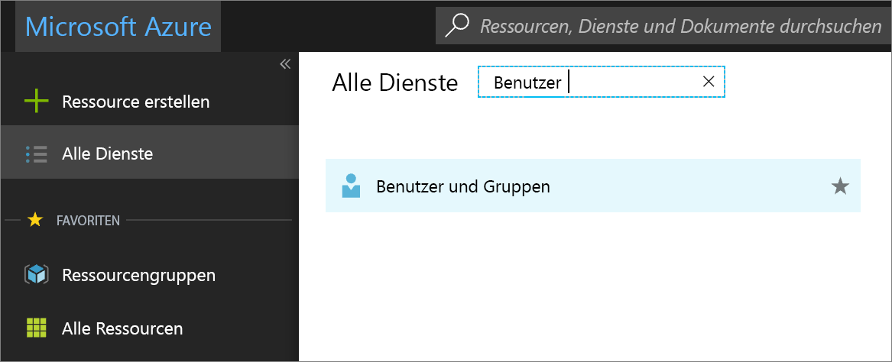
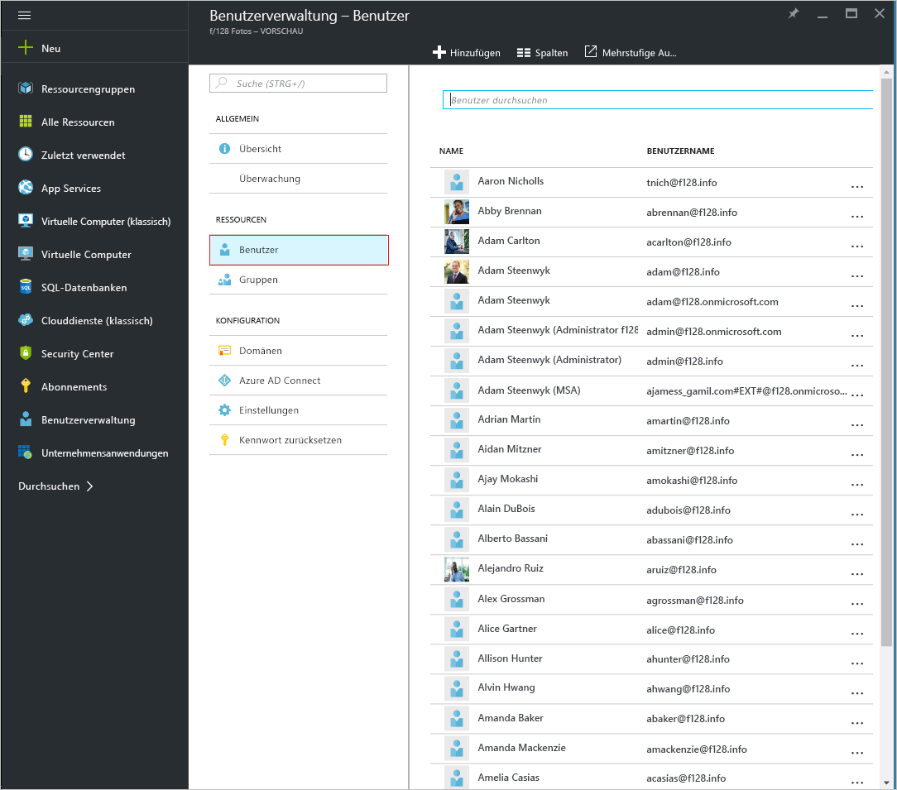
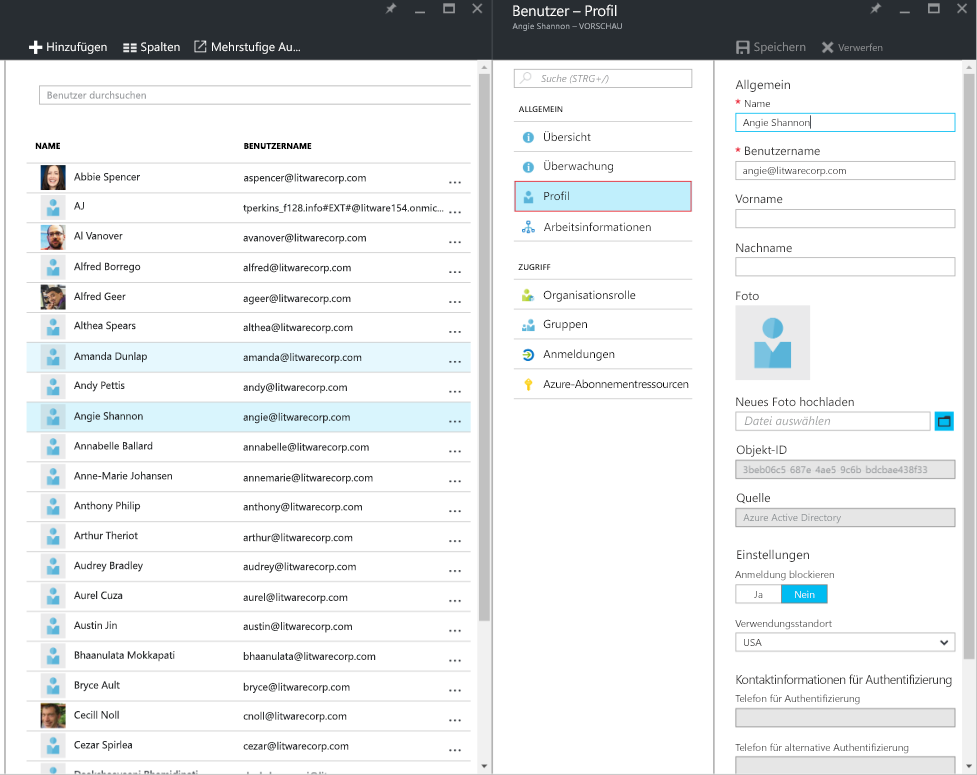
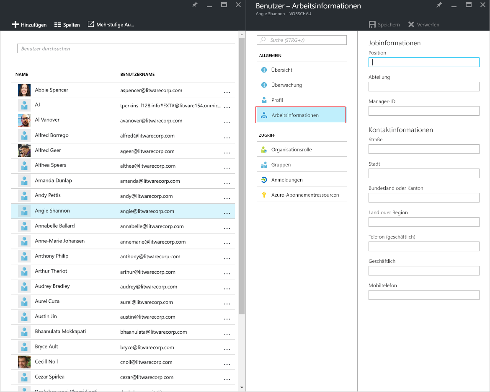
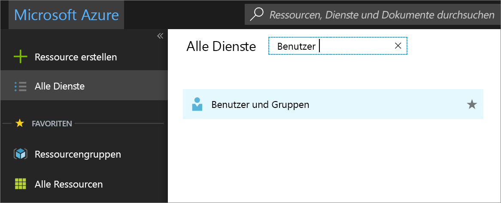
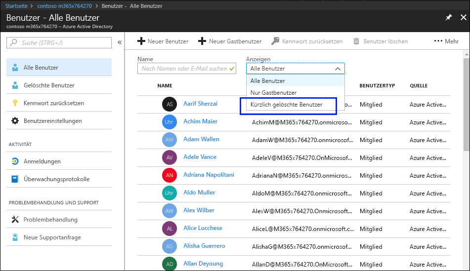
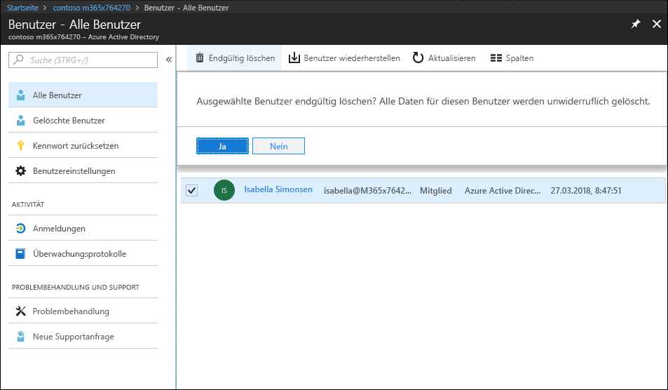
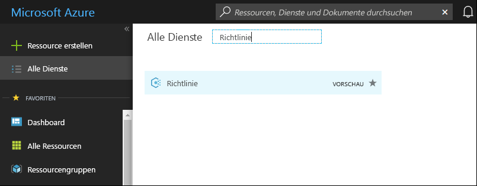
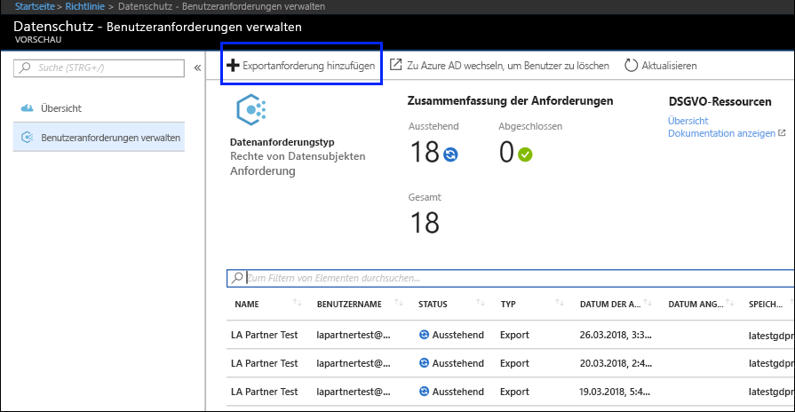
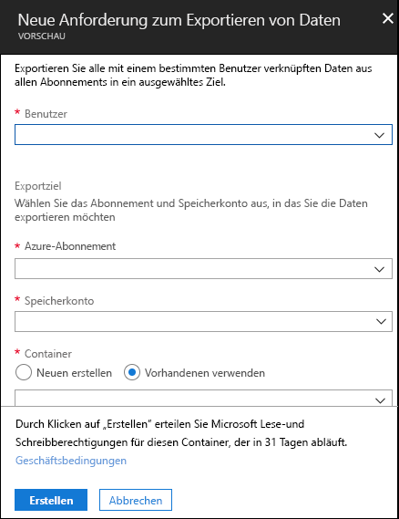

# Anträge betroffener Personen für Azure im Rahmen der DSGVO

## Einführung in Anträge betroffener Personen

Die [Datenschutz-Grundverordnung (DSGVO)](https://ec.europa.eu/justice/data-protection/reform/index_en.htm) der Europäischen Union gewährt Personen (in den Bestimmungen als *betroffene Personen* bezeichnet) das Recht zum Verwalten ihrer personenbezogenen Daten, die von einem Arbeitgeber oder von einer anderen Art von Behörde oder Organisation (als *Datenverantwortlicher* oder nur *Verantwortlicher* bezeichnet) erfasst werden. Personenbezogene Daten sind im Rahmen der DSGVO sehr weitgefasst als Daten definiert, die sich auf eine identifizierte oder identifizierbare natürliche Person beziehen. Die DSGVO erteilt betroffenen Personen bestimmte Rechte für ihre personenbezogenen Daten; dazu gehören das Kopieren der personenbezogenen Daten, das Anfordern von Korrekturen, das Einschränken der Verarbeitung, das Löschen oder das Erhalten in einem elektronischen Format, damit sie zu einem anderen Datenverantwortlichen bewegt werden können. Eine formale Anfrage einer betroffenen Person an einen Datenverantwortlichen im Hinblick auf eine bestimmte Aktion bezüglich ihrer personenbezogenen Daten wird als *Antrag einer betroffenen Person* bezeichnet.

In diesem Leitfaden wird erläutert, wie Microsoft-Produkte, -Dienste und -Verwaltungstools verwendet werden können, um unseren als Datenverantwortliche handelnden Kunden dabei zu helfen, personenbezogene Daten zu finden und auf Anträge betroffener Personen zu reagieren. Dies umfasst das Suchen und Abrufen der personenbezogenen Daten, die in der Microsoft-Cloud gespeichert sind, sowie das weitere Verarbeiten dieser Daten. Im Folgenden finden Sie eine kurze Übersicht der in diesem Leitfaden beschriebenen Prozesse:

- **Ermittlung:** Verwenden Sie Such- und Ermittlungstools, um Kundendaten leichter zu finden, die möglicherweise Gegenstand eines Antrags einer betroffenen Person sind. Sobald potenziell geeignete Dokumente gefunden wurden, können Sie eine oder mehrere der Aktionen für Anträge betroffener Personen ausführen, die in den folgenden Schritten beschrieben sind, um auf den Antrag der betroffenen Person zu reagieren. Andernfalls können Sie bestimmen, dass der Antrag nicht den Unternehmensrichtlinien für die Reaktion auf Anträge betroffener Personen entspricht.
- **Zugriff:** Rufen Sie personenbezogene Daten ab, die sich in der Microsoft-Cloud befinden, und erstellen Sie eine Kopie, die der betroffenen Person zur Verfügung gestellt werden kann, sofern dies beantragt wurde.
- **Berichtigung:** Nehmen Sie gegebenenfalls Änderungen vor oder führen Sie andere beantragte Aktionen für die personenbezogenen Daten aus.
- **Einschränkung:** Schränken Sie die Verarbeitung personenbezogener Daten entweder durch Zurückziehen von Lizenzen für verschiedenen Azure-Dienste oder durch Deaktivieren der gewünschten Dienste wo möglich ein. Des Weiteren können Sie Daten aus der Microsoft-Cloud entfernen und diese lokal oder an einem anderen Ort aufbewahren.
- **Löschung:** Entfernen Sie personenbezogene Daten, die sich in der Microsoft-Cloud befinden, dauerhaft.
- **Export:** Stellen Sie der betroffenen Person eine elektronische Kopie (in einem maschinenlesbaren Format) von personenbezogenen Daten zur Verfügung.

In jedem Abschnitt dieses Leitfadens werden die Prozesse beschrieben, die ein als Datenverantwortlicher handelndes Unternehmen nutzen kann, um auf einen Antrag einer betroffenen Person bezüglich ihrer personenbezogenen Daten in der Microsoft-Cloud zu reagieren.

## Terminologie

Nachfolgend finden Sie Definitionen von Begriffen, die für diesen Leitfaden relevant sind.

- **Datenverantwortlicher:** Eine natürliche oder juristische Person, öffentliche Behörde, Agentur oder andere Stelle, die allein oder gemeinsam mit anderen die Zwecke und Mittel der Verarbeitung personenbezogener Daten bestimmt. Sofern die Zwecke und Mittel der Verarbeitung durch das Recht der Union oder der Mitgliedstaaten bestimmt werden, können der Datenverantwortliche bzw. die spezifischen Kriterien für dessen Benennung durch das Recht der Union oder des Mitgliedstaats angegeben werden.
- **Personenbezogene Daten und betroffene Person:** Alle Informationen über eine identifizierte oder identifizierbare natürliche Person („betroffene Person“). Eine identifizierbare natürliche Person ist eine Person, die direkt oder indirekt, insbesondere durch Zuordnung zu einer Kennung wie einem Namen, zu einer Kennnummer, zu Standortdaten, zu einer Online-Kennung oder zu einem oder mehreren besonderen Merkmalen identifiziert werden kann, die Ausdruck der physischen, physiologischen, genetischen, psychischen, wirtschaftlichen, kulturellen oder sozialen Identität dieser natürlichen Person sind.
- **Auftragsverarbeiter:** Eine natürliche oder juristische Person, öffentliche Behörde, Agentur oder andere Stelle, die personenbezogene Daten im Auftrag des Verantwortlichen verarbeitet.
- **Kundendaten:** Alle Daten, einschließlich aller Text-, Ton-, Video- oder Bilddateien und Software, die Microsoft durch oder im Auftrag eines Kunden durch die Verwendung des Enterprise-Dienstes bereitgestellt werden. Kundendaten umfassen sowohl (1) Informationen zur Identifikation von Endbenutzern (z. B. Benutzernamen und Kontaktinformationen in Azure Active Directory) als auch Kundeninhalte, die ein Kunde in einen bestimmten Dienst hochlädt oder in diesem erstellt (z. B. Kundeninhalte in einem Azure Storage-Konto, Kundeninhalte in einer Azure SQL-Datenbank oder das Image einer virtuellen Maschine eines Kunden in Azure Virtual Machines).
- **Vom System generierte Protokolle:** Von Microsoft generierte Protokolle und verbundene Daten, die Microsoft bei der Bereitstellung von Enterprise-Diensten für Benutzer unterstützen. Vom System generierte Protokolle enthalten in erster Linie pseudonymisierte Daten, z. B. eindeutige Bezeichner – in der Regel eine vom System generierte Zahl, die von sich aus eine Einzelperson nicht identifizieren kann, aber dazu verwendet wird, die Enterprise-Dienste für Benutzer bereitzustellen. Vom System generierte Protokolle enthalten möglicherweise auch Informationen zur Identifikation von Endbenutzern, wie z. B. einen Benutzernamen.

## Verwenden dieses Leitfadens

Dieser Leitfaden besteht aus zwei Teilen:

- **Teil 1: Reaktion auf Anträge betroffener Personen bezüglich Kundendaten** – In Teil 1 dieses Leitfadens wird erläutert, wie Sie in Anwendungen, in denen Sie Daten verfasst haben, auf diese zugreifen, sie korrigieren, einschränken und exportieren können. Dieser Abschnitt enthält Informationen zum Ausführen von Anträgen betroffener Personen in Bezug auf Kundeninhalte und Informationen zur Identifizierung von Endbenutzern.
- **Teil 2: Reaktion auf Anträge betroffener Personen bezüglich vom System generierten Protokollen** – Wenn Sie die Microsoft Enterprise-Dienste verwenden, generiert Microsoft einige Informationen, die als vom System generierte Protokolle bekannt sind, um den Dienst bereitzustellen. In Teil 2 dieses Leitfadens wird erläutert, wie Sie auf solche Daten in Azure zugreifen können und wie Sie sie löschen und exportieren können.

## Grundlegendes zu Anträgen betroffener Personen für Azure Active Directory- und Microsoft-Dienstkonten

Im Rahmen von Diensten, die für Enterprise-Kunden bereitgestellt werden, ist das Ausführen von Anträgen betroffener Personen immer im Kontext eines bestimmten Azure Active Directory-Mandanten (AAA) zu verstehen. Anträge betroffener Personen werden NUR in einem bestimmten AAD-Mandanten ausgeführt. Wenn ein Benutzer Teil mehrerer Mandanten ist, wird ein bestimmter Antrag einer betroffenen Person *nur* im Kontext des Mandanten ausgeführt, in dem die Anforderung empfangen wurde. Dies ist eine wichtige Information, weil es bedeutet, dass die Ausführung eines Antrags einer betroffenen Person von einem Enterprise-Kunden **keine** Auswirkungen auf die Daten eines angrenzenden Enterprise-Kunden hat.

Das Gleiche gilt auch für Microsoft-Dienstkonten (Microsoft Service Accounts, MSA) im Kontext der einem Enterprise-Kunden zur Verfügung gestellten Dienste: die Ausführung eines Antrags einer betroffenen Person bezüglich eines MSA-Kontos, *das einem ADD-Mandanten zugeordnet ist*, **betrifft nur** Daten innerhalb des Mandanten. Darüber hinaus ist es wichtig, Folgendes beim Umgang mit MSA-Konten in einem Mandanten zu verstehen:

- Wenn ein MSA-Benutzer ein Azure-Abonnement erstellt, wird das Abonnement so behandelt, als wäre es ein AAD-Mandant. Entsprechend beziehen sich Anträge betroffener Personen nur auf die personenbezogenen Daten innerhalb dieses Mandanten, wie oben beschrieben.
- Wenn ein über ein MSA-Konto erstelltes Azure-Abonnement gelöscht wird, **hat dies keine Auswirkungen** auf das eigentliche MSA-Konto. Auch hier bezieht sich die Ausführung von Anträgen betroffener Personen nur auf die personenbezogenen Daten in dem Azure-Abonnement, das hier als Mandant fungiert.

Anträge betroffener Personen bezüglich eines MSA-Kontos selbst, **unabhängig von einem bestimmten Mandanten**, werden über das Datenschutz-Dashboard für unsere Kunden ausgeführt. Weitere Informationen finden Sie im Windows-Leitfaden zu Anträgen betroffener Personen.

## Teil 1: Leitfaden zu Anträgen betroffener Personen bezüglich Kundendaten

### Abwickeln von Anträgen betroffener Personen bezüglich Kundendaten

Microsoft bietet die Möglichkeit, auf bestimmte Kundendaten über das Azure-Portal und auch direkt über bereits vorhandene Anwendungsprogrammierschnittstellen (APIs) oder Benutzeroberflächen (UI) für bestimmte Dienste (auch bezeichnet als *Produkterfahrungen*) zuzugreifen und diese zu löschen und zu exportieren. Details zu diesen Produkterfahrungen finden Sie in der jeweiligen Referenzdokumentation der entsprechenden Dienste.

>[!IMPORTANT]  
> Dienste, die produktinterne Anträge betroffener Personen unterstützen, erfordern die direkte Verwendung der Anwendungsprogrammierschnittstelle (API) oder der Benutzeroberfläche (UI) des Dienstes, die anwendbare CRUD-Vorgänge (Erstellen, Lesen, Aktualisieren und Löschen) beschreiben. Aus diesem Grund muss die Ausführung von Anträgen betroffener Personen in einem bestimmten Dienst zusätzlich zur Ausführung eines Antrags einer betroffenen Person im Azure-Portal erfolgen, damit ein Antrag einer bestimmten betroffenen Person vollständig abgeschlossen werden kann. Weitere Details finden Sie in der Referenzdokumentation der jeweiligen Dienste.

### Schritt 1: Ermittlung

Der erste Schritt bei der Reaktion auf einen Antrag einer betroffenen Person besteht darin, die personenbezogenen Daten zu finden, die Gegenstand des Antrags sind. Dieser erste Schritt – Suchen und Überprüfen der betroffenen personenbezogenen Daten – ist nützlich, um festzustellen, ob ein Antrag einer betroffenen Person die Anforderungen Ihrer Organisation bezüglich für die Anerkennung oder Ablehnung eines solchen Antrags erfüllt. So könnten Sie beispielsweise nach dem Suchen und Überprüfen der betroffenen personenbezogenen Daten zu dem Schluss kommen, dass der Antrag nicht die Anforderungen Ihrer Organisation erfüllt, da er sich auf die Rechte und Freiheiten anderer auswirken kann.

Nachdem Sie die Daten gefunden haben, können Sie die jeweilige Aktion ausführen, um dem Antrag der betroffenen Person Folge zu leisten.

[Azure Active Directory](https://azure.microsoft.com/services/active-directory/) ist ein cloudbasierter Verzeichnis- und Identitätsverwaltungsdienst für mehrere Mandanten von Microsoft. Sie können über das [Azure-Portal](https://portal.azure.com/) in Ihrer [Azure Active Directory](https://azure.microsoft.com/services/active-directory/)-Umgebung (AAD) nach Information zur Identifikation von Endbenutzern wie Profil- und Arbeitsinformationen von Kunden und Mitarbeitern, die personenbezogene Daten enthalten, suchen.

Dies ist besonders hilfreich, wenn Sie nach personenbezogenen Daten für einen bestimmten Benutzer suchen oder diese ändern möchten. Sie können auch Benutzerprofil- und Arbeitsinformationen hinzufügen oder ändern. Sie müssen sich bei einem Konto anmelden, das ein globaler Administrator für das Verzeichnis ist.

#### Wie kann ich nach Benutzerprofilen und Arbeitsinformationen suchen oder diese anzeigen?

1. Melden Sie sich im [Azure-Portal](https://portal.azure.com/) mit einem Konto an, das ein globaler Administrator für das Verzeichnis ist.

2. Wählen Sie **Alle Dienste** aus, geben Sie **Benutzer und Gruppen** in das Textfeld ein, und drücken Sie dann die **Eingabetaste**.

     

3. Wählen Sie auf dem Blatt **Benutzer und Gruppen** **Benutzer** aus.

     

4. Wählen Sie auf dem Blatt **Benutzer und Gruppen** einen Benutzer aus der Liste aus, und wählen Sie dann auf dem Blatt für den ausgewählten Benutzer **Profil** aus, um Benutzerprofilinformationen anzuzeigen, die möglicherweise personenbezogene Daten enthalten.

    

5. Wenn Sie Benutzerprofilinformationen hinzufügen oder ändern möchten, können Sie dies tun und dann in der Befehlsleiste **Speichern** auswählen.

#### Dienstspezifische Schnittstellen

Microsoft bietet die Möglichkeit, Kundendaten direkt über bereits vorhandene Anwendungsprogrammierschnittstellen (APIs) oder über Benutzeroberflächen (UIs) für bestimmte Dienste zu ermitteln. Details werden in der jeweiligen Referenzdokumentation zu entsprechenden CRUD-Vorgängen (Erstellen, Lesen, Aktualisieren, Löschen) beschrieben.

### Schritt 2: Zugriff

Nachdem Sie Kundendaten mit personenbezogenen Daten gefunden haben, die möglicherweise mit einem Antrag einer betroffenen Person zusammenhängen, liegt es an Ihnen und Ihrer Organisation, zu entscheiden, welche Daten Sie der betroffenen Person zur Verfügung stellen. Sie können ihr eine Kopie des tatsächlichen Dokuments, eine entsprechend geschwärzte Version oder einen Screenshot mit dem Bereich, den Sie als zur Freigabe geeignet eingestuft haben, zur Verfügung stellen. Bei jeder dieser Reaktionen auf eine Zugriffsanforderung müssen Sie eine Kopie des Dokuments oder des anderen Elements, das die entsprechenden Daten enthält, abrufen.

Wenn Sie der betroffenen Person eine Kopie zur Verfügung stellen, müssen Sie personenbezogene Daten zu anderen betroffenen Personen und sämtliche vertraulichen Informationen entfernen oder schwärzen.

#### Azure Active Directory

Microsoft stellt sowohl ein Portal als auch produktinterne Erfahrungen bereit, über die der Mandantenadministrator des Unternehmenskunden Zugriffsanträge betroffener Personen verwalten kann. Zugriffsanträge betroffener Personen ermöglichen den Zugriff auf die personenbezogenen Daten des Benutzers, einschließlich: (a) Informationen zur Identifizierung eines Endbenutzers und (b) vom System generierte Protokolle.

#### Dienstspezifische Schnittstellen

Microsoft bietet die Möglichkeit, Kundendaten direkt über bereits vorhandene Anwendungsprogrammierschnittstellen (APIs) oder über Benutzeroberflächen (UIs) für bestimmte Dienste zu ermitteln. Details werden in der jeweiligen Referenzdokumentation zu entsprechenden CRUD-Vorgängen (Erstellen, Lesen, Aktualisieren, Löschen) beschrieben.

### Schritt 3: Berichtigung

Wenn eine betroffene Person Sie gebeten hat, personenbezogene Daten zu berichtigen, die in den Daten Ihres Unternehmens gespeichert sind, müssen Sie und Ihr Unternehmen bestimmen, ob dem Antrag Folge zu leisten ist. Die Berichtigung der Daten kann Aktionen wie Bearbeiten, Schwärzen oder Entfernen von personenbezogenen Daten aus einem Dokument oder anderen Element umfassen. Nachfolgend finden Sie die zweckmäßigste Möglichkeit hierzu für Microsoft-Support- und FastTrack-Daten.

#### Azure Active Directory

Unternehmenskunden können Anträge betroffener Personen zur Berichtigung personenbezogener Daten verwalten und – abhängig von dem jeweiligen Microsoft-Dienst – in gewissem Umfang bearbeiten. Als Datenauftragsverarbeiter wird Microsoft keine vom System generierten Protokolle korrigieren, da diese auf Fakten basierende Aktivitäten widerspiegeln und einen historischen Datensatz der Ereignisse innerhalb von Microsoft-Diensten bilden. In Azure Active Directory steht eine eingeschränkte Bearbeitungsfunktionalität zur Verfügung, um Informationen zur Identifizierung eines Endbenutzers wie unten beschrieben zu berichtigen.

##### Azure Active Directory: Berichtigen/Korrigieren ungenauer oder unvollständiger personenbezogener Daten

Im [Azure-Portal](https://portal.azure.com/) in Ihrer [Azure Active Directory](https://azure.microsoft.com/services/active-directory/)-Umgebung (AAD) können Sie Informationen zur Identifizierung von Endbenutzern, wie Profil- und Arbeitsinformationen von Kunden und Mitarbeitern, die personenbezogene Daten, z. B. den Namen des Benutzers, die Stellenbezeichnung, die Adresse oder die Telefonnummer enthalten, korrigieren, aktualisieren oder löschen. Sie müssen sich mit einem Konto anmelden, das ein globaler Administrator für das Verzeichnis ist.

###### Wie kann ich Benutzerprofil- und Arbeitsinformationen in Azure Active Directory korrigieren oder aktualisieren?

1. Melden Sie sich im [Azure-Portal](https://portal.azure.com/) mit einem Konto an, das ein globaler Administrator für das Verzeichnis ist.

2. Wählen Sie **Alle Dienste** aus, geben Sie **Benutzer und Gruppen** in das Textfeld ein, und drücken Sie dann die **Eingabetaste**.

    

3. Wählen Sie auf dem Blatt **Benutzer und Gruppen** **Benutzer** aus.

    

4. Wählen Sie auf dem Blatt **Benutzer und Gruppen** einen Benutzer aus der Liste aus, und wählen Sie dann auf dem Blatt für den ausgewählten Benutzer **Profil** aus, um Benutzerprofilinformationen anzuzeigen, die korrigiert oder aktualisiert werden müssen.

    

5. Korrigieren oder aktualisieren Sie die Daten, und wählen Sie dann in der Befehlsleiste **Speichern** aus.

6. Wählen Sie auf dem Blatt für den ausgewählten Benutzer **Arbeitsinformationen** aus, um Benutzerarbeitsinformationen anzuzeigen, die korrigiert oder aktualisiert werden müssen.

    

7. Korrigieren oder aktualisieren Sie Benutzerarbeitsinformationen, und wählen Sie dann in der Befehlsleiste **Speichern** aus.

#### Dienstspezifische Schnittstellen

Microsoft bietet die Möglichkeit, Kundendaten direkt über bereits vorhandene Anwendungsprogrammierschnittstellen (APIs) oder über Benutzeroberflächen (UIs) für bestimmte Dienste zu ermitteln. Details werden in der jeweiligen Referenzdokumentation zu entsprechenden CRUD-Vorgängen (Erstellen, Lesen, Aktualisieren, Löschen) beschrieben.

### Schritt 4: Einschränkung

Die betroffenen Personen verlangen möglicherweise, die Verarbeitung ihrer persönlichen Daten einzuschränken. Wir stellen sowohl das Azure-Portal als auch bereits vorhandene APIs (Anwendungsprogrammierungsschnittstellen) oder Benutzeroberflächen (UIs) bereit. Diese Schnittstellen bieten dem Mandantenadministrator des Unternehmenskunden die Möglichkeit, solche Anträge betroffener Personen durch eine Kombination aus Exportieren und Löschen der Daten zu verwalten. Ein Kunde kann (1) eine elektronische Kopie der personenbezogenen Daten des Benutzers exportieren, einschließlich (a) Konto/Konten, (b) vom System generierten Protokollen und (c) verbundenen Protokollen, gefolgt von (2) der Löschung des Kontos und verbundener Daten, die in Microsoft-Systemen gespeichert sind.

### Schritt 5: Löschung

Das „Recht auf Löschung" durch das Entfernen von personenbezogenen Daten aus den Kundendaten eines Unternehmens ist ein zentraler Schutz in der DSGVO. Beim Entfernen von personenbezogenen Daten werden alle personenbezogenen Daten und vom System generierten Protokolle, einschließlich der Überwachungsprotokollinformationen, entfernt. Wenn ein Benutzer **vorläufig gelöscht** (siehe Details unten) wurde, wird das Konto für 30 Tage deaktiviert. Wenn während dieses Zeitraums von 30 Tagen keine weiteren Maßnahmen ergriffen werden, wird der Benutzer **dauerhaft gelöscht** (siehe Details weiter unten). Bei einem **dauerhaften Löschvorgang** werden das Konto des Benutzers, personenbezogene Daten und vom System generierte Protokolle innerhalb weiterer 30 Tage aus dem System entfernt. Wenn ein Mandantenadministrator Daten direkt **dauerhaft löscht**, werden das Konto des Benutzers, personenbezogene Daten und vom System generierte Protokolle innerhalb von 30 Tagen ab dem Löschen aus dem System entfernt.

> [!IMPORTANT]
> Sie müssen ein Mandantenadministrator sein, um einen Benutzer aus einem Mandanten löschen zu können.

#### Löschen eines Benutzers und der verbundenen Daten über das Azure-Portal

Nachdem Sie einen Antrag zur Löschung erhalten haben, können Sie das Azure-Portal sowohl zum Löschen eines Benutzers und der verbundenen personenbezogenen Daten als auch zum Löschen von vom System generierten Protokollen verwenden.

Durch das Löschen dieser Daten löschen Sie ebenfalls den Benutzer aus dem Mandanten. Benutzer werden zunächst vorläufig gelöscht, was bedeutet, dass das Konto von einem Mandantenadministrator innerhalb von 30 Tagen, während es zum vorläufigen Löschen gekennzeichnet ist, wiederhergestellt werden kann. Nach 30 Tagen wird das Konto automatisch und dauerhaft aus dem Mandanten gelöscht. Vor diesen 30 Tagen können Sie manuell einen vorläufig gelöschten Benutzer im Papierkorb löschen.

Im Folgenden finden Sie die grundlegenden Schritte zum Löschen von Benutzern aus Ihrem Mandanten.

1. Rufen Sie das Azure-Portal auf, und suchen Sie nach dem Benutzer.

2. Löschen Sie den Benutzer. Wenn Sie den Benutzer das erste Mal löschen, wird das Konto des Benutzers in den Papierkorb gesendet. **An diesem Punkt ist der Benutzer vorläufig gelöscht, d. h. das Konto ist deaktiviert, aber nicht aus Azure Active Directory gelöscht.**

3. Rufen Sie die Liste der kürzlich gelöschten Benutzer auf, und löschen Sie den Benutzer dauerhaft. **An diesem Punkt ist der Benutzer endgültig gelöscht, d. h. das Konto wurde vollständig aus Azure Active Directory entfernt.**

###### So löschen Sie einen Benutzer aus einem Azure-Mandanten

1. Öffnen Sie das Azure-Portal, wählen Sie das Blatt **Azure Active Directory** aus, und wählen Sie dann **Benutzer** aus.

    Das Blatt **Benutzer – alle Benutzer** wird angezeigt.

    

2. Aktivieren Sie das Kontrollkästchen neben dem Benutzer, den Sie löschen möchten, wählen Sie **Benutzer löschen** aus, und wählen Sie dann **Ja** in dem Feld aus, in dem Sie gefragt werden, ob Sie den Benutzer löschen möchten.

    

3. Wählen Sie im Dropdown-Feld **Anzeigen** die Option **Kürzlich gelöschte Benutzer** aus.

    

4. Wählen Sie denselben Benutzer erneut aus, wählen Sie **Dauerhaft löschen**, aus und wählen Sie dann **Ja** im dem Feld aus, in dem Sie gefragt werden, ob Sie sicher sind.

>[!IMPORTANT]  
>Beachten Sie, dass Sie den Benutzer und alle verbundenen Daten und vom System generierten Protokolle dauerhaft und unwiderruflich löschen, indem Sie auf **Ja** klicken. Wenn Sie dies versehentlich tun, müssen Sie den Benutzer manuell wieder zum Mandanten hinzufügen. Die verbundenen Daten und die vom System generierten Protokolle werden nicht wiederhergestellt.

   

#### Dienstspezifische Schnittstellen

Microsoft bietet die Möglichkeit, Kundendaten direkt über bereits vorhandene Anwendungsprogrammierschnittstellen (APIs) oder über Benutzeroberflächen (UIs) für bestimmte Dienste zu ermitteln. Details werden in der jeweiligen Referenzdokumentation zu entsprechenden CRUD-Vorgängen (Erstellen, Lesen, Aktualisieren, Löschen) beschrieben.

## Schritt 6: Export

Durch das „Recht auf Datenübertragbarkeit“ kann eine betroffene Person eine Kopie ihrer personenbezogenen Daten in einem elektronischen Format (d. h. einem „strukturierten, gängigen, maschinenlesbaren und kompatiblen Format“) anfordern, die an einen anderen Datenverantwortlichen übertragen werden kann. Azure unterstützt dies, indem es Ihrer Organisation ermöglicht, die Daten im nativen JSON-Format in den angegebenen Azure Storage-Container zu exportieren.

>[!IMPORTANT]
>Sie müssen ein Mandantenadministrator sein, um Benutzerdaten aus dem Mandanten exportieren können.

### Azure Active Directory

Für Kundendaten stellt Microsoft sowohl ein Portal als auch produktinterne Erfahrungen bereit, über die der Mandantenadministrator des Unternehmenskunden Exportanträge für Informationen zur Identifizierung eines Endkunden verwalten kann.

### Dienstspezifische Schnittstellen

Microsoft bietet die Möglichkeit, Kundendaten direkt über bereits vorhandene Anwendungsprogrammierschnittstellen (APIs) oder über Benutzeroberflächen (UIs) für bestimmte Dienste zu ermitteln. Details werden in der jeweiligen Referenzdokumentation zu entsprechenden CRUD-Vorgängen (Erstellen, Lesen, Aktualisieren, Löschen) beschrieben.

## Teil 2: Vom System generierte Protokolle

Microsoft bietet Ihnen auch die Möglichkeit, auf bestimmte vom System generierte Protokolle in Verbindung mit der Verwendung von Azure eines Benutzers zuzugreifen und diese zu löschen und zu exportieren.

>[!IMPORTANT]
> Die Möglichkeit, vom System generierte Protokolle einzuschränken oder zu berichtigen, wird nicht unterstützt. Vom System generierte Protokolle geben auf Fakten basierende Aktionen wieder, die innerhalb der Microsoft-Cloud und der Diagnosedaten ausgeführt werden. Änderungen an solchen Daten würden den historischen Datensatz der Aktionen kompromittieren und das Betrugs- und Sicherheitsrisiko erhöhen.

### Ausführen von Anträgen betroffener Personen bezüglich vom System generierter Protokolle

Microsoft bietet die Möglichkeit, auf bestimmte vom System generierte Protokolle über das Azure-Portal und auch direkt über programmgesteuerte Schnittstellen oder Benutzeroberflächen für bestimmte Dienste zuzugreifen und diese zu löschen und zu exportieren. Details werden in der jeweiligen Referenzdokumentation der entsprechenden Dienste beschrieben.

>[!IMPORTANT]  
> Dienste, die produktinterne Anträge betroffener Personen unterstützen, erfordern die direkte Verwendung der Anwendungsprogrammierschnittstelle (API) oder der Benutzeroberfläche (UI) des Dienstes. Aus diesem Grund muss die Ausführung eines Antrags einer betroffenen Personen in einem bestimmten Dienst **zusätzlich zur Ausführung eines Antrags einer betroffenen Person im Azure-Portal erfolgen, damit ein Antrag einer bestimmten betroffenen Person vollständig abgeschlossen werden kann. Weitere Details finden Sie in der Referenzdokumentation der jeweiligen Dienste.**

### Schritt 1: Zugriff

Der Mandantenadministrator ist die einzige Person in Ihrem Unternehmen, die auf vom System generierte Protokolle in Verbindung mit der Verwendung von Azure eines bestimmten Benutzers zugreifen kann. Die Daten, die für eine Zugriffsanforderung abgerufen werden, werden in einem maschinenlesbaren Format und in Dateien bereitgestellt, über die der Benutzer Rückschlüsse darauf ziehen kann, aus welchen Diensten die Daten stammen. Wie bereits oben erwähnt, enthalten die abgerufenen Daten keine Daten, welche die Sicherheit des Dienstes gefährden könnten.

#### Azure Active Directory

Microsoft stellt sowohl ein Portal als auch produktinterne Erfahrungen bereit, über die der Mandantenadministrator des Unternehmenskunden Zugriffsanforderungen verwalten kann. Zugriffsanforderungen ermöglichen den Zugriff auf die personenbezogenen Daten des Benutzers, einschließlich: (a) Informationen zur Identifizierung eines Endbenutzers und (b) vom Dienst generierte Protokolle. Die Vorgehensweise entspricht der Vorgehensweise im Abschnitt zu Azure Active Directory, Teil 1, Schritt 2: Zugriff.

#### Dienstspezifische Schnittstellen

Microsoft bietet die Möglichkeit, Kundendaten direkt über bereits vorhandene Anwendungsprogrammierschnittstellen (APIs) oder über Benutzeroberflächen (UIs) für bestimmte Dienste zu ermitteln. Details werden in der jeweiligen Referenzdokumentation zu entsprechenden CRUD-Vorgängen (Erstellen, Lesen, Aktualisieren, Löschen) beschrieben.

### Schritt 2: Löschung

Der Mandantenadministrator ist die einzige Person in Ihrem Unternehmen, die einen Antrag einer betroffenen Person zur Löschung für einen bestimmten Benutzer innerhalb eines Azure-Mandanten ausführen kann.

#### Azure Active Directory

Microsoft stellt sowohl ein Portal als auch produktinterne Erfahrungen bereit, über die der Mandantenadministrator des Unternehmenskunden Anträge betroffener Personen auf Löschung verwalten kann. Für Anträge betroffener Personen auf Löschung gelten dieselben Schritte wie im Abschnitt „Löschen eines Benutzers und der verbundenen Daten über das Azure-Portal“ in Teil 1, Schritt 5: Löschung.

#### Dienstspezifische Schnittstellen

Microsoft bietet die Möglichkeit, Kundendaten direkt über bereits vorhandene Anwendungsprogrammierschnittstellen (APIs) oder über Benutzeroberflächen (UIs) für bestimmte Dienste zu ermitteln. Details werden in der jeweiligen Referenzdokumentation zu entsprechenden CRUD-Vorgängen (Erstellen, Lesen, Aktualisieren, Löschen) beschrieben.

### Schritt 3: Export

Der Mandantenadministrator ist die einzige Person in Ihrem Unternehmen, die auf vom System generierte Protokolle in Verbindung mit der Verwendung von Azure eines bestimmten Benutzers zugreifen kann. Die Daten, die für einen Exportanforderung abgerufen werden, werden in einem maschinenlesbaren Format und in Dateien bereitgestellt, über die der Benutzer Rückschlüsse darauf ziehen kann, aus welchen Diensten die Daten stammen. Wie bereits oben erwähnt, enthalten die abgerufenen Daten keine Daten, welche die Sicherheit oder die Stabilität des Dienstes gefährden könnten.

#### Exportieren von vom System generierten Protokollen mit dem Azure-Portal

Nachdem Sie eine Exportanforderung für eine betroffene Person erhalten haben, können Sie über das Azure-Portal vom System generierte Protokolle, die einem bestimmten Benutzer zugeordnet sind, exportieren.

Im Folgenden finden Sie die grundlegenden Schritte zum Exportieren von Daten aus Ihrem Mandanten.

1. Rufen Sie das Azure-Portal auf, und erstellen Sie eine Exportanforderung im Auftrag des Benutzers.
2. Exportieren Sie die Daten, und senden Sie die Datei an den Benutzer.

###### So exportieren Sie Informationen eines Benutzers aus einem Azure-Mandanten

1. Öffnen Sie das Azure-Portal, wählen Sie **Alle Dienste** aus, geben Sie *Richtlinie* in den Filter ein, und wählen Sie dann **Richtlinie** aus.

     

2. Wählen Sie im Blatt **Richtlinie** die Option **Datenschutz** und dann die Option **Benutzeranforderungen verwalten** aus, und wählen Sie dann **Exportanforderung hinzufügen** aus.

    

3. Schließen Sie die **Anforderung zum Exportieren von Daten** ab:

    

- **Benutzer** – geben Sie die E-Mail-Adresse des Azure Active Directory-Benutzers ein, der den Export angefordert hat.
- **Abonnement** – wählen Sie das Konto aus, über das Sie die Ressourcennutzung berichten und Dienste in Rechnung stellen. Dies ist auch der Speicherort Ihres Azure-Speicherkontos.
- **Speicherkonto.** Wählen Sie den Speicherort für Ihren Azure-Speicher (Blob) aus. Weitere Informationen finden Sie im Artikel [Einführung in Microsoft Azure Storage – Blob-Speicher.](https://docs.microsoft.com/azure/storage/common/storage-introduction#blob-storage)
- **Container** – erstellen Sie eine neuen Container (oder wählen Sie einen vorhandenen aus) als Speicherort für die exportieren vertraulichen Daten des Benutzers.

4. Wählen Sie **Erstellen** aus.

Die Exportanforderung erhält den Status **ausstehend**. Sie können den Berichtsstatus auf dem Blatt **„Benutzerdatenschutz – Übersicht“** anzeigen.

>[!IMPORTANT]  
>Da personenbezogene Daten aus mehreren Systemen stammen können, kann es bis zu einem Monat dauern, bis der Vorgang abgeschlossen ist.

#### Dienstspezifische Schnittstellen

Microsoft bietet die Möglichkeit, Kundendaten direkt über bereits vorhandene Anwendungsprogrammierschnittstellen (APIs) oder über Benutzeroberflächen (UIs) für bestimmte Dienste zu ermitteln. Details werden in der jeweiligen Referenzdokumentation zu entsprechenden CRUD-Vorgängen (Erstellen, Lesen, Aktualisieren, Löschen) beschrieben.

### Benachrichtigung über Probleme beim Exportieren oder Löschen

Wenn beim Exportieren oder Löschen von Daten aus dem Azure-Portal Probleme auftreten, rufen Sie das Azure-Portalblatt **Hilfe + Support** auf, und übermitteln Sie unter **Abonnementverwaltung > Andere Sicherheits- und Complianceanforderung > Datenschutzblatt und DSGVO-Anforderungen** ein neues Ticket.

## Weitere Informationen

- [Microsoft Trust Center](https://www.microsoft.com/TrustCenter/Privacy/gdpr/default.aspx)