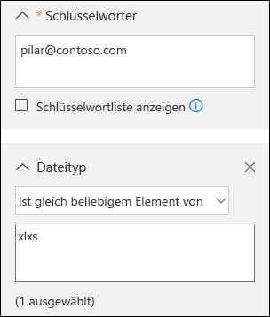
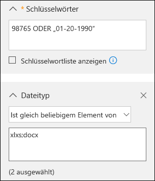
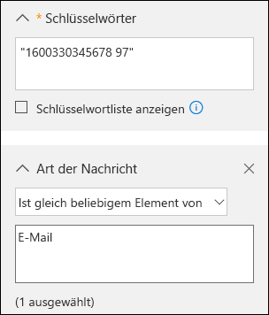

# <a name="office-365-data-subject-requests-for-the-gdpr"></a><span data-ttu-id="69c6f-104">Anträge betroffener Personen nach der DSGVO in Office 365</span><span class="sxs-lookup"><span data-stu-id="69c6f-104">Office 365 Data Subject Requests for the GDPR</span></span>

## <a name="introduction-to-dsrs"></a><span data-ttu-id="69c6f-105">Einführung in Anträge betroffener Personen</span><span class="sxs-lookup"><span data-stu-id="69c6f-105">Introduction to DSRs</span></span>

<span data-ttu-id="69c6f-p101">Die [Datenschutz-Grundverordnung (DSGVO)](https://ec.europa.eu/justice/data-protection/reform/index_en.htm) der Europäischen Union gewährt Personen (die in den Bestimmungen als *betroffene Personen* bezeichnet werden) das Recht zum Verwalten der personenbezogenen Daten, die von einem Arbeitgeber oder von einer anderen Art von Behörde oder Organisation (als *Datenverantwortlicher* oder nur *Verantwortlicher* bezeichnet) erfasst werden. Personenbezogene Daten sind im Rahmen der DSGVO weitgefasst als Daten definiert, die sich auf eine identifizierte oder identifizierbare natürliche Person beziehen. Die DSGVO erteilt betroffenen Personen bestimmte Rechte im Hinblick auf ihre personenbezogenen Daten; dazu gehören das Kopieren der personenbezogenen Daten, das Anfordern von Korrekturen, das Einschränken ihrer Verarbeitung, das Löschen oder das Erhalten in einem elektronischen Format, damit sie zu einem anderen Datenverantwortlichen bewegt werden können. Eine formale Anfrage einer betroffenen Person an einen Datenverantwortlichen im Hinblick auf eine bestimmte Aktion bezüglich ihrer personenbezogenen Daten wird als *Antrag einer betroffenen Person* bezeichnet. Der Verantwortliche ist verpflichtet, jeden Antrag einer betroffenen Person unverzüglich zu bearbeiten und angemessen zu reagieren, entweder indem die angeforderte Aktion ausgeführt wird oder indem eine Erklärung abgegeben wird, warum dem Antrag der betroffenen Person vom Verantwortlichen nicht Folge geleistet werden kann. Ein Verantwortlicher sollte sich bezüglich der sachgerechten Bearbeitung der einzelnen Anträge betroffener Personen an seine eigenen Rechts- und Compliance-Berater wenden.</span><span class="sxs-lookup"><span data-stu-id="69c6f-p101">The General Data Protection Regulation (GDPR) gives rights to people (known in the regulation as *data subjects*) to manage the personal data that has been collected by an employer or other type of agency or organization (known as the *data controller* or just *controller*). Personal data is defined very broadly under the GDPR as any data that relates to an identified or identifiable natural person. The GDPR gives data subjects specific rights to their personal data; these rights include obtaining copies of it, requesting changes to it, restricting the processing of it, deleting it, or receiving it in an electronic format so it can be moved to another controller. A formal request by a data subject to a controller to take an action on their personal data is called a *Data Subject Request* or DSR. The controller is obligated to promptly consider each DSR and provide a substantive response either by taking the requested action or by providing an explanation for why the DSR cannot be accommodated by the controller. A controller should consult with its own legal or compliance advisers regarding the proper disposition of any given DSR.</span></span>

<span data-ttu-id="69c6f-p102">In diesem Leitfaden wird erläutert, wie Office 365-Produkte, -Dienste und -Verwaltungstools verwendet werden können, um in Antwort auf Anträge betroffener Personen personenbezogene Daten zu finden und zu verarbeiten. Dazu zählen insbesondere die Suche, der Zugriff und die Verarbeitung von personenbezogenen Daten, die in der Microsoft-Cloud gespeichert sind. Im Folgenden finden Sie eine kurze Übersicht der in diesem Leitfaden beschriebenen Prozesse:</span><span class="sxs-lookup"><span data-stu-id="69c6f-p102">The guide discusses how to use Office 365 products, services and administrative tools to help you find and act on personal data to respond to DSRs. Specifically, this includes how to find, access, and act on personal data that resides in Microsoft's cloud. Here’s a quick overview of the processes outlined in this guide:</span></span>

- <span data-ttu-id="69c6f-p103">**Ermittlung:** Verwenden Sie Such- und Ermittlungstools, um Kundendaten leichter zu finden, die möglicherweise Gegenstand eines Antrags einer betroffenen Person sind. Sobald potenziell geeignete Dokumente gefunden wurden, können Sie eine oder mehrere der Aktionen für Anträge betroffener Personen ausführen, die in den folgenden Schritten beschrieben sind, um auf den Antrag der betroffenen Person zu reagieren. Andernfalls können Sie bestimmen, dass der Antrag nicht den Unternehmensrichtlinien für die Reaktion auf Anträge betroffener Personen entspricht.</span><span class="sxs-lookup"><span data-stu-id="69c6f-p103">**Discover**—Use search and discovery tools to more easily find customer data that may be the subject of a DSR. Once potentially responsive documents are collected, you can perform one or more of the DSR actions described in the following steps to respond to the request. Alternatively, you may determine that the request doesn't meet your organization’s guidelines for responding to DSRs.</span></span>
- <span data-ttu-id="69c6f-118">**Zugriff:** Rufen Sie personenbezogene Daten ab, die sich in der Microsoft Cloud befinden, und erstellen Sie eine Kopie, die der betroffenen Person zur Verfügung gestellt werden kann, sofern dies beantragt wurde.</span><span class="sxs-lookup"><span data-stu-id="69c6f-118">**Access**—Retrieve personal data that resides in the Microsoft cloud and, if requested, make a copy of it that can be available to the data subject.</span></span>
- <span data-ttu-id="69c6f-119">**Berichtigung:** Nehmen Sie gegebenenfalls Änderungen vor oder führen Sie andere beantragte Aktionen für die personenbezogenen Daten aus.</span><span class="sxs-lookup"><span data-stu-id="69c6f-119">**Rectify.** Make changes or implement other requested actions on the personal data.</span></span>
- <span data-ttu-id="69c6f-p104">**Einschränkung:** Schränken Sie die Verarbeitung personenbezogener Daten entweder durch Zurückziehen von Lizenzen für verschiedenen Azure-Dienste oder durch Deaktivieren der gewünschten Dienste wo möglich ein. Des Weiteren können Sie Daten aus der Microsoft-Cloud entfernen und diese lokal oder an einem anderen Ort aufbewahren.</span><span class="sxs-lookup"><span data-stu-id="69c6f-p104">**Restrict**—Restrict the processing of personal data, either by removing licenses for various Azure services or turning off the desired services where possible. You can also remove data from the Microsoft cloud and retain it on-premises or at another location.</span></span>
- <span data-ttu-id="69c6f-122">**Löschung:** Entfernen Sie personenbezogene Daten, die sich in der Microsoft-Cloud befinden, dauerhaft.</span><span class="sxs-lookup"><span data-stu-id="69c6f-122">**Delete**—Permanently remove personal data that resided in the Microsoft cloud.</span></span>
- <span data-ttu-id="69c6f-123">**Export:** Stellen Sie der betroffenen Person eine elektronische Kopie (in einem maschinenlesbaren Format) von personenbezogenen Daten zur Verfügung.</span><span class="sxs-lookup"><span data-stu-id="69c6f-123">**Export**—Provide an electronic copy (in a machine-readable format) of personal data to the data subject.</span></span>

### <a name="terminology"></a><span data-ttu-id="69c6f-124">Begrifflichkeiten</span><span class="sxs-lookup"><span data-stu-id="69c6f-124">Terminology</span></span>

<span data-ttu-id="69c6f-125">Im Folgenden finden Sie Definitionen von Begriffen der DSGVO, die für diesen Leitfaden relevant sind.</span><span class="sxs-lookup"><span data-stu-id="69c6f-125">Here are definitions of terms from the GDPR that are relevant to this guide.</span></span>

- <span data-ttu-id="69c6f-126">**Datenverantwortlicher:** Eine natürliche oder juristische Person, öffentliche Behörde, Agentur oder andere Stelle, die allein oder gemeinsam mit anderen die Zwecke und Mittel der Verarbeitung personenbezogener Daten bestimmt. Sofern die Zwecke und Mittel der Verarbeitung durch das Recht der Union oder der Mitgliedstaaten bestimmt werden, können der Datenverantwortliche bzw. die spezifischen Kriterien für dessen Benennung durch das Recht der Union oder des Mitgliedstaats angegeben werden.</span><span class="sxs-lookup"><span data-stu-id="69c6f-126">**Controller.** The natural or legal person, public authority, agency or other body which, alone or jointly with others, determines the purposes and means of the processing of personal data; where the purposes and means of such processing are determined by Union or Member State law, the controller or the specific criteria for its nomination may be provided for by Union or Member State law.</span></span>
- <span data-ttu-id="69c6f-127">**Personenbezogene Daten und betroffene Person:** Alle Informationen über eine identifizierte oder identifizierbare natürliche Person („betroffene Person“). Eine identifizierbare natürliche Person ist eine Person, die direkt oder indirekt, insbesondere durch Zuordnung zu einer Kennung wie einem Namen, zu einer Kennnummer, zu Standortdaten, zu einer Online-Kennung oder zu einem oder mehreren besonderen Merkmalen identifiziert werden kann, die Ausdruck der physischen, physiologischen, genetischen, psychischen, wirtschaftlichen, kulturellen oder sozialen Identität dieser natürlichen Person sind.</span><span class="sxs-lookup"><span data-stu-id="69c6f-127">**Personal data and data subject.** Any information relating to an identified or identifiable natural person (‘data subject’); an identifiable natural person is one who can be identified, directly or indirectly, in particular by reference to an identifier such as a name, an identification number, location data, an online identifier or to one or more factors specific to the physical, physiological, genetic, mental, economic, cultural or social identity of that natural person.</span></span>
- <span data-ttu-id="69c6f-128">**Verarbeiter:** Eine natürliche oder juristische Person, öffentliche Behörde, Agentur oder andere Stelle, die personenbezogene Daten im Auftrag des Verantwortlichen verarbeitet.</span><span class="sxs-lookup"><span data-stu-id="69c6f-128">**Processor.** A natural or legal person, public authority, agency or other body which processes personal data on behalf of the controller.</span></span>
- <span data-ttu-id="69c6f-129">**Kundendaten:** Alle Daten, einschließlich aller Text-, Sound-, Video- oder Bilddateien, die Microsoft vom Kunden oder im Auftrag des Kunden durch Nutzung von Enterprise-Diensten bereitgestellt werden.</span><span class="sxs-lookup"><span data-stu-id="69c6f-129">**Customer Data** – All data, including all text, sound, video, or image files, and software, that are provided to Microsoft by, or on behalf of, a customer through use of the enterprise service, as defined in the Microsoft Online Services Terms.</span></span> <span data-ttu-id="69c6f-130">Kundendaten umfassen sowohl (1) Informationen zur Identifikation von Endbenutzern (z. B. Benutzernamen und Kontaktinformationen in Azure Active Directory) als auch Kundeninhalte, die ein Kunde in einen bestimmten Dienst hochlädt oder in diesem erstellt (z. B. Kundeninhalte in einem Azure Storage-Konto, Kundeninhalte in einer Azure SQL-Datenbank oder das Image einer virtuellen Maschine eines Kunden in Azure Virtual Machines).</span><span class="sxs-lookup"><span data-stu-id="69c6f-130">Customer Data—All data, including all text, sound, video, or image files, and software, that are provided to Microsoft by, or on behalf of, a customer through use of the enterprise service. Customer Data includes both (1) identifiable information of end users (e.g., user names and contact information in Azure Active Directory) and Customer Content that a customer uploads into or creates in specific services (e.g., customer content in an Azure Storage account, customer content of an Azure SQL Database, or a customer’s virtual machine image in Azure Virtual Machines).</span></span>
- <span data-ttu-id="69c6f-131">**Vom System generierte Protokolle:** Von Microsoft generierte Protokolle und verbundene Daten, die Microsoft bei der Bereitstellung von Enterprise-Diensten für Benutzer unterstützen.</span><span class="sxs-lookup"><span data-stu-id="69c6f-131">**System-Generated Logs:** Logs and related data generated by Microsoft that help Microsoft provide enterprise services to users.</span></span> <span data-ttu-id="69c6f-132">Vom System generierte Protokolle enthalten in erster Linie pseudonymisierte Daten, z. B. eindeutige Bezeichner – in der Regel kann eine vom System generierte Zahl nicht von sich aus eine Einzelperson identifizieren, aber dazu verwendet werden, die Enterprise-Dienste für Benutzer bereitzustellen.</span><span class="sxs-lookup"><span data-stu-id="69c6f-132">System-Generated Logs—Logs and related data generated by Microsoft that help Microsoft provide enterprise services to users. System-generated logs contain primarily pseudonymized data, such as unique identifiers – typically a number generated by the system that cannot on its own identify an individual person but is used to deliver the enterprise services to users. System-generated logs may also contain identifiable information about end users, such as a user name.</span></span> <span data-ttu-id="69c6f-133">Vom System generierte Protokolle enthalten möglicherweise auch Informationen zur Identifikation von Endbenutzern, z. B. einen Benutzernamen.</span><span class="sxs-lookup"><span data-stu-id="69c6f-133">System-generated logs may also contain identifiable information about end users, such as a user name.</span></span>

### <a name="how-to-use-this-guide"></a><span data-ttu-id="69c6f-134">Verwenden dieses Leitfadens</span><span class="sxs-lookup"><span data-stu-id="69c6f-134">How to use this guide</span></span>

<span data-ttu-id="69c6f-135">Um das Auffinden relevanter Informationen zu Ihrem jeweiligen Anwendungsfall leichter zu gestalten, haben wir diesen Leitfaden in vier Bereiche unterteilt.</span><span class="sxs-lookup"><span data-stu-id="69c6f-135">To help you find information relevant to your use case, this guide is divided into four parts.</span></span>

- <span data-ttu-id="69c6f-136">**[Teil 1: Reagieren auf Anträge betroffener Personen bezüglich Kundendaten](#part-1-responding-to-dsrs-for-customer-data):** *Kundendaten* sind Daten, die in Office 365 in den tagtäglichen Abläufen der Geschäftsführung erstellt und gespeichert werden.</span><span class="sxs-lookup"><span data-stu-id="69c6f-136">**[Part 1: Responding to DSRs for Customer Data](#part-1-responding-to-dsrs-for-customer-data):** *Customer Data* is data produced and stored in Office 365 in the day-to-day operations of running your business.</span></span> <span data-ttu-id="69c6f-137">Beispiele für die am häufigsten verwendeten Office 365-Anwendungen, die Ihnen das Erstellen von Daten ermöglichen, sind etwa Word, Excel, PowerPoint, Outlook und OneNote.</span><span class="sxs-lookup"><span data-stu-id="69c6f-137">Examples of the most commonly used Office 365 applications that allow you to author data include Word, Excel, PowerPoint, Outlook, and OneNote.</span></span> <span data-ttu-id="69c6f-138">Office 365 umfasst außerdem Anwendungen wie SharePoint Online, Teams und Formulare, die Ihnen eine bessere Zusammenarbeit ermöglichen.</span><span class="sxs-lookup"><span data-stu-id="69c6f-138">Office 365 also consists of applications such as SharePoint Online, Teams, and Forms that allow you to better collaborate with others.</span></span> <span data-ttu-id="69c6f-139">In Teil 1 dieses Leitfadens wird erläutert, wie Sie Daten aus Office 365-Anwendungen, die zum Erstellen von Daten in Office 365 Onlinediensten verwendet wurden, finden, korrigieren, einschränken, löschen und exportieren können.</span><span class="sxs-lookup"><span data-stu-id="69c6f-139">Part 1 of this guide discusses how to discover access, rectify, restrict, delete, and export data from Office 365 applications that have been used to author and store data in Office 365 online services.</span></span> <span data-ttu-id="69c6f-140">Er bezieht sich auf Produkte und Dienste, für die Microsoft als Datenverarbeiter für Ihre Organisation agiert, und daher wird die Funktion für Anträge betroffener Personen für den Mandantenadministrator bereitgestellt.</span><span class="sxs-lookup"><span data-stu-id="69c6f-140">It addresses products and services for which Microsoft is acting as a data processor to your organization, and thus DSR capability is made available to your tenant administrator.</span></span>
- <span data-ttu-id="69c6f-141">**[Teil 2: Reagieren auf Anträge betroffener Personen bezüglich von Office 365 generierten Erkenntnissen](#part-2-responding-to-dsrs-with-respect-to-insights-generated-by-office-365):** Office 365 stellt über Dienste wie Delve, MyAnalytics und Workplace Analytics bestimmte Erkenntnisse bereit.</span><span class="sxs-lookup"><span data-stu-id="69c6f-141">[Part 2: Responding to DSRs with Respect to Insights Generated by Office 365](#part-2-responding-to-dsrs-with-respect-to-insights-generated-by-office-365) - Office 365 provides certain insights through services like Delve, MyAnalytics, and Workplace Analytics. How these insights are generated and how to respond to DSRs related to them are explained in Part 2 of this guide.</span></span> <span data-ttu-id="69c6f-142">Die Art und Weise, wie diese Erkenntnisse generiert werden und wie auf Anträge betroffener Personen reagiert werden kann, wird in Teil 2 dieses Leitfadens erläutert.</span><span class="sxs-lookup"><span data-stu-id="69c6f-142">Part 2: Responding to DSRs with Respect to Insights Generated by Office 365 - Office 365 provides certain insights through services like Delve, MyAnalytics, and Workplace Analytics. How these insights are generated and how to respond to DSRs related to them are explained in Part 2 of this guide.</span></span>
- <span data-ttu-id="69c6f-143">**[Teil 3: Reagieren auf Anträge betroffener Personen bezüglich vom System generierten Protokollen](#part-3-responding-to-dsrs-for-system-generated-logs):** Wenn Sie Office 365 Enterprise Services verwenden, generiert Microsoft einige Informationen wie Dienstprotokolle, welche die Verwendung oder Leistung von Features in den Onlinediensten aufzeichnen.</span><span class="sxs-lookup"><span data-stu-id="69c6f-143">**[Part 3: Responding to DSRs for system-generated Logs](#part-3-responding-to-dsrs-for-system-generated-logs):** When you use Office 365 enterprise services, Microsoft generates some information such as service logs that record the use or performance of features in the online services.</span></span> <span data-ttu-id="69c6f-144">Die meisten vom Dienst generierten Daten enthalten pseudonyme Bezeichner, die von Microsoft generiert werden. Daher wird diese Kategorie im Allgemeinen als *vom System generierte Protokolle* bezeichnet.</span><span class="sxs-lookup"><span data-stu-id="69c6f-144">Most service-generated data contain pseudonymous identifiers generated by Microsoft and this category is thus generally referred to within this document as *system-generated logs*.</span></span> <span data-ttu-id="69c6f-145">Obwohl diese Daten nicht ohne das Hinzuziehen zusätzlicher Informationen einer bestimmten betroffenen Person zugeordnet werden können, ist es möglich, dass ein Teil dieser Daten gemäß der Definition der DSGVO als personenbezogen eingestuft wird.</span><span class="sxs-lookup"><span data-stu-id="69c6f-145">Although this data can't be attributed to a specific data subject without the use of additional information, some of it may be deemed personal under GDPR's definition for "personal data."</span></span> <span data-ttu-id="69c6f-146">In Teil 3 dieses Leitfadens wird erläutert, wie Sie vom System generierte Protokolle aufrufen, löschen und exportieren können.</span><span class="sxs-lookup"><span data-stu-id="69c6f-146">Part 3 of this guide discusses how to access, delete, and export system-generated logs.</span></span>
- <span data-ttu-id="69c6f-147">**[Teil 4: Weitere Ressourcen, die bei Anträgen betroffener Personen hilfreich sind](#part-4-additional-resources-to-assist-you-with-dsrs)** – In Teil 4 dieses Leitfadens wird eine Auswahl von Szenarios gegeben, in denen Microsoft als Verantwortlicher agiert, wenn bestimmte Office 365-Produkte und Dienste verwendet werden.</span><span class="sxs-lookup"><span data-stu-id="69c6f-147">[Part 4: Additional resources to assist you with DSRs](#part-4-additional-resources-to-assist-you-with-dsrs) - Part 4 of this guide lists limited scenarios in which Microsoft is the data controller when certain Office 365 products and services are used.</span></span>

> [!NOTE]
> <span data-ttu-id="69c6f-p110">Wenn Benutzer in Ihrer Organisation Microsoft Office 365-Produkte und -Dienste verwenden, sind meistens Sie der Verantwortliche und Microsoft ist der Auftragsverarbeiter. Als Verantwortlicher ist es Ihre Pflicht, der betroffenen Person direkt zu antworten. In Teil 1 bis 3 dieses Leitfadens finden Sie detaillierte Informationen zu den technischen Möglichkeiten Ihrer Organisation, auf Anträge betroffener Personen zu reagieren. In einigen seltenen Fällen, wenn Benutzer ganz bestimmte Office 365-Produkte und -Dienste nutzen, ist jedoch Microsoft der Verantwortliche. Dann sind die Informationen in Teil 4 dieser Anleitung relevant, denn dort wird erläutert, wie betroffene Personen ihre Anträge direkt an Microsoft stellen können.</span><span class="sxs-lookup"><span data-stu-id="69c6f-p110">In most cases, when users in your organization use Microsoft Office 365 products and services, you are the data controller and Microsoft is the processor. As a data controller, you are responsible for responding to the data subject directly. To assist you with this, Parts 1-3 of this guide detail the technical capabilities available to your organization to respond to a DSR request. In some limited scenarios, however, Microsoft will be the data controller when people use certain Office 365 products and services. In these cases, the information in Part 4 provides guidance on how data subjects can submit DSR requests to Microsoft.</span></span>

### <a name="office-365-national-clouds"></a><span data-ttu-id="69c6f-153">Nationale Office 365-Clouds</span><span class="sxs-lookup"><span data-stu-id="69c6f-153">Office 365 national clouds</span></span>

<span data-ttu-id="69c6f-p111">Die Microsoft Office 365-Dienste sind auch in den folgenden nationalen Cloud-Umgebungen verfügbar: [Office 365 Deutschland](https://support.office.com/article/learn-about-office-365-germany-8a5a4bbc-667a-4cac-8769-d8ac9015db4c), [Office 365 betrieben von 21Vianet (China)](https://support.office.com/article/Learn-about-Office-365-operated-by-21Vianet-A8AB5061-3346-4DA0-BB7C-5260822B53AE) und [Office 365 US Government](https://technet.microsoft.com/library/mt774581.aspx). Die meisten der in diesem Dokument beschriebenen Richtlinien für die Verwaltung von Anträgen betroffener Personen gelten für diese nationalen Cloud-Umgebungen. Aufgrund des isolierten Charakters dieser Umgebungen gibt es jedoch einige Ausnahmen. Soweit für einen bestimmten Unterabschnitt wichtig, werden diese Ausnahmen in einem entsprechenden Vermerk genannt.</span><span class="sxs-lookup"><span data-stu-id="69c6f-p111">The Microsoft Office 365 services are also available in the following national cloud environments: [Office 365 Germany](https://support.office.com/article/learn-about-office-365-germany-8a5a4bbc-667a-4cac-8769-d8ac9015db4c), [Office 365 operated by 21Vianet (China)](https://support.office.com/article/Learn-about-Office-365-operated-by-21Vianet-A8AB5061-3346-4DA0-BB7C-5260822B53AE), and [Office 365 US Government](https://technet.microsoft.com/library/mt774581.aspx). Most of the guidance for managing data subject requests described in this document applies to these national cloud environments. However, due to the isolated nature of these environments, there are some exceptions. Where notable for a given subsection, these exceptions are called out in a corresponding note.</span></span>

### <a name="hybrid-deployments"></a><span data-ttu-id="69c6f-158">Hybridbereitstellungen</span><span class="sxs-lookup"><span data-stu-id="69c6f-158">Hybrid deployments</span></span>

<span data-ttu-id="69c6f-p112">Ihre Office 365-Organisation kann aus Microsoft-Angeboten bestehen, die eine Kombination aus cloudbasierten Diensten und lokalen Serverprodukten sind. Im Allgemeinen versteht man unter einer hybriden Bereitstellung die gemeinsame Nutzung von Benutzerkonten (Identitätsmanagement) und Ressourcen (wie Postfächer, Websites und Daten), die sowohl in der Cloud als auch lokal vorhanden sind. Gängige hybride Szenarien sind u. a:</span><span class="sxs-lookup"><span data-stu-id="69c6f-p112">Your Office 365 organization may consist of Microsoft offerings that are a combination of cloud-based services and on-premises server products. In general, a hybrid deployment is typically the sharing of user accounts (identity management) and resources (such as mailboxes, web sites, and data) that exist in the cloud and on-premises. Common hybrid scenarios include:</span></span>

- <span data-ttu-id="69c6f-162">Exchange-Hybridbereitstellungen, bei denen einige Benutzer über ein lokales Postfach und andere Benutzer über ein Exchange Online-Postfach verfügen,</span><span class="sxs-lookup"><span data-stu-id="69c6f-162">Exchange hybrid deployments, where some users have an on-premises mailboxes and other users have Exchange Online mailboxes.</span></span>
- <span data-ttu-id="69c6f-163">SharePoint-Hybridbereitstellungen, bei denen Website- und Dateiserver vor Ort sind und OneDrive for Business-Konten in Office 365 sind,</span><span class="sxs-lookup"><span data-stu-id="69c6f-163">SharePoint hybrid deployments, where site and file servers are on-premises and OneDrive for Business accounts are in Office 365.</span></span>
- <span data-ttu-id="69c6f-164">das lokale Identitätsmanagementsystem (Active Directory), das mit dem Azure Activity Directory synchronisiert ist, bei dem es sich um den zugrunde liegenden Verzeichnisdienst in Office 365 handelt.</span><span class="sxs-lookup"><span data-stu-id="69c6f-164">The on-premises identity management system (Active Directory) that is synchronized with Azure Activity Directory, which is the underlying directory service in Office 365.</span></span>

<span data-ttu-id="69c6f-p113">Wenn Sie auf einen Antrag einer betroffenen Person reagieren, müssen Sie möglicherweise zunächst feststellen, ob sich Daten, die für den Antrag der betroffenen Person relevant sind, in der Microsoft-Cloud oder in Ihrer lokalen Organisation befinden. Anschließend können Sie die entsprechenden Schritte unternehmen, um auf diesen Antrag zu reagieren. Der Office 365-Leitfaden zu Anträgen betroffener Personen (dieser Leitfaden) bietet Anleitungen für die Reaktion auf Anträge bezüglich cloudbasierter Daten. Informationen zu Daten in Ihrer lokalen Organisation finden Sie unter [DSGVO für lokale Office-Server](https://docs.microsoft.com/Office365/Enterprise/gdpr-for-office-servers).</span><span class="sxs-lookup"><span data-stu-id="69c6f-p113">When responding to a DSR request, you may have to determine if data that's responsive to a DSR request is in the Microsoft cloud or in your on-premise organization, and then take the appropriate steps to respond to that request. The Office 365 Data Subject Request Guide (this guide) provides guidance for responding to cloud-based data. For guidance for data in your on-premises organization, see [GDPR for Office on-premises Servers](https://docs.microsoft.com/Office365/Enterprise/gdpr-for-office-servers).</span></span>

## <a name="part-1-responding-to-dsrs-for-customer-data"></a><span data-ttu-id="69c6f-168">Teil 1: Reagieren auf Anträge betroffener Personen bezüglich Kundendaten</span><span class="sxs-lookup"><span data-stu-id="69c6f-168">Part 1: Responding to DSRs for Customer Data</span></span>

<span data-ttu-id="69c6f-169">Die Anleitung zum Reagieren auf Anträge betroffener Personen bezüglich Kundendaten ist in die folgenden vier Abschnitte unterteilt:</span><span class="sxs-lookup"><span data-stu-id="69c6f-169">The guidance for responding to DSRs for Customer Data is divided into the following four sections.</span></span>

- [<span data-ttu-id="69c6f-170">Reagieren auf Anträge betroffener Personen mit dem eDiscovery-Tool für die Inhaltssuche</span><span class="sxs-lookup"><span data-stu-id="69c6f-170">Using the Content Search eDiscovery tool to respond to DSRs</span></span>](#using-the-content-search-ediscovery-tool-to-respond-to-dsrs)
- [<span data-ttu-id="69c6f-171">Reagieren auf Anträge betroffener Personen mithilfe der In-App-Funktionalität</span><span class="sxs-lookup"><span data-stu-id="69c6f-171">Using In-App functionality to respond to DSRs</span></span>](#using-in-app-functionality-to-respond-to-dsrs)
- [<span data-ttu-id="69c6f-172">Reagieren auf Anträge betroffener Personen zur Berichtigung von Daten</span><span class="sxs-lookup"><span data-stu-id="69c6f-172">Responding to DSR rectification requests</span></span>](#responding-to-dsr-rectification-requests)
- [<span data-ttu-id="69c6f-173">Reagieren auf Anträge betroffener Personen zur Einschränkung der Datenverarbeitung</span><span class="sxs-lookup"><span data-stu-id="69c6f-173">Responding to DSR restriction requests</span></span>](#responding-to-dsr-restriction-requests)

### <a name="how-to-determine-the-office-365-applications-that-may-be-in-scope-for-a-dsr-for-customer-data"></a><span data-ttu-id="69c6f-174">Bestimmen der Office 365-Anwendungen, die Ziel von Anträgen betroffener Person bezüglich Kundendaten sein können</span><span class="sxs-lookup"><span data-stu-id="69c6f-174">How to determine the Office 365 applications that may be in scope for a DSR for Customer Data</span></span>

<span data-ttu-id="69c6f-175">Um bestimmen zu können, wo nach personenbezogenen Daten gesucht oder wonach gesucht werden muss, ist es hilfreich, die Office 365-Anwendungen zu ermitteln, die von Personen in Ihrer Organisation verwendet werden können, um Daten in Office 365 zu erstellen und zu speichern.</span><span class="sxs-lookup"><span data-stu-id="69c6f-175">To help you determine where to search for personal data or what to search for, it helps to identify the Office 365 applications that people in your organization can use to create and store data in Office 365.</span></span> <span data-ttu-id="69c6f-176">So können Sie die Office 365-Anwendungen eingrenzen, die als Ziel eines Antrags betroffener Personen in Frage kommen, und leichter bestimmen, wie Sie im Zusammenhang mit einem solchen Antrag nach personenbezogenen Daten suchen und auf sie zugreifen können.</span><span class="sxs-lookup"><span data-stu-id="69c6f-176">Knowing this narrows the Office 365 applications that are in-scope for a DSR and helps you determine how to search for and access personal data that’s related to a DSR.</span></span> <span data-ttu-id="69c6f-177">Dies bedeutet insbesondere, ob Sie das Tool für die Inhaltssuche verwenden können oder ob die Verwendung der In-App-Funktion erforderlich ist, in der die Daten erstellt wurden.</span><span class="sxs-lookup"><span data-stu-id="69c6f-177">Specifically, this means whether you can use the Content Search tool or if you’ll have to use the in-app functionality of the application the data was created in.</span></span>

<span data-ttu-id="69c6f-p115">Eine schnelle Möglichkeit zum Identifizieren der Office 365-Anwendungen, die Personen in Ihrem Unternehmen verwenden, um Kundendaten zu erstellen, besteht darin, zu ermitteln, welche Anwendungen im Office 365-Abonnement Ihres Unternehmens enthalten sind. Zu diesem Zweck können Sie im Office 365-Administratorportal auf Benutzerkonten zugreifen und die Produktlizenzinformationen einsehen. Siehe [Zuweisen von Lizenzen zu Benutzern in Office 365 for Business](https://docs.microsoft.com/office365/admin/subscriptions-and-billing/assign-licenses-to-users).</span><span class="sxs-lookup"><span data-stu-id="69c6f-p115">A quick way to identify the Office 365 applications that people in your organization are using to create Customer Data is to determine which applications are included in your organization's Office 365 subscription. To do this, you can access user accounts in the Office 365 admin portal and look at the product licensing information. See [Assign licenses to users in Office 365 for business](https://docs.microsoft.com/office365/admin/subscriptions-and-billing/assign-licenses-to-users).</span></span>

## <a name="using-the-content-search-ediscovery-tool-to-respond-to-dsrs"></a><span data-ttu-id="69c6f-181">Reagieren auf Anträge betroffener Personen mit dem eDiscovery-Tool für die Inhaltssuche</span><span class="sxs-lookup"><span data-stu-id="69c6f-181">Using the Content Search eDiscovery tool to respond to DSRs</span></span>

<span data-ttu-id="69c6f-p116">Bei der Suche nach personenbezogenen Daten innerhalb des größeren Satzes von Daten, die Ihre Organisation bei der Verwendung von Office 365 erstellt und speichert, sollten Sie zuerst die Anwendungen berücksichtigen, die Personen vermutlich verwendet haben, um die Daten zu erstellen, nach denen Sie suchen. Microsoft schätzt, dass mehr als 90 % der Daten einer Organisation, die in Office 365 gespeichert sind, in Word, Excel, PowerPoint, OneNote und Outlook erstellt werden. In diesen Office-Programmen erstellte Dokumente sind höchstwahrscheinlich auf einer SharePoint Online-Website, im OneDrive for Business-Konto eines Benutzers oder im Exchange Online-Postfach eines Benutzers gespeichert, auch wenn sie über Office 365 ProPlus oder eine unbefristete Office-Lizenz erworben wurden. Dies bedeutet, dass Sie das eDiscovery-Tool für die Inhaltssuche verwenden können, um in SharePoint Online-Websites, OneDrive for Business-Konten und Exchange Online-Postfächern (einschließlich der mit Office 365-Gruppen, Microsoft Teams, EDU-Aufgaben und StaffHub verknüpften Websites und Postfächer) nach Dokumenten und Postfachelementen zu suchen (oder andere Aktionen im Zusammenhang mit Anträgen betroffener Personen auszuführen), die für den von Ihnen untersuchten Antrag einer betroffenen Person relevant sein könnten. Sie können das Tool für die Inhaltssuche auch verwenden, um Kundendaten zu ermitteln, die in anderen Office 365-Anwendungen erstellt wurden.</span><span class="sxs-lookup"><span data-stu-id="69c6f-p116">When looking for personal data within the larger set of data your organization creates and stores using in Office 365, you may want to first consider which applications people have most likely used to author the data you’re looking for. Microsoft estimates that over 90% of an organization’s data that is stored in Office 365 is authored in Word, Excel, PowerPoint, OneNote, and Outlook. Documents authored in these Office applications, even if purchased through Office 365 ProPlus or an Office perpetual license, are most likely stored on a SharePoint Online site, in a user’s OneDrive for Business account, or in a user’s Exchange Online mailbox. That means you can use the Content Search eDiscovery tool to search (and perform other DSR-related actions) across SharePoint Online sites, OneDrive for Business accounts, and Exchange Online mailboxes (including the sites and mailboxes associated with Office 365 Groups, Microsoft Teams, EDU Assignments, and StaffHub) to find documents and mailbox items that may be relevant to the DSR you’re investigating. You can also use the Content Search tool to discover Customer Data authored in other Office 365 applications.</span></span>

<span data-ttu-id="69c6f-187">In der folgenden Tabelle sind die Office 365-Anwendungen aufgeführt, mit denen Personen Kundeninhalte erstellen, die über die Inhaltssuche ermittelt werden können.</span><span class="sxs-lookup"><span data-stu-id="69c6f-187">The following table lists the Office 365 applications that people use to create Customer Authored Content and that can be discovered by using Content Search. This section of the DSR guide provides guidance about how discover, access, export, and delete data created with these Office 365 applications.</span></span> <span data-ttu-id="69c6f-188">In diesem Abschnitt des Leitfadens zu Anträgen betroffener Personen wird erläutert, wie Sie mit diesen Office 365-Anwendungen erstellte Daten ermitteln, exportieren und löschen können und wie Sie darauf zugreifen können.</span><span class="sxs-lookup"><span data-stu-id="69c6f-188">The following table lists the Office 365 applications that people use to create Customer Authored Content and that can be discovered by using Content Search. This section of the DSR guide provides guidance about how discover, access, export, and delete data created with these Office 365 applications.</span></span>

<span data-ttu-id="69c6f-189">***Tabelle 1: Anwendungen, bei denen die Inhaltssuche verwendet werden kann, um Kundendaten zu finden***</span><span class="sxs-lookup"><span data-stu-id="69c6f-189">***Table 1: Applications where Content Search can be used to find Customer Data***</span></span>

| | |
| :---: | :---:|
 <br> <span data-ttu-id="69c6f-191">Kalender</span><span class="sxs-lookup"><span data-stu-id="69c6f-191">Calendar</span></span> |  <br> <span data-ttu-id="69c6f-193">SharePoint</span><span class="sxs-lookup"><span data-stu-id="69c6f-193">SharePoint</span></span>  |
|  <br> <span data-ttu-id="69c6f-195">Excel</span><span class="sxs-lookup"><span data-stu-id="69c6f-195">Excel</span></span> |  <br> <span data-ttu-id="69c6f-197">Skype for Business</span><span class="sxs-lookup"><span data-stu-id="69c6f-197">Skype for Business</span></span> |
|  <br> <span data-ttu-id="69c6f-199">Office Lens</span><span class="sxs-lookup"><span data-stu-id="69c6f-199">Office Lens</span></span> |  <br> <span data-ttu-id="69c6f-201">Aufgaben</span><span class="sxs-lookup"><span data-stu-id="69c6f-201">Tasks</span></span> |
|  <br> <span data-ttu-id="69c6f-203">OneDrive for Business</span><span class="sxs-lookup"><span data-stu-id="69c6f-203">OneDrive for Business</span></span> | <br> <span data-ttu-id="69c6f-205">Teams</span><span class="sxs-lookup"><span data-stu-id="69c6f-205">Teams</span></span> |
|  <br> <span data-ttu-id="69c6f-207">OneNote</span><span class="sxs-lookup"><span data-stu-id="69c6f-207">OneNote</span></span>|  <br> <span data-ttu-id="69c6f-209">To-Do</span><span class="sxs-lookup"><span data-stu-id="69c6f-209">To-Do</span></span> |
|  <br> <span data-ttu-id="69c6f-211">Outlook/Exchange</span><span class="sxs-lookup"><span data-stu-id="69c6f-211">Outlook/Exchange Online</span></span> |  <br> <span data-ttu-id="69c6f-213">Video</span><span class="sxs-lookup"><span data-stu-id="69c6f-213">Video</span></span> |
|  <br> <span data-ttu-id="69c6f-215">Personen</span><span class="sxs-lookup"><span data-stu-id="69c6f-215">People</span></span> |  <br> <span data-ttu-id="69c6f-217">Visio</span><span class="sxs-lookup"><span data-stu-id="69c6f-217">Visio</span></span> |
|  <br> <span data-ttu-id="69c6f-219">PowerPoint</span><span class="sxs-lookup"><span data-stu-id="69c6f-219">PowerPoint</span></span> |  <br> <span data-ttu-id="69c6f-221">Word</span><span class="sxs-lookup"><span data-stu-id="69c6f-221">Word</span></span>
||

> [!NOTE]
> <span data-ttu-id="69c6f-p118">Das eDiscovery-Tool für die Inhaltssuche ist in [Office 365, das von 21Vianet (China) betrieben wird,](https://support.office.com/article/Learn-about-Office-365-operated-by-21Vianet-A8AB5061-3346-4DA0-BB7C-5260822B53AE) nicht verfügbar. Dies bedeutet, dass Sie dieses Tool nicht verwenden können, um Kundendaten in den in Tabelle 1 dargestellten Office 365-Anwendungen zu suchen und zu exportieren. Sie können jedoch das direkte eDiscovery-Tool in Exchange Online verwenden, um nach Inhalten in Benutzerpostfächern zu suchen. Sie können auch das eDiscovery Center in SharePoint Online verwenden, um nach Inhalten auf SharePoint-Websites und in OneDrive-Konten zu suchen. Alternativ können Sie einen Dokumentbesitzer bitten, Ihnen beim Suchen und Ändern oder Löschen von Inhalten zu helfen oder diese bei Bedarf zu exportieren. Weitere Informationen finden Sie unter:</span><span class="sxs-lookup"><span data-stu-id="69c6f-p118">The Content Search eDiscovery tool is not available in [Office 365 operated by 21Vianet (China)](https://support.office.com/article/Learn-about-Office-365-operated-by-21Vianet-A8AB5061-3346-4DA0-BB7C-5260822B53AE). This means you won’t able to use this tool to search for and export Customer Data in the Office 365 applications shown in Table 1. However, you can use the In-Place eDiscovery tool in Exchange Online to search for content in user mailboxes. You can also use the eDiscovery Center in SharePoint Online to search for content in SharePoint sites and OneDrive accounts. Alternatively, you can ask a document owner to help you find and make changes or deletions to content or export it if necessary. For more information, see:</span></span></br><br> <span data-ttu-id="69c6f-228">• [Erstellen einer Compliance-eDiscovery-Suche](https://technet.microsoft.com/library/dd353189(v=exchg.150).aspx)</span><span class="sxs-lookup"><span data-stu-id="69c6f-228">• [Create an In-Place eDiscovery search](https://technet.microsoft.com/library/dd353189(v=exchg.150).aspx)</span></span><br> <span data-ttu-id="69c6f-229">• [Einrichten eines eDiscovery Center in SharePoint Online](https://support.office.com/article/Set-up-an-eDiscovery-Center-in-SharePoint-Online-A18F8975-AA7F-43B4-A7D6-001D14744D8E)</span><span class="sxs-lookup"><span data-stu-id="69c6f-229">• [Set up an eDiscovery Center in SharePoint Online](https://support.office.com/article/Set-up-an-eDiscovery-Center-in-SharePoint-Online-A18F8975-AA7F-43B4-A7D6-001D14744D8E)</span></span>

### <a name="using-content-search-to-find-personal-data"></a><span data-ttu-id="69c6f-230">Verwenden der Inhaltssuche zum Suchen nach personenbezogenen Daten</span><span class="sxs-lookup"><span data-stu-id="69c6f-230">Using Content Search to find personal data</span></span>

<span data-ttu-id="69c6f-231">Der erste Schritt bei der Reaktion auf einen Antrag einer betroffenen Person besteht darin, die personenbezogenen Daten zu finden, die Gegenstand dieses Antrags sind.</span><span class="sxs-lookup"><span data-stu-id="69c6f-231">The first step in responding to a DSR is to find the personal data that is the subject of the DSR.</span></span> <span data-ttu-id="69c6f-232">Hierbei kann das Office 365 eDiscovery-Tool zum Suchen nach personenbezogenen Daten (in den gesamten Daten Ihres Unternehmens in Office 365) oder direkt die systemeigene Anwendung verwendet werden, in der die Daten erstellt wurden.</span><span class="sxs-lookup"><span data-stu-id="69c6f-232">This consists of using Office 365 eDiscovery tools to search for personal data (among all your organization’s data in Office 365) or going directly to the native application in which the data was created.</span></span> <span data-ttu-id="69c6f-233">Dieser erste Schritt – Suchen und Überprüfen der betreffenden personenbezogenen Daten – ist nützlich, um zu bestimmen, ob ein Antrag einer betroffenen Person die Anforderungen Ihres Unternehmens für die Annahme oder Ablehnung eines solchen Antrags erfüllt.</span><span class="sxs-lookup"><span data-stu-id="69c6f-233">This first step - finding and reviewing the personal data at issue — will help you determine whether a DSR meets your organization's requirements for honoring or declining a data subject request.</span></span> <span data-ttu-id="69c6f-234">Sie könnten beispielsweise nach dem Suchen und Überprüfen der betreffenden personenbezogenen Daten feststellen, dass die Anforderungen Ihres Unternehmens nicht erfüllt sind, da der Antrag die Rechte und Freiheiten anderer beeinträchtigen könnte oder weil die entsprechenden personenbezogenen Daten Teil einer Geschäftsaufzeichnung sind, an deren Bewahrung Ihr Unternehmen ein berechtigtes Geschäftsinteresse hat.</span><span class="sxs-lookup"><span data-stu-id="69c6f-234">For example, after finding and reviewing the personal data at issue, you may determine the request doesn’t meet your organization’s requirements because doing so may adversely affect the rights and freedoms of others, or because the personal data is contained in a business record your organization has a legitimate business interest in retaining.</span></span>

<span data-ttu-id="69c6f-p120">Wie bereits erwähnt, schätzt Microsoft, dass mehr als 90 % der Daten einer Organisation mit Office-Anwendungen, wie Word und Excel, erstellt werden. Das bedeutet, dass Sie die Inhaltssuche im Security & Compliance Center verwenden können, um nach dem Großteil der Daten zu suchen, die im Zusammenhang mit einem Antrag einer betroffenen Person stehen.</span><span class="sxs-lookup"><span data-stu-id="69c6f-p120">As previously stated, Microsoft estimates that over 90% of an organization’s data is created with Office applications, such as Word and Excel. This means that you can use the Content Search in the Security & Compliance Center to search for most DSR-related data.</span></span>

<span data-ttu-id="69c6f-p121">In diesem Leitfaden wird davon ausgegangen, dass Sie oder die Person, die nach personenbezogenen Daten sucht, die für einen Antrag einer betroffenen Person möglicherweise relevant sind, mit dem Tool zur Inhaltssuche im Security & Compliance Center vertraut sind oder bereits Erfahrungen damit gemacht haben. Hinweise zur allgemeinen Verwendung des Leitfadens zur Inhaltssuche finden Sie unter [Inhaltssuche in Office 365](https://support.office.com/article/Content-Search-in-Office-365-53390468-eec6-45cb-b6cd-7511f9c909e4). Achten Sie darauf, dass der Person, die die Suche ausführt, die erforderlichen Berechtigungen im Security & Compliance Center zugewiesen wurden. Diese Person sollte als Mitglied der Rollengruppe eDiscovery-Manager im Security & Compliance Center hinzugefügt werden; siehe [Zuweisen von eDiscovery-Berechtigungen im Office 365 Security & Compliance Center](https://support.office.com/article/Assign-eDiscovery-permissions-in-the-Office-365-Security-Compliance-Center-5b9a067b-9d2e-4aa5-bb33-99d8c0d0b5d7). Sie können ebenfalls andere Personen in Ihrer Organisation zur Rollengruppe eDiscovery-Manager hinzufügen, die an Anträgen betroffener Personen beteiligt sind, damit diese die erforderlichen Aktionen ausführen können, z. B. Vorschau und Export von Suchergebnissen im Tool zur Inhaltssuche. Beachten Sie jedoch, dass ein eDiscovery-Manager alle Inhaltsspeicherorte in Ihrer Organisation einsehen kann, einschließlich derer, die nicht mit Anträgen betroffener Personen im Zusammenhang stehen. Dies können Sie verhindern, indem Sie Compliance-Beschränkungen einrichten (wie [hier](#set-up-compliance-boundaries-to-limit-the-scope-of-content-searches)</span><span class="sxs-lookup"><span data-stu-id="69c6f-p121">This guide assumes that you or the person searching for personal data that may be responsive to a DSR request is familiar with or has experience using the Content Search tool in the Security & Compliance Center. For general guidance on using Content Search, see [Content Search in Office 365](https://support.office.com/article/Content-Search-in-Office-365-53390468-eec6-45cb-b6cd-7511f9c909e4). Be sure that the person running the searches has been assigned the necessary permissions in the Security & Compliance Center. This person should be added as a member of the eDiscovery Manager role group in the Security & Compliance Center; see [Assign eDiscovery permissions in the Office 365 Security & Compliance Center](https://support.office.com/article/Assign-eDiscovery-permissions-in-the-Office-365-Security-Compliance-Center-5b9a067b-9d2e-4aa5-bb33-99d8c0d0b5d7). Consider adding other people in your organization who are involved in investigating DSRs to the eDiscovery Manager role group, so they can perform the necessary actions in the Content Search tool such as previewing and exporting search results. However, unless you set up compliance boundaries (as described [here](#set-up-compliance-boundaries-to-limit-the-scope-of-content-searches)) be aware that an eDiscovery Manager can search all content locations in your organization, including ones that may not be related to a DSR investigation.</span></span>

<span data-ttu-id="69c6f-243">Nachdem Sie die Daten gefunden haben, können Sie die bestimmte Aktion ausführen, die im Rahmen eines Antrags einer betroffenen Person angefordert wurde.</span><span class="sxs-lookup"><span data-stu-id="69c6f-243">After you find the data, you can then perform the specific action to satisfy the request by the data subject.</span></span>

> [!NOTE]
> <span data-ttu-id="69c6f-244">In Office 365 Deutschland ist das Security & Compliance Center hier verfügbar: https://protection.office.de.</span><span class="sxs-lookup"><span data-stu-id="69c6f-244">In Office 365 Germany, the Security & Compliance Center is located at https://protection.office.de.</span></span>

#### <a name="searching-content-locations"></a><span data-ttu-id="69c6f-245">Durchsuchen von Speicherorten für Inhalte</span><span class="sxs-lookup"><span data-stu-id="69c6f-245">Searching content locations</span></span>

<span data-ttu-id="69c6f-246">Sie können nach folgenden Typen von Speicherorte für Inhalte mit dem Tool zur Inhaltssuche suchen.</span><span class="sxs-lookup"><span data-stu-id="69c6f-246">You can search the following types of content locations with the Content Search tool.</span></span>

- <span data-ttu-id="69c6f-247">Exchange Online-Postfächer.</span><span class="sxs-lookup"><span data-stu-id="69c6f-247">Deleting items in Exchange Online mailboxes</span></span> <span data-ttu-id="69c6f-248">Dies umfasst mit Office 365-Gruppen und Microsoft Teams verbundene Postfächer</span><span class="sxs-lookup"><span data-stu-id="69c6f-248">Exchange Online mailboxes; this includes the mailboxes associated with Office 365 Groups and Microsoft Teams</span></span>
- <span data-ttu-id="69c6f-249">Öffentliche Ordner in Exchange Online</span><span class="sxs-lookup"><span data-stu-id="69c6f-249">Exchange Online public folders</span></span>
- <span data-ttu-id="69c6f-250">SharePoint Online-Websites.</span><span class="sxs-lookup"><span data-stu-id="69c6f-250">SharePoint Online sites</span></span> <span data-ttu-id="69c6f-251">Dies umfasst mit Office 365-Gruppen und Microsoft Teams verbundene Websites</span><span class="sxs-lookup"><span data-stu-id="69c6f-251">SharePoint Online sites; this includes the sites associated with Office 365 Groups and Microsoft Teams</span></span>
- <span data-ttu-id="69c6f-252">OneDrive for Business-Konten</span><span class="sxs-lookup"><span data-stu-id="69c6f-252">OneDrive for Business accounts</span></span>

> [!NOTE]
> <span data-ttu-id="69c6f-p124">In diesem Leitfaden wird davon ausgegangen, dass alle Daten, die möglicherweise für die Untersuchung im Rahmen eines Antrags einer betroffenen Person relevant sind, in Office 365 bzw. in anderen Worten in der Microsoft-Cloud gespeichert sind. Daten, die auf dem lokalen Computer des Benutzers oder lokal auf den Dateiservern Ihrer Organisation gespeichert sind, sind von der Untersuchung im Rahmen eines Antrags einer betroffenen Person bezüglich in Office 365 gespeicherten Daten ausgenommen. Anleitungen zur Reaktion auf Anträge betroffener Personen bezüglich Daten in lokalen Organisationen finden Sie unter [DSGVO für lokale Office-Server](https://docs.microsoft.com/Office365/Enterprise/gdpr-for-office-servers).</span><span class="sxs-lookup"><span data-stu-id="69c6f-p124">This guide assumes that all data that might be relevant to a DSR investigation is stored in Office 365; in other words, stored in the Microsoft cloud. Data stored on a user’s local computer or on-premises on your organization’s file servers is outside the scope of a DSR investigation for data stored in Office 365. For guidance about responding to DSR requests for data in on-premises organizations, see [GDPR for Office on-premises Servers](https://docs.microsoft.com/Office365/Enterprise/gdpr-for-office-servers).</span></span>

#### <a name="tips-for-searching-content-locations"></a><span data-ttu-id="69c6f-256">Tipps zum Durchsuchen von Speicherorten für Inhalte</span><span class="sxs-lookup"><span data-stu-id="69c6f-256">Tips for searching content locations</span></span>

- <span data-ttu-id="69c6f-257">Durchsuchen Sie zunächst alle Speicherorte für Inhalte in Ihrem Unternehmen (die Sie in einem einzigen Suchvorgang durchsuchen können), um schnell zu ermitteln, welche Speicherorte Elemente enthalten, die Ihrer Suchabfrage entsprechen.</span><span class="sxs-lookup"><span data-stu-id="69c6f-257">Begin by searching all content locations in your organization (which you can search in a single search) to quickly determine which content locations contain items that match your search query. Then you can re-run the search and narrow the search scope to the specific locations that contain relevant items.</span></span> <span data-ttu-id="69c6f-258">Anschließend können Sie die Suche erneut durchführen und den Suchbereich auf jene Speicherorte beschränken, die relevante Elemente enthalten.</span><span class="sxs-lookup"><span data-stu-id="69c6f-258">Then you can rerun the search and narrow the search scope to the specific locations that contain relevant items.</span></span>
- <span data-ttu-id="69c6f-p126">Verwenden Sie Suchstatistiken, um die am häufigsten verwendeten Speicherorte zu identifizieren, die Elemente enthalten, die der Suchabfrage entsprechen. Siehe [Anzeigen der Schlüsselwortstatistik für Inhaltssuchergebnisse](https://support.office.com/article/View-keyword-statistics-for-Content-Search-results-9701a024-c52e-43f0-b545-9a53478aec04).</span><span class="sxs-lookup"><span data-stu-id="69c6f-p126">Use search statistics to identify the top locations that contain items that match your search query. See [View keyword statistics for Content Search results](https://support.office.com/article/View-keyword-statistics-for-Content-Search-results-9701a024-c52e-43f0-b545-9a53478aec04).</span></span>
- <span data-ttu-id="69c6f-261">Suchen Sie im Office 365-Überwachungsprotokoll nach zuletzt verwendeten Dateien und Ordneraktivitäten des Benutzers, der Gegenstand des Antrags einer betroffenen Person ist.</span><span class="sxs-lookup"><span data-stu-id="69c6f-261">Search the Office 365 audit log for recent file and folder activities performed by the user who is the subject of the DSR.</span></span> <span data-ttu-id="69c6f-262">Durch das Durchsuchen des Überwachungsprotokolls erhalten Sie eine Liste der Überwachungsberichte, die den Namen und den Speicherort der Ressourcen enthalten, mit denen der Benutzer kürzlich interagiert hat.</span><span class="sxs-lookup"><span data-stu-id="69c6f-262">Searching the audit log returns a list of auditing records that contain the name and location of resources the user has recently interacted with.</span></span> <span data-ttu-id="69c6f-263">Sie können diese Informationen unter Umständen verwenden, um eine Inhaltssuchabfrage zu erstellen.</span><span class="sxs-lookup"><span data-stu-id="69c6f-263">You may be able to use this information to build a content search query.</span></span> <span data-ttu-id="69c6f-264">Siehe [Durchsuchen des Überwachungsprotokolls im Office 365 Security & Compliance Center](https://support.office.com/article/Search-the-audit-log-in-the-Office-365-Security-Compliance-Center-0d4d0f35-390b-4518-800e-0c7ec95e946c).</span><span class="sxs-lookup"><span data-stu-id="69c6f-264">[Search the audit log in the Office 365 Security & Compliance Center](https://support.office.com/article/Search-the-audit-log-in-the-Office-365-Security-Compliance-Center-0d4d0f35-390b-4518-800e-0c7ec95e946c)</span></span>

#### <a name="building-search-queries-to-find-personal-data"></a><span data-ttu-id="69c6f-265">Erstellen von Suchabfragen zur Suche nach personenbezogenen Daten</span><span class="sxs-lookup"><span data-stu-id="69c6f-265">Building search queries to find personal data</span></span>

<span data-ttu-id="69c6f-266">Der untersuchte Antrag einer betroffenen Person enthält wahrscheinlich Bezeichner, die Sie bei der Stichwortsuchabfrage verwenden können, um nach den personenbezogenen Daten zu suchen.</span><span class="sxs-lookup"><span data-stu-id="69c6f-266">The DSR you’re investigating most likely will contain identifiers that you can use in the keyword search query to search for the personal data. Here are some common identifiers that can be used in a search query to find personal data:</span></span> <span data-ttu-id="69c6f-267">Im Folgenden finden Sie einige allgemeine Bezeichner, die Sie in einer Suchabfrage zum Suchen nach personenbezogenen Daten verwendet werden können:</span><span class="sxs-lookup"><span data-stu-id="69c6f-267">Here are some common identifiers that can be used in a search query to find personal data:</span></span>

- <span data-ttu-id="69c6f-268">E-Mail-Adresse oder Alias</span><span class="sxs-lookup"><span data-stu-id="69c6f-268">Email address or alias</span></span>
- <span data-ttu-id="69c6f-269">Telefonnummer</span><span class="sxs-lookup"><span data-stu-id="69c6f-269">Phone number</span></span>
- <span data-ttu-id="69c6f-270">Postanschrift</span><span class="sxs-lookup"><span data-stu-id="69c6f-270">Mailing address</span></span>
- <span data-ttu-id="69c6f-271">Mitarbeiter-ID-Nummer</span><span class="sxs-lookup"><span data-stu-id="69c6f-271">Employee ID number</span></span>
- <span data-ttu-id="69c6f-272">Nationale IDs oder die EU-Mitgliedversion einer Sozialversicherungsnummer</span><span class="sxs-lookup"><span data-stu-id="69c6f-272">National ID number or EU member version of a Social Security Number</span></span>

<span data-ttu-id="69c6f-273">Der untersuchte Antrag einer betroffenen Person enthält wahrscheinlich einen Bezeichner und weitere Details zu den personenbezogenen Daten, die Gegenstand des Antrags sind, die Sie in einer Suchabfrage verwenden können.</span><span class="sxs-lookup"><span data-stu-id="69c6f-273">The DSR that you’re investigating most likely will have an identifier and other details about the personal data that is the subject of the request that you can use in a search query.</span></span>

<span data-ttu-id="69c6f-274">Die Suche nur nach einer E-Mail-Adresse oder der Mitarbeiter-ID liefert wahrscheinlich viele Ergebnisse.</span><span class="sxs-lookup"><span data-stu-id="69c6f-274">Searching for just an email address or employee ID will probably return many results.</span></span> <span data-ttu-id="69c6f-275">Um den Bereich Ihrer Suche einzugrenzen und die relevantesten Inhalte für den Antrag einer betroffenen Person zu erhalten, können Sie der Suchabfrage Bedingungen hinzufügen.</span><span class="sxs-lookup"><span data-stu-id="69c6f-275">To narrow the scope of your search so it returns content most relevant to the DSR, you can add conditions to the search query.</span></span> <span data-ttu-id="69c6f-276">Wenn Sie eine Bedingung hinzufügen, sind das Schlüsselwort und die Suchbedingung logisch durch den booleschen Operator **AND** miteinander verbunden.</span><span class="sxs-lookup"><span data-stu-id="69c6f-276">When you add a condition, the keyword and a search condition are logically connected by the **AND** Boolean operator.</span></span> <span data-ttu-id="69c6f-277">Das bedeutet, dass nur Elemente in den Suchergebnissen zurückgegeben werden, die *sowohl* dem Schlüsselwort als auch der Bedingung entsprechen.</span><span class="sxs-lookup"><span data-stu-id="69c6f-277">This means only items that match *both* the keyword and the condition will be returned in the search results.</span></span>

<span data-ttu-id="69c6f-p130">In der folgenden Tabelle werden einige Bedingungen aufgelistet, die Sie verwenden können, um den Bereich einer Suche einzugrenzen. Die Tabelle enthält auch die Werte, die Sie für jede Bedingung verwenden können, um nach bestimmten Dokumenttypen und Postfachelementen zu suchen.</span><span class="sxs-lookup"><span data-stu-id="69c6f-p130">The following table lists some conditions you can use to narrow the scope of a search. The table also lists the values that you can use for each condition to search for specific document types and mailbox items.</span></span>

<span data-ttu-id="69c6f-280">***Tabelle 2: Bereich der Suche durch Verwenden von Bedingungen eingrenzen***</span><span class="sxs-lookup"><span data-stu-id="69c6f-280">***Table 2: Narrow scope of search by using conditions***</span></span>

||||
| :--- | :--- |:--- |
|<span data-ttu-id="69c6f-281">**Bedingung**</span><span class="sxs-lookup"><span data-stu-id="69c6f-281">**Condition**</span></span>|<span data-ttu-id="69c6f-282">**Beschreibung**</span><span class="sxs-lookup"><span data-stu-id="69c6f-282">**Description**</span></span> |<span data-ttu-id="69c6f-283">**Beispiel für Bedingungswerte**</span><span class="sxs-lookup"><span data-stu-id="69c6f-283">**Example of condition values**</span></span>|
| <span data-ttu-id="69c6f-284">Dateityp</span><span class="sxs-lookup"><span data-stu-id="69c6f-284">File type</span></span> | <span data-ttu-id="69c6f-285">Die Erweiterung eines Dokuments oder einer Datei.</span><span class="sxs-lookup"><span data-stu-id="69c6f-285">The extension of a document or file.</span></span> <span data-ttu-id="69c6f-286">Verwenden Sie diese Bedingung zum Suchen nach Office-Dokumenten und -Dateien, die von Office 365-Anwendungen erstellt wurden.</span><span class="sxs-lookup"><span data-stu-id="69c6f-286">Use this condition to search for Office documents and files created by Office 365 applications.</span></span> <span data-ttu-id="69c6f-287">Verwenden Sie diese Bedingungen bei der Suche nach Dokumenten, die sich auf SharePoint Online-Websites und in OneDrive for Business-Konten befinden.</span><span class="sxs-lookup"><span data-stu-id="69c6f-287">Use this condition when searching for documents on SharePoint Online sites and OneDrive for Business accounts.</span></span><br/><span data-ttu-id="69c6f-288">Die entsprechende Dokumenteigenschaft ist der Dateityp.</span><span class="sxs-lookup"><span data-stu-id="69c6f-288">Note that the corresponding document property is filetype.</span></span> <br/><span data-ttu-id="69c6f-289">Eine vollständige Liste der Dateierweiterungen, nach denen Sie suchen können, finden Sie unter „Standardmäßig durchforstete Dateinamenerweiterungen und analysierte Dateitypen in SharePoint“](https://technet.microsoft.com/library/jj219530.aspx).</span><span class="sxs-lookup"><span data-stu-id="69c6f-289">For a complete list of file extensions that you can search for, see https://technet.microsoft.com/library/jj219530.aspx).</span></span>|<span data-ttu-id="69c6f-290">&nbsp;&bull;&nbsp;&nbsp;csv: Sucht nach durch Trennzeichen getrennten Dateien (CSV-Dateien); Excel-Dateien können im CSV-Format gespeichert werden, und CSV-Dateien können ganz einfach in Excel importiert werden.</span><span class="sxs-lookup"><span data-stu-id="69c6f-290">&nbsp;&bull;&nbsp;&nbsp;csv – Searches for comma separated value (CSV) files; Excel files can be saved in CSV format and CSV file can easily be imported into Excel</span></span><br><br><span data-ttu-id="69c6f-291">&bull;&nbsp;&nbsp;docx: sucht nach Word-Dateien</span><span class="sxs-lookup"><span data-stu-id="69c6f-291">&bull;&nbsp;&nbsp;docx – Searches for Word file</span></span> <br><br><span data-ttu-id="69c6f-292">&bull;&nbsp;&nbsp;mpp: sucht nach Projektdateien</span><span class="sxs-lookup"><span data-stu-id="69c6f-292">&bull;&nbsp;&nbsp;mpp – Searches for Project files</span></span><br/><br><span data-ttu-id="69c6f-293">&bull;&nbsp;&nbsp;one: sucht nach OneNote-Dateien</span><span class="sxs-lookup"><span data-stu-id="69c6f-293">&bull;&nbsp;&nbsp;one – Searches for OneNote files</span></span> <br><br><span data-ttu-id="69c6f-294">&bull;&nbsp;&nbsp;pdf: Sucht nach Dateien, die in einem PDF-Format gespeichert sind.</span><span class="sxs-lookup"><span data-stu-id="69c6f-294">&bull;&nbsp;&nbsp;pdf – Search for files saved in a PDF format</span></span> <br><br><span data-ttu-id="69c6f-295">&bull;&nbsp;&nbsp;pptx: sucht nach PowerPoint-Dateien</span><span class="sxs-lookup"><span data-stu-id="69c6f-295">&bull;&nbsp;&nbsp;pptx – Searches for PowerPoint files</span></span> <br><br><span data-ttu-id="69c6f-296">&bull;&nbsp;&nbsp;xlxs: sucht nach Excel-Dateien</span><span class="sxs-lookup"><span data-stu-id="69c6f-296">&bull;&nbsp;&nbsp;xlxs – Searches for Excel files</span></span> <br><br><span data-ttu-id="69c6f-297">&bull;&nbsp;&nbsp;vsd: sucht nach Visio-Dateien</span><span class="sxs-lookup"><span data-stu-id="69c6f-297">&bull;&nbsp;&nbsp;vsd – Searches for Visio files</span></span> <br><br><span data-ttu-id="69c6f-298">&bull;&nbsp;&nbsp;wmv: sucht nach Windows Media Video-Dateien</span><span class="sxs-lookup"><span data-stu-id="69c6f-298">&bull;&nbsp;&nbsp;wmv – Searches for Windows Media video files</span></span> <br>|
| <span data-ttu-id="69c6f-299">Nachrichtentyp</span><span class="sxs-lookup"><span data-stu-id="69c6f-299">Message type</span></span> | <span data-ttu-id="69c6f-300">Der E-Mail-Nachrichtentyp, nach dem gesucht wird.</span><span class="sxs-lookup"><span data-stu-id="69c6f-300">The message type to search.</span></span> <span data-ttu-id="69c6f-301">Verwenden Sie diese Bedingung, um Postfächer nach Kontakten (Personen), Besprechungsaufgaben (Kalender) oder Skype for Business-Unterhaltungen zu durchsuchen.</span><span class="sxs-lookup"><span data-stu-id="69c6f-301">The email message type to search for. Use this condition to search mailboxes for contacts (People), meetings (Calendar) tasks, or Skype for Business conversations.Note that the corresponding email property is kind.</span></span> <span data-ttu-id="69c6f-302">Die entsprechende E-Mail-Eigenschaft ist *Art*.</span><span class="sxs-lookup"><span data-stu-id="69c6f-302">The corresponding email property is *kind*.</span></span>|<span data-ttu-id="69c6f-303">&bull;&nbsp;&nbsp;*contacts: sucht in der Liste „Meine Kontakte (Personen)“ eines Postfachs <br><br>&bull;&nbsp;&nbsp;* email: sucht nach E-Mail-Nachrichten</span><span class="sxs-lookup"><span data-stu-id="69c6f-303">&bull;&nbsp;&nbsp;*contacts — Searches the My Contacts list (People) of a mailbox <br><br>&bull;&nbsp;&nbsp;* email — Searches email messages</span></span> <br><br><span data-ttu-id="69c6f-304">&bull;&nbsp;&nbsp;*im: sucht nach Skype for Business-Unterhaltungen <br><br>&bull;&nbsp;&nbsp;* meetings: durchsucht Termine und Besprechungsanfragen (Kalender)</span><span class="sxs-lookup"><span data-stu-id="69c6f-304">&bull;&nbsp;&nbsp;*im — Searches Skype for Business conversations<br><br>&bull;&nbsp;&nbsp;* meetings — Searches appointments and meeting requests (Calendar)</span></span> <br><br><span data-ttu-id="69c6f-305">&bull;&nbsp;&nbsp;\*tasks: Sucht in der Liste „Meine Aufgaben“ (Aufgaben); dieser Wert gibt auch Aufgaben zurück, die in Microsoft To-Do erstellt wurden.</span><span class="sxs-lookup"><span data-stu-id="69c6f-305">   tasks – Searches the My Tasks list (Tasks); using this value will also return tasks created in Microsoft To-Do.</span></span><br>|
| <span data-ttu-id="69c6f-306">Compliancetag</span><span class="sxs-lookup"><span data-stu-id="69c6f-306">Compliance tag</span></span> |<span data-ttu-id="69c6f-p133">Die Beschriftung, die einer E-Mail-Nachricht oder einem Dokument zugewiesen wird. Beschriftungen werden verwendet, um E-Mails und Dokumente für die Datenkontrolle zu klassifizieren, die durch diese Beschriftung definiert wird, und um Aufbewahrungsregeln durchzusetzen. Verwenden Sie diese Bedingung, um nach Elementen suchen, denen automatisch oder manuell eine Beschriftung zugewiesen wurde.</span><span class="sxs-lookup"><span data-stu-id="69c6f-p133">The label assigned to an email message or a document. Labels are used to classify email and documents for data governance and enforce retention rules based on the classification defined by the label. Use this condition to search for items that have been automatically or manually assigned a label.</span></span><br/><span data-ttu-id="69c6f-p134">Dies ist eine nützliche Bedingung für Untersuchungen im Rahmen von Anträgen betroffener Personen, da Ihr Unternehmen möglicherweise Beschriftungen verwendet, um Inhalte zu klassifizieren, die im Zusammenhang mit Datenschutz stehen, bzw. Inhalte, die personenbezogene Daten oder vertrauliche Informationen enthalten. Weitere Informationen finden Sie im Abschnitt „Verwenden der Inhaltssuche zum Suchen aller Inhalte, denen eine bestimmte Beschriftung zugewiesen wurde“ in [Übersicht über Beschriftungen in Office 365.](https://support.office.com/article/overview-of-labels-af398293-c69d-465e-a249-d74561552d30)</span><span class="sxs-lookup"><span data-stu-id="69c6f-p134">This is a useful condition for DSR investigations because your organization may be using labels to classify content related to data privacy or that contains personal data or sensitive information. See the “Using Content Search to find all content with a specific label applied to it” section in [Overview of labels in Office 365.](https://support.office.com/article/overview-of-labels-af398293-c69d-465e-a249-d74561552d30)</span></span>|<span data-ttu-id="69c6f-312">compliancetag="personenbezogene Daten"</span><span class="sxs-lookup"><span data-stu-id="69c6f-312">compliancetag="personal data"</span></span>|
||||

<span data-ttu-id="69c6f-p135">Es gibt viele weitere E-Mail- und das Dokumenteigenschaften und Suchbedingungen, die Sie verwenden können, um komplexere Suchabfragen zu erstellen. Weitere Informationen finden Sie in den folgenden Abschnitten im Hilfethema [Schlüsselwortabfragen und Suchbedingungen für die Inhaltssuche](https://support.office.com/article/Keyword-queries-and-search-conditions-for-Content-Search-c4639c2e-7223-4302-8e0d-b6e10f1c3be3).</span><span class="sxs-lookup"><span data-stu-id="69c6f-p135">There are many more email and document properties and search conditions that you can use to build more complex search queries. See the following sections in the [Keyword queries and search conditions for Content Search](https://support.office.com/article/Keyword-queries-and-search-conditions-for-Content-Search-c4639c2e-7223-4302-8e0d-b6e10f1c3be3) help topic for more information.</span></span>

- [<span data-ttu-id="69c6f-315">Durchsuchbare E-Mail-Eigenschaften</span><span class="sxs-lookup"><span data-stu-id="69c6f-315">Searchable email properties</span></span>](https://support.office.com/article/Keyword-queries-and-search-conditions-for-Content-Search-c4639c2e-7223-4302-8e0d-b6e10f1c3be3)
- [<span data-ttu-id="69c6f-316">Durchsuchbare Websiteeigenschaften (Dokumenteigenschaften)</span><span class="sxs-lookup"><span data-stu-id="69c6f-316">Searchable site (document) properties</span></span>](https://support.office.com/article/Keyword-queries-and-search-conditions-for-Content-Search-c4639c2e-7223-4302-8e0d-b6e10f1c3be3)
- [<span data-ttu-id="69c6f-317">Suchbedingungen</span><span class="sxs-lookup"><span data-stu-id="69c6f-317">Search conditions</span></span>](https://support.office.com/article/Keyword-queries-and-search-conditions-for-Content-Search-c4639c2e-7223-4302-8e0d-b6e10f1c3be3)

#### <a name="searching-for-personal-data-in-sharepoint-lists-discussions-and-forms"></a><span data-ttu-id="69c6f-318">Suchen nach personenbezogenen Daten in SharePoint-Listen, -Diskussionen und -Formularen</span><span class="sxs-lookup"><span data-stu-id="69c6f-318">Searching for personal data in SharePoint lists, discussions, and forms</span></span>

<span data-ttu-id="69c6f-p136">Zusätzlich zum Durchsuchen personenbezogener Daten in Dokumenten können Sie auch die Inhaltssuche verwenden, um nach anderen Datentypen zu suchen, die mit systemeigenen SharePoint Online-Apps erstellt wurden. Dies umfasst Daten, die mit SharePoint-Listen, -Diskussionen und -Formularen erstellt wurden. Wenn Sie eine Inhaltssuche ausführen und SharePoint Online-Websites (oder OneDrive for Business-Konten) durchsuchen, werden Daten aus Listen, Diskussionen und Formularen in den Suchergebnissen angezeigt, die den Suchkriterien entsprechen.</span><span class="sxs-lookup"><span data-stu-id="69c6f-p136">In addition to searching for personal data in documents, you can also use Content Search to search for other types of data that’s created by using native SharePoint Online apps. This includes data created by using SharePoint lists, discussions, and forms. When you run a Content Search and search SharePoint Online sites (or OneDrive for Business accounts) data from lists, discussions, and forms that match the search criteria will be returned in the search results.</span></span>

##### <a name="examples-of-search-queries"></a><span data-ttu-id="69c6f-322">Beispiele für Suchabfragen</span><span class="sxs-lookup"><span data-stu-id="69c6f-322">Examples of search queries</span></span>

<span data-ttu-id="69c6f-323">Nachfolgend finden Sie einige Beispiele für Suchabfragen, die Stichwörter und Bedingungen verwenden, um in Antwort auf einen Antrag einer betroffenen Person nach personenbezogenen Daten zu suchen.</span><span class="sxs-lookup"><span data-stu-id="69c6f-323">Here are some examples of search queries that use keywords and conditions to search for personal data in response to a DSR.</span></span> <span data-ttu-id="69c6f-324">Die Beispiele zeigen zwei Versionen der Abfrage: eine der Schlüsselwortsyntax (in der die Bedingung im Schlüsselwortfeld enthalten ist) und eine mit der GUI-basierten Version der Abfrage mit Bedingungen.</span><span class="sxs-lookup"><span data-stu-id="69c6f-324">Here are some examples of search queries that use keywords and conditions to search for personal data in response to a DSR. The examples show two versions of the query: one of the keyword syntax (where the condition is included in Keyword box) and one showing the GUI-based version of the query with conditions.</span></span>

##### <a name="example-1"></a><span data-ttu-id="69c6f-325">Beispiel 1</span><span class="sxs-lookup"><span data-stu-id="69c6f-325">Example 1</span></span>

<span data-ttu-id="69c6f-326">In diesem Beispiel werden Excel-Dateien auf SharePoint Online-Websites und in OneDrive for Business-Konten wiedergegeben, die die angegebene E-Mail-Adresse enthalten.</span><span class="sxs-lookup"><span data-stu-id="69c6f-326">This example returns Excel files located on SharePoint Online sites and OneDrive for Business accounts that contain the specified email address. Note that files might be returned if the email address appears in the file metadata.</span></span> <span data-ttu-id="69c6f-327">Dateien werden möglicherweise zurückgegeben, wenn die E-Mail-Adresse in den Metadaten vorkommt.</span><span class="sxs-lookup"><span data-stu-id="69c6f-327">Files might be returned if the email address appears in the file metadata.</span></span>

<span data-ttu-id="69c6f-328">***Schlüsselwortsyntax***</span><span class="sxs-lookup"><span data-stu-id="69c6f-328">***Keyword syntax***</span></span>

```
pilar@contoso.com AND filetype="xlxs"
```

<span data-ttu-id="69c6f-329">***GUI***</span><span class="sxs-lookup"><span data-stu-id="69c6f-329">***GUI***</span></span>



##### <a name="example-2"></a><span data-ttu-id="69c6f-330">Beispiel 2</span><span class="sxs-lookup"><span data-stu-id="69c6f-330">Example 2</span></span>

<span data-ttu-id="69c6f-331">In diesem Beispiel werden Excel- oder Word-Dateien auf SharePoint Online-Websites und in OneDrive for Business-Konten wiedergegeben, die die angegebene Mitarbeiter-ID oder das Geburtsdatum enthalten.</span><span class="sxs-lookup"><span data-stu-id="69c6f-331">This example returns Excel or Word files located on SharePoint Online sites and OneDrive for Business accounts that contain the specified employee ID or birth date.</span></span>

<span data-ttu-id="69c6f-332">(98765 OR "01-20-1990") AND (filetype="xlxs" OR filetype="docx")</span><span class="sxs-lookup"><span data-stu-id="69c6f-332">(98765 OR "01-20-1990") AND (filetype="xlxs" OR filetype="docx")</span></span>

<span data-ttu-id="69c6f-333">***GUI***</span><span class="sxs-lookup"><span data-stu-id="69c6f-333">***GUI***</span></span>



##### <a name="example-3"></a><span data-ttu-id="69c6f-334">Beispiel 3</span><span class="sxs-lookup"><span data-stu-id="69c6f-334">Example 3</span></span>

<span data-ttu-id="69c6f-335">In diesem Beispiel werden E-Mail-Nachrichten zurückgegeben, die die angegebene ID-Nummer enthalten, bei der es sich hier um eine französische Sozialversicherungsnummer (INSEE) handelt.</span><span class="sxs-lookup"><span data-stu-id="69c6f-335">This example returns email messages that contain the specified ID numbers, which is a France Social Security Number (INSEE)</span></span>

```
"1600330345678 97" AND kind="email"
```

<span data-ttu-id="69c6f-336">***GUI***</span><span class="sxs-lookup"><span data-stu-id="69c6f-336">***GUI***</span></span>



#### <a name="working-with-partially-indexed-items-in-content-search"></a><span data-ttu-id="69c6f-337">Arbeiten mit teilweise indizierten Elemente in der Inhaltssuche</span><span class="sxs-lookup"><span data-stu-id="69c6f-337">Working with partially indexed items in Content Search</span></span>

<span data-ttu-id="69c6f-338">Teilweise indizierte Elemente (auch als *nicht indizierte Elemente* bezeichnet) sind Exchange Online-Postfachelemente und Dokumente in SharePoint Online- und OneDrive for Business-Websites, die aus irgendeinem Grund nicht vollständig für die Suche indiziert wurden, was bedeutet, dass sie nicht mithilfe der Inhaltssuche durchsucht werden können.</span><span class="sxs-lookup"><span data-stu-id="69c6f-338">Partially indexed items (also called *unindexed items*) are Exchange Online mailbox items and documents on SharePoint Online and OneDrive for Business sites that for some reason weren't completely indexed for search, which means they aren’t searchable by using Content Search. Most email messages and site documents are successfully indexed because they fall within the indexing limits for Office 365. The reasons that email messages or files aren’t indexed for search include:</span></span> <span data-ttu-id="69c6f-339">Die meisten E-Mail-Nachrichten und Websitedokumente werden erfolgreich indiziert, da sie innerhalb der [Indizierungsgrenzwerte für Office 365](https://support.office.com/article/limits-for-content-search-in-the-office-365-security-compliance-center-78fe3147-1979-4c41-83bb-aeccf244368d?) liegen.</span><span class="sxs-lookup"><span data-stu-id="69c6f-339">Most email messages and site documents are successfully indexed because they fall within the [indexing limits for Office 365](https://support.office.com/article/limits-for-content-search-in-the-office-365-security-compliance-center-78fe3147-1979-4c41-83bb-aeccf244368d?).</span></span> <span data-ttu-id="69c6f-340">Zu den Gründen dafür, dass E-Mail-Nachrichten oder Dateien für die Suche nicht indiziert werden, zählt unter anderem Folgendes:</span><span class="sxs-lookup"><span data-stu-id="69c6f-340">The reasons that email messages or files aren’t indexed for search include:</span></span>

- <span data-ttu-id="69c6f-341">Der Dateityp wird [nicht erkannt oder wird nicht für die Indizierung unterstützt](https://support.office.com/article/partially-indexed-items-in-content-search-in-office-365-d1691de4-ca0d-446f-a0d0-373a4fc8487b?).</span><span class="sxs-lookup"><span data-stu-id="69c6f-341">The file type is unsupported or disabled for indexing.</span></span> <span data-ttu-id="69c6f-342">Manchmal wird der Dateityp zwar für die Indizierung unterstützt, aber es ist ein Indizierungsfehler für eine bestimmte Datei aufgetreten.</span><span class="sxs-lookup"><span data-stu-id="69c6f-342">The file type is supported for indexing but an indexing error occurred for a specific file.</span></span>
- <span data-ttu-id="69c6f-343">E-Mail-Nachrichten verfügen über eine angefügte Datei ohne einen gültigen Handler, wie Bilddatei (dies ist die häufigste Ursache für teilweise indizierten E-Mail-Elemente).</span><span class="sxs-lookup"><span data-stu-id="69c6f-343">Email messages have an attached file without a valid handler, such as image file (this is the most common cause of partially indexed email items)</span></span>
- <span data-ttu-id="69c6f-344">An E-Mails angefügt Dateien sind zu groß oder es gibt zu viele Dateianlagen.</span><span class="sxs-lookup"><span data-stu-id="69c6f-344">Files attached to email messages are too large or there are too many attached files</span></span>

<span data-ttu-id="69c6f-p141">Es wird empfohlen, dass Sie mehr über teilweise indizierte Elemente in Erfahrung bringen, damit Sie bei der Reaktion auf Anträge betroffener Personen mit ihnen arbeiten können. Weitere Informationen finden Sie unter:</span><span class="sxs-lookup"><span data-stu-id="69c6f-p141">We recommend that you learn more about partially indexed items so that you can work with them when responding to DSR requests. For more information, see:</span></span>

- [<span data-ttu-id="69c6f-347">Teilweise indizierte Elemente in der Inhaltssuche in Office 365</span><span class="sxs-lookup"><span data-stu-id="69c6f-347">Partially indexed items in Content Search in Office 365</span></span>](https://support.office.com/article/partially-indexed-items-in-content-search-in-office-365-d1691de4-ca0d-446f-a0d0-373a4fc8487b?)
- [<span data-ttu-id="69c6f-348">Untersuchen von teilweise indizierten Elementen in Office 365 eDiscovery</span><span class="sxs-lookup"><span data-stu-id="69c6f-348">Investigating partially indexed items in Office 365 eDiscovery</span></span>](https://support.office.com/article/investigating-partially-indexed-items-in-office-365-ediscovery-4e8ff113-6361-41e2-915a-6338a7e2a1ed)
- [<span data-ttu-id="69c6f-349">Exportieren nicht indizierter Elemente</span><span class="sxs-lookup"><span data-stu-id="69c6f-349">Exporting unindexed items</span></span>](https://support.office.com/article/Export-Content-Search-results-from-the-Office-365-Security-Compliance-Center-ed48d448-3714-4c42-85f5-10f75f6a4278#unidexeditems)

#### <a name="tips-for-working-with-partially-indexed-items"></a><span data-ttu-id="69c6f-350">Tipps für die Arbeit mit teilweise indizierten Elementen</span><span class="sxs-lookup"><span data-stu-id="69c6f-350">Tips for working with partially indexed items</span></span>

<span data-ttu-id="69c6f-p142">Es ist möglich, dass die Daten, die Gegenstand einer Untersuchung im Rahmen eines Antrags einer betroffenen Person sind, in einem teilweise indizierten Element befinden. Nachfolgend einige Vorschläge für die Arbeit mit teilweise indizierten Elementen:</span><span class="sxs-lookup"><span data-stu-id="69c6f-p142">It’s possible that data responsive to a DSR investigation may be in a partially indexed item. Here’s some suggestions for working with partially indexed items:</span></span>

- <span data-ttu-id="69c6f-353">Nach dem Ausführen einer Suche wird die Anzahl der geschätzten teilweise indizierten Elemente in der Suchstatistik angezeigt.</span><span class="sxs-lookup"><span data-stu-id="69c6f-353">After you run a search, the number of estimated partially items is displayed in the search statistics.</span></span> <span data-ttu-id="69c6f-354">Diese Schätzung enthält keine teilweise indizierten Elemente in SharePoint Online und OneDrive for Business.</span><span class="sxs-lookup"><span data-stu-id="69c6f-354">This estimate doesn’t include partially indexed items in SharePoint Online and OneDrive for Business.</span></span> <span data-ttu-id="69c6f-355">Exportieren Sie die Berichte für eine Inhaltssuche, um Informationen zu teilweise indizierte Elemente zu erhalten.</span><span class="sxs-lookup"><span data-stu-id="69c6f-355">Export the reports for a Content Search to get information about partially indexed items.</span></span> <span data-ttu-id="69c6f-356">Der Bericht **Unindexed Items.csv** (Nicht indizierte Elemente) enthält Informationen zu nicht indizierten Elementen, z. B. den Speicherort des jeweiligen Elements, dessen URL, wenn sich das Element in SharePoint Online oder OneDrive for Business befindet, sowie die Betreffzeile (für Nachrichten) oder den Namen des Dokuments.</span><span class="sxs-lookup"><span data-stu-id="69c6f-356">After you run a search, the number of estimated partially items is displayed in the search statistics; this estimate doesn’t include partially indexed items in SharePoint Online and OneDrive for Business. Export the reports for a Content Search to get information about partially indexed items. The **Unindexed Items.csv** report contains information about unindexed items, including the location of the item, the URL if the item is in SharePoint Online or OneDrive for Business, and the subject line (for messages) or name of the document. For more information, see Export a Content Search report.</span></span> <span data-ttu-id="69c6f-357">Weitere Informationen finden Sie unter [Exportieren eines Inhaltssuchberichts](https://support.office.com/article/Export-a-Content-Search-report-5c8c1db6-d8ac-4dbb-8a7a-f65d452169b9).</span><span class="sxs-lookup"><span data-stu-id="69c6f-357">For more information, see [Export a Content Search report](https://support.office.com/article/Export-a-Content-Search-report-5c8c1db6-d8ac-4dbb-8a7a-f65d452169b9).</span></span>

- <span data-ttu-id="69c6f-358">Die Statistik und die Liste der teilweise indizierten Elemente, die mit den Ergebnissen einer Inhaltssuche zurückgegeben werden, sind alle teilweise indizierte Elemente aus den durchsuchten Speicherorten für Inhalte.</span><span class="sxs-lookup"><span data-stu-id="69c6f-358">The statistics and list of partially indexed items that are returned with the results of a Content Search are all the partially items from the content locations that are searched.</span></span>

- <span data-ttu-id="69c6f-359">Um teilweise indizierte Elemente abzurufen, die für eine Untersuchung im Rahmen eines Antrags einer betroffenen Person potenziell relevant sind, können Sie eine der folgenden Aktionen ausführen:</span><span class="sxs-lookup"><span data-stu-id="69c6f-359">To retrieve partially indexed items that are potentially responsive to a DSR investigation, you can do one of the following things.</span></span>

##### <a name="export-all-partially-indexed-items"></a><span data-ttu-id="69c6f-360">Exportieren aller teilweise indizierten Elemente</span><span class="sxs-lookup"><span data-stu-id="69c6f-360">Export all partially indexed items</span></span>

<span data-ttu-id="69c6f-361">Es werden sowohl die Ergebnisse einer Inhaltssuche als auch die teilweise indizierten Elemente aus dem durchsuchten Inhaltsspeicherort exportiert.</span><span class="sxs-lookup"><span data-stu-id="69c6f-361">You export both the results of a content search and the partially indexed items from the content location that were search.</span></span> <span data-ttu-id="69c6f-362">Sie können auch nur die teilweise indizierten Elemente exportieren.</span><span class="sxs-lookup"><span data-stu-id="69c6f-362">You can also export only the partially indexed items.</span></span> <span data-ttu-id="69c6f-363">Diese können Sie anschließend in ihrer nativen Anwendung öffnen und deren Inhalt überprüfen.</span><span class="sxs-lookup"><span data-stu-id="69c6f-363">Then you can open them in their native application and review the content.</span></span> <span data-ttu-id="69c6f-364">Diese Option ist erforderlich, um Elemente aus SharePoint Online und OneDrive for Business zu exportieren.</span><span class="sxs-lookup"><span data-stu-id="69c6f-364">You have to use this option to export items from SharePoint Online and OneDrive for Business.</span></span> <span data-ttu-id="69c6f-365">Siehe [Exportieren der Inhaltssuchergebnisse aus dem Office 365 Security Compliance Center](https://support.office.com/article/Export-Content-Search-results-from-the-Office-365-Security-Compliance-Center-ed48d448-3714-4c42-85f5-10f75f6a4278).</span><span class="sxs-lookup"><span data-stu-id="69c6f-365">See Export Content Search results from the Office 365 Security  Compliance Center.</span></span>

##### <a name="export-a-specific-set-of-partially-indexed-items-from-mailboxes"></a><span data-ttu-id="69c6f-366">Exportieren eines bestimmten Satzes teilweise indizierter Elemente aus Postfächern</span><span class="sxs-lookup"><span data-stu-id="69c6f-366">Export a specific set of partially indexed items from mailboxes</span></span>

<span data-ttu-id="69c6f-367">Statt alle teilweise indizierten Postfachelemente aus einer Suche zu exportieren, können Sie auch eine erneute Inhaltssuche durchführen, um nach einer bestimmten Liste teilweise indizierter Elemente zu suchen und diese dann exportieren.</span><span class="sxs-lookup"><span data-stu-id="69c6f-367">Instead of exporting all partially indexed mailbox items from a search, you can re-run a Content Search to search for a specific list of partially indexed items, and then export them. Note that you can do this only for mailbox items. See Prepare a CSV file for a targeted Content Search in Office 365.</span></span> <span data-ttu-id="69c6f-368">Dies ist nur für Postfachelemente möglich.</span><span class="sxs-lookup"><span data-stu-id="69c6f-368">You can do this only for mailbox items.</span></span> <span data-ttu-id="69c6f-369">Siehe [Vorbereiten einer CSV-Datei für eine gezielte Inhaltssuche in Office 365](https://support.office.com/article/prepare-a-csv-file-for-a-targeted-content-search-in-office-365-82c97bb4-2b64-4edc-804d-cedbda525d22).</span><span class="sxs-lookup"><span data-stu-id="69c6f-369">See [Prepare a CSV file for a targeted Content Search in Office 365](https://support.office.com/article/prepare-a-csv-file-for-a-targeted-content-search-in-office-365-82c97bb4-2b64-4edc-804d-cedbda525d22).</span></span>

### <a name="next-steps"></a><span data-ttu-id="69c6f-370">Nächste Schritte</span><span class="sxs-lookup"><span data-stu-id="69c6f-370">Next steps</span></span>

<span data-ttu-id="69c6f-371">Nachdem Sie die personenbezogene Daten, die für den Antrag einer betroffenen Person relevant sind, gefunden haben, müssen Sie unbedingt die spezifische Inhaltssuche beibehalten, die Sie verwendet haben, um die Daten zu suchen.</span><span class="sxs-lookup"><span data-stu-id="69c6f-371">After you find the personal data that's relevant to the DSR, be sure to retain the specific Content Search that you used to find the data. You will likely re-use this search to complete other steps in the DSR response process, such as obtaining a copy of it, exporting it, or  permanently deleting it.</span></span> <span data-ttu-id="69c6f-372">Sie werden diese Suche wahrscheinlich erneut für die Ausführung anderer Schritte im Rahmen der Reaktion auf einen Antrag einer betroffenen Person verwenden, wie zum Beispiel das [Erstellen einer Kopie](#providing-a-copy-of-personal-data), das [Exportieren](#exporting-personal-data) oder das [dauerhafte Löschen](#deleting-personal-data).</span><span class="sxs-lookup"><span data-stu-id="69c6f-372">After you find the personal data that's relevant to the DSR, be sure to retain the specific Content Search that you used to find the data. You will likely re-use this search to complete other steps in the DSR response process, such as [obtaining a copy of it](#providing-a-copy-of-personal-data), [exporting it](#exporting-personal-data), or  [permanently deleting it](#deleting-personal-data).</span></span>

### <a name="additional-considerations-for-selected-applications"></a><span data-ttu-id="69c6f-373">Zusätzliche Aspekte bei ausgewählten Anwendungen</span><span class="sxs-lookup"><span data-stu-id="69c6f-373">Additional considerations for selected applications</span></span>

<span data-ttu-id="69c6f-374">Die folgenden Abschnitte beschreiben die Aktionen, die Sie bei der Suche nach Daten in den folgenden Office 365-Anwendungen im Auge behalten sollten.</span><span class="sxs-lookup"><span data-stu-id="69c6f-374">The following sections describe things you should keep in mind when searching for data in the following Office 365 applications.</span></span>

- [<span data-ttu-id="69c6f-375">Office Lens</span><span class="sxs-lookup"><span data-stu-id="69c6f-375">Office Lens</span></span>](#office-lens)
- [<span data-ttu-id="69c6f-376">OneDrive for Business- und SharePoint-Oberflächeneinstellungen</span><span class="sxs-lookup"><span data-stu-id="69c6f-376">OneDrive for Business and SharePoint Experience Settings</span></span>](#onedrive-for-business-and-sharepoint-online-experience-settings)
- [<span data-ttu-id="69c6f-377">Microsoft Teams für Bildungseinrichtungen</span><span class="sxs-lookup"><span data-stu-id="69c6f-377">Microsoft Teams for Education</span></span>](#microsoft-teams-for-education)
- [<span data-ttu-id="69c6f-378">Microsoft To-Do</span><span class="sxs-lookup"><span data-stu-id="69c6f-378">Microsoft To-Do</span></span>](#microsoft-to-do)
- [<span data-ttu-id="69c6f-379">Skype for Business</span><span class="sxs-lookup"><span data-stu-id="69c6f-379">Skype for Business</span></span>](#skype-for-business)

#### <a name="office-lens"></a><span data-ttu-id="69c6f-380">Office Lens</span><span class="sxs-lookup"><span data-stu-id="69c6f-380">Office Lens</span></span>

<span data-ttu-id="69c6f-381">Ein Benutzer von Office Lens (eine Kamera-App, die von Geräten unter iOS, Android und Windows unterstützt wird) kann damit Fotos von Whiteboards, Papierdokumenten, Visitenkarten und anderen Dingen aufnehmen, die eine große Textmenge enthalten.</span><span class="sxs-lookup"><span data-stu-id="69c6f-381">A person using Office Lens (a camera app supported by devices running iOS, Android, and Windows) can take a picture of whiteboards, hardcopy documents, business cards, and other things that contain a lot of text.</span></span> <span data-ttu-id="69c6f-382">Office Lens verwendet OCR-Technologie (optische Zeichenerkennung), mit der Text in einem Bild extrahiert und in einem Office-Dokument, z. B. einer Word-, PowerPoint- oder OneNote-Datei, oder in einer PDF-Datei gespeichert wird.</span><span class="sxs-lookup"><span data-stu-id="69c6f-382">Office Lens uses optical character recognition technology that extracts text in an image and save it to an Office document such as a Word, PowerPoint, and OneNote or to a PDF file.</span></span> <span data-ttu-id="69c6f-383">Benutzer können dann die Datei, die den Text aus dem Bild enthält, in ihr OneDrive for Business-Konto in Office 365 hochladen.</span><span class="sxs-lookup"><span data-stu-id="69c6f-383">Users can then upload the file that contains the text from the image to their OneDrive for Business account in Office 365.</span></span> <span data-ttu-id="69c6f-384">Das bedeutet, dass Sie das Tool für die Inhaltssuche verwenden können, um nach Daten in Dateien zu suchen, die aus einem Office Lens-Bild erstellt wurden, und auf diese zugreifen, sie löschen und exportieren können.</span><span class="sxs-lookup"><span data-stu-id="69c6f-384">That means you can use the Content Search tool to search, access, delete, and export data in files that were created from an Office Lens image.</span></span> <span data-ttu-id="69c6f-385">Weitere Informationen zu Office Lens finden Sie unter:</span><span class="sxs-lookup"><span data-stu-id="69c6f-385">For more information about installing Office updates, see Install Office updates.</span></span>

- [<span data-ttu-id="69c6f-386">Office Lens für iOS</span><span class="sxs-lookup"><span data-stu-id="69c6f-386">Office Lens for iOS</span></span>](https://support.office.com/article/Office-Lens-for-iOS-fbdca5f4-1b1b-4391-a931-dc1c2582397b)
- [<span data-ttu-id="69c6f-387">Office Lens für Android</span><span class="sxs-lookup"><span data-stu-id="69c6f-387">Office Lens for Android</span></span>](https://support.office.com/article/Office-Lens-for-Android-ec124207-0049-4201-afaf-b5874a8e6f2b)
- [<span data-ttu-id="69c6f-388">Office Lens für Windows</span><span class="sxs-lookup"><span data-stu-id="69c6f-388">Office Lens for Windows</span></span>](https://support.office.com/article/Office-Lens-for-Windows-577ec09d-8da2-4029-8bb7-12f8114f472a)

#### <a name="onedrive-for-business-and-sharepoint-online-experience-settings"></a><span data-ttu-id="69c6f-389">OneDrive for Business- und SharePoint Online-Oberflächeneinstellungen</span><span class="sxs-lookup"><span data-stu-id="69c6f-389">OneDrive for Business and SharePoint Online experience settings</span></span>

<span data-ttu-id="69c6f-p148">Diese Dienste speichern neben den von Benutzern erstellten Dateien, die in OneDrive for Business-Konten und auf SharePoint Online-Websites gespeichert sind, Informationen über den Benutzer, die verwendet werden, um die verschiedenen Oberflächen zu aktivieren. Benutzer, die weiterhin Ihrem Unternehmen zugehörig sind, können auf viele dieser Informationen zugreifen, indem Sie Funktionen im Produkt verwenden. Die folgenden Informationen bieten eine Anleitung zum Zugreifen auf und Anzeigen und Exportieren von OneDrive for Business- und SharePoint Online-Anwendungsdaten.</span><span class="sxs-lookup"><span data-stu-id="69c6f-p148">In addition to user-created files stored in OneDrive for Business accounts and SharePoint Online sites, these services store information about the user that is used to enable various experiences. Users still in your organization can access much of this information by using in-product functionality. The following information provides guidance on how to access, view, and export OneDrive for Business and SharePoint Online application data.</span></span>

##### <a name="sharepoint-user-profiles"></a><span data-ttu-id="69c6f-393">SharePoint-Benutzerprofile</span><span class="sxs-lookup"><span data-stu-id="69c6f-393">SharePoint user profiles</span></span>

<span data-ttu-id="69c6f-394">Mit dem Delve-Profil des Benutzers können Benutzer Eigenschaften verwalten, die im SharePoint Online-Benutzerprofil gespeichert werden, einschließlich Geburtstag, Mobiltelefonnummer (und andere Kontaktinformationen), „Über mich“, Projekte, Qualifikationen und Kompetenzen, Schulen und Ausbildung, Interessen und Hobbys.</span><span class="sxs-lookup"><span data-stu-id="69c6f-394">The user's Delve profile allows users to maintain properties stored in the SharePoint Online user profile, including birthday, mobile phone number (and other contact information), about me, projects, skills and expertise, schools and education, interests, and hobbies.</span></span>

###### <a name="end-users"></a><span data-ttu-id="69c6f-395">Endbenutzer</span><span class="sxs-lookup"><span data-stu-id="69c6f-395">End users</span></span>

<span data-ttu-id="69c6f-p149">Endbenutzer können auf SharePoint Online-Benutzerprofildaten mithilfe der Delve-Profiloberfläche zugreifen und diese ermitteln und berichtigen. Weitere Informationen finden Sie unter [Anzeigen und Aktualisieren Ihres Profils in Office Delve](https://support.office.com/article/view-and-update-your-profile-in-office-delve-4e84343b-eedf-45a1-aeb9-8627ccca14ba).</span><span class="sxs-lookup"><span data-stu-id="69c6f-p149">End users can discover, access, and rectify SharePoint Online user profile data using the Delve profile experience. See [View and update your profile in Office Delve](https://support.office.com/article/view-and-update-your-profile-in-office-delve-4e84343b-eedf-45a1-aeb9-8627ccca14ba) for more details.</span></span>

<span data-ttu-id="69c6f-398">Eine andere Möglichkeit für Benutzer, auf ihre SharePoint-Profildaten zuzugreifen, besteht darin, zur Seite **Profil bearbeiten** in ihrem OneDrive for Business-Konto zu navigieren, auf das über den Pfad **EditProfile.aspx** unter der OneDrive for Business-URL zugegriffen werden kann.</span><span class="sxs-lookup"><span data-stu-id="69c6f-398">Another way for users to access their SharePoint profile data is to navigate to the **edit profile page** in their OneDrive for Business account, which can be accessed by going to the **EditProfile.aspx** path under the OneDrive for Business account URL. For example, for a user user1@contoso.com, the user's OneDrive for Business account is located at:</span></span> <span data-ttu-id="69c6f-399">Für den Benutzer <strong>user1@contoso.com</strong> befindet sich das OneDrive for Business-Konto des Benutzers unter:</span><span class="sxs-lookup"><span data-stu-id="69c6f-399">For example, for a user <strong>user1@contoso.com</strong>, the user's OneDrive for Business account is at:</span></span>

```
`https://contoso-my.sharepoint.com/personal/user1\_contoso\_com/\_layouts/15/OneDrive.aspx`
```

<span data-ttu-id="69c6f-400">Die URL für die Seite „Profil bearbeiten“ wäre:</span><span class="sxs-lookup"><span data-stu-id="69c6f-400">The URL for the edit profile page would be:</span></span>

```
`https://contoso-my.sharepoint.com/personal/user1\_contoso\_com/\_layouts/15/EditProfile.aspx`
```

<span data-ttu-id="69c6f-401">In Azure Active Directory erstellte Eigenschaften können in SharePoint Online nicht geändert werden.</span><span class="sxs-lookup"><span data-stu-id="69c6f-401">Properties sourced in Azure Active Directory can’t be changed within SharePoint Online.</span></span> <span data-ttu-id="69c6f-402">Benutzer können jedoch zur Seite **Konto** wechseln, indem sie ihr **Foto** in der Office 365-Kopfzeile und dann **Mein Konto** auswählen.</span><span class="sxs-lookup"><span data-stu-id="69c6f-402">However, users can go to their **Account** page by selecting their **photo** in the Office 365 header, and then selecting **My account**.</span></span> <span data-ttu-id="69c6f-403">Zum Ändern der Eigenschaften müssen Benutzer möglicherweise mit ihren Administratoren zusammenarbeiten, um Benutzerprofileigenschaften zu ermitteln, auf diese zuzugreifen oder sie zu berichtigen.</span><span class="sxs-lookup"><span data-stu-id="69c6f-403">Changing the properties here may require users to work with their admins to discover, access, or rectify a user profile property.</span></span>

###### <a name="admins"></a><span data-ttu-id="69c6f-404">Administratoren</span><span class="sxs-lookup"><span data-stu-id="69c6f-404">Admins</span></span>

<span data-ttu-id="69c6f-405">Ein Administrator kann auf Profileigenschaften im SharePoint Admin Center zugreifen und diese berichtigen.</span><span class="sxs-lookup"><span data-stu-id="69c6f-405">An admin can access and rectify profile properties in the SharePoint admin center.</span></span> <span data-ttu-id="69c6f-406">Klicken Sie im **SharePoint Admin Center** auf die Registerkarte **Benutzerprofile**. Klicken Sie auf **Benutzerprofile verwalten**, geben Sie den Namen eines Benutzers ein, und klicken Sie dann auf **Suchen**.</span><span class="sxs-lookup"><span data-stu-id="69c6f-406">In the **SharePoint admin center**, click the **user profiles** tab. Click **Manage user profiles**, enter a user's name, and then click **Find**.</span></span> <span data-ttu-id="69c6f-407">Der Administrator kann auf jeden Benutzer mit der rechten Maustaste klicken und **Mein Profil bearbeiten** auswählen.</span><span class="sxs-lookup"><span data-stu-id="69c6f-407">The admin can right-click any user and select **Edit My Profile**.</span></span> <span data-ttu-id="69c6f-408">In Azure Active Directory erstellte Eigenschaften können in SharePoint Online nicht geändert werden.</span><span class="sxs-lookup"><span data-stu-id="69c6f-408">Properties sourced in Azure Active Directory can’t be changed within SharePoint Online.</span></span>

<span data-ttu-id="69c6f-p153">Ein Administrator kann alle Benutzerprofileigenschaften für einen Benutzer mit dem Cmdlet **Export-SPOUserProfile** in SharePoint Online PowerShell exportieren. Siehe [Export-SPOUserProfile](https://docs.microsoft.com/powershell/module/sharepoint-online/export-spouserprofile?view=sharepoint-ps).</span><span class="sxs-lookup"><span data-stu-id="69c6f-p153">An admin can export all User Profile properties for a user by using the **Export-SPOUserProfile** cmdlet in SharePoint Online PowerShell. See  [Export-SPOUserProfile](https://docs.microsoft.com/powershell/module/sharepoint-online/export-spouserprofile?view=sharepoint-ps).</span></span>

<span data-ttu-id="69c6f-411">Weitere Informationen zu Benutzerprofilen finden Sie unter [Verwalten von Benutzerprofilen im SharePoint Admin Center](https://support.office.com/article/Manage-user-profiles-in-the-SharePoint-admin-center-494bec9c-6654-41f0-920f-f7f937ea9723).</span><span class="sxs-lookup"><span data-stu-id="69c6f-411">For more information about user profiles, see [Manage user profiles in the SharePoint admin center](https://support.office.com/article/Manage-user-profiles-in-the-SharePoint-admin-center-494bec9c-6654-41f0-920f-f7f937ea9723).</span></span>

##### <a name="user-information-list-on-sharepoint-online-sites"></a><span data-ttu-id="69c6f-412">Benutzerinformationsliste auf SharePoint Online-Websites</span><span class="sxs-lookup"><span data-stu-id="69c6f-412">User Information list on SharePoint Online sites</span></span>

<span data-ttu-id="69c6f-413">Ein Teil eines SharePoint-Benutzerprofils wird mit der Benutzerinformationsliste jeder Website synchronisiert, die der betreffende Benutzer besucht oder für die er Zugriffsrechte hat.</span><span class="sxs-lookup"><span data-stu-id="69c6f-413">A subset of a user's SharePoint user profile is synchronized to the User information list of every site that they visit or have permissions to access.</span></span> <span data-ttu-id="69c6f-414">Dies wird von SharePoint Online-Elementen wie etwa den Spalten „Personen“ in Dokumentbibliotheken verwendet, um grundlegende Informationen über den Benutzer anzuzeigen, z. B. den Namen des Erstellers eines Dokuments.</span><span class="sxs-lookup"><span data-stu-id="69c6f-414">This is used by SharePoint Online experiences, such as People columns in document libraries, to display basic information about the user, such as the name of the creator of a document.</span></span> <span data-ttu-id="69c6f-415">Die Daten in einer Benutzerinformationsliste stimmen mit den im SharePoint-Benutzerprofil gespeicherten Informationen überein und werden automatisch korrigiert, wenn die Quelle geändert wird.</span><span class="sxs-lookup"><span data-stu-id="69c6f-415">The data in a User Information list matches the information stored in SharePoint user profile and will be automatically rectified if the source is changed.</span></span> <span data-ttu-id="69c6f-416">Im Falle gelöschter Benutzer verbleiben diese Daten in den Websites, mit denen sie interagiert haben, um die referentielle Integrität der SharePoint-Spaltenfelder zu gewährleisten.</span><span class="sxs-lookup"><span data-stu-id="69c6f-416">For deleted users, this data remains in the sites they interacted with for referential integrity of SharePoint column fields.</span></span> 

<span data-ttu-id="69c6f-p155">Administratoren können steuern, welche Eigenschaften im SharePoint Admin Center replizierbar sind. Gehen Sie zu diesem Zweck wie folgt vor:</span><span class="sxs-lookup"><span data-stu-id="69c6f-p155">Admins can control which properties are replicable inside the SharePoint admin center. To do this:</span></span>

1. <span data-ttu-id="69c6f-419">Wechseln Sie zum **SharePoint Admin Center**, und klicken Sie auf die Registerkarte **Benutzerprofile**.</span><span class="sxs-lookup"><span data-stu-id="69c6f-419">Go to the **SharePoint admin center** and click the **user profiles** tab.</span></span>
2. <span data-ttu-id="69c6f-420">Klicken Sie auf **Benutzereigenschaften verwalten**, um eine Liste mit Eigenschaften anzuzeigen.</span><span class="sxs-lookup"><span data-stu-id="69c6f-420">Click **Manage User Properties** to see a list of properties.</span></span>
3. <span data-ttu-id="69c6f-421">Klicken Sie mit der rechten Maustaste auf eine beliebige Eigenschaft, und wählen Sie **Bearbeiten** aus, um verschiedene Einstellungen anzupassen.</span><span class="sxs-lookup"><span data-stu-id="69c6f-421">Right-click any property and select **Edit** and adjust various settings.</span></span>
4. <span data-ttu-id="69c6f-422">Unter **Richtlinieneinstellungen** steuert die replizierbare Eigenschaft, ob die Eigenschaft in der Benutzerinformationsliste dargestellt wird.</span><span class="sxs-lookup"><span data-stu-id="69c6f-422">Under **Policy Settings**, the replicable property controls whether the property will be represented in the User information list. Note that not all properties support adjusting this.</span></span> <span data-ttu-id="69c6f-423">Nicht alle Eigenschaften können entsprechend angepasst werden.</span><span class="sxs-lookup"><span data-stu-id="69c6f-423">Not all properties support adjusting this.</span></span>

<span data-ttu-id="69c6f-p157">Ein Administrator kann alle Benutzerinformationseigenschaften für einen Benutzer auf einer bestimmten Seite mit dem Cmdlet **Export-SPOUserProfile** in SharePoint Online PowerShell exportieren. Siehe [Export-SPOUserProfile](https://docs.microsoft.com/powershell/module/sharepoint-online/export-spouserinfo?view=sharepoint-ps).</span><span class="sxs-lookup"><span data-stu-id="69c6f-p157">An admin can export all User information properties for a user on a given site by using the **Export-SPOUserInfo** cmdlet in SharePoint Online PowerShell. See [Export-SPOUserInfo](https://docs.microsoft.com/powershell/module/sharepoint-online/export-spouserinfo?view=sharepoint-ps).</span></span>

##### <a name="onedrive-for-business-experience-settings"></a><span data-ttu-id="69c6f-426">OneDrive for Business-Oberflächeneinstellungen</span><span class="sxs-lookup"><span data-stu-id="69c6f-426">OneDrive for Business experience settings</span></span>

<span data-ttu-id="69c6f-p158">Die OneDrive for Business-Oberfläche eines Benutzers speichert Daten, mit denen der Benutzer nach für ihn interessantem Inhalt suchen kann. Auf die meisten dieser Daten können Endbenutzer mit Funktionen im Produkt zugreifen. Ein Administrator kann die Informationen exportieren, indem er ein [PowerShell Script](https://docs.microsoft.com/powershell/scripting/powershell-scripting?view=powershell-6) und [SharePoint Client-Side Object Model(CSOM)](https://docs.microsoft.com/sharepoint/dev/sp-add-ins/complete-basic-operations-using-sharepoint-client-library-code)-Befehle verwendet.</span><span class="sxs-lookup"><span data-stu-id="69c6f-p158">A user's OneDrive for Business experience stores information to help the user find and navigate content of interest to them. Most of this information can be accessed by end users using in-product features. An admin can export the information using a [PowerShell Script](https://docs.microsoft.com/powershell/scripting/powershell-scripting?view=powershell-6) and [SharePoint Client-Side Object Model (CSOM)](https://docs.microsoft.com/sharepoint/dev/sp-add-ins/complete-basic-operations-using-sharepoint-client-library-code) commands.</span></span>

<span data-ttu-id="69c6f-430">Weitere Informationen zu den Einstellungen, wie diese gespeichert werden und wie Sie sie exportieren können finden Sie unter [Exportieren von OneDrive for Business-Oberflächeneinstellungen](https://docs.microsoft.com/sharepoint/export-odfb-lists).</span><span class="sxs-lookup"><span data-stu-id="69c6f-430">See [Export OneDrive for Business experience settings](https://docs.microsoft.com/sharepoint/export-odfb-lists) for more information about the settings, how they are stored, and how to export them.</span></span>

##### <a name="onedrive-for-business-and-sharepoint-online-search"></a><span data-ttu-id="69c6f-431">OneDrive for Business- und SharePoint Online-Suche</span><span class="sxs-lookup"><span data-stu-id="69c6f-431">OneDrive for Business and SharePoint Online search</span></span>

<span data-ttu-id="69c6f-p159">Die In-App-Suchoberfläche in OneDrive for Business und SharePoint Online speichert die Suchanfragen eines Benutzers 30 Tage lang, um die Relevanz der Suchergebnisse zu erhöhen. Ein Administrator kann Suchanfragen für einen Benutzer mit dem Cmdlet **Export-SPOQueryLogs** in SharePoint Online PowerShell exportieren. Siehe [Export-SPOQueryLogs](https://docs.microsoft.com/powershell/module/sharepoint-online/export-spoquerylogs?view=sharepoint-ps).</span><span class="sxs-lookup"><span data-stu-id="69c6f-p159">The in-app search experience in OneDrive for Business and SharePoint Online stores a user's search queries for 30 days to increase relevance of search results. An admin can export search queries for a user by using the **Export-SPOQueryLogs** cmdlet in SharePoint Online PowerShell. See [Export-SPOQueryLogs](https://docs.microsoft.com/powershell/module/sharepoint-online/export-spoquerylogs?view=sharepoint-ps).</span></span>

#### <a name="microsoft-teams-for-education"></a><span data-ttu-id="69c6f-435">Microsoft Teams für Bildungseinrichtungen</span><span class="sxs-lookup"><span data-stu-id="69c6f-435">Microsoft Teams for Education</span></span>

<span data-ttu-id="69c6f-p160">Microsoft Teams für Bildungseinrichtungen bietet zwei zusätzliche Funktionen für die Zusammenarbeit, die Lehrer und Kursteilnehmer verwenden können, die personenbezogene Daten erstellen oder speichern: Aufgaben und OneNote-Kursnotizbuch. Sie können zur Ermittlung von Daten in beiden die Inhaltssuche verwenden.</span><span class="sxs-lookup"><span data-stu-id="69c6f-p160">Microsoft Teams for Education offers two additional collaboration features that teachers and students can use that creates and stores personal data: Assignments and OneNote Class Notebook. You can use Content Search to discover data in both.</span></span>

##### <a name="assignments"></a><span data-ttu-id="69c6f-438">Aufgaben</span><span class="sxs-lookup"><span data-stu-id="69c6f-438">Assignments</span></span>

<span data-ttu-id="69c6f-p161">Kursteilnehmerdateien im Zusammenhang mit einer Aufgabe werden in einer Dokumentbibliothek auf der entsprechenden Teams SharePoint Online-Website gespeichert. IT-Administratoren können das Tool zur Inhaltssuche verwenden, um nach Kursteilnehmerdateien zu suchen, die mit Aufgaben verknüpft sind. Ein Administrator kann z. B. alle SharePoint Online-Websites im Unternehmen durchsuchen und den Namen und den Kurs des Kursteilnehmers oder einen Aufgabennamen in der Suchabfrage verwenden, um nach für eine Anforderung einer betroffenen Person relevante Daten zu suchen.</span><span class="sxs-lookup"><span data-stu-id="69c6f-p161">Students files associated with an Assignment are stored in a document library in the corresponding Teams SharePoint Online site. IT admins can use the Content Search tool to search for student files that are related to assignments. For example, an admin could search all SharePoint Online sites in the organization and use the student’s name and class or assignment name in the search query to find data relevant to a DSR.</span></span>

<span data-ttu-id="69c6f-p162">Andere Daten in Verbindung mit Aufgaben werden nicht auf der SharePoint Online-Website des Kursteams gespeichert, was bedeutet, dass sie nicht mit der Inhaltssuche gefunden werden können. Dazu gehören:</span><span class="sxs-lookup"><span data-stu-id="69c6f-p162">There’s other data related to Assignments that isn’t stored in the class team SharePoint Online site, which means it’s not discoverable with Content Search. This includes:</span></span>

- <span data-ttu-id="69c6f-444">Dateien, die der Lehrer Kursteilnehmern im Rahmen der Aufgabe zuweist</span><span class="sxs-lookup"><span data-stu-id="69c6f-444">Files that the teacher assigns to students as part of the assignment</span></span>
- <span data-ttu-id="69c6f-445">Kursteilnehmernoten und Feedback des Lehrers</span><span class="sxs-lookup"><span data-stu-id="69c6f-445">Student grades and feedback from the teacher</span></span>
- <span data-ttu-id="69c6f-446">Die Liste der von jedem Teilnehmer für eine Aufgabe eingereichten Dokumente</span><span class="sxs-lookup"><span data-stu-id="69c6f-446">The list of documents submitted for an assignment by each student</span></span>
- <span data-ttu-id="69c6f-447">Aufgabenmetadaten</span><span class="sxs-lookup"><span data-stu-id="69c6f-447">Assignment metadata</span></span>

<span data-ttu-id="69c6f-448">Bei diesen Datentypen muss ein IT-Administrator oder ein Datenbesitzer (z. B. ein Lehrer) möglicherweise zur Aufgabe im Kursteam navigieren, um nach für einen Antrag einer betroffenen Person relevanten Daten zu suchen.</span><span class="sxs-lookup"><span data-stu-id="69c6f-448">For this type if data, an IT admin or data owner (such as a teacher) may have to go into the Assignment in the class team to find data relevant to a DSR.</span></span>

##### <a name="onenote-class-notebook"></a><span data-ttu-id="69c6f-449">OneNote-Kursnotizbuch</span><span class="sxs-lookup"><span data-stu-id="69c6f-449">OneNote Class Notebook</span></span>

<span data-ttu-id="69c6f-p163">Das OneNote-Kursnotizbuch wird auf der SharePoint Online-Website des Kursteams gespeichert. Jeder Kursteilnehmer in einem Kurs verfügt über ein privates Notizbuch, das für den Lehrer freigegeben ist. Es gibt auch eine Inhaltsbibliothek, in der Lehrer Dokumente für Kursteilnehmer freigeben kann, und einen gemeinsamen Bereich für alle Kursteilnehmer eines Kurses. Daten im Zusammenhang mit diesen Funktionen können mit der Inhaltssuche gefunden werden.</span><span class="sxs-lookup"><span data-stu-id="69c6f-p163">The OneNote Class Notebook is stored in the class team SharePoint Online site. Every student in a class has a private notebook that’s shared with the teacher. There’s also a content library where a teacher can share documents with students, and a collaboration space for all students in the class. Data related to these capabilities is discoverable with Content Search.</span></span>

<span data-ttu-id="69c6f-454">Hier finden Sie eine spezifische Anleitung für ein Kursnotizbuch.</span><span class="sxs-lookup"><span data-stu-id="69c6f-454">Here’s specific guidance to search for a Class Notebook.</span></span>

1. <span data-ttu-id="69c6f-455">Führen Sie eine Inhaltssuche mit folgenden Suchkriterien durch:</span><span class="sxs-lookup"><span data-stu-id="69c6f-455">Run a Content Search using the following search criteria:</span></span>

   - <span data-ttu-id="69c6f-456">Durchsuchen Sie alle SharePoint Online-Websites.</span><span class="sxs-lookup"><span data-stu-id="69c6f-456">Search all SharePoint Online sites</span></span>

   - <span data-ttu-id="69c6f-457">Schließen Sie den Namen des Kursteams als Suchschlüsselwort ein; z. B. „9 C Biologie“.</span><span class="sxs-lookup"><span data-stu-id="69c6f-457">Include the name of the class team as a search keyword; for example, “9C Biology.”</span></span>

2. <span data-ttu-id="69c6f-458">Lassen Sie sich eine Vorschau der Suchergebnisse anzeigen, und suchen Sie nach dem Element, das dem Kursnotizbuch entspricht.</span><span class="sxs-lookup"><span data-stu-id="69c6f-458">Preview the search results and look for the item that corresponds to the Class Notebook.</span></span>
3. <span data-ttu-id="69c6f-p164">Wählen Sie dieses Element aus, und kopieren Sie dann den Ordnerpfad, der im Detailbereich angezeigt wird. Dies ist der Stammordner des Kursnotizbuchs.</span><span class="sxs-lookup"><span data-stu-id="69c6f-p164">Select that item, and then copy the folder path that’s displayed in the details pane. This is the root folder for the Class Notebook.</span></span>
4. <span data-ttu-id="69c6f-p165">Bearbeiten Sie die Suche, die Sie in Schritt 1 erstellt haben, ersetzen Sie den Namen des Kurses in der Schlüsselwortabfrage durch den Ordnerpfad des Kursnotizbuchs, und fügen Sie vor den Ordnerpfad die Websiteeigenschaft **path** ein, z. B. **path: "<https://contosoedu.onmicrosoft.com/sites/9C> Biology/SiteAssets/9C Biology Notebook/"**. Achten Sie darauf, dass Sie die Anführungszeichen und den Schrägstrich am Ende einfügen.</span><span class="sxs-lookup"><span data-stu-id="69c6f-p165">Edit the search that you created in step 1 and replace the class name in the keyword query with the folder path of the Class Notebook and precede the folder path with the **path** site property; for example, **path:"<https://contosoedu.onmicrosoft.com/sites/9C> Biology/SiteAssets/9C Biology Notebook/"**. Be sure to include the quotation marks and the trailing forward slash.</span></span>
5. <span data-ttu-id="69c6f-463">Fügen Sie eine Suchbedingung hinzu, wählen Sie die Dateitypbedingung aus und verwenden Sie dabei „one“ für den Dateityp.</span><span class="sxs-lookup"><span data-stu-id="69c6f-463">Add a search condition and select the File Type condition and use one for the value of the file type. This will return all OneNote files in the search results. The resulting keyword syntax would look something like this:</span></span> <span data-ttu-id="69c6f-464">Dadurch werden alle OneNote-Dateien in den Suchergebnissen zurückgegeben.</span><span class="sxs-lookup"><span data-stu-id="69c6f-464">This returns all OneNote files in the search results.</span></span> <span data-ttu-id="69c6f-465">Die sich daraus ergebende Schlüsselwortsyntax würde folgendermaßen aussehen:[](#building-search-queries-to-find-personal-data)</span><span class="sxs-lookup"><span data-stu-id="69c6f-465">The resulting keyword syntax would look something like this:[](#building-search-queries-to-find-personal-data)</span></span>
    ```
   path:"<https://contosoedu.onmicrosoft.com/sites/9C> Biology/SiteAssets/9C Biology Notebook/" AND filetype="one"
   ```
6.  <span data-ttu-id="69c6f-466">Führen Sie die Inhaltssuche erneut aus.</span><span class="sxs-lookup"><span data-stu-id="69c6f-466">Rerun the Content Search.</span></span> <span data-ttu-id="69c6f-467">Die Suchergebnisse sollten alle OneNote-Dateien für das Kursnotizbuch aus dem Kursteam enthalten.</span><span class="sxs-lookup"><span data-stu-id="69c6f-467">Re-run the Content Search. The search results should include all OneNote files for the Class Notebook from the class team.</span></span>

#### <a name="microsoft-to-do"></a><span data-ttu-id="69c6f-468">Microsoft To-Do</span><span class="sxs-lookup"><span data-stu-id="69c6f-468">Microsoft To-Do</span></span>

<span data-ttu-id="69c6f-p168">Aufgaben (auch *To-Dos* genannt, die in *Aufgabenlisten* gespeichert werden) in Microsoft To-Do werden als Aufgaben im Exchange Online-Postfach des Benutzers gespeichert. Das bedeutet, dass Sie das Tool zur Inhaltssuche zum Suchen nach, Zugreifen auf und Löschen und Exportieren von Aufgaben verwenden können. Weitere Informationen finden Sie unter [Einrichten von Microsoft To-Do](https://support.office.com/article/Set-up-Microsoft-To-Do-490c1a8c-2333-4952-8125-841afadb9620).</span><span class="sxs-lookup"><span data-stu-id="69c6f-p168">Tasks (called *to-dos*, which are saved in *to-do lists*) in Microsoft To-Do are saved as tasks in a user’s Exchange Online mailbox. That means that you can use the Content Search tool to search, access, delete, and export to-dos. For more information, see [Set up Microsoft To-Do](https://support.office.com/article/Set-up-Microsoft-To-Do-490c1a8c-2333-4952-8125-841afadb9620).</span></span>

#### <a name="skype-for-business"></a><span data-ttu-id="69c6f-472">Skype for Business</span><span class="sxs-lookup"><span data-stu-id="69c6f-472">Skype for Business</span></span>

<span data-ttu-id="69c6f-473">Im Folgenden finden Sie einige zusätzliche Informationen dazu, wie Sie auf personenbezogene Daten in Skype for Business zugreifen können und diese anzeigen und exportieren können.</span><span class="sxs-lookup"><span data-stu-id="69c6f-473">Here some additional information about how to access, view, and export personal data in Skype for Business.</span></span>

- <span data-ttu-id="69c6f-p169">Einer Besprechung angefügte Dateien werden 180 Tage lang in der tatsächlichen Besprechung aufbewahrt und stehen dann nicht mehr zum Zugriff zur Verfügung. Auf diese Dateien kann von anderen Besprechungsteilnehmern durch das Beitreten zu einer Besprechung über Besprechungsanfrage zugegriffen werden, und dann kann die angefügte Datei angezeigt oder heruntergeladen werden. Weitere Informationen finden Sie im Abschnitt „Verwenden der Anlagen in der Besprechung“ in [Vorheriges Hochladen von Anlagen für eine Skype for Business-Besprechung](https://support.office.com/article/preload-attachments-for-a-skype-for-business-meeting-fd3d9f9d-b448-4754-b813-02e49393f251).</span><span class="sxs-lookup"><span data-stu-id="69c6f-p169">Files attached to a meeting are retained in the actual meeting for 180 days and then become inaccessible. These files can be accessed by meeting participants by joining the meeting from the meeting request and then viewing or downloading the attached file. See the “Use the attachments in the meeting” section in [Preload attachments for a Skype for Business meeting](https://support.office.com/article/preload-attachments-for-a-skype-for-business-meeting-fd3d9f9d-b448-4754-b813-02e49393f251).</span></span>
- <span data-ttu-id="69c6f-p170">Unterhaltungen in Skype for Business werden im Ordner „Aufgezeichnete Unterhaltungen“ in den Benutzerpostfächern gespeichert. Sie können mit der Inhaltssuche Postfächer nach Daten in Skype-Unterhaltungen durchsuchen.</span><span class="sxs-lookup"><span data-stu-id="69c6f-p170">Conversations in Skype for Business are retained in the Conversation History folder in user mailboxes. You can use Content Search to search mailboxes for data in Skype conversations.</span></span>
- <span data-ttu-id="69c6f-p171">Eine betroffene Person kann ihre Kontakte in Skype for Business exportieren. Zu diesem Zweck klicken sie mit der rechten Maustaste auf eine Kontaktgruppe in Skype for Business und klicken auf **Kopie**. Dann können sie die Liste der E-Mail-Adressen in ein Text- oder Word-Dokument einfügen.</span><span class="sxs-lookup"><span data-stu-id="69c6f-p171">A data subject can export their contacts in Skype for Business. To do this, they would right-click a contact group in Skype for Business and click **Copy**. Then they can paste the list of email addresses into a text or Word document.</span></span>
- <span data-ttu-id="69c6f-p172">Wenn für das Exchange Online-Postfach eines Besprechungsteilnehmers ein Beweissicherungsverfahren aktiviert wird oder einer Office 365-Aufbewahrungsrichtlinie zugewiesen wird, werden einer Besprechung angefügte Dateien im Postfach des Teilnehmers gespeichert. Mit der Inhaltssuche können Sie Dateien im Postfach des Teilnehmers suchen, wenn die Aufbewahrungsdauer für die Datei nicht abgelaufen ist. Weitere Informationen zum Aufbewahren von Dateien finden Sie unter [Aufbewahren großer einer Skype for Business-Besprechung angefügter Dateien](https://docs.microsoft.com/skypeforbusiness/set-up-policies-in-your-organization/retaining-large-files-attached-to-a-meeting).</span><span class="sxs-lookup"><span data-stu-id="69c6f-p172">If the Exchange Online mailbox of a meeting participant is placed on Litigation Hold or assigned to an Office 365 retention policy, files attached to a meeting are retained in the participants mailbox. You can use Content Search to search for those files in the participant’s mailbox if the retention period for the file has not expired. For more information about retaining files, see [Retaining large files attached to a Skype for Business meeting](https://docs.microsoft.com/skypeforbusiness/set-up-policies-in-your-organization/retaining-large-files-attached-to-a-meeting).</span></span>

## <a name="providing-a-copy-of-personal-data"></a><span data-ttu-id="69c6f-485">Bereitstellen einer Kopie der personenbezogenen Daten</span><span class="sxs-lookup"><span data-stu-id="69c6f-485">Providing a copy of personal data</span></span>

<span data-ttu-id="69c6f-p173">Nachdem Sie personenbezogene Daten gefunden haben, die möglicherweise mit einem Antrag einer betroffenen Person zusammenhängen, liegt es an Ihnen und Ihrer Organisation, zu entscheiden, welche Daten Sie der betroffenen Person zur Verfügung stellen. Sie können ihr beispielsweise eine Kopie des tatsächlichen Dokuments, eine entsprechend geschwärzte Version oder einen Screenshot mit dem Bereich, den Sie als zur Freigabe geeignet eingestuft haben, zur Verfügung stellen. Für jede der folgenden Antworten auf eine Zugriffsanforderung müssen Sie eine Kopie des Dokuments oder eines anderen Elements, das die entsprechenden Daten enthält, abrufen.</span><span class="sxs-lookup"><span data-stu-id="69c6f-p173">After you’ve found personal data that is potentially responsive to a DSR, it’s up to you and your organization to decide which data to provide the data subject. For example, you can provide them with a copy of the actual document, an appropriately redacted version, or a screenshot of the portions that you’ve deemed appropriate to share. For each of these responses to an access request, you’ll have to retrieve a copy of the document or other item that contains the responsive data.</span></span>

<span data-ttu-id="69c6f-489">Wenn Sie der betroffenen Person eine Kopie zur Verfügung stellen, müssen Sie personenbezogene Daten zu anderen betroffenen Personen und sämtliche vertraulichen Informationen möglicherweise entfernen oder schwärzen.</span><span class="sxs-lookup"><span data-stu-id="69c6f-489">When providing a copy to the data subject, you may have to remove or redact personal information about other data subjects and any confidential information.</span></span>

### <a name="using-content-search-to-get-a-copy-of-personal-data"></a><span data-ttu-id="69c6f-490">Verwenden der Inhaltssuche zum Erhalten einer Kopie von personenbezogenen Daten</span><span class="sxs-lookup"><span data-stu-id="69c6f-490">Using Content Search to get a copy of personal data</span></span>

<span data-ttu-id="69c6f-491">Sie können das Tool zur Inhaltssuche auf zwei Arten verwenden, um eine Kopie eines Dokuments oder ein Postfachelement zu erhalten, die Sie nach dem Ausführen einer Suche gefunden haben.</span><span class="sxs-lookup"><span data-stu-id="69c6f-491">There are two ways to use the Content Search tool to get a copy of a document or mailbox item that you’ve found after running a search.</span></span>

- <span data-ttu-id="69c6f-p174">Lassen Sie sich eine Vorschau der Suchergebnisse anzeigen, und laden Sie dann eine Kopie des Dokuments oder Elements herunter. Dies ist eine gute Möglichkeit, um einige Elemente oder Dateien herunterzuladen.</span><span class="sxs-lookup"><span data-stu-id="69c6f-p174">Preview the search results and then download a copy of the document or item. This is a good way to download a few items or files.</span></span>
- <span data-ttu-id="69c6f-494">Exportieren Sie die Suchergebnisse, und laden Sie dann eine Kopie aller Elemente herunter, die von der Suche zurückgegeben wurden.</span><span class="sxs-lookup"><span data-stu-id="69c6f-494">Export the search results and then download a copy of all items returned by the search.</span></span> <span data-ttu-id="69c6f-495">Diese Methode ist komplexer, aber sehr gut geeignet, um viele Elemente herunterzuladen, die für den Antrag einer betroffenen Person relevant sind.</span><span class="sxs-lookup"><span data-stu-id="69c6f-495">This method is more complex, but it’s a good way to download lots of items that are responsive to the DSR.</span></span> <span data-ttu-id="69c6f-496">Beim Exportieren Ihrer Suchergebnisse erhalten Sie außerdem auch nützliche Berichte.</span><span class="sxs-lookup"><span data-stu-id="69c6f-496">Useful reports are also included with you export search results.</span></span> <span data-ttu-id="69c6f-497">Diese können Sie nutzen, um zusätzliche Informationen zu den einzelnen Elementen zu erhalten.</span><span class="sxs-lookup"><span data-stu-id="69c6f-497">You can use these reports to get additional information about each item.</span></span> <span data-ttu-id="69c6f-498">Der Bericht **Results.csv** ist besonders nützlich, da er viele Informationen zu den exportierten Elementen enthält, wie etwa den genauen Speicherort des jeweiligen Elements (z. B. das Postfach für E-Mail-Nachrichten oder die URL für Dokumente oder Listen auf SharePoint Online- und OneDrive for Business-Websites).</span><span class="sxs-lookup"><span data-stu-id="69c6f-498">The **Results.csv** report is useful because it contains a lot of information about the exported items, such as the exact location of the item (for example, the mailbox for email messages or the URL for documents or lists on SharePoint Online and OneDrive for Business sites).</span></span> <span data-ttu-id="69c6f-499">Diese Informationen helfen Ihnen, die Besitzer des Elements zu ermitteln, falls Sie diese während der Untersuchung im Rahmen des Antrags einer betroffenen Person kontaktieren müssen.</span><span class="sxs-lookup"><span data-stu-id="69c6f-499">This information helps you identify the owner of the item, in case you need to contact them during the DSR investigation process.</span></span> <span data-ttu-id="69c6f-500">Weitere Informationen zu den Berichten, die Sie beim Exportieren von Suchergebnissen erhalten, finden Sie unter [Exportieren eines Inhaltssuchberichts](https://support.office.com/article/Export-a-Content-Search-report-5c8c1db6-d8ac-4dbb-8a7a-f65d452169b9).</span><span class="sxs-lookup"><span data-stu-id="69c6f-500">For more information about the reports that are included when you export search results, see [Export a Content Search report](https://support.office.com/article/Export-a-Content-Search-report-5c8c1db6-d8ac-4dbb-8a7a-f65d452169b9).</span></span>

#### <a name="preview-and-download-items"></a><span data-ttu-id="69c6f-501">Vorschau anzeigen und Elemente herunterladen</span><span class="sxs-lookup"><span data-stu-id="69c6f-501">Preview and download items</span></span>

<span data-ttu-id="69c6f-502">Nachdem Sie eine neue Suche durchgeführt oder eine bestehende Suche geöffnet haben, können Sie jedes Element in einer Vorschau anzeigen, das der Suchabfrage entspricht, um zu verifizieren, ob es mit dem von Ihnen untersuchten Antrag einer betroffenen Person in Zusammenhang steht.</span><span class="sxs-lookup"><span data-stu-id="69c6f-502">After you run a new search or open an existing search, you can preview each item that matched the search query to verify that it’s related to the DSR you’re investigating.</span></span> <span data-ttu-id="69c6f-503">Hierzu gehören auch in den Suchergebnissen aufgeführte SharePoint-Listen und -Webseiten.</span><span class="sxs-lookup"><span data-stu-id="69c6f-503">This also includes SharePoint lists and web pages that are returned in the search results.</span></span> <span data-ttu-id="69c6f-504">Sie können die ursprüngliche Datei herunterladen, falls Sie diese der betroffenen Person bereitstellen müssen.</span><span class="sxs-lookup"><span data-stu-id="69c6f-504">You can also download the original file if you have to provide it to the data subject.</span></span> <span data-ttu-id="69c6f-505">In beiden Fällen könnten Sie einen Screenshot anfertigen, um dem Antrag der betroffenen Person auf Erhalt der Informationen nachzukommen.</span><span class="sxs-lookup"><span data-stu-id="69c6f-505">In both cases, you could take a screenshot to satisfy the data subject’s request obtain the information.</span></span>

<span data-ttu-id="69c6f-506">Für einige Arten von Elementen kann keine Vorschau angezeigt werden.</span><span class="sxs-lookup"><span data-stu-id="69c6f-506">Some types of items can’t be previewed.</span></span> <span data-ttu-id="69c6f-507">Wenn die Vorschau eines Elements oder eines Dateityps nicht unterstützt wird, haben Sie die Möglichkeit, ein einzelnes Element auf Ihren lokalen Computer oder auf ein zugeordnetes Netzwerklaufwerk oder auf eine andere Netzwerkadresse herunterzuladen.</span><span class="sxs-lookup"><span data-stu-id="69c6f-507">Note that some types of items can’t previewed. If an item or file type isn't supported for preview, you have the option to download an individual item to your local computer or to a mapped network drive or other network location. You can only preview supported file types.</span></span> <span data-ttu-id="69c6f-508">Die Anzeige einer Vorschau ist nur für [unterstützte Dateitypen](https://support.office.com/article/content-search-in-office-365-53390468-eec6-45cb-b6cd-7511f9c909e4) möglich.</span><span class="sxs-lookup"><span data-stu-id="69c6f-508">You can only preview [supported file types](https://support.office.com/article/content-search-in-office-365-53390468-eec6-45cb-b6cd-7511f9c909e4).</span></span>

<span data-ttu-id="69c6f-509">Um Vorschau anzuzeigen und Elemente herunterzuladen:</span><span class="sxs-lookup"><span data-stu-id="69c6f-509">To preview and download items:</span></span>

1. <span data-ttu-id="69c6f-510">Öffnen der Inhaltssuche im Security & Compliance Center.</span><span class="sxs-lookup"><span data-stu-id="69c6f-510">Open the Content Search in the Security & Compliance Center.</span></span>
2. <span data-ttu-id="69c6f-511">Wenn die Ergebnisse nicht angezeigt werden, klicken Sie auf **Ergebnisvorschau**.</span><span class="sxs-lookup"><span data-stu-id="69c6f-511">If the results aren’t displayed, click **Preview results**.</span></span>
3. <span data-ttu-id="69c6f-512">Klicken Sie auf ein Element, um es anzuzeigen.</span><span class="sxs-lookup"><span data-stu-id="69c6f-512">Click an item to view it.</span></span>
4. <span data-ttu-id="69c6f-p178">Klicken Sie auf **ursprüngliche Datei herunterladen**, um das Element auf Ihren lokalen Computer herunterzuladen. Sie müssen auch Elemente herunterladen, die nicht als Vorschau angezeigt werden können.</span><span class="sxs-lookup"><span data-stu-id="69c6f-p178">Click **Download original file** to download the item to your local computer. You’ll also have to download items that can’t be previewed.</span></span>

<span data-ttu-id="69c6f-515">Weitere Informationen über die Vorschau von Suchergebnissen finden Sie unter [Suchergebnisse in der Vorschau anzeigen](https://support.office.com/article/content-search-in-office-365-53390468-eec6-45cb-b6cd-7511f9c909e4).</span><span class="sxs-lookup"><span data-stu-id="69c6f-515">For more information about previewing search results, see [Preview search results](https://support.office.com/article/content-search-in-office-365-53390468-eec6-45cb-b6cd-7511f9c909e4).</span></span>

#### <a name="export-and-download-items"></a><span data-ttu-id="69c6f-516">Exportieren und Herunterladen von Elementen</span><span class="sxs-lookup"><span data-stu-id="69c6f-516">Export and download items</span></span>

<span data-ttu-id="69c6f-p179">Sie können auch die Ergebnisse einer Inhaltssuche exportieren, um eine Kopie von E-Mail-Nachrichten, Dokumenten, Listen und Webseiten zu erhalten, die personenbezogene Daten beinhalten; diese Methode ist jedoch komplexer als Elemente in einer Vorschau anzuzeigen. Einzelheiten zum [Export der Ergebnisse einer Inhaltssuche](#export-and-download-content-using-content-search) finden Sie im nächsten Abschnitt.</span><span class="sxs-lookup"><span data-stu-id="69c6f-p179">You can also export the results of a content search to get a copy of email messages, documents, lists, and web pages containing the personal data, though this method is more involved than previewing items. See the next section for details about [exporting the results of a Content Search](#export-and-download-content-using-content-search).</span></span>

## <a name="exporting-personal-data"></a><span data-ttu-id="69c6f-519">Exportieren von personenbezogenen Daten</span><span class="sxs-lookup"><span data-stu-id="69c6f-519">Exporting personal data</span></span>

<span data-ttu-id="69c6f-p180">Das „Recht auf Datenübertragbarkeit“ ermöglicht es betroffenen Personen, eine elektronische Kopie ihrer personenbezogenen Daten in einem „strukturierten, gängigen, maschinenlesbaren Format“ anzufordern sowie anzufordern, dass Ihr Unternehmen diese elektronischen Dateien an einen anderen Datenverantwortlichen übermittelt. Microsoft unterstützt dieses Recht auf zwei Arten:</span><span class="sxs-lookup"><span data-stu-id="69c6f-p180">The “right of data portability” allows a data subject to request an electronic copy of personal data that’s in a “structured, commonly used, machine-readable format”, and to request that your organization transmit these electronic files to another data controller. Microsoft supports this right in two ways:</span></span>

- <span data-ttu-id="69c6f-522">Durch Office-365-Anwendungen, die Daten in einem systemeigenen, maschinenlesbaren, gängigen elektronischen Format speichern.</span><span class="sxs-lookup"><span data-stu-id="69c6f-522">Offering Office 365 applications that save data in native, machine-readable, commonly used electronic format.</span></span> <span data-ttu-id="69c6f-523">Weitere Informationen über Office-Dateiformate finden Sie unter [Office-Dateiformate – Technische Dokumente](https://msdn.microsoft.com/library/office/cc313105(v=office.12).aspx).</span><span class="sxs-lookup"><span data-stu-id="69c6f-523">Offering Office 365 applications that save data in native, machine-readable, commonly-used electronic format. For more information about Office file formats, see [Office File Formats-Technical Documents](https://msdn.microsoft.com/library/office/cc313105(v=office.12).aspx).</span></span>
- <span data-ttu-id="69c6f-524">Befähigt Ihr Unternehmen, die Daten in ein systemeigenes Dateiformat oder ein Format (wie CSV, TXT und JSON) zu exportieren, das einfach in andere Anwendungen importiert werden kann.</span><span class="sxs-lookup"><span data-stu-id="69c6f-524">Enabling your organization to export the data in the native file format, or a format (such as CSV, TXT, and JSON) that can be easily imported to another application.</span></span>

<span data-ttu-id="69c6f-525">Um einen Antrag einer betroffenen Person auf Export zu erfüllen, können Sie Office-Dokumente in ihr ursprüngliches Dateiformat exportieren und Daten aus anderen Office-365-Anwendungen exportieren.</span><span class="sxs-lookup"><span data-stu-id="69c6f-525">To meet a DSR export request, you can export Office documents in their native file format and export data from other Office 365 applications.</span></span>

### <a name="export-and-download-content-using-content-search"></a><span data-ttu-id="69c6f-526">Exportieren und Herunterladen von Inhalten mithilfe der Inhaltssuche</span><span class="sxs-lookup"><span data-stu-id="69c6f-526">Export and download content using Content Search</span></span>

<span data-ttu-id="69c6f-p182">Wenn Sie die Ergebnisse einer Inhaltssuche exportieren, können E-Mail-Elemente als PTS-Dateien oder als einzelne Nachrichten (.msg-Dateien) heruntergeladen werden. Wenn Sie Dokumente und Listen aus SharePoint Online und OneDrive for Business-Websites exportieren, werden Kopien der systemeigenen Dateiformate exportiert. SharePoint-Listen werden beispielsweise als CSV-Dateien exportiert, Webseiten werden als .aspx- oder html-Dateien exportiert.</span><span class="sxs-lookup"><span data-stu-id="69c6f-p182">When you export the results of a Content Search, email items can be downloaded as PST files or as individual messages (.msg files). When you export documents and lists from SharePoint Online and OneDrive for Business sites, copies in the native file formats are exported. For example, SharePoint lists are exported as CSV files and Web pages are exported as .aspx or html files.</span></span>

> [!NOTE]
> <span data-ttu-id="69c6f-530">Elemente aus dem Postfach eines Benutzers mithilfe der Inhaltssuche zu exportieren setzt voraus, dass dem Benutzer (aus dessen Postfach Sie Elemente exportieren) eine Exchange Online Plan 2-Lizenz zugewiesen ist.</span><span class="sxs-lookup"><span data-stu-id="69c6f-530">Exporting mailbox items from a user’s mailbox using Content Search requires that the user (whose mailbox you’re exporting items from) is assigned an Exchange Online Plan 2 license.</span></span> 

<span data-ttu-id="69c6f-531">Um Elemente zu exportieren und herunterzuladen:</span><span class="sxs-lookup"><span data-stu-id="69c6f-531">To export and download items:</span></span>

1. <span data-ttu-id="69c6f-532">Öffnen der Inhaltssuche im Security & Compliance Center.</span><span class="sxs-lookup"><span data-stu-id="69c6f-532">Open the Content Search in the Security & Compliance Center.</span></span>
2. <span data-ttu-id="69c6f-533">Klicken Sie auf der Fly-Out-Navigation auf der Seite der Suche auf  **Mehr** und anschließend auf **Ergebnisse exportieren**.</span><span class="sxs-lookup"><span data-stu-id="69c6f-533">On the search fly out page, click  **More**, and then click **Export results**. Note that you can also export a report.</span></span> <span data-ttu-id="69c6f-534">Sie können auch einen Bericht exportieren.</span><span class="sxs-lookup"><span data-stu-id="69c6f-534">You can also export a report.</span></span>
3. <span data-ttu-id="69c6f-p184">Füllen Sie die Abschnitte auf der Fly-Out-Navigation der **Exportergebnisse** aus. Stellen Sie sicher, dass Sie Bildlaufleiste verwenden, um alle Exportoptionen anzuzeigen.</span><span class="sxs-lookup"><span data-stu-id="69c6f-p184">Complete the sections on the **Export results** fly out page. Be sure to use the scroll bar to view all export options.</span></span>
4. <span data-ttu-id="69c6f-537">Wechseln Sie wieder zur Seite der Inhaltssuche im Security & Compliance Center und klicken Sie auf die Registerkarte **Export**.</span><span class="sxs-lookup"><span data-stu-id="69c6f-537">Go back to the Content search page in the Security & Compliance Center, and click the **Export** tab.</span></span>
5. <span data-ttu-id="69c6f-538">Klicken Sie auf **aktualisieren**, um die Seite zu aktualisieren.</span><span class="sxs-lookup"><span data-stu-id="69c6f-538">Click **Refresh** to update the page.</span></span>
6. <span data-ttu-id="69c6f-539">Klicken Sie unter der Spalte **Name** auf den Exportauftrag, den Sie erstellt haben.</span><span class="sxs-lookup"><span data-stu-id="69c6f-539">Under the **Name** column, click the export job that you created.</span></span> <span data-ttu-id="69c6f-540">Der Name des Exportauftrags ist der Name der Inhaltssuche gefolgt von der Endung **\_Export**.</span><span class="sxs-lookup"><span data-stu-id="69c6f-540">Under the Name column, click the export job that you just created. The name of the export job is the name of the content search appended with **\_Export**.</span></span>
7. <span data-ttu-id="69c6f-541">Klicken Sie auf der Fly-out-Navigation unter **Exportschlüssel** auf **In Zwischenablage kopieren**.</span><span class="sxs-lookup"><span data-stu-id="69c6f-541">On the export fly out page, under **Export key**, **click Copy to clipboard**. You’ll use this key in step 10 to download the search results</span></span> <span data-ttu-id="69c6f-542">Sie werden diesen Schlüssel in Schritt 10 nutzen, um die Suchergebnisse herunterzuladen.</span><span class="sxs-lookup"><span data-stu-id="69c6f-542">You will use this key  in step 5 to download the search results.</span></span>
8. <span data-ttu-id="69c6f-543">Klicken Sie oben auf der Fly-out-Navigation auf  **Ergebnisse herunterladen**.</span><span class="sxs-lookup"><span data-stu-id="69c6f-543">On the top of the fly out page, click  **Download results**.</span></span>
9. <span data-ttu-id="69c6f-544">Wenn Sie aufgefordert werden, das **Microsoft Office 365 eDiscovery Export Tool** zu installieren, klicken Sie auf **installieren**.</span><span class="sxs-lookup"><span data-stu-id="69c6f-544">If you're prompted to install the **Microsoft Office 365 eDiscovery Export Tool**, click **Install**.</span></span>
10. <span data-ttu-id="69c6f-545">Fügen Sie im **eDiscovery-Exporttool** den Export-Schlüssel, den Sie in Schritt 7 kopiert haben, in das entsprechende Feld ein.</span><span class="sxs-lookup"><span data-stu-id="69c6f-545">In the **eDiscovery Export Tool**, paste the export key that you copied in step 7 in the appropriate box.</span></span>
11. <span data-ttu-id="69c6f-546">Klicken Sie auf **Durchsuchen**, um das Verzeichnis anzugeben, in das die Dateien mit den Suchergebnissen heruntergeladen werden sollen.</span><span class="sxs-lookup"><span data-stu-id="69c6f-546">Click **Browse** to specify the location where you want to download the search result files.</span></span>
12. <span data-ttu-id="69c6f-547">Klicken Sie zum Herunterladen der Suchergebnisse auf Ihren Computer auf **Starten**.</span><span class="sxs-lookup"><span data-stu-id="69c6f-547">Click **Start** to download the search results to your computer.</span></span>

<span data-ttu-id="69c6f-p187">Wenn der Exportvorgang abgeschlossen ist, können Sie auf die Dateien in dem Speicherort auf dem lokalen Computer zugreifen, in den sie heruntergeladen wurden. Ergebnisse einer Inhaltssuche werden in einen Ordner heruntergeladen, der nach der Inhaltssuche benannt wird. Dokumente von Websites werden in einen Unterordner mit dem Namen **SharePoint** kopiert. Postfachelemente werden in einen Unterordner mit dem Namen **Exchange** kopiert.</span><span class="sxs-lookup"><span data-stu-id="69c6f-p187">When the export process is complete, you can access the files in the location on your local computer where they were downloaded. Results of a content search are downloaded to a folder named after the Content Search. Documents from sites are copied to a subfolder named **SharePoint**. Mailbox items are copied to subfolder named **Exchange**.</span></span>

<span data-ttu-id="69c6f-552">Eine detaillierte Schritt-für-Schritt-Anleitung finden Sie unter [Exportieren der Inhaltssuchergebnisse aus dem Office 365 Security & Compliance Center](https://support.office.com/article/Export-Content-Search-results-from-the-Office-365-Security-Compliance-Center-ed48d448-3714-4c42-85f5-10f75f6a4278).</span><span class="sxs-lookup"><span data-stu-id="69c6f-552">For detailed step-by-step instructions, see [Export Content Search results from the Office 365 Security & Compliance Center](https://support.office.com/article/Export-Content-Search-results-from-the-Office-365-Security-Compliance-Center-ed48d448-3714-4c42-85f5-10f75f6a4278).</span></span>

### <a name="downloading-documents-and-lists-from-sharepoint-online-and-onedrive-for-business"></a><span data-ttu-id="69c6f-553">Herunterladen von Dokumenten und Listen aus SharePoint Online und OneDrive for Business</span><span class="sxs-lookup"><span data-stu-id="69c6f-553">Downloading documents and lists from SharePoint Online and OneDrive for Business</span></span>

<span data-ttu-id="69c6f-p188">Eine weitere Möglichkeit zum Exportieren von Daten aus SharePoint Online und OneDrive for Business besteht darin, Dokumente und Listen direkt von einer SharePoint Online-Website oder einem OneDrive for Business-Konto herunterzuladen. Ihnen müssen die Berechtigungen zum Zugriff auf eine Website zugewiesen werden, und Sie müssen dann zu der Website wechseln und die Inhalte herunterladen. Siehe:</span><span class="sxs-lookup"><span data-stu-id="69c6f-p188">Another way to export data from SharePoint Online and OneDrive for Business is to download documents and lists directly from a SharePoint Online site or a OneDrive for Business account. You would have to get assigned the permissions to access a site, and then go to the site and download the contents. See:</span></span>

- [<span data-ttu-id="69c6f-557">Herunterladen von Dateien und Ordnern aus OneDrive oder SharePoint</span><span class="sxs-lookup"><span data-stu-id="69c6f-557">Download files and folders from OneDrive or SharePoint</span></span>](https://support.office.com/article/download-files-and-folders-from-onedrive-or-sharepoint-5c7397b7-19c7-4893-84fe-d02e8fa5df05)
- [<span data-ttu-id="69c6f-558"> Exportieren von SharePoint-Listen in Excel</span><span class="sxs-lookup"><span data-stu-id="69c6f-558">Export SharePoint lists to Excel</span></span>](https://support.office.com/article/export-to-excel-from-sharepoint-bfb2ea48-6118-4fa9-abb6-cced9424e5d9)

<span data-ttu-id="69c6f-p189">Für einige Anforderungen betroffener Personen möchten Sie möglicherweise der betroffenen Person ermöglichen, die Daten selbst herunterzuladen. Dadurch kann die betroffene Person zu einer SharePoint Online-Website oder einem freigegebenen Ordner wechseln und dann auf **Synchronisierung** klicken, um alle Inhalte in der Dokumentbibliothek oder den ausgewählten Ordnern zu synchronisieren. Siehe:</span><span class="sxs-lookup"><span data-stu-id="69c6f-p189">For some DSR export requests, you may want to allow the data subject to download content themselves. This enables the data subject to go to a SharePoint Online site or shared folder and click **Sync** to sync all contents in the document library or selected folders. See:</span></span>

- [<span data-ttu-id="69c6f-562">Aktivieren von Benutzern zum Synchronisieren von SharePoint-Dateien mit dem neuen OneDrive-Synchronisierungsclient</span><span class="sxs-lookup"><span data-stu-id="69c6f-562">Enable users to sync SharePoint files with the new OneDrive sync client</span></span>](https://support.office.com/article/Enable-users-to-sync-SharePoint-files-with-the-new-OneDrive-sync-client-22e1f635-fb89-49e0-a176-edab26f69614)
- [<span data-ttu-id="69c6f-563">Synchronisieren von SharePoint-Dateien mit dem neuen OneDrive-Synchronisierungsclient</span><span class="sxs-lookup"><span data-stu-id="69c6f-563">Sync SharePoint files with the new OneDrive sync client</span></span>](https://support.office.com/article/sync-sharepoint-files-with-the-new-onedrive-sync-client-6de9ede8-5b6e-4503-80b2-6190f3354a88)

## <a name="deleting-personal-data"></a><span data-ttu-id="69c6f-564">Löschen von personenbezogenen Daten</span><span class="sxs-lookup"><span data-stu-id="69c6f-564">Deleting personal data</span></span>

<span data-ttu-id="69c6f-p190">Das „Recht auf Löschung“ durch das Entfernen personenbezogener Daten aus den Kundendaten eines Unternehmens ist ein wichtiger Schutz in der DSGVO. Das Entfernen personenbezogener Daten umfasst das Löschen ganzer Dokumente oder Dateien oder das Löschen von bestimmten Daten innerhalb eines Dokuments oder einer Datei (dies würde eine Aktion und einen Prozess erfordern, wie die oben im Abschnitt „Berichtigung“ dieses Leitfadens beschriebenen).</span><span class="sxs-lookup"><span data-stu-id="69c6f-p190">The “right to erasure” by the removal of personal data from an organization’s Customer Data is a key protection in the GDPR. Removing personal data includes deleting entire documents or files or deleting specific data within a document or file (which would be an action and process like the ones described in the Rectify section in this guide).</span></span>

<span data-ttu-id="69c6f-567">Nachfolgend finden Sie einige wichtige Informationen zum Löschen (und Aufbewahren)  in Office 365, die zu beachten sind, wenn Sie im Rahmen eines Antrags einer betroffenen Person das Löschen von personenbezogenen Daten untersuchen oder vorbereiten.</span><span class="sxs-lookup"><span data-stu-id="69c6f-567">As you investigate or prepare to delete personal data in response to a DSR, here are a few important things to understand about how data deletion (and retention) works in Office 365.</span></span>

- <span data-ttu-id="69c6f-568">\*\*Vergleich zwischen „Vorläufig löschen“ und „Endgültig löschen“: In Office 365-Diensten wie Exchange Online, SharePoint Online und OneDrive for Business gibt es die Konzepte des *Vorläufigen Löschens* und des *Endgültigen Löschens*. Dies bezieht sich auf die Wiederherstellbarkeit eines gelöschten Elements (in der Regel für einen begrenzten Zeitraum), bevor es endgültig und ohne die Möglichkeit einer Wiederherstellung aus der Microsoft-Cloud entfernt wird.</span><span class="sxs-lookup"><span data-stu-id="69c6f-568">Soft delete vs. hard delete – In Office 365 services such as Exchange Online, SharePoint Online, and OneDrive for Business there is the concept of *soft deletion* and *hard deletion*, which relates to the recoverability of a deleted item (usually for a limited period) before it’s permanently removed from the Microsoft cloud with no chance of recovery.</span></span> <span data-ttu-id="69c6f-569">In diesem Zusammenhang kann ein vorläufig gelöschtes Element von einem Benutzer und/oder Administrator für einen begrenzten Zeitraum wiederhergestellt werden, bevor es endgültig gelöscht wird.</span><span class="sxs-lookup"><span data-stu-id="69c6f-569">In this context, a soft-deleted item can be recovered by a user and/or an admin for a limited amount of time before it’s hard-deleted.</span></span> <span data-ttu-id="69c6f-570">Wenn ein Element endgültig gelöscht wurde, wird es für das dauerhafte Entfernen markiert und gelöscht, sobald es vom entsprechenden Office 365-Dienst verarbeitet wird.</span><span class="sxs-lookup"><span data-stu-id="69c6f-570">When an item has been hard-deleted, it’s marked for permanent removal and is purged as soon as it's processed by the corresponding Office 365 service.</span></span> <span data-ttu-id="69c6f-571">Nachfolgend erfahren Sie, wie das Vorläufige Löschen und Endgültige Löschen bei Elementen in Postfächern und auf Websites funktioniert (unabhängig davon, ob der Datenbesitzer oder ein Administrator ein Element löscht):</span><span class="sxs-lookup"><span data-stu-id="69c6f-571">Here’s how soft delete and hard delete works for items in mailboxes and sites (regardless of whether the data owner or an admin deletes an item):</span></span>

    - <span data-ttu-id="69c6f-572">**Postfächer:** Ein Element wird vorübergehend gelöscht, wenn es aus dem Ordner "Gelöschte Elemente" gelöscht wird oder ein Benutzer ein Element durch Drücken von **UMSCHALT + ENTF** löscht.</span><span class="sxs-lookup"><span data-stu-id="69c6f-572">**Mailboxes:** A item is soft-deleted when it’s deleted from the Deleted Items folder or when a user deletes an item by pressing **Shift + Delete**.</span></span> <span data-ttu-id="69c6f-573">Vorläufig gelöschte Element werden in den Ordner "Wiederherstellbare Elemente" im Postfach verschoben.</span><span class="sxs-lookup"><span data-stu-id="69c6f-573">When item is soft-deleted, it's moved to the Recoverable Items folder in the mailbox.</span></span> <span data-ttu-id="69c6f-574">Zu diesem Zeitpunkt kann das Element solange vom Benutzer wiederhergestellt werden, bis der Aufbewahrungszeitraum für gelöschte Elemente abgelaufen ist (in Office 365 beträgt die Aufbewahrungszeit 14 Tage, sie kann jedoch auf bis zu 30 Tage von einem Administrator heraufgesetzt werden).</span><span class="sxs-lookup"><span data-stu-id="69c6f-574">At this point, the item can be recovered by the user until the deleted item retention period expires (in Office 365, the deleted item retention period is 14 days, but can be increased up to 30 days by an admin).</span></span> <span data-ttu-id="69c6f-575">Nachdem die Aufbewahrungszeit abgelaufen ist, wird das Element endgültig gelöscht und in einen verborgenen Ordner verschoben (bezeichnet als Ordner *Löschungen*).</span><span class="sxs-lookup"><span data-stu-id="69c6f-575">After the retention period expires, the item is hard-deleted and moved to a hidden folder (called the *Purges* folder).</span></span> <span data-ttu-id="69c6f-576">Das Element wird bei der nächsten Verarbeitung des Postfachs dauerhaft aus Office 365 entfernt (gelöscht) (Postfächer werden einmal alle sieben Tage verarbeitet).</span><span class="sxs-lookup"><span data-stu-id="69c6f-576">The item will be permanently removed (purged) from Office 365 the next time the mailbox is processed (mailboxes are processed once every 7 days).</span></span>

    - <span data-ttu-id="69c6f-577">**SharePoint Online- und OneDrive for Business-Websites**: Gelöschte Dateien oder Dokumente werden in den Papierkorb der Website verschoben (der auch *vorläufiger Papierkorb* genannt wird und dem Papierkorb in Windows entspricht).</span><span class="sxs-lookup"><span data-stu-id="69c6f-577">**SharePoint Online and OneDrive for Business sites**: When a file or documented is deleted, it is moved to the site’s Recycle Bin (also called the *first-stage Recycle Bin* (which is like the Recycle Bin in Windows).</span></span> <span data-ttu-id="69c6f-578">Das Element verbleibt 93 Tage im Papierkorb (dies ist der Aufbewahrungszeitraum für Websites in Office 365).</span><span class="sxs-lookup"><span data-stu-id="69c6f-578">The item will remain in the Recycle Bin for 93 days (the deleted item retention period for sites in Office 365).</span></span> <span data-ttu-id="69c6f-579">Nach diesem Zeitraum wird das Element automatisch in den Papierkorb der Websitesammlung verschoben, der auch als *endgültiger Papierkorb* bezeichnet wird.</span><span class="sxs-lookup"><span data-stu-id="69c6f-579">After that period, the item is automatically moved to Recycle Bin for the site collection, which also called the *second-stage Recycle Bin*.</span></span> <span data-ttu-id="69c6f-580">(Beachten Sie, dass Benutzer oder Administratoren mit den geeigneten Berechtigungen auch Elemente aus dem vorläufigen Papierkorb löschen können.)</span><span class="sxs-lookup"><span data-stu-id="69c6f-580">(Note that users or admins--with the appropriate permissions--can also delete items from the first-stage Recycle Bin).</span></span> <span data-ttu-id="69c6f-581">Das Element wird dann vorläufig gelöscht; es kann weiterhin von einem Websitesammlungsadministrator in SharePoint Online oder von dem Benutzer oder Administrator in OneDrive for Business wiederhergestellt werden.</span><span class="sxs-lookup"><span data-stu-id="69c6f-581">At this point, the item becomes soft-deleted; it can still be recovered by a site collection administrator in SharePoint Online or by the user or admin in OneDrive for Business).</span></span> <span data-ttu-id="69c6f-582">Wenn ein Element aus dem endgültigen Papierkorb gelöscht wird (entweder manuell oder automatisch), wird es endgültig gelöscht und Benutzer oder Administratoren können nicht mehr darauf zugreifen. Der Aufbewahrungszeitraum für den vorläufigen und den endgültigen Papierkorb beträgt 93 Tage. Dies bedeutet, dass die Aufbewahrungszeit für den endgültigen Papierkorb beginnt, wenn das Element zum ersten Mal gelöscht wird.</span><span class="sxs-lookup"><span data-stu-id="69c6f-582">When an item is deleted from the second-stage Recycle Bin (either manually or automatically) it becomes hard-deleted and isn't accessible by user or an admin. Note that the retention period is 93 days for both the first-stage and second-stage recycle bins. That means the second-stage Recycle Bin retention starts when the item is first deleted; therefore, the total maximum retention time is 93 days for both recycle bins.</span></span> <span data-ttu-id="69c6f-583">Die gesamte maximale Aufbewahrungszeit für beide Papierkörbe beträgt also 93 Tage.</span><span class="sxs-lookup"><span data-stu-id="69c6f-583">Therefore, the total maximum retention time is 93 days for both recycle bins.</span></span>

> [!NOTE]
> <span data-ttu-id="69c6f-584">Wenn Sie verstehen, welche Aktionen dazu führen, dass ein Element vorübergehend oder endgültig gelöscht wird, wird es Ihnen leichter fallen, zu bestimmen, wie Daten gelöscht werden müssen, um die Anforderungen der DSGVO im Rahmen einer Reaktion auf einen Antrag auf Löschung zu erfüllen.</span><span class="sxs-lookup"><span data-stu-id="69c6f-584">Understanding the actions that result in an item being soft-deleted or hard-deleted will help you determine how to delete data in a way that meets GDPR requirements when responding to a deletion request.</span></span>

- <span data-ttu-id="69c6f-585">\*\*Gesetzliche Aufbewahrungspflichten und -richtlinien: In Office 365 kann eine „Aufbewahrungspflicht“ für Postfächer und Websites gelten.</span><span class="sxs-lookup"><span data-stu-id="69c6f-585">\*\*Legal holds and retention policies — In Office 365, a “hold” can be place on mailboxes and sites.</span></span> <span data-ttu-id="69c6f-586">Das heißt, dass nichts dauerhaft entfernt (endgültig gelöscht) wird, wenn für ein Postfach oder eine Website das Aufbewahren gilt, bis der Aufbewahrungszeitraum für ein Element abgelaufen ist oder bis die Aufbewahrungspflicht aufgehoben wird.</span><span class="sxs-lookup"><span data-stu-id="69c6f-586">In short, this means that nothing is permanently removed (hard-deleted) if a mailbox or site is on hold, until the retention period for an item expires or until the hold is removed.</span></span> <span data-ttu-id="69c6f-587">Dies ist im Zusammenhang mit dem Löschen von Kundeninhalten als Reaktion auf einen Antrag einer betroffenen Person wichtig: Wenn ein Element von einem Inhaltsspeicherort endgültig gelöscht wird, für den die Aufbewahrungspflicht festgelegt wurde, wird dieses Element nicht endgültig aus Office 365 entfernt.</span><span class="sxs-lookup"><span data-stu-id="69c6f-587">This is important in the context of deleting Customer Content in response to a DSR: if an item is hard-deleted from a content location that is on hold, the item is not permanently removed from Office 365.</span></span> <span data-ttu-id="69c6f-588">Das bedeutet, dass es von einem IT-Administrator u. U. wiederhergestellt werden kann. Wenn es in Ihrem Unternehmen eine Anforderung oder Richtlinie gibt, dass Daten als Reaktion auf einen Antrag einer betroffenen Person endgültig gelöscht werden müssen und in Office 365 nicht wiederherstellbar sein dürfen, muss die Aufbewahrungspflicht für ein Postfach oder eine Website entfernt werden, um Daten endgültig in Office 365 zu löschen.</span><span class="sxs-lookup"><span data-stu-id="69c6f-588">That means it could conceivably be recovered by an IT admin. If your organization has a requirement or policy that data be permanently deleted and unrecoverable in Office 365 in response to DSR, then a hold would have to be removed from a mailbox or site to permanently delete data in Office 365.</span></span> <span data-ttu-id="69c6f-589">Höchstwahrscheinlich gibt es in Ihrem Unternehmen Leitfäden, wie im Fall von Anträgen betroffener Personen vorzugehen ist, um festzustellen, ob ein bestimmter Antrag einer betroffenen Person auf Löschung Vorrang hat vor der Aufbewahrung für juristische Zwecke.</span><span class="sxs-lookup"><span data-stu-id="69c6f-589">More than likely, your organization’s guidelines for responding to DSRs have a process in place to determine whether a specific DSR deletion request or a legal hold takes precedence.</span></span> <span data-ttu-id="69c6f-590">Wird die Aufbewahrungspflicht deaktiviert, um Elemente zu löschen, kann sie erneut eingerichtet werden, nachdem das Element gelöscht wurde.</span><span class="sxs-lookup"><span data-stu-id="69c6f-590">If a hold is removed to delete items, it can be reimplemented after the item is deleted.</span></span>

### <a name="deleting-documents-in-sharepoint-online-and-onedrive-for-business"></a><span data-ttu-id="69c6f-591">Löschen von Dokumenten in SharePoint Online und OneDrive for Business</span><span class="sxs-lookup"><span data-stu-id="69c6f-591">Deleting documents in SharePoint Online and OneDrive for Business</span></span>

<span data-ttu-id="69c6f-592">Nachdem Sie das Dokument gefunden haben, das sich auf einer SharePoint Online-Website oder in einem OneDrive for Business-Konto befindet (entsprechend den Anweisungen im Abschnitt „Ermittlung“ dieses Leitfadens) und das gelöscht werden muss, müssen einem Datenschutzbeauftragten oder IT-Administrator die erforderlichen Berechtigungen zum Zugriff auf die Website und zum Löschen des Dokuments zugewiesen werden.</span><span class="sxs-lookup"><span data-stu-id="69c6f-592">After you find the document located on a SharePoint Online site or in a OneDrive for Business account (by following the guidance in Discover section of this guide) that needs to be deleted, a data privacy officer or IT admin would need to be assign the necessary permissions to access the site and delete the document. If appropriate, the document owner can also be instructed to delete the document.</span></span> <span data-ttu-id="69c6f-593">Gegebenenfalls kann auch der Dokumentbesitzer angewiesen werden, das Dokument zu löschen.</span><span class="sxs-lookup"><span data-stu-id="69c6f-593">If appropriate, the document owner can also be instructed to delete the document.</span></span>

<span data-ttu-id="69c6f-594">Im Folgenden finden Sie Schritte auf einer hohen Ebene zum Löschen von Dokumenten von Websites.</span><span class="sxs-lookup"><span data-stu-id="69c6f-594">Here’s the high-level process for deleting documents from sites.</span></span>

1. <span data-ttu-id="69c6f-595">Wechseln Sie zu der Website, und suchen Sie das Dokument.</span><span class="sxs-lookup"><span data-stu-id="69c6f-595">Go to the site and locate the document.</span></span>
2. <span data-ttu-id="69c6f-p196">Löschen Sie das Dokument. Wenn Sie ein Dokument von einer Website löschen, wird es in den Standardpapierkorb verschoben.</span><span class="sxs-lookup"><span data-stu-id="69c6f-p196">Delete the document. When you delete a document from a site, it’s sent to the first-stage Recycle Bin.</span></span>
3. <span data-ttu-id="69c6f-p197">Wechseln Sie zum Standardpapierkorb (Papierkorb der Website), und löschen Sie dasselbe Dokument, das Sie im vorherigen Schritt gelöscht haben. Das Dokument wird in den endgültigen Papierkorb verschoben. **An diesem Punkt wurde das Dokument vorübergehend gelöscht**.</span><span class="sxs-lookup"><span data-stu-id="69c6f-p197">Go to the first-stage Recycle Bin (the site Recycle Bin) and delete the same document you deleted in the previous step. The document is sent to the second-stage Recycle Bin. **At this point, the document is soft-deleted**.</span></span>
4. <span data-ttu-id="69c6f-p198">Wechseln Sie zum endgültigen Papierkorb (dem Papierkorb der Websitesammlung), und löschen Sie dasselbe Dokument, das Sie aus dem Standardpapierkorb gelöscht haben. **An diesem Punkt wurde das Dokument endgültig gelöscht.**</span><span class="sxs-lookup"><span data-stu-id="69c6f-p198">Go to the second-stage Recycle Bin (which is the site collection Recycle Bin) and delete the same document that you deleted from the first-stage Recycle Bin. **At this point, the document is hard-deleted.**</span></span>

> [!IMPORTANT]
> <span data-ttu-id="69c6f-p199">Sie können ein Dokument nicht löschen, das sich auf einer Website befindet, für die eine Aufbewahrung festgelegt wurde (mithilfe einer der Funktionen für reguläre Aufbewahrung  oder Aufbewahrung für juristische Zwecke in Office 365). Falls ein Antrag einer betroffenen Person auf Löschung Vorrang vor der Aufbewahrung hat, muss die Aufbewahrung für die Website entfernt werden, bevor ein Dokument endgültig gelöscht werden kann.</span><span class="sxs-lookup"><span data-stu-id="69c6f-p199">You can’t delete a document that is located on a site that is on hold (with one of the retention or legal hold features in Office 365). In the case where a DSR delete request takes precedence over a legal hold, the hold would have to be removed from the site before a document could be permanently deleted.</span></span>

<span data-ttu-id="69c6f-605">Ausführliche Prozeduren finden Sie unter den folgenden Themen:</span><span class="sxs-lookup"><span data-stu-id="69c6f-605">See the following topics for detailed procedures.</span></span>

- [<span data-ttu-id="69c6f-606">Löschen einer Datei, eines Ordners oder eines Links aus einer SharePoint-Dokumentbibliothek</span><span class="sxs-lookup"><span data-stu-id="69c6f-606">Delete a file, folder, or link from a SharePoint document library</span></span>](https://support.office.com/article/Delete-a-file-folder-or-link-from-a-SharePoint-document-library-71f3c90a-0d24-4d80-8b66-f88234b79a52#ID0EAADAAA=Online)
- [<span data-ttu-id="69c6f-607">Löschen von Elementen oder Leeren des Papierkorbs einer SharePoint-Website</span><span class="sxs-lookup"><span data-stu-id="69c6f-607">Delete items or empty the Recycle Bin of a SharePoint site</span></span>](https://support.office.com/article/delete-items-or-empty-the-recycle-bin-of-a-sharepoint-site-2e713599-d13e-40d6-96dc-66f0a366f74e#ID0EAADAAA=Online)
- [<span data-ttu-id="69c6f-608">Löschen von Elementen aus dem Papierkorb der Websitesammlung</span><span class="sxs-lookup"><span data-stu-id="69c6f-608">Delete items from the site collection recycle bin</span></span>](https://support.office.com/article/Delete-items-from-the-site-collection-Recycle-Bin-dd5c00c2-aef6-4458-9d04-80b185077653#ID0EAADAAA=Online)
- <span data-ttu-id="69c6f-609">Abschnitt „Erhalten von Zugriff auf OneDrive for Business-Dokumente eines ehemaligen Mitarbeiters“ in [Erhalten von Zugriff auf die Daten eines ehemaligen Benutzers und Sichern dieser Daten](https://support.office.com/article/get-access-to-and-back-up-a-former-user-s-data-a6f7f9ad-e3f5-43de-ade5-e5a0d7531604)</span><span class="sxs-lookup"><span data-stu-id="69c6f-609">“Get access to the former employee’s OneDrive for Business documents” section in [Get access to and back up a former user's data](https://support.office.com/article/get-access-to-and-back-up-a-former-user-s-data-a6f7f9ad-e3f5-43de-ade5-e5a0d7531604)</span></span>
- [<span data-ttu-id="69c6f-610">Löschen von Dateien oder Ordnern in OneDrive for Business</span><span class="sxs-lookup"><span data-stu-id="69c6f-610">Delete files or folders in OneDrive for Business</span></span>](https://support.office.com/article/Delete-files-or-folders-in-OneDrive-21fe345a-e488-4fa7-932b-f053c1bebe8a)
- [<span data-ttu-id="69c6f-611">Löschen einer Liste in SharePoint</span><span class="sxs-lookup"><span data-stu-id="69c6f-611">Delete a list in SharePoint</span></span>](https://support.office.com/article/delete-a-list-in-sharepoint-2a7bca5b-b8fd-4e5b-8f4b-2ac034f3070d#ID0EAADAAA=Online)
- [<span data-ttu-id="69c6f-612">Löschen von Listenelementen in SharePoint Online</span><span class="sxs-lookup"><span data-stu-id="69c6f-612">Delete list items in SharePoint Online</span></span>](https://support.office.com/article/delete-list-items-in-sharepoint-online-db722233-4a38-4889-a6cf-4b33fe5c60c0)

### <a name="deleting-a-sharepoint-site"></a><span data-ttu-id="69c6f-613">Löschen einer SharePoint-Website</span><span class="sxs-lookup"><span data-stu-id="69c6f-613">Deleting a SharePoint site</span></span>

<span data-ttu-id="69c6f-p200">Sie stellen möglicherweise fest, dass die beste Reaktion auf einen Antrag einer betroffenen Person auf Löschung darin besteht, eine gesamte SharePoint-Website zu löschen, wobei alle Daten auf der Website gelöscht werden. Dazu können Sie Cmdlets in SharePoint Online PowerShell ausführen.</span><span class="sxs-lookup"><span data-stu-id="69c6f-p200">You may determine that the best way to respond to a DSR delete request is to delete an entire SharePoint site, which will delete all that data located in the site. You can do this by running cmdlets in SharePoint Online PowerShell.</span></span>

- <span data-ttu-id="69c6f-616">Verwenden Sie das Cmdlet [Remove-SPOSite](https://docs.microsoft.com/powershell/module/sharepoint-online/remove-sposite?view=sharepoint-ps), um die Website zu löschen und die Website zu löschen und in den SharePoint Online-Papierkorb zu verschieben (vorläufiges Löschen).</span><span class="sxs-lookup"><span data-stu-id="69c6f-616">Use the [Remove-SPOSite](https://docs.microsoft.com/powershell/module/sharepoint-online/remove-sposite?view=sharepoint-ps) cmdlet to delete the site and move it the SharePoint Online Recycle Bin (soft-delete).</span></span>
- <span data-ttu-id="69c6f-617">Verwenden Sie das Cmdlet [Remove-SPODeletedSite](https://docs.microsoft.com/powershell/module/sharepoint-online/remove-spodeletedsite?view=sharepoint-ps), um die Website endgültig zu löschen (endgültiges Löschen).</span><span class="sxs-lookup"><span data-stu-id="69c6f-617">Use the [Remove-SPODeletedSite](https://docs.microsoft.com/powershell/module/sharepoint-online/remove-spodeletedsite?view=sharepoint-ps) cmdlet to permanently delete the site (hard-delete).</span></span>

<span data-ttu-id="69c6f-618">Eine Website, für die eine eDiscovery-Aufbewahrungspflicht gilt oder der eine Aufbewahrungsrichtlinie zugewiesen wurde, kann nicht gelöscht werden.</span><span class="sxs-lookup"><span data-stu-id="69c6f-618">You can’t delete a site that is placed on an eDiscovery hold or is assigned to a retention policy.</span></span> <span data-ttu-id="69c6f-619">Websites müssen von einer eDiscovery-Aufbewahrungspflicht oder einer Aufbewahrungsrichtlinie entfernt werden, bevor Sie sie löschen können.</span><span class="sxs-lookup"><span data-stu-id="69c6f-619">Note that you can’t delete a site the is placed on an eDiscovery hold or is assigned to a retention policy. Sites must be removed from an eDiscovery hold or retention policy before you can delete it.</span></span>

### <a name="deleting-a-onedrive-for-business-site"></a><span data-ttu-id="69c6f-620">Löschen einer OneDrive for Business-Website</span><span class="sxs-lookup"><span data-stu-id="69c6f-620">Deleting a OneDrive for Business site</span></span>

<span data-ttu-id="69c6f-p202">Entsprechend bestimmen Sie möglicherweise, die OneDrive for Business-Website eines Benutzers als Reaktion auf einen Antrag einer betroffenen Person auf Löschung zu löschen. Wenn Sie das Office 365-Konto des Benutzers löschen, wird die OneDrive for Business-Website des Benutzers für 30 Tage aufbewahrt (und kann wiederhergestellt werden). Nach 30 Tagen wird sie in den SharePoint Online-Papierkorb verschoben (vorläufig gelöscht) und dann nach 93 Tagen dauerhaft gelöscht (endgültig gelöscht). Um diesen Vorgang zu beschleunigen, können Sie das Cmdlet [Remove-SPOSite](https://docs.microsoft.com/powershell/module/sharepoint-online/remove-sposite?view=sharepoint-ps) zum Verschieben der OneDrive for Business-Website in den Papierkorb oder das Cmdlet [Remove-SPODeletedSite](https://docs.microsoft.com/powershell/module/sharepoint-online/remove-spodeletedsite?view=sharepoint-ps) zum endgültigen Löschen verwenden. Wie bei Websites in SharePoint Online, können Sie die OneDrive for Business-Website eines Benutzers nicht Löschen, wenn sie einer eDiscovery-Aufbewahrung unterliegt oder ihr eine Aufbewahrungsrichtlinie zugewiesen wurde, bevor das Konto des Benutzers gelöscht wurde.</span><span class="sxs-lookup"><span data-stu-id="69c6f-p202">Similarly, you may determine to delete a user’s OneDrive for Business site in response to a DSR deletion request. If you delete the user’s Office 365 account, their OneDrive for Business site is retained (and restorable) for 30 days. After 30 days, it’s moved to the SharePoint Online Recycle Bin (soft-deleted), and then after 93 days, it’s permanently deleted (hard-deleted). To accelerate this process, you can use the [Remove-SPOSite](https://docs.microsoft.com/powershell/module/sharepoint-online/remove-sposite?view=sharepoint-ps) cmdlet to move the OneDrive for Business site to the Recycle Bin and then use the [Remove-SPODeletedSite](https://docs.microsoft.com/powershell/module/sharepoint-online/remove-spodeletedsite?view=sharepoint-ps) cmdlet to permanently delete it. As with sites in SharePoint Online, you can’t delete a user’s OneDrive for Business site if it was assigned to an eDiscovery hold or a retention policy before the user’s account was deleted.</span></span>

### <a name="deleting-onedrive-for-business-and-sharepoint-online-experience-settings"></a><span data-ttu-id="69c6f-626">Löschen von OneDrive for Business- und SharePoint Online-Oberflächeneinstellungen</span><span class="sxs-lookup"><span data-stu-id="69c6f-626">Deleting OneDrive for Business and SharePoint Online Experience Settings</span></span>

<span data-ttu-id="69c6f-627">Zusätzlich zu den vom Benutzer erstellten Dateien, die in OneDrive for Business-Konten und SharePoint Online-Websites gespeichert sind, speichern diese Dienste Informationen über den Benutzer, die verwendet werden, um verschiedene Erfahrungen zu ermöglichen.</span><span class="sxs-lookup"><span data-stu-id="69c6f-627">In addition to user-created files stored in OneDrive for Business accounts and SharePoint Online sites, these services store information about the user that is used to enable various experiences.</span></span> <span data-ttu-id="69c6f-628">Diese wurden zuvor in diesem Dokument beschrieben.</span><span class="sxs-lookup"><span data-stu-id="69c6f-628">These were previously documented in this document.</span></span> <span data-ttu-id="69c6f-629">Weitere Informationen zum Zugriff, zur Anzeige und zum Export von OneDrive for Business- und SharePoint Online-Anwendungsdaten finden Sie im Abschnitt [Zusätzliche Hinweise für ausgewählte Anwendungen](#additional-considerations-for-selected-applications) unter [Verwendung des eDiscovery-Tools für die Inhaltssuche als Reaktion auf Anträge betroffener Personen](#using-the-content-search-ediscovery-tool-to-respond-to-dsrs).</span><span class="sxs-lookup"><span data-stu-id="69c6f-629">See the [Additional considerations for selected applications](#additional-considerations-for-selected-applications) section under [Using the Content Search eDiscovery tool to respond to DSRs](#using-the-content-search-ediscovery-tool-to-respond-to-dsrs) for information about how to access, view, and export OneDrive for Business and SharePoint Online application data.</span></span>

#### <a name="deleting-a-sharepoint-user-profile"></a><span data-ttu-id="69c6f-630">Löschen eines SharePoint-Benutzerprofils</span><span class="sxs-lookup"><span data-stu-id="69c6f-630">Deleting a SharePoint user profile</span></span>

<span data-ttu-id="69c6f-p204">Das SharePoint-Benutzerprofil wird 30 Tage nachdem das Benutzerkonto in Azure Active Directory gelöscht wurde endgültig gelöscht. Sie können das Benutzerkonto auch endgültig, wodurch das SharePoint-Benutzerprofil entfernt wird. Weitere Informationen finden Sie im Abschnitt [Löschen eines Benutzers in diesem Leitfaden](#deleting-a-user).</span><span class="sxs-lookup"><span data-stu-id="69c6f-p204">The SharePoint user profile will be permanently deleted 30 days after the user account is deleted in Azure Active Directory. However, you can hard-delete the user account, which will remove the SharePoint user profile. For more information, see the [Deleting a user section in this guide](#deleting-a-user).</span></span>

<span data-ttu-id="69c6f-p205">Ein Administrator kann das Löschen des Benutzerprofils für einen Benutzer beschleunigen, indem er das Cmdlet **Remove-SPOUserProfile** in SharePoint Online PowerShell verwendet. Siehe [Remove-SPOUserProfil](https://docs.microsoft.com/powershell/module/sharepoint-online/remove-spouserprofile?view=sharepoint-ps). Dies setzt voraus, dass der Benutzer mindestens vorläufig in Azure Active Directory gelöscht wurde.</span><span class="sxs-lookup"><span data-stu-id="69c6f-p205">An admin can expedite the deletion of the User Profile for a user by using the **Remove-SPOUserProfile** cmdlet in SharePoint Online PowerShell. See [Remove-SPOUserProfile](https://docs.microsoft.com/powershell/module/sharepoint-online/remove-spouserprofile?view=sharepoint-ps). This requires the user to be at least soft-deleted in Azure Active Directory.</span></span>

#### <a name="deleting-user-information-lists-on-sharepoint-online-sites"></a><span data-ttu-id="69c6f-637">Löschen von Benutzerinformationslisten auf SharePoint Online-Websites</span><span class="sxs-lookup"><span data-stu-id="69c6f-637">Deleting User Information lists on SharePoint Online sites</span></span>

<span data-ttu-id="69c6f-p206">Für Benutzer, die die Organisation verlassen haben, verbleiben diese Daten auf den Websites, mit denen sie interagiert haben, um die referentielle Integrität der SharePoint-Spaltenfelder zu gewährleisten. Ein Administrator kann mit dem Befehl **Remove-SPOUserInfo** in SharePoint Online PowerShell alle Benutzerinformationseigenschaften für einen Benutzer auf einer bestimmten Website löschen. Weitere Informationen zum Ausführen dieses PowerShell-Cmdlets finden Sie unter [Remove-SPOUserInfo](https://docs.microsoft.com/powershell/module/sharepoint-online/remove-spouserinfo?view=sharepoint-ps).</span><span class="sxs-lookup"><span data-stu-id="69c6f-p206">For users that have left the organization, this data remains in the sites they interacted with for referential integrity of SharePoint column fields. An admin can delete all User information properties for a user on a given site by using the **Remove-SPOUserInfo** command in SharePoint Online PowerShell. See [Remove-SPOUserInfo](https://docs.microsoft.com/powershell/module/sharepoint-online/remove-spouserinfo?view=sharepoint-ps) for information about running this PowerShell cmdlet.</span></span>

<span data-ttu-id="69c6f-641">Standardmäßig speichert dieser Befehl den Anzeigenamen des Benutzers und gelöschte Eigenschaften wie Telefonnummer, E-Mail-Adresse, Qualifikationen und Kompetenzen oder andere Eigenschaften, die aus dem SharePoint Online-Benutzerprofil kopiert wurden.</span><span class="sxs-lookup"><span data-stu-id="69c6f-641">By default, this command retains the display name of the user and deleted properties such as telephone number, email address, skills and expertise, or other properties that were copied from the SharePoint Online user profile.</span></span> <span data-ttu-id="69c6f-642">Ein Administrator kann mit dem Parameter **RedactUser** einen alternativen Anzeigenamen für den Benutzer in der Benutzerinformationsliste angeben.</span><span class="sxs-lookup"><span data-stu-id="69c6f-642">An admin can use the **RedactUser** parameter to specify an alternate display name for the user in the User Information list.</span></span> <span data-ttu-id="69c6f-643">Dies wirkt sich auf mehrere Teile der Benutzeroberfläche aus und führt zu einem Informationsverlust, wenn der Verlauf der Dateien auf der Website angezeigt wird.</span><span class="sxs-lookup"><span data-stu-id="69c6f-643">This affects several parts of the user experience and will result in information loss when looking at the history of files in the site.</span></span>

<span data-ttu-id="69c6f-p208">Schlussendlich wird die Bearbeitungsfunktion nicht alle Metadaten oder Inhalte aus Dokumenten entfernen, die auf einen Benutzer hinweisen. Die Möglichkeit, die Bearbeitung von Dateiinhalten und Metadaten zu erreichen wird im Abschnitt [Vornehmen von Änderungen am Inhalt in OneDrive for Business und SharePoint Online](#making-changes-to-content-in-onedrive-for-business-and-sharepoint-online) in diesem Leitfaden erläutert. Bei dieser Methode wird eine Datei heruntergeladen und gelöscht und dann eine bearbeitete Kopie der Datei hochgeladen.</span><span class="sxs-lookup"><span data-stu-id="69c6f-p208">Finally, the redaction capability will not remove all metadata or content referencing a user from documents. The way to achieve redaction of file content and metadata is described in the [Making changes to content in OneDrive for Business and SharePoint Online](#making-changes-to-content-in-onedrive-for-business-and-sharepoint-online) section in this guide. This method consists of downloading, deleting, and then uploading a redacted copy of the file.</span></span>

#### <a name="deleting-onedrive-for-business-experience-settings"></a><span data-ttu-id="69c6f-647">Löschen der OneDrive for Business-Oberflächeneinstellungen</span><span class="sxs-lookup"><span data-stu-id="69c6f-647">Deleting OneDrive for Business experience settings</span></span>

<span data-ttu-id="69c6f-p209">Der empfohlene Weg, alle Einstellungen und Informationen von OneDrive for Business zu löschen, besteht darin, die OneDrive for Business-Website des Benutzers zu entfernen, nachdem Sie alle gespeicherten Dateien anderen Benutzern zugewiesen haben. Ein Administrator kann diese Listen mit den Befehlen [PowerShell Script](https://docs.microsoft.com/powershell/scripting/powershell-scripting?view=powershell-6) und [SharePoint Client-Side Object Model (CSOM)](https://docs.microsoft.com/sharepoint/dev/sp-add-ins/complete-basic-operations-using-sharepoint-client-library-code) löschen. Weitere Informationen zu den Einstellungen, wie diese gespeichert werden und wie sie gelöscht werden, finden Sie unter [Löschen von OneDrive for Business-Oberflächeneinstellungen](https://docs.microsoft.com/sharepoint/delete-odfb-lists).</span><span class="sxs-lookup"><span data-stu-id="69c6f-p209">The recommended way to delete all OneDrive for Business experience settings and information is to remove the user's OneDrive for Business site, after reassigning any retained files to other users. An admin can delete these lists using [PowerShell Script](https://docs.microsoft.com/powershell/scripting/powershell-scripting?view=powershell-6) and [SharePoint Client-Side Object Model (CSOM)](https://docs.microsoft.com/sharepoint/dev/sp-add-ins/complete-basic-operations-using-sharepoint-client-library-code) commands. See [Deleting OneDrive for Business experience settings](https://docs.microsoft.com/sharepoint/delete-odfb-lists) for more information about the settings, how they are stored, and how to delete them.</span></span>

#### <a name="onedrive-for-business-and-sharepoint-online-search-queries"></a><span data-ttu-id="69c6f-651">OneDrive for Business- und SharePoint Online-Suchabfragen</span><span class="sxs-lookup"><span data-stu-id="69c6f-651">OneDrive for Business and SharePoint Online search queries</span></span>

<span data-ttu-id="69c6f-652">Die Suchabfragen eines Benutzers, die in der OneDrive for Business- und SharePoint Online-Suchoberfläche erstellt wurden, werden 30 Tage nachdem der Benutzer die Abfrage erstellt hat automatisch gelöscht.</span><span class="sxs-lookup"><span data-stu-id="69c6f-652">A user’s search queries created in the OneDrive for Business and SharePoint Online search experience are automatically deleted 30 days after the user creates the query.</span></span>

### <a name="deleting-items-in-exchange-online-mailboxes"></a><span data-ttu-id="69c6f-653">Löschen von Elementen in Exchange Online-Postfächern</span><span class="sxs-lookup"><span data-stu-id="69c6f-653">Deleting items in Exchange Online mailboxes</span></span>

<span data-ttu-id="69c6f-654">Möglicherweise müssen Sie Elemente in Exchange Online-Postfächern löschen, um eine Anforderung für den DSR-Löschvorgang zu erfüllen.</span><span class="sxs-lookup"><span data-stu-id="69c6f-654">You may have to delete items in Exchange Online mailboxes to satisfy a DSR delete request.</span></span> <span data-ttu-id="69c6f-655">Es gibt zwei Möglichkeiten, wie ein IT-Administrator Elemente in einem Postfach löschen kann, abhängig davon, ob diese vorläufig oder endgültig gelöscht werden sollen.</span><span class="sxs-lookup"><span data-stu-id="69c6f-655">There are two ways that an IT admin can delete items in mailbox, depending on whether to soft-delete or hard-delete the target items.</span></span> <span data-ttu-id="69c6f-656">Wie bei Dokumenten auf SharePoint Online- oder OneDrive for Business-Websites können Elemente in einem Postfach, das einer Aufbewahrungspflicht unterliegt, nicht endgültig aus Office 365 gelöscht werden.</span><span class="sxs-lookup"><span data-stu-id="69c6f-656">Like documents on SharePoint Online or OneDrive for Business sites, items in a mailbox that is on hold can’t be permanently deleted from Office 365.</span></span> <span data-ttu-id="69c6f-657">Die Aufbewahrungspflicht muss entfernt werden, bevor das Element gelöscht werden kann.</span><span class="sxs-lookup"><span data-stu-id="69c6f-657">The hold must be removed before the item can be deleted.</span></span> <span data-ttu-id="69c6f-658">Auch in diesem Fall müssen Sie bestimmen, ob die Aufbewahrungspflicht für das Postfach oder der Antrag der betroffenen Person auf Löschung Vorrang hat.</span><span class="sxs-lookup"><span data-stu-id="69c6f-658">Again, you'll have to determine whether the hold on the mailbox or the DSR delete request takes precedence.</span></span>

#### <a name="soft-delete-mailbox-items"></a><span data-ttu-id="69c6f-659">Vorläufiges Löschen von Postfachelementen</span><span class="sxs-lookup"><span data-stu-id="69c6f-659">Soft-delete mailbox items</span></span>

<span data-ttu-id="69c6f-660">Sie können die Funktion der Inhaltssuchaktion verwenden, um Elemente vorläufig zu löschen, die von einer Inhaltssuche zurückgegeben werden.</span><span class="sxs-lookup"><span data-stu-id="69c6f-660">You can use the Content Search Action functionality to soft-delete items that are return by a Content Search. As previously explained, soft-deleted items is moved to the Recoverable Items folder in the mailbox.</span></span> <span data-ttu-id="69c6f-661">Wie zuvor erläutert, werden vorübergehend gelöschte Elemente in den Ordner „Wiederherstellbare Elemente“ im Postfach verschoben.</span><span class="sxs-lookup"><span data-stu-id="69c6f-661">As previously explained, soft-deleted items are moved to the Recoverable Items folder in the mailbox.</span></span>

<span data-ttu-id="69c6f-662">Hier finden Sie einen kurzen Überblick über die Funktionsweise dieses Verfahrens:</span><span class="sxs-lookup"><span data-stu-id="69c6f-662">Here’s a quick overview of this process:</span></span>

1. <span data-ttu-id="69c6f-663">Erstellen Sie eine Inhaltssuche und führen Sie sie aus, um die Elemente zu finden, die Sie aus dem Postfach des Benutzers löschen möchten.</span><span class="sxs-lookup"><span data-stu-id="69c6f-663">Create and run a Content Search to find the items that you want to delete from the user mailbox.</span></span> <span data-ttu-id="69c6f-664">Möglicherweise müssen Sie die Suche erneut ausführen, um die Suchergebnisse einzuschränken, sodass nur die Elemente in den Suchergebnissen zurückgegeben werden, die Sie löschen möchten.</span><span class="sxs-lookup"><span data-stu-id="69c6f-664">Create and run a Content Search to find the items that you want to delete from the user mailbox. You may have to re-run the search to narrow that search results so that only the items that you want to delete are returned in the search results.</span></span>
2. <span data-ttu-id="69c6f-665">Verwenden Sie den Befehl **New-ComplianceSearchAction** **-Purge** in Office 365 PowerShell zum vorläufigen Löschen der Elemente, die von der im vorherigen Schritt erstellten Inhaltssuche zurückgegeben werden.</span><span class="sxs-lookup"><span data-stu-id="69c6f-665">Use the **New-ComplianceSearchAction** **-Purge** command in Office 365 PowerShell to soft-delete the item that are returned by the Content Search that was created in the previous step.</span></span>

<span data-ttu-id="69c6f-666">Ausführliche Anweisungen finden Sie unter [Suchen nach und Löschen von E-Mail-Nachrichten in Ihrem Office 365-Unternehmen](https://support.office.com/article/Search-for-and-delete-email-messages-in-your-Office-365-organization-Admin-Help-3526fd06-b45f-445b-aed4-5ebd37b3762a).</span><span class="sxs-lookup"><span data-stu-id="69c6f-666">For detailed instructions, see [Search for and delete email messages in your Office 365 organization](https://support.office.com/article/Search-for-and-delete-email-messages-in-your-Office-365-organization-Admin-Help-3526fd06-b45f-445b-aed4-5ebd37b3762a).</span></span>

#### <a name="hard-delete-mailbox-items"></a><span data-ttu-id="69c6f-667">Endgültiges Löschen von Postfachelementen</span><span class="sxs-lookup"><span data-stu-id="69c6f-667">Hard-delete mailbox items</span></span>

<span data-ttu-id="69c6f-p213">Wenn Sie Postfachelemente als Reaktion auf einen Antrag einer betroffenen Person auf Löschung löschen müssen, können Sie den Befehl **Search-Mailbox -DeleteContent** in Exchange Online PowerShell verwenden. Wenn Sie diese Methode verwenden, sollten Sie die Inhaltssuche nutzen, um eine Suchabfrage zu entwickeln und zu optimieren, sodass nur die Elemente, die gelöscht werden sollen, in der Suche zurückgegeben werden. Anschließend können Sie diese Abfragesyntax verwenden, wenn Sie den Befehl **Search-Mialbox -DeleteContent** ausführen.</span><span class="sxs-lookup"><span data-stu-id="69c6f-p213">If you have to hard-delete mailbox items in response to the DSR deletion request, you can use the **Search-Mailbox -DeleteContent** command in Exchange Online PowerShell. If you use this method, consider using Content Search to develop and refine a search query so that only the items that are to be deleted are returned in the search. Then you can use that query syntax when you run the **Search-Mailbox -DeleteContent** command.</span></span>

<span data-ttu-id="69c6f-671">Detaillierte Anweisungen finden Sie unter [Suchen nach und Löschen von Nachrichten](https://technet.microsoft.com/library/ff459253(v=exchg.150).aspx).</span><span class="sxs-lookup"><span data-stu-id="69c6f-671">For detailed instructions, see [Search for and delete messages](https://technet.microsoft.com/library/ff459253(v=exchg.150).aspx).</span></span>

#### <a name="hard-delete-items-in-a-mailbox-on-hold"></a><span data-ttu-id="69c6f-672">Endgültiges Löschen von Elementen in einem Postfach, das aufbewahrt wird</span><span class="sxs-lookup"><span data-stu-id="69c6f-672">Hard-delete items in a mailbox on hold</span></span>

<span data-ttu-id="69c6f-p214">Wenn Sie Elemente in einem Postfach mit einer Aufbewahrungspflicht endgültig löschen, werden die Elemente wie zuvor erläutert nicht aus dem Postfach entfernt. Sie werden in einen ausgeblendeten Ordner im Ordner „Wiederherstellbare Elemente“ verschoben (der Ordner **Löschvorgänge**) und die dort verbleiben, bis das Element abläuft oder bis die Aufbewahrungspflicht für das Postfach deaktiviert wird. Wenn einer dieser Fälle vorliegt, werden die Elemente von Office 365 das nächste Mal gelöscht, wenn das Postfach verarbeitet wird.</span><span class="sxs-lookup"><span data-stu-id="69c6f-p214">As previously explained, if you hard-delete items in a mailbox on hold, items are not removed from the mailbox. They are moved to a hidden folder in the Recoverable Items folder (the **Purges** folder) and will remain there until the hold duration for the item expires or until the hold is removed from the mailbox. If either of those things happen, the items will be purged from Office 365 the next time that the mailbox is processed.</span></span>

<span data-ttu-id="69c6f-p215">Ihr Unternehmen kann bestimmen, dass das endgültige Löschen von Elementen nach Ablauf der Aufbewahrung die Anforderungen eines Antrags einer betroffenen Person auf Löschung erfüllt. Wenn Postfachelemente in Office 365 jedoch sofort endgültig gelöscht werden müssen, müssen Sie die Aufbewahrung entfernen und die Elemente endgültig aus dem Postfach löschen. Detaillierte Anweisungen finden Sie unter [Löschen von Elementen im Ordner „Wiederherstellbare Elemente“ für cloudbasierte Postfächer mit Aufbewahrungspflicht](https://support.office.com/article/Delete-items-in-the-Recoverable-Items-folder-of-cloud-based-mailboxes-on-hold-Admin-Help-a85e1c87-a48e-4715-bfa9-d5275cde67b0).</span><span class="sxs-lookup"><span data-stu-id="69c6f-p215">Your organization might determine that items being permanently deleted when the hold duration expires meets the requirements for a DSR deletion request. However, if you determine that mailbox items must be immediately purged from Office 365, you would have to remove the hold from the mailbox and then hard-deleted the items from the mailbox. For detailed instructions, see [Delete items in the Recoverable Items folder of cloud-based mailboxes on hold](https://support.office.com/article/Delete-items-in-the-Recoverable-Items-folder-of-cloud-based-mailboxes-on-hold-Admin-Help-a85e1c87-a48e-4715-bfa9-d5275cde67b0).</span></span>

> [!NOTE]
> <span data-ttu-id="69c6f-679">Um in Reaktion auf einen Antrag einer betroffenen Person auf Löschung Postfachelemente entsprechend der im vorhergehenden Thema beschriebenen Vorgehensweise endgültig zu löschen, müssen Sie diese Elemente möglicherweise vorläufig löschen, während für das Postfach noch eine Aufbewahrung gilt, was bedeutet, dass die Postfachelemente in den Ordner „Wiederherstellbare Elemente“ verschoben werden.</span><span class="sxs-lookup"><span data-stu-id="69c6f-679">To hard-delete mailbox items to satisfy a DSR deletion request by following the procedure in the previous topic, you may have to soft-delete those items while the mailbox is still on hold so that they are moved to the Recoverable Items folder.</span></span>

## <a name="deleting-a-user"></a><span data-ttu-id="69c6f-680">Löschen eines Benutzers</span><span class="sxs-lookup"><span data-stu-id="69c6f-680">Deleting a user</span></span>

<span data-ttu-id="69c6f-p216">Neben der Löschung personenbezogener Daten in Reaktion auf einen Antrag einer betroffenen Person kann dem „Recht auf Vergessenwerden“ einer betroffenen Person auch Folge geleistet werden, indem ihr Office 365-Benutzerkonto gelöscht wird. Hier sind einige Gründe, warum Sie einen Benutzer löschen möchten:</span><span class="sxs-lookup"><span data-stu-id="69c6f-p216">In addition to deleting personal data in response to a DSR deletion request, a data subject's “right to be forgotten” may also be fulfilled by deleting their Office 365 user account. Here are some reasons that you might want to delete a user:</span></span>

- <span data-ttu-id="69c6f-683">Die betroffene Person hat Ihr Unternehmen verlassen (oder ist gerade dabei, es zu verlassen).</span><span class="sxs-lookup"><span data-stu-id="69c6f-683">The data subject has left (or is in the process of leaving) your organization.</span></span>
- <span data-ttu-id="69c6f-p217">Die betroffene Person hat Sie aufgefordert, vom System erzeugte Protokolle, die über sie gesammelt wurden, zu löschen. Beispiele für Daten in systemgenerierten Protokollen sind Office 365-Anwendungs- und Servicenutzungsdaten, Informationen über Suchanfragen der betroffenen Person und Daten, die von Produkten und Diensten als Produkt der Systemfunktionalität und Interaktion von Benutzern oder anderen Systemen generiert werden. Weitere Informationen siehe [Teil 3: Reagieren auf Anträge betroffener Personen bezüglich vom System generierten Protokollen](#part-3-responding-to-dsrs-for-system-generated-logs) in diesem Leitfaden.</span><span class="sxs-lookup"><span data-stu-id="69c6f-p217">The data subject has requested that you delete system-generated logs that have been collected about them. Examples of data in system-generated logs include Office 365 app and service usage data, information about search requests performed by the data subject, and data generated by product and services as a product of system functionality and interaction by users or other systems. For more information, see [Part 3: Responding to DSRs for system-generated Logs](#part-3-responding-to-dsrs-for-system-generated-logs) in this guide.</span></span>
- <span data-ttu-id="69c6f-687">Verhindern Sie dauerhaft den Zugriff oder die Verarbeitung von Daten in Office 365 (im Gegensatz zu einer vorübergehenden Einschränkung des Zugriffs durch die im Abschnitt [Reagieren auf Anträge betroffener Personen zur Einschränkung der Datenverarbeitung](#responding-to-dsr-restriction-requests) beschriebenen Methoden).</span><span class="sxs-lookup"><span data-stu-id="69c6f-687">Permanently prevent the data subject from accessing or processing data in Office 365 (as opposed to temporarily restriction access by the methods described in the section [Responding to DSR restriction requests](#responding-to-dsr-restriction-requests).</span></span>

<span data-ttu-id="69c6f-688">Nachdem Sie ein Office 365-Benutzerkonto gelöscht haben:</span><span class="sxs-lookup"><span data-stu-id="69c6f-688">After you delete an Office 365 user account:</span></span>

- <span data-ttu-id="69c6f-689">Der Benutzer kann sich nicht mehr bei Office 365 anmelden oder auf die Office 365-Ressourcen Ihres Unternehmens zugreifen, z. B. auf das OneDrive for Business-Konto, die SharePoint Online-Websites oder das Exchange Online-Postfach.</span><span class="sxs-lookup"><span data-stu-id="69c6f-689">The user can no longer sign-in to Office 365 or access any of your organization's Office 365 resources, such as their OneDrive for Business account, SharePoint Online sites, or their Exchange Online mailbox.</span></span>
- <span data-ttu-id="69c6f-690">Personenbezogene Daten wie E-Mail-Adresse, Alias, Telefonnummer und Postanschrift, die mit dem Benutzerkonto verknüpft sind, werden gelöscht.</span><span class="sxs-lookup"><span data-stu-id="69c6f-690">Personal data, such as email address, alias, phone number, and mailing address, that's associated with the user account is deleted</span></span>
- <span data-ttu-id="69c6f-691">Einige Office 365-Anwendungen entfernen Informationen über den Benutzer.</span><span class="sxs-lookup"><span data-stu-id="69c6f-691">Some Office 365 apps remove information about the user.</span></span> <span data-ttu-id="69c6f-692">In Microsoft Flow etwa wird der Benutzer aus der Liste der Besitzer für einen gemeinsamen Fluss entfernt.</span><span class="sxs-lookup"><span data-stu-id="69c6f-692">Some Office 365 apps will remove information about the user. For example, in Microsoft Flow, the deleted user will be removed from the list of owners for a shared flow.</span></span>
- <span data-ttu-id="69c6f-p219">Vom System generierte Protokolle zur betroffenen Person werden 30 Tage nach der Löschung des Benutzerkontos gelöscht. Weitere Informationen finden Sie im Abschnitt [Löschen von vom System generierten Protokollen](#deleting-system-generated-logs) in diesem Leitfaden.</span><span class="sxs-lookup"><span data-stu-id="69c6f-p219">System-generated logs about the data subject will be deleted 30 days after the user account is deleted. For more information, see the section [Deleting system-generated logs](#deleting-system-generated-logs).</span></span>

> [!IMPORTANT]
> <span data-ttu-id="69c6f-p220">Nachdem Sie ein Benutzerkonto löschen, kann sich die betreffende Person weder bei Office 365 noch bei den Produkten oder Diensten anmelden, die sie über ihr Geschäfts-, Schul- oder Unikonto genutzt hat. Diese Person könnte auch keine Anträge betroffener Personen direkt über Microsoft initialisieren in Fällen, in denen Microsoft der Datenverantwortliche ist. Weitere Informationen finden Sie im Abschnitt [Produkte und Dienste, die mit einer Unternehmens-ID authentifiziert wurden, für die Microsoft ein Datenverantwortlicher ist](#product-and-services-authenticated-with-an-org-id-for-which-microsoft-is-a-data-controller) in Teil 4 dieses Leitfadens.</span><span class="sxs-lookup"><span data-stu-id="69c6f-p220">After you delete a user account, that person will lose the ability to sign in to Office 365 and the ability to sign in to any products or services for which he or she formerly relied upon for a work or school account. That person would also be unable to initiate any DSR requests through Microsoft directly in instances where Microsoft is the data controller. For more information, see the [Product and services authenticated with an Org ID for which Microsoft is a data controller](#product-and-services-authenticated-with-an-org-id-for-which-microsoft-is-a-data-controller) section in Part 4 of this guide.</span></span>

> [!NOTE]
> <span data-ttu-id="69c6f-p221">Für den Fall, dass Sie als Kunde derzeit an FastTrack-Migrationen beteiligt sind, wird durch das Löschen des Office 365-Benutzerkontos nicht die Datenkopie im Besitz des Microsoft FastTrack-Teams gelöscht, die ausschließlich für das Abschließen der Migration beibehalten wird. Wenn Sie möchten dass das Microsoft FastTrack-Team während der Migration auch die Datenkopie löscht, können Sie eine diesbezügliche [Anforderung übermitteln](https://go.microsoft.com/fwlink/?linkid=874544). Im normalen Geschäftsverlauf löscht Microsoft FastTrack alle Datenkopien, sobald die Migration abgeschlossen ist.</span><span class="sxs-lookup"><span data-stu-id="69c6f-p221">In the event that you are a customer currently engaged in FastTrack migrations, deleting the Office 365 user account will not delete the data copy held by the Microsoft FastTrack team, which is held for the sole purpose of completing the migration. If, during the migration, you would like the Microsoft FastTrack team to also delete the data copy, you can [submit a request](https://go.microsoft.com/fwlink/?linkid=874544). In the ordinary course of business, Microsoft FastTrack will delete all data copies once the migration is complete.</span></span>

<span data-ttu-id="69c6f-701">Wie das vorläufige Löschen und das endgültige Löschen von Daten, die im vorherigen Abschnitt zum Löschen personenbezogener Daten beschrieben wurden, gibt es auch einen vorläufig gelöschten und einen endgültig gelöschten Status, wenn Sie ein Benutzerkonto löschen.</span><span class="sxs-lookup"><span data-stu-id="69c6f-701">Like the soft-deletion and hard-deletion of data that was described in the previous section on deleting personal data, when you delete a user account, there is also a soft-deleted and hard-deleted state.</span></span>

- <span data-ttu-id="69c6f-702">Wenn Sie zunächst ein Benutzerkonto (durch Löschen des Benutzers im Admin Center oder im Azure-Portal) löschen, ist das Benutzerkonto vorübergehend gelöscht und wird für bis zu 30 Tage in den Papierkorb in Azure verschoben.</span><span class="sxs-lookup"><span data-stu-id="69c6f-702">When you initially delete a user account (by deleting the user in the Office 365 admin center or in the Azure portal), the user account is soft-deleted, and moved the Recycle Bin in Azure for up to 30 days. At this point, the user account can be restored.</span></span> <span data-ttu-id="69c6f-703">An diesem Punkt kann das Benutzerkonto wiederhergestellt werden.</span><span class="sxs-lookup"><span data-stu-id="69c6f-703">At this point, the user account can be restored.</span></span>
- <span data-ttu-id="69c6f-p223">Wenn Sie das Benutzerkonto endgültig gelöscht haben, wird das Benutzerkonto endgültig gelöscht und aus dem Papierkorb in Azure entfernt. An diesem Punkt kann das Benutzerkonto nicht wiederhergestellt werden, und alle mit dem Benutzerkonto verbundenen Daten werden aus der Microsoft-Cloud dauerhaft entfernt. Vom System generierte Protokolle zum Thema Daten werden gelöscht, nachdem das Benutzerkonto endgültig gelöscht wurde.</span><span class="sxs-lookup"><span data-stu-id="69c6f-p223">If you permanently deleted the user account, the user account is hard-deleted and removed from the Recycle Bin in Azure. At this point, the user account can't be restored, and any data associated with the user account will be permanently removed from the Microsoft cloud. System-generated logs about the data subject will be deleted after the user account is hard-deleted.</span></span>

<span data-ttu-id="69c6f-707">Im Folgenden finden Sie Schritte auf einer hohen Ebene zum Löschen eines Benutzers aus Ihrem Office 365-Unternehmen.</span><span class="sxs-lookup"><span data-stu-id="69c6f-707">Here’s the high-level process for deleting a user from your Office 365 organization.</span></span>

1. <span data-ttu-id="69c6f-708">Wechseln Sie zum Admin Center oder zum Azure-Portal, und suchen Sie nach dem Benutzer.</span><span class="sxs-lookup"><span data-stu-id="69c6f-708">Go to the Office 365 admin center or the Azure portal and locate the user.</span></span>

2. <span data-ttu-id="69c6f-p224">Löschen Sie den Benutzer. Wenn Sie den Benutzer das erste Mal löschen, wird das Konto des Benutzers in den Papierkorb verschoben. An diesem Punkt ist der Benutzer vorübergehend gelöscht. Das Konto bleibt 30 Tage vorläufig gelöscht, was Ihnen ermöglicht, das Konto wiederherzustellen. Nach 30 Tagen wird das Konto automatisch endgültig gelöscht. Spezifische Anweisungen finden Sie unter [Löschen von Benutzern aus Azure AD](https://docs.microsoft.com/azure/active-directory/add-users-azure-active-directory).</span><span class="sxs-lookup"><span data-stu-id="69c6f-p224">Delete the user. When you initially delete the user, the user’s account is sent to the Recycle Bin. At this point, the user is soft-deleted. The account is retained in the soft-deleted for 30 days, which allows you to restore the account. After 30 days, the account is automatically hard-deleted. For specific instructions, see [Delete users from Azure AD](https://docs.microsoft.com/azure/active-directory/add-users-azure-active-directory).</span></span><br><br> <span data-ttu-id="69c6f-715">Sie können ein Benutzerkonto auch im Admin Center vorläufig löschen.</span><span class="sxs-lookup"><span data-stu-id="69c6f-715">You can also soft-delete a user account in the Office 365 admin center. See Delete a user from your organization.</span></span> <span data-ttu-id="69c6f-716">Siehe [Löschen eines Benutzers aus Ihrer Organisation](https://support.office.com/article/Delete-a-user-from-your-organization-D5155593-3BAC-4D8D-9D8B-F4513A81479E).</span><span class="sxs-lookup"><span data-stu-id="69c6f-716">See [Delete a user from your organization](https://support.office.com/article/Delete-a-user-from-your-organization-D5155593-3BAC-4D8D-9D8B-F4513A81479E).</span></span>

3. <span data-ttu-id="69c6f-717">Wenn Sie nicht 30 Tage warten wollen, bis das Benutzerkonto endgültig gelöscht wird, können Sie es manuell endgültig löschen.</span><span class="sxs-lookup"><span data-stu-id="69c6f-717">If you don't want to wait for 30-days for the user account to be hard-deleted, you can manually hard-delete it.</span></span> <span data-ttu-id="69c6f-718">Gehen Sie dazu im Azure-Portal in die Liste „Zuletzt gelöschte Benutzer“, und löschen Sie den betreffenden Benutzer endgültig.</span><span class="sxs-lookup"><span data-stu-id="69c6f-718">To do this in the Azure portal, go to the Recently deleted users list and permanently delete the user.</span></span> <span data-ttu-id="69c6f-719">Nun ist der Benutzer endgültig gelöscht.</span><span class="sxs-lookup"><span data-stu-id="69c6f-719">At this point, the user is hard-deleted.</span></span> <span data-ttu-id="69c6f-720">Entsprechende Anweisungen finden Sie unter [Dauerhaftes Löschen eines kürzlich gelöschten Benutzers](https://docs.microsoft.com/azure/active-directory/active-directory-users-restore).</span><span class="sxs-lookup"><span data-stu-id="69c6f-720">For instructions, see [How to permanently delete a recently deleted user](https://docs.microsoft.com/azure/active-directory/active-directory-users-restore).</span></span>

<span data-ttu-id="69c6f-721">Sie können einen Benutzer im Office 365-Verwaltungsportal nicht endgültig löschen.</span><span class="sxs-lookup"><span data-stu-id="69c6f-721">You can't hard-delete a user in the Office 365 admin portal.</span></span>

> [!NOTE]
> <span data-ttu-id="69c6f-p227">In Office 365, das von 21Vianet betrieben wird (China), können Sie einen Benutzer nicht wie zuvor beschrieben dauerhaft löschen. Um einen Benutzer dauerhaft zu löschen, können Sie eine Anforderung über das Office 365-Verwaltungsportal unter dieser [URL](https://portal.partner.microsoftonline.cn/AdminPortal/Home#/homepage) stellen. Gehen Sie zu **Handel**, und wählen Sie dann **Abonnement** -> **Datenschutz** ->  **DSGVO** aus, und geben Sie die erforderlichen Informationen ein.</span><span class="sxs-lookup"><span data-stu-id="69c6f-p227">In Office 365 operated by 21Vianet (China), you can’t permanently delete a user as previously described. To permanently delete a user, you can submit a request via the Office 365 admin portal at this [URL](https://portal.partner.microsoftonline.cn/AdminPortal/Home#/homepage). Go to **Commerce** and then select **Subscription** -> **Privacy** ->  **GDPR** and enter the required information.</span></span>

### <a name="removing-exchange-online-data"></a><span data-ttu-id="69c6f-725">Entfernen von Exchange Online-Daten</span><span class="sxs-lookup"><span data-stu-id="69c6f-725">Removing Exchange Online data</span></span>

<span data-ttu-id="69c6f-726">Etwas, das es beim Löschen eines Benutzers zu verstehen gilt, ist, was mit dem Exchange Online-Postfach des Benutzers geschieht.</span><span class="sxs-lookup"><span data-stu-id="69c6f-726">One thing to understand when deleting a user is what happens to the user's Exchange Online mailbox.</span></span> <span data-ttu-id="69c6f-727">Nach dem endgültigen Löschen des Benutzerkontos (in Schritt 3 des vorherigen Prozesses) wird das Postfach des gelöschten Benutzers nicht automatisch aus Office 365 gelöscht.</span><span class="sxs-lookup"><span data-stu-id="69c6f-727">After the user account is hard-deleted (in step 3 in the previous process) the deleted user's mailbox isn't automatically purged from Office 365.</span></span> <span data-ttu-id="69c6f-728">Es dauert bis zu 60 Tage, nachdem das Benutzerkonto endgültig gelöscht wurde, um es dauerhaft aus Office 365 zu entfernen.</span><span class="sxs-lookup"><span data-stu-id="69c6f-728">It takes up to 60 days after the user account is hard-deleted to permanently remove it from Office 365.</span></span> <span data-ttu-id="69c6f-729">Der Postfach-Lebenszyklus nach dem Löschen des Benutzerkontos sieht folgendermaßen aus (ergänzt durch eine Beschreibung des Status der Postfachdaten während dieser Zeit):</span><span class="sxs-lookup"><span data-stu-id="69c6f-729">Here's the mailbox lifecycle after the user account is deleted and a description of the state of the mailbox data during that time:</span></span>

- <span data-ttu-id="69c6f-730">**Tag 1 – Tag 30**: Das Postfach kann vollständig wiederhergestellt werden, indem das vorläufig gelöschte Benutzerkonto wiederhergestellt wird.</span><span class="sxs-lookup"><span data-stu-id="69c6f-730">**Day 1 – Day 30** - The mailbox can be fully restored by restoring the soft-deleted user account.</span></span>
- <span data-ttu-id="69c6f-731">**Tag 31 – Tag 60**: 30 Tage lang, nachdem das Benutzerkonto endgültig gelöscht wurde, kann ein Administrator in Ihrem Unternehmen die Daten im Postfach wiederherstellen und in ein anderes Postfach importieren.</span><span class="sxs-lookup"><span data-stu-id="69c6f-731">**Day 31 – Day 60** - For 30 days after the user account is hard-deleted, an admin in your organization can recover the data in the mailbox and import it into a different mailbox.</span></span> <span data-ttu-id="69c6f-732">Dies gibt Office 365-Unternehmen die Möglichkeit, die Postfachdaten bei Bedarf wiederherzustellen.</span><span class="sxs-lookup"><span data-stu-id="69c6f-732">This provides Office 365 organizations the ability to recover the mailbox data if necessary.</span></span>
- <span data-ttu-id="69c6f-733">**Tag 61 – Tag 90**: Ein Administrator kann die Daten im Postfach nicht mehr wiederherstellen.</span><span class="sxs-lookup"><span data-stu-id="69c6f-733">**Day 61 – Day 90** - An admin can no longer recover the data in the mailbox.</span></span> <span data-ttu-id="69c6f-734">Die Postfachdaten werden für die dauerhafte Entfernung markiert, und es dauert bis zu 30 weitere Tage, bis die Postfachdaten aus Office 365 gelöscht werden.</span><span class="sxs-lookup"><span data-stu-id="69c6f-734">The mailbox data will be marked for permanent removal, and it will take up to 30 more days for the mailbox data to be purged from Office 365.</span></span>

<span data-ttu-id="69c6f-735">Sollten Sie feststellen, dass dieser Postfachlebenszyklus nicht die Anforderungen Ihres Unternehmens für die Reaktion auf einen Antrag einer betroffenen Person erfüllt, können Sie [den Microsoft-Support](https://support.microsoft.com/) kontaktieren, *nachdem* Sie das Benutzerkonto endgültig gelöscht haben, und Microsoft auffordern, den Prozess zur dauerhaften Entfernung der Postfachdaten manuell einzuleiten.</span><span class="sxs-lookup"><span data-stu-id="69c6f-735">If you determine that this mailbox lifecycle doesn't meet your organization's requirements for responding to a DSR deletion request, you can [contact Microsoft Support](https://support.microsoft.com/) *after* you hard-delete the user account, and request Microsoft to manually initiate the process to permanently remove the mailbox data. Note that this process to permanently remove mailbox data starts automatically after day 61 in the lifecycle, so there would be no reason to contact Microsoft after this point in the lifecycle.</span></span> <span data-ttu-id="69c6f-736">Dieser Prozess zur dauerhaften Entfernung von Postfachdaten beginnt automatisch nach Tag 61 im Lebenszyklus, sodass es keinen Grund gibt, Microsoft nach diesem Zeitpunkt im Lebenszyklus zu kontaktieren.</span><span class="sxs-lookup"><span data-stu-id="69c6f-736">This process to permanently remove mailbox data starts automatically after day 61 in the lifecycle, so there would be no reason to contact Microsoft after this point in the lifecycle.</span></span>

## <a name="using-in-app-functionality-to-respond-to-dsrs"></a><span data-ttu-id="69c6f-737">Reagieren auf Anträge betroffener Personen mithilfe der In-App-Funktionalität</span><span class="sxs-lookup"><span data-stu-id="69c6f-737">Using In-App functionality to respond to DSRs</span></span>

<span data-ttu-id="69c6f-p232">Während die meisten Kundendaten mit den im vorherigen Abschnitt beschriebenen Anwendungen erstellt und produziert werden, bietet Office 365 auch viele andere Anwendungen, mit denen Kunden Kundendaten erstellen und speichern können. Die Inhaltssuche ist jedoch derzeit nicht in der Lage, nach Daten zu suchen, die in diesen anderen Office 365-Anwendungen erstellt wurden. Um die von diesen Anwendungen generierten Daten zu finden, müssen Sie oder der Dateneigentümer die produktinterne Funktionalität oder Funktionen verwenden, um Daten zu finden, die für einen Antrag einer betroffenen Person relevant sein können. Die folgende Tabelle listet diese Office 365-Anwendungen auf. Klicken Sie auf das Anwendungssymbol, um zu dem Abschnitt in diesem Leitfaden zu gelangen, der beschreibt, wie Sie auf Anträge betroffener Personen für in der Anwendung erstellte Daten reagieren können.</span><span class="sxs-lookup"><span data-stu-id="69c6f-p232">While most Customer Data is authored and produced using the applications described in the previous section, Office 365 also offers many other applications that customers can use to produce and store Customer Data. However, Content Search doesn’t currently have the ability to find data authored in these other Office 365 applications. To find data generated by these applications, you or the data owner must use in-product functionality or features to find data that may be relevant to a DSR. The following table lists these Office 365 applications. Click the application icon to go the section in this guide that describes how to respond to DSR requests for data authored in the application.</span></span>

<span data-ttu-id="69c6f-743">***Tabelle 3: Anwendungen, bei denen die In-App-Funktion verwendet werden kann, um Kundendaten zu finden***</span><span class="sxs-lookup"><span data-stu-id="69c6f-743">***Table 3: Applications where in-app functionality can be used to find Customer Data***</span></span>

||||
|:-----:|:-----:|:-----:|:-----:|
| <span data-ttu-id="69c6f-744"></span><span class="sxs-lookup"><span data-stu-id="69c6f-744"></span></span> <br> [<span data-ttu-id="69c6f-745">Access</span><span class="sxs-lookup"><span data-stu-id="69c6f-745">Access</span></span>](#access) | <span data-ttu-id="69c6f-746"></span><span class="sxs-lookup"><span data-stu-id="69c6f-746">Office icon design principles</span></span> <br> [<span data-ttu-id="69c6f-747">Business App <br> für Office 365</span><span class="sxs-lookup"><span data-stu-id="69c6f-747">Business App <br> for Office 365</span></span>](#business-apps-for-office-365) | <span data-ttu-id="69c6f-748"></span><span class="sxs-lookup"><span data-stu-id="69c6f-748">Office icon design principles</span></span> <br> [<span data-ttu-id="69c6f-749">Bildung</span><span class="sxs-lookup"><span data-stu-id="69c6f-749">Education</span></span>](#education)|
| <span data-ttu-id="69c6f-750"></span><span class="sxs-lookup"><span data-stu-id="69c6f-750"></span></span> <br> [<span data-ttu-id="69c6f-751">Flow</span><span class="sxs-lookup"><span data-stu-id="69c6f-751">Flow</span></span>](#flow) | <span data-ttu-id="69c6f-752"></span><span class="sxs-lookup"><span data-stu-id="69c6f-752"></span></span> <br> [<span data-ttu-id="69c6f-753">Formulare</span><span class="sxs-lookup"><span data-stu-id="69c6f-753">Forms</span></span>](#forms) |<span data-ttu-id="69c6f-754"></span><span class="sxs-lookup"><span data-stu-id="69c6f-754"></span></span> <br> [<span data-ttu-id="69c6f-755">Kaizala</span><span class="sxs-lookup"><span data-stu-id="69c6f-755">Kaizala</span></span>](#kaizala) |
| <span data-ttu-id="69c6f-756"></span><span class="sxs-lookup"><span data-stu-id="69c6f-756"></span></span> <br> [<span data-ttu-id="69c6f-757">Planner</span><span class="sxs-lookup"><span data-stu-id="69c6f-757">Planner</span></span>](#planner) |<span data-ttu-id="69c6f-758"></span><span class="sxs-lookup"><span data-stu-id="69c6f-758"></span></span> <br> [<span data-ttu-id="69c6f-759">PowerApps</span><span class="sxs-lookup"><span data-stu-id="69c6f-759">Microsoft Power Apps</span></span>](#powerapps) |<span data-ttu-id="69c6f-760"></span><span class="sxs-lookup"><span data-stu-id="69c6f-760"></span></span> <br> [<span data-ttu-id="69c6f-761">Power BI</span><span class="sxs-lookup"><span data-stu-id="69c6f-761">Power BI</span></span>](#power-bi) |
|<span data-ttu-id="69c6f-762"></span><span class="sxs-lookup"><span data-stu-id="69c6f-762"></span></span> <br> [<span data-ttu-id="69c6f-763">Project</span><span class="sxs-lookup"><span data-stu-id="69c6f-763">Project</span></span>](#project-online) |<span data-ttu-id="69c6f-764"></span><span class="sxs-lookup"><span data-stu-id="69c6f-764"></span></span> <br> [<span data-ttu-id="69c6f-765">Publisher</span><span class="sxs-lookup"><span data-stu-id="69c6f-765">Publisher</span></span>](#publisher) |<span data-ttu-id="69c6f-766"></span><span class="sxs-lookup"><span data-stu-id="69c6f-766"></span></span> <br> [<span data-ttu-id="69c6f-767">StaffHub</span><span class="sxs-lookup"><span data-stu-id="69c6f-767">StaffHub</span></span>](#staffhub) |
|<span data-ttu-id="69c6f-768"></span><span class="sxs-lookup"><span data-stu-id="69c6f-768"></span></span> <br> [<span data-ttu-id="69c6f-769">Stream</span><span class="sxs-lookup"><span data-stu-id="69c6f-769">Stream</span></span>](#stream) |<span data-ttu-id="69c6f-770"></span><span class="sxs-lookup"><span data-stu-id="69c6f-770"></span></span> <br> [<span data-ttu-id="69c6f-771">Sway</span><span class="sxs-lookup"><span data-stu-id="69c6f-771">Sway</span></span>](#sway) | <span data-ttu-id="69c6f-772"></span><span class="sxs-lookup"><span data-stu-id="69c6f-772"></span></span> <br> [<span data-ttu-id="69c6f-773">Whiteboard</span><span class="sxs-lookup"><span data-stu-id="69c6f-773">Whiteboard</span></span>](#whiteboard) |
||<span data-ttu-id="69c6f-774"></span><span class="sxs-lookup"><span data-stu-id="69c6f-774"></span></span> <br> [<span data-ttu-id="69c6f-775">Yammer</span><span class="sxs-lookup"><span data-stu-id="69c6f-775">Yammer</span></span>](#yammer) |
|||

### <a name="access"></a><span data-ttu-id="69c6f-776">Access</span><span class="sxs-lookup"><span data-stu-id="69c6f-776">Access</span></span>

<span data-ttu-id="69c6f-777">In den folgenden Abschnitten wird erläutert, wie die in-App-Funktion in Microsoft Access verwendet werden kann, um personenbezogene Daten zu suchen, auf sie zuzugreifen, sie zu exportieren und zu löschen.</span><span class="sxs-lookup"><span data-stu-id="69c6f-777">The following sections explain how use the in-app functionality in Microsoft Access to find, access, export, and delete personal data.</span></span>

##### <a name="discover"></a><span data-ttu-id="69c6f-778">Ermittlung</span><span class="sxs-lookup"><span data-stu-id="69c6f-778">Discover</span></span>

<span data-ttu-id="69c6f-p233">Es gibt mehrere Möglichkeiten, in einer Access-Datenbank nach Datensätzen zu suchen, die für einen Antrag einer betroffenen Person relevant sein können. Im Rahmen einer Untersuchung eines Antrags einer betroffenen Person können Sie nach Datensätzen suchen, die sich auf die betroffene Person beziehen, oder nach Datensätzen, die bestimmte Daten enthalten. Beispielsweise können Sie entweder nach einem Datensatz suchen oder zu einem Datensatz wechseln, der zur betroffenen Person gehört. Sie können alternativ nach Datensätzen suchen, die bestimmte Daten enthalten, z. B. personenbezogene Daten der betroffenen Person. Weitere Informationen finden Sie unter:</span><span class="sxs-lookup"><span data-stu-id="69c6f-p233">There are several ways that you can search for records in an Access database that might be responsive to a DSR request. For a DSR investigation, you can search for records that related to the data subject or search for records that contain specific data. For example, you could either search or go to a record that corresponds to the data subject. Or you can search for records that contain specific data, such as personal data about the data subject. For more information, see:</span></span>

- [<span data-ttu-id="69c6f-784">Suchen nach Datensätzen in einer Access-Datenbank</span><span class="sxs-lookup"><span data-stu-id="69c6f-784">Find records in an Access database</span></span>](https://support.office.com/article/find-records-in-an-access-database-705220b7-0255-4ef9-9349-6bd7442d1b7e) 
- [<span data-ttu-id="69c6f-785">Erstellen einer einfachen Auswahlabfrage</span><span class="sxs-lookup"><span data-stu-id="69c6f-785">Create a simple select query</span></span>](https://support.office.com/article/create-a-simple-select-query-de8b1c8d-14e9-4b25-8e22-70888d54de59)

##### <a name="access"></a><span data-ttu-id="69c6f-786">Access</span><span class="sxs-lookup"><span data-stu-id="69c6f-786">Access</span></span>

<span data-ttu-id="69c6f-p234">Nachdem Sie die für den Antrag einer betroffenen Person relevanten Datensätze oder Felder gefunden haben, können Sie einen Screenshot der Daten machen oder diese in eine Excel-, Word- oder Textdatei exportieren. Sie können auch einen Bericht erstellen und ausdrucken, der auf einer Datensatzquelle oder einer Auswahlabfrage basiert, die Sie erstellt haben, um nach den Daten zu suchen. Siehe:</span><span class="sxs-lookup"><span data-stu-id="69c6f-p234">After you find the records or fields that are relevant to the DSR request, you can take a screenshot of the data or export it to an Excel file, Word file, or a text file. You can also create and print a report based on a record source, or a select query that you created to find the data. See:</span></span>

- [<span data-ttu-id="69c6f-790">Einführung in Berichte in Access</span><span class="sxs-lookup"><span data-stu-id="69c6f-790">Introduction to reports in Access</span></span>](https://support.office.com/article/introduction-to-reports-in-access-e0869f59-7536-4d19-8e05-7158dcd3681c)
- [<span data-ttu-id="69c6f-791">Exportieren von Daten in Excel</span><span class="sxs-lookup"><span data-stu-id="69c6f-791">Export data to Excel</span></span>](https://support.office.com/article/export-data-to-excel-64e974e6-ae43-4301-a53e-20463655b1a9)
- [<span data-ttu-id="69c6f-792">Exportieren von Daten in ein Word-Dokument</span><span class="sxs-lookup"><span data-stu-id="69c6f-792">Export data to a Word document</span></span>](https://support.office.com/article/export-access-data-to-a-word-document-6e954c8e-2243-4cb9-8544-607e5b7bfc12)
- [<span data-ttu-id="69c6f-793">Exportieren von Daten in eine Textdatei</span><span class="sxs-lookup"><span data-stu-id="69c6f-793">Export data to a text file</span></span>](https://support.office.com/article/export-data-to-a-text-file-f72dfc38-a8a0-4c5b-8c2c-bf2950814140)

##### <a name="export"></a><span data-ttu-id="69c6f-794">Export</span><span class="sxs-lookup"><span data-stu-id="69c6f-794">Export</span></span>

<span data-ttu-id="69c6f-795">Wie bereits erläutert, können Sie Daten aus einer Access-Datenbank in verschiedene Dateiformate exportieren.</span><span class="sxs-lookup"><span data-stu-id="69c6f-795">As previously explained, you can export data from an Access database to different file formats.</span></span> <span data-ttu-id="69c6f-796">Das Dateiformat, in das exportiert werden soll, hängt möglicherweise von dem spezifischen Antrag einer betroffenen Person auf Export ab.</span><span class="sxs-lookup"><span data-stu-id="69c6f-796">The export file format that you choose might be determined by the specific DSR export request from a data subject.</span></span> <span data-ttu-id="69c6f-797">Im Abschnitt zum [Importieren und Exportieren](https://support.office.com/article/import-and-export-c060505b-d8ac-4499-8879-733e56c6106f) finden Sie eine Themenliste mit Erläuterungen, wie Sie Access-Daten in unterschiedliche Dateiformate exportieren können.</span><span class="sxs-lookup"><span data-stu-id="69c6f-797">See [Import and export](https://support.office.com/article/import-and-export-c060505b-d8ac-4499-8879-733e56c6106f) for a list of topics that describe how to export Access data in different file formats.</span></span>

##### <a name="delete"></a><span data-ttu-id="69c6f-798">Löschen</span><span class="sxs-lookup"><span data-stu-id="69c6f-798">Delete</span></span>

<span data-ttu-id="69c6f-799">Sie können einen ganzen Datensatz oder nur ein Feld aus einer Access-Datenbank löschen.</span><span class="sxs-lookup"><span data-stu-id="69c6f-799">You can delete an entire record or just a field from an Access database.</span></span> <span data-ttu-id="69c6f-800">Am schnellsten können Sie einen Datensatz aus einer Access-Datenbank löschen, indem Sie die Tabelle in der Datenblattansicht öffnen, den Datensatz (Zeile) oder nur die Daten in einem Feld auswählen, den bzw. die Sie löschen möchten, und dann auf „Löschen“ drücken.</span><span class="sxs-lookup"><span data-stu-id="69c6f-800">You can delete an entire record or a just a field from an Access database. The quickest way to delete a record from an Access database is to open the table in Datasheet view, select the record (row) or just the data in a field that you want to delete, and then press Delete. You can also use a select query that you created to find data and then convert it to a delete query. See:</span></span> <span data-ttu-id="69c6f-801">Sie können auch eine von Ihnen erstellte Auswahlabfrage verwenden, um Daten zu finden und diese dann in eine Löschabfrage umzuwandeln.</span><span class="sxs-lookup"><span data-stu-id="69c6f-801">You can also use a select query that you created to find data and then convert it to a delete query.</span></span> <span data-ttu-id="69c6f-802">Siehe:</span><span class="sxs-lookup"><span data-stu-id="69c6f-802">See:</span></span>

- [<span data-ttu-id="69c6f-803">Löschen von einem oder mehreren Datensätzen aus einer Datenbank</span><span class="sxs-lookup"><span data-stu-id="69c6f-803">Delete one or more records from a database</span></span>](https://support.office.com/article/delete-one-or-more-records-from-a-database-002b850d-1efa-473d-9297-0994ce46c66a)
- [<span data-ttu-id="69c6f-804">Erstellen und Ausführen einer Löschanforderung</span><span class="sxs-lookup"><span data-stu-id="69c6f-804">Create and run a delete query</span></span>](https://support.office.com/article/create-and-run-a-delete-query-6da65fe1-0fc7-4a64-8ef0-c052cd4c3ec5)

### <a name="business-apps-for-office-365"></a><span data-ttu-id="69c6f-805">Geschäftliche Apps für Office 365</span><span class="sxs-lookup"><span data-stu-id="69c6f-805">Business Apps for Office 365</span></span>

<span data-ttu-id="69c6f-806">In diesem Abschnitt wird erläutert, wie Sie die In-App-Funktionalität in den einzelnen folgenden Business-Apps für Office 365 verwenden können, um auf Anträge betroffener Personen zu reagieren.</span><span class="sxs-lookup"><span data-stu-id="69c6f-806">This section explains how use the in-app functionality in each of the following Business Apps for Office 365 to respond to DSR requests.</span></span>

- [<span data-ttu-id="69c6f-807">Bookings</span><span class="sxs-lookup"><span data-stu-id="69c6f-807">Bookings</span></span>](#bookings)
- [<span data-ttu-id="69c6f-808">Listings</span><span class="sxs-lookup"><span data-stu-id="69c6f-808">Listings</span></span>](#listings)
- [<span data-ttu-id="69c6f-809">Connections</span><span class="sxs-lookup"><span data-stu-id="69c6f-809">Connections</span></span>](#connections)
- [<span data-ttu-id="69c6f-810">Outlook Customer Manager</span><span class="sxs-lookup"><span data-stu-id="69c6f-810">Outlook Customer Manager</span></span>](#outlook-customer-manager)
- [<span data-ttu-id="69c6f-811">Invoicing</span><span class="sxs-lookup"><span data-stu-id="69c6f-811">Invoicing</span></span>](#invoicing)

#### <a name="bookings"></a><span data-ttu-id="69c6f-812">Bookings</span><span class="sxs-lookup"><span data-stu-id="69c6f-812">Bookings</span></span>

<span data-ttu-id="69c6f-813">In den folgenden Abschnitten wird erläutert, wie Sie die in-App-Funktion von Microsoft Bookings nutzen können, um nach personenbezogenen Daten zu suchen, auf diese zuzugreifen, sie zu exportieren und zu löschen.</span><span class="sxs-lookup"><span data-stu-id="69c6f-813">The following sections explain how to use the in-app functionality in Microsoft Flow to find, access, export, and delete personal data.</span></span> <span data-ttu-id="69c6f-814">Dies gilt sowohl für die eigenständige Bookings-App als auch für Bookings, wenn es über das Business Center aufgerufen wird.</span><span class="sxs-lookup"><span data-stu-id="69c6f-814">The following sections explain how use the in-app functionality in Microsoft Bookings to find, access, export, and delete personal data. This applies to both the standalone Bookings app and to Bookings when accessed through the Business center.</span></span>

<span data-ttu-id="69c6f-p238">Microsoft Bookings ermöglicht es Administratoren und Benutzern oder Mitarbeitern mit einer Bookings-Lizenz in ihrer Organisation, Buchungsseiten einzurichten, damit Kunden Termine planen und ändern können und Bestätigungen, Updates, Stornierungen und Erinnerungen per E-Mail erhalten können. Unternehmer und ihre Mitarbeiter können mit Bookings ebenfalls Veranstaltungen für ihre Kunden buchen.</span><span class="sxs-lookup"><span data-stu-id="69c6f-p238">Microsoft Bookings allows administrators and users or staff, with a Bookings license in their organization, to set up booking pages so customers can schedule and make changes to appointments, receive confirmation emails, updates, cancellation, and reminders email. Business owners and their staff can also book events on behalf of their customers with Bookings.</span></span> 

<span data-ttu-id="69c6f-817">Die folgenden Datentypen werden von Kunden, Administratoren oder Mitarbeitern angelegt:</span><span class="sxs-lookup"><span data-stu-id="69c6f-817">The following types of data is created by customers, administrators, or staff:</span></span>

- <span data-ttu-id="69c6f-818">**Kontaktinformationen von Kunden, Partnern und Freunden**: Diese Daten enthalten Namen, Telefonnummern, E-Mail-Adressen, Adressen und Notizen.</span><span class="sxs-lookup"><span data-stu-id="69c6f-818">**Contact information of customers, partners and friends** - This data contains name, phone number, email address, address, and notes.</span></span>

    - <span data-ttu-id="69c6f-819">Kontakte für alle Benutzer können manuell erstellt werden, indem die Bookings Web-, iOS- und Android-Clients verwendet werden.</span><span class="sxs-lookup"><span data-stu-id="69c6f-819">Contacts for anyone can be manually created by using the Bookings Web, iOS, and Android clients.</span></span>
    
    - <span data-ttu-id="69c6f-820">Kontakte für alle Benutzer können von einem C1-Mobilgerät in Bookings mit den Bookings-iOS- und Android-Clients importiert werden.</span><span class="sxs-lookup"><span data-stu-id="69c6f-820">Contacts for anyone can be imported from a C1’s mobile device into Bookings with the Bookings iOS and Android clients.</span></span>
    
    - <span data-ttu-id="69c6f-821">Kontakte werden auch automatisch zum Zeitpunkt der Buchungserstellung über den Buchungsworkflow für alle gebuchten Personen erstellt – unabhängig davon, ob die Buchung von einem Benutzer im Namen eines Kunden oder vom Kunden über die Buchungsseite des Besitzers erstellt wurde.</span><span class="sxs-lookup"><span data-stu-id="69c6f-821">Contacts are also auto-created at the time of booking creation through the booking workflow for anyone booked – whether the booking is created by a user on a customer’s behalf or if it’s created by the customer using the owner’s booking page.</span></span>

- <span data-ttu-id="69c6f-822">**Booking-Ereignisse**: Dabei handelt es sich um Besprechungen zwischen dem Geschäftsinhaber oder seinen Mitarbeitern und einem Kunden, die entweder vom Geschäftsinhaber oder dem Kunden über die öffentliche Buchungsseite des Geschäftsinhabers erstellt werden. </span><span class="sxs-lookup"><span data-stu-id="69c6f-822">**Booking events** - These are meetings between the business owner or their designated staff and a customer, which are created either by the business owner or the customer through the business owner’s public booking page.</span></span> <span data-ttu-id="69c6f-823">Diese Daten umfassen Name, Adresse, E-Mail-Adresse, Telefonnummer und alle anderen Informationen, die der Geschäftsinhaber zum Zeitpunkt der Buchung vom Kunden erfasst.</span><span class="sxs-lookup"><span data-stu-id="69c6f-823">This data includes name, address, email address, phone number, and any other info the business owner collects from the customer at the time of booking.</span></span>

- <span data-ttu-id="69c6f-824">**E-Mail-Bestätigungen/Stornierungen/Updates**: Dabei handelt es sich um E-Mail-Nachrichten, die das System im Zusammenhang mit bestimmten Buchungsvorgängen generiert und versendet.</span><span class="sxs-lookup"><span data-stu-id="69c6f-824">**Email confirmations/cancellations/updates** - These are email messages generated and sent by the system in association with specific booking events.</span></span> <span data-ttu-id="69c6f-825">Sie enthalten personenbezogene Daten zu den Mitarbeitern, die für die Erbringung des jeweiligen Dienstes vorgesehen sind, und sie enthalten personenbezogene Daten zu dem Kunden, die entweder vom Geschäftsbesitzer oder vom Kunden bei der Buchung eingegeben wurden.</span><span class="sxs-lookup"><span data-stu-id="69c6f-825">They contain personal data about the staff who is scheduled to the deliver the relevant service and they contain personal data about the customer that was entered by either the business owner or the customer at the time of booking.</span></span>

<span data-ttu-id="69c6f-826">Alle Kundeninhalte werden im Exchange Online-Postfach gespeichert, in dem die Bookings-Instanz der Organisation gehostet wird.</span><span class="sxs-lookup"><span data-stu-id="69c6f-826">All customer content is stored in the Exchange Online mailbox that hosts the organization’s Bookings.</span></span> <span data-ttu-id="69c6f-827">Diese Inhalte bleiben so lange erhalten, wie der Geschäftsbesitzer und der Kunde im Dienst aktiv sind, es sei denn, sie verlangen ausdrücklich die Löschung der Daten oder verlassen den Dienst.</span><span class="sxs-lookup"><span data-stu-id="69c6f-827">This content is retained for as long as the business owner and customer are active in the service, unless they explicitly request that the data be deleted or if they leave the service.</span></span> <span data-ttu-id="69c6f-828">Diese Inhalte können über die Benutzeroberfläche im Produkt, mit Hilfe eines Cmdlet oder durch Löschen des entsprechenden Buchungspostfachs gelöscht werden.</span><span class="sxs-lookup"><span data-stu-id="69c6f-828">This content can be deleted with in-product UI, with a cmdlet, or through deletion of the relevant booking mailbox.</span></span> <span data-ttu-id="69c6f-829">Nachdem das Löschen eingeleitet wurde, werden die Daten innerhalb des vom Geschäftsbesitzer festgelegten Zeitraums gelöscht.</span><span class="sxs-lookup"><span data-stu-id="69c6f-829">Once the deleted action is initiated, the data is deleted within the time period set by the business owner.</span></span> 

<span data-ttu-id="69c6f-830">Entscheidet sich ein Kunde, den Dienst zu verlassen, werden seine Kundeninhalte nach 90 Tagen gelöscht.</span><span class="sxs-lookup"><span data-stu-id="69c6f-830">If a customer decides to leave the service, their customer contents is deleted after 90 days. For more details about when mailbox content is deleted after a user accounts in deleted, see Removing Exchange Online data.</span></span> <span data-ttu-id="69c6f-831">Weitere Informationen darüber, wann Postfachinhalte nach dem Löschen von Benutzerkonten gelöscht werden, finden Sie unter [Entfernen von Exchange Online-Daten](#removing-exchange-online-data).</span><span class="sxs-lookup"><span data-stu-id="69c6f-831">If a customer decides to leave the service, their customer contents is deleted after 90 days. For more details about when mailbox content is deleted after a user accounts in deleted, see [Removing Exchange Online data](#removing-exchange-online-data).</span></span>

#### <a name="end-user-identifiable-information"></a><span data-ttu-id="69c6f-832">Informationen zur Identifizierung von Endbenutzern</span><span class="sxs-lookup"><span data-stu-id="69c6f-832">End User Identifiable Information</span></span>

<span data-ttu-id="69c6f-p243">Informationen zur Identifizierung von Endbenutzern (End User Identifiable Information, EUII) beinhalten personenbezogene Daten und Kontaktinformationen zu den Mitarbeitern, die in Bookings geplant werden. Sie werden zu den Personaldetailseiten hinzugefügt, wenn der Geschäftsbesitzer Bookings einrichtet und nach der Einrichtung Aktualisierungen vornimmt. Sie enthalten den Namen, die Initialen, die E-Mail-Adresse und die Telefonnummer des Mitarbeiters. Diese Daten werden im Exchange Online-Postfach gespeichert, in dem Bookings gehostet wird.</span><span class="sxs-lookup"><span data-stu-id="69c6f-p243">End user Identifiable Information (EUII) includes personal and contact information about the staff that gets scheduled in Bookings. It’s added to the Staff details pages when the business owner sets up Bookings and makes updates after the setup. It contains staff member’s name, initials, email address, and phone number. This data is stored in the Exchange Online mailbox that hosts Bookings.</span></span>

<span data-ttu-id="69c6f-p244">Diese Daten werden so lange gespeichert, wie der Mitarbeiter im Dienst aktiv ist, es sei denn, er hat den Geschäftsbesitzer oder einen Administrator über die In-App-Benutzeroberfläche oder durch Löschen des entsprechenden Bookings-Postfachs explizit gelöscht. Wenn der Administrator die Löschung der Mitarbeiterdaten veranlasst oder wenn der Mitarbeiter den Dienst verlässt, werden seine Daten gemäß den vom Geschäftsbesitzer oder Administrator festgelegten Richtlinien für die Aufbewahrung von Inhalten im Exchange Online-Postfach gelöscht.</span><span class="sxs-lookup"><span data-stu-id="69c6f-p244">This data is retained for as long as the staff member is active in the service unless it’s explicitly deleted the business owner or an admin using the in-app UI or by deleting the relevant booking mailbox. When the admin initiates the deletion of staff’s details, or if the staff member leaves the service, their details are deleted in accordance with the Exchange Online mailbox’s content retention policies set by the business owner or admin.</span></span>

##### <a name="discoveraccess"></a><span data-ttu-id="69c6f-839">Ermitteln/Zugriff</span><span class="sxs-lookup"><span data-stu-id="69c6f-839">Discover/Access</span></span>

<span data-ttu-id="69c6f-840">Bookings erfasst und speichert die folgenden Arten von Daten:</span><span class="sxs-lookup"><span data-stu-id="69c6f-840">Bookings gathers and stores the following types of data:</span></span>

- <span data-ttu-id="69c6f-841">**Informationen zum Geschäftsprofil:** Kundeninhalte über das Unternehmen, das Bookings verwendet, werden über das Bookings-Unternehmensinformationsformular gesammelt und mit dem Business Center-Geschäftsprofil synchronisiert, wenn ein Kunde Bookings in Verbindung mit dem Business Center verwendet.</span><span class="sxs-lookup"><span data-stu-id="69c6f-841">**Business profile information** - Customer content about the business using Bookings is collected through the Bookings’ Business information form and is synchronized with the Business Center Business Profile if a customer is using Bookings in conjunction with the Business center.</span></span> <span data-ttu-id="69c6f-842">Die einzige EUII diese Daten zugeordnet ist, ist eine E-Mail-Adresse des C1.</span><span class="sxs-lookup"><span data-stu-id="69c6f-842">The only EUII associated with this data is an email address of the C1.</span></span> <span data-ttu-id="69c6f-843">An diese Adresse werden neue Buchungsbenachrichtigungen und Update-E-Mails gesendet.</span><span class="sxs-lookup"><span data-stu-id="69c6f-843">This address is where new booking notifications and update emails are sent.</span></span>
- <span data-ttu-id="69c6f-844">**Kundenkontakte:** Kontakte können manuell in den Bookings Web-, iOS- und Android-Clients erstellt oder von einem mobilen Gerät importiert werden.</span><span class="sxs-lookup"><span data-stu-id="69c6f-844">**Customer contacts** - Contacts can be manually created in the Bookings Web, iOS, and Android clients, or they can be imported from a mobile device.</span></span> <span data-ttu-id="69c6f-845">Auch bei der Verwendung der Self-Service-Buchungsseite werden automatisch Kontakte angelegt.</span><span class="sxs-lookup"><span data-stu-id="69c6f-845">Contacts are also automatically created during the use of the self-service booking page.</span></span> <span data-ttu-id="69c6f-846">Sie enthalten EUII und werden im Bookings-Postfach gespeichert.</span><span class="sxs-lookup"><span data-stu-id="69c6f-846">They contain EUII and are stored in the Bookings mailbox.</span></span>
- <span data-ttu-id="69c6f-847">**Mitarbeiterdetails:** Die Kundeninhalte enthalten Daten zu den Mitarbeitern, die berechtigt sind, die von den Bookings Web-, iOS- oder Android-Clients erstellten Dienste bereitzustellen.</span><span class="sxs-lookup"><span data-stu-id="69c6f-847">**Staff details** - Customer content includes data about the staff that are eligible to deliver the services created from either the Bookings Web, iOS, or Android clients.</span></span> <span data-ttu-id="69c6f-848">Mitarbeiterdetails können Namen, E-Mail-Adresse und Telefonnummer enthalten.</span><span class="sxs-lookup"><span data-stu-id="69c6f-848">Staff details can contain name, email address, and phone number.</span></span>
- <span data-ttu-id="69c6f-849">**Booking-Ereignisse:** Dabei handelt es sich um Kundenbesprechungen und zugehörige Kundeninhalte, die vom Unternehmen über einen Web-Client oder eine Android/iOS-App oder vom Kunden über eine öffentliche Buchungsseite (oder eine Facebook-Seite) erstellt wurden.</span><span class="sxs-lookup"><span data-stu-id="69c6f-849">**Booking events** - These are customer meetings and related customer content created by the business using a Web client or Android/iOS app, or created by the customer using a public booking page (or a Facebook page).</span></span> <span data-ttu-id="69c6f-850">Diese Ereignisse können Namen, Adresse, E-Mail-Adresse, Telefonnummer und Termindetails enthalten.</span><span class="sxs-lookup"><span data-stu-id="69c6f-850">These events can include name, address, email address, phone number, and appointment details.</span></span>
- <span data-ttu-id="69c6f-851">**Besprechungsanfragen, E-Mail-Bestätigungen/Stornierungen/Updates und E-Mail-Erinnerungen:** Dabei handelt es sich um E-Mail-Nachrichten, die das System im Zusammenhang mit Buchungen versendet.</span><span class="sxs-lookup"><span data-stu-id="69c6f-851">**Meeting requests, email confirmations/cancellations/updates, and email reminders** - These are email messages sent by the system in association with bookings.</span></span> <span data-ttu-id="69c6f-852">Sie enthaltenen Mitarbeiter- und Kundendaten, die zum Zeitpunkt der Buchung eingegeben wurden.</span><span class="sxs-lookup"><span data-stu-id="69c6f-852">They contain staff data and customer data that was entered at time of booking.</span></span>

##### <a name="export"></a><span data-ttu-id="69c6f-853">Exportieren</span><span class="sxs-lookup"><span data-stu-id="69c6f-853">Export</span></span>

<span data-ttu-id="69c6f-p250">Für den Export von Daten, die dem Geschäftsbesitzer, Mitarbeitern und Kunden entsprechen, können Sie das Geschäftscenter-Datenschutzportal verwenden. Siehe [Exportieren oder Löschen von Benutzerdaten über das Geschäftscenter-Datenschutzportal](https://support.office.com/article/export-or-delete-user-data-using-business-center-privacy-portal-eb48e2c1-4c91-4421-988d-5de497d1e8d8).</span><span class="sxs-lookup"><span data-stu-id="69c6f-p250">To export data corresponding to the business owner, staff and customers, you can use the Business center privacy portal. See [Export or delete user data using Business center privacy portal](https://support.office.com/article/export-or-delete-user-data-using-business-center-privacy-portal-eb48e2c1-4c91-4421-988d-5de497d1e8d8).</span></span>

##### <a name="delete"></a><span data-ttu-id="69c6f-856">Löschen</span><span class="sxs-lookup"><span data-stu-id="69c6f-856">Delete</span></span>

<span data-ttu-id="69c6f-857">Sie können die folgenden Arten von Bookings-Daten als Reaktion auf einen Antrag einer betroffenen Person auf Löschung löschen:</span><span class="sxs-lookup"><span data-stu-id="69c6f-857">You can delete the following types of Bookings data in response to a DSR deleting request:</span></span>

- <span data-ttu-id="69c6f-858">**Geschäftsprofil-Informationen und Kontakte**: Sie können das Bookings-Postfach im Admin Center löschen.</span><span class="sxs-lookup"><span data-stu-id="69c6f-858">**Business profile information and contacts** - You can delete the Bookings mailbox in the Office 365 admin center.</span></span> <span data-ttu-id="69c6f-859">Nachdem Sie das Postfach gelöscht haben, können Sie es innerhalb von 30 Tagen wiederherstellen.</span><span class="sxs-lookup"><span data-stu-id="69c6f-859">After you delete the mailbox, you can restore it with 30 days.</span></span> <span data-ttu-id="69c6f-860">Nach 30 Tagen werden das Konto und das entsprechende Postfach endgültig gelöscht.</span><span class="sxs-lookup"><span data-stu-id="69c6f-860">After 30 days, the account and the corresponding mailbox are permanently deleted.</span></span> <span data-ttu-id="69c6f-861">Weitere Informationen zum Löschen eines Benutzerkontos finden Sie im Abschnitt [Löschen eines Benutzers](#deleting-a-user).</span><span class="sxs-lookup"><span data-stu-id="69c6f-861">For details about deleting a user account, see the section [Deleting a user](#deleting-a-user).</span></span>
- <span data-ttu-id="69c6f-862">**Mitarbeiterdetails:** Sie können Mitarbeiter aus dem Bookings-Dashboard löschen.</span><span class="sxs-lookup"><span data-stu-id="69c6f-862">**Staff details** - You can delete staff from the Bookings dashboard.</span></span> <span data-ttu-id="69c6f-863">Um die Mitarbeiter dauerhaft zu löschen, können Sie ihr Office 365-Konto löschen.</span><span class="sxs-lookup"><span data-stu-id="69c6f-863">To permanently detail staff, you can delete their Office 365 account.</span></span>
- <span data-ttu-id="69c6f-864">**Bookings-Ereignisse:** Sie können Buchungsereignisse aus dem Bookings-Kalender löschen, wodurch die Daten des Kunden gelöscht werden.</span><span class="sxs-lookup"><span data-stu-id="69c6f-864">**Bookings events.** You can delete bookings events from the Bookings calendar, which will remove the customer’s information.</span></span>
- <span data-ttu-id="69c6f-865">**Besprechungsanfragen, E-Mail-Bestätigungen/Stornierungen/Updates und E-Mail Erinnerungen:** Sie können diese aus dem Bookings-Kalender löschen, wodurch die Informationen des Kunden entfernt werden.</span><span class="sxs-lookup"><span data-stu-id="69c6f-865">**Meeting requests, email confirmations/cancellations/updates, and email reminders.** You can delete these from the Bookings calendar, which will remove the customer’s information.</span></span>

<span data-ttu-id="69c6f-p253">Geschäftsbesitzer und Administratoren können die Daten ihrer Kunden auch über das Business Geschäftscenter-Datenschutzportal löschen. Siehe [Exportieren oder Löschen von Benutzerdaten über das Geschäftscenter-Datenschutzportal](https://support.office.com/article/export-or-delete-user-data-using-business-center-privacy-portal-eb48e2c1-4c91-4421-988d-5de497d1e8d8).</span><span class="sxs-lookup"><span data-stu-id="69c6f-p253">Business owners and admins can also delete their customer’s data by using the Business center privacy portal. See [Export or delete user data using Business center privacy portal](https://support.office.com/article/export-or-delete-user-data-using-business-center-privacy-portal-eb48e2c1-4c91-4421-988d-5de497d1e8d8).</span></span>

<span data-ttu-id="69c6f-p254">Zusätzlich können Sie Geschäftsbesitzer- und Mitarbeiterdaten löschen, indem Sie das entsprechende Office 365-Benutzerkonto löschen. Siehe den Abchnitt [Löschen eines Benutzers](#deleting-a-user).</span><span class="sxs-lookup"><span data-stu-id="69c6f-p254">Additionally, you can delete business owner and staff data, you can delete the corresponding Office 365 user account. See the section  [Deleting a user](#deleting-a-user).</span></span>

#### <a name="listings"></a><span data-ttu-id="69c6f-870">Listings</span><span class="sxs-lookup"><span data-stu-id="69c6f-870">Listings</span></span>

<span data-ttu-id="69c6f-871">In den folgenden Abschnitten wird erläutert, wie die in-App-Funktion in Microsoft Listings verwendet werden kann, um personenbezogene Daten zu suchen, auf sie zuzugreifen, sie zu exportieren und zu löschen.</span><span class="sxs-lookup"><span data-stu-id="69c6f-871">The following sections explain how use the in-app functionality in Microsoft Listings to find, access, export, and delete personal data.</span></span>

##### <a name="discover"></a><span data-ttu-id="69c6f-872">Ermittlung</span><span class="sxs-lookup"><span data-stu-id="69c6f-872">Discover</span></span>

<span data-ttu-id="69c6f-873">Listings-Besitzer können ihr Unternehmen mit Google, Bing, Yelp und Facebook verbinden, um eine aggregierte Ansicht der Bewertungen und Rezensionen zu erhalten.</span><span class="sxs-lookup"><span data-stu-id="69c6f-873">Listings owner can connect their business to Google, Bing, Yelp, and Facebook to see an aggregated view of ratings and reviews. Listings collects and stores the following types of data:</span></span> <span data-ttu-id="69c6f-874">Listings sammelt und speichert die folgenden Arten von Daten:</span><span class="sxs-lookup"><span data-stu-id="69c6f-874">Listings collect and store the following types of data:</span></span>

- <span data-ttu-id="69c6f-875">Google-Rezensionen und -Bewertungen</span><span class="sxs-lookup"><span data-stu-id="69c6f-875">Google reviews and ratings</span></span>
- <span data-ttu-id="69c6f-876">Bing-Rezensionen und -Bewertungen</span><span class="sxs-lookup"><span data-stu-id="69c6f-876">Bing reviews and ratings</span></span>
- <span data-ttu-id="69c6f-877">Yelp-Rezensionen und -Bewertungen</span><span class="sxs-lookup"><span data-stu-id="69c6f-877">Yelp reviews and ratings</span></span>
- <span data-ttu-id="69c6f-878">Facebook-Rezensionen und -Bewertungen</span><span class="sxs-lookup"><span data-stu-id="69c6f-878">Facebook reviews and ratings</span></span>

##### <a name="access"></a><span data-ttu-id="69c6f-879">Access</span><span class="sxs-lookup"><span data-stu-id="69c6f-879">Access</span></span>
<span data-ttu-id="69c6f-880">Listings-Besitzer können sich beim Listings-Dashboard anmelden und ihre Rezensionen und Bewertungen einsehen.</span><span class="sxs-lookup"><span data-stu-id="69c6f-880">Listings owner can sign in to the Listings dashboard to see their reviews and ratings.</span></span>

##### <a name="export"></a><span data-ttu-id="69c6f-881">Exportieren</span><span class="sxs-lookup"><span data-stu-id="69c6f-881">Export</span></span>

<span data-ttu-id="69c6f-p256">Für den Export von Geschäftsbesitzer-, Mitarbeiter- und Kundendaten können Sie das Geschäftscenter-Datenschutzportal verwenden. Siehe [Exportieren oder Löschen von Benutzerdaten über das Geschäftscenter-Datenschutzportal](https://support.office.com/article/export-or-delete-user-data-using-business-center-privacy-portal-eb48e2c1-4c91-4421-988d-5de497d1e8d8).</span><span class="sxs-lookup"><span data-stu-id="69c6f-p256">To export business owner, staff and customer data, use the Business center privacy portal. See [Export or delete user data using Business center privacy portal](https://support.office.com/article/export-or-delete-user-data-using-business-center-privacy-portal-eb48e2c1-4c91-4421-988d-5de497d1e8d8).</span></span>

##### <a name="delete"></a><span data-ttu-id="69c6f-884">Löschen</span><span class="sxs-lookup"><span data-stu-id="69c6f-884">Delete</span></span>

<span data-ttu-id="69c6f-p257">Wenn ein Listings-Besitzer seine Listings-Informationen löschen möchte, kann er die Verbindung zum Anbieter auf der Listings-Seite trennen. Nachdem sie die Verbindung getrennt haben, werden ihre Listings-Informationen gelöscht.</span><span class="sxs-lookup"><span data-stu-id="69c6f-p257">If a Listings owner would like to delete their Listings information, they can disconnect from the provider on the Listings page. After they disconnect, their Listings information will be deleted.</span></span>

#### <a name="connections"></a><span data-ttu-id="69c6f-887">Connections</span><span class="sxs-lookup"><span data-stu-id="69c6f-887">Connections</span></span>

<span data-ttu-id="69c6f-888">In den folgenden Abschnitten wird erläutert, wie die in-App-Funktion in Microsoft Connections verwendet werden kann, um personenbezogene Daten zu suchen, auf sie zuzugreifen, sie zu exportieren und zu löschen.</span><span class="sxs-lookup"><span data-stu-id="69c6f-888">The following sections explain how use the in-app functionality in Microsoft Connections to find, access, export, and delete personal data.</span></span>

##### <a name="discover"></a><span data-ttu-id="69c6f-889">Ermittlung</span><span class="sxs-lookup"><span data-stu-id="69c6f-889">Discover</span></span>

<span data-ttu-id="69c6f-890">Connections sammelt und speichert die folgenden Arten von Daten:</span><span class="sxs-lookup"><span data-stu-id="69c6f-890">Connections collects and stores the following types of data:</span></span> 

- <span data-ttu-id="69c6f-891">Kunden/Kontakte werden vom Unternehmen über den Web-Client oder die mobile App (iOS, Android) bzw. über die App erstellt, wenn eine E-Mail-Marketingkampagne an einen Geschäftskontakt gesendet wird.</span><span class="sxs-lookup"><span data-stu-id="69c6f-891">Customers/contacts are created by the business using the web client or mobile app (iOS, Android), or by using the app when a business contact is sent an email marketing campaign. Customer data can include name, address, email address, and tax ID numbers. Note that contacts are shared across all Business center apps.</span></span> <span data-ttu-id="69c6f-892">Kundendaten können Name, Adresse, E-Mail-Adresse und Steuernummer umfassen.</span><span class="sxs-lookup"><span data-stu-id="69c6f-892">Customer data includes name, address, email address, and tax ID numbers.</span></span> <span data-ttu-id="69c6f-893">Kontakte werden von allen Business Center-Apps gemeinsam genutzt.</span><span class="sxs-lookup"><span data-stu-id="69c6f-893">Contacts are shared across Business center.</span></span>
- <span data-ttu-id="69c6f-894">Kunden können sich auf der Connections-Registrierungsseite registrieren und ihre personenbezogenen Daten speichern.</span><span class="sxs-lookup"><span data-stu-id="69c6f-894">Customers can sign up on the Connections sign up page and save their personal information.</span></span>
- <span data-ttu-id="69c6f-895">Links von E-Mail-Kampagnen</span><span class="sxs-lookup"><span data-stu-id="69c6f-895">Links from email campaigns</span></span>

##### <a name="access"></a><span data-ttu-id="69c6f-896">Access</span><span class="sxs-lookup"><span data-stu-id="69c6f-896">Access</span></span>

<span data-ttu-id="69c6f-897">Ein Connections-Besitzer kann sich im Connections-Dashboard anmelden und die von ihm gesendeten E-Mail-Kampagnen einsehen.</span><span class="sxs-lookup"><span data-stu-id="69c6f-897">A Connections owner can sign in to the Connections dashboard and see the email campaigns they’ve sent.</span></span>

##### <a name="export"></a><span data-ttu-id="69c6f-898">Exportieren</span><span class="sxs-lookup"><span data-stu-id="69c6f-898">Export</span></span>

<span data-ttu-id="69c6f-p259">Für den Export von Geschäftsbesitzer-, Mitarbeiter- und Kundendaten können Sie das Geschäftscenter-Datenschutzportal verwenden. Siehe [Exportieren oder Löschen von Benutzerdaten über das Geschäftscenter-Datenschutzportal](https://support.office.com/article/export-or-delete-user-data-using-business-center-privacy-portal-eb48e2c1-4c91-4421-988d-5de497d1e8d8).</span><span class="sxs-lookup"><span data-stu-id="69c6f-p259">To export business owner, staff and customer data, use the Business center privacy portal. See [Export or delete user data using Business center privacy portal](https://support.office.com/article/export-or-delete-user-data-using-business-center-privacy-portal-eb48e2c1-4c91-4421-988d-5de497d1e8d8).</span></span>

##### <a name="delete"></a><span data-ttu-id="69c6f-901">Löschen</span><span class="sxs-lookup"><span data-stu-id="69c6f-901">Delete</span></span>

<span data-ttu-id="69c6f-p260">Nachdem ein Connections-Besitzer eine E-Mail-Kampagne verschickt hat, kann er die Kampagne nicht mehr löschen. Wenn es Entwürfe von Kampagnen gibt, die sie löschen möchten, können sie sich im Connections-Dashboard anmelden und die Entwürfe der Kampagnen löschen.</span><span class="sxs-lookup"><span data-stu-id="69c6f-p260">After a Connections owner sends an email campaign, they can’t delete the campaign. If there are any draft campaigns they want to delete, they can sign in to the Connections dashboard and delete the draft campaigns.</span></span>

#### <a name="outlook-customer-manager"></a><span data-ttu-id="69c6f-904">Outlook Customer Manager</span><span class="sxs-lookup"><span data-stu-id="69c6f-904">Outlook Customer Manager</span></span>

<span data-ttu-id="69c6f-905">In den folgenden Abschnitten wird erläutert, wie die in-App-Funktion in Outlook Customer Manager verwendet werden kann, um personenbezogene Daten zu suchen, auf sie zuzugreifen, sie zu exportieren und zu löschen.</span><span class="sxs-lookup"><span data-stu-id="69c6f-905">The following sections explain how use the in-app functionality in Outlook Customer Manager to find, access, export, and delete personal data.</span></span>

##### <a name="discover"></a><span data-ttu-id="69c6f-906">Ermittlung</span><span class="sxs-lookup"><span data-stu-id="69c6f-906">Discover</span></span>

<span data-ttu-id="69c6f-907">Outlook Customer Manager sammelt und speichert Benutzerinformationen sowohl für den Besitzer des Outlook Customer Managers als auch für seine Kunden und Geschäftskontakte.</span><span class="sxs-lookup"><span data-stu-id="69c6f-907">Outlook Customer Manager gathers and stores user information for both the Outlook Customer Manager owner and their customers and business contacts.</span></span>

- <span data-ttu-id="69c6f-p261">Besitzerdaten. Hierzu gehören Name, Adresse und E-Mail-Adresse. Dokumente und Dateien, die ein Besitzer mit einem Kunden teilt, werden in OneDrive for Business, SharePoint Online und als Aufgaben in Outlook gespeichert.</span><span class="sxs-lookup"><span data-stu-id="69c6f-p261">Owner data. This includes name, address, and email address. Documents and files that an owner shares with a customer are stored in OneDrive for Business, SharePoint Online, and as tasks in Outlook.</span></span>
- <span data-ttu-id="69c6f-p262">Kunden- und Geschäftskontaktdaten. Kundendaten können Name, Adresse und E-Mail-Adresse sein. Kunden- und Kontaktdaten werden vom Unternehmen in Outlook oder Outlook Web App erstellt. Die Kontakte werden im gesamten Geschäftscenter geteilt. Dokumente und Dateien, die ein Kunde mit einem Unternehmen teilt, werden in OneDrive for Business, SharePoint Online und als Aufgaben in Outlook gespeichert.</span><span class="sxs-lookup"><span data-stu-id="69c6f-p262">Customer and business contact data. Customer data can include name, address, and email address. Customer and contact data is created by the business in Outlook or Outlook web app. Contacts are shared across Business center. Documents and files that a customer shares with a business are stored in OneDrive for Business, SharePoint Online, and as tasks in Outlook.</span></span>

<span data-ttu-id="69c6f-916">Outlook Customer Manager speichert auch Aktivitäten und Erkenntnisse über Kunden in Exchange.</span><span class="sxs-lookup"><span data-stu-id="69c6f-916">Outlook Customer Manager also stores activities and insights about customers in Exchange.</span></span>

##### <a name="access"></a><span data-ttu-id="69c6f-917">Access</span><span class="sxs-lookup"><span data-stu-id="69c6f-917">Access</span></span>

<span data-ttu-id="69c6f-918">Besitzer von Outlook Customer Manager können sich bei Outlook oder Outlook Web App anmelden und dann das Dashboard von Outlook Customer Manager aufrufen, um die Interaktionen mit ihren Kunden anzuzeigen.</span><span class="sxs-lookup"><span data-stu-id="69c6f-918">Outlook Customer Manager owners can sign in to Outlook or Outlook web app, and then go to the Outlook Customer Manager dashboard to see the interactions they’ve had with their customers.</span></span>

##### <a name="export"></a><span data-ttu-id="69c6f-919">Exportieren</span><span class="sxs-lookup"><span data-stu-id="69c6f-919">Export</span></span>

<span data-ttu-id="69c6f-p263">Verwenden Sie das Outlook Customer Manager-Datenschutzportal, um Geschäftsbesitzer- und Kundendaten zu exportieren. Details finden Sie unter [Exportieren oder Löschen von Benutzerdaten über das Outlook Customer Manager-Datenschutzportal](https://support.office.com/article/export-or-delete-user-data-using-business-center-privacy-portal-eb48e2c1-4c91-4421-988d-5de497d1e8d8).</span><span class="sxs-lookup"><span data-stu-id="69c6f-p263">To export business owner and customer data, use the Outlook Customer Manager privacy portal. For details. See [Export or delete user data using the Outlook Customer Manager privacy portal](https://support.office.com/article/export-or-delete-user-data-using-business-center-privacy-portal-eb48e2c1-4c91-4421-988d-5de497d1e8d8).</span></span>

##### <a name="delete"></a><span data-ttu-id="69c6f-923">Löschen</span><span class="sxs-lookup"><span data-stu-id="69c6f-923">Delete</span></span>

<span data-ttu-id="69c6f-p264">Verwenden Sie das Outlook Customer Manager-Datenschutzportal, um Kundendaten zu löschen. Siehe [Exportieren oder Löschen von Benutzerdaten über das Outlook Customer Manager-Datenschutzportal](https://support.office.com/article/export-or-delete-user-data-using-business-center-privacy-portal-eb48e2c1-4c91-4421-988d-5de497d1e8d8).</span><span class="sxs-lookup"><span data-stu-id="69c6f-p264">To delete customer data, use the Outlook Customer Manager privacy portal. See [Export or delete user data using the Outlook Customer Manager privacy portal](https://support.office.com/article/export-or-delete-user-data-using-business-center-privacy-portal-eb48e2c1-4c91-4421-988d-5de497d1e8d8).</span></span>

#### <a name="invoicing"></a><span data-ttu-id="69c6f-926">Invoicing</span><span class="sxs-lookup"><span data-stu-id="69c6f-926">Invoicing</span></span>

<span data-ttu-id="69c6f-927">In den folgenden Abschnitten wird erläutert, wie die in-App-Funktion von Microsoft Invoicing verwendet werden kann, um personenbezogene Daten zu suchen, auf sie zuzugreifen, sie zu exportieren und zu löschen.</span><span class="sxs-lookup"><span data-stu-id="69c6f-927">The following sections explain how use the in-app functionality in Microsoft Invoicing to find, access, export, and delete personal data.</span></span>

##### <a name="discover"></a><span data-ttu-id="69c6f-928">Ermittlung</span><span class="sxs-lookup"><span data-stu-id="69c6f-928">Discover</span></span>

<span data-ttu-id="69c6f-929">Invoicing sammelt und speichert die folgenden Arten von Daten:</span><span class="sxs-lookup"><span data-stu-id="69c6f-929">Invoicing collects and stores the following types of data:</span></span>

- <span data-ttu-id="69c6f-930">**Kontakte:** Diese werden vom Unternehmen erstellt, wenn eine Rechnung oder Schätzung für einen Kundenkontakt/Geschäftskontakt erstellt wird.</span><span class="sxs-lookup"><span data-stu-id="69c6f-930">**Contacts** - These are created by the business when an invoice or estimate is created for a customer/business contact.</span></span> <span data-ttu-id="69c6f-931">Kontakte werden in Business Center freigegeben.</span><span class="sxs-lookup"><span data-stu-id="69c6f-931">Contacts are shared across Business center.</span></span> <span data-ttu-id="69c6f-932">Kundendaten enthalten Name, Adresse, E-Mail-Adresse und Steuer-ID-Nummern.</span><span class="sxs-lookup"><span data-stu-id="69c6f-932">Customer data includes name, address, email address, and tax ID numbers.</span></span>
- <span data-ttu-id="69c6f-933">**Rechnungen:** Diese werden erstellt und an den Kunden gesendet und stellen sowohl eine Schuld als auch eine Steuerpflicht dar.</span><span class="sxs-lookup"><span data-stu-id="69c6f-933">**Invoices**. These are created and sent to customers and represent both a debt and a tax liability.</span></span>
- <span data-ttu-id="69c6f-934">**Schätzungen:** Das Unternehmen kann auch Schätzungen an Kunden senden.</span><span class="sxs-lookup"><span data-stu-id="69c6f-934">**Estimates** - The business can also send estimates to customers.</span></span> <span data-ttu-id="69c6f-935">Wenn ein Kunde eine Schätzung akzeptiert, wird diese in eine Rechnung umgewandelt.</span><span class="sxs-lookup"><span data-stu-id="69c6f-935">If a customer accepts an estimate, it is converted to an invoice.</span></span> <span data-ttu-id="69c6f-936">Eine Schätzung wird in eine Rechnung umgewandelt, nachdem sie vom Kunden akzeptiert wurde.</span><span class="sxs-lookup"><span data-stu-id="69c6f-936">An estimate is converted to an invoice after it’s accepted by the customer.</span></span> <span data-ttu-id="69c6f-937">Datensätze von Schätzungen werden nicht aufbewahrt, sobald sie in eine Rechnung umgewandelt wurden.</span><span class="sxs-lookup"><span data-stu-id="69c6f-937">Records of estimates aren’t kept once they’re converted to an invoice.</span></span>

##### <a name="access"></a><span data-ttu-id="69c6f-938">Access</span><span class="sxs-lookup"><span data-stu-id="69c6f-938">Access</span></span>

<span data-ttu-id="69c6f-939">Benutzer können zum Invoicing-Dashboard in ihrem Business Center wechseln, um die Entwürfe der von ihnen erstellten Rechnungen und die Rechnungen, die den Kunden vorgelegt wurden, einzusehen.</span><span class="sxs-lookup"><span data-stu-id="69c6f-939">Users can go to the Invoicing dashboard in the to their Business center to see drafts of the invoices they’ve created and the invoices that have been seen to customers.</span></span>

##### <a name="export"></a><span data-ttu-id="69c6f-940">Export</span><span class="sxs-lookup"><span data-stu-id="69c6f-940">Export</span></span>

<span data-ttu-id="69c6f-p267">Für den Export von Kundenrechnungsdaten können Sie das Geschäftscenter-Datenschutzportal verwenden. Siehe [Exportieren oder Löschen von Benutzerdaten über das Geschäftscenter-Datenschutzportal](https://support.office.com/article/export-or-delete-user-data-using-business-center-privacy-portal-eb48e2c1-4c91-4421-988d-5de497d1e8d8).</span><span class="sxs-lookup"><span data-stu-id="69c6f-p267">To export customer invoicing data, use the Business center privacy portal. See [Export or delete user data using Business center privacy portal](https://support.office.com/article/export-or-delete-user-data-using-business-center-privacy-portal-eb48e2c1-4c91-4421-988d-5de497d1e8d8).</span></span>

##### <a name="delete"></a><span data-ttu-id="69c6f-943">Löschen</span><span class="sxs-lookup"><span data-stu-id="69c6f-943">Delete</span></span>

<span data-ttu-id="69c6f-p268">Nachdem eine Rechnung erstellt und versendet wurde, kann sie aufgrund von Buchhaltungsvorschriften nicht mehr gelöscht werden. Der Invoicing-Besitzer kann verlangen, dass Microsoft einige oder alle Informationen aus Office 365 löscht.</span><span class="sxs-lookup"><span data-stu-id="69c6f-p268">After an invoice is created and sent, it can’t be deleted due to accounting laws. The Invoicing owner can request that Microsoft delete some or all their information from Office 365.</span></span>

<span data-ttu-id="69c6f-p269">Alternativ können Sie das Benutzerkonto des Invoicing-Besitzers in Office 365 löschen. Siehe den Abschnitt [Löschen eines Benutzers](#deleting-a-user).</span><span class="sxs-lookup"><span data-stu-id="69c6f-p269">Alternatively, you can delete the invoicing owner’s user account in Office 365. See the section [Deleting a user](#deleting-a-user).</span></span>

### <a name="education"></a><span data-ttu-id="69c6f-948">Schulung und Weiterbildung</span><span class="sxs-lookup"><span data-stu-id="69c6f-948">Education</span></span>

<span data-ttu-id="69c6f-949">In diesem Abschnitt wird erläutert, wie Sie die In-App-Funktionalität in den folgenden Microsoft Education-Apps verwenden können, um auf Anträge betroffener Personen zu reagieren.</span><span class="sxs-lookup"><span data-stu-id="69c6f-949">This section explains how use the in-app functionality of the following Microsoft Education apps to respond to DSR requests.</span></span>

- <span data-ttu-id="69c6f-950">Aufgaben</span><span class="sxs-lookup"><span data-stu-id="69c6f-950">Assignments</span></span>
- <span data-ttu-id="69c6f-951">Kursnotizbuch</span><span class="sxs-lookup"><span data-stu-id="69c6f-951">Class Notebook</span></span>

#### <a name="assignments"></a><span data-ttu-id="69c6f-952">Aufgaben</span><span class="sxs-lookup"><span data-stu-id="69c6f-952">Assignments</span></span>

<span data-ttu-id="69c6f-953">In den folgenden Abschnitten wird erläutert, wie die In-App-Funktion in Aufgaben verwendet werden kann, um personenbezogene Daten zu suchen, auf sie zuzugreifen, sie zu exportieren und zu löschen.</span><span class="sxs-lookup"><span data-stu-id="69c6f-953">The following sections explain how use the in-app functionality in Assignments to find, access, export, and delete personal data.</span></span>

##### <a name="discoveraccess"></a><span data-ttu-id="69c6f-954">Ermitteln/Zugriff</span><span class="sxs-lookup"><span data-stu-id="69c6f-954">Discover/Access</span></span>

<span data-ttu-id="69c6f-p270">Aufgaben speichert Informationen, die sowohl von Lehrern als auch von Kursteilnehmern erzeugt werden. Einige dieser Informationen werden in SharePoint gespeichert, andere an einem anderen Ort als SharePoint.</span><span class="sxs-lookup"><span data-stu-id="69c6f-p270">Assignments stores information that is generated both by teachers and students. Some of this information is store in SharePoint and some is stored in a non-SharePoint location.</span></span>

##### <a name="finding-assignments-data-stored-in-sharepoint"></a><span data-ttu-id="69c6f-957">Suchen nach Aufgabendaten, die in SharePoint gespeichert werden</span><span class="sxs-lookup"><span data-stu-id="69c6f-957">Finding Assignments data stored in SharePoint</span></span>

<span data-ttu-id="69c6f-p271">Kursteilnehmerdateien, die mit einer Übermittlung für Aufgaben verbunden sind, werden in einer Dokumentenbibliothek (mit dem Namen **Arbeit von Kursteilnehmern**) gespeichert und Dateien, die mit Aufgaben verbunden sind, die von Lehrern erstellt wurden (und für Kursteilnehmer zugänglich sind) werden in einer anderen Dokumentenbibliothek (mit dem Namen **Kursdateien**) gespeichert. Beide Dokumentbibliotheken befinden sich in der entsprechenden SharePoint-Website des Kursteams.</span><span class="sxs-lookup"><span data-stu-id="69c6f-p271">Students files associated with a Submission for Assignment are stored in a document library (named **Student Work**) and files associated with Assignments that are created by teachers and (accessible by students) are stored in a different document library (named **Class Files**). Both document libraries are in the corresponding Class Team SharePoint site.</span></span>

<span data-ttu-id="69c6f-960">Ein Administrator kann mit Hilfe der Inhaltssuche im Office 365 Security & Compliance Center nach Kursteilnehmerdateien (in den Bibliotheken „Arbeit von Kursteilnehmern“ und „Kursdateien“) suchen, die mit Übermittlungen zu Aufgaben sowie mit Dateien zu Aufgaben in Zusammenhang stehen.</span><span class="sxs-lookup"><span data-stu-id="69c6f-960">An admin can use the Content Search tool in the Office 365 Security & Compliance Center to search for student files (in the Student Work and Class Files libraries) that are related to submissions on assignments as well as files related to assignments. For example, an admin could search all SharePoint sites in the organization and use the student’s name and class or assignment name in the search query to find data relevant to a DSR request.</span></span> <span data-ttu-id="69c6f-961">Beispielsweise könnte ein Administrator alle SharePoint-Websites in der Organisation durchsuchen und in der Suchanfrage den Namen und den Kurs des Kursteilnehmers oder den Aufgabennamen verwenden, um nach Daten zu suchen, die für einen Antrag einer betroffenen Person relevant sind.</span><span class="sxs-lookup"><span data-stu-id="69c6f-961">Similarly, an admin can for teacher files related to assignments for files that a teacher distributed to students. For example, an admin could search all SharePoint sites in the organization and use the teacher's name and class or assignment name in the search query to find data relevant to a DSR request.</span></span>

<span data-ttu-id="69c6f-p273">In ähnlicher Weise kann ein Administrator Lehrerdateien nutzen, die sich auf Aufgaben für Dateien beziehen, die ein Lehrer an Kursteilnehmer verteilt hat. Beispielsweise könnte ein Administrator alle SharePoint-Websites in der Organisation durchsuchen und in der Suchanfrage den Namen und den Kurs des Lehrers oder den Aufgabennamen verwenden, um nach Daten zu suchen, die für einen Antrag einer betroffenen Person relevant sind.</span><span class="sxs-lookup"><span data-stu-id="69c6f-p273">Similarly, an admin can for teacher files related to assignments for files that a teacher distributed to students. For example, an admin could search all SharePoint sites in the organization and use the teacher's name and class or assignment name in the search query to find data relevant to a DSR request.</span></span>

<span data-ttu-id="69c6f-964">Siehe den Abschnitt [Reagieren auf Anträge betroffener Personen mit dem eDiscovery-Tool für die Inhaltssuche](#using-the-content-search-ediscovery-tool-to-respond-to-dsrs) in diesem Leitfaden.</span><span class="sxs-lookup"><span data-stu-id="69c6f-964">See [Using the Content Search eDiscovery tool to respond to DSRs](#using-the-content-search-ediscovery-tool-to-respond-to-dsrs) section in this guide.</span></span>

##### <a name="finding-assignments-data-not-stored-in-sharepoint"></a><span data-ttu-id="69c6f-965">Suchen nach Aufgabendaten, die nicht in SharePoint gespeichert werden</span><span class="sxs-lookup"><span data-stu-id="69c6f-965">Finding Assignments data not stored in SharePoint</span></span>

<span data-ttu-id="69c6f-966">Die folgenden Arten von Aufgabendaten werden nicht auf der SharePoint-Website des Kursteams gespeichert und sind daher über die Inhaltssuche nicht auffindbar.</span><span class="sxs-lookup"><span data-stu-id="69c6f-966">The following types of Assignments data is not stored in the class team SharePoint site, and therefore isn't discoverable by using Content Search. This data this includes the following:</span></span> <span data-ttu-id="69c6f-967">Dazu gehören unter anderem die folgenden Daten:</span><span class="sxs-lookup"><span data-stu-id="69c6f-967">This information includes the following data.</span></span>

- <span data-ttu-id="69c6f-968">Kursteilnehmerergebnisse und Feedback des Lehrers</span><span class="sxs-lookup"><span data-stu-id="69c6f-968">Student grades and feedback from the teacher</span></span>
- <span data-ttu-id="69c6f-969">Die Liste der von jedem Teilnehmer für eine Aufgabe eingereichten Dokumente</span><span class="sxs-lookup"><span data-stu-id="69c6f-969">The list of documents submitted for an assignment by each student</span></span>
- <span data-ttu-id="69c6f-970">Details der Aufgabe, z. B. das Datum, an dem die Aufgabe fällig ist</span><span class="sxs-lookup"><span data-stu-id="69c6f-970">Assignment details, like the date the assignment is due</span></span>

<span data-ttu-id="69c6f-p275">Um Daten zu finden, muss ein Administrator oder ein Lehrer auf der Website des Kursteams nach Daten suchen, die für einen Antrag einer betroffenen Person relevant sein könnten. Ein Administrator kann sich selbst als Besitzer in den Kurs eintragen und alle Aufgaben für dieses Kursteam einsehen.</span><span class="sxs-lookup"><span data-stu-id="69c6f-p275">To find data, an admin or a teacher would have to go into the Assignment in the Class Team site to find data that may be relevant to a DSR request. An admin can add themselves as an owner to the class and view all the assignments for that class team.</span></span>

<span data-ttu-id="69c6f-973">Auch wenn jemand nicht mehr zu den Teilnehmern eines Kurses zählt, sind seine Daten möglicherweise noch in dem Kurs vorhanden und mit "nicht mehr registriert" gekennzeichnet.</span><span class="sxs-lookup"><span data-stu-id="69c6f-973">Note that even if a student is no longer part of a class, their data might still be present in the class and marked as "no longer enrolled". In this case, a student submitting a DSR request would have to provide the admin the list of classes that they were formally enrolled it.</span></span> <span data-ttu-id="69c6f-974">In diesem Fall müsste ein Kursteilnehmer, der einen Antrag einer betroffenen Person stellt, dem Administrator die Liste der Kurse zur Verfügung stellen, in denen er eingeschrieben war.</span><span class="sxs-lookup"><span data-stu-id="69c6f-974">Note that even if a student is no longer part of a class, their data might still be present in the class and marked as "no longer enrolled". In this case, a student submitting a DSR request would have to provide the admin the list of classes that they were formally enrolled it.</span></span>

##### <a name="export"></a><span data-ttu-id="69c6f-975">Export</span><span class="sxs-lookup"><span data-stu-id="69c6f-975">Export</span></span>

<span data-ttu-id="69c6f-976">Sie können Aufgabendaten für einen bestimmten Kursteilnehmer für alle Kurse exportieren, in denen dieser eingeschrieben ist, indem Sie ein PowerShell-Skript verwenden.</span><span class="sxs-lookup"><span data-stu-id="69c6f-976">You can export Assignments data for a specific student for all classes in which the student is currently enrolled by using a PowerShell script. See:</span></span> <span data-ttu-id="69c6f-977">Siehe:</span><span class="sxs-lookup"><span data-stu-id="69c6f-977">See:</span></span>

- <span data-ttu-id="69c6f-978">[Verwenden von Skripts zum Exportieren und Löschen von Benutzerdaten aus Aufgaben](https://support.office.com/article/04473375-6c00-4dda-bfe5-b55a772958fe).</span><span class="sxs-lookup"><span data-stu-id="69c6f-978">[Using scripts to export and delete user data from Assignments](https://support.office.com/article/04473375-6c00-4dda-bfe5-b55a772958fe).</span></span>
- <span data-ttu-id="69c6f-979">[Exportieren von Kursteilnehmer- und Lehrerdaten aus Aufgaben](https://support.office.com/article/e8c36e0e-fb6e-42c5-97fd-66f90f92a13a).</span><span class="sxs-lookup"><span data-stu-id="69c6f-979">[Export student and teacher data from Assignments](https://support.office.com/article/e8c36e0e-fb6e-42c5-97fd-66f90f92a13a).</span></span>

<span data-ttu-id="69c6f-p278">Wenn der Kursteilnehmer von der Teamkurs-Website entfernt wurde, kann der Administrator den Kursteilnehmer zurück zur Website hinzufügen, bevor er das Exportskript ausführt. Oder der Administrator kann die Eingabedatei für das Skript verwenden, um jeden Kurs zu identifizieren, in dem der Kursteilnehmer jemals eingeschrieben war. Sie können auch das Aufgabenexportskript verwenden, um die Übermittlungsdaten für alle Aufgaben zu exportieren, auf die ein Lehrer Zugriff hat.</span><span class="sxs-lookup"><span data-stu-id="69c6f-p278">If the student has been removed from the Team Class site, the admin can add the student back to the site before running the export script. Or the admin can use the input file for the script to identify every class that the student was ever enrolled in. You can also use the Assignment export script to export submissions data for all assignments that a teacher has access to.</span></span>

##### <a name="delete"></a><span data-ttu-id="69c6f-983">Löschen</span><span class="sxs-lookup"><span data-stu-id="69c6f-983">Delete</span></span>

<span data-ttu-id="69c6f-984">Sie können Aufgabendaten für einen bestimmten Kursteilnehmer für alle Kurse löschen, in denen dieser eingeschrieben ist, indem Sie ein PowerShell-Skript verwenden.</span><span class="sxs-lookup"><span data-stu-id="69c6f-984">You can export Assignments data for a specific student for all classes in which the student is currently enrolled by using a PowerShell script. See:</span></span> <span data-ttu-id="69c6f-985">Sie sollten dies tun, bevor Sie den Kursteilnehmer aus dem Kurs entfernen.</span><span class="sxs-lookup"><span data-stu-id="69c6f-985">You should do this before you remove the student from the class.</span></span> <span data-ttu-id="69c6f-986">Siehe:</span><span class="sxs-lookup"><span data-stu-id="69c6f-986">See:</span></span>

- <span data-ttu-id="69c6f-987">[Verwenden von Skripts zum Exportieren und Löschen von Benutzerdaten aus Aufgaben](https://support.office.com/article/04473375-6c00-4dda-bfe5-b55a772958fe).</span><span class="sxs-lookup"><span data-stu-id="69c6f-987">[Using scripts to export and delete user data from Assignments](https://support.office.com/article/04473375-6c00-4dda-bfe5-b55a772958fe).</span></span>

- <span data-ttu-id="69c6f-988">[Löschen von Teilnehmerdaten aus Aufgaben](https://support.office.com/article/a368853a-9565-4320-8e86-2f9423e932a4).</span><span class="sxs-lookup"><span data-stu-id="69c6f-988">[Delete student data from Assignments](https://support.office.com/article/a368853a-9565-4320-8e86-2f9423e932a4).</span></span>

<span data-ttu-id="69c6f-p280">Wenn der Kursteilnehmer von der Teamkurs-Website entfernt wurde, kann der Administrator den Kursteilnehmer zurück zur Website hinzufügen, bevor er das Exportskript ausführt. Oder der Administrator kann die Eingabedatei für das Skript verwenden, um jeden Kurs zu identifizieren, in dem der Kursteilnehmer jemals eingeschrieben war. Sie können das Aufgaben-Löschskript nicht zum Löschen von Lehrerdaten verwenden, da alle Aufgaben auf der Website des Kursteams gemeinsam genutzt werden. Als Alternative müsste sich ein Administrator auf der Seite des Kursteams eintragen und dann eine bestimmte Aufgabe löschen.</span><span class="sxs-lookup"><span data-stu-id="69c6f-p280">If the student has been removed from the Team Class site, the admin can add the student back to the site before running the export script. Or the admin can use the input file for the script to identify every class that the student was ever enrolled in. You can't use the Assignments deletion script to delete teacher data because all Assignments are shared across the Class Team site. As an alternative, an admin would have to add themselves to the Class Team site and then delete a specific Assignment.</span></span>

<span data-ttu-id="69c6f-993">**Kursnotizbuch:** Die Suche nach Inhalten im Kursnotizbuch wurde bereits in diesem Leitfaden erläutert.</span><span class="sxs-lookup"><span data-stu-id="69c6f-993">**Class Notebook:** Searching for content in Class Notebook is discussed previously in this guide.</span></span> <span data-ttu-id="69c6f-994">Gehen Sie hierzu zum Abschnitt [OneNote-Kursnotizbuch](#onenote-class-notebook).</span><span class="sxs-lookup"><span data-stu-id="69c6f-994">See the [OneNote Class Notebook](#onenote-class-notebook) section.</span></span> <span data-ttu-id="69c6f-995">Sie können außerdem das Tool für die Inhaltssuche verwenden, um Daten aus einem Kursnotizbuch zu exportieren.</span><span class="sxs-lookup"><span data-stu-id="69c6f-995">You can also use the Content Search tool to export data from a Class Notebook.</span></span> <span data-ttu-id="69c6f-996">Alternativ können ein Administrator oder die betroffene Person Daten aus einem Kursnotizbuch exportieren.</span><span class="sxs-lookup"><span data-stu-id="69c6f-996">Alternatively, an admin or the data subject can export data from a Class Notebook.</span></span> <span data-ttu-id="69c6f-997">Informationen hierzu finden Sie unter [Speichern einer Kopie eines Kursnotizbuchs](https://support.office.com/article/44733e18-0ef1-4d4b-be51-fc2ac5bfe9ec).</span><span class="sxs-lookup"><span data-stu-id="69c6f-997">See [Save a copy of a Class Notebook](https://support.office.com/article/44733e18-0ef1-4d4b-be51-fc2ac5bfe9ec).</span></span>

### <a name="flow"></a><span data-ttu-id="69c6f-998">Flow</span><span class="sxs-lookup"><span data-stu-id="69c6f-998">Flow</span></span>

<span data-ttu-id="69c6f-999">In den folgenden Abschnitten wird erläutert, wie die In-App-Funktion in Microsoft Flow verwendet werden kann, um personenbezogene Daten zu suchen, auf sie zuzugreifen, sie zu exportieren und zu löschen.</span><span class="sxs-lookup"><span data-stu-id="69c6f-999">The following sections explain how to use the in-app functionality in Microsoft Flow to find, access, export, and delete personal data.</span></span>

#### <a name="discover"></a><span data-ttu-id="69c6f-1000">Ermittlung</span><span class="sxs-lookup"><span data-stu-id="69c6f-1000">Discover</span></span>

<span data-ttu-id="69c6f-p282">Mit Flow können Personen datenbezogene Aufgaben wie das Synchronisieren von Dateien zwischen Anwendungen, das Kopieren von Dateien von einem Office 365-Dienst zu einem anderen und das Sammeln von Daten aus einer Office 365-Anwendung und deren Speicherung in einer anderen ausführen. Beispielsweise könnte ein Benutzer einen Fluss einrichten, um Outlook-E-Mail-Anhänge in seinem OneDrive for Business-Konto zu speichern. In diesem Beispiel können Sie das Tool für die Inhaltssuche verwenden, um das Postfach des Benutzers nach der E-Mail-Nachricht zu durchsuchen, die den Anhang enthält, oder das OneDrive for Business-Konto nach der Datei durchsuchen. Dies ist ein Beispiel, bei dem Daten, die von Flow verarbeitet werden, in den Office 365-Diensten, die durch einen Flow-Workflow verbunden sind, auffindbar sein könnten.</span><span class="sxs-lookup"><span data-stu-id="69c6f-p282">People can use Flow to perform data-related tasks such as synchronizing files between applications, copying files from one Office 365 service to another, and collecting data from one Office 365 app and storing it in another. For example, a user could set up a Flow to save Outlook email attachments to their OneDrive for Business account. In this example, you could use the Content Search tool to search the user’s mailbox for the email message that contained the attachment or search their OneDrive for Business account for the file. This is an example where data handled by Flow might be discoverable in the Office 365 services connected by a Flow workflow.</span></span>

<span data-ttu-id="69c6f-p283">Darüber hinaus können Personen mit Flow Dateien von Office 365 zu einem externen Dienst, wie z. B. Dropbox, kopieren oder hochladen. In diesen Fällen müsste ein Antrag einer betroffenen Person bezüglich der Daten in einem externen Dienst an den externen Dienst gestellt werden, der die Daten in einem solchen Szenario verarbeitet.</span><span class="sxs-lookup"><span data-stu-id="69c6f-p283">Additionally, people can use Flow to copy or upload files from Office 365 to an external service, such as Dropbox. In these cases, a DSR request concerning the data in an external service would have to be submitted to the external service, who is processing the data in this type of scenario.</span></span>

<span data-ttu-id="69c6f-1007">Wenn ein Administrator einen Antrag einer betroffenen Person erhält, kann er sich selbst als Besitzer der Flüsse eines Benutzers hinzufügen.</span><span class="sxs-lookup"><span data-stu-id="69c6f-1007">If an admin receives a DSR request, they can add themselves as an owner of a user’s flows. This enables an admin to perform functions including exporting flow definitions, run histories and performing flow permission re-assignments. See Manage Flows in the Admin Center.</span></span> <span data-ttu-id="69c6f-1008">Dies ermöglicht es einem Administrator, Funktionen wie das Exportieren von Flussdefinitionen, das Ausführen von Verläufen und das erneute Zuweisen von Flussberechtigungen auszuführen.</span><span class="sxs-lookup"><span data-stu-id="69c6f-1008">This enables an admin to perform functions including exporting flow definitions, running histories, and performing flow permission reassignments.</span></span> <span data-ttu-id="69c6f-1009">Siehe [Verwalten von Flows im Admin Center](https://flow.microsoft.com/blog/managing-flow-resources-in-the-admin-center/).</span><span class="sxs-lookup"><span data-stu-id="69c6f-1009">See [Manage Flows in the Admin Center](https://flow.microsoft.com/blog/managing-flow-resources-in-the-admin-center/).</span></span>

<span data-ttu-id="69c6f-1010">Die Fähigkeit eines Administrators, sich selbst als Besitzer eines Flusses hinzuzufügen, erfordert ein Konto mit den folgenden Berechtigungen:</span><span class="sxs-lookup"><span data-stu-id="69c6f-1010">An admin’s ability to add themselves as an owner of a Flow requires an account with the following permissions:</span></span>

- <span data-ttu-id="69c6f-1011">Flow/PowerApps-Lizenz Plan 2 (kostenpflichtig oder Testabonnement)</span><span class="sxs-lookup"><span data-stu-id="69c6f-1011">Flow/PowerApps Plan 2 license (paid or trial)</span></span>

- [<span data-ttu-id="69c6f-1012">Globaler Office 365-Administrator\ </span><span class="sxs-lookup"><span data-stu-id="69c6f-1012">Office 365 global administrator\ </span></span>](https://support.office.com/article/assign-admin-roles-in-office-365-for-business-eac4d046-1afd-4f1a-85fc-8219c79e1504)

    <span data-ttu-id="69c6f-1013">oder</span><span class="sxs-lookup"><span data-stu-id="69c6f-1013">or</span></span>

- [<span data-ttu-id="69c6f-1014">Globaler Azure Active Directory-Administrator</span><span class="sxs-lookup"><span data-stu-id="69c6f-1014">Azure Active Directory global administrator</span></span>](https://docs.microsoft.com/azure/active-directory/active-directory-assign-admin-roles-azure-portal)

<span data-ttu-id="69c6f-1015">Mit diesen Rechten kann der Administrator über das Flow admin center auf alle Flüsse im Unternehmen zugreifen.</span><span class="sxs-lookup"><span data-stu-id="69c6f-1015">Having these privileges enables the admin to use the Flow admin center to access all Flows in the organization.</span></span>

<span data-ttu-id="69c6f-1016">Um sich selbst als Besitzer eines Flusses hinzuzufügen.</span><span class="sxs-lookup"><span data-stu-id="69c6f-1016">To add yourself as an owner of a flow.</span></span>

1. <span data-ttu-id="69c6f-1017">Wechseln Sie zu <https://admin.flow.microsoft.com>.</span><span class="sxs-lookup"><span data-stu-id="69c6f-1017">Go to <https://admin.flow.microsoft.com></span></span>
2. <span data-ttu-id="69c6f-1018">Melden Sie sich mit Ihrem Office 365-Anmeldeinformationen an.</span><span class="sxs-lookup"><span data-stu-id="69c6f-1018">Sign in with your Office 365 credentials.</span></span>
3. <span data-ttu-id="69c6f-1019">Klicken Sie auf der Seite **Umgebungen** auf die Umgebung für die Flüsse, auf die Sie zugreifen möchten.</span><span class="sxs-lookup"><span data-stu-id="69c6f-1019">On the **Environments** page, click the environment for the flows that you want to access. Note that Office 365 organizations have a default environment.</span></span> <span data-ttu-id="69c6f-1020">Office 365-Organisationen verfügen über eine Standardumgebung.</span><span class="sxs-lookup"><span data-stu-id="69c6f-1020">Office 365 organizations have a default environment.</span></span>
4. <span data-ttu-id="69c6f-p286">Klicken Sie auf der Seite für die ausgewählte Umgebung auf **Ressourcen** und dann auf **Flows**. Es wird eine Liste aller Flüsse in der Umgebung angezeigt.</span><span class="sxs-lookup"><span data-stu-id="69c6f-p286">On the page for the environment that you selected, click **Resources**, and then click **Flows.** A list of all flows in the environment is displayed.</span></span>
5. <span data-ttu-id="69c6f-1023">Klicken Sie auf **Details anzeigen** für den Fluss, für den Sie sich selbst als Mitglied hinzufügen möchten.</span><span class="sxs-lookup"><span data-stu-id="69c6f-1023">Click **View details** for the flow that you want to add yourself as a member.</span></span>
6. <span data-ttu-id="69c6f-1024">Klicken Sie unter **Besitzer** Sie auf **Verwalten der Freigabe**.</span><span class="sxs-lookup"><span data-stu-id="69c6f-1024">Under **Owners**, click **Manage sharing**.</span></span>
7. <span data-ttu-id="69c6f-1025">Auf dm Flyout **Freigeben** fügen Sie sich selbst als Mitglied hinzu und speichern Sie dann die Änderung.</span><span class="sxs-lookup"><span data-stu-id="69c6f-1025">On the **Share** flyout, add yourself as a member and then save the change.</span></span>

<span data-ttu-id="69c6f-1026">Nachdem Sie sich selbst zum Besitzer gemacht haben, wechseln Sie zu **Flow** \> **Meine Flüsse** \> **Teamflows**, um auf den Fluss zuzugreifen.</span><span class="sxs-lookup"><span data-stu-id="69c6f-1026">After you make yourself an owner, go to **Flow** \> **My flows** \> **Team flows** to access the flow. From there you can download the run history or export the flow. See:</span></span> <span data-ttu-id="69c6f-1027">Von dort aus können Sie den Ausführungsverlauf herunterladen oder den Fluss exportieren.</span><span class="sxs-lookup"><span data-stu-id="69c6f-1027">From there, you can download the run history or export the flow.</span></span> <span data-ttu-id="69c6f-1028">Siehe:</span><span class="sxs-lookup"><span data-stu-id="69c6f-1028">See:</span></span>

- [<span data-ttu-id="69c6f-1029">Herunterladen des Ausführungsverlaufs</span><span class="sxs-lookup"><span data-stu-id="69c6f-1029">Download flow run history</span></span>](https://flow.microsoft.com/blog/download-history-recurrence/)
- [<span data-ttu-id="69c6f-1030">Exportieren und Importieren Ihrer Flüsse umgebungsübergreifend mit Verpacken</span><span class="sxs-lookup"><span data-stu-id="69c6f-1030">Export and import your flows across environments with packaging</span></span>](https://flow.microsoft.com/blog/import-export-bap-packages/)

#### <a name="access"></a><span data-ttu-id="69c6f-1031">Zugriff</span><span class="sxs-lookup"><span data-stu-id="69c6f-1031">Access</span></span>

<span data-ttu-id="69c6f-1032">Ein Benutzer auf die Definitionen und Ausführungsverläufe ihre Flüsse zugreifen.</span><span class="sxs-lookup"><span data-stu-id="69c6f-1032">A user can access the definitions and run histories of their flows.</span></span>

- <span data-ttu-id="69c6f-1033">**Flussdefinitionen:** Ein Benutzer kann die Definition eines Flusses (die als Flusspaket exportiert und als JSON in einer ZIP-Datei formatiert wird) exportieren.</span><span class="sxs-lookup"><span data-stu-id="69c6f-1033">**Flow definitions** - A user can export the definition of a flow (which is exported as a Flow package, formatted as JSON in a zipped file). See Export and import your flows across environments with packaging.</span></span> <span data-ttu-id="69c6f-1034">Siehe [Exportieren und Importieren Ihrer Flüsse umgebungsübergreifend mit Verpacken](https://flow.microsoft.com/blog/import-export-bap-packages/).</span><span class="sxs-lookup"><span data-stu-id="69c6f-1034">[Export and import your flows across environments with packaging](https://flow.microsoft.com/blog/import-export-bap-packages/)</span></span>
- <span data-ttu-id="69c6f-1035">**Ausführungsverläufe:** Ein Benutzer kann den Ausführungsverlauf jedes seiner Abläufe herunterladen.</span><span class="sxs-lookup"><span data-stu-id="69c6f-1035">**Flow run histories:** A user can download the run history of each of their flows.</span></span> <span data-ttu-id="69c6f-1036">Ein Ausführungsverlauf wird als CSV-Datei heruntergeladen, die zum Filtern oder Durchsuchen in Excel geöffnet werden kann.</span><span class="sxs-lookup"><span data-stu-id="69c6f-1036">A flow run history is downloaded as a CSV file, which can be opened in Excel to filter or search.</span></span> <span data-ttu-id="69c6f-1037">Benutzer können auch den Ausführungsverlauf mehrerer Flüsse herunterladen.</span><span class="sxs-lookup"><span data-stu-id="69c6f-1037">Users can also download the run history of multiple flows.</span></span> <span data-ttu-id="69c6f-1038">Siehe hierzu [Herunterladen des Ausführungsverlaufs](https://flow.microsoft.com/blog/download-history-recurrence/).</span><span class="sxs-lookup"><span data-stu-id="69c6f-1038">[Download flow run history](https://flow.microsoft.com/blog/download-history-recurrence/)</span></span>

#### <a name="delete"></a><span data-ttu-id="69c6f-1039">Löschung</span><span class="sxs-lookup"><span data-stu-id="69c6f-1039">Delete</span></span>

<span data-ttu-id="69c6f-1040">Ein Administrator kann sich selbst als Besitzer der Flüsse eines Benutzers im Flow Admin Center hinzufügen.</span><span class="sxs-lookup"><span data-stu-id="69c6f-1040">An admin can add themselves as an owner of a user’s flows in the Flow admin center.</span></span> <span data-ttu-id="69c6f-1041">Wenn ein Benutzer Ihre Organisation verlässt und sein Office 365-Konto gelöscht wird, werden die Flüsse beibehalten, deren alleiniger Besitzer sie sind.</span><span class="sxs-lookup"><span data-stu-id="69c6f-1041">If a user leaves your organization and their Office 365 account is deleted, the flows that they are the sole owner of will be retained.</span></span> <span data-ttu-id="69c6f-1042">Dies erleichtert es Ihrer Organisation, die Flüsse auf neue Besitzer umzustellen, und es wird verhindert, dass Ihre Geschäftsabläufe durch Flüsse gestört werden, die für gemeinsame Geschäftsprozesse verwendet werden könnten.</span><span class="sxs-lookup"><span data-stu-id="69c6f-1042">This is to help your organization transition the flows to new owners and avoid any disruption to your business for flows that may be used for shared business processes.</span></span> <span data-ttu-id="69c6f-1043">Ein Administrator muss dann bestimmen, ob die Flüsse, die dem Benutzer gehörten, gelöscht oder neuen Besitzern zugewiesen werden sollen, und die entsprechende Aktion ausführen.</span><span class="sxs-lookup"><span data-stu-id="69c6f-1043">An admin then needs to determine whether to delete the flows that were owned by the user or reassign to new owners, and take that action.</span></span>

<span data-ttu-id="69c6f-1044">Wenn ein Benutzer auf Ihrem Unternehmen gelöscht wurde, wird sein Name bei freigegebenen Flüssen aus der Liste der Besitzer entfernt.</span><span class="sxs-lookup"><span data-stu-id="69c6f-1044">For shared flows, when a user is deleted from your organization, their name is removed from the list of owners.</span></span>

#### <a name="export"></a><span data-ttu-id="69c6f-1045">Exportieren</span><span class="sxs-lookup"><span data-stu-id="69c6f-1045">Export</span></span>

<span data-ttu-id="69c6f-p291">Ein Administrator kann die Definition und den Ausführungsverlauf der Flüsse eines Benutzers exportieren. Dazu muss sich ein Administrator als Besitzer des Flusses des Benutzers im Flow Admin Center hinzufügen.</span><span class="sxs-lookup"><span data-stu-id="69c6f-p291">An admin can export the definition and run history of a user's flows. To do this, an admin must add themselves as an owner of the user's flow in the Flow admin center</span></span>

- <span data-ttu-id="69c6f-1048">**Flussdefinitionen**: Nachdem ein Administrator sich selbst als Besitzer eines Flusses hinzugefügt hat, kann er zu **Fluss** \> **Meine Flüsse** \> **Teamflows** wechseln, um die Definition eines Flusses (die als Flusspaket exportiert und als JSON in einer ZIP-Datei formatiert wird) zu exportieren.</span><span class="sxs-lookup"><span data-stu-id="69c6f-1048">**Flow definitions** - After an admin adds themselves as an owner of a flow, they can go to **Flow** \> **My Flows** \> **Teams flows** to export the flow definition (which is exported as a Flow package, formatted as JSON in a zipped file). See Export and import your flows across environments with packaging.</span></span> <span data-ttu-id="69c6f-1049">Siehe [Exportieren und Importieren Ihrer Flüsse umgebungsübergreifend mit Verpacken](https://flow.microsoft.com/blog/import-export-bap-packages/).</span><span class="sxs-lookup"><span data-stu-id="69c6f-1049">[Export and import your flows across environments with packaging](https://flow.microsoft.com/blog/import-export-bap-packages/)</span></span>

- <span data-ttu-id="69c6f-1050">**Ausführungsverläufe:** Ebenso muss sich ein Administrator selbst als Besitzer eines Flusses hinzufügen, um dessen Ausführungsverlauf zu exportieren.</span><span class="sxs-lookup"><span data-stu-id="69c6f-1050">**Flow run histories:** Similarly, an admin must add themselves as an owner of a Flow to export its flow run history.</span></span> <span data-ttu-id="69c6f-1051">Ein Ausführungsverlauf wird als CSV-Datei heruntergeladen. Diese kann zum Filtern oder Durchsuchen in Excel geöffnet werden.</span><span class="sxs-lookup"><span data-stu-id="69c6f-1051">The Flow run history is downloaded as a CSV file, which means you can use Excel to filter or search.</span></span> <span data-ttu-id="69c6f-1052">Sie können auch den Ausführungsverlauf mehrerer Flüsse herunterladen, sofern Sie deren Besitzer sind.</span><span class="sxs-lookup"><span data-stu-id="69c6f-1052">You can also download the run history of multiple Flows, as long as you have ownership.</span></span> <span data-ttu-id="69c6f-1053">Siehe hierzu [Herunterladen des Ausführungsverlaufs](https://flow.microsoft.com/blog/download-history-recurrence/).</span><span class="sxs-lookup"><span data-stu-id="69c6f-1053">[Download flow run history](https://flow.microsoft.com/blog/download-history-recurrence/)</span></span>

#### <a name="connections-and-custom-connectors-in-flow"></a><span data-ttu-id="69c6f-1054">Verbindungen und benutzerdefinierte Connectors in Flow</span><span class="sxs-lookup"><span data-stu-id="69c6f-1054">Connections and custom connectors in Flow</span></span>

<span data-ttu-id="69c6f-1055">Connections erfordert, dass Benutzer Anmeldeinformationen für die Verbindung mit APIs, SaaS-Anwendungen und benutzerdefinierten Systemen bereitstellen.</span><span class="sxs-lookup"><span data-stu-id="69c6f-1055">Connections require users to provide credentials to connect to APIs, SaaS applications, and custom developed systems.</span></span> <span data-ttu-id="69c6f-1056">Diese Verbindungen gehören dem Benutzer, der sie eingerichtet hat, und können im Produkt [verwaltet](https://docs.microsoft.com/flow/add-manage-connections) werden.</span><span class="sxs-lookup"><span data-stu-id="69c6f-1056">These connections are owned by the user that established the connection and can be [managed](https://docs.microsoft.com/flow/add-manage-connections) in-product.</span></span> <span data-ttu-id="69c6f-1057">Nachdem Flüsse neu zugewiesen wurden, kann ein Administrator PowerShell-Cmdlets verwenden, um diese Verbindungen im Rahmen der Löschung von Benutzerdaten aufzuführen und zu löschen.</span><span class="sxs-lookup"><span data-stu-id="69c6f-1057">After Flows have been reassigned, an admin can use PowerShell cmdlets to list and delete these connections as part of deleting user data.</span></span>

<span data-ttu-id="69c6f-1058">Benutzerdefinierte Connectors ermöglichen es Unternehmen, die Funktionen von Flow zu erweitern, indem es mit Systemen verbunden wird, für die ein Out-of-Box-Connector nicht verfügbar ist.</span><span class="sxs-lookup"><span data-stu-id="69c6f-1058">Custom connectors allow organizations to extend the capabilities of Flow by connecting to systems where an out-of-box connector is not available.</span></span> <span data-ttu-id="69c6f-1059">Der Autor eines benutzerdefinierten Connectors kann seinen Connector mit Dritten innerhalb seines Unternehmens [teilen](https://docs.microsoft.com/flow/register-custom-api).</span><span class="sxs-lookup"><span data-stu-id="69c6f-1059">A custom connector author can [share](https://docs.microsoft.com/flow/register-custom-api) their connector with others in an organization.</span></span> <span data-ttu-id="69c6f-1060">Nach Erhalt eines Antrags einer betroffenen Person auf Löschung sollte ein Administrator diese Connectors neuen Besitzern zuweisen, um Betriebsunterbrechungen zu vermeiden.</span><span class="sxs-lookup"><span data-stu-id="69c6f-1060">After receiving a DSR deleting request, an admin should consider reassigning ownership of these connectors to avoid business disruption.</span></span> <span data-ttu-id="69c6f-1061">Um diesen Prozess zu beschleunigen, kann ein Administrator PowerShell-Cmdlets verwenden, um benutzerdefinierte Connectors aufzulisten, neu zuzuweisen oder zu löschen.</span><span class="sxs-lookup"><span data-stu-id="69c6f-1061">To expedite this process, an admin can use PowerShell cmdlets to list, reassign, or delete custom connectors.</span></span>

### <a name="forms"></a><span data-ttu-id="69c6f-1062">Formulare</span><span class="sxs-lookup"><span data-stu-id="69c6f-1062">Forms</span></span>

<span data-ttu-id="69c6f-1063">In den folgenden Abschnitten wird erläutert, wie die In-App-Funktion von Microsoft Forms verwendet werden kann, um personenbezogene Daten zu suchen, auf sie zuzugreifen, sie zu exportieren und zu löschen.</span><span class="sxs-lookup"><span data-stu-id="69c6f-1063">The following sections explain how use the in-app functionality in Microsoft Forms to find, access, export, and delete personal data.</span></span>

#### <a name="discover"></a><span data-ttu-id="69c6f-1064">Ermittlung</span><span class="sxs-lookup"><span data-stu-id="69c6f-1064">Discover</span></span>

<span data-ttu-id="69c6f-p296">Benutzer von Forms können zu <https://forms.office.com> gehen und **Meine Formulare** auswählen, um die von ihnen erstellten Formulare anzuzeigen. Sie können auch **Für mich freigegeben** auswählen, um Formulare anzuzeigen, die andere über einen Link freigegeben haben. Wenn es viele Formulare gibt, die durchsucht werden müssen, können Benutzer die produktinterne Suchleiste verwenden, um nach Formularen nach Titel oder Autor zu suchen. Um festzustellen, ob Microsoft Forms ein Ort ist, an dem personenbezogene Daten, die für Ihre Anforderung einer betroffenen Person relevant sind, wahrscheinlich gespeichert sind, können Sie die betroffene Person bitten, seine Liste **Für mich freigegeben** zu durchsuchen, um festzustellen, welche Benutzer („Formularbesitzer“) Formulare an die betroffene Person gesendet haben. Sie können dann die Formularbesitzer bitten, **Freigeben** in der oberen Navigationsleiste auszuwählen und Ihnen einen Link zu einem bestimmten Formular zu senden, damit Sie es ansehen und weiter bestimmen können, ob es für Ihren Antrag einer betroffenen Person relevant ist.</span><span class="sxs-lookup"><span data-stu-id="69c6f-p296">Forms users can go to <https://forms.office.com> and select **My forms** to see the Forms they’ve created. They can also select **Shared with me** to view Forms others have shared via a link. If there are many Forms to sort through, users can use the in-product search bar to search for Forms by title or author. To determine whether Microsoft Forms is a place where personal data responsive to your DSR is likely to reside, you can ask the Data Subject to search his or her **Shared with me** list to determine which users (“Forms owners”) have sent Forms to the Data Subject. You can then ask the forms owners to select **Share** in the top navigation bar and send you a link to a specific form so you can view it and further determine whether it is material to your DSR.</span></span>

#### <a name="access"></a><span data-ttu-id="69c6f-1070">Access</span><span class="sxs-lookup"><span data-stu-id="69c6f-1070">Access</span></span>

<span data-ttu-id="69c6f-1071">Nachdem die entsprechenden Formulare gefunden wurden, können Sie auf die Antworten zum Formular zugreifen, indem Sie auf die Registerkarte **Antworten** klicken. Erfahren Sie mehr darüber, wie Sie Ihre [Quizergebnisse](https://support.office.com/article/c4a9b45c-d62f-4eb7-b5db-ad81892c7c07) oder [Formularergebnisse](https://support.office.com/article/02859424-341d-406f-b32a-9a0fbaf357af) überprüfen können.</span><span class="sxs-lookup"><span data-stu-id="69c6f-1071">After the relevant Forms are found, you can access the responses to the Form by clicking the **Responses** tab. Learn more about how to [check your quiz results](https://support.office.com/article/c4a9b45c-d62f-4eb7-b5db-ad81892c7c07) or [form results](https://support.office.com/article/02859424-341d-406f-b32a-9a0fbaf357af).</span></span> <span data-ttu-id="69c6f-1072">Um die Antwortergebnisse in Excel zu überprüfen, wählen Sie die Registerkarte **Antworten** aus, und klicken Sie dann auf **In Excel öffnen**.</span><span class="sxs-lookup"><span data-stu-id="69c6f-1072">To review response results in Excel, select the **Responses** tab, and then click **Open in Excel**.</span></span> <span data-ttu-id="69c6f-1073">Wenn Sie der betroffenen Person eine Kopie des Formulars zusenden möchten, können Sie entweder Screenshots der relevanten Fragen und Antworten erstellen, die in der Anwendung im Rich-Text-Format angezeigt werden, oder der betroffenen Person eine Excel-Kopie der Ergebnisse zusenden.</span><span class="sxs-lookup"><span data-stu-id="69c6f-1073">If you would like to send the Data Subject a copy of the Form, you can either take screenshots of the relevant questions and answers that are in shown in the application in rich text format or send the Data Subject an Excel copy of the results.</span></span> <span data-ttu-id="69c6f-1074">Wenn Sie Excel verwenden und nur Teile des Umfrageergebnisses mit der betroffenen Person teilen möchten, können Sie bestimmte Zeilen oder Spalten löschen oder die restlichen Abschnitte bearbeiten, bevor Sie die Ergebnisse weitergeben.</span><span class="sxs-lookup"><span data-stu-id="69c6f-1074">If you are using Excel and would like to share with the Data Subject only portions of the survey result, you can delete certain rows or columns or redact the remaining sections before sharing the results.</span></span> <span data-ttu-id="69c6f-1075">Alternativ können Sie auch zu **Freigeben \> Link zum Duplizieren abrufen** (unter „Freigeben als Vorlage“), um der betroffenen Person eine Kopie des gesamten Formulars zur Verfügung zu stellen.</span><span class="sxs-lookup"><span data-stu-id="69c6f-1075">Alternatively, you can go to **Share \> Get a link to duplicate** (under Share as a template) to provide the Data Subject with a replicate of the entire Form.</span></span>

#### <a name="delete"></a><span data-ttu-id="69c6f-1076">Löschen</span><span class="sxs-lookup"><span data-stu-id="69c6f-1076">Delete</span></span>

<span data-ttu-id="69c6f-p298">Alle Umfragen, Quizze, Fragebögen oder Abstimmungen können vom Besitzer dauerhaft gelöscht werden. Wenn Sie einen Antrag einer betroffenen Person auf „Vergessenwerden“ annehmen und ein Formular vollständig löschen möchten, suchen Sie das Formular in der Liste der Formulare, wählen Sie die Reihe der Punkte (Ellipse) in der oberen rechten Ecke des Formularvorschaufensters aus, und klicken Sie dann auf **Löschen**. Ein einmal gelöschtes Formular kann nicht mehr abgerufen werden. Weitere Informationen finden Sie unter [Löschen eines Formulars](https://support.office.com/article/delete-a-form-2207e468-ce1b-4c4a-a256-caf631d87af0).</span><span class="sxs-lookup"><span data-stu-id="69c6f-p298">Any survey, quiz, questionnaire, or poll can be permanently deleted by its owner. If you would like to honor a DSR “forget me” and delete a form in its entirety, find the Form in the list of forms, select the series of dots (ellipsis) in the upper right corner of the form preview window, and then click **Delete**. Once a Form is deleted, it can’t be retrieved. For information, see [Delete a Form](https://support.office.com/article/delete-a-form-2207e468-ce1b-4c4a-a256-caf631d87af0).</span></span>

#### <a name="export"></a><span data-ttu-id="69c6f-1081">Exportieren</span><span class="sxs-lookup"><span data-stu-id="69c6f-1081">Export</span></span>

<span data-ttu-id="69c6f-1082">Um Formularfragen und -antworten in eine Excel-Datei zu exportieren, öffnen Sie das Formular, wählen Sie die Registerkarte **Antworten** und wählen Sie anschließend **In Excel öffnen** aus.</span><span class="sxs-lookup"><span data-stu-id="69c6f-1082">To export form questions and responses to an Excel file, open the form, select the **Responses** tab, and then select **Open in Excel**.</span></span>

### <a name="kaizala"></a><span data-ttu-id="69c6f-1083">Kaizala</span><span class="sxs-lookup"><span data-stu-id="69c6f-1083">Kaizala</span></span>

<span data-ttu-id="69c6f-1084">In den folgenden Abschnitten wird erläutert, wie die In-App-Funktion in Microsoft Kaizala verwendet werden kann, um personenbezogene Daten zu suchen, auf sie zuzugreifen, sie zu exportieren und zu löschen.</span><span class="sxs-lookup"><span data-stu-id="69c6f-1084">The following sections explain how use the in-app functionality in Microsoft Kaizala to find, access, export, and delete personal data.</span></span>

#### <a name="discover"></a><span data-ttu-id="69c6f-1085">Ermittlung</span><span class="sxs-lookup"><span data-stu-id="69c6f-1085">Discover</span></span>

<span data-ttu-id="69c6f-p299">Die Organisationsdaten eines Benutzers, d. h. Daten, die in Organisationsgruppen geteilt werden, können von einem Administrator über das Kaizala-Verwaltungsportal abgerufen werden. Organisationsdaten werden für einen Zeitraum aufbewahrt, der durch die Aufbewahrungsrichtlinien Ihrer Organisation bestimmt wird. Zusätzlich zu den Benutzerdaten speichern die Kaizala-Server auch die folgenden Arten von Organisationsdaten:</span><span class="sxs-lookup"><span data-stu-id="69c6f-p299">A user’s organizational data, which is data that is shared in organizational groups, can be accessed by an admin from the Kaizala management portal. Organizational data is retained for a duration of time determined by your organization’s retention policies. In addition to user data, Kaizala servers also store the following types of organizational data:</span></span>

- <span data-ttu-id="69c6f-1089">Liste der Mitglieder, die der Organisationsgruppe angehören</span><span class="sxs-lookup"><span data-stu-id="69c6f-1089">List of members who are part of the organization’s groups</span></span>
- <span data-ttu-id="69c6f-1090">Daten der Organisationsgruppennachrichten, d. h. Nachrichten und Antworten, die über Organisationsgruppen hinweg ausgetauscht werden</span><span class="sxs-lookup"><span data-stu-id="69c6f-1090">Organization group messages data, which are messages and responses shared across organizational groups</span></span>
- <span data-ttu-id="69c6f-1091">Eine Liste der Benutzer in den Organisationen</span><span class="sxs-lookup"><span data-stu-id="69c6f-1091">A list of users in the organizations</span></span>
- <span data-ttu-id="69c6f-1092">Nutzungsdaten von Produkten und Diensten, die für alle Benutzer in der Organisation erfasst wurden</span><span class="sxs-lookup"><span data-stu-id="69c6f-1092">Product and service usage data captured for all users in the organization.</span></span>
- <span data-ttu-id="69c6f-1093">Von der Organisation erstellte Kaizala-Aktionen</span><span class="sxs-lookup"><span data-stu-id="69c6f-1093">Kaizala Actions created by the organization</span></span>
- <span data-ttu-id="69c6f-1094">Kaizala-Konnektorendaten</span><span class="sxs-lookup"><span data-stu-id="69c6f-1094">Kaizala connectors data</span></span>

<span data-ttu-id="69c6f-p300">Auf die Verbraucherdaten eines Benutzers kann die betroffene Person über die mobile Kaizala-App für Verbraucherdaten zugreifen. Zu den Verbraucherdaten gehören die folgenden Arten von Daten:</span><span class="sxs-lookup"><span data-stu-id="69c6f-p300">A user’s consumer data can be accessed by the data subject using the Kaizala mobile app for consumer data. Consumer data includes the following types of data:</span></span>

- <span data-ttu-id="69c6f-1097">Daten von privaten Gruppen auf Kaizala (Speicherung auf Kaizala-Servern für 90 Tage)</span><span class="sxs-lookup"><span data-stu-id="69c6f-1097">Data belonging to private groups on Kaizala (stored on Kaizala servers for 90 days)</span></span>
- <span data-ttu-id="69c6f-1098">Profilinformationen eines Benutzers und Kontakte des Benutzers</span><span class="sxs-lookup"><span data-stu-id="69c6f-1098">A user’s profile information, as well as the user’s contacts</span></span>
- <span data-ttu-id="69c6f-1099">Liste der Mitglieder, die derselben Gruppe wie der Benutzer angehören</span><span class="sxs-lookup"><span data-stu-id="69c6f-1099">List of members who are part of the same groups as the user</span></span>
- <span data-ttu-id="69c6f-1100">Gruppennachrichten und -antworten, die über Gruppen hinweg ausgetauscht werden</span><span class="sxs-lookup"><span data-stu-id="69c6f-1100">Group messages and responses shared across groups</span></span>
- <span data-ttu-id="69c6f-1101">Die Kontaktliste des Benutzers (im Kaizala-Dienst gespeichert)</span><span class="sxs-lookup"><span data-stu-id="69c6f-1101">The user’s contact list (stored on Kaizala service)</span></span>
- <span data-ttu-id="69c6f-1102">Transaktionen des Benutzers auf Kaizala (gilt nur für Kaizala-Benutzer in Indien)</span><span class="sxs-lookup"><span data-stu-id="69c6f-1102">Transactions made by the user on Kaizala (applies to Kaizala users in India only)</span></span>
- <span data-ttu-id="69c6f-1103">Nutzungsdaten für Produkte und Dienste für den Benutzer</span><span class="sxs-lookup"><span data-stu-id="69c6f-1103">Product and service usage data for the user</span></span>

#### <a name="access"></a><span data-ttu-id="69c6f-1104">Access</span><span class="sxs-lookup"><span data-stu-id="69c6f-1104">Access</span></span>

<span data-ttu-id="69c6f-p301">Kaizala-Benutzer können ihr mobiles Gerät nutzen, um Kaizala-Inhalte zu sehen, die sie auf ihrem Gerät erstellt haben. Um festzustellen, ob in den mobilen Kaizala möglicherweise personenbezogene Daten gespeichert werden, die für einen Antrag einer betroffenen Person relevant sind, können Sie die betroffene Person bitten, ihre Kaizala-App nach den gewünschten Informationen zu durchsuchen.</span><span class="sxs-lookup"><span data-stu-id="69c6f-p301">Kaizala users can go to their mobile device to see Kaizala content they’ve created on their device. To determine whether Kaizala mobile apps is a place where personal data responsive to a DSR is likely to reside, you can ask the data subject to search their Kaizala app for the requested information.</span></span>

#### <a name="export"></a><span data-ttu-id="69c6f-1107">Exportieren</span><span class="sxs-lookup"><span data-stu-id="69c6f-1107">Export</span></span>

<span data-ttu-id="69c6f-p302">Wenn Benutzer in Ihrer Organisation Kaizala verwenden, werden Verbraucherdaten generiert, und Organisationsdaten können generiert werden, wenn der Benutzer an einer Organisationsgruppe teilnimmt. Administratoren können die Organisationsdaten eines Benutzers aus dem Kaizala-Verwaltungsportal exportieren. Kaizala-Verbraucherbenutzer können ihre privaten Daten aus der mobilen Kaizala-App exportieren. In beiden Fällen ist zu beachten, dass Produkt- und Dienstnutzungsdaten auch exportiert werden, wenn ein Administrator oder Benutzer Kaizala-Daten exportiert. Details finden Sie unter:</span><span class="sxs-lookup"><span data-stu-id="69c6f-p302">When users in your organization use Kaizala, consumer data is generated, and organizational data may be generated if the user participates in an organization group. Admins can export a user's organizational data from the Kaizala management portal. Kaizala consumer users can export their private data from the Kaizala mobile app. In both cases, note that product and service usage data is also export when an admin or user exports Kaizala data. For details, see:</span></span>

- [<span data-ttu-id="69c6f-1113">Exportieren oder Löschen von Organisationsdaten eines Benutzers in Kaizala</span><span class="sxs-lookup"><span data-stu-id="69c6f-1113">Export or delete a user's organizational data in Kaizala</span></span>](https://support.office.com/article/export-or-delete-a-user-s-organizational-data-in-kaizala-150ec214-a070-4e8a-8509-82f46d84bbb6)
- [<span data-ttu-id="69c6f-1114">Exportieren oder Löschen von Daten in der mobilen Kaizala-App</span><span class="sxs-lookup"><span data-stu-id="69c6f-1114">Export or delete your data in the Kaizala mobile app</span></span>](https://support.office.com/article/export-or-delete-your-data-in-the-kaizala-mobile-app-65f83dbc-4f10-4644-9b2d-9945c967684e)

#### <a name="delete"></a><span data-ttu-id="69c6f-1115">Löschen</span><span class="sxs-lookup"><span data-stu-id="69c6f-1115">Delete</span></span>

<span data-ttu-id="69c6f-p303">Ein Kaizala-Administrator kann das Konto eines Kaizala-Benutzers im Kaizala-Verwaltungsportal löschen. Nach dem Löschen eines Benutzerkontos wird der Benutzer aus allen Gruppen entfernt, die zu Ihrer Organisation gehören, und die Organisationsdaten werden von ihrem Gerät gelöscht.</span><span class="sxs-lookup"><span data-stu-id="69c6f-p303">A Kaizala admin can remove a Kaizala user’s account in the Kaizala management portal. After a user account is deleted, the user is removed from all groups that belong to your organization and organizational data is deleted from their device.</span></span> 

<span data-ttu-id="69c6f-p304">Um alle privaten Daten vom mobilen Gerät des Benutzers zu entfernen, kann der Kaizala-Benutzer sein Kaizala-Konto löschen. Nachdem das Konto gelöscht wurde, werden alle zugehörigen Kaizala-Inhalte wie Chats, Fotos und andere Daten vom Gerät gelöscht.</span><span class="sxs-lookup"><span data-stu-id="69c6f-p304">To remove all private data from the user’s mobile device, the Kaizala user can delete their Kaizala account. After the account is deleted, all related Kaizala content including, chats, photos, and other data will be deleted from the device.</span></span>

<span data-ttu-id="69c6f-1120">Weitere Informationen finden Sie unter:</span><span class="sxs-lookup"><span data-stu-id="69c6f-1120">For details, see:</span></span>

- [<span data-ttu-id="69c6f-1121">Exportieren oder Löschen von Organisationsdaten eines Benutzers in Kaizala</span><span class="sxs-lookup"><span data-stu-id="69c6f-1121">Export or delete a user's organizational data in Kaizala</span></span>](https://support.office.com/article/export-or-delete-a-user-s-organizational-data-in-kaizala-150ec214-a070-4e8a-8509-82f46d84bbb6)
- [<span data-ttu-id="69c6f-1122">Exportieren oder Löschen von Daten in der mobilen Kaizala-App</span><span class="sxs-lookup"><span data-stu-id="69c6f-1122">Export or delete your data in the Kaizala mobile app</span></span>](https://support.office.com/article/export-or-delete-your-data-in-the-kaizala-mobile-app-65f83dbc-4f10-4644-9b2d-9945c967684e)

### <a name="planner"></a><span data-ttu-id="69c6f-1123">Planner</span><span class="sxs-lookup"><span data-stu-id="69c6f-1123">Planner</span></span>

<span data-ttu-id="69c6f-1124">In den folgenden Abschnitten wird erläutert, wie die In-App-Funktion in Microsoft Planner verwendet werden kann, um personenbezogene Daten zu suchen, auf sie zuzugreifen, sie zu exportieren und zu löschen.</span><span class="sxs-lookup"><span data-stu-id="69c6f-1124">The following sections explain how use the in-app functionality in Microsoft Planner to find, access, export, and delete personal data.</span></span>

#### <a name="discover"></a><span data-ttu-id="69c6f-1125">Ermittlung</span><span class="sxs-lookup"><span data-stu-id="69c6f-1125">Discover</span></span>

<span data-ttu-id="69c6f-1126">Planner-Pläne sind mit Office 365-Gruppen verknüpft, und die Dateien für Office 365-Gruppen werden in einer der Gruppe zugeordneten SharePoint Online-Website gespeichert.</span><span class="sxs-lookup"><span data-stu-id="69c6f-1126">Planner plans are associated with an Office 365 Group, and the files for Office 365 Groups are stored in an associated SharePoint Online site for the group.</span></span> <span data-ttu-id="69c6f-1127">Das bedeutet, dass Sie die Inhaltssuche verwenden können, um nach Planner-Dateien zu suchen, indem Sie die Website nach Office 365-Gruppe durchsuchen.</span><span class="sxs-lookup"><span data-stu-id="69c6f-1127">That means that you can use Content Search to find Planner files by searching the site for the Office 365 Group.</span></span> <span data-ttu-id="69c6f-1128">Zu diesem Zweck benötigen Sie die URL für die Office 365-Gruppe.</span><span class="sxs-lookup"><span data-stu-id="69c6f-1128">To do this, you need to have the URL for the Office 365 Group.</span></span> <span data-ttu-id="69c6f-1129">Im Hilfethema „Inhaltssuche in Office 365“ finden Sie unter [Durchsuchen von Microsoft Teams und Office 365-Gruppen](https://support.office.com/article/Content-Search-in-Office-365-53390468-eec6-45cb-b6cd-7511f9c909e4) Tipps zum Abrufen von Informationen zu Office 365-Gruppen für die Suche nach Planner-Dateien in der jeweiligen SharePoint Online-Website.</span><span class="sxs-lookup"><span data-stu-id="69c6f-1129">See [Searching Microsoft Teams and Office 365 Groups](https://support.office.com/article/Content-Search-in-Office-365-53390468-eec6-45cb-b6cd-7511f9c909e4) in the “Content Search in Office 365” help topic for tips about getting information about Office 365 Groups to help you search for Planner files in the corresponding SharePoint Online site.</span></span>

#### <a name="access"></a><span data-ttu-id="69c6f-1130">Access</span><span class="sxs-lookup"><span data-stu-id="69c6f-1130">Access</span></span>

<span data-ttu-id="69c6f-1131">Wie bereits erläutert, können Sie die zugrunde liegende SharePoint Online-Website und das Postfach durchsuchen, die einem Plan zugeordnet sind.</span><span class="sxs-lookup"><span data-stu-id="69c6f-1131">As previously explained, you can search the underlying SharePoint Online site and mailbox that are associated with a plan.</span></span> <span data-ttu-id="69c6f-1132">Anschließend können Sie die zugehörigen Suchergebnisse in der Vorschau ansehen oder herunterladen, um auf die Daten zuzugreifen.</span><span class="sxs-lookup"><span data-stu-id="69c6f-1132">Then you can preview or download the related search results to access data.</span></span>

#### <a name="delete"></a><span data-ttu-id="69c6f-1133">Löschen</span><span class="sxs-lookup"><span data-stu-id="69c6f-1133">Delete</span></span>

<span data-ttu-id="69c6f-p307">Sie können die personenbezogenen Daten eines Benutzers manuell löschen, indem Sie sich selbst die Zugriffsberechtigung für die Pläne erteilen, denen der Benutzer angehört, oder indem Sie sich als der Benutzer anmelden, um die Änderungen vorzunehmen. Siehe [Benutzerdaten in Microsoft Planner löschen](https://support.office.com/article/delete-user-data-in-microsoft-planner-4349ded2-1891-4896-8e27-05fd40f3929f).</span><span class="sxs-lookup"><span data-stu-id="69c6f-p307">You can manually delete a user's personally information by either giving yourself permissions to access the plans the user is part of or signing in as the user to make the changes. See [Delete user data in Microsoft Planner](https://support.office.com/article/delete-user-data-in-microsoft-planner-4349ded2-1891-4896-8e27-05fd40f3929f).</span></span>

#### <a name="export"></a><span data-ttu-id="69c6f-1136">Exportieren</span><span class="sxs-lookup"><span data-stu-id="69c6f-1136">Export</span></span>

<span data-ttu-id="69c6f-p308">Sie können ein PowerShell-Skript verwenden, um die Daten eines Benutzers aus Planner zu exportieren. Wenn Sie die Daten exportieren, wird eine separate JSON-Datei für jeden Plan exportiert, dem der Benutzer angehört. Siehe [Benutzerdaten aus Microsoft Planner exportieren](https://support.office.com/article/export-user-data-from-microsoft-planner-91258c96-b353-4da1-b6d9-d78e4809cf08).</span><span class="sxs-lookup"><span data-stu-id="69c6f-p308">You can use a PowerShell script to export a user's data from Planner. When you export the data, a separate JSON file is export for each plan that the user is a part of. See [Export user data from Microsoft Planner](https://support.office.com/article/export-user-data-from-microsoft-planner-91258c96-b353-4da1-b6d9-d78e4809cf08).</span></span>

### <a name="power-bi"></a><span data-ttu-id="69c6f-1140">Power BI</span><span class="sxs-lookup"><span data-stu-id="69c6f-1140">Power BI</span></span>

<span data-ttu-id="69c6f-1141">In den folgenden Abschnitten wird erläutert, wie die In-App-Funktion in Microsoft Power BI verwendet werden kann, um personenbezogene Daten zu suchen, auf sie zuzugreifen, sie zu exportieren und zu löschen.</span><span class="sxs-lookup"><span data-stu-id="69c6f-1141">The following sections explain how use the in-app functionality in Microsoft Power BI to find, access, export, and delete personal data.</span></span>

#### <a name="discover"></a><span data-ttu-id="69c6f-1142">Ermittlung</span><span class="sxs-lookup"><span data-stu-id="69c6f-1142">Discover</span></span>
<span data-ttu-id="69c6f-p309">Sie können nach Inhalten in den verschiedenen Arbeitsbereichen von Power BI suchen, darunter Dashboards, Berichte, Arbeitsmappen und Datensätze. Jeder Typ von Arbeitsbereich enthält ein Suchfeld, mit dem Sie diesen Arbeitsbereich durchsuchen können. Siehe [Suchen, Finden und Sortieren von Inhalten im Power BI-Dienst](https://docs.microsoft.com/power-bi/service-navigation-search-filter-sort).</span><span class="sxs-lookup"><span data-stu-id="69c6f-p309">You can search for content in the different workspaces in Power BI, including dashboards, reports, workbooks, and datasets. Each type of workspace contains a search field that you can use to search that workspace. See [Searching, finding, and sorting content in Power BI service](https://docs.microsoft.com/power-bi/service-navigation-search-filter-sort).</span></span>

#### <a name="access"></a><span data-ttu-id="69c6f-1146">Access</span><span class="sxs-lookup"><span data-stu-id="69c6f-1146">Access</span></span>

<span data-ttu-id="69c6f-1147">Sie können Dashboards, Berichte und visuelle Objekte aus Berichten in Power BI drucken, um eine physische Kopie zu erzeugen.</span><span class="sxs-lookup"><span data-stu-id="69c6f-1147">You can print dashboards, reports, and visuals from reports in Power BI to produce a physical copy.</span></span> <span data-ttu-id="69c6f-1148">Sie können jedoch nicht ganze Berichte, sondern jeweils nur eine Seite drucken.</span><span class="sxs-lookup"><span data-stu-id="69c6f-1148">You can’t print entire reports; you can only print one page at a time.</span></span> <span data-ttu-id="69c6f-1149">Gehen Sie hierzu zu einem Bericht, nutzen Sie das Suchfeld, um nach bestimmten Daten zu suchen, und drucken Sie dann die betreffende Seite aus.</span><span class="sxs-lookup"><span data-stu-id="69c6f-1149">To do this, go to a report, use the search field to find specific data, and then print that page.</span></span> <span data-ttu-id="69c6f-1150">Siehe [Drucken aus Power BI-Dienst](https://docs.microsoft.com/power-bi/service-print).</span><span class="sxs-lookup"><span data-stu-id="69c6f-1150">See [Printing from Power BI service](https://docs.microsoft.com/power-bi/service-print).</span></span>

#### <a name="delete"></a><span data-ttu-id="69c6f-1151">Löschen</span><span class="sxs-lookup"><span data-stu-id="69c6f-1151">Delete</span></span>

<span data-ttu-id="69c6f-1152">Um Dashboards, Berichte und und Arbeitsmappen zu löschen, siehe [Allgemeines löschen im Power BI-Dienst](https://docs.microsoft.com/power-bi/service-delete).</span><span class="sxs-lookup"><span data-stu-id="69c6f-1152">To delete dashboards, reports, and workbooks, see [Delete almost anything in Power BI service](https://docs.microsoft.com/power-bi/service-delete).</span></span>

<span data-ttu-id="69c6f-p311">Das Löschen eines Dashboards, Berichts oder einer Arbeitsmappe löscht nicht das zugrunde liegende Dataset. Da Power BI auf einer Live Connection zu den zugrunde liegenden Quelldaten basiert, muss die Löschung personenbezogener Daten dort vorgenommen werden. (Z. B. wenn Sie einen Power BI-Bericht erstellen, der mit Dynamics 365 for Sales als Live-Quelldaten verbunden ist, müssten Sie Korrekturen an den Daten in Dynamics 365 for Sales vornehmen.)</span><span class="sxs-lookup"><span data-stu-id="69c6f-p311">Deleting a dashboard, report, or workbook doesn’t delete the underlying dataset. Because Power BI relies on a live connection to the underlying source data to be complete and accurate, deleting personal data must be done there. (For example, if you created a Power BI report that is connected to Dynamics 365 for Sales as the live data source, you would have to make any corrections to the data in Dynamics 365 for Sales.)</span></span>

<span data-ttu-id="69c6f-1156">Nachdem die Daten gelöscht sind, können Sie die Funktion [Geplante Datenaktualisierung](https://docs.microsoft.com/power-bi/refresh-scheduled-refresh) in Power BI verwenden, um das Dataset zu aktualisieren, das in Power BI gespeichert ist. Danach werden die gelöschten Daten nicht mehr in Berichten oder Dashboards von Power BI angezeigt, die die Daten genutzt haben.</span><span class="sxs-lookup"><span data-stu-id="69c6f-1156">After the data is deleted, you can use the [scheduled data refresh](https://docs.microsoft.com/power-bi/refresh-scheduled-refresh) capabilities in Power BI to update the dataset that is stored in Power BI, after which the deleted data will no longer be reflected in any Power BI reports or dashboards that leveraged that data. To help comply with GDPR requirements, you should have policies in place to ensure that you are refreshing your data at an appropriate cadence.</span></span> <span data-ttu-id="69c6f-1157">Um die Anforderungen der DSGVO einzuhalten, sollten Sie Richtlinien eingeführt haben, um sicherzustellen, dass die Daten in angemessenen Abständen aktualisiert werden.</span><span class="sxs-lookup"><span data-stu-id="69c6f-1157">To help comply with GDPR requirements, you should have policies in place to ensure that you are refreshing your data at an appropriate cadence.</span></span>

#### <a name="export"></a><span data-ttu-id="69c6f-1158">Export</span><span class="sxs-lookup"><span data-stu-id="69c6f-1158">Export</span></span>

<span data-ttu-id="69c6f-1159">Um einen Antrag auf Datenübertragbarkeit zu erfüllen, können Sie Dashboard und Berichte aus Power BI exportieren:</span><span class="sxs-lookup"><span data-stu-id="69c6f-1159">To facilitate a data portability request, you can export dashboards and reports in Power BI:</span></span>

- <span data-ttu-id="69c6f-p313">Sie können die zugrunde liegenden Daten für Dashboards und Berichte in eine statische Excel-Datei exportieren. Sehen Sie sich das Video [Drucken aus Power BI-Dienst](https://docs.microsoft.com/power-bi/service-print) an. Mithilfe von Excel können Sie die personenbezogenen Daten dann bearbeiten, die in den Antrag auf Übertragbarkeit eingeschlossen werden sollen, und sie in einem gängigen, maschinenlesbaren Format wie as .csv oder .xml speichern.</span><span class="sxs-lookup"><span data-stu-id="69c6f-p313">You can export the underlying data for dashboards and reports to a static Excel file. See the video in [Printing from Power BI service](https://docs.microsoft.com/power-bi/service-print). Using Excel, you can then edit the personal data to be included in the portability request, and save it in a commonly used, machine-readable format such as .csv or .xml.</span></span>
- <span data-ttu-id="69c6f-p314">Sie können einen Bericht aus dem Power BI-Dienst in Office 365 in eine .pbix-Datei exportieren (herunterladen), wenn dieser ursprünglich mit Power BI Desktop veröffentlicht wurde. Sie können diese Datei dann in den Power BI Desktop-Dienst eines anderen Unternehmens importieren. Siehe [Bericht aus Power BI-Dienst in Desktop exportieren](https://docs.microsoft.com/power-bi/service-export-to-pbix).</span><span class="sxs-lookup"><span data-stu-id="69c6f-p314">You can export (download) a report from the Power BI service in Office 365 to a .pbix file if it was originally published using Power BI Desktop. You can then import this file to Power BI Desktop and publish (export) it to the Power BI service of another organization. See [Export a report from Power BI service to Desktop](https://docs.microsoft.com/power-bi/service-export-to-pbix).</span></span>

### <a name="powerapps"></a><span data-ttu-id="69c6f-1166">PowerApps</span><span class="sxs-lookup"><span data-stu-id="69c6f-1166">PowerApps</span></span>

<span data-ttu-id="69c6f-1167">In den folgenden Abschnitten wird erläutert, wie die In-App-Funktion in Microsoft Power-Apps verwendet werden kann, um personenbezogene Daten zu suchen, auf sie zuzugreifen, sie zu exportieren und zu löschen.</span><span class="sxs-lookup"><span data-stu-id="69c6f-1167">The following sections explain how use the in-app functionality in Microsoft Power BI to find, access, export, and delete personal data.</span></span> <span data-ttu-id="69c6f-1168">Diese Schritte zeigen, wie ein Administrator Apps und die dazugehörigen Ressourcen an neue Besitzer übertragen kann, um Betriebsunterbrechungen zu begrenzen.</span><span class="sxs-lookup"><span data-stu-id="69c6f-1168">The following sections explain how use the in-app functionality in Microsoft Power Apps to find, access, export, and delete personal data. These steps outline how an admin can transition apps and their dependent resources to new owners to limit business disruption.</span></span>

#### <a name="discover"></a><span data-ttu-id="69c6f-1169">Ermittlung</span><span class="sxs-lookup"><span data-stu-id="69c6f-1169">Discover</span></span>

<span data-ttu-id="69c6f-1170">PowerApps ist ein Dienst zum Erstellen von Apps, die innerhalb Ihres Unternehmens freigegeben und verwendet werden können.</span><span class="sxs-lookup"><span data-stu-id="69c6f-1170">PowerApps is a service for building apps that can be shared and used within your organization.</span></span> <span data-ttu-id="69c6f-1171">Im Rahmen des Prozesses der Erstellung oder Nutzung einer App speichert der Benutzer mehrere Arten von Ressourcen und Daten im PowerApps-Dienst, darunter Apps, Umgebungen, Verbindungen, benutzerdefinierte Connectors und Zustimmungen.</span><span class="sxs-lookup"><span data-stu-id="69c6f-1171">PowerApps is a service for building apps that can be shared and used within your organization. As a part of the process of building or running an app, a user will end up storing several types of resources and data in the PowerApps service, including apps, environments, connections, custom connectors, and permissions.</span></span>

<span data-ttu-id="69c6f-1172">Um einen Antrag betroffener Personen bezüglich PowerApps zu erfüllen, können Sie die Verwaltungsvorgänge, die im [PowerApps Admin Center](https://admin.powerapps.com/) zur Verfügung stehen, sowie [PowerApps Admin PowerShell-Cmdlets](https://go.microsoft.com/fwlink/?linkid=871804) nutzen.</span><span class="sxs-lookup"><span data-stu-id="69c6f-1172">To help facilitate a DSR request related to PowerApps, you can leverage the administration operations exposed in the [PowerApps Admin Center](https://admin.powerapps.com/) and [PowerApps Admin PowerShell cmdlets](https://go.microsoft.com/fwlink/?linkid=871804). Access to these tools will require an account with the following permissions:</span></span> <span data-ttu-id="69c6f-1173">Für den Zugriff auf diese Tools ist ein Konto mit den folgenden Berechtigungen erforderlich:</span><span class="sxs-lookup"><span data-stu-id="69c6f-1173">Access to these tools requires an account with the following permissions:</span></span>

- <span data-ttu-id="69c6f-1174">Eine kostenpflichtige PowerApps Plan 2-Lizenz oder eine PowerApps Plan 2-Testlizenz.</span><span class="sxs-lookup"><span data-stu-id="69c6f-1174">A paid PowerApps Plan 2 license or a PowerApps Plan 2 trial license. You can sign-up for a 30 day trial license here.</span></span> <span data-ttu-id="69c6f-1175">Sie können sich [hier](http://web.powerapps.com/trial) für eine 30-tägige Testlizenz registrieren.</span><span class="sxs-lookup"><span data-stu-id="69c6f-1175">You can sign up for a 30-day trial license [here](http://web.powerapps.com/trial).</span></span>
- <span data-ttu-id="69c6f-1176">[Globaler Office 365-Administrator](https://support.office.com/article/assign-admin-roles-in-office-365-for-business-eac4d046-1afd-4f1a-85fc-8219c79e1504) oder</span><span class="sxs-lookup"><span data-stu-id="69c6f-1176">[Office 365 global administrator](https://support.office.com/article/assign-admin-roles-in-office-365-for-business-eac4d046-1afd-4f1a-85fc-8219c79e1504)</span></span>
- [<span data-ttu-id="69c6f-1177">Globaler Azure Active Directory-Administrator</span><span class="sxs-lookup"><span data-stu-id="69c6f-1177">Azure Active Directory global administrator</span></span>](https://docs.microsoft.com/azure/active-directory/active-directory-assign-admin-roles-azure-portal)

<span data-ttu-id="69c6f-1178">Weitere Informationen zur Suche von personenbezogenen Daten finden Sie unter [Personenbezogene Daten in PowerApps ermitteln](https://go.microsoft.com/fwlink/?linkid=871880).</span><span class="sxs-lookup"><span data-stu-id="69c6f-1178">For more information about finding personal data, see [Discover PowerApps personal data](https://go.microsoft.com/fwlink/?linkid=871880).</span></span>

<span data-ttu-id="69c6f-1179">Der PowerApps-Dienst umfasst darüber hinaus den Common Data Service für Apps, mit dem Benutzer Daten in standardmäßigen und benutzerdefinierten Einheiten innerhalb einer Common Data Service-Datenbank speichern können.</span><span class="sxs-lookup"><span data-stu-id="69c6f-1179">The PowerApps service also includes the Common Data Service For Apps, which enables users to store data in standard and custom entities within a Common Data Service database.</span></span> <span data-ttu-id="69c6f-1180">Sie können die in diesen Einheiten gespeicherten Daten im [PowerApps Maker Portal](https://web.powerapps.com) anzeigen und die Suchfunktionen des Produkts zur [Erweiterten Suche](https://docs.microsoft.com/dynamics365/customer-engagement/basics/save-advanced-find-search) nutzen, um in der Einheit nach spezifischen Daten zu suchen.</span><span class="sxs-lookup"><span data-stu-id="69c6f-1180">You can view the data stored in these entities from the [PowerApps Maker portal](https://web.powerapps.com), and use the in-product search capabilities of [Advanced Find](https://docs.microsoft.com/dynamics365/customer-engagement/basics/save-advanced-find-search) to search for specific data in the entity.</span></span> <span data-ttu-id="69c6f-1181">Weitere Einzelheiten zur Ermittlung personenbezogener Daten im Common Data Service finden Sie unter [Personenbezogene Daten in Common Data Service ermitteln](https://go.microsoft.com/fwlink/?linkid=871881).</span><span class="sxs-lookup"><span data-stu-id="69c6f-1181">For more information around discovering personal data in the Common Data Service, see [Discover Common Data Service personal data](https://go.microsoft.com/fwlink/?linkid=871881).</span></span>

#### <a name="access"></a><span data-ttu-id="69c6f-1182">Access</span><span class="sxs-lookup"><span data-stu-id="69c6f-1182">Access</span></span>

<span data-ttu-id="69c6f-1183">Administratoren können sich selbst Berechtigungen zuweisen, um auf Apps und die dazugehörigen Ressourcen zuzugreifen und diese auszuführen (darunter Flows, Verbindungen und benutzerdefinierte Connectors) mithilfe des [PowerApps Admin Center](https://admin.powerapps.com/) oder mithilfe von [PowerApps Admin PowerShell-Cmdlets](https://go.microsoft.com/fwlink/?linkid=871804).</span><span class="sxs-lookup"><span data-stu-id="69c6f-1183">Admins have the ability to assign themselves privileges to access and run the apps and associated resources (including flows, connections, and custom connectors) using the [PowerApps Admin Center](https://admin.powerapps.com/) or [PowerApps Admin PowerShell cmdlets](https://go.microsoft.com/fwlink/?linkid=871804).</span></span>

<span data-ttu-id="69c6f-p320">Nachdem Sie den Zugriff auf die App des Benutzers haben, können Sie einen Webbrowser verwenden, um die App zu öffnen. Nachdem Sie eine App geöffnet haben, können Sie einen Screenshot der Daten machen. Siehe [PowerApps in einem Webbrowser verwenden](https://docs.microsoft.com/powerapps/run-app-browser).</span><span class="sxs-lookup"><span data-stu-id="69c6f-p320">After you have access to the user’s app, you can use a web browser to open the app. After you open an app, you can take a screenshot of the data. See [Use PowerApps in a web browser](https://docs.microsoft.com/powerapps/run-app-browser).</span></span>

#### <a name="delete"></a><span data-ttu-id="69c6f-1187">Löschen</span><span class="sxs-lookup"><span data-stu-id="69c6f-1187">Delete</span></span>

<span data-ttu-id="69c6f-1188">Da PowerApps den Benutzern die Erstellung von Branchenanwendungen ermöglicht, die ein wesentlicher Bestandteil der täglichen Abläufe in Ihrem Unternehmen sein können, muss der Administrator bestimmen, ob die Apps eines Benutzers gelöscht oder neuen Besitzern zugewiesen werden sollen, wenn der betreffende Benutzer die Organisation verlässt und sein Office 365-Konto gelöscht wird.</span><span class="sxs-lookup"><span data-stu-id="69c6f-1188">Because PowerApps allows users to build line-of-business application that can be a critical part of your organization’s day-to-day operations, when a user leaves your organization and their Office 365 account is deleted, the admin will need to determine whether to delete the apps owned by the user or simply re-assign to new owners. This is to help your organization transition apps to new owners and avoid any disruption to your business for apps that may be used for shared business processes.</span></span> <span data-ttu-id="69c6f-1189">Dies erleichtert es Ihrer Organisation, die Apps neuen Besitzern zuzuweisen, und es wird verhindert, dass Ihre Geschäftsabläufe durch Apps gestört werden, die für gemeinsame Geschäftsprozesse verwendet werden könnten.</span><span class="sxs-lookup"><span data-stu-id="69c6f-1189">This is to help your organization transition apps to new owners and avoid any disruption to your business for apps that may be used for shared business processes.</span></span>

<span data-ttu-id="69c6f-1190">Bei freigegebenen Daten wie Apps müssen Administratoren entscheiden, ob sie die freigegebenen Daten des Benutzers dauerhaft löschen möchten oder sie durch deren Neuzuweisung an sich selbst oder einen Dritten innerhalb ihres Unternehmens erhalten wollen.</span><span class="sxs-lookup"><span data-stu-id="69c6f-1190">For shared data, like apps, admins must decide whether or not they want to permanently delete that user’s shared data or keep them by re-assigning the data to themselves or someone else within their organization. See Delete PowerApps personal data.</span></span> <span data-ttu-id="69c6f-1191">Siehe [Löschen personenbezogener Daten aus PowerApps](https://go.microsoft.com/fwlink/?linkid=871883).</span><span class="sxs-lookup"><span data-stu-id="69c6f-1191">See [Delete PowerApps personal data](https://go.microsoft.com/fwlink/?linkid=871883).</span></span>

<span data-ttu-id="69c6f-p323">Alle Daten, die von einem Benutzer in einer Einheit in einer Common Data Service für Apps-Datenbank gespeichert wurden, müssen außerdem von einem Administrator geprüft und (wenn erwünscht) mithilfe der produkteigenen Funktionen gelöscht werden. Siehe [Personenbezogene Daten eines Benutzers aus Common Data Service löschen](https://go.microsoft.com/fwlink/?linkid=871886).</span><span class="sxs-lookup"><span data-stu-id="69c6f-p323">Any data that was stored by a user in an entity in a Common Data Service For Apps database will also need to be reviewed and (if desired) deleted by an admin using the in-product capabilities. See [Delete Common Data Service user personal data](https://go.microsoft.com/fwlink/?linkid=871886).</span></span>

#### <a name="export"></a><span data-ttu-id="69c6f-1194">Exportieren</span><span class="sxs-lookup"><span data-stu-id="69c6f-1194">Export</span></span>

<span data-ttu-id="69c6f-p324">Administratoren haben die Möglichkeit, die für einen Benutzer innerhalb des PowerApps-Dienstes gespeicherten personenbezogenen Daten mithilfe des [PowerApps Admin Center](https://admin.powerapps.com/) und mithilfe von [PowerApps Admin-PowerShell-Cmdlets](https://go.microsoft.com/fwlink/?linkid=871804) zu exportieren. Siehe [Personenbezogene Daten aus PowerApps exportieren](https://go.microsoft.com/fwlink/?linkid=871883).</span><span class="sxs-lookup"><span data-stu-id="69c6f-p324">Admins have the ability to export personal data stored for a user within the PowerApps service using the [PowerApps Admin Center](https://admin.powerapps.com/) and [PowerApps Admin PowerShell cmdlets](https://go.microsoft.com/fwlink/?linkid=871804). See [Export PowerApps personal data](https://go.microsoft.com/fwlink/?linkid=871883).</span></span>

<span data-ttu-id="69c6f-p325">Sie können Sie auch die produkteigenen Suchfunktionen der [Erweiterten Suche](https://docs.microsoft.com/dynamics365/customer-engagement/basics/save-advanced-find-search) nutzen, um nach den personenbezogenen Daten eines Benutzers in allen Einheiten zu suchen.Einzelheiten zum Export von personenbezogenen Daten aus dem Common Data Service finden Sie unter [Personenbezogene Daten aus Common Data Service exportieren](https://go.microsoft.com/fwlink/?linkid=871889).</span><span class="sxs-lookup"><span data-stu-id="69c6f-p325">You can also use the in-product search capabilities of [Advanced Find](https://docs.microsoft.com/dynamics365/customer-engagement/basics/save-advanced-find-search) to search for a user’s personal data in any entity. For details about exporting personal data in the Common Data Service, see [Export Common Data Service personal data](https://go.microsoft.com/fwlink/?linkid=871889).</span></span>

#### <a name="connections-and-custom-connectors-in-powerapps"></a><span data-ttu-id="69c6f-1199">Verbindungen und benutzerdefinierte Connectors in PowerApps</span><span class="sxs-lookup"><span data-stu-id="69c6f-1199">Connections and custom connectors in PowerApps</span></span>

<span data-ttu-id="69c6f-1200">Connections erfordert, dass Benutzer Anmeldeinformationen für die Verbindung mit APIs, SaaS-Anwendungen und benutzerdefinierten Systemen bereitstellen.</span><span class="sxs-lookup"><span data-stu-id="69c6f-1200">Connections require users to provide credentials to connect to APIs, SaaS applications, and custom developed systems.</span></span> <span data-ttu-id="69c6f-1201">Diese Verbindungen gehören dem Benutzer, der sie eingerichtet hat, und können im Produkt [verwaltet](https://docs.microsoft.com/powerapps/maker/canvas-apps/add-data-connection) werden.</span><span class="sxs-lookup"><span data-stu-id="69c6f-1201">These connections are owned by the user that established the connection and can be [managed](https://docs.microsoft.com/powerapps/maker/canvas-apps/add-data-connection) in-product.</span></span> <span data-ttu-id="69c6f-1202">Nachdem PowerApps neu zugewiesen wurden, kann ein Administrator PowerShell-Cmdlets verwenden, um diese Verbindungen im Rahmen der Löschung von Benutzerdaten aufzuführen und zu löschen.</span><span class="sxs-lookup"><span data-stu-id="69c6f-1202">After PowerApps have been reassigned, an admin can use PowerShell cmdlets to list and delete these connections as part of deleting user data.</span></span>

<span data-ttu-id="69c6f-1203">Benutzerdefinierte Connectors ermöglichen es Unternehmen, die Funktionen von PowerApps zu erweitern, indem es mit Systemen verbunden wird, für die ein Out-of-Box-Connector nicht verfügbar ist.</span><span class="sxs-lookup"><span data-stu-id="69c6f-1203">Custom connectors allow organizations to extend the capabilities of PowerApps by connecting to systems where an out-of-box connector is not available.</span></span> <span data-ttu-id="69c6f-1204">Der Autor eines benutzerdefinierten Connectors kann seinen Connector mit Dritten innerhalb seines Unternehmens [teilen](https://docs.microsoft.com/connectors/custom-connectors/use-custom-connector-powerapps).</span><span class="sxs-lookup"><span data-stu-id="69c6f-1204">A custom connector author can [share](https://docs.microsoft.com/connectors/custom-connectors/use-custom-connector-powerapps) their connector with others in an organization.</span></span> <span data-ttu-id="69c6f-1205">Nach Erhalt eines Antrags einer betroffenen Person auf Löschung sollte ein Administrator diese Connectors neuen Besitzern zuweisen, um Betriebsunterbrechungen zu vermeiden.</span><span class="sxs-lookup"><span data-stu-id="69c6f-1205">After receiving a DSR deleting request, an admin should consider reassigning ownership of these connectors to avoid business disruption.</span></span> <span data-ttu-id="69c6f-1206">Um diesen Prozess zu beschleunigen, kann ein Administrator PowerShell-Cmdlets verwenden, um benutzerdefinierte Connectors aufzulisten, neu zuzuweisen oder zu löschen.</span><span class="sxs-lookup"><span data-stu-id="69c6f-1206">To expedite this process, an admin can use PowerShell cmdlets to list, reassign, or delete custom connectors.</span></span>

### <a name="project-online"></a><span data-ttu-id="69c6f-1207">Project Online</span><span class="sxs-lookup"><span data-stu-id="69c6f-1207">Project Online</span></span>

<span data-ttu-id="69c6f-1208">In den folgenden Abschnitten wird erläutert, wie die In-App-Funktion in Microsoft Project Online verwendet werden kann, um personenbezogene Daten zu suchen, auf sie zuzugreifen, sie zu exportieren und zu löschen.</span><span class="sxs-lookup"><span data-stu-id="69c6f-1208">The following sections explain how use the in-app functionality in Microsoft Project Online to find, access, export, and delete personal data.</span></span>

#### <a name="discover-and-access"></a><span data-ttu-id="69c6f-1209">Ermittlung und Zugriff</span><span class="sxs-lookup"><span data-stu-id="69c6f-1209">Discover and access</span></span>

<span data-ttu-id="69c6f-1210">Sie können mithilfe der Inhaltssuche die SharePoint-Online-Website durchsuchen, die mit einem Projekt verbunden ist (beim Erstellen eines Projekts besteht eine Option zur Erstellung einer verbundenen SharePoint-Online-Website). Die Inhaltssuche durchsucht nicht die Daten in einem tatsächlichen Projekt in Project Online, sondern nur die verbundene Seite.</span><span class="sxs-lookup"><span data-stu-id="69c6f-1210">You can use Content Search to search the SharePoint Online site that’s associated with a Project (when a Project is first created, there’s an option to create an associated SharePoint Online site); Content Search doesn’t search the data in an actual project in Project Online, only the associated site. Though Content Search will search for metadata about projects such as people mentioned in the subject) However, this may help you find (and access) the Project that contains the data related to the DSR.</span></span> <span data-ttu-id="69c6f-1211">Die Inhaltssuche sucht jedoch nach Metadaten zu Projekten wie etwa Personen, die im Betreff genannt werden. Dies kann Ihnen bei der Suche nach dem Projekt (und dem Zugriff darauf) helfen, das die mit dem Antrag der betroffenen Personen verbundenen Daten enthält.</span><span class="sxs-lookup"><span data-stu-id="69c6f-1211">Though Content Search searches for metadata about projects such as people mentioned in the subject) However, this may help you find (and access) the Project that contains the data related to the DSR.</span></span>

> [!TIP]
> <span data-ttu-id="69c6f-p329">Die URL für die Websitesammlung in Ihrer Organisation, in der Websites mit Projekten verknüpft sind, lautet **https://\<Ihre Organisation\>.sharepoint.com/sites/pwa**; zum Beispiel **https://contoso.sharepoint.com/pwa**. Sie können diese spezielle Websitesammlung als Speicherort Ihrer Inhaltssuche und dann den Namen des Projekts in der Suchanfrage verwenden. Zusätzlich kann ein IT-Administrator die Websitesammlungsseite im SharePoint Admin Center verwenden, um eine Liste der PWA-Websitesammlungen in der Organisation zu erhalten.</span><span class="sxs-lookup"><span data-stu-id="69c6f-p329">The URL for the site collection in your organization where sites associated with Projects is **https://\<your org\>.sharepoint.com/sites/pwa**; for example, **https://contoso.sharepoint.com/pwa**. You can use this specific site collection as the location of your content search and then the name of the Project in the search query. Additionally, an IT admin can use the Site Collections page in the SharePoint admin center to get a list of PWA site collections in the organization.</span></span>

#### <a name="delete"></a><span data-ttu-id="69c6f-1215">Löschen</span><span class="sxs-lookup"><span data-stu-id="69c6f-1215">Delete</span></span>

<span data-ttu-id="69c6f-p330">Sie können Informationen über einen Benutzer aus Ihrer Project Online-Umgebung löschen. Siehe [Benutzerdaten aus Project Online löschen](https://support.office.com/article/delete-user-data-from-project-online-252fa593-9c25-47ed-b861-643fe8bf1cb7).</span><span class="sxs-lookup"><span data-stu-id="69c6f-p330">You can delete information about a user from your Project Online environment. See [Delete user data from Project Online](https://support.office.com/article/delete-user-data-from-project-online-252fa593-9c25-47ed-b861-643fe8bf1cb7).</span></span>

#### <a name="export"></a><span data-ttu-id="69c6f-1218">Exportieren</span><span class="sxs-lookup"><span data-stu-id="69c6f-1218">Export</span></span>

<span data-ttu-id="69c6f-p331">Sie können die Inhalte eines bestimmten Benutzers aus Ihrer Project Online-Umgebung exportieren. Diese Daten werden in mehrere Dateien des JSON-Formats exportiert. Schrittweise Anweisungen finden Sie unter [Benutzerdaten aus Project Online exportiert](https://support.office.com/article/export-user-data-from-project-online-27f3838d-3dbe-4b98-80dc-df55f851154d). Genauere Informationen über die Dateien, die exportiert werden, finden Sie unter [Project Online-Export-JSON-Objektdefinitionen](https://support.office.com/article/project-online-export-json-object-definitions-ce5faeae-9af4-4696-b847-a1f4f20327c7).</span><span class="sxs-lookup"><span data-stu-id="69c6f-p331">You can a specific user's content from your Project Online environment. This data is exported to multiple files in the JSON format. For step-by instructions see, [Export user data from Project Online](https://support.office.com/article/export-user-data-from-project-online-27f3838d-3dbe-4b98-80dc-df55f851154d). For detailed information about the files that are exported, see [Project Online export json object definitions](https://support.office.com/article/project-online-export-json-object-definitions-ce5faeae-9af4-4696-b847-a1f4f20327c7).</span></span>

### <a name="publisher"></a><span data-ttu-id="69c6f-1223">Publisher</span><span class="sxs-lookup"><span data-stu-id="69c6f-1223">Publisher</span></span>

<span data-ttu-id="69c6f-1224">In den folgenden Abschnitten wird erläutert, wie die In-App-Funktion in Microsoft Publisher verwendet werden kann, um personenbezogene Daten zu suchen, auf sie zuzugreifen, sie zu exportieren und zu löschen.</span><span class="sxs-lookup"><span data-stu-id="69c6f-1224">The following sections explain how to use the in-app functionality in Microsoft Publisher to find, access, export, and delete personal data.</span></span>

#### <a name="discover"></a><span data-ttu-id="69c6f-1225">Ermitteln</span><span class="sxs-lookup"><span data-stu-id="69c6f-1225">Discover</span></span>

<span data-ttu-id="69c6f-1226">Mit der In-App-Suchfunktion können Sie Text in einer Publisher-Datei auf die gleiche Weise finden wie in den meisten Office-Anwendungen.</span><span class="sxs-lookup"><span data-stu-id="69c6f-1226">You can use the in-app search feature to find text in a Publisher file the same way as you can in most Office applications.</span></span> <span data-ttu-id="69c6f-1227">Siehe [Suchen und Ersetzen von Text](https://support.office.com/article/find-and-replace-text-bfe54275-b7c7-4d0f-904d-a2f38d322268).</span><span class="sxs-lookup"><span data-stu-id="69c6f-1227">See [Find and replace text](https://support.office.com/article/find-and-replace-text-bfe54275-b7c7-4d0f-904d-a2f38d322268).</span></span>

#### <a name="access"></a><span data-ttu-id="69c6f-1228">Access</span><span class="sxs-lookup"><span data-stu-id="69c6f-1228">Access</span></span>

<span data-ttu-id="69c6f-1229">Nachdem Sie Daten gefunden haben, können Sie einen Screenshot davon machen oder ihn kopieren und in eine Word- oder Textdatei einfügen und ihn der betroffenen Person bereitstellen.</span><span class="sxs-lookup"><span data-stu-id="69c6f-1229">After you find data, you can take a screenshot of it or copy and paste it into a Word or text file and provide that to the data subject.</span></span> <span data-ttu-id="69c6f-1230">Sie können auch eine Publikation als Word-, PDF- oder XPS-Datei speichern.</span><span class="sxs-lookup"><span data-stu-id="69c6f-1230">You can also save a publication as a Word, PDF, or XPS file.</span></span> <span data-ttu-id="69c6f-1231">Siehe:</span><span class="sxs-lookup"><span data-stu-id="69c6f-1231">See:</span></span>

  - [<span data-ttu-id="69c6f-1232">Speichern einer Publikation als Word-Dokument</span><span class="sxs-lookup"><span data-stu-id="69c6f-1232">Save a publication as a Word document</span></span>](https://support.office.com/article/save-a-publication-as-a-word-document-b5eaaae5-6f1b-48c1-bebc-44460376b693)
  - [<span data-ttu-id="69c6f-1233">Speichern einer Publikation als PDF- oder XPS-Datei oder Konvertieren in das PDF- oder XPS-Format mit Publisher</span><span class="sxs-lookup"><span data-stu-id="69c6f-1233">Save As or convert a publication to .pdf or .xps using Publisher</span></span>](https://support.office.com/article/657332d0-d2c2-464a-9870-e9b3d22e6469)

#### <a name="export"></a><span data-ttu-id="69c6f-1234">Exportieren</span><span class="sxs-lookup"><span data-stu-id="69c6f-1234">Export</span></span>

<span data-ttu-id="69c6f-1235">Sie können einer betroffenen Person die tatsächliche Publisher-Datei bereitstellen oder wie bereits erläutert, eine Publikation als Word-, PDF- oder XPS-Datei speichern.</span><span class="sxs-lookup"><span data-stu-id="69c6f-1235">You can provide a data subject with the actual Publisher file or as previously explained, you can save a publication as a Word, PDF, or XPS file.</span></span> <span data-ttu-id="69c6f-1236">Siehe:</span><span class="sxs-lookup"><span data-stu-id="69c6f-1236">See:</span></span>

  - [<span data-ttu-id="69c6f-1237">Speichern einer Publikation als Word-Dokument</span><span class="sxs-lookup"><span data-stu-id="69c6f-1237">Save a publication as a Word document</span></span>](https://support.office.com/article/save-a-publication-as-a-word-document-b5eaaae5-6f1b-48c1-bebc-44460376b693)
  - [<span data-ttu-id="69c6f-1238">Speichern einer Publikation als PDF- oder XPS-Datei oder Konvertieren in das PDF- oder XPS-Format mit Publisher</span><span class="sxs-lookup"><span data-stu-id="69c6f-1238">Save As or convert a publication to .pdf or .xps using Publisher</span></span>](https://support.office.com/article/657332d0-d2c2-464a-9870-e9b3d22e6469)

#### <a name="delete"></a><span data-ttu-id="69c6f-1239">Löschen</span><span class="sxs-lookup"><span data-stu-id="69c6f-1239">Delete</span></span>

<span data-ttu-id="69c6f-1240">Sie können Inhalte aus einer Publikation löschen, ganze Seiten löschen oder eine ganze Publisher-Datei löschen.</span><span class="sxs-lookup"><span data-stu-id="69c6f-1240">You can delete content from a publication, delete entire pages, or delete an entire Publisher file.</span></span> <span data-ttu-id="69c6f-1241">Siehe [Hinzufügen oder Löschen von Seiten](https://support.office.com/article/add-or-delete-pages-daf71e39-86e0-4bbc-a186-d5ec70450b08).</span><span class="sxs-lookup"><span data-stu-id="69c6f-1241">See [Add or delete pages](https://support.office.com/article/add-or-delete-pages-daf71e39-86e0-4bbc-a186-d5ec70450b08).</span></span>

### <a name="staffhub"></a><span data-ttu-id="69c6f-1242">StaffHub</span><span class="sxs-lookup"><span data-stu-id="69c6f-1242">StaffHub</span></span>

<span data-ttu-id="69c6f-1243">In den folgenden Abschnitten wird erläutert, wie die In-App-Funktion in Microsoft StaffHub verwendet werden kann, um personenbezogene Daten zu suchen, auf sie zuzugreifen, sie zu exportieren und zu löschen.</span><span class="sxs-lookup"><span data-stu-id="69c6f-1243">The following sections explain how use the in-app functionality in Microsoft StaffHub to find, access, export, and delete personal data.</span></span>

#### <a name="discover"></a><span data-ttu-id="69c6f-1244">Ermittlung</span><span class="sxs-lookup"><span data-stu-id="69c6f-1244">Discover</span></span>

<span data-ttu-id="69c6f-p336">Die meisten dieser Daten in StaffHub stehen allen StaffHub-Teammitgliedern und -Managern zur Verfügung. Um Daten in StaffHub zu prüfen, muss ein Manager oder ein Teammitglied <https://staffhub.office.com> aufrufen, um nach Daten zu suchen, die potenziell für den Antrag einer betroffenen Person relevant sind, oder Sie als Teammitglied hinzufügen, damit Sie in StaffHub direkt nach Daten suchen können, die für einen Antrag einer betroffenen Person relevant sind.</span><span class="sxs-lookup"><span data-stu-id="69c6f-p336">Most data within StaffHub is available to all StaffHub team members and managers. To review data in StaffHub, have a manager or team member go to <https://staffhub.office.com> to look for data that is potentially relevant to the DSR request or have them add you as a member of their team so that you can directly review the StaffHub information for potentially responsive data.</span></span>

#### <a name="access"></a><span data-ttu-id="69c6f-1247">Zugriff</span><span class="sxs-lookup"><span data-stu-id="69c6f-1247">Access</span></span>

<span data-ttu-id="69c6f-1248">Nachdem relevanter StaffHub-Inhalt gefunden wurde, können Sie diese anzeigen und Screenshots der relevanten Daten erstellen, die Sie and die betroffene Person in der Anwendung senden möchten, oder diese herunterladen.</span><span class="sxs-lookup"><span data-stu-id="69c6f-1248">After relevant StaffHub content is found, you can view and take screenshots of relevant data that you would like to provide to the data subject from within the application or download it.</span></span>

- <span data-ttu-id="69c6f-1249">**Planungsinformationen**: Auf der Registerkarte **Terminplan** in StaffHub finden Sie sowohl eine **Personen-** als auch eine **Schicht-Ansicht**, die Ihnen die Anzeige von Tages-, Wochen- und monatlichen Zeitplänen nach Teammitgliedern oder nach Arbeitsschichten ermöglicht.</span><span class="sxs-lookup"><span data-stu-id="69c6f-1249">**Scheduling information** - The **Schedule** tab in StaffHub offers both a **People View** and a **Shifts View** that allows you to view daily, weekly and monthly schedules by team members or by work shifts. These views can be printed or downloaded to Excel by selecting the three dots (ellipsis) in the top left corner of the StaffHub web app and clicking Export Schedule.</span></span> <span data-ttu-id="69c6f-1250">Diese Ansichten können ausgedruckt oder nach Excel heruntergeladen werden. Wählen Sie hierzu die drei Punkte (Auslassungspunkte) in der oberen linken Ecke der StaffHub Web-App aus und klicken Sie auf **Zeitplan exportieren**.</span><span class="sxs-lookup"><span data-stu-id="69c6f-1250">These views can be printed or downloaded to Excel by selecting the three dots (ellipsis) in the top-left corner of the StaffHub web app and clicking **Export Schedule**.</span></span>
- <span data-ttu-id="69c6f-1251">**Freigegebene Dateien:** Alle Dateien in StaffHub werden in SharePoint Online gespeichert. Daher können Sie diese mithilfe der Inhaltssuche durchsuchen, exportieren und auf diese zugreifen.</span><span class="sxs-lookup"><span data-stu-id="69c6f-1251">**Shared files** - All files in StaffHub are stored on SharePoint Online and can thus be discovered, accessed and exported by using Content Search as previously described above. They can also be viewed from within StaffHub under the tab Files.</span></span> <span data-ttu-id="69c6f-1252">Sie können sie auch in StaffHub unter der Registerkarte **Dateien** anzeigen.</span><span class="sxs-lookup"><span data-stu-id="69c6f-1252">They can also be viewed from within StaffHub under the tab **Files**.</span></span>
- <span data-ttu-id="69c6f-1253">**Nachrichtenübermittlung:** Zurzeit können Sie auf Nachrichten zugreifen, indem Sie die Schritte zum Zugreifen auf benutzerspezifische Daten im nächsten Element ausführen.</span><span class="sxs-lookup"><span data-stu-id="69c6f-1253">**Messaging:** Currently, messages can be accessed by following the steps about accessing user-specific data in the next item.</span></span> <span data-ttu-id="69c6f-1254">In Zukunft werden alle Nachrichten in StaffHub in Microsoft Teams gespeichert, was bedeutet, dass Sie das Tool für die Inhaltssuche verwenden können, um darauf zuzugreifen.</span><span class="sxs-lookup"><span data-stu-id="69c6f-1254">Messaging - Currently, messages can be accessed by following the steps about accessing user-specific data in the next item. In the future, all messages in StaffHub will be stored in Microsoft Teams, which means you be able to use the Content Search tool to access them.</span></span>
- <span data-ttu-id="69c6f-1255">**Benutzerspezifische Daten:** Benutzerspezifische Daten bestehen aus Benutzereinstellungen, Benutzer-Aktivitätsfeeds und Schichtanfragen-Verläufen. Diese können weder von Teammitgliedern noch von Administratoren eingesehen werden.</span><span class="sxs-lookup"><span data-stu-id="69c6f-1255">**User-specific data:** User-specific data consists of user settings, user activity feed and user shift request history, none of which can be viewed by team members or admins.</span></span> <span data-ttu-id="69c6f-1256">Wenn Sie auf benutzerspezifische Daten zugreifen oder diese exportieren möchten, muss sich hierzu die betroffene Person in ihrem StaffHub-Konto anmelden.</span><span class="sxs-lookup"><span data-stu-id="69c6f-1256">To access or export user-specific data, have the data subject sign in to their StaffHub account to obtain it.</span></span> <span data-ttu-id="69c6f-1257">Sollte die betroffene Person Ihre Organisation verlassen haben, können Sie auf diese Daten auch zugreifen, indem Ihr Administrator das Benutzerkennwort für den betroffenen Benutzer zurücksetzt, sodass Sie oder der Administrator sich bei seinem Konto anmelden können.</span><span class="sxs-lookup"><span data-stu-id="69c6f-1257">User-specific data - User-specific data consists of user settings, user activity feed and user shift request history, none of which can viewed by team members or admins. To access or export user-specific data, have the data subject sign in to their StaffHub account to obtain it. Alternatively, if the data subject has left your organization, you can obtain this data by having your admin reset the user password for the data subject to allow you or the admin to sign in to their account.</span></span>
- <span data-ttu-id="69c6f-1258">**Kronos:** StaffHub unterstützt Verbindungen zu [Kronos](http://www.kronos.com/), einem Drittanbieter-Tool für die Verwaltung von Mitarbeitern.</span><span class="sxs-lookup"><span data-stu-id="69c6f-1258">**Kronos:** StaffHub supports connections to [Kronos](http://www.kronos.com/), which is a third-party workforce management tool.</span></span> <span data-ttu-id="69c6f-1259">StaffHub und Kronos sind unabhängige Datenverarbeiter und verarbeiten die Daten Ihrer Organisation gemäß den Bedingungen, die Sie mit der jeweiligen Vertragspartei vereinbart haben.</span><span class="sxs-lookup"><span data-stu-id="69c6f-1259">StaffHub and Kronos are independent processors and process your organization's data under individual terms that you have signed with each party.</span></span> <span data-ttu-id="69c6f-1260">Wenn der an Sie herangetragene Antrag einer betroffenen Person von Kronos gespeicherte Daten betrifft, müssen Sie sich an Kronos wenden, um diesbezüglich Hilfe zu erhalten. Dasselbe gilt im umgekehrten Fall.</span><span class="sxs-lookup"><span data-stu-id="69c6f-1260">If your DSR relates to data held by Kronos, you need to contact Kronos for DSR assistance and vice versa.</span></span>

#### <a name="delete"></a><span data-ttu-id="69c6f-1261">Löschen</span><span class="sxs-lookup"><span data-stu-id="69c6f-1261">Delete</span></span>

- <span data-ttu-id="69c6f-p342">Die meisten in StaffHub verwalteten In-App-Dateninhalte können von einem Teammanager aus der App selbst gelöscht werden. Wie bereits im Abschnitt Ermittlung für StaffHub erläutert, können Sie sich selbst als Teammanager hinzufügen und die Daten löschen.</span><span class="sxs-lookup"><span data-stu-id="69c6f-p342">Most in-app data content mastered in StaffHub can be deleted by a team manager from the app itself. As previously stated in the Discover section for StaffHub, you can add yourself to a team as a team manager and delete the data.</span></span>
- <span data-ttu-id="69c6f-1264">Wenn ein Benutzerkonto dauerhaft gelöscht wurde, bearbeitet StaffHub den Namen, die Telefonnummer, die E-Mail-Adresse und das Profilbild des Benutzers innerhalb von 30 Tagen nach der Löschung des Kontos.</span><span class="sxs-lookup"><span data-stu-id="69c6f-1264">When a user account is permanently deleted, StaffHub redacts the user's name, phone number, email address, and profile picture within 30 days of the account being deleted.</span></span>

#### <a name="export"></a><span data-ttu-id="69c6f-1265">Exportieren</span><span class="sxs-lookup"><span data-stu-id="69c6f-1265">Export</span></span>

<span data-ttu-id="69c6f-1266">Informationen dazu finden Sie im Abschnitt [Zugriff](#access-12) zu StaffHub.</span><span class="sxs-lookup"><span data-stu-id="69c6f-1266">See the [Access](#access-12) section for StaffHub.</span></span>

### <a name="stream"></a><span data-ttu-id="69c6f-1267">Stream</span><span class="sxs-lookup"><span data-stu-id="69c6f-1267">Stream</span></span>

<span data-ttu-id="69c6f-1268">In den folgenden Abschnitten wird erläutert, wie die In-App-Funktion in Microsoft Stream verwendet werden kann, um personenbezogene Daten zu suchen, auf sie zuzugreifen, sie zu exportieren und zu löschen.</span><span class="sxs-lookup"><span data-stu-id="69c6f-1268">The following sections explain how use the in-app functionality in Microsoft Stream to find, access, export, and delete personal data.</span></span>

#### <a name="discover"></a><span data-ttu-id="69c6f-1269">Ermittlung</span><span class="sxs-lookup"><span data-stu-id="69c6f-1269">Discover</span></span>

<span data-ttu-id="69c6f-1270">Um Inhalte zu finden, die in Stream generiert oder hochgeladen wurden und die möglicherweise für einen Antrag einer betroffenen Person relevant sind, kann ein Stream-Administrator einen Benutzerbericht ausführen, um festzustellen, welche Videos, Videobeschreibungen, Gruppen, Kanäle oder Kommentare ein Stream-Benutzer hochgeladen, erstellt oder gepostet hat.</span><span class="sxs-lookup"><span data-stu-id="69c6f-1270">To discover content that is generated or uploaded to Stream that may be relevant to a data subject request, a Stream admin can run a user report to determine what videos, video descriptions, groups, channels, or comments a Stream user may have uploaded, created, or posted by a user.</span></span> <span data-ttu-id="69c6f-1271">Anweisungen zum Erstellen eines Berichts finden Sie unter [Verwalten von Benutzerdaten in Microsoft Stream](https://docs.microsoft.com/stream/managing-user-data).</span><span class="sxs-lookup"><span data-stu-id="69c6f-1271">For instructions on how to generate a report, see [Managing user data in Microsoft Stream](https://docs.microsoft.com/stream/managing-user-data).</span></span> <span data-ttu-id="69c6f-1272">Die Berichtsausgabe erfolgt im HTML-Format und enthält Hyperlinks, über die Sie zu potenziell relevanten Videos navigieren können.</span><span class="sxs-lookup"><span data-stu-id="69c6f-1272">The report output is in HTML format and contains hyperlinks that can be used to navigate to videos of potential interest.</span></span> <span data-ttu-id="69c6f-1273">Wenn Sie ein Video mit benutzerdefinierten Berechtigungen anzeigen möchten und nicht zu den ursprünglichen Benutzern gehören, für die das Video bestimmt war, können Sie es im Administratormodus anzeigen. Siehe [Administratorfunktionen in Microsoft Stream](https://docs.microsoft.com/stream/manage-content-permissions).</span><span class="sxs-lookup"><span data-stu-id="69c6f-1273">If you would like to view a video that has custom permission set and you are not part of the original users for whom the video was intended, you can view in admin mode, See [Admin capabilities in Microsoft Stream](https://docs.microsoft.com/stream/manage-content-permissions).</span></span>  

#### <a name="access"></a><span data-ttu-id="69c6f-1274">Access</span><span class="sxs-lookup"><span data-stu-id="69c6f-1274">Access</span></span>

<span data-ttu-id="69c6f-p344">Je nach Art des Antrags einer betroffenen Person kann eine Kopie des oben beschriebenen Berichts verwendet werden, um dem Antrag der betroffenen Person nachzukommen. Der Benutzerbericht enthält den Namen und die eindeutige ID des Stream-Benutzers, eine Liste der vom Benutzer hochgeladenen Videos, eine Liste der Videos, auf die der Benutzer Zugriff hat, eine Liste der vom Benutzer erstellten Kanäle, eine Liste aller Gruppen, in denen der Benutzer Mitglied ist, und eine Liste aller Kommentare, die der Benutzer zu Videos hinterlassen hat. Der Bericht zeigt außerdem an, ob der Benutzer jedes im Benutzerbericht aufgeführte Video angesehen hat. Wenn Sie der betroffenen Person Zugriff auf ein Video gewähren möchten, um einem Antrag einer betroffenen Person nachzukommen, können Sie das Video freigeben.</span><span class="sxs-lookup"><span data-stu-id="69c6f-p344">Depending on the nature of the data subject request, a copy of the report described above can be used help satisfy a data subject request. The user report includes the Stream user’s name and unique ID, a list of videos the user uploaded, a list of videos the user has access to, a list of channels the user created, a list of all the groups the user is a member of, and a list of all comments the user left on videos. The report further shows whether the user viewed each video listed in the user report. If you would like to provide the data subject with access to a video to satisfy a DSR request, you can share the video.</span></span>

#### <a name="export"></a><span data-ttu-id="69c6f-1279">Exportieren</span><span class="sxs-lookup"><span data-stu-id="69c6f-1279">Export</span></span>

<span data-ttu-id="69c6f-1280">Siehe Abschnitt Zugriff für Stream.</span><span class="sxs-lookup"><span data-stu-id="69c6f-1280">See the Access section for Stream.</span></span> 

#### <a name="delete"></a><span data-ttu-id="69c6f-1281">Löschen</span><span class="sxs-lookup"><span data-stu-id="69c6f-1281">Delete</span></span>

<span data-ttu-id="69c6f-p345">Um Videos oder andere Stream-Inhalte zu löschen oder zu bearbeiten, kann ein Stream-Administrator die Ansicht im Administratormodus auswählen, um die erforderliche Funktion auszuführen. Siehe [Administratormöglichkeiten in Microsoft Stream](https://docs.microsoft.com/stream/manage-content-permissions). Wenn ein Benutzer die Organisation verlassen hat und möchte, dass sein Name nicht mehr neben den hochgeladenen Videos angezeigt wird, können Sie seinen Namen entfernen oder durch einen anderen ersetzen. Siehe [Verwaltung gelöschter Benutzer in Microsoft Stream](https://docs.microsoft.com/stream/managing-deleted-users).</span><span class="sxs-lookup"><span data-stu-id="69c6f-p345">To delete or edit videos or any other Stream content, a Stream admin can select view in admin mode to perform the necessary function. See [Admin capabilities in Microsoft Stream](https://docs.microsoft.com/stream/manage-content-permissions). If a user has left the organization and would like to have their name removed from appearing next to videos that they uploaded, you can remove their name or replace it with another. See [Managing deleted users in Microsoft Stream](https://docs.microsoft.com/stream/managing-deleted-users).</span></span>

### <a name="sway"></a><span data-ttu-id="69c6f-1286">Sway</span><span class="sxs-lookup"><span data-stu-id="69c6f-1286">Sway</span></span>

<span data-ttu-id="69c6f-1287">In den folgenden Abschnitten wird erläutert, wie die In-App-Funktion in Microsoft Sway verwendet werden kann, um personenbezogene Daten zu suchen, auf sie zuzugreifen, sie zu exportieren und zu löschen.</span><span class="sxs-lookup"><span data-stu-id="69c6f-1287">The following sections explain how use the in-app functionality in Microsoft Sway to find, access, export, and delete personal data.</span></span>

#### <a name="discover"></a><span data-ttu-id="69c6f-1288">Ermittlung</span><span class="sxs-lookup"><span data-stu-id="69c6f-1288">Discover</span></span>

<span data-ttu-id="69c6f-1289">Mithilfe von Sway erstellte Inhalte (unter [www.sway.com](http://www.sway.com)) können nur vom Besitzer und denjenigen Benutzern angezeigt werden, denen der Autor die Berechtigung zum Anzeigen gewährt hat.</span><span class="sxs-lookup"><span data-stu-id="69c6f-1289">Content created using Sway (found at [www.sway.com](http://www.sway.com)) can only be seen by the owner and those that the author has permitted to view the Sway.</span></span> <span data-ttu-id="69c6f-1290">Weitere Informationen finden Sie unter [Datenschutzeinstellungen in Sway](https://support.office.com/article/privacy-settings-in-sway-394b551c-be6f-4bd7-a70a-f318d72bf217).</span><span class="sxs-lookup"><span data-stu-id="69c6f-1290">See [Privacy Settings in Sway](https://support.office.com/article/privacy-settings-in-sway-394b551c-be6f-4bd7-a70a-f318d72bf217).</span></span> <span data-ttu-id="69c6f-1291">Um festzustellen, ob in Sway personenbezogene Daten vorhanden sind, die für Anträge betroffener Personen relevant sind, können Sie die betroffene Person und die Organisationsbenutzer, die wahrscheinlich Inhalte zu der betroffenen Person generiert haben, bitten, in Sway nach diesen Daten zu suchen und die Sways mitzuteilen, in denen wahrscheinlich personenbezogene Daten enthalten sind, die für den Antrag einer betroffenen Person relevant sind.</span><span class="sxs-lookup"><span data-stu-id="69c6f-1291">Content created using Sway (found at www.sway.com) can only be seen by the owner and those that the author has permissioned to view the Sway. See Privacy Settings in Sway. To determine whether Sway is a place where personal data responsive to your DSR is likely to reside, you can ask the Data Subject and organizational users who are likely to have generated content about the Data Subject to search their Sways and share with you any Sways that are likely to contain personal data responsive to the Data Subject’s request. For information on how to share a Sway, see “Share a Sway from your Organizational Account” in this Share your Sway article.</span></span> <span data-ttu-id="69c6f-1292">Informationen zum Teilen von Sways finden Sie unter „Teilen eines Sway aus Ihrem Organisationskonto“ im Artikel [Teilen Ihres Sways](https://support.office.com/article/share-your-sway-1cf853b8-ef7e-46b0-b704-003e58d28998).</span><span class="sxs-lookup"><span data-stu-id="69c6f-1292">For information on how to share a Sway, see “Share a Sway from your Organizational Account” in this [Share your Sway](https://support.office.com/article/share-your-sway-1cf853b8-ef7e-46b0-b704-003e58d28998) article.</span></span>

#### <a name="access"></a><span data-ttu-id="69c6f-1293">Access</span><span class="sxs-lookup"><span data-stu-id="69c6f-1293">Access</span></span>

<span data-ttu-id="69c6f-1294">Wenn Sie personenbezogene Daten in einem Sway gefunden haben, die Sie an die betroffene Person weitergeben möchten, können Sie der betroffenen Person auf verschiedene Arten Zugriff auf die Daten gewähren.</span><span class="sxs-lookup"><span data-stu-id="69c6f-1294">If you have found personal data in a Sway that you would like to share with the Data Subject, you can provide the Data Subject with access to the data through one of several means.</span></span> <span data-ttu-id="69c6f-1295">Sie können etwa der betroffenen Person eine Kopie der Onlineversion von Sway (wie oben beschrieben) bereitstellen. Sie können Screenshots des relevanten Teils von Sway erstellen, den Sie freigeben möchten. Sie können auch das Sway in Word drucken oder herunterladen und es in eine PDF-Datei konvertieren.</span><span class="sxs-lookup"><span data-stu-id="69c6f-1295">If you have found personal data in a Sway that you would like to share with the Data Subject, you can provide the Data Subject with access to the data through one of several means. You can provide the Data Subject a copy of the online version of Sway (as described above); you can take screen shots of the relevant portion of the Sway that you would like to share; or you can print or download the Sway to Word or convert it to a PDF. How to download a Sway is further described in the “export” section below.</span></span> <span data-ttu-id="69c6f-1296">Informationen zum Herunterladen eines Sways finden Sie weiter unten im Abschnitt „Exportieren“.</span><span class="sxs-lookup"><span data-stu-id="69c6f-1296">How to download a Sway is further described in the “export” section below.</span></span>

#### <a name="delete"></a><span data-ttu-id="69c6f-1297">Löschen</span><span class="sxs-lookup"><span data-stu-id="69c6f-1297">Delete</span></span>

<span data-ttu-id="69c6f-p348">Informationen zum Löschen eines Sways finden Sie im Abschnitt „Wie kann ich Sway löschen?“ in den [Datenschutzeinstellungen in Sway](https://support.office.com/article/privacy-settings-in-sway-394b551c-be6f-4bd7-a70a-f318d72bf217).</span><span class="sxs-lookup"><span data-stu-id="69c6f-p348">To learn how to delete a Sway, go to the “How do I delete my Sway?” section in [Privacy settings in Sway](https://support.office.com/article/privacy-settings-in-sway-394b551c-be6f-4bd7-a70a-f318d72bf217).</span></span>

#### <a name="export"></a><span data-ttu-id="69c6f-1300">Exportieren</span><span class="sxs-lookup"><span data-stu-id="69c6f-1300">Export</span></span>

<span data-ttu-id="69c6f-1301">Öffnen Sie zum Exportieren von Sway das Sway, das Sie herunterladen möchten, wählen Sie die drei Punkte (...) in der oberen rechten Ecke **Exportieren**, und wählen Sie dann entweder **Word** oder **PDF**.</span><span class="sxs-lookup"><span data-stu-id="69c6f-1301">To export a Sway, open the Sway that you would like to download, select the series of dots (ellipsis) in the upper right corner, select **Export,** and then choose either **Word** or **PDF**.</span></span>

### <a name="whiteboard"></a><span data-ttu-id="69c6f-1302">Whiteboard</span><span class="sxs-lookup"><span data-stu-id="69c6f-1302">Whiteboard</span></span>

<span data-ttu-id="69c6f-1303">In den folgenden Abschnitten wird erläutert, wie die In-App-Funktion in Microsoft Whiteboard verwendet werden kann, um personenbezogene Daten zu suchen, auf sie zuzugreifen, sie zu exportieren und zu löschen.</span><span class="sxs-lookup"><span data-stu-id="69c6f-1303">The following sections explain how use the in-app functionality in Microsoft Whiteboard to find, access, export, and delete personal data.</span></span>

- [<span data-ttu-id="69c6f-1304">Whiteboard 2016 auf Surface Hub</span><span class="sxs-lookup"><span data-stu-id="69c6f-1304">Whiteboard 2016 on Surface Hub</span></span>](#whiteboard-2016-on-surface-hub)
- [<span data-ttu-id="69c6f-1305">Whiteboard auf allen anderen Plattformen</span><span class="sxs-lookup"><span data-stu-id="69c6f-1305">Whiteboard on all other platforms</span></span>](#whiteboard-for-pc-surface-hub-and-other-platforms)

#### <a name="whiteboard-2016-on-surface-hub"></a><span data-ttu-id="69c6f-1306">Whiteboard 2016 auf Surface Hub</span><span class="sxs-lookup"><span data-stu-id="69c6f-1306">Whiteboard 2016 on Surface Hub</span></span>

<span data-ttu-id="69c6f-1307">Dieser Abschnitt beschreibt die Reaktion auf Anträge betroffener Personen bezüglich Daten, die mit der integrierten Whiteboard 2016-App auf Surface Hub erstellt wurden.</span><span class="sxs-lookup"><span data-stu-id="69c6f-1307">This section describes responding to DSR requests for data created using the built-in Whiteboard 2016 app on Surface Hub.</span></span>

##### <a name="discover"></a><span data-ttu-id="69c6f-1308">Ermitteln</span><span class="sxs-lookup"><span data-stu-id="69c6f-1308">Discover</span></span>

<span data-ttu-id="69c6f-p349">Whiteboard-Dateien (.wbx-Dateien) werden im OneDrive for Business-Konto des Benutzers gespeichert. Sie können die betroffene Person oder andere Benutzer fragen, ob die von ihnen erstellten Whiteboards personenbezogene Daten enthalten können, die für einen Antrag einer betroffenen Person relevant sind. Diese können ein Whiteboard mit Ihnen teilen, oder Sie können eine Kopie davon bekommen, um sie der betroffenen Person zu geben.</span><span class="sxs-lookup"><span data-stu-id="69c6f-p349">Whiteboard files (.wbx files) are stored in users’ OneDrive for Business account. You can ask the data subject or other users if whiteboards they created may contain personal data responsive to a DSR request. They can share a whiteboard with you, or you can get a copy of it to give to the data subject.</span></span>

<span data-ttu-id="69c6f-1312">So greifen Sie auf Whiteboards zu und übertragen diese:</span><span class="sxs-lookup"><span data-stu-id="69c6f-1312">To access and transfer whiteboards:</span></span> 

1. <span data-ttu-id="69c6f-p350">Ermöglichen Sie sich selbst Zugriff auf das OneDrive for Business-Konto des Benutzers. Siehe Abschnitt „Erhalten von Zugriff auf OneDrive for Business-Dokumente eines ehemaligen Mitarbeiters“ in [Erhalten von Zugriff auf die Daten eines ehemaligen Benutzers und Sichern dieser Daten](https://support.office.com/article/get-access-to-and-back-up-a-former-user-s-data-a6f7f9ad-e3f5-43de-ade5-e5a0d7531604).</span><span class="sxs-lookup"><span data-stu-id="69c6f-p350">Give yourself access to the user’s OneDrive for Business account. See the “Get access to the former employee’s OneDrive for Business documents” section in [Get access to and back up a former user's data](https://support.office.com/article/get-access-to-and-back-up-a-former-user-s-data-a6f7f9ad-e3f5-43de-ade5-e5a0d7531604).</span></span>
2. <span data-ttu-id="69c6f-1315">Gehen Sie in den Ordner Whiteboard-App-Daten im OneDrive for Business-Konto des Benutzers, und kopieren Sie die .wbx-Dateien der Whiteboards, die Sie übertragen möchten.</span><span class="sxs-lookup"><span data-stu-id="69c6f-1315">Go to the Whiteboard App Data folder in the user’s OneDrive for Business account and copy the .wbx files of the whiteboards that you want to transfer.</span></span>
3. <span data-ttu-id="69c6f-1316">Gewähren Sie sich selbst Zugriff auf das OneDrive for Business-Konto der betroffenen Person, und wechseln Sie dann zum Ordner Whiteboard-App-Daten.</span><span class="sxs-lookup"><span data-stu-id="69c6f-1316">Give yourself access to the data subject’s OneDrive for Business account, and then go to Whiteboard App Data folder.</span></span>
4. <span data-ttu-id="69c6f-1317">Fügen Sie die .wbx-Dateien ein, die Sie im vorherigen Schritt kopiert haben.</span><span class="sxs-lookup"><span data-stu-id="69c6f-1317">Paste the .wbx files that you copied in the previous step.</span></span>

##### <a name="access"></a><span data-ttu-id="69c6f-1318">Access</span><span class="sxs-lookup"><span data-stu-id="69c6f-1318">Access</span></span>

<span data-ttu-id="69c6f-1319">Wenn Sie personenbezogene Daten in einem Whiteboard finden, die für einen Antrag einer betroffenen Person auf Zugriff relevant sind, können Sie der betroffenen Person auf verschiedene Weise Zugriff auf ein Whiteboard gewähren:</span><span class="sxs-lookup"><span data-stu-id="69c6f-1319">If you find personal data in a whiteboard that’s responsive to a DSR access request, you can provide the data subject access to a whiteboard in several ways:</span></span>

- <span data-ttu-id="69c6f-1320">Machen Sie Screenshots der relevanten Bereiche eines Whiteboards.</span><span class="sxs-lookup"><span data-stu-id="69c6f-1320">Take screenshots of the relevant portions of a whiteboard.</span></span>
- <span data-ttu-id="69c6f-p351">Laden Sie eine Kopie der .wbx-Datei auf das OneDrive for Business-Konto der betroffenen Person hoch. Im vorherigen Abschnitt finden Sie Schritte zum Zugriff auf und zur Übertragung von .wbx-Dateien.</span><span class="sxs-lookup"><span data-stu-id="69c6f-p351">Upload a copy of the .wbx file to the data subject’s OneDrive for Business account. See the previous section for steps on accessing and transferring .wbx files.</span></span>
- <span data-ttu-id="69c6f-1323">Exportieren Sie eine Kopie eines Whiteboards als .png-Datei.</span><span class="sxs-lookup"><span data-stu-id="69c6f-1323">Export a copy of whiteboard as a .png file.</span></span>

##### <a name="export"></a><span data-ttu-id="69c6f-1324">Exportieren</span><span class="sxs-lookup"><span data-stu-id="69c6f-1324">Export</span></span>

<span data-ttu-id="69c6f-1325">Wenn Sie eine Kopie eines Whiteboards erhalten haben, können Sie sie exportieren.</span><span class="sxs-lookup"><span data-stu-id="69c6f-1325">If you’ve obtained a copy of a whiteboard, you can export it.</span></span> 

1. <span data-ttu-id="69c6f-1326">Starten Sie das Whiteboard auf dem Surface Hub.</span><span class="sxs-lookup"><span data-stu-id="69c6f-1326">Launch Whiteboard on the Surface Hub.</span></span>
2. <span data-ttu-id="69c6f-p352">Tippen Sie auf die Schaltfläche „Freigeben“, und wählen Sie dann „Eine Kopie exportieren“ aus. Sie können ein Whiteboard in eine OneNote-Datei (.one) oder in eine Bilddatei (.png) exportieren.</span><span class="sxs-lookup"><span data-stu-id="69c6f-p352">Tap the Share button and then select Export a copy. You can export a whiteboard to a OneNote (.one) file or to an image (.png) file.</span></span>

##### <a name="delete"></a><span data-ttu-id="69c6f-1329">Löschen</span><span class="sxs-lookup"><span data-stu-id="69c6f-1329">Delete</span></span>

<span data-ttu-id="69c6f-1330">Sie können sich selbst Zugang zum OneDrive for Business-Konto des Benutzers ermöglichen und dann die Whiteboards löschen.</span><span class="sxs-lookup"><span data-stu-id="69c6f-1330">You can give yourself access to the user’s OneDrive for Business account and then delete the whiteboards.</span></span>

1. <span data-ttu-id="69c6f-p353">Ermöglichen Sie sich selbst Zugriff auf das OneDrive for Business-Konto der betroffenen Person. Siehe Abschnitt „Erhalten von Zugriff auf OneDrive for Business-Dokumente eines ehemaligen Mitarbeiters“ in [Erhalten von Zugriff auf die Daten eines ehemaligen Benutzers und Sichern dieser Daten](https://support.office.com/article/get-access-to-and-back-up-a-former-user-s-data-a6f7f9ad-e3f5-43de-ade5-e5a0d7531604).</span><span class="sxs-lookup"><span data-stu-id="69c6f-p353">Give yourself access to the data subject’s OneDrive for Business account. See the “Get access to the former employee’s OneDrive for Business documents” section in [Get access to and back up a former user's data](https://support.office.com/article/get-access-to-and-back-up-a-former-user-s-data-a6f7f9ad-e3f5-43de-ade5-e5a0d7531604)</span></span>
2. <span data-ttu-id="69c6f-1333">Wechseln Sie zu dem Ordner Whiteboard-App-Daten, und löschen Sie den Inhalt dieses Ordners.</span><span class="sxs-lookup"><span data-stu-id="69c6f-1333">Go to the Whiteboard App Data folder and then delete the contents of this folder.</span></span>

#### <a name="whiteboard-for-pc-surface-hub-and-other-platforms"></a><span data-ttu-id="69c6f-1334">Whiteboard für PC, Surface Hub und andere Plattformen</span><span class="sxs-lookup"><span data-stu-id="69c6f-1334">Whiteboard for PC, Surface Hub, and other platforms</span></span>

<span data-ttu-id="69c6f-p354">Wenn ein Administrator einen Antrag einer betroffenen Person bezüglich Daten in der neuen Whiteboard-App erhält, kann er Whiteboard PowerShell verwenden, um sich selbst (oder andere Benutzer) als Besitzer der Whiteboards eines Benutzers hinzuzufügen. Dies ermöglicht es einem Administrator, Aktionen wie den Zugriff auf, den Export und das Löschen von Whiteboards durchzuführen. Verwenden Sie entweder das Cmdlet **Set-WhiteboardOwner**, um sich selbst oder einen anderen Benutzer als Besitzer eines Whiteboards hinzuzufügen, oder verwenden Sie das Cmdlet **Invoke-TransferAllWhiteboards**, um den Besitz aller Whiteboards für einen bestimmten Benutzer auf einen neuen Besitzer zu übertragen. Informationen zur Verwendung dieser Cmdlets und zur Installation des Whiteboard PowerShell-Moduls finden Sie in der Microsoft Whiteboard-Cmdlet-Referenz. Nachdem Sie oder eine andere Person als Besitzer eines Whiteboards hinzugefügt haben, rufen Sie die [Microsoft Whiteboard-Cmdlet-Referenz](https://docs.microsoft.com/powershell/module/whiteboard/?view=whiteboard-ps) auf.</span><span class="sxs-lookup"><span data-stu-id="69c6f-p354">If an admin receives a DSR request for data in the new Whiteboard app, they can use Whiteboard PowerShell to add themselves (or other users) as an owner of a user’s whiteboards. This enables an admin to perform actions including accessing, exporting, and deleting whiteboards. Use either the **Set-WhiteboardOwner** cmdlet to add yourself or another user as the owner of a whiteboard or use the **Invoke-TransferAllWhiteboards** cmdlet to transfer the ownership of all whiteboards for a specific user to a new owner. For information about using these cmdlets and installing the Whiteboard PowerShell module, see Microsoft Whiteboard cmdlet reference. After you or another person has ownership of a whiteboard, see [Microsoft Whiteboard cmdlet reference](https://docs.microsoft.com/powershell/module/whiteboard/?view=whiteboard-ps).</span></span>

<span data-ttu-id="69c6f-1340">Nachdem Sie oder eine andere Person als Besitzer eines Whiteboards hinzugefügt wurde, finden Sie im [Whiteboard-Support-Artikel](https://go.microsoft.com/fwlink/?linkid=872780) detaillierte Anleitungen für den Zugriff auf, das Exportieren und Löschen von Whiteboards.</span><span class="sxs-lookup"><span data-stu-id="69c6f-1340">After you or another person has ownership of a whiteboard, see the [Whiteboard support article](https://go.microsoft.com/fwlink/?linkid=872780) for detailed guidance about accessing, exporting, and deleting whiteboards.</span></span>

### <a name="yammer"></a><span data-ttu-id="69c6f-1341">Yammer</span><span class="sxs-lookup"><span data-stu-id="69c6f-1341">Yammer</span></span>

<span data-ttu-id="69c6f-1342">In den folgenden Abschnitten wird erläutert, wie die In-App-Funktion in Microsoft Yammer verwendet werden kann, um personenbezogene Daten zu suchen, auf sie zuzugreifen, sie zu exportieren und zu löschen.</span><span class="sxs-lookup"><span data-stu-id="69c6f-1342">The following sections explain how use the in-app functionality in Microsoft Yammer to find, access, export, and delete personal data.</span></span>

#### <a name="discover"></a><span data-ttu-id="69c6f-1343">Ermittlung</span><span class="sxs-lookup"><span data-stu-id="69c6f-1343">Discover</span></span>

<span data-ttu-id="69c6f-1344">Im Yammer Admin Center kann ein bestätigter Yammer-Administrator (globaler Office 365-Administrator oder ein bestätigter Administrator in Yammer) Daten für einen bestimmten Benutzer exportieren.</span><span class="sxs-lookup"><span data-stu-id="69c6f-1344">From the Yammer admin center, a Yammer verified admin (Office 365 global admin or verified admin set up in Yammer) can export data pertaining to a given user.</span></span> <span data-ttu-id="69c6f-1345">Der Export enthält die vom Benutzer geposteten und bearbeiteten Nachrichten und Dateien sowie Informationen zu den Themen und Gruppen, die vom Benutzer erstellt wurden.</span><span class="sxs-lookup"><span data-stu-id="69c6f-1345">The export includes the messages and files posted and modified by the user, and information about topics and groups created by the user.</span></span> <span data-ttu-id="69c6f-1346">Beim Ausführen eines benutzerspezifischen Datenexports erhält der Administrator auch eine Nachricht mit den Aktivitätsdaten des Benutzerkontos, die Sie dem Benutzer bei Bedarf bereitstellen können.</span><span class="sxs-lookup"><span data-stu-id="69c6f-1346">When a user-specific data export is run, the admin will also receive an inbox message with the user’s account activity data that they can provide to the user if they so choose.</span></span> <span data-ttu-id="69c6f-1347">Eine detaillierte Anleitung finden Sie unter [Yammer Enterprise: Datenschutz](https://support.office.com/article/enterprise-privacy-yammer-eae49f12-4661-4ba5-aa72-01248f0709bf).</span><span class="sxs-lookup"><span data-stu-id="69c6f-1347">For detailed instructions, see [Yammer Enterprise: Privacy](https://support.office.com/article/enterprise-privacy-yammer-eae49f12-4661-4ba5-aa72-01248f0709bf).</span></span>

<span data-ttu-id="69c6f-1348">Benutzerspezifische Exporte werden für ein einzelnes Netzwerk erstellt. Wenn der Benutzer also in einem externen Yammer-Netzwerk ist, muss der Administrator die Daten für dieses externe Netzwerk sowie für das Heimnetzwerk exportieren.</span><span class="sxs-lookup"><span data-stu-id="69c6f-1348">User-specific exports are for a single network, so if the user is in an external Yammer network, the admin must export data for that external network, as well as for the home network.</span></span>

<span data-ttu-id="69c6f-1349">Um auf nicht im Datenexport enthaltene Daten zuzugreifen, können Sie Screenshots des Profils, der Einstellungen, Gruppenmitgliedschaften, mit einer Textmarke versehenen Nachrichten, Benutzer und Themen, denen gefolgt wird, des Benutzers erstellen.</span><span class="sxs-lookup"><span data-stu-id="69c6f-1349">To access data not included in data export, screen shots can be taken for the user’s profile, settings, group memberships, bookmarked messages, followed users, and followed topics. Users or admins can collect this information. For more information, see Yammer Enterprise: Privacy.</span></span> <span data-ttu-id="69c6f-1350">Benutzer oder Administratoren können diese Informationen sammeln.</span><span class="sxs-lookup"><span data-stu-id="69c6f-1350">Users or admins can collect this information.</span></span> <span data-ttu-id="69c6f-1351">Weitere Informationen finden Sie unter [Yammer Enterprise: Datenschutz](https://support.office.com/article/enterprise-privacy-yammer-eae49f12-4661-4ba5-aa72-01248f0709bf).</span><span class="sxs-lookup"><span data-stu-id="69c6f-1351">For more information, see [Yammer Enterprise: Privacy](https://support.office.com/article/enterprise-privacy-yammer-eae49f12-4661-4ba5-aa72-01248f0709bf).</span></span>

#### <a name="access"></a><span data-ttu-id="69c6f-1352">Access</span><span class="sxs-lookup"><span data-stu-id="69c6f-1352">Access</span></span>

<span data-ttu-id="69c6f-p357">Sie können Daten in den exportierten Dateien, einschließlich vollständiger Text der Nachrichten sowie Inhalte der Dateien, anzeigen. Sie können auch auf die Links in den exportierten Dateien klicken, um direkt zu den geposteten Nachrichten und Dateien in Yammer, zu von dem Benutzer erstellten Gruppen und Themen, den Nachrichten, die dem Benutzer gefallen haben, Nachrichten, in denen der Benutzer erwähnt wurde, Umfragen, an denen der Benutzer teilgenommen hat, und zu den vom Benutzer hinzugefügten Links zu navigieren.</span><span class="sxs-lookup"><span data-stu-id="69c6f-p357">You can view data in the exported files, including the full text of messages and the contents of files. You can also click links in the exported files to go directly to the posted messages and files in Yammer, and to groups, and topics the user created, messages the user liked, messages where the user is @mentioned, polls the user has voted on, and links the user has added.</span></span>

<span data-ttu-id="69c6f-1355">Im Datenexport pro Benutzer ist Folgendes nicht enthalten:</span><span class="sxs-lookup"><span data-stu-id="69c6f-1355">Per-user data export does not include:</span></span>

- <span data-ttu-id="69c6f-1356">Das Profil des Benutzers:</span><span class="sxs-lookup"><span data-stu-id="69c6f-1356">The user’s profile:</span></span>
    - <span data-ttu-id="69c6f-p358">Wenn der Benutzer über ein Yammer-Konto verfügt, hat der Benutzer die vollständige Kontrolle über sein Profil. Informationen zum Anzeigen und Ändern des Profils finden Sie unter [Ändern des Profils und den Einstellungen in Yammer](https://support.office.com/article/change-my-yammer-profile-and-settings-a3aeca0e-de34-4897-9b59-de6516542851).</span><span class="sxs-lookup"><span data-stu-id="69c6f-p358">If the user has a Yammer identity, the user has full control of their profile. For information on how to view and modify the profile, see [Change my Yammer profile and settings](https://support.office.com/article/change-my-yammer-profile-and-settings-a3aeca0e-de34-4897-9b59-de6516542851).</span></span>
    
    - <span data-ttu-id="69c6f-p359">Wenn der Benutzer ein Office 365-Konto hat, wird das Yammer-Benutzerprofil automatisch von Office 365 abgerufen, darunter die Profilinformationen von Azure Active Directory (AAD). Yammer-Benutzer können ihre Profile in Yammer vorübergehend ändern, diese Änderungen werden jedoch überschrieben, wenn eine Änderung in AAD vorgenommen wird, sodass Verzeichnisdaten in AAD angezeigt und geprüft werden müssen. Weitere Informationen finden Sie unter [Verwalten von Yammer-Benutzern über ihren gesamten Lebenszyklus in Office 365](https://support.office.com/article/Manage-Yammer-users-across-their-life-cycle-from-Office-365-6c4c8fff-6444-404a-bffc-f9da0bcc3039) und [Hinzufügen oder Ändern von Profilinformationen für einen Benutzer in Azure Active Directory](https://docs.microsoft.com/azure/active-directory/active-directory-users-profile-azure-portal).</span><span class="sxs-lookup"><span data-stu-id="69c6f-p359">If the user has an Office 365 identity, the Yammer user profile is pulled automatically from Office 365, which gets the profile information from Azure Active Directory (AAD). Yammer users can temporarily change their profiles in Yammer, but these changes are overwritten when there is a change in AAD, so you must view and change directory data in AAD. See [Manage Yammer users across their lifecycle from Office 365](https://support.office.com/article/Manage-Yammer-users-across-their-life-cycle-from-Office-365-6c4c8fff-6444-404a-bffc-f9da0bcc3039) and [Add or change profile information for a user in Azure Active Directory](https://docs.microsoft.com/azure/active-directory/active-directory-users-profile-azure-portal).</span></span>

-   <span data-ttu-id="69c6f-1362">Die Einstellungen des Benutzers:</span><span class="sxs-lookup"><span data-stu-id="69c6f-1362">The user’s settings:</span></span>

- <span data-ttu-id="69c6f-p360">Der Benutzer kann die eigenen Einstellungen anzeigen und ändern. Informationen zum Anzeigen und Ändern von Benutzereinstellungen finden Sie unter [Ändern des Profils und den Einstellungen in Yammer](https://support.office.com/article/change-my-yammer-profile-and-settings-a3aeca0e-de34-4897-9b59-de6516542851). Ein Administrator kann diese Informationen anzeigen und Screenshots von diesen erstellen, er kann diese jedoch nicht ändern. Wechseln Sie zu Yammer Einstellungen \> **Personen**, und klicken Sie dann auf den Namen des Benutzers.</span><span class="sxs-lookup"><span data-stu-id="69c6f-p360">The user can view and change their own settings. For information on how to view and modify user settings, see [Change my Yammer profile and settings](https://support.office.com/article/change-my-yammer-profile-and-settings-a3aeca0e-de34-4897-9b59-de6516542851). An admin can view this information and take screenshots, but can’t change it. Go to Yammer settings \> **People**, and then click the name of the user.</span></span><br/>
    - <span data-ttu-id="69c6f-1367">Die Gruppenmitgliedschaft des Benutzers, mit Lesezeichen versehene Nachrichten, Benutzer und Themen, denen der Benutzer folgt.</span><span class="sxs-lookup"><span data-stu-id="69c6f-1367">The user’s group membership, bookmarked messages, followed users, and followed topics.</span></span>
    
    - <span data-ttu-id="69c6f-p361">Der Benutzer kann diese Informationen anzeigen. Weitere Informationen zum Anzeigen finden Sie unter [Tipps für die Organisation in Yammer](https://support.office.com/article/tips-for-staying-organized-in-yammer-40ae9666-75c0-4254-a84c-d87a9542f380). Ein Administrator kann diese Informationen anzeigen und Screenshots von diesen erstellen, er kann diese jedoch nicht ändern. Wechseln Sie zu Yammer Einstellungen \> **Personen**, und klicken Sie dann auf den Namen des Benutzers.</span><span class="sxs-lookup"><span data-stu-id="69c6f-p361">The user can view this information. For information on how, see [Tips for staying organized in Yammer](https://support.office.com/article/tips-for-staying-organized-in-yammer-40ae9666-75c0-4254-a84c-d87a9542f380). An admin can view this information and take screenshots, but can’t change it. Go to Yammer settings \> **People**, and then click the name of the user.</span></span>

#### <a name="export"></a><span data-ttu-id="69c6f-1372">Exportieren</span><span class="sxs-lookup"><span data-stu-id="69c6f-1372">Export</span></span>

<span data-ttu-id="69c6f-p362">Anweisungen zum Exportieren von Daten finden Sie unter [Verwalten von DSGVO-Datensubjektanforderungen in Yammer Enterprise](https://support.office.com/article/enterprise-privacy-yammer-eae49f12-4661-4ba5-aa72-01248f0709bf). Sie müssen einen Export pro Benutzer für jedes Yammer-Netzwerk ausführen, bei dem der Benutzer Mitglied ist.</span><span class="sxs-lookup"><span data-stu-id="69c6f-p362">For instructions for how to export data, see [Manage GDPR data subject requests in Yammer Enterprise](https://support.office.com/article/enterprise-privacy-yammer-eae49f12-4661-4ba5-aa72-01248f0709bf). You must run a per-user export for each Yammer network the user is a member of.</span></span>

<span data-ttu-id="69c6f-1375">Yammer verfügt über Einstellungen für die Aufbewahrung von Daten, durch die Daten entweder vorläufig oder endgültig gelöscht werden, wenn ein Benutzer eine Nachricht oder eine Datei löscht.</span><span class="sxs-lookup"><span data-stu-id="69c6f-1375">Yammer has data retention settings that either soft-delete or hard-delete data when a user deletes a message or file.</span></span> <span data-ttu-id="69c6f-1376">Wenn diese Einstellung auf „Vorläufiges Löschen“ festgelegt ist, sind die Daten, die ein Benutzer gelöscht hat, im Export enthalten.</span><span class="sxs-lookup"><span data-stu-id="69c6f-1376">If this is set to soft-delete, data a user has deleted will be included in the export.</span></span> <span data-ttu-id="69c6f-1377">Wenn die Einstellung auf „Endgültiges Löschen“ festgelegt ist, sind die gelöschten Daten nicht mehr in Yammer gespeichert und somit nicht in dem Export enthalten.</span><span class="sxs-lookup"><span data-stu-id="69c6f-1377">If the Yammer data retention setting is set to hard-delete, the deleted information is no longer stored in Yammer, so will not be included in the export.</span></span>

#### <a name="delete"></a><span data-ttu-id="69c6f-1378">Löschen</span><span class="sxs-lookup"><span data-stu-id="69c6f-1378">Delete</span></span>

<span data-ttu-id="69c6f-p364">Yammer ermöglicht bestätigten Administratoren das Ausführen von DSGVO-kompatiblen Löschvorgängen über das Yammer Admin Center, wenn sie einen Antrag einer betroffenen Person erhalten. Diese Option heißt „Benutzer löschen“ und entfernt alle personenbezogenen Daten des Benutzers, mit Ausnahme von Dateien und Nachrichten. Wenn der Benutzer ein Gastbenutzer ist, muss dies für jedes externe Netzwerk erfolgen, bei denen der Gastbenutzer Mitglied ist.</span><span class="sxs-lookup"><span data-stu-id="69c6f-p364">Yammer allows verified admins to execute a GDPR-compliant delete via the Yammer admin center if they receive a DSR. This option is called Erase User, and it suspends the user for 14 days and then removes all their personal data, excluding files and messages. If the user is a guest user, this must be done for each external network the guest user is a member of.</span></span>

> [!NOTE]
> <span data-ttu-id="69c6f-p365">Wenn ein Administrator die Dateien und Nachrichten eines Benutzers innerhalb von 14 Tagen entfernen möchte, muss er einen Export auf Benutzerebene ausführen, um die Dateien und Nachrichten zu bestimmen, und anschließend entscheiden, welche zu löschen sind, entweder mithilfe der Löschfunktion des Produkts oder mithilfe eines PowerShell-Skripts. Nach Ablauf von 14 Tagen kann der Administrator den Benutzer nicht mehr den Dateien oder Nachrichten zuordnen.</span><span class="sxs-lookup"><span data-stu-id="69c6f-p365">If an admin wants to remove the files and messages of a user during the 14-day window, they will have to perform a user level export to identify the files and messages, and then decide which ones to delete either by in-product deletion or by using a PowerShell script. After the 14-day window, the admin can no longer associate the user with their files or messages.</span></span>

<span data-ttu-id="69c6f-p366">Wenn ein Benutzer mit der Option „Benutzer löschen“ gelöscht wurde, wird eine Benachrichtigung an den Yammer-Posteingang aller Netzwerkadministratoren und bestätigter Administratoren gesendet. Mit der Option „Benutzer löschen“ wird das Yammer-Profil des Benutzers gelöscht, jedoch nicht das Office 365- oder Azure Active Directory-Profil.</span><span class="sxs-lookup"><span data-stu-id="69c6f-p366">When a user is deleted with the Erase User option, notification is sent to the Yammer Inbox of all network admins and verified admins. The Erase User option deletes the user’s Yammer profile, but does not delete their Office 365 or Azure Active Directory profile.</span></span>

<span data-ttu-id="69c6f-1386">Ausführliche Schritte zum Entfernen eines Benutzers finden Sie unter [Verwalten von Anträgen betroffener Personen nach der DSGVO in Yammer Enterprise](https://support.office.com/article/enterprise-privacy-yammer-eae49f12-4661-4ba5-aa72-01248f0709bf).</span><span class="sxs-lookup"><span data-stu-id="69c6f-1386">For detailed steps to remove a user, see [Manage GDPR data subject requests in Yammer Enterprise](https://support.office.com/article/enterprise-privacy-yammer-eae49f12-4661-4ba5-aa72-01248f0709bf).</span></span>

## <a name="responding-to-dsr-rectification-requests"></a><span data-ttu-id="69c6f-1387">Reagieren auf Anträge betroffener Personen auf Berichtigung von Daten</span><span class="sxs-lookup"><span data-stu-id="69c6f-1387">Responding to DSR rectification requests</span></span>

<span data-ttu-id="69c6f-1388">Wenn eine betroffene Person Sie gebeten hat, personenbezogene Daten zu berichtigen, die sich unter den in Office 365 gespeicherten Daten Ihres Unternehmens befinden, müssen Sie und Ihr Unternehmen bestimmen, ob dem Antrag Folge zu leisten ist.</span><span class="sxs-lookup"><span data-stu-id="69c6f-1388">If a data subject has asked you to rectify the personal data that resides in your organization’s data, you and your organization will have to determine whether it’s appropriate to honor the request. Rectifying the data may include taking actions such as editing, redacting, or removing personal data from a document or other type or item.</span></span> <span data-ttu-id="69c6f-1389">Wenn Sie entschließen, dem Antrag nachzukommen, kann die Berichtigung der Daten Maßnahmen wie das Bearbeiten, Schwärzen oder Entfernen von personenbezogenen Daten aus einem Dokument oder anderen Elementen umfassen.</span><span class="sxs-lookup"><span data-stu-id="69c6f-1389">If a data subject has asked you to rectify the personal data that resides in your organization’s data, you and your organization will have to determine whether it’s appropriate to honor the request. Rectifying the data may include taking actions such as editing, redacting, or removing personal data from a document or other type or item.</span></span> <span data-ttu-id="69c6f-1390">Am effizientesten ist es, den Daten-/Dokumentbesitzer zu bitten, mithilfe der entsprechenden Office 365-Anwendung die gewünschte Änderung vorzunehmen.</span><span class="sxs-lookup"><span data-stu-id="69c6f-1390">The most expedient way to do this is to ask the data/document owner to use the appropriate Office 365 application to make the requested change.</span></span> <span data-ttu-id="69c6f-1391">Alternativ kann ein IT-Administrator in Ihrer Organisation die Änderung vornehmen.</span><span class="sxs-lookup"><span data-stu-id="69c6f-1391">An alternative is to have an IT admin in your organization make the change.</span></span> <span data-ttu-id="69c6f-1392">Hierfür muss der IT-Administrator (oder eine andere Personen in Ihrer Organisation mit den entsprechenden Berechtigungen, z. B. ein SharePoint Online-Websitesammlungsadministrator) wahrscheinlich sich selbst oder einer anderen Person, die an dem Antrag einer betroffenen Person arbeitet, die erforderlichen Berechtigungen zuweisen, um Zugriff auf das Dokument oder den Speicherort des Inhalts zu erhalten und die Änderung direkt im Dokument vorzunehmen.</span><span class="sxs-lookup"><span data-stu-id="69c6f-1392">This will probably require the IT admin (or other people in your organization with the appropriate privileges, such as a SharePoint Online site collection administrator) to assign to themselves or someone else working on the DSR the necessary permissions to gain access to the document or the content location where the document is located to make the change directly to the document.</span></span>

### <a name="requesting-that-the-data-owner-to-make-the-approved-change"></a><span data-ttu-id="69c6f-1393">Aufforderung an den Dateneigentümer, die genehmigte Änderung vorzunehmen</span><span class="sxs-lookup"><span data-stu-id="69c6f-1393">Requesting that the data owner to make the approved change</span></span>

<span data-ttu-id="69c6f-p368">Der direkteste Weg, personenbezogene Daten zu berichtigen, besteht darin, den Dateninhaber zu bitten, die Änderung vorzunehmen. Nachdem Sie die Daten gefunden haben, die Gegenstand des Antrags einer betroffenen Person sind, können Sie dem Dateninhaber die folgenden Informationen bereitstellen, damit dieser die Änderung vornehmen kann.</span><span class="sxs-lookup"><span data-stu-id="69c6f-p368">The most direct way to rectify personal data is to ask the data owner to make the change. After you locate the data that is the subject of the DSR, you can provide the following information so that they can make the change.</span></span>

- <span data-ttu-id="69c6f-1396">Speicherort und Dateiname (für Dokumente und andere Dateien) des zu ändernden Elements;</span><span class="sxs-lookup"><span data-stu-id="69c6f-1396">The location and file name (for documents and other files) of the item that needs to be changed; locating the data in question is part of the discovery process discovery process that was previously explained.</span></span> <span data-ttu-id="69c6f-1397">die Lokalisierung der betreffenden Daten ist Teil des zuvor erläuterten [Suchvorgangs](#using-content-search-to-find-personal-data).</span><span class="sxs-lookup"><span data-stu-id="69c6f-1397">The location and file name (for documents and other files) of the item that needs to be changed; locating the data in question is part of the discovery process [discovery process](#using-content-search-to-find-personal-data) that was previously explained.</span></span>
- <span data-ttu-id="69c6f-1398">Die genehmigte Änderung, die der Dateneigentümer vornehmen soll</span><span class="sxs-lookup"><span data-stu-id="69c6f-1398">The approved change the data owner should make</span></span>

<span data-ttu-id="69c6f-1399">Möglicherweise möchten Sie einen Bestätigungsprozess implementieren, bei dem Sie oder eine andere Person, die an dem Antrag einer betroffenen Person arbeitet, prüft, ob die gewünschte Änderung vorgenommen wurde.</span><span class="sxs-lookup"><span data-stu-id="69c6f-1399">You may want to consider implementing a confirmation process where you or another person involved in the DSR investigation verifies that the requested change has been made.</span></span>

### <a name="gaining-access-to-a-sharepoint-online-site-or-onedrive-for-business-account-to-make-changes"></a><span data-ttu-id="69c6f-1400">Zugriff auf eine SharePoint Online-Website oder ein OneDrive for Business-Konto, um Änderungen vorzunehmen</span><span class="sxs-lookup"><span data-stu-id="69c6f-1400">Gaining access to a SharePoint Online site or OneDrive for Business account to make changes</span></span>

<span data-ttu-id="69c6f-p370">Wenn es für den Dateneigentümer nicht möglich ist, den Antrag einer betroffenen Person auf Berichtigung umzusetzen, kann ein IT-Administrator oder SharePoint-Administrator in Ihrer Organisation auf den Speicherort des Inhalts zugreifen und die erforderlichen Änderungen vornehmen. Alternativ kann ein Administrator Ihnen oder einem anderen Datenschutzbeauftragten die notwendigen Berechtigungen gewähren.</span><span class="sxs-lookup"><span data-stu-id="69c6f-p370">If it’s not feasible for the data owner to implement the data subject’s request for rectification, an IT admin or SharePoint admin in your organization can get access to the content location and make the required changes. Or, an admin can assign you or another data privacy officer the necessary permissions.</span></span>

#### <a name="sharepoint-online"></a><span data-ttu-id="69c6f-1403">SharePoint Online</span><span class="sxs-lookup"><span data-stu-id="69c6f-1403">SharePoint Online</span></span>

<span data-ttu-id="69c6f-1404">Informationen zum Erteilen von Administrator- oder Besitzerberechtigungen für eine SharePoint Online-Website, damit Sie oder eine andere Person auf dieses Dokument zugreifen und es bearbeiten kann, finden Sie unter</span><span class="sxs-lookup"><span data-stu-id="69c6f-1404">To assign administrator or owner permissions to a SharePoint Online site so that you or someone else can access and edit that document, see</span></span>

- [<span data-ttu-id="69c6f-1405">Verwalten der Administratoren für eine Websitesammlung</span><span class="sxs-lookup"><span data-stu-id="69c6f-1405">Manage administrators for a site collection</span></span>](https://support.office.com/article/Manage-administrators-for-a-site-collection-9A7E46F9-3FC4-4297-955A-82CB292A5BE0)

- [<span data-ttu-id="69c6f-1406">Bearbeiten und Verwalten von Berechtigungen für eine SharePoint-Liste oder -Bibliothek</span><span class="sxs-lookup"><span data-stu-id="69c6f-1406">Edit and manage permissions for a SharePoint list or library</span></span>](https://support.office.com/article/Edit-and-manage-permissions-for-a-SharePoint-list-or-library-02d770f3-59eb-4910-a608-5f84cc297782)

#### <a name="onedrive-for-business"></a><span data-ttu-id="69c6f-1407">OneDrive for Business</span><span class="sxs-lookup"><span data-stu-id="69c6f-1407">OneDrive for Business</span></span>

<span data-ttu-id="69c6f-1408">Ein globaler Office 365-Administrator kann über das Admin Center auf das OneDrive for Business-Konto eines Benutzers zugreifen.</span><span class="sxs-lookup"><span data-stu-id="69c6f-1408">An Office 365 global admin can access a user’s OneDrive for Business account by using the Office 365 admin center.</span></span>

1. <span data-ttu-id="69c6f-1409">Melden Sie sich mit den Anmeldeinformationen des globalen Administrators bei Office 365 an.</span><span class="sxs-lookup"><span data-stu-id="69c6f-1409">Sign in to Office 365 with your global admin credentials.</span></span>
2. <span data-ttu-id="69c6f-1410">Wechseln Sie zum Admin Center.</span><span class="sxs-lookup"><span data-stu-id="69c6f-1410">Go to the Admin center.</span></span>
3. <span data-ttu-id="69c6f-1411">Wechseln Sie zu **Aktive Benutzer**, und wählen Sie den Benutzer aus.</span><span class="sxs-lookup"><span data-stu-id="69c6f-1411">Go to **Active users** and select the user.</span></span>
4. <span data-ttu-id="69c6f-1412">Erweitern Sie im Detailbereich **OneDrive for Business-Einstellungen**, und klicken Sie dann auf **Auf Dateien zugreifen**.</span><span class="sxs-lookup"><span data-stu-id="69c6f-1412">Expand **OneDrive for Business Settings** in the details pane, and then click **Access files**.</span></span>
5. <span data-ttu-id="69c6f-1413">Klicken Sie auf die URL, um zum OneDrive for Business-Konto des Benutzers zu wechseln.</span><span class="sxs-lookup"><span data-stu-id="69c6f-1413">Click the URL to go to the user’s OneDrive for Business account.</span></span>

### <a name="gaining-access-to-an-exchange-online-mailbox-to-make-changes-to-data"></a><span data-ttu-id="69c6f-1414">Zugriff auf ein Exchange Online-Postfach zum Ändern von Daten</span><span class="sxs-lookup"><span data-stu-id="69c6f-1414">Gaining access to an Exchange Online mailbox to make changes to data</span></span>

<span data-ttu-id="69c6f-p371">Ein globaler Office 365-Administrator kann sich selbst die erforderlichen Berechtigungen zum Öffnen und Bearbeiten (oder Löschen) von Elementen im Postfach eines anderen Benutzers gewähren, so als wäre er Besitzer des Postfachs. Ein globaler Administrator kann diese Berechtigungen auch einem anderen Benutzer erteilen. Der globale Administrator muss insbesondere die Berechtigung **Lesen und Verwalten** hinzufügen, welche Vollzugriff in Exchange Online bedeutet. Weitere Informationen finden Sie unter:</span><span class="sxs-lookup"><span data-stu-id="69c6f-p371">An Office 365 global admin can assign themselves the permissions necessary to open and edit (or delete) items in another user’s mailbox, as if they were the mailbox owner. A global admin can also assign these permissions to another user. Specifically, the global admin needs to add the **Read and manage** permission, which is the Full Access permission in Exchange Online. For details, see:</span></span>

- [<span data-ttu-id="69c6f-1419">Erteilen von Postfachberechtigungen für einen anderen Benutzer in Office 365</span><span class="sxs-lookup"><span data-stu-id="69c6f-1419">Give mailbox permissions to another user in Office 365</span></span>](https://support.office.com/article/Give-mailbox-permissions-to-another-user-in-Office-365-Admin-Help-1DBCF12F-A9DE-4D1D-B0B3-A227F8A736D8)
- [<span data-ttu-id="69c6f-1420">Zugreifen auf das Postfach einer anderen Person</span><span class="sxs-lookup"><span data-stu-id="69c6f-1420">Access another person's mailbox</span></span>](https://support.office.com/article/Access-another-person-s-mailbox-A909AD30-E413-40B5-A487-0EA70B763081)

<span data-ttu-id="69c6f-1421">Wenn für das Benutzerpostfach eine Aufbewahrung für juristische Zwecke aktiviert ist oder wenn es einer Aufbewahrungsrichtlinie zugeordnet wurde, werden alle Versionen des Postfachs beibehalten, bis die Aufbewahrungsdauer abläuft oder bis die Aufbewahrungspflicht für das Postfach aufgehoben wird.</span><span class="sxs-lookup"><span data-stu-id="69c6f-1421">Note that if the user mailbox is place on a legal hold or has been assigned to a retention policy, all versions of a mailbox are retained until the retention period expires or the hold is removed from the mailbox. That means if a mailbox item is changed in response to DSR rectification request, a copy of original item (before the change was made) is retained and stored in a hidden folder in the Recoverable Items folder in the user’s mailbox.</span></span> <span data-ttu-id="69c6f-1422">Das heißt, wenn ein Postfachelement in Reaktion auf einen Antrag einer betroffenen Person auf Berichtigung geändert wird, wird eine Kopie des ursprünglichen Elements (vor der Änderung) beibehalten und in einem ausgeblendeten Ordner im Ordner „Wiederherstellbare Elemente“ im Postfach des Benutzers gespeichert.</span><span class="sxs-lookup"><span data-stu-id="69c6f-1422">Note that if the user mailbox is place on a legal hold or has been assigned to a retention policy, all versions of a mailbox are retained until the retention period expires or the hold is removed from the mailbox. That means if a mailbox item is changed in response to DSR rectification request, a copy of original item (before the change was made) is retained and stored in a hidden folder in the Recoverable Items folder in the user’s mailbox.</span></span>

### <a name="making-changes-to-content-in-onedrive-for-business-and-sharepoint-online"></a><span data-ttu-id="69c6f-1423">Änderungen an Inhalten in OneDrive for Business und SharePoint Online</span><span class="sxs-lookup"><span data-stu-id="69c6f-1423">Making changes to content in OneDrive for Business and SharePoint Online</span></span>

<span data-ttu-id="69c6f-p373">Administratoren oder Datenbesitzer können Änderungen an Dokumente, Listen und Seiten in SharePoint Online vornehmen. Beachten Sie die folgenden Punkte, wenn Sie Änderungen an SharePoint-Inhalten vornehmen:</span><span class="sxs-lookup"><span data-stu-id="69c6f-p373">Admins or data owners can make changes to SharePoint Online documents, lists, and pages. Keep the following things in mind when making changes to SharePoint content:</span></span>

- <span data-ttu-id="69c6f-1426">Beim Aktualisieren eines Dokuments wird eine neue Version des Dokuments gespeichert, die die Überarbeitung enthält.</span><span class="sxs-lookup"><span data-stu-id="69c6f-1426">Updating a document saves a new version of the document, which will contain the revision.</span></span> <span data-ttu-id="69c6f-1427">Ältere Versionen des Dokuments werden nicht aktualisiert.</span><span class="sxs-lookup"><span data-stu-id="69c6f-1427">Older versions of the document will not be updated.</span></span> <span data-ttu-id="69c6f-1428">Dies bedeutet, dass die Daten, die für den Antrag einer betroffenen Person auf Berichtigung relevant sind, in älteren Versionen des Dokuments enthalten sein können.</span><span class="sxs-lookup"><span data-stu-id="69c6f-1428">That means it’s possible that the data that’s the subject of a DSR rectification request may persist in older versions of the topic.</span></span> <span data-ttu-id="69c6f-1429">Ältere Versionen eines Dokuments können gelöscht und dann endgültig aus Office 365 entfernt werden.</span><span class="sxs-lookup"><span data-stu-id="69c6f-1429">Older versions of a topic can be deleted and then permanently removed from Office 365.</span></span> <span data-ttu-id="69c6f-1430">Informationen dazu finden Sie im Abschnitt [Löschen von Dokumenten in SharePoint Online und OneDrive for Business](#deleting-documents-in-sharepoint-online-and-onedrive-for-business) in dieser Anleitung.</span><span class="sxs-lookup"><span data-stu-id="69c6f-1430">See the [Deleting documents in SharePoint Online and OneDrive for Business](#deleting-documents-in-sharepoint-online-and-onedrive-for-business) section in this guide.</span></span>
- <span data-ttu-id="69c6f-1431">Um eine SharePoint-Datei so zu bearbeiten, dass alle Spuren der betroffenen Person daraus entfernt werden, einschließlich aller Versionen der Datei und aller aufgezeichneten Aktivitäten der betroffenen Person, müssen Sie die folgenden Schritte ausführen:</span><span class="sxs-lookup"><span data-stu-id="69c6f-1431">To complete redact a SharePoint file in a way that removes all traces of a data subject from the file, including all versions of the file and all recorded activity performed by the data subject, you would have to perform the following steps:</span></span>

    1. <span data-ttu-id="69c6f-1432">Laden Sie eine Kopie der Datei auf Ihrem lokalen Computer herunter.</span><span class="sxs-lookup"><span data-stu-id="69c6f-1432">Download a copy of the file to your local computer.</span></span>
    2. <span data-ttu-id="69c6f-p375">Löschen Sie die Datei endgültig aus SharePoint Online, indem Sie die Datei löschen und sie dann aus dem Standard- und dem endgültigen Papierkorb löschen. Informationen dazu finden Sie im Abschnitt [Löschen von Dokumenten in SharePoint Online und OneDrive for Business](#deleting-documents-in-sharepoint-online-and-onedrive-for-business) in dieser Anleitung..</span><span class="sxs-lookup"><span data-stu-id="69c6f-p375">Permanently delete the file from SharePoint Online, by deleting the file, and then deleting if from the first-stage and second-stage Recycle Bin. See the [Deleting documents in SharePoint Online and OneDrive for Business](#deleting-documents-in-sharepoint-online-and-onedrive-for-business) section in this guide.</span></span>
    3. <span data-ttu-id="69c6f-1435">Nehmen Sie die Änderungen an der Kopie des Dokuments auf Ihrem lokalen Computer vor.</span><span class="sxs-lookup"><span data-stu-id="69c6f-1435">Make the revisions to the copy of the document on your local computer.</span></span>
    4. <span data-ttu-id="69c6f-1436">Laden Sie die überarbeitete Datei am ursprünglichen Speicherort in SharePoint Online hoch.</span><span class="sxs-lookup"><span data-stu-id="69c6f-1436">Upload the revised file to the original SharePoint Online location.</span></span>

- <span data-ttu-id="69c6f-p376">Daten in SharePoint-Listen können bearbeitet werden. Informationen dazu finden Sie unter [Hinzufügen, Bearbeiten oder Löschen von Listenelementen](https://support.office.com/article/add-edit-or-delete-list-items-a4b31f53-f044-470e-9823-4526594bacde).</span><span class="sxs-lookup"><span data-stu-id="69c6f-p376">Data in SharePoint lists can be edited. See [Add, edit, or delete list items](https://support.office.com/article/add-edit-or-delete-list-items-a4b31f53-f044-470e-9823-4526594bacde).</span></span>

<span data-ttu-id="69c6f-1439">IT-Administratoren können auch bestimmte persönlichen Eigenschaften korrigieren, die mit einem Dokument verknüpft sind:</span><span class="sxs-lookup"><span data-stu-id="69c6f-1439">IT admins can also correct certain personal properties associated with a document:</span></span>

<span data-ttu-id="69c6f-p377">Benutzerinformationen aus dem SharePoint-Benutzerprofil oder Office 365 sind häufig mit OneDrive for Business- und SharePoint Online-Dokumenten zur Darstellung dieser Person verknüpft. Zum Beispiel der Name des Benutzers in der Spalte „Erstellt von“ oder „Geändert von“ eines Dokuments oder Listenelements. Diese Benutzerinformationen können je nach Quelle auf verschiedene Arten korrigiert werden:</span><span class="sxs-lookup"><span data-stu-id="69c6f-p377">User information from the SharePoint User Profile or Office 365 is often associated with OneDrive for Business and SharePoint Online documents to represent that person. For example, a user's name in a Created By or Modified By People column for a document or list item. This user information can be rectified in several ways, depending on the source:</span></span>

- <span data-ttu-id="69c6f-1443">Korrigieren Sie die Benutzereigenschaften im lokalen Active Directory.</span><span class="sxs-lookup"><span data-stu-id="69c6f-1443">Rectify user properties in their own on-premises Active Directory.</span></span> <span data-ttu-id="69c6f-1444">Für Kunden, die Benutzereigenschaften wie Anzeigename, Vorname usw. über einen lokalen AD synchronisieren, sollten diese Eigenschaften dort korrigiert werden.</span><span class="sxs-lookup"><span data-stu-id="69c6f-1444">Rectify user properties in their own on-premises Active Directory. For customers syncing user properties such as user Display Name, First Name, etc. from an on-premises AD, those properties should be rectified there. Appropriately mapped properties will flow into Office 365, and then OneDrive for Business and SharePoint Online.</span></span> <span data-ttu-id="69c6f-1445">Zugeordnete Eigenschaften werden entsprechend an Office 365 und dann an OneDrive for Business und SharePoint Online übermittelt.</span><span class="sxs-lookup"><span data-stu-id="69c6f-1445">Appropriately mapped properties flow into Office 365, and then OneDrive for Business and SharePoint Online.</span></span>
- <span data-ttu-id="69c6f-1446">Korrigieren Sie die Benutzereigenschaften im Admin Center.</span><span class="sxs-lookup"><span data-stu-id="69c6f-1446">Rectify user properties in the admin center.</span></span> <span data-ttu-id="69c6f-1447">Hier vorgenommene Änderungen an den Kontoinformationen werden automatisch in OneDrive for Business und SharePoint Online übernommen.</span><span class="sxs-lookup"><span data-stu-id="69c6f-1447">Changes made to account information there will automatically be reflected in OneDrive for Business and SharePoint Online experiences.</span></span> <span data-ttu-id="69c6f-1448">Informationen hierzu finden Sie unter [Hinzufügen oder Ändern von Profilinformationen für einen Benutzer in Azure Active Directory](https://go.microsoft.com/fwlink/?linkid=864809).</span><span class="sxs-lookup"><span data-stu-id="69c6f-1448">For info, see [Add or change profile information for a user in Azure Active Directory](https://go.microsoft.com/fwlink/?linkid=864809).</span></span> <span data-ttu-id="69c6f-1449">Für Eigenschaften in Office 365 können keine Änderungen auf SharePoint-Seite vorgenommen werden.</span><span class="sxs-lookup"><span data-stu-id="69c6f-1449">For properties sourced in Office 365, no changes can be made on the SharePoint side.</span></span>
- <span data-ttu-id="69c6f-p380">Korrigieren Sie die Benutzereigenschaften auf der SharePoint-Benutzerprofiloberfläche im SharePoint Admin Center. Auf der Registerkarte „Benutzerprofile“ des SharePoint Admin Center können Administratoren auf **Benutzerprofile verwalten** klicken und nach den Eigenschaften des Benutzers suchen. Anschließend können sie die Eigenschaften des Benutzers bearbeiten.</span><span class="sxs-lookup"><span data-stu-id="69c6f-p380">Rectify user properties in the SharePoint user profile experience of the SharePoint admin center. In the user profiles tab of the SharePoint admin center, admins can click **Manage user profiles**, and look up any user's properties. Then they can choose to Edit the user's properties.</span></span>
- <span data-ttu-id="69c6f-p381">Korrigieren Sie die Benutzereigenschaften in einer benutzerdefinierten Quelle. Benutzerdefinierte SharePoint-Profileigenschaften werden möglicherweise von einer benutzerdefinierten Quelle über Microsoft Identity Manager (MIM) oder mit einer anderen Methode synchronisiert.</span><span class="sxs-lookup"><span data-stu-id="69c6f-p381">Rectify user properties in a custom source. Custom SharePoint profile properties may be syncing from a custom source via Microsoft Identity Manager (MIM) or another method.</span></span>

<span data-ttu-id="69c6f-1455">Dies wirkt sich nicht auf alle Benutzeroberflächen und Elemente aus, wodurch die älteren Informationen in einigen Fällen möglicherweise erhalten bleiben.</span><span class="sxs-lookup"><span data-stu-id="69c6f-1455">This won't affect all experiences, which may retain the older information.</span></span> <span data-ttu-id="69c6f-1456">Beispielsweise der Name eines Benutzers als Text in einem Dokument.</span><span class="sxs-lookup"><span data-stu-id="69c6f-1456">Note that this will not affect all experiences, which may retain the older information. For example, the user's name as text in the document.</span></span>

### <a name="making-changes-to-content-in-power-bi"></a><span data-ttu-id="69c6f-1457">Änderungen an Inhalten in Power BI</span><span class="sxs-lookup"><span data-stu-id="69c6f-1457">Making changes to content in Power BI</span></span>

<span data-ttu-id="69c6f-p383">Power BI basiert auf den zugrundeliegenden Quelldaten, die in Dashboards und Berichten verwendet werden. Daher müssen nicht korrekte oder unvollständige Quelldaten dort korrigiert werden. Wenn Sie zum Beispiel einen Power BI-Bericht erstellen, der mit Dynamics 365 for Sales als Livedatenquelle verbunden ist, müssten Sie Korrekturen an den Daten in Dynamics 365 for Sales vornehmen.</span><span class="sxs-lookup"><span data-stu-id="69c6f-p383">Power BI relies on the underlying source data used in its dashboards and reports to be complete and accurate, so correcting inaccurate or incomplete source data must be done there. For example, if you created a Power BI report that is connected to Dynamics 365 for Sales as the live data source, you would have to make any corrections to the data in Dynamics 365 for Sales.</span></span>

<span data-ttu-id="69c6f-p384">Sobald die Änderungen an den Daten vorgenommen wurden, können Sie die Funktion [Geplante Datenaktualisierung](https://docs.microsoft.com/power-bi/refresh-scheduled-refresh) verwenden, um das Dataset zu aktualisieren, das in Power BI gespeichert ist, damit die geprüften Daten in den abhängigen Power BI-Bestände angezeigt werden. Um die Anforderungen der DSGVO einzuhalten, sollten Sie Richtlinien eingeführt haben, um sicherzustellen, dass Sie die Daten in angemessenen Abständen aktualisieren.</span><span class="sxs-lookup"><span data-stu-id="69c6f-p384">After those changes are made, you can take advantage of the [scheduled data refresh](https://docs.microsoft.com/power-bi/refresh-scheduled-refresh) capabilities to update the dataset that is stored in Power BI so that the revised data is reflected in the dependent Power BI assets. To help comply with GDPR requirements, you should have policies in place to ensure that you are refreshing your data at an appropriate cadence.</span></span>

### <a name="making-changes-to-content-in-yammer"></a><span data-ttu-id="69c6f-1462">Änderungen an Inhalten in Yammer</span><span class="sxs-lookup"><span data-stu-id="69c6f-1462">Making changes to content in Yammer</span></span>

<span data-ttu-id="69c6f-p385">Bei Nachrichten können Benutzer eine bestimmte Nachricht bearbeiten, um eventuelle Unstimmigkeiten zu korrigieren. Sie können eine Liste aller Nachrichten von einem bestätigten Yammer-Administrator anfordern und dann auf einen Link in der Datei klicken, um die jeweilige Nachricht zu prüfen.</span><span class="sxs-lookup"><span data-stu-id="69c6f-p385">For messages, a user can edit a given message to rectify any inaccuracies. They can request a list of all their messages from a Yammer verified admin, and then click a link in the file to review each message.</span></span>

<span data-ttu-id="69c6f-p386">Bei Dateien können Benutzer eine bestimmte Datei bearbeiten, um eventuelle Unstimmigkeiten zu korrigieren. Sie können eine Liste aller geposteten Dateien von einem bestätigten Yammer-Administrator anfordern und dann auf die Dateien in Yammer zugreifen. Dateien, die in den Ordner „Dateien“ exportiert werden, können angezeigt werden, indem Sie anhand der Nummer nach der Datei suchen. Verwenden Sie z. B. für eine Datei mit dem Namen „12345678.ppx“ im Export das Suchfeld in Yammer, um nach „1235678.ppx“ zu suchen. Alternativ können Sie zu <strong> https://www.yammer.com/\<network\_name\>/\#/files/\<file\_number\></strong> wechseln, zum Beispiel <strong>https://www.yammer.com/contosomkt.onmicrosoft.com/\#/files/12345678</strong>.</span><span class="sxs-lookup"><span data-stu-id="69c6f-p386">For files, a user can edit a given file to rectify any inaccuracies. They can request a list of all the files they posted from a Yammer verified admin, and then access the files in Yammer. Files that are exported into the Files folder can be viewed by searching for the file by number. For example, for a file named 12345678.ppx in the export, use the Search box in Yammer to search for 1235678.ppx. Or, go to <strong>https://www.yammer.com/\<network\_name\>/\#/files/\<file\_number\></strong>; for example, <strong>https://www.yammer.com/contosomkt.onmicrosoft.com/\#/files/12345678</strong>.</span></span>

<span data-ttu-id="69c6f-1470">Bei Daten, auf die der Benutzer über das Profil und die Einstellungen zugreifen kann, kann der Benutzer alle nötigen Änderungen vornehmen.</span><span class="sxs-lookup"><span data-stu-id="69c6f-1470">For data that the user can access through their profile and settings, the user can make any needed changes.</span></span>

- <span data-ttu-id="69c6f-1471">Das Profil des Benutzers:</span><span class="sxs-lookup"><span data-stu-id="69c6f-1471">The user’s profile:</span></span>

    - <span data-ttu-id="69c6f-p387">Wenn der Benutzer über ein Yammer-Konto verfügt, hat der Benutzer die vollständige Kontrolle über sein Profil. Informationen zum Anzeigen und Ändern des Profils finden Sie unter [Ändern des Profils und den Einstellungen in Yammer](https://support.office.com/article/change-my-yammer-profile-and-settings-a3aeca0e-de34-4897-9b59-de6516542851).</span><span class="sxs-lookup"><span data-stu-id="69c6f-p387">If the user has a Yammer identity, the user has full control of their profile. For information on how to view and modify the profile, see [Change my Yammer profile and settings](https://support.office.com/article/change-my-yammer-profile-and-settings-a3aeca0e-de34-4897-9b59-de6516542851).</span></span>
    - <span data-ttu-id="69c6f-1474">Wenn der Benutzer ein Office 365-Konto hat, wird das Yammer-Benutzerprofil automatisch von Office 365 abgerufen, welches die Profilinformationen von Azure Active Directory (AAD) erhält.</span><span class="sxs-lookup"><span data-stu-id="69c6f-1474">If the user has an Office 365 identity, the Yammer user profile is pulled automatically from Office 365, which gets the profile information from Azure Active Directory (AAD).</span></span> <span data-ttu-id="69c6f-1475">Yammer-Benutzer können ihre Profile in Yammer vorübergehend ändern, diese Änderungen werden jedoch überschrieben, wenn eine Änderung in AAD vorgenommen wird. Somit ist AAD der beste Ort zum Anzeigen und Ändern von Verzeichnisdaten.</span><span class="sxs-lookup"><span data-stu-id="69c6f-1475">Yammer users can temporarily change their profiles in Yammer, but these changes are overwritten when there is a change in AAD, so the best place to view and change directory data is AAD.</span></span> <span data-ttu-id="69c6f-1476">Der Benutzer muss die Aktualisierung von AAD anfordern.</span><span class="sxs-lookup"><span data-stu-id="69c6f-1476">The user needs to request that AAD be updated.</span></span> <span data-ttu-id="69c6f-1477">Weitere Informationen finden Sie unter [Verwalten von Yammer-Benutzern über ihren gesamten Lebenszyklus in Office 365](https://support.office.com/article/Manage-Yammer-users-across-their-life-cycle-from-Office-365-6c4c8fff-6444-404a-bffc-f9da0bcc3039) und [Hinzufügen oder Ändern von Profilinformationen für einen Benutzer in Azure Active Directory](https://docs.microsoft.com/azure/active-directory/active-directory-users-profile-azure-portal).</span><span class="sxs-lookup"><span data-stu-id="69c6f-1477">See [Manage Yammer users across their lifecycle from Office 365](https://support.office.com/article/Manage-Yammer-users-across-their-life-cycle-from-Office-365-6c4c8fff-6444-404a-bffc-f9da0bcc3039) and [Add or change profile information for a user in Azure Active Directory](https://docs.microsoft.com/azure/active-directory/active-directory-users-profile-azure-portal).</span></span>

- <span data-ttu-id="69c6f-1478">Die Einstellungen des Benutzers:</span><span class="sxs-lookup"><span data-stu-id="69c6f-1478">The user’s settings:</span></span>

    - <span data-ttu-id="69c6f-p389">Der Benutzer kann eigene Einstellungen ändern. Informationen zum Anzeigen und Ändern von Benutzereinstellungen finden Sie unter [Ändern des Profils und der Einstellungen in Yammer](https://support.office.com/article/change-my-yammer-profile-and-settings-a3aeca0e-de34-4897-9b59-de6516542851).</span><span class="sxs-lookup"><span data-stu-id="69c6f-p389">The user can change their own settings. For information on how to view and modify user settings, see [Change my Yammer profile and settings](https://support.office.com/article/change-my-yammer-profile-and-settings-a3aeca0e-de34-4897-9b59-de6516542851).</span></span>
    - <span data-ttu-id="69c6f-p390">Die Gruppenmitgliedschaft des Benutzers, mit Lesezeichen versehene Nachrichten, Benutzer und Themen, denen ein Benutzer folgt. Der Benutzer kann diese Informationen ändern. Informationen dazu finden Sie unter [Tipps für die Organisation in Yammer](https://support.office.com/article/tips-for-staying-organized-in-yammer-40ae9666-75c0-4254-a84c-d87a9542f380).</span><span class="sxs-lookup"><span data-stu-id="69c6f-p390">The user’s group membership, bookmarked messages, followed users, and followed topics. The user can change this information; see [Tips for staying organized in Yammer](https://support.office.com/article/tips-for-staying-organized-in-yammer-40ae9666-75c0-4254-a84c-d87a9542f380).</span></span>

## <a name="responding-to-dsr-restriction-requests"></a><span data-ttu-id="69c6f-1483">Reagieren auf Anträge betroffener Personen auf Einschränkung der Datenverarbeitung</span><span class="sxs-lookup"><span data-stu-id="69c6f-1483">Responding to DSR restriction requests</span></span>

<span data-ttu-id="69c6f-1484">Mit den folgenden Methoden können Sie die Verarbeitung von Daten in Office 365 einschränken:</span><span class="sxs-lookup"><span data-stu-id="69c6f-1484">Here are the ways to restrict the processing of data in Office 365:</span></span>

- <span data-ttu-id="69c6f-1485">Entfernen Sie eine Office 365-Anwendungslizenz, um zu verhindern, dass Benutzer über eine Anwendung auf Daten zugreifen.</span><span class="sxs-lookup"><span data-stu-id="69c6f-1485">Remove an Office 365 application license to prevent users from accessing data via an application</span></span>
- <span data-ttu-id="69c6f-1486">Verhindern Sie, dass Benutzer auf das OneDrive for Business-Konto zugreifen können.</span><span class="sxs-lookup"><span data-stu-id="69c6f-1486">Prevent users from accessing their OneDrive for Business account</span></span>
- <span data-ttu-id="69c6f-1487">Deaktivieren Sie die Verarbeitung von Daten für einen Office 365-Dienst.</span><span class="sxs-lookup"><span data-stu-id="69c6f-1487">Turn off an Office 365 service from processing the data</span></span>
- <span data-ttu-id="69c6f-1488">Entfernen Sie die Daten vorübergehend aus SharePoint Online und OneDrive for Business, und bewahren Sie sie lokal auf.</span><span class="sxs-lookup"><span data-stu-id="69c6f-1488">Temporarily remove the data from SharePoint Online and OneDrive for Business and retain it on-premises</span></span>
- <span data-ttu-id="69c6f-1489">Schränken Sie vorübergehend den Zugriff auf eine SharePoint Online-Website ein.</span><span class="sxs-lookup"><span data-stu-id="69c6f-1489">Temporarily restrict all access to a SharePoint Online site</span></span>
- <span data-ttu-id="69c6f-1490">Verhindern Sie, dass sich ein Benutzer bei Office 365 anmeldet.</span><span class="sxs-lookup"><span data-stu-id="69c6f-1490">Prevent a user from signing in to Office 365</span></span>

<span data-ttu-id="69c6f-1491">Wenn Ihre Organisation später feststellt, dass eine Einschränkung nicht mehr gilt, können Sie diese aufheben, indem Sie die Schritte, die Sie ausgeführt haben, um sie einzurichten, jetzt in umgekehrter Reihenfolge ausführen, z. B. erneutes Zuweisen von Lizenzen, erneutes Aktivieren eines Diensts oder Zulassen der Anmeldung bei Office 365.</span><span class="sxs-lookup"><span data-stu-id="69c6f-1491">If your organization determines later that a restriction no longer applies, you can end the restriction by reversing the steps you took to restrict it; such as re-assigning licenses, turning a service back on, or allowing a user to sign in to Office 365.</span></span>

### <a name="removing-the-license-for-an-office-365-application"></a><span data-ttu-id="69c6f-1492">Entfernen der Lizenz für eine Office 365-Anwendung</span><span class="sxs-lookup"><span data-stu-id="69c6f-1492">Removing the license for an Office 365 application</span></span>

<span data-ttu-id="69c6f-1493">Wie zuvor erläutert, werden Lizenzen für alle Office 365-Anwendungen, die in dem Office 365-Abonnement Ihrer Organisation enthalten sind, standardmäßig allen Benutzern zugewiesen.</span><span class="sxs-lookup"><span data-stu-id="69c6f-1493">As previously explained, licenses for all Office 365 applications that are included in your organization’s Office 365 subscription are assigned to all users by default.</span></span> <span data-ttu-id="69c6f-1494">Wenn Sie den Zugriff auf Daten einschränken müssen, die Gegenstand eines Antrags einer betroffenen Person sind, kann ein IT-Administrator über das Office 365-Administratorportal eine Benutzerlizenz für eine Anwendung vorübergehend deaktivieren.</span><span class="sxs-lookup"><span data-stu-id="69c6f-1494">If necessary to restrict,  access to data that’s subject to a DSR, an IT admin can use the Office 365 admin portal temporarily turn off a user’s license for an application.</span></span> <span data-ttu-id="69c6f-1495">Wenn ein Benutzer dann versucht, diese Anwendung zu verwenden, erhält er die Benachrichtigung „Nicht lizenziertes Produkt“ oder eine Meldung, die besagt, dass er keinen Zugriff mehr hat.</span><span class="sxs-lookup"><span data-stu-id="69c6f-1495">If a user then tries to use that application, they'll receive an unlicensed product notification or a message saying they no longer have access.</span></span> <span data-ttu-id="69c6f-1496">Weitere Informationen dazu finden Sie unter [Entfernen von Lizenzen für Benutzer in Office 365 Business](https://support.office.com/article/Remove-licenses-from-users-in-Office-365-for-business-9B497C85-D0A4-4735-80FA-D3565BC05BD1).</span><span class="sxs-lookup"><span data-stu-id="69c6f-1496">[](https://support.office.com/article/Remove-licenses-from-users-in-Office-365-for-business-9B497C85-D0A4-4735-80FA-D3565BC05BD1)Remove licenses from users in Office 365 for business</span></span>

<span data-ttu-id="69c6f-1497">**Hinweise:**</span><span class="sxs-lookup"><span data-stu-id="69c6f-1497">**Notes:**</span></span>

- <span data-ttu-id="69c6f-1498">Um einen Benutzer daran zu hindern, auf Yammer zuzugreifen, müssen Sie zunächst die [Office 365-Identifizierung für Yammer-Benutzer](https://support.office.com/article/Enforce-office-365-identity-for-Yammer-users-008f940b-6bec-47fc-bcc6-9c6133467562) erzwingen und dann die Yammer-Lizenz des Benutzers entfernen.</span><span class="sxs-lookup"><span data-stu-id="69c6f-1498">To restrict a user from accessing Yammer, you must first [enforce Office 365 identify for a Yammer user](https://support.office.com/article/Enforce-office-365-identity-for-Yammer-users-008f940b-6bec-47fc-bcc6-9c6133467562) and then remove the user's Yammer license.</span></span>

- <span data-ttu-id="69c6f-1499">Für Szenarien, die die Vorteile von Power BI Embedded nutzen, können Sie den Zugriff auf die Anwendung des unabhängigen Softwareanbieters (ISV), in die der Inhalt eingebettet ist, einschränken.</span><span class="sxs-lookup"><span data-stu-id="69c6f-1499">For scenarios that take advantage of Power BI Embedded, you can restrict access to the independent software vendor (ISV) application that the content is embedded in.</span></span>

### <a name="preventing-users-from-accessing-their-onedrive-for-business-account"></a><span data-ttu-id="69c6f-1500">Verhindern, dass Benutzer auf das OneDrive for Business-Konto zugreifen können</span><span class="sxs-lookup"><span data-stu-id="69c6f-1500">Preventing users from accessing their OneDrive for Business account</span></span>

<span data-ttu-id="69c6f-1501">Das Entfernen der SharePoint-Online-Lizenz eines Benutzers hindert ihn nicht daran, auf sein OneDrive for Business-Konto zuzugreifen, wenn es bereits existiert.</span><span class="sxs-lookup"><span data-stu-id="69c6f-1501">Removing a user’s SharePoint Online license won’t prevent them from accessing their OneDrive for Business account if it exists.</span></span> <span data-ttu-id="69c6f-1502">Sie müssen auch die Berechtigungen des Benutzers für sein OneDrive for Business-Konto entfernen.</span><span class="sxs-lookup"><span data-stu-id="69c6f-1502">You have to remove the user’s permissions to their OneDrive for Business account to.</span></span> <span data-ttu-id="69c6f-1503">Sie können dies tun, indem Sie den Benutzer als Besitzer der Websitesammlung seines OneDrive for Business-Kontos entfernen.</span><span class="sxs-lookup"><span data-stu-id="69c6f-1503">You can do this by removing the user as a site collection owner of their OneDrive for Business account.</span></span> <span data-ttu-id="69c6f-1504">Insbesondere müssen Sie den Benutzer aus den Gruppen „Primärer Websitesammlungsadministrator“ und „Websitesammlungsadministrator“ in dessen Benutzerprofil entfernen.</span><span class="sxs-lookup"><span data-stu-id="69c6f-1504">Specifically, you have to remove the user from the Primary Site Collection Administrator and Site Collection Administrators groups in their user profile.</span></span> <span data-ttu-id="69c6f-1505">Siehe Abschnitt „Hinzufügen und Entfernen von Administratoren in einem OneDrive for Business-Konto“ in [Verwalten von Benutzerprofilen im SharePoint Admin Center](https://support.office.com/article/Manage-user-profiles-in-the-SharePoint-admin-center-494bec9c-6654-41f0-920f-f7f937ea9723).</span><span class="sxs-lookup"><span data-stu-id="69c6f-1505">See the “Add and remove admins on a OneDrive for Business account” section in [Manage user profiles in the SharePoint admin center](https://support.office.com/article/Manage-user-profiles-in-the-SharePoint-admin-center-494bec9c-6654-41f0-920f-f7f937ea9723).</span></span>

### <a name="turning-off-an-office-365-service"></a><span data-ttu-id="69c6f-1506">Deaktivieren eines Office 365-Dienstes</span><span class="sxs-lookup"><span data-stu-id="69c6f-1506">Turning off an Office 365 Service</span></span>

<span data-ttu-id="69c6f-1507">Eine weitere Möglichkeit, einem Antrag einer betroffenen Person auf Einschränkung der Verarbeitung von Daten nachzukommen, ist das Deaktivieren eines Office 365-Dienstes.</span><span class="sxs-lookup"><span data-stu-id="69c6f-1507">Another way to address a DSR request to restrict the processing of data is to turn off an Office 365 service. Of course, this will impact all users in your entire organization and prevent everyone from using the service or accessing data in the service.</span></span> <span data-ttu-id="69c6f-1508">Dies wirkst sich natürlich auf alle Benutzer in Ihrer gesamten Organisation aus und hindert jeden daran, den Dienst zu nutzen oder auf darin befindliche Daten zuzugreifen.</span><span class="sxs-lookup"><span data-stu-id="69c6f-1508">This impacts all users in your entire organization and prevents everyone from using the service or accessing data in the service.</span></span>

<span data-ttu-id="69c6f-p394">Der zweckmäßigste Weg, einen Dienst zu deaktivieren, besteht darin, Office 365 PowerShell zu verwenden und die entsprechende Benutzerlizenz von allen Benutzern im Unternehmen zu entfernen. Dies wird alle Personen vom Zugriff auf Daten in diesem Dienst abhalten. Ausführliche Anweisungen finden Sie unter [Deaktivieren des Zugriffs auf Dienste mit Office 365 PowerShell](https://docs.microsoft.com/office365/enterprise/powershell/disable-access-to-services-with-office-365-powershell), und befolgen Sie die Verfahren zum Deaktivieren von Office 365-Diensten für Benutzer aus einem einzigen Lizenzplan.</span><span class="sxs-lookup"><span data-stu-id="69c6f-p394">The most expedient way to turn off a service is to use Office 365 PowerShell and remove the corresponding user license from all users in the organization. This will in effect restrict anyone from access data in that service. For detailed instructions, see [Disable access to services with Office 365 PowerShell](https://docs.microsoft.com/office365/enterprise/powershell/disable-access-to-services-with-office-365-powershell) and follow the procedures to disable Office 365 services for users from a single licensing plan.</span></span>

> [!NOTE]
> <span data-ttu-id="69c6f-p395">Für Yammer müssen Sie zusätzlich zum Entfernen der Yammer-Lizenz aus Benutzerkonten auch die Möglichkeit der Benutzer deaktivieren, sich bei Yammer mit Yammer-Anmeldeinformationen anzumelden (indem Sie die Verwendung ihrer Office 365-Anmeldeinformationen beim Anmelden erzwingen). Detaillierte Anweisungen dazu finden Sie unter [Deaktivieren des Yammer-Zugriffs für Office 365-Benutzer](https://support.office.com/article/Turn-off-Yammer-access-for-Office-365-users-1f79bfad-f713-4143-aa5d-5584985ce53a).</span><span class="sxs-lookup"><span data-stu-id="69c6f-p395">For Yammer, in additional to removing the Yammer license from user accounts, you also must disable users’ ability to sign in to Yammer with Yammer credentials (by enforcing the use of their Office 365 credentials when signing in). For detailed instructions, see [Turn off Yammer access for Office 365 users](https://support.office.com/article/Turn-off-Yammer-access-for-Office-365-users-1f79bfad-f713-4143-aa5d-5584985ce53a).</span></span>

### <a name="temporarily-removing-data-from-sharepoint-online-or-onedrive-for-business-sites"></a><span data-ttu-id="69c6f-1514">Vorübergehende Entfernung von Daten aus SharePoint Online oder OneDrive for Business-Websites</span><span class="sxs-lookup"><span data-stu-id="69c6f-1514">Temporarily removing data from SharePoint Online or OneDrive for Business sites</span></span>

<span data-ttu-id="69c6f-p396">Eine weitere Möglichkeit zum Einschränken der Verarbeitung personenbezogener Daten in Reaktion auf einen Antrag einer betroffenen Person besteht darin, diese vorübergehend aus Office 365 zu entfernen. Wenn Ihre Organisation feststellt, dass die Einschränkung nicht mehr gilt, können Sie die Daten zurück in Office 365 importieren.</span><span class="sxs-lookup"><span data-stu-id="69c6f-p396">Another way to restrict the processing of personal data is to temporarily remove it from Office 365 in response to a DSR. When your organization determines that the restriction no longer applies, you can import the data back into Office 365.</span></span>

<span data-ttu-id="69c6f-1517">Da die meisten Office-Dokumente auf einer SharePoint Online- oder OneDrive for Business-Website gespeichert sind, wird im Folgenden eine allgemeine Vorgehensweise für das Entfernen von Dokumenten von Websites und deren erneuten Import beschrieben.</span><span class="sxs-lookup"><span data-stu-id="69c6f-1517">Because most Office documents are located on a SharePoint Online or OneDrive for Business site, here’s a high-level process for removing documents from sites and then re-importing them.</span></span>

1. <span data-ttu-id="69c6f-p397">Rufen Sie eine Kopie des Dokuments ab, das Gegenstand des Antrags auf Einschränkung ist. Möglicherweise müssen Sie entweder den Zugriff auf die Website beantragen oder einen globalen Office 365-Administrator bzw. einen Websitesammlungsadministrator bitten, Ihnen eine Kopie des Dokuments zur Verfügung zu stellen.</span><span class="sxs-lookup"><span data-stu-id="69c6f-p397">Get a copy of the document that is the subject of the restriction request. You may have to request either access to the site or ask an Office 365 global admin or a site collection administrator to provide you with a copy of the document.</span></span>
2. <span data-ttu-id="69c6f-1520">Speichern Sie das Dokument an einem lokalen Speicherort (z. B. einem Dateiserver oder einer Dateifreigabe) oder einem anderen Ort, außer an Ihrem Office 365-Mandanten in der Microsoft-Cloud.</span><span class="sxs-lookup"><span data-stu-id="69c6f-1520">Store the document in an on-premises location (such as a file server or a file share) or another location other than your Office 365 tenant in the Microsoft cloud.</span></span>
3. <span data-ttu-id="69c6f-p398">Dauerhafte Löschung des Originaldokuments aus Office 365. Dies ist ein 3-stufiger Prozess:</span><span class="sxs-lookup"><span data-stu-id="69c6f-p398">Permanently delete (purge) the original document from Office 365. This is a 3-step process:</span></span>

    <span data-ttu-id="69c6f-p399">a. Löschen Sie die Original-Kopie des Dokuments. Wenn Sie ein Dokument von einer Website löschen, wird es in den Papierkorb der Website (auch bezeichnet als *Standardpapierkorb*) verschoben.</span><span class="sxs-lookup"><span data-stu-id="69c6f-p399">a.  Delete the original copy of the document. When you delete a document from a site, it’s sent to the site Recycle Bin (also called the *first-stage Recycle Bin*).</span></span>

    <span data-ttu-id="69c6f-p400">b.  Gehen Sie zum Papierkorb der Website und löschen Sie diese Kopie des Dokuments. Wenn Sie ein Dokument aus dem Papierkorb der Website löschen, wird es an den Papierkorb der Websitesammlung gesendet (auch als *endgültiger Papierkorb* bezeichnet). Siehe [Eine Datei, einen Ordner oder einen Link aus einer SharePoint-Dokumentbibliothek löschen](https://support.office.com/article/Delete-a-file-folder-or-link-from-a-SharePoint-document-library-71f3c90a-0d24-4d80-8b66-f88234b79a52).</span><span class="sxs-lookup"><span data-stu-id="69c6f-p400">b.  Go to the site Recycle Bin and delete that copy of the document. When you delete a document from the site Recycle Bin, it’s sent to the site collection Recycle Bin (also called the *second-stage Recycle Bin*). See [Delete a file, folder, or link from a SharePoint document library](https://support.office.com/article/Delete-a-file-folder-or-link-from-a-SharePoint-document-library-71f3c90a-0d24-4d80-8b66-f88234b79a52).</span></span>

    <span data-ttu-id="69c6f-p401">c. Rufen Sie den Papierkorb der Websitesammlung auf und löschen Sie diese Kopie des Dokuments, wodurch diese dauerhaft aus Office 365 entfernt wird. Siehe [Löschen von Elementen aus dem Papierkorb der Websitesammlung](https://support.office.com/article/Delete-items-from-the-site-collection-Recycle-Bin-dd5c00c2-aef6-4458-9d04-80b185077653).</span><span class="sxs-lookup"><span data-stu-id="69c6f-p401">c.  Go to the site collection Recycle Bin and delete that copy of the document, which permanently removes it from Office 365. See [Delete items from the site collection recycle bin](https://support.office.com/article/Delete-items-from-the-site-collection-Recycle-Bin-dd5c00c2-aef6-4458-9d04-80b185077653).</span></span>

4. <span data-ttu-id="69c6f-1533">Wenn die Einschränkung nicht mehr gültig ist, kann die Kopie des Dokuments, das lokal gespeichert wurde, wieder auf die Website in Office 365 hochgeladen werden.</span><span class="sxs-lookup"><span data-stu-id="69c6f-1533">When the restriction no longer applies, the copy of the document that was stored on-premises can be re-uploaded to the site in Office 365.</span></span>

> [!IMPORTANT]
> <span data-ttu-id="69c6f-p402">Der vorstehend beschriebene Vorgang funktioniert nicht, wenn sich das Dokument auf einer Website befindet, für die eine Aufbewahrung eingerichtet wurde (mithilfe einer der Funktionen für reguläre Aufbewahrung  oder Aufbewahrung für juristische Zwecke in Office 365). Wenn ein Antrag einer betroffenen Person auf Einschränkung Vorrang vor einer Aufbewahrung hat, muss die Aufbewahrung für die Website inaktiviert werden, bevor ein Dokument endgültig gelöscht werden kann. Zudem wird der Dokumentenverlauf für gelöschte Dokumente dauerhaft entfernt.</span><span class="sxs-lookup"><span data-stu-id="69c6f-p402">The preceding procedure won’t work if the document is located on a site that is on hold (with one of the retention or legal hold features in Office 365). In the case where a restriction request for a DSR takes precedence over a legal hold, the hold would have to be removed from the site before a document could be permanently deleted. Additionally, the document history for deleted documents is permanently removed.</span></span>

### <a name="temporarily-restricting-access-to-sharepoint-online-sites"></a><span data-ttu-id="69c6f-1537">Vorübergehende Einschränkung des Zugriffs auf SharePoint Online-Websites</span><span class="sxs-lookup"><span data-stu-id="69c6f-1537">Temporarily restricting access to SharePoint Online sites</span></span>

<span data-ttu-id="69c6f-1538">Ein SharePoint Online-Administrator kann den Zugriff aller Benutzer auf eine SharePoint Online-Websitesammlung vorübergehend verhindern, indem er die Websitesammlung sperrt (durch den Befehl **Set-SPOSite -LockState** in SharePoint Online PowerShell).</span><span class="sxs-lookup"><span data-stu-id="69c6f-1538">A SharePoint Online administrator can temporarily prevent all users from accessing a SharePoint Online site collection by locking the site collection (by using the **Set-SPOSite -LockState** command in SharePoint Online PowerShell).</span></span> <span data-ttu-id="69c6f-1539">Dadurch wird verhindert, dass Benutzer auf die Websitesammlung und alle Inhalte oder Daten, die sich auf der Website befinden, zugreifen können.</span><span class="sxs-lookup"><span data-stu-id="69c6f-1539">This prevents users for accessing the site collection and any content or data that’s located in the site.</span></span> <span data-ttu-id="69c6f-1540">Wenn Sie dann feststellen, dass Benutzer auf die Website zugreifen können, kann der Administrator die Website entsperren.</span><span class="sxs-lookup"><span data-stu-id="69c6f-1540">If you then determine that users should be able to access the site, the administrator can unlock the site.</span></span> <span data-ttu-id="69c6f-1541">Weitere Informationen zum Ausführen dieses PowerShell-Cmdlets finden Sie unter [Set-SPOSite](https://docs.microsoft.com/powershell/module/sharepoint-online/set-sposite).</span><span class="sxs-lookup"><span data-stu-id="69c6f-1541">See [Set-SPOSite](https://docs.microsoft.com/powershell/module/sharepoint-online/set-sposite) for information about running this PowerShell cmdlet.</span></span>

### <a name="preventing-a-user-from-signing-in-to-office-365"></a><span data-ttu-id="69c6f-1542">Verhindern, dass einen Benutzer sich bei Office 365 anmeldet</span><span class="sxs-lookup"><span data-stu-id="69c6f-1542">Preventing a user from signing in to Office 365</span></span>

<span data-ttu-id="69c6f-p404">Ein IT-Administrator kann auch verhindern, dass sich ein Benutzer bei Office 365 anmeldet, was den Zugriff auf einen Office 365-Onlinedienst oder die Verarbeitung von in Office 365 gespeicherten Daten verhindern würde. Siehe [Blockieren des Zugriffs eines ehemaligen Mitarbeiters auf Office 365-Daten](https://support.office.com/article/Remove-a-former-employee-from-Office-365-44d96212-4d90-4027-9aa9-a95eddb367d1).</span><span class="sxs-lookup"><span data-stu-id="69c6f-p404">An IT admin can also prevent a user from signing into Office 365, which would prevent the user from accessing any Office 365 online service or processing any data stored in Office 365. See [Block a former employee's access to Office 365 data](https://support.office.com/article/Remove-a-former-employee-from-Office-365-44d96212-4d90-4027-9aa9-a95eddb367d1).</span></span>

## <a name="part-2-responding-to-dsrs-with-respect-to-insights-generated-by-office-365"></a><span data-ttu-id="69c6f-1545">Teil 2: Reaktion auf Anträge betroffener Personen bezüglich von Office 365 generierten Erkenntnissen</span><span class="sxs-lookup"><span data-stu-id="69c6f-1545">Part 2: Responding to DSRs with Respect to Insights Generated by Office 365</span></span>

<span data-ttu-id="69c6f-1546">Die Microsoft-Suite der Office 365-Dienste umfassen Onlinedienste, die Benutzern und Organisationen, die sich für ihre Nutzung entschieden haben, Einblicke gewähren.</span><span class="sxs-lookup"><span data-stu-id="69c6f-1546">The Microsoft suite of Office 365 services includes online services that provide insights to users and organizations that have opted to use them.</span></span>

- <span data-ttu-id="69c6f-1547">Delve und MyAnalytics ermöglichen Einblicke für einzelne Benutzer.</span><span class="sxs-lookup"><span data-stu-id="69c6f-1547">Delve and MyAnalytics provide insights to individual users</span></span>
- <span data-ttu-id="69c6f-1548">Workplace Analytics bietet Einblicke Organisationen.</span><span class="sxs-lookup"><span data-stu-id="69c6f-1548">Workplace Analytics provides insights to organizations.</span></span>

<span data-ttu-id="69c6f-1549">Diese Dienste werden in den folgenden Abschnitten ausführlich behandelt.</span><span class="sxs-lookup"><span data-stu-id="69c6f-1549">These services are described in the following sections.</span></span>

### <a name="delve"></a><span data-ttu-id="69c6f-1550">Delve</span><span class="sxs-lookup"><span data-stu-id="69c6f-1550">Delve</span></span>

<span data-ttu-id="69c6f-1551">In Delve können Benutzer ihr Office 365-Profil verwalten und Personen und Dokumente entdecken, die für sie relevant sein könnten.</span><span class="sxs-lookup"><span data-stu-id="69c6f-1551">In Delve, users can manage their Office 365 profile and discover people and documents that may be relevant to them. Users can only see documents they have access to. For a series of helpful articles about Delve, see Office Delve.</span></span> <span data-ttu-id="69c6f-1552">Benutzer können nur Dokumente sehen, auf die sie Zugriff haben.</span><span class="sxs-lookup"><span data-stu-id="69c6f-1552">Users can only see documents that they have access to.</span></span> <span data-ttu-id="69c6f-1553">Eine Reihe hilfreicher Artikel über Delve finden Sie unter [Office Delve](https://support.office.com/article/What-is-Office-Delve-1315665a-c6af-4409-a28d-49f8916878ca).</span><span class="sxs-lookup"><span data-stu-id="69c6f-1553">For a series of helpful articles about Delve, see [Office Delve](https://support.office.com/article/What-is-Office-Delve-1315665a-c6af-4409-a28d-49f8916878ca).</span></span>

#### <a name="access-and-export"></a><span data-ttu-id="69c6f-1554">Zugriff und Export</span><span class="sxs-lookup"><span data-stu-id="69c6f-1554">Access and export</span></span>

<span data-ttu-id="69c6f-p406">Administratoren können nicht auf die Delve-Daten eines Benutzers zugreifen oder diese exportieren. Dies bedeutet, dass die Benutzer selbst auf Delve-Daten zugreifen und diese exportieren müssen. Die meisten Datentypen können direkt aus Delve heraus aufgerufen und exportiert werden, aber einige Datentypen sind nur über andere Dienste verfügbar.</span><span class="sxs-lookup"><span data-stu-id="69c6f-p406">Admins can’t access or export a users’ Delve data. This means that users have to access and export Delve data themselves. Most of the data types can be accessed and exported directly from Delve, but some data types are only available through other services.</span></span>

##### <a name="data-available-in-the-delve-user-interface"></a><span data-ttu-id="69c6f-1558">In der Delve-Benutzeroberfläche verfügbare Daten</span><span class="sxs-lookup"><span data-stu-id="69c6f-1558">Data available in the Delve user interface</span></span>

- <span data-ttu-id="69c6f-1559">**Profildaten:** Dies sind die Profilinformationen aus der globalen Adressliste Ihrer Organisation in der Azure Active Directory sowie optionale Informationen, die Benutzer über sich selbst hinzugefügt haben.</span><span class="sxs-lookup"><span data-stu-id="69c6f-1559">**Profile data** - This is the profile information from your organization’s Global Address List in Azure Active Directory, as well as optional information that users have chosen to add about themselves.</span></span> <span data-ttu-id="69c6f-1560">Um auf Profildaten in Delve zuzugreifen oder sie zu exportieren, kann ein Benutzer auf **Ich** \> **Profil aktualisieren** klicken.</span><span class="sxs-lookup"><span data-stu-id="69c6f-1560">To access or export profile data in Delve, a user can click **Me** \> **Update profile**.</span></span> <span data-ttu-id="69c6f-1561">Sie können entweder den Inhalt direkt von der Seite kopieren oder</span><span class="sxs-lookup"><span data-stu-id="69c6f-1561">They can either copy the content directly from the page or take a screenshot.</span></span>
- <span data-ttu-id="69c6f-1562">**Blog Daten:** Dies sind Blogbeiträge, die von einem Benutzer veröffentlicht wurden.</span><span class="sxs-lookup"><span data-stu-id="69c6f-1562">**Blog data** - This is blog posts published by a user.</span></span> <span data-ttu-id="69c6f-1563">Um auf Blog-Daten zuzugreifen oder sie zu exportieren, kann ein Benutzer auf **Mich** \> **Alle Beiträge** klicken.</span><span class="sxs-lookup"><span data-stu-id="69c6f-1563">To access or export blog data, a user can click **Me** \> **All posts**.</span></span> <span data-ttu-id="69c6f-1564">Sie können entweder den Inhalt direkt von der Seite kopieren oder einen Screenshot machen.</span><span class="sxs-lookup"><span data-stu-id="69c6f-1564">They can either copy the content directly from the page or take a screenshot.</span></span>
- <span data-ttu-id="69c6f-1565">**Aktuelle Personendaten:** Dies sind die Personen in der Organisation, von denen Delve gefolgert hat, dass sie für den Benutzer zu einem bestimmten Zeitpunkt am relevantesten sind.</span><span class="sxs-lookup"><span data-stu-id="69c6f-1565">**Recent people data** - These are the people in the organization that Delve has inferred are most relevant to the user at a given time.</span></span> <span data-ttu-id="69c6f-1566">Wenn ein Benutzer im Bereich „Klicken Sie auf eine Person, um zu sehen, woran sie gerade arbeitet“ auf **Mich** \> **Alle ansehen** klickt, zeigt Delve die relevantesten Personen für einen Benutzer zu einem bestimmten Zeitpunkt an.</span><span class="sxs-lookup"><span data-stu-id="69c6f-1566">When a user clicks **Me** \> **See all** in the “Click a person to see what they’re working on” pane, Delve shows the most relevant people for a user at a given time.</span></span>

##### <a name="data-available-through-an-export-link-in-delve"></a><span data-ttu-id="69c6f-1567">Über einen Exportlink in Delve verfügbare Daten</span><span class="sxs-lookup"><span data-stu-id="69c6f-1567">Data available through an export link in Delve</span></span>

- <span data-ttu-id="69c6f-1568">**Personenlistendaten:** Dies sind die Personen, die der Benutzer in Delve angesehen hat.</span><span class="sxs-lookup"><span data-stu-id="69c6f-1568">- These are the people the user has viewed in Delve.</span></span> <span data-ttu-id="69c6f-1569">Die Liste **Personen** wird im linken Bereich auf der Startseite angezeigt.</span><span class="sxs-lookup"><span data-stu-id="69c6f-1569">The **People** list is shown in the left pane on the home page.</span></span> <span data-ttu-id="69c6f-1570">Benutzer können die Liste der Personen exportieren, die sie zuletzt in Delve angesehen haben.</span><span class="sxs-lookup"><span data-stu-id="69c6f-1570">Users can export the list of people they have most recently viewed in Delve.</span></span>
- <span data-ttu-id="69c6f-1571">**Daten der „Favoriten“:** Hierbei handelt es sich um Boards und Dokumente, die der Benutzer als seine Favoriten gekennzeichnet hat.</span><span class="sxs-lookup"><span data-stu-id="69c6f-1571">**Favorites data** - These are boards and documents that the user has marked as their favorite.</span></span> <span data-ttu-id="69c6f-1572">Die Seite **Favoriten** zeigt Boards und Dokumente an, die der Benutzer zu seinen Favoriten hinzugefügt hat.</span><span class="sxs-lookup"><span data-stu-id="69c6f-1572">The **Favorites** page shows boards and documents that the user has added to their favorites.</span></span> <span data-ttu-id="69c6f-1573">Benutzer können eine Liste ihrer aktuellen Favoritenboards und -dokumente exportieren.</span><span class="sxs-lookup"><span data-stu-id="69c6f-1573">Users can export a list of their current favorite boards and documents.</span></span>
- <span data-ttu-id="69c6f-1574">**Funktionseinstellungsdaten:** Dies sind Delve-Konfigurationen oder -Aktionen, die sich aus der Verwendung von Delve durch einen Benutzer ergeben.</span><span class="sxs-lookup"><span data-stu-id="69c6f-1574">**Feature settings data** - These are Delve configurations or actions that result from a user’s use of Delve.</span></span> <span data-ttu-id="69c6f-1575">Benutzer können eine vollständige Liste dieser Einstellungen exportieren.</span><span class="sxs-lookup"><span data-stu-id="69c6f-1575">Users can export a full list of these settings.</span></span>

<span data-ttu-id="69c6f-p413">Um auf die obigen Daten zuzugreifen oder sie zu exportieren, kann der Benutzer auf das Zahnradsymbol in der oberen rechten Ecke von Delve klicken und dann auf **Funktionseinstellungen** > **Daten exportieren**. Die Informationen werden im JSON-Format exportiert.</span><span class="sxs-lookup"><span data-stu-id="69c6f-p413">To access or export the above data, the user can click the gear icon in the upper-right corner in Delve, and then click **Feature settings** > **Export data**. Information is exported in JSON format.</span></span>

##### <a name="data-thats-available-through-other-services"></a><span data-ttu-id="69c6f-1578">Daten, die über andere Dienste zur Verfügung stehen</span><span class="sxs-lookup"><span data-stu-id="69c6f-1578">Data that’s available through other services</span></span>

- <span data-ttu-id="69c6f-1579">**Daten von beliebten Dokumenten:** Hierbei handelt es sich um Dokumente und E-Mail-Anhänge, die für den Benutzer relevant sein könnten.</span><span class="sxs-lookup"><span data-stu-id="69c6f-1579">**Popular documents data** - These are documents and email attachments that may be relevant to the user.</span></span> <span data-ttu-id="69c6f-1580">Delve organisiert diese Dokumente und E-Mail-Nachrichten dynamisch auf der Grundlage der Aktivitäten des Benutzers und der Personen, mit denen er in Office 365 arbeitet.</span><span class="sxs-lookup"><span data-stu-id="69c6f-1580">Delve dynamically organizes these documents and email messages based on the user’s activities and people they work with in Office 365.</span></span> <span data-ttu-id="69c6f-1581">Wenn ein Benutzer Delve öffnet oder auf **Startseite** klickt, zeigt Delve die relevantesten Dokumente oder Anhänge für den Benutzer zu einem bestimmten Zeitpunkt an.</span><span class="sxs-lookup"><span data-stu-id="69c6f-1581">When a user opens Delve or clicks **Home**, Delve shows the most relevant documents or attachments for the user at a given time.</span></span> <span data-ttu-id="69c6f-1582">Um auf die tatsächlichen Dokumente und Anhänge zuzugreifen oder sie zu exportieren, kann der Benutzer zu dem Office 365-Dienst wechseln, über den das Dokument oder der Anhang bereitgestellt wurde (z. B. Office.com, SharePoint Online, OneDrive for Business oder Exchange Online).</span><span class="sxs-lookup"><span data-stu-id="69c6f-1582">To access or export the actual documents and attachments, the user can go to the Office 365 service through which the document or attachment was made available (such as Office.com, SharePoint Online, OneDrive for Business, or Exchange Online).</span></span>
- <span data-ttu-id="69c6f-1583">**Daten der zuletzt verwendeten Dokumente und E-Mail-Anhänge:** Dies sind die Dokumente und E-Mail-Anhänge, die der Benutzer zuletzt geändert hat.</span><span class="sxs-lookup"><span data-stu-id="69c6f-1583">**Recent documents and email attachments data** - These are the most recent documents and email attachments that the user has modified.</span></span> <span data-ttu-id="69c6f-1584">Wenn ein Benutzer im Bereich „Zurück zu Ihren letzten Dokumenten und E-Mail-Anhängen“ auf **Mich** \> **Alle ansehen** klickt, zeigt Delve die aktuellsten Dokumente und E-Mail-Anhänge an, die der Benutzer zu einem bestimmten Zeitpunkt geändert hat.</span><span class="sxs-lookup"><span data-stu-id="69c6f-1584">When a user clicks **Me** \> **See all** in the “Get back to your recent documents and email attachments” pane, Delve shows the latest documents and email attachments the user has modified at a given time.</span></span> <span data-ttu-id="69c6f-1585">Um auf die tatsächlichen Dokumente und Anhänge zuzugreifen oder sie zu exportieren, kann der Benutzer zu dem Office 365-Dienst wechseln, über den das Dokument oder der Anhang bereitgestellt wurde wie zum Beispiel Office.com, SharePoint Online, OneDrive for Business oder Exchange Online.</span><span class="sxs-lookup"><span data-stu-id="69c6f-1585">To access or export the actual documents and attachments, the user can go to the Office 365 service through which the document or attachment was made available; for example, Office.com, SharePoint Online, OneDrive for Business, or Exchange Online.</span></span>
- <span data-ttu-id="69c6f-1586">**Daten von Dokumenten von Personen in Ihrer Nähe:** Hierbei handelt es sich um die Dokumente von denen Delve gefolgert hat, dass sie für den Benutzer zu einem bestimmten Zeitpunkt am relevantesten sind.</span><span class="sxs-lookup"><span data-stu-id="69c6f-1586">**Documents from people around you data** - These are the documents that Delve has inferred are most relevant to the user at a given time.</span></span> <span data-ttu-id="69c6f-1587">Wenn ein Benutzer im Bereich „Dokumente von Personen in Ihrer Umgebung ermitteln“ auf **Mich** \> **Alle ansehen** klickt, zeigt Delve die relevantesten Dokumente für einen Benutzer zu einem bestimmten Zeitpunkt an.</span><span class="sxs-lookup"><span data-stu-id="69c6f-1587">When a user clicks **Me** \> **See all** in the “Discover documents from people around you” pane, Delve shows the most relevant documents for a user at a given time.</span></span> <span data-ttu-id="69c6f-1588">Um auf die tatsächlichen Dokumente zuzugreifen oder sie zu exportieren, kann der Benutzer zu dem Office 365-Dienst wechseln, über den das Dokument oder der Anhang bereitgestellt wurde (zum Beispiel Office.com, SharePoint Online, OneDrive for Business oder Exchange Online).</span><span class="sxs-lookup"><span data-stu-id="69c6f-1588">To access or export the actual documents, the user can go to the Office 365 service through which the document or attachment was made available (e.g. Office.com, SharePoint Online, OneDrive for Business, or Exchange Online).</span></span>

#### <a name="rectify"></a><span data-ttu-id="69c6f-1589">Berichtigung</span><span class="sxs-lookup"><span data-stu-id="69c6f-1589">Rectify</span></span>

<span data-ttu-id="69c6f-1590">Benutzer können die folgenden Informationen in Delve ändern:</span><span class="sxs-lookup"><span data-stu-id="69c6f-1590">Users can modify the following information in Delve:</span></span>

- <span data-ttu-id="69c6f-1591">**Profilinformationen:** Ein Benutzer kann auf **Ich** \> **Profil aktualisieren** klicken, um seine Informationen zu aktualisieren.</span><span class="sxs-lookup"><span data-stu-id="69c6f-1591">**Profile information** - A user can click **Me** \> **Update profile** to update their information.</span></span> <span data-ttu-id="69c6f-1592">Abhängig von den Einstellungen Ihrer Organisation in der globalen Adressliste können Benutzer möglicherweise nicht alle ihre Profilinformationen, wie z. B. ihren Namen oder ihre Position, ändern.</span><span class="sxs-lookup"><span data-stu-id="69c6f-1592">Depending on your organization’s settings in the Global Address List, users may not be able to modify all their profile information, such as their name or job title.</span></span>
- <span data-ttu-id="69c6f-1593">**Featureeinstellungen:** Ein Benutzer kann auf das Zahnradsymbol in der oberen rechten Ecke in Delve und dann auf **Featureeinstellungen** \> klicken, um die gewünschten Einstellungen zu ändern.</span><span class="sxs-lookup"><span data-stu-id="69c6f-1593">**Feature settings**. A user can click the gear icon in the upper-right corner in Delve, and then click **Feature settings** \> to change the desired settings.</span></span>

#### <a name="restrict"></a><span data-ttu-id="69c6f-1594">Einschränkung</span><span class="sxs-lookup"><span data-stu-id="69c6f-1594">Restrict</span></span>

<span data-ttu-id="69c6f-p418">Um die Verarbeitung in Delve für Ihre Organisation einzuschränken, können Sie Office Graph deaktivieren. Weitere Informationen finden Sie [hier](https://support.office.com/article/office-delve-for-office-365-admins-54f87a42-15a4-44b4-9df0-d36287d9531b#bkmk_delveonoff).</span><span class="sxs-lookup"><span data-stu-id="69c6f-p418">To restrict processing in Delve for your organization, you can turn off the Office Graph. Learn more [here](https://support.office.com/article/office-delve-for-office-365-admins-54f87a42-15a4-44b4-9df0-d36287d9531b#bkmk_delveonoff).</span></span>

#### <a name="delete"></a><span data-ttu-id="69c6f-1597">Löschen</span><span class="sxs-lookup"><span data-stu-id="69c6f-1597">Delete</span></span>

<span data-ttu-id="69c6f-1598">Benutzer können die folgenden Informationen in Delve löschen:</span><span class="sxs-lookup"><span data-stu-id="69c6f-1598">Users can delete the following information in Delve:</span></span>

- <span data-ttu-id="69c6f-1599">**Profilinformationen:** Um Profilinformationen zu löschen, kann ein Benutzer auf **Ich** \> **Profil aktualisieren** klicken und Freiformtext löschen.</span><span class="sxs-lookup"><span data-stu-id="69c6f-1599">**Profile information** - To delete profile information, a user can click **Me** \> **Update profile** and either delete free-form text.</span></span> <span data-ttu-id="69c6f-1600">Abhängig von den Einstellungen Ihrer Organisation in der globalen Adressliste können Benutzer möglicherweise nicht alle ihre Profilinformationen, wie z. B. ihren Namen oder ihre Position, löschen.</span><span class="sxs-lookup"><span data-stu-id="69c6f-1600">Depending on your organization’s settings in the Global Address List, users may not be able to delete all their profile information, such as their name or job title.</span></span>
- <span data-ttu-id="69c6f-1601">**Dokumente und E-Mail-Anhänge:** Um ein Dokument oder eine Anlage zu löschen, müssen Benutzer zu dem Dienst gehen, in dem das Dokument oder die Anlage gespeichert ist (z. B. SharePoint Online, OneDrive for Business oder Exchange Online) und das Dokument dort löschen.</span><span class="sxs-lookup"><span data-stu-id="69c6f-1601">**Documents and email attachments**. To delete a document or attachment, users must go to the service where the document or attachment is stored (such as SharePoint Online, OneDrive for Business, or Exchange Online) and delete the document there.</span></span>

### <a name="myanalytics"></a><span data-ttu-id="69c6f-1602">MyAnalytics</span><span class="sxs-lookup"><span data-stu-id="69c6f-1602">MyAnalytics</span></span>

<span data-ttu-id="69c6f-p420">MyAnalytics stellt den Benutzern Statistiken zur Verfügung, die ihnen dabei helfen, zu sehen, wie sie ihre Zeit bei der Arbeit verbringen. Um Ihren Benutzern zu helfen, die Daten, die ihnen in ihrem persönlichen Dashboard angezeigt werden und wie diese Daten berechnet werden, besser zu verstehen, verweisen Sie Ihre Benutzer auf das Hilfethema [MyAnalytics – Persönliches Dashboard](https://docs.microsoft.com/workplace-analytics/myanalytics/use/dashboard).</span><span class="sxs-lookup"><span data-stu-id="69c6f-p420">MyAnalytics provides statistics to users to help them understand how they spend their time at work. To help your users better understand the data that is presented to them in their personal dashboard and how that data is calculated, direct your users to the [MyAnalytics personal dashboard](https://docs.microsoft.com/workplace-analytics/myanalytics/use/dashboard) help topic.</span></span>

#### <a name="access-and-export"></a><span data-ttu-id="69c6f-1605">Zugriff und Export</span><span class="sxs-lookup"><span data-stu-id="69c6f-1605">Access and export</span></span>

<span data-ttu-id="69c6f-1606">Wenn Ihre Organisation MyAnalytics verwendet, generiert Microsoft Erkenntnisse für alle Benutzer.</span><span class="sxs-lookup"><span data-stu-id="69c6f-1606">If your organization uses MyAnalytics, then Microsoft generates insights for all users.</span></span> <span data-ttu-id="69c6f-1607">Alle MyAnalytics-Erkenntnisse werden aus den E-Mail- und Besprechungs-Headern im Postfach des Benutzers abgeleitet.</span><span class="sxs-lookup"><span data-stu-id="69c6f-1607">All MyAnalytics insights are derived from email and meeting headers in the user’s mailbox.</span></span> <span data-ttu-id="69c6f-1608">Benutzer können das [MyAnalytics-Dashboard](https://delve.office.com) aufrufen, während sie in ihrem Office 365-Konto angemeldet sind, um die Erkenntnisse darüber einzusehen, wie sie ihre Zeit bei der Arbeit verbringen.</span><span class="sxs-lookup"><span data-stu-id="69c6f-1608">Users can go to the [MyAnalytics dashboard](https://delve.office.com) while signed in to their Office 365 account to view the insights that are generated about how they spend their time at work.</span></span> <span data-ttu-id="69c6f-1609">Sie können Screenshots von MyAnalytics-Erkenntnissen machen, wenn sie dauerhafte Kopien ihrer Informationen erhalten möchten.</span><span class="sxs-lookup"><span data-stu-id="69c6f-1609">They can take screenshots of MyAnalytics insights if they want to have permanent copies of their information.</span></span>

#### <a name="rectify"></a><span data-ttu-id="69c6f-1610">Berichtigung</span><span class="sxs-lookup"><span data-stu-id="69c6f-1610">Rectify</span></span>

<span data-ttu-id="69c6f-p422">Benutzer mit dem e-Mail- und Kalenderelemente werden alle Einblicke von MyAnalytics generiert abgeleitet. Aus diesem Grund erübrigen sich andere als die ursprüngliche e-Mail oder eines der Elemente zu beheben.</span><span class="sxs-lookup"><span data-stu-id="69c6f-p422">All insights generated by MyAnalytics are derived from the user’s mail and calendar items. Therefore, there is nothing to rectify other than the source email or calendar items.</span></span>

#### <a name="restrict"></a><span data-ttu-id="69c6f-1613">Einschränkung</span><span class="sxs-lookup"><span data-stu-id="69c6f-1613">Restrict</span></span>

<span data-ttu-id="69c6f-p423">Um die Verarbeitung für einen bestimmten Benutzer einzuschränken, können Sie MyAnalytics für diesen Benutzer inaktivieren. Eine Anleitung dazu finden Sie unter [Benutzereinstellungen für MyAnalytics konfigurieren](https://docs.microsoft.com/workplace-analytics/myanalytics/setup/configure-mya-user-settings).</span><span class="sxs-lookup"><span data-stu-id="69c6f-p423">To restrict processing for a specific user, you can opt them out of MyAnalytics. To see how, see [Configure MyAnalytics user settings](https://docs.microsoft.com/workplace-analytics/myanalytics/setup/configure-mya-user-settings).</span></span>

#### <a name="delete"></a><span data-ttu-id="69c6f-1616">Löschen</span><span class="sxs-lookup"><span data-stu-id="69c6f-1616">Delete</span></span>

<span data-ttu-id="69c6f-p424">Alle Postfachinhalte, einschließlich der MyAnalytics-Daten, werden gelöscht, wenn ein Benutzerkonto aus dem Active Directory „endgültig gelöscht“ wird. Weitere Informationen finden Sie im Abschnitt [Löschen eines Benutzers](#deleting-a-user) in diesem Leitfaden.</span><span class="sxs-lookup"><span data-stu-id="69c6f-p424">All mailbox content, including MyAnalytics data, is purged when a user account is “hard-deleted” from Active Directory. For more information, see the [Deleting a user](#deleting-a-user) section in this guide.</span></span>

### <a name="workplace-analytics"></a><span data-ttu-id="69c6f-1619">Workplace Analytics</span><span class="sxs-lookup"><span data-stu-id="69c6f-1619">Workplace Analytics</span></span>

<span data-ttu-id="69c6f-p425">Workplace Analytics ermöglicht es Unternehmen, Office 365-Daten mit ihren eigenen Geschäftsdaten zu ergänzen, um Einblicke in die Produktivität der Organisation, die Zusammenarbeit und das Engagement der Mitarbeiter zu gewinnen. [Dieser Artikel](https://docs.microsoft.com/workplace-analytics/overview/privacy-and-data-access) erklärt die Kontrolle, die Ihre Organisation über die Daten hat, die Workplace Analytics verarbeitet, und wer Zugriff auf diese Daten hat.</span><span class="sxs-lookup"><span data-stu-id="69c6f-p425">Workplace Analytics allows organizations to augment Office 365 data with their own business data to gain insights about organizational productivity, collaboration patterns, and employee engagement. [This article](https://docs.microsoft.com/workplace-analytics/overview/privacy-and-data-access) explains the control that your organization has over the data that Workplace Analytics processes and who has access to that data.</span></span>

<span data-ttu-id="69c6f-1622">Um Sie bei Anträgen betroffener Personen in Workplace Analytics zu unterstützen:</span><span class="sxs-lookup"><span data-stu-id="69c6f-1622">To assist you with DSRs in Workplace Analytics:</span></span> 

1. <span data-ttu-id="69c6f-p426">Stellen Sie fest, ob Ihre Organisation Workplace Analytics verwendet. Weitere Informationen dazu finden Sie unter [Zuweisen von Lizenzen zu Benutzern in Office 365 for Business](https://docs.microsoft.com/office365/admin/subscriptions-and-billing/assign-licenses-to-users). Wenn Ihr Unternehmen nicht mit Workplace Analytics arbeitet, gibt es keine weiteren Aktionen.</span><span class="sxs-lookup"><span data-stu-id="69c6f-p426">Determine whether your organization is using Workplace Analytics. For more information, see [Assign licenses to users in Office 365 for Business](https://docs.microsoft.com/office365/admin/subscriptions-and-billing/assign-licenses-to-users). If your organization is not using Workplace Analytics, there is no further action.</span></span>

2. <span data-ttu-id="69c6f-1626">Wenn Ihre Organisation Workplace Analytics einsetzt, dann sehen Sie, wem in Ihrer Organisation die Rolle des Workplace Analytics Administrators zugeordnet ist.</span><span class="sxs-lookup"><span data-stu-id="69c6f-1626">If your organization is using Workplace Analytics, then see who in your organization has been assigned to the role of Workplace Analytics administrator. You should also determine if the data subject’s mailbox is licensed for Workplace Analytics. If necessary, have your Workplace Analytics administrator contact Microsoft Support in handling the following DSR requests.</span></span> <span data-ttu-id="69c6f-1627">Außerdem sollten Sie ermitteln, ob das Postfach der betroffenen Person für Workplace Analytics lizenziert ist.</span><span class="sxs-lookup"><span data-stu-id="69c6f-1627">You should also determine if the data subject’s mailbox is licensed for Workplace Analytics.</span></span> <span data-ttu-id="69c6f-1628">Falls erforderlich, bitten Sie Ihren Workplace Analytics-Administrator, mit dem Microsoft-Support Kontakt aufzunehmen und diesen um Hilfe beim Umgang mit den folgenden Anträgen betroffener Personen zu bitten.</span><span class="sxs-lookup"><span data-stu-id="69c6f-1628">If necessary, have your Workplace Analytics administrator contact Microsoft Support in handling the following DSR requests:</span></span> 

#### <a name="access-and-export"></a><span data-ttu-id="69c6f-1629">Zugriff und Export</span><span class="sxs-lookup"><span data-stu-id="69c6f-1629">Access and export</span></span>

<span data-ttu-id="69c6f-1630">Von Ihnen erstellte Berichte zu Workplace Analytics-Einblicken können personenbezogene Daten von Benutzern enthalten, die Ihr Unternehmen für Workplace Analytics lizenziert hat, abhängig von den Informationen, die Ihr Unternehmen zur Ergänzung der Office 365-Daten verwendet hat.</span><span class="sxs-lookup"><span data-stu-id="69c6f-1630">Workplace Analytics insight reports created by you may or may not contain personal data of users that your organization licensed for Workplace Analytics, depending on the information that your organization used to supplement the Office 365 data.</span></span> <span data-ttu-id="69c6f-1631">Ihr Workplace Analytics-Administrator muss diese Berichte überprüfen, um festzustellen, ob sie personenbezogene Daten eines Benutzers enthalten.</span><span class="sxs-lookup"><span data-stu-id="69c6f-1631">Your Workplace Analytics administrator needs to review those reports to determine if they contain a user’s personal data.</span></span> <span data-ttu-id="69c6f-1632">Wenn ein Bericht personenbezogene Daten eines Benutzers enthält, müssen Sie entscheiden, ob Sie dem Benutzer eine Kopie dieses Berichts zur Verfügung stellen möchten.</span><span class="sxs-lookup"><span data-stu-id="69c6f-1632">If a report does contain a user’s personal data, then you need to decide if you want to provide a copy of that report to the user.</span></span> <span data-ttu-id="69c6f-1633">Der Bericht kann mit Workplace Analytics exportiert werden.</span><span class="sxs-lookup"><span data-stu-id="69c6f-1633">Workplace Analytics allows you to export the report.</span></span> 

#### <a name="rectify"></a><span data-ttu-id="69c6f-1634">Berichtigung</span><span class="sxs-lookup"><span data-stu-id="69c6f-1634">Rectify</span></span>

<span data-ttu-id="69c6f-1635">Wie oben erläutert, verwendet Workplace Analytics Office 365-Daten in Kombination mit den von Ihnen zur Verfügung gestellten Organisationsdaten, um Berichte zu erstellen, die für Sie von Interesse sind.</span><span class="sxs-lookup"><span data-stu-id="69c6f-1635">As explained above, Workplace Analytics uses Office 365 data with the organizational data that you provide to generate reports of interest to you.</span></span> <span data-ttu-id="69c6f-1636">Die Office 365-Daten können nicht korrigiert werden – sie basieren auf den E-Mail- und Kalenderaktivitäten eines Benutzers.</span><span class="sxs-lookup"><span data-stu-id="69c6f-1636">The Office 365 data can't be rectified; it's based on a user’s email and calendar activities.</span></span> <span data-ttu-id="69c6f-1637">Die Organisationsdaten, die Sie in Workplace Analytics hochgeladen haben, um den Bericht zu generieren, können jedoch korrigiert werden.</span><span class="sxs-lookup"><span data-stu-id="69c6f-1637">However, the organizational data that you have uploaded into Workplace Analytics to generate the report can be rectified.</span></span> <span data-ttu-id="69c6f-1638">Dazu müssen Sie die Quelldaten korrigieren, hochladen und den Bericht erneut ausführen, um einen neuen Workplace Analytics-Bericht zu erstellen.</span><span class="sxs-lookup"><span data-stu-id="69c6f-1638">To do this, you need to correct the source data, upload it, and rerun the report to generate a new Workplace Analytics report.</span></span>

#### <a name="restrict"></a><span data-ttu-id="69c6f-1639">Einschränkung</span><span class="sxs-lookup"><span data-stu-id="69c6f-1639">Restrict</span></span>

<span data-ttu-id="69c6f-1640">Um die Verarbeitung für einen bestimmten Benutzer einzuschränken, können Sie dessen Workplace Analytics-Lizenz entfernen.</span><span class="sxs-lookup"><span data-stu-id="69c6f-1640">To restrict processing for a specific user, you can remove their Workplace Analytics license.</span></span>

#### <a name="delete"></a><span data-ttu-id="69c6f-1641">Löschen</span><span class="sxs-lookup"><span data-stu-id="69c6f-1641">Delete</span></span>

<span data-ttu-id="69c6f-p430">Wenn eine betroffene Person aus einem Workplace-Analytics-Bericht oder einem Satz von Berichten entfernt werden möchte, können Sie den Bericht löschen. Es liegt in Ihrer Verantwortung, Benutzer aus allen Organisationsdaten, die Sie zur Erstellung des Berichts verwendet haben, zu löschen und die Daten erneut hochzuladen. Alle Daten über den Benutzer werden entfernt, wenn ein Benutzerkonto aus dem Azure Active Directory „endgültig gelöscht“ wird.</span><span class="sxs-lookup"><span data-stu-id="69c6f-p430">If a data subject would like to be removed from a Workplace Analytics report or set of reports, you can delete the report. It is your responsibility to delete users from any organizational data that you used to generate the report, and reupload the data. All data about the user is removed when a user account is “hard-deleted” from Azure Active Directory.</span></span> 

<span data-ttu-id="69c6f-1645">Um die personenbezogenen Daten einer betroffenen Person zu entfernen, kann ein globaler Office 365-Administrator die folgenden Schritte ausführen:</span><span class="sxs-lookup"><span data-stu-id="69c6f-1645">To remove the personal data of a data subject, an Office 365 global administrator can take the following steps:</span></span> 

1. <span data-ttu-id="69c6f-1646">Die Workspace Analytics-Lizenz der betroffenen Person entfernen.</span><span class="sxs-lookup"><span data-stu-id="69c6f-1646">Remove the Workplace Analytics license from the data subject.</span></span>
2. <span data-ttu-id="69c6f-p431">Den Eintrag über die betroffene Person in Azure Active Directory (AAD) löschen. (Weitere Informationen finden Sie unter [Einen Benutzer entfernen](https://docs.microsoft.com/azure/active-directory/fundamentals/add-users-azure-active-directory#delete-a-user).)</span><span class="sxs-lookup"><span data-stu-id="69c6f-p431">Delete the Azure Active Directory (AAD) entry for the data subject. (For more information, see [Delete a user](https://docs.microsoft.com/azure/active-directory/fundamentals/add-users-azure-active-directory#delete-a-user).)</span></span>
3. <span data-ttu-id="69c6f-p432">Den Support kontaktieren, damit dieser ein Ticket für einen Antrag einer betroffenen Person auf Löschung ihrer Benutzerdaten eröffnet. In diesem Ticket muss die betroffene Person anhand ihres Benutzerprinzipalnamens angegeben werden.</span><span class="sxs-lookup"><span data-stu-id="69c6f-p432">Contact support and have support open a ticket for a Data Subject Rights (DSR) user-delete request. In this ticket, identify the data subject by using their User Principal Name (UPN).</span></span>
4. <span data-ttu-id="69c6f-1651">Eine Kopie der Personaldaten aus dem Personalsystem des Unternehmens exportieren (weitere Informationen finden Sie unter [Daten exportieren](https://docs.microsoft.com/workplace-analytics/setup/prepare-organizational-data#step-three--export-data)), die Informationen über die betroffene Person aus dieser Personaldatendatei entfernen und dann die bearbeitete Personaldatendatei im Format .csv in Workplace Analytics hochladen (weitere Informationen finden Sie unter [Organisationsdaten hochladen](https://docs.microsoft.com/workplace-analytics/setup/upload-organizational-data)).</span><span class="sxs-lookup"><span data-stu-id="69c6f-1651">Export a copy of the HR data from the company's HR system (see [Export data](https://docs.microsoft.com/workplace-analytics/setup/prepare-organizational-data#step-three--export-data)), remove the data subject's information from that HR data file, and then upload the edited HR data file in .csv format into Workplace Analytics (see [Upload organizational data](https://docs.microsoft.com/workplace-analytics/setup/upload-organizational-data)).</span></span>

## <a name="part-3-responding-to-dsrs-for-system-generated-logs"></a><span data-ttu-id="69c6f-1652">Teil 3: Reaktion auf Anträge betroffener Personen für vom System generierte Protokolle</span><span class="sxs-lookup"><span data-stu-id="69c6f-1652">Part 3: Responding to DSRs for system-generated Logs</span></span>

<span data-ttu-id="69c6f-p433">Microsoft bietet Ihnen außerdem die Möglichkeit, auf vom System erzeugte Protokolle zuzugreifen, sie zu exportieren und zu löschen, die nach der weit gefassten Definition der DSGVO als „personenbezogene Daten“ gelten können. Beispiele für vom System generierte Protokolle, die unter der DSGVO als personenbezogen angesehen werden können:</span><span class="sxs-lookup"><span data-stu-id="69c6f-p433">Microsoft also provides you with the ability to access, export, and delete system-generated logs that may be deemed personal under the GDPR’s broad definition of "personal data." Examples of system-generated logs that may be deemed personal under GDPR include:</span></span>

- <span data-ttu-id="69c6f-1655">Daten zu Produkt- und Dienstnutzung, z. B. Aktivitätsprotokolle</span><span class="sxs-lookup"><span data-stu-id="69c6f-1655">Product and service usage data such as user activity logs</span></span>
- <span data-ttu-id="69c6f-1656">Suchanfragen und Abfragedaten von Benutzern</span><span class="sxs-lookup"><span data-stu-id="69c6f-1656">User search requests and query data</span></span>
- <span data-ttu-id="69c6f-1657">Daten, die durch Produkte und Dienste als Produkt der Systemfunktionalität und Interaktion von Benutzern oder anderen Systemen erzeugt werden</span><span class="sxs-lookup"><span data-stu-id="69c6f-1657">Data generated by product and services as a product of system functionality and interaction by users or other systems</span></span>

<span data-ttu-id="69c6f-1658">Die Möglichkeit, Daten in vom System generierten Protokollen einzuschränken oder zu korrigieren, wird nicht unterstützt.</span><span class="sxs-lookup"><span data-stu-id="69c6f-1658">The ability to restrict or rectify data in system-generated logs is not supported.</span></span> <span data-ttu-id="69c6f-1659">Daten in vom System generierten Protokollen geben auf Fakten basierende Aktionen innerhalb der Microsoft-Cloud sowie Diagnosedaten wieder, und Änderungen an diesen Daten würden die historische Erfassung von Aktionen kompromittieren und das Betrugs- und Sicherheitsrisiko erhöhen.</span><span class="sxs-lookup"><span data-stu-id="69c6f-1659">Note that the ability to restrict or rectify data in system-generated logs is not supported. Data in system-generated logs constitutes factual actions conducted within the Microsoft cloud and diagnostic data, and modifications to such data would compromise the historical record of actions and increase fraud and security risks.</span></span>

### <a name="accessing-and-exporting-system-generated-logs"></a><span data-ttu-id="69c6f-1660">Zugreifen auf und Exportieren von vom System generierte(n) Protokolle(n)</span><span class="sxs-lookup"><span data-stu-id="69c6f-1660">Accessing and exporting system-generated logs</span></span>

<span data-ttu-id="69c6f-p435">Administratoren können auf vom System generierte Protokolle zugreifen, die mit der Nutzung von Office 365-Diensten und -Anwendungen durch einen bestimmten Benutzer verbunden sind. Um auf vom System generierte Protokolle zuzugreifen und sie zu exportieren:</span><span class="sxs-lookup"><span data-stu-id="69c6f-p435">Admins can access system-generated logs associated with a particular user’s use of Office 365 services and applications. To access and export system-generated logs:</span></span>

1. <span data-ttu-id="69c6f-1663">Gehen Sie zum [Microsoft Service Trust-Portal](https://servicetrust.microsoft.com/) und melden Sie sich mit den Anmeldeinformationen des globalen Office 365-Administrators an.</span><span class="sxs-lookup"><span data-stu-id="69c6f-1663">Go to the [Microsoft Service Trust Portal](https://servicetrust.microsoft.com/) and sign in using the credentials of an Office 365 global administrator.</span></span>

2. <span data-ttu-id="69c6f-1664">Klicken Sie in der **Datenschutz**-Dropdownliste am oberen Rand der Seite auf **Anftrag einer betroffenen Person**.</span><span class="sxs-lookup"><span data-stu-id="69c6f-1664">In the **Privacy** drop-down list at the top of the page, click **Data Subject Request**.</span></span>

3. <span data-ttu-id="69c6f-1665">Auf der Seite **Antrag einer betroffenen Person** unter **vom System generierte Protokolle** klicken Sie auf **Datenprotokollexport**.</span><span class="sxs-lookup"><span data-stu-id="69c6f-1665">On the **Data Subject Request** page, under **System Generated Logs**, click **Data Log Export**.</span></span>

    <span data-ttu-id="69c6f-1666">Der **Datenprotokollexport** wird angezeigt.</span><span class="sxs-lookup"><span data-stu-id="69c6f-1666">The **Data Log Export** is displayed.</span></span> <span data-ttu-id="69c6f-1667">Es wird eine Liste der von Ihrer Organisation übermittelten Datenexportanfragen angezeigt.</span><span class="sxs-lookup"><span data-stu-id="69c6f-1667">The Data Log Export is displayed. Note that a list of export data requests submitted by your organization is displayed.</span></span>

4. <span data-ttu-id="69c6f-1668">Klicken zum Erstellen einer Anforderung für einen Benutzer auf **Anforderung zum Exportieren von Daten erstellen**.</span><span class="sxs-lookup"><span data-stu-id="69c6f-1668">To create a new request for a user, click **Create Export Data Request**.</span></span>

<span data-ttu-id="69c6f-1669">Nachdem Sie eine neue Anforderung erstellt haben, wird diese auf der Seite **Datenprotokollexport** aufgelistet, wo Sie ihren Status nachverfolgen können.</span><span class="sxs-lookup"><span data-stu-id="69c6f-1669">After you create a request, it will be listed on the **Data Log Export** page where you can track its status.</span></span> <span data-ttu-id="69c6f-1670">Nachdem eine Anforderung abgeschlossen ist, können Sie auf einen Link klicken, um auf die vom System generierten Protokolle zuzugreifen, die innerhalb von 30 Tagen nach Erstellung der Anforderung in den Azure-Speicherort Ihrer Organisation exportiert werden.</span><span class="sxs-lookup"><span data-stu-id="69c6f-1670">After a request is complete, you can click a link to access the system-generated logs, which will be exported to your organization’s Azure storage location within 30 days of creating the request.</span></span> <span data-ttu-id="69c6f-1671">Die Daten werden in gängigen, maschinenlesbaren Dateiformaten wie JSON oder XML gespeichert.</span><span class="sxs-lookup"><span data-stu-id="69c6f-1671">The data is saved in common, machine-readable file formats such as JSON or XML.</span></span> <span data-ttu-id="69c6f-1672">Wenn Sie kein Azure-Konto und keinen Azure-Speicherort haben, müssen Sie ein Azure-Konto und/oder einen Azure-Speicherort für Ihre Organisation erstellen, damit das Datenprotokollexport-Tool die vom System generierten Protokolle exportieren kann.</span><span class="sxs-lookup"><span data-stu-id="69c6f-1672">If you don't have an Azure account and Azure storage location, you need to create an Azure account and/or Azure storage location for your organization so that the Data Log Export tool can export the system-generated logs.</span></span> <span data-ttu-id="69c6f-1673">Weitere Informationen finden Sie unter: [Einführung in Azure Storage](https://docs.microsoft.com/azure/storage/common/storage-introduction).</span><span class="sxs-lookup"><span data-stu-id="69c6f-1673">For more information, see [Introduction to Microsoft Azure Storage](https://docs.microsoft.com/azure/storage/common/storage-introduction).</span></span>

> [!NOTE]
> <span data-ttu-id="69c6f-p438">Wenn Sie eine Anforderung zum Export von Daten erstellen, werden die vom System generierten Daten für einige Anwendungen nicht über das Datenprotokollexport-Tool exportiert. Um Daten für diese Anwendungen zu exportieren, siehe [Weitere Schritte zum Exportieren vom System generierter Protokolldaten](https://docs.microsoft.com/microsoft-365/compliance/gdpr-system-generated-log-data).</span><span class="sxs-lookup"><span data-stu-id="69c6f-p438">When you create an Export Data Request, system-generated data for a few applications will not be exported through the Data Log Export tool. To export data for these applications, see [Additional steps to export system-generated log data](https://docs.microsoft.com/microsoft-365/compliance/gdpr-system-generated-log-data).</span></span>

<span data-ttu-id="69c6f-1676">Im Folgenden wird der Zugriff auf und der Export von systemgenerierten Protokollen mit dem Datenprotokollexport-Tool zusammengefasst:</span><span class="sxs-lookup"><span data-stu-id="69c6f-1676">The following summarizes accessing and exporting system-generated logs using the Data Log Export tool:</span></span>

- <span data-ttu-id="69c6f-1677">**Wie lange benötigt das Tool für den Datenprotokollexport von Microsoft, um eine Anforderung abzuschließen?** Dies kann von verschiedenen Faktoren abhängig sein.</span><span class="sxs-lookup"><span data-stu-id="69c6f-1677">**How long does the Microsoft Data Log Export tool take to complete a request?** This can depend on several factors. In most cases it should complete in one or two days, but it can take up to 30 days.</span></span> <span data-ttu-id="69c6f-1678">Normalerweise sollte die Anforderung nach ein bis zwei Tagen abgeschlossen sein, es kann aber auch bis zu 30 Tage dauern.</span><span class="sxs-lookup"><span data-stu-id="69c6f-1678">This can depend on several factors. In most cases it should complete in one or two days, but it can take up to 30 days.</span></span>

- <span data-ttu-id="69c6f-1679">**Welches Format wird die Ausgabe haben?** Die Ausgabe erfolgt in strukturierten, maschinenlesbaren Dateien wie XML, CSV oder JSON.</span><span class="sxs-lookup"><span data-stu-id="69c6f-1679">**What format will the output be in?** The output will be structured machine-readable files such as XML, CSV, or JSON.</span></span>

- <span data-ttu-id="69c6f-1680">**Wer hat Zugriff auf das Datenprotokollexport-Tool, um Zugriffsanforderungen für vom System generierte Protokolle zu senden?** Globale Office 365-Administratoren haben Zugriff auf die Utility DSGVO-Protokollmanager.</span><span class="sxs-lookup"><span data-stu-id="69c6f-1680">**Who has access to Data Log Export tool to submit access requests for system-generated logs?** Office 365 global administrators will have access to the GDPR Log Manager utility.</span></span>

- <span data-ttu-id="69c6f-1681">**Welche Daten werden vom Datenprotokollexport-Tool ausgegeben?** Das Tool für den Datenprotokollexport gibt vom System generierte Protokolle aus, die Microsoft speichert.</span><span class="sxs-lookup"><span data-stu-id="69c6f-1681">**What data does the Data Log Export tool return?** The Data Log Export tool returns system generated logs that Microsoft stores. Exported data will span across various Microsoft services including Office 365, Azure and Dynamics.</span></span> <span data-ttu-id="69c6f-1682">Die exportierten Daten umfassen mehrere Microsoft-Dienste, einschließlich Office 365, Azure und Dynamics.</span><span class="sxs-lookup"><span data-stu-id="69c6f-1682">Exported data spans across various Microsoft services including Office 365, Azure, and Dynamics.</span></span>

- <span data-ttu-id="69c6f-1683">**Wie werden Daten an den Benutzer ausgegeben?** Die Daten werden an den Azure-Speicherort Ihrer Organisation exportiert; es ist Sache der Administratoren in Ihrer Organisation, zu bestimmen, wie sie diese Daten den Benutzern anzeigen/bereitstellen.</span><span class="sxs-lookup"><span data-stu-id="69c6f-1683">**How is data returned to the user?** Data will be exported to your organization's Azure storage location; it will be up to admins in your organization to determine how they will show/return this data to users.</span></span>

- <span data-ttu-id="69c6f-1684">**Wie sehen die Daten in den vom System generierten Protokollen aus?** Beispiel eines vom System generierten Protokolldatensatzes im JSON-Format:</span><span class="sxs-lookup"><span data-stu-id="69c6f-1684">**What will data in system-generated logs look like?** Example of a system-generated log record in JSON format:</span></span>

   ```
   [{
            "DateTime": "2017-04-28T12:09:29-07:00",
             "AppName": "SharePoint",
             "Action": "OpenFile",
             "IP": "154.192.13.131",
             "DevicePlatform": "Windows 1.0.1607"
   }]
   ```

> [!NOTE]
> <span data-ttu-id="69c6f-1685">Bei einigen Features ist das Exportieren oder Löschen personenbezogener Daten nicht möglich, um die Integrität derartiger Informationen aus Sicherheits- und Überwachungsgründen zu schützen.</span><span class="sxs-lookup"><span data-stu-id="69c6f-1685">Some features will not allow for the export or deletion of system-generated logs with personal information to maintain the integrity of such information for security and audit reasons.</span></span>

<span data-ttu-id="69c6f-1686">Produkt- und Servicenutzungsdaten für einige der am häufigsten genutzten Dienste von Microsoft wie Exchange Online, SharePoint Online, Skype for Business, Yammer und Office 365-Gruppen können auch über das Office 365-Auditprotokoll im Security & Compliance Center abgerufen werden.</span><span class="sxs-lookup"><span data-stu-id="69c6f-1686">Product and service usage data for some of Microsoft’s most often-used services, such as Exchange Online, SharePoint Online, Skype for Business, Yammer and Office 365 Groups can also be retrieved by searching the Office 365 audit log in the Security & Compliance Center. For more information, see Use the Office 365 audit log search tool in DSR investigations in Appendix A. Using the audit log may be of interest to you because it's possible to assign permissions to other people in your organization (such as your compliance officer) to search the audit log to access this data.</span></span> <span data-ttu-id="69c6f-1687">Weitere Informationen finden Sie unter [Verwenden des Office 365-Überwachungsprotokoll-Suchtools für Untersuchungen von Anforderungen betroffener Personen](#use-the-office-365-audit-log-search-tool-in-dsr-investigations) in Anhang A. Die Verwendung des Überwachungsprotokolls kann für Sie von Interesse sein, da es möglich ist, anderen Personen in Ihrer Organisation (z. B. Ihrem Compliance-Beauftragten) Berechtigungen zuzuweisen, um im Überwachungsprotokoll nach diesen Daten zu suchen.</span><span class="sxs-lookup"><span data-stu-id="69c6f-1687">Product and service usage data for some of Microsoft’s most often-used services, such as Exchange Online, SharePoint Online, Skype for Business, Yammer and Office 365 Groups can also be retrieved by searching the Office 365 audit log in the Security & Compliance Center. For more information, see [Use the Office 365 audit log search tool in DSR investigations](#use-the-office-365-audit-log-search-tool-in-dsr-investigations) in Appendix A. Using the audit log may be of interest to you because it's possible to assign permissions to other people in your organization (such as your compliance officer) to search the audit log to access this data.</span></span>

#### <a name="national-clouds"></a><span data-ttu-id="69c6f-1688">Nationale Clouds</span><span class="sxs-lookup"><span data-stu-id="69c6f-1688">National clouds</span></span>

<span data-ttu-id="69c6f-1689">Ein globaler IT-Administrator muss in den folgenden nationalen Clouds Folgendes tun, um vom System generierte Protokolle zu exportieren:</span><span class="sxs-lookup"><span data-stu-id="69c6f-1689">A global IT admin will need to do the following to export system-generated log data in the following national clouds:</span></span>

- <span data-ttu-id="69c6f-1690">Office 365 Deutschland – [Wechseln Sie zum Microsoft Service Trust Portal für Deutschland](https://aka.ms/MicrosoftSTPGermany), und führen Sie die oben beschriebenen Schritte aus.</span><span class="sxs-lookup"><span data-stu-id="69c6f-1690">Office 365 Germany - [Go to the Microsoft Service Trust Portal for Germany](https://aka.ms/MicrosoftSTPGermany) and complete the steps outlined above.</span></span>

- <span data-ttu-id="69c6f-1691">Office 365 US Government – [Wechseln Sie zum Office 365-Verwaltungsportal](https://portal.office365.us), und reichen Sie eine Anforderung beim Microsoft-Support ein.</span><span class="sxs-lookup"><span data-stu-id="69c6f-1691">Office 365 US Government - [Go to the Office 365 admin portal](https://portal.office365.us) and submit a request to Microsoft Support.</span></span>

- <span data-ttu-id="69c6f-1692">Office 365, das von 21Vianet betrieben wird (China) –[ Navigieren Sie zum Office 365-Verwaltungsportal, das von 21Vianet betrieben wird](https://portal.partner.microsoftonline.cn/AdminPortal/Home#/homepage), navigieren Sie zu**Handel** > **Abonnement** > **Datenschutz** > **DSGVO**, und geben Sie die erforderlichen Informationen ein.</span><span class="sxs-lookup"><span data-stu-id="69c6f-1692">Office 365 operated by 21Vianet (China) - [Go to the Office 365 operated by 21Vianet admin portal](https://portal.partner.microsoftonline.cn/AdminPortal/Home#/homepage) and then go to **Commerce** > **Subscription** > **Privacy** > **GDPR** and enter the required information.</span></span>

### <a name="deleting-system-generated-logs"></a><span data-ttu-id="69c6f-1693">Vom System generierte Protokolle löschen</span><span class="sxs-lookup"><span data-stu-id="69c6f-1693">Deleting system-generated logs</span></span>

<span data-ttu-id="69c6f-p442">Um vom System generierte Protokolle zu löschen, die über eine Zugriffsanforderung abgerufen werden, müssen Sie den Benutzer aus dem Dienst entfernen und sein Azure Active Directory-Konto dauerhaft löschen. Anweisungen zum dauerhaften Löschen eines Benutzers finden Sie im Abschnitt [Löschen eines Benutzers](#deleting-a-user) in diesem Leitfaden. Es ist wichtig zu beachten, dass das dauerhafte Löschen eines Benutzerkontos nach dem Start unwiderruflich ist.</span><span class="sxs-lookup"><span data-stu-id="69c6f-p442">To delete system-generated logs retrieved through an access request, you must remove the user from the service and permanently delete their Azure Active Directory account. For instructions about permanently delete a user, see the [Deleting a user section](#deleting-a-user) in this guide. It's important to note that permanently deleting a user account is irreversible once initiated.</span></span>

<span data-ttu-id="69c6f-1697">Durch die dauerhafte Löschung eines Benutzerkontos werden die Daten des Benutzers innerhalb von 30 Tagen aus vom System generierten Protokollen für fast alle Office 365-Dienste entfernt.</span><span class="sxs-lookup"><span data-stu-id="69c6f-1697">Permanently deleting a user account with remove the user’s data from system-generated logs for nearly all Dynamics 365 services within 30 days.</span></span> <span data-ttu-id="69c6f-1698">Eine Ausnahme bildet Exchange Online, da die dauerhafte Löschung des Benutzerkontos hier länger als 30 Tage dauert.</span><span class="sxs-lookup"><span data-stu-id="69c6f-1698">One exception to this is that the permanent deletion of the user account takes longer than 30 days in Exchange Online.</span></span> <span data-ttu-id="69c6f-1699">Angesichts der kritischen Natur von Exchange Online-Inhalten und zur Vermeidung von versehentlichem Datenverlust</span><span class="sxs-lookup"><span data-stu-id="69c6f-1699">Given the critical nature of Exchange Online content and prevent accidental data loss.</span></span> <span data-ttu-id="69c6f-1700">wurde dieses System so konzipiert, dass es Daten nach der endgültigen Löschung eines Benutzerkontos für bis zu 60 Tage absichtlich in einen Haltestatus versetzt.</span><span class="sxs-lookup"><span data-stu-id="69c6f-1700">The system has been engineered to intentionally place data in a holding state for up to 60 days after a user account has been permanently deleted.</span></span> <span data-ttu-id="69c6f-1701">Um die Exchange Online-Daten eines Benutzers in einem Zeitraum von 30 Tagen dauerhaft zu löschen, löschen Sie das Benutzerkonto in Azure Active Directory dauerhaft und wenden Sie sich dann an den [Microsoft-Support](https://support.microsoft.com/) mit der Bitte, die Exchange Online-Daten des Benutzers abweichend vom geplanten Löschvorgang manuell zu entfernen.</span><span class="sxs-lookup"><span data-stu-id="69c6f-1701">To permanently delete a user’s Exchange Online data in a 30-day time frame, permanently delete the user account in Azure Active Directory and then contact [Microsoft Support](https://support.microsoft.com/) and request that the user's Exchange Online data be manually removed outside the scheduled delete process.</span></span> <span data-ttu-id="69c6f-1702">Weitere Informationen finden Sie unter [Entfernen von Exchange Online-Daten](#removing-exchange-online-data), welches zuvor in diesem Leitfaden erläutert wurde.</span><span class="sxs-lookup"><span data-stu-id="69c6f-1702">For more information, see [Removing Exchange Online data](#removing-exchange-online-data), which was previously explained in this guide</span></span>

<span data-ttu-id="69c6f-p444">Beim Löschen eines Benutzerkontos werden die vom System generierten Protokolle für Yammer und Kaizala nicht entfernt. Siehe die folgenden Links, um Daten aus diesen Anwendungen zu entfernen:</span><span class="sxs-lookup"><span data-stu-id="69c6f-p444">Deleting a user’s account will not remove system-generated logs for Yammer and Kaizala. To remove the data from these applications, see one of the following:</span></span>

- <span data-ttu-id="69c6f-1705">Yammer – [Verwalten von Anträgen betroffener Personen nach der DSGVO in Yammer Enterprise](https://docs.microsoft.com/yammer/manage-security-and-compliance/gdpr-requests-in-yammer-enterprise)</span><span class="sxs-lookup"><span data-stu-id="69c6f-1705">Yammer - [Manage GDPR data subject requests in Yammer Enterprise](https://docs.microsoft.com/yammer/manage-security-and-compliance/gdpr-requests-in-yammer-enterprise)</span></span>
- <span data-ttu-id="69c6f-1706">Kaizala – [Exportieren oder Löschen der Organisationsdaten eines Benutzers in Kaizala](https://docs.microsoft.com/office365/kaizala/export-or-delete-a-user-s-data)</span><span class="sxs-lookup"><span data-stu-id="69c6f-1706">Kaizala - [Export or delete a user's organizational data in Kaizala](https://docs.microsoft.com/office365/kaizala/export-or-delete-a-user-s-data)</span></span>

#### <a name="national-clouds"></a><span data-ttu-id="69c6f-1707">Nationale Clouds</span><span class="sxs-lookup"><span data-stu-id="69c6f-1707">National clouds</span></span>

<span data-ttu-id="69c6f-1708">In den folgenden nationalen Clouds muss ein globaler IT-Administrator Folgendes tun, um vom System generierte Protokolle zu löschen:</span><span class="sxs-lookup"><span data-stu-id="69c6f-1708">A global IT admin will need to do the following to delete system-generated logs in the following national clouds:</span></span>

- <span data-ttu-id="69c6f-1709">Office 365 Deutschland – Wenn das Benutzerkonto dauerhaft gelöscht wird, werden auch die vom System erzeugten Protokolle gelöscht.</span><span class="sxs-lookup"><span data-stu-id="69c6f-1709">Office 365 Germany - When the user account is permanently deleted, the system-generated logs will also be deleted.</span></span> 
- <span data-ttu-id="69c6f-1710">Office 365 US Government – Senden Sie eine Anforderungen an den Microsoft-Support über das [Office 365-Verwaltungsportal](http://portal.office365.us).</span><span class="sxs-lookup"><span data-stu-id="69c6f-1710">Office 365 US Government - Submit a request to Microsoft Support via the [Office 365 admin portal](http://portal.office365.us).</span></span>
- <span data-ttu-id="69c6f-p445">Office 365, das von 21Vianet betrieben wird (China) – Senden Sie eine Anforderung an den Microsoft-Support über das Office 365-Verwaltungsportal unter dieser [URL](https://portal.partner.microsoftonline.cn/AdminPortal/Home#/homepage). Gehen Sie zu **Handel**, und wählen Sie dann **Abonnement** -> **Datenschutz** -> **GDPR** aus, und geben Sie die erforderlichen Informationen ein.</span><span class="sxs-lookup"><span data-stu-id="69c6f-p445">Office 365 operated by 21Vianet (China) - Submit a request to Microsoft Support via the Office 365 admin portal at this [URL](https://portal.partner.microsoftonline.cn/AdminPortal/Home#/homepage). Go to **Commerce** and then select **Subscription** -> **Privacy** -> **GDPR** and enter the required information.</span></span>

## <a name="part-4-additional-resources-to-assist-you-with-dsrs"></a><span data-ttu-id="69c6f-1713">Teil 4: Weitere Ressourcen, die bei Anträgen betroffener Personen hilfreich sind</span><span class="sxs-lookup"><span data-stu-id="69c6f-1713">Part 4: Additional resources to assist you with DSRs</span></span>

### <a name="dsr-guides-for-other-microsoft-enterprise-services"></a><span data-ttu-id="69c6f-1714">Leitfäden für Anträge betroffener Personen für andere Microsoft-Unternehmensdienste</span><span class="sxs-lookup"><span data-stu-id="69c6f-1714">DSR guides for other Microsoft enterprise services</span></span>

<span data-ttu-id="69c6f-1715">Dieser Leitfaden ist dem Thema gewidmet, wie Sie bei der Verwendung von Office 365-Produkten, -Diensten und -Verwaltungstools personenbezogene Daten finden und damit umgehen und wie Sie auf Anträge betroffener Personen reagieren können.</span><span class="sxs-lookup"><span data-stu-id="69c6f-1715">This guide is dedicated to the topic of how to find and act on personal data to respond to DSRs when using Office 365 products, services and administrative tools. Go to the Microsoft Service Trust Portal to access similar guides for other Microsoft enterprise services.</span></span> <span data-ttu-id="69c6f-1716">Gehen Sie zum [Microsoft Service Trust Portal](https://servicetrust.microsoft.com/), um auf ähnliche Leitfäden für andere Microsoft Enterprise-Dienste zuzugreifen.</span><span class="sxs-lookup"><span data-stu-id="69c6f-1716">Go to the [Microsoft Service Trust Portal](https://servicetrust.microsoft.com/) to access similar guides for other Microsoft enterprise services.</span></span>

### <a name="microsoft-support"></a><span data-ttu-id="69c6f-1717">Microsoft-Support</span><span class="sxs-lookup"><span data-stu-id="69c6f-1717">Microsoft Support</span></span>

<span data-ttu-id="69c6f-p447">„Support-Daten“ sind die Daten, die Sie und Ihre Benutzer Microsoft zur Verfügung stellen, wenn Ihre Organisation oder Ihre Benutzer mit Microsoft interagieren, um Produkt-Support in Bezug auf Office 365 oder andere Microsoft-Produkte und -Dienste zu erhalten (zum Beispiel, um unerwartetes Produktverhalten zu beheben). Einige dieser Daten können personenbezogene Daten enthalten. Weitere Informationen finden Sie unter [Anträge betroffener Personen nach der DSGVO in Microsoft-Support und Professional Services](https://docs.microsoft.com/microsoft-365/compliance/gdpr-dsr-prof-services).</span><span class="sxs-lookup"><span data-stu-id="69c6f-p447">“Support Data” is the data you and your users provide to Microsoft if your organization or your users engage with Microsoft to receive product support related to Office 365 or other Microsoft products and services (for example, to troubleshoot unexpected product behavior). Some of this data may contain personal data. For more information, see [Microsoft Support and Professional Services Data Subject Requests for the GDPR](https://docs.microsoft.com/microsoft-365/compliance/gdpr-dsr-prof-services).</span></span>

### <a name="product-and-services-authenticated-with-an-org-id-for-which-microsoft-is-a-data-controller"></a><span data-ttu-id="69c6f-1721">Produkte und Dienste, die mit einer Org-ID authentifiziert sind, für die Microsoft ein Datenverantwortlicher ist</span><span class="sxs-lookup"><span data-stu-id="69c6f-1721">Product and services authenticated with an Org ID for which Microsoft is a data controller</span></span>

<span data-ttu-id="69c6f-1722">Teile 1 bis 3 dieses Leitfadens beziehen sich auf Produkte und Dienste, bei denen Microsoft ein Datenverarbeiter für Ihre Organisation ist, weshalb Ihrem Mandantenadministrator die Funktionalität für Anträge betroffener Personen bereitgestellt wird.</span><span class="sxs-lookup"><span data-stu-id="69c6f-1722">Parts 1–3 of this guide covers products and services for which Microsoft is a data processor to your organization, and thus DSR capability is made available to your tenant administrator.</span></span> <span data-ttu-id="69c6f-1723">Es gibt verschiedenste Umstände, unter denen sich die Benutzer Ihrer Organisation mit ihrem Geschäfts-, Schul- oder Unikonto (auch als „Azure Active Directory ID“ oder „AAD“ bezeichnet) bei Microsoft-Produkten und -Diensten anmelden, für die Microsoft ein Datenverantwortlicher ist.</span><span class="sxs-lookup"><span data-stu-id="69c6f-1723">There are various circumstances where your organization’s users may use their work or school account (also referred to as “Azure Active Directory ID” or “AAD”) to sign in to Microsoft products and services for which Microsoft is a data controller.</span></span> <span data-ttu-id="69c6f-1724">Für alle diese Produkte und Dienste müssen Ihre Benutzer eigene Anträge betroffener Personen direkt an Microsoft stellen, und Microsoft bearbeitet diese Anträge in direkter Zusammenarbeit mit dem Benutzer.</span><span class="sxs-lookup"><span data-stu-id="69c6f-1724">For all such products and services, your users need to initiate their own data subject requests directly to Microsoft and Microsoft will fulfill the requests directly to the user.</span></span> <span data-ttu-id="69c6f-1725">Produkte und Dienste, die Inhalte speichern, die von Benutzern erstellt wurden, ermöglichen es den Benutzern, auf die von ihnen erstellten Inhalte zuzugreifen, sie zu exportieren, zu korrigieren und zu löschen, was Bestandteil der inhärenten Funktionalität der Produkte ist.</span><span class="sxs-lookup"><span data-stu-id="69c6f-1725">By design, products and services involving storage of user-authored content enable users to access, export, rectify, and delete their user-authored content as part of the inherent functionality of the products.</span></span> <span data-ttu-id="69c6f-1726">Zu den Szenarien, in denen dies zutreffen kann, gehören die folgenden:</span><span class="sxs-lookup"><span data-stu-id="69c6f-1726">Scenarios where this may apply include the following:</span></span>

- <span data-ttu-id="69c6f-1727">**Optional verbundene Onlinedienste:** Office 365 ProPlus stellt dem Benutzer bestimmte optional verbundene Onlinedienste zur Verfügung.</span><span class="sxs-lookup"><span data-stu-id="69c6f-1727">**Optional connected online services:** Office 365 ProPlus makes certain optional connected online services available to the user.</span></span> <span data-ttu-id="69c6f-1728">[Hier](https://support.office.com/article/microsoft-s-other-connected-services-92c234f1-dc91-4dc1-925d-6c90fc3816d8) finden Sie eine Liste von Diensten und der zugehörigen Benutzersteuerelemente.</span><span class="sxs-lookup"><span data-stu-id="69c6f-1728">The list of services and related user controls are listed [here](https://support.office.com/article/microsoft-s-other-connected-services-92c234f1-dc91-4dc1-925d-6c90fc3816d8).</span></span> <span data-ttu-id="69c6f-1729">Sie können entscheiden, ob Sie Ihren Endbenutzern die Nutzung dieser Dienste gestatten möchten.</span><span class="sxs-lookup"><span data-stu-id="69c6f-1729">You can decide whether you would like to allow your end users to use these services.</span></span> <span data-ttu-id="69c6f-1730">Ausführliche Informationen finden Sie unter [So können Administratoren Controllerdienste in Office 365 ProPlus verwalten](https://docs.microsoft.com/DeployOffice/manage-controller-services-office-365-proplus).</span><span class="sxs-lookup"><span data-stu-id="69c6f-1730">How admins can manage controller services in Office 365 ProPlus</span></span> <span data-ttu-id="69c6f-1731">Wenn diese optionalen Dienste personenbezogene Daten verarbeiten, ist Microsoft ein Datenverantwortlicher für diese Dienste.</span><span class="sxs-lookup"><span data-stu-id="69c6f-1731">If these optional services process personal data, Microsoft is a data controller for these services.</span></span>
- <span data-ttu-id="69c6f-1732">**Benutzer-Feedback:** Wenn Ihre Benutzer sich dafür entscheiden, Feedback zu Microsoft-Produkten und-Diensten zu geben, ist Microsoft ein Datenverantwortlicher für dieses Feedback, soweit es personenbezogene Daten enthält.</span><span class="sxs-lookup"><span data-stu-id="69c6f-1732">**User feedback:** If your users elect to provide feedback on Microsoft products and services, Microsoft is a data controller for such feedback to the extent it contains personal data.</span></span> <span data-ttu-id="69c6f-1733">Microsoft kommt allen Anfragen betroffener Personen zu von Microsoft erfasstem Feedback (einschließlich des von Microsoft-Subprozessoren verwalteten Feedbacks) nach, außer in Fällen, in denen Microsoft die Benutzer angewiesen hatte, während des Feedback-Erfassungsprozesses keine persönlichen Daten einzubeziehen.</span><span class="sxs-lookup"><span data-stu-id="69c6f-1733">Microsoft fulfills any data subject requests for feedback collected by Microsoft (including feedback managed by Microsoft subprocessors) except in cases where Microsoft has instructed users not to include personal data during the feedback collection process.</span></span> <span data-ttu-id="69c6f-1734">Ausnahmen: Wenn Microsoft die Benutzer angewiesen hatte, während des Feedback-Erfassungsprozesses keine persönlichen Daten einzubeziehen, orientiert sich Microsoft an dieser Anweisung und wird davon ausgehen, dass keine persönlichen Daten bereitgestellt wurden.</span><span class="sxs-lookup"><span data-stu-id="69c6f-1734">Exceptions: If Microsoft has instructed users not to include personal data during the feedback collection process, Microsoft relies on that instruction and will assume that no personal data has been provided.</span></span> <span data-ttu-id="69c6f-1735">Benutzer, die ein separates Konto bei einem Drittanbieter für Feedback-Dienste erstellt haben, müssen ihre Anfrage direkt an diesen Anbieter richten.</span><span class="sxs-lookup"><span data-stu-id="69c6f-1735">Users who have created a separate account with third-party feedback service providers need to fulfill their DSR directly with those providers.</span></span>
- <span data-ttu-id="69c6f-1736">**Windows-Authentifizierung über ein Geschäfts-, Schul- oder Unikonto:** Wenn Ihre Organisation Windows-Lizenzen erworben hat und Ihre Benutzer sich mit ihrem Geschäfts-, Schul- oder Unikonto beim vom Unternehmen bereitgestellten Windows authentifizieren, fungiert Microsoft als Datenverantwortlicher.</span><span class="sxs-lookup"><span data-stu-id="69c6f-1736">**Windows authenticated via work or school account** - If your organization has purchased Windows licenses, and your users authenticate to organization-provided Windows with their work or school account, Microsoft acts as a data controller. For more information, see the Windows Data Subject Requests for the GDPR.</span></span> <span data-ttu-id="69c6f-1737">Weitere Informationen finden Sie unter [Anträge betroffener Personen bezüglich Windows-Daten nach der DSGVO](https://docs.microsoft.com/microsoft-365/compliance/gdpr-dsr-windows).</span><span class="sxs-lookup"><span data-stu-id="69c6f-1737">For more information, see the [Windows Data Subject Requests for the GDPR](https://docs.microsoft.com/microsoft-365/compliance/gdpr-dsr-windows).</span></span>
- <span data-ttu-id="69c6f-1738">**Vom Benutzer erworbene Produkte oder Dienste:** Wenn Sie Ihren Benutzern erlauben, in ihrer Eigenschaft als Einzelpersonen Microsoft-Produkte oder -Dienste zu erwerben, die AAD zur Authentifizierung verwenden (zum Beispiel Office Add-Ons oder Anwendungen, die in einem Microsoft Store verfügbar sind), ist Microsoft unter Umständen ein Datenverantwortlicher.</span><span class="sxs-lookup"><span data-stu-id="69c6f-1738">**User-acquired products or services** - If you allow your users, acting in their individual capacity, to acquire Microsoft products or services that use AAD for authentication (for example, Office Add-Ons or applications available in a Microsoft Store), Microsoft may be a data controller. For any such Microsoft products or services, users will need to contact Microsoft directly to initiate a DSR.</span></span> <span data-ttu-id="69c6f-1739">Für solche Microsoft-Produkte oder -Dienste müssen sich Benutzer direkt an Microsoft wenden, um einen Antrag als betroffene Person zu stellen.</span><span class="sxs-lookup"><span data-stu-id="69c6f-1739">For any such Microsoft products or services, users need to contact Microsoft directly to initiate a DSR.</span></span>

> [!IMPORTANT]
> <span data-ttu-id="69c6f-p453">Wenn Sie einen Benutzer löschen, der über Azure Active Directory aktiviert wurde, kann sich Ihr (früherer) Benutzer nicht mehr bei den Produkten oder Diensten anzumelden, für die er früher ein Geschäfts-, Schul- oder Unikonto genutzt hat. Außerdem wäre Microsoft dann nicht mehr in der Lage, den Benutzer in Verbindung mit einem Antrag einer betroffenen Personen für Produkte oder Dienste, für die Microsoft ein Datenverantwortlicher ist, zu authentifizieren. Wenn Sie es einem Benutzer ermöglichen möchten, Anträge betroffener Personen für solche Dienste zu stellen, ist es wichtig, dass Sie Ihren Benutzer anweisen, dies zu tun, bevor Sie das AAD-Konto sein löschen.</span><span class="sxs-lookup"><span data-stu-id="69c6f-p453">If you delete a user as enabled via Azure Active Directory, your (former) user will lose the ability to sign in to any products or services for which he or she formerly relied upon for a work or school account. Additionally, Microsoft will no longer be able to authenticate the user in connection with a DSR request for products or services for which Microsoft is a data controller. If you wish to enable a user to initiate DSRs against such services, it is important you instruct your user to do so before you delete the user’s AAD account.</span></span>

### <a name="personal-accounts"></a><span data-ttu-id="69c6f-1743">Persönliche Konten</span><span class="sxs-lookup"><span data-stu-id="69c6f-1743">Personal accounts</span></span>

<span data-ttu-id="69c6f-1744">Wenn Ihre Benutzer Microsoft-Konten (also persönliche Konten) verwendet haben, um Produkte und Dienste von Microsoft, für die Microsoft ein Datenverantwortlicher ist, für ihren persönlichen Gebrauch zu erwerben, können diese Benutzer Anträge betroffener Personen über das [Microsoft Datenschutz-Dashboard](https://account.microsoft.com/account/privacy) stellen.</span><span class="sxs-lookup"><span data-stu-id="69c6f-1744">If your users have used Microsoft accounts (i.e. personal accounts) to acquire products and services from Microsoft for their own use and for which Microsoft is a data controller, they may initiate DSR requests by using the [Microsoft privacy dashboard](https://account.microsoft.com/account/privacy).</span></span>

### <a name="third-party-products"></a><span data-ttu-id="69c6f-1745">Produkte von Drittanbietern</span><span class="sxs-lookup"><span data-stu-id="69c6f-1745">Third-party products</span></span>

<span data-ttu-id="69c6f-1746">Wenn Ihre Organisation oder Ihre Benutzer in ihrer Eigenschaft als Einzelpersonen Produkte oder Dienste von Dritten erworben haben und ihr Microsoft-Geschäfts-, Schul- oder Unikonto zur Authentifizierung verwenden, sollten alle Anträge betroffener Personen an den jeweiligen Dritten gerichtet werden.</span><span class="sxs-lookup"><span data-stu-id="69c6f-1746">If your organization, or your users acting in their individual capacity, have acquired products or services from third parties and use their Microsoft work or school account for authentication, any data subject requests should be directed to the applicable third party.</span></span>

## <a name="appendix-a-preparing-for-dsr-investigations"></a><span data-ttu-id="69c6f-1747">Anhang A: Untersuchungen für Anträge von betroffenen Personen vorbereiten</span><span class="sxs-lookup"><span data-stu-id="69c6f-1747">Appendix A: Preparing for DSR investigations</span></span>

<span data-ttu-id="69c6f-1748">Beachten Sie die folgenden Empfehlungen, wenn Sie Ihre Organisation dabei unterstützen, sich auf Untersuchungen für Anträge betroffener Personen vorzubereiten:</span><span class="sxs-lookup"><span data-stu-id="69c6f-1748">To help prepare your organization to undertake DSR investigations using Office 365 services, consider the following recommendations:</span></span>

- <span data-ttu-id="69c6f-1749">Verwenden des eDiscovery-Falltools für Anträge betroffener Personen im Office 365 Security & Compliance Center zum Verwalten von Untersuchungen von Anträgen betroffener Personen</span><span class="sxs-lookup"><span data-stu-id="69c6f-1749">Use the DSR eDiscovery case tool in the Office 365 Security & Compliance Center to manage DSR investigations</span></span>
- <span data-ttu-id="69c6f-1750">Einrichten von Compliance-Grenzen, um den Bereich der Inhaltssuchen einzuschränken</span><span class="sxs-lookup"><span data-stu-id="69c6f-1750">Set up Compliance Boundaries to limit the scope of Content Searches</span></span>
- <span data-ttu-id="69c6f-1751">Verwenden des Office 365-Überwachungsprotokoll-Suchtools für Untersuchungen von Anträgen betroffener Personen</span><span class="sxs-lookup"><span data-stu-id="69c6f-1751">Use the Office 365 audit log search tool in DSR investigations</span></span>

### <a name="use-the-dsr-case-tool-to-manage-dsr-investigations"></a><span data-ttu-id="69c6f-1752">Verwenden des Falltools für Anträge betroffener Personen zum Verwalten von Untersuchungen von Anträgen betroffener Personen</span><span class="sxs-lookup"><span data-stu-id="69c6f-1752">Use the DSR case tool to manage DSR investigations</span></span>

<span data-ttu-id="69c6f-p454">Wir empfehlen Ihnen, das Falltool für Anträge betroffener Personen im Security & Compliance Center zu verwenden, um Untersuchungen von Anträgen betroffener Personen zu verwalten. Mit dem Falltool für Anträge betroffener Personen können Sie Folgendes tun:</span><span class="sxs-lookup"><span data-stu-id="69c6f-p454">We recommend that you use the DSR case tool in Security & Compliance Center to manage DSR investigations. By using the DSR case tool, you can:</span></span>

- <span data-ttu-id="69c6f-1755">Erstellen Sie einen separaten Fall für jede Untersuchung eines Antrags einer betroffenen Person.</span><span class="sxs-lookup"><span data-stu-id="69c6f-1755">Create a separate case for each DSR investigation.</span></span>

- <span data-ttu-id="69c6f-1756">Verwenden Sie die integrierte Suchfunktion, um nach allen Inhalten zu einem bestimmten Thema zu suchen.</span><span class="sxs-lookup"><span data-stu-id="69c6f-1756">Use the built-in to search for all content related to a specific data subject. When you create a new case and start the search, these content locations are searched:</span></span> <span data-ttu-id="69c6f-1757">Wenn Sie einen neuen Fall anlegen und die Suche starten, werden die folgenden Speicherorte für Inhalte durchsucht:</span><span class="sxs-lookup"><span data-stu-id="69c6f-1757">Use the built-in to search for all content related to a specific data subject. When you create a new case and start the search, these content locations are searched:</span></span>

   - <span data-ttu-id="69c6f-1758">Alle Postfächer in Ihrer Organisation (einschließlich der Postfächer aller Microsoft Teams und Office 365-Gruppen)</span><span class="sxs-lookup"><span data-stu-id="69c6f-1758">All mailboxes in your organization (including the mailboxes associated with all Microsoft Teams and Office 365 Groups)</span></span>
   - <span data-ttu-id="69c6f-1759">Alle SharePoint Online-Websites und OneDrive for Business-Konten in Ihrer Organisation</span><span class="sxs-lookup"><span data-stu-id="69c6f-1759">All SharePoint Online sites and OneDrive for Business accounts in your organization</span></span>
   - <span data-ttu-id="69c6f-1760">Alle Microsoft Teams-Websites und Office 365-Gruppenwebsites in Ihrem Unternehmen</span><span class="sxs-lookup"><span data-stu-id="69c6f-1760">All Microsoft Teams sites and Office 365 group sites in your organization</span></span>
   - <span data-ttu-id="69c6f-1761">Alle öffentlichen Ordner in Exchange Online</span><span class="sxs-lookup"><span data-stu-id="69c6f-1761">All public folders in Exchange Online</span></span>

- <span data-ttu-id="69c6f-1762">Überarbeiten Sie die standardmäßige Suchabfrage und führen Sie die Suche erneut aus, um die Suchergebnisse einzuschränken.</span><span class="sxs-lookup"><span data-stu-id="69c6f-1762">Revise the default search query and re-run the search to narrow the search results.</span></span>

- <span data-ttu-id="69c6f-1763">Kontrollieren Sie, wer Zugriff auf den Fall hat, indem Sie Personen als Mitglieder des Falls hinzufügen; nur Mitglieder können auf den Fall zugreifen, und diese Mitglieder können nur ihre eigenen Fälle in der Liste der Fälle auf der Seite mit den Fällen für Anträge betroffener Personen im Security & Compliance Center anzeigen.</span><span class="sxs-lookup"><span data-stu-id="69c6f-1763">Control who has access to the case by adding people as members of the case; only members can access the case and they’ll be able only see their cases in the list of cases on the DSR cases page in the Security & Compliance Center. Additionally, you can assign different permissions to different members of the same case. For example, you could allow some members to only view the case and the results of a Content Search and allow other members to create searches and export search results.</span></span> <span data-ttu-id="69c6f-1764">Zusätzlich können Sie verschiedenen Mitgliedern desselben Falls unterschiedliche Berechtigungen zuweisen.</span><span class="sxs-lookup"><span data-stu-id="69c6f-1764">Additionally, you can assign different permissions to different members of the same case.</span></span> <span data-ttu-id="69c6f-1765">Beispielsweise können Sie festlegen, dass einige Mitglieder nur den Fall und die Ergebnisse einer Inhaltssuche einsehen können, und dass andere Mitglieder Suchabfragen erstellen und Suchergebnisse exportieren können.</span><span class="sxs-lookup"><span data-stu-id="69c6f-1765">For example, you could allow some members to only view the case and the results of a Content Search and allow other members to create searches and export search results.</span></span>

- <span data-ttu-id="69c6f-1766">Erstellen Sie Exportaufträge, um in Reaktion auf einen Antrag einer betroffenen Person auf Export die Suchergebnisse zu exportieren.</span><span class="sxs-lookup"><span data-stu-id="69c6f-1766">Create export jobs to export the search results in response to a DSR export request.</span></span> <span data-ttu-id="69c6f-1767">Sie können alle Inhalte, die von der Inhaltssuche zurückgegeben werden, exportieren.</span><span class="sxs-lookup"><span data-stu-id="69c6f-1767">You can export all content returned by the Content Search.</span></span> <span data-ttu-id="69c6f-1768">Darüber hinaus werden auch andere, mit einer betroffenen Person in Zusammenhang stehende Office 365-Daten exportiert.</span><span class="sxs-lookup"><span data-stu-id="69c6f-1768">Other Office 365 data related to a data subject is also exported.</span></span>

- <span data-ttu-id="69c6f-1769">Erstellen Sie Exportaufträge, um in Reaktion auf einen Antrag einer betroffenen Person auf Export die Suchergebnisse zu exportieren.</span><span class="sxs-lookup"><span data-stu-id="69c6f-1769">Create export jobs to export the search results in response to a DSR export request.</span></span> <span data-ttu-id="69c6f-1770">Sie können alle Inhalte, die von der Inhaltssuche zurückgegeben werden, exportieren.</span><span class="sxs-lookup"><span data-stu-id="69c6f-1770">You can export all content returned by the Content Search.</span></span> <span data-ttu-id="69c6f-1771">Sie können auch vom System generierte Protokolle für den Office-Roamingdienst exportieren.</span><span class="sxs-lookup"><span data-stu-id="69c6f-1771">You can also export system-generated logs for Office Roaming service.</span></span>

- <span data-ttu-id="69c6f-1772">Löschen Sie Fälle, wenn die Untersuchung eines Antrags einer betroffenen Person abgeschlossen wurde.</span><span class="sxs-lookup"><span data-stu-id="69c6f-1772">Delete cases when the DSR investigation process is complete.</span></span> <span data-ttu-id="69c6f-1773">Dadurch werden alle Inhaltssuchen und Exportaufträge entfernt, die dem Fall zugeordnet sind.</span><span class="sxs-lookup"><span data-stu-id="69c6f-1773">Delete cases when the DSR investigation process is complete. This will remove all the content searches and export jobs associated with the case.</span></span>

<span data-ttu-id="69c6f-1774">Informationen zu den ersten Schritten mit Anträgen betroffener Personen finden Sie in unter [Verwalten von Anträgen betroffener Personen nach der DSGVO mit dem Falltool für Anträge betroffener Personen im Office 365 Security & Compliance Center](https://support.office.com/article/manage-dsr-cases-in-the-office-365-security-compliance-center-ce9eb942-3589-42cb-88fd-1576ecb09c5c).</span><span class="sxs-lookup"><span data-stu-id="69c6f-1774">To get started with using DSR cases, see [Manage GDPR data subject requests with the DSR case tool in the Office 365 Security & Compliance Center](https://support.office.com/article/manage-dsr-cases-in-the-office-365-security-compliance-center-ce9eb942-3589-42cb-88fd-1576ecb09c5c).</span></span>

> [!IMPORTANT]
> <span data-ttu-id="69c6f-p460">Ein eDiscovery-Administrator kann alle Fälle für Anträge betroffener Personen in Ihrer Organisation verwalten. Weitere Informationen zu den verschiedenen Rollen im Zusammenhang mit eDiscovery finden Sie unter [Zuweisen von eDiscovery-Berechtigungen für potenzielle Fallmitglieder](https://docs.microsoft.com/Office365/SecurityCompliance/assign-ediscovery-permissions).</span><span class="sxs-lookup"><span data-stu-id="69c6f-p460">An eDiscovery Administrator can view and manage all DSR cases in your organization. For more information about the different roles related to eDiscovery, see [Assign eDiscovery permissions to potential case members](https://docs.microsoft.com/Office365/SecurityCompliance/assign-ediscovery-permissions).</span></span>

### <a name="set-up-compliance-boundaries-to-limit-the-scope-of-content-searches"></a><span data-ttu-id="69c6f-1777">Einrichten von Compliance-Grenzen, um den Bereich der Inhaltssuchen einzuschränken</span><span class="sxs-lookup"><span data-stu-id="69c6f-1777">Set up Compliance Boundaries to limit the scope of Content Searches</span></span>

<span data-ttu-id="69c6f-p461">Compliance-Grenzen werden mit Suchberechtigungsfilterfunktion im Security & Compliance Center implementiert. Compliance-Grenzen schaffen logische Suchgrenzen innerhalb eines Unternehmens, die steuern/einschränken, welche Speicherorte für Inhalte (z. B. Exchange Online-Postfächer und SharePoint Online-Websites) ein IT-Administrator oder Compliance Officer durchsuchen kann. Compliance-Grenzen sind nützlich für multinationale Organisationen, die geografische Grenzen respektieren müssen, Regierungsorganisationen, die verschiedene Behörden trennen müssen, und Geschäftsorganisationen, die in Unternehmenseinheiten oder Abteilungen aufgeteilt sind. In all diesen Szenarien können Compliance-Grenzen in Untersuchungen von Anträgen betroffener Personen verwendet werden, um einzuschränken, welche Postfächer und Websites von den an der Untersuchung beteiligten Personen durchsucht werden können.</span><span class="sxs-lookup"><span data-stu-id="69c6f-p461">Compliance Boundaries are implemented by using the search permissions filtering functionality in the Security & Compliance Center. Compliance Boundaries create logical search boundaries within an organization that control/limit which content locations (for example Exchange Online mailboxes and SharePoint Online sites) that an IT admin or compliance officer can search. Compliance Boundaries are useful for multi-national organizations that need to respect geographical boundaries, governmental organizations that need to separate different agencies, and business organizations that segregated into business unit or department. For all these scenarios, Compliance Boundaries can be used in DSR investigations to limit which mailboxes and sites can be searched by people involved in the investigation.</span></span>

<span data-ttu-id="69c6f-1782">Sie können Compliance-Grenzen zusammen mit eDiscovery-Fällen verwenden, um die Inhaltsspeicherorte, die im Rahmen einer Untersuchung durchsucht werden, auf Speicherorte innerhalb der Agentur oder Unternehmenseinheit einzuschränken.</span><span class="sxs-lookup"><span data-stu-id="69c6f-1782">You can use Compliance Boundaries together with eDiscovery cases to limit the content locations that can be searched in an investigation to those locations only within the agency or business unit.</span></span>

<span data-ttu-id="69c6f-1783">Hier ist eine allgemeine Übersicht zum Implementieren von Compliance-Grenzen (zusammen mit eDiscovery-Fällen) für Untersuchungen von Anträgen betroffener Personen.</span><span class="sxs-lookup"><span data-stu-id="69c6f-1783">Here’s a high-level overview of how to implement Compliance Boundaries (together with eDiscovery cases) for DSR investigations.</span></span>

1. <span data-ttu-id="69c6f-1784">Bestimmen Sie die Agenturen in Ihrem Unternehmen, die als eine Compliance-Grenze bestimmt werden sollen.</span><span class="sxs-lookup"><span data-stu-id="69c6f-1784">Determine the agencies in your organization that will be designated as a compliance boundary.</span></span>

2. <span data-ttu-id="69c6f-p462">Legen Sie fest, welches Benutzerobjektattribut in Azure Active Directory zur Definition der Compliance-Grenze verwendet wird. Beispielsweise können Sie die Attribute Country, CountryCode oder Department wählen, sodass Mitglieder der Rollengruppe Administrator, die Sie im nächsten Schritt anlegen, nur die Speicherorte für Inhalte der Benutzer durchsuchen können, die einen bestimmten Wert für dieses Attribut haben. So schränken Sie ein, wer in einer bestimmten Agentur nach Inhalten suchen darf.</span><span class="sxs-lookup"><span data-stu-id="69c6f-p462">Determine which user object attribute in Azure Active Directory will be used to define the compliance boundary. For example, you might choose the Country, CountryCode, or Department attribute, so that members of the admin role group that you create in the next step can only search the content locations of the users that have a specific value for that attribute. This is how you limit who can search for content in a specific agency.</span></span>

> [!NOTE]
> <span data-ttu-id="69c6f-1788">Derzeit müssen Sie für OneDrive for Business einen zusätzlichen Schritt ausführen und eine Microsoft-Support-Anforderung einreichen, damit das Attribut mit OneDrive for Business-Konten synchronisiert wird.</span><span class="sxs-lookup"><span data-stu-id="69c6f-1788">Currently, you must perform an additional step for OneDrive for Business and file a Microsoft Support request to have the attribute synchronized to OneDrive for Business accounts.</span></span>

4. <span data-ttu-id="69c6f-p463">Erstellen Sie eine Administrator-Rollengruppe im Office 365 Security & Compliance Center für jede Compliance-Grenze. Es wird empfohlen, dass Sie diese Rollengruppen durch Kopieren der integrierten eDiscovery-Manager-Rollengruppe erstellen, und dann Rollen nach Bedarf entfernen.</span><span class="sxs-lookup"><span data-stu-id="69c6f-p463">Create an admin role group in the Office 365 Security & Compliance Center for each compliance boundary. We recommend that you create these role groups by copying the built-in eDiscovery Manager role group and then removing any roles as necessary.</span></span>

5. <span data-ttu-id="69c6f-1791">Fügen Sie Mitglieder zu den einzelnen spezifischen Rollengruppen als eDiscovery-Manager hinzu.</span><span class="sxs-lookup"><span data-stu-id="69c6f-1791">Add members to each of the specific role groups as eDiscovery Mangers.</span></span> <span data-ttu-id="69c6f-1792">Mitglieder sind die Personen, die für das Untersuchen und Reagieren auf Anträge betroffener Personen verantwortlich sind. In der Regel sind dies IT-Administratoren, Datenschutzbeauftragte, Compliance-Manager und Personalverantwortliche.</span><span class="sxs-lookup"><span data-stu-id="69c6f-1792">Add members to each of the specific role groups as eDiscovery Mangers. Members will the people responsible for investigating and responding to DSRs, and will typically consist of IT admins, data privacy officers, compliance managers, and human resource representatives.</span></span>

6. <span data-ttu-id="69c6f-1793">Erstellen Sie einen Suchberechtigungsfilter für jede Compliance-Grenze, damit die Mitglieder der entsprechenden Administrator-Rollengruppe nur Postfächer und Websites für Benutzer innerhalb dieser Agentur-/Compliance-Grenze suchen können.</span><span class="sxs-lookup"><span data-stu-id="69c6f-1793">Create a search permissions filter for each compliance boundary so that the members of the corresponding admin role group can only search mailboxes and sites for users within that agency/compliance boundary. The search permissions filter will allow members of the corresponding role group to search only the content locations with user object attribute value that corresponds to the agency/compliance boundary.</span></span> <span data-ttu-id="69c6f-1794">Der Suchberechtigungsfilter erlaubt Mitgliedern der entsprechenden Rollengruppe, nur die Speicherorte zu durchsuchen, die den Benutzerobjektattributwert aufweisen, der der Agentur-/Compliance-Grenze entspricht.</span><span class="sxs-lookup"><span data-stu-id="69c6f-1794">Create a search permissions filter for each compliance boundary so that the members of the corresponding admin role group can only search mailboxes and sites for users within that agency/compliance boundary. The search permissions filter will allow members of the corresponding role group to search only the content locations with user object attribute value that corresponds to the agency/compliance boundary.</span></span>

<span data-ttu-id="69c6f-1795">Eine Schritt-für-Schritt-Anleitung finden Sie unter [Einrichten von Compliance-Grenzen für eDiscovery-Untersuchungen in Office 365](https://support.office.com/article/1b45c82f-26c8-44fb-9f3b-b45436fe2271).</span><span class="sxs-lookup"><span data-stu-id="69c6f-1795">For step-by-step instructions, see [Set up compliance boundaries for eDiscovery investigations in Office 365](https://support.office.com/article/1b45c82f-26c8-44fb-9f3b-b45436fe2271).</span></span>

### <a name="use-the-office-365-audit-log-search-tool-in-dsr-investigations"></a><span data-ttu-id="69c6f-1796">Verwenden des Office 365-Überwachungsprotokoll-Suchtools für Untersuchungen von Anträgen betroffener Personen</span><span class="sxs-lookup"><span data-stu-id="69c6f-1796">Use the Office 365 audit log search tool in DSR investigations</span></span>

<span data-ttu-id="69c6f-p466">IT-Administratoren können das Überwachungsprotokoll-Suchtool im Security & Compliance Center nutzen, um Dokumente, Dateien und andere Office 365-Ressourcen zu identifizieren, die Benutzer erstellt, geändert oder gelöscht haben oder auf die zugegriffen wurde. Die Suche nach dieser Art von Aktivitäten kann bei Untersuchungen von Anträgen betroffener Personen nützlich sein. Beispielsweise werden in SharePoint Online und OneDrive for Business Überwachungsereignisse protokolliert, wenn Benutzer folgende Aktivitäten ausgeführt haben:</span><span class="sxs-lookup"><span data-stu-id="69c6f-p466">IT admins can use the audit log search tool in the Security & Compliance Center to identity documents, files, and other Office 365 resources that users have created, accessed, changed, or deleted. Searching for this kind activity can be useful in DSR investigations. For example, in SharePoint Online and OneDrive for Business, auditing events are logged when users perform these activities:</span></span>

- <span data-ttu-id="69c6f-1800">Auf eine Datei zugreifen</span><span class="sxs-lookup"><span data-stu-id="69c6f-1800">Accessed a file</span></span>
- <span data-ttu-id="69c6f-1801">Eine Datei ändern</span><span class="sxs-lookup"><span data-stu-id="69c6f-1801">Modified a file</span></span>
- <span data-ttu-id="69c6f-1802">Eine Datei verschieben</span><span class="sxs-lookup"><span data-stu-id="69c6f-1802">Moved a file</span></span>
- <span data-ttu-id="69c6f-1803">Eine Datei hochladen oder herunterladen</span><span class="sxs-lookup"><span data-stu-id="69c6f-1803">Uploaded or downloaded a file</span></span>

<span data-ttu-id="69c6f-1804">Sie können das Überwachungsprotokoll nach bestimmten Aktivitäten, Typen von Aktivitäten, Aktivitäten eines bestimmten Benutzers und anderen Suchkriterien durchsuchen.</span><span class="sxs-lookup"><span data-stu-id="69c6f-1804">You can search the audit log for specific activities, types of activities, activities performed by a specific user, and other search criteria.</span></span> <span data-ttu-id="69c6f-1805">Neben SharePoint Online und OneDrive for Business können Sie auch nach Aktivitäten in Flow, Power BI und Microsoft Teams suchen.</span><span class="sxs-lookup"><span data-stu-id="69c6f-1805">In addition to SharePoint Online and OneDrive for Business activities, you can also search for activities in Flow, Power BI, and Microsoft Teams.</span></span> <span data-ttu-id="69c6f-1806">Überwachungsdatensätze werden 90 Tage lang aufbewahrt.</span><span class="sxs-lookup"><span data-stu-id="69c6f-1806">Auditing records are retained for 90 days.</span></span> <span data-ttu-id="69c6f-1807">Daher können Sie nicht nach Benutzeraktivitäten suchen, die vor mehr als 90 Tagen stattgefunden haben.</span><span class="sxs-lookup"><span data-stu-id="69c6f-1807">Therefore, you won’t be able to search for user activities that occurred more than 90 days ago.</span></span> <span data-ttu-id="69c6f-1808">Eine vollständige Liste der geprüften Aktivitäten und wie Sie das Überwachungsprotokoll durchsuchen können, finden Sie unter [Durchsuchen des Überwachungsprotokolls im Office 365 Security & Compliance Center](https://docs.microsoft.com/office365/securitycompliance/search-the-audit-log-in-security-and-compliance).</span><span class="sxs-lookup"><span data-stu-id="69c6f-1808">For a complete list of audited activities and how to search the audit log, see [Search the audit log in the Office 365 Security & Compliance Center](https://docs.microsoft.com/office365/securitycompliance/search-the-audit-log-in-security-and-compliance).</span></span>

> [!TIP]
> <span data-ttu-id="69c6f-1809">Um die oben beschriebene 90-Tage-Beschränkung zu umgehen und einen kontinuierlichen Verlauf der Überwachungsdatensätze Ihrer Organisation zu erhalten, könnten Sie alle Aktivitäten nach einem wiederkehrenden Zeitplan (z. B. alle 30 Tage) exportieren, um eine kontinuierliche Aufzeichnung der Überwachungsdatensätze Ihrer Organisation zu erhalten.</span><span class="sxs-lookup"><span data-stu-id="69c6f-1809">To work around the 90-day limitation discussed above and maintain a running history of your organization’s auditing records, you could export all activities on a recurring schedule (for example, every 30 days) to have a continuous record of your organization’s auditing records.</span></span>

## <a name="appendix-b-change-log"></a><span data-ttu-id="69c6f-1810">Anhang B: Änderungsprotokoll</span><span class="sxs-lookup"><span data-stu-id="69c6f-1810">Appendix B: Change log</span></span>

<span data-ttu-id="69c6f-1811">In der folgende Tabelle sind die Änderungen an dem Leitfaden für Office 365-Anträge betroffener Personen seit der ersten Veröffentlichung am 25. Mai 2018 aufgeführt.</span><span class="sxs-lookup"><span data-stu-id="69c6f-1811">The following table lists the changes to the Office 365 DSR guide since its initial publication on May 25, 2018.</span></span>

|<span data-ttu-id="69c6f-1812">Datum</span><span class="sxs-lookup"><span data-stu-id="69c6f-1812">Date</span></span>  |<span data-ttu-id="69c6f-1813">Abschnitt/App</span><span class="sxs-lookup"><span data-stu-id="69c6f-1813">Section/App</span></span> |<span data-ttu-id="69c6f-1814">Änderung</span><span class="sxs-lookup"><span data-stu-id="69c6f-1814">Change</span></span>  |
|:---------|:---------|:---------|
|<span data-ttu-id="69c6f-1815">18.09.2018</span><span class="sxs-lookup"><span data-stu-id="69c6f-1815">9/18/2018</span></span> | [<span data-ttu-id="69c6f-1816">Whiteboard</span><span class="sxs-lookup"><span data-stu-id="69c6f-1816">Whiteboard</span></span>](#whiteboard) |<span data-ttu-id="69c6f-p468">Whiteboard Preview ist nicht mehr in der Vorschau und wurde für allgemeine Verfügbarkeit veröffentlicht. Daher wurde der Abschnitt zur Whiteboard-Vorschau in „Whiteboard für PC, Surface Hub und andere Plattformen“ umbenannt; Vorgehensweisen zum Zugreifen auf Daten, zum Exportieren und Löschen von Daten wurden aus diesem Abschnitt entfernt und durch einen Link zum Whiteboard-Support-Artikel ersetzt.</span><span class="sxs-lookup"><span data-stu-id="69c6f-p468">Whiteboard Preview is no longer in preview and has been released to general availability. Therefore, the section on Whiteboard Preview was renamed to "Whiteboard for PC, Surface Hub, and other platforms"; procedures to access, export, and delete data were removed from this section and replaced with a link to the Whiteboard support article.</span></span>|
|<span data-ttu-id="69c6f-1819">08.11.2018</span><span class="sxs-lookup"><span data-stu-id="69c6f-1819">11/08/2018</span></span> | [<span data-ttu-id="69c6f-1820">Workplace Analytics</span><span class="sxs-lookup"><span data-stu-id="69c6f-1820">Workplace Analytics</span></span>](#workplace-analytics) |<span data-ttu-id="69c6f-1821">Schrittweise Anleitung für den Abschnitt „Löschen“ mit Informationen zum Entfernen einer betroffenen Person aus Workplace Analytics und zum Entfernen von Informationen über eine betroffene Person aus einem Workplace Analytics-Bericht.</span><span class="sxs-lookup"><span data-stu-id="69c6f-1821">Added step-by-step guidance to the Delete section about removing a data subject from Workplace Analytics and removing information about a data subject from a Workplace Analytics report.</span></span>|
|<span data-ttu-id="69c6f-1822">12.11.2018</span><span class="sxs-lookup"><span data-stu-id="69c6f-1822">11/12/2018</span></span>| <span data-ttu-id="69c6f-1823">Alle</span><span class="sxs-lookup"><span data-stu-id="69c6f-1823">All</span></span>| <span data-ttu-id="69c6f-1824">Fehlerhafte Lesezeichen und fehlerhafte Links zu externen Themen wurden korrigiert.</span><span class="sxs-lookup"><span data-stu-id="69c6f-1824">Fixed broken bookmarks and broken links to external topics.</span></span>|
|<span data-ttu-id="69c6f-1825">09. Januar 2019</span><span class="sxs-lookup"><span data-stu-id="69c6f-1825">1/9/2019</span></span>|[<span data-ttu-id="69c6f-1826">StaffHub</span><span class="sxs-lookup"><span data-stu-id="69c6f-1826">StaffHub</span></span>](#staffhub)|<span data-ttu-id="69c6f-1827">Im Abschnitt "Löschen" wurde die Beschreibung aktualisiert, was passiert, wenn ein Benutzerkonto dauerhaft gelöscht wird.</span><span class="sxs-lookup"><span data-stu-id="69c6f-1827">In the Delete section, updated the description of what happens when a user account is permanently deleted.</span></span>|
|<span data-ttu-id="69c6f-1828">8.5.2019</span><span class="sxs-lookup"><span data-stu-id="69c6f-1828">5/8/2019</span></span>| [<span data-ttu-id="69c6f-1829">Publisher</span><span class="sxs-lookup"><span data-stu-id="69c6f-1829">Publisher</span></span>](#publisher)|<span data-ttu-id="69c6f-1830">Informationen zur Reaktion auf Anträge betroffener Personen in Publisher wurden hinzugefügt.</span><span class="sxs-lookup"><span data-stu-id="69c6f-1830">Added content about responding to DSRs for Publisher.</span></span>|
|<span data-ttu-id="69c6f-1831">11.7.2019</span><span class="sxs-lookup"><span data-stu-id="69c6f-1831">7/11/2019</span></span>| [<span data-ttu-id="69c6f-1832">MyAnalytics</span><span class="sxs-lookup"><span data-stu-id="69c6f-1832">MyAnalytics</span></span>](#myanalytics)|<span data-ttu-id="69c6f-1833">Die Möglichkeit für einen Administrator, das Falltool für Anträge betroffener Personen im Office 365 Security & Compliance Center zum Exportieren von myAnalytics-Daten zu verwenden, wurde entfernt, da alle Benutzer ihre Daten jetzt in der myAnalytics-App anzeigen können.</span><span class="sxs-lookup"><span data-stu-id="69c6f-1833">The ability for an admin to use the DSR case tool in the Office 365 Security & Compliance Center to export MyAnalytics data was removed because all users can now view their data in the MyAnalytics app.</span></span> |
||||
