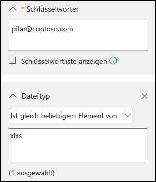
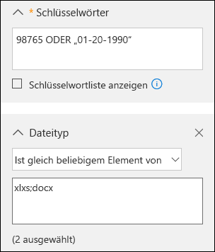
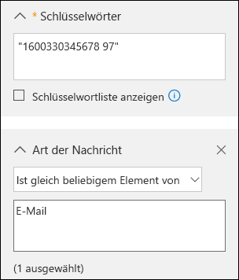

# <a name="office-365-data-subject-requests-for-the-gdpr-and-ccpa"></a>Anträge betroffener Personen für Office 365 im Rahmen der DSGVO und des CCPA

## <a name="introduction-to-dsrs"></a>Einführung in Anträge betroffener Personen

The European Union [General Data Protection Regulation (GDPR)](https://ec.europa.eu/justice/data-protection/reform/index_en.htm) gives rights to people (known in the regulation as *data subjects*) to manage the personal data that has been collected by an employer or other type of agency or organization (known as the *data controller* or just *controller*). Personal data is defined broadly under the GDPR as any data that relates to an identified or identifiable natural person. The GDPR gives data subjects specific rights to their personal data; these rights include obtaining copies of it, requesting changes to it, restricting the processing of it, deleting it, or receiving it in an electronic format so it can be moved to another controller. A formal request by a data subject to a controller to take an action on their personal data is called a *Data Subject Request* or DSR. The controller is obligated to promptly consider each DSR and provide a substantive response either by taking the requested action or by providing an explanation for why the DSR cannot be accommodated by the controller. A controller should consult with its own legal or compliance advisers regarding the proper disposition of any given DSR.

In ähnlicher Weise bietet der California Consumer Privacy Act (CCPA) den kalifornischen Verbrauchern Datenschutzrechte und -pflichten, einschließlich von Rechten, die den Rechten von betroffenen Personen der DSGV entsprechen, wie z. B. das Recht auf Löschung, Zugriff und Empfang (Portabilität) der persönlichen Informationen. Das CCPA ermöglicht außerdem bestimmte Offenlegungen, Schutz vor Diskriminierung bei der Wahl von Ausübungsrechten und Deaktivierungs-/Aktivierungsanforderungen für bestimmte Datentransfers, die als "Verkäufe" eingestuft werden. Die Definition von "Verkäufe" umfasst die Freigabe von Daten für eine angemessene Gegenleistung. Weitere Informationen zum CCPA finden Sie im ["California Consumer Privacy Act](offering-ccpa.md) und in den [häufig gestellten Fragen zum California Consumer Privacy Act](ccpa-faq.md).

In dem Leitfaden wird erläutert, wie Sie Office 365-Produkte, -Dienste und -Verwaltungstools zum Suchen von und Reagieren auf personenbezogene Daten oder persönliche Informationen als Reaktion auf DSRs verwenden können. Dies gilt insbesondere für die Suche nach, den Zugriff auf sowie die Verarbeitung von personenbezogenen Daten oder persönlichen Informationen, die sich in der Microsoft-Cloud befinden. Im Folgenden finden Sie eine kurze Übersicht über die Prozesse, die in diesem Leitfaden beschrieben werden:

- **Erkennung:** Sie können Kundendaten, die ggf. Gegenstand eines Antrags einer betroffenen Person sind, mithilfe von Such- und Ermittlungstools finden. Sobald Sie potenziell relevante Dokumente ermittelt haben, können Sie dem Antrag entsprechend eine oder mehrere der in den folgenden Schritten beschriebenen Aktionen ausführen. Möglicherweise stellen Sie jedoch fest, dass der Antrag nicht den Vorgaben Ihrer Organisation für die Reaktion auf Anträge betroffener Personen entspricht.
- **Zugriff:** Rufen Sie personenbezogene Daten ab, die sich in der Microsoft Cloud befinden, und erstellen Sie eine Kopie, die der betroffenen Person zur Verfügung gestellt werden kann, sofern dies beantragt wurde.
- **Berichtigung:** Nehmen Sie gegebenenfalls Änderungen an den personenbezogenen Daten vor oder führen Sie andere Aktionen aus, die für die Daten angefordert werden.
- **Einschränkung:** Schränken Sie die Verarbeitung von personenbezogenen Daten ein, indem Sie entweder die Lizenzen für verschiedene Microsoft Cloud-Dienste entfernen oder die gewünschten Dienste, wenn möglich, deaktivieren. Sie können auch Daten aus der Microsoft Cloud entfernen und lokal oder an einem anderen Speicherort speichern.
- **Löschung:** Entfernen Sie personenbezogene Daten, die sich in der Microsoft-Cloud befinden, dauerhaft.
- **Exportieren/Empfangen (Portierbarkeit):** Stellen Sie der betroffenen Person eine elektronische Kopie (in einem maschinenlesbaren Format) von personenbezogenen Daten oder persönlichen Informationen zur Verfügung. Personenbezogene Informationen gemäß CCPA sind alle Informationen, die eine identifizierte oder identifizierbare Person betreffen. Es wird nicht zwischen privaten, öffentlichen oder beruflichen Rollen einer Person unterschieden. Der definierte Begriff "persönliche Informationen" entspricht in etwa dem Begriff "persönliche Daten" unter der DSGVO. Allerdings umfasst das CCPA auch Familien- und Haushaltsdaten. Weitere Informationen zum CCPA finden Sie im ["California Consumer Privacy Act](offering-ccpa.md) und in den [häufig gestellten Fragen zum California Consumer Privacy Act](ccpa-faq.md).

### <a name="terminology"></a>Terminologie

Im Folgenden finden Sie Definitionen von Begriffen der DSGVO, die für diesen Leitfaden relevant sind.

- **Datenverantwortlicher:** Eine natürliche oder juristische Person, öffentliche Behörde, Agentur oder andere Stelle, die allein oder gemeinsam mit anderen die Zwecke und Mittel der Verarbeitung personenbezogener Daten bestimmt. Sofern die Zwecke und Mittel der Verarbeitung durch das Recht der Union oder der Mitgliedstaaten bestimmt werden, können der Datenverantwortliche bzw. die spezifischen Kriterien für dessen Benennung durch das Recht der Union oder des Mitgliedstaats angegeben werden.
- **Personenbezogene Daten und betroffene Person:** Alle Informationen über eine identifizierte oder identifizierbare natürliche Person ("betroffene Person"). Eine identifizierbare natürliche Person ist eine Person, die direkt oder indirekt, insbesondere durch Zuordnung zu einer Kennung wie einem Namen, zu einer Kennnummer, zu Standortdaten, zu einer Online-Kennung oder zu einem oder mehreren besonderen Merkmalen identifiziert werden kann, die Ausdruck der physischen, physiologischen, genetischen, psychischen, wirtschaftlichen, kulturellen oder sozialen Identität dieser natürlichen Person sind.
- **Verarbeiter:** Eine natürliche oder juristische Person, öffentliche Behörde, Agentur oder andere Stelle, die personenbezogene Daten im Auftrag des Verantwortlichen verarbeitet.
- **Kundendaten:** Alle Daten, einschließlich aller Text-, Ton-, Video- oder Bilddateien, und Software, die Microsoft von einem Kunden oder in dessen Namen durch die Nutzung des Unternehmensdiensts zur Verfügung gestellt werden. Kundendaten umfassen sowohl (1) Informationen zur Identifikation von Endbenutzern (z. B. Benutzernamen und Kontaktinformationen in Azure Active Directory) als auch Kundeninhalte, die ein Kunde in einen bestimmten Dienst hochlädt oder in diesem erstellt (z. B. Kundeninhalte in einem Word- oder Excel-Dokument oder im Text einer Exchange Online-E-Mail; Kundeninhalte, die einer SharePoint-Online-Website hinzugefügt oder in einem OneDrive for Business-Konto gespeichert werden).
- **Vom System generierte Protokolle:** Von Microsoft generierte Protokolle und verbundene Daten, die Microsoft bei der Bereitstellung von Enterprise-Diensten für Benutzer unterstützen. Vom System generierte Protokolle enthalten in erster Linie pseudonymisierte Daten, z. B. eindeutige Bezeichner – in der Regel kann eine vom System generierte Zahl nicht von sich aus eine Einzelperson identifizieren, aber dazu verwendet werden, die Enterprise-Dienste für Benutzer bereitzustellen. Vom System generierte Protokolle enthalten möglicherweise auch Informationen zur Identifikation von Endbenutzern, z. B. einen Benutzernamen.

### <a name="how-to-use-this-guide"></a>Verwenden dieses Leitfadens

Um das Auffinden relevanter Informationen zu Ihrem jeweiligen Anwendungsfall leichter zu gestalten, haben wir diesen Leitfaden in vier Bereiche unterteilt.

- **[Teil 1: Reagieren auf Anträge betroffener Personen bezüglich Kundendaten](#part-1-responding-to-dsrs-for-customer-data):** *Kundendaten* sind Daten, die in Office 365 in den tagtäglichen Abläufen der Geschäftsführung erstellt und gespeichert werden. Beispiele für die am häufigsten verwendeten Office 365-Anwendungen, die Ihnen das Erstellen von Daten ermöglichen, sind etwa Word, Excel, PowerPoint, Outlook und OneNote. Office 365 umfasst außerdem Anwendungen wie SharePoint Online, Teams und Formulare, die Ihnen eine bessere Zusammenarbeit ermöglichen. In Teil 1 dieses Leitfadens wird erläutert, wie Sie Daten aus Office 365-Anwendungen, die zum Erstellen von Daten in Office 365 Onlinediensten verwendet wurden, finden, korrigieren, einschränken, löschen und exportieren können. Er bezieht sich auf Produkte und Dienste, für die Microsoft als Datenverarbeiter für Ihre Organisation agiert, und daher wird die Funktion für Anträge betroffener Personen für den Mandantenadministrator bereitgestellt.
- **[Teil 2: Reagieren auf Anträge betroffener Personen bezüglich von Office 365 generierten Erkenntnissen](#part-2-responding-to-dsrs-with-respect-to-insights-generated-by-office-365):** Office 365 stellt über Dienste wie Delve, MyAnalytics und Workplace Analytics bestimmte Erkenntnisse bereit. Die Art und Weise, wie diese Erkenntnisse generiert werden und wie auf Anträge betroffener Personen reagiert werden kann, wird in Teil 2 dieses Leitfadens erläutert.
- **[Teil 3: Reagieren auf Anträge betroffener Personen bezüglich vom System generierten Protokollen](#part-3-responding-to-dsrs-for-system-generated-logs):** Wenn Sie Office 365 Enterprise Services verwenden, generiert Microsoft einige Informationen wie Dienstprotokolle, welche die Verwendung oder Leistung von Features in den Onlinediensten aufzeichnen. Die meisten vom Dienst generierten Daten enthalten pseudonyme Bezeichner, die von Microsoft generiert werden. Daher wird diese Kategorie im Allgemeinen als *vom System generierte Protokolle* bezeichnet. Obwohl diese Daten nicht ohne das Hinzuziehen zusätzlicher Informationen einer bestimmten betroffenen Person zugeordnet werden können, ist es möglich, dass ein Teil dieser Daten gemäß der Definition der DSGVO als personenbezogen eingestuft wird. In Teil 3 dieses Leitfadens wird erläutert, wie Sie vom System generierte Protokolle aufrufen, löschen und exportieren können.
- **[Teil 4: Weitere Ressourcen, die bei Anträgen betroffener Personen hilfreich sind](#part-4-additional-resources-to-assist-you-with-dsrs)** – In Teil 4 dieses Leitfadens wird eine Auswahl von Szenarios gegeben, in denen Microsoft als Verantwortlicher agiert, wenn bestimmte Office 365-Produkte und Dienste verwendet werden.

>[!NOTE]
>In most cases, when users in your organization use Microsoft Office 365 products and services, you are the data controller and Microsoft is the processor. As a data controller, you are responsible for responding to the data subject directly. To assist you with this, Parts 1-3 of this guide detail the technical capabilities available to your organization to respond to a DSR request. In some limited scenarios, however, Microsoft will be the data controller when people use certain Office 365 products and services. In these cases, the information in Part 4 provides guidance on how data subjects can submit DSR requests to Microsoft.

### <a name="office-365-national-clouds"></a>Nationale Office 365-Clouds

The Microsoft Office 365 services are also available in the following national cloud environments: [Office 365 Germany](https://docs.microsoft.com/microsoft-365/admin/admin-overview/learn-about-office-365-germany), [Office 365 operated by 21Vianet (China)](https://docs.microsoft.com/microsoft-365/admin/services-in-china/services-in-china), and [Office 365 US Government](https://www.microsoft.com/microsoft-365/government/compare-office-365-government-plans). Most of the guidance for managing data subject requests described in this document applies to these national cloud environments. However, due to the isolated nature of these environments, there are some exceptions. Where notable for a given subsection, these exceptions are called out in a corresponding note.

### <a name="hybrid-deployments"></a>Hybridbereitstellungen

Your organization may consist of Microsoft offerings that are a combination of cloud-based services and on-premises server products. In general, a hybrid deployment is typically the sharing of user accounts (identity management) and resources (such as mailboxes, web sites, and data) that exist in the cloud and on-premises. Common hybrid scenarios include:

- Exchange-Hybridbereitstellungen, bei denen einige Benutzer über ein lokales Postfach und andere Benutzer über ein Exchange Online-Postfach verfügen,
- SharePoint-Hybridbereitstellungen, bei denen Website- und Dateiserver vor Ort sind und OneDrive for Business-Konten in Office 365 sind,
- das lokale Identitätsmanagementsystem (Active Directory), das mit dem Azure Activity Directory synchronisiert ist, bei dem es sich um den zugrunde liegenden Verzeichnisdienst in Office 365 handelt.

When responding to a DSR request, you may have to determine if data that's responsive to a DSR request is in the Microsoft cloud or in your on-premise organization, and then take the appropriate steps to respond to that request. The Office 365 Data Subject Request Guide (this guide) provides guidance for responding to cloud-based data. For guidance for data in your on-premises organization, see [GDPR for Office on-premises Servers](https://docs.microsoft.com/Office365/Enterprise/gdpr-for-office-servers).

## <a name="part-1-responding-to-dsrs-for-customer-data"></a>Teil 1: Reagieren auf Anträge betroffener Personen bezüglich Kundendaten

Die Anleitung zum Reagieren auf Anträge betroffener Personen bezüglich Kundendaten ist in die folgenden vier Abschnitte unterteilt:

- [Reagieren auf Anträge betroffener Personen mit dem eDiscovery-Tool für die Inhaltssuche](#using-the-content-search-ediscovery-tool-to-respond-to-dsrs)
- [Reagieren auf Anträge betroffener Personen mithilfe der In-App-Funktionalität](#using-in-app-functionality-to-respond-to-dsrs)
- [Reagieren auf Anträge betroffener Personen zur Berichtigung von Daten](#responding-to-dsr-rectification-requests)
- [Reagieren auf Anträge betroffener Personen zur Einschränkung der Datenverarbeitung](#responding-to-dsr-restriction-requests)

### <a name="how-to-determine-the-office-365-applications-that-may-be-in-scope-for-a-dsr-for-customer-data"></a>Bestimmen der Office 365-Anwendungen, die Ziel von Anträgen betroffener Person bezüglich Kundendaten sein können

Um bestimmen zu können, wo nach personenbezogenen Daten gesucht oder wonach gesucht werden muss, ist es hilfreich, die Office 365-Anwendungen zu ermitteln, die von Personen in Ihrer Organisation verwendet werden können, um Daten in Office 365 zu erstellen und zu speichern. So können Sie die Office 365-Anwendungen eingrenzen, die als Ziel eines Antrags betroffener Personen in Frage kommen, und leichter bestimmen, wie Sie im Zusammenhang mit einem solchen Antrag nach personenbezogenen Daten suchen und auf sie zugreifen können. Dies bedeutet insbesondere, ob Sie das Tool für die Inhaltssuche verwenden können oder ob die Verwendung der In-App-Funktion erforderlich ist, in der die Daten erstellt wurden.

A quick way to identify the Office 365 applications that people in your organization are using to create Customer Data is to determine which applications are included in your organization's Microsoft 365 for business subscription. To do this, you can access user accounts in the Office 365 admin portal and look at the product licensing information. See [Assign licenses to users](../admin/manage/assign-licenses-to-users.md).

## <a name="using-the-content-search-ediscovery-tool-to-respond-to-dsrs"></a>Reagieren auf Anträge betroffener Personen mit dem eDiscovery-Tool für die Inhaltssuche

When looking for personal data within the larger set of data your organization creates and stores using in Office 365, you may want to first consider which applications people have most likely used to author the data you're looking for. Microsoft estimates that over 90% of an organization's data that is stored in Office 365 is authored in Word, Excel, PowerPoint, OneNote, and Outlook. Documents authored in these Office applications, even if purchased through Microsoft 365 Apps for enterprise or an Office perpetual license, are most likely stored on a SharePoint Online site, in a user's OneDrive for Business account, or in a user's Exchange Online mailbox. That means you can use the Content Search eDiscovery tool to search (and perform other DSR-related actions) across SharePoint Online sites, OneDrive for Business accounts, and Exchange Online mailboxes (including the sites and mailboxes associated with Microsoft 365 Groups, Microsoft Teams, EDU Assignments) to find documents and mailbox items that may be relevant to the DSR you're investigating. You can also use the Content Search tool to discover Customer Data authored in other Office 365 applications.

In der folgenden Tabelle sind die Office 365-Anwendungen aufgeführt, mit denen Personen Kundeninhalte erstellen, die über die Inhaltssuche ermittelt werden können. In diesem Abschnitt des Leitfadens zu Anträgen betroffener Personen wird erläutert, wie Sie mit diesen Office 365-Anwendungen erstellte Daten ermitteln, exportieren und löschen können und wie Sie darauf zugreifen können.

***Tabelle 1: Anwendungen, bei denen die Inhaltssuche verwendet werden kann, um Kundendaten zu finden***

| | |
| :---: | :---:|
 <br> Kalender |  <br> SharePoint  |
|  <br> Excel |  <br> Skype for Business |
|  <br> Office Lens |  <br> Aufgaben |
|  <br> OneDrive for Business | <br> Teams |
|  <br> OneNote|  <br> Aufgabe |
|  <br> Outlook/Exchange |  <br> Video |
|  <br> Personen |  <br> Visio |
|  <br> PowerPoint |  <br> Word
||

>[!NOTE]
>The Content Search eDiscovery tool is not available in [Office 365 operated by 21Vianet (China)](https://docs.microsoft.com/microsoft-365/admin/services-in-china/services-in-china). This means you won't able to use this tool to search for and export Customer Data in the Office 365 applications shown in Table 1. However, you can use the In-Place eDiscovery tool in Exchange Online to search for content in user mailboxes. You can also use the eDiscovery Center in SharePoint Online to search for content in SharePoint sites and OneDrive accounts. Alternatively, you can ask a document owner to help you find and make changes or deletions to content or export it if necessary. For more information, see:</br><br> * [Erstellen einer Compliance-eDiscovery-Suche](https://docs.microsoft.com/exchange/create-in-place-ediscovery-search-exchange-2013-help)<br> * [Einrichten eines eDiscovery Center in SharePoint Online](https://support.office.com/article/Set-up-an-eDiscovery-Center-in-SharePoint-Online-A18F8975-AA7F-43B4-A7D6-001D14744D8E)

### <a name="using-content-search-to-find-personal-data"></a>Verwenden der Inhaltssuche zum Suchen nach personenbezogenen Daten

Der erste Schritt bei der Reaktion auf einen Antrag einer betroffenen Person besteht darin, die personenbezogenen Daten zu finden, die Gegenstand dieses Antrags sind. Hierbei kann das Office 365 eDiscovery-Tool zum Suchen nach personenbezogenen Daten (in den gesamten Daten Ihres Unternehmens in Office 365) oder direkt die systemeigene Anwendung verwendet werden, in der die Daten erstellt wurden. Dieser erste Schritt – Suchen und Überprüfen der betreffenden personenbezogenen Daten – ist nützlich, um zu bestimmen, ob ein Antrag einer betroffenen Person die Anforderungen Ihres Unternehmens für die Annahme oder Ablehnung eines solchen Antrags erfüllt. Sie könnten beispielsweise nach dem Suchen und Überprüfen der betreffenden personenbezogenen Daten feststellen, dass die Anforderungen Ihres Unternehmens nicht erfüllt sind, da der Antrag die Rechte und Freiheiten anderer beeinträchtigen könnte oder weil die entsprechenden personenbezogenen Daten Teil einer Geschäftsaufzeichnung sind, an deren Bewahrung Ihr Unternehmen ein berechtigtes Geschäftsinteresse hat.

As previously stated, Microsoft estimates that over 90% of an organization's data is created with Office applications, such as Word and Excel. This means that you can use the Content Search in the Security & Compliance Center to search for most DSR-related data.

This guide assumes that you or the person searching for personal data that may be responsive to a DSR request is familiar with or has experience using the Content Search tool in the Security & Compliance Center. For general guidance on using Content Search, see [Content Search in Office 365](https://docs.microsoft.com/microsoft-365/compliance/content-search). Be sure that the person running the searches has been assigned the necessary permissions in the Security & Compliance Center. This person should be added as a member of the eDiscovery Manager role group in the Security & Compliance Center; see [Assign eDiscovery permissions in the Security & Compliance Center](https://docs.microsoft.com/microsoft-365/compliance/assign-ediscovery-permissions). Consider adding other people in your organization who are involved in investigating DSRs to the eDiscovery Manager role group, so they can perform the necessary actions in the Content Search tool such as previewing and exporting search results. However, unless you set up compliance boundaries (as described [here](#set-up-compliance-boundaries-to-limit-the-scope-of-content-searches)) be aware that an eDiscovery Manager can search all content locations in your organization, including ones that may not be related to a DSR investigation.

Nachdem Sie die Daten gefunden haben, können Sie die bestimmte Aktion ausführen, die im Rahmen eines Antrags einer betroffenen Person angefordert wurde.

>[!NOTE]
>In Office 365 Deutschland ist das Security & Compliance Center hier verfügbar: https://protection.office.de.

#### <a name="searching-content-locations"></a>Durchsuchen von Speicherorten für Inhalte

Sie können nach folgenden Typen von Speicherorte für Inhalte mit dem Tool zur Inhaltssuche suchen.

- Exchange Online-Postfächer. Dies umfasst mit Microsoft 365-Gruppen und Microsoft Teams verbundene Postfächer
- Öffentliche Ordner in Exchange Online
- SharePoint Online-Websites. Dies umfasst mit Microsoft 365-Gruppen und Microsoft Teams verbundene Websites
- OneDrive for Business-Konten

>[!NOTE]
>This guide assumes that all data that might be relevant to a DSR investigation is stored in Office 365; in other words, stored in the Microsoft cloud. Data stored on a user's local computer or on-premises on your organization's file servers is outside the scope of a DSR investigation for data stored in Office 365. For guidance about responding to DSR requests for data in on-premises organizations, see [GDPR for Office on-premises Servers](https://docs.microsoft.com/Office365/Enterprise/gdpr-for-office-servers).

#### <a name="tips-for-searching-content-locations"></a>Tipps zum Durchsuchen von Speicherorten für Inhalte

- Durchsuchen Sie zunächst alle Speicherorte für Inhalte in Ihrem Unternehmen (die Sie in einem einzigen Suchvorgang durchsuchen können), um schnell zu ermitteln, welche Speicherorte Elemente enthalten, die Ihrer Suchabfrage entsprechen. Anschließend können Sie die Suche erneut durchführen und den Suchbereich auf jene Speicherorte beschränken, die relevante Elemente enthalten.
- Use search statistics to identify the top locations that contain items that match your search query. See [View keyword statistics for Content Search results](https://docs.microsoft.com/microsoft-365/compliance/view-keyword-statistics-for-content-search).
- Suchen Sie im Überwachungsprotokoll nach zuletzt verwendeten Dateien und Ordneraktivitäten des Benutzers, der Gegenstand des Antrags einer betroffenen Person ist. Durch das Durchsuchen des Überwachungsprotokolls erhalten Sie eine Liste der Überwachungsberichte, die den Namen und den Speicherort der Ressourcen enthalten, mit denen der Benutzer kürzlich interagiert hat. Sie können diese Informationen unter Umständen verwenden, um eine Inhaltssuchabfrage zu erstellen. Siehe [Durchsuchen des Überwachungsprotokolls im Security & Compliance Center](https://docs.microsoft.com/microsoft-365/compliance/search-the-audit-log-in-security-and-compliance).

#### <a name="building-search-queries-to-find-personal-data"></a>Erstellen von Suchabfragen zur Suche nach personenbezogenen Daten

Der untersuchte Antrag einer betroffenen Person enthält wahrscheinlich Bezeichner, die Sie bei der Stichwortsuchabfrage verwenden können, um nach den personenbezogenen Daten zu suchen. Im Folgenden finden Sie einige allgemeine Bezeichner, die Sie in einer Suchabfrage zum Suchen nach personenbezogenen Daten verwendet werden können:

- E-Mail-Adresse oder Alias
- Telefonnummer
- Postanschrift
- Mitarbeiter-ID-Nummer
- Nationale IDs oder die EU-Mitgliedversion einer Sozialversicherungsnummer

Der untersuchte Antrag einer betroffenen Person enthält wahrscheinlich einen Bezeichner und weitere Details zu den personenbezogenen Daten, die Gegenstand des Antrags sind, die Sie in einer Suchabfrage verwenden können.

Die Suche nur nach einer E-Mail-Adresse oder der Mitarbeiter-ID liefert wahrscheinlich viele Ergebnisse. Um den Bereich Ihrer Suche einzugrenzen und die relevantesten Inhalte für den Antrag einer betroffenen Person zu erhalten, können Sie der Suchabfrage Bedingungen hinzufügen. Wenn Sie eine Bedingung hinzufügen, sind das Schlüsselwort und die Suchbedingung logisch durch den booleschen Operator **AND** miteinander verbunden. Das bedeutet, dass nur Elemente in den Suchergebnissen zurückgegeben werden, die *sowohl* dem Schlüsselwort als auch der Bedingung entsprechen.

The following table lists some conditions you can use to narrow the scope of a search. The table also lists the values that you can use for each condition to search for specific document types and mailbox items.

***Tabelle 2: Bereich der Suche durch Verwenden von Bedingungen eingrenzen***

||||
| :--- | :--- |:--- |
|**Bedingung**|**Beschreibung** |**Beispiel für Bedingungswerte**|
| Dateityp | Die Erweiterung eines Dokuments oder einer Datei. Verwenden Sie diese Bedingung zum Suchen nach Office-Dokumenten und -Dateien, die von Office 365-Anwendungen erstellt wurden. Verwenden Sie diese Bedingungen bei der Suche nach Dokumenten, die sich auf SharePoint Online-Websites und in OneDrive for Business-Konten befinden.<br/>Die entsprechende Dokumenteigenschaft ist der Dateityp. <br/>Eine vollständige Liste der Dateierweiterungen, nach denen Sie suchen können, finden Sie unter „Standardmäßig durchforstete Dateinamenerweiterungen und analysierte Dateitypen in SharePoint“](https://technet.microsoft.com/library/jj219530.aspx).|&nbsp;&bull;&nbsp;&nbsp;csv: Sucht nach durch Trennzeichen getrennten Dateien (CSV-Dateien); Excel-Dateien können im CSV-Format gespeichert werden, und CSV-Dateien können ganz einfach in Excel importiert werden.<br><br>&bull;&nbsp;&nbsp;docx: sucht nach Word-Dateien <br><br>&bull;&nbsp;&nbsp;mpp: sucht nach Projektdateien<br/><br>&bull;&nbsp;&nbsp;one: sucht nach OneNote-Dateien <br><br>&bull;&nbsp;&nbsp;pdf: Sucht nach Dateien, die in einem PDF-Format gespeichert sind. <br><br>&bull;&nbsp;&nbsp;pptx: sucht nach PowerPoint-Dateien <br><br>&bull;&nbsp;&nbsp;xlxs: sucht nach Excel-Dateien <br><br>&bull;&nbsp;&nbsp;vsd: sucht nach Visio-Dateien <br><br>&bull;&nbsp;&nbsp;wmv: sucht nach Windows Media Video-Dateien <br>|
| Nachrichtentyp | Der E-Mail-Nachrichtentyp, nach dem gesucht wird. Verwenden Sie diese Bedingung, um Postfächer nach Kontakten (Personen), Besprechungsaufgaben (Kalender) oder Skype for Business-Unterhaltungen zu durchsuchen. Die entsprechende E-Mail-Eigenschaft ist *Art*.|&bull;&nbsp;&nbsp;*contacts: sucht in der Liste „Meine Kontakte (Personen)“ eines Postfachs <br><br>&bull;&nbsp;&nbsp;* email: sucht nach E-Mail-Nachrichten <br><br>&bull;&nbsp;&nbsp;*im: sucht nach Skype for Business-Unterhaltungen <br><br>&bull;&nbsp;&nbsp;* meetings: durchsucht Termine und Besprechungsanfragen (Kalender) <br><br>&bull;&nbsp;&nbsp;*tasks: Sucht in der Liste „Meine Aufgaben“ (Aufgaben); dieser Wert gibt auch Aufgaben zurück, die in Microsoft To-Do erstellt wurden.<br>|
| Compliancetag |The label assigned to an email message or a document. Labels are used to classify email and documents for data governance and enforce retention rules based on the classification defined by the label. Use this condition to search for items that have been automatically or manually assigned a label.<br/>This is a useful condition for DSR investigations because your organization may be using labels to classify content related to data privacy or that contains personal data or sensitive information. See the "Using Content Search to find all content with a specific label applied to it" section in [Overview of labels in Office 365.](https://docs.microsoft.com/microsoft-365/compliance/labels)|compliancetag="personenbezogene Daten"|
||||

There are many more email and document properties and search conditions that you can use to build more complex search queries. See the following sections in the [Keyword queries and search conditions for Content Search](https://docs.microsoft.com/microsoft-365/compliance/keyword-queries-and-search-conditions) help topic for more information.

- [Durchsuchbare E-Mail-Eigenschaften](https://docs.microsoft.com/microsoft-365/compliance/keyword-queries-and-search-conditions)
- [Durchsuchbare Websiteeigenschaften (Dokumenteigenschaften)](https://docs.microsoft.com/microsoft-365/compliance/keyword-queries-and-search-conditions)
- [Suchbedingungen](https://docs.microsoft.com/microsoft-365/compliance/keyword-queries-and-search-conditions)

#### <a name="searching-for-personal-data-in-sharepoint-lists-discussions-and-forms"></a>Suchen nach personenbezogenen Daten in SharePoint-Listen, -Diskussionen und -Formularen

In addition to searching for personal data in documents, you can also use Content Search to search for other types of data that's created by using native SharePoint Online apps. This includes data created by using SharePoint lists, discussions, and forms. When you run a Content Search and search SharePoint Online sites (or OneDrive for Business accounts) data from lists, discussions, and forms that match the search criteria will be returned in the search results.

##### <a name="examples-of-search-queries"></a>Beispiele für Suchabfragen

Nachfolgend finden Sie einige Beispiele für Suchabfragen, die Stichwörter und Bedingungen verwenden, um in Antwort auf einen Antrag einer betroffenen Person nach personenbezogenen Daten zu suchen. Die Beispiele zeigen zwei Versionen der Abfrage: eine der Schlüsselwortsyntax (in der die Bedingung im Schlüsselwortfeld enthalten ist) und eine mit der GUI-basierten Version der Abfrage mit Bedingungen.

##### <a name="example-1"></a>Beispiel 1

In diesem Beispiel werden Excel-Dateien auf SharePoint Online-Websites und in OneDrive for Business-Konten wiedergegeben, die die angegebene E-Mail-Adresse enthalten. Dateien werden möglicherweise zurückgegeben, wenn die E-Mail-Adresse in den Metadaten vorkommt.

***Schlüsselwortsyntax***

```Query
pilar@contoso.com AND filetype="xlxs"
```

***GUI***



##### <a name="example-2"></a>Beispiel 2

In diesem Beispiel werden Excel- oder Word-Dateien auf SharePoint Online-Websites und in OneDrive for Business-Konten wiedergegeben, die die angegebene Mitarbeiter-ID oder das Geburtsdatum enthalten.

(98765 OR "01-20-1990") AND (filetype="xlxs" OR filetype="docx")

***GUI***



##### <a name="example-3"></a>Beispiel 3

In diesem Beispiel werden E-Mail-Nachrichten zurückgegeben, die die angegebene ID-Nummer enthalten, bei der es sich hier um eine französische Sozialversicherungsnummer (INSEE) handelt.

```Query
"1600330345678 97" AND kind="email"
```

***GUI***



#### <a name="working-with-partially-indexed-items-in-content-search"></a>Arbeiten mit teilweise indizierten Elemente in der Inhaltssuche

Teilweise indizierte Elemente (auch als *nicht indizierte Elemente* bezeichnet) sind Exchange Online-Postfachelemente und Dokumente in SharePoint Online- und OneDrive for Business-Websites, die aus irgendeinem Grund nicht vollständig für die Suche indiziert wurden, was bedeutet, dass sie nicht mithilfe der Inhaltssuche durchsucht werden können. Die meisten E-Mail-Nachrichten und Websitedokumente werden erfolgreich indiziert, da sie innerhalb der [Indizierungsgrenzwerte für Office 365](https://docs.microsoft.com/microsoft-365/compliance/limits-for-content-search) liegen. Zu den Gründen dafür, dass E-Mail-Nachrichten oder Dateien für die Suche nicht indiziert werden, zählt unter anderem Folgendes:

- Der Dateityp wird [nicht erkannt oder wird nicht für die Indizierung unterstützt](https://docs.microsoft.com/microsoft-365/compliance/partially-indexed-items-in-content-search). Manchmal wird der Dateityp zwar für die Indizierung unterstützt, aber es ist ein Indizierungsfehler für eine bestimmte Datei aufgetreten.
- E-Mail-Nachrichten verfügen über eine angefügte Datei ohne einen gültigen Handler, wie Bilddatei (dies ist die häufigste Ursache für teilweise indizierten E-Mail-Elemente).
- An E-Mails angefügt Dateien sind zu groß oder es gibt zu viele Dateianlagen.

We recommend that you learn more about partially indexed items so that you can work with them when responding to DSR requests. For more information, see:

- [Teilweise indizierte Elemente in der Inhaltssuche in Office 365](https://docs.microsoft.com/microsoft-365/compliance/partially-indexed-items-in-content-search)
- [Untersuchen von teilweise indizierten Elementen in Office 365 eDiscovery](https://docs.microsoft.com/microsoft-365/compliance/investigating-partially-indexed-items-in-ediscovery)
- [Exportieren nicht indizierter Elemente](export-search-results.md)

#### <a name="tips-for-working-with-partially-indexed-items"></a>Tipps für die Arbeit mit teilweise indizierten Elementen

It's possible that data responsive to a DSR investigation may be in a partially indexed item. Here's some suggestions for working with partially indexed items:

- Nach dem Ausführen einer Suche wird die Anzahl der geschätzten teilweise indizierten Elemente in der Suchstatistik angezeigt. Diese Schätzung enthält keine teilweise indizierten Elemente in SharePoint Online und OneDrive for Business. Exportieren Sie die Berichte für eine Inhaltssuche, um Informationen zu teilweise indizierte Elemente zu erhalten. Der Bericht **Unindexed Items.csv** (Nicht indizierte Elemente) enthält Informationen zu nicht indizierten Elementen, z. B. den Speicherort des jeweiligen Elements, dessen URL, wenn sich das Element in SharePoint Online oder OneDrive for Business befindet, sowie die Betreffzeile (für Nachrichten) oder den Namen des Dokuments. Weitere Informationen finden Sie unter [Exportieren eines Inhaltssuchberichts](https://docs.microsoft.com/microsoft-365/compliance/export-a-content-search-report).

- Die Statistik und die Liste der teilweise indizierten Elemente, die mit den Ergebnissen einer Inhaltssuche zurückgegeben werden, sind alle teilweise indizierte Elemente aus den durchsuchten Speicherorten für Inhalte.

- Um teilweise indizierte Elemente abzurufen, die für eine Untersuchung im Rahmen eines Antrags einer betroffenen Person potenziell relevant sind, können Sie eine der folgenden Aktionen ausführen:

##### <a name="export-all-partially-indexed-items"></a>Exportieren aller teilweise indizierten Elemente

Es werden sowohl die Ergebnisse einer Inhaltssuche als auch die teilweise indizierten Elemente aus dem durchsuchten Inhaltsspeicherort exportiert. Sie können auch nur die teilweise indizierten Elemente exportieren. Diese können Sie anschließend in ihrer nativen Anwendung öffnen und deren Inhalt überprüfen. Diese Option ist erforderlich, um Elemente aus SharePoint Online und OneDrive for Business zu exportieren. Siehe [Exportieren der Inhaltssuchergebnisse aus dem Security Compliance Center](export-search-results.md).

##### <a name="export-a-specific-set-of-partially-indexed-items-from-mailboxes"></a>Exportieren eines bestimmten Satzes teilweise indizierter Elemente aus Postfächern

Statt alle teilweise indizierten Postfachelemente aus einer Suche zu exportieren, können Sie auch eine erneute Inhaltssuche durchführen, um nach einer bestimmten Liste teilweise indizierter Elemente zu suchen und diese dann exportieren. Dies ist nur für Postfachelemente möglich. Siehe [Vorbereiten einer CSV-Datei für eine gezielte Inhaltssuche in Office 365](https://docs.microsoft.com/microsoft-365/compliance/csv-file-for-an-id-list-content-search).

### <a name="next-steps"></a>Nächste Schritte

Nachdem Sie die personenbezogene Daten, die für den Antrag einer betroffenen Person relevant sind, gefunden haben, müssen Sie unbedingt die spezifische Inhaltssuche beibehalten, die Sie verwendet haben, um die Daten zu suchen. Sie werden diese Suche wahrscheinlich erneut für die Ausführung anderer Schritte im Rahmen der Reaktion auf einen Antrag einer betroffenen Person verwenden, wie zum Beispiel das [Erstellen einer Kopie](#providing-a-copy-of-personal-data), das [Exportieren](#exporting-personal-data) oder das [dauerhafte Löschen](#deleting-personal-data).

### <a name="additional-considerations-for-selected-applications"></a>Zusätzliche Aspekte bei ausgewählten Anwendungen

Die folgenden Abschnitte beschreiben die Aktionen, die Sie bei der Suche nach Daten in den folgenden Office 365-Anwendungen im Auge behalten sollten.

- [Office Lens](#office-lens)
- [OneDrive for Business- und SharePoint-Oberflächeneinstellungen](#onedrive-for-business-and-sharepoint-online-experience-settings)
- [Microsoft Teams für Bildungseinrichtungen](#microsoft-teams-for-education)
- [Microsoft Aufgaben](#microsoft-to-do)
- [Skype for Business](#skype-for-business)

#### <a name="office-lens"></a>Office Lens

Ein Benutzer von Office Lens (eine Kamera-App, die von Geräten unter iOS, Android und Windows unterstützt wird) kann damit Fotos von Whiteboards, Papierdokumenten, Visitenkarten und anderen Dingen aufnehmen, die eine große Textmenge enthalten. Office Lens verwendet OCR-Technologie (optische Zeichenerkennung), mit der Text in einem Bild extrahiert und in einem Office-Dokument, z. B. einer Word-, PowerPoint- oder OneNote-Datei, oder in einer PDF-Datei gespeichert wird. Benutzer können dann die Datei, die den Text aus dem Bild enthält, in ihr OneDrive for Business-Konto in Office 365 hochladen. Das bedeutet, dass Sie das Tool für die Inhaltssuche verwenden können, um nach Daten in Dateien zu suchen, die aus einem Office Lens-Bild erstellt wurden, und auf diese zugreifen, sie löschen und exportieren können. Weitere Informationen zu Office Lens finden Sie unter:

- [Office Lens für iOS](https://support.microsoft.com/de-DE/office/microsoft-office-lens-for-ios-fbdca5f4-1b1b-4391-a931-dc1c2582397b)
- [Office Lens für Android](https://support.office.com/article/Office-Lens-for-Android-ec124207-0049-4201-afaf-b5874a8e6f2b)
- [Office Lens für Windows](https://support.microsoft.com/de-DE/office/office-lens-for-windows-577ec09d-8da2-4029-8bb7-12f8114f472a)

#### <a name="onedrive-for-business-and-sharepoint-online-experience-settings"></a>OneDrive for Business- und SharePoint Online-Oberflächeneinstellungen

In addition to user-created files stored in OneDrive for Business accounts and SharePoint Online sites, these services store information about the user that is used to enable various experiences. Users still in your organization can access much of this information by using in-product functionality. The following information provides guidance on how to access, view, and export OneDrive for Business and SharePoint Online application data.

##### <a name="sharepoint-user-profiles"></a>SharePoint-Benutzerprofile

Mit dem Delve-Profil des Benutzers können Benutzer Eigenschaften verwalten, die im SharePoint Online-Benutzerprofil gespeichert werden, einschließlich Geburtstag, Mobiltelefonnummer (und andere Kontaktinformationen), „Über mich“, Projekte, Qualifikationen und Kompetenzen, Schulen und Ausbildung, Interessen und Hobbys.

###### <a name="end-users"></a>Endbenutzer

End users can discover, access, and rectify SharePoint Online user profile data using the Delve profile experience. See [View and update your profile in Office Delve](https://support.office.com/article/view-and-update-your-profile-in-office-delve-4e84343b-eedf-45a1-aeb9-8627ccca14ba) for more details.

Eine andere Möglichkeit für Benutzer, auf ihre SharePoint-Profildaten zuzugreifen, besteht darin, zur Seite **Profil bearbeiten** in ihrem OneDrive for Business-Konto zu navigieren, auf das über den Pfad **EditProfile.aspx** unter der OneDrive for Business-URL zugegriffen werden kann. Für den Benutzer <strong>user1@contoso.com</strong> befindet sich das OneDrive for Business-Konto des Benutzers unter:

```URL
`https://contoso-my.sharepoint.com/personal/user1\_contoso\_com/\_layouts/15/OneDrive.aspx`
```

Die URL für die Seite „Profil bearbeiten“ wäre:

```URL
`https://contoso-my.sharepoint.com/personal/user1\_contoso\_com/\_layouts/15/EditProfile.aspx`
```

In Azure Active Directory erstellte Eigenschaften können in SharePoint Online nicht geändert werden. Benutzer können jedoch zur Seite **Konto** wechseln, indem sie ihr **Foto** in der Office 365-Kopfzeile und dann **Mein Konto** auswählen. Zum Ändern der Eigenschaften müssen Benutzer möglicherweise mit ihren Administratoren zusammenarbeiten, um Benutzerprofileigenschaften zu ermitteln, auf diese zuzugreifen oder sie zu berichtigen.

###### <a name="admins"></a>Administratoren

Ein Administrator kann auf Profileigenschaften im SharePoint Admin Center zugreifen und diese berichtigen. Klicken Sie im **SharePoint Admin Center** auf die Registerkarte **Benutzerprofile**. Klicken Sie auf **Benutzerprofile verwalten**, geben Sie den Namen eines Benutzers ein, und klicken Sie dann auf **Suchen**. Der Administrator kann auf jeden Benutzer mit der rechten Maustaste klicken und **Mein Profil bearbeiten** auswählen. In Azure Active Directory erstellte Eigenschaften können in SharePoint Online nicht geändert werden.

An admin can export all User Profile properties for a user by using the **Export-SPOUserProfile** cmdlet in SharePoint Online PowerShell. See  [Export-SPOUserProfile](https://docs.microsoft.com/powershell/module/sharepoint-online/export-spouserprofile?view=sharepoint-ps).

Weitere Informationen zu Benutzerprofilen finden Sie unter [Verwalten von Benutzerprofilen im SharePoint Admin Center](https://docs.microsoft.com/sharepoint/manage-user-profiles).

##### <a name="user-information-list-on-sharepoint-online-sites"></a>Benutzerinformationsliste auf SharePoint Online-Websites

Ein Teil eines SharePoint-Benutzerprofils wird mit der Benutzerinformationsliste jeder Website synchronisiert, die der betreffende Benutzer besucht oder für die er Zugriffsrechte hat. Dies wird von SharePoint Online-Elementen wie etwa den Spalten „Personen“ in Dokumentbibliotheken verwendet, um grundlegende Informationen über den Benutzer anzuzeigen, z. B. den Namen des Erstellers eines Dokuments. Die Daten in einer Benutzerinformationsliste stimmen mit den im SharePoint-Benutzerprofil gespeicherten Informationen überein und werden automatisch korrigiert, wenn die Quelle geändert wird. Im Falle gelöschter Benutzer verbleiben diese Daten in den Websites, mit denen sie interagiert haben, um die referentielle Integrität der SharePoint-Spaltenfelder zu gewährleisten. 

Admins can control which properties are replicable inside the SharePoint admin center. To do this:

1. Wechseln Sie zum **SharePoint Admin Center**, und klicken Sie auf die Registerkarte **Benutzerprofile**.
2. Klicken Sie auf **Benutzereigenschaften verwalten**, um eine Liste mit Eigenschaften anzuzeigen.
3. Klicken Sie mit der rechten Maustaste auf eine beliebige Eigenschaft, und wählen Sie **Bearbeiten** aus, um verschiedene Einstellungen anzupassen.
4. Unter **Richtlinieneinstellungen** steuert die replizierbare Eigenschaft, ob die Eigenschaft in der Benutzerinformationsliste dargestellt wird. Nicht alle Eigenschaften können entsprechend angepasst werden.

An admin can export all User information properties for a user on a given site by using the **Export-SPOUserInfo** cmdlet in SharePoint Online PowerShell. See [Export-SPOUserInfo](https://docs.microsoft.com/powershell/module/sharepoint-online/export-spouserinfo?view=sharepoint-ps).

##### <a name="onedrive-for-business-experience-settings"></a>OneDrive for Business-Oberflächeneinstellungen

A user's OneDrive for Business experience stores information to help the user find and navigate content of interest to them. Most of this information can be accessed by end users using in-product features. An admin can export the information using a [PowerShell Script](https://docs.microsoft.com/powershell/scripting/overview) and [SharePoint Client-Side Object Model (CSOM)](https://docs.microsoft.com/sharepoint/dev/sp-add-ins/complete-basic-operations-using-sharepoint-client-library-code) commands.

Weitere Informationen zu den Einstellungen, wie diese gespeichert werden und wie Sie sie exportieren können finden Sie unter [Exportieren von OneDrive for Business-Oberflächeneinstellungen](https://docs.microsoft.com/sharepoint/export-odfb-lists).

##### <a name="onedrive-for-business-and-sharepoint-online-search"></a>OneDrive for Business- und SharePoint Online-Suche

The in-app search experience in OneDrive for Business and SharePoint Online stores a user's search queries for 30 days to increase relevance of search results. An admin can export search queries for a user by using the **Export-SPOQueryLogs** cmdlet in SharePoint Online PowerShell. See [Export-SPOQueryLogs](https://docs.microsoft.com/powershell/module/sharepoint-online/export-spoquerylogs?view=sharepoint-ps).

#### <a name="microsoft-teams-for-education"></a>Microsoft Teams für Bildungseinrichtungen

Microsoft Teams for Education offers two additional collaboration features that teachers and students can use that creates and stores personal data: Assignments and OneNote Class Notebook. You can use Content Search to discover data in both.

##### <a name="assignments"></a>Aufgaben

Students files associated with an Assignment are stored in a document library in the corresponding Teams SharePoint Online site. IT admins can use the Content Search tool to search for student files that are related to assignments. For example, an admin could search all SharePoint Online sites in the organization and use the student's name and class or assignment name in the search query to find data relevant to a DSR.

There's other data related to Assignments that isn't stored in the class team SharePoint Online site, which means it's not discoverable with Content Search. This includes:

- Dateien, die der Lehrer Kursteilnehmern im Rahmen der Aufgabe zuweist
- Kursteilnehmernoten und Feedback des Lehrers
- Die Liste der von jedem Teilnehmer für eine Aufgabe eingereichten Dokumente
- Aufgabenmetadaten

Bei diesen Datentypen muss ein IT-Administrator oder ein Datenbesitzer (z. B. ein Lehrer) möglicherweise zur Aufgabe im Kursteam navigieren, um nach für einen Antrag einer betroffenen Person relevanten Daten zu suchen.

##### <a name="onenote-class-notebook"></a>OneNote-Kursnotizbuch

The OneNote Class Notebook is stored in the class team SharePoint Online site. Every student in a class has a private notebook that's shared with the teacher. There's also a content library where a teacher can share documents with students, and a collaboration space for all students in the class. Data related to these capabilities is discoverable with Content Search.

Hier finden Sie eine spezifische Anleitung für ein Kursnotizbuch.

1. Führen Sie eine Inhaltssuche mit folgenden Suchkriterien durch:

   - Durchsuchen Sie alle SharePoint Online-Websites.

   - Schließen Sie den Namen des Kursteams als Suchschlüsselwort ein; z. B. "9 C Biologie".

2. Lassen Sie sich eine Vorschau der Suchergebnisse anzeigen, und suchen Sie nach dem Element, das dem Kursnotizbuch entspricht.
3. Select that item, and then copy the folder path that's displayed in the details pane. This is the root folder for the Class Notebook.
4. Edit the search that you created in step 1 and replace the class name in the keyword query with the folder path of the Class Notebook and precede the folder path with the **path** site property; for example, **path:"<https://contosoedu.onmicrosoft.com/sites/9C> Biology/SiteAssets/9C Biology Notebook/"**. Be sure to include the quotation marks and the trailing forward slash.
5. Fügen Sie eine Suchbedingung hinzu, wählen Sie die Dateitypbedingung aus und verwenden Sie dabei „one“ für den Dateityp. Dadurch werden alle OneNote-Dateien in den Suchergebnissen zurückgegeben. Die sich daraus ergebende Schlüsselwortsyntax würde folgendermaßen aussehen:[](#building-search-queries-to-find-personal-data)

    ```Query
   path:"<https://contosoedu.onmicrosoft.com/sites/9C> Biology/SiteAssets/9C Biology Notebook/" AND filetype="one"
   ```

6.  Führen Sie die Inhaltssuche erneut aus. Die Suchergebnisse sollten alle OneNote-Dateien für das Kursnotizbuch aus dem Kursteam enthalten.

#### <a name="microsoft-to-do"></a>Microsoft Aufgaben

Aufgaben (auch *Microsoft Aufgaben* genannt, die in *Aufgabenlisten*gespeichert sind) in Microsoft To Do werden als Aufgaben im Exchange Online-Postfach eines Benutzers gespeichert. Dies bedeutet, dass Sie das Tool für die Inhaltssuche verwenden können, um Aufgaben zu suchen, zu öffnen, zu löschen oder zu exportieren. Weitere Informationen finden Sie unter [Microsoft To Do einrichten](https://support.microsoft.com/de-DE/office/set-up-microsoft-to-do-490c1a8c-2333-4952-8125-841afadb9620).

#### <a name="skype-for-business"></a>Skype for Business

Im Folgenden finden Sie einige zusätzliche Informationen dazu, wie Sie auf personenbezogene Daten in Skype for Business zugreifen können und diese anzeigen und exportieren können.

- Files attached to a meeting are retained in the actual meeting for 180 days and then become inaccessible. These files can be accessed by meeting participants by joining the meeting from the meeting request and then viewing or downloading the attached file. See the "Use the attachments in the meeting" section in [Preload attachments for a Skype for Business meeting](https://support.microsoft.com/de-DE/office/preload-attachments-for-a-skype-for-business-meeting-fd3d9f9d-b448-4754-b813-02e49393f251).
- Conversations in Skype for Business are retained in the Conversation History folder in user mailboxes. You can use Content Search to search mailboxes for data in Skype conversations.
- A data subject can export their contacts in Skype for Business. To do this, they would right-click a contact group in Skype for Business and click **Copy**. Then they can paste the list of email addresses into a text or Word document.
- If the Exchange Online mailbox of a meeting participant is placed on Litigation Hold or assigned to an Office 365 retention policy, files attached to a meeting are retained in the participants mailbox. You can use Content Search to search for those files in the participant's mailbox if the retention period for the file has not expired. For more information about retaining files, see [Retaining large files attached to a Skype for Business meeting](https://docs.microsoft.com/skypeforbusiness/set-up-policies-in-your-organization/retaining-large-files-attached-to-a-meeting).

## <a name="providing-a-copy-of-personal-data"></a>Bereitstellen einer Kopie der personenbezogenen Daten

After you've found personal data that is potentially responsive to a DSR, it's up to you and your organization to decide which data to provide the data subject. For example, you can provide them with a copy of the actual document, an appropriately redacted version, or a screenshot of the portions that you've deemed appropriate to share. For each of these responses to an access request, you'll have to retrieve a copy of the document or other item that contains the responsive data.

Wenn Sie der betroffenen Person eine Kopie zur Verfügung stellen, müssen Sie personenbezogene Daten zu anderen betroffenen Personen und sämtliche vertraulichen Informationen möglicherweise entfernen oder schwärzen.

### <a name="using-content-search-to-get-a-copy-of-personal-data"></a>Verwenden der Inhaltssuche zum Erhalten einer Kopie von personenbezogenen Daten

Sie können das Tool zur Inhaltssuche auf zwei Arten verwenden, um eine Kopie eines Dokuments oder ein Postfachelement zu erhalten, die Sie nach dem Ausführen einer Suche gefunden haben.

- Preview the search results and then download a copy of the document or item. This is a good way to download a few items or files.
- Exportieren Sie die Suchergebnisse, und laden Sie dann eine Kopie aller Elemente herunter, die von der Suche zurückgegeben wurden. Diese Methode ist komplexer, aber sehr gut geeignet, um viele Elemente herunterzuladen, die für den Antrag einer betroffenen Person relevant sind. Beim Exportieren Ihrer Suchergebnisse erhalten Sie außerdem auch nützliche Berichte. Diese können Sie nutzen, um zusätzliche Informationen zu den einzelnen Elementen zu erhalten. Der Bericht **Results.csv** ist besonders nützlich, da er viele Informationen zu den exportierten Elementen enthält, wie etwa den genauen Speicherort des jeweiligen Elements (z. B. das Postfach für E-Mail-Nachrichten oder die URL für Dokumente oder Listen auf SharePoint Online- und OneDrive for Business-Websites). Diese Informationen helfen Ihnen, die Besitzer des Elements zu ermitteln, falls Sie diese während der Untersuchung im Rahmen des Antrags einer betroffenen Person kontaktieren müssen. Weitere Informationen zu den Berichten, die Sie beim Exportieren von Suchergebnissen erhalten, finden Sie unter [Exportieren eines Inhaltssuchberichts](https://docs.microsoft.com/microsoft-365/compliance/export-a-content-search-report).

#### <a name="preview-and-download-items"></a>Vorschau anzeigen und Elemente herunterladen

Nachdem Sie eine neue Suche durchgeführt oder eine bestehende Suche geöffnet haben, können Sie jedes Element in einer Vorschau anzeigen, das der Suchabfrage entspricht, um zu verifizieren, ob es mit dem von Ihnen untersuchten Antrag einer betroffenen Person in Zusammenhang steht. Hierzu gehören auch in den Suchergebnissen aufgeführte SharePoint-Listen und -Webseiten. Sie können die ursprüngliche Datei herunterladen, falls Sie diese der betroffenen Person bereitstellen müssen. In beiden Fällen könnten Sie einen Screenshot anfertigen, um dem Antrag der betroffenen Person auf Erhalt der Informationen nachzukommen.

Für einige Arten von Elementen kann keine Vorschau angezeigt werden. Wenn die Vorschau eines Elements oder eines Dateityps nicht unterstützt wird, haben Sie die Möglichkeit, ein einzelnes Element auf Ihren lokalen Computer oder auf ein zugeordnetes Netzwerklaufwerk oder auf eine andere Netzwerkadresse herunterzuladen. Die Anzeige einer Vorschau ist nur für [unterstützte Dateitypen](https://docs.microsoft.com/microsoft-365/compliance/content-search) möglich.

Um Vorschau anzuzeigen und Elemente herunterzuladen:

1. Öffnen der Inhaltssuche im Security & Compliance Center.
2. Wenn die Ergebnisse nicht angezeigt werden, klicken Sie auf **Ergebnisvorschau**.
3. Klicken Sie auf ein Element, um es anzuzeigen.
4. Click **Download original file** to download the item to your local computer. You'll also have to download items that can't be previewed.

Weitere Informationen über die Vorschau von Suchergebnissen finden Sie unter [Suchergebnisse in der Vorschau anzeigen](https://docs.microsoft.com/microsoft-365/compliance/content-search).

#### <a name="export-and-download-items"></a>Exportieren und Herunterladen von Elementen

You can also export the results of a content search to get a copy of email messages, documents, lists, and web pages containing the personal data, though this method is more involved than previewing items. See the next section for details about [exporting the results of a Content Search](#export-and-download-content-using-content-search).

## <a name="exporting-personal-data"></a>Exportieren von personenbezogenen Daten

The "right of data portability" allows a data subject to request an electronic copy of personal data that's in a "structured, commonly used, machine-readable format", and to request that your organization transmit these electronic files to another data controller. Microsoft supports this right in two ways:

- Durch Office-365-Anwendungen, die Daten in einem systemeigenen, maschinenlesbaren, gängigen elektronischen Format speichern. Weitere Informationen über Office-Dateiformate finden Sie unter [Office-Dateiformate – Technische Dokumente](https://msdn.microsoft.com/library/office/cc313105(v=office.12).aspx).
- Befähigt Ihr Unternehmen, die Daten in ein systemeigenes Dateiformat oder ein Format (wie CSV, TXT und JSON) zu exportieren, das einfach in andere Anwendungen importiert werden kann.

Um einen Antrag einer betroffenen Person auf Export zu erfüllen, können Sie Office-Dokumente in ihr ursprüngliches Dateiformat exportieren und Daten aus anderen Office-365-Anwendungen exportieren.

### <a name="export-and-download-content-using-content-search"></a>Exportieren und Herunterladen von Inhalten mithilfe der Inhaltssuche

When you export the results of a Content Search, email items can be downloaded as PST files or as individual messages (.msg files). When you export documents and lists from SharePoint Online and OneDrive for Business sites, copies in the native file formats are exported. For example, SharePoint lists are exported as CSV files and Web pages are exported as .aspx or html files.

>[!NOTE]
>Elemente aus dem Postfach eines Benutzers mithilfe der Inhaltssuche zu exportieren setzt voraus, dass dem Benutzer (aus dessen Postfach Sie Elemente exportieren) eine Exchange Online Plan 2-Lizenz zugewiesen ist. 

Um Elemente zu exportieren und herunterzuladen:

1. Öffnen der Inhaltssuche im Security & Compliance Center.
2. Klicken Sie auf der Fly-Out-Navigation auf der Seite der Suche auf , **Mehr** und dann auf **Ergebnisse exportieren**. Sie können auch einen Bericht exportieren.
3. Complete the sections on the **Export results** fly out page. Be sure to use the scroll bar to view all export options.
4. Wechseln Sie wieder zur Seite der Inhaltssuche im Security & Compliance Center und klicken Sie auf die Registerkarte **Export**.
5. Klicken Sie auf **aktualisieren**, um die Seite zu aktualisieren.
6. Klicken Sie unter der Spalte **Name** auf den Exportauftrag, den Sie erstellt haben. Der Name des Exportauftrags ist der Name der Inhaltssuche gefolgt von der Endung **\_Export**.
7. Klicken Sie auf der Fly-out-Navigation unter **Exportschlüssel** auf **In Zwischenablage kopieren**. Sie werden diesen Schlüssel in Schritt 10 nutzen, um die Suchergebnisse herunterzuladen.
8. Klicken Sie oben auf der Fly-out-Navigation auf  und **Ergebnisse herunterladen**.
9. Wenn Sie aufgefordert werden, das **Microsoft Office 365 eDiscovery Export Tool** zu installieren, klicken Sie auf **installieren**.
10. Fügen Sie im **eDiscovery-Exporttool** den Export-Schlüssel, den Sie in Schritt 7 kopiert haben, in das entsprechende Feld ein.
11. Klicken Sie auf **Durchsuchen**, um das Verzeichnis anzugeben, in das die Dateien mit den Suchergebnissen heruntergeladen werden sollen.
12. Klicken Sie zum Herunterladen der Suchergebnisse auf Ihren Computer auf **Starten**.

When the export process is complete, you can access the files in the location on your local computer where they were downloaded. Results of a content search are downloaded to a folder named after the Content Search. Documents from sites are copied to a subfolder named **SharePoint**. Mailbox items are copied to subfolder named **Exchange**.

Eine detaillierte Schritt-für-Schritt-Anleitung finden Sie unter [Exportieren der Inhaltssuchergebnisse aus dem Security & Compliance Center](export-search-results.md).

### <a name="downloading-documents-and-lists-from-sharepoint-online-and-onedrive-for-business"></a>Herunterladen von Dokumenten und Listen aus SharePoint Online und OneDrive for Business

Another way to export data from SharePoint Online and OneDrive for Business is to download documents and lists directly from a SharePoint Online site or a OneDrive for Business account. You would have to get assigned the permissions to access a site, and then go to the site and download the contents. See:

- [Herunterladen von Dateien und Ordnern aus OneDrive oder SharePoint](https://support.office.com/article/download-files-and-folders-from-onedrive-or-sharepoint-5c7397b7-19c7-4893-84fe-d02e8fa5df05)
- [ Exportieren von SharePoint-Listen in Excel](https://support.office.com/article/export-to-excel-from-sharepoint-bfb2ea48-6118-4fa9-abb6-cced9424e5d9)

For some DSR export requests, you may want to allow the data subject to download content themselves. This enables the data subject to go to a SharePoint Online site or shared folder and click **Sync** to sync all contents in the document library or selected folders. See:

- [Aktivieren von Benutzern zum Synchronisieren von SharePoint-Dateien mit dem neuen OneDrive-Synchronisierungsclient](https://docs.microsoft.com/sharepoint/let-users-use-new-onedrive-sync-client)
- [Synchronisieren von SharePoint-Dateien mit dem neuen OneDrive-Synchronisierungsclient](https://support.office.com/article/sync-sharepoint-files-with-the-new-onedrive-sync-client-6de9ede8-5b6e-4503-80b2-6190f3354a88)

## <a name="deleting-personal-data"></a>Löschen von personenbezogenen Daten

Das "Recht auf Löschung" durch das Entfernen von personenbezogenen Daten aus den Kundendaten eines Unternehmens ist ein zentraler Schutz in der DSGVO. Das Entfernen personenbezogener Daten umfasst das Löschen ganzer Dokumente oder Dateien oder das Löschen von bestimmten Daten innerhalb eines Dokuments oder einer Datei (dies würde eine Aktion und einen Prozess erfordern, wie die oben im Abschnitt „Berichtigung“ dieses Leitfadens beschriebenen).

Nachfolgend finden Sie einige wichtige Informationen zum Löschen (und Aufbewahren)  in Office 365, die zu beachten sind, wenn Sie im Rahmen eines Antrags einer betroffenen Person das Löschen von personenbezogenen Daten untersuchen oder vorbereiten.

- **Vergleich zwischen "Vorläufig löschen" und "Endgültig löschen":** In Office 365-Diensten wie Exchange Online, SharePoint Online und OneDrive for Business gibt es die Konzepte des *Vorläufigen Löschens* und des *Endgültigen Löschens*. Dies bezieht sich auf die Wiederherstellbarkeit eines gelöschten Elements (in der Regel für einen begrenzten Zeitraum), bevor es endgültig und ohne die Möglichkeit einer Wiederherstellung aus der Microsoft-Cloud entfernt wird. In diesem Zusammenhang kann ein vorläufig gelöschtes Element von einem Benutzer und/oder Administrator für einen begrenzten Zeitraum wiederhergestellt werden, bevor es endgültig gelöscht wird. Wenn ein Element endgültig gelöscht wurde, wird es für das dauerhafte Entfernen markiert und gelöscht, sobald es vom entsprechenden Office 365-Dienst verarbeitet wird. Nachfolgend erfahren Sie, wie das Vorläufige Löschen und Endgültige Löschen bei Elementen in Postfächern und auf Websites funktioniert (unabhängig davon, ob der Datenbesitzer oder ein Administrator ein Element löscht):

    - **Postfächer:** Ein Element wird vorübergehend gelöscht, wenn es aus dem Ordner "Gelöschte Elemente" gelöscht wird oder ein Benutzer ein Element durch Drücken von **UMSCHALT + ENTF** löscht. Vorläufig gelöschte Element werden in den Ordner "Wiederherstellbare Elemente" im Postfach verschoben. Zu diesem Zeitpunkt kann das Element solange vom Benutzer wiederhergestellt werden, bis der Aufbewahrungszeitraum für gelöschte Elemente abgelaufen ist (in Office 365 beträgt die Aufbewahrungszeit 14 Tage, sie kann jedoch auf bis zu 30 Tage von einem Administrator heraufgesetzt werden). Nachdem die Aufbewahrungszeit abgelaufen ist, wird das Element endgültig gelöscht und in einen verborgenen Ordner verschoben (bezeichnet als Ordner *Löschungen*). Das Element wird bei der nächsten Verarbeitung des Postfachs dauerhaft aus Office 365 entfernt (gelöscht) (Postfächer werden einmal alle sieben Tage verarbeitet).

    - **SharePoint Online- und OneDrive for Business-Websites**: Gelöschte Dateien oder Dokumente werden in den Papierkorb der Website verschoben (der auch *vorläufiger Papierkorb* genannt wird und dem Papierkorb in Windows entspricht). Das Element verbleibt 93 Tage im Papierkorb (dies ist der Aufbewahrungszeitraum für Websites in Office 365). Nach diesem Zeitraum wird das Element automatisch in den Papierkorb der Websitesammlung verschoben, der auch als *endgültiger Papierkorb* bezeichnet wird. (Beachten Sie, dass Benutzer oder Administratoren mit den geeigneten Berechtigungen auch Elemente aus dem vorläufigen Papierkorb löschen können.) Das Element wird dann vorläufig gelöscht; es kann weiterhin von einem Websitesammlungsadministrator in SharePoint Online oder von dem Benutzer oder Administrator in OneDrive for Business wiederhergestellt werden. Wenn ein Element aus dem endgültigen Papierkorb gelöscht wird (entweder manuell oder automatisch), wird es endgültig gelöscht und Benutzer oder Administratoren können nicht mehr darauf zugreifen. Der Aufbewahrungszeitraum für den vorläufigen und den endgültigen Papierkorb beträgt 93 Tage. Dies bedeutet, dass die Aufbewahrungszeit für den endgültigen Papierkorb beginnt, wenn das Element zum ersten Mal gelöscht wird. Die gesamte maximale Aufbewahrungszeit für beide Papierkörbe beträgt also 93 Tage.

>[!NOTE]
>Wenn Sie verstehen, welche Aktionen dazu führen, dass ein Element vorübergehend oder endgültig gelöscht wird, wird es Ihnen leichter fallen, zu bestimmen, wie Daten gelöscht werden müssen, um die Anforderungen der DSGVO im Rahmen einer Reaktion auf einen Antrag auf Löschung zu erfüllen.

- **Gesetzliche Aufbewahrungspflichten und -richtlinien:** In Office 365 kann eine "Aufbewahrungspflicht" für Postfächer und Websites gelten. Das heißt, dass nichts dauerhaft entfernt (endgültig gelöscht) wird, wenn für ein Postfach oder eine Website das Aufbewahren gilt, bis der Aufbewahrungszeitraum für ein Element abgelaufen ist oder bis die Aufbewahrungspflicht aufgehoben wird. Dies ist im Zusammenhang mit dem Löschen von Kundeninhalten als Reaktion auf einen Antrag einer betroffenen Person wichtig: Wenn ein Element von einem Inhaltsspeicherort endgültig gelöscht wird, für den die Aufbewahrungspflicht festgelegt wurde, wird dieses Element nicht endgültig aus Office 365 entfernt. Das bedeutet, dass es von einem IT-Administrator u. U. wiederhergestellt werden kann. Wenn es in Ihrem Unternehmen eine Anforderung oder Richtlinie gibt, dass Daten als Reaktion auf einen Antrag einer betroffenen Person endgültig gelöscht werden müssen und in Office 365 nicht wiederherstellbar sein dürfen, muss die Aufbewahrungspflicht für ein Postfach oder eine Website entfernt werden, um Daten endgültig in Office 365 zu löschen. Höchstwahrscheinlich gibt es in Ihrem Unternehmen Leitfäden, wie im Fall von Anträgen betroffener Personen vorzugehen ist, um festzustellen, ob ein bestimmter Antrag einer betroffenen Person auf Löschung Vorrang hat vor der Aufbewahrung für juristische Zwecke. Wird die Aufbewahrungspflicht deaktiviert, um Elemente zu löschen, kann sie erneut eingerichtet werden, nachdem das Element gelöscht wurde.

### <a name="deleting-documents-in-sharepoint-online-and-onedrive-for-business"></a>Löschen von Dokumenten in SharePoint Online und OneDrive for Business

Nachdem Sie das Dokument gefunden haben, das sich auf einer SharePoint Online-Website oder in einem OneDrive for Business-Konto befindet (entsprechend den Anweisungen im Abschnitt „Ermittlung“ dieses Leitfadens) und das gelöscht werden muss, müssen einem Datenschutzbeauftragten oder IT-Administrator die erforderlichen Berechtigungen zum Zugriff auf die Website und zum Löschen des Dokuments zugewiesen werden. Gegebenenfalls kann auch der Dokumentbesitzer angewiesen werden, das Dokument zu löschen.

Im Folgenden finden Sie Schritte auf einer hohen Ebene zum Löschen von Dokumenten von Websites.

1. Wechseln Sie zu der Website, und suchen Sie das Dokument.
2. Delete the document. When you delete a document from a site, it's sent to the first-stage Recycle Bin.
3. Go to the first-stage Recycle Bin (the site Recycle Bin) and delete the same document you deleted in the previous step. The document is sent to the second-stage Recycle Bin. **At this point, the document is soft-deleted**.
4. Go to the second-stage Recycle Bin (which is the site collection Recycle Bin) and delete the same document that you deleted from the first-stage Recycle Bin. **At this point, the document is hard-deleted.**

>[!IMPORTANT]
>You can't delete a document that is located on a site that is on hold (with one of the retention or legal hold features in Office 365). In the case where a DSR delete request takes precedence over a legal hold, the hold would have to be removed from the site before a document could be permanently deleted.

Ausführliche Prozeduren finden Sie unter den folgenden Themen:

- [Löschen einer Datei, eines Ordners oder eines Links aus einer SharePoint-Dokumentbibliothek](https://support.microsoft.com/de-DE/office/delete-a-file-folder-or-link-from-a-sharepoint-document-library-71f3c90a-0d24-4d80-8b66-f88234b79a52)
- [Löschen von Elementen oder Leeren des Papierkorbs einer SharePoint-Website](https://support.microsoft.com/de-DE/office/delete-items-or-empty-the-recycle-bin-of-a-sharepoint-site-2e713599-d13e-40d6-96dc-66f0a366f74e)
- [Löschen von Elementen aus dem Papierkorb der Websitesammlung](https://support.microsoft.com/de-DE/office/delete-items-from-the-site-collection-recycle-bin-dd5c00c2-aef6-4458-9d04-80b185077653)
- Abschnitt "Erhalten von Zugriff auf OneDrive for Business-Dokumente eines ehemaligen Mitarbeiters" in [Erhalten von Zugriff auf die Daten eines ehemaligen Benutzers und Sichern dieser Daten](https://docs.microsoft.com/microsoft-365/admin/add-users/get-access-to-and-back-up-a-former-user-s-data)
- [Löschen von Dateien oder Ordnern in OneDrive for Business](https://support.office.com/article/Delete-files-or-folders-in-OneDrive-21fe345a-e488-4fa7-932b-f053c1bebe8a)
- [Löschen einer Liste in SharePoint](https://support.microsoft.com/de-DE/office/delete-a-list-in-sharepoint-2a7bca5b-b8fd-4e5b-8f4b-2ac034f3070d)
- [Löschen von Listenelementen in SharePoint Online](https://support.office.com/article/delete-list-items-in-sharepoint-online-db722233-4a38-4889-a6cf-4b33fe5c60c0)

### <a name="deleting-a-sharepoint-site"></a>Löschen einer SharePoint-Website

You may determine that the best way to respond to a DSR delete request is to delete an entire SharePoint site, which will delete all that data located in the site. You can do this by running cmdlets in SharePoint Online PowerShell.

- Verwenden Sie das Cmdlet [Remove-SPOSite](https://docs.microsoft.com/powershell/module/sharepoint-online/remove-sposite?view=sharepoint-ps), um die Website zu löschen und die Website zu löschen und in den SharePoint Online-Papierkorb zu verschieben (vorläufiges Löschen).
- Verwenden Sie das Cmdlet [Remove-SPODeletedSite](https://docs.microsoft.com/powershell/module/sharepoint-online/remove-spodeletedsite?view=sharepoint-ps), um die Website endgültig zu löschen (endgültiges Löschen).

Eine Website, für die eine eDiscovery-Aufbewahrungspflicht gilt oder der eine Aufbewahrungsrichtlinie zugewiesen wurde, kann nicht gelöscht werden. Websites müssen von einer eDiscovery-Aufbewahrungspflicht oder einer Aufbewahrungsrichtlinie entfernt werden, bevor Sie sie löschen können.

### <a name="deleting-a-onedrive-for-business-site"></a>Löschen einer OneDrive for Business-Website

Similarly, you may determine to delete a user's OneDrive for Business site in response to a DSR deletion request. If you delete the user's Office 365 account, their OneDrive for Business site is retained (and restorable) for 30 days. After 30 days, it's moved to the SharePoint Online Recycle Bin (soft-deleted), and then after 93 days, it's permanently deleted (hard-deleted). To accelerate this process, you can use the [Remove-SPOSite](https://docs.microsoft.com/powershell/module/sharepoint-online/remove-sposite?view=sharepoint-ps) cmdlet to move the OneDrive for Business site to the Recycle Bin and then use the [Remove-SPODeletedSite](https://docs.microsoft.com/powershell/module/sharepoint-online/remove-spodeletedsite?view=sharepoint-ps) cmdlet to permanently delete it. As with sites in SharePoint Online, you can't delete a user's OneDrive for Business site if it was assigned to an eDiscovery hold or a retention policy before the user's account was deleted.

### <a name="deleting-onedrive-for-business-and-sharepoint-online-experience-settings"></a>Löschen von OneDrive for Business- und SharePoint Online-Oberflächeneinstellungen

Zusätzlich zu den vom Benutzer erstellten Dateien, die in OneDrive for Business-Konten und SharePoint Online-Websites gespeichert sind, speichern diese Dienste Informationen über den Benutzer, die verwendet werden, um verschiedene Erfahrungen zu ermöglichen. Diese wurden zuvor in diesem Dokument beschrieben. Weitere Informationen zum Zugriff, zur Anzeige und zum Export von OneDrive for Business- und SharePoint Online-Anwendungsdaten finden Sie im Abschnitt [Zusätzliche Hinweise für ausgewählte Anwendungen](#additional-considerations-for-selected-applications) unter [Verwendung des eDiscovery-Tools für die Inhaltssuche als Reaktion auf Anträge betroffener Personen](#using-the-content-search-ediscovery-tool-to-respond-to-dsrs).

#### <a name="deleting-a-sharepoint-user-profile"></a>Löschen eines SharePoint-Benutzerprofils

The SharePoint user profile will be permanently deleted 30 days after the user account is deleted in Azure Active Directory. However, you can hard-delete the user account, which will remove the SharePoint user profile. For more information, see the [Deleting a user section in this guide](#deleting-a-user).

An admin can expedite the deletion of the User Profile for a user by using the **Remove-SPOUserProfile** cmdlet in SharePoint Online PowerShell. See [Remove-SPOUserProfile](https://docs.microsoft.com/powershell/module/sharepoint-online/remove-spouserprofile?view=sharepoint-ps). This requires the user to be at least soft-deleted in Azure Active Directory.

#### <a name="deleting-user-information-lists-on-sharepoint-online-sites"></a>Löschen von Benutzerinformationslisten auf SharePoint Online-Websites

For users that have left the organization, this data remains in the sites they interacted with for referential integrity of SharePoint column fields. An admin can delete all User information properties for a user on a given site by using the **Remove-SPOUserInfo** command in SharePoint Online PowerShell. See [Remove-SPOUserInfo](https://docs.microsoft.com/powershell/module/sharepoint-online/remove-spouserinfo?view=sharepoint-ps) for information about running this PowerShell cmdlet.

Standardmäßig speichert dieser Befehl den Anzeigenamen des Benutzers und gelöschte Eigenschaften wie Telefonnummer, E-Mail-Adresse, Qualifikationen und Kompetenzen oder andere Eigenschaften, die aus dem SharePoint Online-Benutzerprofil kopiert wurden. Ein Administrator kann mit dem Parameter **RedactUser** einen alternativen Anzeigenamen für den Benutzer in der Benutzerinformationsliste angeben. Dies wirkt sich auf mehrere Teile der Benutzeroberfläche aus und führt zu einem Informationsverlust, wenn der Verlauf der Dateien auf der Website angezeigt wird.

Finally, the redaction capability will not remove all metadata or content referencing a user from documents. The way to achieve redaction of file content and metadata is described in the [Making changes to content in OneDrive for Business and SharePoint Online](#making-changes-to-content-in-onedrive-for-business-and-sharepoint-online) section in this guide. This method consists of downloading, deleting, and then uploading a redacted copy of the file.

#### <a name="deleting-onedrive-for-business-experience-settings"></a>Löschen der OneDrive for Business-Oberflächeneinstellungen

The recommended way to delete all OneDrive for Business experience settings and information is to remove the user's OneDrive for Business site, after reassigning any retained files to other users. An admin can delete these lists using [PowerShell Script](https://docs.microsoft.com/powershell/scripting/overview) and [SharePoint Client-Side Object Model (CSOM)](https://docs.microsoft.com/sharepoint/dev/sp-add-ins/complete-basic-operations-using-sharepoint-client-library-code) commands. See [Deleting OneDrive for Business experience settings](https://docs.microsoft.com/sharepoint/delete-odfb-lists) for more information about the settings, how they are stored, and how to delete them.

#### <a name="onedrive-for-business-and-sharepoint-online-search-queries"></a>OneDrive for Business- und SharePoint Online-Suchabfragen

Die Suchabfragen eines Benutzers, die in der OneDrive for Business- und SharePoint Online-Suchoberfläche erstellt wurden, werden 30 Tage nachdem der Benutzer die Abfrage erstellt hat automatisch gelöscht.

### <a name="deleting-items-in-exchange-online-mailboxes"></a>Löschen von Elementen in Exchange Online-Postfächern

Möglicherweise müssen Sie Elemente in Exchange Online-Postfächern löschen, um eine Anforderung für den DSR-Löschvorgang zu erfüllen. Es gibt zwei Möglichkeiten, wie ein IT-Administrator Elemente in einem Postfach löschen kann, abhängig davon, ob diese vorläufig oder endgültig gelöscht werden sollen. Wie bei Dokumenten auf SharePoint Online- oder OneDrive for Business-Websites können Elemente in einem Postfach, das einer Aufbewahrungspflicht unterliegt, nicht endgültig aus Office 365 gelöscht werden. Die Aufbewahrungspflicht muss entfernt werden, bevor das Element gelöscht werden kann. Auch in diesem Fall müssen Sie bestimmen, ob die Aufbewahrungspflicht für das Postfach oder der Antrag der betroffenen Person auf Löschung Vorrang hat.

#### <a name="soft-delete-mailbox-items"></a>Vorläufiges Löschen von Postfachelementen

Sie können die Funktion der Inhaltssuchaktion verwenden, um Elemente vorläufig zu löschen, die von einer Inhaltssuche zurückgegeben werden. Wie zuvor erläutert, werden vorübergehend gelöschte Elemente in den Ordner „Wiederherstellbare Elemente“ im Postfach verschoben.

Hier finden Sie einen kurzen Überblick über die Funktionsweise dieses Verfahrens:

1. Erstellen Sie eine Inhaltssuche und führen Sie sie aus, um die Elemente zu finden, die Sie aus dem Postfach des Benutzers löschen möchten. Möglicherweise müssen Sie die Suche erneut ausführen, um die Suchergebnisse einzuschränken, sodass nur die Elemente in den Suchergebnissen zurückgegeben werden, die Sie löschen möchten.
2. Verwenden Sie den Befehl **New-ComplianceSearchAction** **-Purge** in Office 365 PowerShell zum vorläufigen Löschen der Elemente, die von der im vorherigen Schritt erstellten Inhaltssuche zurückgegeben werden.

Ausführliche Anweisungen finden Sie unter [Suchen nach und Löschen von E-Mail-Nachrichten in Ihrer Organisation](https://docs.microsoft.com/microsoft-365/compliance/search-for-and-delete-messages-in-your-organization).

#### <a name="hard-delete-mailbox-items"></a>Endgültiges Löschen von Postfachelementen

If you have to hard-delete mailbox items in response to the DSR deletion request, you can use the **Search-Mailbox -DeleteContent** command in Exchange Online PowerShell. If you use this method, consider using Content Search to develop and refine a search query so that only the items that are to be deleted are returned in the search. Then you can use that query syntax when you run the **Search-Mailbox -DeleteContent** command.

Detaillierte Anweisungen finden Sie unter [Suchen nach und Löschen von Nachrichten](https://technet.microsoft.com/library/ff459253(v=exchg.150).aspx).

#### <a name="hard-delete-items-in-a-mailbox-on-hold"></a>Endgültiges Löschen von Elementen in einem Postfach, das aufbewahrt wird

As previously explained, if you hard-delete items in a mailbox on hold, items are not removed from the mailbox. They are moved to a hidden folder in the Recoverable Items folder (the **Purges** folder) and will remain there until the hold duration for the item expires or until the hold is removed from the mailbox. If either of those things happen, the items will be purged from Office 365 the next time that the mailbox is processed.

Your organization might determine that items being permanently deleted when the hold duration expires meets the requirements for a DSR deletion request. However, if you determine that mailbox items must be immediately purged from Office 365, you would have to remove the hold from the mailbox and then hard-deleted the items from the mailbox. For detailed instructions, see [Delete items in the Recoverable Items folder of cloud-based mailboxes on hold](https://docs.microsoft.com/microsoft-365/compliance/delete-items-in-the-recoverable-items-folder-of-mailboxes-on-hold).

>[!NOTE]
>Um in Reaktion auf einen Antrag einer betroffenen Person auf Löschung Postfachelemente entsprechend der im vorhergehenden Thema beschriebenen Vorgehensweise endgültig zu löschen, müssen Sie diese Elemente möglicherweise vorläufig löschen, während für das Postfach noch eine Aufbewahrung gilt, was bedeutet, dass die Postfachelemente in den Ordner „Wiederherstellbare Elemente“ verschoben werden.

## <a name="deleting-a-user"></a>Löschen eines Benutzers

In addition to deleting personal data in response to a DSR deletion request, a data subject's "right to be forgotten" may also be fulfilled by deleting their user account. Here are some reasons that you might want to delete a user:

- Die betroffene Person hat Ihr Unternehmen verlassen (oder ist gerade dabei, es zu verlassen).
- The data subject has requested that you delete system-generated logs that have been collected about them. Examples of data in system-generated logs include Office 365 app and service usage data, information about search requests performed by the data subject, and data generated by product and services as a product of system functionality and interaction by users or other systems. For more information, see [Part 3: Responding to DSRs for system-generated Logs](#part-3-responding-to-dsrs-for-system-generated-logs) in this guide.
- Verhindern Sie dauerhaft den Zugriff oder die Verarbeitung von Daten in Office 365 (im Gegensatz zu einer vorübergehenden Einschränkung des Zugriffs durch die im Abschnitt [Reagieren auf Anträge betroffener Personen zur Einschränkung der Datenverarbeitung](#responding-to-dsr-restriction-requests) beschriebenen Methoden).

Nachdem Sie ein Benutzerkonto gelöscht haben gilt Folgendes:

- Der Benutzer kann sich nicht mehr bei Office 365 anmelden oder auf die Microsoft-Ressourcen Ihres Unternehmens zugreifen, z. B. auf das OneDrive for Business-Konto, die SharePoint Online-Websites oder das Exchange Online-Postfach.
- Personenbezogene Daten wie E-Mail-Adresse, Alias, Telefonnummer und Postanschrift, die mit dem Benutzerkonto verknüpft sind, werden gelöscht.
- Einige Office 365-Anwendungen entfernen Informationen über den Benutzer. In Microsoft Flow etwa wird der Benutzer aus der Liste der Besitzer für einen gemeinsamen Fluss entfernt.
- Vom System generierte Protokolle zur betroffenen Person, mit Ausnahme von Daten, die für die Sicherheit oder Stabilität des Diensts wesentlich sind, werden 30 Tage nach dem Löschen des Benutzerkontos gelöscht. Weitere Informationen finden Sie im Abschnitt [Vom System generierte Protokolle löschen](#deleting-system-generated-logs).

>[!IMPORTANT]
>After you delete a user account, that person will lose the ability to sign in to Office 365 and the ability to sign in to any products or services for which he or she formerly relied upon for a work or school account. That person would also be unable to initiate any DSR requests through Microsoft directly in instances where Microsoft is the data controller. For more information, see the [Product and services authenticated with an Org ID for which Microsoft is a data controller](#product-and-services-authenticated-with-an-org-id-for-which-microsoft-is-a-data-controller) section in Part 4 of this guide.

>[!NOTE]
>In the event that you are a customer currently engaged in FastTrack migrations, deleting the user account will not delete the data copy held by the Microsoft FastTrack team, which is held for the sole purpose of completing the migration. If, during the migration, you would like the Microsoft FastTrack team to also delete the data copy, you can [submit a request](https://go.microsoft.com/fwlink/?linkid=874544). In the ordinary course of business, Microsoft FastTrack will delete all data copies once the migration is complete.

Wie das vorläufige Löschen und das endgültige Löschen von Daten, die im vorherigen Abschnitt zum Löschen personenbezogener Daten beschrieben wurden, gibt es auch einen vorläufig gelöschten und einen endgültig gelöschten Status, wenn Sie ein Benutzerkonto löschen.

- Wenn Sie zunächst ein Benutzerkonto (durch Löschen des Benutzers im Admin Center oder im Azure-Portal) löschen, ist das Benutzerkonto vorübergehend gelöscht und wird für bis zu 30 Tage in den Papierkorb in Azure verschoben. An diesem Punkt kann das Benutzerkonto wiederhergestellt werden.
- If you permanently deleted the user account, the user account is hard-deleted and removed from the Recycle Bin in Azure. At this point, the user account can't be restored, and any data associated with the user account will be permanently removed from the Microsoft cloud. Hard-deleting an account deletes system-generated logs about the data subject, except for data that may compromise the security or stability of the service.

Im Folgenden finden Sie die grundlegenden Schritte zum Löschen eines Benutzers aus Ihrer Organisation.

1. Wechseln Sie zum Admin Center oder zum Azure-Portal, und suchen Sie nach dem Benutzer.

2. Delete the user. When you initially delete the user, the user's account is sent to the Recycle Bin. At this point, the user is soft-deleted. The account is retained in the soft-deleted for 30 days, which allows you to restore the account. After 30 days, the account is automatically hard-deleted. For specific instructions, see [Delete users from Azure AD](https://docs.microsoft.com/azure/active-directory/add-users-azure-active-directory).<br><br> Sie können ein Benutzerkonto auch im Admin Center vorläufig löschen. Siehe [Löschen eines Benutzers aus Ihrer Organisation](https://docs.microsoft.com/microsoft-365/admin/add-users/delete-a-user).

3. Wenn Sie nicht 30 Tage warten wollen, bis das Benutzerkonto endgültig gelöscht wird, können Sie es manuell endgültig löschen. Gehen Sie dazu im Azure-Portal in die Liste „Zuletzt gelöschte Benutzer“, und löschen Sie den betreffenden Benutzer endgültig. Nun ist der Benutzer endgültig gelöscht. Entsprechende Anweisungen finden Sie unter [Dauerhaftes Löschen eines kürzlich gelöschten Benutzers](https://docs.microsoft.com/azure/active-directory/active-directory-users-restore).

Sie können einen Benutzer im Office 365-Verwaltungsportal nicht endgültig löschen.

>[!NOTE]
>In Office 365 operated by 21Vianet (China), you can't permanently delete a user as previously described. To permanently delete a user, you can submit a request via the Office 365 admin portal at this [URL](https://portal.partner.microsoftonline.cn/AdminPortal/Home#/homepage). Go to **Commerce** and then select **Subscription** -> **Privacy** ->  **GDPR** and enter the required information.

### <a name="removing-exchange-online-data"></a>Entfernen von Exchange Online-Daten

Etwas, das es beim Löschen eines Benutzers zu verstehen gilt, ist, was mit dem Exchange Online-Postfach des Benutzers geschieht. Nach dem endgültigen Löschen des Benutzerkontos (in Schritt 3 des vorherigen Prozesses) wird das Postfach des gelöschten Benutzers nicht automatisch aus Office 365 gelöscht. Es dauert bis zu 60 Tage, nachdem das Benutzerkonto endgültig gelöscht wurde, um es dauerhaft aus Office 365 zu entfernen. Der Postfach-Lebenszyklus nach dem Löschen des Benutzerkontos sieht folgendermaßen aus (ergänzt durch eine Beschreibung des Status der Postfachdaten während dieser Zeit):

- **Tag 1 – Tag 30**: Das Postfach kann vollständig wiederhergestellt werden, indem das vorläufig gelöschte Benutzerkonto wiederhergestellt wird.
- **Tag 31 – Tag 60**: 30 Tage lang, nachdem das Benutzerkonto endgültig gelöscht wurde, kann ein Administrator in Ihrem Unternehmen die Daten im Postfach wiederherstellen und in ein anderes Postfach importieren. Dies gibt Organisationen die Möglichkeit, die Postfachdaten bei Bedarf wiederherzustellen.
- **Tag 61 – Tag 90**: Ein Administrator kann die Daten im Postfach nicht mehr wiederherstellen. Die Postfachdaten werden für die dauerhafte Entfernung markiert, und es dauert bis zu 30 weitere Tage, bis die Postfachdaten aus Office 365 gelöscht werden.

Sollten Sie feststellen, dass dieser Postfachlebenszyklus nicht die Anforderungen Ihres Unternehmens für die Reaktion auf einen Antrag einer betroffenen Person erfüllt, können Sie [den Microsoft-Support](https://support.microsoft.com/) kontaktieren, *nachdem* Sie das Benutzerkonto endgültig gelöscht haben, und Microsoft auffordern, den Prozess zur dauerhaften Entfernung der Postfachdaten manuell einzuleiten. Dieser Prozess zur dauerhaften Entfernung von Postfachdaten beginnt automatisch nach Tag 61 im Lebenszyklus, sodass es keinen Grund gibt, Microsoft nach diesem Zeitpunkt im Lebenszyklus zu kontaktieren.

## <a name="using-in-app-functionality-to-respond-to-dsrs"></a>Reagieren auf Anträge betroffener Personen mithilfe der In-App-Funktionalität

While most Customer Data is authored and produced using the applications described in the previous section, Office 365 also offers many other applications that customers can use to produce and store Customer Data. However, Content Search doesn't currently have the ability to find data authored in these other Office 365 applications. To find data generated by these applications, you or the data owner must use in-product functionality or features to find data that may be relevant to a DSR. The following table lists these Office 365 applications. Click the application icon to go the section in this guide that describes how to respond to DSR requests for data authored in the application.

***Tabelle 3: Anwendungen, bei denen die In-App-Funktion verwendet werden kann, um Kundendaten zu finden***

||||
|:-----:|:-----:|:-----:|:-----:|
|  <br> [Access](#access) |  <br> [Business App <br> für Office 365](#business-apps-for-office-365) |  <br> [Bildung](#education)|
|  <br> [Flow](#flow) |  <br> [Formulare](#forms) | <br> [Kaizala](#kaizala) |
|  <br> [Planner](#planner) | <br> [PowerApps](#powerapps) | <br> [Power BI](#power-bi) |
| <br> [Project](#project-online) | <br> [Publisher](#publisher) | <br> [Stream](#stream) | <br> [Sway](#sway) |  <br> [Whiteboard](#whiteboard) |
| <br> [Yammer](#yammer) |
|||

### <a name="access"></a>Access

In den folgenden Abschnitten wird erläutert, wie die in-App-Funktion in Microsoft Access verwendet werden kann, um personenbezogene Daten zu suchen, auf sie zuzugreifen, sie zu exportieren und zu löschen.

##### <a name="discover"></a>Ermittlung

There are several ways that you can search for records in an Access database that might be responsive to a DSR request. For a DSR investigation, you can search for records that related to the data subject or search for records that contain specific data. For example, you could either search or go to a record that corresponds to the data subject. Or you can search for records that contain specific data, such as personal data about the data subject. For more information, see:

- [Suchen nach Datensätzen in einer Access-Datenbank](https://support.microsoft.com/de-DE/office/find-records-in-an-access-database-705220b7-0255-4ef9-9349-6bd7442d1b7e) 
- [Erstellen einer einfachen Auswahlabfrage](https://support.office.com/article/create-a-simple-select-query-de8b1c8d-14e9-4b25-8e22-70888d54de59)

##### <a name="access"></a>Access

After you find the records or fields that are relevant to the DSR request, you can take a screenshot of the data or export it to an Excel file, Word file, or a text file. You can also create and print a report based on a record source, or a select query that you created to find the data. See:

- [Einführung in Berichte in Access](https://support.office.com/article/introduction-to-reports-in-access-e0869f59-7536-4d19-8e05-7158dcd3681c)
- [Exportieren von Daten in Excel](https://support.office.com/article/export-data-to-excel-64e974e6-ae43-4301-a53e-20463655b1a9)
- [Exportieren von Daten in ein Word-Dokument](https://support.microsoft.com/de-DE/office/export-access-data-to-a-word-document-6e954c8e-2243-4cb9-8544-607e5b7bfc12)
- [Exportieren von Daten in eine Textdatei](https://support.microsoft.com/de-DE/office/export-data-to-a-text-file-f72dfc38-a8a0-4c5b-8c2c-bf2950814140)

##### <a name="export"></a>Export

Wie bereits erläutert, können Sie Daten aus einer Access-Datenbank in verschiedene Dateiformate exportieren. Das Dateiformat, in das exportiert werden soll, hängt möglicherweise von dem spezifischen Antrag einer betroffenen Person auf Export ab. Im Abschnitt zum [Importieren und Exportieren](https://support.microsoft.com/de-DE/office/import-and-export-c060505b-d8ac-4499-8879-733e56c6106f) finden Sie eine Themenliste mit Erläuterungen, wie Sie Access-Daten in unterschiedliche Dateiformate exportieren können.

##### <a name="delete"></a>Löschen

Sie können einen ganzen Datensatz oder nur ein Feld aus einer Access-Datenbank löschen. Am schnellsten können Sie einen Datensatz aus einer Access-Datenbank löschen, indem Sie die Tabelle in der Datenblattansicht öffnen, den Datensatz (Zeile) oder nur die Daten in einem Feld auswählen, den bzw. die Sie löschen möchten, und dann auf „Löschen“ drücken. Sie können auch eine von Ihnen erstellte Auswahlabfrage verwenden, um Daten zu finden und diese dann in eine Löschabfrage umzuwandeln. Siehe:

- [Löschen von einem oder mehreren Datensätzen aus einer Datenbank](https://support.office.com/article/ways-to-add-edit-and-delete-records-5e90a80c-106d-4c55-996e-07d7200980ce)
- [Erstellen und Ausführen einer Löschanforderung](https://support.office.com/article/create-and-run-a-delete-query-6da65fe1-0fc7-4a64-8ef0-c052cd4c3ec5)

### <a name="business-apps-for-office-365"></a>Geschäftliche Apps für Office 365

In diesem Abschnitt wird erläutert, wie Sie die In-App-Funktionalität in den einzelnen folgenden Business-Apps für Office 365 verwenden können, um auf Anträge betroffener Personen zu reagieren.

- [Bookings](#bookings)
- [Listings](#listings)
- [Connections](#connections)
- [Outlook Customer Manager](#outlook-customer-manager)
- [Invoicing](#invoicing)

#### <a name="bookings"></a>Bookings

In den folgenden Abschnitten wird erläutert, wie Sie die in-App-Funktion von Microsoft Bookings nutzen können, um nach personenbezogenen Daten zu suchen, auf diese zuzugreifen, sie zu exportieren und zu löschen. Dies gilt sowohl für die eigenständige Bookings-App als auch für Bookings, wenn es über das Business Center aufgerufen wird.

Microsoft Bookings allows administrators and users or staff, with a Bookings license in their organization, to set up booking pages so customers can schedule and make changes to appointments, receive confirmation emails, updates, cancellation, and reminders email. Business owners and their staff can also book events on behalf of their customers with Bookings. 

Die folgenden Datentypen werden von Kunden, Administratoren oder Mitarbeitern angelegt:

- **Kontaktinformationen von Kunden, Partnern und Freunden**: Diese Daten enthalten Namen, Telefonnummern, E-Mail-Adressen, Adressen und Notizen.

    - Kontakte für alle Benutzer können manuell erstellt werden, indem die Bookings Web-, iOS- und Android-Clients verwendet werden.
    
    - Kontakte für alle Benutzer können von einem C1-Mobilgerät in Bookings mit den Bookings-iOS- und Android-Clients importiert werden.
    
    - Kontakte werden auch automatisch zum Zeitpunkt der Buchungserstellung über den Buchungsworkflow für alle gebuchten Personen erstellt – unabhängig davon, ob die Buchung von einem Benutzer im Namen eines Kunden oder vom Kunden über die Buchungsseite des Besitzers erstellt wurde.

- **Booking-Ereignisse**: Dabei handelt es sich um Besprechungen zwischen dem Geschäftsinhaber oder seinen Mitarbeitern und einem Kunden, die entweder vom Geschäftsinhaber oder dem Kunden über die öffentliche Buchungsseite des Geschäftsinhabers erstellt werden. Diese Daten umfassen Name, Adresse, E-Mail-Adresse, Telefonnummer und alle anderen Informationen, die der Geschäftsinhaber zum Zeitpunkt der Buchung vom Kunden erfasst.

- **E-Mail-Bestätigungen/Stornierungen/Updates**: Dabei handelt es sich um E-Mail-Nachrichten, die das System im Zusammenhang mit bestimmten Buchungsvorgängen generiert und versendet. Sie enthalten personenbezogene Daten zu den Mitarbeitern, die für die Erbringung des jeweiligen Dienstes vorgesehen sind, und sie enthalten personenbezogene Daten zu dem Kunden, die entweder vom Geschäftsbesitzer oder vom Kunden bei der Buchung eingegeben wurden.

Alle Kundeninhalte werden im Exchange Online-Postfach gespeichert, in dem die Bookings-Instanz der Organisation gehostet wird. Diese Inhalte bleiben so lange erhalten, wie der Geschäftsbesitzer und der Kunde im Dienst aktiv sind, es sei denn, sie verlangen ausdrücklich die Löschung der Daten oder verlassen den Dienst. Diese Inhalte können über die Benutzeroberfläche im Produkt, mit Hilfe eines Cmdlet oder durch Löschen des entsprechenden Buchungspostfachs gelöscht werden. Nachdem das Löschen eingeleitet wurde, werden die Daten innerhalb des vom Geschäftsbesitzer festgelegten Zeitraums gelöscht. 

Entscheidet sich ein Kunde, den Dienst zu verlassen, werden seine Kundeninhalte nach 90 Tagen gelöscht. Weitere Informationen darüber, wann Postfachinhalte nach dem Löschen von Benutzerkonten gelöscht werden, finden Sie unter [Entfernen von Exchange Online-Daten](#removing-exchange-online-data).

#### <a name="end-user-identifiable-information"></a>Informationen zur Identifizierung von Endbenutzern

End user Identifiable Information (EUII) includes personal and contact information about the staff that gets scheduled in Bookings. It's added to the Staff details pages when the business owner sets up Bookings and makes updates after the setup. It contains staff member's name, initials, email address, and phone number. This data is stored in the Exchange Online mailbox that hosts Bookings.

This data is retained for as long as the staff member is active in the service unless it's explicitly deleted the business owner or an admin using the in-app UI or by deleting the relevant booking mailbox. When the admin initiates the deletion of staff's details, or if the staff member leaves the service, their details are deleted in accordance with the Exchange Online mailbox's content retention policies set by the business owner or admin.

##### <a name="discoveraccess"></a>Ermitteln/Zugriff

Bookings erfasst und speichert die folgenden Arten von Daten:

- **Informationen zum Geschäftsprofil:** Kundeninhalte über das Unternehmen, das Bookings verwendet, werden über das Bookings-Unternehmensinformationsformular gesammelt und mit dem Business Center-Geschäftsprofil synchronisiert, wenn ein Kunde Bookings in Verbindung mit dem Business Center verwendet. Die einzige EUII diese Daten zugeordnet ist, ist eine E-Mail-Adresse des C1. An diese Adresse werden neue Buchungsbenachrichtigungen und Update-E-Mails gesendet.
- **Kundenkontakte:** Kontakte können manuell in den Bookings Web-, iOS- und Android-Clients erstellt oder von einem mobilen Gerät importiert werden. Auch bei der Verwendung der Self-Service-Buchungsseite werden automatisch Kontakte angelegt. Sie enthalten EUII und werden im Bookings-Postfach gespeichert.
- **Mitarbeiterdetails:** Die Kundeninhalte enthalten Daten zu den Mitarbeitern, die berechtigt sind, die von den Bookings Web-, iOS- oder Android-Clients erstellten Dienste bereitzustellen. Mitarbeiterdetails können Namen, E-Mail-Adresse und Telefonnummer enthalten.
- **Booking-Ereignisse:** Dabei handelt es sich um Kundenbesprechungen und zugehörige Kundeninhalte, die vom Unternehmen über einen Web-Client oder eine Android/iOS-App oder vom Kunden über eine öffentliche Buchungsseite (oder eine Facebook-Seite) erstellt wurden. Diese Ereignisse können Namen, Adresse, E-Mail-Adresse, Telefonnummer und Termindetails enthalten.
- **Besprechungsanfragen, E-Mail-Bestätigungen/Stornierungen/Updates und E-Mail-Erinnerungen:** Dabei handelt es sich um E-Mail-Nachrichten, die das System im Zusammenhang mit Buchungen versendet. Sie enthaltenen Mitarbeiter- und Kundendaten, die zum Zeitpunkt der Buchung eingegeben wurden.

##### <a name="export"></a>Exportieren

To export data corresponding to the business owner, staff and customers, you can use the Business center privacy portal. See [Export or delete user data using Business center privacy portal](https://support.office.com/article/export-or-delete-user-data-using-business-center-privacy-portal-eb48e2c1-4c91-4421-988d-5de497d1e8d8).

##### <a name="delete"></a>Löschen

Sie können die folgenden Arten von Bookings-Daten als Reaktion auf einen Antrag einer betroffenen Person auf Löschung löschen:

- **Geschäftsprofil-Informationen und Kontakte**: Sie können das Bookings-Postfach im Admin Center löschen. Nachdem Sie das Postfach gelöscht haben, können Sie es innerhalb von 30 Tagen wiederherstellen. Nach 30 Tagen werden das Konto und das entsprechende Postfach endgültig gelöscht. Weitere Informationen zum Löschen eines Benutzerkontos finden Sie im Abschnitt [Löschen eines Benutzers](#deleting-a-user).
- **Mitarbeiterdetails:** Sie können Mitarbeiter aus dem Bookings-Dashboard löschen. Um die Mitarbeiter dauerhaft zu löschen, können Sie ihr Office 365-Konto löschen.
- **Bookings-Ereignisse:** Sie können Buchungsereignisse aus dem Bookings-Kalender löschen, wodurch die Daten des Kunden gelöscht werden.
- **Besprechungsanfragen, E-Mail-Bestätigungen/Stornierungen/Updates und E-Mail Erinnerungen:** Sie können diese aus dem Bookings-Kalender löschen, wodurch die Informationen des Kunden entfernt werden.

Business owners and admins can also delete their customer's data by using the Business center privacy portal. See [Export or delete user data using Business center privacy portal](https://support.office.com/article/export-or-delete-user-data-using-business-center-privacy-portal-eb48e2c1-4c91-4421-988d-5de497d1e8d8).

Additionally, you can delete business owner and staff data, you can delete the corresponding user account. See the section  [Deleting a user](#deleting-a-user).

#### <a name="listings"></a>Listings

In den folgenden Abschnitten wird erläutert, wie die in-App-Funktion in Microsoft Listings verwendet werden kann, um personenbezogene Daten zu suchen, auf sie zuzugreifen, sie zu exportieren und zu löschen.

##### <a name="discover"></a>Ermittlung

Listings-Besitzer können ihr Unternehmen mit Google, Bing, Yelp und Facebook verbinden, um eine aggregierte Ansicht der Bewertungen und Rezensionen zu erhalten. Listings sammelt und speichert die folgenden Arten von Daten:

- Google-Rezensionen und -Bewertungen
- Bing-Rezensionen und -Bewertungen
- Yelp-Rezensionen und -Bewertungen
- Facebook-Rezensionen und -Bewertungen

##### <a name="access"></a>Access
Listings-Besitzer können sich beim Listings-Dashboard anmelden und ihre Rezensionen und Bewertungen einsehen.

##### <a name="export"></a>Exportieren

To export business owner, staff and customer data, use the Business center privacy portal. See [Export or delete user data using Business center privacy portal](https://support.office.com/article/export-or-delete-user-data-using-business-center-privacy-portal-eb48e2c1-4c91-4421-988d-5de497d1e8d8).

##### <a name="delete"></a>Löschen

If a Listings owner would like to delete their Listings information, they can disconnect from the provider on the Listings page. After they disconnect, their Listings information will be deleted.

#### <a name="connections"></a>Connections

In den folgenden Abschnitten wird erläutert, wie die in-App-Funktion in Microsoft Connections verwendet werden kann, um personenbezogene Daten zu suchen, auf sie zuzugreifen, sie zu exportieren und zu löschen.

##### <a name="discover"></a>Ermittlung

Connections sammelt und speichert die folgenden Arten von Daten: 

- Kunden/Kontakte werden vom Unternehmen über den Web-Client oder die mobile App (iOS, Android) bzw. über die App erstellt, wenn eine E-Mail-Marketingkampagne an einen Geschäftskontakt gesendet wird. Kundendaten können Name, Adresse, E-Mail-Adresse und Steuernummer umfassen. Kontakte werden von allen Business Center-Apps gemeinsam genutzt.
- Kunden können sich auf der Connections-Registrierungsseite registrieren und ihre personenbezogenen Daten speichern.
- Links von E-Mail-Kampagnen

##### <a name="access"></a>Access

Ein Connections-Besitzer kann sich im Connections-Dashboard anmelden und die von ihm gesendeten E-Mail-Kampagnen einsehen.

##### <a name="export"></a>Exportieren

To export business owner, staff and customer data, use the Business center privacy portal. See [Export or delete user data using Business center privacy portal](https://support.office.com/article/export-or-delete-user-data-using-business-center-privacy-portal-eb48e2c1-4c91-4421-988d-5de497d1e8d8).

##### <a name="delete"></a>Löschen

After a Connections owner sends an email campaign, they can't delete the campaign. If there are any draft campaigns they want to delete, they can sign in to the Connections dashboard and delete the draft campaigns.

#### <a name="outlook-customer-manager"></a>Outlook Customer Manager

In den folgenden Abschnitten wird erläutert, wie die in-App-Funktion in Outlook Customer Manager verwendet werden kann, um personenbezogene Daten zu suchen, auf sie zuzugreifen, sie zu exportieren und zu löschen.

##### <a name="discover"></a>Ermittlung

Outlook Customer Manager sammelt und speichert Benutzerinformationen sowohl für den Besitzer des Outlook Customer Managers als auch für seine Kunden und Geschäftskontakte.

- Owner data. This includes name, address, and email address. Documents and files that an owner shares with a customer are stored in OneDrive for Business, SharePoint Online, and as tasks in Outlook.
- Customer and business contact data. Customer data can include name, address, and email address. Customer and contact data is created by the business in Outlook or Outlook web app. Contacts are shared across Business center. Documents and files that a customer shares with a business are stored in OneDrive for Business, SharePoint Online, and as tasks in Outlook.

Outlook Customer Manager speichert auch Aktivitäten und Erkenntnisse über Kunden in Exchange.

##### <a name="access"></a>Access

Besitzer von Outlook Customer Manager können sich bei Outlook oder Outlook Web App anmelden und dann das Dashboard von Outlook Customer Manager aufrufen, um die Interaktionen mit ihren Kunden anzuzeigen.

##### <a name="export"></a>Exportieren

To export business owner and customer data, use the Outlook Customer Manager privacy portal. For details. See [Export or delete user data using the Outlook Customer Manager privacy portal](https://support.office.com/article/export-or-delete-user-data-using-business-center-privacy-portal-eb48e2c1-4c91-4421-988d-5de497d1e8d8).

##### <a name="delete"></a>Löschen

To delete customer data, use the Outlook Customer Manager privacy portal. See [Export or delete user data using the Outlook Customer Manager privacy portal](https://support.office.com/article/export-or-delete-user-data-using-business-center-privacy-portal-eb48e2c1-4c91-4421-988d-5de497d1e8d8).

#### <a name="invoicing"></a>Invoicing

In den folgenden Abschnitten wird erläutert, wie die in-App-Funktion von Microsoft Invoicing verwendet werden kann, um personenbezogene Daten zu suchen, auf sie zuzugreifen, sie zu exportieren und zu löschen.

##### <a name="discover"></a>Ermittlung

Invoicing sammelt und speichert die folgenden Arten von Daten:

- **Kontakte:** Diese werden vom Unternehmen erstellt, wenn eine Rechnung oder Schätzung für einen Kundenkontakt/Geschäftskontakt erstellt wird. Kontakte werden in Business Center freigegeben. Kundendaten enthalten Name, Adresse, E-Mail-Adresse und Steuer-ID-Nummern.
- **Rechnungen:** Diese werden erstellt und an den Kunden gesendet und stellen sowohl eine Schuld als auch eine Steuerpflicht dar.
- **Schätzungen:** Das Unternehmen kann auch Schätzungen an Kunden senden. Wenn ein Kunde eine Schätzung akzeptiert, wird diese in eine Rechnung umgewandelt. Eine Schätzung wird in eine Rechnung umgewandelt, nachdem sie vom Kunden akzeptiert wurde. Datensätze von Schätzungen werden nicht aufbewahrt, sobald sie in eine Rechnung umgewandelt wurden.

##### <a name="access"></a>Access

Benutzer können zum Invoicing-Dashboard in ihrem Business Center wechseln, um die Entwürfe der von ihnen erstellten Rechnungen und die Rechnungen, die den Kunden vorgelegt wurden, einzusehen.

##### <a name="export"></a>Exportieren

To export customer invoicing data, use the Business center privacy portal. See [Export or delete user data using Business center privacy portal](https://support.office.com/article/export-or-delete-user-data-using-business-center-privacy-portal-eb48e2c1-4c91-4421-988d-5de497d1e8d8).

##### <a name="delete"></a>Löschen

After an invoice is created and sent, it can't be deleted due to accounting laws. The Invoicing owner can request that Microsoft delete some or all their information from Office 365.

Alternatively, you can delete the invoicing owner's user account in Office 365. See the section [Deleting a user](#deleting-a-user).

### <a name="education"></a>Education

In diesem Abschnitt wird erläutert, wie Sie die In-App-Funktionalität in den folgenden Microsoft Education-Apps verwenden können, um auf Anträge betroffener Personen zu reagieren.

- Aufgaben
- Kursnotizbuch

#### <a name="assignments"></a>Aufgaben

In den folgenden Abschnitten wird erläutert, wie die In-App-Funktion in Aufgaben verwendet werden kann, um personenbezogene Daten zu suchen, auf sie zuzugreifen, sie zu exportieren und zu löschen.

##### <a name="discoveraccess"></a>Ermitteln/Zugriff

Assignments stores information that is generated both by teachers and students. Some of this information is store in SharePoint and some is stored in a non-SharePoint location.

##### <a name="finding-assignments-data-stored-in-sharepoint"></a>Suchen nach Aufgabendaten, die in SharePoint gespeichert werden

Students files associated with a Submission for Assignment are stored in a document library (named **Student Work**) and files associated with Assignments that are created by teachers and (accessible by students) are stored in a different document library (named **Class Files**). Both document libraries are in the corresponding Class Team SharePoint site.

Ein Administrator kann mit Hilfe der Inhaltssuche im Security & Compliance Center nach Kursteilnehmerdateien (in den Bibliotheken „Arbeit von Kursteilnehmern“ und „Kursdateien“) suchen, die mit Übermittlungen zu Aufgaben sowie mit Dateien zu Aufgaben in Zusammenhang stehen. Beispielsweise könnte ein Administrator alle SharePoint-Websites in der Organisation durchsuchen und in der Suchanfrage den Namen und den Kurs des Kursteilnehmers oder den Aufgabennamen verwenden, um nach Daten zu suchen, die für einen Antrag einer betroffenen Person relevant sind.

Ebenso kann ein Administrator nach Dateien von Lehrkräften suchen, die sich auf Aufgaben für Dateien beziehen, die ein Lehrer an Kursteilnehmer verteilt hat. Beispielsweise könnte ein Administrator alle SharePoint-Websites in der Organisation durchsuchen und in der Suchanfrage den Namen und den Kurs der Lehrkraft oder den Aufgabennamen verwenden, um nach Daten zu suchen, die für einen Antrag einer betroffenen Person relevant sind.

Weitere Informationen finden Sie unter:

- [Dokumentation für Administratoren zu "Aufgaben"](https://docs.microsoft.com/microsoft-365/education/deploy/assignments-admin-documentation)
- [Reagieren auf Anträge betroffener Personen mit dem eDiscovery-Tool für die Inhaltssuche](#using-the-content-search-ediscovery-tool-to-respond-to-dsrs) (in diesem Leitfaden)

##### <a name="finding-assignments-data-not-stored-in-sharepoint"></a>Suchen nach Aufgabendaten, die nicht in SharePoint gespeichert werden

Die folgenden Arten von Aufgabendaten werden nicht auf der SharePoint-Website des Kursteams gespeichert und sind daher über die Inhaltssuche nicht auffindbar. Dazu gehören unter anderem die folgenden Daten:

- Kursteilnehmerergebnisse und Feedback des Lehrers
- Die Liste der von jedem Teilnehmer für eine Aufgabe eingereichten Dokumente
- Details der Aufgabe, z. B. das Datum, an dem die Aufgabe fällig ist

To find data, an admin or a teacher would have to go into the Assignment in the Class Team site to find data that may be relevant to a DSR request. An admin can add themselves as an owner to the class and view all the assignments for that class team.

Auch wenn jemand nicht mehr zu den Teilnehmern eines Kurses zählt, sind seine Daten möglicherweise noch in dem Kurs vorhanden und mit "nicht mehr registriert" gekennzeichnet. In diesem Fall müsste ein Kursteilnehmer, der einen Antrag einer betroffenen Person stellt, dem Administrator die Liste der Kurse zur Verfügung stellen, in denen er eingeschrieben war.

##### <a name="export"></a>Exportieren

Sie können Aufgabendaten eines bestimmten Kursteilnehmers für alle Klassen exportieren, in denen der Kursteilnehmer registriert ist, indem Sie ein PowerShell-Skript verwenden, um eine Liste der Kurse des Kursteilnehmers abzurufen und dann ein PowerShell-Skript zum Exportieren der Daten verwenden. Siehe:

- [Konfigurieren von Aufgaben für Teams](https://docs.microsoft.com/microsoft-365/education/deploy/configure-assignments-for-teams)
- [Abrufen einer Kursliste für einen bestimmten Kursteilnehmer](https://docs.microsoft.com/microsoft-365/education/deploy/assignments-script-get)
- [Exportieren von Kursteilnehmer- und Lehrerdaten aus Aufgaben](https://docs.microsoft.com/microsoft-365/education/deploy/assignments-script-export)

If the student has been removed from the Team Class site, the admin can add the student back to the site before running the export script. Or the admin can use the input file for the script to identify every class that the student was ever enrolled in. You can also use the Assignment export script to export submissions data for all assignments that a teacher has access to.

##### <a name="delete"></a>Löschen

Sie können Aufgabendaten eines bestimmten Kursteilnehmers für alle Klassen löschen, in denen der Kursteilnehmer registriert ist, indem Sie ein PowerShell-Skript verwenden, um eine Liste der Kurse des Kursteilnehmers abzurufen und dann ein PowerShell-Skript zum Löschen der Daten verwenden. Sie sollten dies tun, bevor Sie den Kursteilnehmer aus dem Kurs entfernen. Siehe:

- [Konfigurieren von Aufgaben für Teams](https://docs.microsoft.com/microsoft-365/education/deploy/configure-assignments-for-teams)
- [Abrufen einer Kursliste für einen bestimmten Kursteilnehmer](https://docs.microsoft.com/microsoft-365/education/deploy/assignments-script-get)
- [Löschen von Teilnehmerdaten aus Aufgaben](https://docs.microsoft.com/microsoft-365/education/deploy/assignments-script-delete)

If the student has been removed from the Team Class site, the admin can add the student back to the site before running the export script. Or the admin can use the input file for the script to identify every class that the student was ever enrolled in. You can't use the Assignments deletion script to delete teacher data because all Assignments are shared across the Class Team site. As an alternative, an admin would have to add themselves to the Class Team site and then delete a specific Assignment.

#### <a name="class-notebook"></a>Kursnotizbuch

Die Suche nach Inhalten im Kursnotizbuch wurde bereits in diesem Leitfaden erläutert. Gehen Sie hierzu zum Abschnitt [OneNote-Kursnotizbuch](#onenote-class-notebook). Sie können außerdem das Tool für die Inhaltssuche verwenden, um Daten aus einem Kursnotizbuch zu exportieren. Alternativ können ein Administrator oder die betroffene Person Daten aus einem Kursnotizbuch exportieren. Informationen hierzu finden Sie unter [Speichern einer Kopie eines Kursnotizbuchs](https://support.office.com/article/44733e18-0ef1-4d4b-be51-fc2ac5bfe9ec).

### <a name="flow"></a>Flow

In den folgenden Abschnitten wird erläutert, wie die In-App-Funktion in Microsoft Flow verwendet werden kann, um personenbezogene Daten zu suchen, auf sie zuzugreifen, sie zu exportieren und zu löschen.

#### <a name="discover"></a>Ermittlung

People can use Flow to perform data-related tasks such as synchronizing files between applications, copying files from one Office 365 service to another, and collecting data from one Office 365 app and storing it in another. For example, a user could set up a Flow to save Outlook email attachments to their OneDrive for Business account. In this example, you could use the Content Search tool to search the user's mailbox for the email message that contained the attachment or search their OneDrive for Business account for the file. This is an example where data handled by Flow might be discoverable in the Office 365 services connected by a Flow workflow.

Additionally, people can use Flow to copy or upload files from Office 365 to an external service, such as Dropbox. In these cases, a DSR request concerning the data in an external service would have to be submitted to the external service, who is processing the data in this type of scenario.

Wenn ein Administrator einen Antrag einer betroffenen Person erhält, kann er sich selbst als Besitzer der Flüsse eines Benutzers hinzufügen. Dies ermöglicht es einem Administrator, Funktionen wie das Exportieren von Flussdefinitionen, das Ausführen von Verläufen und das erneute Zuweisen von Flussberechtigungen auszuführen. Siehe [Verwalten von Flows im Admin Center](https://flow.microsoft.com/blog/managing-flow-resources-in-the-admin-center/).

Die Fähigkeit eines Administrators, sich selbst als Besitzer eines Flusses hinzuzufügen, erfordert ein Konto mit den folgenden Berechtigungen:

- Flow/PowerApps-Lizenz Plan 2 (kostenpflichtig oder Testabonnement)

- [Globaler Administrator\ ](https://docs.microsoft.com/microsoft-365/admin/add-users/assign-admin-roles)

    oder

- [Globaler Azure Active Directory-Administrator](https://docs.microsoft.com/azure/active-directory/active-directory-assign-admin-roles-azure-portal)

Mit diesen Rechten kann der Administrator über das Flow admin center auf alle Flüsse im Unternehmen zugreifen.

Um sich selbst als Besitzer eines Flusses hinzuzufügen.

1. Wechseln Sie zu <https://admin.flow.microsoft.com>.
2. Melden Sie sich mit Ihrem Office 365-Anmeldeinformationen an.
3. Klicken Sie auf der Seite **Umgebungen** auf die Umgebung für die Flüsse, auf die Sie zugreifen möchten. Organisationen verfügen über eine Standardumgebung.
4. On the page for the environment that you selected, click **Resources**, and then click **Flows.** A list of all flows in the environment is displayed.
5. Klicken Sie auf **Details anzeigen** für den Fluss, für den Sie sich selbst als Mitglied hinzufügen möchten.
6. Klicken Sie unter **Besitzer** Sie auf **Verwalten der Freigabe**.
7. Auf dm Flyout **Freigeben** fügen Sie sich selbst als Mitglied hinzu und speichern Sie dann die Änderung.

Nachdem Sie sich selbst zum Besitzer gemacht haben, wechseln Sie zu **Flow** \> **Meine Flüsse** \> **Teamflows**, um auf den Fluss zuzugreifen. Von dort aus können Sie den Ausführungsverlauf herunterladen oder den Fluss exportieren. Siehe:

- [Herunterladen des Ausführungsverlaufs](https://flow.microsoft.com/blog/download-history-recurrence/)
- [Exportieren und Importieren Ihrer Flüsse umgebungsübergreifend mit Verpacken](https://flow.microsoft.com/blog/import-export-bap-packages/)

#### <a name="access"></a>Zugriff

Ein Benutzer auf die Definitionen und Ausführungsverläufe ihre Flüsse zugreifen.

- **Flussdefinitionen:** Ein Benutzer kann die Definition eines Flusses (die als Flusspaket exportiert und als JSON in einer ZIP-Datei formatiert wird) exportieren. Siehe [Exportieren und Importieren Ihrer Flüsse umgebungsübergreifend mit Verpacken](https://flow.microsoft.com/blog/import-export-bap-packages/).
- **Ausführungsverläufe:** Ein Benutzer kann den Ausführungsverlauf jedes seiner Abläufe herunterladen. Ein Ausführungsverlauf wird als CSV-Datei heruntergeladen, die zum Filtern oder Durchsuchen in Excel geöffnet werden kann. Benutzer können auch den Ausführungsverlauf mehrerer Flüsse herunterladen. Siehe hierzu [Herunterladen des Ausführungsverlaufs](https://flow.microsoft.com/blog/download-history-recurrence/).

#### <a name="delete"></a>Löschen

Ein Administrator kann sich selbst als Besitzer der Flüsse eines Benutzers im Flow Admin Center hinzufügen. Wenn ein Benutzer Ihre Organisation verlässt und sein Office 365-Konto gelöscht wird, werden die Flüsse beibehalten, deren alleiniger Besitzer sie sind. Dies erleichtert es Ihrer Organisation, die Flüsse auf neue Besitzer umzustellen, und es wird verhindert, dass Ihre Geschäftsabläufe durch Flüsse gestört werden, die für gemeinsame Geschäftsprozesse verwendet werden könnten. Ein Administrator muss dann bestimmen, ob die Flüsse, die dem Benutzer gehörten, gelöscht oder neuen Besitzern zugewiesen werden sollen, und die entsprechende Aktion ausführen.

Wenn ein Benutzer auf Ihrem Unternehmen gelöscht wurde, wird sein Name bei freigegebenen Flüssen aus der Liste der Besitzer entfernt.

#### <a name="export"></a>Exportieren

An admin can export the definition and run history of a user's flows. To do this, an admin must add themselves as an owner of the user's flow in the Flow admin center

- **Flussdefinitionen**: Nachdem ein Administrator sich selbst als Besitzer eines Flusses hinzugefügt hat, kann er zu **Fluss** \> **Meine Flüsse** \> **Teamflows** wechseln, um die Definition eines Flusses (die als Flusspaket exportiert und als JSON in einer ZIP-Datei formatiert wird) zu exportieren. Siehe [Exportieren und Importieren Ihrer Flüsse umgebungsübergreifend mit Verpacken](https://flow.microsoft.com/blog/import-export-bap-packages/).

- **Ausführungsverläufe:** Ebenso muss sich ein Administrator selbst als Besitzer eines Flusses hinzufügen, um dessen Ausführungsverlauf zu exportieren. Ein Ausführungsverlauf wird als CSV-Datei heruntergeladen. Diese kann zum Filtern oder Durchsuchen in Excel geöffnet werden. Sie können auch den Ausführungsverlauf mehrerer Flüsse herunterladen, sofern Sie deren Besitzer sind. Siehe hierzu [Herunterladen des Ausführungsverlaufs](https://flow.microsoft.com/blog/download-history-recurrence/).

#### <a name="connections-and-custom-connectors-in-flow"></a>Verbindungen und benutzerdefinierte Connectors in Flow

Connections erfordert, dass Benutzer Anmeldeinformationen für die Verbindung mit APIs, SaaS-Anwendungen und benutzerdefinierten Systemen bereitstellen. Diese Verbindungen gehören dem Benutzer, der sie eingerichtet hat, und können im Produkt [verwaltet](https://docs.microsoft.com/flow/add-manage-connections) werden. Nachdem Flüsse neu zugewiesen wurden, kann ein Administrator PowerShell-Cmdlets verwenden, um diese Verbindungen im Rahmen der Löschung von Benutzerdaten aufzuführen und zu löschen.

Benutzerdefinierte Connectors ermöglichen es Unternehmen, die Funktionen von Flow zu erweitern, indem es mit Systemen verbunden wird, für die ein Out-of-Box-Connector nicht verfügbar ist. Der Autor eines benutzerdefinierten Connectors kann seinen Connector mit Dritten innerhalb seines Unternehmens [teilen](https://docs.microsoft.com/flow/register-custom-api). Nach Erhalt eines Antrags einer betroffenen Person auf Löschung sollte ein Administrator diese Connectors neuen Besitzern zuweisen, um Betriebsunterbrechungen zu vermeiden. Um diesen Prozess zu beschleunigen, kann ein Administrator PowerShell-Cmdlets verwenden, um benutzerdefinierte Connectors aufzulisten, neu zuzuweisen oder zu löschen.

### <a name="forms"></a>Formulare

In den folgenden Abschnitten wird erläutert, wie die In-App-Funktion von Microsoft Forms verwendet werden kann, um personenbezogene Daten zu suchen, auf sie zuzugreifen, sie zu exportieren und zu löschen.

#### <a name="discover"></a>Ermittlung

Forms users can go to <https://forms.office.com> and select **My forms** to see the Forms they've created. They can also select **Shared with me** to view Forms others have shared via a link. If there are many Forms to sort through, users can use the in-product search bar to search for Forms by title or author. To determine whether Microsoft Forms is a place where personal data responsive to your DSR is likely to reside, you can ask the Data Subject to search his or her **Shared with me** list to determine which users ("Forms owners") have sent Forms to the Data Subject. You can then ask the forms owners to select **Share** in the top navigation bar and send you a link to a specific form so you can view it and further determine whether it is material to your DSR.

#### <a name="access"></a>Access

Nachdem die entsprechenden Formulare gefunden wurden, können Sie auf die Antworten zum Formular zugreifen, indem Sie auf die Registerkarte **Antworten** klicken. Erfahren Sie mehr darüber, wie Sie Ihre [Quizergebnisse](https://support.microsoft.com/de-DE/office/check-and-share-your-quiz-results-c4a9b45c-d62f-4eb7-b5db-ad81892c7c07) oder [Formularergebnisse](https://support.office.com/article/02859424-341d-406f-b32a-9a0fbaf357af) überprüfen können. Um die Antwortergebnisse in Excel zu überprüfen, wählen Sie die Registerkarte **Antworten** aus, und klicken Sie dann auf **In Excel öffnen**. Wenn Sie der betroffenen Person eine Kopie des Formulars zusenden möchten, können Sie entweder Screenshots der relevanten Fragen und Antworten erstellen, die in der Anwendung im Rich-Text-Format angezeigt werden, oder der betroffenen Person eine Excel-Kopie der Ergebnisse zusenden. Wenn Sie Excel verwenden und nur Teile des Umfrageergebnisses mit der betroffenen Person teilen möchten, können Sie bestimmte Zeilen oder Spalten löschen oder die restlichen Abschnitte bearbeiten, bevor Sie die Ergebnisse weitergeben. Alternativ können Sie auch zu **Freigeben \> Link zum Duplizieren abrufen** (unter „Freigeben als Vorlage“), um der betroffenen Person eine Kopie des gesamten Formulars zur Verfügung zu stellen.

#### <a name="delete"></a>Löschen

Any survey, quiz, questionnaire, or poll can be permanently deleted by its owner. If you would like to honor a DSR "forget me" and delete a form in its entirety, find the Form in the list of forms, select the series of dots (ellipsis) in the upper right corner of the form preview window, and then click **Delete**. Once a Form is deleted, it can't be retrieved. For information, see [Delete a Form](https://support.microsoft.com/de-DE/office/delete-a-form-2207e468-ce1b-4c4a-a256-caf631d87af0).

#### <a name="export"></a>Exportieren

Um Formularfragen und -antworten in eine Excel-Datei zu exportieren, öffnen Sie das Formular, wählen Sie die Registerkarte **Antworten** und wählen Sie anschließend **In Excel öffnen** aus.

### <a name="kaizala"></a>Kaizala

In den folgenden Abschnitten wird erläutert, wie die In-App-Funktion in Microsoft Kaizala verwendet werden kann, um personenbezogene Daten zu suchen, auf sie zuzugreifen, sie zu exportieren und zu löschen.

#### <a name="discover"></a>Ermittlung

A user's organizational data, which is data that is shared in organizational groups, can be accessed by an admin from the Kaizala management portal. Organizational data is retained for a duration of time determined by your organization's retention policies. In addition to user data, Kaizala servers also store the following types of organizational data:

- Liste der Mitglieder, die der Organisationsgruppe angehören
- Daten der Organisationsgruppennachrichten, d. h. Nachrichten und Antworten, die über Organisationsgruppen hinweg ausgetauscht werden
- Eine Liste der Benutzer in den Organisationen
- Nutzungsdaten von Produkten und Diensten, die für alle Benutzer in der Organisation erfasst wurden
- Von der Organisation erstellte Kaizala-Aktionen
- Kaizala-Konnektorendaten

A user's consumer data can be accessed by the data subject using the Kaizala mobile app for consumer data. Consumer data includes the following types of data:

- Daten von privaten Gruppen auf Kaizala (Speicherung auf Kaizala-Servern für 90 Tage)
- Profilinformationen eines Benutzers und Kontakte des Benutzers
- Liste der Mitglieder, die derselben Gruppe wie der Benutzer angehören
- Gruppennachrichten und -antworten, die über Gruppen hinweg ausgetauscht werden
- Die Kontaktliste des Benutzers (im Kaizala-Dienst gespeichert)
- Transaktionen des Benutzers auf Kaizala (gilt nur für Kaizala-Benutzer in Indien)
- Nutzungsdaten für Produkte und Dienste für den Benutzer

#### <a name="access"></a>Access

Kaizala users can go to their mobile device to see Kaizala content they've created on their device. To determine whether Kaizala mobile apps is a place where personal data responsive to a DSR is likely to reside, you can ask the data subject to search their Kaizala app for the requested information.

#### <a name="export"></a>Exportieren

When users in your organization use Kaizala, consumer data is generated, and organizational data may be generated if the user participates in an organization group. Admins can export a user's organizational data from the Kaizala management portal. Kaizala consumer users can export their private data from the Kaizala mobile app. In both cases, note that product and service usage data is also export when an admin or user exports Kaizala data. For details, see:

- [Exportieren oder Löschen von Organisationsdaten eines Benutzers in Kaizala](https://docs.microsoft.com/office365/kaizala/export-or-delete-a-user-s-data)
- [Exportieren oder Löschen von Daten in der mobilen Kaizala-App](https://docs.microsoft.com/office365/kaizala/export-or-delete-your-data)

#### <a name="delete"></a>Löschen

A Kaizala admin can remove a Kaizala user's account in the Kaizala management portal. After a user account is deleted, the user is removed from all groups that belong to your organization and organizational data is deleted from their device. 

To remove all private data from the user's mobile device, the Kaizala user can delete their Kaizala account. After the account is deleted, all related Kaizala content including, chats, photos, and other data will be deleted from the device.

Weitere Informationen finden Sie unter:

- [Exportieren oder Löschen von Organisationsdaten eines Benutzers in Kaizala](https://docs.microsoft.com/office365/kaizala/export-or-delete-a-user-s-data)
- [Exportieren oder Löschen von Daten in der mobilen Kaizala-App](https://docs.microsoft.com/office365/kaizala/export-or-delete-your-data)

### <a name="planner"></a>Planner

In den folgenden Abschnitten wird erläutert, wie die In-App-Funktion in Microsoft Planner verwendet werden kann, um personenbezogene Daten zu suchen, auf sie zuzugreifen, sie zu exportieren und zu löschen.

#### <a name="discover"></a>Entdecken

Planner-Pläne sind mit Microsoft 365-Gruppen verknüpft, und die Dateien für Microsoft 365-Gruppen werden in einer der Gruppe zugeordneten SharePoint Online-Website gespeichert. Das bedeutet, dass Sie die Inhaltssuche verwenden können, um nach Planner-Dateien zu suchen, indem Sie die Website nach der Microsoft 365-Gruppe durchsuchen. Zu diesem Zweck benötigen Sie die URL für die Microsoft 365-Gruppe. Im Hilfethema "Inhaltssuche in Office 365" unter [Durchsuchen von Microsoft Teams und Microsoft 365-Gruppen](https://docs.microsoft.com/microsoft-365/compliance/content-search) finden Sie Tipps zum Abrufen von Informationen zu Microsoft 365-Gruppen für die Suche nach Planner-Dateien in der jeweiligen SharePoint Online-Website.

#### <a name="access"></a>Access

Wie bereits erläutert, können Sie die zugrunde liegende SharePoint Online-Website und das Postfach durchsuchen, die einem Plan zugeordnet sind. Anschließend können Sie die zugehörigen Suchergebnisse in der Vorschau ansehen oder herunterladen, um auf die Daten zuzugreifen.

#### <a name="delete"></a>Löschen

You can manually delete a user's personally information by either giving yourself permissions to access the plans the user is part of or signing in as the user to make the changes. See [Delete user data in Microsoft Planner](https://support.office.com/article/delete-user-data-in-microsoft-planner-4349ded2-1891-4896-8e27-05fd40f3929f).

#### <a name="export"></a>Exportieren

You can use a PowerShell script to export a user's data from Planner. When you export the data, a separate JSON file is export for each plan that the user is a part of. See [Export user data from Microsoft Planner](https://support.office.com/article/export-user-data-from-microsoft-planner-91258c96-b353-4da1-b6d9-d78e4809cf08).

### <a name="power-bi"></a>Power BI

In den folgenden Abschnitten wird erläutert, wie die In-App-Funktion in Microsoft Power BI verwendet werden kann, um personenbezogene Daten zu suchen, auf sie zuzugreifen, sie zu exportieren und zu löschen.

#### <a name="discover"></a>Ermittlung
You can search for content in the different workspaces in Power BI, including dashboards, reports, workbooks, and datasets. Each type of workspace contains a search field that you can use to search that workspace. See [Searching, finding, and sorting content in Power BI service](https://docs.microsoft.com/power-bi/service-navigation-search-filter-sort).

#### <a name="access"></a>Access

Sie können Dashboards, Berichte und visuelle Objekte aus Berichten in Power BI drucken, um eine physische Kopie zu erzeugen. Sie können jedoch nicht ganze Berichte, sondern jeweils nur eine Seite drucken. Gehen Sie hierzu zu einem Bericht, nutzen Sie das Suchfeld, um nach bestimmten Daten zu suchen, und drucken Sie dann die betreffende Seite aus. Siehe [Drucken aus Power BI-Dienst](https://docs.microsoft.com/power-bi/service-print).

#### <a name="delete"></a>Löschen

Um Dashboards, Berichte und und Arbeitsmappen zu löschen, siehe [Allgemeines löschen im Power BI-Dienst](https://docs.microsoft.com/power-bi/service-delete).

Deleting a dashboard, report, or workbook doesn't delete the underlying dataset. Because Power BI relies on a live connection to the underlying source data to be complete and accurate, deleting personal data must be done there. (For example, if you created a Power BI report that is connected to Dynamics 365 for Sales as the live data source, you would have to make any corrections to the data in Dynamics 365 for Sales.)

Nachdem die Daten gelöscht sind, können Sie die Funktion [Geplante Datenaktualisierung](https://docs.microsoft.com/power-bi/refresh-scheduled-refresh) in Power BI verwenden, um das Dataset zu aktualisieren, das in Power BI gespeichert ist. Danach werden die gelöschten Daten nicht mehr in Berichten oder Dashboards von Power BI angezeigt, die die Daten genutzt haben. Um die Anforderungen der DSGVO einzuhalten, sollten Sie Richtlinien eingeführt haben, um sicherzustellen, dass die Daten in angemessenen Abständen aktualisiert werden.

#### <a name="export"></a>Export

Um einen Antrag auf Datenübertragbarkeit zu erfüllen, können Sie Dashboard und Berichte aus Power BI exportieren:

- You can export the underlying data for dashboards and reports to a static Excel file. See the video in [Printing from Power BI service](https://docs.microsoft.com/power-bi/service-print). Using Excel, you can then edit the personal data to be included in the portability request, and save it in a commonly used, machine-readable format such as .csv or .xml.
- You can export (download) a report from the Power BI service in Office 365 to a .pbix file if it was originally published using Power BI Desktop. You can then import this file to Power BI Desktop and publish (export) it to the Power BI service of another organization. See [Export a report from Power BI service to Desktop](https://docs.microsoft.com/power-bi/service-export-to-pbix).

### <a name="powerapps"></a>PowerApps

In den folgenden Abschnitten wird erläutert, wie die In-App-Funktion in Microsoft Power-Apps verwendet werden kann, um personenbezogene Daten zu suchen, auf sie zuzugreifen, sie zu exportieren und zu löschen. Diese Schritte zeigen, wie ein Administrator Apps und die dazugehörigen Ressourcen an neue Besitzer übertragen kann, um Betriebsunterbrechungen zu begrenzen.

#### <a name="discover"></a>Ermittlung

PowerApps ist ein Dienst zum Erstellen von Apps, die innerhalb Ihres Unternehmens freigegeben und verwendet werden können. Im Rahmen des Prozesses der Erstellung oder Nutzung einer App speichert der Benutzer mehrere Arten von Ressourcen und Daten im PowerApps-Dienst, darunter Apps, Umgebungen, Verbindungen, benutzerdefinierte Connectors und Zustimmungen.

Um einen Antrag betroffener Personen bezüglich PowerApps zu erfüllen, können Sie die Verwaltungsvorgänge, die im [PowerApps Admin Center](https://admin.powerapps.com/) zur Verfügung stehen, sowie [PowerApps Admin PowerShell-Cmdlets](https://go.microsoft.com/fwlink/?linkid=871804) nutzen. Für den Zugriff auf diese Tools ist ein Konto mit den folgenden Berechtigungen erforderlich:

- Eine kostenpflichtige PowerApps Plan 2-Lizenz oder eine PowerApps Plan 2-Testlizenz. Sie können sich [hier](https://web.powerapps.com/trial) für eine 30-tägige Testlizenz registrieren.
- [Globaler Administrator](https://docs.microsoft.com/microsoft-365/admin/add-users/assign-admin-roles) oder
- [Globaler Azure Active Directory-Administrator](https://docs.microsoft.com/azure/active-directory/active-directory-assign-admin-roles-azure-portal)

Weitere Informationen zur Suche von personenbezogenen Daten finden Sie unter [Personenbezogene Daten in PowerApps ermitteln](https://go.microsoft.com/fwlink/?linkid=871880).

Der PowerApps-Dienst umfasst darüber hinaus den Common Data Service für Apps, mit dem Benutzer Daten in standardmäßigen und benutzerdefinierten Einheiten innerhalb einer Common Data Service-Datenbank speichern können. Sie können die in diesen Einheiten gespeicherten Daten im [PowerApps Maker Portal](https://web.powerapps.com) anzeigen und die Suchfunktionen des Produkts zur [Erweiterten Suche](https://docs.microsoft.com/dynamics365/customer-engagement/basics/save-advanced-find-search) nutzen, um in der Einheit nach spezifischen Daten zu suchen. Weitere Einzelheiten zur Ermittlung personenbezogener Daten im Common Data Service finden Sie unter [Personenbezogene Daten in Common Data Service ermitteln](https://go.microsoft.com/fwlink/?linkid=871881).

#### <a name="access"></a>Access

Administratoren können sich selbst Berechtigungen zuweisen, um auf Apps und die dazugehörigen Ressourcen zuzugreifen und diese auszuführen (darunter Flows, Verbindungen und benutzerdefinierte Connectors) mithilfe des [PowerApps Admin Center](https://admin.powerapps.com/) oder mithilfe von [PowerApps Admin PowerShell-Cmdlets](https://go.microsoft.com/fwlink/?linkid=871804).

After you have access to the user's app, you can use a web browser to open the app. After you open an app, you can take a screenshot of the data. See [Use PowerApps in a web browser](https://docs.microsoft.com/powerapps/run-app-browser).

#### <a name="delete"></a>Löschen

Da PowerApps den Benutzern die Erstellung von Branchenanwendungen ermöglicht, die ein wesentlicher Bestandteil der täglichen Abläufe in Ihrem Unternehmen sein können, muss der Administrator bestimmen, ob die Apps eines Benutzers gelöscht oder neuen Besitzern zugewiesen werden sollen, wenn der betreffende Benutzer die Organisation verlässt und sein Office 365-Konto gelöscht wird. Dies erleichtert es Ihrer Organisation, die Apps neuen Besitzern zuzuweisen, und es wird verhindert, dass Ihre Geschäftsabläufe durch Apps gestört werden, die für gemeinsame Geschäftsprozesse verwendet werden könnten.

Bei freigegebenen Daten wie Apps müssen Administratoren entscheiden, ob sie die freigegebenen Daten des Benutzers dauerhaft löschen möchten oder sie durch deren Neuzuweisung an sich selbst oder einen Dritten innerhalb ihres Unternehmens erhalten wollen. Siehe [Löschen personenbezogener Daten aus PowerApps](https://go.microsoft.com/fwlink/?linkid=871883).

Any data that was stored by a user in an entity in a Common Data Service For Apps database will also need to be reviewed and (if desired) deleted by an admin using the in-product capabilities. See [Delete Common Data Service user personal data](https://go.microsoft.com/fwlink/?linkid=871886).

#### <a name="export"></a>Exportieren

Admins have the ability to export personal data stored for a user within the PowerApps service using the [PowerApps Admin Center](https://admin.powerapps.com/) and [PowerApps Admin PowerShell cmdlets](https://go.microsoft.com/fwlink/?linkid=871804). See [Export PowerApps personal data](https://go.microsoft.com/fwlink/?linkid=871883).

You can also use the in-product search capabilities of [Advanced Find](https://docs.microsoft.com/dynamics365/customer-engagement/basics/save-advanced-find-search) to search for a user's personal data in any entity. For details about exporting personal data in the Common Data Service, see [Export Common Data Service personal data](https://go.microsoft.com/fwlink/?linkid=871889).

#### <a name="connections-and-custom-connectors-in-powerapps"></a>Verbindungen und benutzerdefinierte Connectors in PowerApps

Connections erfordert, dass Benutzer Anmeldeinformationen für die Verbindung mit APIs, SaaS-Anwendungen und benutzerdefinierten Systemen bereitstellen. Diese Verbindungen gehören dem Benutzer, der sie eingerichtet hat, und können im Produkt [verwaltet](https://docs.microsoft.com/powerapps/maker/canvas-apps/add-data-connection) werden. Nachdem PowerApps neu zugewiesen wurden, kann ein Administrator PowerShell-Cmdlets verwenden, um diese Verbindungen im Rahmen der Löschung von Benutzerdaten aufzuführen und zu löschen.

Benutzerdefinierte Connectors ermöglichen es Unternehmen, die Funktionen von PowerApps zu erweitern, indem es mit Systemen verbunden wird, für die ein Out-of-Box-Connector nicht verfügbar ist. Der Autor eines benutzerdefinierten Connectors kann seinen Connector mit Dritten innerhalb seines Unternehmens [teilen](https://docs.microsoft.com/connectors/custom-connectors/use-custom-connector-powerapps). Nach Erhalt eines Antrags einer betroffenen Person auf Löschung sollte ein Administrator diese Connectors neuen Besitzern zuweisen, um Betriebsunterbrechungen zu vermeiden. Um diesen Prozess zu beschleunigen, kann ein Administrator PowerShell-Cmdlets verwenden, um benutzerdefinierte Connectors aufzulisten, neu zuzuweisen oder zu löschen.

### <a name="project-online"></a>Project Online

In den folgenden Abschnitten wird erläutert, wie die In-App-Funktion in Microsoft Project Online verwendet werden kann, um personenbezogene Daten zu suchen, auf sie zuzugreifen, sie zu exportieren und zu löschen.

#### <a name="discover-and-access"></a>Ermittlung und Zugriff

Sie können mithilfe der Inhaltssuche die SharePoint-Online-Website durchsuchen, die mit einem Projekt verbunden ist (beim Erstellen eines Projekts besteht eine Option zur Erstellung einer verbundenen SharePoint-Online-Website). Die Inhaltssuche durchsucht nicht die Daten in einem tatsächlichen Projekt in Project Online, sondern nur die verbundene Seite. Die Inhaltssuche sucht jedoch nach Metadaten zu Projekten wie etwa Personen, die im Betreff genannt werden. Dies kann Ihnen bei der Suche nach dem Projekt (und dem Zugriff darauf) helfen, das die mit dem Antrag der betroffenen Personen verbundenen Daten enthält.

>[!TIP]
>The URL for the site collection in your organization where sites associated with Projects is **https://\<your org\>.sharepoint.com/sites/pwa**; for example, **https://contoso.sharepoint.com/pwa**. You can use this specific site collection as the location of your content search and then the name of the Project in the search query. Additionally, an IT admin can use the Site Collections page in the SharePoint admin center to get a list of PWA site collections in the organization.

#### <a name="delete"></a>Löschen

You can delete information about a user from your Project Online environment. See [Delete user data from Project Online](https://support.office.com/article/delete-user-data-from-project-online-252fa593-9c25-47ed-b861-643fe8bf1cb7).

#### <a name="export"></a>Exportieren

You can a specific user's content from your Project Online environment. This data is exported to multiple files in the JSON format. For step-by instructions see, [Export user data from Project Online](https://support.office.com/article/export-user-data-from-project-online-27f3838d-3dbe-4b98-80dc-df55f851154d). For detailed information about the files that are exported, see [Project Online export json object definitions](https://support.office.com/article/project-online-export-json-object-definitions-ce5faeae-9af4-4696-b847-a1f4f20327c7).

### <a name="publisher"></a>Publisher

In den folgenden Abschnitten wird erläutert, wie die In-App-Funktion in Microsoft Publisher verwendet werden kann, um personenbezogene Daten zu suchen, auf sie zuzugreifen, sie zu exportieren und zu löschen.

#### <a name="discover"></a>Ermitteln

Mit der In-App-Suchfunktion können Sie Text in einer Publisher-Datei auf die gleiche Weise finden wie in den meisten Office-Anwendungen. Siehe [Suchen und Ersetzen von Text](https://support.office.com/article/find-and-replace-text-bfe54275-b7c7-4d0f-904d-a2f38d322268).

#### <a name="access"></a>Access

Nachdem Sie Daten gefunden haben, können Sie einen Screenshot davon machen oder ihn kopieren und in eine Word- oder Textdatei einfügen und ihn der betroffenen Person bereitstellen. Sie können auch eine Publikation als Word-, PDF- oder XPS-Datei speichern. Siehe:

  - [Speichern einer Publikation als Word-Dokument](https://support.microsoft.com/de-DE/office/save-a-publication-as-a-word-document-b5eaaae5-6f1b-48c1-bebc-44460376b693)
  - [Speichern einer Publikation als PDF- oder XPS-Datei oder Konvertieren in das PDF- oder XPS-Format mit Publisher](https://support.microsoft.com/de-DE/office/save-as-or-convert-a-publication-to-pdf-or-xps-using-publisher-657332d0-d2c2-464a-9870-e9b3d22e6469)

#### <a name="export"></a>Exportieren

Sie können einer betroffenen Person die tatsächliche Publisher-Datei bereitstellen oder wie bereits erläutert, eine Publikation als Word-, PDF- oder XPS-Datei speichern. Siehe:

  - [Speichern einer Publikation als Word-Dokument](https://support.microsoft.com/de-DE/office/save-a-publication-as-a-word-document-b5eaaae5-6f1b-48c1-bebc-44460376b693)
  - [Speichern einer Publikation als PDF- oder XPS-Datei oder Konvertieren in das PDF- oder XPS-Format mit Publisher](https://support.microsoft.com/de-DE/office/save-as-or-convert-a-publication-to-pdf-or-xps-using-publisher-657332d0-d2c2-464a-9870-e9b3d22e6469)

#### <a name="delete"></a>Löschen

Sie können Inhalte aus einer Publikation löschen, ganze Seiten löschen oder eine ganze Publisher-Datei löschen. Siehe [Hinzufügen oder Löschen von Seiten](https://support.office.com/article/add-or-delete-pages-daf71e39-86e0-4bbc-a186-d5ec70450b08).

### <a name="stream"></a>Stream

In den folgenden Abschnitten wird erläutert, wie die In-App-Funktion in Microsoft Stream verwendet werden kann, um personenbezogene Daten zu suchen, auf sie zuzugreifen, sie zu exportieren und zu löschen.

#### <a name="discover"></a>Ermittlung

Um Inhalte zu finden, die in Stream generiert oder hochgeladen wurden und die möglicherweise für einen Antrag einer betroffenen Person relevant sind, kann ein Stream-Administrator einen Benutzerbericht ausführen, um festzustellen, welche Videos, Videobeschreibungen, Gruppen, Kanäle oder Kommentare ein Stream-Benutzer hochgeladen, erstellt oder gepostet hat. Anweisungen zum Erstellen eines Berichts finden Sie unter [Verwalten von Benutzerdaten in Microsoft Stream](https://docs.microsoft.com/stream/managing-user-data). Die Berichtsausgabe erfolgt im HTML-Format und enthält Hyperlinks, über die Sie zu potenziell relevanten Videos navigieren können. Wenn Sie ein Video mit benutzerdefinierten Berechtigungen anzeigen möchten und nicht zu den ursprünglichen Benutzern gehören, für die das Video bestimmt war, können Sie es im Administratormodus anzeigen. Siehe [Administratorfunktionen in Microsoft Stream](https://docs.microsoft.com/stream/manage-content-permissions).  

#### <a name="access"></a>Access

Depending on the nature of the data subject request, a copy of the report described above can be used help satisfy a data subject request. The user report includes the Stream user's name and unique ID, a list of videos the user uploaded, a list of videos the user has access to, a list of channels the user created, a list of all the groups the user is a member of, and a list of all comments the user left on videos. The report further shows whether the user viewed each video listed in the user report. If you would like to provide the data subject with access to a video to satisfy a DSR request, you can share the video.

#### <a name="export"></a>Exportieren

Siehe Abschnitt Zugriff für Stream. 

#### <a name="delete"></a>Löschen

To delete or edit videos or any other Stream content, a Stream admin can select view in admin mode to perform the necessary function. See [Admin capabilities in Microsoft Stream](https://docs.microsoft.com/stream/manage-content-permissions). If a user has left the organization and would like to have their name removed from appearing next to videos that they uploaded, you can remove their name or replace it with another. See [Managing deleted users in Microsoft Stream](https://docs.microsoft.com/stream/managing-deleted-users).

### <a name="sway"></a>Sway

In den folgenden Abschnitten wird erläutert, wie die In-App-Funktion in Microsoft Sway verwendet werden kann, um personenbezogene Daten zu suchen, auf sie zuzugreifen, sie zu exportieren und zu löschen.

#### <a name="discover"></a>Ermittlung

Mithilfe von Sway erstellte Inhalte (unter [www.sway.com](https://sway.office.com/)) können nur vom Besitzer und denjenigen Benutzern angezeigt werden, denen der Autor die Berechtigung zum Anzeigen gewährt hat. Weitere Informationen finden Sie unter [Datenschutzeinstellungen in Sway](https://support.microsoft.com/de-DE/office/privacy-settings-in-sway-394b551c-be6f-4bd7-a70a-f318d72bf217). Um festzustellen, ob in Sway personenbezogene Daten vorhanden sind, die für Anträge betroffener Personen relevant sind, können Sie die betroffene Person und die Organisationsbenutzer, die wahrscheinlich Inhalte zu der betroffenen Person generiert haben, bitten, in Sway nach diesen Daten zu suchen und die Sways mitzuteilen, in denen wahrscheinlich personenbezogene Daten enthalten sind, die für den Antrag einer betroffenen Person relevant sind. Informationen zum Teilen von Sways finden Sie unter "Teilen eines Sway aus Ihrem Organisationskonto" im Artikel [Teilen Ihres Sways](https://support.microsoft.com/de-DE/office/share-your-sway-1cf853b8-ef7e-46b0-b704-003e58d28998).

#### <a name="access"></a>Access

Wenn Sie personenbezogene Daten in einem Sway gefunden haben, die Sie an die betroffene Person weitergeben möchten, können Sie der betroffenen Person auf verschiedene Arten Zugriff auf die Daten gewähren. Sie können etwa der betroffenen Person eine Kopie der Onlineversion von Sway (wie oben beschrieben) bereitstellen. Sie können Screenshots des relevanten Teils von Sway erstellen, den Sie freigeben möchten. Sie können auch das Sway in Word drucken oder herunterladen und es in eine PDF-Datei konvertieren. Informationen zum Herunterladen eines Sways finden Sie weiter unten im Abschnitt "Exportieren".

#### <a name="delete"></a>Löschen

To learn how to delete a Sway, go to the "How do I delete my Sway?" section in [Privacy settings in Sway](https://support.microsoft.com/de-DE/office/privacy-settings-in-sway-394b551c-be6f-4bd7-a70a-f318d72bf217).

#### <a name="export"></a>Exportieren

Öffnen Sie zum Exportieren von Sway das Sway, das Sie herunterladen möchten, wählen Sie die drei Punkte (...) in der oberen rechten Ecke **Exportieren**, und wählen Sie dann entweder **Word** oder **PDF**.

### <a name="whiteboard"></a>Whiteboard

In den folgenden Abschnitten wird erläutert, wie die In-App-Funktion in Microsoft Whiteboard verwendet werden kann, um personenbezogene Daten zu suchen, auf sie zuzugreifen, sie zu exportieren und zu löschen.

- [Whiteboard 2016 auf Surface Hub](#whiteboard-2016-on-surface-hub)
- [Whiteboard auf allen anderen Plattformen](#whiteboard-for-pc-surface-hub-and-other-platforms)

#### <a name="whiteboard-2016-on-surface-hub"></a>Whiteboard 2016 auf Surface Hub

Dieser Abschnitt beschreibt die Reaktion auf Anträge betroffener Personen bezüglich Daten, die mit der integrierten Whiteboard 2016-App auf Surface Hub erstellt wurden.

##### <a name="discover"></a>Ermittlung

Whiteboard files (.wbx files) are stored in users' OneDrive for Business account. You can ask the data subject or other users if whiteboards they created may contain personal data responsive to a DSR request. They can share a whiteboard with you, or you can get a copy of it to give to the data subject.

So greifen Sie auf Whiteboards zu und übertragen diese: 

1. Give yourself access to the user's OneDrive for Business account. See the "Get access to the former employee's OneDrive for Business documents" section in [Get access to and back up a former user's data](https://docs.microsoft.com/microsoft-365/admin/add-users/get-access-to-and-back-up-a-former-user-s-data).
2. Gehen Sie in den Ordner Whiteboard-App-Daten im OneDrive for Business-Konto des Benutzers, und kopieren Sie die WBX-Dateien der Whiteboards, die Sie übertragen möchten.
3. Gewähren Sie sich selbst Zugriff auf das OneDrive for Business-Konto der betroffenen Person, und wechseln Sie dann zum Ordner Whiteboard-App-Daten.
4. Fügen Sie die .wbx-Dateien ein, die Sie im vorherigen Schritt kopiert haben.

##### <a name="access"></a>Access

Wenn Sie personenbezogene Daten in einem Whiteboard finden, die für einen Antrag einer betroffenen Person auf Zugriff relevant sind, können Sie der betroffenen Person auf verschiedene Weise Zugriff auf ein Whiteboard gewähren:

- Machen Sie Screenshots der relevanten Bereiche eines Whiteboards.
- Upload a copy of the .wbx file to the data subject's OneDrive for Business account. See the previous section for steps on accessing and transferring .wbx files.
- Exportieren Sie eine Kopie eines Whiteboards als .png-Datei.

##### <a name="export"></a>Exportieren

Wenn Sie eine Kopie eines Whiteboards erhalten haben, können Sie sie exportieren. 

1. Starten Sie das Whiteboard auf dem Surface Hub.
2. Tap the Share button and then select Export a copy.
You can export a whiteboard to a OneNote (.one) file or to an image (.png) file.

##### <a name="delete"></a>Löschen

Sie können sich selbst Zugang zum OneDrive for Business-Konto des Benutzers ermöglichen und dann die Whiteboards löschen.

1. Give yourself access to the data subject's OneDrive for Business account. See the "Get access to the former employee's OneDrive for Business documents" section in [Get access to and back up a former user's data](https://docs.microsoft.com/microsoft-365/admin/add-users/get-access-to-and-back-up-a-former-user-s-data)
2. Wechseln Sie zu dem Ordner Whiteboard-App-Daten, und löschen Sie den Inhalt dieses Ordners.

#### <a name="whiteboard-for-pc-surface-hub-and-other-platforms"></a>Whiteboard für PC, Surface Hub und andere Plattformen

If an admin receives a DSR request for data in the new Whiteboard app, they can use Whiteboard PowerShell to add themselves (or other users) as an owner of a user's whiteboards. This enables an admin to perform actions including accessing, exporting, and deleting whiteboards. Use either the **Set-WhiteboardOwner** cmdlet to add yourself or another user as the owner of a whiteboard or use the **Invoke-TransferAllWhiteboards** cmdlet to transfer the ownership of all whiteboards for a specific user to a new owner. For information about using these cmdlets and installing the Whiteboard PowerShell module, see Microsoft Whiteboard cmdlet reference.
After you or another person has ownership of a whiteboard, see [Microsoft Whiteboard cmdlet reference](https://docs.microsoft.com/powershell/module/whiteboard/?view=whiteboard-ps).

Nachdem Sie oder eine andere Person als Besitzer eines Whiteboards hinzugefügt wurde, finden Sie im [Whiteboard-Support-Artikel](https://go.microsoft.com/fwlink/?linkid=872780) detaillierte Anleitungen für den Zugriff auf, das Exportieren und Löschen von Whiteboards.

### <a name="yammer"></a>Yammer

In den folgenden Abschnitten wird erläutert, wie die In-App-Funktion in Microsoft Yammer verwendet werden kann, um personenbezogene Daten zu suchen, auf sie zuzugreifen, sie zu exportieren und zu löschen.

#### <a name="discover"></a>Entdecken

Im Yammer Admin Center kann ein bestätigter Yammer-Administrator (globaler Administrator oder ein bestätigter Administrator in Yammer) Daten für einen bestimmten Benutzer exportieren. Der Export enthält die vom Benutzer geposteten und bearbeiteten Nachrichten und Dateien sowie Informationen zu den Themen und Gruppen, die vom Benutzer erstellt wurden. Beim Ausführen eines benutzerspezifischen Datenexports erhält der Administrator auch eine Nachricht mit den Aktivitätsdaten des Benutzerkontos, die Sie dem Benutzer bei Bedarf bereitstellen können. Eine detaillierte Anleitung finden Sie unter [Yammer Enterprise: Datenschutz](https://docs.microsoft.com/yammer/manage-security-and-compliance/gdpr-requests-in-yammer-enterprise).

Benutzerspezifische Exporte werden für ein einzelnes Netzwerk erstellt. Wenn der Benutzer also in einem externen Yammer-Netzwerk ist, muss der Administrator die Daten für dieses externe Netzwerk sowie für das Heimnetzwerk exportieren.

Um auf nicht im Datenexport enthaltene Daten zuzugreifen, können Sie Screenshots des Profils, der Einstellungen, Gruppenmitgliedschaften, mit einer Textmarke versehenen Nachrichten, Benutzer und Themen, denen gefolgt wird, des Benutzers erstellen. Benutzer oder Administratoren können diese Informationen sammeln. Weitere Informationen finden Sie unter [Yammer Enterprise: Datenschutz](https://docs.microsoft.com/yammer/manage-security-and-compliance/gdpr-requests-in-yammer-enterprise).

#### <a name="access"></a>Access

You can view data in the exported files, including the full text of messages and the contents of files. You can also click links in the exported files to go directly to the posted messages and files in Yammer, and to groups, and topics the user created, messages the user liked, messages where the user is @mentioned, polls the user has voted on, and links the user has added.

Im Datenexport pro Benutzer ist Folgendes nicht enthalten:

- Das Profil des Benutzers:
    - If the user has a Yammer identity, the user has full control of their profile. For information on how to view and modify the profile, see [Change my Yammer profile and settings](https://support.office.com/article/change-my-yammer-profile-and-settings-a3aeca0e-de34-4897-9b59-de6516542851).
    
    - If the user has an Office 365 identity, the Yammer user profile is pulled automatically from Office 365, which gets the profile information from Azure Active Directory (AAD). Yammer users can temporarily change their profiles in Yammer, but these changes are overwritten when there is a change in AAD, so you must view and change directory data in AAD. See [Manage Yammer users across their lifecycle from Office 365](https://docs.microsoft.com/yammer/manage-yammer-users/manage-users-across-their-lifecycle) and [Add or change profile information for a user in Azure Active Directory](https://docs.microsoft.com/azure/active-directory/active-directory-users-profile-azure-portal).

-   Die Einstellungen des Benutzers:

- The user can view and change their own settings. For information on how to view and modify user settings, see [Change my Yammer profile and settings](https://support.office.com/article/change-my-yammer-profile-and-settings-a3aeca0e-de34-4897-9b59-de6516542851). An admin can view this information and take screenshots, but can't change it. Go to Yammer settings \> **People**, and then click the name of the user.<br/>
    - Die Gruppenmitgliedschaft des Benutzers, mit Lesezeichen versehene Nachrichten, Benutzer und Themen, denen der Benutzer folgt.
    
    - The user can view this information. For information on how, see [Tips for staying organized in Yammer](https://support.office.com/article/tips-for-staying-organized-in-yammer-40ae9666-75c0-4254-a84c-d87a9542f380). An admin can view this information and take screenshots, but can't change it. Go to Yammer settings \> **People**, and then click the name of the user.

#### <a name="export"></a>Exportieren

For instructions for how to export data, see [Manage GDPR data subject requests in Yammer Enterprise](https://docs.microsoft.com/yammer/manage-security-and-compliance/gdpr-requests-in-yammer-enterprise). You must run a per-user export for each Yammer network the user is a member of.

Yammer verfügt über Einstellungen für die Aufbewahrung von Daten, durch die Daten entweder vorläufig oder endgültig gelöscht werden, wenn ein Benutzer eine Nachricht oder eine Datei löscht. Wenn diese Einstellung auf „Vorläufiges Löschen“ festgelegt ist, sind die Daten, die ein Benutzer gelöscht hat, im Export enthalten. Wenn die Einstellung auf „Endgültiges Löschen“ festgelegt ist, sind die gelöschten Daten nicht mehr in Yammer gespeichert und somit nicht in dem Export enthalten.

#### <a name="delete"></a>Löschen

Yammer allows verified admins to execute a GDPR-compliant delete via the Yammer admin center if they receive a DSR. This option is called Erase User, and it suspends the user for 14 days and then removes all their personal data, excluding files and messages. If the user is a guest user, this must be done for each external network the guest user is a member of.

>[!NOTE]
>If an admin wants to remove the files and messages of a user during the 14-day window, they will have to perform a user level export to identify the files and messages, and then decide which ones to delete either by in-product deletion or by using a PowerShell script. After the 14-day window, the admin can no longer associate the user with their files or messages.

When a user is deleted with the Erase User option, notification is sent to the Yammer Inbox of all network admins and verified admins. The Erase User option deletes the user's Yammer profile, but does not delete their Office 365 or Azure Active Directory profile.

Ausführliche Schritte zum Entfernen eines Benutzers finden Sie unter [Verwalten von Anträgen betroffener Personen nach der DSGVO in Yammer Enterprise](https://docs.microsoft.com/yammer/manage-security-and-compliance/gdpr-requests-in-yammer-enterprise).

## <a name="responding-to-dsr-rectification-requests"></a>Reagieren auf Anträge betroffener Personen auf Berichtigung von Daten

Wenn eine betroffene Person Sie gebeten hat, personenbezogene Daten zu berichtigen, die sich unter den in Office 365 gespeicherten Daten Ihres Unternehmens befinden, müssen Sie und Ihr Unternehmen bestimmen, ob dem Antrag Folge zu leisten ist. Wenn Sie entschließen, dem Antrag nachzukommen, kann die Berichtigung der Daten Maßnahmen wie das Bearbeiten, Schwärzen oder Entfernen von personenbezogenen Daten aus einem Dokument oder anderen Elementen umfassen. Am effizientesten ist es, den Daten-/Dokumentbesitzer zu bitten, mithilfe der entsprechenden Office 365-Anwendung die gewünschte Änderung vorzunehmen. Alternativ kann ein IT-Administrator in Ihrer Organisation die Änderung vornehmen. Hierfür muss der IT-Administrator (oder eine andere Personen in Ihrer Organisation mit den entsprechenden Berechtigungen, z. B. ein SharePoint Online-Websitesammlungsadministrator) wahrscheinlich sich selbst oder einer anderen Person, die an dem Antrag einer betroffenen Person arbeitet, die erforderlichen Berechtigungen zuweisen, um Zugriff auf das Dokument oder den Speicherort des Inhalts zu erhalten und die Änderung direkt im Dokument vorzunehmen.

### <a name="requesting-that-the-data-owner-to-make-the-approved-change"></a>Aufforderung an den Dateneigentümer, die genehmigte Änderung vorzunehmen

The most direct way to rectify personal data is to ask the data owner to make the change. After you locate the data that is the subject of the DSR, you can provide the following information so that they can make the change.

- Speicherort und Dateiname (für Dokumente und andere Dateien) des zu ändernden Elements; die Lokalisierung der betreffenden Daten ist Teil des zuvor erläuterten [Suchvorgangs](#using-content-search-to-find-personal-data).
- Die genehmigte Änderung, die der Dateneigentümer vornehmen soll

Möglicherweise möchten Sie einen Bestätigungsprozess implementieren, bei dem Sie oder eine andere Person, die an dem Antrag einer betroffenen Person arbeitet, prüft, ob die gewünschte Änderung vorgenommen wurde.

### <a name="gaining-access-to-a-sharepoint-online-site-or-onedrive-for-business-account-to-make-changes"></a>Zugriff auf eine SharePoint Online-Website oder ein OneDrive for Business-Konto, um Änderungen vorzunehmen

If it's not feasible for the data owner to implement the data subject's request for rectification, an IT admin or SharePoint admin in your organization can get access to the content location and make the required changes. Or, an admin can assign you or another data privacy officer the necessary permissions.

#### <a name="sharepoint-online"></a>SharePoint Online

Informationen zum Erteilen von Administrator- oder Besitzerberechtigungen für eine SharePoint Online-Website, damit Sie oder eine andere Person auf dieses Dokument zugreifen und es bearbeiten kann, finden Sie unter

- [Verwalten der Administratoren für eine Websitesammlung](https://docs.microsoft.com/sharepoint/manage-site-collection-administrators)

- [Bearbeiten und Verwalten von Berechtigungen für eine SharePoint-Liste oder -Bibliothek](https://support.office.com/article/Edit-and-manage-permissions-for-a-SharePoint-list-or-library-02d770f3-59eb-4910-a608-5f84cc297782)

#### <a name="onedrive-for-business"></a>OneDrive for Business

Ein globaler Administrator kann über das Admin Center auf das OneDrive for Business-Konto eines Benutzers zugreifen.

1. Melden Sie sich mit den Anmeldeinformationen des globalen Administrators bei Office 365 an.
2. Wechseln Sie zum Admin Center.
3. Wechseln Sie zu **Aktive Benutzer**, und wählen Sie den Benutzer aus.
4. Erweitern Sie im Detailbereich **OneDrive for Business-Einstellungen**, und klicken Sie dann auf **Auf Dateien zugreifen**.
5. Klicken Sie auf die URL, um zum OneDrive for Business-Konto des Benutzers zu wechseln.

### <a name="gaining-access-to-an-exchange-online-mailbox-to-make-changes-to-data"></a>Zugriff auf ein Exchange Online-Postfach zum Ändern von Daten

A global admin can assign themselves the permissions necessary to open and edit (or delete) items in another user's mailbox, as if they were the mailbox owner. A global admin can also assign these permissions to another user. Specifically, the global admin needs to add the **Read and manage** permission, which is the Full Access permission in Exchange Online. For details, see:

- [Erteilen von Postfachberechtigungen für einen anderen Benutzer in Office 365](https://docs.microsoft.com/microsoft-365/admin/add-users/give-mailbox-permissions-to-another-user)
- [Zugreifen auf das Postfach einer anderen Person](https://support.office.com/article/Access-another-person-s-mailbox-A909AD30-E413-40B5-A487-0EA70B763081)

Wenn für das Benutzerpostfach eine Aufbewahrung für juristische Zwecke aktiviert ist oder wenn es einer Aufbewahrungsrichtlinie zugeordnet wurde, werden alle Versionen des Postfachs beibehalten, bis die Aufbewahrungsdauer abläuft oder bis die Aufbewahrungspflicht für das Postfach aufgehoben wird. Das heißt, wenn ein Postfachelement in Reaktion auf einen Antrag einer betroffenen Person auf Berichtigung geändert wird, wird eine Kopie des ursprünglichen Elements (vor der Änderung) beibehalten und in einem ausgeblendeten Ordner im Ordner "Wiederherstellbare Elemente" im Postfach des Benutzers gespeichert.

### <a name="making-changes-to-content-in-onedrive-for-business-and-sharepoint-online"></a>Änderungen an Inhalten in OneDrive for Business und SharePoint Online

Admins or data owners can make changes to SharePoint Online documents, lists, and pages. Keep the following things in mind when making changes to SharePoint content:

- Beim Aktualisieren eines Dokuments wird eine neue Version des Dokuments gespeichert, die die Überarbeitung enthält. Ältere Versionen des Dokuments werden nicht aktualisiert. Dies bedeutet, dass die Daten, die für den Antrag einer betroffenen Person auf Berichtigung relevant sind, in älteren Versionen des Dokuments enthalten sein können. Ältere Versionen eines Dokuments können gelöscht und dann endgültig aus Office 365 entfernt werden. Informationen dazu finden Sie im Abschnitt [Löschen von Dokumenten in SharePoint Online und OneDrive for Business](#deleting-documents-in-sharepoint-online-and-onedrive-for-business) in dieser Anleitung.
- Um eine SharePoint-Datei so zu bearbeiten, dass alle Spuren der betroffenen Person daraus entfernt werden, einschließlich aller Versionen der Datei und aller aufgezeichneten Aktivitäten der betroffenen Person, müssen Sie die folgenden Schritte ausführen:

    1. Laden Sie eine Kopie der Datei auf Ihrem lokalen Computer herunter.
    2. Permanently delete the file from SharePoint Online, by deleting the file, and then deleting if from the first-stage and second-stage Recycle Bin. See the [Deleting documents in SharePoint Online and OneDrive for Business](#deleting-documents-in-sharepoint-online-and-onedrive-for-business) section in this guide.
    3. Nehmen Sie die Änderungen an der Kopie des Dokuments auf Ihrem lokalen Computer vor.
    4. Laden Sie die überarbeitete Datei am ursprünglichen Speicherort in SharePoint Online hoch.

- Data in SharePoint lists can be edited. See [Add, edit, or delete list items](https://support.microsoft.com/de-DE/office/add-edit-or-delete-list-items-a4b31f53-f044-470e-9823-4526594bacde).

IT-Administratoren können auch bestimmte persönlichen Eigenschaften korrigieren, die mit einem Dokument verknüpft sind:

User information from the SharePoint User Profile or Office 365 is often associated with OneDrive for Business and SharePoint Online documents to represent that person. For example, a user's name in a Created By or Modified By People column for a document or list item. This user information can be rectified in several ways, depending on the source:

- Korrigieren Sie die Benutzereigenschaften im lokalen Active Directory. Für Kunden, die Benutzereigenschaften wie Anzeigename, Vorname usw. über einen lokalen AD synchronisieren, sollten diese Eigenschaften dort korrigiert werden. Zugeordnete Eigenschaften werden entsprechend an Office 365 und dann an OneDrive for Business und SharePoint Online übermittelt.
- Korrigieren Sie die Benutzereigenschaften im Admin Center. Hier vorgenommene Änderungen an den Kontoinformationen werden automatisch in OneDrive for Business und SharePoint Online übernommen. Informationen hierzu finden Sie unter [Hinzufügen oder Ändern von Profilinformationen für einen Benutzer in Azure Active Directory](https://go.microsoft.com/fwlink/?linkid=864809). Für Eigenschaften in Office 365 können keine Änderungen auf SharePoint-Seite vorgenommen werden.
- Rectify user properties in the SharePoint user profile experience of the SharePoint admin center. In the user profiles tab of the SharePoint admin center, admins can click **Manage user profiles**, and look up any user's properties. Then they can choose to Edit the user's properties.
- Rectify user properties in a custom source. Custom SharePoint profile properties may be syncing from a custom source via Microsoft Identity Manager (MIM) or another method.

Dies wirkt sich nicht auf alle Benutzeroberflächen und Elemente aus, wodurch die älteren Informationen in einigen Fällen möglicherweise erhalten bleiben. Beispielsweise der Name eines Benutzers als Text in einem Dokument.

### <a name="making-changes-to-content-in-power-bi"></a>Änderungen an Inhalten in Power BI

Power BI relies on the underlying source data used in its dashboards and reports to be complete and accurate, so correcting inaccurate or incomplete source data must be done there. For example, if you created a Power BI report that is connected to Dynamics 365 for Sales as the live data source, you would have to make any corrections to the data in Dynamics 365 for Sales.

After those changes are made, you can take advantage of the [scheduled data refresh](https://docs.microsoft.com/power-bi/refresh-scheduled-refresh) capabilities to update the dataset that is stored in Power BI so that the revised data is reflected in the dependent Power BI assets. To help comply with GDPR requirements, you should have policies in place to ensure that you are refreshing your data at an appropriate cadence.

### <a name="making-changes-to-content-in-yammer"></a>Änderungen an Inhalten in Yammer

For messages, a user can edit a given message to rectify any inaccuracies. They can request a list of all their messages from a Yammer verified admin, and then click a link in the file to review each message.

For files, a user can edit a given file to rectify any inaccuracies. They can request a list of all the files they posted from a Yammer verified admin, and then access the files in Yammer. Files that are exported into the Files folder can be viewed by searching for the file by number. For example, for a file named 12345678.ppx in the export, use the Search box in Yammer to search for 1235678.ppx. Or, go to <strong>https://www.yammer.com/\<network\_name\>/\#/files/\<file\_number\></strong>; for example, <strong>https://www.yammer.com/contosomkt.onmicrosoft.com/\#/files/12345678</strong>.

Bei Daten, auf die der Benutzer über das Profil und die Einstellungen zugreifen kann, kann der Benutzer alle nötigen Änderungen vornehmen.

- Das Profil des Benutzers:

    - If the user has a Yammer identity, the user has full control of their profile. For information on how to view and modify the profile, see [Change my Yammer profile and settings](https://support.office.com/article/change-my-yammer-profile-and-settings-a3aeca0e-de34-4897-9b59-de6516542851).
    - Wenn der Benutzer ein Office 365-Konto hat, wird das Yammer-Benutzerprofil automatisch von Office 365 abgerufen, welches die Profilinformationen von Azure Active Directory (AAD) erhält. Yammer-Benutzer können ihre Profile in Yammer vorübergehend ändern, diese Änderungen werden jedoch überschrieben, wenn eine Änderung in AAD vorgenommen wird. Somit ist AAD der beste Ort zum Anzeigen und Ändern von Verzeichnisdaten. Der Benutzer muss die Aktualisierung von AAD anfordern. Weitere Informationen finden Sie unter [Verwalten von Yammer-Benutzern über ihren gesamten Lebenszyklus in Office 365](https://docs.microsoft.com/yammer/manage-yammer-users/manage-users-across-their-lifecycle) und [Hinzufügen oder Ändern von Profilinformationen für einen Benutzer in Azure Active Directory](https://docs.microsoft.com/azure/active-directory/active-directory-users-profile-azure-portal).

- Die Einstellungen des Benutzers:

    - The user can change their own settings. For information on how to view and modify user settings, see [Change my Yammer profile and settings](https://support.office.com/article/change-my-yammer-profile-and-settings-a3aeca0e-de34-4897-9b59-de6516542851).
    - The user's group membership, bookmarked messages, followed users, and followed topics. The user can change this information; see [Tips for staying organized in Yammer](https://support.office.com/article/tips-for-staying-organized-in-yammer-40ae9666-75c0-4254-a84c-d87a9542f380).

## <a name="responding-to-dsr-restriction-requests"></a>Reagieren auf Anträge betroffener Personen auf Einschränkung der Datenverarbeitung

Mit den folgenden Methoden können Sie die Verarbeitung von Daten in Office 365 einschränken:

- Entfernen Sie eine Office 365-Anwendungslizenz, um zu verhindern, dass Benutzer über eine Anwendung auf Daten zugreifen.
- Verhindern Sie, dass Benutzer auf das OneDrive for Business-Konto zugreifen können.
- Deaktivieren Sie die Verarbeitung von Daten für einen Office 365-Dienst.
- Entfernen Sie die Daten vorübergehend aus SharePoint Online und OneDrive for Business, und bewahren Sie sie lokal auf.
- Schränken Sie vorübergehend den Zugriff auf eine SharePoint Online-Website ein.
- Verhindern Sie, dass sich ein Benutzer bei Office 365 anmeldet.

Wenn Ihre Organisation später feststellt, dass eine Einschränkung nicht mehr gilt, können Sie diese aufheben, indem Sie die Schritte, die Sie ausgeführt haben, um sie einzurichten, jetzt in umgekehrter Reihenfolge ausführen, z. B. erneutes Zuweisen von Lizenzen, erneutes Aktivieren eines Diensts oder Zulassen der Anmeldung bei Office 365.

### <a name="removing-the-license-for-an-office-365-application"></a>Entfernen der Lizenz für eine Office 365-Anwendung

Wie zuvor erläutert, werden Lizenzen für alle Office 365-Anwendungen, die in dem Microsoft 365 Business-Abonnement Ihrer Organisation enthalten sind, standardmäßig allen Benutzern zugewiesen. Wenn Sie den Zugriff auf Daten einschränken müssen, die Gegenstand eines Antrags einer betroffenen Person sind, kann ein IT-Administrator über das Office 365-Administratorportal eine Benutzerlizenz für eine Anwendung vorübergehend deaktivieren. Wenn ein Benutzer dann versucht, diese Anwendung zu verwenden, erhält er die Benachrichtigung „Nicht lizenziertes Produkt“ oder eine Meldung, die besagt, dass er keinen Zugriff mehr hat. Weitere Informationen dazu finden Sie unter [Entfernen von Lizenzen für Benutzer in Office 365 Business](https://docs.microsoft.com/microsoft-365/admin/add-users/delete-a-user).

**Hinweise:**

- Um einen Benutzer daran zu hindern, auf Yammer zuzugreifen, müssen Sie zunächst die [Office 365-Identifizierung für Yammer-Benutzer](https://docs.microsoft.com/yammer/configure-your-yammer-network/enforce-office-365-identity) erzwingen und dann die Yammer-Lizenz des Benutzers entfernen.

- Für Szenarien, die die Vorteile von Power BI Embedded nutzen, können Sie den Zugriff auf die Anwendung des unabhängigen Softwareanbieters (ISV), in die der Inhalt eingebettet ist, einschränken.

### <a name="preventing-users-from-accessing-their-onedrive-for-business-account"></a>Verhindern, dass Benutzer auf das OneDrive for Business-Konto zugreifen können

Das Entfernen der SharePoint-Online-Lizenz eines Benutzers hindert ihn nicht daran, auf sein OneDrive for Business-Konto zuzugreifen, wenn es bereits existiert. Sie müssen auch die Berechtigungen des Benutzers für sein OneDrive for Business-Konto entfernen. Sie können dies tun, indem Sie den Benutzer als Besitzer der Websitesammlung seines OneDrive for Business-Kontos entfernen. Insbesondere müssen Sie den Benutzer aus den Gruppen „Primärer Websitesammlungsadministrator“ und „Websitesammlungsadministrator“ in dessen Benutzerprofil entfernen. Siehe Abschnitt "Hinzufügen und Entfernen von Administratoren in einem OneDrive for Business-Konto" in [Verwalten von Benutzerprofilen im SharePoint Admin Center](https://docs.microsoft.com/sharepoint/manage-user-profiles).

### <a name="turning-off-an-office-365-service"></a>Deaktivieren eines Office 365-Dienstes

Eine weitere Möglichkeit, einem Antrag einer betroffenen Person auf Einschränkung der Verarbeitung von Daten nachzukommen, ist das Deaktivieren eines Office 365-Dienstes. Dies wirkst sich natürlich auf alle Benutzer in Ihrer gesamten Organisation aus und hindert jeden daran, den Dienst zu nutzen oder auf darin befindliche Daten zuzugreifen.

The most expedient way to turn off a service is to use Office 365 PowerShell and remove the corresponding user license from all users in the organization. This will in effect restrict anyone from access data in that service. For detailed instructions, see [Disable access to services with Office 365 PowerShell](https://docs.microsoft.com/office365/enterprise/powershell/disable-access-to-services-with-office-365-powershell) and follow the procedures to disable Office 365 services for users from a single licensing plan.

>[!NOTE]
>For Yammer, in additional to removing the Yammer license from user accounts, you also must disable users' ability to sign in to Yammer with Yammer credentials (by enforcing the use of their Office 365 credentials when signing in). For detailed instructions, see [Turn off Yammer access for Microsoft 365 users](https://support.office.com/article/Turn-off-Yammer-access-for-Office-365-users-1f79bfad-f713-4143-aa5d-5584985ce53a).

### <a name="temporarily-removing-data-from-sharepoint-online-or-onedrive-for-business-sites"></a>Vorübergehende Entfernung von Daten aus SharePoint Online oder OneDrive for Business-Websites

Another way to restrict the processing of personal data is to temporarily remove it from Office 365 in response to a DSR. When your organization determines that the restriction no longer applies, you can import the data back into Office 365.

Da die meisten Office-Dokumente auf einer SharePoint Online- oder OneDrive for Business-Website gespeichert sind, wird im Folgenden eine allgemeine Vorgehensweise für das Entfernen von Dokumenten von Websites und deren erneuten Import beschrieben.

1. Get a copy of the document that is the subject of the restriction request. You may have to request either access to the site or ask a global admin or a site collection administrator to provide you with a copy of the document.
2. Speichern Sie das Dokument an einem lokalen Speicherort (z. B. einem Dateiserver oder einer Dateifreigabe) oder einem anderen Ort, außer an Ihrem Office 365-Mandanten in der Microsoft-Cloud.
3. Permanently delete (purge) the original document from Office 365. This is a 3-step process:

    a.  Delete the original copy of the document. When you delete a document from a site, it's sent to the site Recycle Bin (also called the *first-stage Recycle Bin*).

    b.  Go to the site Recycle Bin and delete that copy of the document. When you delete a document from the site Recycle Bin, it's sent to the site collection Recycle Bin (also called the *second-stage Recycle Bin*). See [Delete a file, folder, or link from a SharePoint document library](https://support.microsoft.com/de-DE/office/delete-a-file-folder-or-link-from-a-sharepoint-document-library-71f3c90a-0d24-4d80-8b66-f88234b79a52).

    c.  Go to the site collection Recycle Bin and delete that copy of the document, which permanently removes it from Office 365. See [Delete items from the site collection recycle bin](https://support.microsoft.com/de-DE/office/delete-items-from-the-site-collection-recycle-bin-dd5c00c2-aef6-4458-9d04-80b185077653).

4. Wenn die Einschränkung nicht mehr gültig ist, kann die Kopie des Dokuments, das lokal gespeichert wurde, wieder auf die Website in Office 365 hochgeladen werden.

>[!IMPORTANT]
>The preceding procedure won't work if the document is located on a site that is on hold (with one of the retention or legal hold features in Office 365). In the case where a restriction request for a DSR takes precedence over a legal hold, the hold would have to be removed from the site before a document could be permanently deleted. Additionally, the document history for deleted documents is permanently removed.

### <a name="temporarily-restricting-access-to-sharepoint-online-sites"></a>Vorübergehende Einschränkung des Zugriffs auf SharePoint Online-Websites

Ein SharePoint Online-Administrator kann den Zugriff aller Benutzer auf eine SharePoint Online-Websitesammlung vorübergehend verhindern, indem er die Websitesammlung sperrt (durch den Befehl **Set-SPOSite -LockState** in SharePoint Online PowerShell). Dadurch wird verhindert, dass Benutzer auf die Websitesammlung und alle Inhalte oder Daten, die sich auf der Website befinden, zugreifen können. Wenn Sie dann feststellen, dass Benutzer auf die Website zugreifen können, kann der Administrator die Website entsperren. Weitere Informationen zum Ausführen dieses PowerShell-Cmdlets finden Sie unter [Set-SPOSite](https://docs.microsoft.com/powershell/module/sharepoint-online/set-sposite).

### <a name="preventing-a-user-from-signing-in-to-office-365"></a>Verhindern, dass einen Benutzer sich bei Office 365 anmeldet

An IT admin can also prevent a user from signing into Office 365, which would prevent the user from accessing any Office 365 online service or processing any data stored in Office 365. See [Block a former employee's access to Office 365 data](https://docs.microsoft.com/microsoft-365/admin/add-users/remove-former-employee).

## <a name="part-2-responding-to-dsrs-with-respect-to-insights-generated-by-office-365"></a>Teil 2: Reaktion auf Anträge betroffener Personen bezüglich von Office 365 generierten Erkenntnissen

Die Microsoft-Suite der Office 365-Dienste umfassen Onlinedienste, die Benutzern und Organisationen, die sich für ihre Nutzung entschieden haben, Einblicke gewähren.

- Delve und MyAnalytics ermöglichen Einblicke für einzelne Benutzer.
- Workplace Analytics bietet Einblicke Organisationen.

Diese Dienste werden in den folgenden Abschnitten ausführlich behandelt.

### <a name="delve"></a>Delve

In Delve können Benutzer ihr Office 365-Profil verwalten und Personen und Dokumente entdecken, die für sie relevant sein könnten. Benutzer können nur Dokumente sehen, auf die sie Zugriff haben. Eine Reihe hilfreicher Artikel über Delve finden Sie unter [Office Delve](https://support.office.com/article/What-is-Office-Delve-1315665a-c6af-4409-a28d-49f8916878ca).

#### <a name="access-and-export"></a>Zugriff und Export

Admins can't access or export a users' Delve data. This means that users have to access and export Delve data themselves. Most of the data types can be accessed and exported directly from Delve, but some data types are only available through other services.

##### <a name="data-available-in-the-delve-user-interface"></a>In der Delve-Benutzeroberfläche verfügbare Daten

- **Profildaten:** Dies sind die Profilinformationen aus der globalen Adressliste Ihrer Organisation in der Azure Active Directory sowie optionale Informationen, die Benutzer über sich selbst hinzugefügt haben. Um auf Profildaten in Delve zuzugreifen oder sie zu exportieren, kann ein Benutzer auf **Ich** \> **Profil aktualisieren** klicken. Sie können entweder den Inhalt direkt von der Seite kopieren oder
- **Blog Daten:** Dies sind Blogbeiträge, die von einem Benutzer veröffentlicht wurden. Um auf Blog-Daten zuzugreifen oder sie zu exportieren, kann ein Benutzer auf **Mich** \> **Alle Beiträge** klicken. Sie können entweder den Inhalt direkt von der Seite kopieren oder einen Screenshot machen.
- **Aktuelle Personendaten:** Dies sind die Personen in der Organisation, von denen Delve gefolgert hat, dass sie für den Benutzer zu einem bestimmten Zeitpunkt am relevantesten sind. Wenn ein Benutzer im Bereich "Klicken Sie auf eine Person, um zu sehen, woran sie gerade arbeitet" auf **Mich** \> **Alle ansehen** klickt, zeigt Delve die relevantesten Personen für einen Benutzer zu einem bestimmten Zeitpunkt an.

##### <a name="data-available-through-an-export-link-in-delve"></a>Über einen Exportlink in Delve verfügbare Daten

- **Personenlistendaten:** Dies sind die Personen, die der Benutzer in Delve angesehen hat. Die Liste **Personen** wird im linken Bereich auf der Startseite angezeigt. Benutzer können die Liste der Personen exportieren, die sie zuletzt in Delve angesehen haben.
- **Daten der „Favoriten“:** Hierbei handelt es sich um Boards und Dokumente, die der Benutzer als seine Favoriten gekennzeichnet hat. Die Seite **Favoriten** zeigt Boards und Dokumente an, die der Benutzer zu seinen Favoriten hinzugefügt hat. Benutzer können eine Liste ihrer aktuellen Favoritenboards und -dokumente exportieren.
- **Funktionseinstellungsdaten:** Dies sind Delve-Konfigurationen oder -Aktionen, die sich aus der Verwendung von Delve durch einen Benutzer ergeben. Benutzer können eine vollständige Liste dieser Einstellungen exportieren.

To access or export the above data, the user can click the gear icon in the upper-right corner in Delve, and then click **Feature settings** > **Export data**. Information is exported in JSON format.

##### <a name="data-thats-available-through-other-services"></a>Daten, die über andere Dienste zur Verfügung stehen

- **Daten von beliebten Dokumenten:** Hierbei handelt es sich um Dokumente und E-Mail-Anhänge, die für den Benutzer relevant sein könnten. Delve organisiert diese Dokumente und E-Mail-Nachrichten dynamisch auf der Grundlage der Aktivitäten des Benutzers und der Personen, mit denen er in Office 365 arbeitet. Wenn ein Benutzer Delve öffnet oder auf **Startseite** klickt, zeigt Delve die relevantesten Dokumente oder Anhänge für den Benutzer zu einem bestimmten Zeitpunkt an. Um auf die tatsächlichen Dokumente und Anhänge zuzugreifen oder sie zu exportieren, kann der Benutzer zu dem Office 365-Dienst wechseln, über den das Dokument oder der Anhang bereitgestellt wurde (z. B. Office.com, SharePoint Online, OneDrive for Business oder Exchange Online).
- **Daten der zuletzt verwendeten Dokumente und E-Mail-Anhänge:** Dies sind die Dokumente und E-Mail-Anhänge, die der Benutzer zuletzt geändert hat. Wenn ein Benutzer im Bereich "Zurück zu Ihren letzten Dokumenten und E-Mail-Anhängen" auf **Mich** \> **Alle ansehen** klickt, zeigt Delve die aktuellsten Dokumente und E-Mail-Anhänge an, die der Benutzer zu einem bestimmten Zeitpunkt geändert hat. Um auf die tatsächlichen Dokumente und Anhänge zuzugreifen oder sie zu exportieren, kann der Benutzer zu dem Office 365-Dienst wechseln, über den das Dokument oder der Anhang bereitgestellt wurde wie zum Beispiel Office.com, SharePoint Online, OneDrive for Business oder Exchange Online.
- **Daten von Dokumenten von Personen in Ihrer Nähe:** Hierbei handelt es sich um die Dokumente von denen Delve gefolgert hat, dass sie für den Benutzer zu einem bestimmten Zeitpunkt am relevantesten sind. Wenn ein Benutzer im Bereich "Dokumente von Personen in Ihrer Umgebung ermitteln" auf **Mich** \> **Alle ansehen** klickt, zeigt Delve die relevantesten Dokumente für einen Benutzer zu einem bestimmten Zeitpunkt an. Um auf die tatsächlichen Dokumente zuzugreifen oder sie zu exportieren, kann der Benutzer zu dem Office 365-Dienst wechseln, über den das Dokument oder der Anhang bereitgestellt wurde (zum Beispiel Office.com, SharePoint Online, OneDrive for Business oder Exchange Online).

#### <a name="rectify"></a>Berichtigung

Benutzer können die folgenden Informationen in Delve ändern:

- **Profilinformationen:** Ein Benutzer kann auf **Ich** \> **Profil aktualisieren** klicken, um seine Informationen zu aktualisieren. Abhängig von den Einstellungen Ihrer Organisation in der globalen Adressliste können Benutzer möglicherweise nicht alle ihre Profilinformationen, wie z. B. ihren Namen oder ihre Position, ändern.
- **Featureeinstellungen:** Ein Benutzer kann auf das Zahnradsymbol in der oberen rechten Ecke in Delve und dann auf **Featureeinstellungen** \> klicken, um die gewünschten Einstellungen zu ändern.

#### <a name="restrict"></a>Einschränkung

To restrict processing in Delve for your organization, you can turn off the Office Graph. Learn more [here](https://docs.microsoft.com/sharepoint/delve-for-office-365-admins).

#### <a name="delete"></a>Löschen

Benutzer können die folgenden Informationen in Delve löschen:

- **Profilinformationen:** Um Profilinformationen zu löschen, kann ein Benutzer auf **Ich** \> **Profil aktualisieren** klicken und Freiformtext löschen. Abhängig von den Einstellungen Ihrer Organisation in der globalen Adressliste können Benutzer möglicherweise nicht alle ihre Profilinformationen, wie z. B. ihren Namen oder ihre Position, löschen.
- **Dokumente und E-Mail-Anhänge:** Um ein Dokument oder eine Anlage zu löschen, müssen Benutzer zu dem Dienst gehen, in dem das Dokument oder die Anlage gespeichert ist (z. B. SharePoint Online, OneDrive for Business oder Exchange Online) und das Dokument dort löschen.

### <a name="myanalytics"></a>MyAnalytics

MyAnalytics provides statistics to users to help them understand how they spend their time at work. To help your users better understand the data that is presented to them in their personal dashboard and how that data is calculated, direct your users to the [MyAnalytics personal dashboard](https://docs.microsoft.com/workplace-analytics/myanalytics/use/dashboard-2) help topic.

#### <a name="access-and-export"></a>Zugriff und Export

Wenn Ihre Organisation MyAnalytics verwendet, generiert Microsoft Erkenntnisse für alle Benutzer. Alle MyAnalytics-Erkenntnisse werden aus den E-Mail- und Besprechungsheadern im Postfach des Benutzers abgeleitet. Benutzer können das [MyAnalytics-Dashboard](https://delve.office.com) aufrufen, während sie in ihrem Office 365-Konto angemeldet sind, um die Erkenntnisse darüber einzusehen, wie sie ihre Zeit bei der Arbeit verbringen. Sie können Screenshots von MyAnalytics-Erkenntnissen machen, wenn sie dauerhafte Kopien ihrer Informationen erhalten möchten.

#### <a name="rectify"></a>Berichtigung

All insights generated by MyAnalytics are derived from the user's mail and calendar items. Therefore, there is nothing to rectify other than the source email or calendar items.

#### <a name="restrict"></a>Einschränkung

To restrict processing for a specific user, you can opt them out of MyAnalytics. To see how, see [Configure MyAnalytics user settings](https://docs.microsoft.com/workplace-analytics/myanalytics/setup/configure-myanalytics).

#### <a name="delete"></a>Löschen

All mailbox content, including MyAnalytics data, is purged when a user account is "hard-deleted" from Active Directory. For more information, see the [Deleting a user](#deleting-a-user) section in this guide.

### <a name="workplace-analytics"></a>Workplace Analytics

Workplace Analytics allows organizations to augment Office 365 data with their own business data to gain insights about organizational productivity, collaboration patterns, and employee engagement. [This article](https://docs.microsoft.com/workplace-analytics/index-orig) explains the control that your organization has over the data that Workplace Analytics processes and who has access to that data.

Um Sie bei Anträgen betroffener Personen in Workplace Analytics zu unterstützen: 

1. Determine whether your organization is using Workplace Analytics. For more information, see [Assign licenses to users](../admin/manage/assign-licenses-to-users.md). If your organization is not using Workplace Analytics, there is no further action.

2. Wenn Ihre Organisation Workplace Analytics einsetzt, dann sehen Sie, wem in Ihrer Organisation die Rolle des Workplace Analytics Administrators zugeordnet ist. Außerdem sollten Sie ermitteln, ob das Postfach der betroffenen Person für Workplace Analytics lizenziert ist. Falls erforderlich, bitten Sie Ihren Workplace Analytics-Administrator, mit dem Microsoft-Support Kontakt aufzunehmen und diesen um Hilfe beim Umgang mit den folgenden Anträgen betroffener Personen zu bitten. 

#### <a name="access-and-export"></a>Zugriff und Export

Von Ihnen erstellte Berichte zu Workplace Analytics-Einblicken können personenbezogene Daten von Benutzern enthalten, die Ihr Unternehmen für Workplace Analytics lizenziert hat, abhängig von den Informationen, die Ihr Unternehmen zur Ergänzung der Office 365-Daten verwendet hat. Ihr Workplace Analytics-Administrator muss diese Berichte überprüfen, um festzustellen, ob sie personenbezogene Daten eines Benutzers enthalten. Wenn ein Bericht personenbezogene Daten eines Benutzers enthält, müssen Sie entscheiden, ob Sie dem Benutzer eine Kopie dieses Berichts zur Verfügung stellen möchten. Der Bericht kann mit Workplace Analytics exportiert werden. 

#### <a name="rectify"></a>Berichtigung

Wie oben erläutert, verwendet Workplace Analytics Office 365-Daten in Kombination mit den von Ihnen zur Verfügung gestellten Organisationsdaten, um Berichte zu erstellen, die für Sie von Interesse sind. Die Office 365-Daten können nicht korrigiert werden – sie basieren auf den E-Mail- und Kalenderaktivitäten eines Benutzers. Die Organisationsdaten, die Sie in Workplace Analytics hochgeladen haben, um den Bericht zu generieren, können jedoch korrigiert werden. Dazu müssen Sie die Quelldaten korrigieren, hochladen und den Bericht erneut ausführen, um einen neuen Workplace Analytics-Bericht zu erstellen.

#### <a name="restrict"></a>Einschränkung

Um die Verarbeitung für einen bestimmten Benutzer einzuschränken, können Sie dessen Workplace Analytics-Lizenz entfernen.

#### <a name="delete"></a>Löschen

If a data subject would like to be removed from a Workplace Analytics report or set of reports, you can delete the report. It is your responsibility to delete users from any organizational data that you used to generate the report, and reupload the data. All data about the user is removed when a user account is "hard-deleted" from Azure Active Directory. 

Um die personenbezogenen Daten einer betroffenen Person zu entfernen, kann ein globaler Administrator die folgenden Schritte ausführen: 

1. Die Workspace Analytics-Lizenz der betroffenen Person entfernen.
2. Delete the Azure Active Directory (AAD) entry for the data subject. (For more information, see [Delete a user](https://docs.microsoft.com/azure/active-directory/fundamentals/add-users-azure-active-directory#delete-a-user).)
3. Contact support and have support open a ticket for a Data Subject Rights (DSR) user-delete request. In this ticket, identify the data subject by using their User Principal Name (UPN).
4. Eine Kopie der Personaldaten aus dem Personalsystem des Unternehmens exportieren (weitere Informationen finden Sie unter [Daten exportieren](https://docs.microsoft.com/workplace-analytics/setup/prepare-organizational-data)), die Informationen über die betroffene Person aus dieser Personaldatendatei entfernen und dann die bearbeitete Personaldatendatei im Format .csv in Workplace Analytics hochladen (weitere Informationen finden Sie unter [Organisationsdaten hochladen](https://docs.microsoft.com/workplace-analytics/setup/upload-organizational-data)).

## <a name="part-3-responding-to-dsrs-for-system-generated-logs"></a>Teil 3: Reaktion auf Anträge betroffener Personen für vom System generierte Protokolle

Microsoft also provides you with the ability to access, export, and delete system-generated logs that may be deemed personal under the GDPR's broad definition of "personal data." Examples of system-generated logs that may be deemed personal under GDPR include:

- Daten zu Produkt- und Dienstnutzung, z. B. Aktivitätsprotokolle
- Suchanfragen und Abfragedaten von Benutzern
- Daten, die durch Produkte und Dienste als Produkt der Systemfunktionalität und Interaktion von Benutzern oder anderen Systemen erzeugt werden

Die Möglichkeit, Daten in vom System generierten Protokollen einzuschränken oder zu korrigieren, wird nicht unterstützt. Daten in vom System generierten Protokollen geben auf Fakten basierende Aktionen innerhalb der Microsoft-Cloud sowie Diagnosedaten wieder, und Änderungen an diesen Daten würden die historische Erfassung von Aktionen kompromittieren und das Betrugs- und Sicherheitsrisiko erhöhen.

### <a name="accessing-and-exporting-system-generated-logs"></a>Zugreifen auf und Exportieren von vom System generierte(n) Protokolle(n)

Der Mandantenadministrator ist die einzige Person in Ihrer Organisation, die auf vom System generierte Protokolle zugreifen kann, die sich auf die Verwendung von Office 365-Diensten und -Anwendungen durch einen bestimmten Benutzer beziehen. Die für eine Exportanforderung abgerufenen Daten werden in einem maschinell lesbaren Format bereitgestellt und in Dateien bereitgestellt, durch die der Benutzer erkennen kann, welchen Diensten die Daten zugeordnet sind. Die abgerufenen Daten enthalten keine Daten, die die Sicherheit oder Stabilität des Dienstes beeinträchtigen könnten.

So können Sie auf vom System generierte Protokolle zugreifen und sie exportieren:

1. Melden Sie sich beim Azure-Portal an, und wählen Sie **Alle Dienste** aus.
2. Geben Sie "Richtlinie" in den Filter ein, und wählen Sie dann **Richtlinie** aus.
3. Wählen Sie im Blatt **Richtlinie** die Option **Datenschutz** und dann die Option **Benutzeranforderungen verwalten** aus, und wählen Sie dann **Exportanforderung hinzufügen** aus.
4. Schließen Sie die **Anforderung zum Exportieren von Daten** ab:

    - **Benutzer**: Geben Sie die E-Mail-Adresse des Azure Active Directory-Benutzers ein, der den Export angefordert hat.
    - **Abonnement**: Wählen Sie das Konto aus, das Sie für Berichte zur Ressourcennutzung und für die Abrechnung für Dienste verwenden. Hierbei handelt es sich auch um den Ort Ihres Azure Speicherkontos.
    - **Speicherkonto**: Wählen Sie den Ort für Ihren Azure-Speicher (Blob) aus. Weitere Informationen finden Sie im Artikel "Einführung in Microsoft Azure Storage – Blob-Speicher".
    - **Container**: Erstellen Sie eine neuen Container (oder wählen Sie einen vorhandenen aus) als Speicherort für den Export der vertraulichen Daten des Benutzers.

5. Wählen Sie **Erstellen** aus.

Die Exportanforderung erhält den Status **ausstehend**. Sie können den Berichtsstatus auf dem Blatt **Benutzerdatenschutz** > **Übersicht** einsehen.

>[!IMPORTANT]
>Da personenbezogene Daten aus mehreren Systemen stammen können, kann es bis zu einen Monat dauern, bis der Exportvorgang abgeschlossen ist.

### <a name="notify-about-exporting-or-deleting-issues"></a>Benachrichtigung über Probleme beim Exportieren oder Löschen

Wenn beim Exportieren oder Löschen von Daten aus dem Azure-Portal Probleme auftreten, rufen Sie das Azure-Portalblatt **Hilfe + Support** auf, und übermitteln Sie unter **Abonnementverwaltung** > **Andere Sicherheits- und Complianceanforderung** > **Datenschutzblatt und DSGVO-Anforderungen** ein neues Ticket.

>[!NOTE]
 >Wenn Sie Daten aus dem Azure-Portal exportieren, werden für einige wenige Anwendungen keine vom System generierten Daten exportiert. Informationen zum Exportieren von Daten für diese Anwendungen finden Sie unter [Zusätzliche Schritte zum Exportieren der vom System generierten Protokolldaten](https://docs.microsoft.com/microsoft-365/compliance/gdpr-system-generated-log-data).

Nachfolgend eine Zusammenfassung zum Thema Zugriff auf und Export von vom System generierten Protokollen:

- **Wie lange dauert es, bis eine Exportanforderung über das Azure-Portal abgeschlossen ist?** Dies kann von mehreren Faktoren abhängig sein. Normalerweise sollte die Anforderung nach ein bis zwei Tagen abgeschlossen sein, es kann aber auch bis zu 30 Tage dauern.
- **Welches Format wird die Ausgabe haben?** Die Ausgabe erfolgt in strukturierten, maschinenlesbaren Dateien wie XML, CSV oder JSON.
- **Wer kann auf das Azure-Portal zugreifen, um Zugriffsanforderungen für vom System generierte Daten zu übermitteln?** Auf das Azure-Portal können globale Office 365-Administratoren zugreifen.
- **Welche Daten sind in den Exportergebnissen enthalten?** Die Ergebnisse enthalten von Microsoft gespeicherte, vom System generierte Protokolle. Die exportierten Daten umfassen mehrere Microsoft-Dienste, einschließlich Office 365, Azure und Dynamics. Die Ergebnisse enthalten keine Daten, die die Sicherheit oder Stabilität des Diensts beeinträchtigen könnten.
- **Wie werden Daten an den Benutzer ausgegeben?** Die Daten werden an den Azure-Speicherort Ihrer Organisation exportiert; es ist Sache der Administratoren in Ihrer Organisation, zu bestimmen, wie sie diese Daten den Benutzern anzeigen/bereitstellen.
- **Wie sehen die vom System generierten Protokolldaten aus?** Nachfolgend sehen Sie ein Beispiel für Daten im JSON-Format:

    ```JSON
    [{
    "DateTime": "2017-04-28T12:09:29-07:00",
    "AppName": "SharePoint",
    "Action": "OpenFile",
    "IP": "154.192.13.131",
    "DevicePlatform": "Windows 1.0.1607"
    }]
    ```

Produkt- und Servicenutzungsdaten für einige der am häufigsten genutzten Dienste von Microsoft wie Exchange Online, SharePoint Online, Skype for Business, Yammer und Office 365-Gruppen können auch über das Office 365-Auditprotokoll im Security & Compliance Center abgerufen werden. Weitere Informationen finden Sie unter [Verwenden des Office 365-Überwachungsprotokoll-Suchtools für Untersuchungen von Anforderungen betroffener Personen](#use-the-audit-log-search-tool-in-dsr-investigations) in Anhang A. Die Verwendung des Überwachungsprotokolls kann für Sie von Interesse sein, da es möglich ist, anderen Personen in Ihrer Organisation (z. B. Ihrem Compliance-Beauftragten) Berechtigungen zuzuweisen, um im Überwachungsprotokoll nach diesen Daten zu suchen.

### <a name="deleting-system-generated-logs"></a>Löschen von vom System generierten Protokollen

To delete system-generated logs retrieved through an access request, you must remove the user from the service and permanently delete their Azure Active Directory account. For instructions about permanently delete a user, see the [Deleting a user section](#deleting-a-user) in this guide. It's important to note that permanently deleting a user account is irreversible once initiated.

Durch die dauerhafte Löschung eines Benutzerkontos werden die Daten des Benutzers – mit Ausnahme von Daten, die für die Sicherheit und die Stabilität des Dienstes wesentlich sind – innerhalb von 30 Tagen aus vom System generierten Protokollen für fast alle Office 365-Dienste entfernt. 

Eine Ausnahme im Hinblick auf dieses 30-tägige Zeitfenster bildet Exchange Online, da die dauerhafte Löschung des Benutzerkontos hier länger als 30 Tage dauert. Der Grund dafür sind die kritische Natur von Exchange Online-Inhalten und die Vermeidung von versehentlichem Datenverlust. Exchange Online wurde so konzipiert, dass es Daten nach der endgültigen Löschung eines Benutzerkontos für bis zu 60 Tage absichtlich in einen Haltestatus versetzt. Um die Exchange Online-Daten eines Benutzers in einem Zeitraum von 30 Tagen dauerhaft zu löschen, löschen Sie das Benutzerkonto in Azure Active Directory dauerhaft und wenden Sie sich dann an den [Microsoft-Support](https://support.microsoft.com/) mit der Bitte, die Exchange Online-Daten des Benutzers abweichend vom geplanten Löschvorgang manuell zu entfernen. Weitere Informationen finden Sie unter [Entfernen von Exchange Online-Daten](#removing-exchange-online-data), welches zuvor in diesem Leitfaden erläutert wurde.

Deleting a user's account will not remove system-generated logs for Yammer and Kaizala. To remove the data from these applications, see one of the following:

- Yammer – [Verwalten von Anträgen betroffener Personen nach der DSGVO in Yammer Enterprise](https://docs.microsoft.com/yammer/manage-security-and-compliance/gdpr-requests-in-yammer-enterprise)
- Kaizala – [Exportieren oder Löschen der Organisationsdaten eines Benutzers in Kaizala](https://docs.microsoft.com/office365/kaizala/export-or-delete-a-user-s-data)

#### <a name="national-clouds"></a>Nationale Clouds

Ein globaler IT-Administrator muss in den folgenden nationalen Clouds Folgendes tun, um vom System generierte Protokolle zu exportieren:

- **Office 365 Deutschland**: Führen Sie die vorstehenden Schritte aus.
- **Office 365 US Government**: [Wechseln Sie zum Office 365-Verwaltungsportal](https://portal.office365.us), und reichen Sie eine Anforderung beim Microsoft-Support ein.
- **Office 365, das von 21Vianet betrieben wird (China)**: [ Navigieren Sie zum Office 365-Verwaltungsportal, das von 21Vianet betrieben wird](https://portal.partner.microsoftonline.cn/AdminPortal/Home#/homepage), gehen Sie zu **Handel** > **Abonnement** > **Datenschutz** > **DSGVO**, und geben Sie die erforderlichen Informationen ein.

## <a name="part-4-additional-resources-to-assist-you-with-dsrs"></a>Teil 4: Weitere Ressourcen, die bei Anträgen betroffener Personen hilfreich sind

### <a name="dsr-guides-for-other-microsoft-enterprise-services"></a>Leitfäden für Anträge betroffener Personen für andere Microsoft-Unternehmensdienste

Dieser Leitfaden ist dem Thema gewidmet, wie Sie bei der Verwendung von Office 365-Produkten, -Diensten und -Verwaltungstools personenbezogene Daten finden und damit umgehen und wie Sie auf Anträge betroffener Personen reagieren können. Gehen Sie zum [Microsoft Service Trust Portal](https://servicetrust.microsoft.com/), um auf ähnliche Leitfäden für andere Microsoft Enterprise-Dienste zuzugreifen.

### <a name="microsoft-support"></a>Microsoft-Support

"Support Data" is the data you and your users provide to Microsoft if your organization or your users engage with Microsoft to receive product support related to Office 365 or other Microsoft products and services (for example, to troubleshoot unexpected product behavior). Some of this data may contain personal data. For more information, see [Microsoft Support and Professional Services Data Subject Requests for the GDPR](https://docs.microsoft.com/microsoft-365/compliance/gdpr-dsr-prof-services).

### <a name="product-and-services-authenticated-with-an-org-id-for-which-microsoft-is-a-data-controller"></a>Produkte und Dienste, die mit einer Org-ID authentifiziert sind, für die Microsoft ein Datenverantwortlicher ist

Teile 1 bis 3 dieses Leitfadens beziehen sich auf Produkte und Dienste, bei denen Microsoft ein Datenverarbeiter für Ihre Organisation ist, weshalb Ihrem Mandantenadministrator die Funktionalität für Anträge betroffener Personen bereitgestellt wird. Es gibt verschiedenste Umstände, unter denen sich die Benutzer Ihrer Organisation mit ihrem Geschäfts-, Schul- oder Unikonto (auch als "Azure Active Directory ID" oder "AAD" bezeichnet) bei Microsoft-Produkten und -Diensten anmelden, für die Microsoft ein Datenverantwortlicher ist. Für alle diese Produkte und Dienste müssen Ihre Benutzer eigene Anträge betroffener Personen direkt an Microsoft stellen, und Microsoft bearbeitet diese Anträge in direkter Zusammenarbeit mit dem Benutzer. Produkte und Dienste, die Inhalte speichern, die von Benutzern erstellt wurden, ermöglichen es den Benutzern, auf die von ihnen erstellten Inhalte zuzugreifen, sie zu exportieren, zu korrigieren und zu löschen, was Bestandteil der inhärenten Funktionalität der Produkte ist. Zu den Szenarien, in denen dies zutreffen kann, gehören die folgenden:

- **Optional verbundene Onlinedienste:** Microsoft 365 Apps for Enterprise stellt dem Benutzer bestimmte optional verbundene Onlinedienste zur Verfügung. [Hier](https://support.office.com/article/microsoft-s-other-connected-services-92c234f1-dc91-4dc1-925d-6c90fc3816d8) finden Sie eine Liste von Diensten und der zugehörigen Benutzersteuerelemente. Sie können entscheiden, ob Sie Ihren Endbenutzern die Nutzung dieser Dienste gestatten möchten. Ausführliche Informationen finden Sie unter [So können Administratoren Controllerdienste in Microsoft 365 Apps for Enterprise verwalten](https://docs.microsoft.com/DeployOffice/manage-controller-services-office-365-proplus). Wenn diese optionalen Dienste personenbezogene Daten verarbeiten, ist Microsoft ein Datenverantwortlicher für diese Dienste.
- **Benutzer-Feedback:** Wenn Ihre Benutzer sich dafür entscheiden, Feedback zu Microsoft-Produkten und-Diensten zu geben, ist Microsoft ein Datenverantwortlicher für dieses Feedback, soweit es personenbezogene Daten enthält. Microsoft kommt allen Anfragen betroffener Personen zu von Microsoft erfasstem Feedback (einschließlich des von Microsoft-Subprozessoren verwalteten Feedbacks) nach, außer in Fällen, in denen Microsoft die Benutzer angewiesen hatte, während des Feedback-Erfassungsprozesses keine persönlichen Daten einzubeziehen. Ausnahmen: Wenn Microsoft die Benutzer angewiesen hatte, während des Feedback-Erfassungsprozesses keine persönlichen Daten einzubeziehen, orientiert sich Microsoft an dieser Anweisung und wird davon ausgehen, dass keine persönlichen Daten bereitgestellt wurden. Benutzer, die ein separates Konto bei einem Drittanbieter für Feedback-Dienste erstellt haben, müssen ihre Anfrage direkt an diesen Anbieter richten.
- **Windows-Authentifizierung über ein Geschäfts-, Schul- oder Unikonto:** Wenn Ihre Organisation Windows-Lizenzen erworben hat und Ihre Benutzer sich mit ihrem Geschäfts-, Schul- oder Unikonto beim vom Unternehmen bereitgestellten Windows authentifizieren, fungiert Microsoft als Datenverantwortlicher.
- **Vom Benutzer erworbene Produkte oder Dienste:** Wenn Sie Ihren Benutzern erlauben, in ihrer Eigenschaft als Einzelpersonen Microsoft-Produkte oder -Dienste zu erwerben, die AAD zur Authentifizierung verwenden (zum Beispiel Office Add-Ons oder Anwendungen, die in einem Microsoft Store verfügbar sind), ist Microsoft unter Umständen ein Datenverantwortlicher. Für solche Microsoft-Produkte oder -Dienste müssen sich Benutzer direkt an Microsoft wenden, um einen Antrag als betroffene Person zu stellen.

>[!IMPORTANT]
>If you delete a user as enabled via Azure Active Directory, your (former) user will lose the ability to sign in to any products or services for which he or she formerly relied upon for a work or school account. Additionally, Microsoft will no longer be able to authenticate the user in connection with a DSR request for products or services for which Microsoft is a data controller. If you wish to enable a user to initiate DSRs against such services, it is important you instruct your user to do so before you delete the user's AAD account.

### <a name="personal-accounts"></a>Persönliche Konten

Wenn Ihre Benutzer Microsoft-Konten (also persönliche Konten) verwendet haben, um Produkte und Dienste von Microsoft, für die Microsoft ein Datenverantwortlicher ist, für ihren persönlichen Gebrauch zu erwerben, können diese Benutzer Anträge betroffener Personen über das [Microsoft Datenschutz-Dashboard](https://account.microsoft.com/account/privacy) stellen.

### <a name="third-party-products"></a>Produkte von Drittanbietern

Wenn Ihre Organisation oder Ihre Benutzer in ihrer Eigenschaft als Einzelpersonen Produkte oder Dienste von Dritten erworben haben und ihr Microsoft-Geschäfts-, Schul- oder Unikonto zur Authentifizierung verwenden, sollten alle Anträge betroffener Personen an den jeweiligen Dritten gerichtet werden.

## <a name="appendix-a-preparing-for-dsr-investigations"></a>Anhang A: Untersuchungen für Anträge von betroffenen Personen vorbereiten

Beachten Sie die folgenden Empfehlungen, wenn Sie Ihre Organisation dabei unterstützen, sich auf Untersuchungen für Anträge betroffener Personen vorzubereiten:

- Verwenden des eDiscovery-Falltools für Anträge betroffener Personen im Security & Compliance Center zum Verwalten von Untersuchungen von Anträgen betroffener Personen
- Einrichten von Compliance-Grenzen, um den Bereich der Inhaltssuchen einzuschränken
- Verwenden des Überwachungsprotokoll-Suchtools für Untersuchungen im Rahmen von Anträgen betroffener Personen

### <a name="use-the-dsr-case-tool-to-manage-dsr-investigations"></a>Verwenden des Falltools für Anträge betroffener Personen zum Verwalten von Untersuchungen von Anträgen betroffener Personen

We recommend that you use the DSR case tool in Security & Compliance Center to manage DSR investigations. By using the DSR case tool, you can:

- Erstellen Sie einen separaten Fall für jede Untersuchung eines Antrags einer betroffenen Person.

- Verwenden Sie die integrierte Suchfunktion, um nach allen Inhalten zu einem bestimmten Thema zu suchen. Wenn Sie einen neuen Fall anlegen und die Suche starten, werden die folgenden Speicherorte für Inhalte durchsucht:

   - Alle Postfächer in Ihrer Organisation (einschließlich der Postfächer aller Microsoft Teams und Microsoft 365-Gruppen)
   - Alle SharePoint Online-Websites und OneDrive for Business-Konten in Ihrer Organisation
   - Alle Microsoft Teams-Websites und Microsoft 365-Gruppenwebsites in Ihrem Unternehmen
   - Alle öffentlichen Ordner in Exchange Online

- Überarbeiten Sie die standardmäßige Suchabfrage und führen Sie die Suche erneut aus, um die Suchergebnisse einzuschränken.

- Kontrollieren Sie, wer Zugriff auf den Fall hat, indem Sie Personen als Mitglieder des Falls hinzufügen; nur Mitglieder können auf den Fall zugreifen, und diese Mitglieder können nur ihre eigenen Fälle in der Liste der Fälle auf der Seite mit den Fällen für Anträge betroffener Personen im Security & Compliance Center anzeigen. Zusätzlich können Sie verschiedenen Mitgliedern desselben Falls unterschiedliche Berechtigungen zuweisen. Beispielsweise können Sie festlegen, dass einige Mitglieder nur den Fall und die Ergebnisse einer Inhaltssuche einsehen können, und dass andere Mitglieder Suchabfragen erstellen und Suchergebnisse exportieren können.

- Erstellen Sie Exportaufträge, um in Reaktion auf einen Antrag einer betroffenen Person auf Export die Suchergebnisse zu exportieren. Sie können alle Inhalte, die von der Inhaltssuche zurückgegeben werden, exportieren. Darüber hinaus werden auch andere, mit einer betroffenen Person in Zusammenhang stehende Office 365-Daten exportiert.

- Erstellen Sie Exportaufträge, um in Reaktion auf einen Antrag einer betroffenen Person auf Export die Suchergebnisse zu exportieren. Sie können alle Inhalte, die von der Inhaltssuche zurückgegeben werden, exportieren. Sie können auch vom System generierte Protokolle für den Office-Roamingdienst exportieren.

- Löschen Sie Fälle, wenn die Untersuchung eines Antrags einer betroffenen Person abgeschlossen wurde. Dadurch werden alle Inhaltssuchen und Exportaufträge entfernt, die dem Fall zugeordnet sind.

Informationen zu den ersten Schritten mit Anträgen betroffener Personen finden Sie in unter [Verwalten von Anträgen betroffener Personen nach der DSGVO mit dem Falltool für Anträge betroffener Personen im Security & Compliance Center](https://docs.microsoft.com/microsoft-365/compliance/manage-gdpr-data-subject-requests-with-the-dsr-case-tool).

>[!IMPORTANT]
>An eDiscovery Administrator can view and manage all DSR cases in your organization. For more information about the different roles related to eDiscovery, see [Assign eDiscovery permissions to potential case members](https://docs.microsoft.com/Office365/SecurityCompliance/assign-ediscovery-permissions).

### <a name="set-up-compliance-boundaries-to-limit-the-scope-of-content-searches"></a>Einrichten von Compliance-Grenzen, um den Bereich der Inhaltssuchen einzuschränken

Compliance Boundaries are implemented by using the search permissions filtering functionality in the Security & Compliance Center. Compliance Boundaries create logical search boundaries within an organization that control/limit which content locations (for example Exchange Online mailboxes and SharePoint Online sites) that an IT admin or compliance officer can search. Compliance Boundaries are useful for multi-national organizations that need to respect geographical boundaries, governmental organizations that need to separate different agencies, and business organizations that segregated into business unit or department. For all these scenarios, Compliance Boundaries can be used in DSR investigations to limit which mailboxes and sites can be searched by people involved in the investigation.

Sie können Compliance-Grenzen zusammen mit eDiscovery-Fällen verwenden, um die Inhaltsspeicherorte, die im Rahmen einer Untersuchung durchsucht werden, auf Speicherorte innerhalb der Agentur oder Unternehmenseinheit einzuschränken.

Hier ist eine allgemeine Übersicht zum Implementieren von Compliance-Grenzen (zusammen mit eDiscovery-Fällen) für Untersuchungen von Anträgen betroffener Personen.

1. Bestimmen Sie die Agenturen in Ihrem Unternehmen, die als eine Compliance-Grenze bestimmt werden sollen.

2. Determine which user object attribute in Azure Active Directory will be used to define the compliance boundary. For example, you might choose the Country, CountryCode, or Department attribute, so that members of the admin role group that you create in the next step can only search the content locations of the users that have a specific value for that attribute. This is how you limit who can search for content in a specific agency.

>[!NOTE]
>Derzeit müssen Sie für OneDrive for Business einen zusätzlichen Schritt ausführen und eine Microsoft-Support-Anforderung einreichen, damit das Attribut mit OneDrive for Business-Konten synchronisiert wird.

4. Create an admin role group in the Security & Compliance Center for each compliance boundary. We recommend that you create these role groups by copying the built-in eDiscovery Manager role group and then removing any roles as necessary.

5. Fügen Sie Mitglieder zu den einzelnen spezifischen Rollengruppen als eDiscovery-Manager hinzu. Mitglieder sind die Personen, die für das Untersuchen und Reagieren auf Anträge betroffener Personen verantwortlich sind. In der Regel sind dies IT-Administratoren, Datenschutzbeauftragte, Compliance-Manager und Personalverantwortliche.

6. Erstellen Sie einen Suchberechtigungsfilter für jede Compliance-Grenze, damit die Mitglieder der entsprechenden Administrator-Rollengruppe nur Postfächer und Websites für Benutzer innerhalb dieser Agentur-/Compliance-Grenze suchen können. Der Suchberechtigungsfilter erlaubt Mitgliedern der entsprechenden Rollengruppe, nur die Speicherorte zu durchsuchen, die den Benutzerobjektattributwert aufweisen, der der Agentur-/Compliance-Grenze entspricht.

Eine Schritt-für-Schritt-Anleitung finden Sie unter [Einrichten von Compliance-Grenzen für eDiscovery-Untersuchungen in Office 365](https://docs.microsoft.com/microsoft-365/compliance/set-up-compliance-boundaries).

### <a name="use-the-audit-log-search-tool-in-dsr-investigations"></a>Verwenden des Überwachungsprotokoll-Suchtools für Untersuchungen im Rahmen von Anträgen betroffener Personen

IT admins can use the audit log search tool in the Security & Compliance Center to identity documents, files, and other Office 365 resources that users have created, accessed, changed, or deleted. Searching for this kind activity can be useful in DSR investigations. For example, in SharePoint Online and OneDrive for Business, auditing events are logged when users perform these activities:

- Auf eine Datei zugreifen
- Eine Datei ändern
- Eine Datei verschieben
- Eine Datei hochladen oder herunterladen

Sie können das Überwachungsprotokoll nach bestimmten Aktivitäten, Typen von Aktivitäten, Aktivitäten eines bestimmten Benutzers und anderen Suchkriterien durchsuchen. Neben SharePoint Online und OneDrive for Business können Sie auch nach Aktivitäten in Flow, Power BI und Microsoft Teams suchen. Überwachungsdatensätze werden 90 Tage lang aufbewahrt. Daher können Sie nicht nach Benutzeraktivitäten suchen, die vor mehr als 90 Tagen stattgefunden haben. Eine vollständige Liste der geprüften Aktivitäten und wie Sie das Überwachungsprotokoll durchsuchen können, finden Sie unter [Durchsuchen des Überwachungsprotokolls im Security & Compliance Center](search-the-audit-log-in-security-and-compliance.md).

>[!TIP]
>Um die oben beschriebene 90-Tage-Beschränkung zu umgehen und einen kontinuierlichen Verlauf der Überwachungsdatensätze Ihrer Organisation zu erhalten, könnten Sie alle Aktivitäten nach einem wiederkehrenden Zeitplan (z. B. alle 30 Tage) exportieren, um eine kontinuierliche Aufzeichnung der Überwachungsdatensätze Ihrer Organisation zu erhalten.

## <a name="appendix-b-change-log"></a>Anhang B: Änderungsprotokoll

In der folgende Tabelle sind die Änderungen an dem Leitfaden für Office 365-Anträge betroffener Personen seit der ersten Veröffentlichung am 25. Mai 2018 aufgeführt.

|Datum  |Abschnitt/App |Änderung  |
|:---------|:---------|:---------|
|18.09.2018 | [Whiteboard](#whiteboard) |Whiteboard Preview is no longer in preview and has been released to general availability. Therefore, the section on Whiteboard Preview was renamed to "Whiteboard for PC, Surface Hub, and other platforms"; procedures to access, export, and delete data were removed from this section and replaced with a link to the Whiteboard support article.|
|08.11.2018 | [Workplace Analytics](#workplace-analytics) |Schrittweise Anleitung für den Abschnitt „Löschen“ mit Informationen zum Entfernen einer betroffenen Person aus Workplace Analytics und zum Entfernen von Informationen über eine betroffene Person aus einem Workplace Analytics-Bericht.|
|12.11.2018| Alle| Fehlerhafte Lesezeichen und fehlerhafte Links zu externen Themen wurden korrigiert.|
|09. Januar 2019| StaffHub |Im Abschnitt "Löschen" wurde die Beschreibung aktualisiert, was passiert, wenn ein Benutzerkonto dauerhaft gelöscht wird.|
|8.5.2019| [Publisher](#publisher)|Informationen zur Reaktion auf Anträge betroffener Personen in Publisher wurden hinzugefügt.|
|11.7.2019| [MyAnalytics](#myanalytics)|Die Möglichkeit für einen Administrator, das Falltool für Anträge betroffener Personen im Security & Compliance Center zum Exportieren von myAnalytics-Daten zu verwenden, wurde entfernt, da alle Benutzer ihre Daten jetzt in der myAnalytics-App anzeigen können. |
|06.11.2019|[Bildung](#education)|Mit neuen Themen zur Verwendung von PowerShell-Skripts zum Abrufen einer Liste der Kurse für einen bestimmten Kursteilnehmer verknüpft, um diese dann zu exportieren oder zu löschen.|
|28.01.2020| Alle | StaffHub aus Dokument entfernt; StaffHub wurde eingestellt. |
||||
