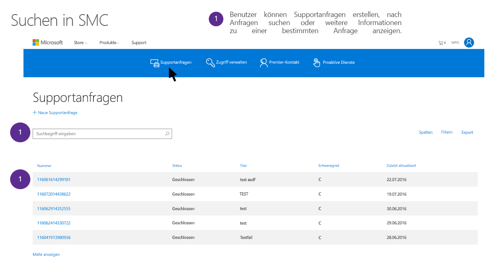

# Microsoft-Support und Professional Services für Datenbetreffsanforderungen für die DSGVO

## Einführung in Microsoft Professional Services

Microsoft Professional Services umfasst eine heterogene Gruppe aus technischen Architekten, Technikern, Beratern und Supportmitarbeitern, die die Mission von Microsoft unterstützen, Kunden zu befähigen, mehr zu tun und mehr zu erreichen. Unser Professional Services-Team umfasst insgesamt mehr als 21.000 Berater, Berater für digitale Angelegenheiten, Premier-Support, Techniker und Vertriebsmitarbeiter in 191 Ländern, die 46 unterschiedliche Sprachen sprechen, mehrere Millionen Engagements pro Monat absolvieren und vor Ort oder über Telefon, Internet, Community und automatisierte Tools mit Kunden und Partnern interagieren. Die Organisation liefert umfangreiche Kenntnisse über das gesamte Spektrum des Microsoft-Portfolios hinweg, wofür ein weites Partnernetzwerk, technische Communities, Tools, Diagnosen und Kanäle genutzt werden, die uns mit unseren Unternehmenskunden verbinden.

Weitere Informationen zu Microsoft Professional Services erhalten Sie im Abschnitt zu Microsoft Professional Services im Microsoft Trust Center (<https://www.microsoft.com/trustcenter/professional-services>). Microsoft Professional Services nimmt seine Verpflichtungen im Rahmen der Datenschutz-Grundverordnung (DSGVO) ernst. Die Informationen in diesem Dokument dienen zur Beantwortung von Kundenfragen, wie die Support- und Beratungsangebote von Microsoft den Data Subject Request(DSR)-Verpflichtungen im Rahmen der DSGVO gerecht werden und Kunden in dieser Hinsicht unterstützen.

### Einführung in die möglichen Anträge betroffener Personen 

Die DSGVO gewährt Personen (die in den Bestimmungen als *betroffene Personen* bezeichnet werden) Berechtigungen zum Verwalten der personenbezogenen Daten, die von einem Arbeitgeber oder von einer anderen Art von Behörde oder Organisation (als *Data Controller* oder nur *Controller* bezeichnet) erfasst werden. Personenbezogene Daten sind im Rahmen der DSGVO sehr weitgefasst als Daten definiert, die sich auf eine identifizierte oder identifizierbare natürliche Person beziehen. Die DSGVO erteilt betroffenen Personen bestimmte Rechte für ihre personenbezogenen Daten; dazu gehören das Kopieren der Daten, das Anfordern von Änderungen, das Einschränken der Verarbeitung und das Löschen. Eine formale Anforderung von einer betroffenen Person an einen Controller im Hinblick auf eine bestimmte Aktion für deren persönliche Daten wird als *Antrag einer betroffenen Person* bezeichnet. Zudem werden Unternehmen, die für einen Controller arbeiten (als *Datenverarbeiter* oder nur *Verarbeiter*) bezeichnet), verpflichtet, den Controller ernsthaft bei der Erfüllung von Anträgen betroffener Personen zu unterstützen.

In diesem Leitfaden wird erläutert, wie Sie personenbezogene Daten, die sich in IT-Systemen von Microsoft befinden und zwecks Bereitstellung von Support- und anderen Professional Services-Angeboten erfasst worden sein können, finden, aufrufen und auf diese reagieren.

Im Hinblick auf die Entwicklung einer Reaktion auf Anträge betroffener Personen müssen die Kunden von Microsoft verstehen, dass Support- oder Beratungsdaten getrennt von Kundendaten in den Onlinediensten oder anderen Daten, die sie oder betroffene Personen an Microsoft übermittelt haben, gespeichert werden. Tools und Prozesse, die für Onlinedienste, das Microsoft-Datenschutzdashboard oder andere Microsoft-Systeme für die Reaktion auf Anträge betroffener Personen bereitgestellt wurden, können nicht für die Reaktion auf Anträge betroffener Personen bezüglich personenbezogener Daten verwendet werden, die im Besitz von Microsoft-Support oder Professional Services sind.

Sämtliche Anträge müssen wie nachfolgend beschrieben über einen Supportmitarbeiter erfolgen. Es gibt derzeit kein Tool, mit dem Kunden Zugriff auf personenbezogene Daten in den Professional Services-Organisationen erhalten könnten.

#### Übersicht über die in diesem Leitfaden beschriebenen Prozesse

  ***Ermittlung. *** Persönliche Daten ermitteln, die Gegenstand eines Antrags einer betroffenen Person sein können. Führen Sie nach der Erfassung von potenziell geeigneten Materialien eine oder mehrere der Aktionen für Anträge betroffener Personen durch, die in den folgenden Schritten beschrieben sind, um auf den Antrag der betroffenen Person zu reagieren. Andernfalls bestimmen Sie, dass der Antrag nicht den Organisationsrichtlinien für die Reaktion auf Anträge betroffener Personen entspricht.

  ***Zugriff. *** Rufen Sie personenbezogene Daten auf, die sich in der Microsoft-Cloud befinden, und stellen Sie eine Kopie für die betroffene Person bereit, sofern dies beantragt wurde.

  ***Berichtigung. *** Nehmen Sie Änderungen oder sonstige beantragte Aktionen an den personenbezogenen Daten vor.

  ***Einschränkung. *** Schränken Sie die Verarbeitung personenbezogener Daten ein, indem Sie die Aktivitäten an einem Engagement einstellen.

  ***Löschung. *** Entfernen Sie personenbezogene Daten, die sich in IT-Systemen von Microsoft befinden, dauerhaft.

  ***Export. *** Stellen Sie dem Kunden oder der betroffenen Person eine Kopie der personenbezogenen Daten bereit.
 

### Begrifflichkeiten

Nachstehend sind die für diesen Leitfaden relevanten Definitionen von Ausdrücken aus der DSGVO aufgeführt:

-   **Controller. ** Eine natürliche oder juristische Person, öffentliche Behörde, Agentur oder andere Stelle, die allein oder gemeinsam mit anderen die Zwecke und Mittel der Verarbeitung personenbezogener Daten bestimmt. Sofern die Zwecke und Mittel der Verarbeitung durch das Recht der Union oder der Mitgliedstaaten bestimmt werden, können der Controller bzw. die spezifischen Kriterien für dessen Benennung durch das Recht der Union oder des Mitgliedstaats angegeben werden.

-   **Personenbezogene Daten und betroffene Person.** Alle Informationen über eine identifizierte oder identifizierbare natürliche Person ("betroffene Person"). Eine identifizierbare natürliche Person ist eine Person, die direkt oder indirekt, insbesondere durch Zuordnung zu einer Kennung wie einem Namen, zu einer Kennnummer, zu Standortdaten, zu einer Online-Kennung oder zu einem oder mehreren besonderen Merkmalen identifiziert werden kann, die Ausdruck der physischen, physiologischen, genetischen, psychischen, wirtschaftlichen, kulturellen oder sozialen Identität dieser natürlichen Person sind.

-   **Verarbeiter. ** Eine natürliche oder juristische Person, öffentliche Behörde, Agentur oder andere Stelle, die personenbezogene Daten im Auftrag des Controllers verarbeitet.

#### Zusätzliche Begriffe und Definitionen, die möglicherweise hilfreich für das Verständnis dieses Leitfadens sind

-   **Support- und Beratungsdaten** sind alle Daten, einschließlich Text, Ton, Video, Bilddateien und Software, die Microsoft durch den Kunden oder in dessen Namen durch ein Engagement mit Microsoft übermittelt werden (oder deren Abruf über einen Onlinedienst Microsoft vom Kunden genehmigt wird), um Support oder Professional Services zu erhalten. Dies beinhaltet keine erfassten Daten, für die Microsoft der Daten-Controller ist, einschließlich Kontaktdaten des Kunden.

-   **Kundenkontakt** sind personenbezogene Daten, die möglicherweise Teil Ihrer Geschäftsbeziehungen mit Microsoft sind, z. B. personenbezogene Daten, die in Ihren Kundenkontaktinformationen enthalten sind. Dies kann Ihr Name, E-Mail-Adresse oder Telefonnummer des Premier-Contract-Service-Managers (CSM), des globalen Administrators oder IT-Administrators für einen Online-Dienst oder eine ähnliche Rolle sein.

-   **Pseudonymisierte Daten** Wenn Sie den Microsoft-Support für Enterprise-Produkte und -Dienste von Microsoft verwenden, generiert Microsoft Informationen, die mit einem numerischen Bezeichner von Microsoft verknüpft sind, um den Support bereitzustellen. Dies wird oft als "Pseudonymisierte Daten" bezeichnet. Zwar können diese Daten ohne zusätzliche Informationen keiner spezifischen Person zugeordnet werden, jedoch fallen einige unter die weite Definition personenbezogener Daten gemäß der DSGVO. Innerhalb von Professional Services umfassen Anträge zur Erfüllung oder Unterstützung bei der Erfüllung von Anträgen betroffener Personen immer automatisch auch die Behandlung pseudonymisierter Daten.

### Verwenden dieses Leitfadens

Dieser Leitfaden behandelt vier Szenarien, auf die ein Kunde stoßen kann, wenn er Microsoft Professional Services genutzt hat.

- **Antrag einer betroffenen Person für einen Kundenkontakt gegenüber Microsoft**

Erklärung dazu, wie Microsoft auf Anträge eines Kundenkontakts oder IT-Administrators zur Ausübung deren Rechte reagiert.

- **Antrag einer betroffenen Person für einen Endbenutzer gegenüber Microsoft**

Erklärung dazu, wie Microsoft auf Anträge eines Mitarbeiters des Kunden oder einer anderen betroffenen Person zur Ausübung deren Rechte reagiert.

- **Antrag einer betroffenen Person für vom Kunden bereitgestellte Daten: Kommerzieller Support**

Erläuterung dazu, wie Unterstützung von Microsoft angefordert wird, wenn ein Kunde einen Antrag von einem Mitarbeiter oder einer anderen betroffenen Person zur Ausübung deren Rechte erhalten hat, wobei die personenbezogenen Daten dieser betroffenen Person während eines Support-Engagements vom Microsoft-Support erfasst wurden.

- **Antrag einer betroffenen Person für vom Kunden bereitgestellte Daten: Beratungsdienste einschließlich FastTrack-Migrationsdiensten** 

Erläuterung dazu, wie Unterstützung von Microsoft angefordert wird wenn ein Kunde einen Antrag von einem Mitarbeiter oder einer anderen betroffenen Person zur Ausübung deren Rechte erhalten hat, wobei die personenbezogenen Daten dieser betroffenen Person während eines Beratungs-Engagements von Microsoft erfasst wurden.

## Antrag einer betroffenen Person für einen Kundenkontakt gegenüber Microsoft

*Wie Microsoft auf Anträge eines Kundenkontakts oder IT-Administrators zur Ausübung deren Rechte reagiert.*

Wenn ein Kunde Support-oder Beratungsdienste von Microsoft anfordert, erfasst der Microsoft-Support automatisch die personenbezogenen Daten des Kundenkontakts (z. B. Premier-CSM, globaler Administrator, IT-Administrator) oder ruft diese aus Firmendatensätzen ab. Dies umfasst wahrscheinlich den Namen, die E-Mail-Adresse, die Telefonnummer und andere personenbezogene Daten der Person, die die Support- oder Beratungsdienste anfordert.

Die personenbezogenen Daten des Kundenkontakts sind Teil der Geschäftsbeziehung von Microsoft mit dem Kunden, und Microsoft ist der Daten-Controller. Microsoft reagiert auf Anträge betroffener Personen seitens des Kundenkontakts im Hinblick auf personenbezogene Daten, unabhängig davon, ob sie sich immer noch im Besitz der Organisation befinden.

Kunden müssen wissen, dass sich Anträge betroffener Personen nur auf die personenbezogenen Daten des Kundenkontakts beziehen und keine Änderungen oder Löschungen an Daten des Kunden vorgenommen werden, die im Rahmen des Engagements übermittelt wurden (z. B. Transkripte, Fallbeschreibungen, Dateien, Arbeitsergebnis), da Microsoft der Datenverarbeiter ist. Zudem werden zur Beibehaltung historischer Datensätze des Engagements keinerlei Änderungen an geschlossenen Engagements vorgenommen, einschließlich des Datensatzes desjenigen, der das Engagement eröffnet hat.

Bei Eingang einer Anfrage eines Kundenkontakts zu einem Antrag einer betroffenen Person, leiten Microsoft-Mitarbeiter den Kundenkontakt zum [Datenschutz-Support von Microsoft](http://go.microsoft.com/fwlink/?LinkId=321116) weiter. Dies ist der primäre Eingabemechanismus von Microsoft für Anfragen und Beschwerden im Bereich des Datenschutzes. Bei Eingang einer Anfrage identifiziert das Datenschutzteam von Microsoft, dass diese Teil eines kommerziellen oder Organisationskontos ist, und reagiert entsprechend.

Damit der Kunde seinen Betrieb fortsetzen kann, bearbeitet Microsoft Anträge betroffener Personen in Verbindung mit einem Engagement erst dann, wenn ein Ersatzkontakt bestätigt wurde. Nach Bestätigung eines neuen Kontakts tauscht Microsoft den alten Kontakt in offenen Engagements durch den neuen Kontakt aus.

Kunden können wählen, Änderungen an ihren während Professional Service-Engagements erfassten Daten über normale Support- oder Beratungskanäle separat von diesem Antrag einer betroffenen Person vorzunehmen. Microsoft kann z. B. auf Anfrage beim Löschen von Support-Engagements helfen (siehe unten im Abschnitt *Leitfaden zu Anträgen betroffener Personen für von Kunden bereitgestellte Daten*).

***Beispiel nur zur Veranschaulichung***

John ist IT-Admin für einen Office 365-Enterprise-Kunden mit einem offenen Support-Engagement und zwei geschlossenen Engagements. Jetzt verlässt John das Unternehmen und möchte, dass seine Daten gelöscht werden. John wendet sich an den PRC, der ihn als IT-Admin identifiziert. John wird informiert, dass sein Name nicht aus den früheren (geschlossenen) Engagements oder Daten in dem offenen Engagement gelöscht werden kann. Der PRC kann John jedoch als Kontakt für das aktuell offene Ticket ersetzen, sofern er einen Ersatzkontakt benennt. John teilt Microsoft mit, dass Jane sein Ersatzkontakt sein wird, woraufhin Microsoft die Änderung in allen Support-Systemen vornimmt.

## Antrag einer betroffenen Person für einen Endbenutzer gegenüber Microsoft

*Wie Microsoft auf Anträge eines Mitarbeiters des Kunden oder einer anderen betroffenen Person zur Ausübung deren Rechte reagiert.*

Wenn sich ein Mitarbeiter des Kunden oder eine andere betroffene Person an Microsoft wendet, um ihre Rechte bezüglich Daten geltend zu machen, die Microsoft als Datenverarbeiter erfasst hat, wird die betroffene Person informiert, dass sie den Kunden von Microsoft als Daten-Controller kontaktieren muss, um diese Rechte auszuüben. Microsoft wird keine weiteren Maßnahmen ergreifen.

Wenn die betroffene Person Microsoft auch bezüglich der Ausübung ihrer Rechte für Daten kontaktiert hat, die Microsoft in Situationen erfasst hat, in denen Microsoft der Daten-Controller ist (z. B. Verbrauchersupport, kommerzieller Kundenkontakt), reagiert Microsoft separat auf den Antrag der betroffenen Person für diese personenbezogenen Daten.

***Beispiel nur zur Veranschaulichung***

Jane ist Mitarbeiterin des Enterprise-Kunden Contoso, der ihr ein Dynamics 365-Konto zugewiesen hat. Sie kontaktiert Microsoft, damit all ihre Daten gelöscht werden, und wird an das Privacy Response Center verwiesen. Jane füllt das Antragsformular aus. Das Privacy Response Center identifiziert sie als Enterprise-Endbenutzerin und teilt ihr mit, dass ihre Enterprise-Daten nur über Contoso gelöscht werden können. Sie wird auch als Microsoft X-Box-Benutzerin identifiziert und ihre Daten werden aus ihrem Microsoft-Verbraucherkonto gelöscht.

## Antrag einer betroffenen Person für vom Kunden bereitgestellte Daten: Kommerzieller Support

*Wie ein Kunde, der einen Antrag von einem Mitarbeiter oder einer anderen betroffenen Person zur Ausübung deren Rechte erhalten hat, wobei die personenbezogenen Daten dieser betroffenen Person während eines Support-Engagements vom Microsoft-Support erfasst wurden, Unterstützung von Microsoft anfordern kann.*

Wenn ein Kunde mit dem Microsoft-Support interagiert, erfasst Microsoft Supportdaten des Kunden, um alle Probleme zu beheben, die ein Support-Engagement erforderlich gemacht haben. Diese Supportdaten umfassen die Interaktion von Microsoft mit dem Kunden (z. B. Chat, Telefon, E-Mail, Web-Übermittlung) plus sämtliche Inhaltsdateien, die der Kunde an Microsoft sendet oder die Microsoft mit Erlaubnis des Kunden aus der IT-Umgebung oder dem Onlinedienste-Mandanten des Kunden extrahiert hat, um das Support-Problem zu beheben. Im Falle des Premier-Support umfasst dies auch sämtliche Daten, die wir erfassen, um zukünftige Probleme proaktiv zu verhindern. Davon ausgenommen sind jedoch Kundenkontaktinformationen oder andere Informationen aus der Geschäftsbeziehung zwischen Microsoft und dem Kunden (z. B. Abrechnungsdatensätze).

Für alle Supportdaten ist Microsoft der Datenverarbeiter. Als solcher reagiert Microsoft nicht auf direkte Anträge von betroffenen Personen im Hinblick auf Supportdaten, die übermittelt wurden, als sie mit einem gewerblichen Microsoft-Kunden verknüpft waren. Microsoft unterstützt den Kunden über die normalen Support-Kanäle bei der Reaktion auf Anträge betroffener Personen.

## Schritt 1: Ermittlung

Der erste Schritt beim Anfordern von Unterstützung seitens Microsoft für die Reaktion auf Anträge betroffener Personen ist das Auffinden der personenbezogenen Daten, auf die sich der Antrag bezieht. Dieser erste Schritt – Finden und Prüfen der fraglichen personenbezogenen Daten – hilft einem Kunden dabei, zu bestimmen, ob ein Antrag einer betroffenen Person die Organisationsrichtlinien für Anträge betroffener Personen erfüllt.

Sobald der Kunde die Daten gefunden hat, kann er die entsprechende Aktion ausführen, um auf den Antrag der betroffenen Person zu reagieren. Je nachdem, was der Kunde tun möchte, bestimmt sich, welchen Grad der Ermittlung er anstreben muss.

Wenn Microsoft einen Kunden bei der Reaktion auf einen Antrag einer betroffenen Person unterstützt, handelt es sich um eine Geschäftsfunktion und der Antrag wird über Ihren regulären Support-Kanal gestellt und nicht über einen Antrag an das Datenschutzteam von Microsoft.

Bei der Ermittlung relevanter Daten und Anforderung der Unterstützung von Microsoft hat ein Kunde mehrere Optionen, um den Antrag einer betroffenen Person zu bearbeiten:

*Option A – Microsoft-Support-übergreifende Anträge betroffener Personen, Kunde*. Wenden Sie den Antrag der betroffenen Person auf alle Supportdaten des Kunden in der Support-Umgebung von Microsoft an. Zu diesem Zweck kann ein Kunde Microsoft bitten, den Antrag der betroffenen Person auf alle erfassten Supportdaten anzuwenden.

*Option B – Spezifische Kunden-Engagements. * Nutzen Sie Online-Systeme, um Tickets zu überprüfen, und identifizieren Sie dann spezifische Engagements, die die relevanten personenbezogenen Daten enthalten, und melden Sie sie an Microsoft. Microsoft wird versuchen, bei der Ausführung einer Suche zu unterstützen, falls der Kunde nicht die Möglichkeit hat, Engagement-übergreifend (Ticket-übergreifend) zu suchen.

**Nachdem Engagements identifiziert wurden, fordern Sie an, dass der Antrag der betroffenen Person auf einen spezifischen Teil des Datensatzes oder Microsoft-weit auf alles in Verbindung mit diesem Engagement angewendet wird. **

Um bestimmte Engagements zu identifizieren, müssen Kunden Engagement-übergreifend suchen. Bei Premier-Kunden hat der Contract Service Manager (CSM) für einen Kunden Einblick in alle Supportanfragen, die unter diesem Vertragsplan erstellt werden. Bei Nicht-Premier-Kunden sind entsprechende Portale für den Support im Rahmen von Engagements verfügbar, z. B. über Supportbereiche von Onlinediensten.

Der CSM kann das Portal unter Support.Microsoft.Com ([https://support.microsoft.com/\<local Sprachkürzel\>/premier](https://support.microsoft.com/%3clocal%20language%20code%3e/premier)) (SMC) aufrufen und Supportanfragen auswählen und prüfen. (Hinweis: Ersetzen Sie das Sprachkürzel in der URL durch Ihr lokales Sprachkürzel).

>[**Wichtiger Hinweis bezüglich DTM**] Neben der Fallhistorie in SMC haben Kunden möglicherweise auch personenbezogene Daten eines Endbenutzers in Dateien, die während eines Support-Engagements von Microsoft erfasst wurden (oder mit Erlaubnis des Kunden aus dem Onlinedienst entnommen wurden). Beispiele umfassen Kopien der Exchange-Postfächer des Kunden, Azure-VMs oder Datenbanken. Diese personenbezogenen Daten können in der Fallhistorie (d. h. Ticket) für ein bestimmtes Engagement erwähnt werden. Um diese Daten zu überprüfen, muss der Kundenkontakt ein spezifischer authentifizierter (über AAD oder MSA) Supportanfragenkontakt sein, der eine URL für einen Arbeitsbereich im Data Transfer and Management Tool (DTM) des Microsoft-Supports erhalten hat. Ein Kundenkontakt hat Zugriff auf die Dateien, jedoch ist keine globale Ansicht verfügbar, und SMC wird nicht anzeigen, ob Dateien vorhanden sind.

Nachdem Kunden alle relevanten Daten in den ausgewählten Supporttickets identifiziert haben, können Kunden entscheiden, ob Sie die Löschung von allen Elementen im Zusammenhang mit einem Ticket anfordern oder den Antrag der betroffenen Person selektiv auf einzelne Instanzen personenbezogener Daten anwenden.

## Schritt 2: Zugriff

Nachdem ein Kunde Supportdaten mit personenbezogenen Daten ermittelt hat, die möglicherweise zu einem Antrag einer betroffenen Person passen, muss der Kunde entscheiden, welche personenbezogenen Daten in die Reaktion einbezogen werden. Beispielsweise kann der Kunde entscheiden, personenbezogene Daten zu anderen betroffenen Personen sowie vertrauliche Informationen zu entfernen.

Die Reaktion auf den Antrag der betroffenen Person kann eine Kopie des ursprünglichen Dokuments, eine angemessen bearbeitete Version oder einen Screenshot der Teile enthalten, die der Kunde entschieden hat weiterzugeben. Für jede dieser Reaktionen auf eine Zugriffsanforderung muss der Kunde eine Kopie des Dokuments oder anderen Objekts abrufen, das die entsprechenden Daten enthält.

Zugriff auf die personenbezogenen Daten eines Endnutzers kann aus einer Erwähnung oder Notation in den verschiedenen Typen von Inhaltsdokumentation erfolgen. Da Kunden auf das Ticket des Engagements und die Inhalte zugreifen können, können sie selbst und ohne weitere Unterstützung durch Microsoft eine Zusammenfassung der personenbezogenen Daten bereitstellen.

In seltenen Fällen müssen Kunden Kopien der supportbezogenen Interaktionsdaten (z. B. E-Mails, transkribierte Kopien von Anrufmitschnitten, Chatprotokolle) beschaffen, die zwischen einem Microsoft-Mitarbeiter und dem Vertreter des Kunden ausgetauscht wurden. Soweit erforderlich kann Microsoft bearbeitete Kopien dieser Aufzeichnungen basierend auf Notwendigkeit, Vertraulichkeit und Schwierigkeit bereitstellen.

## Schritt 3: Berichtigung

Wenn eine betroffene Person den Kunden dazu aufgefordert hat, die personenbezogenen Daten zu berichtigen, die sich in den Supportdaten der Organisation befinden, muss der Kunde bestimmen, ob diesem Antrag nachzukommen ist. Wenn der Kunde entscheidet, dem Antrag nachzukommen, kann er Microsoft auffordern, die Änderung vorzunehmen. Microsoft kann die Daten berichtigen oder die Daten des Kunden aus den Supportsystemen löschen und den Kunden auffordern, sie im korrigierten Format erneut an Microsoft zu senden.

## Schritt 4: Einschränkung

Der Kunde kann jederzeit ein Engagement schließen oder Microsoft kontaktieren und das Schließen des Engagements beantragen. Ein geschlossenes Engagement verhindert, dass Arbeiten ausgeführt werden.

Um sicherzugehen kann der Kunde Microsoft kontaktieren und fordern, dass ein Hinweis im Ticketsystem des Engagements vermerkt wird, dass der Fall ohne die Erlaubnis des Kunden nicht erneut geöffnet werden darf.

Hinweis: Engagements (Tickets) werden basierend auf der Vertraulichkeit von Daten, Dienst und System ebenfalls nach einem Zeitplan für die Aufbewahrung und Löschung gelöscht. Wenn der Kunde eine Kopie der Daten fordert, muss sichergestellt werden, dass die Daten vor der Löschung extrahiert wurden.

## Schritt 5: Löschung

Das "Recht auf Löschung" durch das Entfernen personenbezogener Daten aus den Supportdaten einer Organisation ist ein wichtiger Schutz in der DSGVO. Das Entfernen personenbezogener Daten umfasst die Löschung ganzer Engagements, Dokumente oder Dateien oder das Löschen von bestimmten Daten innerhalb eines Engagements, eines Dokuments oder einer Datei.

Nachfolgend finden Sie einige wichtige Dinge über die Funktionsweise der Löschung für den Microsoft-Support, die zu beachten sind, wenn ein Kunde Untersuchungen oder Vorbereitungen für die Löschung personenbezogener Daten als Reaktion auf einen Antrag einer betroffenen Person unternimmt.

Auf alle Daten bei Microsoft wird eine Richtlinie zur Aufbewahrung und Löschung angewendet, die je nach Risiko und anderen Faktoren variiert.

Kunden können die Löschung der personenbezogenen Daten einer betroffenen Person universell für alle Supportsysteme über Ihren TAM oder durch Übermittlung einer Supportanforderung in SMC oder einem gleichwertigen System beantragen. Sie *müssen* darauf hinweisen, dass dies eine Anforderung zur Unterstützung bei einem Antrag einer betroffenen Person gemäß der DSGVO ist.

*Option A – Microsoft-Support-übergreifende Anträge betroffener Personen, Kunde*. Bei einem systemübergreifenden Antrag einer betroffenen Person muss der Kunde die personenbezogenen Daten bereitstellen, die Microsoft zur Identifizierung der erforderlichen Daten benötigt (z. B. E-Mail-Adresse, Telefonnummer). Microsoft wird keine Datensätze korrelieren oder untersuchen, sondern nur direkt nach Bezeichnern suchen, die vom Kunden bereitgestellt wurden. Wenn Daten gefunden werden, löscht Microsoft alle Engagements und alle zugehörigen Daten. **Wichtiger Hinweis:** Dies kann zum Verlust von historischen Datensätzen führen, die wichtig für die Organisation des Kunden sind.

*Option B – Spezifische Kunden-Engagements*. Löschen Sie für bestimmte Engagements, die der Kunde identifiziert hat und löschen möchte, keine Tickets aus SMC. Dies führt dazu, dass personenbezogene Daten in Protokollen und nachgeschalteten Systemen verbleiben, die nicht innerhalb des erforderlichen Zeitrahmens gelöscht werden können. Identifizieren Sie stattdessen das Ticket oder die personenbezogenen Daten innerhalb des Tickets, das gelöscht werden muss, und wenden Sie sich an den Microsoft-Support, damit er sie bei der Löschung dieser Daten unterstützt.

### Anweisungen zum Data Transfer and Management Tool (DTM) des Microsoft-Supports

Bei all diesen Suchen sucht Microsoft aufgrund der potenziellen Vertraulichkeit der Dateiinhalte nicht im gesamten DTM. Wenn der Kunde dies wünscht, löscht Microsoft jedoch alle Dateien im DTM, die dem Konto des Kunden zugeordnet sind. Aufgrund der möglichen schwerwiegenden Auswirkungen für den Kunden benötigt Microsoft eine separate Anforderung vom Kunden für die Löschung von DTM-Dateien.

-   Bei offenen Fällen kann der Kundenkontakt in DTM gehen und Dateien löschen.

-   Bei Fällen, die weniger als 90 Tage lang geschlossen sind, muss ein Antrag an einen TAM oder in einer Supportanforderung gestellt werden, damit die Dateien entfernt werden.

-   Bei Fällen, die mehr als 90 Tage lang geschlossen sind, wurden die Dateien bereits automatisch gelöscht.

-   Auch wenn die personenbezogene Daten nur in einer Datei gespeichert waren, die gelöscht wurde, müssen Kunden trotzdem eine Prüfung durch Microsoft nach den personenbezogenen Daten über alle Systeme vornehmen lassen, da einige Daten im Laufe der Supportleistung möglicherweise aus dem DTM entfernt wurden.

## Schritt 6: Export

Das "Recht auf Datenübertragbarkeit" ermöglicht es einer betroffenen Person, eine Kopie ihrer personenbezogenen Daten in elektronischem Format anzufordern und zu verlangen, dass Ihre Organisation sie an einen anderen Controller überträgt. Im Falle von Supportdaten liegen nutzbare Informationen bei Microsoft in Form von Engagement-Informationen oder Dateien vor, die zwecks erneuter Kommunikation oder Hochladen an einen anderen Controller an Sie zurückgegeben werden können.

Hinweis: Exportierte Daten dürfen kein geistiges Eigentum von Microsoft oder andere Daten enthalten, die die Sicherheit oder Stabilität des Dienstes kompromittieren könnten.

***Beispiel nur zur Veranschaulichung***

John ist ein Premier-CSM für den Enterprise-Kunden Contoso, der Office 365 für den E-Mail-Verkehr seiner Mitarbeiter nutzt und Azure zum Hosten einer Contoso SQL-Datenbank. Contoso verfügt über mehrere offene und geschlossene Tickets. Vor kurzem hat der Microsoft-Support mit Erlaubnis von Contoso eine Kopie der SQL-Datenbank zwecks Support und Problembehandlung in DTM verschoben.

John erhält einen Antrag einer betroffenen Person von Jane, in dem die Löschung all ihrer Daten beantragt wird. John geht in SMC und durchsucht Engagements, um zu identifizieren, dass Jane Probleme mit dem E-Mail-Konto hatte und daher in zwei Tickets nach Name und E-Mail-Adresse erwähnt wurde. Er kontaktiert seinen TAM, teilt ihm den Namen und die E-Mail-Adresse von Jane als Bezeichner mit und beantragt, dass diese beiden Tickets zusammen mit allen Downstream-Daten, die möglicherweise außerhalb dieser Tickets generiert wurden, gelöscht werden.

Er nimmt außerdem an, dass er in ein Chatgespräch mit Supportmitarbeitern involviert war, in dem er Jane erwähnt, weshalb er die Löschung dieses Chatprotokolls fordert.

Er weiß auch, dass sich Janes personenbezogene Daten in der SQL-Datenbank befinden. Da die SQL-VM vor weniger als 90 Tagen in DTM verschoben wurde, bittet er seinen TAM separat um Unterstützung bei der umgehenden Löschung der Datenbank aus DTM.

Und da er weiß, dass Daten während der Supportleistung möglicherweise aus der DTM-Datei entfernt wurden, bittet er Microsoft, alle IT-Systeme auf die personenbezogenen Daten von Jane aus der SQL-Datenbank zu prüfen.

Der Microsoft-Support führt all diese Löschungen durch, und der TAM stellt ihm basierend auf dem Kundenantrag einen Nachweis über die Löschung der erforderlichen Daten bereit.

## DSR-Leitfaden für von Kunden bereitgestellte Daten in Beratungsdiensten, einschließlich Migrationsdiensten

*Wie Unterstützung von Microsoft angefordert wird, wenn ein Kunde einen Antrag von einem Mitarbeiter oder einer anderen betroffenen Person zur Ausübung deren Rechte erhalten hat, wobei die personenbezogenen Daten dieser betroffenen Person während eines Beratungsengagements von Microsoft erfasst wurden.*

## Microsoft-Beratungsdienste

Für Engagements im Hinblick auf Microsoft-Beratungsdienste, für die der Nachtrag zum Datenschutz von Microsoft Professional Services (<http://aka.ms/professionalservicesdpa>) gilt.

Microsoft ist der Daten-Controller für Kundenkontakte, die mit dem Engagement-Team arbeiten. Diese Personen müssen sich an den [Datenschutz-Support von Microsoft](http://go.microsoft.com/fwlink/?LinkId=321116) wenden, um Rechte betroffener Personen zu erfüllen.

Microsoft ist der Datenverarbeiter für einen Antrag einer betroffenen Person innerhalb von Daten, die während eines Beratungs-Engagements übermittelt wurden. Der Kunde muss den Engagement-Manager kontaktieren, um einen Plan für die Unterstützung bei der Reaktion auf Anträge betroffener Personen basierend auf den erfassten Daten und anschließend dem spezifischen Typ der bereitgestellten Beratungsdienste zu erstellen. Soweit Ihr Antrag einen Aufwand darstellt, der innerhalb eines Beratungsdienste-Engagements von Microsoft typisch ist, ist möglicherweise eine zusätzliche Bestellung erforderlich. Darüber hinaus werden personenbezogene Daten nach jedem Beratungs-Engagement innerhalb eines Zeitrahmens gelöscht, der von der Art des Beratungs-Engagements abhängt. Der Kunde kann beantragen, dass Daten eher gelöscht werden, und eine Bescheinigung über die Löschung verlangen.

## Microsoft FastTrack Services

[Microsoft FastTrack](https://na01.safelinks.protection.outlook.com/?url=https%3A%2F%2Ffasttrack.microsoft.com%2Fabout&data=02%7C01%7C%7Cd0521d8739c841df674508d596834585%7C72f988bf86f141af91ab2d7cd011db47%7C1%7C0%7C636580412901207944&sdata=PO5eh56pm9IYk5Y%2Ff%2F31e%2BRVPmrC2Qi%2FCsw1NphR8gY%3D&reserved=0) bietet IT-Beratungsdienstleistungen für Organisationen, um ihnen zu helfen, Microsoft Cloud Services wie Microsoft 365, Azure und Dynamics 365 aufzunehmen und zu verwenden.

Microsoft ist Daten-Controller für Kundenkontakte, die mit dem FastTrack-Team arbeiten. Wenn Kundenkontakte Kontaktinformationen aus den Microsoft FastTrack Datensätzen aufrufen, prüfen oder entfernen möchten, können Kunden die betroffene Person anweisen, den Antrag direkt an das Office 365 FastTrack-Postfach für Anträge gemäß der DSGVO zu senden\<<o365ftgdpr@microsoft.com>\>.

Für FastTrack-Migrationsdienste ist Microsoft der Datenverarbeiter. In Übereinstimmung mit unserer zusätzlichen Datenschutzerklärung für Fast Track gelten alle Daten, die migriert werden, als „Migrationsdaten“. Wenn Sie DSRs ausführen müssen, während Ihr Unternehmen ein FastTrack-Migrationsprojekt durchführt, ist besondere Vorsicht geboten.
  
Wenn Sie Datenbetreffsanforderungen zum Zugriff, zur Korrektur oder zum Export verarbeiten müssen, während die Daten eines Benutzers in FastTrack-Migrationssystemen verarbeitet werden, liegt es in der Verantwortung des Kunden, diese DSRs mittels vorhandener Quellsysteme, in denen die Benutzerdaten gespeichert sind, zu erfüllen. Sobald die Migration des Benutzers abgeschlossen ist und die Daten in den Ziel-Clouddienst von Microsoft migriert wurden, gelten die von Microsoft bereitgestellten Richtlinien zur Nutzung von Microsoft-Produkten, -Diensten und -Verwaltungstools durch Benutzer zum Suchen nach personenbezogenen Daten und Ergreifen von Aktionen dafür, um solche DSRs zu erfüllen. Sie finden diese Richtlinien unter [Datenbetreffsanforderungen für die DSGVO](https://docs.microsoft.com/microsoft-365/compliance/gdpr-data-subject-requests). 

Wenn Sie ein Office 365-Benutzerkonto als Reaktion auf eine Löschungsanforderung im Rahmen einer Datenbetreffsanforderung löschen müssen, während Ihr Unternehmen in ein laufendes FastTrack-Migrationsprojekt involviert ist, müssen Sie sich bewusst sein, dass Migrationssysteme möglicherweise eine Kopie der Benutzermigrationsdaten für einen bestimmten Zeitraum nach Abschluss der Benutzermigration beibehalten. Durch die Löschung des Office 365-Benutzerkontos werden solche in den FastTrack-Migrationssystemen gespeicherten Benutzermigrationsdaten nicht automatisch gelöscht. Wenn Sie möchten, dass das Microsoft FastTrack-Team Benutzermigrationsdaten löscht, können Sie eine [Anfrage senden](https://go.microsoft.com/fwlink/?linkid=874544). Im normalen Geschäftsablauf löscht Microsoft FastTrack alle Kopien der Daten, sobald die Migration des Unternehmens abgeschlossen ist.

## Sonstige Beratungsdienste

Kunden, die andere Professional Services über Microsoft erhalten, sollten das Engagement-Team durcharbeiten, um alle DSGVO-Anforderungen zu erfüllen. Wenn das Engagement-Team keine klaren Anweisungen zur Erfüllung von Anträgen betroffener Personen gemäß der DSGVO geben kann, können Kunden den [Datenschutz-Support von Microsoft](http://go.microsoft.com/fwlink/?LinkId=321116) um Unterstützung bitten.
