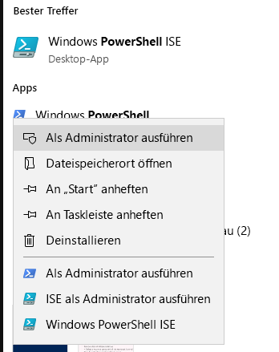
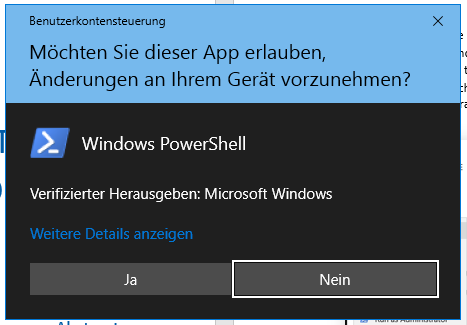
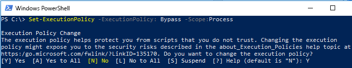

# FastTrack-Migrationstoolset zum Übermitteln von LöschanforderungenFastTrack Migration Toolset for Submitting Delete Request

## Zweck des ToolsetsToolset purpose

Für den Fall, dass Sie als Kunde derzeit an FastTrack-Migrationen beteiligt sind, wird durch das Löschen des Office 365-Benutzerkontos nicht die Datenkopie im Besitz des Microsoft FastTrack-Teams gelöscht, die ausschließlich für das Abschließen der Migration beibehalten wird. Wenn Sie möchten dass das Microsoft FastTrack-Team während der Migration auch die Datenkopie löscht, übermitteln Sie eine diesbezügliche Anforderung über dieses Toolset. Im normalen Geschäftsverlauf löscht Microsoft FastTrack alle Datenkopien, sobald die Migration abgeschlossen ist.In the event that you are a customer currently engaged in FastTrack migrations, deleting the Office 365 user account will not delete the data copy held by the Microsoft FastTrack team, which is held for the sole purpose of completing the migration. If, during the migration, you would like the Microsoft FastTrack team to also delete the data copy, submit a request via this toolset. In the ordinary course of business, Microsoft FastTrack will delete all data copies once the migration is complete. 

### Unterstützte PlattformenSupported platforms
Microsoft unterstützt die erste Version dieses Toolsets auf der Windows-Plattform und der PowerShell-Konsole. Die folgenden bekannten Plattformen werden von diesem Toolset unterstützt:Microsoft supports the initial release of this  toolset in the Windows platform and PowerShell console. The following known platforms are supported by this toolset:
 
***Tabelle 1 – Von diesem Toolset unterstützte Plattformen******Table 1 - Platforms supported by this toolset***
 
<!--start table here HEADER -->
 
|||||||
|:-----|:-----|:-----|:-----|:-----|:-----|
| |**Windows 7****Windows 7**|**Windows 8****Windows 8**|**Windows 10****Windows 10**|**Windows Server 2012****Windows Server 2012**|**Windows Server 2016****Windows Server 2016**|
|PS 5.0PS 5.0|NichtNot UnterstütztSupported|UnterstütztSupported|UnterstütztSupported|UnterstütztSupported|UnterstütztSupported|
|PS 5.1PS 5.1|NichtNot UnterstütztSupported|UnterstütztSupported|UnterstütztSupported|UnterstütztSupported|UnterstütztSupported|
|||
 
<!-- end of table -->

### Abrufen des ToolsetsObtaining the toolset

Dieses Toolset ist im PowerShell-Katalog in der PowerShell-Konsolenanwendung verfügbar. Zum Suchen und Laden dieses Cmdlet-Moduls öffnen Sie zunächst PowerShell im Administratormodus, damit die erforderlichen Berechtigungen zum Installieren des Moduls vorhanden sind. Wenn Sie PowerShell zum ersten Mal verwenden, geben Sie auf der Windows-Taskleiste im Suchfeld „PowerShell“ ein. Wählen Sie die Konsole mit einem Rechtsklick aus, wählen Sie **als Administrator ausführen**, und klicken Sie dann auf **Ja**, um Windows PowerShell auszuführen.This toolset is available in the PowerShell Gallery on the PowerShell console application.  To locate and load this cmdlet module, first open PowerShell in administrator mode so it has the appropriate permissions to install the module. If you have not used PowerShell previously go to your Windows Task Bar and in the search box type “PowerShell”. Select the console app using right-click and choose **Run as administrator**, then click **Yes** to run Windows PowerShell.

Nachdem die Konsole geöffnet wurde, müssen Sie Berechtigungen für die Skriptausführung festlegen. Geben Sie den folgenden Befehl ein, um die Ausführung der Skripts zuzulassen: „Set-ExecutionPolicy – ExecutionPolicy: Bypass – Scope:Process“Now that the console is open, you need to set permissions for script execution. Type the following command to allow the scripts to run: ‘Set-ExecutionPolicy – ExecutionPolicy: Bypass – Scope:Process’

Sie werden aufgefordert, diese Aktion zu bestätigen, da der Administrator den Bereich nach eigenem Ermessen ändern kann...You will be prompted to confirm this action, as the administrator can change the scope at their discretion..

***Festlegen der Ausführungsrichtlinie******Set Execution Policy***

Da die Konsole nun so eingerichtet ist, dass die Skriptausführung zulässig ist, führen Sie diesen Befehl aus, um das Modul zu installieren:Now that the console is set to allow the script,  run this next command to install the module:

>`Install-Module -Name Microsoft.FastTrack ` -Repository PSGallery \``Install-Module -Name Microsoft.FastTrack ` -Repository PSGallery \`
>        
>               -WarningAction: SilentlyContinue `
>               -Force’

### Voraussetzungen für ModulPrerequisites for module
Zur erfolgreichen Ausführung dieses Moduls müssen Sie u.U. abhängige Module für die Verwendung installieren, falls diese nicht bereits installiert sind. Möglicherweise müssen Sie PowerShell neu starten.To successfully execute this module, you may need to install dependent modules for use if they are not already installed. You may need to restart PowerShell.  

Zum Übermitteln einer Datensubjektanforderung müssen Sie sich zuerst mithilfe Ihrer Anmeldeinformationen für Office 365 anmelden – durch Eingabe der richtigen Anmeldeinformationen wird Ihr Status als globaler Administrator überprüft, und Mandanteninformationen werden erfasst.In order to submit a DSR, you must first login using your Office 365 credentials – entering the proper credentials will validate your global administrator status and collect tenant information. 

**Login-FastTrackAccount -ApiKey: \<Vom FastTrack-MVM bereitgestellter API-Schlüssel\>****Login-FastTrackAccount -ApiKey: \<API Key provided by FastTrack MVM\>**

Nach der erfolgreichen Anmeldung werden die Anmeldeinformationen und der Schlüssel zur Verwendung mit FastTrack-Modulen für den Rest der aktuellen PowerShell-Sitzung gespeichert.Once successfully logged in, the credentials and key will be stored for use with FastTrack modules for the remainder of the current PowerShell session.

Wenn Sie eine Verbindung mit einer Cloudumgebung für andere als kommerzielle Zwecke herstellen müssen, muss dem *Login*-Befehl *-Environment* mit einer der folgenden gültigen Umgebungen hinzugefügt werden:If you need to connect to a cloud environment, other than commercial, *-Environment* will needed to be added to *Login* command with one of the following valid environments:
- AzureCloudAzureCloud
- AzureChinaCloudAzureChinaCloud
- AzureGermanCloudAzureGermanCloud
- AzureUSGovernmentCloudAzureUSGovernmentCloud

**Login-FastTrackAcccount -ApiKey\ <API Key provided by FastTrack MVM> -Environment: <Cloudumgebung\>****Login-FastTrackAcccount -ApiKey\ <API Key provided by FastTrack MVM> -Environment: <cloud environment\>**

Führen Sie den folgenden Befehl aus, um eine Anforderung betroffener Personen zu übermitteln: Submit-FastTrackGdprDsrRequest -DsrRequestUserEmail: SubjectUserEmail@mycompany.comTo submit a DSR request, run the following command: Submit-FastTrackGdprDsrRequest -DsrRequestUserEmail: SubjectUserEmail@mycompany.com

Bei Erfolg gibt das Cmdlet ein Transaktions-ID-Objekt zurück. Bewahren Sie die Transaktions-ID auf.On success – the cmdlet will return a Transaction ID object. Please retain the Transaction ID.

#### Überprüfen des Status einer AnforderungstransaktionChecking the status of a request transaction

Führen Sie die folgende Funktion mit der zuvor ermittelten Transaktions-ID aus: Get-FastTrackGdprDsrRequest -TransactionID: “IhreTransaktionsID”Run the following function using the previously obtained Transaction ID: Get-FastTrackGdprDsrRequest -TransactionID: “YourTransactionID”

#### TransaktionstatuscodesTransaction Status Codes
<!--start table here no header -->

|||
|:-----|:-----|:-----|
|**Transaktion****Transaction** |**Status****Status**|
|**Erstellt****Created** |Anforderung wurde erstellt.Request has been created|
|**Fehlgeschlagen****Failed**|Fehler beim Erstellen der Anforderung. Übermitteln Sie sie erneut, oder wenden Sie sich an den Support.Request failed to create, please resubmit, or contact support|
|**Abgeschlossen****Completed**|Anforderung wurde abgeschlossen und bereinigtRequest has been completed and sanitized|
|||

<!-- end of table -->

<!-- original version: **Created**  Request has been created **Failed** Request failed to create, please resubmit, or contact support **Completed** Request has been completed and sanitized -->

## Weitere InformationenLearn more
[Microsoft Trust CenterMicrosoft Trust Center](https://www.microsoft.com/TrustCenter/Privacy/gdpr/default.aspx)