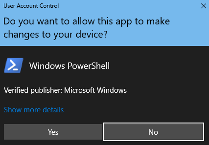

# FastTrack-Migrationstoolset zum Übermitteln von Löschanforderungen

## Zweck des Toolsets

Für den Fall, dass Sie als Kunde derzeit an FastTrack-Migrationen beteiligt sind, wird durch das Löschen des Office 365-Benutzerkontos nicht die Datenkopie im Besitz des Microsoft FastTrack-Teams gelöscht, die ausschließlich für das Abschließen der Migration beibehalten wird. Wenn Sie möchten dass das Microsoft FastTrack-Team während der Migration auch die Datenkopie löscht, übermitteln Sie eine diesbezügliche Anforderung über dieses Toolset. Im normalen Geschäftsverlauf löscht Microsoft FastTrack alle Datenkopien, sobald die Migration abgeschlossen ist.

### Unterstützte Plattformen
Microsoft unterstützt die erste Version dieses Toolsets auf der Windows-Plattform und der PowerShell-Konsole. Die folgenden bekannten Plattformen werden von diesem Toolset unterstützt:
 
***Tabelle 1 – Von diesem Toolset unterstützte Plattformen***
 
<!--start table here HEADER -->
 
|||||||
|:-----|:-----|:-----|:-----|:-----|:-----|
| |**Windows 7**|**Windows 8**|**Windows 10**|**Windows Server 2012**|**Windows Server 2016**|
|PS 5.0|Nicht Unterstützt|Unterstützt|Unterstützt|Unterstützt|Unterstützt|
|PS 5.1|Nicht Unterstützt|Unterstützt|Unterstützt|Unterstützt|Unterstützt|
|||
 
<!-- end of table -->

### Abrufen des Toolsets

Dieses Toolset ist im PowerShell-Katalog in der PowerShell-Konsolenanwendung verfügbar. Zum Suchen und Laden dieses Cmdlet-Moduls öffnen Sie zunächst PowerShell im Administratormodus, damit die erforderlichen Berechtigungen zum Installieren des Moduls vorhanden sind. Wenn Sie PowerShell zum ersten Mal verwenden, geben Sie auf der Windows-Taskleiste im Suchfeld „PowerShell“ ein. Wählen Sie die Konsole mit einem Rechtsklick aus, wählen Sie **als Administrator ausführen**, und klicken Sie dann auf **Ja**, um Windows PowerShell auszuführen.

Nachdem die Konsole geöffnet wurde, müssen Sie Berechtigungen für die Skriptausführung festlegen. Geben Sie den folgenden Befehl ein, um die Ausführung der Skripts zuzulassen: „Set-ExecutionPolicy – ExecutionPolicy: Bypass – Scope: Process“

Sie werden aufgefordert, diese Aktion zu bestätigen, da der Administrator den Bereich nach eigenem Ermessen ändern kann.

***Festlegen der Ausführungsrichtlinie***

Da die Konsole nun so eingerichtet ist, dass die Skriptausführung zulässig ist, führen Sie diesen Befehl aus, um das Modul zu installieren:

>`Install-Module -Name Microsoft.FastTrack ` -Repository PSGallery `
>        
>               -WarningAction: SilentlyContinue `
>               -Force’

### Voraussetzungen für Modul
Zur erfolgreichen Ausführung dieses Moduls müssen Sie u.U. abhängige Module für die Verwendung installieren, falls diese nicht bereits installiert sind. Möglicherweise müssen Sie PowerShell neu starten.  

Zum Übermitteln einer Datensubjektanforderung müssen Sie sich zuerst mithilfe Ihrer Anmeldeinformationen für Office 365 anmelden – durch Eingabe der richtigen Anmeldeinformationen wird Ihr Status als globaler Administrator überprüft, und Mandanteninformationen werden erfasst. 

**Login-FastTrackAccount -ApiKey: \<Vom FastTrack-MVM bereitgestellter API-Schlüssel\>**

Nach der erfolgreichen Anmeldung werden die Anmeldeinformationen und der Schlüssel zur Verwendung mit FastTrack-Modulen für den Rest der aktuellen PowerShell-Sitzung gespeichert.

Wenn Sie eine Verbindung mit einer Cloudumgebung für andere als kommerzielle Zwecke herstellen müssen, muss dem *Login*-Befehl *-Environment* mit einer der folgenden gültigen Umgebungen hinzugefügt werden:
- AzureCloud
- AzureChinaCloud
- AzureGermanCloud
- AzureUSGovernmentCloud

**Login-FastTrackAcccount -ApiKey\ <API Key provided by FastTrack MVM> -Environment: <Cloudumgebung\>**

Führen Sie den folgenden Befehl aus, um eine Anforderung betroffener Personen zu übermitteln: Submit-FastTrackGdprDsrRequest -DsrRequestUserEmail: SubjectUserEmail@mycompany.com

Bei Erfolg gibt das Cmdlet ein Transaktions-ID-Objekt zurück. Bewahren Sie die Transaktions-ID auf.

#### Überprüfen des Status einer Anforderungstransaktion

Führen Sie die folgende Funktion mit der zuvor ermittelten Transaktions-ID aus: Get-FastTrackGdprDsrRequest -TransactionID: “IhreTransaktionsID”

#### Transaktionstatuscodes
<!--start table here no header -->

|||
|:-----|:-----|:-----|
|**Transaktion** |**Status**|
|**Erstellt** |Anforderung wurde erstellt.|
|**Fehlgeschlagen**|Fehler beim Erstellen der Anforderung. Übermitteln Sie sie erneut, oder wenden Sie sich an den Support.|
|**Abgeschlossen**|Anforderung wurde abgeschlossen und bereinigt|
|||

<!-- end of table -->

<!-- original version: **Created**  Request has been created **Failed** Request failed to create, please resubmit, or contact support **Completed** Request has been completed and sanitized -->

## Weitere Informationen
[Microsoft Trust Center](https://www.microsoft.com/TrustCenter/Privacy/gdpr/default.aspx)
