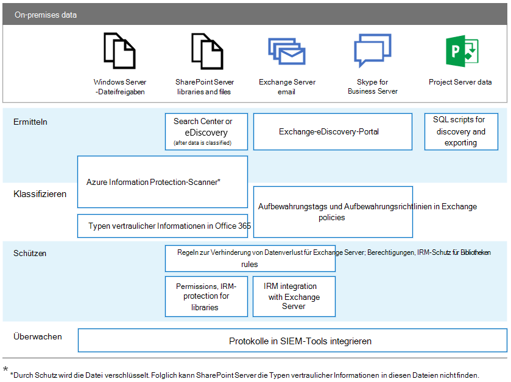

# DSGVO für lokale Office-ServerGDPR for Office on-premises Servers

Im Rahmen der Datenschutz-Grundverordnung (DSGVO) werden Anforderungen für Unternehmen zum Schutz personenbezogener Daten und zur angemessenen Reaktion auf Datensubjektanforderungen eingeführt. Diese Artikelreihe bietet empfohlene Ansätze für lokale Workloads:The General Data Protection Regulation (GDPR) introduces requirements for organizations to protect personal data and respond appropriately to data subject requests. This series of articles provides recommended approaches for on-premises workloads:

- [SharePoint ServerSharePoint Server](gdpr-for-sharepoint-server.md)

- [Exchange ServerExchange Server](gdpr-for-exchange-server.md)

- [Skype for Business ServerSkype for Business Server](gdpr-for-skype-for-business-server.md)

- [Project ServerProject Server](gdpr-for-project-server.md)

- [Office Web Apps Server und Office Online ServerOffice Web Apps Server and Office Online Server](gdpr-for-office-online-server.md)

- [Lokale DateifreigabenOn-premises file shares](gdpr-for-on-premises-file-shares.md)

Weitere Informationen zu der DSGVO und dazu, wie Microsoft Ihnen helfen kann, finden Sie im [Microsoft Trust Center](https://www.microsoft.com/trust-center/privacy/gdpr-overview
).For more information about the GDPR and how Microsoft can help you, see the [Microsoft Trust Center](https://www.microsoft.com/trust-center/privacy/gdpr-overview
).

Vor der Arbeit mit lokalen Daten wenden Sie sich an die Teams Ihrer Rechts- und Compliance-Abteilung, um Hilfestellung und Informationen zu vorhandenen Klassifizierungsschemata und Ansätzen für die Arbeit mit personenbezogenen Daten zu erhalten. Microsoft bietet Empfehlungen für die Entwicklung und Erweiterung von Klassifizierungsschemata im DSGVO-bezogenen Data Discovery Toolkit von Microsoft unter [ https://aka.ms/gdprpartners ](<https://aka.ms/gdprpartners>). In diesem Toolkit werden auch Vorgehensweisen beschrieben, mit denen Sie lokale Daten in die Cloud verschieben können, wo Sie bei Bedarf komplexere Daten-Governance-Funktionen verwenden können. In den Artikeln in diesem Abschnitt werden Empfehlungen für Daten gegeben, die lokal gespeichert bleiben sollen.Before doing any work with on-premises data, consult with your legal and compliance teams to seek guidance and to learn about existing classification schemas and approaches to working with personal data. Microsoft provides recommendations for developing and extending classifications schemas in the Microsoft GDPR Data Discovery Toolkit at [https://aka.ms/gdprpartners](<https://aka.ms/gdprpartners>). This toolkit also describes approaches for moving on-premises data to the cloud where you can use more sophisticated data governance capabilities, if this is desired. The articles in this section provide recommendations for data that is intended to remain on premises.

In der folgenden Abbildung werden empfohlene Funktionen aufgeführt, die in jedem dieser Workloads zum Ermitteln, Klassifizieren, Schützen und Überwachen personenbezogener Daten verwendet werden können. Weitere Informationen finden Sie in den Artikeln in diesem Abschnitt.The following illustration lists recommended capabilities to use across each of these workloads to discover, classify, protect, and monitor personal data. See the articles in this section for more information.

## Beschreibung der AbbildungIllustration description

Für Zwecke der Barrierefreiheit enthält die folgende Tabelle die gleichen Beispiele wie die Abbildung.For accessibility, the following table provides the same examples in the illustration.

****

|AktionAction|Windows Server-DateifreigabenWindows Server file shares|SharePoint ServerSharePoint Server|Exchange ServerExchange Server|Skype for BusinessSkype for Business|Project ServerProject Server|
|---|---|---|---|---|---|
|ErmittelnDiscover|Azure Information Protection-Scanner\*Azure Information Protection scanner\*|Suchcenter oder eDiscovery (nach Klassifizierung der Daten)Search Center or eDiscovery (after data is classified)    Azure Information Protection-Scanner\*Azure Information Protection scanner\*|Exchange-eDiscovery-PortalExchange eDiscovery Portal|Exchange-eDiscovery-PortalExchange eDiscovery portal|SQL-Skripts für Ermittlung und ExportSQL scripts for discovery and exporting|
|KlassifizierenClassify|Azure Information Protection-Scanner\*Azure Information Protection scanner\*    Typen vertraulicher Informationen in Office 365Office 365 sensitive information types|Azure Information Protection-Scanner\*Azure Information Protection scanner\*    Typen vertraulicher Informationen in Office 365Office 365 sensitive information types|Aufbewahrungstags und Aufbewahrungsrichtlinien in ExchangeExchange retention tags and retention policies|Aufbewahrungstags und Aufbewahrungsrichtlinien in ExchangeExchange retention tags and retention policies||
|SchützenProtect||Regeln zur Verhinderung von Datenverlust für Exchange ServerExchange Server data loss prevention rules    Berechtigungen, IRM – Schutz für BibliothekenPermissions, IRM-protection for libraries|Regeln zur Verhinderung von Datenverlust für Exchange ServerExchange Server data loss prevention rules    IRM-Integration in Exchange ServerIRM integration with Exchange Server|||
|ÜberwachenMonitor|Protokolle in SIEM-Tools integrierenIntegrate logs with SIEM tools|Protokolle in SIEM-Tools integrierenIntegrate logs with SIEM tools|Protokolle in SIEM-Tools integrierenIntegrate logs with SIEM tools|Protokolle in SIEM-Tools integrierenIntegrate logs with SIEM tools|Protokolle in SIEM-Tools integrierenIntegrate logs with SIEM tools|
|

\* Durch Schutz wird die Datei verschlüsselt.\* Note that protection encrypts the file. Folglich kann der SharePoint Server die Typen vertraulicher Informationen in geschützten Dateien nicht finden.Consequently, SharePoint Server can't find the sensitive information types in protected files.
