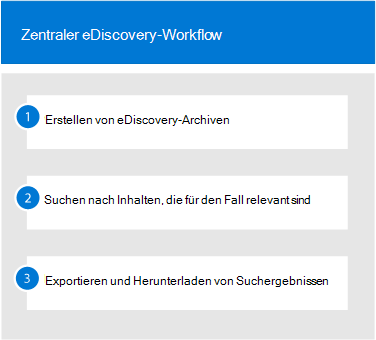

# Erste Schritte mit der Haupt-eDiscoveryGet started with Core eDiscovery

Core eDiscovery in Microsoft 365 bietet ein einfaches eDiscovery-Tool, mit dem Organisationen Inhalte in Microsoft 365 und Office 365 durchsuchen und exportieren können.Core eDiscovery in Microsoft 365 provides a basic eDiscovery tool that organizations can use to search and export content in Microsoft 365 and Office 365. Sie können auch die zentrale eDiscovery verwenden, um eine eDiscovery-Aufbewahrung an Inhaltsspeicherorten wie Exchange-Postfächern, SharePoint-Websites, OneDrive-Konten und Microsoft Teams zu platzieren.You can also use Core eDiscovery to place an eDiscovery hold on content locations, such as Exchange mailboxes, SharePoint sites, OneDrive accounts, and Microsoft Teams. Für die Bereitstellung von Haupt-eDiscovery ist nichts erforderlich, aber es gibt einige erforderliche Aufgaben, die ein IT-Administrator und eDiscovery-Manager ausführen müssen, bevor Ihre Organisation mit der Verwendung von Core eDiscovery für die Suche, den Export und die Aufbewahrung von Inhalten beginnen kann.Nothing is needed to deploy Core eDiscovery, but there are some prerequisite tasks that an IT admin and eDiscovery manager have to complete before your organization can start using Core eDiscovery to search, export, and preserve content.

In diesem Artikel werden die erforderlichen Schritte zum Einrichten von Core eDiscovery erläutert.This article discusses the steps necessary to set up Core eDiscovery. Dies umfasst die Sicherstellung der erforderlichen Lizenzierung für den Zugriff auf die Haupt-eDiscovery und das Platzieren eines eDiscovery-Speichers an Inhalts Standorten sowie das Zuweisen von Berechtigungen für Ihr IT-, rechts-und Ermittlungsteam, damit Sie auf Fälle zugreifen und diese verwalten können.This includes ensuring the proper licensing required to access Core eDiscovery and place an eDiscovery hold on content locations, as well as assigning permissions to your IT, legal, and investigation team so they can access and manage cases. Dieser Artikel bietet außerdem eine allgemeine Übersicht über die Verwendung von Fällen zum Suchen und Exportieren von Inhalten.This article also provides a high-level overview of using cases to search for and export content.

## Schritt 1: überprüfen und zuweisen geeigneter LizenzenStep 1: Verify and assign appropriate licenses

Für die Lizenzierung für die zentrale eDiscovery ist das entsprechende Organisations Abonnement und die Lizenzierung pro Benutzer erforderlich.Licensing for Core eDiscovery requires the appropriate organization subscription and per-user licensing.

- **Organisations Abonnement:** Um auf die Haupt-eDiscovery im Microsoft 365 Compliance Center oder im Office 365 Security & Compliance Center zuzugreifen und die Funktionen Hold und Export zu verwenden, muss Ihre Organisation über ein Microsoft 365 E3-oder Office 365 E3-Abonnement oder höher verfügen.**Organization subscription:** To access Core eDiscovery in the Microsoft 365 compliance center or the Office 365 Security & Compliance Center and use the hold and export features, your organization must have a Microsoft 365 E3 or Office 365 E3 subscription or higher.

- **Lizenzierung pro Benutzer:** Um eine eDiscovery-Aufbewahrung auf Benutzerpostfächern zu platzieren, muss diesem Benutzer je nach Ihrem Organisations Abonnement eine der folgenden Lizenzen zugewiesen sein:**Per-user licensing:** To place an eDiscovery hold on user mailboxes, that user must be assigned one of the following licenses, depending on your organization subscription:

  - Eine Microsoft 365 E3-oder Office 365 E3-Lizenz oder höherA Microsoft 365 E3 or Office 365 E3 license or higher

  - Eine Microsoft 365 E1-oder Office 365 E1-Lizenz mit einer Exchange Online Plan 2-oder Exchange Online-Add-on-Lizenz für die ArchivierungA Microsoft 365 E1 or Office 365 E1 license with an Exchange Online Plan 2 or Exchange Online Archiving add-on license

  Informationen zum Zuweisen von Lizenzen finden Sie unter [Zuweisen von Lizenzen zu Benutzern](https://docs.microsoft.com/microsoft-365/admin/manage/assign-licenses-to-users).For information about how to assign licenses, see [Assign licenses to users](https://docs.microsoft.com/microsoft-365/admin/manage/assign-licenses-to-users).

Informationen zu Microsoft 365 und Office 365 Lizenzierung finden Sie unter "Discover & respond" im [Microsoft 365-Kompatibilitäts Lizenzierungs Vergleich](https://docs.microsoft.com/office365/servicedescriptions/downloads/microsoft-365-compliance-licensing-comparison.pdf).For information about Microsoft 365 and Office 365 licensing, download and see the "Discover & Respond" solution in the [Microsoft 365 Compliance Licensing Comparison](https://docs.microsoft.com/office365/servicedescriptions/downloads/microsoft-365-compliance-licensing-comparison.pdf).

## Schritt 2: Zuweisen von eDiscovery-BerechtigungenStep 2: Assign eDiscovery permissions

Um auf die zentrale eDiscovery zuzugreifen oder als Mitglied eines zentralen eDiscovery-Falls hinzugefügt zu werden, muss einem Benutzer die entsprechenden Berechtigungen zugewiesen werden.To access Core eDiscovery or be added as a member of a Core eDiscovery case, a user must be assigned the appropriate permissions. Ein Benutzer muss insbesondere als Mitglied der Rollengruppe "eDiscovery-Manager" im Office 365 Security & Compliance Center hinzugefügt werden.Specifically, a user must be added as a member of the eDiscovery Manager role group in the Office 365 Security & Compliance Center. Mitglieder dieser Rollengruppe können zentrale eDiscovery-Fälle erstellen und verwalten.Members of this role group can create and manage Core eDiscovery cases. Sie können Mitglieder hinzufügen und entfernen, Benutzer mit eDiscovery besetzen, Suchvorgänge erstellen und bearbeiten und Inhalte aus einem zentralen eDiscovery-Fall exportieren.They can add and remove members, place an eDiscovery hold on users, create and edit searches, and export content from a Core eDiscovery case.

Führen Sie die folgenden Schritte aus, um Benutzer zur eDiscovery-Manager-Rollengruppe hinzuzufügen:Complete the following steps to add users to the eDiscovery Manager role group:

1. Wechseln Sie [https://protection.office.com/permissions](https://protection.office.com/permissions) zu, und melden Sie sich mit den Anmeldeinformationen für ein Administratorkonto in Ihrer Microsoft 365-oder Office 365-Organisation an.Go to [https://protection.office.com/permissions](https://protection.office.com/permissions) and sign in using the credentials for an admin account in your Microsoft 365 or Office 365 organization.

2. Wählen Sie auf der Seite **Berechtigungen** die Rollengruppe **eDiscovery-Manager** aus.On the **Permissions** page, select the **eDiscovery Manager** role group.

3. Klicken Sie auf der Seite eDiscovery-Manager-Flyout neben dem Abschnitt **eDiscovery-Manager** auf **Bearbeiten** .On the eDiscovery Manager flyout page, click **Edit** next to the **eDiscovery Manager** section.

4. Klicken Sie auf der Seite **eDiscovery-Manager auswählen** im Assistenten zum Bearbeiten der Rollengruppe auf **Ermittlungs-Manager auswählen**.On the **Choose eDiscovery Manager** page in the edit role group wizard, click **Choose Discovery Manager**.

5. Klicken Sie auf **Hinzufügen** , und aktivieren Sie dann das Kontrollkästchen für alle Benutzer, die Sie der Rollengruppe hinzufügen möchten.Click **Add** then select the checkbox for all users you want to add to the role group.

6. Klicken Sie auf **Hinzufügen** , um die ausgewählten Benutzer hinzuzufügen, und klicken Sie dann auf **Fertig**.Click **Add** to add the selected users, and then click **Done**.

7. Klicken Sie auf **Speichern** , um die Benutzer der Rollengruppe hinzuzufügen, und klicken Sie dann auf **Schließen** , um den Schritt abzuschließen.Click **Save** to add the users to the role group, and then click **Close** to complete the step.

### Weitere Informationen zur eDiscovery-Manager-RollengruppeMore information about the eDiscovery Manager role group

Es gibt zwei Untergruppen in der Rollengruppe "eDiscovery-Manager".There are two subgroups in the eDiscovery Manager role group. Der Unterschied zwischen diesen Untergruppen basiert auf dem Bereich.The difference between these subgroups is based on scope.

- **eDiscovery-Manager:** Kann die zentralen eDiscovery-Fälle anzeigen und verwalten, in denen Sie erstellt werden oder deren Mitglied Sie sind.**eDiscovery Manager:** Can view and manage the Core eDiscovery cases they create or are a member of. Wenn ein anderer eDiscovery-Manager einen Fall erstellt, aber keinen zweiten eDiscovery-Manager als Mitglied dieses Falles hinzufügt, kann der zweite eDiscovery-Manager den Fall nicht auf der zentralen eDiscovery-Seite im Compliance Center anzeigen oder öffnen.If another eDiscovery Manager creates a case but doesn't add a second eDiscovery Manager as a member of that case, the second eDiscovery Manager won't be able to view or open the case on the Core eDiscovery page in the compliance center. Im Allgemeinen können die meisten Personen in Ihrer Organisation der Untergruppe eDiscovery-Manager hinzugefügt werden.In general, most people in your organization can be added to the eDiscovery Manager subgroup.

- **eDiscovery-Administrator:** Kann alle Fall Verwaltungsaufgaben ausführen, die ein eDiscovery-Manager ausführen kann.**eDiscovery Administrator:** Can perform all case management tasks that an eDiscovery Manager can do. Darüber hinaus können eDiscovery-Administratoren folgende Aktionen durchführen:Additionally, an eDiscovery Administrator can:

  - Anzeigen aller Fälle, die auf der zentralen eDiscovery-Seite aufgeführt sind.View all cases that are listed on the Core eDiscovery page.
  
  - Verwalten Sie alle Fälle in der Organisation, nachdem Sie sich selbst als Mitglied der Anfrage hinzugefügt haben.Manage any case in the organization after they add themselves as a member of the case.

  - Zugriffs-und Export Fall Daten für alle Fälle in der Organisation.Access and export case data for any case in the organization.

  Aufgrund des breiten Zugriffs Umfangs sollte eine Organisation nur wenige Administratoren haben, die Mitglieder der Untergruppe "eDiscovery Administrators" sind.Because of the broad scope of access, an organization should have only a few admins who are members of the eDiscovery Administrators subgroup.

Weitere Informationen zu eDiscovery-Berechtigungen und eine Beschreibung der einzelnen Rollen, die der Rollengruppe "eDiscovery-Manager" zugewiesen sind, finden Sie unter [Zuweisen von eDiscovery-Berechtigungen](assign-ediscovery-permissions.md).For more information about eDiscovery permissions and a description of each role that's assigned to the eDiscovery Manager role group, see [Assign eDiscovery permissions](assign-ediscovery-permissions.md).

## Schritt 3: Erstellen eines zentralen eDiscovery-FallsStep 3: Create a Core eDiscovery case

Der nächste Schritt besteht darin, einen Fall zu erstellen und mit der Verwendung von Core eDiscovery zu beginnen.The next step is to create a case and start using Core eDiscovery. Führen Sie die folgenden Schritte aus, um einen Fall zu erstellen und Mitglieder hinzuzufügen.Complete the following steps to create a case and add members. Der Benutzer, der den Fall erstellt, wird automatisch als Mitglied hinzugefügt.The user who creates the case is automatically added as a member.

1. Wechseln Sie [https://compliance.microsoft.com](https://compliance.microsoft.com) zu, und melden Sie sich mit den Anmeldeinformationen für ein Benutzerkonto an, dem die entsprechenden eDiscovery-Berechtigungen zugewiesen wurden.Go to [https://compliance.microsoft.com](https://compliance.microsoft.com) and sign in using the credentials for a user account that has been assigned the appropriate eDiscovery permissions. Mitglieder der Rollengruppe "Organisationsverwaltung" können auch Haupt-eDiscovery-Fälle erstellen.Members of the Organization Management role group can also create Core eDiscovery cases.

2. Klicken Sie im linken Navigationsbereich des Microsoft 365 Compliance Center auf **Alle anzeigen**, und klicken Sie dann auf **eDiscovery > Kern**.In the left navigation pane of the Microsoft 365 compliance center, click **Show all**, and then click **eDiscovery > Core**.

3. Klicken Sie auf der **zentralen eDiscovery** -Seite auf **Fall erstellen**.On the **Core eDiscovery** page, click **Create a case**.

4. Geben Sie auf der **neuen Fall** Flyout-Seite der Groß-/Kleinschreibung einen Namen (erforderlich), und geben Sie dann eine optionale Fallnummer und eine Beschreibung ein.On the **New case** flyout page, give the case a name (required), and then type an optional case number and description. Der Case-Name muss in Ihrer Organisation eindeutig sein.The case name must be unique in your organization.

5. Klicken Sie auf **Speichern** , um die Anfrage zu erstellen.Click **Save** to create the case.

   Der neue Fall wird erstellt und auf der zentralen eDiscovery-Seite angezeigt.The new case is created and displayed on the Core eDiscovery page. Möglicherweise müssen Sie auf **Aktualisieren** klicken, um den neuen Fall anzuzeigen.You may have to click **Refresh** to display the new case. 

## Schritt 4 (optional): Hinzufügen von Mitgliedern zu einem zentralen eDiscovery-FallStep 4 (optional): Add members to a Core eDiscovery case

Wenn Sie in Schritt 3 einen Fall erstellen und Sie der einzige Benutzer sind, der den Fall verwendet, müssen Sie diesen Schritt nicht ausführen.If you create a case in Step 3 and you're the only person who will use the case, then you don't have to perform this step. Sie können mit dem Fall beginnen, eDiscovery-Haltestatus zu erstellen, nach Inhalten zu suchen oder Suchergebnisse zu exportieren.You can start using the case to create eDiscovery holds, search for content, or export search results. Führen Sie diesen Schritt aus, wenn Sie anderen Benutzern (oder Rollengruppen) Zugriff auf die Anfrage gewähren möchten.Perform this step if you want to give other users (or roles group) access to the case.

1. Klicken Sie auf der **zentralen eDiscovery** -Seite im Microsoft 365 Compliance Center auf den Namen des Falls, dem Sie Mitglieder hinzufügen möchten.On the **Core eDiscovery** page in the Microsoft 365 compliance center, click the name of the case that you want to add members to.

2. Klicken Sie auf der Seite **diesen Fall Flyout verwalten** unter **Mitglieder verwalten**auf **Hinzufügen** , um der Anfrage Mitglieder hinzuzufügen.On the **Manage this case** flyout page, under **Manage members**, click **Add** to add members to the case. 

    Sie können auch die Rolle "Rollengruppe" als Mitglieder einer Anfrage hinzufügen.You can also choose to add role group as members of a case. Klicken Sie unter **Rollengruppen verwalten**auf **Hinzufügen**.Under **Manage role groups**, click **Add**. Sie können die Rollengruppen, denen Sie angehören, nur einem Fall zuweisen.You can only assign the role groups that you are a member of to a case. Das liegt daran, dass Rollengruppen steuern, wer einem eDiscovery-Fall Mitglieder zuweisen kann.That's because role groups control who can assign members to an eDiscovery case.

3. Klicken Sie in der Liste der Personen oder Rollengruppen, die als Mitglieder der Anfrage hinzugefügt werden können, auf das Kontrollkästchen neben den Namen der Personen (oder Rollengruppen), die Sie hinzufügen möchten.In the list of people or role groups that can be added as members of the case, click the check box next to the names of the people (or role groups) that you want to add. Wenn Sie eine große Liste von Personen haben, die als Mitglieder hinzugefügt werden können, verwenden Sie das **Suchfeld** , um nach einer bestimmten Person in der Liste zu suchen.If you have a large list of people who can added as members, use the **Search** box to search for a specific person in the list.
  
4. Nachdem Sie die Personen oder Rollengruppen ausgewählt haben, die als Mitglieder der Anfrage hinzugefügt werden sollen, klicken Sie auf **Hinzufügen**.After you select the people or role groups to add as members of the case, click **Add**.

5. Klicken Sie auf **Speichern** , um die neue Liste der Fall Mitglieder zu speichern.Click **Save** to save the new list of case members.

## Untersuchen des zentralen eDiscovery-WorkflowsExplore the Core eDiscovery workflow

Um Ihnen den Einstieg in die Verwendung von Core eDiscovery zu erleichtern, finden Sie hier einen einfachen Workflow zum Erstellen von eDiscovery-Archiven für interessante Personen, zum Suchen nach Inhalten, die für Ihre Untersuchung relevant sind, und zum Exportieren dieser Daten zur weiteren Überprüfung.To get you started using core eDiscovery, here's a simple workflow of creating eDiscovery holds for people of interest, searching for content that relevant to your investigation, and then exporting that data for further review. In jedem dieser Schritte werden auch einige erweiterte Haupt-eDiscovery-Funktionen hervorgehoben, die Sie untersuchen können.In each of these steps, we'll also highlight some extended Core eDiscovery functionality that you can explore.

1. **[Erstellen eines eDiscovery-Haltestatus](create-ediscovery-holds.md)**.**[Create an eDiscovery hold](create-ediscovery-holds.md)**. Der erste Schritt nach dem Erstellen eines Falls ist das Platzieren eines Haltestatus (auch als *eDiscovery*-Archiv bezeichnet) an den Inhaltsspeicherorten der Personen, die für Ihre Untersuchung relevant sind.The first step after creating a case is placing a hold (also called an *eDiscovery hold*) on the content locations of the people of interest in your investigation. Zu den Inhaltsspeicherorten gehören Exchange-Postfächer, SharePoint-Websites, OneDrive-Konten sowie die Postfächer und Websites, die Microsoft Teams und Office 365 Gruppen zugeordnet sind.Content locations include Exchange mailboxes, SharePoint sites, OneDrive accounts, as well as the mailboxes and sites associated with Microsoft Teams and Office 365 Groups. Während dieser Schritt optional ist, behält das Erstellen eines eDiscovery-Speichers Inhalte bei, die für den Fall während der Untersuchung relevant sein können.While this step is optional, creating an eDiscovery hold preserves content that may be relevant to the case during the investigation. Wenn Sie einen eDiscovery-Haltebereich erstellen, können Sie den gesamten Inhalt an bestimmten Inhaltsspeicherorten beibehalten oder einen abfragebasierten Haltebereich erstellen, um nur die Inhalte beizubehalten, die mit einer halte Abfrage übereinstimmen.When you create an eDiscovery hold you can preserve all content in specific content locations or you can create a query-based hold to preserve only the content that matches a hold query. Neben dem Beibehalten von Inhalten besteht ein weiterer Grund zum Erstellen von eDiscovery-Archiven darin, die inhaltsspeicherorte schnell durchsuchen zu lassen (anstatt jeden zu durchsuchenden Standort auszuwählen), wenn Sie im nächsten Schritt suchen erstellen und ausführen.In addition to preserving content, another good reason to create eDiscovery holds is to quickly search the content locations on hold (instead of having to select each location to search) when you create and run searches in the next step. Nachdem Sie Ihre Untersuchung abgeschlossen haben, können Sie alle von Ihnen erstellten Haltestatus freigeben.After you complete your investigation, you can release any hold that you created.

2. **[Suchen nach Inhalten](search-for-content-in-core-ediscovery.md)**.**[Search for content](search-for-content-in-core-ediscovery.md)**. Nachdem Sie eDiscovery-Haltestatus erstellt haben, verwenden Sie das integrierte Such Tool, um die inhaltsspeicherorte zu durchsuchen.After you create eDiscovery holds, use the built-in search tool to search the content locations on hold. Sie können auch andere inhaltsspeicherorte nach Daten durchsuchen, die möglicherweise für den Fall relevant sind.You can also search other content locations for data that may be relevant to the case. Sie können verschiedene Suchvorgänge erstellen und ausführen, die mit der Anfrage verknüpft sind.You can create and run different searches that are associated with the case. Sie verwenden Schlüsselwörter, Eigenschaften und Bedingungen zum [Erstellen von Suchabfragen](keyword-queries-and-search-conditions.md) , die Suchergebnisse mit den Daten zurückgeben, die für den Fall wahrscheinlich relevant sind.You use keywords, properties, and conditions to [build search queries](keyword-queries-and-search-conditions.md) that return search results with the data that's most likely relevant to the case. Des Weiteren können Sie Folgendes:You can also:

   - Anzeigen von Suchstatistiken, die Ihnen beim Verfeinern einer Suchabfrage helfen können, um die Ergebnisse einzugrenzen.View search statistics that may help you refine a search query to narrow the results.

   - Zeigen Sie eine Vorschau der Suchergebnisse an, um schnell zu überprüfen, ob die relevanten Daten gefunden werden.Preview the search results to quickly verify whether the relevant data is being found.

   - Überarbeiten Sie eine Abfrage, und führen Sie die Suche erneut aus.Revise a query and rerun the search.

3. **[Exportieren und Herunterladen von Suchergebnissen](export-content-in-core-ediscovery.md)**.**[Export and download search results](export-content-in-core-ediscovery.md)**. Nachdem Sie die für Ihre Untersuchung relevanten Daten gesucht und gefunden haben, können Sie Sie aus Office 365 zur Überprüfung durch Personen außerhalb des Ermittlungsteams exportieren.After you search for and find data that's relevant to your investigation, you can export it out of Office 365 for review by people outside of the investigation team. Das Exportieren von Daten erfolgt in einem zweistufigen Prozess.Exporting data is a two-step process. Der erste Schritt besteht darin, die Ergebnisse einer Suche im Fall von Office 365 zu exportieren.The first step is to export the results of a search in the case out of Office 365. Dies wird erreicht, indem die Ergebnisse einer Suche in einen von Microsoft bereitgestellten Azure-Speicherort kopiert werden.This is accomplished by copying the results of a search to a Microsoft-provided Azure Storage location. Der nächste Schritt besteht darin, das eDiscovery-Export Tool zum Herunterladen des Inhalts auf einen lokalen Computer zu verwenden.The next step is to use the eDiscovery Export tool to download the content to a local computer. Zusätzlich zu den exportierten Datendateien enthält der Inhalt des Exportpakets auch einen Exportbericht, einen Zusammenfassungsbericht und einen Fehlerbericht.In addition to the exported data files, the contains of the export package also contains an export report, a summary report, and an error report.
