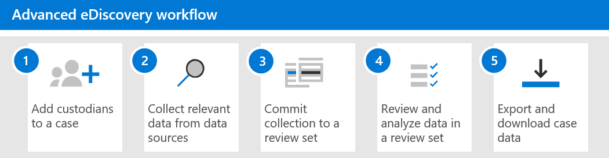

# Erste Schritte mit Advanced eDiscoveryGet started with Advanced eDiscovery

Advanced eDiscovery in Microsoft 365 bietet einen End-to-End-Workflow zum aufbewahren, sammeln, überprüfen, analysieren und Exportieren von Daten, die auf interne und externe Untersuchungen in Ihrer Organisation reagieren.Advanced eDiscovery in Microsoft 365 provides an end-to-end workflow to preserve, collect, review, analyze, and export data that's responsive to your organization's internal and external investigations. Für die Bereitstellung von Advanced eDiscovery ist nichts erforderlich, aber es gibt einige erforderliche Aufgaben, die ein IT-Administrator und eDiscovery-Manager ausführen müssen, bevor Ihre Organisation mit der Erstellung und Verwendung von erweiterten eDiscovery-Fällen für die Verwaltung ihrer Untersuchungen beginnen kann.Nothing is needed to deploy Advanced eDiscovery, but there are some prerequisite tasks that an IT admin and eDiscovery manager have to complete before your organization can start to create and use Advanced eDiscovery cases to manage your investigations.

In diesem Artikel werden die erforderlichen Schritte zum Einrichten von Advanced eDiscovery erläutert.This article discusses the steps necessary to set up Advanced eDiscovery. Dies umfasst die Sicherstellung der erforderlichen Lizenzierung für den Zugriff auf Erweiterte eDiscovery sowie das Hinzufügen von Depotstellen zu Fällen sowie das Zuweisen von Berechtigungen für Ihr rechts-und Ermittlungsteam, damit Sie auf Anfragen zugreifen und diese verwalten können.This includes ensuring the proper licensing required to access Advanced eDiscovery and add custodians to cases, as well as assigning permissions to your legal and investigation team so they can access and manage cases. Dieser Artikel bietet außerdem eine allgemeine Übersicht über die Verwendung von Fällen zum Verwalten des erweiterten eDiscovery-Workflows für eine rechtliche Untersuchung.This article also provides a high-level overview of using cases to manage the Advanced eDiscovery workflow for a legal investigation.

## Schritt 1: überprüfen und zuweisen geeigneter LizenzenStep 1: Verify and assign appropriate licenses

Für die Lizenzierung für Advanced eDiscovery ist das entsprechende Organisations Abonnement und die Lizenzierung pro Benutzer erforderlich.Licensing for Advanced eDiscovery requires the appropriate organization subscription and per-user licensing.

- **Organisations Abonnement:** Um auf Advanced eDiscovery im Microsoft 365 Compliance Center oder im Office 365 Security & Compliance Center zuzugreifen, muss Ihre Organisation über eine der folgenden Funktionen verfügen:**Organization subscription:** To access Advanced eDiscovery in the Microsoft 365 compliance center or the Office 365 Security & Compliance Center, your organization must have one of the following:

  - Microsoft 365 E5 oder Office 365 E5-AbonnementMicrosoft 365 E5 or Office 365 E5 subscription
  
  - Microsoft 365 E3-Abonnement mit E5-Konformitäts-Add-onMicrosoft 365 E3 subscription with E5 Compliance add-on
  
  - Office 365 E3-Abonnement mit Advanced Compliance-Add-onOffice 365 E3 subscription with Advanced Compliance add-on

  Wenn Sie keinen vorhandenen Microsoft 365 E5-Plan haben und Advanced eDiscovery ausprobieren möchten, können Sie [Microsoft 365](https://docs.microsoft.com/office365/admin/try-or-buy-microsoft-365) zu Ihrem vorhandenen Office 365-Abonnement hinzufügen oder [sich für eine Testversion](https://www.microsoft.com/microsoft-365/enterprise) von Microsoft 365 E5 registrieren.If you don't have an existing Microsoft 365 E5 plan and want to try Advanced eDiscovery, you can [add Microsoft 365](https://docs.microsoft.com/office365/admin/try-or-buy-microsoft-365) to your existing Office 365 subscription or [sign up for a trial](https://www.microsoft.com/microsoft-365/enterprise) of Microsoft 365 E5.

- **Lizenzierung pro Benutzer:** Wenn Sie einen Benutzer als depotverwalter in einem eDiscovery-vorab Fall hinzufügen möchten, muss diesem Benutzer je nach Ihrem Organisations Abonnement eine der folgenden Lizenzen zugewiesen sein:**Per-user licensing:** To add a user as a custodian in an Advance eDiscovery case, that user must be assigned one of the following licenses, depending on your organization subscription:

  - Microsoft 365: Benutzern muss eine Microsoft 365 E5-Lizenz oder eine E5-Konformitäts-Add-on-Lizenz zugewiesen werden.Microsoft 365: Users must be assigned a Microsoft 365 E5 license or an E5 Compliance add-on license.

  - Office 365: Benutzern muss eine Office 365 E5-Lizenz oder eine Advanced Compliance-Add-on-Lizenz zugewiesen werden.Office 365: Users must be assigned an Office 365 E5 license or an Advanced Compliance add-on license.

   Informationen zum Zuweisen von Lizenzen finden Sie unter [Zuweisen von Lizenzen zu Benutzern](https://docs.microsoft.com/microsoft-365/admin/manage/assign-licenses-to-users).For information about how to assign licenses, see [Assign licenses to users](https://docs.microsoft.com/microsoft-365/admin/manage/assign-licenses-to-users).

> [!NOTE]
> Benutzer benötigen nur eine E5-Lizenz (oder die entsprechende Add-on-Lizenz), die als Verwalter einem erweiterten eDiscovery-Fall hinzugefügt werden soll.Users only need an E5 license (or the appropriate add-on license) to be added as custodians to an Advanced eDiscovery case. IT-Administratoren, eDiscovery-Manager, Juristen, Gehilfen oder Ermittler, die Advanced eDiscovery zum Verwalten von Fällen und Überprüfen von Falldaten verwenden, benötigen keine E5-oder Add-on-Lizenz.IT admins, eDiscovery managers, lawyers, paralegals, or investigators who use Advanced eDiscovery to manage cases and review case data don't need an E5 or add-on license.

## Schritt 2: Zuweisen von eDiscovery-BerechtigungenStep 2: Assign eDiscovery permissions

Um auf Advanced eDiscovery zuzugreifen oder als Mitglied eines erweiterten eDiscovery-Falls hinzugefügt zu werden, müssen einem Benutzer die entsprechenden Berechtigungen zugewiesen werden.To access Advanced eDiscovery or added as a member of an Advanced eDiscovery case, a user must be assigned the appropriate permissions. Ein Benutzer muss insbesondere als Mitglied der Rollengruppe "eDiscovery-Manager" im Office 365 Security & Compliance Center hinzugefügt werden.Specifically, a user must be added as a member of the eDiscovery Manager role group in the Office 365 Security & Compliance Center. Mitglieder dieser Rollengruppe können erweiterte eDiscovery-Fälle erstellen und verwalten.Members of this role group can create and manage Advanced eDiscovery cases. Sie können Mitglieder hinzufügen und entfernen, Aufbewahrungen und inhaltsspeicherorte in der Warteschleife platzieren, Benachrichtigungen für legale Aufbewahrungen verwalten, Suchvorgänge in einem Fall erstellen und bearbeiten, Suchergebnisse zu einem Überprüfungs hinzufügen, Daten in einem Überprüfungs Satzes analysieren und aus einem erweiterten Export und Download eDiscovery-Fall.They can add and remove members, place custodians and content locations on hold, manage legal hold notifications, create and edit searches associated in a case, add search results to a review set, analyze data in a review set, and export and download from an Advanced eDiscovery case.

Führen Sie die folgenden Schritte aus, um Benutzer zur eDiscovery-Manager-Rollengruppe hinzuzufügen:Complete the following steps to add users to the eDiscovery Manager role group:

1. Wechseln Sie [https://protection.office.com/permissions](https://protection.office.com/permissions) zu, und melden Sie sich mit den Anmeldeinformationen für ein Administratorkonto in Ihrer Microsoft 365-Organisation an.Go to [https://protection.office.com/permissions](https://protection.office.com/permissions) and sign in using the credentials for an admin account in your Microsoft 365 organization.

2. Wählen Sie auf der Seite **Berechtigungen** die Rollengruppe **eDiscovery-Manager** aus.On the **Permissions** page, select the **eDiscovery Manager** role group.

3. Klicken Sie auf der Seite eDiscovery-Manager-Flyout neben dem Abschnitt **eDiscovery-Manager** auf **Bearbeiten** .On the eDiscovery Manager flyout page, click **Edit** next to the **eDiscovery Manager** section.

4. Klicken Sie auf der Seite **eDiscovery-Manager auswählen** im Assistenten zum Bearbeiten der Rollengruppe auf **Ermittlungs-Manager auswählen**.On the **Choose eDiscovery Manager** page in the edit role group wizard, click **Choose Discovery Manager**.

5. Klicken Sie auf **Hinzufügen** , und aktivieren Sie dann das Kontrollkästchen für alle Benutzer, die Sie der Rollengruppe hinzufügen möchten.Click **Add** then select the checkbox for all users you want to add to the role group.

6. Klicken Sie auf **Hinzufügen** , um die ausgewählten Benutzer hinzuzufügen, und klicken Sie dann auf **Fertig**.Click **Add** to add the selected users, and then click **Done**.

7. Klicken Sie auf **Speichern** , um die Benutzer der Rollengruppe hinzuzufügen, und klicken Sie dann auf **Schließen** , um den Schritt abzuschließen.Click **Save** to add the users to the role group, and then click **Close** to complete the step.

### Weitere Informationen zur eDiscovery-Manager-RollengruppeMore information about the eDiscovery Manager role group

Es gibt zwei Untergruppen in der Rollengruppe "eDiscovery-Manager".There are two subgroups in the eDiscovery Manager role group. Der Unterschied zwischen diesen Untergruppen basiert auf dem Bereich.The difference between these subgroups is based on scope.

- **eDiscovery-Manager:** Kann die erweiterten eDiscovery-Fälle anzeigen und verwalten, in denen Sie erstellt werden oder deren Mitglied Sie sind.**eDiscovery Manager:** Can view and manage the Advanced eDiscovery cases they create or are a member of. Wenn ein anderer eDiscovery-Manager einen Fall erstellt, aber keinen zweiten eDiscovery-Manager als Mitglied dieses Falls hinzufügt, kann der zweite eDiscovery-Manager den Fall nicht auf der Seite "Advanced eDiscovery" im Compliance Center anzeigen oder öffnen.If another eDiscovery Manager creates a case but doesn't add a second eDiscovery Manager as a member of that case, the second eDiscovery Manager won't be able to view or open the case on the Advanced eDiscovery page in the compliance center. Im Allgemeinen können die meisten Personen in Ihrer Organisation der Untergruppe eDiscovery-Manager hinzugefügt werden.In general, most people in your organization can be added to the eDiscovery Manager subgroup.

- **eDiscovery-Administrator:** Kann alle Fall Verwaltungsaufgaben ausführen, die ein eDiscovery-Manager ausführen kann.**eDiscovery Administrator:** Can perform all case management tasks that an eDiscovery Manager can do. Darüber hinaus können eDiscovery-Administratoren folgende Aktionen durchführen:Additionally, an eDiscovery Administrator can:

  - Anzeigen aller Fälle, die auf der Seite Erweiterte eDiscovery aufgeführt sind.View all cases that are listed on the Advanced eDiscovery page.
  
  - Verwalten Sie alle Fälle in der Organisation, nachdem Sie sich selbst als Mitglied der Anfrage hinzugefügt haben.Manage any case in the organization after they add themselves as a member of the case.

  - Zugriffs-und Export Fall Daten für alle Fälle in der Organisation.Access and export case data for any case in the organization.

  Aufgrund des breiten Zugriffs Umfangs sollte eine Organisation nur wenige Administratoren haben, die Mitglieder der Untergruppe "eDiscovery Administrators" sind.Because of the broad scope of access, an organization should have only a few admins who are members of the eDiscovery Administrators subgroup.

Weitere Informationen zu eDiscovery-Berechtigungen und eine Beschreibung der einzelnen Rollen, die der Rollengruppe "eDiscovery-Manager" zugewiesen sind, finden Sie unter [Zuweisen von eDiscovery-Berechtigungen im Security & Compliance Center](assign-ediscovery-permissions.md).For more information about eDiscovery permissions and a description of each role that's assigned to the eDiscovery Manager role group, see [Assign eDiscovery permissions in the Security & Compliance Center](assign-ediscovery-permissions.md).

## Schritt 3: Konfigurieren globaler Einstellungen für Advanced eDiscoveryStep 3: Configure global settings for Advanced eDiscovery

Der letzte Schritt, der abgeschlossen werden muss, bevor Personen in Ihrer Organisation mit dem Erstellen und Verwenden von Fällen beginnen, besteht darin, globale Einstellungen zu konfigurieren, die für alle Fälle in Ihrer Organisation gelten.The last step to complete before people in your organization start to create and use cases is to configure global settings that apply to all cases in your organization. Zu diesem Zeitpunkt ist die einzige globale Einstellung die *Berechtigung "Anwalts Clienterkennung* " (weitere globale Einstellungen werden in der Zukunft verfügbar sein).At this time, the only global setting is *attorney-client privilege detection* (more global settings will be available in the future). Mit dieser Einstellung kann das Anwalts-Client-Berechtigungsmodell ausgeführt werden, wenn Sie Daten in einem Überprüfungs Satzes analysieren.This setting enables the attorney-client privilege model to run when you analyze data in a review set. Das Modell verwendet Maschinelles Lernen, um die Wahrscheinlichkeit zu ermitteln, dass ein Dokumentinhalte enthält, die Natur rechtlich zulässig sind.The model uses machine learning to determine the likelihood that a document contains content that is legal in nature. Außerdem werden die Teilnehmer von Dokumenten mit einer anwaltsliste verglichen (die Sie beim Einrichten des Modells übermitteln), um festzustellen, ob ein Dokument mindestens einen Teilnehmer besitzt, der ein Anwalt ist.It also compares the participants of documents with an attorney list (that you submit when setting up the model) to determine if a document has at least one participant who is an attorney.

Weitere Informationen zum Einrichten und Verwenden des Erkennungs Modells für das Anwalts Client-Recht finden Sie unter [Einrichten der Anwalts-Client-Berechtigungs Erkennung in Advanced eDiscovery](attorney-privilege-detection.md).For more information about setting up and using the attorney-client privilege detection model, see [Set up attorney-client privilege detection in Advanced eDiscovery](attorney-privilege-detection.md).

> [!NOTE]
> Dies ist ein optionaler Schritt, den Sie jederzeit ausführen können.This is an optional step that you can perform anytime. Wenn Sie das Ermittlungs Modell für das Attorney-Client-Recht nicht implementieren, können Sie keine erweiterten eDiscovery-Fälle erstellen und verwenden.Not implementing the attorney-client privilege detection model doesn't prevent you from creating and using Advanced eDiscovery cases.

## Schritt 4: Erstellen eines erweiterten eDiscovery-FallsStep 4: Create an Advanced eDiscovery case

Der nächste Schritt besteht darin, einen Fall zu erstellen und mit Advanced eDiscovery zu beginnen.The next step is to create a case and start using Advanced eDiscovery. Führen Sie die folgenden Schritte aus, um einen Fall zu erstellen und Mitglieder hinzuzufügen.Complete the following steps to create a case and add members. Der Benutzer, der den Fall erstellt, wird automatisch als Mitglied hinzugefügt.The user who creates the case is automatically added as a member.

1. Wechseln Sie [https://compliance.microsoft.com](https://compliance.microsoft.com) zu, und melden Sie sich mit den Anmeldeinformationen für das Benutzerkonto an, dem die entsprechenden eDiscovery-Berechtigungen zugewiesen wurden.Go to [https://compliance.microsoft.com](https://compliance.microsoft.com) and sign in using the credentials for user account that has been assigned the appropriate eDiscovery permissions. Mitglieder der Rollengruppe "Organisationsverwaltung" können auch erweiterte eDiscovery-Fälle erstellen.Members of the Organization Management role group can also create Advanced eDiscovery cases.

2. Klicken Sie im linken Hauptschiff des Microsoft 365 Compliance Center auf **Alle anzeigen**, und klicken Sie dann auf **eDiscovery > erweitert**.In the left nave of the Microsoft 365 compliance center, click **Show all**, and then click **eDiscovery > Advanced**.

3. Klicken Sie auf der Seite **Erweiterte eDiscovery** auf die Registerkarte **Fälle** , und klicken Sie dann auf **Fall erstellen**.On the **Advanced eDiscovery** page, click the **Cases** tab, and then click **Create a case**.

4. Geben Sie auf der **neuen eDiscovery-Fall** -Flyout-Seite den Fall einen Namen (erforderlich) ein, und geben Sie dann eine optionale Fallnummer und eine Beschreibung ein.On the **New eDiscovery case** flyout page, give the case a name (required), and then type an optional case number and description. Der Case-Name muss in Ihrer Organisation eindeutig sein.The case name must be unique in your organization.

5. Klicken Sie auf **Speichern** , um die Anfrage zu erstellen.Click **Save** to create the case.

   Der neue Fall wird erstellt, und die Registerkarte **Einstellungen** im neuen Fall wird angezeigt.The new case is created and the **Settings** tab in the new case is displayed. 

6. Klicken Sie auf der Kachel **Zugriffs & Berechtigungen** auf der Registerkarte **Einstellungen** auf **auswählen**, und klicken Sie dann auf **Aktualisieren**.In the **Access & permissions** tile on the **Settings** tab, click **Select**, and then click **Update**.

7. Klicken Sie auf **Aktualisieren**.Click **Update**.

8. Klicken Sie auf der Seite **diesen Fall Flyout verwalten** unter **Mitglieder verwalten**auf **Hinzufügen** , um der Anfrage Mitglieder hinzuzufügen.On the **Manage this case** flyout page, under **Manage members**, click **Add** to add members to the case.

9. Aktivieren Sie in der Liste der Personen das Kontrollkästchen neben den Namen der Personen, die der Anfrage hinzugefügt werden sollen.In the list of people, select the check box next to the names of the people that you want to add to the case. Wie bereits erläutert, müssen Sie sicherstellen, dass den Benutzern, die Sie dem Fall hinzufügen, die entsprechenden eDiscovery-Berechtigungen zugewiesen wurden.As previously explained, be sure that the people you add to the case have been assigned the appropriate eDiscovery permissions.

10. Nachdem Sie die Personen ausgewählt haben, die als Mitglieder der Anfrage hinzugefügt werden sollen, klicken Sie auf **Hinzufügen**.After you've selected the people to add as members of the case, click **Add**.

11. Klicken Sie auf der Seite **diesen Fall Flyout verwalten** auf **Speichern** , um die neue Liste der Fall Mitglieder zu speichern.In the **Manage this case** flyout page, click **Save** to save the new list of case members.

12. Klicken Sie auf die Registerkarte **Start** , um zur Fall Startseite zu wechseln.Click the **Home** tab to go to the case home page.

## Untersuchen des erweiterten eDiscovery-WorkflowsExplore the Advanced eDiscovery workflow

Um den Einstieg in die Verwendung von Advanced eDiscovery zu erleichtern, finden Sie hier einen einfachen Workflow, der sich an [gängige eDiscovery-Methoden](overview-ediscovery-20.md#alignment-with-edrm)richtet.To get you started using Advanced eDiscovery, here's a simple workflow that aligns with [common eDiscovery practices](overview-ediscovery-20.md#alignment-with-edrm). In jedem dieser Schritte werden auch einige erweiterte eDiscovery-Funktionen hervorgehoben, die Sie untersuchen können.In each of these steps, we'll also highlight some extended Advanced eDiscovery functionality that you can explore.

1. **[Hinzufügen von Verwaltern zu einem Fall](add-custodians-to-case.md)**.**[Add custodians to a case](add-custodians-to-case.md)**. Der erste Schritt nach dem Erstellen eines Falls besteht darin, Verwalter hinzuzufügen.The first step after creating a case is to add custodians. Bei einer *Depotbank* handelt es sich um eine Person, die über eine administrative Kontrolle über ein Dokument oder eine elektronische Datei verfügt, die für den Fall relevant sein kann.A *custodian* is a person having administrative control of a document or electronic file that may be relevant to the case. Hier sind einige Dinge, die passieren (oder die Sie tun können), wenn Sie Verwalter einem Fall hinzufügen:Here are some things that happen (or that you can do) when you add custodians to a case:

   - Die Daten im Exchange-Postfach des Verwalters, im OneDrive-Konto und in allen Microsoft Teams-oder Jammer Gruppen, in denen die Depotbank Mitglied ist, können in dem Fall als Freiheitsentzug-Daten "gekennzeichnet" werden.Data in the custodian's Exchange mailbox, OneDrive account, and any Microsoft Teams or Yammer groups that the custodian is a member of can be "marked" as custodial data in the case.
  
   - Depotdaten werden erneut indiziert (durch einen Prozess mit dem Namen *Advanced Indexing*).Custodian data is re-indexed (by a process called *Advanced indexing*). Dies hilft beim Optimieren der Suche im nächsten Schritt.This helps optimize searching for it in the next step.
  
   - Sie können Depotdaten aufbewahren.You can place a hold on custodian data. Dadurch werden Daten beibehalten, die für den Fall während der Untersuchung relevant sein können.This preserves data that may be relevant to the case during the investigation.
  
   - Sie können einer Depotbank andere Datenquellen zuordnen (beispielsweise können Sie eine SharePoint-Website oder Office 365 Gruppe mit einer Depotbank verknüpfen), damit diese Daten neu indiziert, gespeichert und durchsucht werden können, genauso wie die Daten im Postfach des Depotbank-oder OneDrive-Kontos.You can associate other data sources with a custodian (for example, you can associate a SharePoint site or Office 365 Group with a custodian) so this data can be re-indexed, placed on hold, and searched, just like the data in the custodian's mailbox or OneDrive account.

   - Sie können den [Kommunikations Workflow](managing-custodian-communications.md) in Advanced eDiscovery verwenden, um eine rechtliche Aufbewahrungs Benachrichtigung an Verwalter zu senden.You can use the [communications workflow](managing-custodian-communications.md) in Advanced eDiscovery to send a legal hold notification to custodians.

2. **[Durchsuchen von Freiheits Datenquellen nach Daten, die für den Fall relevant](collecting-data-for-ediscovery.md)** sind.**[Search custodial data sources for data relevant to the case](collecting-data-for-ediscovery.md)**. Nachdem Sie einem Fall Verwalter hinzugefügt haben, verwenden Sie das integrierte Such Tool, um die Speicherorte der Depotdaten nach Daten zu durchsuchen, die für den Fall relevant sein können.After you add custodians to a case, use the built-in search tool to search the custodian data locations for data that may be relevant to the case. Sie verwenden Schlüsselwörter, Eigenschaften und Bedingungen zum [Erstellen von Suchabfragen](building-search-queries.md) , die Suchergebnisse mit den Daten zurückgeben, die für den Fall wahrscheinlich relevant sind.You use keywords, properties, and conditions to [build search queries](building-search-queries.md) that return search results with the data that's most likely relevant to the case. Des Weiteren können Sie Folgendes:You can also:

   - Anzeigen von [Suchstatistiken](search-statistics.md) , die Ihnen beim Verfeinern einer Suchabfrage helfen können, um die Ergebnisse einzugrenzen.View [search statistics](search-statistics.md) that may help you refine a search query to narrow the results.

   - Zeigen Sie eine Vorschau der Suchergebnisse an, um schnell zu überprüfen, ob die relevanten Daten gefunden werden.Preview the search results to quickly verify whether the relevant data is being found.

   - Überarbeiten Sie eine Abfrage, und führen Sie die Suche erneut aus.Revise a query and re-run the search.

3. **[Hinzufügen von Daten zu einem Überprüfungs Satzes](add-data-to-review-set.md)**.**[Add data to a review set](add-data-to-review-set.md)**. Nachdem Sie konfiguriert und überprüft haben, dass eine Suche die gewünschten Daten zurückgibt, besteht der nächste Schritt darin, die Suchergebnisse einer Überprüfungsgruppe hinzuzufügen.Once you've configured and verified that a search returns the desired data, the next step is to add the search results to a review set. Wenn Sie einer Überprüfungsgruppe Daten hinzufügen, werden Elemente von Ihrem ursprünglichen Speicherort an einen sicheren Azure-Speicher Speicherort kopiert.When you add data to a review set, items are copied from their original location to a secure Azure Storage location. Die Daten werden erneut indiziert, um Sie für eine gründliche und schnelle Suche zu optimieren, wenn Sie Elemente im Überprüfungs Satzes überprüfen und analysieren.The data is re-indexed again to optimize it for thorough and fast searches when reviewing and analyzing items in the review set. Darüber hinaus können Sie [einer Überprüfungsgruppe auch nicht Office 365 Daten hinzufügen](load-non-office-365-data-into-a-review-set.md).Additionally, you can also [add non-Office 365 data into a review set](load-non-office-365-data-into-a-review-set.md).

   Es gibt auch eine spezielle Art von Überprüfungs Sätzen, denen Sie Daten hinzufügen können, die als *Unterhaltungs Überprüfungs Sätze*bezeichnet werden.There's also a special kind of review set that you can add data to, called a *conversation review set*. Diese Typen von Überprüfungs Sätzen bieten Funktionen für die Wiederherstellung von Unterhaltungen zum rekonstruieren, überprüfen und Exportieren von Thread Unterhaltungen wie denen in Microsoft Teams.These types of reviews sets provide conversation reconstruction capabilities to reconstruct, review, and export threaded conversations like those in Microsoft Teams. Weitere Informationen finden Sie unter [Review Conversations in Advanced eDiscovery](conversation-review-sets.md).For more information, see [Review conversations in Advanced eDiscovery](conversation-review-sets.md).

4. **Überprüfen und Analysieren von Daten in einem Überprüfungs Satzes**.**Review and analyze data in a review set**. Da sich die Daten nun in einem Überprüfungs Satzes befinden, können Sie eine Vielzahl von Tools und Funktionen zum Anzeigen und Analysieren der Falldaten verwenden, um die Datenmenge auf das zu reduzieren, was für den Fall relevant ist, dass Sie untersucht werden.Now that data is in a review set, you can use a wide-variety of tools and capabilities to view and analyze the case data with the goal of reducing the data set to what is most relevant to the case you're investigation. Im folgenden finden Sie eine Liste mit einigen Tools und Funktionen, die Sie während dieses Prozesses verwenden können.Here's a list of some tools and capabilities that you can use during this process.

   - [Dokumente anzeigen](view-documents-in-review-set.md).[View documents](view-documents-in-review-set.md). Dies umfasst das Anzeigen der Metadaten für jedes Dokument in einer Überprüfungsgruppe und das Anzeigen des Dokuments in seiner systemeigenen Version oder Textversion.This includes viewing the metadata for each document in a review set, and viewing the document in its native version or text version.

   - [Erstellen von Abfragen und Filtern](review-set-search.md)[Create queries and filters](review-set-search.md). Sie erstellen Suchabfragen mithilfe einer Vielzahl von Suchkriterien (einschließlich der Möglichkeit zum Durchsuchen aller [Eigenschaften von Datei Metadaten](document-metadata-fields-in-advanced-ediscovery.md)), um die Falldaten weiter zu verfeinern und zu filtern, was für den Fall am relevantesten ist.You create search queries using a variety of search criteria (including the ability to search all [file metadata properties](document-metadata-fields-in-advanced-ediscovery.md)) to further refine and cull the case data to what is most relevant to the case. Sie können auch Filter zum Überprüfen von Sätzen verwenden, um schnell zusätzliche Bedingungen auf die Ergebnisse einer Suchabfrage anzuwenden, um diese Ergebnisse weiter zu verfeinern.You can also use review set filters to quickly apply additional conditions to the results of a search query to further refine those results. 

   - [Erstellen und Verwenden von Tags](tagging-documents.md).[Create and use tags](tagging-documents.md). Sie können Tags auf Dokumente in einem Überprüfungs Satzes anwenden, um zu ermitteln, welche reaktionsfähig sind (oder nicht auf den Fall reagieren), und dann diese Tags beim Erstellen von Suchabfragen verwenden, um die markierten Dokumente einzubeziehen oder auszuschließen.You can apply tags to documents in a review set to identify which are responsive (or non-responsive to the case) and then use those tags when creating search queries to include or exclude the tagged documents. Sie können auch kennzeichnen, um zu bestimmen, welche Dokumente exportiert werden sollen.You can also tagging to determine which documents to export.

   - [Beschriften und redact von Dokumenten](view-documents-in-review-set.md#annotate-view).[Annotate and redact documents](view-documents-in-review-set.md#annotate-view). Sie können das Annotation-Tool in einer Überprüfung verwenden, um Dokumente und redact-Inhalte in Dokumenten als Arbeitsprodukt zu kommentieren.You can use the annotation tool in a review to annotate documents and redact content in documents as work product. Wir generieren eine PDF-Version eines kommentierten oder bearbeiteten Dokuments während der Überprüfung, um das Risiko zu verringern, dass die unzensierte-systemeigene Version des Dokuments exportiert wird.We generate a PDF version of an annotated or redacted document during review to reduce the risk of exporting the unredacted native version of the document.

   - [Analysieren von Case-Daten](analyzing-data-in-review-set.md).[Analyze case data](analyzing-data-in-review-set.md). Die Analysefunktionalität in Advanced eDiscovery ist leistungsfähig.The analytics functionality in Advanced eDiscovery is powerful. Nachdem Sie Analytics für die Daten in Review-Gruppe ausgeführt haben, führen wir eine Analyse wie etwa doppelte Erkennung, e-Mail-Threading und Designs durch, die dazu beitragen können, das Volumen von Dokumenten zu reduzieren, die Sie überprüfen müssen.After you run analytics on the data in review set, we perform analysis such as near duplicate detection, email threading, and themes that can help reduce the volume of documents that you have to review. Außerdem generieren wir Analyseberichte, in denen das Ergebnis der Ausführung von Analysen zusammengefasst wird.We also generate an Analytics reports that summarize the result of running analytics. Wie bereits erläutert, führt das Ausführen von Analytics auch [das Erkennungs Modell für das Anwalts Client-Privileg](attorney-privilege-detection.md#use-the-attorney-client-privilege-detection-model)aus.As previously explained, running analytics also runs [the attorney-client privilege detection model](attorney-privilege-detection.md#use-the-attorney-client-privilege-detection-model).

5. **Exportieren und Herunterladen von Case-Daten**.**Export and download case data**. Ein letzter Schritt nach dem sammeln, überprüfen und Analysieren von Falldaten besteht darin, die Daten aus Advanced eDiscovery für externe Überprüfungen oder zur Überprüfung durch Personen außerhalb des Ermittlungsteams zu exportieren.A final step after collecting, reviewing, and analyzing case data is to export it out of Advanced eDiscovery for external review or for review by people outside of the investigation team. Das Exportieren von Daten erfolgt in einem zweistufigen Prozess.Exporting data is a two-step process. Der erste Schritt besteht im [exportieren](export-documents-from-review-set.md) des Überprüfungs Satzes und in einen anderen Azure-Speicherort (einer von Microsoft oder einer von Ihrer Organisation verwalteten).The first step is to [export](export-documents-from-review-set.md) out the review set and into a different Azure Storage location (one provided by Microsoft or one managed by your organization). Anschließend verwenden Sie Azure Storage Explorer, um die Daten auf einen lokalen Computer [herunterzuladen](download-export-jobs.md) .Then you use Azure Storage Explorer to [download](download-export-jobs.md) the data to a local computer. Zusätzlich zu den exportierten Datendateien enthält der Inhalt des Exportpakets auch einen Exportbericht, einen Zusammenfassungsbericht und einen Fehlerbericht.In addition to the exported data files, the contains of the export package also contains an export report, a summary report, and an error report.
