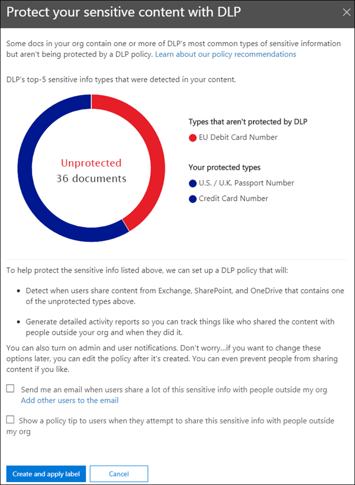
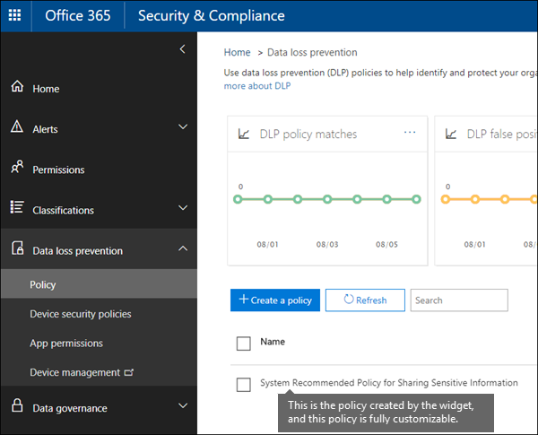

# Empfohlene erste Schritte mit DLP-RichtlinienvorlagenGet started with DLP policy recommendations

Diese Erkenntnis gesteuerte Empfehlung hilft Ihrer Organisation, vertrauliche Inhalte zu schützen, wenn Sie in Microsoft 365 gespeichert und freigegeben wird, indem Sie darüber informiert werden, wenn eine mögliche Lücke in ihrer DLP-Richtlinien Abdeckung besteht.This insight-driven recommendation helps your organization keep sensitive content secure when it's stored and shared in Microsoft 365 by informing you when there's a possible gap in your DLP policy coverage. Diese Empfehlung wird auf der **Start** Seite des Security &amp; Compliance Centers angezeigt, wenn Ihre Dokumente eine der fünf häufigsten Arten von vertraulichen Informationen enthalten, die jedoch nicht durch eine Richtlinie zur Verhinderung von Datenverlust (Data Loss Prevention, DLP) geschützt sind.You'll see this recommendation on the **Home** page of the Security &amp; Compliance Center, if your documents contain any of the top-five most common types of sensitive information but aren't protected by a data loss prevention (DLP) policy. 
  
Sie können dieses Widget verwenden, um schnell eine angepasste DLP-Richtlinie mit nur einem Mausklick oder zwei zu erstellen, und nachdem Sie diese DLP-Richtlinie erstellt haben, ist sie vollständig anpassbar.You can use this widget to quickly create a customized DLP policy in just a click or two, and after you create this DLP policy, it's fully customizable. Wenn die Empfehlung zunächst nicht angezeigt wird, klicken Sie im unteren Bereich des Abschnitts **empfohlen für Sie** auf **+ mehr** .Note that if you don't see the recommendation at first, try clicking **+More** at the bottom of the **Recommended for you** section. 
  

  
## Erstellen der empfohlenen DLP-RichtlinieCreate the recommended DLP policy

Wenn das Widget Ihnen ungeschützte vertrauliche Informationen zeigt, wählen Sie am unteren Rand **Erste Schritte** aus, um schnell eine DLP-Richtlinie zu erstellen.When the widget shows you unprotected sensitive information, choose **Get started** at the bottom to quickly create a DLP policy. 
  
Zum Schutz der vertraulichen Informationen wird diese DLP-Richtlinie wie folgt unterstützt:To help protect the sensitive information, this DLP policy:
  
- Erkennt, wenn Inhalte in Exchange, SharePoint und OneDrive, die einen der ungeschützten Typen vertraulicher Informationen enthalten, für Personen außerhalb Ihrer Organisation freigegeben werden.Detects when content in Exchange, SharePoint, and OneDrive that contains one of the unprotected types of sensitive information is shared with people outside your organization.
    
- Generiert detaillierte Aktivitätsberichte, sodass Sie nachverfolgen können, wie wer die Inhalte für Personen außerhalb Ihrer Organisation freigegeben hat.Generates detailed activity reports so that you can track things like who shared the content with people outside your organization and when they did it. Sie können die [DLP-Berichte](view-the-dlp-reports.md) und [Überwachungsprotokolldaten](search-the-audit-log-in-security-and-compliance.md) (Where **Activity**  =  **DLP**) verwenden, um diese Informationen anzuzeigen.You can use the [DLP reports](view-the-dlp-reports.md) and [audit log data](search-the-audit-log-in-security-and-compliance.md) (where **Activity** = **DLP**) to see this information.
    
Sie können auch die DLP-Richtlinie festlegen:You can also choose to have the DLP policy:
  
- Senden Sie eine Vorfall Berichts-e-Mail, wenn Benutzer viele dieser vertraulichen Informationen für Personen außerhalb Ihrer Organisation freigeben.Send you an incident report email when users share a lot of this sensitive information with people outside your organization.
    
- Fügen Sie dem e-Mail-Vorfall Bericht weitere Benutzer hinzu.Add other users to the email incident report.
    
- Zeigen Sie einen richtlinientipp an, und senden Sie eine e-Mail-Benachrichtigung an Benutzer, wenn Sie versuchen, diese vertraulichen Informationen für Personen außerhalb Ihrer Organisation freizugeben.Show a policy tip and send an email notification to users when they attempt to share this sensitive information with people outside your organization. Weitere Informationen zu diesen Optionen finden Sie unter [Senden von e-Mail-Benachrichtigungen und Anzeigen von Richtlinien Tipps für DLP-Richtlinien](use-notifications-and-policy-tips.md).For more information on these options, see [Send email notifications and show policy tips for DLP policies](use-notifications-and-policy-tips.md).
    
Wenn Sie diese Optionen später ändern möchten, können Sie die DLP-Richtlinie nach ihrer Erstellung bearbeiten.If you want to change these options later, you can edit the DLP policy after it's created. Beispielsweise können Sie die Richtlinie restriktiver machen, indem Sie auch Personen daran hindern, Inhalte freizugeben, die vertrauliche Informationen an erster Stelle enthalten-siehe den nächsten Abschnitt.For example, you can make the policy more restrictive by even blocking people from sharing content that contains sensitive information in the first place - see the next section.
  

  
## Bearbeiten der empfohlenen DLP-RichtlinieEdit the recommended DLP policy

Nachdem Sie das Widget zum Erstellen einer DLP-Richtlinie verwendet haben, wird die Richtlinie unter **Verhinderung von Datenverlust** auf der Seite **Richtlinie** des Security &amp; Compliance Centers angezeigt.After you use the widget to create a DLP policy, the policy appears under **Data loss prevention** on the **Policy** page of the Security &amp; Compliance Center. 
  
Standardmäßig wird die Richtlinie **als System empfohlene Richtlinie für die Freigabe vertraulicher Informationen**bezeichnet.By default, the policy is named **System Recommended Policy for Sharing Sensitive Information**. Diese Richtlinie ist vollständig anpassbar, genauso wie jede DLP-Richtlinie, die Sie selbst von Grund auf neu erstellen.This policy is fully customizable, the same as any DLP policy that you create yourself from scratch. Wenn Sie beispielsweise entschieden haben, bei der Verwendung des Widgets keine vorfallberichte und Richtlinien Tipps zu aktivieren, können Sie die Richtlinie jederzeit bearbeiten und diese Optionen jederzeit aktivieren.For example, if you decided not to turn on incident reports and policy tips when you used the widget, you can always edit the policy and turn on those options at any time.
  

  
## Wenn das Widget funktioniert und nicht angezeigt wirdWhen the widget does and does not appear

Das Widget namens **ungeschützte vertrauliche Informationen** wird im Abschnitt **empfohlen für Sie** der **Start** Seite des Security &amp; Compliance Center angezeigt.The widget named **Unprotected Sensitive Information** appears in the **Recommended for you** section of the **Home** page of the Security &amp; Compliance Center. 
  
Dieses Widget wird nur angezeigt, wenn:This widget appears only when:
  
- Neue Dokumente, die eine der fünf häufigsten Arten von vertraulichen Informationen enthalten, werden in SharePoint oder OneDrive in den letzten 30 Tagen erkannt.New documents containing any of the five most common types of sensitive information are detected in SharePoint or OneDrive over the past 30 days.
    
- Diese vertraulichen Informationen sind nicht bereits durch eine vorhandene DLP-Richtlinie geschützt.That sensitive information is not already protected by an existing DLP policy.
    
Im Gegensatz zu DLP-Richtlinien, die Ihre Daten ständig überprüfen, überprüft diese Empfehlung nach Lücken in ihrer DLP-Richtlinien Abdeckung etwa alle 48 Stunden, sodass nach dem Hochladen neuer Inhalte bis zu zwei Tage dauern kann, bis die Empfehlung angezeigt wird.Unlike DLP policies that are constantly scanning your data, this recommendation scans for gaps in your DLP policy coverage roughly every 48 hours, so after new content is uploaded, it may take up to two days for the recommendation to appear.
  
Nachdem Sie das Widget zum Erstellen einer empfohlenen DLP-Richtlinie verwendet haben, wird das Widget nicht mehr auf der **Start** Seite angezeigt.Finally, after you use the widget to create a recommended DLP policy, the widget disappears from the **Home** page. 
  

