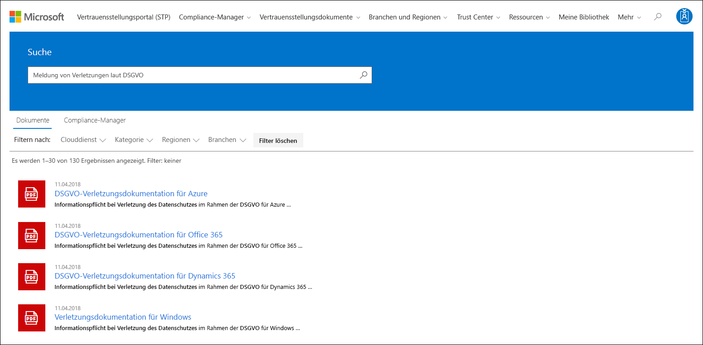
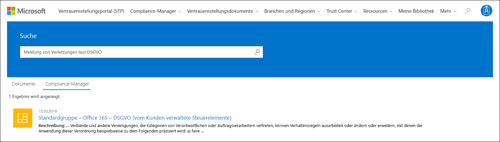

# Erste Schritte mit dem Microsoft Service Trust-PortalGet started with the Microsoft Service Trust Portal

Das Microsoft-Dienst Vertrauensstellungs Portal bietet eine Vielzahl von Inhalten, Tools und anderen Ressourcen zur Microsoft-Sicherheits-, Datenschutz-und Compliance-Praxis.The Microsoft Service Trust Portal provides a variety of content, tools, and other resources about Microsoft security, privacy, and compliance practices.
  
## Zugreifen auf das Dienst Vertrauensstellungs PortalAccessing the Service Trust Portal

Das Dienst Vertrauensstellungs Portal enthält Details zur Implementierung von Steuerelementen und Prozessen durch Microsoft, die unsere Cloud-Dienste und die darin enthaltenen Kundendaten schützen.The Service Trust Portal contains details about Microsoft's implementation of controls and processes that protect our cloud services and the customer data therein. Um auf einige Ressourcen im Dienst Vertrauensstellungs Portal zuzugreifen, müssen Sie sich als authentifizierter Benutzer mit Ihrem Microsoft Cloud Services-Konto (entweder mit einem Azure Active Directory-organisationskonto oder einem Microsoft-Konto) anmelden und die Microsoft-Geheimhaltungsvereinbarung für Compliance-Materialien überprüfen und akzeptieren.To access some of the resources on the Service Trust Portal, you must log in as an authenticated user with your Microsoft cloud services account (either an Azure Active Directory organization account or a Microsoft Account) and review and accept the Microsoft Non-Disclosure Agreement for Compliance Materials.
  
**Vorhandene Kunden können auf das Dienst Vertrauensstellungs Portal** unter [https://aka.ms/STP](https://aka.ms/STP) mit einem der folgenden Online Abonnements (Testversion oder bezahlt) zugreifen:**Existing customers can access the Service Trust Portal** at [https://aka.ms/STP](https://aka.ms/STP) with one of the following online subscriptions (trial or paid): 
  
- Microsoft 365Microsoft 365

- Dynamics 365Dynamics 365

- AzureAzure
    
 > [!NOTE]
 > Azure Active Directory Konten, die Organisationen zugeordnet sind, haben Zugriff auf die gesamte Palette von Dokumenten und Features wie Compliance-Manager.Azure Active Directory accounts associated with organizations have access to the full range of documents and features like Compliance Manager. Microsoft-Konten, die für die persönliche Verwendung erstellt wurden, haben begrenzten Zugriff auf Dienst Vertrauensstellungs Portal Inhalte.Microsoft accounts created for personal use have limited access to Service Trust Portal content. 
  
**Neue Kunden und Kunden, die Microsoft Online Services bewerten****New customers and customers evaluating Microsoft online services**
  
Um ein neues Konto zu erstellen oder ein Test Konto zu erstellen, verwenden Sie eines der folgenden Anmeldeformulare (auch für Testkonten verwendet), um Zugriff auf STP zu erhalten.To create a new account or to create a trial account, use one of the following sign-up forms (also used for trial accounts) to get access to the STP.
  
- Registrieren Sie sich für ein neues [Microsoft 365 apps for Business-Test Konto](https://go.microsoft.com/fwlink/p/?LinkID=507653) oder ein neues [Office 365 Enterprise Test Konto](https://go.microsoft.com/fwlink/p/?LinkID=698279) .Sign up for a new [Microsoft 365 Apps for business trial account](https://go.microsoft.com/fwlink/p/?LinkID=507653) or a new [Office 365 Enterprise trial account](https://go.microsoft.com/fwlink/p/?LinkID=698279)

- Registrieren für ein neues [Test Konto für Dynamics 365](https://go.microsoft.com/fwlink/?LinkId=252780)Sign up for a new [Dynamics 365 trial account](https://go.microsoft.com/fwlink/?LinkId=252780)

- Registrieren Sie sich für ein neues [Azure-Test Konto](https://go.microsoft.com/fwlink/?LinkId=722737).Sign up for a new [Azure trial account](https://go.microsoft.com/fwlink/?LinkId=722737). 
    
Wenn Sie sich für eine kostenlose Testversion oder ein Abonnement registrieren, müssen Sie Azure Active Directory aktivieren, um Ihren Zugriff auf STP zu unterstützen.When you sign up for either a free trial, or a subscription, you must enable Azure Active Directory to support your access to the STP.
  
## Verwenden des Dienst Vertrauensstellungs PortalsUsing the Service Trust Portal

Die Features und Inhalte des Dienst Vertrauensstellungs Portals können über das Hauptmenü aufgerufen werden.The Service Trust Portal features and content are accessible from the main menu.
  

In den folgenden Abschnitten werden die einzelnen Elemente im Haupt Menü beschrieben.The following sections describe each item in the main menu.
  
### Service Trust PortalService Trust Portal

Der Link **Service Trust Portal** zeigt die Startseite an.The **Service Trust Portal** link displays the home page. Es bietet eine schnelle Möglichkeit, wieder zur Startseite zu gelangen.It provides a quick way to get back to the home page.

### Compliance-ManagerCompliance Manager

Compliance-Manager ist ein Workflow basiertes Risiko Bewertungstool, mit dem Sie die behördlichen Compliance-Aktivitäten Ihrer Organisation im Zusammenhang mit Microsoft-Cloud-Diensten wie Microsoft 365, Dynamics 365 und Azure nachverfolgen, zuweisen und überprüfen können.Compliance Manager is a workflow-based risk assessment tool that helps you track, assign, and verify your organization's regulatory compliance activities related to Microsoft Cloud services, such as Microsoft 365, Dynamics 365, and Azure. Verwenden Sie den Compliance-Manager, um die Einhaltung gesetzlicher Vorschriften innerhalb des Modells der Cloud mit gemeinsamer Verantwortung zu verwalten.Use Compliance Manager to manage regulatory compliance within the shared responsibility model of the cloud. Je nach der Version von Compliance-Manager, die Sie verwenden möchten, lesen Sie die folgenden Artikel, um weitere Informationen zu erhalten:Depending on the version of Compliance Manager you want to use, see the following articles for more information:

- [Microsoft Compliance-Manager (klassisch)Microsoft Compliance Manager (Classic)](meet-data-protection-and-regulatory-reqs-using-microsoft-cloud.md)

- [Microsoft Compliance-Manager (Vorschau)Microsoft Compliance Manager (Preview)](compliance-manager-overview.md)

### VertrauensstellungsdokumenteTrust Documents

Enthält eine Vielzahl von Sicherheits Implementierungs-und-Entwurfsinformationen, mit dem Ziel, die Einhaltung gesetzlicher Vorschriften zu vereinfachen, indem Sie verstehen, wie die Datensicherheit von Microsoft Cloud Services gewährleistet ist.Provides a wealth of security implementation and design information with the goal of making it easier for you to meet regulatory compliance objectives by understanding how Microsoft Cloud services keep your data secure. Wählen Sie zum Überprüfen des Inhalts im Pulldown-Menü **Trust Documents** eine der folgenden Optionen aus.To review content, select one of the following options on the **Trust Documents** pull-down menu.

- **Überwachungsberichte:** Eine Liste von unabhängigen Überwachungs-und Bewertungsberichten in den Cloud-Diensten von Microsoft wird angezeigt.**Audit Reports:** A list of independent audit and assessment reports on Microsoft's Cloud services is displayed. Diese Berichte bieten Informationen über die Einhaltung von Datenschutzstandards und behördlichen Anforderungen durch Microsoft Cloud Services, beispielsweise:These reports provide information about Microsoft Cloud services compliance with data protection standards and regulatory requirements, such as:
  
    - Internationale Standardisierungsorganisation (ISO)International Organization for Standardization (ISO)

    - Service Organization Controls (SOC)Service Organization Controls (SOC)

    - NIST (National Institute of Standards and Technology)National Institute of Standards and Technology (NIST)

    - FedRAMP (Federal Risk and Authorization Management Program)Federal Risk and Authorization Management Program (FedRAMP)

    - DSGVO (EU-Datenschutz-Grundverordnung)General Data Protection Regulation (GDPR)

- **Datenschutz:** Enthält eine Vielzahl von Ressourcen wie überwachte Steuerelemente, Whitepapers, FAQs, Penetrationstests, Tools zur Risikobewertung und Compliance Guides.**Data Protection:** Contains a wealth of resources such as audited controls, white papers, FAQs, penetration tests, risk assessment tools, and compliance guides.

- **Azure Security and Compliance Blueprints:** Ressourcen, die Sie bei der Erstellung sicherer und kompatibler Cloud-basierter Anwendungen unterstützen.**Azure Security and Compliance Blueprints:** Resources that help you build secure and compliant cloud-based applications. Dieser Bereich enthält Blueprint-Anleitungen für die vertikalen Bereiche Government, Finance, Healthcare und Retail.This area contain blueprint-guidance for government, finance, healthcare, and retail verticals.

### Branchen und RegionenIndustries & Regions

Bietet Branchen-und regionsspezifische Konformitätsinformationen zu Microsoft Cloud Services.Provides industry- and region-specific compliance information about Microsoft Cloud services.

- **Branchen:** Zu diesem Zeitpunkt stellt diese Seite eine branchenspezifische Startseite für die Finanzdienstleistungsbranche bereit.**Industries:** At this time, this page provides an industry-specific landing page the for the Financial Services industry. Dies enthält Informationen wie Compliance-Angebote, FAQs und Erfolgsgeschichten.This contains information such as compliance offerings, FAQs, and success stories. Ressourcen für weitere Branchen werden zukünftig freigegeben, Sie können jedoch Ressourcen für weitere Branchen finden, indem Sie auf die Seite **Trust Documents > Data Protection** in STP wechseln.Resources for more industries will be released in the future, however you can find resources for more industries by going to the **Trust Documents > Data Protection** page in the STP.

- **Regionen:** Bietet Rechtsgutachten zu Microsoft Cloud Services Compliance mit verschiedenen Gesetzen verschiedener Länder.**Regions:** Provides legal opinions on Microsoft Cloud services compliance with various the laws of various countries. Zu den einzelnen Ländern gehören Australien, Kanada, Tschechische Republik, Dänemark, Deutschland, Polen, Rumänien, Spanien und das Vereinigte Königreich.Specific countries include Australia, Canada, Czech Republic, Denmark, Germany, Poland, Romania, Spain, and the United Kingdom.
  
### SicherheitscenterTrust Center

Links zum [Microsoft Trust Center](https://www.microsoft.com/trust-center), das weitere Informationen zur Sicherheit, Compliance und Datenschutz in der Microsoft-Cloud bereitstellt.Links to the [Microsoft Trust Center](https://www.microsoft.com/trust-center), which provides more information about security, compliance, and privacy in the Microsoft Cloud. Dies umfasst Informationen zu den Funktionen in Microsoft Cloud-Diensten, die Sie verwenden können, um bestimmte Anforderungen des dsgvo zu erfüllen, Dokumentation, die für Ihre dsgvo-Verantwortlichkeit hilfreich ist, sowie für Ihr Verständnis der technischen und organisatorischen Maßnahmen, die Microsoft zur Unterstützung der dsgvo ergriffen hat.This includes information about the capabilities in Microsoft Cloud services that you can use to address specific requirements of the GDPR, documentation helpful to your GDPR accountability and to your understanding of the technical and organizational measures Microsoft has taken to support the GDPR.
  
### Meine BibliothekMy Library

Mit diesem neuen Feature können Sie Dokumente speichern (oder *anheften*), sodass Sie auf der Seite "Meine Bibliothek" schnell darauf zugreifen können.This new feature lets you save (or *pin*) documents so that you can quickly access them on your My Library page. Sie können Benachrichtigungen auch so einrichten, dass Microsoft Ihnen eine e-Mail-Nachricht sendet, wenn Dokumente in Ihrer My-Bibliothek aktualisiert werden.You can also set up notifications so that Microsoft sends you an email message when documents in your My Library are updated. Weitere Informationen finden Sie im Abschnitt " [Meine Bibliothek](#my-library-1) " in diesem Artikel.For more information, see the [My Library](#my-library-1) section in this article.

### Mehr More

Wechseln Sie zu **Weitere > Administrator** , um auf administrative Funktionen zuzugreifen, die nur für das globale Administratorkonto verfügbar sind.Go to **More > Admin** to access administrative functions that are only available to the global administrator account. Diese Option ist nur sichtbar, wenn Sie als globaler Administrator angemeldet sind.This option is visible only when you are signed in as a global administrator. Im Pulldown-Menü **Admin** gibt es zwei Optionen:There are two options in the **Admin** pull-down menu:
  
- **Einstellungen:** Auf dieser Seite können Sie dem Compliance-Manager rollenbasierten Zugriff (als *Benutzerrollen*bezeichnet) zuweisen.**Settings:** This page lets you assign role-based access (known as *user roles*) to Compliance Manager.  Weitere Informationen finden Sie unter:For more information, see:
   
  - [Berechtigungen im Compliance-Manager (klassisch)Permissions in Compliance Manager (Classic)](meet-data-protection-and-regulatory-reqs-using-microsoft-cloud.md#permissions-and-role-based-access-control)
   
  - [Berechtigungen im Compliance-Manager (Vorschau)Permissions in Compliance Manager (Preview)](compliance-manager-overview.md#permissions)

  Sie können auch konfigurieren, ob Aktionen im Compliance-Manager basierend auf dem Status der gleichen Aktion in "Secure Score" aktualisiert werden.You can also configure whether actions in Compliance Manager are updated based on the status of the same action in Secure Score. Diese Funktion wird nur unterstützt, wenn Sie die neueste Version von Compliance-Manager verwenden.This capability is only supported if you're using the latest version of Compliance Manager. Weitere Informationen finden Sie unter [Controlling Automatic Secure Score Updates](working-with-compliance-manager.md#controlling-automatic-secure-score-updates).For more information, see [Controlling automatic Secure Score updates](working-with-compliance-manager.md#controlling-automatic-secure-score-updates).

- **Datenschutzeinstellungen für den Benutzer:** Auf dieser Seite können Sie einen Bericht exportieren, der Aktionselement Zuweisungen im Compliance-Manager für einen bestimmten Benutzer enthält.**User Privacy Settings:** This page lets you export a report that contains action item assignments in Compliance Manager for a specific user. Sie können auch alle Aktionselemente einem anderen Benutzer zuweisen und das zugewiesene Aktionselement aus dem angegebenen Benutzer entfernen.You can also reassign all action items to a different user and remove any assigned action item from the specified user. Weitere Informationen finden Sie unter [Datenschutzeinstellungen](meet-data-protection-and-regulatory-reqs-using-microsoft-cloud.md#user-privacy-settings)für den Benutzer.For more information, see [User Privacy settings](meet-data-protection-and-regulatory-reqs-using-microsoft-cloud.md#user-privacy-settings).

### SucheSearch

Klicken Sie auf das Lupensymbol in der oberen rechten Ecke der Seite Vertrauens Portal für das Dienst Vertrauen, um das Feld zu erweitern, Ihre Suchbegriffe einzugeben und die **Eingabe**Taste zu drücken.Click the magnifying glass in the upper right-hand corner of the Service Trust Portal page to expand the box, enter your search terms, and press **Enter**. Die **Such** Seite wird angezeigt, wobei der Suchbegriff im Suchfeld und die unten aufgeführten Suchergebnisse angezeigt werden.The **Search** page is displayed, with the search term displayed in the search box and the search results listed below.
  

Standardmäßig gibt die Th-Suche Dokument Ergebnisse zurück.By default, th search returns document results. Sie können die Ergebnisse mithilfe der Dropdownlisten filtern, um die Liste der angezeigten Dokumente zu verfeinern.You can filter the results by using the dropdown lists to refine the list of documents displayed. Sie können mehrere Filter verwenden, um die Liste der Dokumente einzugrenzen.You can use multiple filters to narrow the list of documents. Filter umfassen die spezifischen Cloud-Dienste, Kategorien von Compliance-oder Sicherheitsmethoden, Regionen und Branchen.Filters include the specific cloud services, categories of compliance or security practices, regions, and industries. Klicken Sie auf den Link Dokumentname, um das Dokument herunterzuladen.Click the document name link to download the document.
  
Zum Auflisten von Steuerelementen aus Bewertungen im Compliance-Manager, die Ihre Suchbegriffe betreffen, klicken Sie auf **Compliance-Manager**.To list controls from Assessments in Compliance Manager related your search terms, click **Compliance Manager**. In den Suchergebnissen wird das Datum, an dem die Bewertung erstellt wurde, der Name der Bewertungs Gruppierung, der entsprechende Microsoft-clouddienst und die Angabe, ob das Steuerelement von Microsoft oder von Kunden verwaltet wird, angezeigt.The search results show the date the assessment was created, the name of the assessment grouping, the applicable Microsoft Cloud service, and whether the control is Microsoft or Customer Managed. Klicken Sie auf den Namen des Steuerelements, um das Steuerelement im Kompatibilitäts-Manager im Assessment anzuzeigen.Click the name of the control to view the control in the Assessment in Compliance Manager.
  

  
> [!NOTE]
> Berichte und Dokumente des Dienst Vertrauensstellungs Portals können nach der Veröffentlichung mindestens 12 Monate heruntergeladen werden oder bis eine neue Dokumentversion verfügbar ist.Service Trust Portal reports and documents are available to download for at least 12 months after publishing or until a new version of document becomes available.
  
## Meine BibliothekMy Library

Verwenden Sie das My Library-Feature, um Dokumente und Ressourcen im Dienst Vertrauensstellungs Portal zur Seite Meine Bibliothek hinzuzufügen.Use the My Library feature to add documents and resources on the Service Trust Portal to your My Library page. Auf diese Weise können Sie auf Dokumente zugreifen, die für Sie an einem zentralen Ort relevant sind.This lets you access documents that are relevant to you in a single place.  Klicken Sie zum Hinzufügen eines Dokuments zu "Meine Bibliothek" rechts neben einem Dokument auf das Menü **...** , und wählen Sie dann **in Bibliothek speichern**aus.To add a document to your My Library, click the **...** menu to the right of a document and then select **Save to library**. Sie können Ihrer My-Bibliothek mehrere Dokumente hinzufügen, indem Sie auf das Kontrollkästchen neben einem oder mehreren Dokumenten klicken und dann oben auf der Seite **auf in Bibliothek speichern** klicken.You can add multiple documents to your My Library by clicking the checkbox next to one or more documents, and then clicking **Save to library** at the top of the page.

Darüber hinaus können Sie mit der Benachrichtigungsfunktion Ihre meine Bibliothek so konfigurieren, dass eine e-Mail-Nachricht an Sie gesendet wird, wenn Microsoft ein Dokument aktualisiert, das Sie Ihrer "Meine Bibliothek" hinzugefügt haben.Additionally, the notifications feature lets you configure your My Library so that an email message is sent to you whenever Microsoft updates a document that you've added to your My Library. Um Benachrichtigungen einzurichten, wechseln Sie zu meine Bibliothek, und klicken Sie auf **Benachrichtigungseinstellungen**.To set up notifications, go to your My Library and click **Notification Settings**. Sie können die Häufigkeit der Benachrichtigungen auswählen und eine e-Mail-Adresse in Ihrer Organisation angeben, an die Benachrichtigungen gesendet werden sollen.You can choose the frequency of notifications and specify an email address in your organization to send notifications to. E-Mail-Benachrichtigungen enthalten Links zu den aktualisierten Dokumenten und eine kurze Beschreibung des Updates.Email notifications include links to the documents that have been updated and a brief description of the update.

Beachten Sie auch, dass wir alle Dokumente in Ihrer My-Bibliothek identifizieren, die innerhalb der letzten 30 Tage aktualisiert wurden, unabhängig davon, ob Sie Benachrichtigungen aktivieren oder nicht.Also note that we identify any documents in your My Library that have been updated within the last 30 days, regardless of whether or not you turn on notifications. Eine kurze Beschreibung des Updates wird auch in einer QuickInfo angezeigt.A brief description of the update is also displayed in a tool tip.

## Starter PacksStarter packs

Starter Packs sind eine Sammlung von Microsoft-kuratierten Dokumentationen zu Microsoft Cloud Services für bestimmte Branchen.Starter packs are a Microsoft-curated set of documentation about Microsoft Cloud services for specific industries. Derzeit bietet das Dienst Vertrauensstellungs Portal die folgenden drei Starter Pakete für Finanz Dienstleistungsorganisationen.Currently, the Service Trust Portal offers the following three starter packs for financial services organizations. Diese Starter Packs unterstützen Organisationen bei der Bewertung und Bewertung von Sicherheit, Compliance und Datenschutz in der Microsoft-Cloud und bieten Anleitungen zur Implementierung von Microsoft Cloud Services in der hoch regulierten Finanzdienstleistungsbranche.These starter packs help organizations evaluate and assess security, compliance, and privacy in the Microsoft Cloud and provide guidance to help implement Microsoft Cloud services in the highly regulated financial services industry.

- **Evaluation Starter Pack:** Verwenden Sie für eine frühe Evaluierung der Microsoft-Cloud für Finanz Dienstleistungsorganisationen.**Evaluation Starter Pack:** Use for early evaluation of the Microsoft cloud for financial services organizations.

- **Assessment Starter Pack:** Verwenden Sie nach der Evaluierung die Checklisten und andere Anleitungen in diesem Starter Pack, um Ihre Organisation bei der Bewertung von Risiken im Zusammenhang mit Sicherheit, Compliance und Datenschutz zu unterstützen.**Assessment Starter Pack:** After evaluation, use the checklists and other guidance in this starter pack to help your organization assess risks related to security, compliance, and privacy.

- **Startpaket für Überwachung:** Benutzer dieses Starter Packs finden Sie Anleitungen zur Verwendung von Überwachungs Steuerelementen und anderen Tools, um die Implementierung von Microsoft Cloud-Diensten so zu unterstützen, dass die Gefährdung Ihrer Organisation reduziert werden kann.**Audit Starter Pack:** User this starter pack for guidance on using auditing controls and other tool to help guide your implementation of Microsoft Cloud services in a way that helps reduce your organization's exposure to risk.

Um auf diese Starter Packs zuzugreifen, wechseln Sie zu **Dienst Vertrauensstellungs Portal > Branchen & Regionen > Branchenlösungen > Finanzdienstleistungen**.To access these starter packs, go to **Service Trust Portal > Industries & Regions > Industry Solutions > Financial Services**. Sie können Dokumente aus einem Starter Pack öffnen oder herunterladen oder in Ihrer My-Bibliothek speichern.You can open or a download documents from a starter pack or save them to your My Library.

## Unterstützung der LokalisierungLocalization support

Mit dem Dienst Vertrauensstellungs Portal können Sie den Seiteninhalt in verschiedenen Sprachen anzeigen.The Service Trust Portal enables you to view the page content in different languages. Um die Sprache der Seite zu ändern, klicken Sie einfach auf das Globussymbol in der linken unteren Ecke der Seite und wählen Sie die Sprache Ihrer Wahl aus.To change the page language, simply click on the globe icon in the lower left corner of the page and select the language of your choice. 
  

  
## FeedbackFeedback

Wir helfen Ihnen bei Fragen zum Dienst Vertrauensstellungs Portal oder Fehlern, die bei der Verwendung des Portals auftreten.We can help with questions about the Service Trust Portal, or errors you experience when you use the portal. Sie können uns auch bei Fragen und Feedback zu den Kompatibilitätsberichten des Service Trust Portals und zum vertrauenswürdigen Ressourcen mithilfe des Feedback Links unten auf den STP-Seiten kontaktieren.You can also contact us with questions and feedback about Service Trust Portal compliance reports and trust resources by using the Feedback link on the bottom of the STP pages.
  
Ihr Feedback ist uns wichtig.Your feedback is important to us. Klicken Sie auf die Schaltfläche Feedback am unteren Rand der Seite, um uns Kommentare darüber zu senden, was Sie getan oder nicht mochten, oder Vorschläge, die Sie zur Verbesserung unserer Produkte oder Produktfunktionen haben können.Click on the Feedback button at the bottom of the page to send us comments about what you did or did not like, or suggestions you may have for improving our products or product features.
  

