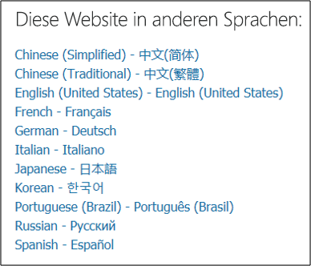

# Erste Schritte mit dem Microsoft Service Trust Portal

Das Microsoft Service Trust Portal bietet eine Vielzahl von Inhalten, Tools und anderen Ressourcen zu Sicherheit, Datenschutz und Compliancepraktiken von Microsoft.

## Zugreifen auf das Dienstvertrauensportal

Das Service Trust Portal enthält Details über die Implementierung von Kontrollen und Prozessen durch Microsoft, die unsere Cloud-Dienste und die darin enthaltenen Kundendaten schützen. Um auf einige Ressourcen im Dienstvertrauensportal zu zugreifen, müssen Sie sich als authentifizierter Benutzer mit Ihrem Microsoft Cloud Services-Konto (entweder ein Azure Active Directory-Organisationskonto oder ein Microsoft-Konto) anmelden und den Microsoft-Geheimhaltungsvertrag für Compliancematerialien überprüfen und akzeptieren.

### Vorhandene Kunden

Vorhandene Kunden können über eines der folgenden Onlineabonnements (Testversion oder kostenpflichtig) auf das Dienstvertrauensportal <https://aka.ms/STP> zugreifen:

- Microsoft 365
- Dynamics 365
- Azure

 > [!NOTE]
 > Azure Active Directory Konten, die Organisationen zugeordnet sind, haben Zugriff auf die gesamte Palette von Dokumenten und Features wie Compliance Manager. Microsoft-Konten, die für den persönlichen Gebrauch erstellt wurden, haben eingeschränkten Zugriff auf Inhalte des Service Trust Portals.

### Neue Kunden und Kunden, die Microsoft Onlinedienste bewerten

Verwenden Sie zum Erstellen eines neuen Kontos oder zum Erstellen eines Testkontos eines der folgenden Anmeldeformulare (das auch für Testkonten verwendet wird), um Zugriff auf das StSP zu erhalten.

- Registrieren eines neuen Microsoft 365 Apps for Business [oder](https://go.microsoft.com/fwlink/p/?LinkID=507653) eines neuen Office 365 Enterprise [Testkontos](https://go.microsoft.com/fwlink/p/?LinkID=698279)

- Registrieren eines neuen [Dynamics 365-Testkontos](https://go.microsoft.com/fwlink/?LinkId=252780)

- Registrieren Sie sich für ein neues [Azure-Testkonto.](https://go.microsoft.com/fwlink/?LinkId=722737)

Wenn Sie sich für eine kostenlose Testversion oder ein Abonnement registrieren, müssen Sie Azure Active Directory, um Ihren Zugriff auf den StSP zu unterstützen.

## Verwenden des Dienstvertrauensportals

Auf die Features und Inhalte des Service Trust Portals kann über das Hauptmenü zugegriffen werden.

In den folgenden Abschnitten werden die einzelnen Elemente im Hauptmenü beschrieben.

### Service Trust Portal

Der **Link Dienstvertrauensportal** zeigt die Homepage an. Es bietet eine schnelle Möglichkeit, zur Startseite zurück zu gelangen.

### Compliance-Manager

> [!IMPORTANT]
> Der Compliance-Manager wurde vom Dienstvertrauensportal an seinen neuen Speicherort im [Microsoft 365 Compliance Center verschoben.](https://compliance.microsoft.com/) Alle Kundendaten wurden an den neuen Standort verschoben, sodass Sie den Compliance Manager ohne Unterbrechung weiter verwenden können. Informationen zum Setup und weitere Informationen zu neuen Features finden Sie in der [Compliance-Manager-Dokumentation.](compliance-manager.md) Obwohl die klassische Version von Compliance Manager im Dienstvertrauensportal verbleibt, werden alle Benutzer aufgefordert, den Compliance-Manager im Microsoft 365 verwenden.

### Vertrauensstellungsdokumente

Bietet eine Vielzahl von Sicherheitsimplementierungs- und Entwurfsinformationen mit dem Ziel, Ihnen die Einhaltung gesetzlicher Complianceziele zu erleichtern, indem Sie verstehen, wie Microsoft Cloud Services Ihre Daten schützen. Wählen Sie zum Überprüfen des Inhalts eine der folgenden Optionen im Pulldownmenü **Dokumente zur Vertrauensstellung** aus.

- **Überwachungsberichte:** Eine Liste unabhängiger Überwachungs- und Bewertungsberichte zu den Clouddiensten von Microsoft wird angezeigt. Diese Berichte enthalten Informationen zur Einhaltung von Datenschutzstandards und behördlichen Anforderungen durch Microsoft Cloud Services, z. B.:

  - International Organization for Standardization (ISO)
  - Service Organization Controls (SOC)
  - NIST (National Institute of Standards and Technology)
  - FedRAMP (Federal Risk and Authorization Management Program)
  - DSGVO (EU-Datenschutz-Grundverordnung)

- **Datenschutz:** Enthält eine Vielzahl von Ressourcen wie überwachte Steuerelemente, Whitepaper, FAQs, Penetrationstests, Risikobewertungstools und Complianceanleitungen.

- **Azure Security and Compliance Blueprints:** Ressourcen, die Ihnen beim Erstellen sicherer und kompatibler cloudbasierter Anwendungen helfen. Dieser Bereich enthält Blaupausenleitfaden für Branchen des Ministeriums, der Finanzen, des Gesundheitswesens und des Einzelhandels.

### Branchen und Regionen

Stellt branchen- und regionspezifische Complianceinformationen zu Microsoft Cloud Services zur Verfügung.

- **Branchen:** Zu diesem Zeitpunkt stellt diese Seite eine branchenspezifische Angebotsseite für die Finanzdienstleister-Branche zur Verfügung. Diese enthält beispielsweise Informationen zu Compliance-Angeboten, häufig gestellten Fragen und Erfolgsgeschichten. Ressourcen für weitere Branchen werden in Zukunft freigegeben. Sie können jedoch  Ressourcen für weitere Branchen finden, indem Sie auf die Seite > Von Datenschutz im StP zugreifen.

- **Regionen:** Stellt rechtliche Ansichten zur Einhaltung verschiedener Gesetze in verschiedenen Ländern durch Microsoft Cloud Services zur Verfügung. Zu den länderspezifischen Ländern gehören Australien, Kanada, Tschechien, Dänemark, Deutschland, Polen, Rumänien, Spanien und Vereinigtes Königreich.

### Sicherheitscenter

Links zum [Microsoft Trust Center](https://www.microsoft.com/trust-center), das weitere Informationen zu Sicherheit, Compliance und Datenschutz in der Microsoft Cloud bietet. Dies umfasst Informationen zu den Funktionen in Microsoft Cloud Services, die Sie verwenden können, um bestimmte Anforderungen der DSGVO zu erfüllen, Dokumentationen, die für Ihre DSGVO-Verantwortlichkeit hilfreich sind, sowie zu Ihrem Verständnis der technischen und organisatorischen Maßnahmen, die Microsoft zur Unterstützung der DSGVO ergriffen hat.

### Meine Bibliothek

Mit diesem neuen Feature können Sie Dokumente speichern *(oder* anheften), sodass Sie schnell auf ihre Seite Meine Bibliothek zugreifen können. Sie können Benachrichtigungen auch so einrichten, dass Ihnen Microsoft eine E-Mail sendet, wenn Dokumente in Ihrer "Meine Bibliothek" aktualisiert werden. Weitere Informationen finden Sie im Abschnitt [Meine Bibliothek](#my-library-1) in diesem Artikel.

### Weitere Informationen

Wechseln Sie **zu Weitere > Administrator,** um auf Administrative Funktionen zu zugreifen, die nur für das globale Administratorkonto verfügbar sind. Diese Option ist nur sichtbar, wenn Sie als globaler Administrator angemeldet sind. Im Pull-Down-Menü **"Admin"** gibt es zwei Optionen:

- **Einstellungen:** Auf dieser Seite können Sie Benutzerrollen für Compliance Manager zuweisen (klassisch).

- **Datenschutzrichtlinien für Einstellungen:** Auf dieser Seite können Sie einen Bericht exportieren, der Aktionselementzuweisungen im Compliance Manager (klassisch) für einen bestimmten Benutzer enthält. Sie können auch alle Aktionselemente einem anderen Benutzer zuweisen und alle zugewiesenen Aktionselemente aus dem angegebenen Benutzer entfernen.

### Suche

Klicken Sie in der oberen rechten Ecke der Seite Dienstvertrauensportal auf die Lupe, um das Feld zu erweitern, geben Sie Ihre Suchbegriffe ein, und drücken Sie die **EINGABETASTE.** Die **Seite** Suche wird angezeigt, mit dem Suchbegriff im Suchfeld und den suchergebnissen unten aufgeführt.

Standardmäßig gibt die Suche Dokumentergebnisse zurück. Sie können die Ergebnisse mithilfe der Dropdownlisten filtern, um die Liste der angezeigten Dokumente zu verfeinern. Sie können mehrere Filter verwenden, um die Liste der Dokumente zu einenten. Filter umfassen die spezifischen Clouddienste, Kategorien von Compliance- oder Sicherheitspraktiken, Regionen und Branchen. Klicken Sie auf den Link Dokumentname, um das Dokument herunterzuladen.

Klicken Sie auf Compliance-Manager, um Steuerelemente aus Bewertungen im Compliance-Manager (klassisch) auflisten, die sich auf Ihre **Suchbegriffe bezogen haben.** Die Suchergebnisse zeigen das Datum, an dem die Bewertung erstellt wurde, den Namen der Bewertungsgruppe, den entsprechenden Microsoft Cloud-Dienst und ob das Steuerelement Microsoft oder Customer Managed ist. Klicken Sie auf den Namen des Steuerelements, um das Steuerelement im Assessment in Compliance Manager (klassisch) anzeigen zu können.

> [!NOTE]
> Berichte und Dokumente des Dienstvertrauensportals können mindestens 12 Monate nach der Veröffentlichung oder bis zu einer neuen Version des Dokuments heruntergeladen werden.

## Meine Bibliothek

Verwenden Sie das Feature Meine Bibliothek, um Ihrer Seite Meine Bibliothek Dokumente und Ressourcen im Dienstvertrauensportal hinzuzufügen. Auf diese Weise können Sie an einem einzigen Ort auf Dokumente zugreifen, die für Sie relevant sind.  Klicken Sie zum Hinzufügen eines Dokuments zu Ihrer Meine Bibliothek auf das Menü **...** rechts neben einem Dokument, und wählen Sie **dann Speichern in bibliothek aus.** Sie können Ihrer Meine Bibliothek mehrere Dokumente hinzufügen, indem Sie auf das Kontrollkästchen neben einem oder mehreren Dokumenten klicken und dann oben auf der Seite auf **In** Bibliothek speichern klicken.

Darüber hinaus können Sie mit dem Benachrichtigungsfeature Ihre Meine Bibliothek so konfigurieren, dass eine E-Mail-Nachricht an Sie gesendet wird, wenn Microsoft ein Dokument aktualisiert, das Sie Ihrer Meine Bibliothek hinzugefügt haben. Zum Einrichten von Benachrichtigungen wechseln Sie zu Meine Bibliothek, und klicken Sie auf **Benachrichtigung Einstellungen**. Sie können die Häufigkeit der Benachrichtigungen auswählen und eine E-Mail-Adresse in Ihrer Organisation angeben, an die Benachrichtigungen gesendet werden sollen. E-Mail-Benachrichtigungen enthalten Links zu den aktualisierten Dokumenten und eine kurze Beschreibung des Updates.

Beachten Sie außerdem, dass wir alle Dokumente in Ihrer Meine Bibliothek identifizieren, die innerhalb der letzten 30 Tage aktualisiert wurden, unabhängig davon, ob Sie Benachrichtigungen aktivieren oder nicht. Eine kurze Beschreibung des Updates wird auch in einer QuickInfo angezeigt.

## Starter packs

Starter Packs sind eine von Microsoft kuratierte Dokumentation zu Microsoft Cloud Services für bestimmte Branchen. Derzeit bietet das Service Trust Portal die folgenden drei Startpakete für Finanzdienstleister. Diese Startpakete unterstützen Organisationen bei der Bewertung und Bewertung von Sicherheit, Compliance und Datenschutz in der Microsoft Cloud und bieten Anleitungen zur Implementierung von Microsoft Cloud Services in der stark regulierten Finanzdienstbranche.

- **Evaluation Starter Pack:** Wird für eine frühzeitige Auswertung der Microsoft-Cloud für Finanzdienstleister verwendet.

- **Assessment Starter Pack:** Verwenden Sie nach der Auswertung die Prüflisten und andere Anleitungen in diesem Starter pack, um Ihre Organisation bei der Bewertung von Risiken im Zusammenhang mit Sicherheit, Compliance und Datenschutz zu unterstützen.

- **Audit Starter Pack:** Dieses Startpaket enthält Anleitungen zur Verwendung von Überwachungssteuerelementen und anderen Tools, um Ihre Implementierung von Microsoft Cloud Services so zu unterstützen, dass die Risiken Ihrer Organisation reduziert werden.

Um auf diese Startpakete zu zugreifen, wechseln Sie zu **Service Trust Portal > Industries & Regions > Industry Solutions > Financial Services**. Sie können Dokumente aus einem Startpaket öffnen oder herunterladen oder in Ihrer Meine Bibliothek speichern.

## Unterstützung der Lokalisierung

Das Service Trust Portal ermöglicht es Ihnen, den Seiteninhalt in anderen Sprachen anzuzeigen. Wenn Sie die Seitensprache ändern möchten, klicken Sie einfach in der unteren linken Ecke der Seite auf das Globussymbol, und wählen Sie die gewünschte Sprache aus.

## Feedback geben

Wir helfen Ihnen bei Fragen zum Dienstvertrauensportal oder bei Fehlern, die bei der Verwendung des Portals auftreten. Sie können uns auch mit Fragen und Feedback zu Dienstvertrauensportal-Complianceberichten und Vertrauensressourcen kontaktieren, indem Sie den Link Feedback unten auf den StP-Seiten verwenden.

Ihr Feedback ist uns wichtig. Klicken Sie unten auf der Seite auf die Schaltfläche Feedback, um uns Kommentare zu den Von Ihnen gemachten oder nicht gefällten Vorschlägen oder Vorschlägen zur Verbesserung unserer Produkte oder Produktfeatures zu senden.

