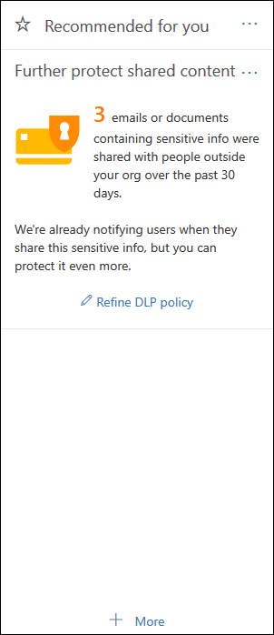

# Erste Schritte mit der DLP-StandardrichtlinieGet started with the default DLP policy

Bevor Sie ihre erste Richtlinie zur Verhinderung von Datenverlust (Data Loss Prevention, DLP) erstellen, hilft DLP dabei, Ihre vertraulichen Informationen mit einer Standardrichtlinie zu schützen.Before you even create your first data loss prevention (DLP) policy, DLP is helping to protect your sensitive information with a default policy. Diese Standardrichtlinie und ihre Empfehlung (siehe unten) helfen Ihnen, Ihre vertraulichen Inhalte zu schützen, indem Sie benachrichtigt werden, wenn E-Mails oder Dokumente mit einer Kreditkartennummer für jemanden außerhalb Ihrer Organisation freigegeben wurden.This default policy and its recommendation (shown below) help keep your sensitive content secure by notifying you when email or documents containing a credit card number were shared with someone outside your organization. Diese Empfehlung wird auf der **Startseite des** Security Compliance &amp; Centers angezeigt.You'll see this recommendation on the **Home** page of the Security &amp; Compliance Center. 
  
Sie können dieses Widget verwenden, um schnell anzuzeigen, wann und wie viele vertrauliche Informationen freigegeben wurden, und dann die Standard-DLP-Richtlinie in nur ein oder zwei Klicks zu verfeinern.You can use this widget to quickly view when and how much sensitive information was shared, and then refine the default DLP policy in just a click or two. Sie können die standardmäßige DLP-Richtlinie auch jederzeit bearbeiten, da sie vollständig anpassbar ist.You can also edit the default DLP policy at any time because it's fully customizable. Wenn die Empfehlung zunächst nicht angezeigt wird, klicken Sie unten im Abschnitt Empfohlen für Sie auf **+Mehr.** Note that if you don't see the recommendation at first, try clicking **+More** at the bottom of the **Recommended for you** section. 
  

  
## Anzeigen des Berichts und Verfeinern der Standard-DLP-RichtlinieView the report and refine the default DLP policy

Wenn das Widget zeigt, dass Benutzer vertrauliche Informationen für Personen außerhalb Ihrer Organisation freigegeben haben, wählen Sie unten die Option **DLP-Richtlinie** verfeinern aus.When the widget shows you that users have shared sensitive information with people outside your organization, choose **Refine DLP policy** at the bottom. 
  
Der detaillierte Bericht zeigt, wann und wie viel Inhalt mit Kreditkartennummern in den letzten 30 Tagen freigegeben wurde.The detailed report shows you when and how much content containing credit card numbers was shared in the past 30 days. Beachten Sie, dass es bis zu 48 Stunden dauern kann, bis Regel übereinstimmungen im Widget angezeigt werden.Note that rule matches can take up to 48 hours to show up in the widget.
  
Um die vertraulichen Informationen zu schützen, verwenden Sie die standardmäßige DLP-Richtlinie:To help protect the sensitive information, the default DLP policy:
  
- Erkennt, wann Inhalte in Exchange, SharePoint und OneDrive, die mindestens eine Kreditkartennummer enthalten, für Personen außerhalb Ihrer Organisation freigegeben werden.Detects when content in Exchange, SharePoint, and OneDrive that contains at least one credit card number is shared with people outside your organization.
    
- Zeigt einen Richtlinientipp an und sendet eine E-Mail-Benachrichtigung an Benutzer, wenn sie versuchen, diese vertraulichen Informationen für Personen außerhalb Ihrer Organisation zu teilen.Shows a policy tip and sends an email notification to users when they attempt to share this sensitive information with people outside your organization. Weitere Informationen zu diesen Optionen finden Sie unter Senden von [E-Mail-Benachrichtigungen und Anzeigen von Richtlinientipps für DLP-Richtlinien.](use-notifications-and-policy-tips.md)For more information on these options, see [Send email notifications and show policy tips for DLP policies](use-notifications-and-policy-tips.md).
    
- Generiert detaillierte Aktivitätsberichte, damit Sie Dinge nachverfolgen können, z. B. wer die Inhalte für Personen außerhalb Ihrer Organisation freigegeben hat und wann sie dies getan haben.Generates detailed activity reports so that you can track things like who shared the content with people outside your organization and when they did it. Sie können die [DLP-Berichte und](view-the-dlp-reports.md) [Überwachungsprotokolldaten](search-the-audit-log-in-security-and-compliance.md) (wobei **Activity** DLP ) verwendet werden,  =  um diese Informationen zu sehen.You can use the [DLP reports](view-the-dlp-reports.md) and [audit log data](search-the-audit-log-in-security-and-compliance.md) (where **Activity** = **DLP**) to see this information.
    
Um die Standard-DLP-Richtlinie schnell zu verfeinern, können Sie sie verwenden:To quickly refine the default DLP policy, you can choose to have it:
  
- Senden Sie eine Vorfallbericht-E-Mail, wenn Benutzer diese vertraulichen Informationen für Personen außerhalb Ihrer Organisation freigeben.Send you an incident report email when users share this sensitive information with people outside your organization.
    
- Fügen Sie dem E-Mail-Vorfallbericht weitere Benutzer hinzu.Add other users to the email incident report.
    
- Blockieren Sie den Zugriff auf den Inhalt, der die vertraulichen Informationen enthält, lassen Sie es dem Benutzer jedoch zu, diese zu überschreiben und zu teilen oder zu senden, falls dies nötig ist.Block access to the content containing the sensitive information, but allow the user to override and share or send if they need to.
    
Weitere Informationen zu Schadensberichten oder zum Einschränken des Zugriffs finden Sie unter Referenz zur Verhinderung [von Datenverlust](data-loss-prevention-policies.md).For more information on incident reports or restricting access, see [Data loss prevention reference](data-loss-prevention-policies.md).
  
Wenn Sie diese Optionen später ändern möchten, können Sie die Standardmäßige DLP-Richtlinie jederzeit bearbeiten – siehe den nächsten Abschnitt.If you want to change these options later, you can edit the default DLP policy at any time - see the next section.
  

  
## Bearbeiten der Standard-DLP-RichtlinieEdit the default DLP policy

Diese Richtlinie heißt **Standard-DLP-Richtlinie** und wird unter Verhinderung von Datenverlust auf der **Seite Richtlinie** des Security Compliance Center  &amp; angezeigt.This policy is named **Default DLP policy** and appears under **Data loss prevention** on the **Policy** page of the Security &amp; Compliance Center. 
  
Diese Richtlinie ist vollständig anpassbar, genauso wie jede DLP-Richtlinie, die Sie selbst von Grund auf erstellen.This policy is fully customizable, the same as any DLP policy that you create yourself from scratch. Sie können die Richtlinie auch deaktivieren oder löschen, damit Ihre Benutzer keine Richtlinientipps oder E-Mail-Benachrichtigungen mehr erhalten.You can also turn off or delete the policy, so that your users no longer receive policy tips or email notifications.
  

  
## Wenn das Widget nicht angezeigt wird und nichtWhen the widget does and does not appear

Das Widget  **"Weiter schützen freigegebener Inhalte"** wird im Abschnitt Empfohlen für Sie auf der **Startseite** des Security Compliance Center &amp; angezeigt.The widget named **Further protect shared content** appears in the **Recommended for you** section of the **Home** page of the Security &amp; Compliance Center. 
  
Dieses Widget wird nur angezeigt, wenn:This widget appears only when:
  
- Es gibt keine Richtlinien zur Verhinderung von Datenverlust im Security &amp; Compliance Center oder Exchange Admin Center.There are no data loss prevention policies in the Security &amp; Compliance Center or Exchange admin center. Dieses Widget soll Ihnen bei den ersten Schritte mit DLP helfen, sodass es nicht angezeigt wird, wenn Sie bereits über DLP-Richtlinien verfügen.This widget is intended to help you get started with DLP, so it doesn't appear if you already have DLP policies.
    
- Inhalte, die mindestens eine Kreditkarte enthalten, wurden in den letzten 30 Tagen für personen außerhalb Ihrer Organisation freigegeben.Content containing least one credit card has been shared with someone outside your organization in the past 30 days.
    
Beachten Sie, dass es bis zu 48 Stunden dauern kann, bis Regel übereinstimmungen für das Widget verfügbar sind. Wenn also vertrauliche Informationen erkannt wurden, die extern freigegeben wurden, kann es bis zu zwei Tage dauern, bis die Empfehlung angezeigt wird.Note that rule matches can take up to 48 hours to be available to the widget, so after sensitive information shared externally is detected, it may take up to two days for the recommendation to appear.
  
Nachdem Sie das Widget zum Verfeinern der Standard-DLP-Richtlinie verwendet haben, wird das Widget von der **Startseite** ausgeblendet.Finally, after you use the widget to refine the default DLP policy, the widget disappears from the **Home** page. 
  

